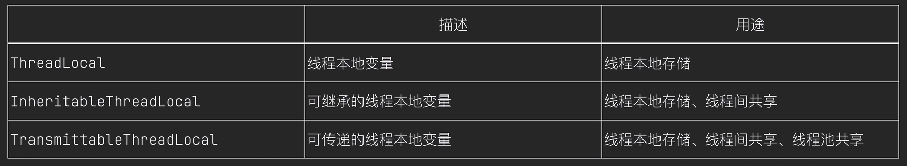

# 基础知识
# 计算机网络

## TCP/IP模型和OSI模型

OSI七层


TCP/IP四层: 应用层、传输层、网络层、网络接口层


## 从输入URL到页面展示发生了什么

1. DNS解析，域名->IP地址
2. TCP连接
3. 发送HTTP请求，Get、Post
4. 对方响应你的请求

`GET` 是最常用的 HTTP 方法. 常用于获取服务器上的某个资源,

`POST` 多用于提交用户输入的数据给服务器(例如登陆页面), 或者长传文件.

## HTTP请求报文和响应报文是怎样的

请求报文：请求头+请求体

请求头包含：目标地址端口、浏览器类型、

## HTTP请求方式有哪些

## GET请求和POST请求的区别

## **HTTP请求中常见的状态码**

1**：服务器收到请求，需要请求者进一步操作

**2\**：请求成功，如200**

**3\**：重定向**，资源被转移到其它URL了

**4\**：客户端错误**，请求语法错误或没有找到相应资源

**5\**：服务端错误**，server error

301：资源(网页等)被永久转移到其它URL，返回值中包含新的url，浏览器会自动定向到新的url

302：临时转移，客户端应访问原有URL

304：Not Modified，指定日期后未修改，不返回资源

**403**：服务器拒绝执行请求

**404**：请求的资源(网页等)不存在

**500**：内部服务器错误

## 什么是强缓存和协商缓存

**强缓存**：客户端在没有向服务器发送请求的情况下，直接从本地缓存中获取资源。

HTTP 1.0中使用的头字段，它指定了一个日期/时间，告诉浏览器在这个时间点之前可以直接使用缓存的资源。这里有一个巨大的漏洞：“如果我本地时间不准咋办？”所以目前已经被废弃了。

**协商缓存**:强缓存失效时，浏览器会发送请求到服务器，通过ETag或Last-Modified等HTTP响应头与服务器进行验证，以确定资源是否被修改。

## ❗HTTP1.0和HTTP1.1的区别（KHR）

1. HTTP 1.1支持**长连接（Keep-Alive机制）**，HTTP的Keep-Alive是一种HTTP头字段，用于告知服务器或客户端，在发送完当前响应后，不要关闭底层的TCP连接。使用Keep-Alive可以减少每次请求都需要重新建立TCP连接的开销，从而提高效率。
2. HTTP 1.1增加**host**字段（请求的主机名）：HTTP1.0认为一个IP只对应一个域名，现在一个ip地址可以对应多个域名通过不同的Host区分是哪个站点
3. 增加**Request**方法、、
4. 注意：**HTTP1.1** 不支持HTTPS

HTTP1.0定义了三种请求方法： GET, POST 和 HEAD方法。

HTTP1.1新增了五种请求方法：OPTIONS, PUT, DELETE, TRACE 和 CONNECT 方法。

## ❗HTTP2.0与HTTP1.1的区别（多二送头）

1. 多路复用：多个请求共用一个TCP连接
2. 二进制格式：将 HTTP 报文拆分为更小的单元进行传输，从而提高传输效率。
3. 服务器推送：服务器在收到客户端请求之后，主动推送一些客户端需要的资源，避免客户端多次发起请求，从而提高页面加载速度。
4. 头部压缩：对头部采取HPACK压缩方式，头部信息存储在一个表中，只传输索引字段而不是整个头部数据

## ❗HTTP3.0有了解过吗？（QUIC）

1. 基于QUIC的传输层协议：放弃了tcp协议而是改用了 QUIC协议，此协议基于传输层UDP协议。UDP协议无需三次握手四次挥手，所以传输速率更高。同时解决了滑动窗口机制中丢包重传导致的阻塞问题，QUIC这边采用了类似的序号重传机制，但是不会阻塞。
2. 0-RTT连接建立：对于已连接过的服务器可以在再次连接时跳过握手操作，进行数据传输
3. 连接迁移：支持快速的连接迁移，即使在网络切换或IP地址变更的情况下，连接也能够快速恢复，提高了网络的稳定性和可靠性。
4. 拥塞控制：内置了先进的拥塞控制算法，能够更好地适应网络环境的变化，提供更稳定和可靠的网络性能。

quic 基于 udp 怎么保证可靠性?：协商连接 ID, 协商出连接 ID 后，后续传输时，双方只需要固定住连接 ID，从而实现连接迁移功能。

总结：对于1.0 每个请求都需要单独的连接，导致在多个请求时存在应用层队头阻塞问题。2.0多个请求共用一个TCP连接实现多路复用提升效率，但是还是会出现TCP层的队头阻塞问题。3.0采用UDP彻底解决该问题。 

## ❗**HTTPS和HTTP有哪些区别**

https://apifox.com/apiskills/http-vs-https/

1. 加密方式：明文传输，使用TLS/SSL加密，防止拦截和篡改
2. 端口号：80 443
3. 证书：https需要SSL证书，由证书颁发机构（CA）颁发，用于验证服务器身份
4. 性能：https由于加密和解密过程造成一定的开销

SSL:安全套接字层，SSL通过互相认证、使用数字签名确保完整性

TLS:传输层安全协议，通常TLS发生在TCP三次握手之后，此时进行TLS四次握手，然后再进行HTTP通信

## HTTPS工作原理

当用户试图通过 HTTPS 访问一个网站时，用户的浏览器首先会与网站服务器建立一个“握手”过程，在这个过程中，服务器会提供其 **SSL** **证书**，该证书包含了服务器的**公钥**。浏览器通过一系列校验确保证书有效并属于真正的网站后，会生成一个**对称加密的密钥**，并用服务器的**公钥加密发送**给服务器。服务器收到之后用自己的私钥解密，获取对称加密密钥。此后，双方通过这个对称密钥进行加密通讯。

**防范中间人攻击**：数字证书+数字签名。防范中间人攻击的核心在于保证对称加密的秘钥不被中间人获取。
有两个阶段需要注意，首先要确保公钥的正确性（数字证书），然后需要确保数据传输不被篡改（数字签名）。

## TCP和UDP的区别

1. TCP面向连接（三次握手四次挥手），UDP无连接
2. TCP可靠有流量控制和拥塞控制
3. TCP一对一，UDP可以一对多、多对多

流量控制和拥塞控制二者关注点不一样：

**流量控制**：滑动窗口机制，发送方的发送窗口不能超过接收方给出的接收窗口的数值。计数器打破等待死锁。避免发的太快数据丢失。

**拥塞控制**：拥塞窗口，大小取决于网络拥塞程度。四种控制算法，拥塞避免(congestion avoidance)、慢开始(slow-start)、快重传(fast retransmit)和快恢复(fast recovery)，前两个算法应对拥塞，后两个应对丢失

## TCP连接如何确保可靠性

1. 三次握手四次挥手建立可靠连接
2. 序列号确保到达顺序、超时重传保障不丢包
3. 滑动窗口确保流量控制
4. 拥塞窗口保障拥塞控制
5. 校验传输错误

## UDP怎么实现可靠传输

学习TCP

## ❗三次握手的过程，为什么是三次

哪三次：

1. A请求连接
2. B确认连接
3. A确认的确认

为什么两次不行：当第一次请求超时到达的情况下，服务器一直等待接受数据

## 四次挥手的过程，为什么是四次

哪四次：

1. A表示没有数据传输
2. B表示知道
3. B表示没有数据
4. A表示知道

## HTTP的Keep-Alive是什么？TCP的Keepalive和HTTP的Keep-Alive是一个东西吗？

HTTP的Keep-Alive是一种HTTP头字段，用于告知服务器或客户端，在发送完当前响应后，不要关闭底层的TCP连接。使用Keep-Alive可以减少每次请求都需要重新建立TCP连接的开销，从而提高效率。

TCP的Keepalive是一种机制，用于在TCP连接中检测对端是否仍然活跃。如果连接在一定时间内没有任何数据传输，发送端会定期发送探测包（通常称为"**心跳**"），以确认连接的另一端是否仍然可达。如果探测包没有得到响应，发送端可以决定关闭连接。

## DNS查询过程

1. 在本地缓存中查找
2. 向根服务器查找
3. 根服务器递归向子服务器查找

DNS的查询方式有两种，分别为递归查询（recursion）和迭代查询（iteration）。

递归查询：向域名服务器请求后，域名服务器不知道，就自己递归找，找到再返回

迭代查询：向域名服务器请求后，域名服务器不知道，就返回下一个可能知道的服务器地址让客户端自己查

## CDN是什么

Content Delivery Network  内容分发网络。

CDN 的工作原理是，当用户访问某个网站时，CDN 会根据用户的 IP 地址将请求转发到离用户最近的服务器。该服务器会将内容从源服务器中读取出来，并将其缓存到本地。下次用户访问该内容时，CDN 会直接从本地服务器中返回内容，从而减少了从源服务器中传输内容所需的时间。

简单来说就是向服务器群中离自己最近的服务器请求数据。

## Cookie和Session:是什么？有什么区别？

二者都是记录用户信息的，不同点在于储存位置。

1.  当用户访问 web 页面时，他的名字可以记录在 cookie 中,cookie保存在客户端本地
2. 在用户下一次访问该页面时，可以在 cookie 中读取用户访问记录
3. Cookie 只能存字符串，如下

>  username=John Doe

4. 当浏览器从服务器上请求 web 页面时， 属于该页面的 cookie 会被添加到该请求中。服务端通过这种方式来获取用户的信息。

Session是另一种记录浏览器状态的机制，Cookie保存在浏览器中，Session保存在服务器中。

1. 用户访问服务器的时候，服务器把用户信息存在服务器中
2. Session可以存储对象，而Cookie只能存储字符串。

如果禁用了cookie怎么办？URL地址重写机制，如果不支持cookie就把Session中的信息加到url里面重写。

# 操作系统

## ❗虚拟内存

虚拟内存目的是提高内存利用率。通过页表映射虚拟地址和实际地址，让内存看起来比实际更大。一般会只将程序的一部分装入内存，而将其他部分留在外存，需要的时候再调入内存。

**分页（Paging）**：虚拟内存中的页（Page）和物理内存中的页框（Page Frame）进行映射，并根据需要在物理内存和磁盘之间来回调度页。

**页表（Page Table）**：操作系统通过页表来跟踪虚拟内存页与物理内存页框的映射关系。

这时候会有一个页表维系物理地址和虚拟地址的联系，如果要访问的页面不在物理内存里面就会触发缺页中断，交换页面。

## ❗页面置换算法

**FIFO（先进先出）**：最先调入内存的页面最先被替换。

**LRU（最近最少使用）**：最久未被访问的页面优先被替换。

**LFU（最少使用）**：根据页面被访问的频率进行置换。

LRU的实现可以采用链表和hashmap：当需要插入新的数据项的时候，如果新数据项在链表中存在（一般称为命中），则把该节点移到链表头部，如果不存在，则新建一个节点，放到链表头部，若缓存满了，则把链表最后一个节点删除即可。在访问数据的时候，如果数据项在链表中存在，则把该节点移到链表头部，否则返回-1。这样一来在链表尾部的节点就是最近最久未访问的数据项。

## 内存映射

就是将实际地址的内容映射到虚拟地址里面，会按需加载，并不会一次性加载全部

### ❗什么是死锁，如何预防死锁？

并发环境下，多个进程各自持有对方需要的进程，等待对方释放而永远等不到的情况。

预防方式：破坏四个必要条件

1. 互斥：SPOOLing技术将互斥资源改为可以共享使用
2. 不可剥夺：主动释放、强行剥夺
3. 请求和保持：一次性请求所有需要的资源
4. 循环等待：给资源编号，必须按照顺序请求资源

**银行家算法**：在进程提出资源申请时，先预判此次分配是否会导致系统进入不安全状态（手上的资源再分配出去能有路径可以打通请求链）。如果会进入不安全状态，就暂时不答应这次请求，让该进程先阻塞等待

## 进程和线程的区别

进程是资源分配的基本单位，多个进程交替运行需要进行调度。线程是CPU调度的基本单位 ，在每个时间片中只有一个线程执行

一个进程里面可以有多个线程

线程没有自己的资源，它与同属一个进程的其它线程共享进程所拥有的全部资源。

## 并行和并发有什么区别

并行：互不影响共同执行

并发：互相影响，通过时间片调度共同执行

## 解释一下用户态和内核态

用户态和内核态是两种运行级别，分别代表不同的特权级别，3级特权以上是用户态，0级特权上是内核态。

进程大部分都是运行在用户态的，当需要访问内核数据的时候就需要切到内核态运行

切换的方式可以是：系统调用（操作系统的服务程序），异常中断（内核处理中断）

不同进程之间内核空间共享，用户空间隔离，Binder通信

## 👍进程调度算法你了解多少

1. 先来先服务：非剥夺方式
2. 优先级调度：非剥夺方式/剥夺方式
3. 时间片轮转：
4. 短进程优先：非剥夺方式
5. 最短剩余时间优先：剥夺方式的最短进程优先
6. 最高响应比优先：优先数=（等待时间+要求的服务时间）/要求的服务时间，非剥夺，避免饥饿
7. 多级反馈队列：拥有多个级别的队列，执行完一个级别的队列之后才会执行下一个级别。进程来的时候先放一级队列，在规定的时间片内没有执行完毕则会放到下一级队列。

## 进程间有哪些通信方式

进程间通信(IPC）

Binder、 AIDL

管道：匿名/具名，半双工的（即数据只能在一个方向上流动），具有固定的读端和写端

消息队列：消息的链接表，存放在内核中

信号量：计数器，用于实现进程间的互斥与同步

共享内存：信号量+共享内存通常结合在一起使用

**Socket**：基于TCP/IP协议栈的应用层协议，提供了一组API（应用程序接口），允许不同的进程在不同计算机之间进行通信。**本身不是协议，是api接口**

**Streams**：全双工管道

最后两个支持不同主机上的两个进程通信。

## 解释一下进程同步和互斥，以及如何实现进程同步和互斥

同步：进程之间按照顺序有序的访问公共资源

互斥：进程之间不能同时访问同一个共享资源。

## 👍什么是死锁，如何预防死锁？

并发环境下，多个进程各自持有对方需要的资源，等待对方释放而永远等不到的情况。

预防方式：破坏四个必要条件

1. 互斥：SPOOLing技术将互斥资源改为可以共享使用
2. 不可剥夺：主动释放、强行剥夺
3. 请求和保持：一次性请求所有需要的资源
4. 循环等待：给资源编号，必须按照顺序请求资源

银行家算法：在进程提出资源申请时，先预判此次分配是否会导致系统进入不安全状态（手上的资源再分配出去能有路径可以打通请求链）。如果会进入不安全状态，就暂时不答应这次请求，让该进程先阻塞等待

## 介绍一下几种典型的锁

Android中共有21种，请看“下面的Java部分八股文”

## 你知道的线程同步的方式有那些？

1、临界区：多线程的串行化来访问公共资源或一段代码，在任意时刻只允许一个线程对共享资源进行访问

2、互斥对象：互斥对象和临界区很像，采用互斥对象机制，只有拥有互斥对象的线程才有访问公共资源的权限。因为只有一个互斥对象，所以同时也只有一个进程来访问共享资源。

3、信号量：PV操作

4、事件对象：后进程需要等待前进程将事件对象设置为有信号（可以访问）才会访问数据。由前进程创建事件对象，后进程监听事件对象状态。

## 熟悉哪些Linux命令

文件操作、目录权限、grep 、find

## 如何查看某个端口有没有被占用

~~~
Linux ： netstat -tulpn | grep 8080

Windows： netstat  -ano | findstr 8080
~~~

## 说-下select、poll、epoll

select、poll 和 epoll 是三种用于多路复用 I/O 的机制，主要用于高效地管理多个文件描述符（如套接字）上的 I/O 操作。它们都允许一个进程在等待多个文件描述符的事件（如可读、可写或错误）时不阻塞，但它们的实现和性能特性有所不同。

# 数据库

一条SQL查询语句是如何执行的？

数据库的事务隔离级别有哪些？

事务的四大特性有哪些？

MySQL的执行引擎有哪些？

MySQL为什么使用B+树来作索引

说一下索引失效的场景？

undo log、redo log、binlog有什么用？

什么是慢查询？原因是什么？可以怎么优化？

MySQL和Redis的区别？

Redis有什么优缺点？为什么用Redis查询会比较快

Redis的数据类型有那些？

Redis是单线程的还是多线程的，为什么？

Redis持久化机制有哪些

缓存雪崩、击穿、穿透和解决办法

如何保证数据库和缓存的一致性


# Java

### 注解

注解是元数据的一种形式，按照我的理解就是一种提示和规则，有的也具有一些功能。
比如最常见的@Override代表重写，可以自动检测避免我们错误的重写方法。@NonNull帮助避免空指针异常。比如JetpackCompose中的@Composable注解，表示这是可组合函数。

### 泛型

泛型就是可以不指定具体的数据类型，避免了类型转换的错误并且可以让方法传入多种不同类型的参数实现复用。
特别是在子类对象要放到父类集合中的这种场景下，需要用到泛型的协变和逆变。**协变规定上界，逆变规定下界**。**协变只读不写，逆变只写不读**。

### 反射

反射就是获取内存中的Class类对象动态创建类的实例，获取相关的属性和方法，一般用于获取一些隐藏的API。
这个Class对象是类加载器加载字节码文件转换到JVM里面的，每一个类都有关联的Class对象，这个对象里面包含了类的名称，方法，字段等。
比如在读取安卓内部存储或者U盘中的文件的时候就可以用反射调用StorageManager 类中的 getVolumePaths() 方法，返回储存卷的路径。

java中的获取方式：

1. 类名.class
2. 对象.getClass方法
3. val volumeInfoClass = Class.forName("android.os.storage.VolumeInfo")

在kotlin中ClassName::class的写法非常常见

```Java
val volumeInfoClass = Class.forName("android.os.storage.VolumeInfo")//类名获取类
val getVolumesMethod = StorageManager::class.java.getMethod("getVolumes")//方法名获取方法
val isMountedReadableMethod = volumeInfoClass.getMethod("isMountedReadable")
val getTypeMethod = volumeInfoClass.getMethod("getType")
val volumes = getVolumesMethod.invoke(storageManager) as List<*>//使用方法
```

比如这几句就是通过反射获取到类对象和方法

获取到方法之后可以通过`val volumes = getVolumesMethod.**invoke**(storageManager) as List<*>`的方式调用

### 接口和抽象类的区别

接口：静态成员变量、 抽象方法

抽象类：成员变量、抽象非抽象方法、构造函数

一个类可以实现多个接口，但是只能继承一个类。

如果子类实现了所有的抽象方法，就可以被实例化。如果没有实现所有抽象方法，子类需要被声明为抽象类。

### hashCode()与equals()之间的区别

比较哈希值相等不一定代表这两个对象就一定相等。

所以在⽐较两个对象时，可以先根据hashCode先⽐较⼀下，再使用eauals比较

### String、StringBuffer、StringBuilder的区别

1. String是不可变的，如果尝试去修改，会新⽣成⼀个字符串对象，当对字符串进行修改的时候，需要使用 StringBuffer 和 StringBuilder 类。
2. **StringBuffer**是**线程安全**的，内部方法都被synchronized关键字修饰。StringBuilder是线程不安全的，所以在单线程环境下StringBuilder效率会更⾼
3. String的最大长度：String的lenth值返回的是int类型，最大长度是int类型的最大值：2^31 - 1。String底层是通过char数组实现的，char使用UTF16的方式编码，一个char占用两个字节。因此最大占用内存为(2^31 - 1) * 16bit ，也就是说最大字符串占用内存空间约等于4GB。但是常量池对String的长度是有限制的，将数组的最大长度限制到了65534。总结：第一，在编译期字符串的长度不能超过65535 -1 ；第二，在运行期，字符串的长度不能超过2^31-1，占用内存（4GB）不能超过虚拟机所分配的最大内存。

问的时候就直接回答65534，是JVM规定限制的。

https://cloud.tencent.com/developer/article/1913509

### ==和equals⽅法的区别

● ==(值比较)：如果是基本数据类型，⽐较是值，如果是引⽤类型，⽐较的是引⽤地址

● equals（引用比较）：⽤来判断两个**对象**是否相等。具体看各个类重写equals⽅法之后的⽐较逻辑，⽐如String类，虽然是引⽤类型，但是

举例：String类中重写了equals⽅法，⽅法内部⽐较的是字符串中的各个字符是否全部相等。而使用== 比较的就是两个String对象是不是在常量池中是同一个对象

### ArrayList和LinkedList的区别

1. ArrayList 基于**数组**;LinkedList基于**链表**
2. ArrayList 连续**内存**存储，适合**下标访问**;LinkedList**存储在分散的内存**中，适合做数据插入及删除操作，不适合查询
3. ArrayList 的扩容需要复制原数组到新数组，LinkedList不需要扩容
4. 另外ArrayLista和LinkedList都实现了List接口，但是LinkedListi还额外实现了Dequei接口，所以LinkedListi还可以当做队列来使用

线程安全的ArrayList：CopyOnWriteArrayList 、 Vector

Vector和CopyOnWriteArrayList一样都是线程安全的动态数组，不同的是一个是通过读写锁实现的，一个是直接用synchronized关键字对部分方法进行同步，高并发的情况下Vector性能不好。但是CopyOnWriteArrayList写操作更耗时，因为要赋值数组。

### **CopyOnWriteArrayList原理**

ArrayList是线程不安全的，可能出现两个添加操作重复的情况，而CopyOnWriteArrayList的add方法使用了**读写锁**，是**线程安全**的。

1. 首先CopyOnWriteArrayList内部也是用过数组来实现的，在向CopyOnWriteArrayListi添加元素时，会复制一个新的数组，**写操作在新数组上进行，读操作在原数组上进行**
2. 并且，**写操作会加锁**，防止出现并发写入丢失数据的问题
3. 写操作结束之后会把原数组指向新数组
4. CopyOnWriteArrayList允许在写操作时来读取数据，大大提高了读的性能，因此适合读多写少的应用场景，但是CopyOnWriteArrayList会比较占**内存**，同时可能读到的数据不是实时最新的数据，所以不适合实时性要求很高的场景


### hashMAP

1.  **基于Map接口**实现的一种**键-值对**的存储结构
2. 允许**null值**，最多只允许一条记录的键key为**null**，同时非有序，非同步(即**线程不安全**)。
3. HashMap的底层实现是**数组** + **链表** + **红黑树** （JDK1.8增加了红黑树部分）。**链表长度大于8时采用红黑树**
4. 它存储和查找数据时，是根据键key的**hashCode** 的值计算出具体的**存储位置**。如果位置相同就使用放在这个位置的链表的头部。HashMap HashMap增删改查等常规操作都有不错的执行效率，是ArrayList和LinkedList 等数据结构的一种折中实现。 
5. **扩容：达到扩容阈值时，再建一个数组大小为原来两倍，再挪进来重新计算位置**
6. 计算位置的方法大致类似于将hash值根据数组大小取余，实际上的实现是位算法。

红黑二叉树：便于更好的检索，在链表大小大于8的时候就会转为红黑树存储。红黑树是近似平衡的二叉树，具有优秀的检索性能的同时，插入和删除效率还略高于平衡二叉树。红黑树的相邻节点是红黑相间的。

线程安全的hashMap：ConcurrentHashMap 、 hashtable;

其他的hashMap:LinkedHashMap,基于 HashMap 的实现的,链表和红黑树的节点多维持了一个前驱节点指针和后驱节点指针。也就是哈希表+双向链表。解决了 HashMap 无法顺序访问的和保持插入顺序的问题。

### hashmap和hashtable区别

HashMap和Hashtable都是基于哈希表实现的Map接口的实现类，HashMap底层采用数组+链表/红黑树的数据结构实现，负载因子为0.75,容量和负载因子的乘积大于元素个数时就需要进行扩容操作。

HashMap不是线程安全的类，Hashtable是线程安全的类，

性能上 HashMap采用链表和红黑树的数据结构，可以更好地处理哈希冲突，Hashtable没有使用红黑树解决哈希冲突，而且所有方法都加了同步锁，相对于HashMap而言，Hashtable的效率比较低。

### concurrentHashMap 如何保证线程安全

https://blog.csdn.net/gupaoedu_tom/article/details/124449788

1.8之前采用分段锁，将hash表划分为多个Segment，每一个Segment就好比一个自治区，读写操作高度自治，Segment之间互不影响。1.8之后采用CAS+Synchronized保证线程安全。

CAS：基于乐观锁的操作，假定读多写少，写操作进行加锁，造成ABA问题（t2线程先将A改成B，再改回A，此时t1线程以为没人修改过）

### 优先队列

基于最小堆，也就是父节点的值总是小于或等于其子节点的值。在插入节点的时候上浮或者下潜到合适的位置，删除的时候删除根节点。

### Jdk1.7到Jdk1.8 HashMap 发⽣了什么变化(底层)?

1. 1.7中底层是数组+链表，1.8中底层是数组+链表+红⿊树，加红⿊树的⽬的是提⾼HashMap插⼊和查询整体效率
2. 1.7中链表插⼊使⽤的是**头插法**，1.8中链表插⼊使⽤的是**尾插法**，因为1.8中插⼊key和value时需要判断链表元素个数，所以需要遍历链表统计链表元素个数，所以正好就直接使⽤尾插法
3. 1.7中**哈希算法**⽐较复杂，存在各种右移与异或运算，1.8中进⾏了**简化**，因为复杂的哈希算法的⽬的就是提⾼散列性，来提供HashMap的整体效率，⽽1.8中新增了红⿊树，所以可以适当的简化哈希算法，节省CPU资源

### 深拷贝和浅拷贝

深拷⻉和浅拷⻉就是指**对象的拷⻉**，⼀个对象中存在两种类型的属性，⼀种是基本数据类型，⼀种是实例对象的引⽤。

1. 浅拷⻉是指，只会拷⻉基本**数据类型**的值，以及**对象引用地址**，，也就是**浅拷⻉出来的对象，内部的类属性指向的是同⼀个对象**
2. 深拷⻉是指，既会拷⻉基本数据类型的值，也会针对实例对象的引⽤地址所指向的**对象**进⾏复制，**深拷⻉出来的对象，内部的属性指向的不是同⼀个对象**

## JAVA内存区域

结合线程的知识来学习内存区域

- 线程私有的：①程序计数器②虚拟机栈③本地方法栈
- 线程共享的：①堆②方法区


程序计数器：每个线程一个，指向当前字节码指令地址。通过改变PC来依次读取指令，线程切换回来的时候才知道自己执行到哪里了。

虚拟机栈：存放**方法的**局部变量、对象的引用、操作数栈、动态链接等信息

本地方法栈：存储**本地方法**的局部变量、操作数栈、动态链接等信息

堆：用于存储**对象实例**和**数组等动态分配的内存**，动态分配不适合用栈

方法区：存放**类信息**、**常量池**、**静态变量**

## 对象创建的过程

1. **类加载：**遇到 new 指令时，首先检查**常量池**中有没有这个类的符号引用，如果没有，执行相应的类加载。
2. **分配内存**：指针碰撞法、空闲列表法（多个线程同时分配内存的时候容易出现线程安全问题）
3. **初始化0值+ 填充对象头**：内存空间分配完成后会初始化为 0(不包括对象头) + **填充对象头**，把对象是哪个类的实例、如何才能找到类的元数据信息、对象的哈希码、对象的 GC 分代年龄等信息存入对象头。
4. **init方法**：执行 init 方法是对象创建的最后一步，虚拟机会给对象的成员变量设置用户指定的初始值，并且会执行构造方法等。

对象的内存布局：分为 3 块区域：**对象头**、**实例数据**和**对齐填充**

对象头：哈希码、GC标记、GC次数

实例数据：各种类型的字段内容

对齐填充：不是必然需要，主要是占位，保证对象大小是某个字节的整数倍

对象的访问定位：

1. 使用对象时，通过栈上的 reference 数据来操作堆上的具体对象。
2. 通过句柄访问，Java 堆中会分配一块内存作为句柄池。reference 存储的是句柄地址。


对象实例数据（堆）:对象中各个实例字段的数据

对象类型数据（方法区）：对象的类型、父类、实现的接口、方法等

## GC回收

首先垃圾回收就是对**堆**里面，不需要用到的垃圾数据（**对象**）进行回收。

**垃圾回收**判断：使用了**可达性算法**。

**可达性算法**：从GC roots 开始遍历查找引用的对象，能够到达的都是活的，不可到达的对象要被回收。然后会对要回收的对象进行两次标记，**第一次标记**检查**finalize** **() 方法**,如果需要执行就会放到低优先级队列里面去执行，如果这个方法没有被重写而且也执行过了那么就可以回收了。**第二次标记**会在低优先级队列中再检查一遍，如果他在 finalize () 方法中重新又可达了，那么就移出队列，否则就要被回收。

**垃圾回收**算法：

1. **标记-清除算法**：
   1. 标记阶段：把垃圾内存标记出来
   2. 清除阶段：直接将垃圾内存回收。
   3. 这种算法是⽐较简单的，但是有个很严重的问题，就是会**产⽣⼤量的内存碎⽚**。
2. **复制算法**：为了解决标记清除算法的内存碎⽚问题，就产⽣了复制算法。复制算法将内存分为⼤⼩

相等的两半，每次只使⽤其中⼀半。**垃圾回收时，将当前这⼀块的存活对象全部拷⻉到另⼀半，然**

**后当前这⼀半内存就可以直接清除。**这种算法没有内存碎⽚，但是他的问题就在于**浪费空间**。⽽

且，他的效率跟存活对象的个数有关。

1. **标记-整理算法**：为了解决复制算法的缺陷，就提出了标记压缩算法。这种算法在标记阶段跟标记清

除算法是⼀样的，但是在完成标记之后，不是直接清理垃圾内存，⽽是将存**活对象往⼀端移动，然**

**后将边界以外的所有内存直接清除**。 一些概念：

新生代：新生成的对象（生命周期较短）——**复制算法**

新生代内存分配一块**较大的 Eden 空间和两块较小的 Survivor** 空间，每次使用的时候总会空出一个**Survivor** 空间，好让gc回收的时候可以使用复制算法。如果另一块 `Survivor` 空间没有足够内存来存放上一次新生代收集下来的存活对象，那么这些对象则直接进入老年代。

老年代：经过多次gc回收还在的（生命周期较长）—— **标记-清除** 或者 **标记-整理** 算法

## 四种引用

https://blog.csdn.net/zhaohongfei_358/article/details/134991715

- 强引用：只要在，哪怕对象不用也不能被回收。比如：赋值、ThreadLocalMap的value
- 软引用：会将对象保留到将要发生内存溢出异常前。
- 弱引用：下一次垃圾回收就可以走了。比如：ThreadLocalMap的key
- 虚引用：是最弱的一种引用关系。唯一目的只是为了能在这个对象被收集器回收时收到一个系统通知。

为什么ThreadLocalMap 的 key 是弱引用，而 value 是强引用？

ThreadLocalMap 的 key 是弱引用，是为了部分避免内存泄漏的问题。当 ThreadLocal 对象被回收时，如果ThreadLocalMap 强引用它（由于ThreadLocalMap 随线程一直存在），那么它就永远不会被回收，如果是弱引用就不会影响ThreadLocal 的回收  

而 ThreadLocalMap 的 value 是强引用，是因为 不知道。

**我们可以使用弱引用+引用队列的方式判断一个对象有没有被GC回收，因为被GC回收了对象之后，弱引用就会被放到引用队列里面，此时引用队列队头能取出这个弱引用。比如在Glide的活动缓存中就使用了这种方式**

虚引用必须配合引用队列使用，否则没有意义。其用法也是判断GC回收

## 什么是STW？

STW: Stop-The-World，是在垃圾回收算法执⾏过程当中，需要将JVM内存冻结的⼀种状态。在STW

状态下，JAVA的所有线程都是停⽌执⾏的-GC线程除外，native⽅法可以执⾏，但是，不能与JVM交

互。GC各种算法优化的重点，就是减少STW，同时这也是JVM调优的重点。

## **类加载过程** 

类的加载指的是将类的.class 文件中的二进制数据读入到内存中，将其放在运行时数据区的方法区内，然后在堆区创建一个 java.lang.Class 对象，用来封装类在方法区内的数据结构。

类从被加载到虚拟机内存中开始，到卸载出内存为止，它的整个生命周期包括：加载、验证、准备、解析、初始化、使用和卸载七个阶段。

类加载的过程包括了加载、验证、准备、解析、初始化五个阶段。

加载：

（1）通过一个类的全限定名来获取其定义的二进制字节流

（2）将这个字节流所代表的的静态存储结构转化为方法区的运行时数据结构

（3）在堆中生成一个代表这个类的 Class 对象，作为方法区中这些数据的访问

入口

验证：是确保被加载的类的正确性

准备：为类变量分配内存并设置初始值

（1）类变量（static）会分配内存，但是实例变量不会，实例变量主要随着对象的实例化一块分配到 java 堆中

解析：虚拟机将常量池中的符号引用转化为直接引用的过程

初始化：就是执行类构造器< clinit >()方法的过程

## 类加载器：

 JDK⾃带有三个类加载器：bootstrap ClassLoader、ExtClassLoader、AppClassLoader。

● BootStrapClassLoader(**启动类加载器**)是ExtClassLoader的⽗类加载器，默认负责加载%JAVA_HOME%lib下的

jar包和class⽂件。

● ExtClassLoader(**扩展类加载器**)是AppClassLoader的⽗类加载器，负责加载%JAVA_HOME%/lib/ext⽂件夹下的

jar包和class类。

● AppClassLoader(**应用程序类加载器**) 是⾃定义类加载器的⽗类，负责加载classpath下的类⽂件。

## 类加载器双亲委派模型

类加载器在进行类加载的时候，它首先不会自己去尝试加载这个类，而是把这个请求委派给父类加载器去完成（调用父加载器 loadClass()方法来加载类）。如果父类加载器无法加载，再由当前类加载器自己进行加载。避免重复加载。也有需要打破的时候，比如Tomcat需要

## ThreadLoacal的底层原理

1. ThreadLocal是java中所提供的线程本地存储机制，可以利用该机制**将数据缓存在某个线程内部**，该线程可以在任意时刻、任意方法中获取缓存的数据
2. ThreadLocal底层是通过**ThreadLocalMap**来实现的，每个Thread对象（注意不是ThreadLocal)对象）中都存在一个ThreadLocalMap,**Map的key为ThreadLocal对象，Map的value为需要缓存的值**
3. 如果**在线程池中使用**ThreadLocal会造成内存泄漏，因为线程池中的线程会重复利用，这时ThreadLocal对象被回收了，但是Entry如果没有手动回收就会出现很多entry(null,value)
4. ThreadLocal主要是为了隔离多个线程对数据的数据共享，多个线程都需要创建某个变量，但是获取的变量的值又不一样。还类似于全局变量，让保存的值在不同的方法中都能获取到。


使用场景：

数据库连接，每一个线程保存自己connection。

## 对守护线程的理解

线程分为⽤户线程和守护线程，⽤户线程就是普通线程，守护线程就是JVM的后台线程，⽐如垃圾回收

主线程就是⼀个守护线程，守护线程会在其他普通线程都停⽌运⾏之后⾃动关闭。我们可以通过设置thread.setDaemon(true)来把⼀个线程设置为守护线程。

## 保证线程安全——加锁

怎么保证线程安全？加锁：1、VM提供的锁，也就是Synchronized关键字。2、JDK提供的各种锁Lock。

Sychronized

1. 偏向锁：在锁对象的对象头中记录一下当前获取到该锁的线程D,该线程下次如果又来获取该锁就可以直接获取到了
2. 轻量级锁：由偏向锁升级而来，当一个线程获取到锁后，此时这把锁是偏向锁，此时如果有第二个线程来竞争锁，偏向锁就会升级为轻量级锁之所以叫轻量级锁，是为了和重量级锁区分开来，轻量级锁底层是通过自旋来实现的，并不会阻塞线程
3. 如果自旋次数过多仍然没有获取到锁，则会升级为重量级锁，重量级锁会导致线程阻塞
4. 自旋锁：自旋锁就是线程在获取锁的过程中，不会去阻塞线程，也就无所谓唤醒线程，阻塞和唤醒这两个步骤都是需要操作系统去进行的，比较消耗时间，自旋锁是线程通过C八S获取预期的一个标记，如果没有获取到，则继续循环获取，如果获取到了则表示获取到了锁，这个过程线程直在运行中，相对而言没有使用太多的操作系统资源，比较轻量。

## 进程

### 进程和线程的区别   

进程的概念比线程大，一个进程包含多线程，**线程没有自己的资源，它与同属一个进程的其它线程共享进程所拥有的全部资源**。一个线程可以创建和撤消另一个线程，同一进程中的多个线程之间可以并发执行。

因此才有说法

- 进程是资源分配的最小单位
- 线程是cpu调度的最小单位

正是由于线程之间的资源共享才会出现共同使用同一资源的线程不安全的现象

### 死锁的解决

预防方式：破坏四个必要条件

1. 互斥：SPOOLing技术将互斥资源改为可以共享使用
2. 不可剥夺：主动释放、强行剥夺
3. 请求和保持：一次性请求所有需要的资源
4. 循环等待：给资源编号，必须按照顺序请求资源

银行家算法：在进程提出资源申请时，先预判此次分配是否会导致系统进入不安全状态（手上的资源再分配出去能有路径可以打通请求链）。如果会进入不安全状态，就暂时不答应这次请求，让该进程先阻塞等待

### ❗创建进程的方式

（1）使用Runtime的exec()方法 

（2）使用ProcessBuilder的start()方法 

### ❗什么时候需要用到多进程？—— APP的启动

多进程的优点：

1. 数据是分开的，就没有共享数据这一说了，每个进程互相独立，另一个进程崩溃了也影响不到我这个进程
2. 减少线程加锁解锁的影响。但是大量数据的跨进程传输就不好办了

## 线程

**线程的同步和互斥：**

同步：确保多个线程按照一定的顺序访问共享资源。 互斥：确保多个线程不能同时访问同一个共享资源。

**串行、并行、并发的区别：**

线程是并发执行的

串行：在时间上不可能发生重叠，前一个任务没搞定，下一个任务就只能**等着**

并行：在时间上是重叠的，两个任务在同一时刻**互不干扰**的**同时**执行。

并发：允许两个任务彼此干扰。统一时间点、只有一个任务运行，**交替执行**

### **创建线程的三种方式：**


分别重写run方法，实现run方法，实现call方法

停止线程：

1. thread.interrup打上中断标记
2. 在run方法里面使用isInterrupted或者interrupted手动处理被打上中断标记时候break；


后台线程：

可以设置线程为后台线程，这样等主线程结束之后后台线程也会被杀死

**同步锁的类型：**


**线程通信：wait 和 notify，notifyall**

 wait 和slepp 的区别：


**ThreadLocal（线程本地变量）**

是操作线程数据的工具类。他的功能主要是从当前线程中存取数据，操作数据

**共享ThreadLocal（共享线程本地变量）**

当线程B由线程A创建，那么线程B就可以访问线程A的InheritableThreadLocal



### 有A,B,C三个线程，如何保证三个线程同时执行？如何在并发情况下保证三个线程依次执行？如何保证三个线程有序交错进行？

三个并发工具https://blog.csdn.net/yuming226/article/details/137023294

CountDownLatch（线程计数器）：一个线程完成任务就计数器减一，只有计数器为0 的时候前面等待的线程才被唤醒。

CylicBarrier（同步屏障）：等待所有异步任务执行完毕，才开始执行同步任务。

Semaphore（信号量）：共享资源的数量，
可以使用信号量，A线程执行完之后释放B的信号量让B执行

### 线程池的工作原理

https://blog.csdn.net/lucky_love816/article/details/138963758

一般情况是使用Executors来创建线程池，提供了四种方法来创建线程池，比如newFixedThreadPool创建固定个数的线程池。线程池发生异常的时候会终止掉该线程，创建一个新的线程在线程池里面。不会影响其他线程任务的执行。有异常的时候是无法知道哪个线程出现了异常，所以自定义线程池重写afterExecute方法捕获异常。

多线程并发频繁创造销毁线程很浪费性能，因此有了线程池。好处就是我们需要线程的时候直接复用线程池中已经存在的线程，用完了再放回去，就不用频繁创造销毁了。

创造线程池的底层是new了一个`ThreadPoolExecutor` , 当有任务的时候先建核心线程，如果核心线程满了(**核心线程数**)就把任务放到**等待队列**，如果等待队列也满了（**最大线程数 - 核心线程数**）则新建**临时线程**，临时线程也满了就出发拒绝策略了。当阻塞队列中的任务被执行完毕，并且又没有那么多新任务被提交时，临时线程就需要被回收销毁，而在被回收销毁之前等待的这段时间，就是**非核心线程的存活时间**

线程池内部是通过队列+线程实现的，当我们利⽤线程池执⾏任务时：

1. 如果 任务数量 < 核心线程数，创建/复用核心线程。
2. 如果 核心线程数 < 任务数量 (等待队列没满) ，任务放入等待队列
3. 如果 核心线程数 < 任务数量 (等待队列满)  < 最大线程数，建新(**临时线程**)来处理被添加的任务。
4. 如果 最大线程数 < 任务数量(等待队列满)，触发拒绝策略
5. 核心线程一般不会被回收，但是也不是绝对的。如果工作线程数大于核心线程数，则会根据最大存活时长取任务，一旦超时就回收，所以并没有绝对的核心线程

线程池的非核心线程如何不被回收？

1. 设置空闲时间为无限： 使用 setKeepAliveTime 方法将非核心线程的空闲时间设置为一个非常大的值（比如 Long.MAX_VALUE），这样它们在闲置时不会被回收。
2. 定期提交任务:让非核心线程一直处于工作状态

线程池的类型：

FixedThreadPool             线程数固定的线程池，只有核心线程，并且不会被回收，没有超时机制

CachedThreadPool          无界可自动回收线程池，只有非核心线程，闲置线程超过60秒自动回收

ScheduledThreadPool      周期任务线程池，核心线程数固定，非核心线程数无限制，非核心线程闲置时立刻回收

SingleThreadExecutor      单例线程池，确保所有任务在同一线程中按顺序执行

### 线程池为什么是先添加到等待列队⽽不是先创建临时线程？

线程的创建和销毁很耗费性能啊，等待的任务不对就先等着咯

补充：

## 锁

### JAVA中的21种锁

1. **乐观锁**：假定读多写少，写操作更新的时候（S）加锁，举例：**CAS**
2. 悲观锁：假定读少写多，写操作直接加锁，直到释放锁，举例：synchronized、ReentrantLock
3. 自旋锁：让线程执行一个忙循环（自旋）来等待别的线程执行完任务，举例：CAS操作中的比较操作失败后的自旋等待。
4. 可重入锁（递归锁）：任意线程在获取到锁之后能够再次获取该锁而不会被锁所阻塞。
   1.  可重入锁的原理： 通过组合自定义同步器来实现锁的获取与释放。

   2. 再次获取锁：识别获取锁的线程是否为当前占据锁的线程，如果是，则再次成功获取。获取锁后，进行计数自增，
   3. 释放锁：释放锁时，进行计数自减。
   4.  Java中的可重入锁： ReentrantLock、synchronized修饰的方法或代码段。

可重入锁的作用： 避免死锁。

1. 读写锁： 通过ReentrantReadWriteLock类来实现。为了提高性能， Java 提供了读写锁，**在读的地方使用读锁，在写的地方使用写锁，灵活控制**，如果没有写锁的情况下，读是无阻塞的，在一定程度上提高了程序的执行效率。读写锁分为读锁和写锁，多个读锁不互斥，读锁与写锁互斥，这是由 jvm 自己控制的。
2. 公平锁：公平锁是一种思想： 多个线程按照申请锁的顺序来获取锁。在并发环境中，每个线程会先查看此锁维护的等待队列，如果当前等待队列为空，则占有锁，如果等待队列不为空，则加入到等待队列的末尾，按照FIFO的原则从队列中拿到线程，然后占有锁。
3. 非公平锁：非公平锁是一种思想： 线程尝试获取锁，如果获取不到，则再采用公平锁的方式。多个线程获取锁的顺序，不是按照先到先得的顺序，有可能后申请锁的线程比先申请的线程优先获取锁。
   1. 优点： 非公平锁的性能高于公平锁。
   2. 缺点： 有可能造成线程饥饿（某个线程很长一段时间获取不到锁）
4. 共享锁：共享锁是一种思想： 可以有多个线程获取读锁，以共享的方式持有锁。和乐观锁、读写锁同义。Java中用到的共享锁： ReentrantReadWriteLock。
5. 独占锁：独占锁是一种思想： 只能有一个线程获取锁，以独占的方式持有锁。和悲观锁、互斥锁同义。Java中用到的独占锁： synchronized，ReentrantLock
6. 重量级锁 ：重量级锁是一种称谓： synchronized是通过对象内部的一个叫做监视器锁（monitor）来实现的，监视器锁本身依赖底层的操作系统的 Mutex Lock来实现。操作系统实现线程的切换需要从用户态切换到核心态，成本非常高。这种依赖于操作系统 Mutex Lock来实现的锁称为重量级锁。为了优化synchonized，引入了轻量级锁，偏向锁。Java中的重量级锁： synchronized
7. 轻量级锁：轻量级锁是**在无竞争的情况下使用CAS操作去消除同步使用的互斥量**。轻量级是相对于使用操作系统互斥量来实现的重量级锁而言的。轻量级锁在没有多线程竞争的前提下，减少传统的重量级锁使用操作系统互斥量产生的性能消耗。如果出现两条以上的线程争用同一个锁的情况，那轻量级锁将不会有效，必须膨胀为重量级锁。
8. 偏向锁： 在无竞争的情况下把整个同步都消除掉，连CAS操作都不去做了。偏是指偏心，它的意思是这个锁会偏向于第一个获得它的线程，如果在接下来的执行过程中，该锁一直没有被其他的线程获取，则持有偏向锁的线程将永远不需要再进行同步。持有偏向锁的线程以后每次进入这个锁相关的同步块时，虚拟机都可以不再进行任何同步操作（例如加锁、解锁及对Mark Word的更新操作等）。
9. **分段锁**：分段锁是一种机制： 最好的例子来说明分段锁是ConcurrentHashMap。ConcurrentHashMap原理：它内部细分了若干个小的 HashMap，称之为段(Segment)。默认情况下一个 ConcurrentHashMap 被进一步细分为 16 个段，既就是锁的并发度。如果需要在 ConcurrentHashMap 添加一项key-value，并不是将整个 HashMap 加锁，而是首先根据 hashcode 得到该key-value应该存放在哪个段中，然后对该段加锁，并完成 put 操作。在多线程环境中，如果多个线程同时进行put操作，只要被加入的key-value不存放在同一个段中，则线程间可以做到真正的并行。
10. 互斥锁 / 同步锁：同步锁与互斥锁同义，表示并发执行的多个线程，在同一时间内只允许一个线程访问共享数据。
11. 死锁 ：死锁是一种现象：如线程A持有资源x，线程B持有资源y，线程A等待线程B释放资源y，线程B等待线程A释放资源x，两个线程都不释放自己持有的资源，则两个线程都获取不到对方的资源，就会造成死锁。Java中的死锁不能自行打破，所以线程死锁后，线程不能进行响应。所以一定要注意程序的并发场景，避免造成死锁。
12. synchronized ：synchronized是Java中的关键字：用来修饰方法、对象实例。属于独占锁、悲观锁、可重入锁、非公平锁。
    1. 作用于实例方法时，锁住的是对象的实例(this)；
    2. 当作用于静态方法时，锁住的是 Class类，相当于类的一个全局锁， 会锁所有调用该方法的线程；
    3. synchronized 作用于一个非 NULL的对象实例时，锁住的是所有以该对象为锁的代码块。它有多个队列，当多个线程一起访问某个对象监视器的时候，对象监视器会将这些线程存储在不同的容器中。
    4. 每个对象都有个 monitor 对象， 加锁就是在竞争 monitor 对象，代码块加锁是在代码块前后分别加上 monitorenter 和 monitorexit 指令来实现的，方法加锁是通过一个标记位来判断的。

### synchronized 从偏向锁，轻量级锁和重量级锁升级的过程
概念：当一个线程进入 synchronized 方法或代码块时，它会尝试获取对象的锁。如果该锁没有被其他线程占用，该线程就可以进入方法或代码块并执行其中的代码。如果锁已经被其他线程占用，那么该线程就会被阻塞，直到获取到锁为止

为什么要锁升级：主要为了应对并发的情况，根据并发量去动态的调节锁的实现。随着并发量越来越多，当有很多线程去同时竞争这把锁的时候，那么就得考虑性能的问题

锁的四种实现：无锁、偏向锁、轻量级锁、重量级锁。

偏向锁：会在锁对象的对象头中记录一下当前获取到该锁的线程ID，该线程下次如果又来获取该锁就可以直接获取到了。也就是这个锁会偏向于第一个获得它的线程。
如果只有一个线程来访问这把锁，此时这把锁就是一把偏向锁。

轻量级锁：当两个或以上的线程 交替 获取锁，但并没有在对象上并发的获取锁时，偏向锁升级为轻量级锁。
轻量级锁的底层实现，是通过 CAS 的自旋方式尝试获取锁，避免阻塞线程造成的 cpu 在用户态和内核态间转换的消耗。
自旋就是让线程执行一个忙循环（自旋）来等待别的线程执行完任务

重量级锁：两个或以上线程 并发 的在同一个对象上进行同步获取时，为了避免无用自旋消耗 cpu，轻量级锁会升级成重量级锁。
比如有100个线程去获取这个锁，然后有 99 个线程在自旋的竞争这把锁，那么就很明显的浪费这个cpu的资源，此时升级到重量级锁，到内核态去实现这种互斥，是比较优的方案。
线程在竞争重量级锁时，会进入阻塞状态，操作系统会将这些线程放入一个等待队列中，并在锁可用时唤醒其中的一个线程，让其获取锁并执行临界区的代码

### Lock和synchronized的区别 

自动挡和手动挡的区别

Lock： 是Java中的接口，可重入锁、悲观锁、独占锁、互斥锁、同步锁。

1. Lock需要手动获取锁和释放锁。就好比自动挡和手动挡的区别
2. Lock 是一个接口，而 synchronized 是 Java 中的关键字， synchronized 是内置的语言实现。
3. synchronized 在发生异常时，会自动释放线程占有的锁，因此不会导致死锁现象发生；而 Lock 在发生异常时，如果没有主动通过 unLock()去释放锁，则很可能造成死锁现象，因此使用 Lock 时需要在 finally 块中释放锁。
4. Lock 可以让等待锁的线程响应中断，而 synchronized 却不行，使用 synchronized 时，等待的线程会一直等待下去，不能够响应中断。
5. 通过 Lock 可以知道有没有成功获取锁，而 synchronized 却无法办到。
6. Lock 可以通过实现读写锁提高多个线程进行读操作的效率。

### Sychronized和ReentrantLock的区别

**synchronzied、ReentrantLock、**

ReentrantLock是Java中的类 ： 继承了Lock类，可重入锁、悲观锁、独占锁、互斥锁、同步锁。

**相同点：**

1.主要解决共享变量如何安全访问的问题

2.都是可重入锁，也叫做递归锁，同一线程可以多次获得同一个锁，

3.保证了线程安全的两大特性：可见性、原子性。

**不同点：**

1.ReentrantLock 就像手动汽车，需要显示的调用lock和unlock方法， synchronized 隐式获得释放锁。

2.ReentrantLock 可响应中断， synchronized 是不可以响应中断的，ReentrantLock 为处理锁的不可用性提供了更高的灵活性

3.ReentrantLock 是 API 级别的， synchronized 是 JVM 级别的

4.ReentrantLock 可以实现公平锁、非公平锁，默认非公平锁，synchronized 是非公平锁，且不可更改。

5.ReentrantLock 通过 Condition 可以绑定多个条件

### ReentrantLock中的公平锁和非公平锁的底层实现

为什么要有非公平锁呢？当线程 A 释放锁的时候，本该轮到线程 B 苏醒获取锁，但如果此时突然有一个线程 C 插队请求这把锁，那么根据非公平的策略，会把这把锁给线程 C，这是因为唤醒线程 B 是需要很大开销的，很有可能在唤醒之前，线程 C 已经拿到了这把锁并且执行完任务释放了这把锁。

公平和非公平锁的源码都是通过AQS（抽象队列同步器）实现的，唯一的区别就在于公平锁在获取锁时多了一个限制条件：hasQueuedPredecessors() 为 false，判断在等待队列中是否已经有线程在排队了。如果是公平锁，那么一旦已经有线程在排队了，当前线程就不再尝试获取锁；对于非公平锁而言，无论是否已经有线程在排队，都会尝试获取一下锁，获取不到的话，再去排队。
有一个成员变量 state表示锁现在的状态，使用volatile修饰。

### CountDownLatch（线程计数器）和Semaphore（信号量）的区别和底层原理

信号量：就是我们熟悉的P操作和V操作，P操作代表申请资源，V操作代表释放资源，只有资源量大于0的时候才可以被申请

线程计数器：线程计数器代表着正在进行任务的进程数量。初始化值为线程的数量，每当有线程执行完任务空闲的时候就把计数器减一。当减少到足够执行下个任务的时候就开始调用线程执行下个任务。

### 谈谈你对AQS的理解，AQS如何实现可重入锁？

AQS，即AbstractQueuedSynchronizer，抽象的队列式同步器，是一个线程同步框架。AQS定义了一套多线程访问共享资源的同步器框架，许多我们使用的同步器都是基于它来实现的，如常用的ReentrantLock、Semaphore、CountDownLatch、CyclicBarrie并发类都是通过实现AQS里面的模板方法来实现内部的组件。


如果当前线程获取state同步状态失败，AQS会将该线程添加到队尾，同时阻塞当前线程，当同步状态释放时，唤醒队列头节点。

AQS核心的三个成员变量如下：

```Java
    private transient volatile Node head;//CHL队列的头部节点，延迟初始化。除了初始化，它只通过setHead()方法进行修改。如果head节点存在，head节点的waitStatus保证不会被CANCELLED
    private transient volatile Node tail;//CHL队列的尾部节点，延迟初始化。仅通过enq()方法新增等待的节点。
    private volatile int state;          //同步状态
```

我们可以看出来这三个成员变量都是使用volatile关键字来修饰的，volatile代表变量内存可见。

**volatile**关键字作用是，使系统中所有线程对该关键字修饰的变量共享可见

Volatile是怎么实现可见性的？
通常是通过**缓存一致性协议**（MESI）放到本地内存里面。并且通过**内存屏障**来保证多线程的读写不出现线程安全问题。