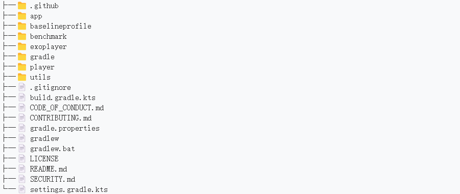
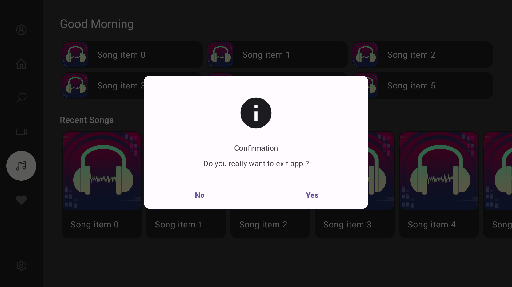
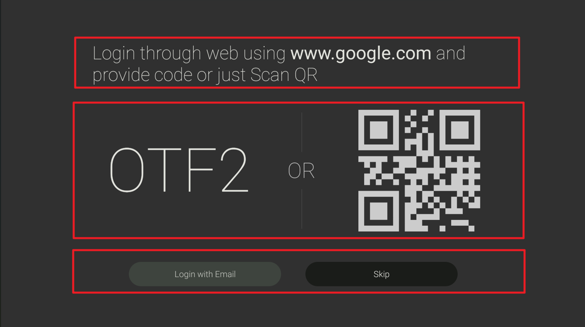
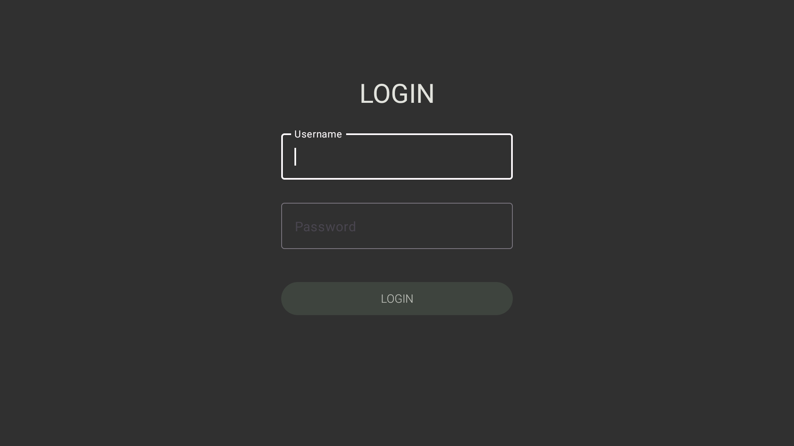
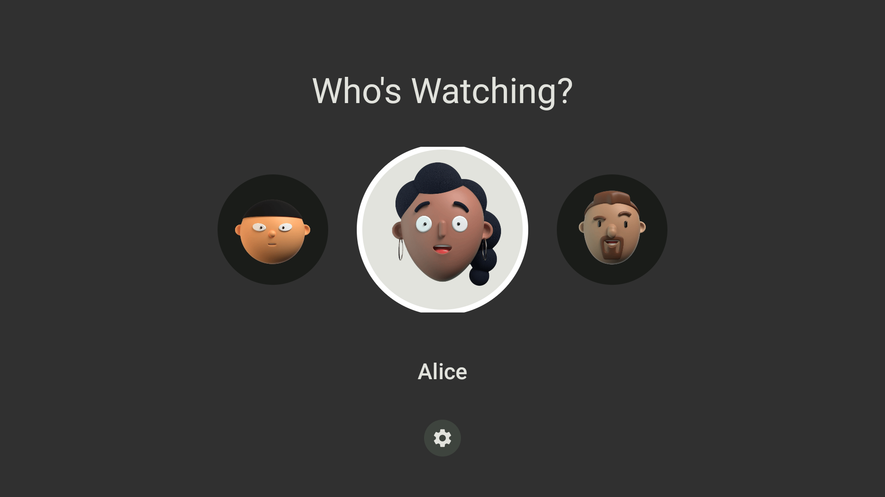
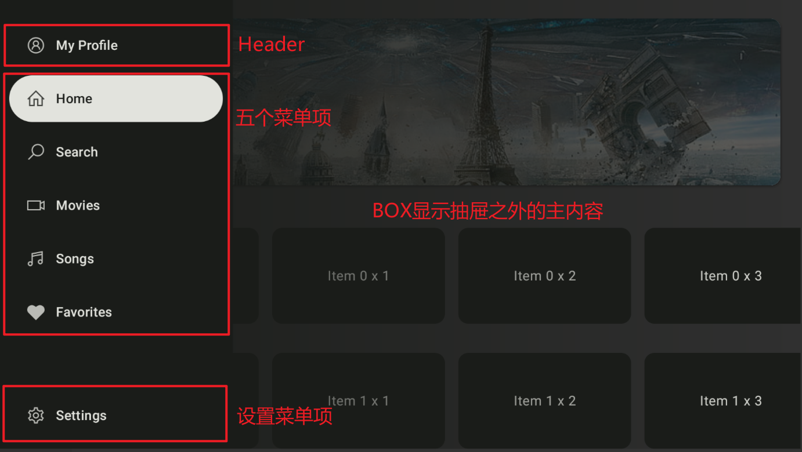
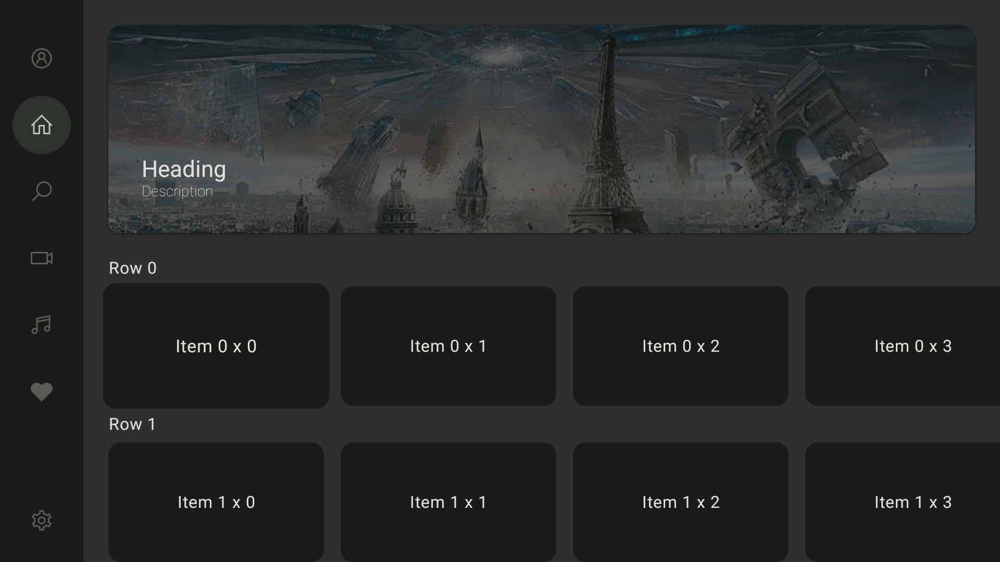
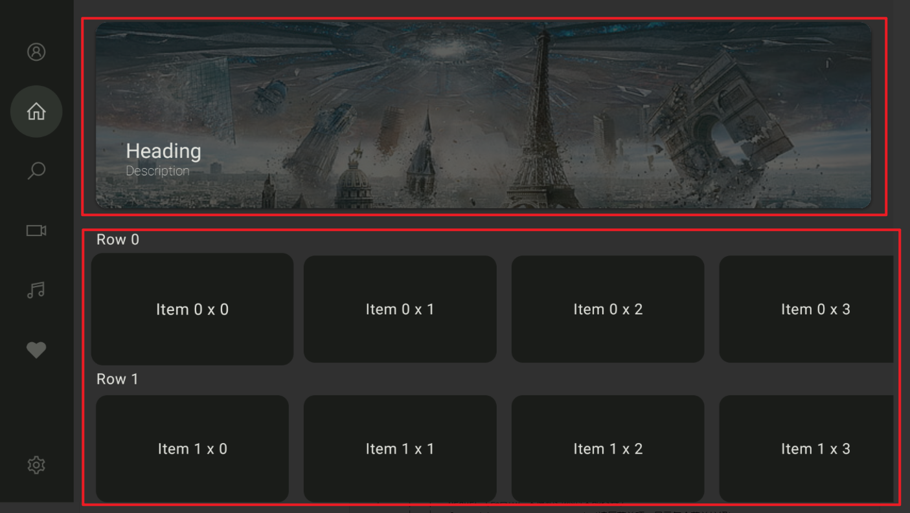
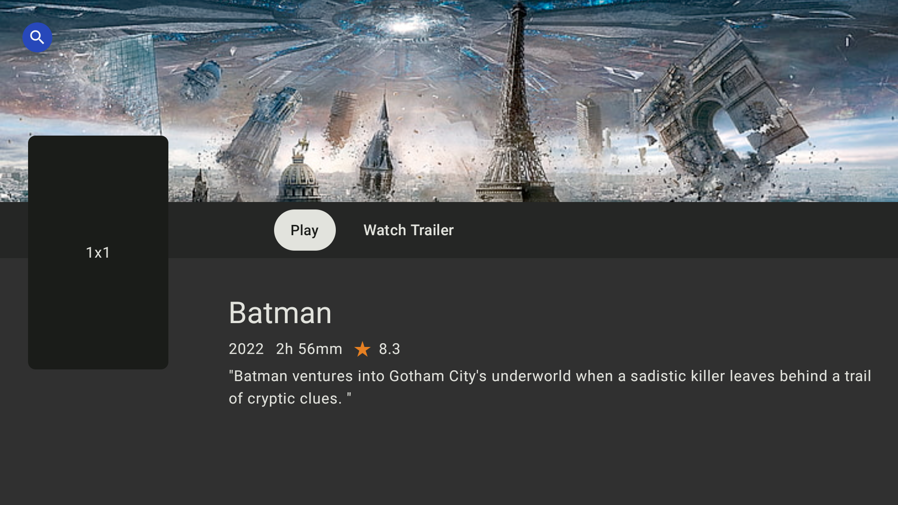

# Compose TV

本文主要介绍ComposeTv, 一个基于Google的`Jetpack Compose`技术栈，专门用于构建Android TV应用程序的开源示例项目。它展示了如何利用Compose的强大功能来设计和实现适合电视屏幕的用户界面（UI），支持用户浏览媒体内容目录、查看详细信息以及享受流畅的屏幕间过渡体验。通过这个项目，开发者可以学习到如何在电视平台上利用声明式编程模型简化UI开发，从而提升开发效率并优化用户交互。

项目地址：https://github.com/UmairKhalid786/ComposeTv

这个Demon是个很简单的Demon，有一些现成的组件可以在开发时直接使用过来。对于抽屉的实现和Navigation的使用比较有借鉴意义。

## 目录结构



其中几个主要的目录是：

**app**：程序主代码目录，也是我主要分析的代码部分

**baselineprofile和benchmark模块** ： 用于测试应用的较大用例，包括应用启动和复杂的界面操作，详情请查看：[编写 Macrobenchmark](https://developer.android.com/topic/performance/benchmarking/) 。具体的我也不了解，没仔细研究过。

**exoplayer模块**：通过封装ExoPlayer实现了`TLPlayer`接口，主要功能包括播放、暂停、停止、跳转、以及状态监听，实现了播放控制、状态监听、内存管理（通过`WeakReference`来持有上下文，防止内存泄漏）、媒体源控制（使用`ProgressiveMediaSource`来设置媒体源，支持从URI加载媒体内容）等功能。

**player**：定义了媒体播放器的状态管理和接口。PlayerState（播放器的各种状态）、PlayerStateListener（播放器状态的变化的回调）、TLPlayer（定义了媒体播放器的基本功能）

**utils**：目前里面仅仅放了一些测试tag。

我们接下来以app/目录下的代码为主介绍。

## Timber日志记录框架 - MainApp

Timber的相关介绍请参考：[深入了解 Timber：全面掌握 Android 日志记录的最佳实践](https://blog.csdn.net/weixin_37600397/article/details/140286579)

在`MainActivity`中使用了Timber日志记录框架。Timber 是一个简化 Android 日志记录的库，是对原生Log框架的封装，不再需要手动指定 TAG。通过实现自定义的 Tree, 可以创建一个 Tree 将日志记录到文件中，或将日志发送到远程服务器。还可以自定义日志格式化和日志过滤。

**代码展示：**

```JSON
// app/src/main/java/com/techlads/composetv/MainApp.kt
import timber.log.Timber

class MainApp : Application() {
    override fun onCreate() {
        super.onCreate()
        Timber.plant(Timber.DebugTree())
    }
}

// 在其他位置的使用如下
Timber.d("State $state")
```

其他推荐的日志框架还有XLog等

## 注册返回按键监听 - MainActivity

通过其他文件中自定义按键监听，然后在`MainActivity`里面使用lambda表达式传入事件的方式实现按键的监听。

注意，这是专门用来处理返回按键监听的。

**代码展示：**

```JSON
// app/src/main/java/com/techlads/composetv/MainActivity.kt
// 注册返回按钮监听，按下返回键的时候 displayDialog.value = true
// 因此如果想要对返回按钮等按钮进行特殊效果定义就可以使用这样的方式
setContent {
...
    registerOnBackPress {
        displayDialog.value = true
    }
...
}

// app/src/main/java/com/techlads/composetv/ExitAppDelegate.kt
/*
 * 自定义的函数，用来处理设备的返回按钮
 * Android 13（Tiramisu）及以上： 使用 onBackInvokedDispatcher.registerOnBackInvokedCallback 来处理返回键事件。
 * Android 13 以下： 使用 onBackPressedDispatcher.addCallback 注册返回键的回调。
 */
fun ComponentActivity.registerOnBackPress(onBackPress: () -> Unit) {
    if (BuildCompat.isAtLeastT()) {
        onBackInvokedDispatcher.registerOnBackInvokedCallback(
            OnBackInvokedDispatcher.PRIORITY_DEFAULT,
        ) {
            // Back is pressed... Finishing the activity
            onBackPress()
        }
    } else {
        onBackPressedDispatcher.addCallback(this /* lifecycle owner */) {
            // Back is pressed... Finishing the activity
            onBackPress()
        }
    }
}
```

**相关拓展：**

如果想要监听其他的按键可以采用重写 `dispatchKeyEvent` 或 `onKeyDown` 方法捕捉按键事件。这里由于使用的是Compose TV 库因此无法调用`androidx.core` 组中的 `ComponentActivity.dispatchKeyEvent`，但是可以使用 `onKeyDown` 。

```JSON
override fun onKeyDown(keyCode: Int, event: KeyEvent): Boolean {
    Timber.d("onKeyDown $keyCode")
    return when (keyCode) {
        KeyEvent.KEYCODE_VOLUME_UP -> {
            // 处理音量增加键
            Timber.d("KeyEvent", "Volume Up Pressed")
            true
        }
        else -> super.onKeyDown(keyCode, event)
    }
}
```

实际测试的时候发现有些按键在主界面会监听不到，可能是由于被消费的缘故。

## 自定义DialogUI - CustomDialogUI

**界面展示：**

该弹窗的作用是在按下返回键之后，让用户确认是否要退出APP。



官方这里使用Dialog，使用displayDialog.value来控制是否显示Dialog，定义了onDismissRequest回调方法，可以在关闭弹窗的时候自动的将前面的值设置为false

**代码展示：**

```JSON
// app/src/main/java/com/techlads/composetv/MainActivity.kt
setContent {
    val displayDialog = remember {
        mutableStateOf(false)
    }
    if (displayDialog.value) {
        CustomDialog(openDialogCustom = displayDialog) {
            finish()
        }
}

// app/src/main/java/com/techlads/composetv/CustomDialogUI.kt
fun CustomDialog(openDialogCustom: MutableState<Boolean>, onExitClick: () -> Unit) {
    Dialog(onDismissRequest = { openDialogCustom.value = false }) {
        CustomDialogUI(openDialogCustom = openDialogCustom) {
            onExitClick()
        }
    }
}

fun CustomDialogUI(
    modifier: Modifier = Modifier,// 有默认值所以可以不传入这个参数
    openDialogCustom: MutableState<Boolean>,// 是否显示弹窗
    onExitClick: () -> Unit,// Yes按钮的点击事件
) {
    .......
    TextButton(onClick = {
    openDialogCustom.value = false
    onExitClick()
    .......
    }
  }
```

**逻辑分析：**

弹窗开启关闭的控制：

我曾经自己写Dialog的时候采用的方法是：直接写了一个compose函数里面使用AlertDialog来绘制UI，使用isDialogVisible来控制弹窗是否关闭。这里我需要在ViewModel中写方法手动控制isDialogVisible的值来控制是否关闭开启弹窗。而这里的方式有所不同。

1. `MainActivity` 中使用 `displayDialog` 来控制是否显示弹窗，`mutableState`使得当该变量发生变化时，UI会自动更新。
2. 将`displayDialog` 作为构造参数传入变成 `openDialogCustom`
3. 在UI中按钮的点击事件会将该值设置成false，达到关闭弹窗的目的。

点击事件`onExitClick`的传递：

这里CustomDialogUI接受两个参数`openDialogCustom` 和 `onExitClick`。
在 Kotlin 中，当高阶函数的最后一个参数是函数类型时，可以将 lambda 表达式放在函数调用的括号外面。
这里是使用 `lambda` 表达式传入`onExitClick`。因此`onExitClick`的内容其实就是Activity中写的`{ finish() }`


**UI结构**：

```JSON
Dialog
└── Card (RoundedCornerShape)
    └── Column (外层)
        ├── Image
        ├── Column (内层)
        │   ├── Text ("Confirmation") - 标题
        │   └── Text ("Do you really want to exit app?") - 正文
        └── Row
            ├── TextButton ("No")
            ├── Divider
            └── TextButton ("Yes")
```

整个 UI 包括一个标题、说明文本、图片、以及两个按钮，分别表示 "Yes" 和 "No" 的选项。

Card 组件：最外层定义了圆角的Card组件作为整体外观。

Image 组件：定义了一个圆形图标

Text 组件：定义了标题和文字，居中显示并占满宽度，使用了 `MaterialTheme.typography.labelLarge` 样式，限制了最大行数为 2 行，超过时会以省略号 (`TextOverflow.Ellipsis`) 处理。

TextButton 组件：用于创建一个文本按钮。点击时，按钮会将 `openDialogCustom.value = false`，关闭对话框。通过 `Modifier.weight(1F)`，该按钮的宽度会占据一半的空间。并且在两个按钮中间还是用了Divider作为隔断。

**背景色的定义：**

这里有一个细节，整个弹出的背景色不是定义在最外层的Card组件中，而是定义在Colum组件中。可能是因为在 `Column` 中设置背景色可以精确控制卡片内部的样式，而 `Card` 本身仍然保持其容器角色。这样可以实现内容区域的自定义颜色，而不影响外部容器的通用样式。

## 主活动视图 - AppNavigation

主活动的视图，采用AppNavigation进行管理。

这里面定义了七个页面，分别是LoginToken、WhoIsWatching

**UI结构**：

```Kotlin
AppNavigation
└── AnimatedNavHost (startDestination = Screens.LoginToken.title)
    ├── composable (Screens.Login.title)
    │   └── LoginScreen (onLogin)
    │       └── navController.navigateSingleTopTo(Screens.WhoIsWatching.title)
    │
    ├── composable (Screens.LoginToken.title)
    │   └── DeviceTokenAuthenticationScreen
    │       ├── onSkip -> navController.navigateSingleTopTo(Screens.Home.title)
    │       └── onLoginClick -> navController.navigateSingleTopTo(it.title)
    │
    ├── composable (Screens.WhoIsWatching.title)
    │   └── WhoIsWatchingScreen (onComplete)
    │       └── navController.navigateSingleTopTo(Screens.Home.title)
    │
    ├── composable (Screens.Mp3Player.title)
    │   └── AudioPlayerScreen (onBackPressed)
    │       └── navController.navigateUp()
    │
    ├── composable (Screens.Home.title)
    │   └── HomeScreen (homeViewModel)
    │       ├── onProductDetailClick -> navController.navigate(Screens.ProductDetail.title)
    │       └── onMp3PlayerClick -> navController.navigate(Screens.Mp3Player.title)
    │
    ├── composable (Screens.Player.title)
    │   └── PlayerScreen (videoUrl = "BigBuckBunny.mp4")
    │       └── onBackPressed -> navController.navigateUp()
    │
    └── composable (Screens.ProductDetail.title)
        └── ProductDetailsScreen
            ├── onBackPressed -> navController.navigateUp()
            └── onPlayClick -> navController.navigate(Screens.Player.title)
```

其定义的跳转关系如下：

```Kotlin
LoginScreen
   └──→ WhoIsWatchingScreen
            └──→ HomeScreen
             
DeviceTokenAuthenticationScreen（起始页面）
   └──→ HomeScreen
   └──→ WhoIsWatchingScreen

WhoIsWatchingScreen
   └──→ HomeScreen

HomeScreen
   └──→ ProductDetailsScreen
   └──→ Mp3PlayerScreen

ProductDetailsScreen
   └──→ PlayerScreen

Mp3PlayerScreen
   └──→ (返回上一级)

PlayerScreen
   └──→ (返回上一级)
```

其余定义的代码

```Kotlin
// 退出时的淡出动画，持续时间为 500ms。
fun tabExitTransition(
    duration: Int = 500,
) = fadeOut(tween(duration / 2, easing = LinearEasing))

// 退出时的淡出动画，持续时间为 500ms。
fun tabEnterTransition(
    duration: Int = 500,
    delay: Int = duration - 350,
) = fadeIn(tween(duration, duration - delay))

// 自定义导航方法，在上面跳转的时候使用到。
fun NavHostController.navigateSingleTopTo(route: String) =
    this.navigate(route) {
        popUpTo(
            this@navigateSingleTopTo.graph.findStartDestination().id,
        ) {
            saveState = true
            inclusive = true
        }
        launchSingleTop = true
        restoreState = true
    }
```

动画过渡（`tabExitTransition` 和 `tabEnterTransition`）可以在不同的页面切换时应用淡入淡出的效果。

`navigateSingleTopTo` 是自定义的导航函数，确保在导航时不会在返回栈中创建重复的页面。

## 二维码界面 - DeviceTokenAuthenticationContent

**界面展示：**



**UI结构**：

```Kotlin
DeviceTokenAuthenticationContent
└── Column
    ├── Text (Login instructions with URL and QR code)
    ├── Spacer (40.dp)
    ├── Row
    │   ├── Text (Token) ----------------// OTF2
    │   ├── Spacer (60.dp)
    │   ├── Column ----------------------// 分割线
    │   │   ├── Divider (65.dp, 1.dp)
    │   │   ├── Spacer (10.dp)
    │   │   ├── Text (OR)
    │   │   ├── Spacer (10.dp)
    │   │   └── Divider (65.dp, 1.dp)
    │   ├── Spacer (70.dp)
    │   └── Image (QR Code)--------------// 二维码
    ├── Spacer (50.dp)
    └── Row -----------------------------// 两个按钮
        ├── TvButton (Login with Email)
        │   └── Text (Login with Email)
        └── TvButton (Skip)
            └── Text (Skip)
```

这个界面很有意思，是打开APP的第一个界面，也是登录界面前的界面。里面第一行是一段文字，通过传入的参数告诉你要去那个网址登录。

中间是一段水平布局，在布局的左侧显示一个大型的文本元素，用来显示 token。在布局的中间是一个竖向分割线，并且两段分割线中间还有一个“OR” 文本 。在布局的右侧绘制了一个二维码。

**二维码的展示：**

- 使用 QrCodeDrawable 来将url生成二维码，背景色、前景色以及边框色都是灰色（LTGRAY），通过 QrVectorColors 配置。
- 生成的二维码通过 qrCodeView.toBitmap(400, 400) 转换为 Bitmap，并使用 Image 组件将其显示为图像。

**按钮的作用：**

TvButton (Login with Email) ： 跳转到LoginScreen

TvButton (Skip)： 跳转到HomeScreen

## 登录界面 - LoginScreen

**界面展示：**



**UI结构**：

```Kotlin
LoginScreen
└── Box (fills max size, with bottom padding 68.dp and center alignment)
    └── LoginPage (onLoginClick callback)
        └── Column (320.dp width, center aligned)
            ├── ScreenHeading ("LOGIN" title)
            ├── Spacer (20.dp)
            ├── TvTextField (Username input field)
            ├── Spacer (20.dp)
            ├── TvTextField (Password input field, with visual transformation)
            ├── Spacer (40.dp)
            └── TvButton (Login button)
                └── Text ("LOGIN", center aligned)
```

登录界面的设计其实非常简单。它首先是一个Screen，里面调用了LoginPage这个界面，并且传入了一个回调函数。传入的这个回调函数是用来设置用户名密码的校验，以及登录成功后跳转到哪里的。但是由于是个Demon，因此就没有对用户名和密码进行校验，直接调用goToHomeScreen跳转到WhoIsWatching界面了（在AppNavigation中定义的）。

而LoginPage里面则是简单的自定义输入框TvTextField 以及按钮TvButton的组合。

### 自定义TV输入框 - TvTextField

**代码展示：**

```Kotlin
fun TvTextField(
    value: String, // 输入框当前显示的文本
    label: String, // 输入框的标签文本
    mutableInteractionSource: MutableInteractionSource = remember { MutableInteractionSource() }, // 用于处理用户交互的状态，例如点击或聚焦
    visualTransformation: VisualTransformation = VisualTransformation.None, // 用于改变文本的可视化表现（例如密码显示为点）
    keyboardType: KeyboardType = KeyboardType.Text, // 指定输入法的键盘类型，如普通文本、数字或密码
    onValueChange: (String) -> Unit, // 当用户更改输入内容时的回调函数，接收新的文本值
) {
    // 使用 OutlinedTextField 组件作为基础输入框
    OutlinedTextField(
        textStyle = MaterialTheme.typography.bodyLarge, // 设置输入文本的样式，使用 MaterialTheme 的 bodyLarge 样式
        colors = TextFieldDefaults.outlinedTextFieldColors(
            focusedBorderColor = MaterialTheme.colorScheme.surface, // 当输入框获得焦点时的边框颜色
            cursorColor = MaterialTheme.colorScheme.surface, // 输入光标的颜色
            focusedLabelColor = MaterialTheme.colorScheme.surface, // 输入框标签在聚焦时的颜色
        ),
        interactionSource = mutableInteractionSource, // 交互源，用于处理聚焦、点击等事件
        label = { Text(text = label) }, // 输入框的标签，显示传入的 label 文本
        value = value, // 当前输入框显示的文本内容
        visualTransformation = visualTransformation, // 文本的视觉转换，默认不做转换
        keyboardOptions = KeyboardOptions(keyboardType = keyboardType), // 设置键盘选项，指定键盘类型
        onValueChange = onValueChange, // 当用户输入内容时，调用该回调函数，将新的文本传递出去
    )
}
```

这个自定义输入框有个特殊的效果，就是当聚焦到这个输入框的时候，原本里面的提示文字(username,passwork)会移动到输入框顶部。它是基于 Jetpack Compose 的 `OutlinedTextField` 来实现的。

正是`OutlinedTextField` 的`label`标签实现了当输入框聚焦时，标签会浮动到输入框上方的功能。visualTransformation 标签可以设置为密码模式。

onValueChange 标签则是个回调函数，用来将新的文本值传递给外部处理逻辑。

### 自定义按钮 - TvButton

**代码展示：**

```Kotlin
fun TvButton(
    onClick: () -> Unit, // 按钮点击时触发的回调函数
    modifier: Modifier = Modifier, // 修饰符，用于设置按钮的大小、外边距等属性
    enabled: Boolean = true, // 按钮是否启用，默认为启用 (true)
    scale: ButtonScale = ButtonDefaults.scale(), // 按钮的缩放效果，使用默认的缩放设置
    glow: ButtonGlow = ButtonDefaults.glow(), // 按钮的发光效果，使用默认的发光设置
    shape: ButtonShape = ButtonDefaults.shape(), // 按钮的形状，例如圆角或方形，使用默认形状
    colors: ButtonColors = ButtonDefaults.colors(), // 按钮的颜色设置，使用默认颜色
    tonalElevation: Dp = 0.dp, // 按钮的阴影高度，默认没有阴影
    border: ButtonBorder = ButtonDefaults.border(), // 按钮的边框设置，使用默认边框
    contentPadding: PaddingValues = ButtonDefaults.ContentPadding, // 按钮内边距设置，使用默认内边距
    interactionSource: MutableInteractionSource = remember { MutableInteractionSource() }, // 用户交互源，例如点击、聚焦等
    content: @Composable RowScope.() -> Unit, // 按钮内部的内容，可以是文本、图标等，使用 RowScope 来排列内容
) {
    // 使用内置的 Button 组件来实现自定义按钮
    Button(
        onClick = onClick, // 点击按钮时执行传入的回调函数
        modifier = modifier, // 应用传入的 Modifier 以控制按钮的布局和样式
        enabled = enabled, // 控制按钮是否可点击，传入的参数值决定是否启用按钮
        scale = scale, // 设置按钮的缩放效果
        glow = glow, // 设置按钮的发光效果
        shape = shape, // 设置按钮的形状，通常为圆角矩形或其他形状
        colors = colors, // 按钮的背景颜色和前景颜色
        tonalElevation = tonalElevation, // 设置按钮的阴影效果，传入的值决定阴影的大小
        border = border, // 设置按钮的边框，可以自定义边框样式和宽度
        contentPadding = contentPadding, // 控制按钮内内容的填充（内边距）
        interactionSource = interactionSource, // 处理按钮的用户交互状态，例如点击、长按、聚焦等
        content = content, // 按钮内部的内容，通过 RowScope 进行布局，通常包括文本或图标
    )
}
```

这个按钮的特殊效果是未聚焦时黑色背景白色文字，聚焦之后按钮变大，变成白色背景黑色文字。外观样式采用圆形边角。

## 头像选择界面 - WhoIsWatching

**界面展示：**



**UI结构**：

```Shell
WhoIsWatchingContent
└── Box (填充整个屏幕)
    └── Column (内容水平居中)
        ├── Text ("Who's Watching?" - 显示标题)
        ├── Spacer (添加 68.dp 的垂直间距)
        ├── TvLazyRow (水平滚动的头像选择行)
        │   └── items (从 `avatarList` 中创建多个头像)
        │       └── ScaleAbleAvatar (可聚焦和点击的头像项)
        │           └── Surface (提供可聚焦和点击的 UI)
        │               └── AvatarIcon (显示头像图片)
        ├── Conditional Spacer (如果选择了头像，添加 48.dp 的间距)
        ├── ProfileName (显示选中的头像名称并带有动画效果)
        ├── Spacer (添加 38.dp 的垂直间距)
        └── IconButton (设置图标按钮)
            └── Icon (显示设置图标)
```

**逻辑分析：**

这里可以左右选择不同的头像，头像在 `TvLazyRow` 中水平滚动显示，并且当一个头像获得焦点时，会使用布局和焦点管理机制使其移动到屏幕的中间。

```Shell
TvLazyRow(
    contentPadding = PaddingValues(horizontal = containerWidth / 2),
    horizontalArrangement = Arrangement.Center,
    pivotOffsets = PivotOffsets(0.5f, 0.5f),
    modifier = Modifier.fillMaxWidth(),
)
```

`pivotOffsets = PivotOffsets(0.5f, 0.5f)` 这一行代码指定了在 `TvLazyRow` 中，焦点的中心点（pivot）位于组件的中央，即在 `LazyRow` 中，焦点元素被居中显示。

## 主界面 - HomeScreenContent

代码展示：

```Kotlin
fun HomeScreenContent(
    onItemFocus: (parent: Int, child: Int) -> Unit, // 用于处理当某个菜单项获得焦点时触发的回调函数，传递父级和子级菜单项的 ID。
    usedTopBar: StateFlow<Boolean>, // 控制 UI 是否使用顶栏导航，true 表示使用顶栏，false 表示使用抽屉式导航。
    toggleNavigationBar: () -> Unit, // 切换导航栏的显示与隐藏状态的回调函数。
    onSongClick: () -> Unit, // 处理用户点击歌曲时的回调函数。
) {
.......
    LaunchedEffect(key1 = Unit) {
        // 当导航目的地发生改变时更新选中的菜单项 ID,这里是因为有两个可选择的UI所以才需要这个
        navController.addOnDestinationChangedListener { _, destination, _ ->
            selectedId.value = destination.route ?: return@addOnDestinationChangedListener
        }
    }

    // 使用 usedTopBar 的状态流来确定是否使用顶栏导航。
    usedTopBar.collectAsState().value.let { selectedTopBar ->
        when (selectedTopBar) {
            true -> HomeTopBar(// 使用顶栏
                content = {
                    NestedHomeNavigation(
                        usedTopBar, toggleNavigationBar, navController, onItemFocus, onSongClick
                    )
                },
                selectedId = selectedId.value // 将当前选中的 ID 传递给顶栏以显示选中状态。
            ) {
                navController.navigate(it.id)// 点击事件，当用户点击顶栏的某个选项时，导航到相应的目的地。
            }

            false -> HomeDrawer(// 使用侧边抽屉栏
                content = {
                    NestedHomeNavigation(
                        usedTopBar, toggleNavigationBar, navController, onItemFocus, onSongClick
                    )
                },
                selectedId = selectedId.value 
            ) {
                navController.navigate(it.id)
            }
        }
    }
}
```

主界面首先是定义了导航栏，可以在HomeViewModel.kt 更改_usedTopBar的值来选择使用顶栏 (TopBar) 还是抽屉式导航栏 (Drawer) ，默认使用后者。

我们以HomeDrawer 为例，介绍这一段的UI结构。这里给HomeDrawer 传递了三个参数。

- 第一个参数是Composable类型的函数content作为显示在抽屉外的主界面, 里面是一个NestedHomeNavigation。
- 第二个参数是selectedId，被选中的菜单项的 ID，用来确定哪一项应该被高亮显示。
- 第三个参数是 { navController.navigate(it.id) }这样一个函数，作为点击事件处理。

由于这里只是选择不同的视图类型，所以就不贴图了，下一个HomeDrawer的介绍会贴上详细的图。

### 导航栏 - HomeDrawer

**界面展示：**

侧边栏打开状态：



侧边栏收起状态：



**UI结构**：

```Shell
HomeDrawer
└── ModalNavigationDrawer (抽屉容器，控制抽屉的打开与关闭状态)
    ├── Column (抽屉内部内容布局，包含头像和菜单项)
    │   ├── Spacer (顶部间距，8.dp)
    │   ├── Header (包含用户头像和名称的头部内容)
    │   ├── forEach(MenuData.menuItems) (遍历菜单项，显示每个菜单按钮)
    │   │   ├── NavigationRow (显示每个菜单项的图标和文字)
    │   │   │   └── Icon + Text (图标和菜单项文字)
    │   └── Spacer (空白占位符，推送设置菜单到屏幕底部)
    │   └── NavigationRow (底部的设置项菜单按钮)
    │       └── Icon + Text (设置图标和文字)
    └── Box (显示抽屉之外的主内容，`content()` 部分)
        └── Composable Content (传入的 `content`，例如主界面内容)
```

**逻辑分析：**

使用了 Jetpack Compose 的 `ModalNavigationDrawer` 组件来实现抽屉式的导航界面。

整体是一个大的`ModalNavigationDrawer` ，使用drawerState属性来记住状态（打开或关闭）。drawerContent 里面则放置的是抽屉菜单的主体内容，使用Column 排列。

- 主体第一部分是自定义的Header，里面是个NavigationDrawerItem对象，包含了电脑图标和ComposeTV文字。并且由于将图标进行放大，因此图标和文字不在同一行显示。然后还设置了selected = false,让其无法被选中。
- 主体第二部分是五个菜单项，是自定义的NavigationRow组件，里面仍然是个NavigationDrawerItem对象。在MenuData中定义了这个list ,这部分可以选中，也有自己的点击事件。
- 主体第三部分是最下面的设置项，也是自定义的NavigationRow组件，设置项之所以可以在最下面是中间穿插了一个Spacer(modifier = Modifier.weight(1f))占据了所有剩余空间。

NavigationDrawerItem 中的selected属性，是用来判断当前菜单项是否处于被选中的状态,选中后有视觉反馈。通过selectedId == item.id来判断是否是该项被选中。

追本溯源，右边那个BOX，也就是代码中传入的content，实际上是主屏幕导航`NestedHomeScreenNavigation`（原谅我不知道怎么起中文名了）

### 主屏幕导航 - NestedHomeScreenNavigation

UI结构:

```Shell
NestedHomeScreenNavigation
└── AnimatedNavHost (导航容器，用于管理不同屏幕的切换)
    ├── composable(NestedScreens.Home.title) (主页面 Home)
    │   └── HomeNestedScreen (嵌套的主界面)
    ├── composable(NestedScreens.Search.title) (搜索页面 Search)
    │   └── SearchScreen (搜索功能的界面)
    ├── composable(NestedScreens.Movies.title) (电影页面 Movies)
    │   └── MoviesScreen (电影相关的界面)
    ├── composable(NestedScreens.Songs.title) (歌曲页面 Songs)
    │   └── SongsScreen (歌曲相关的界面)
    ├── composable(NestedScreens.Favorites.title) (收藏页面 Favorites)
    │   └── FavoritesScreen (显示收藏内容的界面)
    └── composable(NestedScreens.Settings.title) (设置页面 Settings)
        └── SettingsScreen (设置功能界面)
```

这也是上面提到的`ModalNavigationDrawer` 组件的最后一个参数content，是一个compose函数，也就是一个界面。

`composable` 屏幕有如下几个：

1. **`NestedScreens.Home.title`**：这是默认的起始屏幕，`HomeNestedScreen` 用于显示主屏，传递了 `onItemClick` 回调。
2. **`NestedScreens.Search.title`**：对应搜索功能的屏幕，展示 `SearchScreen`。
3. **`NestedScreens.Movies.title`**：展示电影的 `MoviesScreen`，同样传递了 `onItemClick`。
4. **`NestedScreens.Songs.title`**：展示歌曲的 `SongsScreen`，传递了 `onSongClick`。
5. **`NestedScreens.Favorites.title`**：展示收藏夹的 `FavoritesScreen`。
6. **`NestedScreens.Settings.title`**：展示设置页面的 `SettingsScreen`，传递了 `toggleTopBar` 和 `usedTopBar` 参数，用于控制顶栏的显示和隐藏。

前面抽屉栏的选项点击后就会导航到这里的具体的某一个Screen上。

## 主页屏幕- HomeNestedScreen

界面展示：



这里里面包含两个主要元素：

- `HeroItem()`: 页面顶部的静态或轮播图区域。
- `HomeCarousel()`: 页面中部的轮播区域，展示多个子项，并响应焦点和点击事件。

### 图片卡片 - HeroItem()

是一个较为精美的卡片+文字，采用Card实现。卡片有阴影立体效果，具有文字描述，边框圆角。

这个部分展示了页面顶部的 "Hero" 项目，通常用于重要的宣传或推荐内容。

使用了 `Card` 组件，包含一个背景图片和文本描述区域。

- **图片**：通过 `Image` 组件加载背景图片。
- **文本**：包含标题 (`Heading`) 和描述 (`Description`) 的文本信息，使用了 `Text` 组件。
- 还有一个半透明的背景遮罩，通过 `Column` 实现内容堆叠，最终构成视觉效果

### 方格卡片 - HomeCarousel()

- 这是中部的内容轮播区域，使用了 `TvLazyColumn` 来实现垂直滚动列表。
- 该列表项是 `HorizontalCarouselItem`，展示了每个可交互的条目。每次有条目被选中或点击时，调用 `onItemFocus` 和 `onItemClick`。
- `fadingEdge`：通过 `Brush.verticalGradient` 创建了一个顶部渐变效果，并根据焦点变化，控制是否显示渐变。

至于点击方格卡片是如何跳转到详情页面的，还没弄清楚

## 方格卡片点击事件的传递

方格卡片的构造函数如下：

```Shell
// app/src/main/java/com/techlads/composetv/features/home/carousel/HomeCarousel.kt

fun HomeCarousel(
    modifier: Modifier,
    onItemFocus: (parent: Int, child: Int) -> Unit,// 聚焦事件
    onItemClick: (child: Int, parent: Int) -> Unit,// 点击事件
) 
```

其中由onItemFocus方法由上一层HomeNestedScreen传递

```Shell
// app/src/main/java/com/techlads/composetv/features/home/HomeNestedScreen.kt

HomeCarousel(Modifier.weight(1f), onItemFocus = { parent, child ->
    focusState.value = FocusPosition(parent, child)
    onItemFocus(parent, child)
}, onItemClick = onItemClick)
```

继续往前看：

```Shell
// com/techlads/composetv/features/home/navigation/NestedHomeScreenNavigation.kt
fun NestedHomeScreenNavigation(
    usedTopBar: StateFlow<Boolean>,// 用于控制是否显示顶栏。
    toggleTopBar: () -> Unit, // 用于切换顶栏的显示状态
    navController: NavHostController,
    onItemClick: (parent: Int, child: Int) -> Unit,// 一个回调函数，用于处理某些条目的点击事件，他其实被忽略了，啥也不干
    onSongClick: () -> Unit // 用于点击歌曲时的处理。
) {
    AnimatedNavHost(navController = navController, startDestination = NestedScreens.Home.title) {
        composable(
            NestedScreens.Home.title,
            enterTransition = { tabEnterTransition() },
            exitTransition = { tabExitTransition() }) {
            HomeNestedScreen(onItemFocus = { _, _ -> }, onItemClick = onItemClick)
        }
```

这里就需要注意了， `HomeNestedScreen(onItemFocus = `**`{ `**`_, _ `**`-> }`**`, onItemClick = onItemClick)`由这一行代码可以知道，方格卡片的onItemFocus聚焦事件是空的，啥也不干。方格卡片的onItemClick 点击事件是NestedHomeScreenNavigation的onItemClick。

继续追本溯源会发现onItemClick 的定义在下面这个地方

```XML
// app/src/main/java/com/techlads/composetv/navigation/AppNavigation.kt

composable(
    Screens.Home.title,) {
    HomeScreen(homeViewModel, { _, _ ->
        navController.navigate(Screens.ProductDetail.title)// onItemClick
    }) {
        navController.navigate(Screens.Mp3Player.title)// onSongClick
    }
}
HomeScreen` 函数中的第二个参数 `{ navController.navigate(Screens.ProductDetail.title) }` 就是 `onItemClick` 的具体实现，导航到`ProductDetailsScreen
```

同时这里的onSongClick 函数，也会在SongsScreen页面中传递，作为音乐界面的点击事件函数。

## 产品详情页面 - ProductDetailsScreen

界面展示：



UI结构：

```XML
ProductDetailsScreen
└── ProductDetailsContent
    ├── BackHandler
    ├── Box
    │   ├── SearchIcon (搜索图标)
    │   ├── Column (主要内容区域)
    │   │   ├── BannerImage (横幅图像)
    │   │   └── Column (底部内容区域)
    │   │       ├── ButtonSection (播放按钮区域)
    │   │       └── DetailsSection (详细信息区域)
    │   └── ThumbnailImageCard (缩略图卡片)
    ├── SearchIcon
    ├── BannerImage
    ├── ButtonSection
    ├── DetailsSection
    ├── MovieInfoSection
    └── Rating
```

除开缩略图卡片不看，这就是个很明显的上中下三层，分别是BannerImage (横幅图像)、ButtonSection (播放按钮区域)、DetailsSection (详细信息区域)，而这个突兀的ThumbnailImageCard (缩略图卡片)其实是使用了Modifier 专门定义的位置。

```XML
ThumbnailImageCard(
            Modifier
                .align(Alignment.CenterStart)
                .padding(start = 30.dp)
                .width(animatedPortraitSize.value),
        ) {
            Text(text = "1x1")
        }
```

点击播放按钮则会导航到PlayerScreen界面

## 视频播放界面 - PlayerScreen

界面展示：由于这个界面无法截屏，所以没办法展示

UI结构：

```XML
PlayerScreen
└── PlayerScreenContent
    ├── BackHandler (处理返回事件)
    ├── LaunchedEffect (初始化播放器并准备播放媒体)
    ├── LaunchedEffect (周期性更新当前播放位置)
    └── Box (主要内容容器)
        ├── DisposableEffect (播放器视图)
        │   └── AndroidView (显示播放器的视图)
        └── PlayerControls (播放器控制)
```

这里面AndroidView 是用来播放视频的，PlayerControls 是自定义的播放器控制，也就是视频下面的那些个按钮。这里对androidx.media3.exoplayer.ExoPlayer进行了封装，封装成了一个TLPlayer。

首先， `PlayerFactory.create(context)` 是创建 `ExoPlayerImpl` 实例的工厂方法。

```XML
val player = remember {
    PlayerFactory.create(context)
}
```

在工厂方法中，首先调用了 `ExoPlayer.Builder` 创建一个 `ExoPlayer` 实例。然后返回 `ExoPlayerImpl` 实例。这里传入了三个参数，分别是WeakReference、exoPlayer 、PlayerView(View类型的对象)

```XML
fun create(
    context: Context
): TLPlayer {
    val exoPlayer = ExoPlayer.Builder(context).build()
    return ExoPlayerImpl(
        WeakReference(context),
        exoPlayer
    ) {
        PlayerView(context).apply {
            hideController()
            player = exoPlayer
            useController = false
            resizeMode = AspectRatioFrameLayout.RESIZE_MODE_FIT
            layoutParams = FrameLayout.LayoutParams(MATCH_PARENT, MATCH_PARENT)
        }
    }
}
```

`ExoPlayerImpl` 是 `TLPlayer` 的实现类，它封装了对 `ExoPlayer` 的管理，并实现了播放控制的接口方法。

**成员变量**

- `context: WeakReference<Context>`：使用弱引用存储 `Context`，防止内存泄漏。
- `player: ExoPlayer`：实际的 `ExoPlayer` 实例，执行播放操作。
- `providePlayerView: () -> View`：一个 lambda，返回播放器的视图 (`PlayerView`)。

**主要方法**

**`prepare(uri: String, playWhenReady: Boolean)`**: 准备媒体资源，设置播放时机并配置播放器参数。

**`getView()`**: 返回播放器的视图 `PlayerView`。

**`play()`**: 开始播放视频。

**`pause()`**: 暂停视频播放。

**`stop()`**: 停止视频播放。

**`seekTo(positionMs: Long)`**: 将播放进度跳转到指定时间位置。

**`seekForward()`**: 向前跳过播放进度。

**`seekBack()`**: 向后跳过播放进度。

**`release()`**: 释放播放器资源，清理内存。

**`setPlaybackEvent(callback: PlayerStateListener)`**: 添加播放状态监听器，监听播放器状态变化。

**`removePlaybackEvent(callback: PlayerStateListener)`**: 移除播放状态监听器。

### 播放器控制 - PlayerControls

UI结构：

```XML
PlayerControls
│
├── AnimatedVisibility (控制栏显示/隐藏)
│   └── Column (竖向排列控件)
│       ├── VideoHeaders (顶部信息)
│       │   ├── Text (视频标题)
│       │   ├── Spacer (分隔空白)
│       │   └── Text (视频描述)
│       ├── Spacer (占位空白，推开底部内容)
│       └── Row (底部播放控制)
│           ├── Row (控制图标组)
│           │   ├── VideoPlayerControlsIcon (播放列表图标)
│           │   ├── VideoPlayerControlsIcon (字幕图标)
│           │   └── VideoPlayerControlsIcon (设置图标)
│           └── Row (播放/暂停按钮及进度条)
│               ├── VideoPlayerControlsIcon (播放/暂停按钮)
│               ├── ControllerText (显示当前进度时间)
│               ├── VideoPlayerControllerIndicator (进度条)
│               └── ControllerText (显示视频总时长)
```

源代码中播放列表图标、字幕图标、设置图标 三个图标并未设置点击事件。播放/暂停按钮设置了点击事件是有用的。进度条可以选中并且按左右键调整进度。

### 进度条 - VideoPlayerControllerIndicator

`VideoPlayerControllerIndicator` 是一个自定义的播放进度条，用于视频播放控制器中，允许用户通过 D-pad 键来调整视频的进度。它提供视觉反馈，当用户选中时，进度条变高，用户可以左右键调整进度，并通过确认键（Enter）提交新的进度值。

UI层级：

```XML
- Row (父布局)
   - VideoPlayerControllerIndicator (进度条组件)
      - Modifier
         - .weight(1f)       (占据 Row 中的宽度)
         - .height           (动态调整高度)
         - .padding          (左右留空)
         - .handleDPadKeyEvents (处理 D-pad 按键事件)
         - .focusable        (可获得焦点)
      - Canvas (自定义绘制区域)
         - drawLine (背景进度线 - 灰色)
         - drawLine (已播放进度线 - 蓝色)
```

代码分析：

`RowScope.VideoPlayerControllerIndicator` 是对 `RowScope` 的扩展函数。这意味着 `VideoPlayerControllerIndicator` 只能在 `RowScope` 内部使用，也就是说，它必须被用在 `Row` 组件的子元素中。

1. 绘制了两条线分别代表已播放进度和背景进度线，采用双端圆角处理更加平滑，不同的颜色以示区分
2. 焦点管理（isFocused）：获得焦点示线条高度变为2.5倍，使用LocalFocusManager管理
3. 选中管理（isSelected）：选中时改变两个线条的颜色，按下确认键时会被选中。
4. 按键监听（handleDPadKeyEvents）：自定义的按键监听，监听上下左右以及确认键，通过对Modifier进行拓展实现。

## ExoPlayer的使用

这里简单的介绍Media3的ExoPlayer的使用。

1. 将 ExoPlayer 添加为依赖项，Gradle 应用的 `build.gradle` 文件中增加：

```XML
implementation("androidx.media3:media3-exoplayer:1.4.1")
implementation("androidx.media3:media3-exoplayer-dash:1.4.1")
implementation("androidx.media3:media3-ui:1.4.1")
```

2. 创建播放器(`ExoPlayer` 实例)

```XML
val player = ExoPlayer.Builder(context).build()
```

3. 将播放器附加到视图

如果使用xml，需要如下的PlayerView视图

```XML
<androidx.media3.ui.PlayerView
android:id="@+id/playView"
android:layout_width="match_parent"
android:layout_height="match_parent" />
```

然后将播放器实例绑定过去

```XML
binding.playView.player = player
```

如果使用compose，则需要结合AndroidView

```XML
AndroidView(
    modifier = Modifier,
    factory = {
        PlayerView(context).apply {
            setPlayer(player)
        }
    },
),
```

4. 填充播放列表并准备播放器

ExoPlayer 中，每一项媒体都由一个 MediaItem 表示。需要构建相应的 MediaItem，将其添加到 准备播放器，然后调用 play 开始播放：

```XML
// 播放单个媒体
val mediaItem = MediaItem.fromUri(videoUri)
player.setMediaItem(mediaItem)
player.prepare()
player.play()


// 当然还可以添加自定义的监听器
player.apply {
    val mediaItem = MediaItem.fromUri(mediaUrl)
    setMediaItem(mediaItem)
    prepare()
    addListener(stateListener)
}

val stateListener = object : Player.Listener {
    override fun onPlaybackStateChanged(playbackState: Int) {
        when (playbackState) {
            Player.STATE_READY -> Timber.d("Player is ready")
            Player.STATE_BUFFERING -> Timber.d("Player is buffering")
            Player.STATE_ENDED -> Timber.d("Playback ended")
            Player.STATE_IDLE -> {
                Timber.d("STATE_IDLE")
            }
        }
    }
}
```

还可以使用多个媒体项逐一播放

```XML
// 播放多个媒体
val firstItem = MediaItem.fromUri(firstVideoUri)
val secondItem = MediaItem.fromUri(secondVideoUri)
player.addMediaItem(firstItem)
player.addMediaItem(secondItem)
player.prepare()
player.play()
```