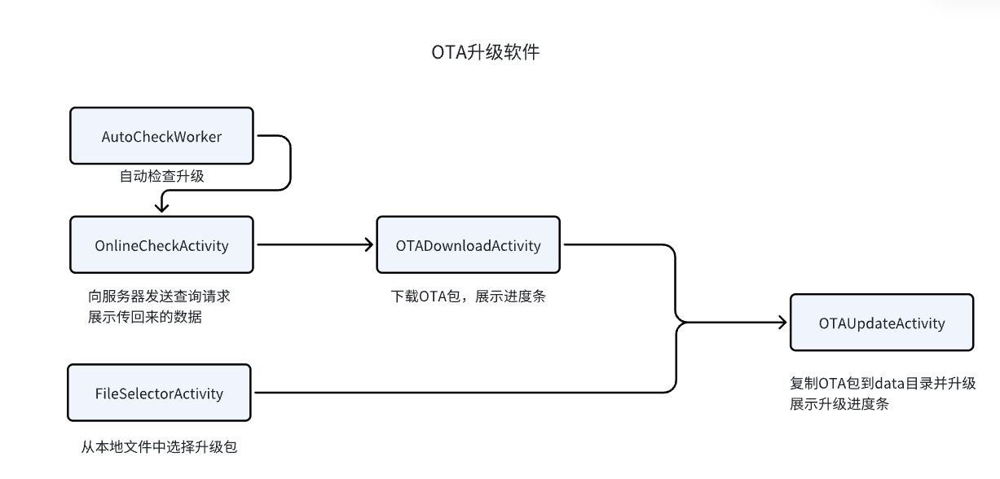
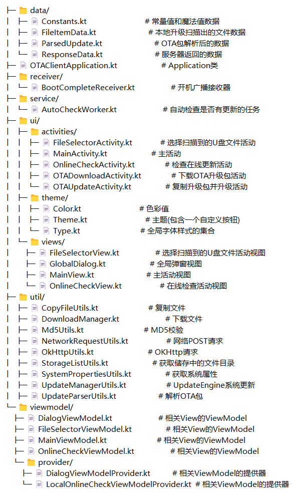

##  项目简介

 ### 项目名称：OTAClient

  ### 项目背景：

  **OTAClient** 是 OTA（Over-the-Air）升级客户端，配合 OTA 服务器使用。它在 Android 机顶盒的系统维护与版本更新中起着重要作用。作为运行在设备上的应用服务，**OTAClient** 负责向服务器请求系统更新、下载升级包并完成安装。

  为了确保精准的升级，客户端需要读取设备的系统属性和私有属性，并通过互联网与服务器通信，实时获取并应用最新的系统更新。该项目旨在保持设备的稳定性与安全性。

  ### 核心功能：

  - **在线OTA升级**：自动检查并下载服务器上的系统更新。
  - **U盘OTA升级**：从本地U盘读取更新包进行升级。
  - **每日自动检查**：定时后台任务检查系统更新。

  ### 技术栈：

  - **编程语言**：Kotlin
  - **UI框架**：Jetpack Compose
  - **架构模式**：MVI（Model-View-Intent）
  - **日志管理**：自定义 Timber 日志框架
  - **内存监控**：集成 LeakCanary 监测内存泄露
  - **文件下载**：使用 FileDownloader 库
  - **后台任务**：通过 CoroutineWorker 实现后台定时任务
  - **网络请求**：封装 OKHttp 处理网络通信


## 升级流程

### 获取升级包到储存目录

在线升级的获取和储存：

1. `OnlineCheckActivity`：与服务器通信检查更新
2. `OTADownloadActivity`：OTA下载，从服务器下载升级包，下载到 **"/sdcard/Download/ota_gateway_net.zip"**

本地升级的获取和储存：

1. `FileSelectorActivity`：从本地文件系统中选择升级包，获取升级包地址。

开机自动请求网络升级：

1. `AutoCheckWorker`： 无界面方式与服务器通信检查更新
2. `OnlineCheckActivity`：如果有返回数据则会进入该活动
3. `OTADownloadActivity`：OTA下载，从服务器下载升级包，下载到 **"/sdcard/Download/ota_gateway_net.zip"**

### 系统升级

1. `OTAUpdateActivity`：将升级包从储存目录复制到更新目录 **"/data/ota_package/update.zip"**
2. `UpdateManagerUtils`： 从更新目录拿到升级包开始解析升级包并使用mUpdateEngine升级

## 架构设计

### 总体架构图



### 模块划分

**OTAClient** 项目主要分为以下几个模块：

1. **UI层**
   - **Activities**：管理应用的主要界面，包括升级文件选择、在线升级检查、OTA下载和安装等活动。
   - **Views**：负责显示和处理界面逻辑，如文件选择视图、在线检查视图和全局弹窗视图。
   - **Themes**：包含应用的主题样式配置，管理全局的颜色和字体样式。
2. **数据层**
   - **Models**：定义核心数据结构，如文件扫描数据、OTA包解析结果和服务器响应数据。
   - **Repository**：负责从本地存储或远程服务器获取数据，向上层提供统一的数据接口。
3. **业务逻辑层**
   - **ViewModel**：通过 Jetpack 的 ViewModel 管理 UI 状态，响应用户操作并与数据层交互，采用 MVI 模式。
   - **Workers**：使用 CoroutineWorker 处理后台任务，如定时检查更新和下载升级包。
4. **服务与广播接收**
   - **Service**：提供长时间运行的后台服务，用于下载 OTA 更新包。
   - **Receivers**：负责接收系统广播事件，如开机启动检查更新。
5. **工具类模块**
   - **网络请求**：封装 OKHttp 用于发送服务器请求。
   - **文件操作**：提供文件复制、MD5校验等常用工具方法。
   - **日志管理**：使用自定义 Timber 日志框架记录调试信息。
   - **内存泄露检测**：集成 LeakCanary 监测应用内存泄露情况。

### 技术选型

1. **编程语言**：使用 Kotlin 语言编写，充分利用其简洁、安全、高效的语法特性。
2. **架构模式**：采用 MVI（Model-View-Intent）模式，简化 UI 逻辑管理，确保业务逻辑的清晰与解耦。
3. **UI框架**：Jetpack Compose 用于构建声明式 UI，减少传统视图系统的复杂性。
4. **日志管理**：使用 Timber 框架并扩展其功能，添加日志时间戳，提升调试效率。
5. **后台任务管理**：通过 CoroutineWorker 实现后台自动更新检查任务，保证任务高效运行且不影响前台进程。
6. **网络请求**：封装 OKHttp 用于处理网络通信，简化请求的发起与响应的处理。
7. **内存管理**：使用 LeakCanary 监测并处理内存泄露问题，确保应用长时间运行时的稳定性。
8. **文件下载**：集成 FileDownloader 库实现 OTA 包的稳定下载。

## 环境配置

**设备要求**：开发过程中使用 Android 11 的 s905x4 盒子进行真机调试。由于应用需要读取文件，需授予系统权限或将其内置为系统应用。

### Gradle 配置

**Gradle 插件**：使用 Android 应用和 Kotlin 插件。

~~~txt
plugins {
    id("com.android.application")
    id("org.jetbrains.kotlin.android")
}
~~~

**Gradle 版本**：`gradle-8.2`。

### **Android 编译配置**：

- `compileSdkVersion`：34
- `minSdkVersion`：30
- `targetSdkVersion`：34

### **签名配置**：需要设置发布版的签名信息。

~~~txt
signingConfigs {
    release {
        storeFile = file("your_keystore_path")
        storePassword = "your_password"
        keyAlias = "your_alias"
        keyPassword = "your_key_password"
    }
}
~~~

### **依赖库**：

- 使用 `Jetpack Compose` 构建 UI。
- 集成了 `FileDownloader` 和 `OKHttp` 进行文件下载和网络请求。
- 使用 `Timber` 进行日志管理，`LeakCanary` 用于内存泄漏检测。

~~~txt
dependencies {
    implementation("com.liulishuo.filedownloader:library:1.7.4")
    implementation("com.squareup.okhttp3:okhttp:5.0.0-alpha.3")
    implementation("com.jakewharton.timber:timber:5.0.1")
    implementation("com.squareup.leakcanary:leakcanary-android:2.14")
}
~~~


## 代码结构说明

### 目录结构



### 关键代码

### **请求结构概述**

1. **请求头**：

   - `Content-Type`: `"application/json"`
   - `appId`: 设备的应用ID
   - `timestamp`: 当前时间戳（毫秒级）
   - `nonce`: 随机生成的唯一字符串
   - `sign`: 经过SHA-256加密的签名，确保请求安全

   ~~~kotlin
   // com/xxxx/otaclient/util/OkHttpUtils.kt
       fun sendPost(url: String, body: RequestBody, callback: Callback) {
           val appId = getAppId()             // 获取应用ID
           val timestamp = getTimestamp()     // 获取时间戳
           val nonce = getNonce()             // 获取随机数
           val appSecret = getAppSecret() // 获取应用密钥
           val sign = getSign(requestBodyToJson(body),appId, timestamp, nonce, appSecret) // 获取签名
   
           val request = Request.Builder()
               .url(url)
               .addHeader("Content-Type", "application/json")
               .addHeader("appId", appId)
               .addHeader("timestamp", timestamp)
               .addHeader("nonce", nonce)
               .addHeader("sign", sign)
               .post(body)
               .build()
   
           okHttpClient.newCall(request).enqueue(callback)
       }
   ~~~

   

2. **请求体**（JSON格式）： 包含设备相关的信息，如：

   - `customer`：设备品牌
   - `modelName`：设备型号
   - `mac`：设备的MAC地址
   - `sn`：设备序列号
   - `version`：当前系统版本号
   - `remark`：备注信息（默认为 `"null"`）

   ~~~kotlin
   // com/xxxx/otaclient/util/ResponseUtils.kt
       /**
        * 启动网络请求任务
        * @param context 上下文对象
        * @param callback 请求回调接口
        */
       fun start(context: Context, callback: Callback) {
           val targetUrl = if(ping()) SystemPropertiesUtils.get("persist.sys.otaurl.outside") else SystemPropertiesUtils.get("persist.sys.otaurl.inside")
           if (targetUrl.isEmpty()) {
               callback.onFailure(
                   okhttp3.Call.Factory { throw IOException("Server not set") }.newCall(okhttp3.Request.Builder().build()),
                   IOException("Server not set")
               )
               return
           }
           val params = getRequestParams(context)
           sendPostRequest(targetUrl, params, callback)
       }
       /**
        * 获取请求参数的示例
        * @return 请求参数的 Map
        */
       fun getRequestParams(context: Context): Map<String, String> {
           val customer = SystemPropertiesUtils.get("ro.product.brand")
           val modelName = SystemPropertiesUtils.get("ro.product.model")
           val mac = SystemPropertiesUtils.get("ro.boot.mac")
           val sn = SystemPropertiesUtils.get("ro.serialno")
           val version = SystemPropertiesUtils.get("ro.build.display.id")
           val remark = "null"
   
           return mapOf(
               "customer" to customer,
               "modelName" to modelName,
               "mac" to mac,
               "sn" to sn,
               "version" to version,
               "remark" to remark
           )
       }
   ~~~


### 返回数据的概述

服务器返回的数据是一个JSON结构，包含状态码、数据部分、以及消息提示。以下是数据接收和处理的核心信息概述：

1. `ResponseData` 类

   - `code`：整型，表示返回的状态码，通常用于指示请求是否成功。例如，`200` 表示成功，其他值可能代表错误类型。

   - `data`：`Data` 类型，包含了更新文件的详细信息及更新模式。

   - `msg`：字符串类型，表示服务器的消息或提示信息，通常用于调试或向用户显示。

2. `Data` 类

   - `file`：`FileDetails` 类型，包含了更新文件的具体信息，如文件URL、MD5校验值、文件大小、版本号等。

   - `updatePattern`：整型，代表更新模式，可能指代不同的升级方式（例如差分更新、全量更新等）。

3. `FileDetails` 类

   - `fileUrl`：表示更新文件的下载地址，客户端根据此URL下载文件。

   - `md5`：更新文件的MD5校验值，用于校验文件的完整性，确保文件在传输过程中未被篡改。

   - `size`：字符串类型，表示文件的大小。

   - `version`：文件的版本号，表示当前升级包的版本。

   - `tips`：提示信息，可能包含升级说明或其他相关提示。

4. `ParsedUpdate` 类

   - `file`：文件对象，表示下载到的更新文件。

   - `offset` 和 `size`：用于指示文件的读取位置和大小，在处理大文件或者断点续传时尤为重要。

   - `props`：更新文件的属性数组，可能包含一些额外的文件信息或标签。

   - `isValid()`：用于验证解析出的更新信息是否有效，主要通过检查 `offset` 和 `size` 是否为正值，以及 `props` 是否不为空。

   - `toString()`：重写了 `toString()` 方法，便于日志记录时展示更新信息，包括文件URL、偏移量、大小和属性。


## 贡献指南

### 开发流程

为了贡献代码，请遵循以下步骤：

1. **克隆仓库**： 使用以下命令克隆项目到本地：

   ```
   git clone 
   ```

2. **创建分支**： 在开始开发之前，请根据需求或缺陷创建新分支。分支命名规范如下：

   - `master`：主分支
   - `develop`：共享开发分支
   - `1-feature-sms-deng-lu`：需求分支
   - `2-bugfix-sms-repeat`：缺陷分支
   - `3-hotfix-register-failed`：热修分支

3. **提交代码**： 在开发完成后，提交代码并推送到远程分支。

4. **提交 PR**： 提交拉取请求（Pull Request）以合并您的更改。

5. **Issue 处理流程**： 如果发现问题，请在 GitHub 上创建一个 Issue，描述问题的详细信息。

工作流规范请参考 [这里](https://xie.infoq.cn/article/6b1f70c0203e38ceaccd11879)。

### 代码风格指南

项目的代码风格规范如下：

- **命名规则**：
  - 类名使用 PascalCase，如 `MyClass`
  - 方法名使用 camelCase，如 `myMethod()`
  - 常量使用大写字母，单词之间用下划线分隔，如 `MY_CONSTANT`
- **注释风格**：
  - 使用 KDoc 风格为公共 API 添加注释。
  - 对复杂的代码逻辑添加行内注释，以提高可读性。

### 代码审查

代码审查的流程和要求如下：

1. **审查请求**： 提交 PR 后，团队成员将对代码进行审查。
2. **审查标准**：
   - 代码应符合项目的编码规范。
   - 功能应经过充分测试。
   - 逻辑清晰，注释完备。
3. **反馈处理**： 审查后，审查者将提供反馈，开发者需及时进行修改并更新 PR。
4. **合并 PR**： 审查通过后，代码将合并到目标分支。


## 注释的使用

### 1. **单行注释**

- **用途**: 用于简短的解释或说明，通常放在代码行的上方或旁边。

- 语法

  ```
  // This is a single-line comment
  val number = 42  // Inline comment
  ```

- **场景**: 用于解释代码的功能、说明某段代码的目的或暂时注释掉一行代码。

### 2. **多行注释**

- **用途**: 用于提供较长的解释或描述，适用于需要跨越多行的注释。

- 语法

  ```kotlin{1-4}
  /*
   * This is a multi-line comment.
   * It can span multiple lines and is useful for providing detailed explanations or documentation.
   */
  val number = 42
  ```

- **场景**: 适用于详细说明代码块的功能、复杂的逻辑或多行的解释。

### 3. **文档注释（KDoc）**

- **用途**: 用于生成代码文档，描述类、方法、属性等的功能和用法。

- 语法

  ```kotlin{1-7}
  /**
   * Calculates the factorial of a given number.
   *
   * @param n The number to calculate the factorial for.
   * @return The factorial of the given number.
   * @throws IllegalArgumentException If the number is negative.
   */
  fun factorial(n: Int): Int {
      if (n < 0) throw IllegalArgumentException("Number must be non-negative.")
      return if (n == 0) 1 else n * factorial(n - 1)
  }
  ```

- **场景**: 用于类、函数、属性等的详细描述，生成 API 文档，并提供清晰的接口说明。

### **4.TODO 注释**

- **用途**: 标记需要完成的任务或待处理的事项，通常用于代码中临时存在的问题或改进点。

- 语法

  ```
  // TODO: Implement error handling // [!code highlight]
  fun processData() {
      // Method implementation
  }
  ```

- **场景**: 用于标记代码中的待办事项，帮助开发人员追踪尚未完成的工作或需要进一步改进的地方。

## MVI设计模式

如果需要增加活动，建议采用以下标准（以`MainActivity`为参考范例）：

`ui/activity `: 该目录下存放Activity文件

`views`: 该目录下存放view视图文件

`viewmodel`： 该目录下存放ViewModel文件

`intent`：用户意图，一般放在ViewModel文件中，用于封装用户的行为，例如点击按钮、输入文本、滑动屏幕等。每个 Intent 都是一个描述用户意图的简单对象，通常不包含任何状态信息。	

### **Activity**

`Activity` 的职责应尽量保持轻量，主要负责与 Android 系统的生命周期交互。它的主要任务是启动 `ViewModel` 并设置 `Compose` 的 UI 内容。

- **代码职责**:
  - 初始化 `ViewModel`（通常通过依赖注入或 ViewModelProvider 工厂）
  - 设置 Compose UI 树的根节点，并通过 `setContent` 将其呈现在屏幕上
  - 监听 `ViewModel` 的状态变化并更新 UI
  - 生命周期管理和权限请求等系统级操作

- example
~~~kotlin{18-27,34}
class MainActivity : ComponentActivity() {

    private val viewModel: MainViewModel by viewModels()

    override fun onCreate(savedInstanceState: Bundle?) {
        super.onCreate(savedInstanceState)

        val systemVersion = getSystemVersion()
        viewModel.setSystemVersion(systemVersion)

        setContent {
            val viewState by viewModel.viewState.collectAsState()
            val context = LocalContext.current

            // 监听一次性事件,属于UI操作,放在Activity中
            LaunchedEffect(Unit) {
                viewModel.viewEffect.collect { effect ->
                    when (effect) {
                        MainViewEffect.NavigateToOnlineCheck -> {
                            val intent = Intent(context, OnlineCheckActivity::class.java)
                            startActivity(intent)
                        }
                        MainViewEffect.NavigateToFileSelector -> {
                            val intent = Intent(context, FileSelectorActivity::class.java)
                            startActivity(intent)
                        }
                    }
                }
            }

            MainView(
                isUsbUpdateVisible = viewState.isUsbUpdateVisible,
                systemVersion = viewState.systemVersion,
                onIntent = { intent -> viewModel.processIntent(intent) }
            )
        }
    }

    private fun getSystemVersion(): String {
    ......
    }

    override fun onKeyDown(keyCode: Int, event: KeyEvent?): Boolean {
    ......
    }
}
~~~


### **Views (Composable)**

Jetpack Compose 中的 `View` 是 `Composable` 函数，它们负责展示 `UI` 并响应用户的输入。与传统的 Android `View` 不同，`Composable` 函数是无状态的，它们根据 `ViewModel` 中的状态变化重组 UI。

- **代码职责**：
  - 根据 `ViewModel` 提供的 `State` 构建 UI
  - 将用户的输入事件封装成 `Intent` 并传递给 `ViewModel`
  - UI 元素的组合与布局

- example

~~~kotlin
@Composable
fun MainView(
    isUsbUpdateVisible: Boolean,
    systemVersion: String,
    onIntent: (MainIntent) -> Unit
) {
    Box(
        modifier = Modifier
            .fillMaxSize()
            .padding(16.dp),
        contentAlignment = Alignment.Center
    ) {
        Column(
            modifier = Modifier
                .padding(16.dp)
                .width(IntrinsicSize.Max), // 使Column宽度最大，避免由于systemVersion太长而分成两段显示
            horizontalAlignment = Alignment.CenterHorizontally,
            verticalArrangement = Arrangement.Center
        ) {
            Text(
                text = stringResource(R.string.device_version_title) + systemVersion,
                fontSize = 22.sp
            )

            MainActivityButton(
                onClick = { onIntent(MainIntent.CheckForUpdates) },
                text = stringResource(R.string.check_update_button_title)
            )

            if (isUsbUpdateVisible) {
                MainActivityButton(
                    onClick = { onIntent(MainIntent.UpdateFromUsb) },
                    text = stringResource(R.string.usb_update_button_title)
                )
            }
        }
    }
}
~~~

### **ViewModel**

`ViewModel` 在 MVI 模式中扮演着状态管理的核心角色。它负责处理 `Intent`，并根据业务逻辑更新 `ViewState`。`ViewModel` 还需要通过暴露 `ViewState` 和 `SideEffects`（副作用，如导航、显示对话框等）来与 UI 层进行通信。

- **代码职责**：
  - 管理和保存 `ViewState`，确保 UI 状态与生命周期无关
  - 处理 `Intent`，调用业务逻辑和其他数据层（如 Repository）
  - 根据业务逻辑更新 `ViewState`
  - 处理副作用（Side Effects），如导航、显示弹窗等

- example

~~~kotlin
data class MainViewState(
    val isUsbUpdateVisible: Boolean = false,
    val systemVersion: String = ""
)

// 定义 UI 事件, UI 界面的动作传递到这里
sealed class  MainIntent {
    object CheckForUpdates : MainIntent()
    object UpdateFromUsb : MainIntent()
    object MenuKeyPressed : MainIntent()
}

// 定义一次性事件（如导航）, 去调用MainActivity的方法
sealed class MainViewEffect {
    object NavigateToOnlineCheck : MainViewEffect()
    object NavigateToFileSelector : MainViewEffect()
}

class MainViewModel : ViewModel() {

    // 状态流，管理 UI 状态
    private val _viewState = MutableStateFlow(MainViewState())
    val viewState: StateFlow<MainViewState> = _viewState

    // 一次性事件流
    private val _viewEffect = MutableSharedFlow<MainViewEffect>()
    val viewEffect: SharedFlow<MainViewEffect> = _viewEffect

    // 处理用户的意图
    fun processIntent(intent: MainIntent) {
        when (intent) {
            is MainIntent.CheckForUpdates -> checkForUpdates()
            is MainIntent.UpdateFromUsb -> updateFromUsb()
            is MainIntent.MenuKeyPressed -> onMenuKeyPressed()
        }
    }

    // 处理在线更新
    private fun checkForUpdates() {
        viewModelScope.launch {
            _viewEffect.emit(MainViewEffect.NavigateToOnlineCheck)
        }
    }

    // 处理U盘更新
    private fun updateFromUsb() {
        viewModelScope.launch {
            _viewEffect.emit(MainViewEffect.NavigateToFileSelector)
        }
    }

    // 处理按键事件
    private var keyPressCount = 0
    private fun onMenuKeyPressed() {
        keyPressCount++
        if (keyPressCount >= 5) {
            _viewState.value = _viewState.value.copy(isUsbUpdateVisible = true)
            keyPressCount = 0
        }
    }

    // 获取系统版本号
    fun setSystemVersion(version: String) {
        _viewState.value = _viewState.value.copy(systemVersion = version)
    }
}
~~~

这里面，用户在UI界面进行操作之后，操作事件会通过`MainIntent` 传递到`ViewModel`，通过区分是哪个`MainIntent`而去触发不同的方法。
有的直接在`ViewModel`中处理即可（处理按键事件），有的则需要通过一次性事件（`MainViewEffect`）来调用`MainActivity`中的方法进行导航。

## Log日志的处理

本项目使用`Timber`框架进行日志收集，已经在`OTAClientApplication.kt` 中通过扩展 `Timber.DebugTree` 类，重写了 `log()` 方法，在日志消息中添加了带时间戳的自定义格式。

该框架默认将当前类名作为TAG输出，因此不需要再自定义TAG。

使用示例如下：

~~~kotlin
Timber.d("This is a debug log")
Timber.i("This is an info log")
Timber.e("This is an error log with an exception", exception)
~~~

## LeakCanary内存泄漏

- 版本：LeakCanary-android:2.14
- 它自动用于debug Build Variants
- 可以通过过滤Logcat中的关键字“LeakCanary”来监控内存泄漏分析。

## 弹窗组件的使用

弹窗组件请使用自定义的`GlobalDialog` 

1. 使用 `by viewModels()` 委托来获取或创建 `DialogViewModel` 的实例

~~~kotlin
    // 用于管理对话框状态的 ViewModel
    private val dialogViewModel: DialogViewModel by viewModels()
~~~

2. 将实例设置到Content中

~~~kotlin{16-22}
    override fun onCreate(savedInstanceState: Bundle?) {
        super.onCreate(savedInstanceState)

        // 从 Intent 中获取 OTA 文件路径
        val otaFilePath = intent.getStringExtra(EXTRA_OTA_FILE_PATH).orEmpty()
        // 从 Intent 中获取更新模式，默认为2：确认升级
        val updatePattern = intent.getIntExtra(EXTRA_UPDATE_PATTERN, CONFIRM_UPGRADE_PATTERN)

        // 如果 OTA 文件路径为空，则退出活动
        if (otaFilePath.isEmpty()) {
            Timber.e("The OTA file path is empty. Exiting activity.")
            finish()
            return
        }

        // 设置内容视图，使用全局对话框
        setContent {
            CompositionLocalProvider(LocalDialogViewModel provides dialogViewModel) {
                GlobalDialog()
            }
        }

        // 初始化对话框 ViewModel 的状态和操作
        setupDialogViewModel(otaFilePath, updatePattern)

        // 如果 updatePattern 为 FORCE_UPGRADE_PATTERN，直接执行 OTA 更新操作
        if (updatePattern == FORCE_UPGRADE_PATTERN) {
            handleOTAUpdate(otaFilePath)
        }
    }
~~~

3. 使用`DialogViewModel.kt`提供的各种方法控制弹窗状态

~~~kotlin
fun setTitle(newTitle: String)// 设置弹窗的标题

fun setContent(newContent: String)// 设置弹窗的内容

fun setDialogVisible(isVisible: Boolean)// 设置弹窗的可见性

fun showProgress(isVisible: Boolean)// 控制进度条的显示与隐藏

fun setProgress(newProgress: Int)// 设置进度条的当前进度

fun showYesButton(isVisible: Boolean)// 控制“是”按钮的显示与隐藏

fun showNoButton(isVisible: Boolean)// 控制“否”按钮的显示与隐藏

fun setMultiLineContent(content: String)// 设置弹窗的多行文本内容

fun setYesButtonClickHandler(handler: () -> Unit)// 设置“是”按钮的点击处理逻辑

fun setNoButtonClickHandler(handler: () -> Unit)// 设置“否”按钮的点击处理逻辑

~~~

## 后台操作实践 - Worker

这里的后台任务没有采用传统的`Service`，而是采用`Jetpack` 的 `WorkManager` 库中的`Worker`组件。旨在处理异步任务和长期运行的后台操作，特别适用于需要在设备重启后或在应用不在运行时继续执行的任务。

**主要特点**：

- **适用场景**：适用于需要保证任务执行的场景，比如上传数据到服务器、定期同步数据等。特别是在需要跨进程或设备重启后继续执行任务时。
- **生命周期**：`Worker` 可以在应用的生命周期之外执行任务，WorkManager 会自动处理 `Worker` 的生命周期。
- **约束条件**：可以设置任务的约束条件，比如网络连接、充电状态等，确保任务在合适的条件下执行。
- **任务调度**：WorkManager 处理任务调度和执行，支持链式任务和**周期性任务**。
- **API 级别支持**：WorkManager 从 API 级别 14（Android 4.0）开始支持，并提供了一致的 API。

**使用示例**：

~~~kotlin
class MyWorker(appContext: Context, workerParams: WorkerParameters) : Worker(appContext, workerParams) {
    override fun doWork(): Result {
        // 执行任务
        return Result.success()
    }
}

// 调度任务
val myWorkRequest = OneTimeWorkRequestBuilder<MyWorker>()
    .build()
WorkManager.getInstance(context).enqueue(myWorkRequest)

~~~

