## 项目需求：

:::tip 
1. 码流解析用C语言      
2. GUI图形化界面部分可用JAVA/C++            ——   QT
3. 任意输入TS流                                        ——   可以选择码流文件
4. 解析得到PAT,PMT,CAT,NIT                       ——   解析表结构内容
5. 得到每个节目的名称，播放时间               ——   EPG表
:::

## 项目进度

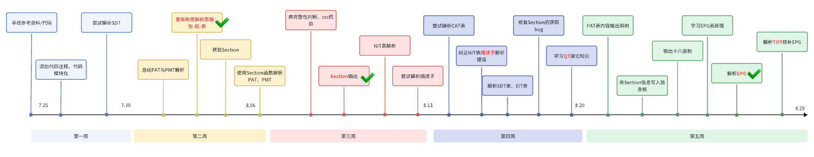

## 第一章 需**要学习的内容**

### 1.1 一些简单的名词：

需要了解的简单概念：

**DVB**（**Digital Video** **Broadcasting**，**数字视频广播**）：是由DVB项目维护的一系列国际承认的数字电视公开标准。DVB系统传输方式有如下几种： 卫星 (DVB-S 及 DVB-S2) ；有线 (DVB-C) ；地面无线 (DVB-T) ；手持地面无线 (DVB-H) 。这些传输方式的主要区别在于使用的调制方式，因为不同它们应用的频率带宽的要求不同。利用高频载波的DVB-S使用QPSK调制方式，利用低频载波的DVB-C使用QAM-64调制方式，而利用VHF 及 UHF载波的DVB-T使用COFDM调制。

我国使用的数字电视标准采用的就是DVB标准。

**MPEG2**：MPEG组织制定的视频和音频有损压缩标准之一

**传送系统(de1 ivery system)**:传送一路或多路复用流的物理媒体。例如：通讯卫星、同轴宽带电缆、光纤等。

传输信道一传输媒介可以是广播电视系统（如地面电视广播系统、卫星电视广播系统或有线电视广播系统)，也可以是电信网络系统，或存储媒介（如磁盘、光盘等），这些传输媒介统称为传输信道。

DVB系列标准中的传输系统可分为三类：第一类适用于广播信道，如DB-S、DVB-C、DB-T、DVB-CS、DB-MC、DB-S等，这一类系统要通过高频信道进行广播，因此其传输系统包含了信道编解码和调制解调两个环节；第二类适用于PDH电信网络，如DVB-PDH,这一类系统通过基带传输，传输系统仅包含了信道编解码环节；第三类适用于S0H电信网络，如DB-SDH,这一类系统也是通过基带传输的，但一般不需传输系统。

**信道编码**：通常情况下，编码码流是不能或不适合直接通过传输信道进行传输的，必须经过某种处理，使之变成适合在规定信道中传输的形式。在通信原理上，这种处理称为信道编码。信道编码过程一般被分为两环节：负责传输误码的检测和校正的环节称为信道编解码，负责信号变换和频带搬移的环节称为调制解调。一个实际的数字传输系统至少要包括上述两个环节中的一个环节，一般DVB的系统都是由上述两个环节构成的，因此DVB系统常被称为DVB信道编解码器与调制解调器。

**信息和信号**：根据信息论的定义，信号是信息的载体，也就是说，信息总是以某种具体的信号的形式表示的，并且通过信号在实际的传输系统中进行传输。具体到DVB系统中，信息就是电视台所要传送给用户的节目，而信号就是用于表示和传输节目的亮度信号、色度信号和伴音信号，以及进一步变换产生的实际传输的电视信号。信息与表示和承载它的信号之间存在着对应关系，这种关系称为“映射”，接收端正是根据事先约定的映射关系从接收信号中提取发射端发送的信息的。信息与信号间的映射方式可以有很多种，不同的通信技术就在于它们所采用的映射方式不同。在传统的模拟通信中，信号是“连续地”与信息进行映射的，在数字通信中，信号是“离散地”与信息进行映射的。

**打包**：所谓打包就是信息流按一定的时隙长度分段，每段前加入规定的同步比特信息以及描述段内信息类型和用户类型的标志比特信息，构成具有特定结构和时隙长度的传输单元，称之为“包”，然后将这些包按先后顺序组成一个连续的包序列，实际在媒体中进行传输的信息流（包括TS流）就是这种包序列。

**PCR**:Program Clock Reference节目时钟参考。为了实现众多编码器与解码器之间的时钟同步，防止解码器的缓冲发生上溢或下溢，在系统流中加入了一个精确的系统级时间参考值，在TS流中，这个值被称为节目参考时钟PCR。在解码器端，当检测到本地系统时钟和PCR所表征的时钟不一致时，解码器将调整本地系统时钟。PCR至少每0.1秒发送一次。

**频道(Channel)**：一个存贮或传送Mpeg-2传送码流的数字媒体。

**节目(programme)**：由广播者提供的一个或多个连续的事件。例如：新闻广播，娱乐广播。

**事件(event)**：一组属于普通业务的基本的广播数据流，它定义了起始时间和结束时间。

例如：一场足球比赛的半场，新闻快报，娱乐表演的第一部分。

**网络(network)**：一个传输系统，可以传输一组MPEGII码流。例如：某个有线电视系统中的所有数字频道。网络使用network_id来进行标识，不同运营商所运营的网络，对应的network_id不同。

**网络标识符(network_id)**：用来识别网络的唯一标志。

**原始网络标识符(original_nctwork_id)**：用来识别网铬的唯一标志，由原始节目提供。例：如果转播中央台的节目，放到自己的网络中，那么中央台的网铬标识符是原始网铬标识符，这时可改变它，建立自己的网铬标识符。

**业务(service)**：在广播者的控制下，可以按照时间表分步广播的一系列节目。（可称为节目）一个业务可以理解为一个逻辑意义上的频道。使用service_id来标识一个业务。同一个传输流中，service_id必须唯一。

**业务群(bouquet)**：一个业务群是一系列业务的集合。这些业务可以来自不同的TS流甚至不同的网铬。业务群的概念可以这样来理解：假设有两个业务提供商PA和PB,PA提供了10套节目，PB提供了20套节目。但是，对于某一个地域的用户，只希望他们收到PA提供的3套节目和PB提供的5套节目。此时，可以将这些节目组成一个业务群。

**复用(multiplex)**：将含有一路或多路节目信息的码流合成为一路。

**组件（基本流）：**(Component(Elementary Stream)):组成节目段的一个或多个实体。例如：视频，音频，图文。

**业务信息(Service Information)**：用于描述传送系统、内容和广播数据流的计划/时间表等的数字数据。它包括PEG一2的PSI信息及独立定义的扩展部分。

**TS** 流：MPEG2-TS（Transport Stream“传输流”；又称TS、TP、MPEG-TS 或 M2T）是用于音效、图像与数据的通信协定，最早应用于DVD的实时传送节目。

**PSI** ：其作用是从一个携带多个节目的某一个TS流中正确找到特定的节目。

**SI**：SI是对多个TS流的描述，它拓展和完善了PSI提供的信息。

**简单的了解视频**：可以先先看个讲解视频大致了解一下其中的部分原理和结构，干巴巴的看文字很没意思的。[解码 TS 包实验_自用_哔哩哔哩_bilibili](https://www.bilibili.com/video/BV19G411M7UT/?spm_id_from=333.337.search-card.all.click&vd_source=ec0e5977fe9a22b2ec5f18b49a4bed7c)

### 1.2 数字视频广播标准

数字视频广播标准主要有以下几种：

1. ATSC (Advanced Television Systems Committee): ATSC标准是**美国**的数字视频广播标准，用于地面数字电视广播和地面高清电视广播。它使用MPEG-2视频压缩和AC-3音频压缩，并支持高清和标清信号。
2. DVB (Digital Video Broadcasting): DVB标准是**欧洲**的数字视频广播标准，包括DVB-T（地面数字电视广播）、DVB-S（卫星数字电视广播）、DVB-C（有线数字电视广播）和DVB-H（便携式数字电视广播）等多种形式。
3. ISDB (Integrated Services Digital Broadcasting): ISDB标准是**日本**的数字视频广播标准，也被一些南美洲国家采用。它支持地面数字电视广播（ISDB-T）、地面高清电视广播（ISDB-Tb）、卫星数字电视广播（ISDB-S）和携带式数字电视广播（ISDB-Tmm）等。
4. DTMB (Digital Terrestrial Multimedia Broadcast): DTMB标准是**中国**的数字视频广播标准，用于地面数字电视广播和高清电视广播。它采用**MPEG-2**视频压缩和MPEG-2 AAC音频压缩。
5. ATSC 3.0 (Next Gen TV): ATSC 3.0是ATSC标准的下一代版本，支持更高的分辨率、更好的音频和视频质量，以及更多的交互性和个性化功能。它还提供了更强大的移动接收能力和互联网连接性。

在我们的TS流解析中需要着重了解的是`MPEG2-13818`这一套标准。

### 1.3 业务、节目与事件

关于业务（Service）、节目（program）、事件（Event），我们要弄清楚其准确意义，避免混淆。

那么什么是“业务”，什么是“事件”呢？CCTV1是一个频道，其标准说法应该是“业务（Service）”；《新闻联播》是一个节目，其标准说法应该是“事件”。

**而“节目”其实在一般情况上就是“业务”（from 戴工）**。因此只要你仔细观察就会发现**节目（program）的program_number和业务（Service）的Service_id是一样的**。这里其实我也遇到过有零星几个节目号和业务id不一样的情况，戴工说这里是特殊情况需要查。

在实际中，我们经常将“频道(Channel)”代指“业务(Service)”，比如上面的说明。 但事实上，在正式的场合，尤其翻译回英语后，“Channel”和我们认知中的“频道”是完全不同的概念。 从下图可以看出，**“Channel”指的是“频点”或者“信道”，而每个“Channel”里会有一个或多个的“Service”**。

因此，务必要养成良好的习惯，在交流中才能准确地描述 **业务(Service)** 、 **事件(Event)** 、 **频道(Channel)** 。

业务（节目）：CCTV1、CCTV2、湖南卫视、少儿频道

事件：新闻联播、动画梦工厂、偶像独播剧场、新闻大求真

再看一下**网络、复用、业务、事件、组件这几个概念之间的关系：**

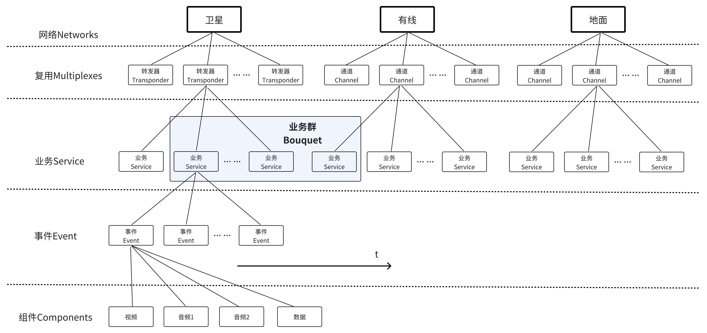

### 1.4 参考文档

1. 数字视频广播（DVB）系统中服务信息（SI）的标准文档

该文档主要是**纯英文**的标准信息官方文档。

[PSI标准文件.pdf](https://jwp3tfhiz79.feishu.cn/file/QgC3bu55ro8a1cxg9w7crknAnmb)

[SI标准文件.pdf](https://jwp3tfhiz79.feishu.cn/file/Mau7bPPxxouVSsxRTgXczfRvnId)

[系统软件更新服务互操作性的基础协议标准文档.pdf](https://jwp3tfhiz79.feishu.cn/file/CSQVbCcMboJxgNxxf3KcuZSmn6e)

1. TS码流结构分析

该文档主要是 **MPEG-2 system**、**系统时钟及同步**、**TS流参数监测**、以及TS主要表的理论知识PPT的PDF版本，在后期考虑代码的健壮性考虑对码流传输错误的检测时需要好好看看。

[TS码流结构分析.pdf](https://jwp3tfhiz79.feishu.cn/file/MxvgbwzKLouVWFxsKhyc6BOxnqh)

1. TS协议解析

该文档以极其**风趣幽默**的笔触采用师生对话的形式，从头一点一点的讲解TS码流解析，是一份极其优秀的教学文档

[TS协议解析.pdf](https://jwp3tfhiz79.feishu.cn/file/PiQvb7e2zo96JkxHtpWcB3vKnjb)

1. 林晓州的OneLib智库PSI/SI专题模块

林晓州大佬的笔记以出色的**重点突出**与**详实**的内容以及简明清晰的**表格视图**占据我目前找到的笔记的榜首。本笔记也大量参考了晓州大佬风格模式与表格数据。

https://linxiaozhou.com/resources/books/stb/psisi.html

1. 官方文档中文版

该文档很详细全面，就是内容太多而且没有导航条，没点耐心看不下去。

[13818-MPEG2中文版400页.pdf](https://jwp3tfhiz79.feishu.cn/file/Nb9Wb1OBooH4LcxZ50ccnbo6nxh)

重要概念索引：

| 内容               | 页数 |
| :----------------- | :--- |
| PSI                | 48   |
| PAT                | 50   |
| PMT                | 53   |
| 程序流和原始描述子 | 71   |

## 第二章 TS流概念

### 2.1 TS流的概念

TS 流是"Transport Stream"的缩写，也称为**传输流**，是一种用于数据传输的单一传输流。它是由固定长度的包组成，每个包长为 **188 字节**（有时也有 204 字节，其中包含 16 字节的 CRC 校验数据）。TS 流是在数字视频广播和数字电视领域广泛使用的**封装格式**。

#### 2.1.1 TS 流与其他流的关系（了解）

1. ES 流（Elementary Stream）：ES 流是指基本的音频、视频或其他类型的连续码流，它是最原始、最基本的数据流。ES 流不做任何分割和封装，只包含纯粹的媒体数据。例如，视频的 ES 流只包含视频帧数据，音频的 ES 流只包含音频采样数据。**特点：不分段、连续**
2. PES 流（Packetized Elementary Stream）：PES 流是对 ES 流进行分组和打包形成的一种数据结构，用于传输和存储。PES 流中的每个数据包（Packet）包含了 ES 流中的一部分数据，并加上包头信息，用于标识数据的类型和时间戳等信息。PES 流是用于实际传输和存储的基本单位。**特点：ES分割+头**
3. PS 流（Program Stream）：将具有共同时间基准的一个或多个PES组合（复合）而成的单一数据流（用于播放或编辑系统，如m2p）。
4. TS 流（Transport Stream）：TS 流是一种用于数据传输的单一传输流，它是由固定长度的包组成，含有独立时间基准的一个或多个节目。TS 流可以同时携带多个节目的音频、视频、数据和其他类型的信息，通过 PID 来区分不同类型的数据流。TS 流广泛应用于数字广播和数字电视领域，是数字视频传输的主要格式。**特点：独立时间基准**

#### 2.1.2 PES和TS的区别：（了解）

1. 内容不同

PSI/SI是TS包里面的一部分。PES和PSI/SI是数字视频广播和传输中的两种不同的数据格式和信息。PES用于打包和传输**音视频等基本媒体数据**，并提供时间戳等信息以控制同步和解析。而PSI/SI则提供了**节目和服务信息**，帮助接收端正确识别和解析出节目和数据流。两者协同工作，使得数字视频广播和传输系统能够实现高效的数据传输和信息展示。

1. 结构联系

在实际传输中，PES包会被切割后装载到TS包中，如下图所示：

并且

- 一个PES包可以装载到不同的TS包。
- 每一个TS包必须只含有从一个PES来的数据。
- PES包头必须跟在TS包的链接头后面。
- 对于一个特定的PES，最后一个TS包可以含有填充比特。
- TS包里面可以装载表也可以装载音视频数据，只有装载音频视频等数据的TS包里面才会有PES包。但是由于我们的作业主要解析的是PSI/SI表的数据，因此PES的结构这里不进行过多介绍

### 2.2 节目专用信息PSI(Program Specific Information）

管理各种类型的TS数据包，需要有些特殊的TS包来确立各个TS数据包之间的关系。这些特殊的TS包里所包含的信息就是节目专用信息PSI。在不同的标准中它有不同的名字：

• MPEG-2中称为PSI；

• DVB标准根据实际需要，**对PSI扩展，称为SI信息；**

• ATSC标准中为PSIP信息

"PSI是**对单一TS流的描述**，是TS流中的引导信息"。 PSI信息由节目关联表PAT、条件接收表CAT、节目映射表PMT和网络信息表NIT组成。这些表会被插入到TS流中。PSI信息是对单一TS流的描述，它是TS流的引导信息；PSI信息指定了如何从一个携带多个节目的传输流中找到指定的节目。

**你只需要知道PSI有四个表：**

### 2.3 业务信息表SI（Service Information）

业务信息表（Service Information Table）是SI中的一种表格，它用于提供有关服务（Service）和节目（Program）的详细信息。在数字广播和传输系统中，一个传输流中可以包含多个业务信息表，每个表格包含了一组相关的业务信息。

SI信息内容是按照network(网络)→transport strem（传输流）→service（业务）→event（事件）的分层顺序描述。SI数据信息是按照一定的数据结构进行存储的。SI数据主要有：网络信息、传输流信息、业务信息、业务的事件信息等，并且大量的信息都是通过描述符来传输的。

SI表主要是指PSI扩展部分的9个表：

| 英文名  | 中文名       | 描述                                                         |
| :------ | :----------- | :----------------------------------------------------------- |
| BAT     | 业务群关联表 | 业务群关联表提供了业务群相关的信息，给出了业务群的名称以及每个业务群中的业务列表。 |
| **SDT** | 业务描述表   | 业务描述表包含了描述系统中业务的数据，例如业务名称、业务提供者等。 |
| **EIT** | 事件信息表   | 事件信息表包含了与事件或节目相关的数据，例如事件名称、起始时间、持续时间等。不同的描述符用于不同类型的事件信息的传输，例如不同的业务类型。 |
| RST     | 运行状态表   | 运行状态表给出了事件的状态（运行/非运行）。运行状态表更新这些信息，允许自动适时切换事件。 |
| TDT     | 时间和日期表 | 时间和日期表给出了与当前的时间和日期相关的信息。由于这些信息频繁更新，所以需要使用一个单独的表。 |
| TOT     | 时间偏移表   | 时间偏移表给出了与当前的时间、日期和本地时间偏移相关的信息。由于时间信息频繁更新，所以需要使用一个单独的表。 |
| ST      | 填充表       | 填充表用于使现有的段无效，例如在一个传输系统的边界。         |
| SIT     | 选择信息表   | 选择信息表仅用于码流片段（例如，记录的一段码流）中，它包含了描述该码流片段的业务信息的概要数据。 |

我只解析了SDT表和EIT表两张表。

### 2.4 PSI/SI关系图解❗❗❗（重点）

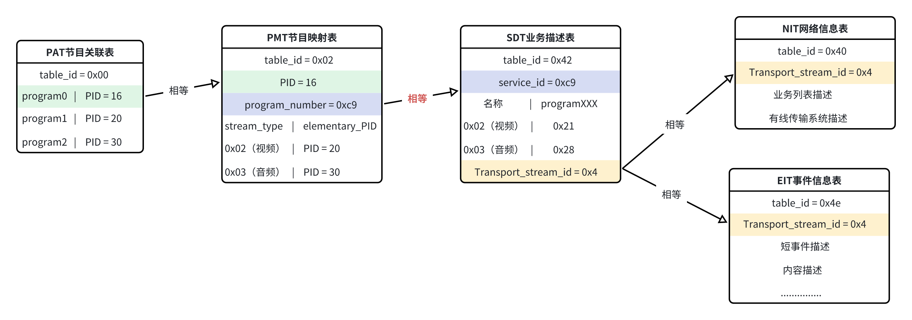

### 2.5 TS流复用示意图

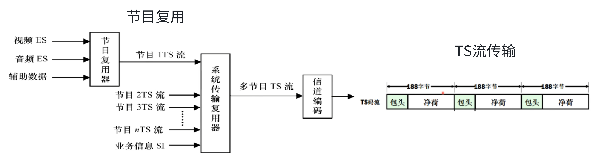

由图可以看出：每个节目的视频、音频、辅助数据会复用成**单个节目****TS****流**，而**多个**节目的TS流会复用成**一**个大TS 流进行传输。而TS流在传输的时候会分成一个一个的**传输包**进行传输，每个包为固定的188或204字节。所以我们要做的就是把这个复用好的混合流反向解析出来。 注意这里的TS流是 **位流格式**（分析Packet的时候会解释），也即是说TS流是可以按位读取的。

### 2.6 TS流逻辑结构

#### 2.6.1 包-段-表❗❗❗（重点）

包  ≤  段  ≤  表

表的概念已经在上面的2.2和2.3部分介绍过了，正如PAT表、PMT表等那样的储存信息的表。

包的概念也提到了，就是TS码流在传输的时候分成的一个个长度固定的**传输包**。我们在解析流的时候就是按照一个一个包为单位解析的。

而段的概念则尤其重要！如果没弄清楚，解析到一半就会发现不对劲了。要知道，一张表可以是很大很大，而传输的时候我们又以长度固定的包为载体，于是当一张表的长度大于包的长度时，就会拆分成**段**（Section）来传输。

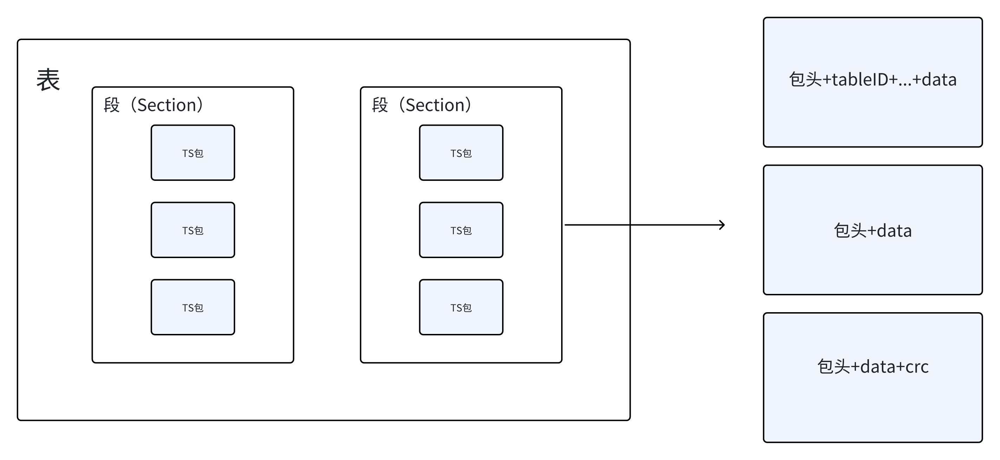

段和表在物理上不直接给出，在传输流中我们能拿到的就只有包，而段和表都需要我们对包进行拼接和解析才能得到。

在逻辑上，多个包合成一个段，多个段合成一个表。

**因此，我们在解析表的时候一定要切记把多个包的信息解析好存下来，拼成一个Section，然后再解析表。**

Section在码流中发送的一些情况：

（1）  TS包发送的时候PID是无序的，连续的TS包的PID可能都是不一样的；（PID在后续会详细说明）

（2）  TS包发送的时候Section是**相对有序**的，也就是说，对于同一个PID的TS包，只有发完了一个Section，才会发送下一个Section，不然无法区分该TS包属于哪一个Section,并且**对于这个Section，TS包是有序发送**的，否则数据会被打乱；

（3）  某个Section的第一个TS包有PSI/SI表的一些表头信息（table_id，section_length等信息），我称之为SectionHeader,后面的TS包就没有，所以接收某个Section必须先拿到Section的首包。**

### 2.7 TS包结构

TS流是**基于Packet**的位流格式，每个TS包的长度是固定的188个字节（或者204个字节，原因是在188个字节后加上了16个字节的CRC校验数据，其他格式一样）。整个TS包组成形式如下：

一个TS码流由多个TS包组成，一个TS包分**包头**和**净荷**（也可以叫做负载单元或者是payload）两个部分。

包头：同步字节——连续计数器

包头附加信息：适配域、指针域

有效载荷：也就是数据载荷

#### 2.7.1 TS 包头字段

TS 包的包头提供关于传输方面的信息：同步、有无差错、有无加扰、PCR（节目参考时钟）等标志。TS 包的包头长度不固定，前 32 比特（4 个字节）固定，后面可能跟有自适应字段（适配域）。32 个比特（4 个字节）是最小包头。包头的结构固定如下：

**在第7条continuity_counter后面还有自适应字段adaptation_field，在这后面还有一段指针域pointer field才会到有效负载**

包头部分比较重要的信息分别是：

payload_unit_start_indicator 负载单元开始指示（关系着该包是不是一个段的第一个TS包，也是关系着有没有指针域point field）

PID（识别该包是什么包）

adaptation_field_control 适配域控制（影响包的长度）

#### 2.7.2 TS 包头字段解释⚠️

1. **同步字节(sync_byte)：**

sync_byte:固定为 01000111（**0x47**）的 8 位字段；其他正式出现的字段赋值选择中（如PID），应当避免0x47，这是一个标志位，只要是一个正确的TS包就一定以（0x47）起始，这也是我们读包时候一验证读包正确的重要判断。

作用：作为一个包开始的标准

1. **传输错误指示 (transport_error_indicator)：**

transport_error_indicator:1bit. 

置'1'：此分组中至少有一个不可纠正的错误位。当被置 '1'后，在错误被纠正之前不能重置为 0。

在解析时，遇到transport_error_indicator为1的包我们一般丢弃。

作用：遇到transport_error_indicator为1的包我们一般丢弃

1. **负载单元开始标识 (payload_unit_start_indicator)：**

payload_unit_start_indicator:1bit

当传输流包有效载荷包含PES包数据时：

'1'指示此传输流包的有效载荷应随着PES包的首字节开始，'0'指示在此传输流包中无任何PES包将开始。

当传输流包有效载荷包含PSI数据时：

若传输流包**承载**PSI分段的**首字节**，则payload unit start indicator值必为'1',指示此传输流包的有效载荷的首字节承载指针域`pointer field`。

若传输流包**不承载**PSI分段的**首字节**，则payload_unit_start_indicator值必为'0'，指示在此有效载荷中不存在指针域`pointer field`。

作用：告诉我们有没有指针域pointer field，影响我们对有效载荷起始位的判断

1. **传输优先级 (transport_priority)：**

transport_priority:1 bit.

置'1'：表明比其他具有相同 PID 但此位没有置'1'的分组有更高优先级。

作用：暂时用不上

1. **PID**:

PID:3 位字段，唯一识别携带某一类型数据的传输包。

作用：唯一识别包

1. **加扰控制(transport_scrambling_control)：**

transport_scrambling_control:2 位字段，用来指示传输流分组数据净荷的加密模式。

作用：表示节目有没有加密，暂时用不上

1. **适配域控制(adaptation_field_control)：**

adaptation_field_control:2 位字段。也叫自适应字段控制，用于指示本传输流分组首部是否跟随有自适应字段（`adaptation_field`）或有效负载。

**adaptation_field_control**有以下四种可能：

- '00'未来使用保留；
- '10'无有效载荷；
- '01'仅含有效载荷；此时没有自适应字段，因此包头仅有四个字节
- '11'调整字段后为有效载荷，此时会有自适应字段，包头长度改变。

解码器应丢弃具有adaptation field control字段设置为'00'值的传输流包。在空包的情况中，adaptation field control的赋值应为'01'。

在我们解析时遇到00和01的包都该丢弃，只需要考虑01和11出现的情况。

作用：表示有无适配域，影响我们对有效载荷起始位的判断

1. **连续计数器(continuity_counter)：**

continuity_counter:4 位字段。随着每一个具有相同 PID的传输流包而增加，当它达到最大值后又恢复到 0，范围为0~15。

作用：用来保证包的连续，注意这里我在代码中并未考虑到这个字段的作用

注：包头字段的详细定义可以参考：[TS协议解析.pdf](https://jwp3tfhiz79.feishu.cn/file/PiQvb7e2zo96JkxHtpWcB3vKnjb)

#### 2.7.3 **自适应字段/适配域(adaptation_field)说明**

对于承载PES包的传输流包，只要存在欠充足的PES包数据就需要通过填充来完全填满传输流包的有效载荷字节。填充通过规定自适应字段长度比自适应字段中数据元的长度总和还要长来实现，以致于自适应字段在完全容纳有效的PES包数据后，有效载荷字节仍有剩余。自适应字段中额外空间采用填充字节填满。这是承载PES包的传输流包所允许的唯一填充方法。对于承载PSI的传输流包，可供选择的填充方法在 `第五章 段的获取` 中描述。

适配域的长度由适配域长度字段（adaptation_field_length）指定。

**adaptation_field_length：**8比特（1字节）字段,它是`adaptation field `的第一个字节，指定紧随在它之后的 `adaptation field `中的字节数。是包的第五个字节。

带有自适应字段的包结构图如下：

更多的内容就不详细描述了，感兴趣可以参考标准文档或者：

[H264解码之TS流解析](https://blog.csdn.net/y601500359/article/details/97648616)

#### 2.7.4 **指针(Pointer_field)说明**

pointer_field——**此为8比特（1字节）字段，其值为字节数**，即紧随pointer field直至传输流包有效载荷中存在的首分段的**首字节出现为止**的字节数（因此pointer field中的0x00值指示pointer_field后该分段立即起始)。当至少一个分段在给定的传输流包中开始传输时，payload_unit_start_indicator应置于'1'，并且那个传输流包的有效载荷的首字节必定包含该指针。当给定的传输流包中没有任何分段开始传输时，payload_unit_start_indicator应置于'0'，并且那个包的有效载荷中应不发送任何指针。

你是不是有点晕？没关系，看个图，下图是根据包的情况对各字段的限制，同样我们可以通过字段的值反推包的结构情况。

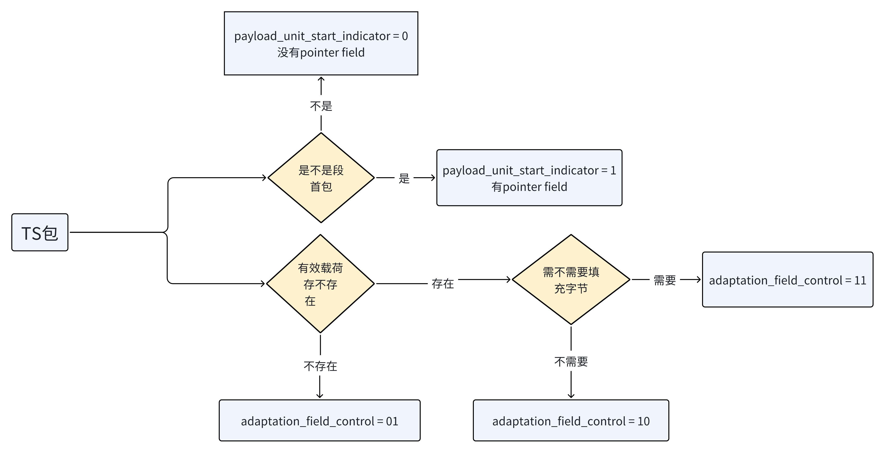

#### 2.7.5 负载单元起始位置判断

其实这一段的内容本应该放在代码实现部分，但是由于负载单元起始位置对包头和数据载荷的理解比较重要因此特地提出来。

负载单元起始位置的判断和上面提到的两个字段两个域有关分别是：

字段：负载单元开始标识 (`payload_unit_start_indicator`)、适配域控制(`adaptation_field_control`)

域：指针域`pointer field`、适配域（`adaptation_field`）

以及还有适配域的第一个字节`adaptation_field_length`

计算公式如下：

第一次计算：Adaptation_Field_Control 对 PayloadPosition 的影响

| Adaptation_Field_Control | PayloadPosition  的值   |
| ------------------------ | ----------------------- |
| 0                        | 没有                    |
| 1                        | 4                       |
| 2                        | 没有                    |
| 3                        | 4 + 1 + PacketBuffer[4] |

Adaptation_Field_Control

- 为0和2时不需要计算；
- 为1时表示只有包头四字节，所以有效载荷从第五个字节开始；
- 为3时除了包头四字节还要加上一个字节的`adaptation_field_length` 然后再加上`adaptation_field_length`的值也就是PacketBuffer[4]（包的第五个字节）。

第二次计算：Payload_Unit_Start_Indicator 对 PayloadPosition 的影响

| Payload_Unit_Start_Indicator | PayloadPosition 的值                                |
| ---------------------------- | --------------------------------------------------- |
| 0                            | PayloadPosition                                     |
| 1                            | PayloadPosition + PacketBuffer[PayloadPosition] + 1 |

这次计算在上一个计算之后，因为指针域在适配域之后，要计算完适配域才能得知指针域的位置。

为0表示没有指针域不需要更改PayloadPosition 的值

为1表示有指针域，需要加上一个字节的指针域，再加上指针域里面的值（PacketBuffer[PayloadPosition]）

#### 2.7.6 TS包净荷（负载单元）部分

TS包中净荷所传输的信息主要包括：

1. 视频数据：TS包可以携带压缩后的视频数据，如MPEG-2视频、H.264视频等。这些视频数据经过压缩编码，以节省带宽和存储空间。
2. 音频数据：TS包可以携带压缩后的音频数据，如MPEG-1音频、AC-3音频等。这些音频数据经过压缩编码，以节省带宽和存储空间。
3. 节目导航信息：TS包中可以包含PAT（Program Association Table）和PMT（Program Map Table）等导航信息，用于识别不同的节目和节目中的音视频数据。
4. 字幕数据：对于包含字幕的节目，TS包可以携带字幕数据，以便在播放时显示相应的字幕。
5. 控制信息：TS包中可以包含控制信息，用于控制接收端的行为，如播放、暂停、快进、快退等操作。
6. 数据广播：TS包可以用于传输数据广播，如天气信息、新闻资讯、交通信息等。
7. 传输协议：TS包中可以携带传输协议数据，用于控制数据的传输和接收。

需要注意的是，**TS****包的长度为188字节或204字节(这里是需要判断的，判断你的流的包是多长)**，其中固定头部占据了一部分字节，剩余的字节用于携带净荷数据。**由于TS流可以携带不同类型的数据，因此在解析TS包时需要根据****PID****来判断净荷的具体结构。**

在承载PSI/SI的TS包中，数据净荷里面的内容就是表的内容，准确一点说是段的内容。

### 2.8 段结构

我们的段(Section)的结构和包的结构其实是相似的，都是由**头+数据部分**组成。

#### 2.8.1 段头

但是在具体的不同表中段的段头里面的字段又有所差别，大体上的构成是一样的，**但是某些字段可能命名和功能不同**，例如：

上图中左边为NIT表的段头，右边为PAT表的段头，我们可以发现第四个字节和第五个字节的16位数据在这两张表中所包含的意义不一样，但是存储大小都一样。因此我们可以设置同样的段数据结构去存储所有表的段信息，只需要在解析的时候给出不同的处理就可以了。

所以我使用的数据结构如下：

```C++
typedef struct SECTION_HEAD_T
{
    unsigned int Table_Id :8;                         // 标志本表的类型
    unsigned int Section_Syntax_Indicator :1;         // 段语法标志,通常设为“1”
    unsigned int Private_Indicator :1;                // (unsigned zero) : 为1bits,固定的'0'，这是为防止和ISO13818 Video流格式中的控制字冲突而设置的                       
    unsigned int ReservedFirst :2;                    // 保留的2bits,保留位一般都是'0' 1
    unsigned int Section_Length :12;                  // 12bits的段大小，单位是字节 段长
    unsigned int Transport_Stream_id :16;             // 16bits的当前流ID，DVB内唯一.(事实上很多都是自定义的TS ID)
    unsigned int ReservedSecond :2;                   // 保留的2bits,保留位一般都是'0' 2
    unsigned int Version_Number :5;                   // 5bits版本号码，标注当前节目的版本．这是个非常有用的参数,当检测到这个字段改变时,说明TS流中的节目已经变化了,程序必须重新搜索节目．
    unsigned int Current_Next_Indicator :1;           // 1:表示发送的PAT表当前有效，1bit:当前还是未来使用标志符,一般情况下为'0'
    unsigned int Section_Number :8;                   // 8bits,标识当前段号码
    unsigned int Last_Section_Number :8;              // 8bits,标识最后段号码
```

重点关注字段：

**Section_Length：**段的长度

**Section_Number :**当前段的号码

**Last_Section_Number :**最后一个段的号码

#### 2.8.2 段头和表头的关系

其实这部分的内容我都不知道怎么讲了，因为你只要看了TSR等工具的码流解析你就会知道他们都是将表按照一个个段进行输出，所以**表的结构本质上就是一个个段的集合。**如果你想将段合成为一个表可以选择保留第一个段头并去掉段专属的字段比如Section_length，然后将其他段的数据部分接在下面。如果你想保留所有段结构，那么你合成的表就是一个个段的排列，仅仅是拼在一起而已。

我的代码中对表也是按照一个个段来输出的因此我这里给出我的结构示意图：

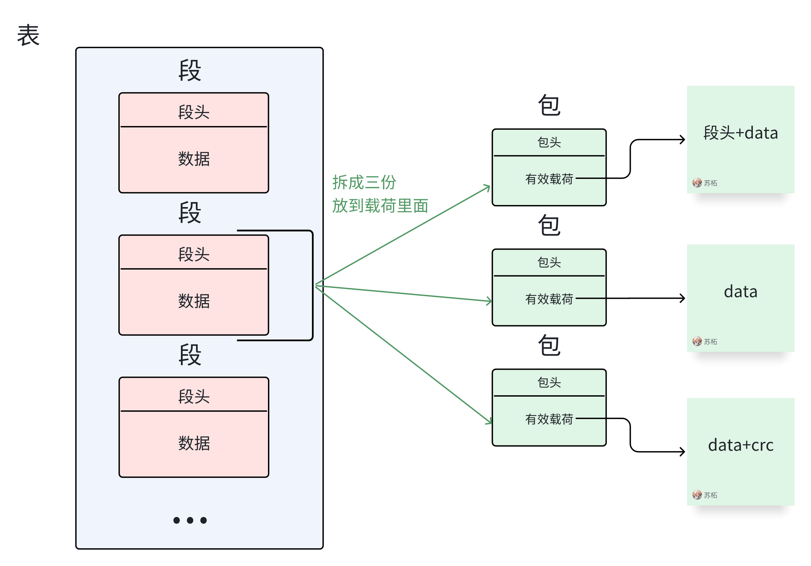

#### 2.8.3 段数据部分

段数据部分就是表的数据部分的一部分，我就不过多介绍了。要根据表的类型具体分析。更详细的结构解释会放在下面对每一个表解析的部分提到。

### 2.9 表结构

表的整体结构其实就是**段+段+段+...**。更详细的结构解释会放在下面对每一个表解析的部分提到。

比如，PAT表的表结构（一个段的结构）就是下面这样：

| Syntax(句法结构)               | No. of bits(所占位数) | Identifier(识别符) | Note(注释)                                                   |
| ------------------------------ | --------------------- | ------------------ | ------------------------------------------------------------ |
| program_association_section(){ |                       |                    |                                                              |
| table_id                       | 8                     | uimsbf             | 固定为 0x00                                                  |
| Section_syntax_indicator       | 1                     | bslbf              | 段语法标志位，固定为 1                                       |
| "0"                            | 1                     | bslbf              | 固定为0                                                      |
| Reserved                       | 2                     | bslbf              | 保留位，一般都是0                                            |
| Section_length                 | 12                    | uimsbf             | 从这个段后面开始直到结束的所有字节（不包括它本身，包括CRC）  |
| transport_stream_id            | 16                    | uimsbf             | 表示该传输流的 ID，区别于同一个网络中其它多路复用流。        |
| Reserved                       | 2                     | bslbf              | 保留位，一般都是0                                            |
| Version_number                 | 5                     | uimsbf             | 标注当前节目的版本。当检测到这个字段改变时，说明 TS流中的节目已经变化了，程序必须重新搜索节目。 |
| Current_next_indicator         | 1                     | bslbf              | 表示发送的 PAT 表是当前有效还是下一个 PAT 有效。             |
| Section_number                 | 8                     | uimsbf             | 当前段号码                                                   |
| last_section_number            | 8                     | uimsbf             | 表示该表的最后一个段的段号                                   |
| for(i=0;i<N;i++){              |                       |                    |                                                              |
| program_number                 | 16                    | uimsbf             | 节目频道号                                                   |
| reserved                       | 3                     | bslbf              |                                                              |
| if(program_number == 0){       |                       |                    |                                                              |
| network_PID                    | 13                    | uimsbf             | 表示网络信表（NIT）的 PID，节目号为 0 时对应 ID 为 network_PID。 |
| }                              |                       |                    |                                                              |
| else{                          |                       |                    |                                                              |
| program_map_PID                | 13                    | uimsbf             | PMT表的PID                                                   |
| }                              |                       |                    |                                                              |
| }                              |                       |                    |                                                              |
| CRC_32                         | 32                    | rpchof             | CRC校验值                                                    |
| }                              |                       |                    |                                                              |

## 补充：PID分配表

**这里单独再次提出****PID****的概念以示强调**，PID是TS流中唯一识别标志，Packet Data是什么内容就是由PID决定的。 如果一个TS流中的一个Packet的Packet Header中的PID是0x0000，那么这个Packet的Packet Data就是DVB的PAT表而非其他类型数据（如Video、Audio或其他业务信息）。

下面是TS流中的PID分配表

上面是一些表的PID值，这些值是固定的，不允许更改。因此我们在后面解析每个表时，就用TS包的PID来识别这是一个什么表的包。

## 补充：Table_ID

table id字段标识传输流PSI分段的内容

| 值        | 描述                                                         |
| --------- | ------------------------------------------------------------ |
| 0x00      | program association section                                  |
| 0x01      | conditional access section (CA section                       |
| 0x02      | TS_program_map_section                                       |
| 0x03      | TS_description_section                                       |
| 0x04      | ISO IEC 14496_scene_description_section                      |
| 0x05      | ISO IEC 14496_object_descriptor_section                      |
| 0x06      | Metadata section                                             |
| 0x07      | IPMP Control Information section(defined in ISO/IEC 13818-11) |
| 0x08-0x3F | ITU-TH.222.0建议书\|IS0/EC13818-1保留                        |
| 0x40-0xFE | 用户专用                                                     |
| 0xFF      | 禁用                                                         |

## 补充：PSI/SI缩略语

注：绿色背景为PSI信息，蓝色背景为SI信息。

更详细的列表请参考：[SI标准文件.pdf](https://jwp3tfhiz79.feishu.cn/file/Mau7bPPxxouVSsxRTgXczfRvnId)

## 补充：助记符

由于在第七章的 7.2 PAT包字段解释 中出现了助记符的概念，这里特意拿出来说一下：

助记符是用来描述编码比特流中所使用的不同数据类型的，具体如下：

| 助记符         | 描述                                                         |
| -------------- | ------------------------------------------------------------ |
| bslbf          | 比特串，左比特为首，其中“左”为顺序，按该顺序比特串写入本建议书国际标准中。比特串被写成在单引号标志内的1与0的字符串，例如‘10000001’。 比特串内的空位是为了阅读方便而无任何意义 |
| ch             | 信道                                                         |
| gr             | 音频层Ⅱ中3*32子带样本、音频层Ⅲ中18*32子带样本的区位。        |
| mian_data      | 比特流的main datai部分包含尺度因子、Huffman编码数据以及辅助信息， |
| mian_data_beg  | 此助记符给出该帧main data在比特流中的起始位置。该位置等于先前帧的 |
| main_data      | 结束位置加l比特。可从先前帧的main data end的值来预测         |
| part2_length   | 该值包含供尺度因子所使用的main data比特数                    |
| rpchof         | 余项多项式系数，最高阶项为首。                               |
| sb             | 子带                                                         |
| scfsi          | 尺度因子转换开关信息。                                       |
| switch_point_l | 来自使用窗交换位置上的尺度因子频带（长块尺度因子频带） 数目。 |
| switch_point_s | 来自使用窗交换位置上的尺度因子频带（短块尺度因子频带）数目。 |
| tcimsbf        | 二进制补码整数，msb(信号)比特为首。                          |
| uimsbf         | 无符号整数，最高有效比特为首。                               |
| vlclbf         | 可变长度码，左比特为首，其中“左”涉及顺序，按该顺序写出可变长度码 |
| window         | 在block type等于2,0≤window≤2的情况中，实际实隙数。           |

## 补充：原始流描述子（descriptor）

程序流和原始流描述子用来扩展程序和原始流定义的结构，所有的流描述子的格式都以8位标签值开始，此标签值之后为8位描述子长度和数据字段。描述子指的就是我们在表的loop部分能经常看到的descriptor。

下表列出了部分在标准文档中声明或定义的描述符，并提供了描述符标签值和在SI表中的预期位置。但是这并不意味着它们在其他表中的使用受到限制。

| **Descriptor**                       | **Tag** **value** | **NIT** | **BAT** | **SDT** | **EIT** | **TOT** | **PMT** | **SIT (see note 1)** |
| ------------------------------------ | ----------------- | ------- | ------- | ------- | ------- | ------- | ------- | -------------------- |
| network_name_descriptor              | 0x40              | *       |         |         |         |         |         |                      |
| service_list_descriptor              | 0x41              | *       | *       |         |         |         |         |                      |
| stuffing_descriptor                  | 0x42              | *       | *       | *       | *       |         |         | *                    |
| satellite_delivery_system_descriptor | 0x43              | *       |         |         |         |         |         |                      |
| cable_delivery_system_descriptor     | 0x44              | *       |         |         |         |         |         |                      |
| VBI_data_descriptor                  | 0x45              |         |         |         |         |         | *       |                      |
| VBI_teletext_descriptor              | 0x46              |         |         |         |         |         | *       |                      |
| bouquet_name_descriptor              | 0x47              |         | *       | *       |         |         |         | *                    |
| service_descriptor                   | 0x48              |         |         | *       |         |         |         | *                    |
| country_availability_descriptor      | 0x49              |         | *       | *       |         |         |         | *                    |
| linkage_descriptor                   | 0x4A              | *       | *       | *       | *       |         |         | *                    |
| NVOD_reference_descriptor            | 0x4B              |         |         | *       |         |         |         | *                    |
| time_shifted_service_descriptor      | 0x4C              |         |         | *       |         |         |         | *                    |
| short_event_descriptor               | 0x4D              |         |         |         | *       |         |         | *                    |
| extended_event_descriptor            | 0x4E              |         |         |         | *       |         |         | *                    |
| time_shifted_event_descriptor        | 0x4F              |         |         |         | *       |         |         | *                    |
| component_descriptor                 | 0x50              |         |         | *       | *       |         |         | *                    |
| mosaic_descriptor                    | 0x51              |         |         | *       |         |         | *       | *                    |
| stream_identifier_descriptor         | 0x52              |         |         |         |         |         | *       |                      |
| CA_identifier_descriptor             | 0x53              |         | *       | *       | *       |         |         | *                    |
| content_descriptor                   | 0x54              |         |         |         | *       |         |         | *                    |
| parental_rating_descriptor           | 0x55              |         |         |         | *       |         |         | *                    |
| teletext_descriptor                  | 0x56              |         |         |         |         |         | *       |                      |
| telephone_descriptor                 | 0x57              |         |         | *       | *       |         |         | *                    |
| ...                                  | ...               |         |         |         |         |         |         |                      |

​                                    

注意：

该表在《ETSI EN 300 468 V1.7.1 (2006-05)》文档的Page28。

描述子类型及其对应的descriptor_tag如下：

## 实践学习：从解析软件中认识TS包👍

### ADD 1 码流解析软件

1. Scivo码流分析仪
2. TSR(绿色软件，不需要安装)  
3. DVB TSReader 

### ADD 2 TSR的使用

下面以码流分析工具tsr为例，查看码流解析。

1. 打开TSR软件，点击左上角的文件夹图标（open）
2. 随便选择一个码流。注意，在TSR解析码流的时候会占用这个码流文件，此时我们自己编写的程序是没有办法正常读取码流文件的。因此建议复制一个码流副本用软件打开，方面对照着写代码。
3. 根据左侧的加号即可快速的查看解析好的码流结构。这里有三种视图，分别是表视图、PID分类视图、包视图。
4. 当我们点击单独的一个包或者一个Section，还可以显示该包/Section的十六进制数据格式

### ADD 3 查看PAT表

TS流的解析是从PAT表开始的，同时我们也以PAT表为例，详细看看在软件中的TS流结构（也就是我们最重要解析出的最终效果）。

#### ADD 3.1 整体观察PAT数据包

因为我们选择的TS流足够小，因此该流的PAT表只有一个Section，我们随便选取一个PAT的包进行读取（PID为0x0000）查看结构。

根据在第三章学到的包的结构，可以将上图的的188个字节的数据这样划分：

**知识清单：**

1. 表格内数据均为16进制数值。前4个字节为包头，后面的184个字节为包数据。
2. 后面的那一堆“FF FF FF FF”都是起**填充**作用的字节，通俗点说就是滥竽充数用的。一个包中把这些FF去掉，剩下的数据才是有用的，也就是所谓的**负载**。
3. 负载又有两种类型，一种是**有效载荷**，一种是**adaptation_field适配域**。但是这个包里面没有适配域。
4. 注意看到包数据最前面的第一个00是指针域

#### ADD 3.2 PAT数据包包头（四个字节）

细分其包头数据（**47 40 00 19**）如下：

上表中，第一行为表头的位号（0-31，共32位）， 第二行为每位的二进制数值， 第三行为每个字节的16进制数值， 最后一行的数据说明参看下面的表格。

**知识清单：**

1. 一个TS包的数据都是从0x47开始的，如果不是，那说明你找错了。
2. 上面字段的详细说明和其他值代表的含义可以参考2.7.2 TS包头字段解释部分

#### ADD 3.3 PAT数据包有效载荷（数据部分）

该包的数据部分(Package Data)为：

**00** **00 00 b0 29 00 03 cd 00 00 14 14 f4 15 14 28 ...FF FF**

注意到这里有一个绿色的 **00**， 这是因为在包头后需要除去一个字节（指针域）才是有效载荷部分（payload_unit_start_indicator="1"）。 因此，真正要分析的数据应该是红色部分：

**00 00 b0 29 00 03 cd 00 00 14 14 f4 15 14 28 ...FF FF**

**解析数据部分前8个字节**

下面对前8个字节（0-7字节，共计64 bits）进行分析（我这里换成别人的数据字节啊，我懒得改动）：

**00** **B0 1D 22 01 CF 00 00** **00 00 E0 10 40 13 E1 30 40 18 E1 80 40 0A E0 A0 40 0E E0 B5 10** 

| #                                         | 字段名                        | 占位    | 具体值                                  | 次序                                           | 说明                                                         |
| ----------------------------------------- | ----------------------------- | ------- | --------------------------------------- | ---------------------------------------------- | ------------------------------------------------------------ |
| 0*                                        | table_id                      | 8 bits  | 0000 0000(即0x00)                       | 第0个字节 00                                   | PAT的table_id只能是0x00                                      |
| 1*                                        | section_syntax_indicator      | 1 bit   | 1                                       | 第1、2个字节 B0 1D                             | 段语法标志位，固定为1                                        |
| 2*                                        | zero                          | 1 bit   | 0                                       |                                                |                                                              |
| 3*                                        | reserved                      | 2 bits  | 11 (Binary)                             |                                                |                                                              |
| 4*                                        | section_length                | 12 bits | 00 00 00 01 11 01(即0x1D，十进制值为29) | 意思是 段长度为29字节                          |                                                              |
| 5*                                        | transport_stream_id           | 16 bits | ‭00 10 00 10 00 00 00 01‬(即0x2201)       | 第3、4个字节 22 01                             | TS的识别号                                                   |
| 6*                                        | reserved                      | 2 bits  | 11                                      | 第5个字节 CF                                   | TS的识别号                                                   |
| 7*                                        | version_number                | 5 bits  | 0 01 11                                 | 一旦PAT有变化，版本号加1                       |                                                              |
| 8*                                        | current_next_indicator        | 1 bit   | 1                                       | 当前传送的PAT表可以使用，若为0则要等待下一个表 |                                                              |
| 9*                                        | section_number                | 4 bits  | 00 00(即0x00)                           | 第6个字节 00                                   | 给出section号，在sub_table中， 第一个section其section_number为"0x00", 每增加一个section,section_number加一 |
| 10*                                       | last_section_number           | 4 bits  | 00 00(即0x00)                           | 第7个字节 00                                   | sub_table中最后一个section的section_number                   |
| 循环开始（循环内的数据解析见后面的内容！） |                               |         |                                         |                                                |                                                              |
| -                                         | program_number                | 16 bits | --                                      | --                                             | -                                                            |
| -                                         | reserved                      | 3 bits  | --                                      | --                                             | -                                                            |
| -                                         | network_id 或 program_map_PID | 13 bits | --                                      | --                                             | program_number为0x0000时， 这里是network_id(NIT的PID)； 其余情况是program_map_PID(PMT的PID) |
| 循环结束                                   |                               |         |                                         |                                                |                                                              |
| -                                         | CRC_32                        | 32 bits | --                                      | 最后4个字节                                    | -                                                            |

**解析循环部分**

下面对后续几个字节（第8个字符开始）进行分析： **B0 1D 22 01** **CF** **00 00** **00 00 E0 10 40 13 E1 30 40 18 E1 80 40 0A E0 A0 40 0E E0 B5 10 A5 84** **FF** **... FF FF**

在上一小节节的表格中，每一个循环都是4个字节(32 bits)，我们在这里就先解析第一个循环： B0 1D 22 01 CF 00 00 **00 00 E0 10** **40 13 E1 30 40 18 E1 80 40 0A E0 A0 40 0E E0 B5 10 A5 84 FF ... FF FF**

| 位号   | 0                           | 1            | 2                     | 3    | 4    | 5    | 6    | 7    | 8    | 9    | 10   | 11   | 12   | 13   | 14   | 15   | 16   | 17   | 18   | 19   | 20   | 21   | 22   | 23   | 24   | 25   | 26   | 27   | 28   | 29   | 30   | 31   | ...  |
| ------ | --------------------------- | ------------ | --------------------- | ---- | ---- | ---- | ---- | ---- | ---- | ---- | ---- | ---- | ---- | ---- | ---- | ---- | ---- | ---- | ---- | ---- | ---- | ---- | ---- | ---- | ---- | ---- | ---- | ---- | ---- | ---- | ---- | ---- | ---- |
| Binary | 0                           | 0            | 0                     | 0    | 0    | 0    | 0    | 0    | 0    | 0    | 0    | 0    | 0    | 0    | 0    | 0    | 1    | 1    | 1    | 0    | 0    | 0    | 0    | 0    | 0    | 0    | 0    | 1    | 0    | 0    | 0    | 0    | ...  |
| Hex    | 0                           | 0            | 0                     | 0    | E    | 0    | 1    | 0    | ...  |      |      |      |      |      |      |      |      |      |      |      |      |      |      |      |      |      |      |      |      |      |      |      |      |
| 结构   | 1*: program_number = 0x0000 | 2*: reserved | 3*: network_id = 0x10 | ...  |      |      |      |      |      |      |      |      |      |      |      |      |      |      |      |      |      |      |      |      |      |      |      |      |      |      |      |      |      |

 

| #    | 字段名          | 占位    | 具体值 | 说明                                                        |
| ---- | --------------- | ------- | ------ | ----------------------------------------------------------- |
| 1*   | program_number  | 16 bits | 0x0000 | program_number = 0x0000                                     |
| 2*   | reserved        | 3 bits  | 111    | -                                                           |
| 3*   | program_map_PID | 13 bits | 0x0000 | 因为program_number为0x0000， 所以这里是network_id(NIT的PID) |

继续解析下一个循环： B0 1D 22 01 CF 00 00 00 00 E0 10 **40 13 E1 30** 40 18 E1 80 40 0A E0 A0 40 0E E0 B5 10 A5 84 FF ... FF FF

| 位号   | 0                                          | 1            | 2                                             | 3    | 4    | 5    | 6    | 7    | 8    | 9    | 10   | 11   | 12   | 13   | 14   | 15   | 16   | 17   | 18   | 19   | 20   | 21   | 22   | 23   | 24   | 25   | 26   | 27   | 28   | 29   | 30   | 31   | ...  |
| ------ | ------------------------------------------ | ------------ | --------------------------------------------- | ---- | ---- | ---- | ---- | ---- | ---- | ---- | ---- | ---- | ---- | ---- | ---- | ---- | ---- | ---- | ---- | ---- | ---- | ---- | ---- | ---- | ---- | ---- | ---- | ---- | ---- | ---- | ---- | ---- | ---- |
| Binary | 0                                          | 1            | 0                                             | 0    | 0    | 0    | 0    | 0    | 0    | 0    | 0    | 1    | 0    | 0    | 1    | 1    | 1    | 1    | 1    | 0    | 0    | 0    | 0    | 1    | 0    | 0    | 1    | 1    | 0    | 0    | 0    | 0    | ...  |
| Hex    | 4                                          | 0            | 1                                             | 3    | E    | 1    | 3    | 0    | ...  |      |      |      |      |      |      |      |      |      |      |      |      |      |      |      |      |      |      |      |      |      |      |      |      |
| 结构   | 1*: program_number = 0x4013(即十进制16403) | 2*: reserved | 3*: program_map_PID = 0x130(即PMT_PID为0x130) | ...  |      |      |      |      |      |      |      |      |      |      |      |      |      |      |      |      |      |      |      |      |      |      |      |      |      |      |      |      |      |

| #    | 字段名          | 占位    | 具体值 | 说明                                                         |
| ---- | --------------- | ------- | ------ | ------------------------------------------------------------ |
| 1*   | program_number  | 16 bits | 0x4013 | program_number = 0x4013(即十进制16403)                       |
| 2*   | reserved        | 3 bits  | 111    | -                                                            |
| 3*   | program_map_PID | 13 bits | 0x130  | 因为program_number不为0x0000， 所以这里是program_map_PID = 0x130(即PMT_PID为0x130) |

通过这个循环，我们可以知道，在这个TS中，有一个节目号为0x4013(即十进制16403)的节目，其PMT的PID为0x130。那么要想获取这个节目的详细信息，就要去解析PID为0x130的PMT表。（关于PMT表的解析未完待续）

### ADD 3.4 PAT十六进制解析图

## 第三章 整体解析思路的梳理❗

我们之前在2.6.1里着重强调了的**包-段-表**的关系，我们现在需要明确我们最终的解析目标是**表**，而解析**表**的前提是需要拿到**完整的段**，而拿到**完整的段**的前提是**读取一个个包**。因此我们所有的一切工作都落在对包的读取上，并且最终要完成对表信息的读取和存储。

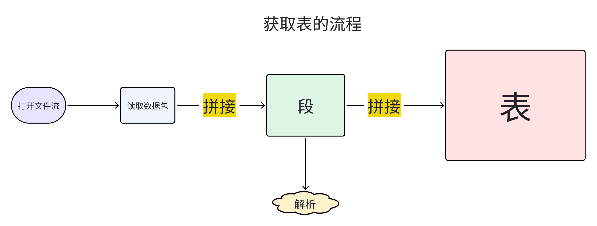

注意，这只是**逻辑上获取表**的大致思路，并不是代码的结构思路，因为在实际中有很多函数的嵌套和调用，这一部分会在后面的内容中详细提到。而且应该大家会好奇为什么图中的解析部分放在了段这里而不是表这里，我会在后续内容中讲述原因。

### 3.1 包拼成段❗

#### 3.1.1 判断包属于一个段

**①检查****PID****：**首先，检查这几个包的PID是否相同。在TS流中，同一个段的所有TS包的PID应该是相同的，因为它们都**属于同一个表**。

**②检查Table ID：**接下来，检查这几个包中的Table ID是否相同。Table ID是TS包中PMT（Program Map Table）表和其他表的标识符。**同一个段的所有TS包的Table ID应该是相同的**，表明它们属于同一个表的不同分段。

#### 3.1.2 判断一个段是否完整

**①检查Section_Length：**当你用包拼接出的段的长度等于Section_Length的长度了，就说明段完整了。不过值得注意的是实际中我们还会遇到用包拼接出的段的长度大于Section_Length的长度的情况，这时是因为段拆成包时的填充机制造成的，后续5.1部分也会提到。

②**检查continuity_counter：**包递增计数器，随着每一个具有相同 PID的传输流包而增加，当它达到最大值后又恢复到 0，范围为0~15。

③**校验段的CRC：**在许多协议中，段的最后一部分通常是一个校验码，例如CRC（循环冗余校验）码，用于验证段的完整性。你可以计算接收到的段的CRC，并与段中的CRC进行比较，如果不一致，则说明段不完整或者发生了错误。

### 3.2 段拼成表❗

#### 3.2.1 解析函数的位置

按照一般的逻辑，我们似乎应该等段拼接成表之后再进行统一的解析，这样只需要调用一次解析函数就可以解析完一张表所有的内容。但是实际上这样做会造成一定的麻烦：我们可以看到**在解析软件中，表的信息是按照Section输出的**，并且每一个Section都有自己的Section头和数据体，因此我们**不妨在获取Section阶段就直接对获取到的完整Section进行解析输出**，最后拼成表只是作为保留完整表的数据容器就不需要再对表进行一次解析了。

#### 3.2.2 判断段属于一个表

由于我在一开始读取包的时候就通过PID和Table ID进行了筛选，因此合成的段也一定是属于一个表的，这里不会进行再次验证。

#### 3.2.3 判断表是否完整

根据**Section_Number** 和**Last_Section_Number** ，前者是当前段的段号，后者是最后一个段的段号。由于在TS码流中段的传输是多次的、重复的，因此我们**开辟一个数组，长度为段的数量**，比如SectionGet。每拿到一个段，就让数组的相应位置置为1，当数组全为1时就表明所有的段都获取完了。

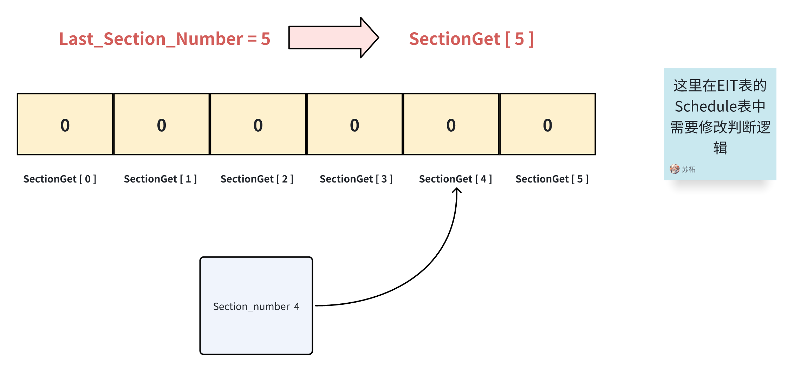

#### 3.2.4 段排序❗

由于解析到的段可能出现乱序，因此我会在**树形结构**输出阶段对段进行一个排序操作，按照段号进行排序。

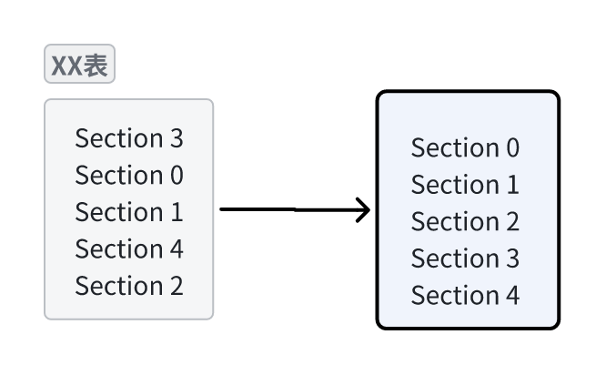

### 3.3 解析代码逻辑结构图❗视图

下图是我的实际代码在解析时候的逻辑图，所有获取表的操作都会调用同一个GetTable函数，然后GetTable函数里面又会调用GetSection函数去获得段，在获取段的过程中读包，在获取到段之后解析并输出。

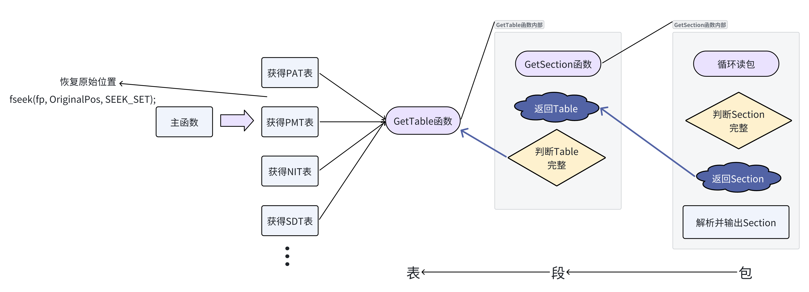

## 第四章 TS数据包的解析

TS流的解析以包为单位，而判断包的类型依靠的是包头中的唯一识别标志PID，因此解析应当从读取包并解析包头开始。注意，这里的讲解顺序不是代码编写顺序。

细节：

1. **判断包长**

改进：

1. **`fseek`** **可能会导致性能问题**
2. **返回值可以使用枚举类型**

思路：

1. 读取ts流，获得文件权柄FILE* fp
2. **判断包长，**TS包的开头必是0x47，而且包长必定是188或204字节，所以我们需要判断包长到底是多少才能正确的读取一个包并存储在缓存区（数组）里面。
3. 读取一个包
4. 解析包头

### 4.1 TS流读取

代码位置：Ts_Read_Main.c

对于文件的读取非常简单，只需要通过fopen（）函数来打开TS文件，并保存文件流指针就可以了。

#### 4.1.1 主要代码

```C++
    // 打开传入的TS文件，读取文件内容进行解析。如果打开文件失败，则输出错误信息并返回 -1。
    fp = fopen("E:\\homework\\Streams\\1.ts", "rb");
    if (!fp)
    {
        printf("open file error!\n");
        return -1;
    }
    else
    {
        printf("open file success!\n");
    }
    ...
    ...
    ...
    // 完成后关闭文件
    fclose(fp);
```

#### 4.1.2 **注意点和改进**

1. 文件路径：这里我将打开的文件路径直接写死了，方便我进行调试。但是，如果你想读取不同的文件，考虑将文件路径作为参数传递给函数或程序，使其更加灵活。比如以下方式：

```C++
int main(int argc, char *argv[]) {
    if (argc < 2) {
        printf("用法：%s <文件名>\n", argv[0]);
        return -1;
    }

    // 打开TS文件进行读取
    FILE* fp = fopen(argv[1], "rb");
    if (!fp) {
        printf("错误：无法打开文件 '%s'\n", argv[1]);
        return -1;
    } else {
        printf("文件 '%s' 打开成功！\n", argv[1]);
    }

    // 在这里进行文件处理和其他操作
```

1. 资源清理：在完成文件处理后，别忘了使用 `fclose(fp)` 关闭文件，以正确释放资源。

### 4.2 TS包长解析❗细节

代码位置：Parse_Ts_Packet_Length.c

函数名：TS包头长度判断函数

功能：判断TS包头长度是否等于传入的PackageLength的值

参数：fp：TS流文件指针

​         PackageLength：TS包长度

返回值：1：TS包头长度正确

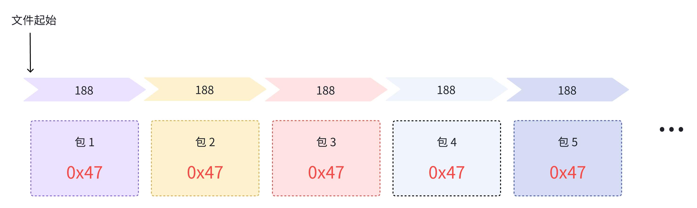

#### 4.2.1 主要思路

1. 读取第一个字节：从文件流 `fp` 中读取第一个字节 `BeginByte`，这个字节是TS数据包的起始字节，其值为 `0x47`。
2. 条件判断——检查是否读到文件末尾：如果文件已经结束，即 `feof(fp)` 返回真，则说明文件已经读取完毕，输出错误信息 "TS file is over" 并返回 -1。
3. 条件判断——检查起始位：判断读取到的 `BeginByte` 是否等于 `0x47`。如果不等于，说明文件头错误，输出错误信息 "TS file is error" 并返回 -1。如果第一个字节 `BeginByte` 等于 `0x47`，则表示找到了一个TS数据包的起始位。接下来，使用一个循环迭代读取 **10 个**TS数据包的数据头。来检查这个TS流的包长是不是等于`PackageLength`的值。之所以循环十次是为了保险起见，避免偶然误差。
4. 指针移动——判断下个包头：在每次迭代中，**通过** **`fseek`** **将文件指针定位到下一个****TS****包头的位置**（因为该函数的作用是将指针往后移动以略过`PackageLength - 1`的长度）。这里使用 `PackageLength - 1` 来定位下一个TS包头的原因是，由于前面已经使用过`fgetc`函数，而该函数调用后光标会后移一个字节。所以需要将文件指针向前移动 `PackageLength - 1` 个字节，以保证下一次 `fgetc` 读取的是下一个TS数据包的起始字节。
5. 条件判断——增加容错：如果 `fseek` 函数返回值为 -1，表示读不到下一个包头，输出错误信息 "TS file is error" 并返回 -1。
6. 条件判断——是否结束：在每次迭代中，还会检查文件是否已经结束。如果文件已经结束，输出错误信息 "TS file is over" 并返回 -1。
7. 读取字节：接着读取下一个TS数据包的第一个字节 `NextByte`，然后判断其是否等于 `0x47`，如果不等于，说明下一个TS包头错误，输出错误信息 "not 0x47" 并返回 -1。
8. 如果上述循环顺利执行了10次，以上错误都没有发生，说明读取了10个TS包头长度都是`PackageLength`，此时返回1。

#### 4.2.2 主要代码

```C
int JudgePacketLength(FILE *fp, int PackageLength)
{
    int BeginByte = fgetc(fp); // 读取TS包头的第一个字节

    if (feof(fp)) // 检查是否到达文件末尾
    {
        perror("TS file is over");
        return -1;
    }

    if (BeginByte == 0x47) // 判断是否以0x47为起始位
    {
        int i;
        int NextByte = 0;

        for (i = 0; i < 10; i++) // 迭代读取10个TS包的数据头
        {   
            /* 
            这里之所以是PackageLength-1是因为fgetc调用完之后，光标会后移一个字节，
            因此需要在fseek的位置上减去1，保证下一次fgetc读取到的是下一个TS包头的第一个字节。
            */
            if (-1 == fseek(fp, PackageLength - 1, SEEK_CUR)) // 将文件指针定位到下一个TS包头的位置
            {
                perror("TS file is error");
                return -1;
            }

            if (feof(fp)) // 如果文件结束，返回-1
            {
                perror("TS file is over");
                return -1;
            }

            NextByte = fgetc(fp); // 读取下一个TS包头的第一个字节
            if (0x47 != NextByte) // 判断下一个TS包是否以0x47为起始位
            {
                perror("not 0x47");
                return -1;
            }
        }

        return 1; // 读取了10个TS包头，返回1，表示上面的都没报错，这十个数据包的长度都是188字节

    }
    else // TS包头的第一个字节不是0x47，出现错误
    {
        perror("TS file is error");
        return -1;
    }
}
```

#### 4.2.3 注意点和改进❗改进

1. 在函数开始处，对 `fp` 参数进行非空检查。我们在主函数中就对文件指针进行了非空检查，如果你没有做。那么最好在开始时检查输入的文件指针是否为空，以避免在使用文件指针前产生错误。
2. **在循环中使用** **`fseek`** **可能会导致性能问题，海枫姐用的就是偏移量来定位。****尤其是对于大文件。每次调用** **`fseek`** **都需要重新定位文件指针，会导致较多的****IO****操作。**可以**考虑在函数开始时使用** **`ftell`** **获取文件指针的当前位置，然后在循环中递增这个位置的偏移量来遍历数据包。**这样可以减少 `fseek` 的调用次数。
3. **函数返回值可以改进**，当前函数使用 -1 表示出错，而使用 1 表示数据包长度正确。这样的返回值设计不够直观。可以考虑使用**枚举类型**来表示不同的返回情况，比如定义一个 `enum` 来表示文件读取的不同状态，例如：`typedef enum { FILE_ERROR = -1, FILE_OK = 0, FILE_PACKET_CORRECT = 1 } FileStatus;`。这样可以使得函数的返回值更加清晰和易读。
4. 函数中的魔法数值（在代码中出现的未经解释或命名的常数值）可以使用常量或宏来定义，例如对于 `0x47` 和 `10` 这样的数字可以定义为常量或宏，增加代码的可读性和可维护性。
5. **在循环读取10个****TS****包头时，如果文件中确实没有10个完整的包头，循环会读取不正确的数据，可能导致意外行为。**因此，**可以在每次读取** **`NextByte`** **前，检查文件是否已经结束**，如果文件已经结束且读取的TS包头不足10个，可以输出相应的错误信息，并返回 -1。不过我们的包长判断函数都放在文件开头且只执行一次，一般的TS文件也不会这么小，因此不会出现这种情况。
6. 对于文件操作的错误处理，可以使用 `perror` 来输出系统错误信息，但也可以自定义更具体的错误信息，帮助调用者更好地理解错误原因。如下：

错误信息改进：

```C
typedef enum {
    FILE_OK = 0,            // 文件正确，数据包长度正确
    FILE_ERROR_BEGINBYTE,   // 文件头错误，第一个字节不是0x47
    FILE_ERROR_FSEEK,       // 文件定位错误
    FILE_ERROR_NEXTBYTE,    // 下一个TS包头错误，不是0x47
    FILE_ERROR_EOF          // 文件已结束，数据包数量不足
} FileStatus;
----------------------------------------------------------
if (feof(fp)) // 检查是否到达文件末尾
    {
        sprintf(errMsg, "TS file is over");
        return FILE_ERROR_EOF;
    }
```

**对于fseek的性能问题可以使用偏移量来定位，这里展示别人的代码：**

```C++
int GetTSParsePacketLength(FILE *pfTSFile, int *pnTSPosition)
{
    int nPacketFirstByte = 0;   // 后面判断第一个字节是不是0x47，是的话就是一个包的开头
    while(!feof(pfTSFile))
    {
        // 循环直到文件结尾结束
        nPacketFirstByte = fgetc(pfTSFile); // 读取一个字节后，光标位置后移一个字节

        // printf ("%d\n", (*pnTSPosition));
        // 如果是0x47的话，找偏移188 204 后的是不是0x47
        if (0x47 == nPacketFirstByte)
        {
            // 长度188或者是204
            if (PACKET_LENGTH_188 == JudgePacketLength188Or204(pfTSFile, (*pnTSPosition), PACKET_LENGTH_188))
            {
                return PACKET_LENGTH_188;
            }
            if (PACKET_LENGTH_204 == JudgePacketLength188Or204(pfTSFile, (*pnTSPosition), PACKET_LENGTH_204))
            {
                return PACKET_LENGTH_204;
            }
        } // 外层if结束

        // fgetc 调用完之后，光标会后移一个字节
        // 如果改变偏移量不成功，报错提醒(SEEK_SET 文件头)
        (*pnTSPosition)++;
        // 其实也是为了重新定位 调用判断函数前的文件位置
        if (-1 == fseek(pfTSFile, (*pnTSPosition) , SEEK_SET))
        {
            perror("TS file is error");
        }
    } //while循环结束
    // 如果到了文件结束，还没有找到，说明这不是TS
    perror("the file is not TS");
    return -1;
}
```

### 4.3 TS包数据读取

读取TS包的逻辑也很简单

```C
// 读取一个TS包
        if (MAX_TS_PACKET_LEN != fread(tsPacket, 1, PackageLength, fp))
        {
            break;
        }
```

这里只是简单的用`fread`函数读取了一个`PackageLength`长度的数据包而已。

### 4.4 TS包头解析

代码位置：Parse_Ts_Header.c

函数名：TS头解析函数 

函数介绍：解析TS包头信息，将解析结果存储在指定的结构体中

输入参数：headerData：指向TS包头数据的指针，tsPacketHeader：指向T_TS_PACKET_HEADER结构体的指针

输出参数：无

返回值  ：void

#### 4.4.1 主要思路

这个思路可以说是非常简单，有手就行

1. 定义一个结构体`T_TS_PACKET_HEADER tsHeader`用来存储解析的TS包头信息，并初始化结构体为零。
2. 使用指针`data`保存对传入的TS包头数据的引用，以便在函数内部对数据进行操作时不会影响到传入的原始数据。
3. 解析TS包头的各个字段，将解析结果存储到`tsHeader`结构体中：
   1. `tsHeader.sync_byte`：同步字节。
   2. `tsHeader.transport_error_indictor`：传输错误指示符。
   3. `tsHeader.playload_unit_start_indictor`：负载单元起始指示符。
   4. `tsHeader.transport_priority`：传输优先级。
   5. `tsHeader.pid`：包标识符，用于标识不同的数据包。
   6. `tsHeader.transport_scrambling_control`：传输加扰控制。
   7. `tsHeader.adaptation_field_control`：自适应域控制。
   8. `tsHeader.continuity_counter`：连续计数器。
4. 将解析得到的TS包头信息复制到外部传入的`tsPacketHeader`所指向的内存区域中，使得外部代码可以直接使用这些信息。
5. 可选步骤：根据宏定义`PRINTF_DEBUG_TSpacket`的开启与否，选择是否打印调试信息。如果打印调试信息，将会按照特定格式打印TS包头的各个字段。

函数的输入参数为指向TS包头数据的指针`headerData`和指向`T_TS_PACKET_HEADER`结构体的指针`tsPacketHeader`。输出参数为无，因为解析结果已经存储在`tsPacketHeader`结构体中，外部可以直接读取。

#### 4.4.2 主要代码 

```C++
void ParseTsHeader(unsigned char* const headerData, T_TS_PACKET_HEADER *tsPacketHeader)
{
    static int tsPacketNum = 0;
    int offset = 0;
    unsigned char *data = NULL;

    // 定义结构体 tsHeader 用来存储解析的TS包头信息
    T_TS_PACKET_HEADER tsHeader = {0};

    // 初始化结构体 tsHeader 
    memset(&tsHeader, 0x0, sizeof(tsHeader));

    /* 
    使用 data = headerData; 是为了保留对原始数据的引用，同时在函数内部方便使用 data 进行操作。这样做在函数中对数据进行解析时，不会影响到传入的原始数据。
    */
    data = headerData;

    // 以下代码是对TS头的数据解析，解析的数据存在结构体 tsHeader 中
    tsHeader.sync_byte = data[0];
    tsHeader.transport_error_indictor = ((data[1]>>7) & 0x1);
    tsHeader.playload_unit_start_indictor = ((data[1]>>6) & 0x1);
    tsHeader.transport_priority = ((data[1]>>5) & 0x1);
    tsHeader.pid = (((data[1] & 0x1f) << 8) | data[2]);
    tsHeader.transport_scrambling_control = ((data[3]>>6) & 0x3);
    tsHeader.adaptation_field_control = ((data[3]>>4) & 0x3);
    tsHeader.continuity_counter = data[3] & 0xf;

    /* 
    下一行代码的作用是将结构体 tsHeader 的数据复制到 tsPacketHeader 所指向的内存区域中。
    由于 tsHeader 和 tsPacketHeader 都是指向结构体的指针，通过 memcpy 函数可以将 tsHeader 的内容复制到 tsPacketHeader 指向的结构体中，实现数据的拷贝。
    这样做的目的是将解析得到的 TS 包头信息复制到外部传入的结构体中，使得外部代码可以直接使用这些信息。
    */
    memcpy(tsPacketHeader, &tsHeader, sizeof(tsHeader));
    
    // 这里是打印TS包头信息，可以在编译时选择是否打印调试信息。
    #ifdef PRINTF_DEBUG_TSpacket
        offset = tsPacketNum * MAX_TS_PACKET_LEN;

        switch (tsHeader.adaptation_field_control)
        {
            case 1:
                if (tsHeader.playload_unit_start_indictor)
                {
                    printf("0x%08x Transport Packet{PID = 0x%x, Payload = YES(%d), Counter = %d, Start indicactor}\n",
                            offset, tsHeader.pid, MAX_TS_PACKET_LEN - 4, tsHeader.continuity_counter);
                }
                else
                {
                    printf("0x%08x Transport Packet{PID = 0x%x, Payload = YES(%d), Counter = %d}\n",
                            offset, tsHeader.pid, MAX_TS_PACKET_LEN - 4, tsHeader.continuity_counter);
                }

                break;

            case 2:
                if (tsHeader.playload_unit_start_indictor)
                {
                    printf("0x%08x Transport Packet{PID = 0x%x, Payload = NO, Counter = %d, Start indicactor}\n",
                            offset, tsHeader.pid, tsHeader.continuity_counter);
                }
                else
                {
                    printf("0x%08x Transport Packet{PID = 0x%x, Payload = NO, Counter = %d}\n",
                            offset, tsHeader.pid, tsHeader.continuity_counter);
                }

                break;

            case 3:
                if (tsHeader.playload_unit_start_indictor)
                {
                    printf("0x%08x Transport Packet{PID = 0x%x, Payload = YES(%d), Counter = %d, Start indicactor}\n",
                            offset, tsHeader.pid, MAX_TS_PACKET_LEN - 4 - 1 - data[4], tsHeader.continuity_counter);
                }
                else
                {
                    printf("0x%08x Transport Packet{PID = 0x%x, Payload = YES(%d), Counter = %d}\n",
                            offset, tsHeader.pid, MAX_TS_PACKET_LEN - 4 - 1 - data[4], tsHeader.continuity_counter);
                }

                break;

            default:
                break;
        }

        tsPacketNum++;
    #endif

}
```

#### 4.2.3 注意点和改进❗改进

宏定义： 宏定义`#ifdef PRINTF_DEBUG_TSpacket`是一个可选的调试宏，用于控制是否打印调试信息。目前这个宏只在函数内部使用，并没有在函数外部定义。由于我们希望在函数外部控制是否打印调试信息，所以必须将该宏定义移到头文件`constants.h`中，并准确引用这个头文件。

### 4.5 小结

至此我们拿到了TS流中的一个数据包保存在`tsPacket`中，还拿到了这个包的包头部分信息保存在`tsPacketHeader`中。不过这仅仅是解析路上最最基础的一小步罢了，后面的内容还有很多很多。

注意，这一部分我们并没有去涉及TS包有效载荷部分的解析，这是因为有效载荷部分的内容随着TS包的类型而变化，并且解析部分的代码并不在这一块儿，所以我这里没有提及。这一部分的内容在下一章 **第五章 段(Section)的获取**中。

## 第五章 段(Section)的获取

### 前言-段的重要性

就是从这里开始，我的代码进行过大规模的修改和重构。因为一开始没有考虑到Section的问题，默认一个PAT表就在一个TS包里完整存储着。由于我所用的样例的PAT表比较小，这样做也没出问题，所以我就没意识到这个问题。直到看到别人的代码解析，我才知道还要考虑这部分的内容。

**可不可以不拼段(Section)，直接根据Section_length读取相应长度的内容直接输出？不行！**因为在实际的解析过程中会发现，段的发送是**多次的、乱序的**，也就是说不仅一个包可能发送多次，还会不按照Section_number的顺序发送。因此我们在获取到一个个的段之后，还需要对段进行去重再拼接。如果学有余力还可以对段进行排序再输出，但是这里由于我将输出函数放到了获取一个段的函数内从而无法实现段排序。有需要的小伙伴可以考虑在段拼表的时候关注段的顺序，然后对最后的表顺序输出。

细节：

1. **段完整判断**
2. **Version变化判断**
3. **有效负载位置**
4. **将Section数据拼接成Table**
5. **根据不同的TableId传到不同的解析函数里进行解析**

### 前言-Section的填充机制

section是通过`section number`和`last section number`保证连续的，具体的连续机制是：在任一PID值的TS包中，一个段必须在下一个段允许开始之前结束，否则就无法识别数据属于哪个段。若一个段在TS包的末尾前结束了，此时不能够加载另一个段，则提供一种填充机制来填满剩余空间。该机制对包中剩下的每个字节均填充为0xFF。这样table id就不允许取值为0xFF,以免与填充相混淆。一旦一个段的未尾出现了字节0xFF,该TS包的剩余字节必然都被填充为0xFF,从而允许解码器丢弃TS包的剩余部分。填充也可用一般的adaptation_field机制实现。

对我们来说我们只要知道，在判断段是否完整的时候不能算上填充的无效字节，在包拼接成段的时候我们也不要填充字节。

### 5.1 段的获取思路❗思路

段的获取有两种方式，一种是以读取TS流为主线，在读包的过程中组合出段。另一种是以获取段为主线，先给定我需要读取的**段的识别标志：****`PID`****和****`table_id`** 然后根据这两个条件去读流并筛选符合条件的包。但是在实际中如果出现了一个段还没结束，下一个段的包就来了的情况，那么这时候按照第一种方式就需要再开辟一个新的段缓存区储存新来的段。所以我选择了第二种方式:**在获取段的函数中读取数据包，筛选拼接出段，一次仅获取一个完整段。**

1. 循环读包，检查是不是属于我们需要的段：前面已经讲了，判断属不属于一个段的标准是`PID`和`table_id`，所以我们将这两个参数传给`GetSection`函数来筛选包。
2. 判断传输错误，根据`transport_error_indictor`判断，错误的包我们丢弃。
3. 判断是否是段的起始包：由于段的起始包存着段头信息，因此我们需要把段头信息单独解析段头，并将段头信息保存到`TS_SECTION_HEAD`结构体中。如果不是段的起始包，则直接将数据部分拷贝到我们的段缓存区中。
4. 判断是否出现版本变化：如果出现了版本的变化，是需要重新搜台的
5. 判断段是否读取完整

### 5.2 所用函数汇总❗细节

在本阶段部分主要写了十个函数，分别具有不同的功能，如下：

1. ParseSectionHead：解析一个Section的头部信息，包括Table ID、Section长度、版本号等。
2. JudgeOneSectionOver：判断**一个Section是否完整**收集完毕，用于检查是否需要继续读取TS包来拼接Section。
3. CopyBufferToSection：将TS包的数据复制到Section缓冲区，用于拼接Section数据。
4. JudgeSectionVersionChange：**判断一个Section的版本是否发生了变化**，用于检查是否需要重新获取Section数据。
5. GetPayloadPosition：获取TS包的**有效负载位置**。
6. GetSection：从TS流中获取一个特定的Section，根据传入的Table ID和PID。该函数可能会多次读取TS包，直到拼接完整的Section。
7. GetOneSectionByPid：从TS流中获取一个特定的Section，与上述函数类似，但主要用于逐个获取Section。
8. GetTable：从TS流中获取完整的表（可能由多个Section组成），根据传入的Table ID和PID。此函数调用了GetSection函数。
9. CopySectionToTable：**将Section数据复制到Table缓冲区**，用于拼接Table数据。
10. OutPutByTableID：根据Table ID输出**解析的表数据。**

以下是函数调用结构图：

```C++
main()程序入口
│
└─ ParseTSForXXX()
   │
   └─ Parsexxx()
      │
      ├─ GetTable()拿表
      │  │
      │  ├─ GetSection()拿段
      │  │  │
      │  │  ├─ GetOneSectionByPid()拿一个段
      │  │  │  │
      │  │  │  ├─ ParseTsHeader()解析包头
      │  │  │  ├─ JudgeSectionVersionChange()版本变化
      │  │  │  ├─ JudgeOneSectionOver()判断段结束
      │  │  │  └─ GetPayloadPosition()获取有效负载
      │  │  │
      │  │  └─ CopyBufferToSection()包拼段
      │  │
      │  ├─ ParseSectionHead()解析段头
      │  └─ OutPutByTableID()输出段
      │
      └─ CopySectionToTable()段拼表
```

### 5.3 获取一个段的数据GetOneSectionByPid()

#### 5.3.1 主要思路

1. 初始化变量：在函数开头，初始化了一些变量，如`PayloadPosition`表示有效负载的起始位置，`nFlagSectionStart`表示是否是段的起始包，`nAlreadyAddSection`表示已经拼接的段长度，`SectionVersion`表示段版本号，`IsGetSectionVersion`表示是否获取了段版本号。
2. 定义数组和结构体：定义了一个数组`tsPacket`来存储TS包的数据，以及一个结构体`tsPacketHeader`来存储TS包的头部信息。
3. 循环读取TS包：进入一个无限循环，从文件中读取一个TS包的数据到`tsPacket`数组中。如果读取失败，则跳出循环。
4. 解析TS包头：使用`ParseTsHeader`函数解析`tsPacket`中的TS包头，将解析后的数据存储在`tsPacketHeader`结构体中。
5. 检查传输错误：检查`tsPacketHeader`中的传输错误指示器，如果有传输错误，输出错误信息，并继续下一次循环。
6. 检查PID和包头：检查`tsPacketHeader`中的PID是否与目标PID相符，并且检查同步字节是否为0x47。如果条件不满足，则继续下一次循环。这一步就是根据传入的PID和TableID来过滤包了。
7. 获取有效负载位置：调用`GetPayloadPosition`函数获取有效负载的起始位置，如果返回值为-1，表示没有有效负载，直接进入下一次循环。
8. 判断是否为段的起始包：检查`tsPacketHeader`中的有效负载单元起始指示器，以及`nFlagSectionStart`和`Table_Id`是否满足条件。如果是段的起始包，解析段头信息，更新相关变量，如`SectionNumber`和`LastSectionNumber`。
9. 版本号判断：如果`IsGetSectionVersion`为0，表示还未获取段版本号，此时将当前段的版本号赋给`SectionVersion`，然后将`IsGetSectionVersion`设置为1。
10. 版本变化判断：调用`JudgeSectionVersionChange`函数判断段版本是否发生变化。如果变化，输出版本变化信息，返回0表示版本变化。
11. 更新段标志：如果上述条件都满足，将`nFlagSectionStart`设置为1，表示已经找到了第一个Section，开始一个段的拼接。
12. 拼接段数据：调用`CopyBufferToSection`函数将当前TS包的数据拼接到`SectionBuffer`中，更新`nAlreadyAddSection`。
13. 判断段是否拼接完成：调用`JudgeOneSectionOver`函数判断当前段是否已经拼接完成。如果是，返回1表示拼接完成。
14. 处理非段起始包：如果条件不满足段的起始包的条件，且当前TS包的PID与目标PID相符，执行类似的逻辑，将数据拼接到`SectionBuffer`中。
15. 判断非段起始包是否拼接完成：同样调用`JudgeOneSectionOver`函数判断非段起始包是否已经拼接完成。
16. 函数结尾：函数的最后，循环继续，获取下一个TS包，直到循环结束。

#### 5.3.2 主要代码

```C++
/*************************************************************************************************************************
* 函数名： GetOneSectionByPid
* 函数介绍：从文件中读取TS包并拼接得到特定PID和Table ID的一个完整段。
* 输入参数：fp - 指向输入文件的文件指针
*           SectionBuffer - 存储拼接段数据的缓冲区
*           PID - 要匹配的PID值
*           Table_Id - 要匹配的Table ID值
*           PackageLength - 每个TS包的长度
*           LastSectionNumber - 存储最后一个段的段号
*           SectionNumber - 存储当前段的段号
*           tsSectionHead - 存储解析的段头信息的结构体指针
* 输出参数：SectionBuffer - 存储拼接段数据的缓冲区
*           LastSectionNumber - 存储最后一个段的段号
*           SectionNumber - 存储当前段的段号
* 返回值  ：如果成功拼接到完整段，返回1，如果出现段版本号变化，返回0，如果读取文件结束，返回-1。
***************************************************************************************************************************/
int GetOneSectionByPid(FILE *fp, unsigned char *SectionBuffer, unsigned int PID, unsigned int Table_Id, int PackageLength,
                       int *LastSectionNumber, int *SectionNumber, TS_SECTION_HEAD *tsSectionHead)
{
    int PayloadPosition = -1;        // 有效负载位置初始化
    int nFlagSectionStart = 0;       // 段起始标志
    int nAlreadyAddSection = 0;      // 总计拼接段长
    int SectionVersion = 0;          // 段版本号
    int IsGetSectionVersion = 0;     // 是否获取到段版本号

    // tsPacket数组用于保存一个TS包的数据。
    unsigned char tsPacket[MAX_TS_PACKET_LEN2] = {0};

    // 先按Section最大限长来填充 0
    memset(SectionBuffer, 0, sizeof(unsigned char) * MAX_SECTION_LENGTH);

    // 名为 tsPacketHeader 的结构体变量 T_TS_PACKET_HEADER，用于存储每个TS包的头部信息。
    T_TS_PACKET_HEADER tsPacketHeader = {0};

    // 循环读取TS包
    while (1)
    {
        // 读取一个TS包，存在tsPacket数组中
        if (MAX_TS_PACKET_LEN != fread(tsPacket, 1, PackageLength, fp))
        {
            break;
        }

        // 解析TS头，从tsPacket中解析然后存到tsPacketHeader指针指向的结构体中
        ParseTsHeader(tsPacket, &tsPacketHeader);

        // 判断传输错误
        if (tsPacketHeader.transport_error_indictor)
        {
            printf("传输错误\n");
            continue;
        }

        // 看PID是不是和我们需要的PID一样。以及包头是不是0x47开始
        if ((PID == tsPacketHeader.pid) && (0x47 == tsPacketHeader.sync_byte))
        {
            PayloadPosition = GetPayloadPosition(tsPacket);

            // 如果没有有效负载说明是空包就不继续
            if (-1 == PayloadPosition)
            {
                continue;
            }

            // 判断是否是段的起始包，这里为什么要放进来(DEFAULT_TABLE_ID == Table_Id)
            if ((tsPacketHeader.playload_unit_start_indictor == 1) && (1 != nFlagSectionStart) &&
                ((Table_Id == tsPacket[PayloadPosition]) || (DEFAULT_TABLE_ID == Table_Id)))
            {
                //解析Section头
                ParseSectionHead(tsSectionHead, tsPacket);

                *SectionNumber = tsSectionHead->Section_Number;
                *LastSectionNumber = tsSectionHead->Last_Section_Number;

                if (!(IsGetSectionVersion))
                {
                    SectionVersion = tsSectionHead->Version_Number;
                    IsGetSectionVersion = 1;
                }

                // 分析Section Head 若version变化则返回0
                if (1 == JudgeSectionVersionChange(tsSectionHead, &SectionVersion))
                {
                    printf("Version 变化\n");
                    return 0; // 返回值为 0 代表version number 变化
                }

                // 更新段中起始标识
                nFlagSectionStart = 1;
                CopyBufferToSection(SectionBuffer, tsPacket, &nAlreadyAddSection, tsSectionHead, PayloadPosition);

                // 已经不是 段的首了,就开始判断段的搜集结束了没有
                if (JudgeOneSectionOver(*tsSectionHead, nAlreadyAddSection))
                {
                    return 1; // 拼接完成，返回1
                }
            }
            else if (Table_Id == tsPacket[PayloadPosition]) //不是段的起始包
            {
                if (tsPacketHeader.playload_unit_start_indictor == 1)
                {
                    CopyBufferToSection(SectionBuffer, tsPacket, &nAlreadyAddSection, tsSectionHead, 4 + 1);
                }
                else
                {
                    CopyBufferToSection(SectionBuffer, tsPacket, &nAlreadyAddSection, tsSectionHead, 4); // 负载单元起始标志为0
                }

                // 已经不是 段的首了,就开始判断段的搜集结束了没有
                if (JudgeOneSectionOver(*tsSectionHead, nAlreadyAddSection))
                {
                    return 1; // 拼接完成，返回1
                }
            }
        }
    }

    return -1; // 文件读取结束
}
```

#### 5.3.3 注意点和改进

错误处理：

在函数运行的结果不符合我们的预期时，我们让函数返回了 -1。更好的做法是返回一个清晰的指示器或使用错误代码的枚举，以改进错误处理并提供更详细的错误消息。

例如：

```C++
#define FILE_READ_SUCCESS 1
#define FILE_READ_ERROR -1
#define FILE_READ_END 0

int GetOneSectionByPid(此处省略)
{
    // ...（代码略）

    // 循环读取TS包
    while (1)
    {
        // 读取一个TS包，存在tsPacket数组中
        if (MAX_TS_PACKET_LEN != fread(tsPacket, 1, PackageLength, fp))
        {
            if (feof(fp)) {
                // 文件读取结束
                return FILE_READ_END;
            } else {
                // 文件读取错误
                perror("文件读取错误");
                return FILE_READ_ERROR;
            }
        }

        // ...（继续处理逻辑）
    }

    // ...（继续处理逻辑）
}
```

### 5.4 ❗版本变化判断函数JudgeSectionVersionChange()

思路：该函数特别简单，就是**将我们获取的Section头里面存储的Version_Number和我们已经事先存好的Version值进行比较，不相等就是变化了。**注意这里我们**事前存好的Version值**是怎么获得的呢？我在判断当前包是段的起始包之后就使用了一个值**IsGetSectionVersion**进行判断，初始值为0的时候我们读取一个Version_Number存进来，同时置IsGetSectionVersion为1，当这个值为1的时候就不进行操作。

```C++
int JudgeSectionVersionChange(TS_SECTION_HEAD *tsSectionHead, int *Version)
{
    if (INITIAL_VERSION == (*Version))
    {
        (*Version) = tsSectionHead->Version_Number;
    }

    if ((*Version) != tsSectionHead->Version_Number) // 若版本号已经不一样了
    {
        return 1;
    }
    return 0;
}
```

### 5.5 段完整判断函数JudgeOneSectionOver()

思路：nAddLength 是我们当前已拼接的段长度，如果等于Section_Length + 3那说明已经获取完整了。

段长`Section_Length`的长度是从`Section_Length`这个字段的下一个字段开始到CRC(包含)结尾；

而加3字节是因为`Section_Length`是不包括前面的`table_id`,`Section_syntax_indicator`, `private_indicator`, `Reserved`, `Section_length`这些字段的，而`nAddLength`则是指拼接包的包长度，一般都是`Section_Length + 3`

```C++
int JudgeOneSectionOver(TS_SECTION_HEAD SectionHead, int nAddLength)
{
    int nSectionLength = (int)(SectionHead.Section_Length + 3);    // 段长 = Section_Length + 3(前面的字节)
    if (nAddLength == nSectionLength)
    {
        return 1;    // 长度达到，则此段结束
    }
    return 0;        // 段由多个包组成
}
```

### 5.6 包复制到段缓存区函数CopyBufferToSection()

思路：使用memcpy函数复制需要三个参数，分别是原地址，目的地址，长度。

目的地址：pucSectionBuffer + (*pnAlreadyAddSection)也就是段缓冲区还没有放数据的地址。

原地址：pucPacketBuffer + nLoadBeginPosition 也就是包缓冲区有效载荷的开始地址

长度：nCopyLength需要计算，一般情况下是188 - nLoadBeginPosition，但是有一种情况例外。

也是我们需要特别注意的情况，就是当有效数据不够填充一个段，段填充机制起作用的时候，这时候我们要去掉填充区域，因为这个地方我们不需要。

```C++
void CopyBufferToSection(unsigned char *pucSectionBuffer, unsigned char *pucPacketBuffer, int *pnAlreadyAddSection, TS_SECTION_HEAD *pSectionHead, int nLoadBeginPosition)
{
    int nCopyLength = 0;    // 要复制的长度，初始化

    // 一个包的数据长度为188字节，剩余的为有效字节数据，从有效负载单元开始，录入信息数据
    nCopyLength = 188 - nLoadBeginPosition;

    // 如果加上这个包的载荷部分长度后，超过了段总长度
    if (((int) pSectionHead->Section_Length + 3) < (188 - nLoadBeginPosition) + (*pnAlreadyAddSection))
    {
        // 这里调整要复制的长度，以保证不超过段总长度
        nCopyLength = pSectionHead->Section_Length + 3 - (*pnAlreadyAddSection);
        // 注意，超出部分的数据可以不用拷贝，因为这部分数据并没有意义，即填充数据，没有实际内容
    }

    // 将源地址的数据拷贝到目标地址，长度为 nCopyLength
    // 这里是将有效负载数据从包缓冲区复制到段缓冲区，不需要考虑数据的顺序问题，因为段的数据结构只包含了包的有效载荷部分
    memcpy(pucSectionBuffer + (*pnAlreadyAddSection), pucPacketBuffer + nLoadBeginPosition, nCopyLength);

    // 更新已经拼接到段缓冲区的长度
    (*pnAlreadyAddSection) = (*pnAlreadyAddSection) + nCopyLength;
}
```

### 5.7 ❗获取有效载荷位置函数GetPayloadPosition()

思路：

聪明的你一定记得我们之前在2.7.2 TS 包头字段解释部分提到过**负载单元开始标识（payload_unit_start_indicator）**它影响着**数据净荷（也可以叫做负载单元或者是****payload****）**的开始位置。而**调整字段控制（adaption_field_control）**也会对我们的有效负载开始位置产生影响**。**这里我并不想解释太多无用信息，直接简单的说一说对我们解析的影响：

负载单元起始位置的判断和上面提到的**两个字段两个域**有关分别是：

字段：负载单元开始标识 (`payload_unit_start_indicator`)、适配域控制(`adaptation_field_control`)

域：指针域`pointer field`、适配域（`adaptation_field`）

以及还有适配域的第一个字节`adaptation_field_length`

计算公式如下：

第一次计算：字段Adaptation_Field_Control 对 PayloadPosition 的影响

| Adaptation_Field_Control | PayloadPosition  的值   |
| ------------------------ | ----------------------- |
| 0                        | 没有                    |
| 1                        | 4                       |
| 2                        | 没有                    |
| 3                        | 4 + 1 + PacketBuffer[4] |

Adaptation_Field_Control

- 为0和2时不需要计算；
- 为1时表示只有包头四字节，所以有效载荷从第五个字节开始；
- 为3时除了包头四字节还要加上一个字节的`adaptation_field_length` 然后再加上`adaptation_field_length`的值也就是`PacketBuffer[4]`（包的第五个字节）。

第二次计算：字段Payload_Unit_Start_Indicator 对 PayloadPosition 的影响

| Payload_Unit_Start_Indicator | PayloadPosition 的值                                |
| ---------------------------- | --------------------------------------------------- |
| 0                            | PayloadPosition                                     |
| 1                            | PayloadPosition + PacketBuffer[PayloadPosition] + 1 |

这次计算在上一个计算之后，因为指针域在适配域之后，要计算完适配域才能得知指针域的位置。

为0表示没有指针域不需要更改PayloadPosition 的值

为1表示有指针域，需要加上一个字节的指针域，再加上指针域里面的值（PacketBuffer[PayloadPosition]）

以下使用`PayloadBeginPosition`来表示负载单元起始位置，用`tsPacket`表示TS包数据

**adaption_field_control：**

| 值    | 结果                                                   |
| :---- | :----------------------------------------------------- |
| 00/10 | 无有效负载，不处理此TS包                               |
| 10    | 无调整字段，`PayloadBeginPosition` = 4                 |
| 11    | 有调整字段，`PayloadBeginPosition` = 4+1+`tsPacket[4]` |

**payload_unit_start_indicator:**

| 值   | 结果                                                         |
| :--- | :----------------------------------------------------------- |
| 0    | 无节目特定信息指针(pointer_field)                            |
| 1    | 有节目特定信息指针 ,`PayloadBeginPosition` = `PayloadBeginPosition` + `tsPacket[PayloadBeginPosition]`+1 |

因此我们的代码就可以简化成如下

```C++
int GetPayloadPosition(unsigned char *const tsPacket)
{
    int nLoadUnitBeginPositon = -1;         // 初始化
    T_TS_PACKET_HEADER tsPacketheader = {0}; // 初始化

    // 对包头解析，获取信息存储在包头结构体中
    ParseTsHeader(tsPacket, &tsPacketheader);
    switch (tsPacketheader.adaptation_field_control)
    {
    case 0:
        return -1;
        break;
    case 1:
        nLoadUnitBeginPositon = 4;
        break;
    case 2:
        return -1;
        break;
    case 3:
        nLoadUnitBeginPositon = 4 + 1 + tsPacket[4]; // 调整  第六个字节，数组下标5
        break;
    default:
        break;
    }

    if (tsPacketheader.playload_unit_start_indictor)
    {
        nLoadUnitBeginPositon = nLoadUnitBeginPositon + tsPacket[nLoadUnitBeginPositon] + 1;
    }
    return nLoadUnitBeginPositon; // 解析出了TS中有效负载的开始位置
}
```

### 5.8 段头解析函数ParseSectionHead()

思路：由于属于不同表的段的段头是相同的，因此可以用同一个函数直接解析。

```C++
void ParseSectionHead(TS_SECTION_HEAD *pSectionHead, unsigned char *pucPacketBuffer)
{
    int nPayloadPosition = -1;    // 有效负载位置初始化
    
    nPayloadPosition = GetPayloadPosition(pucPacketBuffer); // 获取有效负载开始位置

    // 解析Section头部字段
    pSectionHead->Table_Id = pucPacketBuffer[nPayloadPosition];
    pSectionHead->Section_Syntax_Indicator = pucPacketBuffer[1 + nPayloadPosition] >> 7;
    pSectionHead->Private_Indicator = (pucPacketBuffer[1 + nPayloadPosition] >> 6) & 0x1;
    pSectionHead->ReservedFirst = (pucPacketBuffer[1 + nPayloadPosition] >> 4) & 0x3;
    pSectionHead->Section_Length = (pucPacketBuffer[1 + nPayloadPosition] & 0xf) << 8 | pucPacketBuffer[2 + nPayloadPosition];
    pSectionHead->Transport_Stream_id = (pucPacketBuffer[3 + nPayloadPosition] << 8) | pucPacketBuffer[4 + nPayloadPosition];
    pSectionHead->ReservedSecond = pucPacketBuffer[5 + nPayloadPosition] >> 6;
    pSectionHead->Version_Number = (pucPacketBuffer[5 + nPayloadPosition] >> 1) & 0x1f;
    pSectionHead->Current_Next_Indicator = (pucPacketBuffer[5 + nPayloadPosition] << 7) >> 7;
    pSectionHead->Section_Number = pucPacketBuffer[6 + nPayloadPosition];
    pSectionHead->Last_Section_Number = pucPacketBuffer[7 + nPayloadPosition];
}
```

### 5.9 段复制到表缓存区函数CopySectionToTable()

思路：这个函数的思路可以说和前面的CopyBufferToSection()一样一样的，只是具体的参数需要调整。

目的地址：TableBuffer + (*AlreadyAddTable)

原地址： SectionBuffer + 8

复制长度：nCopyLength = tsSectionHead.Section_Length - 5

这里就没有什么表填充机制了，段没了就是没了。

```C++
void CopySectionToTable(unsigned char *TableBuffer, unsigned char *SectionBuffer, int *AlreadyAddTable, TS_SECTION_HEAD tsSectionHead)
{
    int nCopyLength = tsSectionHead.Section_Length - 5; // 要复制的长度，即Section_length - 5，跳过段头的五个字节
    memcpy(TableBuffer + (*AlreadyAddTable), SectionBuffer + 8, nCopyLength); // 段头是八个字节，所以从第八个字节开始复制
    (*AlreadyAddTable) = (*AlreadyAddTable) + nCopyLength;
}
```

### 5.10 ❗段输出函数OutPutByTableID()

思路：这虽然段头的内容大家都是一样的，但是到了数据部分还是有很多不同的，因此我根据Table_Id进行区分，不同的段使用不同的解析函数去解析输出。

```C++
void OutPutByTableID(unsigned char *SectionBuffer, unsigned int Table_Id, int Section_Number)
{
    if (Table_Id == TS_PAT_TABLE_ID)
    {   
        printf("\nSection %d\n", Section_Number);
        ParseTsPat(SectionBuffer); // 解析PAT表数据
    }
    else if (Table_Id == TS_PMT_TABLE_ID)
    {   
        printf("\nSection %d\n", Section_Number);
        ParseTsPmt(SectionBuffer); // 解析PMT表数据
    }
    else if (Table_Id == TS_NIT_TABLE_ID)
    {
        printf("\nSection %d\n", Section_Number);
        ParseTsNit(SectionBuffer); // 解析NIT表数据
    }
    else if (Table_Id == TS_CAT_TABLE_ID)
    {
        printf("\nSection %d\n", Section_Number);
        ParseTsCat(SectionBuffer); // 解析CAT表数据
    }
    else if (Table_Id == TS_SDT_TABLE_ID)
    {
        printf("\nSection %d\n", Section_Number);
        ParseTsSdt(SectionBuffer); // 解析SDT表数据
    }
    else if ((Table_Id == TS_EIT_TABLE_ID)
             ||(Table_Id == TS_EIT_TABLE_ID2)    
             ||(Table_Id == TS_EIT_SCHEDULE_ID)
             ||(Table_Id == TS_EIT_SCHEDULE_ID2))
    {
        printf("\nSection %d\n", Section_Number);
        ParseTsEit(SectionBuffer); // 解析EIT表数据
    }
}
```

## 第六章 表(Table)的获取

### 6.1 表的获取思路

思路：获取表的函数就是按照指定的 PID 和表 ID 获取所有相关段，并将它们组装成一个完整的表。这里的主要重点就在于对一张表中的段是否全部获取到的判断上，以及当该段为首段和非首段时需要采取不同的处理。

1. 初始化： 在开始时，函数初始化了一些变量，包括标志 `allSectionsComplete`，用于判断所有段是否都已获取，以及创建用于存储段数据的 `SectionBuffer` 数组。
2. 获取段数据： 使用一个循环来连续获取段数据，函数调用了 `GetSection` 函数，该函数负责从文件中读取并解析一个段的数据，并将解析得到的段头信息存储在 `tsSectionHead` 中。
3. 处理段数据： 在获取到一个段的数据后，函数判断是否已经获取过这个段，如果已经获取则跳过。然后，根据获取的段数，决定是将该段数据直接作为表数据，还是将多个段数据组装成一个完整的表。
4. 组装表数据： 如果只有一个段，将其数据直接拷贝到 `TableBuffer` 中，然后将标志 `allSectionsComplete` 设置为 1，表示所有段已获取。如果有多个段，函数会依次将每个段的数据拷贝到 `TableBuffer` 中，并记录哪些段已经获取，以及已经拼接的表长度。
5. 检查是否完成： 在组装表数据的过程中，函数会检查是否所有段都已经获取。如果是，则将标志 `allSectionsComplete` 设置为 1，表示所有段已获取。
6. 释放内存： 函数结束时会释放之前分配的内存，包括 `SectionBuffer` 和 `SectionGet`。

### 6.2 主要代码

```C++
int GetTable(FILE *fp, unsigned char *TableBuffer, unsigned int PID, unsigned int Table_Id, int PackageLength)
{   
    int allSectionsComplete = 0; // 假设所有段都已获取

    // SectionBuffer数组用于保存一个section的数据，初始化的同时分配了内存
    unsigned char *SectionBuffer = (unsigned char *)malloc(sizeof(unsigned char) * MAX_SECTION_LENGTH);
    
    // 先把Section数组填充满0
    memset(SectionBuffer, 0, sizeof(unsigned char) * MAX_SECTION_LENGTH);
    
    TS_SECTION_HEAD tsSectionHead = {0};
    TS_SECTION_HEAD tsTableHead = {0};
    int count = 0;
    int flag = 0;
    int IsGetOneSection = 0;
    int *SectionGet;

    while (!allSectionsComplete)
    {
        flag = GetSection(fp, TableBuffer, PID, Table_Id, PackageLength, SectionBuffer, &tsSectionHead);
        
        if (IsGetOneSection == 0)
        {   
            count = tsSectionHead.Last_Section_Number + 1;
            // 使用 malloc 分配内存空间
            SectionGet = (int *)malloc(count * sizeof(int));

            // 初始化数组，将所有元素设置为0表示未获取到任何段
            memset(SectionGet, 0, count * sizeof(int));
        }
       
        // 判断是不是已经获取的Section
        if (SectionGet[tsSectionHead.Section_Number] == 1)
        {
            continue;
        }
        
        if (count == 1) // 只有一个段
        {   
            tsTableHead = tsSectionHead;
            memcpy(TableBuffer, SectionBuffer, tsSectionHead.Section_Length + 3);
            allSectionsComplete = 1;
            OutPutByTableID(SectionBuffer, Table_Id, tsSectionHead.Section_Number);
        }
        else if (count > 1) // 不止一个段
        {   
            int AlreadyAddTable = 0;

            // 先把段头拿过来当表头
            tsTableHead = tsSectionHead;
            AlreadyAddTable += 8;
            
            CopySectionToTable(TableBuffer, SectionBuffer, &AlreadyAddTable, tsSectionHead);
            SectionGet[tsSectionHead.Section_Number] = 1;
            OutPutByTableID(SectionBuffer, Table_Id, tsSectionHead.Section_Number);
            IsGetOneSection = 1;

            // 判断所有的Section是否都获取完毕
            for (size_t i = 0; i < count - 1; i++)
            {   
                if (SectionGet[i] == 0) // 有段没有被获取
                {
                    allSectionsComplete = 0; // 设置标志为假
                    break; // 提前结束循环
                }
                allSectionsComplete = 1;
            }
        }
    }

    free(SectionBuffer);
    free(SectionGet);
    
    return 1;
}
```

## 第七章 PAT表的解析

> "PAT是机顶盒接收的入口点，是它获取数据的开始"

### 7.1 PAT表的概念

TS流中包含一个或者多个PAT表（节目关联表）。PAT表由PID为0x0000的TS包传送，作用是为复用的每一路传送流提供出所包含的节目和节目编号，以及对应节目的节目映射表（PMT）的位置，即 PMT 的 TS 包的包标识符（PID）的值，同时还提供网络信息表（NIT）的位置，即 NIT 的 TS 包的包标识符（PID）的值。

PAT表的标志：   

PID = 0x0000 table_id = 0x00

PAT表的数据部分的抽象结构如下：

数据部分主要存储了节目号以及该节目对应的PMT表的PID号。

### 7.2 PAT包字段解释

| Syntax(句法结构)               | No. of bits(所占位数) | Identifier(识别符) | Note(注释)                                                   |
| ------------------------------ | --------------------- | ------------------ | ------------------------------------------------------------ |
| program_association_section(){ |                       |                    |                                                              |
| table_id                       | 8                     | uimsbf             | 固定为 0x00                                                  |
| Section_syntax_indicator       | 1                     | bslbf              | 段语法标志位，固定为 1                                       |
| "0"                            | 1                     | bslbf              | 固定为0                                                      |
| Reserved                       | 2                     | bslbf              | 保留位，一般都是0                                            |
| Section_length                 | 12                    | uimsbf             | 从这个段后面开始直到结束的所有字节（不包括它本身，包括CRC）  |
| transport_stream_id            | 16                    | uimsbf             | 表示该传输流的 ID，区别于同一个网络中其它多路复用流。        |
| Reserved                       | 2                     | bslbf              | 保留位，一般都是0                                            |
| Version_number                 | 5                     | uimsbf             | 标注当前节目的版本。当检测到这个字段改变时，说明 TS流中的节目已经变化了，程序必须重新搜索节目。 |
| Current_next_indicator         | 1                     | bslbf              | 表示发送的 PAT 表是当前有效还是下一个 PAT 有效。             |
| Section_number                 | 8                     | uimsbf             | 当前段号码                                                   |
| last_section_number            | 8                     | uimsbf             | 表示该表的最后一个段的段号                                   |
| for(i=0;i<N;i++){              |                       |                    |                                                              |
| program_number                 | 16                    | uimsbf             | 节目频道号                                                   |
| reserved                       | 3                     | bslbf              |                                                              |
| if(program_number == 0){       |                       |                    |                                                              |
| network_PID                    | 13                    | uimsbf             | 表示网络信表（NIT）的 PID，节目号为 0 时对应 ID 为 network_PID。 |
| }                              |                       |                    |                                                              |
| else{                          |                       |                    |                                                              |
| program_map_PID                | 13                    | uimsbf             | PMT表的PID                                                   |
| }                              |                       |                    |                                                              |
| }                              |                       |                    |                                                              |
| CRC_32                         | 32                    | rpchof             | CRC校验值                                                    |
| }                              |                       |                    |                                                              |

表格中标红的字段是我们需要重点关注的字段，表中绿色背景部分是PAT表的有效载荷的循环部分。另外这里第一次出现**Identifier(助记符)**的概念，我将这部分内容放到了补充里面。

**PAT****表在软件中的解析结果如下：**

**PAT****表在十六进制视图中的解析结果如下：**

### 7.3 PAT结构体

```C++
//这是program号和他对应的pid号的结构体
typedef struct t_ts_program
{
    unsigned short program_number;
    unsigned short program_map_pid;
} T_TS_PROGRAM;

//这是PAT表的结构体
typedef struct t_ts_pat
{
    unsigned char table_id;                 // 8位，取值范围0x00~0xFF
    unsigned char section_syntax_indicator; // 1位，取值范围0x00~0x01
    unsigned short section_len;             // 12位，取值范围0x0000~0x0FFF
    unsigned short transport_stream_id;     // 16位，取值范围0x0000~0xFFFF
    unsigned char version_num;              // 5位，取值范围0x00~0x1F
    unsigned char current_next_indicator;   // 1位，取值范围0x00~0x01
    unsigned char section_number;           // 8位，取值范围0x00~0xFF
    unsigned char last_section_number;      // 8位，取值范围0x00~0xFF
    unsigned short programNum;              //这是计算节目数量的
    T_TS_PROGRAM programs[MAX_TS_PROGRAM_NUM];
    unsigned int crc;
} T_TS_PAT;
```

### 7.4 PAT解析函数ParseTsPat()

#### 7.4.1 主要思路

1. 创建data指针来移动读取SectionBuffer里面的内容
2. 创建PAT表的结构体pat储存解析很好的PAT表数据
3. 解析PAT表头部分数据到结构体里
4. 通过for循环，借由Section_Length计算还未解析的数据长度作为循环跳出条件读取数据部分到结构体数组里面（由于PAT表的数据部分的结构是固定的，所以可以用结构体数组来储存）
5. 使用memcpy函数将解析好的pat赋值给全局变量
6. 使用#ifdef撰写输出部分的函数，这样可以在.h的头文件中通过注释选择是否执行打印语句

#### 7.4.2 主要代码

```C++
/*************************************************************************************************************************
* 函数名：ParseTsPat
* 函数介绍：从段缓存SectionBuffer中解析PAT表数据，提取其中的节目信息并输出，最后保存到全局变量g_TsPat中
* 输入参数：SectionBuffer段缓存数组
* 输出参数：无
* 返回值  ：void
***************************************************************************************************************************/
void ParseTsPat( unsigned char *SectionBuffer)
{   
   
    //i：用于循环迭代节目信息。
    int i = 0;
    //sectionLen：用于计算还未解析的PAT数据部分的section长度。
    int sectionLen = 0;
    //data：用于指向当前正在解析的数据位置。
    unsigned char *data = NULL;
    //创建一个T_TS_PAT结构体，用于存储解析得到的PAT表数据。
    T_TS_PAT pat = {0};
    // 使用 memset 函数将 pat 结构体清零，以便后续正确初始化。
    memset(&pat, 0x0, sizeof(pat));
    // 将 data 指针指向的数据的第一个字节（即PAT表的table_id）处。
    data = SectionBuffer;

    // 解析PAT表头部信息
    pat.table_id = data[0];
    pat.section_syntax_indicator = ((data[1]>>7)&0x1);
    pat.section_len = ((data[1]&0xf)<<8) | data[2];
    pat.transport_stream_id = data[3]<<8 | data[4];
    pat.version_num = ((data[5]>>1) & 0x1f);
    pat.current_next_indicator = ((data[5]) & 0x1);
    pat.section_number = data[6];
    pat.last_section_number = data[7];
    pat.crc = ((data[pat.section_len+3-4]<<24) | (data[pat.section_len+3-3]<<16) | (data[pat.section_len+3-2]<<8) | data[pat.section_len+3-1]);

    // 解析PAT表的section_length的值
    sectionLen = ((data[1]&0xf)<<8) | data[2];

    // 移动 data 指针到PAT表有效载荷的位置（偏移量为8），同时更新 sectionLen，减去已解析的字节数和CRC的长度（5个字节）。
    // 虽然在结构上CRC在循环后面，但当我们的sectionLen减少到0时，也刚好读到循环的末尾，所以这里不会出错
    data += 8;
    sectionLen -= (5+4); 

    // 使用循环解析节目信息部分，每个节目信息由4个字节组成，包括节目编号和节目映射PID。循环会一直执行，直到解析完所有节目信息或达到最大节目数限制（MAX_TS_PROGRAM_NUM）。
    while (sectionLen > 0)
    {   
        //这里我们强行设置了最大节目数为8，如果超过了8个节目，就不再解析了
        if (i >= MAX_TS_PROGRAM_NUM)
        {
            break;
        }
        // 解析节目编号和节目映射PID，将其存储到 pat.programs[i] 结构体中，并更新 data 指针和 sectionLen。
        pat.programs[i].program_number = ((data[0]<<8) | data[1]);
        if (0 != pat.programs[i].program_number)
        {
            pat.programs[i].program_map_pid = (((data[2]&0x1f)<<8) | data[3]);
        }

        //一个loop的长度是4个字节所以在读取完之后让data指针往后移4个字节
        data += 4;
        //剩下还未解析的PAT长度减去4个字节
        sectionLen -= 4;

        i++;

        // 更新 pat.programNum 记录已解析的节目数量。
        pat.programNum = i;
    }

    // 将解析完的PAT表数据拷贝到全局变量g_TsPat 指针所指向的结构体中，实现数据的返回。
    memcpy(&g_TsPat, &pat, sizeof(pat));
    

// 如果定义了 PRINTF_DEBUG_PAT 宏，将输出解析得到的PAT表信息。
#ifdef PRINTF_DEBUG_PAT
    // printf("\nPAT table : \n");
    printf("table_id: 0x%02X\n", pat.table_id);
    printf("section_syntax_indicator: 0x%01X\n", pat.section_syntax_indicator);
    printf("section_len: 0x%03X(%d)\n", pat.section_len, pat.section_len);
    printf("transport_stream_id: 0x%04X\n", pat.transport_stream_id);
    printf("version_num: 0x%02X\n", pat.version_num);
    printf("current_next_indicator: 0x%01X\n", pat.current_next_indicator);
    printf("section_number: 0x%02X(%d)\n", pat.section_number, pat.section_number);
    printf("last_section_number: 0x%02X(%d)\n", pat.last_section_number, pat.last_section_number);
    printf("programNum: %d\n", pat.programNum);

    for (int i = 0; i < pat.programNum; i++)
    {
        printf("Program %d: program_number: 0x%04X(%d) \xE2\x87\x92 pid: 0x%04X(%d)\n",
               i + 1, pat.programs[i].program_number, pat.programs[i].program_number, pat.programs[i].program_map_pid, pat.programs[i].program_map_pid);
    }

    printf("crc_32: 0x%08X\n", pat.crc);
#endif
}
```

#### 7.4.3 注意点和改进

1. 我们这段代码使用变量 i 作为节目数量的存储器，限制了最大节目数为8。但是如果实际的 PAT 中的节目数量超过了这个限制，可能导致部分数据丢失。可以考虑更灵活的方法来处理这种情况，如动态分配内存等。
2. Magic Number 解释： 在输出调试信息时，我使用了类似 `\xE2\x87\x92` 的字符串，这是 Unicode 编码中的字符。也就是箭头等符号 "→"。
3. 内存拷贝和结构体赋值： 在代码的最后使用 `memcpy` 将解析结果拷贝到全局变量 `g_TsPat`，这个操作可以通过直接赋值结构体的方式来完成，避免不必要的拷贝操作。

## 第八章 PMT表的解析

> "PMT是连接节目号与节目元素的桥梁"

### 8.1 PMT表的概念

PMT 在传送流中用于指示组成某一套节目的**视频、音频和数据**在传送流中的**位置**，即对应的 TS 包的 **PID** **值**，以及每路节目的节目时钟参考（PCR）字段的位置。

PMT表的标志：  

PID = 值由编码器选择 table_id = 0x02

PMT表的数据部分的抽象结构如下：

### 8.2 PMT包字段解释

下表是PMT结构：

| Syntax(句法结构)         | No. of bits(所占位数) | Identifier(识别符) | Note(注释)                                                   |
| ------------------------ | --------------------- | ------------------ | ------------------------------------------------------------ |
| program_map_section(){   |                       |                    |                                                              |
| table_id                 | 8                     | uimsbf             | 表标识符                                                     |
| Section_syntax_indicator | 1                     | bslbf              | 段语法指示符，通常设置为“1”                                  |
| "0"                      | 1                     | bslbf              | zero                                                         |
| Reserved                 | 2                     | bslbf              | 保留                                                         |
| Section_length           | 12                    | uimsbf             | 从program_number到CRC_32的字节长度                           |
| program_number           | 16                    | uimsbf             | 节目号，与service_id对应                                     |
| Reserved                 | 2                     | bslbf              | 保留                                                         |
| Version_number           | 5                     | bslbf              | 版本号，如果PMT有更新，则Version_number会加一来通知复用程序需要重新接受节目信息，否则不会改变 |
| Current_next_indicator   | 1                     | bslbf              | 当前后续标志符，一般是0                                      |
| Section_number           | 8                     | uimsbf             | 当前段号                                                     |
| last_section_number      | 8                     | uimsbf             | 当前表最后一个段的段号                                       |
| reserved                 | 3                     | bslbf              | 保留                                                         |
| PCR_PID                  | 13                    | uimsbf             | 节目参考时钟，制定了包含NIT的TS包的PID，解复用程序不适用该参数 |
| reserved                 | 4                     | bslbf              | 保留                                                         |
| program_info_length      | 12                    | uimsbf             | 头两位为“00”                                                 |
| for(i=0;i<N;i++){        |                       |                    |                                                              |
| descriptor()             |                       |                    |                                                              |
| }                        |                       |                    |                                                              |
| for(i=0;i<N1;i++){       |                       |                    |                                                              |
| stream_type              | 8                     | uimsbf             | 标志数据类型是Video还是Audio还是其他                         |
| reserved                 | 3                     | bslbf              | 保留                                                         |
| elementary_PID           | 13                    | uimsbf             | 即ES_PID，音视频或者其他数据PID；13位，指定了包含program element的TS包的PID |
| reserved                 | 4                     | bslbf              | 保留                                                         |
| ES_info_length           | 12                    | uimsbf             | 头两位为"00"，表示N2个描述符的信息长度                       |
| for(i=0;i<N2;i++){       |                       |                    |                                                              |
| descriptor()             |                       |                    |                                                              |
| }                        |                       |                    |                                                              |
| }                        |                       |                    |                                                              |
| CRC_32                   | 32                    | rpchof             |                                                              |
| }                        |                       |                    |                                                              |

我们注意到，在PMT的数据部分有两个循环、两个**descriptor()**，这是描述符数据。第一个**descriptor()**的长度由**program_info_length**确定，第二个描述符里面的内容由**ES_info_length**来确定。

**PAT****表在十六进制视图中的解析结果如下：**

### 8.3 PMT结构体

```C++
//这是PMT表数据净荷的结构体(components部分)
typedef struct t_ts_stream
{
    unsigned char stream_type;
    unsigned short elementary_pid;
    int es_info_length;
    unsigned char aucDescriptor[MAX_PMT_PROGRAM_DESCRIPTOR];

    int unESNums;   // 每一个type下的ES描述子的种类
    int nTag[50];   // tag 分别是多少
    int nESPos[50]; // buffer 对应的位置

    int nAudioNums;        
    int nVideoNums;  
} T_TS_STREAM;

//这是PMT表的结构体
typedef struct t_ts_pmt
{
    unsigned short pmtIsFind;               //这是用来判断是否找到PMT表的

    // PMT表固定字段
    unsigned char table_id;                 // 8位，取值范围0x00~0xFF
    unsigned char section_syntax_indicator; // 1位，取值范围0x00~0x01
    unsigned short section_len;             // 12位，取值范围0x0000~0x0FFF
    unsigned short program_number;          // 16位，取值范围0x0000~0xFFFF
    unsigned char version_num;              // 5位，取值范围0x00~0x1F
    unsigned char current_next_indicator;   // 1位，取值范围0x00~0x01
    unsigned char section_number;           // 8位，取值范围0x00~0xFF
    unsigned char last_section_number;      // 8位，取值范围0x00~0xFF

    // PMT表可变字段
    unsigned short pcr_pid;                 // 13位，取值范围0x0000~0x1FFF
    unsigned short program_info_length;     // 12位，取值范围0x0000~0x0FFF

    unsigned char aucProgramDescriptor[MAX_PMT_PROGRAM_DESCRIPTOR]; 

    int nTag[50];
    int nPIPos[50];

    unsigned short streamNum;               //用于记录已解析的节目流数量

    T_TS_STREAM streams[MAX_TS_PMT_DESCRIPTOR];
    

    unsigned int crc;
    int unPILNums;
    int nStreamCount;   // StreamType

} T_TS_PMT;
```

### 8.4 PMT表解析函数ParseTsPmt()

#### 8.4.1 主要思路

1. 初始化变量，包括循环计数器（`i`）、长度（`sectionLen`、`program_info_length`、`es_info_length`）、以及指向当前数据位置的指针（`data`）。
2. 初始化临时结构体 `pmt`，用于存储解析得到的PMT数据。使用 `memset` 清除结构体内容。
3. 将 `pmtData` 的地址赋给 `data` 指针，以便在函数内部访问 `pmtData` 中的数据。
4. 解析PMT头部字段，如 `table_id`、`section_syntax_indicator`、`section_len`、`program_number` 等。如果 `table_id` 不匹配预期的PMT表ID，则返回（表示不是PMT表）。
5. 如果节目信息描述部分的长度（`program_info_length`）大于0，解析该部分并将其复制到 `pmt.aucProgramDescriptor` 中。
6. 计算节目流信息部分的长度，并更新 `data` 指针和 `sectionLen`，使其指向节目流信息部分的开头。
7. 使用循环解析每个节目流信息： a. 解析 `stream_type`、`elementary_pid` 和 `es_info_length` 字段。 b. 更新 `data` 指针和 `sectionLen`。 c. 增加循环计数器 `i` 和节目流数量计数器 `pmt.streamNum`。
8. 将 `pmt.pmtIsFind` 设置为1，表示找到了PMT表。
9. 将解析后的PMT数据复制到全局变量 `g_TsPmt`。
10. 如果定义了 `PRINTF_DEBUG_PMT`，则输出解析得到的PMT信息，包括头部字段、节目信息描述、节目流信息和CRC。

#### 8.4.2 主要代码

```C++
void ParseTsPmt(unsigned char* const pmtData)
{   
    // 定义循环变量 i，用于迭代节目流信息。
    int i = 0;

    // 定义变量 sectionLen，用于存储PMT数据的section长度。
    int sectionLen = 0;

    // 定义变量 program_info_length，用于存储节目信息部分的长度。
    int program_info_length = 0;

    // 定义变量 es_info_length，用于存储节目流信息部分的长度。
    int es_info_length = 0;

    // 定义指针变量 data，用于指向当前正在解析的数据位置。
    unsigned char *data = NULL;

    // 定义结构体 pmt，用于存储解析结果的临时结构体，初始化为全0。
    T_TS_PMT pmt = {0};

    // 使用 memset 函数将 pmt 结构体清零，以便后续正确初始化。
    memset(&pmt, 0x0, sizeof(pmt));

    // 将传入的 pmtData 地址赋值给 data 指针，使得在函数内部可以通过 data 指针访问 pmtData 中的数据。
    data = pmtData;

    // 将 data 指针指向的数据的第一个字节（即PMT表的table_id）存储到 pmt.table_id 中。
    pmt.table_id = data[0];

    // 检查 pmt.table_id 是否与预期的PMT表ID（TS_PMT_TABLE_ID）相符，如果不相符，则表示这不是PMT表数据，直接返回。
    if (TS_PMT_TABLE_ID != pmt.table_id)
    {
        return;
    }

    // 解析PMT表的各个字段，并将解析得到的值存储到 pmt 结构体相应的字段中。
    pmt.table_id = data[0];
    pmt.section_syntax_indicator = ((data[1]>>7)&0x1);
    pmt.section_len = ((data[1]&0xf)<<8) | data[2];
    pmt.program_number = data[3]<<8 | data[4];
    pmt.version_num = ((data[5]>>1) & 0x1f);
    pmt.current_next_indicator = ((data[5]) & 0x1);
    pmt.section_number = data[6];
    pmt.last_section_number = data[7];
    pmt.pcr_pid = (((data[8]&0x1f)<<8) | data[9]);
    pmt.program_info_length = ((data[10]&0xf)<<8) | data[11];
    pmt.crc = ((data[pmt.section_len+3-4]<<24) | (data[pmt.section_len+3-3]<<16) | (data[pmt.section_len+3-2]<<8) | data[pmt.section_len+3-1]);
    
    if(pmt.program_info_length > 0)
    {
        memcpy(pmt.aucProgramDescriptor, data+12, pmt.program_info_length);
    }

    // 解析PMT表的section长度，并将其存储到 pmt.section_len 中。这里使用了位操作将两个字节的数据合并成一个16位的长度值。
    sectionLen = ((data[1]&0xf)<<8) | data[2];

    // 移动 data 指针到PMT表的节目信息部分开始的位置（偏移量为10），同时更新 sectionLen，减去已解析的字节数和CRC的长度（7个字节）。
    data += 10;
    sectionLen -= (7+4);

   

    // 移动 data 指针到PMT表的节目流信息部分开始的位置，同时更新 sectionLen。
    data += 2;
    sectionLen -= 2;
    

    // 移动 data 指针到PMT表的节目流信息部分结束的位置，同时更新 sectionLen。
    data += program_info_length;
    sectionLen -= program_info_length;

    // 使用循环解析节目流信息部分，每个节目流信息由5个字节组成，包括节目流类型和节目流的PID。循环会一直执行，直到解析完所有节目流信息或达到最大节目流数限制（MAX_TS_STREAM_NUM）。
    while (sectionLen > 0)
    {
        if (i >= MAX_TS_PMT_DESCRIPTOR)
        {
            break;
        }

        // 解析节目流类型和节目流的PID(components部分)，将其存储到 pmt.streams[i] 结构体中，并更新 data 指针和 sectionLen。
        pmt.streams[i].stream_type = data[0];
        pmt.streams[i].elementary_pid = (((data[1]&0x1f)<<8) | data[2]);
        es_info_length = ((data[3]&0xf)<<8) | data[4];
        pmt.streams[i].es_info_length = es_info_length;

        data += 5;
        sectionLen -= 5;

        data += es_info_length;
        sectionLen -= es_info_length;

        i++;

        // 更新 pmt.streamNum 记录已解析的节目流数量。
        pmt.streamNum = i;
    }

    // 将 pmt.pmtIsFind 设置为1，表示找到了PMT表。
    pmt.pmtIsFind = 1;

       // 将解析完的PMT表数据拷贝到传入的 g_TsPmt 指针所指向的结构体中，实现数据的返回。
    memcpy(g_TsPmt, &pmt, sizeof(pmt));
    
    
    // 输出解析得到的PMT表信息，包括版本号和节目流的类型和PID。
    #ifdef PRINTF_DEBUG_PMT

        char acOutputPrefix[OUTPUT_PREFIX_SIZE] = { 0 };
        printf("table_id: 0x%02X\n", pmt.table_id);
        printf("section_syntax_indicator: 0x%01X\n", pmt.section_syntax_indicator);
        printf("section_length: 0x%02X (%d)\n", pmt.section_len, pmt.section_len);
        printf("program_number: 0x%04X\n", pmt.program_number);
        printf("version_number: 0x%02X\n", pmt.version_num);
        printf("current_next_indicator: 0x%01X\n", pmt.current_next_indicator);
        printf("section_number: 0x%02X (%d)\n", pmt.section_number, pmt.section_number);
        printf("last_section_number: 0x%02X (%d)\n", pmt.last_section_number, pmt.last_section_number);
        printf("pcr_pid: 0x%04X (%d)\n", pmt.pcr_pid, pmt.pcr_pid);
        printf("program_info_length: 0x%04X (%d)\n", pmt.program_info_length, pmt.program_info_length);

        if ( pmt.program_info_length > 0)
        {
            memset(acOutputPrefix, 0, OUTPUT_PREFIX_SIZE);
            // snprintf(acOutputPrefix, OUTPUT_PREFIX_SIZE, "program_info_descriptor:");
            printf("program_info_descriptor:\n");
            pmt.unPILNums = ParseDescriptorReTag(pmt.aucProgramDescriptor, pmt.program_info_length, acOutputPrefix, pmt.nTag, pmt.nPIPos);
        }
        

        printf("streamNum: %hu\n", pmt.streamNum);

        // components部分
        for (int i = 0; i < pmt.streamNum; i++)
        {
            printf("components %d:\n", i + 1);
            printf("    stream_type: 0x%02X  \xE2\x87\x92  %s \n", pmt.streams[i].stream_type, STREAM_TYPE_NAME(pmt.streams[i].stream_type));
            printf("    elementary_pid: 0x%04X (%d)\n", pmt.streams[i].elementary_pid, pmt.streams[i].elementary_pid);
            printf("    es_info_length: 0x%04X\n", pmt.streams[i].es_info_length);
        }

        printf("crc_32: 0x%08X\n", pmt.crc);
    #endif
}
```

### 8.5 PMT表数据部分

我们可以从PMT字段解释的图中观察到，PMT表有两个循环，第一个循环里面的是描述子program_info_length，关于描述子的详细内容可以参考补充部分的原始流描述子。

由于描述子部分的解析太多样化，因此使用了一个描述子解析函数，在输出部分去解析描述子。就像下面这样：

```C++
        if ( pmt.program_info_length > 0)
        {
            memset(acOutputPrefix, 0, OUTPUT_PREFIX_SIZE);
            // snprintf(acOutputPrefix, OUTPUT_PREFIX_SIZE, "program_info_descriptor:");
            printf("program_info_descriptor:\n");
            pmt.unPILNums = ParseDescriptorReTag(pmt.aucProgramDescriptor, pmt.program_info_length, acOutputPrefix, pmt.nTag, pmt.nPIPos);
        }
```

第二个循环里面是components的内容。

这一部分的内容相对统一和简单，因此我使用结构体数组存储解析。结构体的代码如下：

```C++
//这是PMT表数据净荷的结构体(components部分)
typedef struct t_ts_stream
{
    unsigned char stream_type;
    unsigned short elementary_pid;
    int es_info_length;
    unsigned char aucDescriptor[MAX_PMT_PROGRAM_DESCRIPTOR];

    int unESNums;   // 每一个type下的ES描述子的种类
    int nTag[50];   // tag 分别是多少
    int nESPos[50]; // buffer 对应的位置

    int nAudioNums;        
    int nVideoNums;  
} T_TS_STREAM;
```

**Stream type:**8bit，指示特定 PID 的节目元素包的类型。下表所示为对应原始流的类型。

| 值          | 描述                                                 |
| ----------- | ---------------------------------------------------- |
| 0x00        | ITU-T\|ISO/IEC保留                                   |
| 0x01        | ISO/IEC 11172视频                                    |
| 0x02        | ITU-T Rec.H.262\|ISO/IEC 13818-2视频                 |
| 0x03        | ISO/IEC 11172音频                                    |
| 0x04        | ISO/IEC 13818-3音频                                  |
| 0x05        | ITU-T Rec.H.222.0\|ISO/IEC 13818-1私用分段           |
| 0x06        | 含有私用数据的ITU-T Rec.H.222.0\|ISO/IEC 13818-1分组 |
| 0x07        | ISO/IEC 13522 MHEG                                   |
| 0x08        | ITU-T Rec.H.222.0\|ISO/IEC 13818-1 DSM CC            |
| 0x09        | ITU-T Rec.H.222.0\|ISO/IEC 13818-1/11172-1           |
| 0x10 ~ 0x7F | ITU-T Rec.H.222.0\|ISO/IEC 13818-1保留               |
| 0x80 ~ 0xFF | 用户私有                                             |

由于**Stream type**有很多值对应不同的描述内容，因此我定义了这些类型的宏。

```C++
#define STREAM_TYPE_NAME(type) ( \
    type == 0x01 ? "MPEG-1 Video" : \
    type == 0x02 ? "iso/iec 13818-2 video" : \
    type == 0x03 ? "iso/iec 11172 audio" : \
    type == 0x05 ? "iso/iec 13818-1 private section" : \
    "Unknown" \
)
```

然后再输出的地方这样写

```C++
printf("    stream_type: 0x%02X  \xE2\x87\x92  %s \n", pmt.streams[i].stream_type, STREAM_TYPE_NAME(pmt.streams[i].stream_type));
```

## 第九章 NIT表的解析

### 9.1 NIT表的概念

> "NIT描述了数字电视网络中与网络相关的信息"

NIT描述了数字电视网络中与网络相关的信息，但这个表本身的信息有限，更多的信息是依靠插入表中的描述符来提供的。 NIT常用的描述符(描述子)有：网络名称描述符（network_name_descriptor）、有线传送系统（cable_delivery_system_descriptor）、业务列表描述符（service_list_descriptor）和链接描述符（linkage_descriptor）。

NIT的标志：

P1D=0x0010

table_id=0x40的即描述现行网络

table_id=0x41的即描述非现行网络

这里我们只考虑描述现行网络(table_id=0x40)的情况

知识点：

- NIT表被切分为网络信息段（network_information_section）
- 任何NIT的段都必须由PID为0x0010的TS包传输
- 现行网络的NIT表任何段的table_id值应为0x40，且具有相同的table_id_extension即（network_id）；
- 现行网络以外的其他网络NIT表的段table_id值应为0x41

看不懂没关系，我们直接看结构

### 9.2 NIT包字段解释

下表是NIT表结构：

| Syntax(句法结构)               | No. of bits(所占位数) | Identifier(识别符) | Note(注释)                                                   |
| ------------------------------ | --------------------- | ------------------ | ------------------------------------------------------------ |
| network_information_section(){ |                       |                    |                                                              |
| table_id                       | 8                     | uimsbf             | 0x40/0x41                                                    |
| Section_syntax_indicator       | 1                     | bslbf              | 段语法指示符，通常设置为“1”                                  |
| Reserved_future_use            | 1                     | bslbf              | zero                                                         |
| Reserved                       | 2                     | bslbf              | 保留                                                         |
| Section_length                 | 12                    | uimsbf             | 从Network_id到CRC_32的字节长度                               |
| Network_id                     | 16                    | uimsbf             | 网络D号码，DVB内唯一的一个号码，标志不同的电视台             |
| Reserved                       | 2                     | bslbf              | 保留                                                         |
| Version_number                 | 5                     | bslbf              | 版本号，如果有更新，则Version_number会加一来通知复用程序需要重新接受节目信息，否则不会改变 |
| Current_next_indicator         | 1                     | bslbf              | 当前后续标志符，一般是0                                      |
| Section_number                 | 8                     | uimsbf             | 当前段号                                                     |
| last_section_number            | 8                     | uimsbf             | 当前表最后一个段的段号                                       |
| Reserved_future_use            | 3                     | bslbf              | 保留                                                         |
| Network_descriptors_length     | 12                    | uimsbf             | 网络描述符长度，字节单位                                     |
| for(i=0;i<N;i++){              |                       |                    |                                                              |
| descriptor()                   |                       |                    |                                                              |
| }                              |                       |                    |                                                              |
| reserved_future_use            | 4                     | bslbf              |                                                              |
| transport_stream_loop_length   | 12                    | uimsbf             |                                                              |
| for(i=0;i<N1;i++){             |                       |                    |                                                              |
| transport_stream_id            | 16                    | uimsbf             | 网络ID                                                       |
| original_network_id            | 16                    | uimsbf             | 16bits原始网络ID.如original._network_id=transport_stream_id说明该TS流是直播节目。 |
| reserved_future_use            | 4                     | bslbf              |                                                              |
| transport_descriptors_length   | 12                    | uimsbf             | 描述符长度                                                   |
| for(i=0;i<N2;i++){             |                       |                    |                                                              |
| descriptor()                   |                       |                    |                                                              |
| }                              |                       |                    |                                                              |
| }                              |                       |                    |                                                              |
| CRC_32                         | 32                    | rpchof             |                                                              |
| }                              |                       |                    |                                                              |

描述子部分：

注意到NIT结构里出现了两个循环，分别成为第一层循环和第二层循环； 每层循环都插入了一个描述符，也就是一共插入了两个描述符。 这两个描述符的特点如下：

| 第一层描述符 | 作用域是针对整个网络的，如插入网络名称描述符、链接描述符等   |
| ------------ | ------------------------------------------------------------ |
| 第二层描述符 | 作用域是第一层循环所代表的一个TS流，如插入有线传输系统描述符 |

NIT表各层的描述子Descriptor()包括:

**第一层(First descriptor loop)**

Linkage descriptor

Multilingual network name descriptor

Network name descriptor

**第二层(Second descriptor loop)**

Delivery system descriptor

Service list descriptor

Frequency list descriptor

### 9.3 NIT结构体

```C++
typedef struct t_ts_nit_transport_stream
{
    unsigned short transport_stream_id          :16; // 16位
    unsigned short original_network_id          :16; // 16位
    unsigned short transport_descriptors_length :12; // 16位
    unsigned char transport_descriptors[MAX_NIT_TS_DESCRIPTORS];
    // 在这里添加描述符的其他字段，根据实际需要定义具体的字段
    int nDesNums2;
    int nTag[50];
    int nPos[50];

} T_TS_NIT_TRANSPORT_STREAM;

//这是NIT表的结构体
typedef struct t_ts_nit
{
    unsigned char table_id                      :8;                 
    unsigned char section_syntax_indicator      :1; 
    unsigned short section_len                  :12;             
    unsigned short network_id                   :16;              
    unsigned char version_number                :5;           
    unsigned char current_next_indicator        :1;   
    unsigned char section_number                :8;           
    unsigned char last_section_number           :8;      
    unsigned int network_descriptors_length     :12; 
    
    unsigned char network_descriptors[MAX_NIT_TS_DESCRIPTORS]; // 网络描述符，这里定义为缓存区，特别大不好分析，具体类型根据实际情况确定

    unsigned int transport_stream_loop_length; 

    T_TS_NIT_TRANSPORT_STREAM transport_streams[MAX_NIT_STREAM_NUM]; // 传输流，这里定义为结构体类型

    unsigned int crc                            :32; 

    int nDesNums1;
    int nTag[50];
    int nPos[50];

    int nStreamCount;
} T_TS_NIT;
```

从这里可以看到，我们对两个描述子的处理是不同的，主要是第二层循环里面除了循环不断地描述子还有只出现一次的东西，transport_stream_id 等，因此在第二个循环那里使用了结构体数组来处理。

### 9.4 NIT表解析函数ParseTsNit()

#### 9.4.1 主要思路

这里的思路其实也非常简单，就是**表头——描述子——输出**这样的模式，从NIT表之后的所有表都采用同样的思路方法，因为描述子部分所用的函数都是一样的，都是海枫姐的代码。

1. 初始化变量和结构体：
   1. 初始化各种计数器、位置指示器等变量，用于循环遍历数据。
   2. 声明并初始化一个结构体`T_TS_NIT`（网络信息表结构体）的实例`nit`，并将其各成员初始化为零。
2. 获取数据指针：
   1. 将传入的`nitData`指针赋值给`data`，以便操作数据。
3. 解析NIT表头信息：
   1. 提取并解析NIT表头部分的各字段信息，如表ID、段语法指示位、段长度、网络ID、版本号等。
4. 解析网络描述子（描述子一）：
   1. 提取网络描述子的长度信息，并复制实际描述子数据到`nit.network_descriptors`数组中。
5. 解析传输流循环：
   1. 通过循环遍历解析传输流信息，这些信息包含在传输流循环中。
   2. 根据`nit.transport_stream_loop_length`确定循环的次数，循环中包含多个传输流的数据。
   3. 解析每个传输流的ID、原始网络ID以及传输描述子长度。
6. 解析传输描述子（描述子二）：
   1. 如果传输描述子长度大于零，复制传输描述子数据到相应传输流的`transport_descriptors`数组中。
7. 打印输出解析结果（仅在调试模式下）：
   1. 使用条件编译，如果定义了`PRINTF_DEBUG_NIT`宏，将解析的各字段信息打印到控制台。
   2. 输出NIT表头信息，包括各字段的十六进制和十进制表示。
   3. 输出网络描述子（描述子一）的解析结果，如果存在的话。
   4. 遍历输出每个传输流的ID、原始网络ID以及传输描述子的解析结果。

#### 9.4.2 主要代码

```C++
void ParseTsNit(unsigned char* const nitData)
{
    int i = 0;
    int nitNetworkDescriptorLength = 0;
    int nTransportStreamPostion = 0;
    int nTransportStreamCount = 0;
    unsigned char *data = NULL;

    T_TS_NIT nit = {0};

    // 初始化结构体
    memset(&nit, 0x0, sizeof(nit));

    data = nitData;

    // 解析NIT表头信息
    nit.table_id = data[0];
    nit.section_syntax_indicator = ((data[1] >> 7) & 0x1);
    nit.section_len = ((data[1] & 0xf) << 8) | data[2];
    nit.network_id = data[3] << 8 | data[4];
    nit.version_number = ((data[5] >> 1) & 0x1f);
    nit.current_next_indicator = ((data[5]) & 0x1);
    nit.section_number = data[6];
    nit.last_section_number = data[7];

    nit.network_descriptors_length = ((data[8] & 0x0f) << 8 | data[9]);
    nit.crc = ((data[nit.section_len + 3 - 4] << 24) | (data[nit.section_len + 3 - 3] << 16) |
               (data[nit.section_len + 3 - 2] << 8) | data[nit.section_len + 3 - 1]);
    
    // 复制网络描述子（描述子一）
    memcpy(nit.network_descriptors, data + 10, nit.network_descriptors_length);

    nit.transport_stream_loop_length = ((data[10 + nit.network_descriptors_length] & 0x0f) << 8) |
                                       data[11 + nit.network_descriptors_length];

    nitNetworkDescriptorLength = nit.network_descriptors_length;

    for (nTransportStreamPostion = 10 + nit.network_descriptors_length + 2;
         nTransportStreamPostion < nit.section_len + 3 - 4; nTransportStreamPostion += 6)
    {
        // 解析传输流信息
        nit.transport_streams[nTransportStreamCount].transport_stream_id =
            (data[nTransportStreamPostion] << 8) | data[1 + nTransportStreamPostion];
        
        nit.transport_streams[nTransportStreamCount].original_network_id =
            (data[2 + nTransportStreamPostion] << 8) | data[3 + nTransportStreamPostion];

        nit.transport_streams[nTransportStreamCount].transport_descriptors_length =
            ((data[4 + nTransportStreamPostion] & 0x0f) << 8) | data[5 + nTransportStreamPostion];

        if (0 != nit.transport_streams[nTransportStreamCount].transport_descriptors_length)
        {
            // 复制传输描述子（描述子二的内层循环）
            memcpy(nit.transport_streams[nTransportStreamCount].transport_descriptors,
                   data + nTransportStreamPostion + 6,
                   nit.transport_streams[nTransportStreamCount].transport_descriptors_length);
            nTransportStreamPostion += nit.transport_streams[nTransportStreamCount].transport_descriptors_length;
        }
        nTransportStreamCount++; // 增加总计数
    }
    nit.nStreamCount = nTransportStreamCount;

    #ifdef PRINTF_DEBUG_NIT
    int nLoopTime = 0;
    char acOutputPrefix[OUTPUT_PREFIX_SIZE] = {0};

    // 输出表头信息
    printf("table_id: 0x%02X\n", nit.table_id);
    printf("section_syntax_indicator: 0x%01X\n", nit.section_syntax_indicator);
    printf("section_length: 0x%02X (%d)\n", nit.section_len, nit.section_len);
    printf("network_id: 0x%04X\n", nit.network_id);
    printf("version_number: 0x%02X\n", nit.version_number);
    printf("current_next_indicator: 0x%01X\n", nit.current_next_indicator);
    printf("section_number: 0x%02X (%d)\n", nit.section_number, nit.section_number);
    printf("last_section_number: 0x%02X (%d)\n", nit.last_section_number, nit.last_section_number);
    printf("network_descriptors_length: 0x%02X \n", nit.network_descriptors_length);

    // 输出网络描述子（描述子一）
    printf("network_descriptors: \n");
    if (nit.network_descriptors_length > 0)
    {
        memset(acOutputPrefix, 0, OUTPUT_PREFIX_SIZE);
        nit.nDesNums1 = ParseDescriptorReTag(nit.network_descriptors, nit.network_descriptors_length,
                                              acOutputPrefix, nit.nTag, nit.nPos);
    }

    printf("transport_stream_loop_length: 0x%02X \n", nit.transport_stream_loop_length);

    if (nit.transport_stream_loop_length)
    {
        for (nLoopTime = 0; nLoopTime < nit.nStreamCount; nLoopTime++)
        {
            printf("transport_stream_id: 0x%04X \n", nit.transport_streams[nLoopTime].transport_stream_id);
            printf("original_network_id: 0x%04X \n", nit.transport_streams[nLoopTime].original_network_id);
            printf("transport_descriptors_length: 0x%02X \n", nit.transport_streams[nLoopTime].transport_descriptors_length);

            if (nit.transport_streams[nLoopTime].transport_descriptors_length > 0)
            {
                memset(acOutputPrefix, 0, OUTPUT_PREFIX_SIZE);
                nit.transport_streams[nLoopTime].nDesNums2 = ParseDescriptorReTag(
                    nit.transport_streams[nLoopTime].transport_descriptors,
                    nit.transport_streams[nLoopTime].transport_descriptors_length,
                    acOutputPrefix, nit.transport_streams[nLoopTime].nTag,
                    nit.transport_streams[nLoopTime].nPos);
            }
        }
    }
    printf("crc: 0x%08X \n", nit.crc);
    #endif
}
```

### 9.5 NIT表数据部分

NIT表各层的描述子Descriptor()包括:

**第一层(First descriptor loop)**

Linkage descriptor

Multilingual network name descriptor

Network name descriptor

**第二层(Second descriptor loop)**

Delivery system descriptor

Service list descriptor

Frequency list descriptor

**地面传输系统描述子：terrestrial_delivery_system_descriptor** 下图是第二层的第一个描述子terrestrial_delivery_system_descriptor。 可以看到，该网络的中心频点(center_frequency)为746MHz，带宽为8MHz。 注意，这个位置的描述子分为cable、satellite和terrestrial三种，长度都为13个字节，这使他们之间的转换变得方便； 而此案例中，判断描述子是terrestrial的原因，是descriptor_tag的值是0x5a。 descriptor_tag的值与描述子类型的对应关系如下：

| descriptor_tag | 描述子类型                             | 说明               |
| -------------- | -------------------------------------- | ------------------ |
| 0x43           | satellite_delivery_system_descriptor   | 卫星传输系统描述子 |
| 0x44           | cable_delivery_system_descriptor       | 有线传输系统描述子 |
| 0x5a           | terrestrial_delivery_system_descriptor | 地面传输系统描述子 |

**有线传输系统描述子： cable_delivery_system_descriptor** 下图是另一个码流的NIT表，该描述子的descriptor_tag=0x44，即有线传输系统（有线电视），所以其携带的传输系统描述子是cable_delivery_system_descriptor。 从图中可以看出，该有线电视网络的主频点是259MHz，符码率为6876M，调制方式为64QAM。 需要说明的是，这里的64QAM并不是直接给出的，而是按照下表的规定(Modulation scheme for cable)发出的代码：

| 调制方式（十六进制） | 描述     |
| -------------------- | -------- |
| 0x00                 | 未定义   |
| 0x01                 | 16 QAM   |
| 0x02                 | 32 QAM   |
| 0x03                 | 64 QAM   |
| 0x04                 | 128 QAM  |
| 0x05                 | 256 QAM  |
| 0x06 - 0xFF          | 预留使用 |

**卫星传输系统描述子： satellite_delivery_system_descriptor** 该描述子的descriptor_tag=0x43，即卫星传输系统，所以其携带的传输系统描述子是satellite_delivery_system_descriptor。 

**业务列表描述子： service_list_descriptor** 下图是第二层的第二个描述子service_list_descriptor(业务列表)。它给出了业务根据其id和type排序的一种方式。 从图中可以看到，该网络的有很多个业务，且四个业务均为数字电视业务。

**这里要特别说明的是，service_id 与 PMT表里的program_number相对应（service_type = 0x04 (NVOD reference service)除外）**。

上面描述子中，有一个service_type字段，它的值可参照下表Service type coding：

| service_type                                                 | 说明(中文)       | 说明(英文)                                          |
| ------------------------------------------------------------ | ---------------- | --------------------------------------------------- |
| 0x00                                                         | 预留使用         | reserved for future use                             |
| 0x01                                                         | 数字电视业务     | digital television service                          |
| 0x02                                                         | 数字音频广播业务 | digital radio sound service                         |
| 0x03                                                         | 图文电视业务     | Teletext service                                    |
| 0x04                                                         | NVOD参考业务     | NVOD reference service                              |
| 0x05                                                         | NVOD时移业务     | NVOD time-shifted service                           |
| 0x06                                                         | 马赛克业务       | mosaic service                                      |
| 0x07                                                         | PAL制编码信号    | reserved for future use                             |
| 0x08                                                         | SECAM制编码信号  | reserved for future use                             |
| 0x09                                                         | D/D2-MAC         | reserved for future use                             |
| 0x0A                                                         | 调频广播         | advanced codec digital radio sound servic           |
| 0x0B                                                         | NTSC制信号       | advanced codec mosaic service                       |
| 0x0C                                                         | 数据广播业务     | data broadcast service                              |
| 0x0D                                                         | 公共接口使用预留 | reserved for Common Interface Usage (EN 50221 [39]) |
| 0x0E                                                         | RCS映射          | RCS Map (see EN 301 790 [7])                        |
| 0x0F                                                         | RCS FLS          | RCS FLS (see EN 301 790 [7])，RCS FLS               |
| 0x10                                                         | DVB MHP业务      | DVB MHP service                                     |
| 0x11                                                         | 预留使用         | MPEG-2 HD digital television service                |
| 0x12 - 0x15                                                  | 预留使用         | reserved for future use                             |
| 0x16                                                         | 预留使用         | advanced codec SD digital television service        |
| 0x17                                                         | 预留使用         | advanced codec SD NVOD time-shifted service         |
| 0x18                                                         | 预留使用         | advanced codec SD NVOD reference service            |
| 0x19                                                         | 预留使用         | advanced codec HD digital television service        |
| 0x1A                                                         | 预留使用         | advanced codec HD NVOD time-shifted service         |
| 0x1A                                                         | 预留使用         | advanced codec HD NVOD reference service            |
| 0x1C - 0x7F                                                  | 预留使用         | reserved for future use                             |
| 0x80 - 0xFE                                                  | 用户定义         | user defined                                        |
| 0xFF                                                         | 预留使用         | reserved for future use                             |
| NOTE 1: MPEG-2 SD material should use this type NOTE 2: digital radio sound service |                  |                                                     |

## 第十章 CAT表的解析

### 10.1 CAT表的概念

> "CAT描述了节目的加密方式"

条件接收表CAT描述了节目的加密方式，它包含了节目的 EMM(Entitlement Management Message,即授权管理信息。描述了用户可看的节目或时间段、用户的付费等)识别PID。 它给出了一个或多个CA系统、EMM流以及与CA相关的特定参数之间的关系。

CA描述符既用于规定像EMM这样的系统范围条件接收管理信息，也用于规定像ECM这样的基本流特定信息。

- 如果一个基本流（Elementary Stream）是加扰的，那么包含该基本流的节目信息PMT中需要一个CA描述符
- 如果一个TS流中有任何一个系统范围的条件接收管理信息，则条件接收表中应有CA描述符。

CAT的标志：

PID = 0x0001 table_id = 0x01

### 10.2 CAT包字段解释

下表是CAT表结构：

| Syntax(句法结构)              | No. of bits(所占位数) | Identifier(识别符) | Note(注释)                                                   |
| ----------------------------- | --------------------- | ------------------ | ------------------------------------------------------------ |
| conditional_access_section(){ |                       |                    |                                                              |
| table_id                      | 8                     | uimsbf             | 表标识符                                                     |
| Section_syntax_indicator      | 1                     | bslbf              | 段语法指示符，通常设置为“1”                                  |
| "0"                           | 1                     | bslbf              | zero                                                         |
| Reserved                      | 2                     | bslbf              | 保留                                                         |
| Section_length                | 12                    | uimsbf             | 从Reserved到CRC_32的字节长度                                 |
| Reserved                      | 18                    | bslbf              | 保留                                                         |
| Version_number                | 5                     | uimsbf             | 版本号，如果有更新，则Version_number会加一来通知复用程序需要重新接受节目信息，否则不会改变 |
| Current_next_indicator        | 1                     | bslbf              | 当前后续标志符，一般是0                                      |
| Section_number                | 8                     | uimsbf             | 当前段号                                                     |
| last_section_number           | 8                     | uimsbf             | 当前表最后一个段的段号                                       |
| for(i=0;i<N;i++){             |                       |                    |                                                              |
| descriptor()                  |                       |                    |                                                              |
| }                             |                       |                    |                                                              |
| CRC_32                        | 32                    | rpchof             |                                                              |
| }                             |                       |                    |                                                              |

描述子部分：

CAT中的描述子就只有一个CA identifier descriptor：

### 10.3 CAT结构体

```C++
//这是CAT表的结构体
typedef struct t_ts_cat
{
    unsigned char table_id                      :8;                 
    unsigned char section_syntax_indicator      :1; 
    unsigned short section_len                  :12;             
    unsigned char version_number                :5;           
    unsigned char current_next_indicator        :1;  
    unsigned char section_number                :8;           
    unsigned char last_section_number           :8;      
    unsigned int crc; 
    unsigned char aucDescriptor[MAX_CAT_DESCRIPTOR]; 

    int nDesLen;
    int nTag[50];
    int nPos[50];
    int nDs;

} T_TS_CAT;
```

### 10.4 CAT表解析函数ParseTsCAT()

#### 10.4.1 主要思路

1. 函数声明和输入参数解释：
   1. 函数名：`ParseTsCat`
   2. 函数描述：这个函数用于解析CAT表的数据。
   3. 输入参数：`catData`，一个指向CAT表数据的无符号字符数组。
2. 初始化变量：
   1. 声明一个指向无符号字符的指针变量`data`，用于操作CAT表数据。
   2. 声明一个名为`cat`的结构体变量，类型为`T_TS_CAT`，并通过`memset`函数将其初始化为0。
3. 解析CAT表头信息：
   1. 通过指针`data`访问CAT表的不同字节，提取CAT表头部分的信息。
   2. 读取并保存CAT表头部的各字段，包括`table_id`、`section_syntax_indicator`、`section_len`、`version_number`、`current_next_indicator`、`section_number`和`last_section_number`。
4. 提取CRC字段：
   1. 通过位操作和移位将CAT表的CRC字段从原始数据中提取出来，存储在结构体变量`cat`的`crc`字段中。
5. 解析CAT数据部分：
   1. 如果CAT表的数据部分长度（`section_len - 4 - 5`）大于零，进入此部分。
   2. 使用`memcpy`函数从`data`数组中复制数据到结构体变量`cat`的`aucDescriptor`数组中，用于保存CAT表的描述子信息。
6. 输出调试信息（可选）：
   1. 根据条件编译指令`#ifdef PRINTF_DEBUG_CAT`，在调试模式下输出各字段的值以及解析后的描述子信息。
   2. 打印CAT表头部信息，以16进制形式显示各字段的值。
   3. 如果CAT表的描述子长度大于零，调用`ParseDescriptorReTag`函数对描述子进行解析，并打印解析结果。
   4. 打印CRC字段的值。
7. 函数结尾：函数执行结束，结束花括号表示函数的结束。

这个函数的主要思路是首先解析CAT表的表头信息，然后提取CRC字段并解析CAT数据部分中的描述子。如果在调试模式下，函数还会输出调试信息以便于检查解析结果。

#### 10.4.2 主要代码

```C++
void ParseTsCat(unsigned char* const catData)
{
    unsigned char *data = NULL;

    T_TS_CAT cat = {0};

    // 初始化结构体
    memset(&cat, 0x0, sizeof(cat));

    data = catData;

    // 解析CAT表头信息
    cat.table_id = data[0];
    cat.section_syntax_indicator = ((data[1]>>7)&0x1);
    cat.section_len = ((data[1]&0xf)<<8) | data[2];
    cat.version_number = ((data[5]>>1) & 0x1f);
    cat.current_next_indicator = ((data[5]) & 0x1);
    cat.section_number = data[6];
    cat.last_section_number = data[7];

    // 提取CRC字段
    cat.crc = ((data[cat.section_len+3-4]<<24) | (data[cat.section_len+3-3]<<16) | (data[cat.section_len+3-2]<<8) | data[cat.section_len+3-1]);

    // 解析CAT数据部分
    if ((cat.section_len - 4 - 5) > 0)
    {
        memcpy(cat.aucDescriptor, data + 8, cat.section_len - 4 - 5);
    }

    #ifdef PRINTF_DEBUG_CAT
    char acOutputPrefix[OUTPUT_PREFIX_SIZE] = { 0 };
    // 输出表头信息
    printf("table_id: 0x%02X\n", cat.table_id);
    printf("section_syntax_indicator: 0x%02X\n", cat.section_syntax_indicator);
    printf("section_len: 0x%02X (%d)\n", cat.section_len, cat.section_len);
    printf("version_number: 0x%02X\n", cat.version_number);
    printf("current_next_indicator: 0x%02X\n", cat.current_next_indicator);
    printf("section_number: 0x%02X (%d)\n", cat.section_number, cat.section_number);
    printf("last_section_number: 0x%02X (%d)\n", cat.last_section_number, cat.last_section_number);
    
    // 输出数据信息
    int nDescriptorLength = cat.section_len - 4 - 5;
    cat.nDesLen = nDescriptorLength;
    if(nDescriptorLength > 0)
    {
        memset(acOutputPrefix, 0, OUTPUT_PREFIX_SIZE);
        cat.nDs = ParseDescriptorReTag(cat.aucDescriptor, nDescriptorLength, acOutputPrefix, cat.nTag, cat.nPos);
    }

    printf("crc: 0x%08X \n", cat.crc);
    #endif
}
```

### 10.5 CAT表数据部分

数据部分依然是使用ParseDescriptorReTag去解析，已经写在了上面的主要代码中了。

## 第十一章 SDT表的解析

### 11.1 SDT表的概念

> "SDT描述了业务内容及信息，连接了NIT、EIT和PMT（PSI）"

SDT表被切分成业务描述段（service_description_section），由PID为0x0011的TS包传输（BAT段也由PID为0x0011的TS包传输，但table_id不同）。

描述现行TS（即包含SDT表的TS）的SDT表的任何段的table_id都为0x42，且具有相同的table_id_extension（transport_stream_id）以及相同的original_network_id。 指向非现行TS的SDT表的任何段的table_id都应取0x46。

SDT的标志：

PID = 0x0011 table_id = 0x42(discribe actual TS,现行TS)

table_id = 0x46 (discribe not actual TS,非现行TS)

### 11.2 SDT包字段解释

下表是SDT结构：

| Syntax(句法结构)               | No. of bits(所占位数) | Identifier(识别符) | Note(注释)                                                   |
| ------------------------------ | --------------------- | ------------------ | ------------------------------------------------------------ |
| service_description_section(){ |                       |                    |                                                              |
| table_id                       | 8                     | uimsbf             | 表标识符                                                     |
| Section_syntax_indicator       | 1                     | bslbf              | 段语法指示符，通常设置为“1”                                  |
| Reserved_future_use            | 1                     | bslbf              | 预留使用                                                     |
| Reserved                       | 2                     | bslbf              | 保留                                                         |
| Section_length                 | 12                    | uimsbf             |                                                              |
| transport_stream_id            | 16                    | uimsbf             | 传输流标识符，给出TS的识别号                                 |
| Reserved                       | 2                     | bslbf              | 保留                                                         |
| Version_number                 | 5                     | bslbf              |                                                              |
| Current_next_indicator         | 1                     | bslbf              |                                                              |
| Section_number                 | 8                     | uimsbf             |                                                              |
| last_section_number            | 8                     | uimsbf             |                                                              |
| original_nerwork_id            | 16                    | uimsbf             |                                                              |
| reserved_future_use            | 8                     | bslbf              | 预留使用                                                     |
| for(i=0;i<N;i++){              |                       |                    |                                                              |
| service_id                     | 16                    | uimsbf             |                                                              |
| reserved_future_use            | 8                     | bslbf              | 预留使用                                                     |
| EIT_schedule_flag              | 1                     | bslbf              | EIT时间表标志，1位，若为“1”，则EIT schedule信总在当前TS中，为“0”，则TS中不存在EIT schedule信息 |
| EIT_present_following_flag     | 1                     | bslbf              | EIT当前后续标志，1位，若为“1”，则EIT_present_fol lowing信息在当前TS中，为“0”，则TS中不存在EIT_present._following信息。 |
| running_status                 | 3                     | uimsbf             |                                                              |
| freed_CA_mode                  | 1                     | bslbf              | 自由条件接收模式，1位，“0”表示无CA,“1”表示有CA               |
| descriptors_loop_length        | 12                    | uimsbf             | 描述符循环长度                                               |
| for(i=0;i<N;i++){              |                       |                    |                                                              |
| descriptor()                   |                       |                    |                                                              |
| }                              |                       |                    |                                                              |
| }                              |                       |                    |                                                              |
| CRC_32                         | 32                    | rpchof             |                                                              |
| }                              |                       |                    |                                                              |

### 11.3 SDT结构体

```C++
typedef struct t_ts_sdt_info
{
    unsigned int unService_ID                                       : 16;   // 业务ID
    unsigned int unReserved_Future_use_Third                        : 6;
    unsigned int unEIT_Schedule_Flag                                : 1;
    unsigned int unEIT_Present_Following_Flag                       : 1;
    unsigned int unRunning_Status                                   : 3;
    unsigned int unFree_CA_Mode                                     : 1;    // 1 代表节目加密
    unsigned int unDescriptor_Loop_Length                           : 12;   // 描述子的长度
    unsigned char aucDescriptor[MAX_CAT_DESCRIPTOR];                   // 描述子

    int nDes;
    int nTag[50];
    int nPos[50];
} T_TS_SDT_INFO;

//这是SDT表的结构体
typedef struct t_ts_sdt
{
    unsigned char table_id                      :8;                 
    unsigned char section_syntax_indicator      :1; 
    unsigned short section_len                  :12;
    unsigned short transport_stream_id          :16;             
    unsigned char version_number                :5;           
    unsigned char current_next_indicator        :1;   
    unsigned char section_number                :8;           
    unsigned char last_section_number           :8;  
    unsigned int original_network_id            :16;    
    unsigned int crc                            :32; 
    
    T_TS_SDT_INFO sdtInfos[MAX_SDT_INFO_COUNT];

    int nDesLen;
    int nTag[50];
    int nPos[50];
    int nDs;

} T_TS_SDT;
```

### 11.4 SDT表解析函数ParseTsSDT()

#### 11.4.1 主要思路

1. 函数声明和输入参数解释：
   1. 函数名：`ParseTsSdt`
   2. 函数描述：用于解析SDT表的数据。
   3. 输入参数：`sdtData`，指向SDT表数据的无符号字符数组。
2. 初始化变量：
   1. 声明一个指向无符号字符的指针变量`data`，用于操作SDT表数据。
   2. 声明一个名为`sdt`的结构体变量，类型为`T_TS_SDT`，并通过`memset`函数将其初始化为0。
   3. 声明`nSectionPostion`和`nServiceCount`，用于记录SDT数据段的位置和业务计数。
3. 解析SDT表头信息：
   1. 使用指针`data`解析SDT表的不同字段，提取SDT表头部分的信息。
   2. 读取并保存SDT表头部的各字段，包括`table_id`、`section_syntax_indicator`、`section_len`、`version_number`、`current_next_indicator`、`section_number`、`last_section_number`和`original_network_id`。
4. 提取CRC字段：
   1. 通过位操作和移位将SDT表的CRC字段从原始数据中提取出来，存储在结构体变量`sdt`的`crc`字段中。
5. 解析SDT数据部分：
   1. 使用循环对SDT数据段进行解析，每次循环跳过一个业务的数据，移动到下一个业务的位置。
   2. 从数据中读取并保存业务相关信息，包括`unService_ID`、`unReserved_Future_use_Third`、`unEIT_Schedule_Flag`、`unEIT_Present_Following_Flag`、`unRunning_Status`、`unFree_CA_Mode`和`unDescriptor_Loop_Length`。
   3. 如果业务有描述子，使用`memcpy`函数将描述子数据复制到结构体变量`sdt`的相应数组中，然后调整循环位置。
6. 输出调试信息（可选）：
   1. 根据条件编译指令`#ifdef PRINTF_DEBUG_SDT`，在调试模式下输出各字段的值以及解析后的描述子信息。
   2. 打印SDT表头部信息，以16进制形式显示各字段的值。
   3. 对每个业务循环进行输出，显示业务相关的信息。
   4. 如果业务有描述子，调用`ParseDescriptorReTag`函数对描述子进行解析，并打印解析结果。
7. 函数结尾：函数执行结束，结束花括号表示函数的结束。

这个函数的主要思路是首先解析SDT表的表头信息，然后提取CRC字段并解析SDT数据部分中的业务信息和描述子。如果在调试模式下，函数还会输出调试信息以便于检查解析结果。

#### 11.4.2 主要代码

```C++
void ParseTsSdt(unsigned char* const sdtData)
{
    unsigned char *data = NULL;

    T_TS_SDT sdt = {0};

    memset(&sdt, 0x0, sizeof(sdt));

    data = sdtData;
    int nSectionPostion = 0;                // POS定位
    int nServiceCount = 0;                  // 业务计数

    //解析SDT表头信息
    sdt.table_id = data[0];
    sdt.section_syntax_indicator = ((data[1]>>7)&0x1);
    sdt.section_len = ((data[1]&0xf)<<8) | data[2];
    sdt.version_number = ((data[5]>>1) & 0x1f);
    sdt.current_next_indicator = ((data[5]) & 0x1);
    sdt.section_number = data[6];
    sdt.last_section_number = data[7];
    sdt.original_network_id = ((data[8]<<8) | data[9]);

    sdt.crc = ((data[sdt.section_len+3-4]<<24) | (data[sdt.section_len+3-3]<<16) | (data[sdt.section_len+3-2]<<8) | data[sdt.section_len+3-1]);

    //解析SDT数据部分
        for (nSectionPostion = 11; nSectionPostion < sdt.section_len + 3 - 4; nSectionPostion += 5)
    {
        sdt.sdtInfos[nServiceCount].unService_ID = (data[nSectionPostion] << 8) | data[1 + nSectionPostion];
        sdt.sdtInfos[nServiceCount].unReserved_Future_use_Third = data[2 + nSectionPostion] >> 2;
        sdt.sdtInfos[nServiceCount].unEIT_Schedule_Flag = (data[2 + nSectionPostion] >> 1) & 0x01;
        sdt.sdtInfos[nServiceCount].unEIT_Present_Following_Flag = data[2 + nSectionPostion] & 0x01;
        sdt.sdtInfos[nServiceCount].unRunning_Status = data[3 + nSectionPostion] >> 5;
        sdt.sdtInfos[nServiceCount].unFree_CA_Mode = (data[3 + nSectionPostion] >> 4) & 0x01;
        sdt.sdtInfos[nServiceCount].unDescriptor_Loop_Length = ((data[3 + nSectionPostion] & 0x0f) << 8) | data[4 + nSectionPostion];
        if (sdt.sdtInfos[nServiceCount].unDescriptor_Loop_Length > 0)
        {
            // 描述子接收，长度为unDescriptor_Loop_Length
            memcpy(sdt.sdtInfos[nServiceCount].aucDescriptor, data + nSectionPostion + 5, sdt.sdtInfos[nServiceCount].unDescriptor_Loop_Length);

            // 下次要跳的位置，需要+上Loop_Length
            nSectionPostion += sdt.sdtInfos[nServiceCount].unDescriptor_Loop_Length;
        }
        
        // 业务计数++；
        nServiceCount++;
    }

    #ifdef PRINTF_DEBUG_SDT
    int nServiceLoopTime = 0;       // 业务循环计数
    char acOutputPrefix[OUTPUT_PREFIX_SIZE] = { 0 };        // 描述子
    //输出表头信息
    printf("table_id: 0x%02X\n", sdt.table_id);
    printf("section_syntax_indicator: 0x%02X\n", sdt.section_syntax_indicator);
    printf("section_len: 0x%02X(%d)\n", sdt.section_len,sdt.section_len);
    printf("transport_stream_id: 0x%04X\n", sdt.transport_stream_id);
    printf("version_number: 0x%02X\n", sdt.version_number);
    printf("current_next_indicator: 0x%02X\n", sdt.current_next_indicator);
    printf("section_number: 0x%02X(%d)\n", sdt.section_number,sdt.section_number);
    printf("last_section_number: 0x%02X(%d)\n", sdt.last_section_number,sdt.last_section_number);
    printf("original_network_id: 0x%04X\n", sdt.original_network_id);
    //输出数据信息
        for (nServiceLoopTime = 0; nServiceLoopTime < nServiceCount; nServiceLoopTime++)
    {   
        printf ("\nSDT_Service Number: %d\n", nServiceLoopTime + 1);
        printf ("SDT.SDT_info[%d].Service_id: 0x%02x\n", nServiceLoopTime, sdt.sdtInfos[nServiceLoopTime].unService_ID);
        printf ("SDT.SDT_info[%d].Reserved_future_use_third: 0x%02x\n", nServiceLoopTime, sdt.sdtInfos[nServiceLoopTime].unReserved_Future_use_Third);
        printf ("SDT.SDT_info[%d].EIT_schedule_flag: 0x%02x\n", nServiceLoopTime, sdt.sdtInfos[nServiceLoopTime].unEIT_Schedule_Flag);
        printf ("SDT.SDT_info[%d].EIT_present_following_flag: 0x%02x\n", nServiceLoopTime, sdt.sdtInfos[nServiceLoopTime].unEIT_Present_Following_Flag);
        printf ("SDT.SDT_info[%d].Running_status: 0x%02x\n", nServiceLoopTime, sdt.sdtInfos[nServiceLoopTime].unRunning_Status);
        printf ("SDT.SDT_info[%d].Free_CA_mode: 0x%02x\n", nServiceLoopTime, sdt.sdtInfos[nServiceLoopTime].unFree_CA_Mode);
        printf ("SDT.SDT_info[%d].Descriptor_loop_length: 0x%02x\n", nServiceLoopTime,sdt.sdtInfos[nServiceLoopTime].unDescriptor_Loop_Length);

        if (sdt.sdtInfos[nServiceLoopTime].unDescriptor_Loop_Length > 0)
        {
            memset(acOutputPrefix, 0, OUTPUT_PREFIX_SIZE);    
            printf ("Descriptor_Num : %d\n", sdt.sdtInfos[nServiceLoopTime].nDes);

           sdt.sdtInfos[nServiceLoopTime].nDes = ParseDescriptorReTag(sdt.sdtInfos[nServiceLoopTime].aucDescriptor
                                                             , sdt.sdtInfos[nServiceLoopTime].unDescriptor_Loop_Length
                                                             , acOutputPrefix
                                                             , sdt.sdtInfos[nServiceLoopTime].nTag
                                                             , sdt.sdtInfos[nServiceLoopTime].nPos);

            printf ("Descriptor_Num : %d\n", sdt.sdtInfos[nServiceLoopTime].nDes);
        }
    }
    

    #endif
   

}
```

### 11.5 SDT表数据部分

数据部分依然是使用ParseDescriptorReTag去解析，已经写在了上面的主要代码中了。

1. Service Provider Name（服务提供商名称）：
   1. "Service Provider Name" 是指提供数字电视业务的公司、机构或组织的名称。
   2. 这个名称通常是业务的品牌名、运营商名或频道所有者的名称。它可以帮助观众识别业务的来源，以及可能的内容风格。
   3. 服务提供商名称通常是静态的，对于同一个频道，在不同的时间段内通常是保持不变的。
2. Service Name（服务名称）：
   1. "Service Name" 是指数字电视业务（频道或服务）的名称。
   2. 这个名称用于描述业务的内容，通常会简要说明频道的主题、类型或内容。例如，"体育频道"、"新闻频道"、"电影频道"等。
   3. 服务名称是可以根据频道播放的内容而变化的，例如，同一个频道在不同时间段可能播放不同类型的节目，因此服务名称可能会随之变化。

## 第十二章 EIT表❗

> "EIT按时间顺序提供每一个业务所包含的事件信息"

### 12.1 EIT表的概念

这里所说的事件，即Event；《新闻联播》是一个事件，《焦点访谈》也是一个事件。举个例子来说，EIT表就是提供了中央一台(CCCT 1)各个时间段的节目列表的信息。

EIT表主要提供关于event的信息，如name, start time, duration等。共有四类EIT:

table_id = 0x4E ，           当前TS流，当前/后续事件信息

table_id = 0x4F ，           其他TS流，当前/后续事件信息

table_id = 0x50 ~ 0x5F， 当前TS流，事件时间表信息

table_id = 0x60 ~ 0x6F ，其他TS流，事件时间表信息

```C++
入口函数：
void ParseTsForEit(FILE *fp, unsigned char *TableBuffer,int packageLength);
void ParseTsForEit_other(FILE *fp, unsigned char *TableBuffer,int packageLength);
void ParseTsForEit_schedule_sch_other(FILE *fp, unsigned char *TableBuffer,int packageLength);
void ParseTsForEit_sch(FILE *fp, unsigned char *TableBuffer,int packageLength);
```


EIT即事件信息表（Event Information Table），它是EPG中绝大部分信息的携带者。 事实上，EPG主要就是通过SDT和EIT信息的获取和重组实现的。 SDT只提供了频道信息，而EIT则提供各频道下的所有节目的信息。 EIT的主要信息也是通过插入的描述符来实现的。 EIT按照时间顺序提供每一个业务所包含的事件的相关信息（如节目名称、节目简介）。

描述现行TS（即包含SDT表的TS）的SDT表的任何段的table_id都为0x42，且具有相同的table_id_extension（transport_stream_id）以及相同的original_network_id。 指向非现行TS的SDT表的任何段的table_id都应取0x46。

除准视频点播（NVOD）业务之外，当前/后续表中只包含在现行传输流或其他传输流中指定业务的当前事件和按时间顺序排列的后续事件的信息，因为NVOD业务可能包含两个以上的事件描述。无论是对现行传输流还是其他传输流，事件时间表都包含了以时间表的形式出现的事件列表，这些事件包括下一个事件之后的一些事件。EIT时间表是可选的，事件信息按时间顺序排列。

### 12.2 EIT表字段解释

EIT表被切分成事件信息段。任何构成EIT表的段，都要由PID为0x0012的TS包传输。下表是EIT结构：

| Syntax(句法结构)             | No. of bits(所占位数) | Identifier(识别符) | Note(注释)                                                   |
| ---------------------------- | --------------------- | ------------------ | ------------------------------------------------------------ |
| event_information_section(){ |                       |                    |                                                              |
| table_id                     | 8                     | uimsbf             | 表标识符                                                     |
| Section_syntax_indicator     | 1                     | bslbf              | 是一个1位的字段，必须设置为“1”。                             |
| Reserved_future_use          | 1                     | bslbf              |                                                              |
| Reserved                     | 2                     | bslbf              |                                                              |
| Section_length               | 12                    | uimsbf             | 它指定了节的字节数，从紧随section_length字段之后开始，并包括CRC。section_length不得超过4093，以便整个节的最大长度为4096字节。 |
| service_id                   | 16                    | uimsbf             | 用作标签，以识别TS中的此服务与TS中的任何其他服务区分。service_id与相应的program_map_section中的program_number相同。 |
| Reserved                     | 2                     | bslbf              |                                                              |
| Version_number               | 5                     | bslbf              | 表示子表的版本号。当子表中携带的信息发生更改时，version_number应增加1。当其达到值31时，它将循环回0。当current_next_indicator设置为“1”时，version_number应为当前适用子表的版本号。当current_next_indicator设置为“0”时，version_number应为下一个适用子表的版本号。 |
| Current_next_indicator       | 1                     | bslbf              | 当设置为“1”时，表示子表是当前适用的子表。当位设置为“0”时，表示发送的子表尚不适用，将是下一个有效的子表。 |
| Section_number               | 8                     | uimsbf             |                                                              |
| last_section_number          | 8                     | uimsbf             |                                                              |
| transport_stream_id          | 16                    | uimsbf             | 用作标签，以从传输系统中的任何其他多路复用中识别EIT提供的TS。 |
| original_nerwork_id          | 16                    | uimsbf             | 标识原始传送系统的network_id。                               |
| segment_last_section_number  | 8                     | uimsbf             | 指定该段子表的最后一个段的编号。对于非分段的子表，该字段应设置为与last_section_number字段相同的值。 |
| last_table_id                | 8                     | uimsbf             | 标识最后使用的table_id                                       |
| for(i=0;i<N;i++){            |                       |                    |                                                              |
| event_id                     | 16                    | uimsbf             | 包含所描述事件的唯一分配的标识号（在服务定义内）。           |
| start_time                   | 40                    | bslbf              | 包含事件的开始时间，以协调世界时（UTC）和修正儒略日（MJD）表示（请参见附录C）。该字段编码为16位，给出MJD的16位最低有效位，后跟24位，编码为4位二进制编码十进制（BCD）的6位数。如果开始时间未定义（例如，对于NVOD引用服务中的事件），则该字段的所有位均设置为“1”。例如：93/10/13 12:45:00 编码为“0xC079124500”。 |
| duration                     | 24                    | bslbf              | 包含事件的持续时间，以小时、分钟、秒为单位。格式为6位、4位BCD = 24位。例如：01:45:30 编码为“0x014530”。 |
| running_status               | 3                     | uimsbf             | 指示事件的状态，如表格6中定义。对于NVOD引用事件，running_status的值应设置为“0”。 |
| freed_CA_mode                | 1                     | bslbf              | 当设置为“0”时，表示事件的所有组件流未加密。当设置为“1”时，表示一个或多个流的访问受CA系统控制。 |
| descriptors_loop_length      | 12                    | uimsbf             | 给出以下描述符的总长度（以字节为单位）。                     |
| for(i=0;i<N;i++){            |                       |                    |                                                              |
| descriptor()                 |                       |                    |                                                              |
| }                            |                       |                    |                                                              |
| }                            |                       |                    |                                                              |
| CRC_32                       | 32                    | rpchof             | 包含CRC值，在处理整个私有节后，在附录B中定义的解码器的寄存器中产生零输出 |
| }                            |                       |                    |                                                              |

### 12.3 EIT表结构体❗

```C++
typedef struct t_ts_eit_info
{
    unsigned int Event_id                     :16;
    unsigned int Start_time[5];      // 40
    unsigned int Duration[3];        // 24
    unsigned int Running_status               :3;
    unsigned int Free_CA_mode                 :1;
    unsigned int Descriptors_loop_length      :12;
    unsigned char Descriptor[MAX_EIT_DESCRIPTOR];

    int nDes;
    int nTag[MAX_EIT_DESCRIPTOR];
    int nPos[MAX_EIT_DESCRIPTOR];

} T_TS_EIT_INFO;

//这是EIT表的结构体
typedef struct t_ts_eit
{
    unsigned char table_id                      :8;                 
    unsigned char section_syntax_indicator      :1; 
    unsigned short section_len                  :12;
    unsigned short service_id                   :16;             
    unsigned char version_number                :5;           
    unsigned char current_next_indicator        :1;   
    unsigned char section_number                :8;           
    unsigned char last_section_number           :8;  
    unsigned short transport_stream_id          :16;
    unsigned short original_network_id          :16;
    unsigned int segment_last_section_number    :8;  
    unsigned int Last_table_id :8; 
    unsigned int crc                            :32; 
    
    T_TS_EIT_INFO eitInfos[MAX_EIT_INFO];
    int nEv;    // 事件的数量

} T_TS_EIT;
```

### 12.4 EIT表解析函数Parse_Ts_Eit

由于这些解析函数的思路都是一样的因此不进行过多描述了

```C++
void ParseTsEit(unsigned char* const eitData)
{
    unsigned char *data = NULL;

    T_TS_EIT eit = {0};

    memset(&eit, 0x0, sizeof(eit));

    data = eitData;

    int nUTC_timePosition = 0;  // UTC时间位置
    int nLoopPosition = 0;      // 循环位置
    int nLoopCount = 0;         // 事件统计

    //解析EIT表头信息
    eit.table_id = data[0];
    eit.section_syntax_indicator = ((data[1]>>7)&0x1);
    eit.section_len = ((data[1]&0xf)<<8) | data[2];
    eit.service_id = (data[3] << 8) | data[4];
    eit.version_number = ((data[5]>>1) & 0x1f);
    eit.current_next_indicator = ((data[5] << 7) >> 7);
    eit.section_number = data[6];
    eit.last_section_number = data[7];
    eit.transport_stream_id = (data[8] << 8) | data[9];
    eit.original_network_id = (data[10] << 8) | data[11];
    eit.segment_last_section_number = data[12];
    eit.unLast_table_id = data[13];
    eit.crc = ((data[eit.section_len+3-4]<<24) | (data[eit.section_len+3-3]<<16) | (data[eit.section_len+3-2]<<8) | data[eit.section_len+3-1]);

    //解析EIT数据部分
    for (nLoopPosition = 14; nLoopPosition < eit.section_len +3 - 4; nLoopPosition += 12)
    {
        eit.eitInfos[nLoopCount].unEvent_id = (data[nLoopPosition + 0] << 8) | data[nLoopPosition + 1];

        for (nUTC_timePosition = 0; nUTC_timePosition < 5; nUTC_timePosition++)
        {
            eit.eitInfos[nLoopCount].aunStart_time[nUTC_timePosition] = data[nLoopPosition + nUTC_timePosition + 2];
        }

        eit.eitInfos[nLoopCount].aunDuration[0] = data[nLoopPosition + 7];
        eit.eitInfos[nLoopCount].aunDuration[1] = data[nLoopPosition + 8];
        eit.eitInfos[nLoopCount].aunDuration[2] = data[nLoopPosition + 9];

        eit.eitInfos[nLoopCount].unRunning_status = data[nLoopPosition + 10] >> 5;

        eit.eitInfos[nLoopCount].unFree_CA_mode = (data[nLoopPosition + 10] >> 4) & 0x01;
        
        eit.eitInfos[nLoopCount].unDescriptors_loop_length = ((data[nLoopPosition + 10] & 0x0f) << 8) | data[nLoopPosition + 11];
        if (eit.eitInfos[nLoopCount].unDescriptors_loop_length > 0)
        {
            memcpy(eit.eitInfos[nLoopCount].aucDescriptor, data + nLoopPosition + 12, eit.eitInfos[nLoopCount].unDescriptors_loop_length);
            nLoopPosition += eit.eitInfos[nLoopCount].unDescriptors_loop_length;
        }
        nLoopCount++;
    }

    #ifdef PRINTF_DEBUG_EIT
    int nLoopTime = 0;
    char acOutputPrefix[OUTPUT_PREFIX_SIZE] = { 0 };
    //输出表头信息
    printf("table_id: 0x%02X\n", eit.table_id);
    printf("section_syntax_indicator: 0x%02X\n", eit.section_syntax_indicator);
    printf("section_len: 0x%02X(%d)\n", eit.section_len,eit.section_len);
    printf("service_id: 0x%04X\n", eit.service_id);
    printf("version_number: 0x%02X\n", eit.version_number);
    printf("current_next_indicator: 0x%02X\n", eit.current_next_indicator);
    printf("section_number: 0x%02X(%d)\n", eit.section_number,eit.section_number);
    printf("last_section_number: 0x%02X(%d)\n", eit.last_section_number,eit.last_section_number);
    printf("transport_stream_id: 0x%04X\n", eit.transport_stream_id);
    printf("original_network_id: 0x%04X\n", eit.original_network_id);
    printf("segment_last_section_number: 0x%02X(%d)\n", eit.segment_last_section_number,eit.segment_last_section_number);
    printf("last_table_id: 0x%02X\n", eit.unLast_table_id);

    //输出数据信息
    for (nLoopTime = 0; nLoopTime < nLoopCount; nLoopTime++)
    {
        char acUTC_time[50] = { 0 };
        printf ("EIT->EIT_info[%d].Event_id: 0x%02x\n", nLoopTime, eit.eitInfos[nLoopTime].unEvent_id);
        FormatUTC_TimeFormMJD(acUTC_time, eit.eitInfos[nLoopTime].aunStart_time);
        printf ("EIT->EIT_info[%d].Start_time: %s\n", nLoopTime, acUTC_time);
        printf ("EIT->EIT_info[%d].Duration: %02x:%02x:%02x\n", nLoopTime, eit.eitInfos[nLoopTime].aunDuration[0], eit.eitInfos[nLoopTime].aunDuration[1], eit.eitInfos[nLoopTime].aunDuration[2]);
        printf ("EIT->EIT_info[%d].Running_status: 0x%02x\n", nLoopTime, eit.eitInfos[nLoopTime].unRunning_status);
        printf ("EIT->EIT_info[%d].Free_CA_mode: 0x%02x\n", nLoopTime, eit.eitInfos[nLoopTime].unFree_CA_mode);
        printf ("EIT->EIT_info[%d].Descriptors_loop_length: 0x%02x\n", nLoopTime, eit.eitInfos[nLoopTime].unDescriptors_loop_length);
        if (eit.eitInfos[nLoopTime].unDescriptors_loop_length > 0)
        {
            memset(acOutputPrefix, 0, OUTPUT_PREFIX_SIZE);
            sprintf(acOutputPrefix, "EIT->EIT_info[%d].", nLoopTime);

            eit.eitInfos[nLoopTime].nDes = ParseDescriptorReTag(eit.eitInfos[nLoopTime].aucDescriptor
                                                                          , eit.eitInfos[nLoopTime].unDescriptors_loop_length
                                                                          , acOutputPrefix
                                                                          , eit.eitInfos[nLoopTime].nTag
                                                                          , eit.eitInfos[nLoopTime].nPos);

            printf ("eit.eitInfos[nLoopTime].nDes = %d\n", &eit.eitInfos[nLoopTime].nDes);
        }
    }

    printf("crc: 0x%08X \n", eit.crc);

    #endif
   

}
```

### 12.5 EIT表数据部分

EIT表的数据部分首先是第一层的Event循环，其中的信息有

- event_id
- start_time
- duration
- running_status
- free_ca_mode
- descriptors_loop_length

这一部分的信息之后有一段循环的描述子descriptor如下：

- Component descriptor
- Content descriptor
- Data broadcast descriptor
- Extended event descriptor
- Linkage descriptor
- Multilingual component descriptor
- Parental rating descriptor
- Short event descriptor
- Telephone descriptor
- Time shifted event descriptor

展示如下：

## 第十三章 EPG节目信息表❗

### 13.1 EPG表的概念

EPG是Electronic Program Guide的缩写， 即电子节目指南。这部分的内容不是PSI/SI中存在的实际可以解析的表，而是我们在解析完上述表之后通过EIT等表综合得到的整体信息。 **EPG基本功能** 七天EPG信息：一般以time-event的形式表示，提供一周的事件信息 当前/后续event信息，提供当前播放event的名称、简介；同时也提供将要播放的event的名称、简介 **EPG可选功能** event分类：按节目内容进行分类， 如movie/sports/new event预定： 预定时间到了， STB自动播放到该event所在的节目 家长控制: 按照event content分级， 设置分级密码进行播放控制 EPG主要需要包括以下内容：

- 频道名
- 节目名称
- 持续时间
- 使用语言
- 节目类型
- 节目描述

### 13.2 EIT表的界面范例

Scivo码流分析仪的范例如下：

我的界面如下：

### 13.3 EIT表的信息来源

首先需要很多张表中得到信息，EPG主要就是通过SDT和EIT信息的获取和重组实现的。

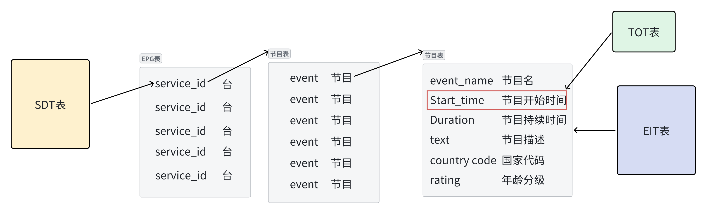

1. 从SDT表中可以得到有多少个Service（唯一标识符`service_id`），其中每一个Service中的descriptor中的Service_descriptor描述子中存着节目名`event_name`。
2. EIT表中也有节目ID`service_id` 
3. EIT表中的`events`循环中的`Start_time`和`Duration`字段中记录着节目开始时间和节目长度。
4. EIT表中的`events`循环中的`shot_event_descriptor`描述子里藏着节目名`event_name`和描述信息`text`。`Parental rating descriptor`描述子里藏着国家代码`country code`和年龄分级`rating`。`Content descriptor`描述子里藏着内容类别`content nibble level 1`

## 第十四章 QT界面❗

### 14.1 参考视频

https://www.bilibili.com/video/BV1g4411H78N/

https://www.bilibili.com/video/BV1XW411x7NU/

### 14.2 QT界面

本人的QT界面如下所示：

框架图：

QTreeWidget 区域主要使用树形结构数据显示表信息

QLineEdit 和右边的按钮相结合是选择文件用的

QTextEdit1 是用来显示段头信息以及描述子信息的

QTextEdit2 是用来以十六进制的形式展示段信息的

运行时效果图：

### 14.3 选择码流文件

#### 14.3.1 功能描述

1. 点击打开文件按钮，弹出文件选择框（QFileDialog形式）
2. 文件选择框打开的默认路径为获取系统当前目录
3. 文件选择框中由于视频**文件过滤器的作用只显示****.ts****文件**
4. 文件选择框中点击打开按钮时，**若选择了文件**则提示“您选择的文件路径为：`文件路径`”，**若未选择文件**则提示"您没有选择文件！！！请重新选择文件"。

1. 成功选择文件后QLineEdit 框**显示所选文件路径以及文件名**。

#### 14.3.2 实现思路-槽函数与`QFileDialog`

通过打开文件按钮槽函数void MainWindow::on_openButton_clicked()实现。

1. 获取当前系统的用户主目录路径和设置打开文件对话框标题及文件过滤器：
   1. 使用`QDir::homePath()`函数**获取当前系统的用户主目录路径**，保存在`strCurrentPath`变量中。
   2. 设置打开文件对话框标题为"请选择TS码流文件"，过滤器为"TS Files(*.ts**);;All Files(*.*)"，分别保存在`strDlgTitle`和`strFilter`变量中。
2. 打开文件对话框，获取用户选择的文件路径：
   1. 使用`QFileDialog::getOpenFileName`函数**弹出一个文件选择对话框**，显示标题为`strDlgTitle`，默认路径为`strCurrentPath`，并**应用文件****过滤器**`strFilter`。
   2. 如果用户选择了一个文件，则将文件路径保存在`strAllFiles`变量中。
3. 检查是否成功选择了文件：
   1. 判断`strAllFiles`是否为空，如果为空则弹出提示框，提示用户未选择文件，然后返回。
   2. 如果用户选择了文件，用`QMessageBox::information`**弹出提示框**显示所选择的文件路径，然后继续执行后续操作。
4. 打开选中的文件并读取内容：
   1. 使用`QFile`类创建一个文件对象`file`，并传入选中的文件路径`strAllFiles`作为构造函数的参数。
   2. 调用`file.open(QIODevice::ReadOnly)`以只读模式打开文件，如果打开成功，**获取文件的底层文件句柄**保存在`fileDescriptor`变量中。
5. 调用解析函数进行解析：
   1. 调用`TsParase`函数，将之前获取的文件句柄`fileDescriptor`作为参数传递给它，以便对选中的 TS 码流文件进行解析。
6. 在界面上显示选中文件的路径：
   1. 使用`ui->filePathEdit`访问界面中的文本编辑框，将选中文件的路径`strAllFiles`设置为其文本内容，从而在界面上显示文件路径。

#### 14.3.3 主要代码

```C++
void MainWindow::on_openButton_clicked()
{
    QString strCurrentPath=QDir::homePath();//获取系统当前目录
    QString strDlgTitle="请选择TS码流文件";//打开文件对话框标题名称
    QString strFilter="TS Files(*.ts);;All Files(*.*)";//打开视频文件过滤器

    QString strAllFiles=QFileDialog::getOpenFileName(this,strDlgTitle,strCurrentPath,strFilter);
    if(strAllFiles.isEmpty())
    {
    QMessageBox::information(this,"提示","您没有选择文件！！！请重新选择文件",QMessageBox::Ok | QMessageBox::Cancel);
    }else
    {
    QMessageBox::information(this,"提示","您选择的文件路径为："+strAllFiles,QMessageBox::Ok | QMessageBox::Cancel);
    QFile file(strAllFiles);
    if (file.open(QIODevice::ReadOnly))
    {
    int fileDescriptor = file.handle(); // 获取底层文件句柄
    TsParase(fileDescriptor);
    }
    }

    ui->filePathEdit->setText(strAllFiles);
}
```

### 14.4 展示表树形结构

#### 14.4.1 功能描述

1. 成功选择文件后自动调用函数解析表信息
2. 将表信息**按照树形结构输出**到QTreeWidget 窗口，默认只展示根节点（表名信息）
3. 点击根节点前面的加号显示子节点，点击子节点前面的加号显示下一级子节点

#### 14.4.2 实现思路-Public方法

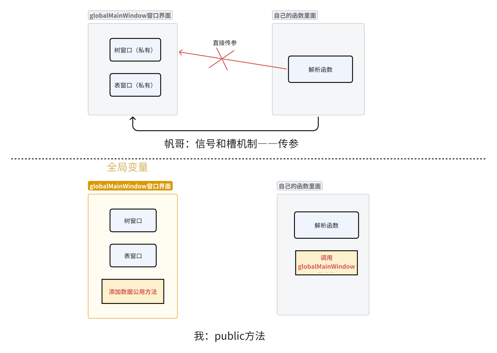

主函数部分的思路如下：

1. 创建一个 `MainWindow` 对象 `w`，它是程序的主窗口。然后通过调用 `w.show()` 显示主窗口。
2. 将 `w` 赋值给**全局变量** `globalMainWindow`，使得在其他地方也可以通过该全局变量来访问主窗口实例。
3. 调用 `a.exec()` 进入 Qt 的事件循环，等待事件的发生。
4. 在调用的解析函数`TsParase`中直接创建六个表的根节点

在输出函数部分的思路如下：

1. 构建一级子节点名 `nodeName`，所属内容是表的段号。
2. 使用全局变量 `globalMainWindow` 的方法 `getRootItemByText` 通过表名获取树状表格的根节点。
3. 如果根节点不为空，说明根节点存在，可以进行后续操作。
4. 使用 `globalMainWindow->addChildNode` 方法在根节点下添加一个一级子节点，名称为 `nodeName` 这里用来存放段中的具体数据。
5. 使用 `QByteArray` 构造一个字节数组，将表的数据（`data`）存入，然后使用 `setData` 方法将字节数组作为节点的自定义数据保存，这里是用来存着留给后面的展示十六进制信息的。
6. 使用 `globalMainWindow->addChildNode` 方法添加二级子节点，分别输出表中的各个字段信息，使用 `arg` 函数**格式化输出**。
7. 创建一个描述子节点 `DescriptorItem`，用于存放表中的描述子部分。
8. 遍历表中的每个节目信息，构建节目描述字符串，然后使用 `globalMainWindow->addChildNode` 方法添加到 `DescriptorItem` 节点下。

#### 14.4.3主要代码 

```C++
主函数：
    //全局变量，当前MainWindow
    MainWindow *globalMainWindow = nullptr;
int main(int argc, char *argv[])
{
    QApplication a(argc, argv);
    MainWindow w;
    w.show();
    globalMainWindow = &w; // 将 MainWindow 实例赋值给全局变量
    return a.exec();
}

输出函数：
//将以上内容添加到树表中
    QString nodeName = QString("Section %1").arg(pat.section_number);

    // 使用 getRootItemByText 函数获取特定文本的根节点
    QTreeWidgetItem *rootItem = globalMainWindow->getRootItemByText("PAT表");
    // 确保 rootItem 不为空，然后可以进行进一步操作
    if (rootItem)
    {
       //添加一级子节点Section
       QTreeWidgetItem *addedChildItem = globalMainWindow->addChildNode(rootItem,nodeName);


       //在添加一级子节点时，使用setData方法为节点设置自定义数据
       QByteArray byteArray(reinterpret_cast<const char *>(data), pat.section_len+3);
       addedChildItem->setData(0, Qt::UserRole, QVariant::fromValue(byteArray));
       //添加二级节点
       globalMainWindow->addChildNode(addedChildItem, QString("table_id: 0x%1").arg(pat.table_id, 2, 16, QChar('0')));//这才是对的
       globalMainWindow->addChildNode(addedChildItem, QString("section_syntax_indicator: 0x%1").arg(pat.section_syntax_indicator));
       globalMainWindow->addChildNode(addedChildItem, QString("section_len: 0x%1(%2)").arg(pat.section_len, 3, 16, QChar('0')).arg(pat.section_len));
       globalMainWindow->addChildNode(addedChildItem, QString("transport_stream_id: 0x%01").arg(pat.transport_stream_id, 4, 16, QChar('0')));
       globalMainWindow->addChildNode(addedChildItem, QString("version_num: 0x%1").arg(pat.version_num, 2, 16, QChar('0')));
       globalMainWindow->addChildNode(addedChildItem, QString("current_next_indicator: 0x%1").arg(pat.current_next_indicator));
       globalMainWindow->addChildNode(addedChildItem, QString("section_number: 0x%1(%2)").arg(pat.section_number, 2, 16, QChar('0')).arg(pat.section_number));
       globalMainWindow->addChildNode(addedChildItem, QString("last_section_number: 0x%1(%2)").arg(pat.last_section_number, 2, 16, QChar('0')).arg(pat.last_section_number));
       QTreeWidgetItem *DescriptorItem =globalMainWindow->addChildNode(addedChildItem, QString("programNum: %1").arg(pat.programNum));

       //描述子
       for (int i = 0; i < pat.programNum; i++)
       {
            QString programInfo = QString("Program %1: program_number: 0x%2(%3) → pid: 0x%4(%5)")
                                      .arg(i + 1)
                                      .arg(pat.programs[i].program_number, 4, 16, QChar('0'))
                                      .arg(pat.programs[i].program_number)
                                      .arg(pat.programs[i].program_map_pid, 4, 16, QChar('0'))
                                      .arg(pat.programs[i].program_map_pid);

            globalMainWindow->addChildNode(DescriptorItem, programInfo);
       }

       globalMainWindow->addChildNode(addedChildItem, QString("crc_32: 0x%1").arg(pat.crc, 8, 16, QChar('0')));
```

### 14.5 展示十六进制信息

#### 14.5.1 功能描述

1. 点击一级子节点（Section）信息，QTextEdit2 展示Section的十六进制数据信息

#### 14.5.2 实现思路-setData方法

由于一级子节点（Section）信息是`unsigned char *SectionBuffer`的形式，而且需要与我们的Section节点一一对应，因此我**采用自定义数据（Custom Data）****`setData`** **方法**来实现**一段数据与****树结构****的一级子节点的唯一绑定**。自定义数据是一种将额外的数据附加到Qt对象上的方法，这样就可以在需要时获取和使用这些数据。

1. `QByteArray byteArray(reinterpret_cast<const char *>(data), pat.section_len + 3);`：这行代码创建了一个 `QByteArray` 类型的对象 `byteArray`，并用给定的数据 `data` 初始化它。`reinterpret_cast<const char *>(data)` 将 `data` 数据解释为字符数组，而 `pat.section_len + 3` 表示要拷贝的字节数。因此，这个 `byteArray` 对象包含了一段指定长度的二进制数据。
2. `addedChildItem->setData(0, Qt::UserRole, QVariant::fromValue(byteArray));`：这行代码调用了 **`setData`** **方法**，将自定义数据设置给刚刚添加的一级子节点 `addedChildItem`。参数分别为：
   1. `0`：这是一个标识符，代表要设置的数据项的角色。在这里，`0` 代表 `Qt::UserRole`，表示用户自定义的角色。
   2. **`Qt::UserRole`**：这是一个预定义的枚举值，用于表示用户自定义的数据角色。Qt提供了一系列内置的数据角色，如 `Qt::DisplayRole` 用于显示文本数据，`Qt::CheckStateRole` 用于显示复选框状态等。
   3. **`QVariant::fromValue(byteArray)`****：这里将之前创建的** **`byteArray`** **转换为** **`QVariant`** **类型，并将其作为自定义数据设置给节点。**
3. 十六进制和右边的"字符"通过QString的格式化字符实现。

```C++
tmp = QString("%1 ").arg(pData[index], 2, 16, QLatin1Char('0'));
tmp = QString("%1").arg(get_printable_char(pData[index]));

char get_printable_char(unsigned char c)
{
    if(c >= 128 || c <=32)
    return '.';
    else
    return c;
}
```

#### 14.5.3 主要代码

```C++
 插入数据：
 //在添加一级子节点时，使用setData方法为节点设置自定义数据
 QByteArray byteArray(reinterpret_cast<const char *>(data), pat.section_len+3);
 addedChildItem->setData(0, Qt::UserRole, QVariant::fromValue(byteArray));
 取出数据：
 QVariant data = item->data(0, Qt::UserRole);
 if (data.isValid() && data.canConvert<QByteArray>())
 {
 QByteArray byteArray = data.toByteArray();
 // 调用 displayHex 函数显示十六进制数据
 displayHex(reinterpret_cast<unsigned char*>(byteArray.data()), byteArray.size());
 }
```

#### 14.5.4 QVariant类型

这一部分的实现使用了`QVariant`类型。

`QVariant` 是 Qt 框架中的一个类，**用于在不同****数据类型****之间提供类型安全的转换和传递。**它是 Qt 中的一个非常重要的概念，用于处理不同数据类型的值，同时还能够确保类型转换的安全性。

`QVariant` 可以容纳多种不同的数据类型，包括基本数据类型（如整数、浮点数、布尔值）、字符串、日期时间、自定义对象等。它的设计目标是允许开发人员以一种统一的方式处理不同的数据，而无需过多关注底层数据类型的细节。

通过使用 `QVariant`，开发人员可以在不显式转换类型的情况下，将数据存储在容器中，然后根据需要将其提取为正确的类型。例如，可以将整数、字符串和日期时间等数据都存储在 `QVariant` 中，然后根据需要将其转换为相应的类型。

```C++
 插入数据：
 data：一个段的有效载荷部分buffer unsigned char *data
 //在添加一级子节点时，使用setData方法为节点设置自定义数据
QByteArray byteArray(reinterpret_cast<const char *>(data), pat.section_len+3);
addedChildItem->setData(0, Qt::UserRole, QVariant::fromValue(byteArray));
QByteArray byteArray(reinterpret_cast<const char *>(data), pat.section_len+3);
```

1. 这行代码创建了一个名为 `byteArray` 的 `QByteArray` 对象。它使用了一个构造函数，该构造函数接受两个参数：
   1. `reinterpret_cast<const char *>(data)`: 这个部分将一个指向 `data` 的指针转换为一个指向 `const char` 类型的指针。这种类型转换通常用于将原始数据解释为字符数据。这个操作用于将 `data` 中的数据作为字符数据视图来处理。
   2. `pat.section_len+3`: 这个值被用作 `data` 的长度。因此，这行代码实际上将 `data` 的前 `pat.section_len+3` 个字节转换为 `QByteArray` 对象。这通常用于将原始数据转换为一个字节数组以进行进一步处理。

```
addedChildItem->setData(0, Qt::UserRole, QVariant::fromValue(byteArray));
```

1. 这行代码将一个数据项的自定义数据存储为一个 `QByteArray` 对象。假设 `addedChildItem` 是一个 `QTreeWidgetItem` 对象，您可以使用 `setData` 方法将数据与项关联起来。这个函数有三个参数：
   1. `0`: 这是列索引。在这种情况下，这是将数据附加到项的第一列。
   2. `Qt::UserRole`: 这是一个预定义的枚举值，用于表示用户自定义的数据角色。您可以使用它来存储与项相关的自定义数据。这里表明我要存储的数据类型是我自己定义的不是QT原本有的。
   3. `QVariant::fromValue(byteArray)`: 这是要存储的数据。`QVariant` 是 Qt 用于在不同数据类型之间进行转换的类。在这里，它用于将 `QByteArray` 转换为 `QVariant`，然后存储在项的自定义数据角色中。

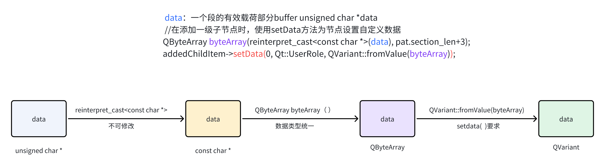

**好处：** **数据类型****统一：****`setData`** **方法要求传递的数据类型是** **`QVariant`****，这是** **Qt** **中用于处理各种数据类型的通用封装。将** **`QByteArray`** **封装在** **`QVariant`** **中后，数据类型就统一了，可以在** **`QTreeWidgetItem`** **中的任何地方存储和获取这个数据。**

### 14.6 展示段信息和描述子信息

#### 14.6.1 功能描述

1. 点击一级子节点（Section），QTextEdit1 展示段头信息
2. 点击描述子节点信息，QTextEdit1 展示描述子信息

#### 14.6.2 实现思路-QMap

这一部分的功能涉及两种数据，一种是段头信息，另一种是描述子信息。由于第一种信息需要与段的节点唯一绑定，但是段的节点我们已经在上一步使用过了绑定数据，因此需要想别的方法解决。第二种信息深入了多层的函数内部进行的输出，因此需要改到描述子输出函数内部去。

`QMap` 是 Qt 框架中的一个关联容器类，用于存储**键值对**（key-value pairs），其中的键（key）是唯一的，而值（value）可以与键关联。它是一个有序的容器，即按照键的排序顺序来存储元素。

1. 创建**`OutputData`****结构体**用来存储相关信息，在`MainWindow`类中创建`QMap` 类型的公共成员变量`outputMap`
2. `OutputData outputData;`：创建一个名为 `outputData` 的 `OutputData` 类型的对象，用于存储输出数据。
3. 使用一系列的 **`outputData.storedOutput`**` += ...` 语句，将解析出来的不同字段的数据以指定格式添加到 `outputData` 的 `storedOutput` 字段中。每个字段的内容会根据相应的格式要求，使用 `arg` 函数将数据格式化成字符串，并添加到 `storedOutput` 中。
4. **`globalMainWindow->outputMap.insert(addedChildItem, outputData);`**：将刚刚构建好的 `outputData` 对象与对应的一级子节点 `addedChildItem` 关联起来。这是通过将一级子节点作为键，`outputData` 作为值，插入到 `outputMap` 中实现的。这样，在右边页面显示相关信息的时候，可以根据节点找到对应的输出数据。
5. 随后的循环中，同样的方式将解析出来的描述子数据添加到 `DescriptorData` 中。
6. `globalMainWindow->outputMap.insert(DescriptorItem, DescriptorData);`：将描述子数据与对应的节点 `DescriptorItem` 关联起来，插入到 `outputMap` 中。
7. 需要的时候直接通过`outputMap.value(item)`获取到数据

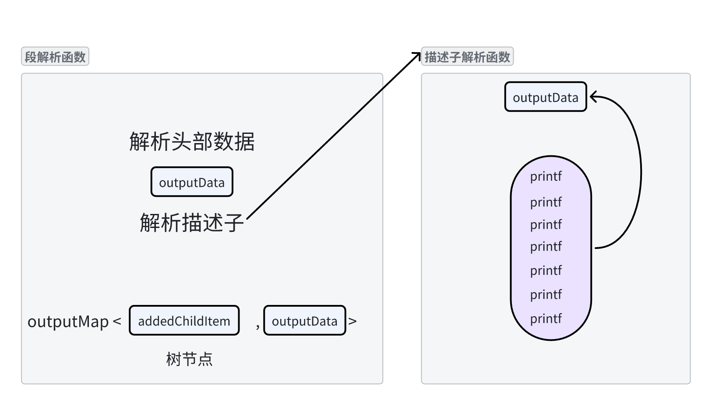

#### 14.6.3 主要代码

```C++
结构体：
struct OutputData
{
    QString storedOutput;
};
在MainWindow类中：
QMap<QTreeWidgetItem*, OutputData> outputMap;
插入数据：
  //展示到右边页面中
       OutputData outputData;

       outputData.storedOutput += QString("table_id: 0x%1\n").arg(pat.table_id, 2, 16, QLatin1Char('0'));
       outputData.storedOutput += QString("section_syntax_indicator: 0x%1\n").arg(pat.section_syntax_indicator);
       outputData.storedOutput += QString("section_len: 0x%1(%2)\n").arg(pat.section_len, 3, 16, QLatin1Char('0')).arg(pat.section_len);
       outputData.storedOutput += QString("transport_stream_id: 0x%1\n").arg(pat.transport_stream_id, 4, 16, QLatin1Char('0'));
       outputData.storedOutput += QString("version_num: 0x%1\n").arg(pat.version_num, 2, 16, QLatin1Char('0'));
       outputData.storedOutput += QString("current_next_indicator: 0x%1\n").arg(pat.current_next_indicator);
       outputData.storedOutput += QString("section_number: 0x%1(%2)\n").arg(pat.section_number, 2, 16, QLatin1Char('0')).arg(pat.section_number);
       outputData.storedOutput += QString("last_section_number: 0x%1(%2)\n").arg(pat.last_section_number, 2, 16, QLatin1Char('0')).arg(pat.last_section_number);

       outputData.storedOutput += QString("crc_32: 0x%1\n").arg(pat.crc, 8, 16, QLatin1Char('0'));

       globalMainWindow->outputMap.insert(addedChildItem,outputData);
       //描述子
       OutputData DescriptorData;
       for (int i = 0; i < pat.programNum; i++)
       {
            DescriptorData.storedOutput += QString("Program %1:\n program_number: 0x%2(%3) → pid: 0x%4(%5)\n")
                                      .arg(i + 1)
                                      .arg(pat.programs[i].program_number, 4, 16, QChar('0'))
                                      .arg(pat.programs[i].program_number)
                                      .arg(pat.programs[i].program_map_pid, 4, 16, QChar('0'))
                                      .arg(pat.programs[i].program_map_pid);
       }
        globalMainWindow->outputMap.insert(DescriptorItem,DescriptorData);
    }
取出数据：
 OutputData outputData = outputMap.value(item);
 ui->baseInfoTextEdit->setText(outputData.storedOutput);
```

### 14.7 展示EPG表信息

#### 14.7.1 功能描述

1. 当读取并解析好TS文件后，绘制EPG表中的业务信息到`EPG_Tree`的树形窗口中，绘制EPG表中的事件的表格到`EPG_Table` 表格窗口中。
2. 当点击左边树结构的业务名时，**筛选**右边的事件信息。
3. 当鼠标悬停在描述部分窗格时，显示**浮空**栏展示全部内容
4. **修正**EPG表的时间信息

由于从EIP表中拿出来的时间信息是需要修正的要通过TOT表的 `Local_time_offset`修正所以需要读取TOT表描述子然后提取出时间偏移量再对时间修改。

#### 14.7.2 实现思路

我的EPG表信息大部分从EIT表中读取，因此只需要在对EIT表的代码做出修改就可以了。

树结构和表结构：

1. 树结构在解析函数中直接插入。表结构由于有字段的区别，因此我定义了一个结构体struct EPGInfo，用来存储不同列的数据信息，然后通过`globalMainWindow->addRowToTable(epgInfo);`插入数据，其中`addRowToTable`是自己写的公用插入方法。

#### 14.7.3 主要代码

```C++
结构体：
struct EPGInfo
{
    QString serviceID;
    QString eventID;
    QString eventName;
    QString startTime;
    QString duration;
    QString eventDescription;
};
主要代码：
        QTreeWidgetItem *ServiceID = globalMainWindow->addEPG(QString("service_id: 0x%1").arg(eit.service_id, 4, 16, QChar('0')));
        // 创建一个新的子节点，并将结构体成员数据添加到该子节点
        QTreeWidgetItem *epgItem = new QTreeWidgetItem(ServiceID);
        epgItem->setText(0, "EPG Info"); // 设置子节点文本
        // 将子节点添加到 ServiceID 子节点中
        ServiceID->addChild(epgItem);
        
         EPGInfo epgInfo ;

        epgInfo.eventID = QString("0x%1").arg(eit.eitInfos[nLoopTime].unEvent_id, 2, 16, QChar('0'));

        // 获取 Start_time 并格式化为 QTime
        epgInfo.startTime =  QString("%1:%2:%3").arg(acUTC_time);


        // 获取 Duration 并格式化为 QString
        epgInfo.duration = QString("%1:%2:%3")
                               .arg(eit.eitInfos[nLoopTime].aunDuration[0], 2, 16, QChar('0'))
                               .arg(eit.eitInfos[nLoopTime].aunDuration[1], 2, 16, QChar('0'))
                               .arg(eit.eitInfos[nLoopTime].aunDuration[2], 2, 16, QChar('0'));
                               
        processDescriptorData(DescriptorData.storedOutput, epgInfo);
        // 将结构体成员数据添加到子节点
        globalMainWindow->addChildNode(epgItem, "Event ID: " + epgInfo.eventID);
        globalMainWindow->addChildNode(epgItem, "Event Name: " + epgInfo.eventName);
        globalMainWindow->addChildNode(epgItem, "Start Time: " + (epgInfo.startTime).left(19));
        globalMainWindow->addChildNode(epgItem, "Duration: " + epgInfo.duration);
        QTreeWidgetItem *textItem = globalMainWindow->addChildNode(epgItem, "Event Description: " + epgInfo.eventDescription);
        textItem->setToolTip(0,epgInfo.eventDescription);       
```

## 感悟

1. 一定要先有宏观的理解和把控。
   1. Section
   2. TOT
2. 一定要看**标准文档**