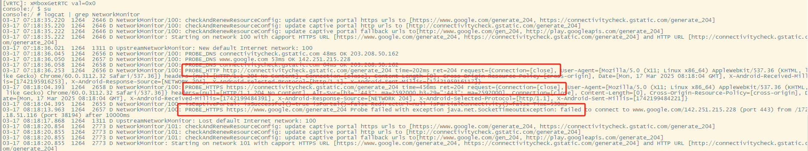
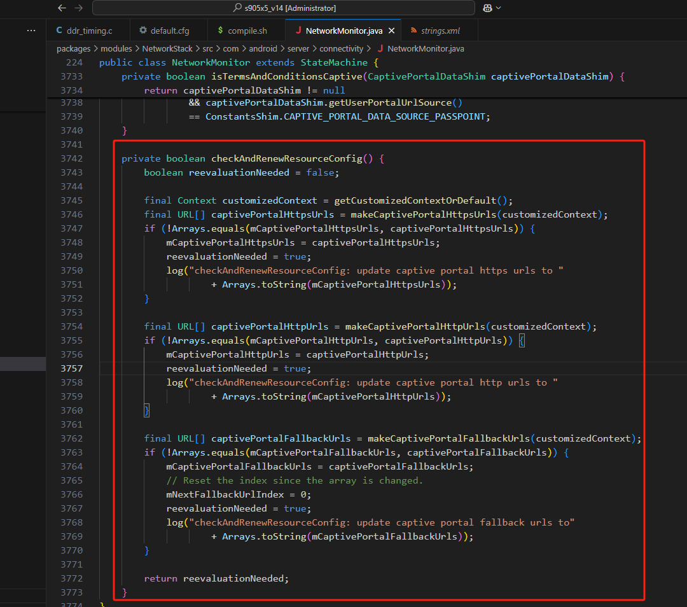
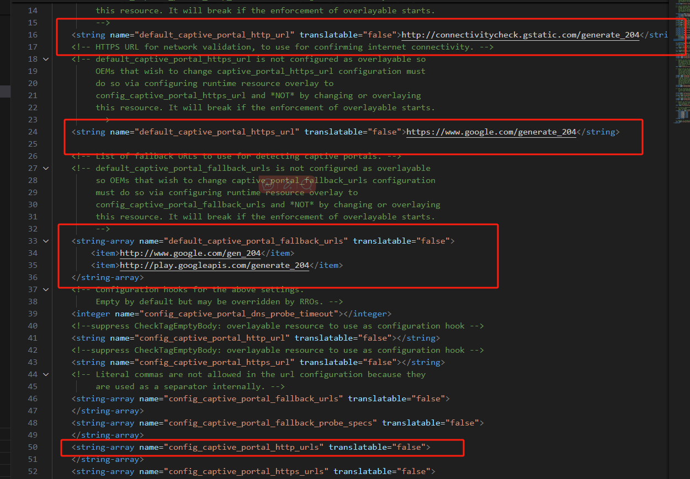

# Wifi连接受限、无法自动重连修改，安卓14。

## 一、前言

Android 系统连接WIFI提示网络受限处理这个是比较常见的问题了，这里简单记录一下。

Android原生系统连接国内wifi网络会提示不可用，之后显示网络受限，但是实际可以上网；连接国外VPN网络是没有这个问题的。

这个问题的原因就是**系统连接上wifi后校验网络的时候，使用的是一个国外的校验url地址，但是国内访问这个地址是无法返回数据的。**
所以系统才会判断该wifi是受限的。并且无法重新连接。

要解决这个问题，有两种方法：

一个是替换了校验网络的url地址，另外一个是去除这个校验过程。

本人考虑校验网络的意义，保留了校验功能，**去除校验过程**可以查看参考底部博客链接。

## 二、分析处理

### 1、NetworkMonitor 网络监视器
连接wifi时打印的日志：

```shell
adb shell logcat | grep NetworkMonitor
```

这里可以看到访问https://www.google.com/generate_204返回失败的。而访问http://connectivitycheck.gstatic.com/generate_204和https://connectivitycheck.gstatic.com/generate_204都是成功的。

这是因为`connectivitycheck.gstatic.com/generate_204`这个校验地址是通用的支持国内国外访问。这也是google官方提供的一个校验url地址。默认是没有https://connectivitycheck.gstatic.com/generate_204，这是我后面加的，所以你看到的打印是我修改后的打印。

### 2、源码分析

上述打印的信息来自以下源码：

`package\modules\NetworkStack\src\com\android\server\connectivity\NetworkMonitor.java`

感兴趣的可以通过打印追踪一下代码的流程。



这里可以看到读取了三种配置，一种是https，http还有一个Fallback(备用的)url，连接wifi时会校验http和https，主要是https，如果这两个校验有一个不通过就会校验备用的url。

主要的配置文件：

`package\modules\NetworkStack\res\values\config.xml`



这里我们可以看到默认的https、http和fallback_urls的配置。除了第一行能提供内网访问、其它都是一些外网的校验地址，因此我们可以改成能兼容国内外的校验地址，或在最下面数组类型的配置里面加自己想加的地址。数组内地地址会遍历校验，只要有一个校验地址通过，wifi就会正常连接。

下面是一些校验地址：

```java
小米：http://connect.rom.miui.com/generate_204
华为：http://connectivitycheck.platform.hicloud.com/generate_204
Vivo：http://wifi.vivo.com.cn/generate_204
谷歌中国内网：g.cn/generate_204
通用：connectivitycheck.gstatic.com / www.gstatic.com / ssl.gstatic.com ，国内会自动解析到北京Google那边，在境外的话又能解析到Google全球网络。
```

**本文参考以下博客**：

[解决Android/安卓原生ROM出现网络连接受限（Limited connection），网络无法链接的问题 - 很多无尾熊 - 博客园](https://www.cnblogs.com/gnz48/p/16433726.html)

[Android 系统连接WIFI显示网络连接受限分析处理_安卓原生系统网络受限-CSDN博客](https://blog.csdn.net/wenzhi20102321/article/details/141533064?ops_request_misc=&request_id=&biz_id=102&utm_term=Android wifi 修改HTTPS校验网址&utm_medium=distribute.pc_search_result.none-task-blog-2~all~sobaiduweb~default-1-141533064.142)


