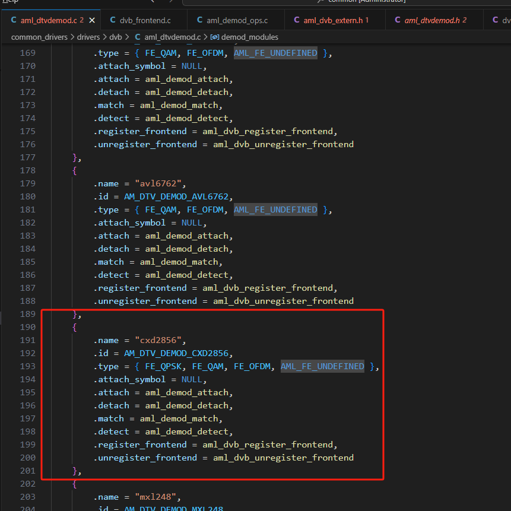
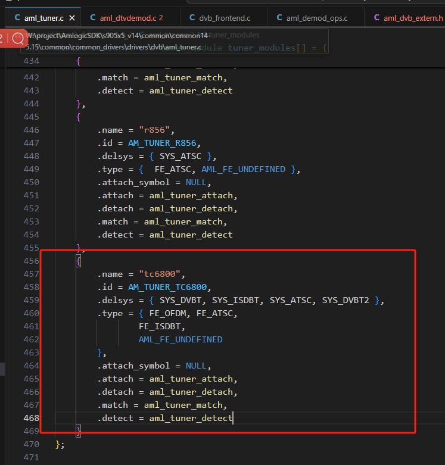
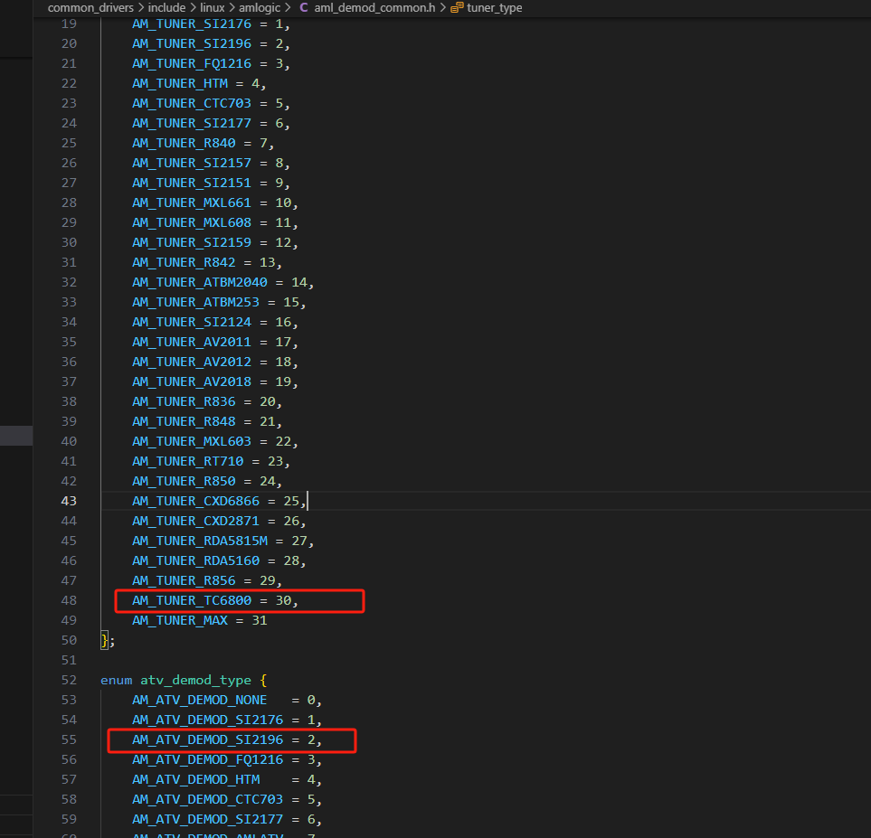
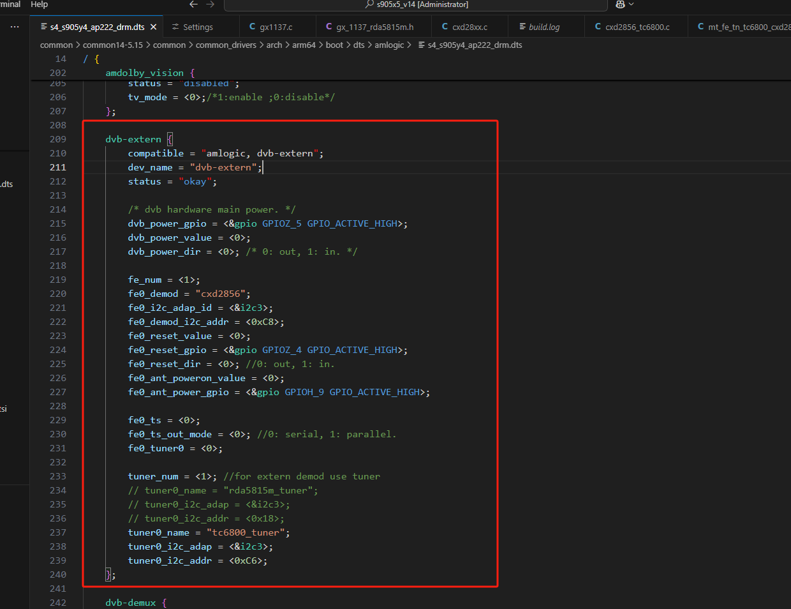
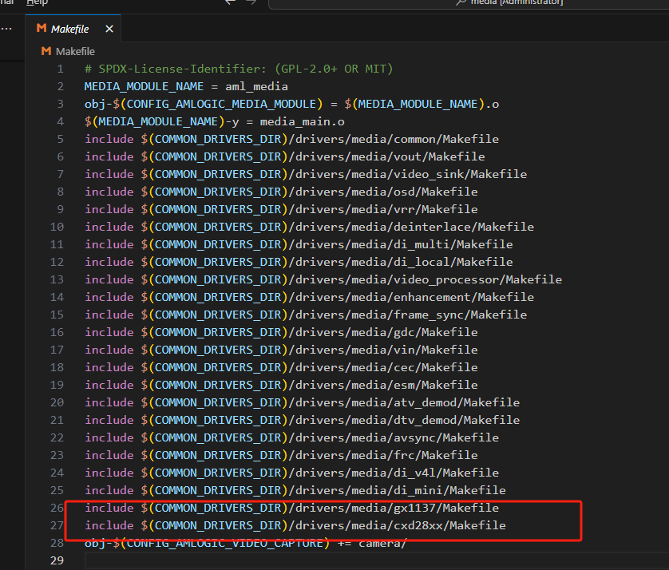
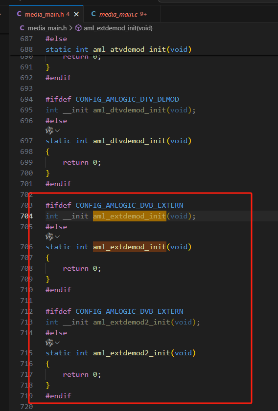
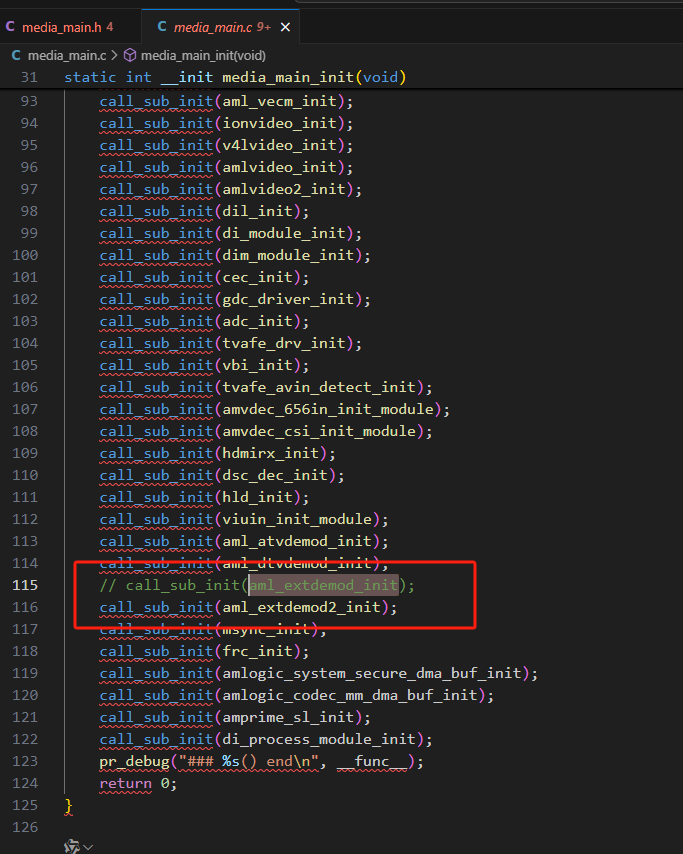

# Y4,Tuner&Demod调试

对Y4板子进行，调试Tunner与Demod.

## 概念

### 一、Tuner（调谐器）

**功能:**

- 负责接收射频（RF）信号，例如来自有线电视线、卫星天线或地面波天线的信号。
- 通过选择特定的频率（频道），从复杂的混合信号中提取目标频道的信号。

**工作原理**：

- 类似于传统电视机或收音机的调谐功能，通过调整频率锁定用户选择的频道。调谐器负责从LNB接收中频信号，并锁定目标转发器的频率范围。
- 支持不同的信号标准（如DVB-C、DVB-S2、ATSC、ISDB-T等，取决于地区和服务商）。

### 二、Demodulator（解调器）

**功能：**

- 将从Tuner接收到的射频信号（模拟或数字调制信号）转换为数字信号流（如TS流，Transport Stream）。
- 解调过程包括解码、纠错、解调调制信号（如QAM、QPSK、OFDM等）。

**工作原理**：

- 针对不同的信号调制方式（例如有线电视常用QAM，卫星电视用QPSK），Demodulator会采用对应的解调算法。
- 输出标准化的数字信号，供后续的解码芯片处理。

**应用场景**：

* 将广播信号转换为机顶盒主芯片可以处理的数字格式，以便进一步解码为音视频内容。

------

### 三、Tuner & Demod的协同工作流程

1. **信号接收**：Tuner从天线或有线电视接口接收射频信号，并锁定到用户选择的频道频率。
2. **信号解调**：Demodulator将调谐后的高频信号解调为基带数字信号（TS流）。
3. **解码与播放**：主芯片（如Amlogic、Rockchip等）对TS流进行解码，最终输出音视频到电视。

## 目标：实现搜索节目、节目播放

### 一、卫星搜索 Satellite Search

#### 卫星参数

1. **卫星名称（Satellite Name）**：这是卫星的标识，比如国际通用的名称或编号，如Intelsat 19、AsiaSat 5等。不同的卫星位于不同的轨道位置，对应不同的经度，因此名称帮助用户确定要连接的卫星。例如，选择正确的卫星名称可以自动填充该卫星的轨道位置和其他预设参数，减少手动输入错误。

2. **卫星角度（Satellite Angle）、卫星方向（Satellite Direction）**：指卫星所在的轨道位置相对于接收点的方向，比如东经或西经多少度。例如，东经108.2度的亚洲5号卫星。这个参数帮助确定卫星在地球同步轨道上的位置，从而计算出正确的仰角和方位角。接收器需要知道卫星的轨道位置才能计算天线指向的调整参数。

3. **频段（Band）**：卫星信号通常分为C频段和Ku频段，不同频段的频率范围不同，对应的LNB（低噪声降频器）和接收设备也不同。C频段通常为3.4-4.2 GHz，而Ku频段为10.7-12.75 GHz。正确选择频段确保接收器使用正确的本振频率（LNB Frequency）进行信号降频，并设置正确的频率范围以避免干扰或信号损失。

---

#### TP 转发器（Transponder）

在卫星信号接收中，**TP转发器（Transponder）** 是卫星上的核心设备，负责接收地面站上传的信号，经过频率转换和放大后，再向地面发送信号。每个转发器对应一组特定的参数，正确配置这些参数是接收卫星信号的关键。以下是 **TP参数** 的作用及其详细解释：

1. **频率（Frequency）**

   * **作用**：定义转发器的**下行信号频率**，决定接收设备的调谐范围。

   * 卫星信号频率分为 **C频段（3.4–4.2 GHz）** 和 **Ku频段（10.7–12.75 GHz）**，需与接收天线的LNB（高频头）匹配。 

   * **计算公式**： 
     *  接收机输入频率 = 下行频率 - LNB本振频率 
     *  示例：若转发器频率为 **12500 MHz**，LNB本振为 **10600 MHz**，则接收机输入频率为 **1900 MHz**。 

   * **错误影响**：频率设置错误会导致接收机无法锁定信号，表现为“无信号”或“信号强度低”。

2. **符号率（Symbol Rate, SR）**

   * **作用**：表示数据传输速率（单位：**MS/s，兆符号每秒**），影响信号带宽和解调稳定性。 
     *  符号率越高，可传输的数据量越大，但占用带宽更宽（带宽 ≈ 符号率 × 1.2）。 
     * 示例：符号率 **27500 MS/s** 的转发器，带宽约为 **33 MHz**。 

   * **实际应用**： 
     *  符号率需与卫星运营商公布的参数一致，否则无法解调信号。 
     * 低符号率（如 2000 MS/s）常用于窄带广播，高符号率（如 45000 MS/s）用于高清频道。 

   * **错误影响**：符号率偏差超过接收机容限（±1-2%）会导致图像卡顿或马赛克。

3. **极化方式（Polarity）**

   * **作用**：定义信号的电磁波振动方向，用于区分同一频段内的不同信号。 
     * **线性极化**：水平（H）和垂直（V）。  
     * **圆极化**：左旋圆极化（L）和右旋圆极化（R），多见于某些卫星（如 **ABS-6**）。 

   *  **LNB控制**： 
     * 接收机通过电压切换极化方式： 
     
       1. **13V** → 垂直极化（V）或左旋圆极化（L）。 
     
       2. **18V** → 水平极化（H）或右旋圆极化（R）。 
     
   *  **错误影响**：极化方式错误会导致信号完全丢失（如接收H极化信号时LNB设为V极化）。

4. **前向纠错（FEC, Forward Error Correction）**

   * **作用**：纠错编码比率，决定信号抗干扰能力。 
     *  常见值：**1/2、2/3、3/4、5/6、7/8**，表示有效数据占比。 
       * **FEC 1/2**：纠错能力最强，但有效数据率最低（50%带宽用于纠错）。 
       *  **FEC 7/8**：纠错能力最弱，有效数据率最高（87.5%带宽用于传输）。 

   * **实际应用**： 
     * 高FEC值（如7/8）适合信号质量好的地区（如晴天、大天线）。 
     *  低FEC值（如1/2）适合恶劣天气或小天线接收。 

   * **错误影响**：FEC设置错误会导致解码失败，即使信号强度足够也无法显示画面。

5. **参数间的协同关系**

   * **频率 + 极化方式** → 确定LNB的本振频率和电压。 

     * 示例：接收 **C频段 H极化 3920 MHz** 信号时： 

       使用C波段LNB（本振5150 MHz），接收机输入频率为 **5150 - 3920 = 1230 MHz**，同时LNB供电需设为18V（H极化）。 

   * **符号率 + FEC** → 决定信号解调的带宽和容错能力。 
     * 符号率越高，FEC值越大，对接收机性能要求越高。

---

#### LNB（Low Noise Block）

**LNB（Low Noise Block）**，中文称为**低噪声降频器**或**高频头**，是卫星接收系统中至关重要的组件，负责将卫星天线接收的微弱高频信号转换为适合接收机处理的中频信号。以下是LNB的详细解析：

**核心作用**

* **低噪声放大（Low Noise Amplification）**： 
  * 信号到达地面时极其微弱（通常低于-100 dBm），且混有宇宙噪声和大气噪声。 
  * LNB内置**低噪声放大器（LNA）**，将信号放大至可处理水平（如-60 dBm），同时最小化附加噪声（噪声系数可低至**0.1 dB**）。 
* **频率下变频（Frequency Downconversion）**： 
  *  卫星下行信号频率较高（C波段：**3.4–4.2 GHz**，Ku波段：**10.7–12.75 GHz**），无法直接通过同轴电缆传输。 
  * LNB通过**本振（Local Oscillator, LO）** 将高频信号转换为中频（**950–2150 MHz**），便于电缆传输和接收机调谐。 
* **计算公式**：
  * 中频输出 = 卫星下行频率 - LNB本振频率 
  * 示例：Ku波段LNB本振为**10600 MHz**，接收**12500 MHz**信号 → 中频输出为**12500 - 10600 = 1900 MHz**。 

**极化切换（Polarity Switching）**： 

*  通过接收机提供的电压（**13V/18V**）切换极化方式： 
  * **13V** → 垂直极化（V）或左旋圆极化（L）。 
  * **18V** → 水平极化（H）或右旋圆极化（R）。 

---

#### DisEqC、22KHz、Motor

DiSEqC、22KHz和Motor在卫星接收系统中涉及信号切换、设备控制和天线驱动的三个关键概念，

1. **DiSEqC（数字卫星设备控制协议）**
   * **定义与功能**： 
       DiSEqC（Digital Satellite Equipment Control）是一种通过卫星接收机发送数字指令控制外围设备的协议，主要用于：
     * **切换卫星信号源**：通过多入一出的中频切换器（如四切一开关）连接多颗卫星的LNB；
     *  **控制天线驱动设备**：如极轴座（Motor）的转动，实现自动换星；
     * **管理极化方式**：通过电压切换LNB的极化状态（H/V或L/R）。

   *  **版本差异**：
     * **DiSEqC 1.0**：单向控制四切一开关，通过22KHz信号传递切换指令（如端口1-4的编码）；
     * **DiSEqC 1.2**：支持双向通信，可驱动极轴座（Motor）自动调整天线方位角，实现多星定位；
     * **DiSEqC 2.0**：增强双向控制，支持设备状态反馈（如天线位置确认）。

2. **22KHz信号**
   * **核心作用**：
     * **切换LNB本振频率**：在Ku波段双本振LNB中，22KHz信号用于切换高频（10.6GHz）和低频（9.75GHz）本振，例如：
       * 关闭22KHz → 使用低本振（9.75GHz）接收10.7–11.9GHz信号；
       * 开启22KHz → 使用高本振（10.6GHz）接收11.55–12.75GHz信号。
     * **承载DiSEqC指令**：DiSEqC协议将控制信号调制到22KHz载波上，通过同轴电缆传输至切换开关或Motor。
   *  **实际应用**：
     * **独立22K开关**：可连接两路LNB（如双星接收），通过接收机输出的22KHz脉冲选择信号源；
     * **与DiSEqC协同**：例如在通用LNB中，22KHz信号结合DiSEqC指令实现多星切换。

3. **Motor（极轴驱动马达）**
   *  **功能与配置**：
     * **自动换星**：通过DiSEqC 1.2协议控制极轴座转动，根据预设卫星轨道位置调整天线方向；
     * **极化角自动补偿**：极轴天线安装时固定LNB极化角，马达转动时自动调整信号探针角度，无需手动调节；
     * **位置记忆**：接收机可保存多个卫星的“星位”，切换节目时自动驱动马达对准目标卫星。

# 调试命令

## 内核打印

echo 1 > /proc/sys/kernel/printk

echo 7 > /proc/sys/kernel/printk

### logcat | grep SpeechRecognition

## i2c

cat /sys/bus/i2c/devices/*/name

i2cdetect -l

i2cdetect -y

i2cdump -f -y 3 0x62

cat /sys/kernel/debug/gpio

adb shell am start com.android.tv.settings/.MainSettings 

adb shell input keyevent 439

# 在905x5m上添加驱动

demod定义的地方

`W:\project\AmlogicSDK\s905x5_v14\common\common14-5.15\common\common_drivers\drivers\dvb\aml_dtvdemod.c`

tuner定义的地方

`W:\project\AmlogicSDK\s905x5_v14\common\common14-5.15\common\common_drivers\drivers\dvb\aml_tuner.c`

demod和tuner的类型定义

`W:\project\AmlogicSDK\s905x5_v14\common\common14-5.15\common\common_drivers\include\linux\amlogic\aml_demod_common.h`

demod和tuner驱动配置

`W:\project\AmlogicSDK\s905x5_v14\common\common14-5.15\common\common_drivers\arch\arm64\boot\dts\amlogic\s4_s905y4_ap222_drm.dts`

编译对应的驱动代码

`W:\project\AmlogicSDK\s905x5_v14\common\common14-5.15\common\common_drivers\drivers\media\Makefile`

将初始化方法加入执行文件中

`W:\project\AmlogicSDK\s905x5_v14\common\common14-5.15\common\common_drivers\drivers\media\media_main.h

dvb_frontend方法实现

`W:\project\AmlogicSDK\s905x5_v14\common\common14-5.15\common\drivers\media\dvb-core\dvb_frontend.c`

ops方法实现

`W:\project\AmlogicSDK\s905x5_v14\common\common14-5.15\common\common_drivers\drivers\dvb\aml_demod_ops.c`

`W:\project\AmlogicSDK\s905x5_v14\common\common14-5.15\common\common_drivers\drivers\dvb\aml_tuner_ops.c`

W:\project\AmlogicSDK\s905x5_v14\common\common14-5.15\common\common_drivers\include\linux\amlogic\aml_dvb_extern.h
