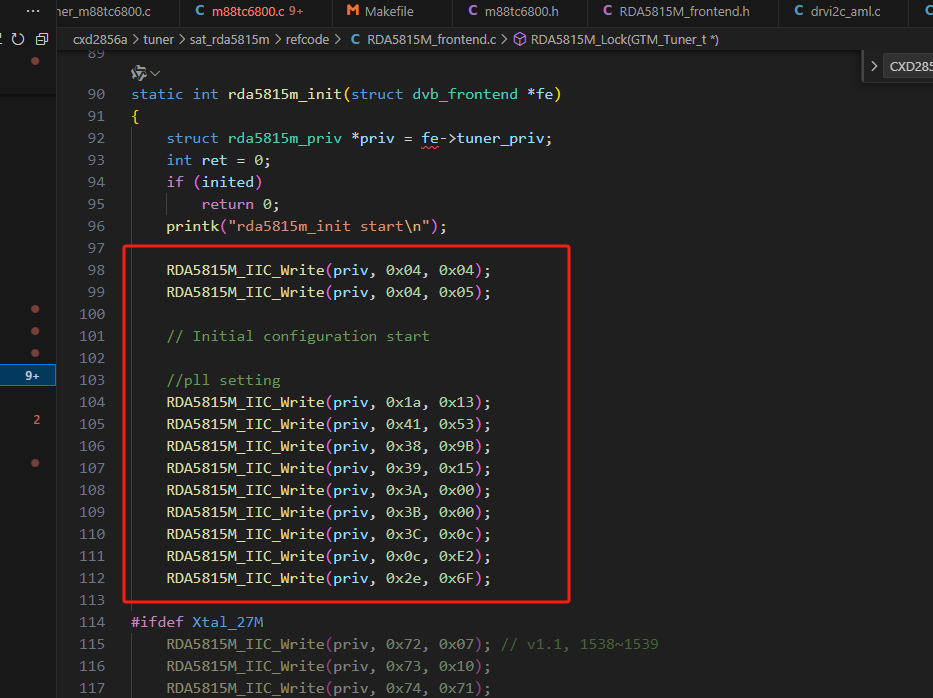
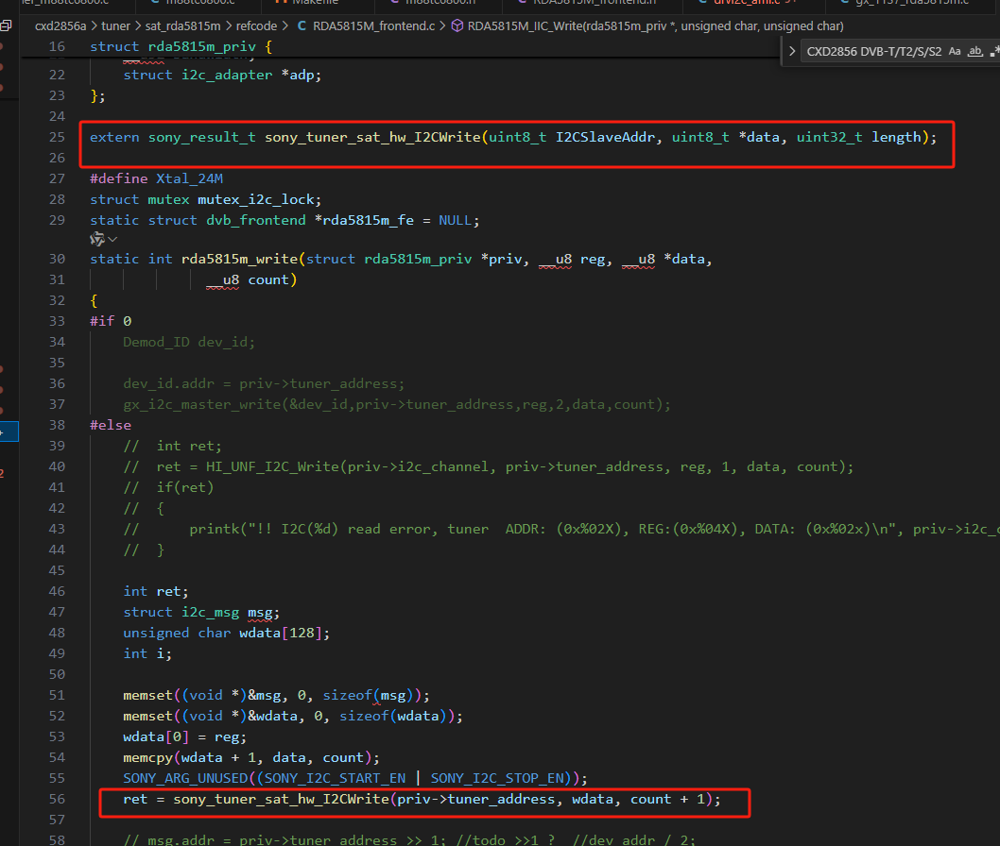

# Y4,Tuner&Demod调试

总结对S905Y4板子调试Tuner与Demod.

## 概念

### 一、Tuner（调谐器）

**功能:**

- 负责接收射频（RF）信号，例如来自有线电视线、卫星天线或地面波天线的信号。
- 通过选择特定的频率（频道），从复杂的混合信号中提取目标频道的信号。

**工作原理**：

- 类似于传统电视机或收音机的调谐功能，通过调整频率锁定用户选择的频道。调谐器负责从LNB接收中频信号，并锁定目标转发器的频率范围。
- 支持不同的信号标准（如DVB-C、DVB-S2、ATSC、ISDB-T等，取决于地区和服务商）。

### 二、Demodulator（解调器）

**功能：**

- 将从Tuner接收到的射频信号（模拟或数字调制信号）转换为数字信号流（如TS流，Transport Stream）。
- 解调过程包括解码、纠错、解调调制信号（如QAM、QPSK、OFDM等）。

**工作原理**：

- 针对不同的信号调制方式（例如有线电视常用QAM，卫星电视用QPSK），Demodulator会采用对应的解调算法。
- 输出标准化的数字信号，供后续的解码芯片处理。

**应用场景**：

* 将广播信号转换为机顶盒主芯片可以处理的数字格式，以便进一步解码为音视频内容。

------

### 三、Tuner & Demod的协同工作流程

1. **信号接收**：Tuner从天线或有线电视接口接收射频信号，并锁定到用户选择的频道频率。
2. **信号解调**：Demodulator将调谐后的高频信号解调为基带数字信号（TS流）。
3. **解码与播放**：主芯片（如Amlogic、Rockchip等）对TS流进行解码，最终输出音视频到电视。

## 调试步骤

### 步骤1: 获取驱动源码初步编译

驱动的代码获取，可以从其它sdk中移植过来，如果移植的版本与当前sdk版本差距太大的话，最好还是申请新的代码，询问硬件获取原厂未调试的驱动代码。（如果amlogic有适配调试过对应demod和tuner可同原厂供应商协商是否同意amlogic释放对应的代码。）

获取到代码后，就要思考如何把驱动安装到系统中，我们可以参考之前配过的tuner和demod的代码提交记录。

以y4为例：将cxd2856的demod驱动代码放置`common\common14-5.15\common\common_drivers\drivers\media`目录下面。

通过`W:\project\AmlogicSDK\s905x5_v14\common\common14-5.15\common\common_drivers\drivers\media\Makefile`文件进行编译


执行 `./kernel_build.sh `进行编译，添加log编译方便排查编译错误：`./kernel_build.sh 2>&1 | tee build.log`

**可能遇到的问题与解决方案**：

**Q1:** 找不到对应的方法

**A1:** 检查驱动代码的Makefile文件中`ccflags-y += -I`是否编译到了所有驱动代码的头文件

​	或检查对应的方法有没有受如`ccflags-y += -D`定义的编译宏所影响

**Q2:** 警告错误

**A2:** 在驱动代码的Makefile 中添加对应的Wno取消警告错误,例如：`ccflags-y += -Wno-int-conversion`

### 步骤2: 获取硬件配置信息确认I2C地址

tuner和demod同过i2c与cpu通信，所以首先需要确定tuner和demod使用的I2C，获取GPIO口 和对应的地址信息。下面以cxd2856，rda5815m和m88tc6800为例。

参考硬件的设计文档，确定使用的i2c的GPIO口和对应的tuner设备地址


上图DEMOD_I2C使用的是GPIOZ_8和GPIOZ_9这两个GPIO口。


设计图中tuner的i2c通过demod转发，说明demod与tuner使用同一个I2C总线，GPIO是一样的。

CPU通过I2C设备的地址，对不同设备进行发送信号。因此我们还需要获取地址信息，一般设计图会标注出来，如下图M88TC6800,地址是**0xC6**。


没有标注的地址，可以在设计图的右下角找到作者通过云之家进行询问。RDA5815m通过询问，地址是**0x18**

Sony demod的地址则要参考官方的**datasheet文档**


文档中的demod地址是跟随**SLVADR0和SLVADR3两个引脚的高低电平变化而改变**的，上面设计图中有这两个引脚，可以让硬件控制这块的高低电平改变Demode的i2c地址，一般默认是0，0。可以通过查询i2c地址确定。


如图0x66对应了0xCC，0x64对应了0xC8。如果使用命令没有查询到可能是Demod没有拉高电平，可以让硬件部门那边检查一下。

### 步骤3: 设置dts参数，定义并初始化注册驱动代码

获取了硬件的参数信息后，我们就可以定义驱动的代码，并且配置对应的参数信息。

#### ①配置dts（设备树）

安卓内核代码中一般会定义好一些i2c的adap供我们调用i2c方法使用，通过`i2cdetect -l`可以查看有哪些i2c总线。


因此我们要确认哪个i2c总线用的是GPIOZ_8和GPIOZ_9这两个GPIO口

在`common\common14-5.15\common\common_drivers\drivers\gpio\pinctrl\pinctrl-meson-s4.c`可以看到GPIOZ_8和GPIOZ_9对应了i2c3的引脚。


将tuner和demod的i2c和地址填入dts中


dts配置驱动设备的信息，可以在注册驱动代码的时候调用这些参数。

#### ②定义demod和tuner驱动

**定义类型id**

`common\common14-5.15\common\common_drivers\include\linux\amlogic\aml_demod_common.h`


**定义demod模块**

`common\common14-5.15\common\common_drivers\drivers\dvb\aml_dtvdemod.c`


**定义tuner模块**

`common\common14-5.15\common\common_drivers\drivers\dvb\aml_tuner.c`


**注：demod和tuner的name属性和dts中一致，tuner的name省略_tuner后缀**

#### ③注册demod驱动

**定义demod初始化方法**

`common\common14-5.15\common\common_drivers\drivers\media\media_main.h`


在init方法中调用，开机时会调用该部分代码


**在驱动中实现初始化方法**

原厂代码一般会提供初始化方法，注册驱动的方法的形式有很多种，这里只展示通过一种方式实现。是通过作为Media的子模块，并调用dvb_frontend中的**platform_driver_register**和**demod_attach_register_cb**方法实现注册驱动。一个是注册设备，一个是初始化驱动设备的挂载方法。

init中调用platform_driver_register和demod_attach_register_cb。

```c
int __init cxd2856_init(void)
{
	if (platform_driver_register(&aml_extdemod_driver))
		return -ENODEV;
	demod_attach_register_cb(AM_DTV_DEMOD_CXD2856, cxd2856_attach);    
	return 0;
}
```

```c
static struct platform_driver aml_extdemod_driver = {
	.driver = {
		.name = "aml_cxd2856_demod",
		.owner = THIS_MODULE,
		.pm = &ext_demod_pm_ops,
		/*aml_extdemod_dt_match*/
		.of_match_table = meson_extdemod_match,
	},
	.shutdown   = aml_extdemod_shutdown,
	.probe = aml_extdemod_probe,
	.remove = __exit_p(aml_extdemod_remove),
	.suspend  = aml_extdemod_suspend,
	.resume   = aml_extdemod_resume,
};

static const struct of_device_id meson_extdemod_match[] = {
	{
		.compatible = "amlogic, extdemod",
//		.data		= &data_ext,
	},
	/* DO NOT remove, to avoid scan err of KASAN */
	{}
};
//其它方法照抄
static __maybe_unused int ext_demod_pm_suspend(struct device *dev)
{
	return 0;
}

static __maybe_unused int ext_demod_pm_resume(struct device *dev)
{
	return 0;
}

static int __maybe_unused ext_demod_runtime_suspend(struct device *dev)
{
	return 0;
}

static int __maybe_unused ext_demod_runtime_resume(struct device *dev)
{
	return 0;
}

static const struct dev_pm_ops ext_demod_pm_ops = {
	SET_SYSTEM_SLEEP_PM_OPS(ext_demod_pm_suspend, ext_demod_pm_resume)
	SET_RUNTIME_PM_OPS(ext_demod_runtime_suspend,
			ext_demod_runtime_resume, NULL)
};

static int aml_extdemod_probe(struct platform_device *pdev)
{
	demod_attach_register_cb(AM_DTV_DEMOD_CXD2856, cxd2856_attach);
	return 0;
}
static void aml_extdemod_shutdown(struct platform_device *pdev)
{
	return;
}
static int __exit aml_extdemod_remove(struct platform_device *pdev)
{
	return 0;
}
static int aml_extdemod_suspend(struct platform_device *pdev, pm_message_t state)
{
	return 0;
}

static int aml_extdemod_resume(struct platform_device *pdev)
{
	return 0;
}
```

在对应的dts注册aml_extern_demod设备


**实现attach方法**

一般调试的demod代码中attach已经写好大部分，该方法注册demod 的 ops并调用demod驱动原本的init方法，attach中传入的`demod_config cfg`，对应了dts中dvb-extern的结构体。cfg中有demod和tuner的i2c  adapt地址和设备地址，可以提供给驱动代码内部的方法调用，进行初始化demod和创建对应的tuner。如果tuner有对应的attach也可以在这里调用，将fe参数传给tuner。

```c
struct dvb_frontend* cxd2856_attach(const struct demod_config *cfg)
{
    demod_ctrl *ctrlp = NULL;
    memcpy(&ctrlp->fe.ops, &cxd2856_ops, sizeof(struct dvb_frontend_ops));
    rda5815m_attach(&ctrlp->fe,&ctrlp->config.tuner1); // tuner attach，主要用来传递参数，tuner的init方法要看demod需要在哪调用。
    CXD2856_Init(ctrlp);//原厂提供的自定义初始化方法，用于设置参数创建对应的tuner
    return &ctrlp->fe;
}
```

ops若原厂已经实现，直接赋值给dvbfrontend的结构体，在attach中返回即可。dvb_stack会根据类型调用ops里的方法。

#### ④注册tuner驱动

tuner驱动的注册，不同的demod厂家有不同的注册方式，所以主要看demod中给出的注册案例。根据案例自己实现创建tuner的方法。

一般demod驱动直接通过系统框架注册tuner ，系统框架直接调用tuner的ops。

```c
//gx1137为例
struct dvb_frontend* gx1137_attach(const struct demod_config *card)
{
    struct gx1137_state* state = NULL;
    gx_1137_rda5815m_attach(&state->frontend, &card->tuner0);// tuner attach传递参数
    state->frontend.ops.tuner_ops.init(&state->frontend); // 直接调用tuner ops中的init ，需要注册ops
    return &state->frontend;
}

struct dvb_frontend *gx_1137_rda5815m_attach(struct dvb_frontend *fe, const struct tuner_config *card)
{
	struct gx_1137_rda5815m_priv *priv = NULL;

	priv = kzalloc(sizeof(struct gx_1137_rda5815m_priv), GFP_KERNEL);
	if (priv == NULL)
		return NULL;
//	memcpy(&priv->card, card, sizeof(struct tuner_config));
	memcpy(&fe->ops.tuner_ops, &gx_1137_rda5815m_ops,sizeof(struct dvb_tuner_ops));
	return fe;
}

```

但该方法在sony上行不通，因为sony在i2c读写上做了门控限制，导致init方法不能在其它地方调用，ops的方法也要在sony自己的框架中实现。

以sony 的 cxd2856为例


从代码中我们可以看出，我们要自己实现sony_tuner_rda5815m_Create方法，把tuner的方法挂载到pTunerTerrCable这个示例上面，demod通过调用pTunerTerrCable实例内的方法控制T类型的tuner。


pTunerSat实例则是控制S类型的tuner。跟踪搜索这两个示例可以看到tuner的创建到初始化的整个流程。


 **Tuner驱动注册的主要是要实现Init和Tune方法**。init用于初始化tuenr设备，tune用于搜索节目设置振幅和符号率。

因此，我们要在Init的时候调用Tuner驱动源码中的init方法，在tune中调用Tuner驱动源码中的set_frequency、set_bandwidth、set_symbolRate和set_params的方法。


### 步骤4: 配置dvbstack

按照右侧注释的内容设置之前获得的参数


在cfg文件中把**OTH_HW_DEMODE_MODEL**改成对应的值


将aml_init_front中的**fe_mode**改成对应tuner的类型，信号类型的切换与该参数相关。


### 步骤5: 从初始化到卫星搜索进行调试，添加打印排查错误。

#### ①demod初始化的检查

在demod的init方法开始到结束的地方多加打印，i2c的地址也可以加上打印，开机时通过串口打印排查哪里出了问题。看看i2c地址，方法参数有没有对上。


demod的初始化成功后会打印下面的信息


#### ②dvbstack的检查

在Android Studio查看dvbstack的打印,检查tuner是否init成功


系统init success后dvbstack会启动demod的ops里面的方法，init -> setproperty -> tune ，然后一直在tune的方法里面循环获取锁信号。


可以在set_frontend方法中把设置的参数都打印出来，方便核对。


### 步骤6: 查看I2C读写是否正常

在开机的时候，使用逻辑分析仪，读取i2c的读写数据，不知道怎么测i2c的话可以让硬件帮忙。




初始化这块的可以看到i2c读写的数据都是一一对应的，rda5815地址是0x18，写入0x04和0x04，返回的结果是ACK，如果返回的是NAK则说明写入失败。

## 问题总结

#### 问题1：打印I2C读写失败 

检查i2c adapt和设备地址是否一致，若一致的话，则通过步骤6，测试i2c写入的地址是否与你设置的地址一样。


测i2c地址如果发现写入的地址向左偏移了一位，可以在i2c读写前将地址右移一位（七位地址一般都要向右移一位）。

#### 问题2：i2cdetect 查询不到设置的tuner i2c 地址

明明tuner打印初始化成功了，i2c也没有打印错误，却查询不到关于配置i2c地址的信息。


因为设计图中tuner的信号是通过demod转发的，不是和cpu直接通信，所以看不到地址，这是正常的，不放心的话可以测一下tuner一端的i2c有没有读写信号。

#### 问题3：i2c打印报错，且返回-6，I2C写入时返回NAK

地址正确，-6代表找不到设备


原因是sony demod的i2c读写有限制，需要在门控开启时进行i2c读写操作，且i2c读写的方法要用sony自己的方法


这里可以可看到需要额外传入一个参数判断i2c的开启状态。



#### 问题4：init Fail，dvbstack初始化失败

参考步骤5查看dvbstack的打印。一种是模块初始化失败。


可以将未实现的模块注释掉。或者进到模块init方法里面加打印看看哪里出错了。

另一种是Fail to read partition，第一次烧录的时候没有配置3id，序列化一下就好了


#### 问题5：搜索不到节目

搜索不到节目，首先需要排除的是dvbstack的报错。出现错误信息可以在dvbstack里面全局搜索，速定位到出错的地方，然后在出错的方法加打印，分析具体错误的原因。dvbstack适配了多种模式支持T/T2,S/S2，可以在内核相关代码里面查找DTV_DELIVERY_SYSTEM看看有没有设置成对应的模式，dvbstack里面对应方法`static int aml_set_signal_type(int iTunerIndex, int iSignalType)`.

如果dvbstack没有报错，还是搜索不到节目，就要查看内核打印，排查tuner和demod方法的打印，看看从dvbstack传过来的参数是否和设置的参数，频率是否一致。


检查demod和tuner的XTAL，**Crystal（晶体振荡器）**频率是否一致，这里都是24MHz。


最后还是不行就在搜索节目的时候测一下i2c的读写，排查i2c读写问题。

## 总结

刚开始调试一定要多加打印，查看打印可以快速熟悉代码，排查错误。在编译初期，可以多看看参考代码，对比已经配好的驱动代码，梳理初始化驱动的流程，并且要阅读tuner或demod的相关文档，查看文档里面有没有相关的配置信息。在i2c方面，要通过硬件实际测量信号，不要依赖`i2cdetect`方法判断i2c设备地址有没有出现，事实上i2c读写正常，但是i2cdetect也查询不到你设置的i2c地址，在i2c读写时，打印判断地址和写入的数据是否一致。遇到问题的时候要分析出错的原因可能是哪些方面，不懂的话要及时向大佬提问，并且要把问题描述清楚。

# 卫星搜索 Satellite Search 参数介绍

#### 卫星参数

1. **卫星名称（Satellite Name）**：这是卫星的标识，比如国际通用的名称或编号，如Intelsat 19、AsiaSat 5等。

2. **卫星角度（Satellite Angle）、卫星方向（Satellite Direction）**：指卫星所在的轨道位置相对于接收点的方向，比如东经或西经多少度。

3. **频段（Band）**：卫星信号通常分为C频段和Ku频段，不同频段的频率范围不同，对应的LNB（低噪声降频器）和接收设备也不同。C频段通常为3.4-4.2 GHz，而Ku频段为10.7-12.75 GHz。正确选择频段确保接收器使用正确的本振频率（LNB Frequency）进行信号降频，并设置正确的频率范围以避免干扰或信号损失。

---

#### TP 转发器（Transponder）


在卫星信号接收中，**TP转发器（Transponder）** 是卫星上的核心设备，负责接收地面站上传的信号，经过频率转换和放大后，再向地面发送信号。每个转发器对应一组特定的参数，正确配置这些参数是接收卫星信号的关键。以下是 **TP参数** 的作用及其详细解释：

1. **频率（Frequency）**

   * **作用**：定义转发器的**下行信号频率**，决定接收设备的调谐范围。

   * 卫星信号频率分为 **C频段（3.4–4.2 GHz）** 和 **Ku频段（10.7–12.75 GHz）**，需与接收天线的LNB（高频头）匹配。 

   * **计算公式**： 
     *  接收机输入频率 = 下行频率 - LNB本振频率 
     *  示例：若转发器频率为 **12500 MHz**，LNB本振为 **10600 MHz**，则接收机输入频率为 **1900 MHz**。 

   * **错误影响**：频率设置错误会导致接收机无法锁定信号，表现为“无信号”或“信号强度低”。

2. **符号率（Symbol Rate, SR）**

   * **作用**：表示数据传输速率（单位：**MS/s，兆符号每秒**），影响信号带宽和解调稳定性。 
     *  符号率越高，可传输的数据量越大，但占用带宽更宽（带宽 ≈ 符号率 × 1.2）。 
     * 示例：符号率 **27500 MS/s** 的转发器，带宽约为 **33 MHz**。 

   * **实际应用**： 
     *  符号率需与卫星运营商公布的参数一致，否则无法解调信号。 
     * 低符号率（如 2000 MS/s）常用于窄带广播，高符号率（如 45000 MS/s）用于高清频道。 

   * **错误影响**：符号率偏差超过接收机容限（±1-2%）会导致图像卡顿或马赛克。

3. **极化方式（Polarity）**

   * **作用**：定义信号的电磁波振动方向，用于区分同一频段内的不同信号。 
     * **线性极化**：水平（H）和垂直（V）。  
     * **圆极化**：左旋圆极化（L）和右旋圆极化（R），多见于某些卫星（如 **ABS-6**）。 


   *  **LNB控制**： 
     * 接收机通过电压切换极化方式： 
     
       1. **13V** → 垂直极化（V）或左旋圆极化（L）。 
     
       2. **18V** → 水平极化（H）或右旋圆极化（R）。 
     
   *  **错误影响**：极化方式错误会导致信号完全丢失（如接收H极化信号时LNB设为V极化）。

4. **前向纠错（FEC, Forward Error Correction）**

   * **作用**：纠错编码比率，决定信号抗干扰能力。 
     *  常见值：**1/2、2/3、3/4、5/6、7/8**，表示有效数据占比。 
       * **FEC 1/2**：纠错能力最强，但有效数据率最低（50%带宽用于纠错）。 
       *  **FEC 7/8**：纠错能力最弱，有效数据率最高（87.5%带宽用于传输）。 

   * **实际应用**： 
     * 高FEC值（如7/8）适合信号质量好的地区（如晴天、大天线）。 
     *  低FEC值（如1/2）适合恶劣天气或小天线接收。 

   * **错误影响**：FEC设置错误会导致解码失败，即使信号强度足够也无法显示画面。

5. **参数间的协同关系**

   * **频率 + 极化方式** → 确定LNB的本振频率和电压。 

     * 示例：接收 **C频段 H极化 3920 MHz** 信号时： 

       使用C波段LNB（本振5150 MHz），接收机输入频率为 **5150 - 3920 = 1230 MHz**，同时LNB供电需设为18V（H极化）。 


   * **符号率 + FEC** → 决定信号解调的带宽和容错能力。 
     * 符号率越高，FEC值越大，对接收机性能要求越高。

---

#### LNB（Low Noise Block）

**LNB（Low Noise Block）**，中文称为**低噪声降频器**或**高频头**，是卫星接收系统中至关重要的组件，负责将卫星天线接收的微弱高频信号转换为适合接收机处理的中频信号。以下是LNB的详细解析：

**核心作用**

* **低噪声放大（Low Noise Amplification）**： 
  * 信号到达地面时极其微弱（通常低于-100 dBm），且混有宇宙噪声和大气噪声。 
  * LNB内置**低噪声放大器（LNA）**，将信号放大至可处理水平（如-60 dBm），同时最小化附加噪声（噪声系数可低至**0.1 dB**）。 
* **频率下变频（Frequency Downconversion）**： 
  *  卫星下行信号频率较高（C波段：**3.4–4.2 GHz**，Ku波段：**10.7–12.75 GHz**），无法直接通过同轴电缆传输。 
  * LNB通过**本振（Local Oscillator, LO）** 将高频信号转换为中频（**950–2150 MHz**），便于电缆传输和接收机调谐。 
* **计算公式**：
  * 中频输出 = 卫星下行频率 - LNB本振频率 
  * 示例：Ku波段LNB本振为**10600 MHz**，接收**12500 MHz**信号 → 中频输出为**12500 - 10600 = 1900 MHz**。 

**极化切换（Polarity Switching）**： 

*  通过接收机提供的电压（**13V/18V**）切换极化方式： 
  * **13V** → 垂直极化（V）或左旋圆极化（L）。 
  * **18V** → 水平极化（H）或右旋圆极化（R）。 

---

#### DisEqC、22KHz、Motor


DiSEqC、22KHz和Motor在卫星接收系统中涉及信号切换、设备控制和天线驱动的三个关键概念，

1. **DiSEqC（数字卫星设备控制协议）**
   * **定义与功能**： 
       DiSEqC（Digital Satellite Equipment Control）是一种通过卫星接收机发送数字指令控制外围设备的协议，主要用于：
     * **切换卫星信号源**：通过多入一出的中频切换器（如四切一开关）连接多颗卫星的LNB；
     *  **控制天线驱动设备**：如极轴座（Motor）的转动，实现自动换星；
     * **管理极化方式**：通过电压切换LNB的极化状态（H/V或L/R）。

   *  **版本差异**：
     * **DiSEqC 1.0**：单向控制四切一开关，通过22KHz信号传递切换指令（如端口1-4的编码）；
     * **DiSEqC 1.2**：支持双向通信，可驱动极轴座（Motor）自动调整天线方位角，实现多星定位；
     * **DiSEqC 2.0**：增强双向控制，支持设备状态反馈（如天线位置确认）。

2. **22KHz信号**
   * **核心作用**：
     * **切换LNB本振频率**：在Ku波段双本振LNB中，22KHz信号用于切换高频（10.6GHz）和低频（9.75GHz）本振，例如：
       * 关闭22KHz → 使用低本振（9.75GHz）接收10.7–11.9GHz信号；
       * 开启22KHz → 使用高本振（10.6GHz）接收11.55–12.75GHz信号。
     * **承载DiSEqC指令**：DiSEqC协议将控制信号调制到22KHz载波上，通过同轴电缆传输至切换开关或Motor。
   *  **实际应用**：
     * **独立22K开关**：可连接两路LNB（如双星接收），通过接收机输出的22KHz脉冲选择信号源；
     * **与DiSEqC协同**：例如在通用LNB中，22KHz信号结合DiSEqC指令实现多星切换。

3. **Motor（极轴驱动马达）**
   *  **功能与配置**：
     * **自动换星**：通过DiSEqC 1.2协议控制极轴座转动，根据预设卫星轨道位置调整天线方向；
     * **极化角自动补偿**：极轴天线安装时固定LNB极化角，马达转动时自动调整信号探针角度，无需手动调节；
     * **位置记忆**：接收机可保存多个卫星的“星位”，切换节目时自动驱动马达对准目标卫星。

# 调试命令

## 内核打印

关闭打印

echo 1 > /proc/sys/kernel/printk

开启打印

echo 7 > /proc/sys/kernel/printk

## i2c

查看i2c设备

cat /sys/bus/i2c/devices/*/name

i2cdetect -l

查看i2c寄存器的地址

i2cdetect -y 3

查看i2c寄存器0x62地址里面的内容

i2cdump -f -y 3 0x62

查看gpio口

cat /sys/kernel/debug/gpio

## 其它

adb shell am start com.android.tv.settings/.MainSettings

adb shell input keyevent 439

dvb_frontend方法实现

`common\common14-5.15\common\drivers\media\dvb-core\dvb_frontend.c`

ops方法实现

`common\common14-5.15\common\common_drivers\drivers\dvb\aml_demod_ops.c`

`common\common14-5.15\common\common_drivers\drivers\dvb\aml_tuner_ops.c`

