# dvb_stack编译与调试前控板总结

总结dvb_stack在新sdk板子中的初次编译与如何进行打印编译调试前控板。

## dvb_stack初次编译通过

### 一、下载

```shell
## 以s905x5_v14为例进入文件
cd vendor/amlogic/reference/external/
## 下载项目。
git clone git@192.168.1.232:dvbstack/dvbstack_8.0.git
## 切换分支
cd dvbstack_8.0
git checkout amlogic
```

修改文件名，将dvbstack_8.0重命名为dvb_stack.

### 二、编译dvbstack

sdk第一次编译dvbstack一定会失败，因此需要根据报错原因进行屏蔽代码。屏蔽与前控版无关的模块。

以下是可以提前预防的报错：

首先屏蔽dvbstack的根目录下Android.mk没有引入的模块。gs_serialize_manage 和 libiconv2

```makefile
# $(LOCAL_PATH)/../gs_serialize_manager/jni/serialize/src/security_check \
# $(LOCAL_PATH)/../gs_serialize_manager/jni/serialize/libs/inc/
# LOCAL_SHARED_LIBRARIES += libiconv2 libgsserializemanagerservice
# LOCAL_LDFLAGS += $(LOCAL_PATH)/../gs_serialize_manager/jni/serialize/libs/amlogic/otp_check/libotp_check.a
```

然后是加入有关S905X5M的判断，因为S905X5M与T950D4的代码相似，可以在dvbstack全局搜索：SUB_PLAT_AML_T950D4。找到有关T950D4的判断，都可以把S905x5M的判断补充上。

部分代码：

```makefile
添加S905X5M的定义 .\inc\gs_global_def.h
#define SUB_PLAT_AML_S905X5M 	17

添加头文件 .\src\GS_Api\src\gs_tuner_aml.c

#if(NORMAL_SUB_PLATFROM_TYPE==SUB_PLAT_AML_S905X5M)
#include "../../../common/common14-5.15/common/include/uapi/linux/dvb/frontend.h"
#endif

添加头文件 .\src\resource_middleware\src\demux_internal.c
#if(NORMAL_SUB_PLATFROM_TYPE==SUB_PLAT_AML_S905X5M)
#include "../../../common/common14-5.15/common/include/uapi/linux/dvb/dmx.h"
#endif

添加定义  .\src\GS_Api\src\gs_gpio.c
#if(NORMAL_SUB_PLATFROM_TYPE==SUB_PLAT_AML_S905X5M)
#define AML_MUTE_GPIO (498+9) //GPIOD_9
#endif
```

初步进行编译

```shell
# 回到主路径，进入编译环境
cd ../.././../../
source compile.sh

##进入dvb_stack
cd vendor/amlogic/reference/external/dvb_stack

## 编译
mm
## 输出log。
2>&1 | tee build.log
## 带log编译
mm 2>&1 | tee build.log
```

通过带log的编译去查找报错，在build.log文件中搜索` error:`

一开始大概有90多报错。

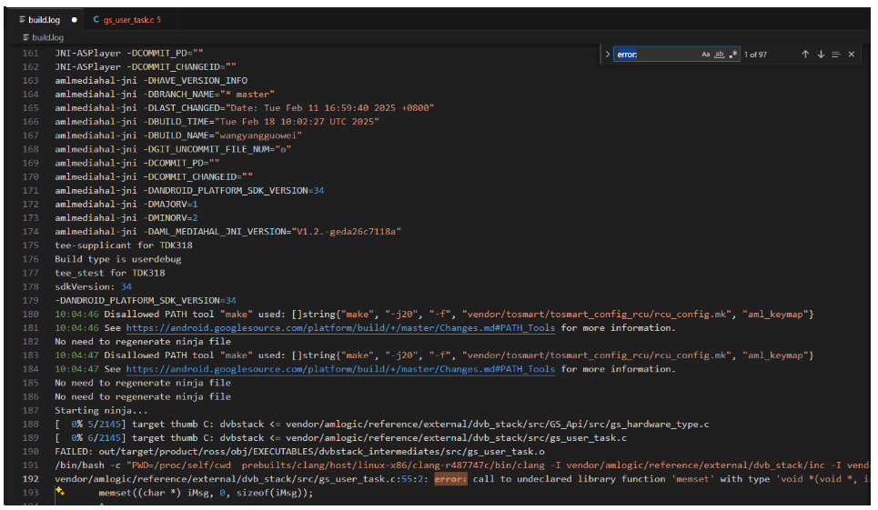

修改完一个error: 就删除一个，方便排查。多在dvbstack使用全局搜索。

### 三、分析和修改报错

报错主要分为三种：

错误类型一：**缺少C语言对应的标准库**。

错误类型二：**缺少本地库。**

错误类型三：**缺少方法和常量的定义**

#### 解决方法

**错误类型一**，主要通过观察报错的方法，是常见的命名，大概率是缺少c语言的标准库。如：memset、memcpy。

```c
添加标准库 .\src\gs_user_task.c
#include <string.h>  
```

**错误类型二**、主要是平台差异导致的头文件引入位置的不同

```c
添加头文件 .\src\resource_middleware\src\demux_internal.c
#if(NORMAL_SUB_PLATFROM_TYPE==SUB_PLAT_AML_S905X5M)
#include "../../../common/common14-5.15/common/include/uapi/linux/dvb/dmx.h"
#endif
```

**错误类型三**、主要是平台差异，一些模块没有实现，导致该模块的方法和常量无法使用。

```c
直接注释掉该方法或常量
// frontend_set_diseqc_10_port(iTunerIndex, disPort, hol, i22k);
如果该常量在一个方法里面，可以暂时把整个方法的内部实现全部注释掉
```

### 四、进行调试

编译通过后，将生成的dvb_stack文件推入到板子的vendor/bin或odm/bin中。需要开启remount权限。

s905x5m板子,开启remount.

```shell
进入fastboot模式：设备重新上电后，敲回车键，输入命令：fastboot 0
插入USB线
在window cmd 界面运行fastboot 命令：fastboot flashing unlock
注:fastboot flashing unlock 仅对s905x5m的板子有效，y4的到这一步报错
```

启动dvbstack ，进入到板子的vendor/bin或odm/bin中，执行：dvbstack &

第一次观察打印你会发现打印了Starting system...，然后后面一直进入报错循环。为让dvbstack顺利运行通过，我们需要阅读dvbstack启动时的源码，了解dvbstack启动的一个完整的过程。

dvbstack的启动从main.c文件启动，调用root的application_entry()方法。而application_entry()分为init_driver和init_dvb，前者初始化设备后者初始化dvb的各个模块。

```c
//屏蔽掉错误时调用的方法，防止一直循环。
int main(int argc, char** argv)
{
 printf("Starting system...\n");
 if (application_entry() != 0)
 {
  printf("Application entry failed!\n");
  // int gs_init_error_socket_bind(void);
  // gs_init_error_socket_bind();
 }
}

int application_entry(void)
{
 initDebugModule();
 if(init_driver_obj() != 0)
 {
  return -1;
 }
 if (init_dvb_obj() != 0)
 {
  return -1;
 }
 return 0;
}
```

在阅读代码时进行调试时可以将一些被注释掉的报错打印重新打开。

如：将init_driver和int_dvb打印报错的方法打开，可以知道哪个模块没有初始化成功。

```c
printf(" driver obj iIndex %d init error %s\n", iIndex, gstDriverStart[iIndex].pcDriverName);
printf(" dvb obj init iIndex %d error %s\n",iIndex, gstStart[iIndex].pcName);
```

如报错：

```shell
dvb obj init iIndex 8 error init_smc
dvb obj init iIndex 13 error dvb_demux_init_internal
dvb obj init iIndex 14 error gs_check_otp
```

根据报错屏蔽掉几个模块

```c
// { "SMC", init_smc, START_SMC},
// { "DEMUX", dvb_demux_init_internal, START_DEMUX},
// { "OTP", gs_check_otp, START_OTP},
```

为了方便查看错误，可以把SecureCRT的打印输出到一个session.log文件夹里。然后在log中搜索error。

最后在dvbstack中全局搜索打印的错误即可快速定位到错误的地方。

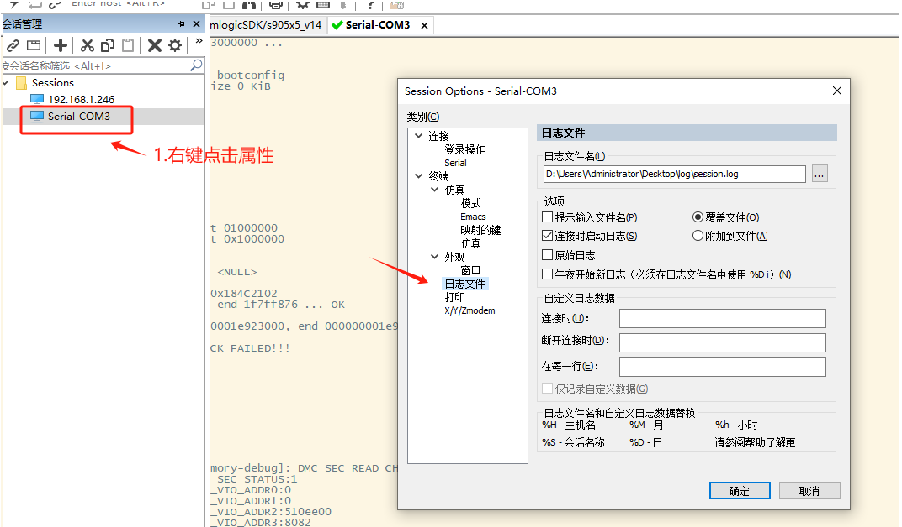

根据错误调试注释报错代码直到没有报错。

### 总结：

在编译和调试时遇到错误，可以在编译后面加上`2>&1 | tee build.log`将日志导出到.log文件夹中。然后通过搜索error、fault或fail等错误关键字定位到错误，通过错误信息去快速定位大致是哪里出错了。遇到难解决的报错也可以询问AI，大部分都能解决，解决不了就要及时沟通。

**善用搜索提高解决问题的效率**：有时候需要快速定位的错误的位置，或者了解程序之间的关联，搜索必不可少。

以下是常见的搜索命令

- get_build_var [build_var] 查找编译时各种变量值；
- get_abs_build_var [build_var] 获取系统中的编译变量的值
- cgrep [keyword] 所有 C/C++文件执行搜索操作
- jgrep [keyword] 所有 Java 文件执行搜索操作
- ggrep [keyword] 所有 Gradle 文件执行搜索操作
- **mgrep** [keyword] 所有 [Android.mk](http://android.mk/) 文件执行搜索操作
- mangrep [keyword] 所有AndroidManifest.xml文件执行搜索操作
- sepgrep [keyword] 所有 sepolicy 文件执行搜索操作
- resgrep [keyword] 所有本地res/*.xml文件执行搜索操作
- grep -rn [keyword] 递归寻找，在显示符合样式的那一行之前，标示出该行的列数编号。
- find . -name "*.mk" -not -path "./out/*" | xargs grep --color=auto -in "" 在.mk文件中并排除某路径查找某字段

**用VScode进行搜索心得**：不要在通过ssh连接的服务器项目地址下使用搜索，而是通过window文件夹连接服务器，再从window文件管理中将服务器文件夹拖拽到VScode进行搜索，后者的搜索速率明显提高。将dvbstack这样拖拽到VScode，搜索信息基本上是秒出。

dvbstack如果改错了一些地方**如何修复**?

在本地下载dvbstack最新的代码，可以通过**beyond compare**进行对比还原。

## 配置前控板

### 一、了解前控板的通信

思考CPU与LED前控板是如何建立通信的？我们通过阅读dvbstack源码，搜索有关fpanel的关键字，可以初步了解前控版初始化的整个流程和一些方法的实现。在这个过程我们不难发现有**gpio**、**spi**和**i2c**的一些陌生的关键字，这时候就要引出对这些关键词的概念，去真正理解前控版与cpu通信的整个流程。这些概念问题通过AI往往能得出不错的理解。

#### 1. **I2C和SPI的**概念

**I2C和SPI**都是常见的串行通信协议，用于微控制器和外设之间的通信。他们有以下特性：

|    **特性**    |            **I2C**             |          **SPI**           |
| :------------: | :----------------------------: | :------------------------: |
|  **引脚数量**  |        2线（SDA, SCL）         | 4线（MOSI, MISO, SCK, SS） |
|    **速度**    | 标准模式100kHz，快速模式400kHz |        可达数十MHz         |
| **多设备支持** |       多从设备，地址区分       |    每从设备需独立SS引脚    |
|   **复杂度**   | 协议较复杂，需处理地址和确认位 |     协议简单，直接传输     |
|  **适用场景**  |     低速、多设备、引脚有限     |     高速、实时性要求高     |

**I2C引脚含义：SDA（数据线）** 和 **SCL（时钟线）**

**SPI引脚含义：MOSI（主发从收）、MISO（从发主收）、SCK（时钟）、SS/CS（片选）**

#### 2. 通信原理（如何发送数据？）

I2C与SPI类似。虽然引脚数量不同，但原理极其相似。

首先是他们都有**起始信号**与**终止信号**。然后是**时钟信号**与**数据信号**配合读取数据。

SPI是：**起始信号**开始，然后走8个时钟信号和数据信号，每个时钟信号的时候看一下数据信号是高还是低。8bit对应一个字节。

|              |                **I2C**                 |          **SPI**          |
| :----------: | :------------------------------------: | :-----------------------: |
| **起始信号** | SCL高电平期间，SDA从高电平切换到低电平 |      SS电平由高到低       |
| **终止信号** | SCL高电平期间，SDA从低电平切换到高电平 |      SS电平由低到高       |
| **读取数据** |        SCL高电平时读取SDA的高低        | SCK低到高时读取MISO的高低 |

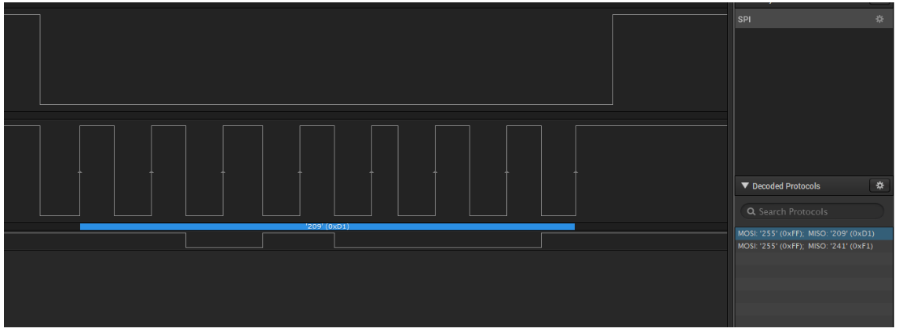

如图SPI发送数据的时序图。从上往下依次是SS、SCK、MISO(主设备输入从设备输出)

I2C则是：开始信号 --> 发送一个字节（7位从机地址 + 1位读(1) / 写(0)标志位） -- > 接收应答（每发送8位都要接收一次应答） --> 开始写入 8 位代表写入数据的指定地址 --> 接收应答（同上） --> 写入8位代表需要写入指定地址的数据 -- > 接收应答 -- > 结束信号。

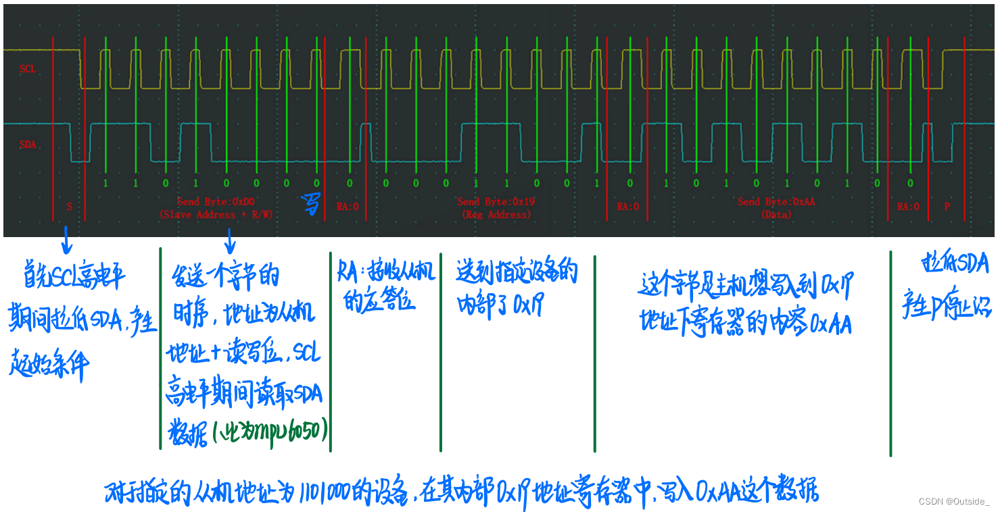

如图是I2C协议发送数据的时序图。

它们底层也是通过驱动去完成：

**SPI驱动**：配置时钟频率、传输模式（CPOL/CPHA）、DMA传输。

**I2C驱动**：处理起始/停止条件、ACK/NACK信号、时钟拉伸。

这些驱动在内核中有配置，可以搜索查看。

#### 3.GPIO的概念

GPIO是通用输入输出端口。**物理引脚**：芯片或开发板上的金属触点，通过电路连接到内部逻辑。

- **输入模式**：读取外部信号（如检测按钮是否按下、传感器状态）。
- **输出模式**：输出高低电平（如控制LED亮灭、驱动继电器）。

SPI和I2C提到的那些引脚就是通过GPIO端口进行控制，因此我们需要知道引脚对应板子上的哪个GPIO口。

### 二、前控板初始化流程

再通过思维流程图梳理dvbstack初始化前控板的整个流程，能够加深对模块的理解。

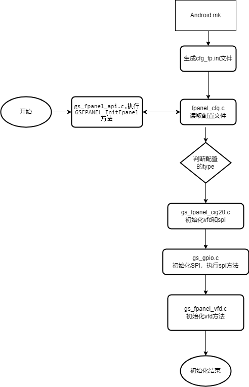

dvbstack的.\src\Config\fpanel\cfgs\Android.mk文件控制编译生成`cfg_fp.ini`文件。里面对应这spi协议的四个引脚，不难发现这个文件就是配置前控版的关键文件。

它是通过修改**BOOT_PANEL_TYPE**的值在Android.mk进行编译生成下图不同的前控版配置文件。

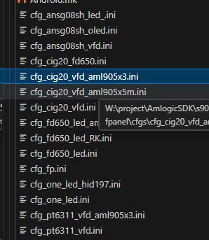

这时候我们不知道前控版的类型，所以需要沟通问一下前控版是什么类型的，得出x5m和x3用的都是cig20_vfd，但stb,clk,din,dout对应的GPIO的值会有所不同，需要另外设置。

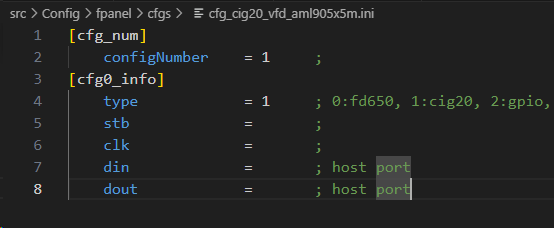

**注:** 这个配置文件对应的是CPU的GPIO配置,上面的din、dout，其实对应的是MIN和MOUT

STB代表Strobe（选通信号），在通信中用来表示数据传输的开始或结束。CLK是时钟信号，同步数据传输。DIN是数据输入，DOUT是数据输出。与SPI的片选（SS）、时钟（SCK）、主入从出（MISO）、主出从入（MOSI）对应。

### 三、配置引脚对应GPIO的值

具体GPIO对应的值要与硬件沟通，询问硬件的设计原理图。得到以下数据。**这里DIN和DOUT对应的设备是前控版，前控版是从设备，也就是SIN与SOUT**。如果没有区分好这一块，很容易配置反了，导致无法点亮前控版。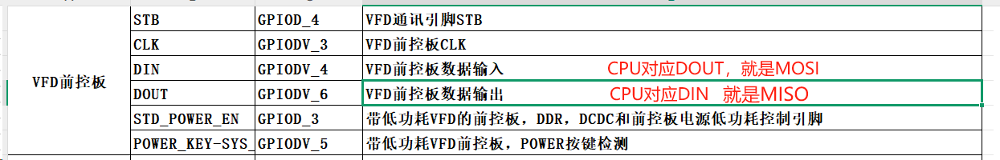

**注**：我们参考红字配置

关于GPIO口的配置我们可以**参考SDK使用指南**

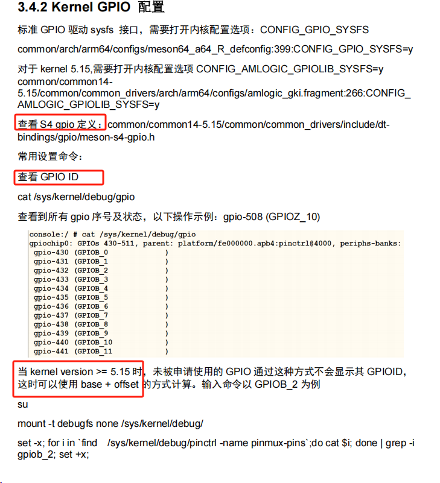

GPIO口的定义在内核的`common\common14-5.15\common\common_drivers\include\dt-bindings\gpio\meson-s7d-gpio.h`中定义如图：

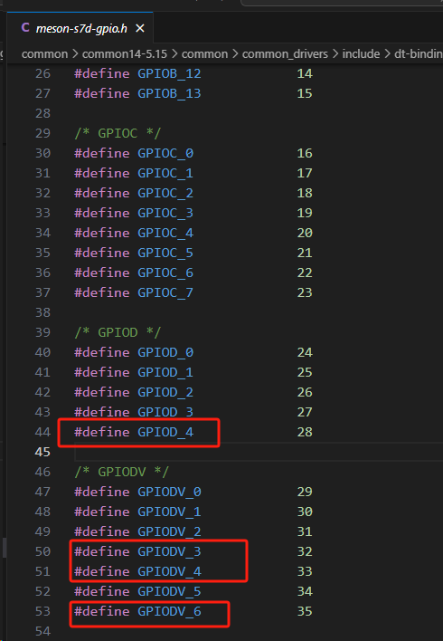

上图定义的值为GPIO的偏移量offset。我们配置的值是通过offset+base得出的值，因此还需要查看base，Gpio口对应的值。

**参考SDK使用指南**：

使用该命令cat /sys/kernel/debug/gpio; 查看所有gpio对应的值。

当 kernel version >= 5.15 时，需要加载debug才能使用上面命令。

```shell
su
mount -t debugfs none /sys/kernel/debug/
cat  /sys/kernel/debug/gpio
```

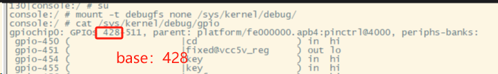

通过计算得到以下值。

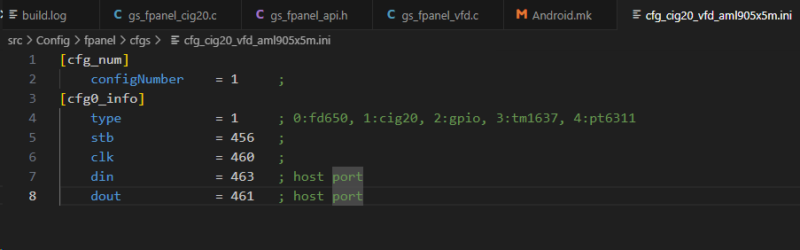

加入到配置文件中即可。

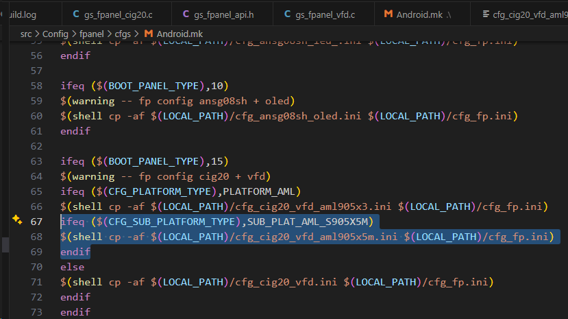

#### 总结：

配置前控板，我们首先要思考CPU与前控版是如何进行通信的，有一个大致的思路，然后从模块的初始化出发，添加打印跟踪初始化的步骤，**C语言是面向过程的语言，\**跟着过程一步一步打印其实挺好理解的。在其中遇到不懂的关键字要及时\**搜索、多看官方文档或询问AI**。比如GPIO是什么，I2C和SPI是什么它的原理是什么，理解这些概念才能看懂代码。理解完整个初始化的代码，在尝初始化结束后，我们可以调用初始化完成的方法进行测试，验证模块功能是否正常，检查配置是否正确。以后要调试其他功能接口也可以尝试这个思路，多加打印理解流程，并且熟悉理解其中的原理，多参考官方文档。

## 前控版没亮，排查错误

### 一、检查GPIO文件是否生成

```shell
cd sys/class/gpio
ls
/sys/class/gpio # ls
export  gpiochip428 gpio456 gpio463 unexport
```

Gpio口初始化对应的位置：.\src\GS_Api\src\gs_gpio.c文件的方法中GSGPIO_Init()方法，可以加打印排查是否执行到该方法。

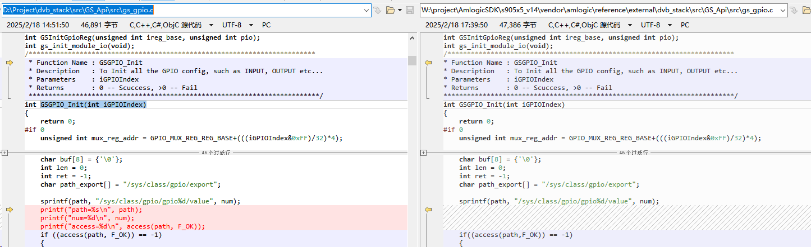

如果缺少对应的gpio文件且dvbstack没有报错，说明生成gpio460和gpio461时，该GPIO口被占用。

#### GPIO占用解决方法：

**遇到问题要及时反馈**，这类问题自己去排查无疑大海捞针（全局搜索太耗时），首先需要与硬件沟通，询问该GPIO口有没有在其它地方被占用。

参考硬件的设计文档，找到对应的GPIO口。

然后再内核文件中全局搜索该GPIO口

以本次为例:发现GPIODV_4、GPIODV_3被PDM占用。

可以在内核文件common\common14-5.15\common中搜索：pdm和GPIODV_4、GPIODV_3的关键字。

最终发现在内核common\common14-5.15\common\common_drivers\drivers\gpio\pinctrl\pinctrl-meson-s7d.c，该文件定义了所有GPIO口被使用的功能模块，在该文件搜索：pdm和GPIODV_4、GPIODV_3相关的代码。

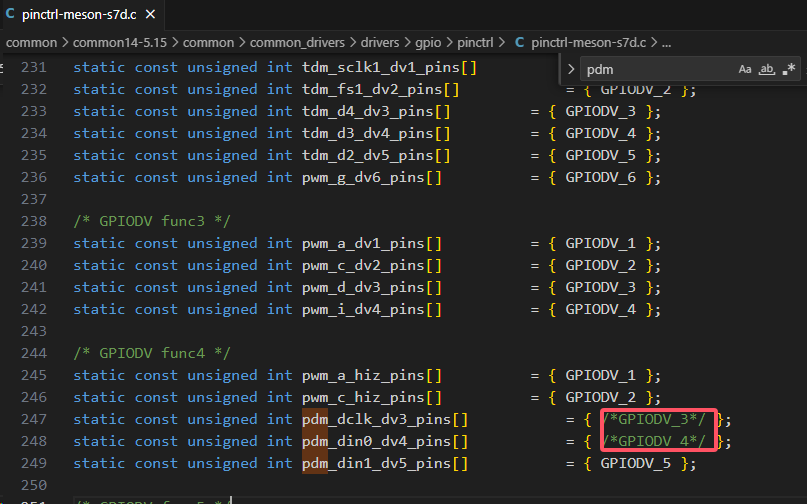

屏蔽掉这两处代码后重新编译linux内核。

### 二、检查GPIO口是否连接正常

使用工具：**万用电表**、**测波仪器**、**逻辑分析仪**

询问硬件，4个引脚在板子上对应的位置

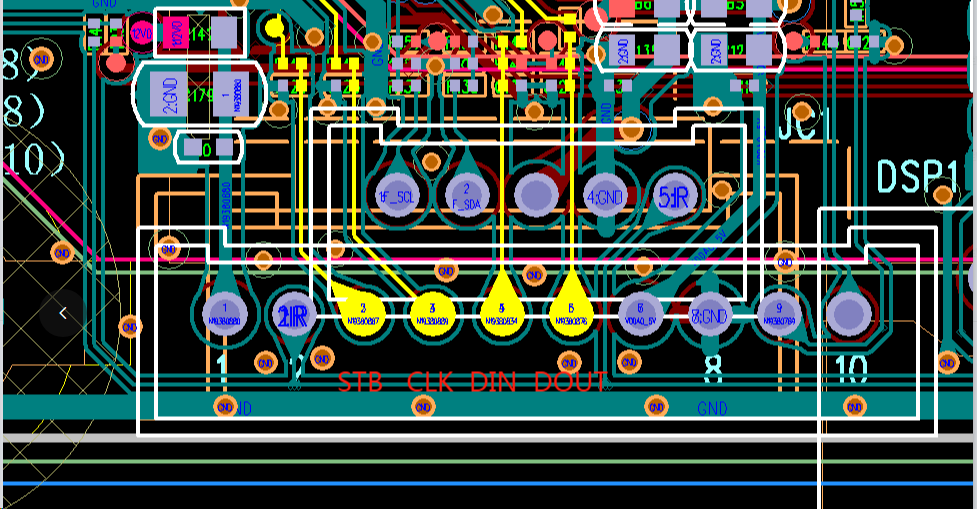

#### 1.测试拉高低电平

手动测试：（**参考SKD使用指南**）串口执行命令：

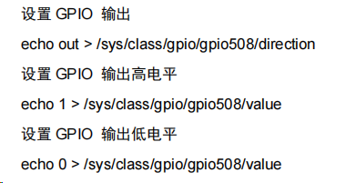

代码测试：
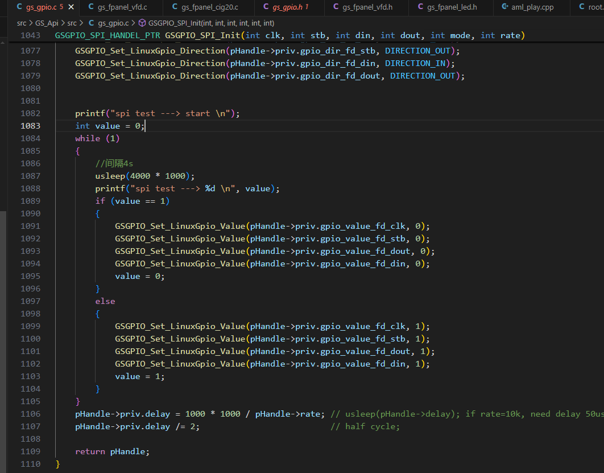

将GPIO口方向全改成OUT，每隔4s将4个GPIO口的电平拉高和拉低。

用万用电表测量4个引脚的电压变化。（红线接电，黑线接地）

测试成功说明init正常。

#### 2.测试往前控板写数据

在init结束后，循环写入数据

测试代码

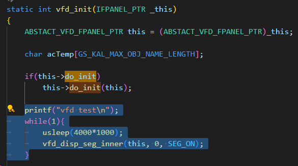

使用**逻辑分析仪**读取4个引脚的波形。


8根线随便选4根接到对应的引脚，再随便插到逻辑分析仪，对应的ch1-ch8的孔里面。

打开Saleae Logic工具，1.添加Spi协议 ——》2.配置引脚

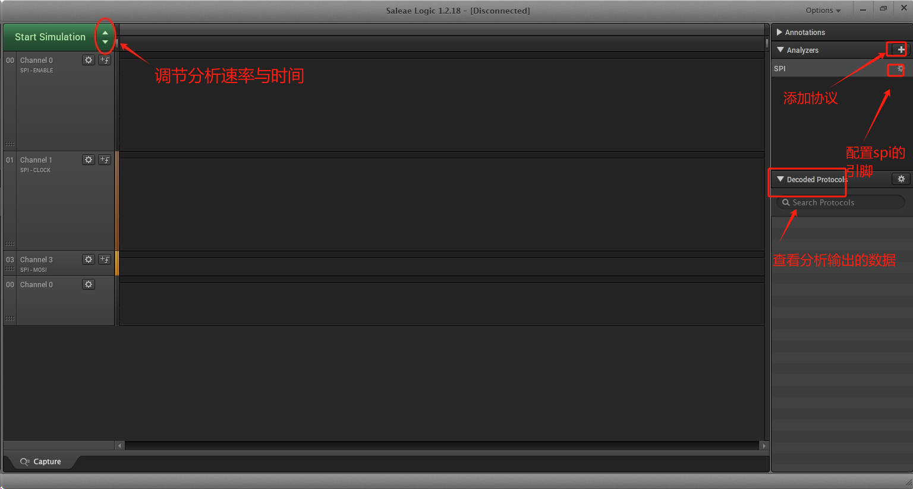

enable对应ss的引脚（STB），clock对应sck的引脚（CLK）, MOSI对应（DIN），MISO对应（DOUT）

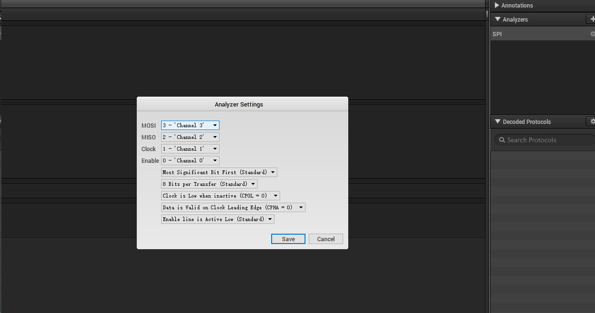

点start进行分析，观察时序图是否正常。

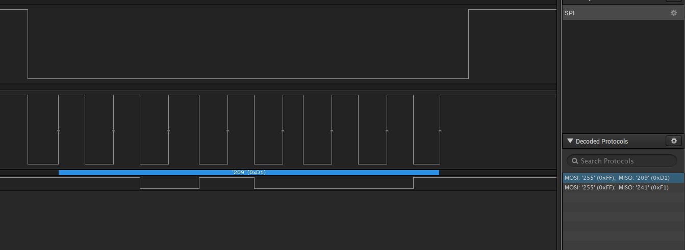

#### 总结：

排查问题，不仅要知道方法调用的流程，还要理解配置的原理，通常也需要软硬件结合思考，软件通过代码引入I2C与SPI相关的协议，这些I2C与SPI再去和i2c与spi的底层驱动去与CPU通信实现硬件物理逻辑，这里面涉及的通信协议与驱动，都需要我们去了解的。遇到问题再去一步一步定位，上层定位到下层，首先看代码有没有报错，代码有没有得到应有的结果，再去测试硬件的电路是否连接正常，协议有没有跑通。如果都没有出现问题，就要反过来重新看一下是不是哪里理解有误差，这次错误没发现的主要原因也就是对Din和Dout的理解不到位，以为配置文件与硬件给的文档描述的是同一个，后面加深对MOSI和MISO的理解也就明白是怎么回事了。
