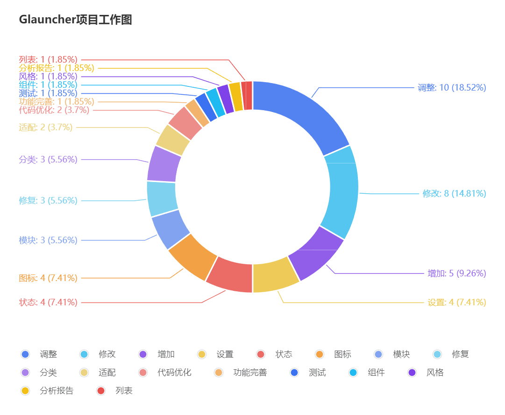
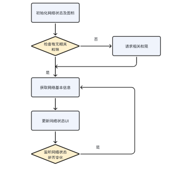
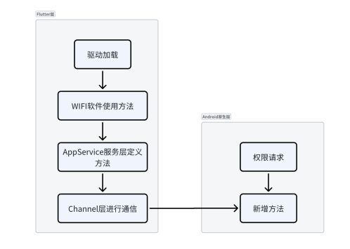
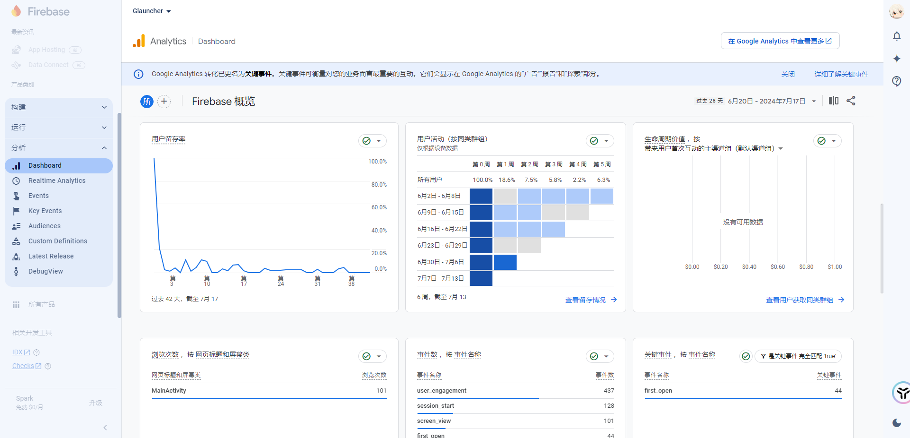

# GLauncher

## 简介

基于开源Flutter框架，编写适用于公司产品的Andorid Launcher软件。



### 主要难点和亮点：

自定义组件、数据管理与缓存、焦点与按键管理、原生通信、

**自定义组件**：主要是在Launcher顶部的APPBar部分增加了一些状态组件，比如蓝牙组件、WiFi组件等。用于实时反应系统属性状态，点击后可以跳转到相应设置。

**数据管理与缓存**：主要分为两部分，一部分是使用SharedPreferences 和 ChangeNotifier管理应用的状态（比如 是否开启24小时制、是否启用unsplash图片库）。另一部分是使用drift框架管理APP信息（包名，类别，图标），这些数据采用SQLite数据库进行存储。分别建立了三个表，分别用于存储应用程序信息、分类信息和应用程序与分类的关联信息。

**焦点与按键管理**：在APP卡片的显示界面我们自定义了焦点的遍历策略，保证在横向布局的区域和方格布局区域都能正确的移动到我想要的位置。

**原生通信**：这里采用了两种原生通信方式，方法通道 (MethodChannel) 和 事件通道 (EventChannel)。**方法通道**：用于方法的传递，允许有返回值，适用于一次通信。这里面主要是写了一些需要调用安卓层的一些方法，比如打开设置app，判断是否是系统App，启动app，获取WIFI强度等。**事件通道**：用于事件流的发送，可持续通信但是不可回复。这里我初始化了两个事件通道，一个用来监听应用程序包的变化（如应用安装、删除等），另一个是BluetoothUtils的事件通道用来监听蓝牙状态。

## UI调整

### 色彩以及阴影调整

1. 时间组件阴影调整

```
lib/widgets/time_widget.dart
```

在 `_TimeWidgetState` 类的 `_buildTimeDisplay` 方法中，调整了时间文本的阴影效果。将阴影的偏移量从 `(1, 1)` 调整为 `(3, 3)`，模糊半径也从 `8` 增加到 `10`，以增强阴影的视觉效果。

1. 设置界面颜色适配原生Android系统的颜色
2. 调整APP card 颜色，组件图标增加堆叠阴影
3. 调整图标尺寸增加banner

### 组件移除

1. 移除设置界面的崩溃和分析报告按钮
2. 修改默认app卡片大小，默认隐藏glauncher图标

## 新功能

### 网络状态组件

1. **需要实现的功能**：

- 显示网络状态图标： 在主界面的顶部显示一个图标，代表当前的网络连接状态。
- 实时更新网络状态： 监听网络连接状态的变化，根据连接状态切换不同的图标和网络状态文字，并在需要的情况下更新WiFi信息。
- 获取WiFi信息： 获取当前连接的WiFi名称，如果获取失败，则显示错误信息。
- 更新WiFi信号强度图标： 获取WiFi信号强度，并根据不同的信号强度切换不同的图标。
- 点击图标进入网络设置： 用户可以通过点击图标，方法打开网络设置界面，方便用户进行网络管理。



2. **所采用的方式**：

通过使用 `connectivity_plus`、`network_info_plus` 和 `permission_handler` 等高级 Flutter 库开发一个智能网络状态监控组件 `NetworkPage`，集成了实时网络连接状态检测、WiFi信息获取和权限管理功能。

3. **注意点**：

**原生Kotlin的通信与调用说明**：

通过MethodChannel，Flutter可以与Kotlin层的安卓代码进行通信。这过程涉及三层调度：

首先，在Kotlin层实现所需方法；

其次，在Flutter中创建MethodChannel通道，注册方法；

然后，在Flutter的服务层（例如app_services）中调用这些方法，触发通道调用；

最后，在需要的地方（例如Flutter界面）调用服务层方法，完成一级调用，最终触发了整个通信流程。这种方式提供了一种清晰而可控的方式，使Flutter和Kotlin层之间的交互变得灵活且易于管理。通过这种机制，开发者可以方便地在Flutter应用中调用原生安卓功能，实现更丰富的功能和更好的用户体验。

首先，在AndroidManifest.xml中添加了两个权限：ACCESS_FINE_LOCATION和ACCESS_WIFI_STATE，以获取定位和WiFi状态的访问权限。接着，在MainActivity.kt文件中，新增了两个方法：openNetworkSettings()和getWifiLevel()。openNetworkSettings()通过Intent启动系统的WiFi设置页面，使用户可以直接进行网络设置。而getWifiLevel()则通过WifiManager获取WiFi信号强度，以字符串形式返回，如果出现异常则返回"-999"。

在FLauncherChannel中，添加了两个新的方法：openNetworkSettings()和getWifiLevel()，通过MethodChannel调用Kotlin层的对应方法，实现了Flutter与Kotlin层的桥接。AppsService则新增了两个方法，分别是openNetworkSettings()和getWifiLevel()，通过调用FLauncherChannel的对应方法，触发了Kotlin层的相应功能

此外，创建了一个名为NetworkPage的Flutter Widget，用于显示WiFi状态和图标。在NetworkPage中，通过监听Connectivity变化，获取WiFi信息并更新显示的WiFi图标和状态文字。点击该Widget时，调用了openNetworkSettings()，触发了系统的网络设置。最后，在pubspec.yaml中添加了三个新的Flutter插件：permission_handler，network_info_plus和connectivity_plus，用于处理权限请求、提供网络信息接口以及检测网络连接状态。



**Flutter异步编程的说明**

在Flutter中，build函数是用于构建UI的关键方法，由于其执行频率相当高，一般来说，应该尽量避免在build函数中执行耗时的异步操作。这是因为在build过程中执行异步方法，可能会导致UI卡顿、性能下降，甚至应用崩溃。Flutter框架也规定，在build函数中不应该直接调用异步方法。

假设你在build函数中需要依赖于异步方法获取数据，例如从网络请求数据或者读取本地存储的数据。由于Flutter中build函数会频繁调用，如果每次build都去执行异步方法，可能会导致性能问题。

通常，为了避免在build函数中执行异步方法，可以在State对象的生命周期方法中进行异步操作。例如，可以在initState中执行一次性的异步操作，然后在异步操作完成后调用setState来触发UI的重新构建。

### 蓝牙状态组件（Flutter与原生通信）

原本尝试了flutter_blue插件发现不是很好用。于是尝试自己写一个简单的插件。

**需要实现的功能**

- 初始化时检查当前的蓝牙连接状态并更新图标显示。
- 通过事件通道监听蓝牙状态的广播，动态更新图标以反映蓝牙的启用或禁用状态。
- 提供一个按钮，用户可以通过该按钮直接打开蓝牙设置页面。
- 利用 `provider` 库管理状态，并使用 `ImageFilter` 实现图标的模糊效果，提升用户界面视觉效果和交互体验。

**实现方式**：
1. `android/app/src/main/java/io/flutter/plugins/BluetoothUtils.java`

用于在 Android 端实现蓝牙状态监测的工具类。主要功能包：

- 设置广播接收器监听蓝牙连接状态变化，并通过 `EventChannel` 向 Flutter 发送蓝牙连接状态。
- 提供方法检查蓝牙是否连接。

```Java
private static BroadcastReceiver stateChangeReceiver = new BroadcastReceiver()
public static boolean isBluetoothConnected(Context context)
private static boolean isBluetoothProfileConnected(BluetoothAdapter bluetoothAdapter)
public static void startBluetoothStateListener(Context context)
public static void stopBluetoothStateListener(Context context)
//初始化时间通道
public static void initEventChannel(Context context, FlutterEngine flutterEngine) {
    applicationContext = context;
    eventChannel = new EventChannel(flutterEngine.getDartExecutor().getBinaryMessenger(), EVENT_CHANNEL_NAME);
    eventChannel.setStreamHandler(new EventChannel.StreamHandler() {
        @Override
        public void onListen(Object arguments, EventChannel.EventSink sink) {
            events = sink;
        }
        @Override
        public void onCancel(Object arguments) {
            events = null;
        }
    });
}
```

2. `android/app/src/main/kotlin/cn/giec/glauncher/MainActivity.kt`

- 在`MainActivity`中配置Flutter引擎时，初始化`BluetoothUtils`的事件通道。
- 添加了一个方法`isBluetoothConnected`，用于调用`BluetoothUtils`中的方法以检查蓝牙连接状态。
- 更新方法通道处理程序，添加对`isBluetoothConnected`方法的处理。

```Java
override fun configureFlutterEngine(@NonNull flutterEngine: FlutterEngine) {
+    BluetoothUtils.initEventChannel(this, flutterEngine as FlutterEngine)
     when (call.method) {
+         "isBluetoothConnected" -> result.success(isBluetoothConnected())
       }
        
}
```

3. `lib/flauncher_channel.dart`

在`flauncher_channel.dart`中添加了`isBluetoothConnected`方法，用于通过方法通道调用原生端的`isBluetoothConnected`方法。

```Java
Future<bool> isBluetoothConnected() async => await _methodChannel.invokeMethod('isBluetoothConnected');
```

4. `lib/providers/apps_service.dart`

在`apps_service.dart`中添加了`isBluetoothConnected`方法，用于调用`flauncher_channel.dart`中的方法。

```Java
  //是否开启蓝牙  
  Future<bool> isBluetoothConnected() => _fLauncherChannel.isBluetoothConnected();
```

5. `lib/widgets/bluetooth_widget.dart`

在`bluetooth_widget.dart`中：

- 使用新的事件通道接收蓝牙状态。
- 在初始化时检查蓝牙连接状态，并更新图标。
- 使用事件通道监听蓝牙状态的变化，并动态更新图标。

```Java
void receiveBluetoothEvent() {
  const EventChannel _eventChannel = EventChannel('BluetoothStatus');
  bluetoothStateSubscription = _eventChannel.receiveBroadcastStream().listen((event) {
    if (event is bool) {
      setState(() {
        bluetoothIcon = event ? Icons.bluetooth : Icons.bluetooth_disabled;
      });
    }
  }, onError: (error) {
    print("Error receiving bluetooth status: $error");
  });
}

void checkBluetoothConnection() async {
  bool isBluetoothConnected = await context.read<AppsService>().isBluetoothConnected();
  setState(() {
    bluetoothIcon = isBluetoothConnected ? Icons.bluetooth : Icons.bluetooth_disabled;
  });
}
```

### USB 状态组件

该组件的实现同样借助了`usb_serial` 库来完成。

`setupUsbEventListeners` 方法订阅 USB 事件流，每当有 USB 事件发生时，调用 `checkUsbDevices` 方法更新设备状态。

### 设置APP卡片背景色为APP主体色

这个功能的核心在于需要获取APP的Icon图标并读取出其主体色。通过`getImageDominantColor`方法获取到图标的主体颜色之后，根据需求加深或者减淡颜色成为背景色。

由于直接设置主体颜色为背景色可能导致APP图标与背景的边缘模糊，因此需要做调色处理。这里我选择将RGB值全部加深20%

```Java
void initState() {
  super.initState();
...
  Future.delayed(Duration.zero, () {
    // 这里执行获取主体颜色操作
    updateMaterialColor();
    setState(() {
      _isInitialized = true;
    });
  });
}

// 在 build 方法中获取主体颜色
Future<void> updateMaterialColor() async {
  if (widget.application.banner == null) {
    var dominantColor = await getImageDominantColor(widget.application.icon!);
    if (dominantColor != null) {
      // 颜色加深20%
      final newColor = Color.fromARGB(
        (dominantColor.alpha * 0.9).toInt(),
        (dominantColor.red * 0.8).toInt(),
        (dominantColor.green * 0.8).toInt(),
        (dominantColor.blue * 0.8).toInt(),
      );
      setState(() {
        _materialColor = newColor;
      });
    }
    dominantColor = Color(0xFF033662);
  }
}

Widget build(BuildContext context) {
  return _isInitialized
      ? FocusKeyboardListener(...)
      : CircularProgressIndicator(); // 在初始化完成前显示加载指示器或其他内容
}
      
```

### APP应用分类

我们的Launcher在初始化时将APP分为两类。 我们需要在database.kt初始化拿取APP列表的时候对其进行处理，定义我们自己的列表，将列表中的软件加入到某一特定的类别中。

现在我们可以定制哪些软件显示在桌面，哪些不显示在桌面。显示在上层还是下层分类。

```Java
final hiddenPackageNames = [
  "com.google.android.inputmethod.latin"
];

// 定义包名列表，用于显示下列软件到上层（Favorite Applications）
final favoriteApplicationsPackageNames = [
  "com.google.android.youtube.tv",
  "com.netflix.ninja",
];

final FavoriteApplications = _applications.where((app) => favoriteApplicationsPackageNames.contains(app.packageName));

final Iterable<App> nonTvApplications;
final Iterable<App> tvApplications;

if(FavoriteApplications.isEmpty){
  nonTvApplications = _applications.where((element) => element.sideloaded == true);
  tvApplications = _applications.where((element) => element.sideloaded == false);
}else{
  nonTvApplications = _applications.where((app) => favoriteApplicationsPackageNames.contains(app.packageName));
  tvApplications = _applications.where((app) => !favoriteApplicationsPackageNames.contains(app.packageName));
}
```

## BUG修复

### 类别初始化时加载APP不完全（数据库操作）

经过排查原因是在类别划分的过程中，存在划分条件为null 的情况，因此既不在true 的一栏也不再false 的一栏。最后决定剩下的全部归入第二类。

我们的APP卡片分为两个类 CategoryRow 和 CategoryGrid 。我们写了一个database.dart 文件来定义数据库模型、数据表、数据表关联关系以及一些用于操作数据库的方法。

```Java
DatabaseConnection connect() => DatabaseConnection.delayed(() async {
      final dbFolder = await getApplicationDocumentsDirectory();
      final file = File(path.join(dbFolder.path, 'db.sqlite'));
      return DatabaseConnection(NativeDatabase(file, logStatements: kDebugMode));
    }());
```

定义数据库操作方法:

- `listApplications`: 获取所有应用程序的列表，并按名称进行排序。
- `persistApps`: 批量插入或更新应用程序数据。
- `updateApp`: 更新指定应用程序的数据。
- `deleteApps`: 删除指定包名称的应用程序。
- `insertCategory`: 插入新的应用程序类别。
- `deleteCategory`: 删除指定 ID 的应用程序类别。
- `updateCategories`: 批量更新应用程序类别。
- `updateCategory`: 更新指定 ID 的应用程序类别。
- `deleteAppCategory`: 删除应用程序和类别之间的关联。
- `insertAppsCategories`: 批量插入应用程序和类别之间的关联。
- `replaceAppsCategories`: 批量替换应用程序和类别之间的关联。
- `listCategoriesWithVisibleApps`: 获取所有类别及其关联的可见应用程序的列表。
- `nextAppCategoryOrder`: 获取下一个应用程序类别的排序顺序。

```Java
Future<List<CategoryWithApps>> listCategoriesWithVisibleApps() async {
  final query = select(categories).join([
    leftOuterJoin(appsCategories, appsCategories.categoryId.equalsExp(categories.id)),
    leftOuterJoin(apps, apps.packageName.equalsExp(appsCategories.appPackageName) & apps.hidden.equals(false)),
  ]);
  query.orderBy([
    OrderingTerm.asc(categories.order),
    OrderingTerm.asc(
      categories.sort.caseMatch(
        when: {Constant(0): appsCategories.order, Constant(1): apps.name.lower()},
      ),
    ),
  ]);

  final result = await query.get();
  final categoriesToApps = <Category, List<App>>{};
  final appsSet = <App>{}; // 用于跟踪已经添加的应用程序
  for (final row in result) {
    final category = row.readTable(categories);
    final app = row.readTableOrNull(apps);
    final categoryToApps = categoriesToApps.putIfAbsent(category, () => []);
    if (app != null) {
      categoryToApps.add(app);//添加不完全
      appsSet.add(app);
    }
  }
  if (categoriesToApps.keys.length > 1) { // 检查是否存在至少两个类别
    // 找到所有未关联到任何类别的应用程序，将它们与第二个类别关联
    final appsWithoutCategories = await (select(apps)
      ..where((app) => app.hidden.equals(false) & app.packageName.isNotIn(appsSet.map((app) => app.packageName).toList())))
        .get();
    final secondCategory = categoriesToApps.keys.elementAt(1); // 获取第二个类别
    categoriesToApps[secondCategory] ??= [];
    categoriesToApps[secondCategory]!.addAll(appsWithoutCategories);
  }
  return categoriesToApps.entries.map((entry) => CategoryWithApps(entry.key, entry.value)).toList();
}
```

### 遥控器与鼠标按键监听问题

这个问题十分复杂，研究了很久。

1. 鼠标点按没用

```Java
KeyEventResult _onPressed(BuildContext context, LogicalKeyboardKey? key) {
  if (_moving) {
    WidgetsBinding.instance.addPostFrameCallback((_) => Scrollable.ensureVisible(context,
        alignment: 0.1, duration: Duration(milliseconds: 100), curve: Curves.easeInOut));
    if (key == LogicalKeyboardKey.arrowLeft) {
      widget.onMove(AxisDirection.left);
    } else if (key == LogicalKeyboardKey.arrowUp) {
      widget.onMove(AxisDirection.up);
    } else if (key == LogicalKeyboardKey.arrowRight) {
      widget.onMove(AxisDirection.right);
    } else if (key == LogicalKeyboardKey.arrowDown) {
      widget.onMove(AxisDirection.down);
    } else if (_validationKeys.contains(key)) {
      setState(() => _moving = false);
      widget.onMoveEnd();
    }
    return KeyEventResult.handled;
  } else if (_validationKeys.contains(key)) {//这里一开始准备改为(key == null || _validationKeys.contains(key))
    context.read<AppsService>().launchApp(widget.application);
    return KeyEventResult.handled;
  }
  return KeyEventResult.ignored;
}
```

这样做会导致长按被短按事件拦截

2. 长按被短按拦截

```
lib/widgets/focus_keyboard_listener.dart
KeyEventResult _keyDownEvent(BuildContext context, LogicalKeyboardKey key, RawKeyEventDataAndroid data) {
  if (!longPressableKeys.contains(key)) {
    return widget.onPressed?.call(key) ?? KeyEventResult.ignored;
  }
  if (data.repeatCount == 0) {
    _keyDownAt = DateTime.now().millisecondsSinceEpoch;
    return KeyEventResult.handled;//原本是：return KeyEventResult.ignored;
  } else if (_longPress()) {
    _keyDownAt = null;
    return widget.onLongPress?.call(key) ?? KeyEventResult.ignored;
  }
  return KeyEventResult.handled;
}
```

总结一下这个问题，逻辑复杂，现象奇怪。

第一步，定位：我首先还是采用的log大法通过不断写print输出的方式定位问题所在，这一步犯得最大的问题就是**没有定位完全相关代码处**，有两处代码都调用了这个函数，我没有完全定位到导致对代码的逻辑理解出现模糊绕了很大的弯路。

第二步，逻辑排查：排查逻辑的时候由于代码逻辑稍显复杂，而且情况很多，每次更改一处条件就会遇到不同的状况因此也带来了很大的困难。由于是AB问题相关性出现我一直采取的是先解决一个再解决另一个的想法，但是一直没成功，因为二者的逻辑产生一定悖论。**逻辑能力有待加强**，要是早点把流程图整理出来可能会快很多。也应该**早点借助工具整理逻辑**的。

第三步，修正：最后发现是代码原作者对**KeyEventResult.handled 和KeyEventResult.ignored**的误用导致的bug，问题太细节了，而且我也由于对ignore和handle影响的把握不深导致一直没发现这个问题。

难点就在于这段代码的逻辑像是两棵巨大的互相交错的树，分叉太多，需要罗列清楚完整才比较好观察

解决这个大问题后，后续的修复就顺利了很多，一下子就把另一个优化完成了。

## Firebase 服务

作为在Android应用程序中启用Google API或Firebase服务的一部分，必须将google-services.json插件添加到build.gradle文件中

打开你的fieabase网址：https://console.firebase.google.com/u/0/

创建一个新的项目，或者在你已经有的项目中加入新的app都可以。这个json文件都是根据你的包名去生成的。在一个项目中可以加很多的App生成的json文件是根据项目去生成的，一个项目有多个app，在你生成的json文件中会有不项目中所有app的配置，当一个项目只有一个App的时候，在json文件中只有一个app的配置。

得到google.services.json文件后，放置到android/app/src目录中

通过 Firebase Crashlytics 自动发送崩溃报告，共享分析数据。



```Java
class _SettingsPanelState extends State<SettingsPanel> {
  final GlobalKey<NavigatorState> _navigatorKey = GlobalKey<NavigatorState>();

  @override
  Widget build(BuildContext context) => WillPopScope(
        onWillPop: () async => !await _navigatorKey.currentState!.maybePop(),
        child: Scaffold(
          backgroundColor: Colors.transparent,
          body: RightPanelDialog(
            width: 350,
            child: Navigator(
              key: _navigatorKey,
              initialRoute: widget.initialRoute ?? SettingsPanelPage.routeName,
              //添加了一个 Firebase Analytics 观察者
              observers: [if (kReleaseMode) FirebaseAnalyticsObserver(analytics: FirebaseAnalytics.instance)],
              //动态生成路由
              onGenerateRoute: (settings) {
                switch (settings.name) {
                  case SettingsPanelPage.routeName:
                    return MaterialPageRoute(builder: (_) => SettingsPanelPage());
                  case WallpaperPanelPage.routeName:
                    return MaterialPageRoute(builder: (_) => WallpaperPanelPage());
                  case UnsplashPanelPage.routeName:
                    return MaterialPageRoute(builder: (_) => UnsplashPanelPage());
                  case GradientPanelPage.routeName:
                    return MaterialPageRoute(builder: (_) => GradientPanelPage());
                  case ApplicationsPanelPage.routeName:
                    return MaterialPageRoute(builder: (_) => ApplicationsPanelPage());
                  case CategoriesPanelPage.routeName:
                    return MaterialPageRoute(builder: (_) => CategoriesPanelPage());
                  case WallpaperSettingsPanelPage.routeName:
                    return MaterialPageRoute(builder: (_) => WallpaperSettingsPanelPage());
                  case CategoryPanelPage.routeName:
                    return MaterialPageRoute(
                      builder: (_) => CategoryPanelPage(categoryId: settings.arguments! as int),
                    );
                  default:
                    throw ArgumentError.value(settings.name, "settings.name", "Route not supported.");
                }
              },
            ),
          ),
        ),
      );
}
```

## Unsplash API图片库

Unsplash是由Mikael Cho于2013年创办的一个图片社区，任何人都可以在此分享高分辨率的照片供所有人免费使用（无著作权）。

如果你的日常工作需要高质量的图片素材，又不想额外花钱的话，Unsplash是一个非常不错的选择。使用者可任意运用在任何地方，无须付费，也不用标注原作者名称，个人或商业使用皆可。

```Java
final searchResults = await context.read<WallpaperService>().searchFromUnsplash(value);
unsplash_service.dart
```

  `UnsplashService` 类封装了与 Unsplash API 交互的逻辑，包括获取随机照片、搜索照片和下载调整大小的照片。它通过依赖注入方式接受一个 `UnsplashClient` 实例。`Photo` 类用于存储和传递照片的相关信息。

```Java
class UnsplashService {
  final unsplash.UnsplashClient _unsplashClient;
  UnsplashService(this._unsplashClient);

  Future<Photo> randomPhoto(String query) //用于根据查询条件获取一张随机的横向照片

  Future<List<Photo>> searchPhotos(String query) //用于根据查询条件搜索最多 30 张横向照片。

  Future<Uint8List> downloadPhoto(Photo photo)//用于下载照片，内部调用 _downloadResized 方法。

  Future<Uint8List> _downloadResized(Photo photo) //根据设备的物理屏幕大小下载并调整照片的大小。

  Photo _buildPhoto(unsplash.Photo photo) //将 unsplash.Photo 对象转换为自定义的 Photo 对象。
}

class Photo {
  final String id;//照片的唯一标识符。
  final String username;//照片作者的用户名。
  final Uri small;//照片的小尺寸 URL。
  final Uri raw;//照片的原始尺寸 URL。
  final Uri userLink;//作者的主页链接

  Photo(this.id, this.username, this.small, this.raw, this.userLink);
}
```


## 关键细节

### Android层的MainActivity

安卓层只有一个Activity，继承了FlutterActivity。

主要注册了方法通道 (MethodChannel) 和 事件通道 (EventChannel)

**方法通道**：用于方法的传递，允许有返回值，适用于一次通信

这里面主要是写了一些需要调用安卓层的一些方法，比如打开设置app，判断是否是系统App，启动app，获取WIFI强度等

**事件通道**：用于事件流的发送，可持续通信但是不可回复

这里我初始化了两个时间通道，一个用来监听应用程序包的变化（如应用安装、删除等），另一个是BluetoothUtils的事件通道用来监听蓝牙状态。

### Main.dart

运行FLauncherApp 需要一些构造参数，里面包括了

**`sharedPreferences`**:一个轻量级的本地存储方案，允许应用存储和检索键值对数据。

**`firebaseCrashlytics`**:一个崩溃报告工具，用于捕捉应用程序中的异常和崩溃，并提供详细的堆栈跟踪信息。

**`firebaseAnalytics`**:应用分析服务，帮助开发者了解用户行为并分析应用的使用情况。

**`imagePicker`**: Flutter 插件，用于从设备的相册中选择图片或从相机中拍摄照片。

**`fLauncherChannel`**: 封装了用于 Flutter 和原生平台（如 Android、iOS）之间通信的通道。

**`fLauncherDatabase`**:应用的数据库层，通常用于持久化存储数据。

**`unsplashService`**:提供 Unsplash API 的服务，用于从 Unsplash 获取图片。

**`remoteConfig`**:Firebase Remote Config 一个云端服务，允许开发者修改应用的行为和外观，而不需要发布更新。这里用来读取Unsplash API 的服务的密钥了

### FLauncherApp

整体采用MultiProvider实现，里面有多个ChangeNotifierProvider，后面跟着一个MaterialApp为主体，

总共四个**provider**

- SettingsService：使用SharedPreferences存放否启用崩溓报告、是否启用分析、是否使用24小时格式、是否启用 Unsplash 图片等数据，管理Firebase远程配置，通过notifyListeners通知UI更新
- AppsService：接收 FLauncherChannel 和 FLauncherDatabase 作为参数。应用相关操作包括添加、删除、更新等操作通过FLauncherChannel 调用原生方法，分类相关操作。里面的FLauncherDatabase用来管理分类的数据，增加分类删除分类等。
- WallpaperService，settingsService：提供手动选择图片、从 Unsplash 获取随机图片、定期自动更换壁纸，以及设置渐变背景等功能，并且通过定时器和设置服务来实现灵活的壁纸更换策略。
- TickerModel

> 这里插一句题外话，provider状态管理组件虽好，但是滥用容易出现性能问题。因为不管这个组件可不可见，只要数据改变了就会触发build方法。有的数据绑定多个组件，而有些组件隐藏的时候仍然会触发刷新，造成效率浪费。这时候需要使用Consumer包裹需要更新的节点。
>
> [使用Provider前你应了解Consumer](https://cloud.tencent.com/developer/article/1622727)

主体：**MaterialApp**

1. localizationsDelegates 和 supportedLocales: 语言本地化
2. shortcuts 和 actions ： 定义了键盘某些键的作用，为焦点移动提供了声音反馈。
3. home: WillPopScope

主题颜色：MaterialColor 

定义了一个色板，多种不同亮度的蓝色作为主体色，设定了键值对的映射。使用的时候可以更方便的选取颜色。

**WillPopScope** ：MaterialApp的主体内容是一个WillPopScope，这个组件可以决定是否允许页面关闭，在这里我们设置的逻辑是如果我们的Launcher是默认启动器则不允许关闭。最后核心还是一个FLauncher()

### **FLauncher()**

主要分为两个部分：壁纸和APP类型区域，二者使用stack组件堆叠，壁纸在下。

FocusTraversalGroup：只能包含可聚焦的组件，可以管理焦点的遍历顺序，有三种遍历顺序，分别是数字优先级顺序，定义的String字母顺序，二者结合的顺序。还可以是自定义的顺序政策，在我们的Flutter里面就是自定义的遍历顺序。

Consumer：监听ChangeNotifier的数据变化，并刷新UI

Scaffold：一个布局结构，支持AppBar,body,抽屉菜单，底部导航栏等

_appBar：自定义的AppBar，我们在其中添加了许多小组件，比如各种状态显示，设置按钮，时间按钮。

SingleChildScrollView：相对ListView是竖向滑动的，SingleChildScrollView横向滑动，里面通过是否加载好了AppService来决定是否要加载_categories

_categories：根据 categoriesWithApps 列表构建一个包含多个子组件的 Column，创建类别的组件，根据数据库里面类型的不同，创建不同的自定义列表类型，AppsGrid 和 CategoryRow，二者的区别只是在GridView和SizeBox上，来分别进行横向和纵向的布局。

### Category_row

SliverChildBuilderDelegate:一种滚动视图

EnsureVisible:确保视图可以自动滚动到某一个APPCard

AppCard:自定义的组件

### AppCard

AppCard中的核心是一个`AppCardState`，继承了SingleTickerProviderStateMixin

`AnimationController`：动画控制器，用来控制应用卡片的边框颜色动画，根据 _animation 的值，边框颜色会不断变化，从而实现视觉上的焦点指示效果。

`MemoryImage`：用来存储App的图标

`FocusKeyboardListener`：监听键盘事件

`Material，InkWell`：配合使用，可以轻松实现带有水波纹等的点击效果：
[Flutter 小技巧之 InkWell & Ink 你了解多少](https://juejin.cn/post/7246283990114254908)

`AnimatedBuilder`：动画边框，被聚焦时有放大效果。

### 布局问题（水平垂直）

水平布局Row，垂直布局Column

我们这边有两种类型的APPCard 布局分别是水平布局和网格布局。分别采用GridView 以及ListView实现，ListView设置了ListView.custom，因此是水平滑动。

### 按键监听FocusKeyboardListener

主要是对APPCard上的按键进行监听，会对长按和短按 分开进行判断，对不同按键会有不同的反应效果。

长按和短按的区别是根据两次触发按键效果的时间差来的。


### 数据管理

数据管理分为两个部分，一种是app设置（小时制，api的开启与否）采用SharedPreferences存储。一种是APP的类别以及具体的APP列表信息采用Drift数据库 存储。

SharedPreferences：主要用来存储一些简单的键值对状态数据。用ChangeNotifier管理状态并通知其依赖项状态已更改

Drift：Drift 建立在 sqlite3 数据库之上，SQLite是Android系统集成的一个轻量级的数据库。数据存储在/data/data/[ApplicationName]/database/ 因此直接删掉APP再重装是不会丢失数据的。

1. 数据库连接和迁移策略：
   - FLauncherDatabase 类负责处理数据库的连接和迁移。它通过 DatabaseConnection 实例化，并提供了内存数据库（inMemory()）和文件数据库的创建方式。
   - 迁移策略定义在 migration 属性中，包括了创建表和在版本升级时执行的列添加和修改操作。
2. 表定义和列：
   - 项目中定义了三个表：Apps、Categories 和 AppsCategories。
   - Apps 表包含应用程序的基本信息，如包名、名称、版本和可选的横幅图片。
   - Categories 表用于分类管理，包含分类的ID、名称、排序方式、类型、行高和列数等信息。
   - AppsCategories 表用于关联应用程序和分类，包含分类ID、应用包名和排序信息。
3. 实体类和伴生对象：
   - 每个表都有一个对应的实体类和伴生对象。例如，Apps 表对应 App 类，Categories 表对应 Category 类。
   - 伴生对象用于定义表的列和其他属性，例如 AppsCompanion 用于创建 App 实体的实例。
4. 查询和操作：
   - FLauncherDatabase 类提供了一些查询和操作数据库的方法，例如 listApplications() 方法用于获取应用程序列表。
5. 数据库初始化和自定义语句：
   - 在数据库打开之前，会执行一些自定义语句，例如 PRAGMA foreign_keys = ON; 和 PRAGMA journal_mode = WAL;，以确保数据库的完整性和性能。
6. 枚举类型：
   - 项目中使用了枚举类型来定义分类的排序方式和类型，例如 CategorySort 和 CategoryType。

### 图片库