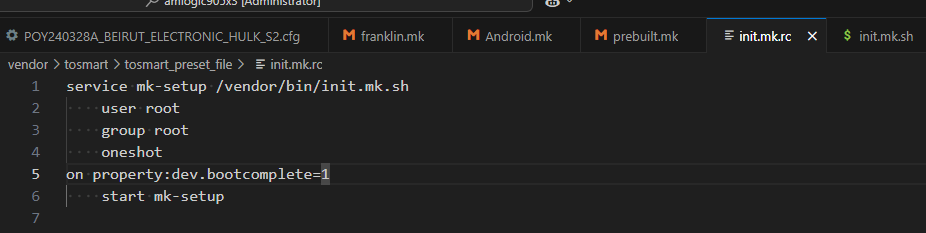
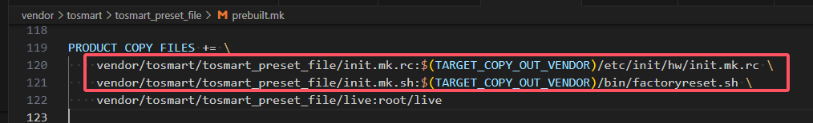

# 开机日志保存

## 一、前言

制作这个功能的原因是为了，自动的记录日志中的报错和警告到设备里面，方便release版本的错误排查。

## 二、代码实现

这块主要通过以下shell脚本实现

location: vendor\tosmart\tosmart_preset_file\init.mk.sh

```shell
#!/system/bin/sh

dir=/storage/emulated/0/sys_log/
CID=$(getprop persist.sys.cid)

# caijianrong@tosmart set hotkey save in RemoteApk when it reboot which is the xconn customer
if [ "$CID" = "59" ]; then
    if [ -d /data/system/keymaps ]; then
        echo "Keymaps directory creation failed"
    else
        echo "Keymaps directory created successfully"
   		mkdir /data/system/keymaps
   		mount -o rw,remount /system
   		cp -R /system/keymaps/. /data/system/keymaps
   		mount -o ro,remount /system
   		chmod -R 0777 /data/system/keymaps
    fi
else
    echo "skip keymaps operation: persist.sys.cid is $CID, not 59"
fi

if [ ! -d  "$dir" ] 
then
	mkdir $dir
	echo -e "\033[32m this is $dir success ! \033[0m" 
else 
	echo -e "\033[032m sys_log directory already exists \033[0m" 
fi

# wygw@tosmart set logcat and kmsg max size according to storage size
TOTAL_STORAGE_KB=`df /storage/emulated/0 | busybox awk 'NR==2 {print $2}'`
if [ TOTAL_STORAGE_KB -gt 7340032 ] # >7GB
then   
	LOGCAT_MAX_NUM=100
	KLOG_MAX_NUM=50
else
	LOGCAT_MAX_NUM=10
	KLOG_MAX_NUM=5
fi

LOGCAT_MAX_KB_SIZE=10240 # 10MB
KLOG_MAX_B_SIZE=10485760 # 10MB

logcat -f $dir/Logcat.txt -r $LOGCAT_MAX_KB_SIZE -n $LOGCAT_MAX_NUM &
sleep 10;
dmesg >> $dir/kmsg.txt;

while true
do
	# wygw@tosmart cut kmsg file when it reach the max size in while loop
	FILE_NUMBER=`ls $dir |grep kmsg.txt |wc -l`
	if [ $FILE_NUMBER -gt 0 ]
	then
		FILE_SIZE=`ls -l $dir/kmsg.txt | busybox awk '{print $5}'`
		if [ $FILE_SIZE -ge $KLOG_MAX_B_SIZE ]
		then
    		mv $dir/kmsg.txt $dir/kmsg.txt.$FILE_NUMBER;
		fi
	fi
	if [ $FILE_NUMBER -gt $KLOG_MAX_NUM ]
	then
		rm -f $dir/kmsg.txt.[0-9]*
	fi
	# wygw@tosmart add timeout to avoid blocking issue
	timeout 10 cat /proc/kmsg >> $dir/kmsg.txt;
done
```

init.mk.rc在接收到开启启动的信号时启动该脚本服务



将这个两个脚本文件预置到对应的系统目录下即可

