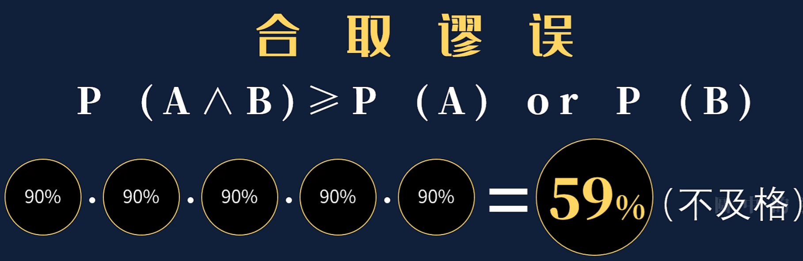
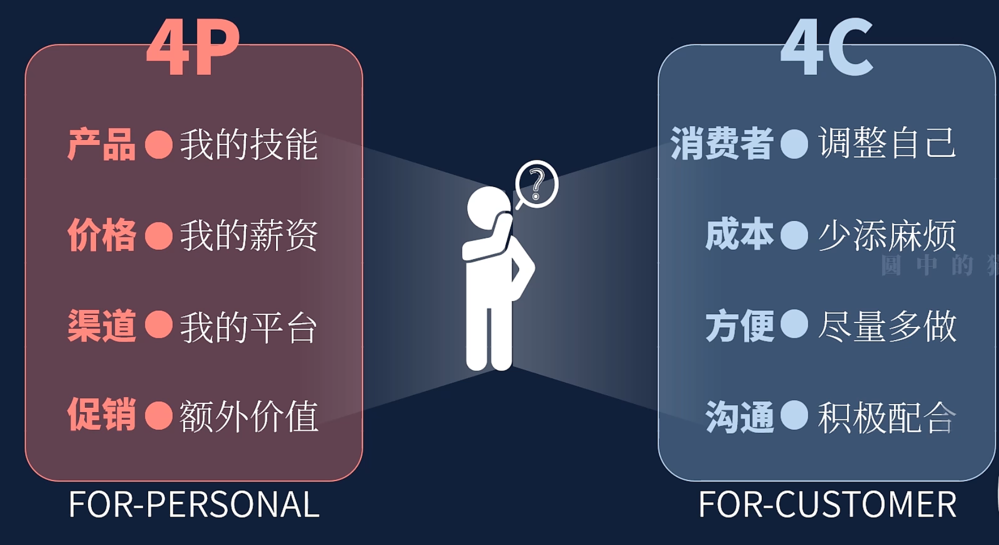
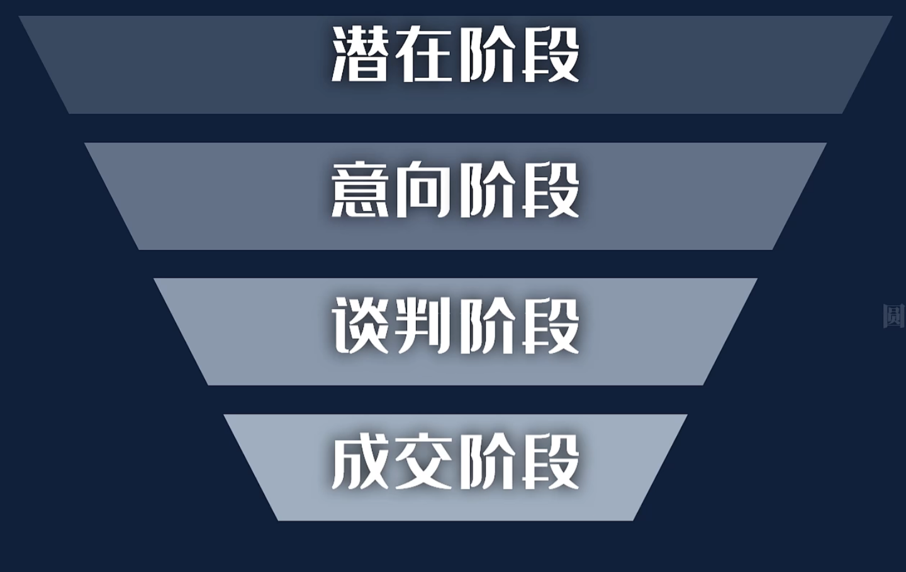
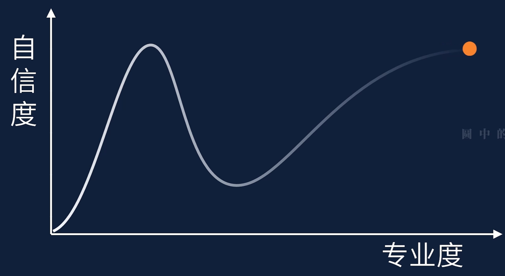
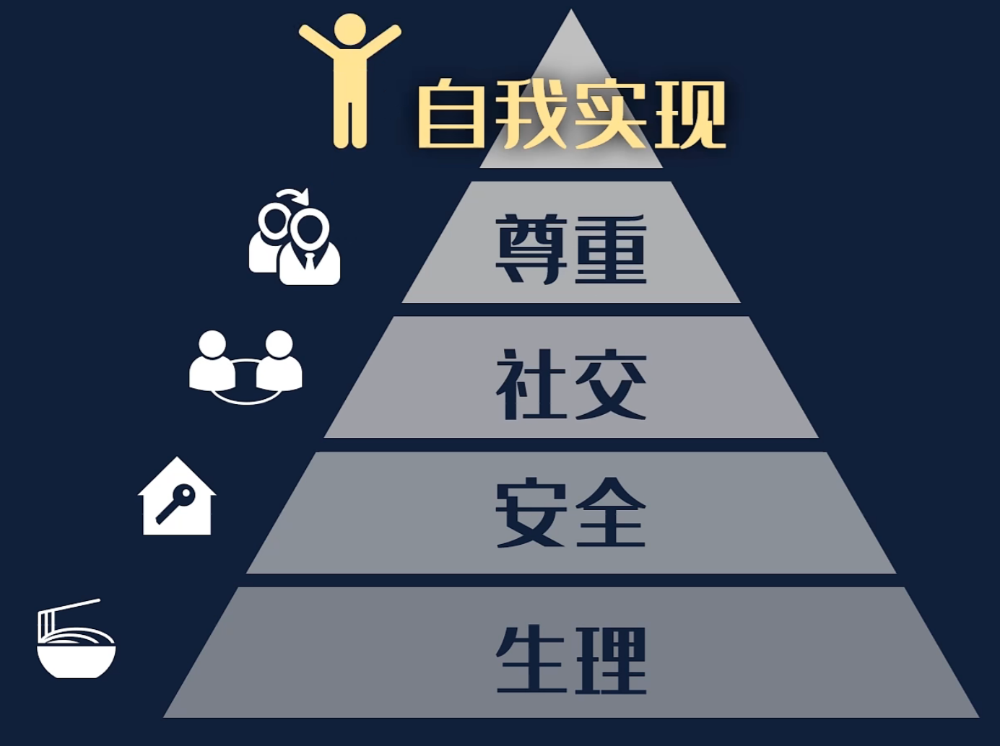
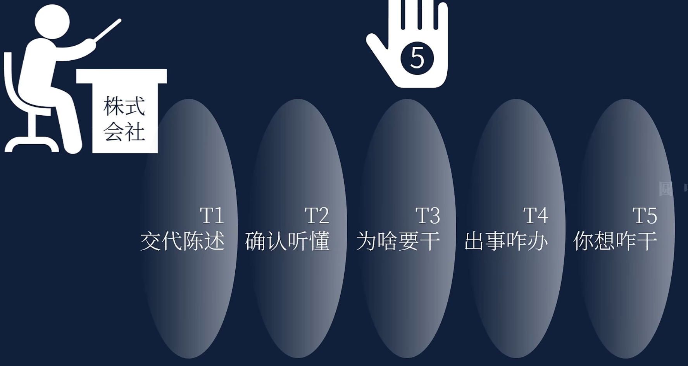
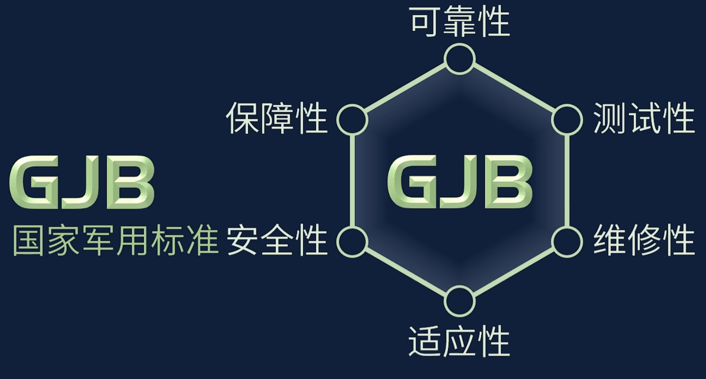
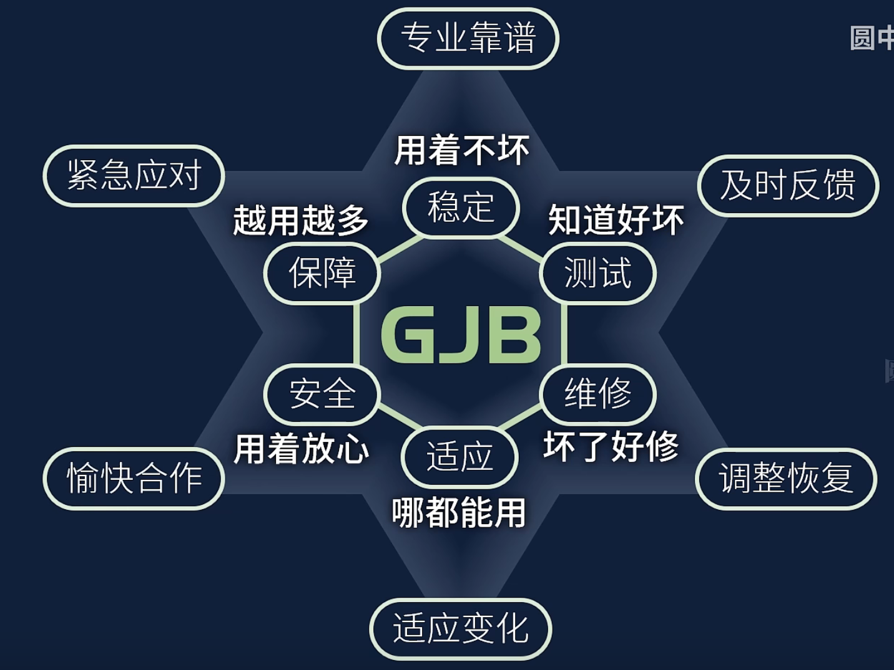
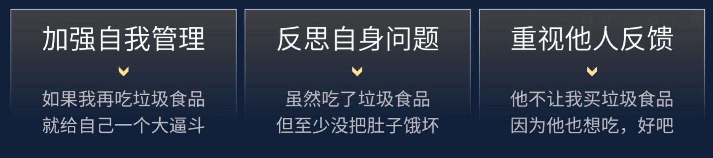

在巨人们的肩膀上跳跃。 —— 圆中的猫头鹰

思维模型可以代替纯文字，由繁到简的表达逻辑信息。

如何让知识更好的传播，如何制作好的教学视频？

更大比重地使用结构化思考&视觉化呈现

如果文字是花朵，它使得人类的思想世界，铺满一片花海。那么思维模型更像是一座座建筑、大厦桥梁，能够让我们在自己的思想世界里建起一座伟大的城市。

## 合取谬误

因此我们要发现身边的合取事件，提醒自己避免合取谬误

我们要我们要用概率的眼光看待事情，

eg.我来问问大家，下面哪个你会觉得更有可能是真？ a.广州市新增29例； b.广州市新增29例，其中白云28例，海珠1例。 大多数人会更愿意相信b 但从概率和逻辑上来说 其发生的可能性更小 这背后体现的正是合取谬误 **人们更愿意相信细节丰富的事情，尽管它更加不可能发生。**越具体的事情越可能是假的 。 我们也可以利用这一点 你想让别人相信你的话 那就具体点

## 中间态放松模型

长期处于有一种状态人都会累，无论是一直休息或一直工作。 休息应当是一个阶段向另一个阶段的过渡。

不管做什么事只要长期处于一种状态就会感到累

## 4P-4C模型

你要知道自己能提供的价值，和对方需要的你的价值。

## 能力圈模型

就是找到自己的有优势区也可以叫做“甜蜜区”

## 销售漏斗

重要的不是漏斗本身而是漏斗模型。

其本质是种对管线思维筛选逻辑的解释

## 达克效应

能力更差的人有四种表现：

1. 总觉得自己挺有水平
2. 不知道有水平的人到底多有水平
3. 不承认自己没有水平
4. 提高水平后就知道自己没水平，别人多有水平了

简单来说就是，**人如果不逼自己一把，都不知道自己有多蠢**

请多用行动的尺度，体验成长的难度

就比如在职场上老觉得领导很差劲没你厉害。

## 马斯洛需求层次理论

## 五遍信息沟通模型

创维所说的一个问题问五遍的模型，这样能做到信息0误差传递

交代事项——复述——说出目的——紧急预案——个人见解

职场：

1.接受任务问标准 2.请示工作有方案 3.汇报情况讲结果 4.分享经验讲过程 5.复盘时候讲感受

## 军标六性——职场保底能力体系

在职场中：

可靠性：专业靠谱，稳定发挥/不掉链子/持续输出

测试性：及时反馈，工作看得见/干了多少/多久干完/状态差不硬撑/反馈需求/避免误判

维修性：应急预案的准备/自身状态的调整

适应性：适应变化，要把日常的变化纳入计划之内/变化是工作的一部分/适应变化也是工作能力的一部分

安全性：让协助配合的伙伴感到满意/成功了，一起沾光/出问题，别甩锅

保障性：紧急应对，顶上去/爆发力可复制套路/管理者协同资源，解决批量需求/管理扁平化/运营模块化/作业流程化

军工产品思维和商业思维不同，商业思维是发挥极致优势，追求上限；军工思维是不容半点差错保证下限。

## 101010旁观思维模型

大概意思是，我们在做一个决定时，需要想象一下，在10分钟后，自己会怎么看待现在的决策，会不会后悔？在10个月后，自己会如何思考10个月前做过的这个决定？在10年后，自己会如何看待10年前做过的这个决定？这个思维模型可以应用在临时的判断，大的决定，预测自己的未来等事情上。

## 冗余备份思维模型

避免小概率事件造成无法挽回的结果。

实践的三种思路： 1、冗余［事后维修］；2、精简［预防维修］；3、反脆弱［维修预防］。 我关联了生产运作管理中生产设备维修的知识 1、生产设备坏了，维修的这段时间会耽误生产，想要缩短维修的时间，你得提前备好用于更换的零件【事后维修】； 2、想要进一步缩短维修的时间，你就得平日里给机器做好保养与检查，发现机器快要坏了就提前更换零件【预防维修】； 3、机器在哪些部分的磨损、损坏比较快，收集这些信息，在设计设备的时候尽可能优化这些地方【维修预防】。

这时你可以备份冗余。

## 断裂点理论

通过自损达到止损，通过小损防止大损

比如：在和朋友争吵时，自己先让步防止更大的后果

在个人自我规划中

都可以试做断裂点，用小的损失惩戒自己防止更大的断裂。

比如资金管理，设定一个每个月在吃穿上花了多少钱就...

## 安全边际

保留/弹性/余富/空间

以防偶尔的/突然的/额外的压力。

就是保留一些空间，比如留足时间高铁换乘

## 福格模型

`B = M A P`(行动 = 动机 * 能力 * 提示)

只要我们把这三个东西设计好，我们就能持续的做成，我们想做的事。
 - 动机：只有我们充分想做一件事情的时候才会去做。动机具有冲突性和波动性，这两个性质会在我们的行动中消磨我们的动力。
比如运动和体力的冲突，比如行动过程中对意志力的消磨。因此我们的动机不会一直居高不下，而是随时会收到身体、情绪、环境的干扰。
因此光有动机不行，还需要有能力的提示。
 - 能力：指的是我们完成这件事的难易程度，这包括我们是否能做到这件事，做到这件事需要花费多大的代价
 - 提示：这里要明确有用的提示和没用的提示。比如我在APP中设置了每天晚上八点提醒我跑步，但是每次弹出消息后我都是直接关掉，这就是没用的提示。
而有用的提示指的是**已经成为习惯的动作**。比如你有喝咖啡的习惯，喝完后会放下杯子，那么放下杯子就可以作为做20个蹲起的提示。
 
:::tip 
**如何找到影响自己坚持不下去的因素**?

时间、资金、体力、脑力、日程，按照这个顺序去排查因素。
比如运动，薄弱点就在于体力。
因此也能很好的找到解决办法：
1. 缩小规模（缩小一次锻炼的时间）
2. 设计简单入门步骤（先开始动起来，比如走到健身房门口、拿出瑜伽垫）

**行动提示设计三步法**：
1. 列出详细的日常行为清单
2. 为新习惯匹配行动的提示（地点、频率、主题一致）
3. 行为设计的本质是情绪设计，因此需要找到让自己开心的庆祝方式!
:::

:::warning 实践
日常行为习惯：
1. 出门 ---> 带咖啡
2. 来到工位 ---> 泡咖啡
3. 夜班下班 ---> 走到公司健身房门口 --->来都来了，健个身呗
4. 洗完澡 ---> 打开每日总结文档
:::