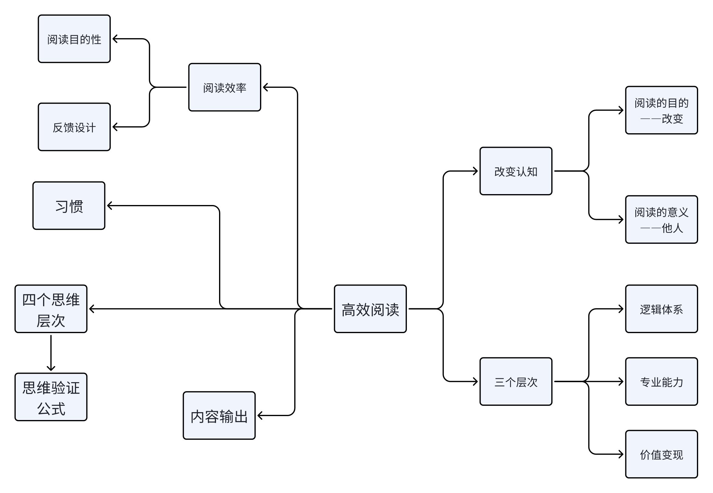

本书教会大家如何在信息大爆炸的时代使用低投入高回报的学习方法阅读。解决绝大多数人读书慢理解不了，读书快读完就忘，屯书多基本不读的困境。

为什么要阅读？阅读之前首先要确定自己的阅读目标，只有有了目标阅读才有意义。

# 高效阅读的前提，明确并升级阅读认知

## 决定你的阅读能力的是你的认知

阅读最重要的作用就是建立完善的知识体系。阅读有三大基础认知：目的、价值、意义。

## 阅读的目的

阅读的目的从来都不是阅读，而是改变。没有改变，阅读毫无意义。只是阅读，阅读带来的就不过只是焦虑的时候缓解焦虑的情绪，成为努力的证据，成为没有成长的借口。只有阅读基于改变的时候才会给你带来看的见的提升。

如何找到阅读的目标？

目标需要明确，诸如阅读是为了成长，阅读是为了更好的生活，这种目标根本不算目标。

## 阅读目标的三个层次

第一层：建立底层知识逻辑体系（也就是我目前的目标层次）

第二层：在你的领域里，通过阅读把它做到最好（工作中的指导层次）

第三层：价值变现，也可以是给我们人带来的价值观的提升（离我还远得很）

## 赋予阅读的意义

所谓意义，从来都不是为了自己，而是为了别人。

第一种：通过工作所创造的结果给别人带来价值，这种价值能帮助你找到生命的意义（比如做好软件让客户更方便）不要把工作当做为自己，而是为别人带来价值

第二种：通过奉献带来的满足感，找到生命的意义

第三种：通过选择对待生活的态度，找到生命的意义

总而言之，阅读的意义需要跟工作、能力圈和生活态度结合在一起，才能找到阅读对你的意义。

# 书单——知识逻辑体系

其实也就和以问题作为知识库逻辑树一样。一个人的庞大逻辑体系决定了他的价值观。

推荐书目：

1.《刻意练习》：作者是安德斯艾利克森和罗伯特·普尔。如果你想知道高手是如何炼成的，这本书可以详细告诉你从小白到高手，需要经历几个阶段，又有哪些方法可以帮助你超越90%的人

2.《认知天性》：作者是彼得·布朗。你认为学会一项技能，是每天学习效果好，还是一周学一次效果好？答案是每周学习一次就够了，但是你要掌握每周一次的方法。掌握了这种方法，你不仅能提高记忆力，而且学习能力也会

大幅提升。如果你想提升自己的学习能力和记忆力，那么你必须掌握这本书里关于学习的底层逻辑知识

3.《终身学习》：作者是黄征宇。这本书有两个重要的底层知识，它解释了为什么有人能够不断成长，升职加薪，而有些人却十年如一日。这两者之间的差距到底是从何而来，在书中你会找到答案

4.《好好学习》：作者是成甲。之所以推荐这本书，是因为很多人对于什么是底层逻辑知识比较陌生，分不清楚我们到底该学习哪些知识。此书会告诉你哪些是底层逻辑知识，这是建立底层逻辑知识体系必读的一本书。

5.《知识大迁移》:作者是威廉·庞德斯通。这本书将帮助你了解建立什么样的知识体系,其对应的收获会是哪些。比如,熟知养生知识，身体就会健康长寿;熟知理财知识,就会比大部分人富有;熟知百科和体育知识,收入就会高于大部分人。这本书可以作为我们搭建底层逻辑知识体系架构的参考图书。

6.《运动改造大脑》：作者是约翰瑞迪和埃里克哈格曼。这本书颠覆了人们对于智力的认知。如果你觉得智力是天生的、一成不变的，那你就错了。智力认知改变会对你有哪些影响呢？你的学习方式、教育方式，甚至你的生活方式都会随之改变，因为正确的运动方法可以提升一个人的智力。这到底是为什么呢？我想这本书的作者要比我说得更加清楚。

7.《加速》:作者是张萌。这本书是对自我管理知识体系架构搭建的介绍,并提供了自我管理包含的各种解决方案,作用是彻底解决拖延症。书中把自我管理分为5个知识体系，49个人生管理方法。在我们的成长路上,这些方法可以快速提升我们的学习能力，让我们掌握成长中最需要学习的几个知识体系。

8.《高绩效教练》：作者是约翰惠特默。惠特默博士写这本书的初心，是想通过提问式思考模式，激发人的身体潜能，从而让人创造奇迹。书中用各个领域的案例，来说明提问才是最好的学习成长的方法，这不仅对于发现自己的思维误区有帮助，而目还能发现人生目标、努力方向正确与否，方向错了，努力比不努力更加可怕。书中最可贵的是，惠特默博士还为大家提供了一套可以马上就用的提问模板，让人受益匪浅。

9.《影响力》:作者是罗伯特·西奥迪尼。为什么有些人受欢迎,有些人就比较容易被拒绝?有些销售员业绩好,而有些销售员无论怎么努力，都无法提升业绩?答案就在这本书中。这本书有6个重要的心理学底层知识,你不仅需要把它们纳入你的底层逻辑知识体系中,还需要把它们背下来。

10.《自尊》:作者是美国作家马修·麦凯。无论是学习、工作,或是生活，自尊心既是使我们成长的天使,又是使我们堕落的恶魔。如果自尊心过强,一个人便会因为自身的缺点对自己下死手,并对自己进行毁灭性的否定和打击，从而导致破罐子破摔的现象。所以,在成长的路上,提升学习能力的同时，建议读者们关注内心的成长,只有内心足够强大,你才不会因为一些小挫折、小失败、别人的一些负面评价而跌入万劫不复的深渊。在这本书里,作者提供了一套正确对待自尊的方法，我们可以尝试一下，把自尊控制在可以驱动我们成长的范围内，帮助我们不断地缩短和成功之间的距离。

11.《情绪急救》：作者是盖伊温奇。情绪对一个人的影响，可以覆盖他的工作、生活等方面。有句话叫作把脾气发出来是本能，把脾气收回去是本事。如果一个人能够控制自己的情绪，那这个人一定是一个极其自律的人。人生路上，我们总会遇到一些让我们无法控制情绪的事情，而世上多数的悲剧也是由情绪引发的冲动带来的。所以，在成长的路上，学会控制情绪就等于你已经领先了90%的人。那么，如何在情绪到来的时候，很好地控制它呢？我想作者在书中会告诉你一个很好的方法。

12.《高效休息法》︰作者是耶鲁大学精神学博士久贺谷亮。作者从大脑精神学科层面，分析了学习、生活及工作给予我们的压力，包括我们对于过往平庸的不甘和对未来不确定的恐惧，压力导致我们无法专心工作和学习。书中介绍了一种缓解压力的方法，作者把它叫作消除大脑疲劳和压力的七种休息大法，甚至还从精神学科角度研发出一种五日简单休息法。在我非常累的时候，我尝试了一下，还真的非常有效果，你也可以试试。最后，我们说一下建立底层逻辑知识体系需要用到的工具。我推荐两种，大家可以选择一种自己喜欢的，当然也可以两种一起用，效果会更好。第一种是思维导图。思维导图可以帮助我们提升逻辑思维能力。用思维导图建立知识体系架构，不仅有助于加深记忆，而且对于新旧知识的连接也非常有帮助，能更好地内化知识。第二种是卡片记录。卡片可以是我们经常用到的名片，在网上你找到制作名片的商家，告诉他做一些空白的就可以。我们可以按照分类去记录、归纳和收集，在你没有灵感的时候，你可以像打牌─样，一张一张拿出来看看，它会给你带来意想不到的收获。在建立知识体系的时候，我们需要注意的是，不是说知识体系建立之后就是一成不变的，它会随着你的成长而不断地升级和更新，因为学习本来就是终身的，是一种生活方式。

# 提高阅读效率，从寻找阅读方向开始

为什么？因为大多数人并不知道自己阅读的方向。没有阅读方向，就等于没有目标，没有目标，效率还有什么意义?

选择读什么样的书，才能让你拥有强大的竞争力呢？答案是：找到稀缺的能力，走少有人走的路。

那么有什么方法，可以知道我们到底应该学习什么样的技能呢？你只需要回答3个问题

第一个问题：评估过去在这个圈子里，哪些人是最被需要的，他们因为什么被需要？

第二个问题：现在你所在的圈子里，有哪些人是最被需要的，因为什么被需要？

第三个问题：在未来，你所在的圈子，最有可能被需要的技能是什么？

所以，无论你现在拥有什么样的能力，阅读方向都应该让你变得更加专业，无论是帮助你把已经有的技能变得更专业，还是帮助你成为新领域的专家。总之，专业就是你最初的阅读方向。

阅读定位三问：

你读什么书是由谁决定的?

依据又是什么?

读每本书的目的是什么?

也就是说，阅读要有目的性！

## 阅读反馈设计

我们做一件事情，如果收到的反馈是好的，我们就会想继续做下去，如果我们总是收到不好的反馈，或者是没有反馈，那么我们持续做这件事情的可能性就很小。

兴趣会因为能做好一件事情而越来越浓，它不是我们以为的对某件事情因为喜欢而感兴趣，就会对它一直有兴趣。当你做不好一件事情的时候，即便你原来对它再感兴趣，我想负面反馈也会让你渐渐失去兴趣，不再喜欢做这件事情了。所以，反馈设计是持续做一件事情最重要的手段

阅读反馈设计的3个要素：过去、现在、未来

# 书单——思维逻辑能力

1.《思辨与立场:生活中无处不在的批判性思维工具》∶作者是理查德·保罗、琳达·埃尔德。本书是公认的批判性思维权威。本书的核心主题，是帮助读者建立批判性思维，重塑性格，从内在去改变自己的人生。如果你控制不住自己的行为，或控制不住自己的想法，以及对于很多时候做的决策和直觉总是错的而感到困惑，这本书会告诉你原因。

2《学会提问》︰作者是尼尔·布朗和斯图尔特·基利。我推荐这本书的理由是，无论是学习，还是人际关系，或是企业管理，如果会提问，那么你一定是一个受欢迎的人。因为提问是激发一个人原动力的根源，也是激发一个人身体潜能最重要的方法。那么如何提问才能够激发人的原动力和潜能呢?书中的答案就是你需要建立的底层知识体系。

3.《离经叛道》︰作者是沃顿商学院最年轻的终身教授亚当·格兰特。这本书的封面有一句这样的话:“不按常理出牌的人如何改变世界?”李笑来老师曾经也倡导，不要管世俗眼光，做特立独行而正确的事情。事实上，书中说到的不按常理出牌的“常理”，大多是指群体思维模式下的行为方式。而群体思维在心理学范畴，指的是利用人们的思维惯性对思维施行一些影响，左右人们的决策和行为。但大多数人自身就带有群体思维，从众便是一种最常见的思维模式。如何能够突破从众心理，做特立独行且正确的事情呢?这就需要我们具有强大的逻辑思维能力，因此，逻辑思维对于任何人来说，都是一门不可或缺的人生修炼课。

4.《活出生命的意义》︰作者是维克多·弗兰克尔。虽然这本书属于心理学范畴，但如果你想知道很多成功人士成功的原因是什么，你会在书中看见跟你认知不─样的答案。一个人成功最重要的因素是什么呢?这就是我们要看这本书的目的，也是我们必须掌握的底层认知之一。

5.《穷查理宝典》︰作者是彼得·考夫曼。这本书完美地展现了不同的逻辑思维拥有不同的学习方法，以及解决问题的方法。大部分人认为，解决问题都是在问题的相关领域去解决，而查理·芒格却认为，解决问题要用跨界思维去解决。就像忘记带钥匙，虽然解决的是开门的问题，背后的本质却是回家的问题。所以，我们学习逻辑思维最重要的，是能够快速看到事物表象背后的本质。

6.《一本小小的蓝皮书》︰作者是加拿大著名作家布兰登·罗伊尔。这本书其实可以作为逻辑思维的入门图书，里面有很多逻辑思维的临界知识点，这些知识点是我们最需要的底层逻辑知识，比如决策树、概率树、决策分析法等。掌握底层逻辑知识，不仅能提升我们的逻辑思维能力，还有助于我们提升认知。毕竟认知决定的是一个人的命运走向，有什么样的认知，就会有什么样的选择，有什么样的选择，就会拥有什么么样的人生。

7.《思考快与慢》︰作者是著名的心理学家丹尼尔·卡尼曼。他的这本书被《纽约时报》评选为2011年度十大好书之一。这本书解决的问题是什么呢?大部分人以为自己可以驾驭思想，但事实上，你如果仔细思考便会发现，有很多事情是不受你的思想控制的。比如，你会不由自主地去想一个人;你明知道一件事情不能做，却管不住自己的行行为。为什么会出现这样的情况?书中不仅给出了答案，还给出了详细的对策，这就是逻辑思维的力量。

8.《亲爱的卧底经济学家》︰作者是著名的卧底经济学家蒂姆·哈福德。推荐这本书，是为了帮助大家了解经济思维如何对家庭。工作及生活产生正面影响，并帮助大家了解如何用经济思维去建立更好的两性关系、工作关系等。在这本书中，你可以看见一个经济学家思考问题和解决问题的逻辑思维方式，我们可以通过思维的比照，提升自己的思维空间力以及思维的逻辑能力。

9.《WOOP思维心理学》∶作者是加布里埃尔·厄廷根，世界著名心理学家、美国纽约大学及德国汉堡大学心理学教授。就我个人而言，我非常喜欢这本书，因为作者在书中揭露了为什么有这么多人，在成长的过程中会遇见成长瓶颈，无法突破自我。

10.《拆掉思维里的墙》∶作者是古典。在生活或是工作中，阻碍我们获得幸福和抵达目标的，你认为是什么?古典老师的这本书，对我们的思考过程做了深度解剖，分析了哪些思维误区是成功的最大阻碍，并且提供了职场、家庭、人脉关系所对应的思维模式。我们可以把这本书当作思维工具书，当人生路上遇见走不通的路时，我们可以翻一翻这本书，或许就能够找到解决之道了。

11.《反直觉思考:斯坦福大学思维自修课》︰作者是迈克尔·莫布森。为什么我们总是完不成计划?为什么有这么多人知道彩票中奖概率低，还是会去买彩票?为什么有人很努力却没有成功?大部分人在思考的时候，都习惯于把惯性思维作为思考的依据，而大部分惯性思维属于直觉思维,也是大脑最懒惰的默认设置思考系统。但在互联网快速发展的时代，如果你想成为领先的群体，你必须学会反直觉的思考方法,以事实和大数据为决策依据，提高决策的准确性，避免不必要的损失。如何才能掌握反直觉思维模式呢?书中自有答案。

12.《隐性逻辑》︰作者是语言学家卡尔·诺顿。本书作者揭露的是，在决策背后隐藏的思维习惯。本书以自问自答的方式，分析了形成思维逻辑习惯的主要条件和因素，帮助我们从旁观者的角度，更加理性地观察自己的思考过程和他人的思考过程，以便更加客观地快速切换不同的思维角度，增加决策的合理性和客观性，避免以偏概全。

最后，我们还是回到阅读上。逻辑思维事实上也属于底层思维知识系统之一，但在写作和阅读中，逻辑思维系统是最重要的基础，这也是高效阅读必修的底层思维分支系统。它觉察到了你的阅读速度和理解能力，以及你的写作表达能力。以上这12本书只是开始，在此基础上，我们可以再增加一些讲述逻辑思维的书，从而提升我们的逻辑思维能力，使我们的逻辑思维的根基更加牢固，如此才能走得更高更远。

读书要勤做笔记整理自己的知识理论体系。

# 阅读五年后的你会是怎样？

> 执行力就是在既定的战略和愿景的前提下，组织对内外部可利用的资源进行综合协调，制定出可行性的战略，并通过有效的执行措施从而最终实现组织目标、达成组织愿景的一种力量

执行力就是一个人是否清楚这件事如何一步一步做下去，简单来说就是目标拆分。

第一点：明确一个目标，可以远大，但不可以空想。

第二点：找到目标背后的本质，在要害上下功夫，事半功倍。

第三点：尽可能地把一件事情划分到最细小的步骤，细到不用动脑子就能完成。

时间管理：能把时间管理做得很好的人，大多数是能看到时间本质的人。时间管理的本质，说到底是价值交换，我们只做那些我们自己必须做的事情、让自己有所成长的事情、跟自己能力匹配的事情。我们可以把多数消耗我们时间成本的事情，利用外包的形式，让能力和价值定位相等的人去完成。

我们要掌握的原则是，在能力范围内，尽可能花钱去买一些低价值的时间，换取自己宝贵的成长时间。这样，你就会发现，你花的钱比投入的时间成本要低得多。

比如：比如，就上下班打车这件事情而言，计算下来每个小时的时间成本是100元，如果你的时间价值是每小时高于100元的，那这个时间交换就是合理的，但如果你每小时的时间价值低于100元，可能你就会感觉有些吃力。在这种情况下，我们就可以换一个时间管理的策略，在公司附近找房子，你就可以很好地控制时间成本了。

## 成功人士的6个习惯

第一个:付出不亚于任何人的努力;

第二个:保持谦虚的心，不骄傲;

第三个:每天反省复盘，自我迭代;

第四个:对万物持感恩敬畏之心，活着就要说谢谢;

第五个:持续做善事，做利他的事情;

第六个:不要因为错误而内疚自责，徒增烦恼。

## 如何养成好习惯

习惯是─种生活方式，而不是一种坚持。也就是说，如果你把习惯当做要打卡的坚持，总有一天你会扔受不住诱惑放弃。

别轻信了大脑的乐观幻想，高估自己的毅力。就比如花呗，让你高估你的财产价值。在设置习惯的时候我们往往设置过高的门槛。因为你乐观幻想了自己的毅力，其实你的毅力远远没有你想象中的那样强大，即便你能靠毅力坚持做一件事情，也绝对不是养成习惯的最好方法。坚持代表什么?代表你咬着牙去做，代表痛苦，而人性本就恐惧痛苦，喜欢享乐。做一件事情，只有把它变成你的兴趣爱好，做得让大脑感觉到开心，才是习惯养成的最佳方法。

别不做任何了解和学习，立即执行。我们在做一件事情时，应该如何衡量自己是否应该去做呢?首先，我们要对这件事情的结果的形成原理进行分析;其次，把分析的结果做成一个详细的执行流程，预估投入的时间、精力、物力等;最后，根据自己以往做事的事实数据，来衡量自己是否具备完成这件事情的条件，客观地评估做好这件事情需要付出的代价。

客观地评估事情的难易度，再进行自我匹配，你就会得到一个客观的数据，遗憾的是大部分人在决定做一件事情的时候，忽略了这个流程，所以半途而废就成了家常便饭。

三大习惯养成策略之一：每次只培养一个习惯

三大习惯养成策略之二：定小目标，超预期完成

三大习惯养成策略之三：发现抵触情绪，则降低执行难度

所有的成长其实都是反人性的，但我们可以把这种抵触情绪降到最低，一旦你发现自己有抵触情绪的时候，就对让你产生抵触情绪的事情进行执行力分解，降低执行难度，降低到什么程度呢？一直降低到你没有抵触情绪时，再接着去做。

## 半途而废根因是你的思维认识

大多数经历过半途而废的人，都认为半途而废是因为自己的能力不足，或是毅力不够强大，但事实上，让你真正决定停止做一件事情的，是你不想做这件事情的**情绪**。根本原因是，你期望的需求没有得到满足。当一个人的**需求没有被满足**的时候，就会形成各种各样的情绪。那么需求没被满足而引发情绪的这个现象背后的本质是什么呢？是你的思维方式和认知。

比如，对阅读的理解和认知不同，阅读在你心里的分量就是不同的。有些人把阅读当作刚需，所以阅读就会变成他的生活方式；但有一部分人把阅读作为成功的途径，那么可能在阅读没有满足他的期望的时候，他就会停止阅读从表面上看，我们所有的情绪来自于未满足的需求；而从本质上看，情绪形成的背后，是我们认知形成的思维方式。

## 思维的层次

思维一共有4个层次：

第一个层次：无层次思维模式。在这种思维模式中，一般人处于**无思考**的从众状态。别人怎么做，我就怎么做，很少主动思考。

第二个层次：低层次思维模式。主要以**直觉和别人的行为**作为思考标准，并把自我利益最大化作为决策标准，这种思维模式一般是在自我蒙蔽的状态下形成的。处于这

种模式中的人一般会有什么样的状态呢？大部分人会把自己的经验和信念当作事实真相。比如，“盲人摸象”就是一个典型的低层次思维模式，因为眼睛的局限，所以无法把自己的思维从局限中脱离出来，无法客观思考事物的真相

第三个层次：中层次思维模式。这种模式中的人有一个特征，就是他具备双重标准人格。什么意思呢？就是当一个人的思维模式达到中层次的时候，他会意识到思维的重要性，思维能力也较强，极善于辨别事物对于自己和他人的不同作用**。在要求自己的时候，一般会觉得自己是特殊体，对自己比较包容；但在要求别人的时候，一般比较苛刻。**我们可以用一句古语来理解中层思维模式，那就是“只许州官放火，不许百姓点灯”。处于这种思维模式中的人，一般能力还是比较强的，却无法有更高的成就，因为受到双重标准人格思维的局限。

第四个层次：高层次思维模式。在高层次思维模式中的人群，习惯于反省自己的思维方式，能够站在他人的立场上，甚至以上帝视角来客观地判断事物，你会觉得他非常公平。当你跟这种思维模式的人相处的时候，你会感觉非常舒服，这部分人也是最容易成功的人。因为处于高层次思维模式的人，不以自身和立场为思考前提，一般还会**换位思考**，有着谦虚正直、诚信坚毅的品性。

比如他们去看了日出没有叫你，那是因为那个时候你已经回去睡了，而且车不够坐

## 验证思维公式：

当你的元认知没有开启的时候，你可以把这个作为思维管理的简易版装置。公式很简单，由3个问题组成：

第一个问题：我这么思考的依据是什么？

第二个问题：这么思考会产生什么样的结果？

第三个问题：产生的结果是否是我想要的？

最重要的就是思考结果是否是我想要的。比如我认为同事都孤立我，这样会导致我越来越孤立，这不是我想要的。

## 思维警示公式：

如果...我就...

比如，在减肥的时候，你想吃东西了，这时候你发觉自己的思维模式后，如果不能够说服自己不吃东西，那么就可以启动思维警示公式：**如果我想吃东西了，我就去跑步。**这个公式可以由自己决定，**找一些自己不感兴趣的事情来填补**就可以了。当然，这种方法也可以用在你不想阅读的时候。我们这么做的目的是什么呢？如果你能够长期坚持实践上述思维管理的策略和方法，那么你就会逐渐成为一个拥有批判性思维的人，也就是说你的思维层次会达到最高层次。这是我们每个人都应该向往的努力方向。

无论什么目标，最终决定目标结果的，不是执行力，而是目标管理能力。执行力是什么？是基于目标管理的做事流程。目标管理能力是达成目标的源头，源头有问题，执行力再如何强大，都无法抵达我们心中向往的既定目标。

# 书单——目标管理

1.《追求卓诚》：作者是托马斯彼得斯和罗伯特沃特曼。两位作者都获得过多个学位，其中包括斯坦福大学企业管理硕士和商学博士学位揭露了500强企业经营的共同点。这其实跟优秀的人是一样的，你如果去给优秀的人画像，你会发现他们身上有很多技能是相同的。所以，从不同的思维角度去看这本书，它不仅可以归为企业管理类，还可以归为提升自我成长类。

2.《人生效率手册》：作者是张萌。这是一本非常实用的目标管理图书，无论是如何找到目标、分解目标，还是达成目标所需要的具体执行方案，你都可以从书中找到切实可行的方法，它非常接地气。我有很长段时间，在做目标规划的时候，都会把这本书拿出来翻一翻，就可以找到很多目标管理的灵感。如果你没有找到自己的目标，或者对于目标管理还处于小白阶段，从这本书看起，你会有很大的收获。

3.《OKR工作法》：作者是克里斯蒂娜沃特克。如何才能实现自己的目标？沃特克在书中提供了一套合理的达成泪标的方案，把目标与关键结果作为达成泪标的两大要素。我们可以把这本书结合《人生效率手册》一起使用，从找到旧标、分解日标、制定关键结果，到最终完成日标，两本书基本上就能涵盖实现目标的基本方法了。当然，还离不开在实践基础上的验证和调整。掌握这些，我们才能够离目标越来越近吗？一定不会。既然你无法掌控它，又何谈管理它？那么我们能够掌控的是谁？只有我们自己的身体、意识、注意力。所以这本书主要解决的问题，就是如何通过找到时间的运行规律，来让自己变得更自律，做到不管理时间，胜过管理时间。

5.《干法》：作者是稻盛和夫。作者总结自己一生的创业经验，以及使2家公司都位列世界500强企业的成功方法，通过本书为我们揭露到底是什么左右了最终结果。如果说成功有方法，我想这个方法从稻盛和夫嘴里说出来更有说服力。使1家公司位列500强企业或浒许是技巧，可是使2家公司都位列500强企业，一定是有方法的。具体是什么方法，稻盛和夫用《干法》这本书来为读者揭晓答案。希望你通过本书，找到通往成功的捷径。

6.《大数据时代》：作者是维克托迈尔舍恩伯格，曾经被誉为“大数据商业应用第一人”。为什么我要推荐这本书呢？在豆瓣上，大家对这本书褒贬不一，但我觉得，在最初我们了解大数据的时候，我们只要了解关于大数据的思维模式以及相关概念就可以了。为什么这么说？细想一下，我们所有的决策依据是什么？我想很多人依靠的是感觉和以往的经验，再者就是旁人的建议，很少把数据思维作为决策依据。但不幸的是，数据思维才是决策时最佳的参考标准。这本书虽然有些难度，但里面提到了大数据的很多概念，以及大数据与各种事物的关联，所以，我们在建立思维逻辑知识体系的时候，非常有必要了解关于大数据思维的一些知识。不妨用数据思维重新看待目标和所遇见的问题，或许我们就能找到解决问题的最佳方法，以便我们更快地达成目标。

7.《阿德勒100向人生革命》：作者是奥地利精神病学家阿尔弗雷德阿德勒。对著名的心理学家阿德勒来说，任何逻辑思维都来自于心理层面。心理层面的构造，决定了一个人的思维模式，限制了一个人的行为。而在推进目标的过程中，我们需要的不仅仅是逻辑层面，还有心理层面。如果我们在管理日标的时候，能够考虑到心理层面的需求，对于达成相标可能会有意想不到的结果。从人性角度而言，人在心理上都倾向于快乐，一件事情能有快乐的执行过程的话，结果多数不会太差。

8.《心智力》：作者是舒瀚霆和李中莹。作者颠覆了吃苦和成功之间的关系，惯性思维觉得“吃得苦中苦，方为人上人”，但经研究证实，如果你觉得赚钱、做事很辛苦，说明很有可能你的方法错了。成功也可以很轻松。虽然这本书是企业管理类图书，但书中的心智力同样适用于企业经营管理外的生活或工作。心智力决定个人对待事物的方式，是选择和决策的依据，也是思考的依据标准。作者通过5个层次的心智模式，重新塑造升级企业家的心智力，让成功变得不再那么苦。在抵达成功的路上，这本书用4个词语刷新了通往成功所要经历的路程：轻松、满足、幸福和快乐。如果你轻松抵达目标，用这本书刷新和升级你的心智，那么对于辛苦和成功的关系，你也一定会有不同的见解。

9.《六项精进》：作者是稻盛和夫。稻盛和夫用这本书告诉我们，成功抵达目标不可或缺的6个要素，无论是成长，还是在企业经营中，这6个要素都同样适用。它们也是我们每个人一生必备的修炼，起码于我个人而言，我愿意把这6个要素当作我人生前行的指引。

10.《跃迁》：作者是古典。推荐这本书，是为了这本书能帮助我们在抵达成功的路上，突破困境和解决所遇见的难题。作者在本书中给予的方法，是一种如叫作“破局思维”的思维模式。我们许多人一生被困在生存思维的困境中，尽管想出来，可是碍于生存的惯性思维，无法突破思维局限的禁锢，只能在渴望中苦苦挣扎，以致心力交瘁。作者提供了一套破除思维局限的方法，帮助还处于思维困境中的人，更快找到人生的突破口，改变自己的人生。

11.《经营者养成笔记》：作者是优衣库总裁柳井正先生。书中记载了柳井正先生是如何一步步使优衣库成为世界连锁品牌的；在达成目标的路上，柳片正先生又用了哪些方法加速了成功的速度。尽管书中的28大经营守则是针对企业经营和管理层面的，但对于生活和工作，我们也可以用同样的思维方式，去找到达成不同目标的共同守则，因为很多重要的知识和概念，事实上都算是底层思维知识体系，可以通用于大多数领域。书中还记录了柳井正先生的成长日记，这也是全书的亮点之一，我们可以通过柳井正先生的成长之路，找到自己成长的差异化，从缩小差异开始，加快抵达目标的速度。

12.《逆商》：作者是美国作家保罗史托兹。这本书主要解决了我们处于逆境时，如何通过逆向思维突破逆境的问题。在实现人生理想的路上，不可能畅通无阻，更多的是需要解决处于逆境中的问题。面对逆境，保持良好的心态，才能更加理性地发现问题、解决问题，也才能加快抵达目标的速度。所以，一个人的逆商决定了他成功的速度。而想要习得逆商只需要根据书中的步骤执行，如此，你就能够在逆境中轻松拿回主动权。

# 找到适合你的阅读方法，开启高效阅读之路

## 阅读目的

读书是分类型的，第一种是文字给灵魂带来喜悦的享受，第二种是为了学习某种新的知识，第三种是为了改变自己的人生。

# 书单——阅读

1.《书都不会读，你还想成功》：作者是二志成。为什么有人读书就能够逆袭人生，而有些人却越读书越迷茫？原因就在这本书里。作者二志成7年读了2500本书，却背了400万的债务，最后改变了读书方法，成功还清了债务，并且从企业底层做到了副总裁，最终实现了财富自由。二志成前后变化的原因到底是什么？就是他对读书的底层认知的变化，以及阅读模式的改变。如果你还处于阅读无效的困境之中，这本书会给你一些启发。

2.《快速阅读》：作者是克里斯蒂安·葛朗宁。这本书主要推荐的是视觉阅读进阶法，并且找出了阅读速度慢的原因一一逐字逐词阅读。书中提倡的视觉阅读法，是通过右脑把知识转化成一张张图片，将它们设置为有关联的连接，甚至是故事。通过这样的阅读法，你的阅读速度至少可以提升3倍，但具体练习的方法，你需要自己去书中寻找。

3.《如何阅读一本书》：作者是莫提默J.艾德勒、查尔斯·茨多伦。在本书中，作者把阅读分为3个层次，分别是基础、检视、分析，同时还介绍了不同图书的阅读方法。一般我介绍阅读方法主要以致用类图书为主，如果在阅读其他类型的图书时，发现有阅读障碍的话，可以把这本书当作阅读方法的工具书。书中介绍的方法都属于比较落地的，所以这本书一再被加印出版。

4.《高效能阅读》：作者是龙谷大学经济学部客座教授原尻淳一。这本书跟其他阅读技巧类图书相比，采用了心理学领域中的一些知识，利用人性的弱点把阅读的内部动机与外部环境结合，帮助读者提高阅读兴趣和效率。另外，书中还对阅读时应该把哪些知识作为自己的知识体系进行了阐述。事实上，无论是阅读碎片化信息，还是一本具体的书，对于知识我们都应该做一个漏斗，而非是知识吸尘器。

5.《实用性阅读指南》：作者是大岩俊之。这本书的核心主题是如何把读到的知识转化为能力。但这本书对于核心主题说得还是比较少的。之所以推荐这本书，是因为书中的一个把知识内化的方法一一把书中内容创建形象、联系记忆，把所有的关键词整理成故事一一是最好的阅读记忆方式。如果你想快速记住一本书的内容，这种方式比较容易操作。

6.《沟通圣经》：作者是尼基·斯坦顿。这本书是比较实用的沟通表达技巧指导类图书，从求职、人际沟通、主持、演讲、写报告等角度，分享了在各种场景下的沟通技巧，延伸到工作和生活，目的是让更多人能够掌握沟通要领。这不仅能够提升人们应对人生各种问题的能力，对于阅读和写作，也有很大帮助。所以，在阅读和写作上面希望自己精进的，可以把这本书作为实际操作指导书。

7.《阅读是一座随身携带的避难所》：作者是威廉·萨默赛特·毛姆。人们对毛姆有这样一个称呼：“阅读家”。毛姆的阅读方法是挖掘作者的性格、写作风格，以及作者的经历，从不同角度解读不同的图书内容。我们从毛姆的阅读视角可以发现，对于不同背景下的同一本书会产生不同的理解，而一个人的成长需要跟不同思维的人不断地去碰撞，激发自己从不同角度看世界、理解世界，这样我们才能在人生未来的路上，找到自己最好的样子，过上自己想要的生活。

8.《如何有效阅读一本书》：作者是奥野宣之，在日本以信息整理出名的畅销书作家。这本书主要阐述了如何通过记笔记的方式，来提升对一本书的记忆和理解，以及如何把读书的效率最大化地发挥在生活和工作中。读书笔记事实上不仅适用于阅读，也适用于其他领域。人的记忆本就是短暂的，连达·芬奇这样的牛人，都有终身记笔记的习惯，所以学会如何做读书笔记，对于提升阅读能力而言也是非常重要的。方法可以在书中找，但比方法更重要的是你的践行。

9.《杠杆阅读术》：作者是日本作家本田直之。作者在书中自创了“杠杆阅读法”。“杠杆阅读法”，就是把一个点设置为阅读的杠杆起点，用少量知识来撬动某个领域和读者需求领域中的知识，把阅读带来的知识红利，从自身的学习折射到具体的事情上，创造出100倍的收益回报。具体如何做，书中见分晓。

10.《超级快速阅读》：作者是克里斯蒂安·格吕宁。这本书跟《快速阅读》是同一个作者，但本书是作者的成名之作。由于作者在学业繁重的时候参加了司法考试，没有太多的时间去读专业图书，于是自己开发了一套高效阅读方法，在短期内就完成了繁重的学业，通过了司法考试，一时间作者自创的阅读方法风靡全球。书中的方法是通过4个阶段来完成超级快速阅读，超级快速阅读不需要很强的意志力，也无须任何阅读基础，只要你根据书中的方法不断练习，就能够掌握阅读技巧，远离无效阅读给我们带来的迷茫和压力。

11.《不爱读书不是你的错》：作者是幾米。这本书是一个绘本，作者从孩子对于阅读的视角，对阅读做了重新定义。书中有句话特别经典：“大人不读书天经地义，小孩不读书罪大恶极。”有没有值得深思的地方？书中有许多以孩子的思维方式对于阅读阐释得比较新颖的观点，它可以打开我们对阅读的另一个层面的认知，重新帮助我们塑造完整的阅读认知。建议你不论是否有孩子，都读一下这本书。

12.《麦肯锡精英高效阅读法》：作者是斯坦福大学的硕士赤羽雄二。作者把这本书的读者群定位为那些工作比较繁忙的人士。书中提供了一套阅读方法，可以帮你迅速找到自己需要读的书，养成良好的阅读习惯，让你在1年的时间内，阅读量增加1倍。书中还提供了高效记忆的方法，帮助你快速掌握每本书的重要内容，将这些内容运用到生活和工作当中，真正地用阅读改变命运。

# 内容输出

我们把阅读输出分为4个阶段，可以帮助大家找到写作定位，设计好阅读的输出方式，让你更高效地提升阅读效率和写作水平。

第一阶段：找到正确的努力方向，设计你的阅读输出方式。

第二阶段：模仿。它是所有成功和创新的起点。

第三阶段：高效阅读输出的3大策略，“敢”比“能”更重要。

第四阶段：14天爆文书评速成法，快速入门就是竞争力。

阅读输出可以有很多种，但最基础的阅读输出就是写作，无论你是把读过的一本书写成书评，还是写成其他文章，甚至是感悟，都需要一定的写作能力。除了写作能力，还需要一定的沟通能力，因为输出从本质上来讲，属于一种语言表达，是另一种层次的沟通。本章我推荐12本书给各位小伙伴，以提升大家的写作能力，事实上这也是提升阅读能力的另外一个途径。

# 书单——内容输出

1.《一本小小的红色写作书》：作者是哈佛大学高材生布兰登罗伊尔。这本书很薄，但非常适用于写作入门的小伙伴，书中对于如何用各种词语、句子做了很详细的介绍，还有各种案例，目的就是帮助大家提高文章的品质。书中还提供了6种基本写作结构，在写作的时候，我们可以每个结构都尝试一遍，然后根据自己的喜好，找到一个适合自己的。

2.《高效演讲》：作者是斯坦福大学沟通力与领导力讲座教授彼得·迈尔斯和屡获殊荣的新闻记者、小说家和剧作家尚恩·尼克斯。作者用20余年的时间总结出了一套非常接地气、适用于大部分演讲主题的方法，同时在书中也解释了为什么大部分人面对很多人说话的时候会紧张，然后又提供了解决紧张的具体方法，并且从演讲开头到结尾都提供了具体的演讲稿写作模板，以达到快速吸引听众、实现预期演讲效果的目的。为什么要给大家推荐演讲的书？演讲事实上是一种写作和表达的完美结合，我们可以通过演讲提升自己的表达能力和写作能力。

3.《演讲的力量》：作者是TED创始人克里斯安德森教授。TED自从创建以来，做过几千次精彩的演讲，同时TED演讲舞台上的人，很多是在各个领域中获得一定成就的人。安德森教授把几千场演讲中的精髓都整理在这本书里，从战略上解释了演讲是怎么回事，需要注意些什么，如何给观众提供有价值的信息。这就跟写作一样，对于你写的东西，最重要的是，如何给你的读者提供有价值的信息，而不仅仅是对你个人有价值的。从这本书中，我们可以看见不同层面的写作技巧，再结合常规的写作方法，对于提升写作水平会有比较大的推动作用。

4.《你能写出好故事》：作者是在出版社工作多年的丽萨克龙。为什么要推荐有关故事的书呢？因为我们在解释一个概念的时候，或者是陈述一个观点的时候，会用到各种故事。无论是名人故事，还是普通人的故事，我们都需要把它写得精彩，因为人们本来就喜欢听故事。所以故事在写作中起到了画龙点睛的作用，让文章看起来不那么枯燥。通过故事来表达观点，是读者最容易接受的方式。书中对于如何写故事，提供了具体的写作架构。欲知详情，请读此书。

5.《批判性思维》：作者是理查德.保罗。这本书的副标题是“思维、写作、沟通、应变、解决问题的根本技巧”。可见，写作离不开强大的逻辑思维能力，而批判性思维模式，是一种能够从客观的角度去思考问题、发现问题，并解决问题的自我审视的思维方式，这在写作中就显得尤为重要。因为写作事实上就是解决读者问题的一种方式，所以我们不能只站在主观的立场上，还要站在读者的立场上思考问题。如果我们能够拥有批判性思维，就能够分清楚自己写作的立场和观点处于什么样的思维模式中。因此，这本书无论从阅读还是写作的角度来讲，都应该是必读书。

6.《完全写作指南》：作者是拥有30余年写作辅导经验的劳拉·布朗博士。我们可以把它当作写作实操指南。书中从不同的写作需求出发，介绍了不同的写作方法，比如，如何写演讲稿、简历、报告或者各种励志类的文章。这本书通过设计写作路径，教我们如何掌握读者心理，并重新塑造我们的写作习惯。哥伦比亚大学商学院教授伯恩特·施密特，对此书给予了高度评价。那么什么样的写作路径是能够帮助我们掌握写作方法，养成良好的写作习惯的呢？我们需要自己在书中寻找，并且做好相关笔记。

7.《爆款文案》：作者是关健明。关健明通过文案写作，帮助很多企业解决过产品滞销问题，一篇文案甚至为企业创造了不俗的销售业绩。写作文案技巧对每个人而言，都不可或缺。无论我们是否需要从事文案工作，都需要掌握文案写作的原理，因为文案写的是一种人性，写的是一种需求，文案是一种从心理学角度出发的写作方式。在写其他类型文章的时候，我们一定会写到痛点，一般痛点是由人性的弱点而引发的各种问题，所以，多从心理学角度考虑和切入写作也是必修课。书中提供了各种文案写作的思路和模板，在开始的时候，我们可以套用，最后再打造自己的风格。

8.《麦肯锡教我的写作武器》：作者是全球战略顾问高杉尚孝教授。这本书在豆瓣上被介绍是职场人士必读的商务文案写作指南，能够帮助你自动养成逻辑思考的习惯，让你5分钟就构思出一篇逻辑清晰、说服力十足的商务文案。虽然这个广告语显得有点儿夸张，但如果能够掌握写作方法，快速写出一篇高品质文章还是不难的，关键就在于我们的思维逻辑能力是否足够强大。写作需要通过逻辑来构建框架，需要利用金字塔原理叙述每件事情和观点，这样才不至于使文章过于冗余复杂。具体如何5分钟写出逻辑清晰的商业文案来，作者不仅提供了写作的4个关键要素，还分析了如何通过逻辑搭建写作架构。总之，本书也可以作为写作实操训练书来阅读。

9.《关键对话》：作者是科里帕特森、约瑟夫·格雷尼、罗恩·麦克米兰、艾尔·史威茨勒。为什么要推荐《关键对话》？写作从另外一个角度来说，就是一场和读者的隔空对话，你需要通过你的文章，把你的观点传递给你的读者，那么如何表达你的观点才会吸引读者呢？作者在书中设计了一套沟通技巧，我们可以通过掌握沟通的秘诀来解决各种问题。我们可以把这种沟通思维用于写作当中，它能够起到四两拨千斤的作用。

10.《非暴力沟通》：作者是马歇尔·卢森堡博士。为什么在生活中会出现越是亲近的人沟通起来越困难的问题呢？明明是为了对方好，但总是在不经意间伤害了最亲最爱的人。在各种信息中，我们也经常看见一句话引发的悲剧。写作也是同理为什么有些人的文章阅读量很高，有些人的文章即便投放在好的平台上，阅读量也不那么突出呢？原因就是沟通方式。语言暴力虽然造不成肉体上的伤害，却比肉体上的伤害令人痛苦百倍。卢森堡博士研究了非暴力沟通的原则和非常实用的方法不仅可以缓解紧张的人际关系，还可以用于写作技巧中，引发读者共鸣，获得更多读者的信赖和支持。具体方法见书中。

11.《10秒沟通》：作者是荒木真理子。我们经常会遇见说话总是抓不住重点的人，但本书介绍了一种每天通过10秒沟通练习法就可以掌握的沟通技巧。掌握这种沟通技巧，10秒钟就能够把话说清楚，作者还打造了具体的练习模板，想提升沟通能力的小伙伴可以尝试一下。对于写作，事实上也是用得上10秒沟通原理的，因为读者通常打开一篇文章后，一般也是在10秒钟之内就决定看不看这篇文章了。所以，10秒沟通技巧同样适用于写作领域。

12.《金字塔原理》：作者是哈佛商学院第一批录取的女学员中的芭芭拉·明托。对于写作而言，《金字塔原理》是必修课，这本书的副标题是“思考、写作和解决问题的逻辑”。正如副标题所说，不仅写作离不开逻辑，我们生活中需要解决的各种问题也离不开逻辑。人生其实就是一个不断解决问题的过程，逻辑思维能力强大，解决问题的能力相对就会高一些，而写作逻辑思维能力强大，文章自然就会条理清楚。反之，可能文章就会显得有些混乱。书中建议我们构建一个基本的金字塔逻辑架构，以便帮助我们增强逻辑力，提升写作能力和解决问题的能力。书中提到的金字塔逻辑架构，我经常用于写作中，你也可以试试。

# 变现-此章节我不做笔记

# 零碎书单

《运动改造大脑》运动可以让人变得更聪明。因为在运动的过程当中，分泌的多巴胺会让大脑结构比例发生改变，比如大脑皮质层面积会慢慢变大，而人的智力高低就是由皮质层的面积大小决定的。

《知识大迁移》作者威廉·庞德斯通阐述了在移动时代知识的真正价值。书中提到，一个人拥有多少财富，跟他拥有的知识数量有直接关系，一个人健康、幸福与否，跟一个人有什么样的知识体系有关，当然，也包括智力。

《书都不会读，你还想成功》

《把时间当做朋友》

《微习惯》斯蒂芬·盖斯说:“把你想养成的习惯，分解到最小单位。什么是最小单位?就是小到你不可能完不成。”就像斯蒂芬·盖斯给自己制订的健身计划，在最开始的时候，每天做1个俯卧撑。看上去是不是特别有意思，1个还叫锻炼啊?但当你去做的时候，你真的只会做1个吗?一旦开始行动了，你就会想继续做，因为1个只是打开习惯的仪式感，仪式感其实就是启动我们行为的开关。

我们之所以无法养成好的习惯，最大的原因是我们把期望值从开始就预设得太高了。就像我们培养阅读习惯一样，我们经常会告诉自己，每天要阅读1个小时，要坚持多少天，但最终我们会发现，这种思维模式下的坚持，大多数的结局是半途而废。因为长期做一件事情，靠的不是坚持，而是习惯，是你每天想办法用仪式感去开启你期望行为的一种技巧。

《思辨与立场：生活中无处不在的批判性思维工具》这本书主要是让更多人了解一个人的思维到底是被什么左右的，从而帮助大家避免思维的遮蔽性，用更加客观的思维方式去对待每一件事，迎接人生的更多可能性。接下来我们来看一下，作者是如何通过对思维的剖析来帮助我们开拓思维，并管理好自己的情绪的。