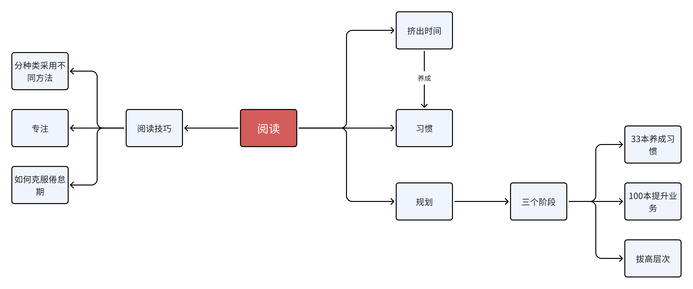

阅读使人充实，会谈使人敏捷，写作与笔记使人精确。 —— 培根

本书使用一个人的职场成长的故事介绍了如何养成读书的习惯以及对人生产生的影响。

读书过程分三个阶段，即基础定向阅读、加强定向阅读、深层定向阅读。

基础定向阅读：通过阅读100本以上和自己业务领域相关的书，打下坚实的阅读基础。

加强定向阅读：用一年时间阅读365本自我启迪的图书，以拥有成功者的思维方式。

深层定向阅读：通过阅读人文古典书籍使自己成为领军人物。

# 阶段目标一：100天读33本书

目的：养成良好的读书习惯，获得读书的乐趣

## 时间从哪儿来？

零散时间比你想象的要多！

多拿出点时间来。在确保平均一周读完两本的情况下，再开始读一本新的。读着读着你就会发现速度加快了，可以做到一天读一本了，但是最初一定要设法利用所有可以利用的时间。除了早晚的时间，上下班路上的时间也要利用起来，不管是在公交车上还是地铁里都可以读。

“一旦体会到了读书的乐趣，即便我劝你周末别读你也会抓住书不放手的。”

100天读33本书的7个秘诀

1. 购买能够抓住你心的33本书，不论是书的封面、作家还是内容。
2. 每天早晨和晚上睡觉前大声地连说三遍“我今天要读书”这句话！
3. 在日记本或笔记本上坚持写读书日记。同时也简单地记录一下书的名字及所读的页数等。
4. 严格遵守早晨和晚上各读书1个小时。
5. 严格遵守上下班路上各读书30分钟。
6. 每天利用开始工作前的时间和午餐时间读5—10分钟的名言录。
7. 一定要做到平均1周读2本书。

## 当读书出现倦怠期

三个克服倦怠的方法：去见指导老师、去见书友、去图书馆

# 如何快速阅读一本书

1. 主动阅读

大家可以想象，在你头昏眼花或者有一件特别紧急的事情需要去做的时候，却强迫自己进行阅读，那么你能专心地阅读吗？所以，快速阅读一本书的先决条件，是主动阅读，阅读越主动，效果就会越好。

1. 知道自己的阅读目标

有的书只要读其中一部分，有的书只须知其梗概，而对于少数好书，则应当通读，细读，反复读。” 那么一本书摆在你的面前，你要迅速判断，这本书，你是打算尝尝味道即可，还是值得认真咀嚼？

1. 掌握一定的阅读技巧

拿到一本书，首先要仔细阅读封面文案、目录和推荐序等一切非内文的东西，这些地方的文字，都是编辑精挑细选最能概括该书精华的文字，阅读完这些你就会对这本书有一个**大概的概念**，就像一个出外旅游的人，提前看的地图，虽然你不知道那些景点好不好玩，但你最起码知道里面有几个景点，景点之间相距多远，每个景点都有什么特色，以便对自己的旅程进行规划。看完地图，是不是应该去其中的一个旅游景点看看是否符合你的期望？好，接下来就在目录里选几篇和主题息息相关的篇章来看，这样一路看下来，你已经基本了解这本书是否包含你还想继续挖掘的内容。是继续制定详细的旅行计划还是打一枪，马上换一个地方？相信你已经心中有数。

1. 掌握具体的快速阅读方法，简而言之，就是如何能做到一目十行

A.管住眼球

用手指或笔来当做索引，管住眼球，好让你的眼睛能扫视整个页面，这是个传统的方法。用一张卡片或者是一张纸来盖住你已经阅读完毕的部分，让卡片保持在你所读的文本的上一行，这也是一个行之有效的法子，它迫使你往前读。

B.稳稳当当可不够快

实际上，我们的大脑能在五百分之一秒钟就能识别文字，然而，遗憾的是，我们却还在用四分之一秒来识别每一个字。

C.该长大了

我们最开始学阅读的时候，老师们叫我们要一字一句地读，虽然这个方法有其益处，但我们该长大了。如果你还停留在专注一字一句的话，你同时肯定会在心里默念那些文字。而想要快速阅读，其实要一目十行。

D.实践

APP上有类似的阅读训练软件，可以让你自主选择阅读速度进行训练，选择的范围在一分钟25字到1500字之间。

# 阶段目标二：读100本与自己业务有关的图书

 争当领域第一名而制定的1年读100本书的任务

\1. 每个月买10本业务领域里的经典读物。

\2. 一周读两本。

\3. 在必须知晓的部分下边画横线做标记，在空白处写下自己的想法。

\4. 重要的内容要抄录或录音，利用上下班时间，反复读或听，慢慢消化吸收成自己的东西。

\5. 每个周末写当周所读两本书的评论。

## 当你在读书过程中出现倦怠而不知所措时

正当你感觉读书已走上正轨一帆风顺时，有可能突然出现倦怠情绪。此时，你应把它视为获取更大成功过程中的阵痛。

1. 去见那些能够帮助你读书的人

如果有读书导师，最好在刚出现倦怠的时候就去见他，寻求他的帮助。因为他们也曾经历过读书倦怠期，一定会有解决问题的方法。如果你没有读书导师，可以去见一见你身边经常给你支持并给你鼓劲的熟人，以真挚的态度同他们聊一聊，这也是个不错的方法。而那些认为读书不重要或是虎视眈眈地妨碍你读书的人，就算你再有难处，也最好不要去见他们。

1. 去帮助刚刚开始读书的人

如果周围有人刚刚开始读书，可以把自己在读书过程中掌握的读书技巧欣然地告诉对方。你通过此举不仅能想起自己最初读书时的状态，而且在帮助对方的过程中还会学到更多新的东西，自己周围读书的人越多越好。和他们不存在等级差异，都是伙伴式的平等关系，换句话说，在读书的世界里，只有志趣相投的书友。

大家在一起，为的是互相学习，交流经验，分享更多的东西。还可以劝导那些对书籍毫不关心的人去读书。在向他们强调读书必要性的过程中，自己也能再次获得读书的力量。

1. 读一些成功战胜考验的书

即便是再好的熟人，如果他根本不想见人，就只能让他通过书籍获得勇气。对这种人来说，与其阅读人们常读的书，不如选择那些战胜考验实现了梦想的人的自传更合适。让他知道这个世界上有很多人都战胜了比自己想象中更大的困难。许多被我们称为伟人的人，他们的经历很多都是常人难以想象的。他们不是为了成为伟人而读书，但是读书确实是他们从普通人成为伟人的重要因素。

1. 在家里的每个地方都贴上有意义的语句

经常读什么类型的文章是个至关重要的问题，就好比有什么样的父母，就有什么性格的孩子一样。将正面的、能给你增添勇气的语句，让你确信自己梦想并能促使梦想实现的语句，以及能让你重振精神继续前进的语句抄写在便条纸上，贴在家里随处可见的地方。刷牙的时候、开冰箱的时候、准备出门的时候都用力读上几遍，声音越大印象就越深刻。如此坚持下去，内心就会逐渐发生变化。

1. 每天看看你作为榜样追捧的崇拜者照片

现在你以谁为目标？CEO？扬名世界的作家？或是只要一听名字就知道是位知名的设计师？还是令年轻人狂热追逐的歌星？找一张可作为自己未来事业样板的顶尖人物照片，放在钱包里或贴在屋子里，每天看一看，并且设想一下，如果自己是这个人此刻会怎么做？如果自己是这个人该如何迈过这道坎儿？如果这个人出现在自己面前，自己会说些什么？要在心中设身处地地描绘一下自己的样子，看看此时自己会有什么感觉，会有哪些想法。他们克服了倦怠战胜了坎坷，成为了顶级人物，你当然也可以做到。

1. 给自己喜欢的作家发邮件

如果有本书让你深受感动，你可以给那本书的作者发封邮件。邮件中可以简单地写写你的读后感，或者提一提自己不明白的问题。另外，如果在读书的过程中，产生了不同的观点，也可以拿出确凿的依据予以反驳。至于作者是否给你回复那不是关注的焦点，重要的是你为了给作者发邮件，又读了一遍书，又思考了一下主题，这种深沉的思索是很有意义的。在这个过程中，逐渐使自己能更加客观地看待事物，并能够更深刻地感受到读书的魅力。

还可以去参加作家的讲座，提出有深度的问题，或在现场推荐一下在读书论坛和网络书店发表的书评。

## 如何正确记读书笔记

为什么对阅读来说，在书上做笔记是不可或缺的事？第一，那会让你保持清醒——不只是不昏睡，而是非常清醒。其次，阅读，如果是主动的，就是一种思考，而思考倾向于用语言表达出来——不管是用讲的还是写的。一个人如果说他知道他在想些什么，却说不出来，通常是他其实并不知道自己在想些什么。第三，将你的感想写下来，能帮助你记住作者的思想。

做笔记有各式各样的方法， 以下是几个经常采用的方法：

A.画底线——在重点句子，或者重要又有力量的句子下画线。

B.在画底线处的栏外再加画一道线——把你自己画线的部分再强调一遍，或者某一段很重要，但要是底线画得太长了，便在这一整段外加上一个记号。

C.在空白处做星号或其他记号——要慎用，只用来强调书中十来个最重要的声明或者段落即可。你可能想要将做过这样记号的地方夹一张书签。这样你随时从书架上拿起这本书，打开你做记号的地方，就能唤醒你的记忆。

D.在空白处编号——作者的某个论点发展出一连串的重要陈述时，可以做顺序编号。

E.在空白处记下其他的页码——强调作者在书中其他部分也有过同样的论点，或相关的要点，或是与此处观点不同的地方。这样做能让散布全书的想法统一集中起来。许多读者会用Cf这样的记号，表示比较或参照的意思。

F.将关键字或句子圈出来——这跟画底线是同样的功能。

G.在书页的空白处做笔记——在阅读某一章节时，你可能会有些问题（或答案），在空白处记下来，这样可以帮你回想起你的问题或答案。你也可以将复杂的论点简化说明在书页的空白处。或是记下全书所有主要论点的发展顺序。书中最后一页可以用来作为个人的索引页，将作者的主要观点依序记下来。

# 阶段目标三：多读自我启迪的图书