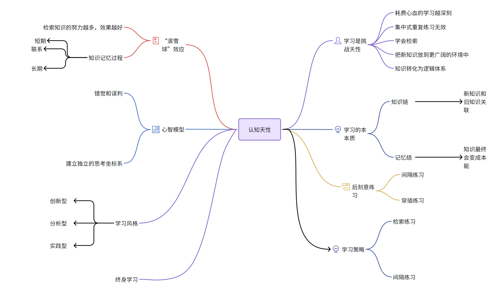

阅读使人充实，会谈使人敏捷，写作与笔记使人精确。 —— 培根

《认知天性：让学习轻而易举》这本书是由11位世界前沿认知心理学家耗费10年科学心血总结出的一套认知规律。它不仅总结了认知规律，还将认知规律与日常学习结合起来，提供了具体的操作技巧与案例，为需要学习的人提供了一套行之有效的学习方法。这本书是一本关于学习的心理学规律的科普读物，通过科学的方法论帮助人们学习更高效、更持久。阅读这本书将有助于了解学习规律，改进学习方法，并在实际学习中取得更好的效果。

提到了学习中的一种方法：大量画线和颜色可能并不会真正加强记忆，反而会产生错觉，大脑开始不耐烦，记住的效果并不好。相反，记忆更深刻的是那些令人头痛、需要挣扎思索的东西，这样可以刺激神经元，触发新突触的形成过程。

也提到了学习中的一些错误方法，例如填鸭式教学、重复阅读、集中练习等，这些方法效率较低且效果短暂，不利于长期记忆。实际上，学习更吃力时，记忆才更持久。

# 学习是挑战天性

耗费心血的学习才是深层次的，效果也更持久。不花力气的学习就像在沙子上写字，今天写上，明天字就消失了。如果感到学习非常吃力，那是说明你正在学习非常重要的东西。就像玩动作类电子游戏、试验新的自行车越野特技一样，想在已有的水平上有所进步，达到真正的专业程度，就要明白努力与挫折是必不可少的。犯错误并改正错误，其实是在搭建通往高层次学习的桥梁。

反复阅读课本，并进行集中练习，这其实是效率最低的一种方式。与反复阅读这种复习方法相比，回想事实、概念或事件会更有效。这种方法被称为检索式练习。重复本身并不能带来出色的长期记忆。

把新知识放到更广泛的情景中有助于学习。

把知识转化成心智模型存在脑子里，就相当于构建逻辑体系。

考试是最有效的学习策略之一,主动检索——考试——可以强化记忆，而且检索花费的心思越多，受益就越多。

# 学习的本质：知识链和记忆结

知识最终将变成条件反射,

自我检测，反复检索：给知识链打上记忆结,要想达到最佳效果，就必须重复多次检索，而且检索之间要有间隔。这样才能让人努力达成认知，回忆才不会变成无意识的背诵。

# “后刻意练习”时代的到来

频繁的集中练习只会产生短期记忆

间隔练习使知识存储得更牢固

穿插练习有助于长期记忆

# 知识的“滚雪球”效应

知识或技能越容易被检索，就越不容易被记住。相反，你在检索知识或技能上花费的努力越多，检索练习就越能深化这种记忆。

学习的过程分为三步：

对短期工作记忆中信息的编码。巩固会辨识并稳定记忆线索，赋予其含义。

新的知识与已知建立联系。

长期记忆的容量基本上是无限的。你知道得越多，就越有可能为新知识建立联系。

一段时间再回忆时，能够更好的记忆

# 心智模型

不能胜任某项工作的人会过高地估计自己的能力，而且感觉不到自己的表现与实际要求之间的差距，觉得没有必要试着改进。因为人们很少从其他人那里获得关于自己技能与能力的负面反馈，因为人们不喜欢讲坏消息。在某些领域，让某人暴露出自己的无能是很残酷的事情。

因此避开错觉和误判的办法是，用一组自身之外的客观标准，来替代用作决策参考的主观经验，这样我们的判断就能贴合周围的实际了。

# 选择适合自己的学习风格

主动学习能制造掌控感

成功智力的三元论：分析型、创新型、实践型

学不好的领域暴露了你的能力结构

有人喜欢看说明书，有人喜欢动手试错

# 终身学习者基本的基本

努力学习会改变大脑，为大脑建立新的连接，扩展你的能力。想要精通某事或达到专业水平，完全不需要拥有超人的基因，但必须拥有自律、勇气，以及持之以恒的精神。

# 写给大家的学习策略

怎样把检索练习当成学习方法使用：你在读课本或是研究课堂笔记的时候，要不时地停下来，合上书本问自己这样一些问题：核心概念是什么？哪些术语或概念是我没接触过的？我会如何定义它们？这些概念和我已知的东西有什么联系？有间隔地安排检索练习