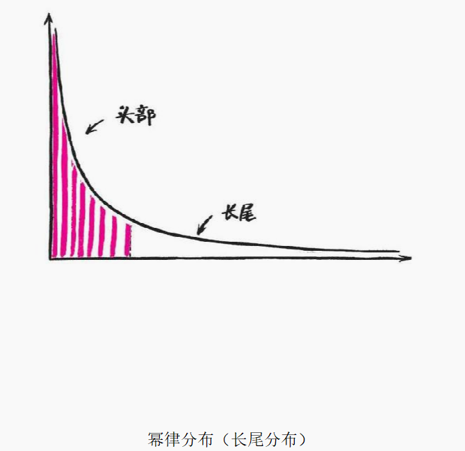
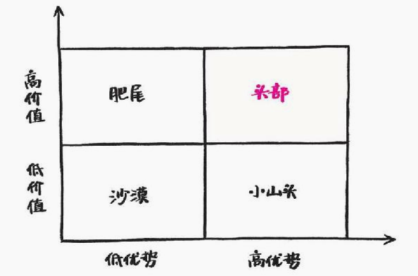
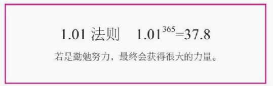

用自己的步伐丈量这个时代。 —— 俞敏洪

本书给了这个时代年轻人一条真正的公平竞争之路——即使你的阶层和起点不够好，只要你具有能在网络中识别高级心智的能力，这个世界的可能性依然为你敞开。聪明地勤奋，合理地利用趋势，是这个时代科学地改变命运的技术。

人生中三个重要的事情：

第一个重要的事情，是先慢下来。不是不做，而是想清楚了再去做。

第二个很重要的东西，我们一定要阅读。

第三个重要的事情，就是用一种投资的心态来看待人生。

# 高手的三个境界

## 努力和收益不成正比

社会不是一分耕耘、一分收获

发挥天赋、追随热情，你一定会很幸福，但未必能改变世界；

刻意练习1万小时，你会进入心流，持续突破，但未必能成为公认的高手；

全心全意打磨一件事情，你会获得宁静，但未必能创造价值。

而这个时代真正的高手，几乎都有一个特点——**他们既懂得如何驱动自己持续地努力和积累，也懂得借助社会和科技趋势放大自己努力的收益**。所有这些取得重大成就的人，最明显的共同特点，就是阶段性的非线性成长、跃迁式的上升。每隔几年，他们突然上一个台阶，眼界、想法、能力、调用的资源和身价都完全不同。这就是利用规律放大个人努力的结果。

## 如何破局

利用规律和趋势，放大个人努力。

第一章，我们谈到了**网络、人工智能**对于学习方式、思考方式和竞争力的改变，以及人类是如何通过“外包大脑”完成一次次的进化。在未来的时代，我们该抓住什么趋势，又应该规避什么风险？

第二章，谈到的是如何做好选择，培养竞争力的高手战略。现代社会是一个机会变多，但是（成功）概率变小的社会，在这个时代，该如何**识别自己的机会**？我们从一个统计学的底层逻辑——幂律法则入手，分析了为什么头部会有重大的收益，该如何识别自己身边的机会，以及有了机会以后，高手们是如何守住机会，保持不败的。

第三章，解决的是关于**学习**的焦虑。这是一个知识爆炸，终身学习也学不过来的时代。这个时代该如何挑选适合自己的学习内容？如何比自学更快地获得知识？如何联机更多大脑一起思考问题？如何保持自己的学习动力？如何让知识变成价值？我们会向最优秀的学习者和思考高手学习技术。

第四章，谈及的是如何看懂和理解世界的技术，也就是经常说的高手**“破局”的能力**。里面会引入一个重要的底层学科“复杂系统”，并且延伸出两个方向——如何成为一个看得更远和看得更透的思考高手？你会理解社会系统里最重要的两个思考工具——回路和层次，让解决问题的能力上升一个台阶。这章应该是认知难度最大的一章，但是绝对值得，因为前面几章的思考都来自这一章的技术。

第五章，最后一部分，我们谈到了高手的内在修炼。仅仅有外在技巧是不够的，所有高手的技巧都是逆人性的，所以高手需要大量的**内在修炼**。这一章详细谈及了现代社会高手的7个心智关键词：开放、专注、迟钝、有趣、简单、善良、可激怒。希望你成为这样的一个人。

# 高手的暗箱-利用规律，放大努力

获得百倍收益的关键，并不是百倍努力。每个时代的高手都在利用社会和科技的底层逻辑撬动自己，实现跨越式的成长。

## 认知方式的改变：调用知识而非记忆知识

知道知识在哪儿，比知道知识是什么更重要。

未来世界的认知能力，是找到信息的**搜索能力**、运用信息的**思考能力**以及从大量信息里抓取趋势的**洞察能力**。

这种突变式的进化，我们就称为“跃迁”。

## 核心竞争力的改变：人机合一

一个人能够用机器学习和处理信息，用大脑整合和创新思想，用系统思维思考问题，会是未来最有竞争力的。

今天每个人都需要面对未来，问自己三个问题：

我今天做的事，机器能做吗？

我今天做的事，会被外包吗？

我今天做的事，明天会做得更好吗？

科技、社会、文化的跃迁，必然会带来认知、思考、竞争力和人生观的剧变。这种变化每个时代都在发生，近200年尤甚，未来只会更快。

走在时代前面的明白人，永远是小部分。他们理解世界的趋势，了解科技的力量，有更加成熟的心智模式、更开放的心态和更快的迭代速度，即使短期笨拙，长周期也一定比你跑得快——可怕的不是优秀的人比你更努力，可怕的是优秀的人方法论比你正确太多。这些人就是时代的高手。

没有一个人是仅凭努力、天赋、机遇而获得巨大成功的，跃迁式的成功都是利用了更底层规律，激发了个体的跨越式成长。

## 自我跃迁

**认知跃迁**：持续的学习、阅读中，突然有一天一个概念击中你，你打开了一个全新的视野，过去困扰你的一切突然清清楚楚，顿悟。

**能力跃迁**：按照新领悟的方法持续地积累、练习、见人、蓄势，却长久没有什么变化。有时候，你都快要放弃了，但是突然有一天你发现自己的能力和水平上升了一个台阶。

**能级跃迁**：你正确地做出了几个选择、换了几个平台，身价、能力和水平会突然上一个层次，看问题、做事情有完全不同的力道。有很多人只是随着年龄和资历上升到了一定位置，他们的眼界、格局都没有太多的变化，他们并没有跃迁过。

跃迁并不是不劳而获，它是个人努力和收益的非线性，这种非线性通过巧妙地利用科技与社会规律放大而来。这种勤奋不是战术上的勤奋，而是战略上的勤奋。所以跃迁和努力精进并不冲突，只是更强调在**正确的****范式****下“聪明地勤奋”**。

## 掌握时代魔法，或者溺水身亡

## 三种时代溺水者

第一种时代溺水者：无法掌握自己注意力的人

第二种时代溺水者：无法过滤信息，找不到重点的人

第三种时代溺水者：不理解系统，无法与陌生人联机协作的人

• 时代特征：信息变多，思考变浅；机会变多，竞争跨界；随时干扰，永远在线。

• 三大趋势：调用知识而非记忆知识，联机的独立思考，人机合一。

•“高手”都懂得利用更底层的规律，激发个体的跨越式成长——这是他们鲜为人知的“暗箱”。

• 自我跃迁的三个阶段：认知跃迁、能力跃迁和能级跃迁。

• 外包大脑：把不重要的技能外包，聚焦核心技能的跃迁。

今天是一个机会更多，但概率更小的世界。处处有机会，就是处处有竞争。越是开放的市场，越是需要专注于核心竞争力。越是开放，越是聚焦——这是一个高手的时代。当资源丰富时，选择的能力比执行更重要。读书、识人、修炼不是重点，关键是读哪些书？认识什么人？修炼什么能力？抓住哪个机会？

# 高手战略-在高价值区，做正确的事

> 处处有机会，就等于处处没机会；竞争越是开放，个人越需要打磨深思熟虑后做选择的战略能力——找到那些“更少但是更好”的事。

今天是一个机会更多，但概率更小的世界。处处有机会，就是处处有竞争。越是开放的市场，越是需要专注于核心竞争力。越是开放，越是聚焦——这是一个高手的时代。当资源丰富时，选择的能力比执行更重要。读书、识人、修炼不是重点，关键是读哪些书？认识什么人？修炼什么能力？抓住哪个机会？

这些问题，仅凭努力已经不可穷尽，需要你有一种深思熟虑后做选择的战略能力——要找到那些“更少但是更好”的事。

投资人是战略高手，他们需要判断公司的投入产出比。反过来说，我们又何尝不是自己的天使投资人、不需要这种判断力呢？

你投入练习，产出技能；投入享乐，产出体验；投入情感，产出关系；投入学习，产出认知。每个人都是自己的投资人——早上拿到24小时的时间精力，晚上账户结算，第二天早上重新开始。决定一个人几年后不同的，正是那些你睡着以后，能够持续迭代的东西。

所以，我们要向**投资高手学习人生定位和发展的个人战略能力**。

## 只在甜蜜区里打球

高手就是在高价值领域，持续做正确动作的人。因此我们要专注于“高价值区”。

第一，高价值区往往是反直觉、说了你都不信的区域。

我们都有经济学常识，如果每个人都知道这件事，“人傻钱多速来”，这件事马上就变成低价值的了。这些区域不仅是高价值的，而且常常是反直觉，甚至在别人眼里很傻的。

第二，高价值区需要高竞争力。

越是高价值区，越需要高竞争力。如果没有大蛇的身板，河边等待的策略未必有效；如果没有巴菲特的耐心，价值投资不一定能成。

第三，高价值区随着时代在改变。

## 跃迁步骤

**第一次跃迁：用****二八法则****高效成长**

“二八法则”——先投入20%的时间，把一个领域的知识能力提升到80分，再去研究其他领域。与其用100%的精力学习一个领域的100%，不如用80%的精力学习每个领域20%的精华。

**第二次跃迁：利用系统放大名气**

造就一个自强化的正循环，如：高分（打分系统）→更多排班→更多好学生（口碑）→更好名声

也就是所谓的滚雪球

**第三次跃迁：与最优秀大脑互联**

集群效应，和优秀的人打交道。除了气质相投，更重要的是情感连接和信任的积累。新东方一代名师的爆发，是巧妙地抓住了知识杠杆、利用平台红利，以及和最优秀的人联机涌现的结果，是自然和社会规律的放大器。看懂了事物背后的规律，每个人都有机会推动自己跃迁。

## 幂律分布：发现世界的杠杆点

每个国家的财富都呈现出一种分布方式，少部分人占据了大部分财富，而大部分人拥有少量财富——在坐标轴上，这是一个头部严重向左靠拢，还拖着长长尾巴的分布。

简单说，在一个系统里，如果拥有1万元的人有10个，那么拥有1000元的人就有100个，而有1万人只有10元钱 

## 效率源自杠杆点

幂律无处不在，给我们的一个最重要的启示是：社会和自然的大部分系统都有重点，做事情一定要抓重点，持续地抓住重点，就抓住了最高效率的关键。

你若在一个三线城市的小公司的小部门工作，你的部门其实有重点。每天的工作看上去都是同样无聊，其实也许和某个领导某个时刻的沟通特别重要，会影响你一辈子，而其他工作可能做到80分就很好。你现在读的这本书，也一定有一部分比其他部分更加重要，一旦看明白了，就抓住了书的大部分。我也专门用加粗、标题、图示、序言强化了它们。

这种**利小的投入能撬动更大收益的工具，就是****杠杆**。幂律告诉我们，每个系统里都有杠杆点，找到这个杠杆点，能迅速放大一个人的努力，达到事半功倍的效果。

幂律分形，意味着刚才提到的系统的重点都能继续再分，找到更微妙的重点。杠杆点上，还能继续加杠杆。

## 社会存在阶层分化

在一个流动、开放的社会里，阶层分化是稳定且可预期的。互联带来的不仅仅是上网更快，可以坐在家里办公，互联的关键是让每一个系统产生交换，从正态分布逐渐转向幂律分布。在这个过程中，头部效应越来越严重。如果不能识别一个系统的头部，仅凭个人努力，会越来越追不上这个时代，穷人会越来越穷。

结论：

• 停止抱怨。世界就是不公平的，接受它。阶层分化是开放社会的必然趋势；

• 持续学习=扩大视野，提高效能=扩大移动能力；

• 持续关注、观察、验证高价值区；

• 向正确方向移动，爬上幂律顶部。

我们依然可以通过战略思考，改变自己的命运。既然确知一份努力在不同的位置会有完全不同的收益，既然理解世界的不均衡，为什么不主动移动到高概率的地方去？

到现在，我们已经谈到了高手战略的两个规律杠杆：

对内，通过二八法则，持续放大自我效能；

对外，通过移动到系统的头部，获得系统巨大推动力。

## 头部效应：站位比努力更重要

**头部收益更高：**在一个系统里，头部品牌吸引的注意力大概占40%，第二名是20%，第三名是7%~10%，其他所有人共分其余的30%。头部会带来很多的关注和个人品牌影响力，这些都会提高你能力的溢价，带给你更高的收益。

**头部加速度更快：**一旦你成为某个系统的头部，系统就开始产生正反馈——微小的优势会带来更多名声，名声给你更多机会，更高收益。这又让你可以投入更多资源，继续扩大优势，最后的结果就是头部的人获得最高的增长率。

对社会来说：一个充分竞争、互联的时代，是几个头部与众多长尾的时代。

对个人来说：两个初始能力相若的人，在头部行业如金融、互联网，和在尾部行业如邮政，起薪和成长速度会相差很多。同一家公司两个能力相若的人，在头部部门（核心部门）和非核心部门，收入和成长速度也不同。

优秀是幂律规则的简单显现——天时、地利、人和，取势、明道、优术，不管是兵法还是商道，都把时机和站位放到了个人努力的前面。与其哀叹社会的不公，不如尽快挑选头部赛道，抢占头部，享受红利，**这就是高手战略里的找到高价值区，找到头部**。

> “我要成为最好的产品经理。”在某一次聚会的时候，朋友小明和我聊。
>
> “那你准备怎么做呢？”
>
> “乔布斯和张小龙是我偶像，我会先研究他们的方法论，然后用到我的工作里面去，像工匠一样持续打磨自己的产品。”
>
> 这么努力，有可能吗？
>
> 可能性很低——他的公司是一家给国有单位做信息系统的公司，在这样的公司里，产品不是重点，渠道才是头部；在给国有单位做信息系统的公司里，他们公司也并不是头部；在信息系统领域，给国有单位做系统也不是头部。
>
> 如果有另一个和他天赋、努力都相当的人，进入了一家以产品为核心的顶级公司，成长速度是不是会快很多？他崇拜的苹果的乔布斯和腾讯的张小龙，哪一个不是来自以产品为核心的最好的公司？
>
> 你现在理解小明的困局了吧——虽然他很用力地希望自己成为“业内”最好的产品经理，但他既没见过“业内”，也没见过“最好”。这种场外的奋斗者是努力又孤独的，由于站位不对，他们的目标会距离自己越来越远。

## 找到头部领域

头部就是你所在赛道里的高价值并且有优势的领域。

头部：高价值——高优势

你在高价值区的第一阵营，是风口上的独角兽、名校的优等生、热门电视剧的女一号。

肥尾：高价值——低优势

你在高价值区的第三、第四阵营，是独角兽公司里打杂的、名校里的差生、风头正劲的电视剧里的宋兵乙。

小山头：低价值——高优势

你是小山头的山大王，是某家小公司的核心员工，是一个偏门领域的第一名，是边缘群体的中心人物。小而美。

沙漠：低价值——低优势

你是小公司的边缘员工，非核心产业的非核心岗位。

##  相关误区

**误区一：从当前优势出发**

1. 场外选手很难判断真正的优势。
2. 过去的优势不等于未来的优势。

**原则：从价值而非优势出发**

不要因为容易而去做一件事，要因为有价值才做。不要因为便宜而买一件衣服，要因为值得才买。不要因为彼此习惯了就结婚，要因为相爱才结。

因为我们不怕苦，怕苦得没价值；不怕累，怕累得没有意义。

高手会暂时放下自己的优势，思考价值，他相信只要方向正确，资源、技能、优势都是可以积累的。

高手总是选择窄门。

**误区二：着急入场，不想优势**

很多人走向另一个反面——看见高价值区就撸起袖子下场，很少思考自己的差异化优势。如果说第一种误判会让你故步自封，那么这个误判就会让你自我毁灭。

**原则：思考差异化优势**

永远不要在热门领域随大溜。永远不要在热门领域随大溜。永远不要在热门领域随大溜。重要的事情说三遍。

价值越高的领域，竞争越激烈，越要凭借独特的优势，你先不要着急动手，要用足够的时间观察对手，思考差异化优势再进入。

这件事为什么难？因为当所有人都疯狂奔向新大陆，还有人在里面赚到大钱的时候，每个人心里都会升起“再不上就来不及了”的本能冲动，这种冲动来自祖先多年逃生的经验积累。此刻要静下心来思考和判断，相当反人性。巴菲特的办公室没有显示当日股价的电脑和电视，也是一种可以让自己不受打扰的必要机制。

**误区三：关注不属于你的机会，眼高手低**

要把注意力放到你能影响到、能操作的赛场，尽快到你视野里最近的头部，而不是想诸如“我怎么成为业内最好的……”之类的问题。你可能既没有见过最好，也没有真正看到过“业内”。

**原则：从身边的头部做起。**

战略必须先帮助你在当下破局，否则就毫无意义。

不要一开始思考“如何做出一款改变世界的产品”“成为业内最好的×××”，先抢占距离自己最近的一个小山头，这个小山头会给你全新的资源和视野，然后再抢占下一个大山头，最后是山脉的顶峰。从边缘地带一点点往前拱，虽然慢，但总有推进。一旦空降进入一个你不了解规则、没法把握的赛场，即使偶尔获胜，最后也会输得精光。

头部效应就是：通过观察和判断，抢占高价值、有优势的头部，然后从小头部走向大头部。

## 专注：高手的护城河

上天给你无限的机会，却只给你有限的时间、精力和才华，所以越是优秀，越要专注。

对于这种聪明人，真正让他心塞的不是和自己势均力敌的高手大战后失败，而是在三个战场被3个低级选手默默干死。你不怕死，怕不怕恶心？

## 迭代：聪明人的笨功夫

## 51%的效率

般的围棋有200~300手，每手51%的效率，即是有一半以上的成功率，150手51%的效率累积到最后也会稳拿胜券。

妙手很美，在另一个角度看则是陷阱。人追求一击致命的时候，正是自己最不冷静的时候，成功了不免沾沾自喜，失败了心神摇晃，下一步最容易一脚踩空。全力之后，必有松懈；大明之后，必有大暗。

反倒是51%，每次都稳稳当当，日拱一卒，最后准赢。

妙手有个重大缺陷：不能迭代，无法刻意练习

因为每一次环节都不同，所以每次妙手都是心电一闪的灵感，这样你永远无法打磨手艺，只能“等灵感来”，哪一天灵感用完，生涯也就走完了。

灵感没法刻意练习，没法打磨手艺。灵感没有护城河。

弱小优势持续迭代而产生的强大力量,好的成功是聪明人花的笨功夫。

• 今天是一个机会更多、概率更小的世界。战略能力就是找到那些“更少但是更好”的事。

• 好战略就是达成“投入和产出的非线性”。

• 幂律分布的特征是高度不平均且分形，这意味着每件事都要找到杠杆点。

• 头部=高价值×高优势；抢占头部、持续迭代。

• 头部效应三原则：从价值而非优势出发；思考差异化优势；从最近的头部做起，从鸡头变成凤头。

• 专注是高手的护城河，先占据不败之地，然后慢慢获得细小优势。

• 持续迭代，系统性进步；不求妙手，不得贪胜。

# 联机学习-找到知识源头，提升认知效率

在知识爆炸、终身学习时代，人与人之间比拼的不是学与不学，而是认知效率。学习前，想明白学什么、怎么学、有什么用和如何兑现。

## 功利学习法：学得更好，却学得更少

一手信息：知识的源头

二手信息：忠实转述一手信息

三手信息：为传播而简化和极端化观点的陈述

四手信息：出于各种动机充满个人经验的情绪化表达

• 一手研究论文，行业的学术期刊，行业最新数据报告；

• 行业大牛的最新沟通和思考，通过谈话获得。

二手知识含金量很高，忠实转述，但是有清晰的论据和出处。

• 名校的教科书，MOOC（慕课）里推荐的一手材料，维基百科；

• 中立第三方的行业调查报告；

• 讲述底层逻辑、思考质量比较高、略微难懂的书和文章，比如《国富论》《穷查理宝典》《决策与判断》等；

• 各行业领军人物、行业大牛推荐的书单、豆列，以及在自己公众号发的文章。

三手知识是畅销书，这些文字已经被改成公众可以理解、方便传播的文字，但是因为大众的认知能力较低，所以加入了大量的案例、故事以及不精确的概念。

四手知识是你常看到的：根据这些畅销书和理论，大部分人写了很多基于个人体验的鸡汤，加入了太多个人故事（比如，《我是如何一个小时挣到200万的》）或者情绪因素（比如，《看懂这个不转就不是中国人》）。讲一个观点，灌你无数“鸡精”。大部分公众号、头条都属于此类。

跟随知识源头的人

成为知识的源头

## 功利学习法

在知识匮乏、非终身学习年代，学肯定比不学好；但是在今天知识爆炸、终身学习的时代，“为什么”（why）、“学什么”（what）、“如何学”（how），比“学就好了”（do）更重要。

### 极其功利地读书

**“认知效率”**：认知收益和时间精力之比。

样的认知资源投入，会有完全不同的回报，这就是认知效率的不同。认知效率低的人，都在做低水平的勤奋。牛人的真正秘诀是在最精华的资源上，以高很多倍的认知资源来学习，认知效率是你的很多倍。高手的技术就是“投入产出的非线性”。

**提高认知效率最有效的工具就是“极强的目的性”**，我称之为功利读书法。

### 极其功利地配置资源

认知性阅读：《人类的群星闪耀时》《反脆弱》等书的写作技巧，为写书做准备。

提升心智的认知难度很大，属于“攻读”，**需要有大段的时间和系统的阅读**，我一般放在早上或夜深。最好还要配置高人讨论以及实践的环境。我找到了业内最好的编辑和作者，一起讨论如何写好有冲击力的书。

知识性阅读：各种行业调查报告、行业论坛，大量专业书籍，如《人生设计》《生涯混沌理论》《认识电影》《好好学习》。

知识性阅读的目标就是**知道某事，所以特别适合****碎片化****学习和社交型学习**。认知资源可以配置在上下班路上，用碎片化时间检索式地阅读，实在不行拜托别人读，然后交流。读的时候迅速判断是不是有用的知识，决定自己的涉入深度。

娱乐性阅读：比如《爱情刽子手》《理想的下午》，以及各种电影……

娱乐性阅读主要用来放松和陶冶，认知资源可以很低，累的时候翻几页，比如两次谈事之间读，有换脑子的感觉。

### 萃取知识晶体

如何让知识变成知识晶体？下面是4种常见的知识结构：

关联，树状，序列，数据。你可以简称为“关书（树）叙（序）述（数）”——知识晶体有一种**让你关上书本，依然可以叙述的能力。**

就是形成思维导图

## 联机学习者：成为知识的路由器

联机学习，不是自己找答案，而是“用答案换答案”

1. 先打磨第一个知识模块；
2. 抛出去，换回别人的知识模块；
3. 重复前两步，积累足够多的知识模块；
4. 整合出自己的体系，实现知识跃迁。

**简单来说就是“调用”和“整合”他人的答案**，也就是用自己的理解消化别人的知识

比如我从不同的书里面找到了很多关于同一个方面的理论，我进行综合比较，提炼出我自己的理论。

这就是三种学习思路。

• 自学：自己找答案；

• 联机学习：和同行交流，用答案换答案；

• 跨界联机学习：跨行学习交流，用答案换答案。

因此以后遇到问题：

• 遇到问题，苦思：“这可怎么办？”想一晚上不得；

• 遇到问题，找书：“哪里有答案？”开始通过网络、书来找资料；

• 遇到问题，找人：“谁最有可能知道这个答案？在这之前我

要准备些什么？”然后准备沟通，提出高质量的问题。

思想夜宴：这是一个很强的大脑联机方法，但是目前以我的条件来说并不具备

## 终身提问者：问题比答案更有效

一方面我们强调要聚焦、要专注，另一方面我们又认为多元有闲是个必要条件。这是不是有所矛盾呢？

一个人有机会学完一个细分领域的所有知识。沿着一棵长成的大树向上爬，这种学习路径效率最高。但在一个高度变化、多领域跨界的时代，完成任何任务都需要调取多领域的知识，全部靠自己学习显然来不及。

**学习的速度，跟不上遇到问题的速度。这是你焦虑的根源。**

所以你没法不焦虑——聚焦于一棵知识树，会让自己受限；但如果跨出专业，这个世界上有读不完的书，以及非常多“学了一定有用”的知识。

因此我们需要的是“问题树”而不是“知识树”，因为解决某一个问题并不需要用到某一个细分领域的所有知识，而且也并不是只涉及一个领域的问题。你需要的，是用来解决问题的知识。增强学习动力的最好方法是找到你真正感兴趣的问题。关于专注和多元的解释在这里也实现了和谐统一。

专注于你的问题，调用多元知识。在目标上专注，在手段上多元。

未来没有专业，真正的专业是你“特别擅长解决某类型的问题”，才不会管你调用了哪些学科。

**提问的力量**

当信息多到你记不住的时候，你就会散焦，丢失真正的答案。唯一的解决方法就是提问。提问比答案更有效果。

**知识****折旧率**

比如说如果你的手机3年一换，那么这个手机折旧率就是30%。但是比电子产品折旧率更高的，就是知识。

18世纪，知识更新周期为80~90年；19世纪缩短为30年；20世纪六七十年代，一般学科的知识更新周期为5~10年；到了20世纪八九十年代，许多学科的知识更新周期缩短为5年；进入21世纪，许多学科的知识更新周期已缩短至2~3年……也就是说，你大学一年级学的东西，很可能大四毕业的时候就已经完全没用了。

怎么应付知识折旧？两个方法：第一是多读不容易折旧的经典，就是前面说的一二三四手知识；第二就是不断更新最新的内容。不管是哪一种，你都需要不断地问自己：“这个能更好地解决我的问题吗？”

**提问即思考**

提问越深，思考越深入

**提问即创造**

当你给自己提出一个问题，输入新的关键词，与之相关的回忆模块在你的大脑里创造，组合并重新产生新的连接，形成新的答案……你的潜意识一个个点开这些答案连接，这就是创作的过程。

### **为什么每天进步1%，却还是没有太多长进**

公式：只要每天进步1%，如果持续迭代，一年下来就会有37倍的增长，你会变成更好的自己；而反过来，如果每天滑坡1%，则会变成渣渣……

其实这个公式只是鸡汤而已

因为复利不是这么算的。形成复利要满足两个条件：

• 每天的收入迭代到下一次增长中去；

• 不损失本金。

放到成长复利上，意味着：

• 今天学到的知识，明天要运用到新一轮的知识学习中去；

• 不能忘记。

首先是知识无体系化，今天学到的概念和明天知道的内容显然没法叠加到一起，互相不产生作用。这样一年下来，不是增加了365次方，顶多是增加了365个0.01，即3.65倍。

你还总忘记一周前学到了什么，有什么令你印象深刻。估计忘得差不多了。这样一来，可能辛苦积累了1.03，一周以后退到0.96。所以一年下来，你成长个20%也就了不得了。

如果你一直以来都在碎片化学习、碎片化思考、碎片化体系、碎片化问题，终将劳而无功，竹篮打水一场空。

## 问题树

不过成长复利是有可能实现的，解决方式还是**“****问题树****”**——基于问题的学习符合复利的两个条件：

1. 为了解决问题，昨天的思考和学到的知识会马上应用到今天的解决方案上去，形成迭代；
2. 如果一个知识有用，就不会被忘记；如果没用，忘记也不可惜。

这种学习方式还解决了两个问题，就是“我怎么知道这个知识有用”的困惑，以及“这个很重要，记录下来”的仓鼠心态。一开始知识管理标签化还有用，随着想法越来越多，知识管理也逐渐失效。以问题为出发点是唯一的试金石。

能解决当下问题，那就是有用；不能解决当下问题的，降低关注度。并不是否认这个知识好，只是暂时不需要，以后再说。

所以，比终身学习者更有效的，是终身提问者。

就是把自己变成百度百科

### **别列书单，列问题单**

我们经常喜欢罗列书单、阅读清单、收藏清单，这些清单最大的问题是，始终没有动力去读，读了也没有实践的动力。一个问题清单也许更加有趣和有力。

相关性往往是你回答了以后立刻有重大收益的内容，好奇心是你最有动力学习的未来方向。如果事态紧急，你可以从相关性开始解决问题。平常学习中，你可以从总分最高的那些问题开始。

用你要解决的问题去搜寻相关的书籍去阅读，来总结 。

### **假装写本书**

其中最有效的方法就是**“假装写本书”**

你想集中研究一个话题，最好的方式就是假装自己要写本书。每当我要集中研究一个话题，总是列出来这个话题下的所有内容，然后假装自己要写本书。比如在做知识专栏之前，我给自己列了这样一个目录——假装我要写一本关于“知识内容设计”的书。

> 序 如何一句话抓住你想学？
>
> 第一章 内容产品的定位
>
> 第二章 内容产品的商业模式
>
> 第二章 内容产品的结构模块
>
> 第三章 内容产品的生产流程
>
> 第四章 内容产品的营销方式
>
> 第五章 内容产品的团队组建
>
> 第六章 内容产品的价值链整合
>
> 第七章 内容创作者的自我修炼

每一章可以进一步展开：

> 第一章内容产品的定位
>
> 1.从内容来分有哪些？
>
> 2.从形式来分有哪些？
>
> 3.从赛道来分有哪些？
>
> 4.从功能来分有哪些？
>
> 5.有哪些现在没条件但是未来有机会的定位？

然后打开你的知识管理软件，每天记录一部分，想起来就丢进去，很快这本“书”就会出现。当一个模块完整的时候，就可以考虑丢出去分享，换来下一个模块。

## 知识IPO：把知识变现成价值

I：输入问题（Input a question），以持续解决问题为目标；

P：解决问题（Problem solving），以整合多学科知识为手段；

O：输出产品（Output），通过咨询研发、授课整合和写作，让思想产品化。

我把这套系统叫作知识IPO。这是一套高效的把知识整合产品化的个人商业模式。

举例：

“人如何找到自己成长的方向，成长为自己想要的样子？”

（I）授课给我带来更多咨询以及更大的平台，也接触到比出国人群更大的群体，这个问题逐渐浮现。我开始接触解决这个问题要涉及的心理学、测量、教练等领域，于是我去中科院读心理学研究生，拿到生涯规划师、ICF（国际教练联合会）教练认证（P），学习成果输出就是销量达300万册的《拆掉思维里的墙》（O）。

“如何利用这套知识让更多人收益？”

（I）这给我带来更多的商业机会，我开始组建自己的公司。这就面临着重新学习带团队、战略、融资、领导力、绩效等更多知识来解决企业发展问题，个体不够了，需要找到专业人士（P）。今天“新精英生涯”和“橙子学院”已经是各自垂直领域的第一名，10个生涯规划师，8个来自新精英。我还写了《你的生命有什么可能》，参与编写教育部的教材《大学生职业发展》（O）。

“下一个十年，教育会变成什么样子？”

（I）这个问题让我参与到内容创业的大潮，除了过去的知识，需要重新学习的是在线产品设计、高强度写作、协作式生产技术（P），我们最终解决了专栏设计、内容创作流程等问题，输出的就是你看到的专栏《超级个体》（O）。

“这个时代的高手需要哪些心智与能力？有哪些底层逻辑是人们必须要了解的？”

（I）在亲身参与艰苦的内容产品打磨过程中，我接触到了这个时代最焦虑和最有上进心的客户，身边是各个领域最优秀的生产者，我开始思考这个话题。他们每个人都教给我很多东西，引导我学习了复杂系统、混沌理论、商业规律、进化论、幂律（P）……这就是眼前这本书的来历（O）。

提出一个又一个问题，像一盏灯，带领你穿越忙乱和无常，走向自己希望的未知。

知识IPO是对以上理论方法的具体实践，是问题书的具现化和输出。

## 设计自己的知识IPO

**第一步，你必须有一个真实的、高价值，并且有可能被解决的问题（I）**

理解这个问题遇到的障碍和挑战。围绕这个问题搜索各领域的知识，然后生长出一棵关于解决这个问题的“问题树”。

**第二步，不是要学习知识，而是要解决问题（P）**

出于强烈的认知惯性和好奇心，你还是会忍不住想看完找到的全部资料。但不要恋战，你无法看完这些浮上来的资料，往往点击几次，你会发现自己看了几个小时的有趣东西，但是事情一点儿进展都没有。

正如你不可能走完一座大山的所有角落，聪明的探险者懂得做个标记，下次再来，继续向终点进发。整个过程以解决问题为最高标准，持续问自己：“这个知识对于解决问题有用吗？”“如果有用，是当下就有用吗？”如果暂时没有用，做个记号收藏到你的笔记里，以后再看。

一旦你能解决一个问题，就要尝试多解决同类型的问题，逐渐让这个解决方案能够应对不同情境，自我进化。

**第三步，输出倒逼输入（****O****）**

大部分人欠缺的，是把解决问题的结果传播出去。

一方面，写作能把这些知识形成体系，整理成能出手的“知识晶体”。更重要的是，这个过程能兑换价值，让更多人知道你有解决这类问题的能力。这个动作能帮你找到下一轮更大的问题，以及更大的价值，形成迭代。

这个循环能持续放大，带来一轮又一轮的知识跃迁。

一些误区：

**不要想着憋大招**：产出不一定要大，但是一定要有，永远不要低估一个正确的简单动作带来的可怕结果。如果写不出一本书，就写一篇文章；如果写不出文章，那就写一张知识卡片；如果没法积累一个知识卡片，那就总结一句话，然后分享出去。

**不要害怕分享**：实上，最好的检验输入的方式就是输出，而检验输出的最好方式，就是实际解决一个问题。帮别人解决问题，看似是他人“白白”获益，但是自己也重新打磨了思想，修正了很多错误，自己的收益更大。

**放大****碎片化****价值**：你本来就要学习，不如顺便在朋友圈碎片化更新：#今天学到了什么#。三言两语总结你的新收获并分享出来，慢慢你就会成为这个领域的“知识代理人”。

**设计自己的知识****MVP**：MVP（minimum viable product，最小可交付产品）是产品开发的一种思路，一开始提供一个最小的具有可行性的产品。你不妨尝试一下，设计一个最容易入门且可交付的知识IPO产品。

## 自下而上：构建自己的知识体系

方法：

• 站在知识源头，萃取知识晶体；

• 联机学习，用一块晶体换回来更多晶体；

• 以问题为中心学习，创造自己的问题树；

• 用知识IPO让知识变成价值。

# 破局思维-升维思考，解决复杂问题

为什么很多问题无解？因为答案根本就不在系统内。“单维思考者”永远看不懂整体的“系统思维”，看懂系统，才能破局。

## 人生就是一次次的破局

我们每个人的生活里，都面临很多“局”。一旦陷入局里来回重复，焦虑、浮躁也就相随而来。

“破局”的能力，也就是系统思考的能力。而“局”，也就是系统。

**高手并不是能力比我们强、智商比我们高、定力比我们好，只是因为他们思考比我们深、见识比我们广，他们看到了更大的系统。从这个角度来说，小人之小，也并不是品格的低微、智力的稀缺，而是格局之小、眼界之小和系统之小。**

## 升维：解决那些无解的问题

生活中类似的无解的问题：永远的减肥、你为什么不陪我？产品不好，还是销售不力？扶不起来的职场阿斗

不陪——分手——陪——和好——不陪

减肥——少吃——瘦——忍不住吃——胖——减肥

没产品——没客户——没产品

拖延——忙——乱——忙——拖延

除非你能看透这个局，破局跳出，才能停止这种轮回。大部分人的大部分时间和精力，都消耗在这种往返的轮回问题之中，他们就像轮圈里面的小白鼠，怎么努力向前跑都停不下来。因为答案根本就不在前方，需要退后一步，看到整个系统，找到破局之处。

破局：

不是陪不陪，而是如何陪的问题

不是少吃，而是加速代谢

不是关系问题，而是目标问题

不是态度，而是能力问题

简单来说就是认识问题的本质，从根本上解决

正式介绍一个有趣的学科给你：**系统科学**。如果不能了解一些系统科学的知识，也就不可能真正理解现代社会，更不可能解决困扰你的那些问题。

系统科学是一门近代发展起来的跨领域学科，研究的是自然界和人类社会中被称为系统，特别是“复杂系统”的对象的内在特性。

## **“还原论”**与**“****系统论****”**

**“还原论”**：复杂的事情可以拆分为各部分的组合来分析。世上无难事，只要肯细分。细分找到问题点，然后替换一个部件就好。

根据这种思维方式，如果一个事情出了问题，最好的解决方式就是增加或替换一个元素，如果短期有效，那么长期也应该不错。但这种思路面对复杂社会问题，往往会顾此失彼。

今天，这种单维、短期的思维方式在身边比比皆是。

• 让一个地区脱贫，最好的方式是给钱；

• 如果自己发展得不够快，那就要更加努力；

• 生病了是因为有病菌入侵，杀死病菌就不生病了；

• 敌我公司之间，你死我亡，你好我不好；

• 对于不确定，最好的方式就是多存钱，躲开风险。

**“****系统论****”：**在真实世界的复杂系统里，这些方法都逐渐失效了，真实的情况往往更加复杂和反常识：

• 数千亿的资金投入非洲，并没有让非洲脱贫；因为贫困是一种政治和心智问题，援助往往让当地官员更加腐败奢华，钱发不到民众手中；即使少数到了穷人手中，他们也倾向于消费一轮，而不是改变困境；

• 很多职业快速发展的人，不仅是因为自己努力，还因为聪明地借助了趋势；

• 流感病毒不会主动攻击你，相反，是你自己身体状况恰好适合流感病毒的生长。对于慢性疾病患者，“不惜一切代价杀死病状”的过度医疗方式会让其生命质量变得糟糕，现已逐渐被“与疾病和谐共处，提高生命质量”的姑息治疗思路替代；

• 竞争对手的股票往往是共同涨跌的。石油价格下跌，特斯拉汽车的股票也会下跌，因为石油便宜，大家都不着急用新能源了；

• 最好的应对不确定的方式是管理它。人工智能会极大地冲击投资领域，怎么办？投资人傅盛的观点是，重仓人工智能，形成对冲——人工智能发展得好，自己赚钱；人工智能不行，自己继续赚钱。

这就是系统论的思考方式，我们可以看到传统思路和系统论的不同思考方式。

到底还原论好，还是系统论更好？

其实角度没有好坏，都是简化世界的一种方式罢了。主流的观点是：在解决独立、单点、局部的简单系统时，还原论的思路更加有效；在面对复杂问题时，系统论的方法则更加有效。在分析物理、化学这种非生命体、自然科学的时候，还原论更有效；

## 回路：设计人生的增长引擎

旅行、钱、工作看似无关，却串联在时间之上，像是一条咬着自己尾巴的贪吃蛇。

如果看不到它们的内在联系，就会短期内什么都想要，休息的时候想旅行，旅行的时候担心钱……怎么都不顺。好比你抓着一条蛇的头，同时又想拽住它的尾巴，其实是自己和自己较劲。

4种增长引擎：

**好习惯**

所谓好习惯，本质就是那些能自增强的正循环的行为。比如，持续学习的习惯，是“学习——成长——增值——学习”的循环；坚持锻炼的习惯，是“锻炼——精力充沛——锻炼”的循环；与人为善的习惯，是“善意——回报——善意”的循环。

鉴别一个习惯好不好，只需要看它是否能够形成正循环闭环。

**从兴趣培养到能力养成**

因为对一件事感兴趣，投入足够多时间练习，提升了能力；因为能力提高，所以更好兑现了价值；因为有所回报，所以更加感兴趣；一个爱好逐渐养成了能力，甚至成为职业。

**快速学习的知识****IPO**

通过思考问题、解决问题和输出产品，把自己的思考结果向外输出，从而吸引更多重要的问题输入，形成一个循环。所有伟大的知识工作者都在跑通这个循环。

4种死亡螺旋：

**穷者越穷**

贫穷是一种心态，穷者越穷就是一个典型的死亡螺旋。

忙——乱——忙

稀缺——没有资源想长远的事——稀缺

物质匮乏——诱惑多——自控力消耗——物质匮乏

**投入不足**

很多企业面临这样的问题：利润下降导致研发投入不够，研发投入不足让竞争力进一步下降，与此同时公司还不敢停，因为养着很多工人和厂房，一旦停大家都得挨饿，就像坐在火山口上，惶惶不可终日。

企业这个时候应该尽快谋求转型。个人一旦陷入这样的死循环，最好的方式是找到脱困的机会，借钱重新学习一门技能，或者换一个高价值的工作。

**工作狂循环**

工作狂和热爱工作的最大区别是，工作狂需要工作，而热爱工作的人热爱工作。就好比瘾君子需要毒品，而不是热爱毒品一样。

工作狂——家庭投入少——家庭没成就感——工作狂

这是个负增强回路。很多职场人在公司很忙，对家里投入少，一段时间后，家人都对他有怨言。虽然说家庭很重要，但要顶着家人的怨气融入家庭，并不是件容易事，于是下意识地就选择少回家。家人怨气因而更大，导致他回家次数越来越少。很多人是被逼成工作狂的。如果你们家有个工作狂，记得要双方一起努力。

**做自己**

求认同——找不到自己——求认同

一定要说说这个死循环——在这个满世界都在比赛谁更自我的时代，“秀出自我”是一种毒。

很多“找自己”的人，不管是找梦想还是找天赋，内心的诉求是“求认同”。越是求认同，注意力就越放在外界的关注、外界的高手上，也就越难找到自己的天赋、梦想和激情。这也让他们越来越焦虑。

其实，你怎么可能通过讨好别人来做自己呢？与他人攀比是永无宁日、绝无胜算的自我恐怖主义。

停止这种循环的方式是把一部分注意力放回到自己的身上，关注自己的需求和优势，在方式方面借鉴，在步调方面有自己的洞见。

## 搭建正循环系统，破坏负循环系统，切断自毁线路

作为一名系统思考者，你能养成的最好的第一个思维习惯就是逆时间打断负循环：

• 如果忙得没空思考，那么没空思考是否让你更忙呢？

• 如果因为穷，所以总希望翻盘，那么总希望翻盘是否让你更穷呢？

• 看到人口带来贫困的报道时，你也一定要尝试思考，贫困是否也会带来人口增长呢？

一旦发现这些情况是首尾相连的，尽快打断这种恶性的负面循环。你可以通过直接打断、引入更多资源，或者搭建新的回路来实现。

第二个思维习惯是顺着时间搭建正循环：

• 如果写作能为你带来名声，那么如何用名声帮你更好地创作？

• 如果技能精进能让你获得成功，那么如何用成功让你更加精进？

• 如果做某件事情能让你有所收益，那么如何让收益带来更多类似的事情？

第一个问题的答案就是第三章提到的知识IPO，第二个问题的思考结果是联机学习、“以答案换答案”的方式；第三种情况其实就是投资的本质，用赚来的钱继续投资。

一旦有了这个意识，你就开始成为一名系统思考者，你的人生开始搭建各种细小的正循环回路，而那些侵蚀你精力的负循环也会慢慢停止。

## 学习一些能自增长的技能

有一些技能天生自带自增长能力，非常重要。

读写能力：好的读写能力能让你接触到更多好资料，成为更好的读者或写手。

破英语：我不认为成年人需要把英语学到多好，更聪明的做法是够用就好的“破英语”，熟练利用谷歌翻译、维基百科、亚马逊、字典软件、搜索网站迅速找到大量英语资料，在应用的基础上慢慢提升。

社交能力：人际交往能力会让你认识更多人，反过来强化你的社交能力。

解决问题：尤其是在系统的层面，你看到的系统越多，世界对于你而言就越简单，于是你就有更多资源来理解世界。你慢慢会看透世界的规律，实现思考力的跃迁。

聪明的善良：善良是世界上传递最远、增长最快的东西，但是笨拙的善良往往会带来摧毁你的负循环。聪明的善良是重要的自增长技能。

理解了回路，也就理解了规律，你看问题的眼光会变得长远，不再浮躁。

# 层级：看问题很透彻的技术

## 勤奋的三重境界

**勤奋的第一重境界：很努力**

**勤奋的第二重境界：方法论勤奋**

如何更高效率地调用时间？如何更好地调配精力？如何见缝插针地学习？如何保持碎片化的系统性？如何找到好知识？如何确保学了有用？如何跟他人学？如何做笔记？如何把知识应用到实践中？

你今天遇到的问题，早就有人经历过，并且找到了更好的方式。你要做的，只是学习。这其实就是如何将各种方法论应用到实践中

**勤奋的第三重境界：更少目标，战略勤奋**

什么是核心竞争力？我到底在什么赛场和谁竞争？有什么优势？这些优势会越来越有用吗？在更高层面获得了竞争力，对我有什么价值？

想得足够明白，足够了解这里的关系，就敢少做事，找杠杆支点。聚焦到“洞察客户、理解趋势、关注同行”，要学的东西突然就变少了，和你竞争的对手也变少了，而支持你的人变多了。注意，这就是目标选对了的表现。做那些更少更好的事，是最重要的高效能。

# 内在修炼-跃迁者的心法

真正的改变都是逆人性的。你可以了解所有跃迁的技术，但推动跃迁的关键动力，是我们要成为什么样的自己。