阅读使人充实，会谈使人敏捷，写作与笔记使人精确。 —— 培根

本书

# 维度

## 专业思维：

人们最熟悉的一种思维方式，这种自下而上的方法在主流教育体系中随处可见。自下而上是指学习知识的过程是厚积薄发的**线性**过程，把所有底层（“下”）细节知识点都掌握了再提炼对整体（“上”）的理解，只有在这时才能做出专业的判断。这种学习方法也催生了“专业思维”这种思维模式：只有学全学透后才能表达观点。

优点：专业思维的优势是显而易见的。在面对重复发生的有关具体技术或技巧类问题时，有良好知识和经验积累的熟手是解决这类问题的不二人选。

缺点：学习周期长。随着学科细分和知识积累的指数倍增加，单个个体已经很难成为多领域的专家。并且如果专业和经验运用不当会严重限制创新。自下而上线性发展本身就排斥盒外思维的冲击。代代相传的经典不容置疑，就算已经脱离了社会现实和需求也无法自我修正。最后，过往专业的成功经验也会被不自觉地滥用。

## 战略思维

这种思维方式不会因缺乏相关的专业知识和经验而纠结，往往直接从问题本身（“上”）着手，仔细推敲问题本身的定义和准确性，用结构化战略思维“切”的方法分解问题，并用严谨的逻辑全面地提出假设，而后或通过对数据的采集与分析证实假设，或推翻已有假设并建立新的假设（“下”），如此循环而深入地验证假设。不断探究深“挖”问题核心，以获取问题的最终解决方案。

战略思维要求我们超越问题的细节（比如科技），从更高层面看待所有可能的解决方案。超越细节意味着，尽管所在的行业不同，但相同或类似的战略问题的解法很可能具有**普适性**。

## 切名词是战略化结构思维的起点

切名词：就是将一个名词按照不同的角度分类拆分成多个集合。举一个例子，“人”可以按不同的标准划分如下：

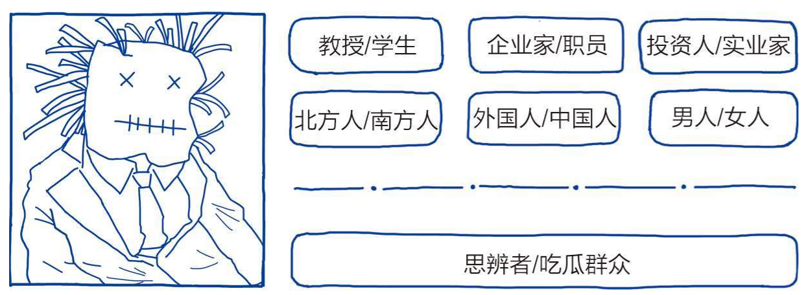

## MECE原则

结构化切分后的集合需要满足以下特点：

（1）子分类相互独立无重叠；

（2）子分类加起来穷尽全部可能。

结构化战略思维十分强调科学**精准划分**，杜绝简单粗线条的划分。要把“好”和“坏”用明确数据标准做区分，给每个判断以充足、具体又可衡量的指引，这并不是一蹴而就的容易事。也就是要一个量化标准。

## 切问题的四种方法

公式法、子目录列举法、流程法和逻辑框架法

1. 公式法和子目录列举法

以“如何提高企业净利”为例，由于利润=收入-成本，因此“解决净利问题，无非是从两个层面入手，一是开源，二是节流！”

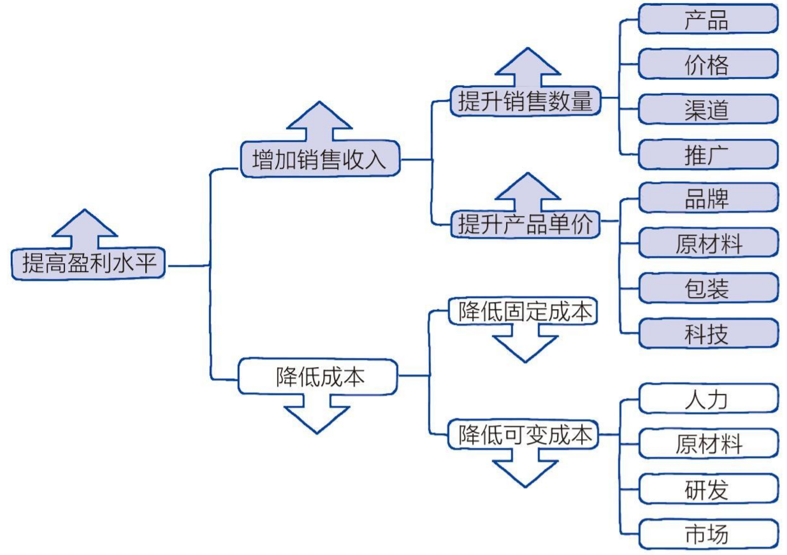

1. 流程法和逻辑框架法

流程法往往应用在存在线性发展或生命周期的品类上。

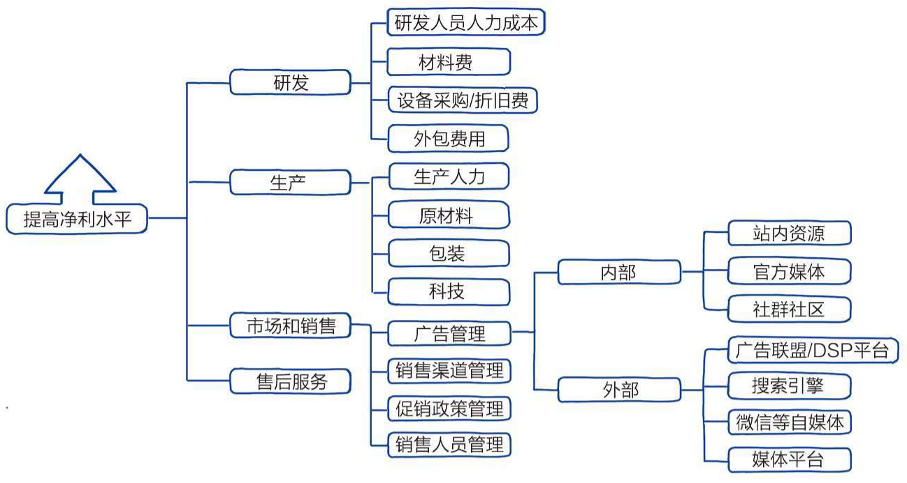

## 多维图谱

“切”和它的MECE原则是结构化战略思维的基本功，必须有意识地反复练习。多维图谱是思辨者结构化战略思维升级的必备武器。多维图谱如果切分适当，可以比饼图、柱状图、流程图等单维度的图谱更能展现出作者思维的深度和广度；可以帮助我们简化问题、提升沟通效率，协助我们碰撞出新的商业洞见。

所有简单的线图、饼图、柱状图和流程图都是单一维度思考的图谱呈现。它们虽然有一定的视觉展示效果，比如凸显趋势和比例等，但是从逻辑思考的深度来说，这类图表是相对初级的。要显示思辨者思考的广度和深度，必须具备从单一维度到多维度思考和沟通的飞跃，学会制作多维图谱。

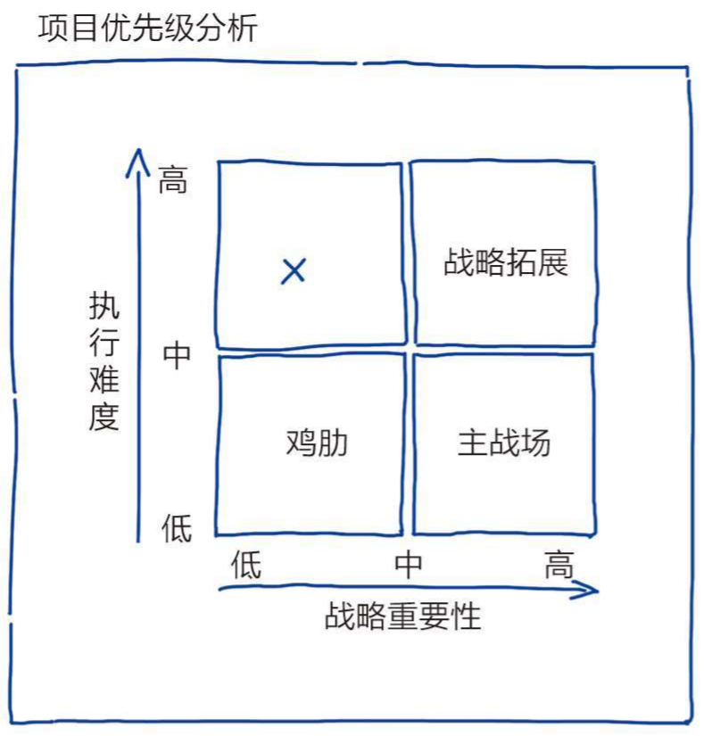

这样分析过后，多维图谱分析的优势十分明显。两个维度叠加充分显示出思考的深度和专业性已远超那些只会单维度思考的小伙伴。

这个多维图谱还可以进一步提升和精进。我们发现，在讨论项目的时候，另外一个核心的决策因素是潜在净利的多少，然而这个因素并没有被包含在二维图谱里。净利的多少直接影响对项目的优先级评估。比如，对于现金流压力大的中小企业来说，如果项目可预见的净利可观，就算是跟战略方向相反的“鸡肋”项目也还是会优先考虑实施，在“现金流为王道”的资本寒冬大环境下尤其如此。

如何把潜在净利加入到图谱？我们可以尝试用图形展示这个数值。在项目优先级图谱的增强版中，用大小不同的圆形来代表项目潜在净利的多少，而圆心位置则体现项目在战略重要性和执行难度方面的相应的估值。

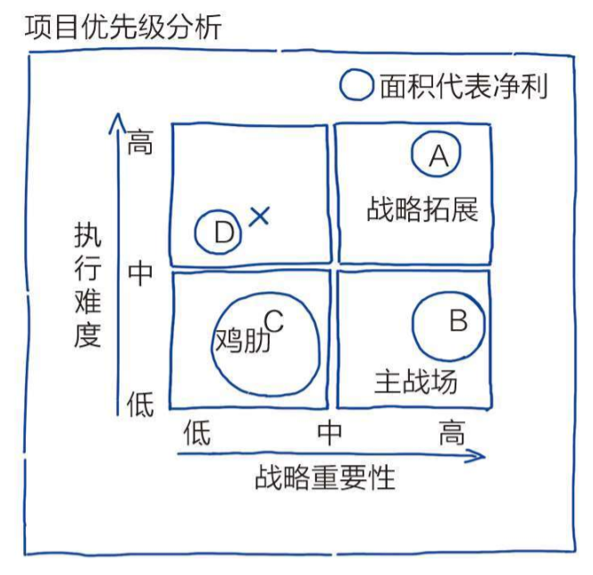

# 结构化战略思维的四大原则

结构化战略思维四大原则是思辨者在日常思考、交流和行为中所贯彻的指导性原则，是结构化战略思维的基石。它贯穿新麦肯锡五步法的全过程，但其应用范围远远超越战略项目。结构化战略思维四大原则便于将结构化战略思维模块化，更容易贯彻并融入日常生活与工作。

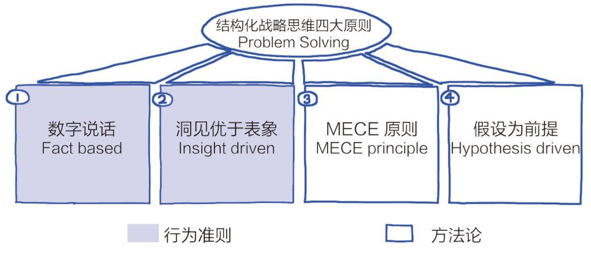

## 原则一：数字说话

数据化的普及要求我们具备一定的数据能力，如基础统计和数据分析能力，也要求对数据的特色、应用和局限都有更深入的了解。

### “要假设没有经过验证的数字都是骗人的”：

**伪造数字**：直接用假数字是最低级的，处于骗术鄙视链的最底部。

**以偏概全**：比如零售店铺门口吸引顾客进店的“50%折扣”的大牌子，一旁用极小字注明“部分商品”，顾客进去才发现只有几件商品半价，而大部分商品价格并没有降低。

**诱导数字**：比如某教育机构广告词是“全国用户超过4亿”，而“用户”的概念包括“注册用户”“试听用户”“付费用户”和“活跃付费用户”等。广告里的“用户”可能泛指的是历史上累计的所有注册用户，这个数字自然远远高于大多数听众理解的“活跃付费用户”的数字。

**标杆数字**：比如奶茶店，设置了一杯特别贵的几乎不会有人来买的奶茶，这只是为了让用户觉得其他奶茶很便宜。又比如百亿补贴的先涨价再减价。

再举个例子：

> “本公司营业收入连续三年增长20%以上，是健康且稳步增长的高科技企业。”
>
> 这句话前半句是事实依据，后半句是结论。我们暂且假设路演材料里数据是真实的。即使如此，这个推理至少有十几个潜在的误导或“坑”等着我们。数字的事实依据不一定能推导出“健康且稳步增长”的结论。
>
> （1）收入vs利润：收入增长20%，实际利润如何？企业在路演材料中没有直接写出利润数据很可能是因为真实的数字很差。
>
> （2）赛道增速：收入增长20%看起来似乎不错，但在一些高速发展的赛道，比如十几年前的房地产行业，20%的收入增长很可能还达不到行业平均水平。
>
> （3）基数：对于初创公司而言，其起始收入通常较少，百分比增长带有强烈的误导性。因此更应该看看公司收入的绝对数值。
>
> （4）主营业务收入vs非主营业务收入：比如企业性质是互联网企业，但其收入增长是因为房租收入占比过大而带来主要增长，那么该公司的估值就要重新核算。
>
> （5）现金流：收入增长快但应收账款的账期长或只依靠单一采购方，现金流压力很可能很大，企业甚至可能因此面临倒闭的风险。
>
> （6）外债状况：公司如果外债激增，即使收入提升，也会面临资不抵债的风险。
>
> （7）营业收入的细分：新产品和老产品的迭代，有没有在未来突破的可能。
>
> （8）市场促销活动：降价促销很可能提升收入，但侵蚀净利，要仔细验证企业有无大规模市场促销活动。
>
> （9）新科技/替代品：主营产品是不是正在经历科技或产品升级，可替代性强不强。企业收入连续三年增长，第四年可能因为替代品出现而转亏。
>
> （10）政府政策：政府有没有新规要出台，规范或限制这个产业。
>
> （11）潜在进入者：如BAT类巨头会不会进入这个市场，引发更激烈的竞争。
>
> 分析至此，原本听起来非常正面的一句惯用陈述实际上却千疮百孔，含有多个需要更深入调研验证的不确定因素，离“健康且稳步增长”的结论相去甚远！

### 关注少数特例

数字说话原则要求我们不仅对数据中的结构规律有认知，更要对那些不经常发生的少数特例有足够的关注和刨根问底的精神。比如说关注几万条好评中的一条差评是因为什么。

## 原则二：洞见优于表象

“表象”是每天都能见到的看起来纷繁无序的事件和各种信息。“洞见”是能连接所有相关表象的筋络，是表象背后的根本原因。

单独审视每一种表象，导致这种表象出现的原因可能千差万别。比如失眠可能是因为睡前喝了咖啡，起了痘痘可能是上火了，钥匙丢了可能是粗心大意的结果……然而，“工作压力大”可以是贯穿并导致所有表象产生的根本原因。找到了这个根本原因，也就是洞见，所有相关表象的产生便能得到完美的解释，离找到解决方案就很接近了。

这也是我们之前曾经学到的那两种解决问题的方式，一种是单独解决小的子问题，一种是解决背后的根因。

### 洞见现行

关于洞见的商务交流规则是，洞见先行。无论哪种呈现形式，一定要先阐述自己的核心观点，也就是洞见，然后再辅以论据或分论点。日常工作里，常见这样的电子邮件：正文部分赫然写着“领导，请看附件”，随之附上N个巨大的Excel或Word文档。这种不负责任的邮件是对读者的极大不尊重。切记，交流中不能假设存在“不言而喻”的洞见。读者大多时候没有时间也没有意愿解读原始数据，因此需要提出洞见来节省沟通时间，加快决策进程。

# 麦肯锡五步法

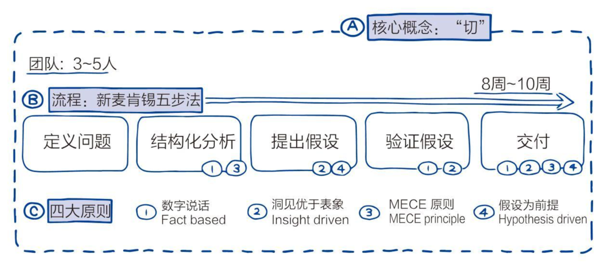

## 第一步，定义问题

对问题本身的推敲是思辨者的行为特色。

战略思维从全局高度把握问题的准确性，重点在于“为什么——解决什么问题”，并不聚焦“怎么做——实施的细节”。专家思维则往往把“为什么——解决什么的问题”当成已知，而侧重“怎么做——实施的细节”以及成果输出，比如“用什么方法、以什么速度和价格，在限定时间内敲钉子”。因此，在项目初期，战略思维更注重需求端的逻辑，而专家思维十分注重过往经验、专业和最佳解决方案。

如何衡量是否“定义了正确的问题”？最直接的衡量标准就是，当这个正确的问题被解决后，相关的所有问题也会得到完全解决而没有后遗症。

定义问题工具箱：

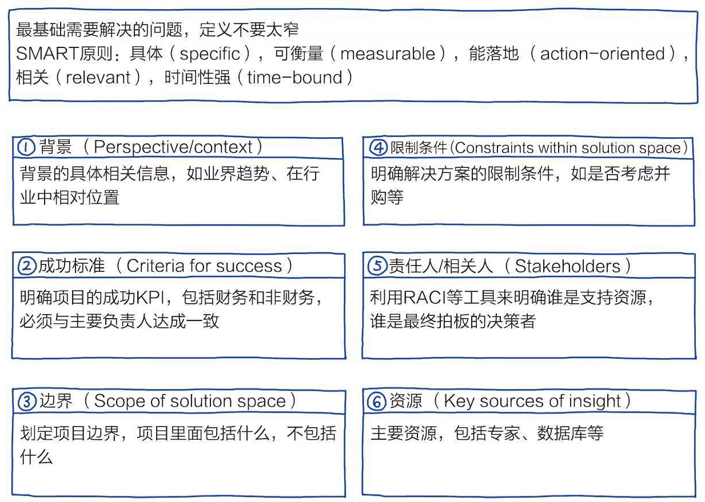

## 第二步，结构化分析

分析问题要小心逻辑陷阱：比如归纳和演绎，归纳法不是严谨的科学逻辑，一般使用归纳法时面对的都是理解能力较强的听众，而且谈论的大多是公认的不太会产生异议的观点。归纳法容易产生明显的逻辑漏洞。然而，演绎法是自上而下的，也就是从公理推出个体的判断，比归纳法更加严谨和科学。

相关关系与因果关系：千万不要在分析时把相关性关系与因果关系混为一谈，比如“鲨鱼爱草莓”的故事。

规避分析问题的误区：在使用拆解方法时不要只局限于一种方式，因为很可能存在盲区和弊端。

## 第三步，提出假设

“结构化分析”和“提出假设”往往同时发生，因为提出假设是建立在结构化分析的基础之上的。

假设的功能：提出假设及时修正错误假设并提出新的假设、验证后形成科学论断的闭环

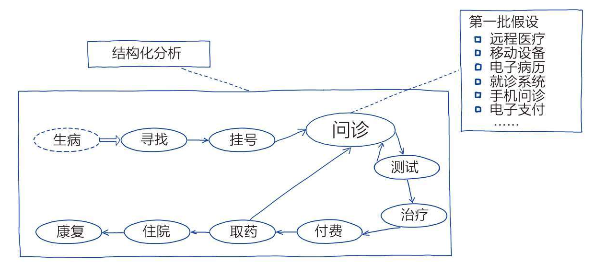

提出假设的关键举措：头脑风暴

## 第四步，假设验证

验证假设需要收集的信息量很大。为信息收集而做的验证假设调研工作分为两种：案头调研和实地调研。

## 第五步，交付

交付前：从来没有“过度的准备”

交付的形式和流程要完美。项目负责人要精心安排汇报展示的PPT及其他辅助材料，并经过多次排练确保万无一失。

# 高效的商务沟通

会议纪要中有一个重要的部分就是下一步的行动清单，遵循SMART原则：具体（Specific），可衡量（Measurable），能落地（Actionable），有时效（Time-Bound），并每项都有负责人（Responsible）。这套法则是传统时间管理SMART[5]方法的变通。这些貌似强势的做法都是结果导向，把重大决策和后续的行动文字化，留下记录并确保项目按既定节奏推进。

商务沟通的3S原则，它包括严谨缜密的战略（Thoughtful Strategy）、紧凑的结构（Tight Structure）和专业的风格（Professional Style）。

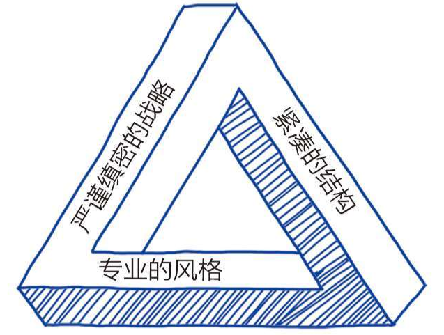

## 金字塔原则

金字塔原则就是，任何事情都可以归纳出一个中心论点，而此中心论点可由三至七个论据支持，这些一级论据本身也可以是个论点，被二级的三至七个论据支持，如此延伸，状如金字塔。

金字塔结构的每一层相对于上一层节点也要符合MECE原则：每个论点或论据要相互独立不重叠；加起来是上一节点的全部相关内容。“独立不重叠”是必须遵守的原则，如果交叉或重叠，就会在逻辑上产生严重错误。

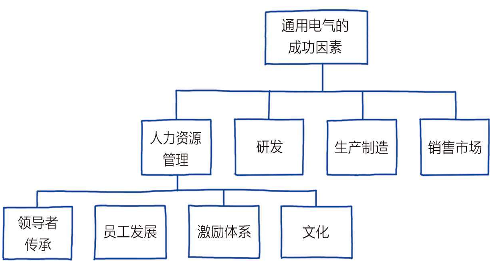

## 故事线

讲故事，其实是创业者获得成功的必备技能。不会“讲故事”而失败纯属是个体因缺乏交流能力所致，应该输得心服口服。因为有真材实料的实干家，同时也可以是个出色的段子手。

“故事线”就是将故事的核心要素用最常用的顺序串联起来。商业计划书类文档都要遵守故事线原则。一般来讲，故事线是5W2H分析法（又叫七问分析法）的简化版。5W2H包括：为什么（Why）、用什么（What）、何人做（Who）、何时（When）、何地（Where）、如何做（How）、多少钱（How much）。其实，何时（When）、何地（Where）都可以包括在如何做（How）中，所以在这里，我把5W2H简化成3W2H

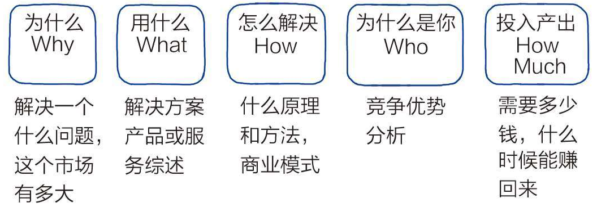

## SCP叙述框架

故事线5个元素中的“为什么”（Why）具有特殊重要的意义，需要格外关注。虽然故事线的核心要素可以在顺序上进行调整，但强烈建议故事线总始于“为什么”。

SCP是“规则/结构”（Structure）“行为”（Conduct）和“业绩”（Performance）的组合（见图9-9），被用来描述行业现状的叙述框架。

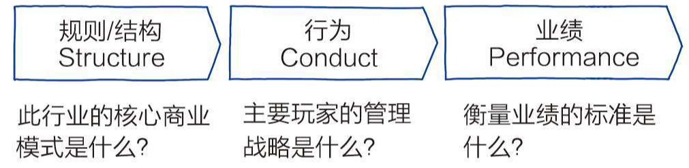

规则/结构：聚焦一个特定行业/赛道，简洁地描述这个行业的整体商业模式，即规则。以前讨论过的行业吸引力波特五力模型在这里可以用来描述赛道。然后分析一下大多数企业的基本商业模式，比如轻资产/重资产、信息技术科技含量、品牌重要性、专业运营要求以及现金流要求等。

行为：由于有了主流商业模式，各个头部或特色企业利用什么样的管理战略赢得或守住自己的市场份额？例如，科技壁垒、IP品牌影响力、运营经验和成本优势、规模化生产和生态战术等。

业绩：由于这样的结构和相应的市场行为，行业中主要玩家的财务和非财务的业绩如何？财务业绩比较好理解，就是盈利情况和预计增幅等。非财务业绩包括流量、用户活跃度、品牌影响力等不能直接用金额匡算的价值。

SCP叙述框架用鲜明的线性叙述环环相扣地描述了某个商业赛道的状况，那么，如何在现状基础上引入“糟糕的世界”中“未被满足的刚需”呢？解法就是在SCP叙述框架中加入“冲击”（Impact），以此讲述“为什么”。

SCP+I的故事叙述顺序如下：首先，把SCP按结构顺序讲明白，先讲行业特色和商业模式；其次，讲主要的企业玩家是如何各显神通地在这个行业打拼；最后，谈一下各企业的成绩和企业表现如何。SCP讲完，新的冲击隆重登场。由于这个冲击的存在，相关的供需平衡被打破：已有的产品无法满足冲击下的需求。新产品是为新需求而生的，就是来满足那个未被完美满足的刚需。

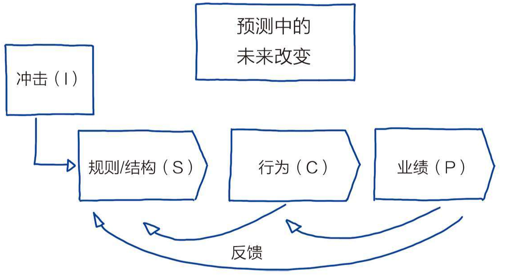

## 点线大纲

点线大纲的“点”是核心观点，在呈现过程中，每个第一层要点之前都要放置一个“点”符号来提引和间隔。而“线”是“点”再下一层分解的分论点或支持论据，在呈现上，在每个“点”的下面用短横线来提引和间隔。点线大纲既适用于讨论整个项目层面的故事线逻辑，也适用于讨论细节到每个要素的支持要点。

“线”是下一层分解的分论点或支持论据。分论点要遵守MECE原则，也就是说，每个分论点之间相互独立不重叠，且加起来应该涵盖所有相关的观点。我们经常看到的逻辑错误是将不同层面的论点混在一起，这严重违反了MECE原则。如果“线”后面承接的是论据，就要尽量将关键相关的具体数字加入论据阐述中。同样是论据支撑，带有数字的要比宽泛的主观判断更具有说服力。

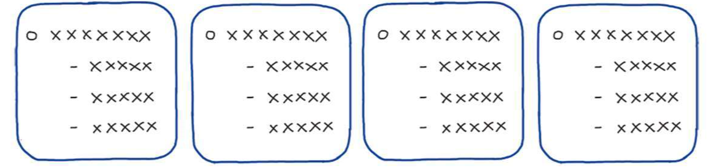

# 培养结构化战略思维需要养成的十个习惯

## 反对的责任

“反对的责任”是指在公司内部的交流中，要勇于说出自己的不同意见，而这种异议的提出不再是员工的选择而是应尽的责任。换句话说，如果你有不同想法或掌握关键数据却迫于各种压力而沉默不语，就是一种重大失职。“反对的责任”是被麦肯锡尊为公司文化基石的重要原则，也是个人培养结构化战略思维的重要举措。

要想把坚持“反对的责任”作为个人习惯，首先要求我们要有自己**独立的判断**。在新麦肯锡五步法全流程中，思辨者会主动思考各个环节的合理性并及时提出自己的意见。我们到底在解决什么问题？解决这个问题的方法是否符合MECE原则，有没有其他更好的解法？各种假设论证的过程是否合理？交付中会遇到什么样的问题？等等。在第3章“数字都是骗人的”中提到过思辨者会习惯性地挑战关键数据，并学会用各种快捷的方法验证。当数字被证实有误的时候，思辨者也会毫无保留地指出。

## 解决正确的问题

在新麦肯锡五步法的第一步“定义问题”上投入大量的资源。解决错误的问题从来都是做事的大忌。作为一个指导原则，思辨者在没有确认问题定义的情况下，要坚决避免大规模具体问题解决层面的资源投入。

## 下一层面的细节

下一层面的细节要求对问题做至少两个层次的深度挖掘才算及格，这也是对思维深度的基本要求。对于关键而复杂的问题，MECE切分的“3–3”原则，也就是面对任何问题，能用维度准确“切”分，然后再纵向深入“挖”到至少第3层的细节。完成一次完整分解之后，要求跳出已有的逻辑框架，从全新的维度再做2次及以上类似的“切”和“挖”的练习，建造3个不同的“逻辑树”，便于对已有方案进一步改进。

## 总结提炼

总结提炼的核心是简化，但不是粗暴的单纯减法。总结提炼的目的是抽丝剥茧、寻求真知的提炼，要求把复杂的情况挑“干货”，即用浅显易懂平实的语言表述清楚，而不是损失本身内涵、完整性和准确度的洞见流失。

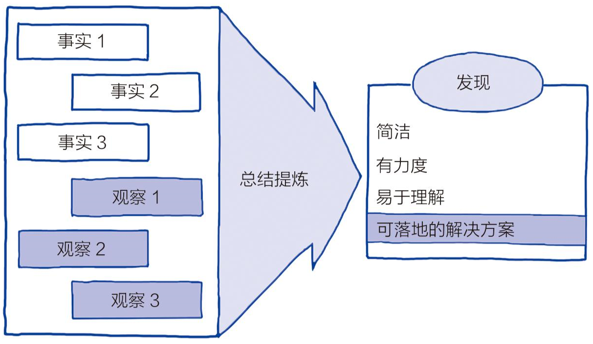

## 生成第一天的答案

作为习惯，“第一天的答案”要求我们在面对不熟悉的问题时，要在相对短的时间内（1天以内）快速形成初步思路并与相关人员分享，推进问题解决进程。“第一天的答案”是在时间压力下运用结构化战略思维方法的典型场景，充分显示个体的独立、高效和全面的思辨能力。将“第一天的答案”自觉地应用并形成习惯，可以人为制造紧迫感，加快解决问题的节奏，促使我们以结果为导向、从多角度体系化地思考和处理问题。

“第一天的答案”可以广泛应用于日常工作场景。比如，领导布置了新的调研工作，要有意识地要求自己能在短时间内（比如2~3小时内），形成以假设为前提的初步思路，包括调研的框架和初步假设，并与领导做初步方向性沟通。做到这一点，能充分显示我们独立、高效和全面的思维能力，也会让我们在竞争中脱颖而出。

## 认为还是知道

作为一种习惯，思辨者要有意识地区分“认为”和“知道”并锲而不舍地向“知道”无限靠近。结构化战略思维虽然提倡大胆假设，但到调研的中后期会要求假设都经过仔细验证，要么升级为真知，要么被放弃。滞留在“认为”的假设阶段是危险的，而混淆了假设和真知，危害将更大。虽然真知得来不易，但思辨者会经常挑战已有的判断，追问到底是“认为”还是“知道”，并努力运用真知和洞见作为做事的基础。

缺乏思辨能力的人在讨论问题的时候，常常将“认为”和“知道”混淆，把假设当成真知。“认为”成本极低而且容易产出，英文描述其为“Lip Service”，就是仅需动动嘴唇而无须用行动支持的简单服务。再加上之前提到的类似确认偏误的认知误区，人们习惯于把未验证的假设粉饰成有理有据的真知，造成严重后果。

在工作场景下，我们很多时候看到的是“认为”主导的场景。由于主观判断盛行，就很难做到“对事不对人”。当两方为“认为”争执难分高下的时候，只能是“有理就在声高”或借助官职高低等与问题本身并不相关的因素做出决策。管理者应该提升结构化战略思维的能力，明辨假设或洞见，只有这样，对于不同观点的讨论焦点才会集中在逻辑和数字层面，也更具有职业精神。

## 移动时间轴

移动时间轴是思辨者预见未来的尝试。思辨者运用结构化战略思维，利用已知的数据和洞见，凭借强大的逻辑向前推动时间轴，在大多数情况下可以清晰地分析未来的多种可能性，并推测每种可能性真正发生的概率。

移动时间轴把未来的可能性当作已知来思考，尤其在重大决策之前，这是问题分析中必要的一环。比如在大规模市场调研之前，花时间再次审视计划是否周全，细节是否都到位，有没有其他符合MECE原则的可能性，最后还要问一个“然后又怎么样”的问题。向前移动时间轴，假设已经做完了调研，结果是产品品牌的意识很强，然后又怎么样？下一步应该怎么操作？如果品牌意识弱呢？

## 数字和逻辑

思辨者是理性客观重视数字和逻辑的群体。他们不会轻易地说出“不明觉厉”，更不会“人云亦云”。理性客观是主观臆断的对立面，任何假设到洞见都要通过数字和逻辑来验证。思辨者善于用数字和事实支持想法，而这个支持的过程经得住最严格的逻辑拷问。思辨者往往会全方位了解数据的作用、局限和陷阱，也懂得讨论逻辑应用（如归纳法和演绎法）及其误区。本书贯穿对数字和逻辑的讨论，这里不再赘述。

## 知道边界

思辨者要知道边界。这意味着思辨者要时刻提醒自己不仅要知道自己知识和能力的外沿，还要对人类认知的局限有足够的认识。

多种认知偏误会直接影响理性思考的正确性，比如确认偏误（Conf irmation Bias）、自我服务偏误（Self Serving Bias）、厌恶损失偏误（Loss Aversion）和过度自信偏误（Overconf idence Bias）等。