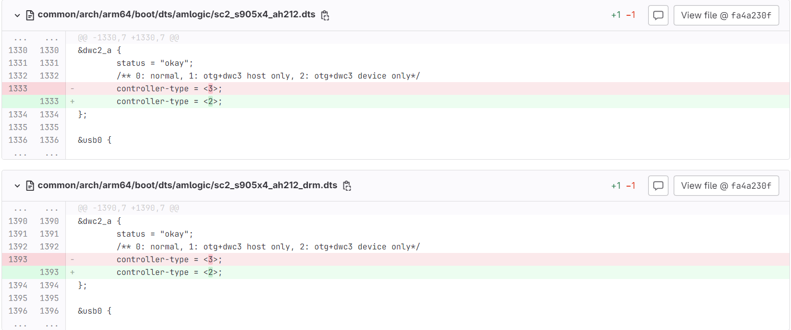
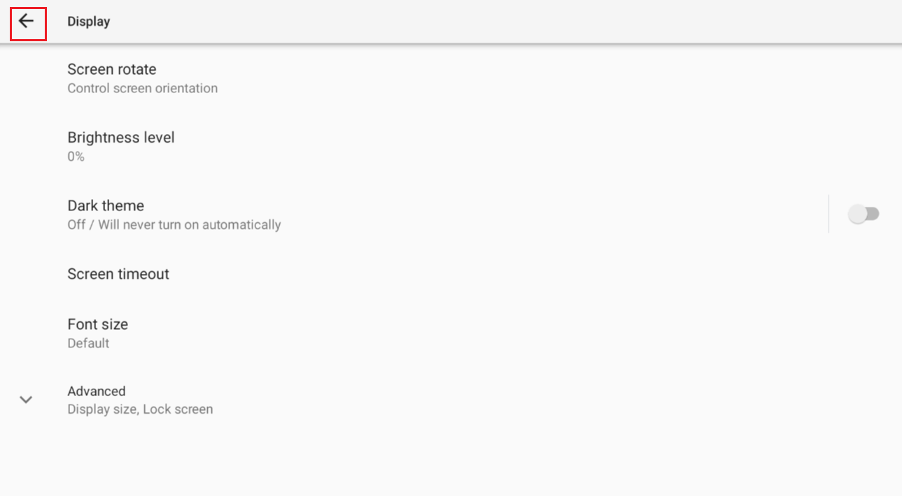
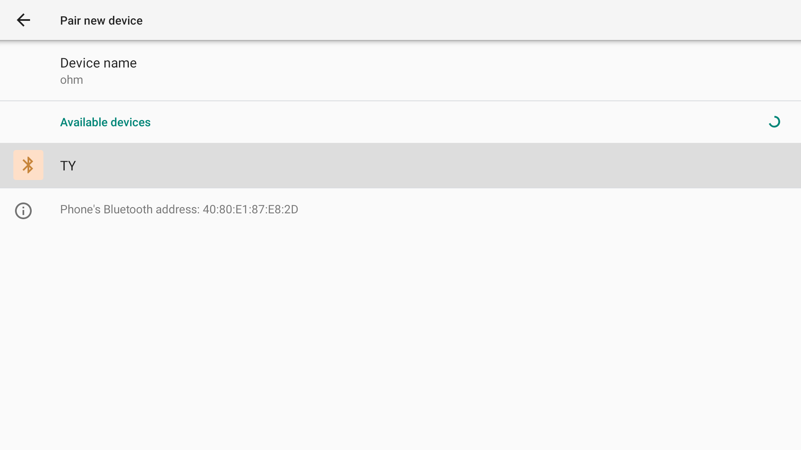
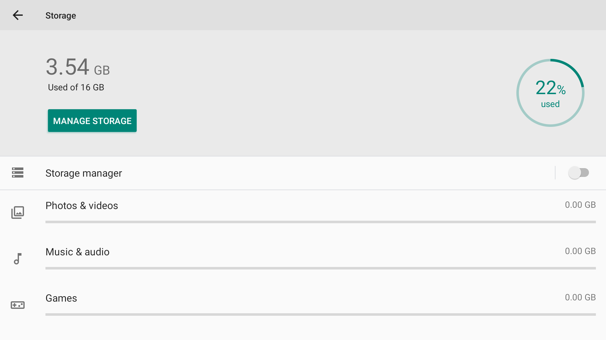
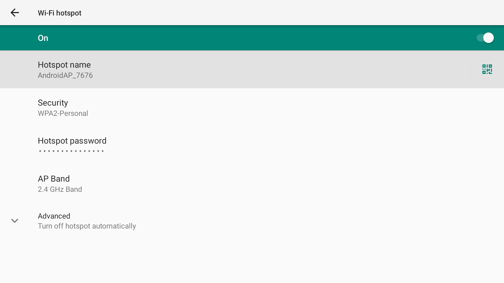

# Amlogic方案以及项目

## Android各种调试命令

[adb shell中的am pm命令、常用命令总结](https://blog.csdn.net/qq_43472877/article/details/116454039)

### 控制台下

写mac跟sn

```C
#写MAC
su
echo 1 > /sys/class/unifykeys/attach
echo mac > /sys/class/unifykeys/name
echo 00:22:6D:D2:27:13 > /sys/class/unifykeys/write
cat /sys/class/unifykeys/read
 
#写SN
su
echo 1 > /sys/class/unifykeys/attach
echo usid > /sys/class/unifykeys/name
echo 2023011038 > /sys/class/unifykeys/write
cat /sys/class/unifykeys/read

#读MAC
adb shell getprop ro.boot.mac
#读SN
adb shell getprop ro.serialno
```

pm系列

pm工具为包管理(package manager)的简称，可以使用pm工具来执行应用的安装和查询应用包的信息、系统权限、控制应用。pm工具是Android开发与测试过程中必不可少的工具。通常放置在System/bin下。

```C
# 列出所有已安装应用程序的包名信息
pm list packages

# 查询所有系统应用的包名
pm list packages -s

# 查询所有第三方应用的包名
pm list packages -3

# 获取指定应用程序包（PACKAGE）的详细信息，包括包名、版本号、权限等
pm dump PACKAGE

# 启用指定包名的应用程序
pm enable PACKAGE_NAME

# 卸载软件
pm uninstall  PACKAGE_NAME

# 禁用指定包名的应用程序
pm disable PACKAGE_NAME

# 授权给指定包名的应用程序指定权限
pm grant PACKAGE_NAME PERMISSION

# 撤销指定包名的应用程序指定权限
pm revoke PACKAGE_NAME PERMISSION

# 清除指定包名应用程序的数据及缓存
pm clear PACKAGE_NAME

# 强制停止指定包名的应用程序
am force-stop PACKAGE_NAME
```

am系列

```C
# 通过命令启动APK
am start -n APK包名/启动类名   
```

截屏录屏

```C
# 截屏
/system/bin/screencap -p /sdcard/screencap.png 

# 录屏10秒钟
screenrecord --time-limit 10 /sdcard/BlackScreen.mp4  
```

抓取log

```C
# 清除当前日志缓冲区的内容
logcat -c

# 捕获设备上的日志，使用 "threadtime" 格式显示，并将日志输出到 "/data/123.log" 文件
logcat -c && logcat -v threadtime > /data/123.log

# 捕获设备上的日志，使用 "time" 格式显示，并将日志输出到 "/data/123.log" 文件
logcat -c && logcat -v time > /data/123.log

# 使用adb pull命令将设备上的 "/data/123.log" 文件拉到本地目标路径
adb pull /data/123.log /本地目标路径/
```

控制gpio口

```C
# 创建 GPIO 控制口，将 GPIO 编号 488 导出到/sys/class/gpio/ 目录下
echo 488 > /sys/class/gpio/export

# 查看 GPIO 控制口的方向，输入还是输出
cat /sys/class/gpio/gpio488/direction

# 设置 GPIO 控制口的方向为输出
echo out > /sys/class/gpio/gpio488/direction

# 设置 GPIO 控制口的值为高电平（1），将 GPIO 置为高电平状态
echo 1 > /sys/class/gpio/gpio488/value

# 设置 GPIO 控制口的值为低电平（0），将 GPIO 置为低电平状态
echo 0 > /sys/class/gpio/gpio488/value

# 取消 GPIO 的导出，释放 GPIO 控制口
echo 488 > /sys/class/gpio/unexport
```

获取系统属性

```C
# 获取系统的属性
getprop
e.g :getprop persist.sys.timezone

# 设置系统的属性
setprop
e.g :setprop persist.sys.timezone Asia/Tokyo
```

log级别

```C
echo 7 >/proc/sys/kernel/printk
```

查看内存

```Java
adb shell df -h 查看分区情况
du -sh * 查询目录的磁盘使用空间
adb shell dumpsys meminfo $package_name or $pid 获取单个进程对应的内存信息
```

SVC系列

```Bash
svc power stayon [true|false|usb|ac|wireless]   // 屏幕保持亮起或暗屏 [长亮|长暗|usb接入长亮|充电长亮|连接wifi长亮]
svc power reboot [reason]                       // 重启设备，可选参数 [reason] 表示重启原因
svc power shutdown                              // 关机
svc power forcesuspend [time]                   // 强制休眠，time为定时休眠时间（毫秒）

svc usb setFunctions [function]                 // 设置USB功能，[function] 可选项：`mtp`, `ptp`, `rndis`, `midi`
svc usb getFunctions                            // 获取当前启用的USB功能列表
svc usb resetUsbGadget                          // 重置USB设备

svc data enable                                 // 打开数据流量
svc data disable                                // 关闭数据流量

svc wifi enable                                 // 打开Wi-Fi
svc wifi disable                                // 关闭Wi-Fi

svc nfc enable                                  // 打开NFC
svc nfc disable                                 // 关闭NFC

svc bluetooth enable                            // 打开蓝牙
svc bluetooth disable                           // 关闭蓝牙
```

### uboot下

设置kernel log级别

```C
# 设置环境变量 loglevel 的值为 7
s4_ap222# env set loglevel 7

# 将当前环境变量保存到存储设备中
s4_ap222# env save

# 重新启动设备，应用新的环境变量设置
s4_ap222# reboot
```

控制gpio口

```C
# 查看所有 GPIO 口的状态
gpio status -a

# 拉高指定 GPIOX_8 口的电平
gpio set GPIOX_8

# 拉低指定 GPIOX_8 口的电平
gpio clear GPIOX_8

不过这个操作方式在reboot之后就失去作用了
```

### code下

查看apk的包名和权限

```C
./sdk_name/prebuilts/sdk/tools/linux/bin/aapt dump badging /apk_path/apkName
#需要修改sdk_name\apk_path\apkName为自己对应的信息
example: ./prebuilts/sdk/tools/linux/bin/aapt dump badging ./xxx.apk
```

删除out下面的.dtb文件（修改dtsi文件时需要）

```C
#查找out目录下的所有dtb文件并执行删除
find out/ -name *.dtb | xargs rm -rf
```

查看一个apk的详细信息

```C
# 查看 APK 文件的基本信息，包括包名、版本等
aapt dump badging xxx.apk

# 使用 grep 过滤出 APK 文件的包名信息
aapt dump badging xxx.apk | grep package

# 使用 grep 过滤出 APK 文件的权限信息
aapt dump badging xxx.apk | grep permission

# 使用 grep 过滤出 APK 文件的活动（Activity）信息
aapt dump badging xxx.apk | grep activity

# 解包查看完整的 AndroidManifest.xml
aapt dump xmltree base.apk AndroidManifest.xml
```

这个命令可以查看到apk的包名，版本信息，启动活动，SDK版本，权限信息，目标设备等

也可以在【consol】下使用

```C
dumpsys package 包名
```

这个命令不仅会显示apk的基本信息还会显示UID，进程信息等，比较多，建议使用的时候结合grep

### 常用信息

TV的settings：`am start -n com.android.tv.settings/.MainSettings`

TV的settings代码位置：`vendor/amlogic/common/apps/DroidTvSettings/Settings/`

AOSP Settings代码位置：`packages/apps/Settings/`

AOSP Settings：`am start -n com.android.settings/.Settings`

log： `import android.util.Log;`

开机启动的DefaultActivity ：`packages/apps/Provision/src/com/android/provision/DefaultActivity.java`

开机执行的shell脚本：

```
build/make/tools/buildinfo.sh
```

输出系统属性：

```Java
settings get
```


在代码中给apk签名：

```Java
java -Djava.library.path="prebuilts/sdk/tools/linux/lib64" -jar ./prebuilts/sdk/tools/lib/signapk.jar vendor/xxxx/android-certs/platform.x509.pem vendor/xxxx/android-certs/platform.pk8 OTAForAB-1.1.apk OTAForAB-1.1_si.apk
```

### 常见问题

Android 11 进入开发者模式显示`developer options are not available for this user`

原因是开机没有执行com.android.provision/.DefaultActivity这个开机向导活动

手动输入

```C
settings put global device_provisioned 1
settings put secure user_setup_complete 1
```

然后重新打开就可以了，更多信息请查看下面的commit：[Changed Provision app  so it can trigger device owner provisioning](https://android.googlesource.com/platform/packages/apps/Provision/+/23356226d971a60ebf8d56ac03abe453a045b5cf)

### ❗目录结构

**device**：关于各种不同产品的配置，一些ro. 属性，一些软件的内置(Settings), "kl"文件，init.rc文件（权限和服务），开机动画, 语言时区

**vendor:**  厂商的定制化软件

**framework:**  系统设置、app权限、按键监听

| Android源码根目录 | 描述                                               |
| ----------------- | -------------------------------------------------- |
| art               | 全新的ART运行环境                                  |
| bionic            | 系统C库                                            |
| bootable          | 启动引导相关代码                                   |
| build             | 存放系统编译规则及generic等基础开发包配置          |
| cts               | Android兼容性测试套件标准                          |
| dalvik            | dalvik虚拟机                                       |
| developers        | 开发者目录                                         |
| development       | 应用程序开发相关                                   |
| device            | 设备相关配置                                       |
| docs              | 参考文档目录                                       |
| external          | 开源模组相关文件                                   |
| frameworks        | 应用程序框架，Android系统核心部分，由Java和C++编写 |
| hardware          | 主要是硬件抽象层的代码                             |
| kernel            | Android的内核配置                                  |
| libcore           | 核心库相关文件                                     |
| libnativehelper   | 动态库，实现JNI库的基础                            |
| out               | 编译完成后代码输出在此目录                         |
| pdk               | Plug Development Kit 的缩写，本地开发套件          |
| platform_testing  | 平台测试                                           |
| prebuilts         | x86和arm架构下预编译的一些资源                     |
| sdk               | sdk和模拟器                                        |
| packages          | 应用程序包                                         |
| system            | 底层文件系统库、应用和组件                         |
| test              | 安卓供应商测试套件（VTS）实验室                    |
| toolchain         | 工具链文件                                         |
| tools             | 工具文件                                           |
| Makefile          | 全局Makefile文件，用来定义编译规则                 |
| vendor            | 厂商定制内容                                       |

## Amlogic S905X4方案及项目

基础信息：

Android 11

### OTA-AB开关

禁用AB分区，使用非AB分区解决方案

1. DTS文件更新：将partition_mbox_ab.dtsi替换为partition_mbox.dtsi，确保设备树文件正确引用。

~~~
diff --git a/common/arch/arm64/boot/dts/amlogic/sc2_s905x4_ah212.dts b/common/arch/arm64/boot/dts/amlogic/sc2_s905x4_ah212.dts

 #include "meson-sc2.dtsi"
 #include "partition_mbox_ab.dtsi" // [!code --]
 #include "partition_mbox.dtsi" // [!code ++]
 #include <dt-bindings/input/input.h>

diff --git a/common/arch/arm64/boot/dts/amlogic/sc2_s905x4_ah212_drm.dts b/common/arch/arm64/boot/dts/amlogic/sc2_s905x4_ah212_drm.dts

 #include "meson-sc2.dtsi"
 #include "mesonsc2_drm.dtsi"
 #include "partition_mbox_ab.dtsi" // [!code --]
 #include "partition_mbox.dtsi" // [!code ++]
 #include <dt-bindings/input/input.h>
~~~

2. 恢复文件权限调整：recovery_5.4.fstab的权限更改，增加/vendor_boot和/system_ext的挂载点。

~~~
diff --git a/device/amlogic/common/recovery/recovery_5.4.fstab b/device/amlogic/common/recovery/recovery_5.4.fstab

 /dev/block/vbmeta_system   /vbmeta_system       emmc    defaults    defaults
 /dev/block/recovery     /recovery   emmc    defaults    defaults
 /dev/block/boot         /boot   emmc    defaults    defaults
 /dev/block/vendor_boot       /vendor_boot   emmc    defaults    defaults // [!code ++]
 /dev/block/misc         /misc   emmc    defaults    defaults
 /dev/block/system       /system   ext4    defaults    defaults
 /dev/block/vendor       /vendor ext4    defaults    defaults
 /dev/block/system_ext   /system_ext  ext4    defaults    defaults // [!code ++]
 /dev/block/odm          /odm    ext4    defaults    defaults
 /dev/block/odm_ext      /odm_ext    ext4    defaults    defaults
 /dev/block/oem          /oem    ext4    defaults    defaults
~~~

3. 增量OTA安装检查：在releasetools.py中，增加对vbmeta_system和vendor_boot的检查。

~~~
diff --git a/device/amlogic/common/scripts/releasetools.py b/device/amlogic/common/scripts/releasetools.py

 def IncrementalOTA_InstallEnd(info):
   print "amlogic extensions:IncrementalOTA_InstallEnd"
   IncrementalOTA_ImageCheck(info, "vbmeta_system"); // [!code ++]
   IncrementalOTA_ImageCheck(info, "vendor_boot"); // [!code ++]
   IncrementalOTA_ImageCheck(info, "logo");
   IncrementalOTA_ImageCheck(info, "dt");
   IncrementalOTA_ImageCheck(info, "recovery");
~~~

4. SELinux策略更新：在system_app.te中，添加对符号链接文件的读取权限。

~~~
diff --git a/device/amlogic/common/sepolicy/system_app.te b/device/amlogic/common/sepolicy/system_app.te
@@ -3,6 +3,7 @@ allow system_app cache_recovery_file:dir { search read open write add_name remov
 allow system_app cache_recovery_file:file { create getattr setattr open read write unlink  };
 allow system_app cache_file:dir {search open read write unlink add_name remove_name};
 allow system_app cache_file:file {create getattr write open unlink read};
 allow system_app cache_file:lnk_file read; // [!code ++]
 allow system_app update_engine:binder {call transfer};

 allow system_app rootfs:dir { getattr };
diff --git a/device/amlogic/ohm/ohm.mk b/device/amlogic/ohm/ohm.mk
@@ -198,7 +198,7 @@ BOARD_USES_VBMETA_SYSTEM := true
 TARGET_BUILD_KERNEL_4_9 ?= false

 ifneq ($(TARGET_BUILD_KERNEL_4_9),true)
 AB_OTA_UPDATER ?=true // [!code --]
 AB_OTA_UPDATER ?=false // [!code ++]
 BOARD_USES_ODM_EXTIMAGE := true
 endif
~~~

另外查询到AB分区的相关配置：

device/amlogic/ohm/ohm.mk

```Java
ifneq ($(TARGET_BUILD_KERNEL_4_9),true)
AB_OTA_UPDATER ?=true
BOARD_USES_ODM_EXTIMAGE := true
endif
```

这里对kernel版本是4.9的情况进行处理

### 串口默认root，不需要su

此提交的主要功能是将S905X4设备的SELinux设置为宽松模式，并为控制台服务赋予根权限，从而简化调试和开发过程。

实现步骤

1. **修改构建配置**：在`Android.mk`中，将`TARGET_BUILD_VARIANT`的条件从`userdebug`和`eng`扩展为包括`user`，以允许在用户构建中使用初始选项。
~~~
diff --git a/system/core/init/Android.mk b/system/core/init/Android.mk
@@ -6,7 +6,7 @@ LOCAL_PATH:= $(call my-dir)

 # --

 ifneq (,$(filter userdebug eng,$(TARGET_BUILD_VARIANT))) // [!code --]
 ifneq (,$(filter user userdebug eng,$(TARGET_BUILD_VARIANT))) // [!code ++]
 init_options += \
     -DALLOW_FIRST_STAGE_CONSOLE=1 \
     -DALLOW_LOCAL_PROP_OVERRIDE=1 \
~~~
2. **更改SELinux行为**：在`selinux.cpp`文件中，修改`IsEnforcing()`函数，使其在宽松模式下始终返回`false`，允许系统在不强制执行SELinux政策的情况下运行。
~~~
diff --git a/system/core/init/selinux.cpp b/system/core/init/selinux.cpp

@@ -107,7 +107,7 @@ bool IsEnforcing() {
     if (ALLOW_PERMISSIVE_SELINUX) {
         return StatusFromCmdline() == SELINUX_ENFORCING;
     }
     return true; // [!code --]
     return false; // [!code ++]
 }
~~~
3. **调整控制台服务权限**：在`init.rc`文件中，为控制台服务添加`system`和`root`组权限，以允许其具有更高的权限级别。
4. **修改启动条件**：移除`ro.debuggable=1`的条件检查，确保控制台服务在初始化时始终启动。

~~~
diff --git a/system/core/rootdir/init.rc b/system/core/rootdir/init.rc

@@ -1040,7 +1040,7 @@ service console /system/bin/sh
     console
     disabled
     user shell
     group shell log readproc // [!code --]
     group shell log readproc system root // [!code ++]
     seclabel u:r:shell:s0
     setenv HOSTNAME console

@@ -1051,7 +1051,8 @@ on property:ro.debuggable=1
     # Give reads to anyone for the window trace folder on debug builds.
     chmod 0775 /data/misc/wmtrace

 on init && property:ro.debuggable=1 // [!code --]
 # on init && property:ro.debuggable=1  // [!code ++]
 on init 
     start console

 on userspace-reboot-requested
~~~


### SElinux设置为permissive

方式一

```Java
--- a/system/core/init/selinux.cpp
+++ b/system/core/init/selinux.cpp
@@ -107,7 +107,7 @@ bool IsEnforcing() {
     if (ALLOW_PERMISSIVE_SELINUX) {
         return StatusFromCmdline() == SELINUX_ENFORCING;
     }
     return true; // [!code --]
     return false; // [!code ++]
 }
```

方式二：

device/amlogic/ohm/ohm_mxl258c/BoardConfig.mk

```Java
ifeq ($(AN_BOOT_SELINUX_PERMISSIVE), true)
BOARD_KERNEL_CMDLINE += androidboot.selinux=permissive
endif
```

运行时设置:

```Java
getenforce   查看当前SELinux策略
setenforce 0
```

### 添加厂商定制化信息

在`device/amlogic/ohm/ohm.mk`等一系列mk中添加了vendor/xxxx/device-xxxx.mk，将其编译进去

1. 如何将sh脚本编译进去
2. 如何将APK预置进去
3. 如何修改签名key
4. 如何执行shell命令(shellCmd.jar的方式)

### 预制屏幕宽高、像素密度density、屏幕密度DPI

`aml-s905x4-androidr\device\amlogic\oppen\oppen.mk`

```Java
ifeq ($(BOARD_COMPILE_ATV), false)
#config of AM301 1080P UI surfaceflinger
PRODUCT_PRODUCT_PROPERTIES += \
    ro.surface_flinger.max_graphics_width=1920  \
    ro.surface_flinger.max_graphics_height=1080 \
    ro.sf.lcd_density=240
endif
```

`device\amlogic\oppen\device.mk`

```Java
PRODUCT_AAPT_PREF_CONFIG := xhdpi
```

### 开启摄像头支持

device/amlogic/common/core_amlogic.mk

```Java
PRODUCT_HOST_PACKAGES += \
     mkdtimg \
     imgdiff

 PRODUCT_SUPPORTS_CAMERA := false  // [!code --]
 PRODUCT_SUPPORTS_CAMERA := true   // [!code ++]
```

### 添加杜比


```Java
diff --git a/device/amlogic/ohm/ohm.mk b/device/amlogic/ohm/ohm.mk

@@ -322,15 +322,15 @@ endif
 #                          Audio License Decoder
 #
########################################################################
TARGET_DOLBY_MS12_VERSION := 2 // [!code --]
#TARGET_DOLBY_MS12_VERSION := 2 // [!code ++]
ifeq ($(TARGET_DOLBY_MS12_VERSION), 2)
TARGET_BUILD_DOLBY_MS12_V2 := true
        else
        #TARGET_BUILD_DOLBY_MS12 := true
endif

#TARGET_BUILD_DOLBY_DDP := true // [!code --]
TARGET_BUILD_DTSHD := true // [!code --]
TARGET_BUILD_DOLBY_DDP := true // [!code ++]
#TARGET_BUILD_DTSHD := true // [!code ++]

#################################################################################
```

然后还要改一个文件

```
vendor/amlogic/common/prebuilt/libstagefrighthw/lib/libHwAudio_dcvdec.so 
```

### 配置DDR

目前S904x4上的DDR是自适应的，原因在于：

bootloader/uboot-repo/bl33/v2019/board/amlogic/configs/sc2_ah212.h

```Java
#define CONFIG_UPDATE_MMU_TABLE
```

这里定义了这个东西，这个东西可以让他自动识别DDR SIZE

bootloader/uboot-repo/bl33/v2019/board/amlogic/sc2_ah212_lpddr4/sc2_ah212_lpddr4.c

```Java
int mach_cpu_init(void) {
        //update mmu table from bl2 ddr auto detect size
#ifdef CONFIG_UPDATE_MMU_TABLE
        unsigned int nddrSize = ((readl(SYSCTRL_SEC_STATUS_REG4)) & 0xFFF80000) << 4;
        switch (nddrSize)
        {
                case (CONFIG_1G_SIZE):
                case (CONFIG_2G_SIZE):
                case (CONFIG_3G_SIZE):
                case (CONFIG_DDR_MAX_SIZE):
                        bd_mem_map[0].size = nddrSize;
                        break;
                default :
                        printf("aml log : ERROR DDR detect size not match MMU !");
                        break;
        }
#endif
```

而配置DDR的步骤大体如下：

1. 加上你的DDR文件

common/arch/arm64/boot/dts/amlogic/sc2_s905x4_ah212_drm-4g.dts

1. 在Makefile里面加上文件名

common/arch/arm64/boot/dts/amlogic/Makefile

```Java
   dtb-y += sc2_s905x4_ah212_drm.dtb
   dtb-y += sc2_s905x4_ah212_drm-4g.dtb // [!code ++]
   dtb-y += sc2_s905x4_ah212_mxl258c.dtb
```

1. 在device/amlogic/ohm/build.config.meson.arm64.trunk里面加上

```Java
  KERNEL_DEVICETREE=sc2_s905x4_ah212_drm  // [!code --]
  KERNEL_DEVICETREE="sc2_s905x4_ah212_drm sc2_s905x4_ah212_drm-4g"  // [!code ++]
```

1. 在bootloader/uboot-repo/bl33/v2019/board/amlogic/sc2_ah212/firmware/timing.c里面改动

```Java
 - [4] = ( 30| 13 << 5 | 20 << 10 |  6 << 15 |  0 << 20 |  0 << 25 ),                        + [4] = ( 30| 13 << 5 | 20 << 10 |  6 << 15 |  0 << 20 | 31 << 25 ),
```

### 蓝牙遥控配对界面

有的产品需要开机弹出蓝牙遥控器配对界面，以提示用户进行蓝牙配对。

其关键功能包括：

在 `BtSetupActivity.java` 中通过 `ro.vendor.autoconnectbt.nameprefix` 区分遥控器/机顶盒图片。
在 `FastBootComplete.java` 中通过 `ro.vendor.need.btsetup` 系统属性来启用蓝牙配对向导。
在 `PhoneWindowManager.java` 和 `Vendor_0001_Product_0001.kl` 中通过 F12 键触发蓝牙配对向导。

**实现步骤**

1. 按键映射修改

在 `Vendor_0001_Product_0001.kl` 文件中，将按键 600 映射为 F12 键，用于调用蓝牙配对向导。这一步是为了设置后门，当按下F12键的时候能够主动弹出配对界面。
F12按键根据不同机芯有不同的定义。

2. 添加新的广播

在 `AndroidManifest.xml` 文件中，新增了一个名为 com.xxxx.ACTION.SHOW_BT_PAIR_GUIDE 的广播，用于显示蓝牙配对向导。

3. F12 触发蓝牙配对向导

在 `PhoneWindowManager.java` 中新增了对 F12 键的监听。当按下 F12 键并重复超过一定次数时，发送蓝牙配对向导广播 com.xxxx.ACTION.SHOW_BT_PAIR_GUIDE。

4. 蓝牙配对广播接收器

在 `BluetoothRePairReceiver.java` 中实现了接收 com.xxxx.ACTION.SHOW_BT_PAIR_GUIDE 广播的逻辑，收到广播后启动 `BtSetupActivity`，显示蓝牙配对界面。

5. 遥控器图片和提示信息

在 `BtSetupActivity.java` 中根据不同型号的遥控器，动态加载不同的配对提示信息及遥控器图片。

6. 在启动时自动启动蓝牙配对向导

在 `FastBootComplete.java` 中，根据系统属性 `ro.vendor.need.btsetup` 判断是否需要在启动时自动显示蓝牙配对界面。如果系统为机顶盒且没有 MAC 地址或序列号，进入工厂测试模式，则不会启动蓝牙配对界面。
增加新的遥控器图片


### 适配红外遥控器

请参考 [Amlogic方案红外遥控器配置，定制按键，power按键](/study-notes/android/function/Amlogic方案红外遥控器配置.md)

### 适配遥控灯

`device/amlogic/common/products/mbox/init.amlogic.system.rc`

```C
    # allow system to read/write remote_led
    chown root system /sys/class/leds/remote_led/brightness
    chmod 0664 /sys/class/leds/remote_led/brightness
```

应该是使用了什么插件或者驱动，从而直接在设备树里面增加就好了。如果没有使用插件想要实现遥控灯则需要更改更多文件

`common/arch/arm64/boot/dts/amlogic/sc2_s905x4_ah212_drm.dts`

```Java
        leds {
                compatible = "gpio-leds";

                sys_led {
                        label = "sys_led";
                        gpios = <&gpio GPIOD_11 GPIO_ACTIVE_LOW>;
                        default-state = "on";
                };

                remote_led {
                        label = "remote_led";
                        gpios = <&gpio GPIOD_10 GPIO_ACTIVE_LOW>;
                        default-state = "off";
                        linux,default-trigger = "ir_led";
                };

        };
```

只适配了系统灯和遥控灯，其他的灯属于机型独特配置
`common/arch/arm64/boot/dts/amlogic/meson-sc2.dtsi`

```Java
        ir: ir@8000 {
                compatible = "amlogic, meson-ir";
                reg = <0x0 0xfe084040 0x0 0xA4>,
                        <0x0 0xfe084000 0x0 0x20>;
                status = "disable";
                protocol = <REMOTE_TYPE_NEC>;
+               led_blink = <1>;
+               led_blink_frq = <100>;
                interrupts = <GIC_SPI 22 IRQ_TYPE_EDGE_RISING>;
                map = <&custom_maps>;
                max_frame_time = <200>;
        };
```

**`led_blink`**: 设置一个标志位，表示红外接收信号时是否让LED闪烁。`<1>` 表示启用。

**`led_blink_frq`**: 设置LED闪烁的频率，单位可能是赫兹（Hz）或毫秒（ms），这里是 `100`。

`common/arch/arm64/boot/dts/amlogic/sc2_s905x4_ah212_drm.dts`

```Java
+   gpioleds {
+               compatible = "gpio-leds";
+               status = "okay";
+
+               net_red {
+                       label="net_red";
+                       gpios=<&gpio GPIOA_15 GPIO_ACTIVE_LOW>;
+                       default-state ="on";
+               };
+
+               net_green {
+                       label="net_green";
+                       gpios=<&gpio GPIOA_14 GPIO_ACTIVE_HIGH>;
+                       default-state ="on";
+               };
+
+               remote_led {
+                       label = "remote_led";
+                       gpios = <&gpio GPIOD_4 GPIO_ACTIVE_LOW>;
+                       default-state = "on";
+                       linux,default-trigger = "rc_feedback";
+               };
+
+               sys_led {
+                       label="sys_led";
+                       gpios=<&gpio GPIOD_11 GPIO_ACTIVE_HIGH>;
+                       default-state ="on";
+               };
+       };
```

这里使用了gpioleds驱动

这个文件里面还有一些奇怪的东西，adc_keypad 前面板按键，我们的产品现在都没有这玩意儿。&sd_emmc_a/b/c是关于sd卡的SDIO配置，要不要开看硬件有没有用到。aml_bt里面则定义了bten脚之类的。

`device/amlogic/ohm/vendor_prop.mk`

```Java
+PRODUCT_PROPERTY_OVERRIDES += \
+    ro.vendor.platform.support.network_led=true \
```

这里加了网络灯的支持

`device/amlogic/common/products/mbox/init.amlogic.system.rc`

```Java
    chown media system /sys/class/unifykeys/name
    chown media system /sys/class/unifykeys/read
    chown root system /sys/class/unifykeys/write
    chown root system /sys/class/unifykeys/attach
        chmod 0666 /sys/class/unifykeys/attach
    chmod 0666 /sys/class/unifykeys/name
        chmod 0666 /sys/class/unifykeys/write
        chmod 0666 /sys/class/unifykeys/read

        chmod 0666 /sys/class/leds/net_green/brightness
        chmod 0666 /sys/class/leds/net_red/brightness
        chmod 0666 /sys/class/leds/remote_led/brightness
        chmod 0666 /sys/class/leds/sys_led/brightness

    chown system system /sys/class/resetkey/count
        chmod 0666 /sys/class/resetkey/count
```

这里面应该是一些对灯引脚的权限授予操作

### 修改开机logo和开机动画

**编译替换开机logo**：

替换开机logo很简单，只需要替换bootup.bmp就可以了

Android 9 上：

```
evice/amlogic/p291_iptv/res_pack/bootup.bmp
```

Android 11 上：

```
device/amlogic/ohm/logo_img_files/bootup.bmp
```

**但是注意，在x4上有可能不是ohm路径下也有可能是common路径下**，在mk中复制过去的时候覆盖了

关键点就在于`\device\amlogic\planck\BoardConfig.mk `中

```Java
TARGET_AMLOGIC_RES_PACKAGE := device/amlogic/common/logo_img_files
#TARGET_AMLOGIC_RES_PACKAGE := device/amlogic/$(PRODUCT_DIR)/logo_img_files
```

这里把本该放在产品名路径下的logo_img_files 改成了common下面的。

**编译替换开机动画文件**：

替换开机动画需要制作bootanimation.zip。

我们一般不直接替换而是加一个client_bootanimation.zip然后再在mk里面指定这个zip

修改`device/amlogic/common/products/``iptv``/product_iptv.mk`来指定

```Java
# bootanimation
PRODUCT_COPY_FILES += \
$(LOCAL_PATH)/client_bootanimation.zip:system/media/bootanimation.zip
```

**验证自己制作的开机动画文件：**

如果制作bootanimation.zip的话有一个方式可以让系统自动读取`/data/bootanimation/bootanimation.zip`;文件，然后我们只需要将制作的bootanimation.zip推送到这个地方然后reboot验证就可以了。


**更多详细的细节流程：**

[Android 12 开机动画代码与流程详解](https://blog.csdn.net/qq_43625390/article/details/124691462)

### 内置软件

系统开机时会进行应用的加载(或者说安装)，所以我们大体上来说就是需要把要内置的apk放到指定目录就行。最常见的应该是下面四个路径:

- system/app/ ：该目录下存放的是一些系统级的应用，该目录下的应用能获取到比较高的权限，应用不可卸载，如Phone、Contacts等
- system/priv-app/ ：该目录是从Android 4.4开始出现的目录，它存放的是一些系统核心应用，能获取到比system/app/下应用更高的权限，应用不可卸载，如:Setting、SystemUI等。
- vendor/app/ ：该目录存放制造商的一些应用，应用不可卸载。
- data/app/：该目录下存放的一些第三方应用，应用可卸载。用户手动安装的应用就是放在这个目录下

我们内部内置的软件一般都放在vendor/xxxx/apps/下面。

1. 在`frameworks/base/data/etc/privapp-permissions-platform.xml`下面添加权限。

权限可以通过调试手法中的命令获得。

pm dump PACKAGE | grep permission

1. 在vendor/xxxx/apps/app名字/的目录下放入三个东西：apk，Android.mk文件，lib文件夹

其中Android.mk中的内容参考：

```C
# 指定当前 Android.mk 文件所在的目录路径
LOCAL_PATH:= $(call my-dir)
# 初始化和清除之前设置的变量
include $(CLEAR_VARS)
# 自动获取目录中的所有 APK 文件
APPS := $(notdir $(wildcard $(LOCAL_PATH)/*.apk))
# 提取文件名作为模块名称
APP_NAME := $(basename $(APPS))
# 可选的模块标签
LOCAL_MODULE_TAGS := optional
# 动态设置模块名称
LOCAL_MODULE := $(APP_NAME)
# 指定源 APK 文件
LOCAL_SRC_FILES := $(APPS)
# 模块类别为 APPS
LOCAL_MODULE_CLASS := APPS
# 模块后缀名，通常是 .apk
LOCAL_MODULE_SUFFIX := $(COMMON_ANDROID_PACKAGE_SUFFIX)
# 自动签名方式，可选 PRESIGNED：使用APP自身的签名、platform：平台的签名，有系统级权限、media：允许应用访问媒体相关的系统资源
LOCAL_CERTIFICATE := platform
# 是否作为系统核心应用
LOCAL_PRIVILEGED_MODULE := false
# 停用预先优化功能（可选）
#LOCAL_DEX_PREOPT := false

# 使用预编译的规则来处理 APK 文件
include $(BUILD_PREBUILT)
```

要指定模块名称，模块类别，证书（签名）类型，JNI库文件地址

`LOCAL_CERTIFICATE := PRESIGNED`表示不需要额外签名，如果是platform表示需要platform签名

这里其实有博客提到：如果是通过BUILD_PREBUILT方式引入，编译系统会对文件签名有一定的改动，导致v2签名失效，v3大概也是不行的。所以要包含v1签名。如果保留原签名推荐使用下面完整示例里的shell方法直接copy文件过去，如果需要改成系统签名才使用BUILD_PREBUILT引入。这一部分内容还没有尝试验证过。

lib文件夹：

lib文件夹里面则放入了上面mk中所提到的.so文件。

值得注意的是，这些.so文件是通过将apk的后缀名改为**zip**然后解压，在解压后的lib目录里面存放的，直接copy过来就好。

1. 在外部编入这个新加的app

vendor/xxxx/device-xxxx.mk

```C
###########################################################################
# Prebuilt APKs Gboard
PRODUCT_PACKAGES += \
                Gboard
```

这里是因为已经有现成的vendor/xxxx/device-xxxx.mk以及配套的很多内容了，如果是新的sdk，没有vendor/xxxx/目录则请参考

博客参考：

这个博客里面还讲述了，可卸载和不可卸载的两种方式，可以参考一下。

[Android (内置)预装应用](https://blog.csdn.net/Welcome_Word/article/details/114435483)

### 修改内置输入法

[Android8.1高通平台修改默认输入法_android8.1 修改默认输入法-CSDN博客](https://blog.csdn.net/zmlovelx/article/details/139324281)

[Android修改系统默认输入法_android 修改默认输入法-CSDN博客](https://blog.csdn.net/u011370871/article/details/128584274)

这里string 中要写上输入法的包名和主类，这个类是实现了 `InputMethodService` 的服务类。这个类的主要职责是处理输入法的所有相关功能，包括用户输入、界面显示、输入法设置等。通常会继承 `InputMethodService` 或 `InputMethod` 类，并在 AndroidManifest.xml 文件中声明为一个 `InputMethod` 服务。

使用`adb shell ime list -s` 查看当前的输入法主类

### 在设置界面中增加一个设置项

以在**Settings-Device Preferences-About-Status**界面中增加Wifi MAC address设置项以显示以太网Mac地址为例。

**必要信息**

在我们默认的Launcher里面右下角的那个设置的app的包名为：`com.android.tv.settings`

设置app的源代码位置为：`vendor/amlogic/common/apps/DroidTvSettings/`

Status界面的代码位置为：`vendor/amlogic/common/apps/DroidTvSettings/Settings/src/com/android/tv/settings/about/StatusFragment.java`

步骤：

1. 在设置页面的xml文件中增加一个`Preference` 这是要显示出来的设置项

vendor/amlogic/common/apps/DroidTvSettings/Settings/res/xml/device_info_status.xml

```C
 <Preference android:key="eth_mac" 
        android:title="@string/title_eth_mac"
        android:summary="@string/status_unavailable"        
        android:persistent="false" />
```

key是此设置项的标识，title是设置项的标题，summary的设置是设置项的摘要也就是下面的小字（在这个示例中是我们的以太网MAC地址，默认值是@string/status_unavailable），persistent不用改都是设置的false（似乎是用于指示该首选项是否应该在用户退出应用程序后保持持久性（即，是否应该在应用重新启动时保留其值））

这里注意android:title的值命名方式要和其他的设置项的命名方式风格统一

2. 在strings.xml文件中增加我们在第一步新设置的值

`vendor/amlogic/common/apps/DroidTvSettings/Settings/res/values/strings.xml`

```C
    <!-- About phone, status item title.  The Ethernet MAC address-->    
    <string name="title_eth_mac">Ethernet MAC address</string>
```

这里注意这个值摆放的位置最好和其他的风格统一，title就放在title附近

3. 为新加的设置项增加一个新的**XXXPreferenceController.java**

`vendor/amlogic/common/apps/DroidTvSettings/Settings/src/com/android/tv/settings/about/EthernetMacPreferenceController.java`

这里参考其他设置项的写法，只需要继承相应的AbstractXXXPreferenceController类就好，具体的实现逻辑要在AbstractXXXPreferenceController类中去实现。

4. 将我们刚才写好的XXXPreferenceController.java加到设置界面的代码里面去。

`vendor/amlogic/common/apps/DroidTvSettings/Settings/src/com/android/tv/settings/about/StatusFragment.java`

```C
    @Override    
    protected List<AbstractPreferenceController> onCreatePreferenceControllers(Context context) {              
    final List<AbstractPreferenceController> controllers = new ArrayList<>(11);        
    final Lifecycle lifecycle = getSettingsLifecycle();        
    // TODO: detect if we have a battery or not        
    controllers.add(new SerialNumberPreferenceController(context));        
    controllers.add(new UptimePreferenceController(context, lifecycle));        
    controllers.add(new BluetoothAddressPreferenceController(context, lifecycle));        
    controllers.add(new EthernetMacPreferenceController(context));        
    controllers.add(new IpAddressPreferenceController(context, lifecycle));        
    controllers.add(new WifiMacAddressPreferenceController(context, lifecycle));        
    controllers.add(new ImsStatusPreferenceController(context, lifecycle));
```

1. 去Framework的代码里面新加`AbstractXXXPreferenceController.java` 并在其中实现具体逻辑

`frameworks/base/packages/SettingsLib/src/com/android/settingslib/deviceinfo/AbstractEthernetMacPreferenceController.java`

这里实现获取以太网MAC的逻辑是使用`SystemProperties.get("ro.boot.mac").toLowerCase();`获取并且将其转化为小写以适应其他设置项MAC地址的风格。

这里注意，`static final String KEY_XXX` 的这个key要和我们第一步设置的key一样。

### 修复AOSP Settings无效返回按键

```
--- a/packages/apps/Settings/src/com/android/settings/SettingsActivity.java
+++ b/packages/apps/Settings/src/com/android/settings/SettingsActivity.java

@@ -290,6 +292,19 @@ public class SettingsActivity extends SettingsBaseActivity
             actionBar.setHomeButtonEnabled(!isInSetupWizard);
             actionBar.setDisplayShowTitleEnabled(true);
         }
+
+        final Toolbar toolbar = findViewById(R.id.action_bar);
+         toolbar.setNavigationOnClickListener(new View.OnClickListener() {
+            @Override
+            public void onClick(View v) {
+                try {
+                    Runtime.getRuntime().exec("input keyevent 4");
+                } catch (IOException e) {
+                    e.printStackTrace();
+                }
+            }
+        });
+
         mSwitchBar = findViewById(R.id.switch_bar);
         if (mSwitchBar != null) {

```

### 移除某些软件在桌面显示

进入该软件的代码中的AndroidManifest.xml，然后去掉

`<category android:name="android.intent.category.LAUNCHER"/>`就可以实现不在桌面显示

如果继续去掉：

`<category android:name="android.intent.category.LEANBACK_LAUNCHER"/>`则会直接在TVSettings中变成隐藏APP，可以找到但是无法打开，只能卸载，可以使用。

### 在编译中添加/删除某些软件

找到负责的mk文件然后添加删除

如：device/amlogic/common/product_property.mk

```C
 PRODUCT_PACKAGES += \
     libfdt \
-    libufdt
+    libufdt\
+    ExoPlayer

 PRODUCT_HOST_PACKAGES += \
     dtc \
```
后面采用在remove_unused_module的mk文件中定义模块，直接覆盖的方式去除不用的app

~~~
# remove_unused_modules
include $(CLEAR_VARS)
LOCAL_MODULE := remove_unused_module
LOCAL_MODULE_TAGS := optional

LOCAL_MODULE_CLASS := FAKE //这个是关键
LOCAL_MODULE_SUFFIX := $(COMMON_ANDROID_PACKAGE_SUFFIX)

# List of packages to remove
LOCAL_OVERRIDES_PACKAGES += \
        Music \
        Browser2 \
        DeskClock

include $(BUILD_SYSTEM)/base_rules.mk

$(LOCAL_BUILT_MODULE):
        $(hide) echo "Fake: $@"
        $(hide) mkdir -p $(dir $@)
        $(hide) touch $@

PACKAGES.$(LOCAL_MODULE).OVERRIDES := $(strip $(LOCAL_OVERRIDES_PACKAGES))
~~~

### 默认关闭adb调试

需要改动两个文件

build/make/tools/post_process_props.py

system/core/init/property_service.cpp

第二个文件中，会判断ro.debuggable的值，如果是1 那么则会给persist.sys.usb.config加上adb。

[USB 调试开关设置项](https://blog.csdn.net/shijiheike/article/details/122569814)

想要控制adb调试是否默认开启，首先要在`system/core/init/property_service.cpp`中将`is_debuggable=false`让它不会改变我们默认设置的`persist.sys.usb.config`，然后我们在MK中指定`persist.sys.usb.config`就可以了。

顺带一提，开发者模式中的usb调试开关也是通过改变`persist.sys.usb.config`的值实现的。这个值带有adb则表示开启adb调试

### 开启USB ADB调试

连接WIFI ADB之前一定检查一下能不能ping通，很多时候是网络不太行，需要重启一下WiFI。

```XML
--- a/common/arch/arm64/boot/dts/amlogic/sc2_s905x4_ah212.dts
+++ b/common/arch/arm64/boot/dts/amlogic/sc2_s905x4_ah212.dts
@@ -1264,7 +1264,7 @@
 &dwc2_a {
        status = "okay";
        /** 0: normal, 1: otg+dwc3 host only, 2: otg+dwc3 device only*/
-       controller-type = <3>;
+       controller-type = <2>;
 };

 &usb0 {
diff --git a/common/arch/arm64/boot/dts/amlogic/sc2_s905x4_ah212_drm-4g.dts b/common/arch/arm64/boot/dts/amlogic/sc2_s905x4_ah212_drm-4g.dts
index ebe2153c28..add2847496 100755
--- a/common/arch/arm64/boot/dts/amlogic/sc2_s905x4_ah212_drm-4g.dts
+++ b/common/arch/arm64/boot/dts/amlogic/sc2_s905x4_ah212_drm-4g.dts
@@ -1283,7 +1283,7 @@
 &dwc2_a {
        status = "okay";
        /** 0: normal, 1: otg+dwc3 host only, 2: otg+dwc3 device only*/
-       controller-type = <3>;
+       controller-type = <2>;
 };

 &usb0 {
diff --git a/common/arch/arm64/boot/dts/amlogic/sc2_s905x4_ah212_drm.dts b/common/arch/arm64/boot/dts/amlogic/sc2_s905x4_ah212_drm.dts
index 6203581535..d5cf617e82 100644
--- a/common/arch/arm64/boot/dts/amlogic/sc2_s905x4_ah212_drm.dts
+++ b/common/arch/arm64/boot/dts/amlogic/sc2_s905x4_ah212_drm.dts
@@ -1324,7 +1324,7 @@
 &dwc2_a {
        status = "okay";
        /** 0: normal, 1: otg+dwc3 host only, 2: otg+dwc3 device only*/
-       controller-type = <3>;
+       controller-type = <2>;
 };

 &usb0 {
```

### 开机执行shell脚本

[Android系统添加开机自动启动执行的shell脚本](https://blog.csdn.net/weixin_44008788/article/details/112057008)

很多时候我们会需要开机执行一些功能，除了可以在DefaultActivity.java里面写代码之外，还可以通过shell脚本的形式执行。下面我们以每隔五分钟存储当前时间，开机读取时间为例讲解如何开机执行shell脚本

1. 写入shell脚本

这里放置脚本的位置可以是System下面也可以是其他路径。我是做厂商客制化定制内容，所以放在vendor下面。

vendor/xxx/sh/setdate.sh

vendor/xxx/sh/storedate.sh

2. 修改makefile文件将shell脚本包含进来，从编译路径下拷贝到生成系统文件的指定路径下

vendor/xxx/apps/apps.mk

```C
PRODUCT_COPY_FILES += \  
$(CUR_PATH)/sh/setdate.sh:vendor/bin/setdate.sh \  $(CUR_PATH)/sh/storedate.sh:vendor/bin/storedate.sh
```

3. 在init.rc中创建该服务

device/amlogic/common/products/mbox/init.amlogic.system.rc

```C
service storedate /vendor/bin/storedate.sh
    class main
    user root
    group root
    oneshot
    seclabel u:r:init:s0

service setdate /vendor/bin/setdate.sh
    class main
    user root
    group root
    oneshot
    seclabel u:r:init:s0                    
```

4. 添加权限

system/core/libcutils/fs_config.cpp

```C
    { 00550, AID_ROOT,      AID_SHELL,     0, "vendor/bin/storedate.sh" },
    { 00550, AID_ROOT,      AID_SHELL,     0, "vendor/bin/setdate.sh" },
```

### 开启USB口的device模式

需要修改dts文件，将usb口的`controller-type`类型改了

common/arch/arm64/boot/dts/amlogic/sc2_s905x4_ah212.dts

common/arch/arm64/boot/dts/amlogic/sc2_s905x4_ah212_drm.dts



### 加prop属性

1. 在mk中

```Java
PRODUCT_PROPERTY_OVERRIDES += \
    persist.sys.otaurl.outside=https://ota.ra213.com/api/check? \
    persist.sys.otaurl.inside=https://ota.ra123t.com/api/check?  \
    ro.product.rabiloo.username=ra123 \
    ro.product.rabiloo.password=Ra123
```

### 修改编译者名字

```Java
--- a/build/soong/ui/build/kati.go
+++ b/build/soong/ui/build/kati.go
@@ -109,6 +109,7 @@ func runKati(ctx Context, config Config, extraSuffix string, args []string, envF
                        ctx.Println("Failed to get current user")
                }
                cmd.Environment.Set("BUILD_USERNAME", u.Username)
+               cmd.Environment.Set("BUILD_USERNAME", "suzhe")
        }
```

这里就可以将设置中的版本信息上的编译者改掉，同时[ro.build.user]: [suzhe]也会被改掉

###  更换产品名

device/amlogic/ohm/oem/oem.prop

```Java
ro.product.name=XXXX
ro.product.brand=XXXX
ro.product.device=ohm
ro.product.manufacturer=XXXX
ro.product.model=XXXX
```

device/amlogic/ohm/ohm.mk

```Java
PRODUCT_NAME := $(TARGET_PRODUCT)
PRODUCT_DEVICE := $(TARGET_PRODUCT)
PRODUCT_BRAND := XXXX
PRODUCT_MODEL := XXXX
PRODUCT_MANUFACTURER := XXXX

PRODUCT_TYPE := mbox
```

### 安装软件的时候就直接授予权限

`frameworks\base\services\core\java\com\android\server\pm\permission\PermissionManagerService.java`

```Java
                if (DEBUG_PERMISSIONS) {
                    Slog.i(TAG, "Considering granting permission " + perm + " to package "
                            + friendlyName);
                }

                //modified by suzhe give all installed permission
                grant = GRANT_INSTALL;

                if (grant != GRANT_DENIED) {
                    if (!ps.isSystem() && ps.areInstallPermissionsFixed() && !bp.isRuntime()) {
                        // If this is an existing, non-system package, then
                        // we can't add any new permissions to it. Runtime
                        // permissions can be added any time - they ad dynamic.
                        if (!allowedSig && !origPermissions.hasInstallPermission(perm)) {
                            // Except...  if this is a permission that was added
                            // to the platform (note: need to only do this when
                            // updating the platform).
                            if (!isNewPlatformPermissionForPackage(perm, pkg)) {
                                grant = GRANT_DENIED;
                            }
                        }
                    }
```

还有授予特定包名权限

`frameworks\base\packages\SettingsProvider\src\com\android\providers\settings\DatabaseHelper.java`

```Java
            final boolean accessibilityEnabled = getIntValueFromTable(db, TABLE_SECURE,
                    Settings.Secure.ACCESSIBILITY_ENABLED, 0) == 1;
            final boolean touchExplorationEnabled = getIntValueFromTable(db, TABLE_SECURE,
                    Settings.Secure.TOUCH_EXPLORATION_ENABLED, 0) == 1;
            //授予无障碍权限
            getStringValueFromTable(db, TABLE_SECURE,
                        Settings.Secure.ENABLED_ACCESSIBILITY_SERVICES, "com.anydesk.adcontrol.ad1/android.accessibilityservice.AccessibilityService");
```

不过这俩设置有没有用还没验证过

### ROOT权限

```Java
    
--- a/frameworks/base/core/jni/com_android_internal_os_Zygote.cpp
+++ b/frameworks/base/core/jni/com_android_internal_os_Zygote.cpp
@@ -656,7 +656,7 @@ static void EnableKeepCapabilities(fail_fn_t fail_fn) {
 }

 static void DropCapabilitiesBoundingSet(fail_fn_t fail_fn) {
-  for (int i = 0; prctl(PR_CAPBSET_READ, i, 0, 0, 0) >= 0; i++) {;
+  /*for (int i = 0; prctl(PR_CAPBSET_READ, i, 0, 0, 0) >= 0; i++) {;
     if (prctl(PR_CAPBSET_DROP, i, 0, 0, 0) == -1) {
       if (errno == EINVAL) {
         ALOGE("prctl(PR_CAPBSET_DROP) failed with EINVAL. Please verify "
@@ -665,7 +665,7 @@ static void DropCapabilitiesBoundingSet(fail_fn_t fail_fn) {
         fail_fn(CREATE_ERROR("prctl(PR_CAPBSET_DROP, %d) failed: %s", i, strerror(errno)));
       }
     }
-  }
+  }*/
 }

 static void SetInheritable(uint64_t inheritable, fail_fn_t fail_fn) {
diff --git a/system/core/libcutils/fs_config.cpp b/system/core/libcutils/fs_config.cpp
index 5805a4d19b..92e93e76ff 100644
--- a/system/core/libcutils/fs_config.cpp
+++ b/system/core/libcutils/fs_config.cpp
@@ -188,7 +188,7 @@ static const struct fs_path_config android_files[] = {
     // the following two files are INTENTIONALLY set-uid, but they
     // are NOT included on user builds.
     { 06755, AID_ROOT,      AID_ROOT,      0, "system/xbin/procmem" },
-    { 04750, AID_ROOT,      AID_SHELL,     0, "system/xbin/su" },
+    { 06755, AID_ROOT,      AID_SHELL,     0, "system/xbin/su" },

     // the following files have enhanced capabilities and ARE included
     // in user builds.
diff --git a/system/extras/su/su.cpp b/system/extras/su/su.cpp
index 1a1ab6bf40..c2a30c843f 100644
--- a/system/extras/su/su.cpp
+++ b/system/extras/su/su.cpp
@@ -80,8 +80,8 @@ void extract_uidgids(const char* uidgids, uid_t* uid, gid_t* gid, gid_t* gids, i
 }

 int main(int argc, char** argv) {
-    uid_t current_uid = getuid();
-    if (current_uid != AID_ROOT && current_uid != AID_SHELL) error(1, 0, "not allowed");
+//    uid_t current_uid = getuid();
+//    if (current_uid != AID_ROOT && current_uid != AID_SHELL) error(1, 0, "not allowed");

     // Handle -h and --help.
     ++argv;
```

### 插上键盘后软键盘消失

需要打开设置

`frameworks/base/packages/SettingsProvider/res/values/defaults.xml`

```Java
<!-- Default for Settings.Secure.SHOW_IME_WITH_HARD_KEYBOARD -->
    <bool name="def_show_ime_with_hard_keyboard">true</bool>
```

另外，如果是点击软键盘的数字点击不出来的时候，可以看看是不是要遥控器的确认键配错了。


y4的项目，具有以下特点

1. device目录下有prebuild文件夹，
2. 默认屏幕密度是240，
3. PRODUCT_AAPT_PREF_CONFIG := hdpi默认是hdpi（高密度屏幕）而xxxx-base是xhdpi（超高密度屏幕）
4. device\amlogic\oppen\vendor_prop.mk中有提到对灯和遥控器唤醒的支持


### 挂载分区remount

```Java
#这个是挂载的开关
echo 1 > /sys/class/remount/need_remount
adb root
adb remount
```

### 设置默认语言和时区

1. 调整语言优先级

`device/amlogic/xxxx/xxx.mk`

这个文件的找寻可以直接mgrep zh_CN然后看应该是那个mk里面

```Java
#########################################################################
#
#                                                Languages
#
#########################################################################

# For all locales, $(call inherit-product, build/target/product/languages_full.mk)
PRODUCT_LOCALES := en_US zh_CN en_AU en_IN fr_FR it_IT es_ES et_EE de_DE nl_NL cs_CZ pl_PL ja_JP \
  zh_TW zh_HK ru_RU ko_KR nb_NO es_US da_DK el_GR tr_TR pt_PT pt_BR rm_CH sv_SE bg_BG \
  ca_ES en_GB fi_FI hi_IN hr_HR hu_HU in_ID iw_IL lt_LT lv_LV ro_RO sk_SK sl_SI sr_RS uk_UA \
  vi_VN tl_PH ar_EG fa_IR th_TH sw_TZ ms_MY af_ZA zu_ZA am_ET hi_IN en_XA ar_XB fr_CA km_KH \
  lo_LA ne_NP si_LK mn_MN hy_AM az_AZ ka_GE my_MM mr_IN ml_IN is_IS mk_MK ky_KG eu_ES gl_ES \
  bn_BD ta_IN kn_IN te_IN uz_UZ ur_PK kk_KZ
```

将想要的语言放在第一位。

1. build/make/tools/buildinfo.sh

```Java
echo "ro.product.locale.language=zh"
echo "ro.product.locale.region=CN"
```

2. `frameworks/base/packages/SettingsProvider/res/values/defaults.xml`

```Java
<string name="config_default_system_locales" translatable="false">en-US</string>
```

### DDR配置

1. 首先增加需要的dts文件

`common/arch/arm/boot/dts/amlogic/gxlx3_az201_1g.dts`

2. 在MK中添加进来

`device/amlogic/p291_iptv/Kernel.mk`

```Java
KERNEL_DEVICETREE := gxlx2_p291 gxlx2_p291_2g gxlx2_p291_3g gxlx2_p295 gxlx2_p295_2g gxlx2_p295_3g gxlx3_az201_2g gxlx3_az202_2g gxlx3_az209_skt_2g gxlx3_az201_1g
```

3. 修改`uboot/board/amlogic/gxlx3_az201_v1/firmware/ddr_timing.c`


## [build.prop](https://link.zhihu.com/?target=https%3A//www.jianshu.com/p/dd6cca4ec27d)

```Java
# begin build properties （开始设置系统性能）
# autogenerated （通过设置形成系统信息）
ro.=GRI40 (版本ID)
ro.build.=GRJ22 （版本号）
ro.build.version.incremental=eng.buildbot.20110619.060228 （版本增量）
ro.build.version.sdk=10 （sdk版本）
ro.build.version.codename=REL （版本代号）
ro.build.version.release=2.3.4 （Android 2.3.4系统）
ro.build.date=Sun Jun 19 06:02:58 UTC 2011 （制作者及制作时间）
ro.build.date.utc=0
ro.build.type=user (编译模式,如user,userdebug,eng,test模式)
ro.build.user=buildbot (编译账户)
ro.build.host=bb1 (编译主机系统)
ro.build.tags=test-keys (编译标签)
ro.product.model=HTC Wildfire （HTC内部手机代号）
ro.product.brand=htc_wwe （手机品牌）
ro.product.name=htc_buzz （手机正式名称）
ro.product.device=buzz （采用的设备）
ro.product.board=buzz （采用的处理器）
ro.product.cpu.abi=armeabi-v6j （cpu的版本）
ro.product.cpu.abi2=armeabi （cpu的品牌）
ro.product.manufacturer=HTC （手机制造商）
ro.product.locale.language=zh （手机默认语言）
ro.product.locale.region=CN （地区语言）
ro.wifi.channels= （WIFI连接的渠道）
ro.board.platform=msm7k （主板平台）
# ro.build.product is obsolete; use ro.product.device （旧代码ro.build.product，使用代码ro.product.device）
ro.build.product=buzz （建立产品）
# Do not try to parse ro.build.description or .fingerprint （不要试图修改description和fingerprint）
ro.build.description=passion-user 2.3.3 GRI40 102588 release-keys （用户的KEY）
ro.build.fingerprint=google/passion/passion:2.3.3/GRI40/102588:user/release-keys （系统指纹）
# end build properties （性能代码完毕）
#
# system.prop for buzz （系统技术支持由BUZZ提供）
#
# Density in DPI of the LCD of this board. This is used to scale the UI （高密度的液晶的DPI板。这是用来大规模UI的）
# appropriately. If this property is not defined, the default value is 160 dpi. （appropriately.如果这个属性没有定义,缺省值是160 dpi的分辨率）
ro.sf.lcd_density=240 （显示屏分辨率，数值越大分辨率越底，240就是800*480的）
# View configuration for QVGA. （屏幕的设置）
view.fading_edge_length=8
view.touch_slop=15 （触摸屏灵敏度，数值越大越灵敏）
view.minimum_fling_velocity=25 （滑动速度）
view.scroll_friction=0.008 （滑动误差）
# RIL specific configuration. （特定设置）
rild.libpath=/system/lib/libhtc_
ro.ril.ecc.HTC-WWE=999
ro.ril.ecc.HTC-ELL=92,93,94
ro.ril.enable.a52.HTC-ITA=1
ro.ril.enable.a53.HTC-ITA=1
ro.ril.enable.a52=0
ro.ril.enable.a53=1
ro.ril.vmail.23415=1571,BT
ro.ril.hsdpa.category=8 （hsdpa全称High Speed Downlink Packet Access中文意思：高速下行分组接入,设置的数越大传输越快）
ro.ril.htcmaskw1.bitmask=429496
ro.ril.htcmaskw1=14449
ro.ril.def.agps.mode=2 （打开AGPS服务支持，可改为ro.ril.def.agps.mode=0 改后能省电但GPS定位速度会变慢）
ro.ril.gprsclass=12 （GPRS设置）
# For HSDPA low throughput （HSDPA低输量）
ro.ril.disable.power.collapse=1 （关闭电源）
# Modify MMS APN retry timer from 5s to 2s. （修改短信的APN设置5秒为2秒）
ro.gsm.2nd_data_retry_config=max_retries=3, 2000, 2000, 2000
# Time between scans in seconds. Keep it high to minimize battery drain.（扫描在几秒之内，可降低用电量）
# This only affects the case in which there are remembered access points, （这个修改仅能影响此文件）
# but none are in range.（但是没有一项是在范围内的）
wifi.interface=eth0 （WIFI界面）
wifi.supplicant_scan_interval=45 （WIFI扫描间隔时间，这里设置是45秒。把这个时间设置长点能省电）
# Mobile data interfaces （移动数据的接口）
mobiledata.interfaces=rmnet0,rmnet1,rmnet2
# Allow or deny tethering. （允许和拒绝绑定）
ro.tether.denied=false
# Default network type. （默认的网络类型）
# 0 => WCDMA Preferred. （0=WCDMA优先）
ro.telephony.default_network=0
# Enable Google-specific location features, （谷歌特定地点的设置）
# like NetworkLocationProvider and LocationCollector.（如网络服务器提供商和服务器位置）
ro.c o m.google.locationfeatures=1
# The OpenGL ES API level that is natively supported by this device. （开放式绘图介面）
# This is a 16.16 fixed point number. （界面有16个点，16个不动点数量）
ro.opengles.version=65536 （开放式绘图介面参数）
# Disable fs check on boot by default. （开机时默认禁用FS检查）
sys.checkfs.fat=false
# Performance settings. （性能设置）
dalvik.vm.execution-mode=int:jit
dalvik.vm.heapsize=24m （虚拟内存大小，可设置为16m或24m或32m或48m）
persist.sys.use_dithering=1
persist.sys.purgeable_assets=1
# Increase SKIA decode memory capability for progressive jpg file.
ro.media.dec.jpeg.memcap=20000000
#
# ADDITIONAL_BUILD_PROPERTIES （其他性能设置）
no_require_sim=true （手机卡保护设置）
ro.rommanager.developerid=cyanogenmodnightly （固件管理器开发者是CM大神）
ro.url.legal=http://www./intl/%s/mobile/android/basic/phone-legal.html
ro.url.legal.android_privacy=http://www]/intl/%s/mobile/android/basic/privacy.html
ro. com.google.clientidbase=android-google （谷歌客户身份）
ro. com.android.wifi-watchlist=GoogleGuest （WIFI用户名单）
ro.setupwizard.enterprise_mode=1 （默认情景模式）
ro. com.android.dateformat=MM-dd-yyyy （默认时间格式，改为yyyy-MM-dd，显示效果就是XXXX年XX月XX日）
ro. com.android.dataroaming=false （漫游设置）
ro.config.ringtone=Playa.ogg （默认铃声设置，文件在/system/media/audio/ringtones 把喜欢的铃声放这里，比如123. MP3放入ringtones文件夹中，这里代码改为ro.config.ringtone=123. mp3）
ro.config.notification_sound=regulus.ogg （默认提示音，文件在/system/media/audio/notifications 修改方法同上）
ro.config.alarm_alert=Alarm_Beep_03.ogg （默认闹铃，文件在/system/media/audio/alarms 修改方法同上）
ro.modversion=CyanogenMod-7-06192011-NIGHTLY-buzz （版本信息，改这个能让你大名出现系统关于中，改为ro.modversion=xxxxx）
ro.setupwizard.mode=OPTIONAL （安装向导模式）
net. bt. name=Android （系统名称）
dalvik.vm.stack-trace-file=/data/anr/traces.txt 
```

## WIFI系列

### 默认的WIFI状态-开启/关闭

`frameworks/base/packages/SettingsProvider/res/values/defaults.xml`

```Java
<bool name="def_wifi_on">true</bool>
```

### Wifi模块配置

`device/amlogic/ohm/wifibt.build.config.trunk.mk`

```Java
########################################################################
#
#                      CONFIG_WIFI_MODULES
#
#List of current supported:
#ap6181 ap6335 ap6234 ap6255 ap6271 ap6212 ap6354 ap6356 ap6398s ap6275s bcm43751_s bcm43458_s bcm4358_s
#ap6269 ap62x8 ap6275p ap6275hh3 qca6174 w1 rtl8723du rtl8723bu rtl8821cu rtl8822cu rtl8822cs sd8987 mt7661
#mt7668u
#
#You can get the latest supported list: by executing the make command:
#cd vendor/amlogic/common/wifi_bt/wifi/tools && make get_modules
########################################################################
CONFIG_WIFI_MODULES ?= qca6174 ap6398s rtl8822cs w1

#If environment variable 'MULTI_WIFI' is not set to 'false',then ignore the above 'CONFIG_WIFI_MODULES' and compile all currently supported WiFi
ifneq ($(MULTI_WIFI),false)
CONFIG_WIFI_MODULES := multiwifi
endif
```

里面还教了你怎么获取最新的WIFI支持list

### WIFI信息保存

Android11 中所有的wifi列表配置属性都是保存在文件：

```C
wifi信息保存位置：
/data/misc/apexdata/com.android.wifi/WifiConfigStore.xml

热点信息保存位置：
/data/misc/apexdata/com.android.wifi/WifiConfigStoreSoftAp.xml
```

有两个比较重要的类，`wifiManager`.和`wifiConfiguration`

`wifiConfiguration` 就相当于一个Bean对象，扫描到的wifi列表，每个都有对应的`wifiConfiguration` 对象。

### 连接过程

[Android11 WiFi连接流程梳理](https://blog.csdn.net/qq_43804080/article/details/120195951)

Wifi的连接过程最终是由service实现的，但是通过了wifimanager这个桥梁。

1. `packages/apps/Settings/src/com/android/settings/wifi/WifiSettings.java` 

这里面有一个submit函数，里面调用了connect函数来进行连接。connect函数会使用wifimanager的connect方法

2. `frameworks/base/wifi/java/android/net/wifi/WifiManager.java`

WifiManager里面是connect方法调用了connectInternal方法，然后connectInternal方法会启动service 的connect方法连接Wifi

3. `frameworks/opt/net/wifi/service/java/com/android/server/wifi/WifiServiceImpl.java`

这里会有双AP的判断，分别走ClientModeImpl和QtiClientModeImpl

4. `frameworks/opt/net/wifi/service/java/com/android/server/wifi/ClientModeImpl.java`

这里面首先是调用WifiConfigManager.addOrUpdateNetwork来更新网络配置。如果保存成功则发送广播。然后检查网络权限等等各项操作结束以后，发送消息CMD_CONNECT_NETWORK。

这里面的ConnectModeState是WIFi状态机的实现，会更新AP的信息，然后计分器打分，从底层获取macaddress，然后开启IPClient。上述完成以后开始connectToNetwork

5. 后面的内容就深入到Native的部分了。这里不再记录

## AOSP Settings界面

### 和Launcher的冲突

一开始编译AOSP的Settings是没发现这个问题的，直到使用了客户自己的Launcher之后发现盒子开机后就一直起不来，报错显示应该是有冲突。最后发现是在Settings的AndroidManifest.xml中出现的问题。

packages/apps/Settings/AndroidManifest.xml

```Java
注释掉所有的这一行就行了
  <!-- <category android:name="android.intent.category.HOME" /> -->  
```

这个表示这个Activity可以作为设备的默认主屏幕，如果用户将这个应用程序设置为默认主屏幕，那么当用户按下设备的HOME键时，系统会启动这个Activity。

虽然这里我不可能将Settings作为主屏幕，但是这行代码就是会和Launcher冲突，没有深入研究，做了此改动之后，冲突就被修复了。应该是客户的Launcher里面有什么不合适的地方，我测试了客户新版本的Launcher发现已经没有这个问题了。

### AppBar的返回按键无效

由于我做的是盒子类产品，但是客户又想要使用AOSP Settings因此有不少需要适配遥控器的地方。

比如左上角的返回按键使用遥控器是无法按下的。



因此这里需要在源码中加入对返回键的监听，代码如下

```Java
--- a/packages/apps/Settings/src/com/android/settings/SettingsActivity.java
+++ b/packages/apps/Settings/src/com/android/settings/SettingsActivity.java
@@ -71,6 +71,8 @@ import com.google.android.setupcompat.util.WizardManagerHelper;

 import java.util.ArrayList;
 import java.util.List;
+import java.io.IOException;
+import android.widget.Toolbar;

@@ -290,6 +292,19 @@ public class SettingsActivity extends SettingsBaseActivity
             actionBar.setHomeButtonEnabled(!isInSetupWizard);
             actionBar.setDisplayShowTitleEnabled(true);
         }
+
+        final Toolbar toolbar = findViewById(R.id.action_bar);
+         toolbar.setNavigationOnClickListener(new View.OnClickListener() {
+            @Override
+            public void onClick(View v) {
+                try {
+                    Runtime.getRuntime().exec("input keyevent 4");
+                } catch (IOException e) {
+                    e.printStackTrace();
+                }
+            }
+        });
+
         mSwitchBar = findViewById(R.id.switch_bar);
         if (mSwitchBar != null) {
             mSwitchBar.setMetricsTag(getMetricsTag());
```

### WIFI随机MAC地址功能

### colorbox合集

原本的AOSP Settings对遥控器的适配不太行，很多地方遥控器移过去，当聚焦到某一个设置项的时候会没有阴影聚焦框。这里对部分聚焦框的改动进行总结。

#### Preference有onBindViewHolder方法的

以蓝牙配对界面识别到的蓝牙列表项为例。这种只需要在onBindViewHolder中加监听就好了，十分简单。



阴影框：`packages/apps/Settings/src/com/android/settings/bluetooth/BluetoothDevicePreference.java`

```Java
@@ -47,6 +47,7 @@ import com.android.settingslib.core.instrumentation.MetricsFeatureProvider;

 import java.lang.annotation.Retention;
 import java.lang.annotation.RetentionPolicy;
+import android.graphics.Color;

 /**
  * BluetoothDevicePreference is the preference type used to display each remote
@@ -206,6 +207,17 @@ public final class BluetoothDevicePreference extends GearPreference {

     @Override
     public void onBindViewHolder(PreferenceViewHolder view) {
+        final View rootView = view.itemView;
+        rootView.setOnFocusChangeListener(new View.OnFocusChangeListener() {
+            @Override
+            public void onFocusChange(View v, boolean hasFocus) {
+                if (hasFocus) {
+                    rootView.setBackgroundColor(Color.argb(60, 128, 128, 128));
+                } else {
+                    rootView.setBackgroundColor(Color.argb(0, 0, 0, 0));
+                }
+            }
+        });
         // Disable this view if the bluetooth enable/disable preference view is off
         if (null != findPreferenceInHierarchy("bt_checkbox")) {
             setDependency("bt_checkbox");
```

点击事件：`packages/apps/Settings/src/com/android/settings/bluetooth/BluetoothDevicePreference.java`

```Java
@@ -48,6 +48,7 @@ import com.android.settingslib.core.instrumentation.MetricsFeatureProvider;
 import java.lang.annotation.Retention;
 import java.lang.annotation.RetentionPolicy;
 import android.graphics.Color;
+import android.view.KeyEvent;

 /**
  * BluetoothDevicePreference is the preference type used to display each remote
@@ -208,6 +209,18 @@ public final class BluetoothDevicePreference extends GearPreference {
     @Override
     public void onBindViewHolder(PreferenceViewHolder view) {
         final View rootView = view.itemView;
+        rootView.setOnKeyListener(new View.OnKeyListener() {
+            @Override
+            public boolean onKey(View v, int keyCode, KeyEvent event) {
+                if (event.getKeyCode()  == KeyEvent.KEYCODE_ENTER || event.getKeyCode()  == KeyEvent.KEYCODE_DPAD_CENTER) {
+                    ImageView imageView = (ImageView) view.findViewById(R.id.settings_button);
+                    if (imageView != null) {
+                        imageView.performClick();
+                    }
+                }
+                return false;
+            }
+        });
         rootView.setOnFocusChangeListener(new View.OnFocusChangeListener() {
             @Override
             public void onFocusChange(View v, boolean hasFocus) {
```

### MasterSwitchPreference

在`packages/apps/Settings/res/xml/network_and_internet.xml`有好几个是`MasterSwitchPreference`类型的，这里我们统一修改`packages/apps/Settings/src/com/android/settings/widget/MasterSwitchPreference.java`

```Java
@@ -30,6 +30,7 @@ import androidx.preference.PreferenceViewHolder;
 import com.android.settings.R;
 import com.android.settingslib.RestrictedLockUtils.EnforcedAdmin;
 import com.android.settingslib.RestrictedPreference;
+import android.graphics.Color;

 /**
  * A custom preference that provides inline switch toggle. It has a mandatory field for title, and
@@ -97,6 +98,18 @@ public class MasterSwitchPreference extends RestrictedPreference {
             mSwitch.setChecked(mChecked);
             mSwitch.setEnabled(mEnableSwitch);
         }
+
+        final View rootView = holder.itemView;
+        rootView.setOnFocusChangeListener(new View.OnFocusChangeListener() {
+            @Override
+            public void onFocusChange(View v, boolean hasFocus) {
+                if (hasFocus) {
+                    rootView.setBackgroundColor(Color.argb(50, 128, 128, 128));
+                } else {
+                    rootView.setBackgroundColor(Color.argb(0, 0, 0, 0));
+                }
+            }
+        });
     }

     public boolean isChecked() {
```

### `RestrictedPreference`

这个是xml中的`com.android.settingslib.RestrictedPreference` ，比如`packages/apps/Settings/res/xml/network_and_internet.xml`中的`vpn_settings` 就是这一类，这种直接将这个Preference改了。

```Java
--- a/packages/apps/Settings/res/xml/connected_devices.xml
+++ b/packages/apps/Settings/res/xml/connected_devices.xml
@@ -41,7 +41,7 @@
         android:title="@string/connected_device_other_device_title"
         settings:controller="com.android.settings.connecteddevice.ConnectedDeviceGroupController"/>

-    <com.android.settingslib.RestrictedPreference
+    <Preference
         android:key="add_bt_devices"
         android:title="@string/bluetooth_pairing_pref_title"
         android:icon="@drawable/ic_add_24dp"
diff --git a/packages/apps/Settings/res/xml/network_and_internet.xml b/packages/apps/Settings/res/xml/network_and_internet.xml
index 6bf6dbaccf..421729e81b 100644
--- a/packages/apps/Settings/res/xml/network_and_internet.xml
+++ b/packages/apps/Settings/res/xml/network_and_internet.xml
@@ -99,7 +99,7 @@
         android:order="10"
         android:fragment="com.android.settings.datausage.DataSaverSummary"/>

-    <com.android.settingslib.RestrictedPreference
+    <com.android.settings.datausage.DataSaverPreference
         android:fragment="com.android.settings.vpn2.VpnSettings"
         android:key="vpn_settings"
         android:title="@string/vpn_settings_title"
```

我这边尝试过改成`Preference`或者`com.android.settings.datausage.DataSaverPreference`都直接成功，功能没有受到影响，当然这种粗狂的修改方式很不推荐，如果时间充裕还是仔细研究一下代码修改比较好。

### 遥控器无法点击AOSP Settings 的管理存储按钮 MANAGE STORAGE

这里是遇到了MANAGE STORAGE的按钮使用遥控器移动的时候无法聚焦到这个按钮，自然也就无法点击。它只能聚焦到这一整个整体，因此我就设置当点击到这一整个整体时，就相应MANAGE STORAGE按钮的点击事件。



`packages/apps/Settings/src/com/android/settings/deviceinfo/storage/StorageSummaryDonutPreference.java`

```Java
@@ -62,7 +62,13 @@ public class StorageSummaryDonutPreference extends Preference implements View.On
     @Override
     public void onBindViewHolder(PreferenceViewHolder view) {
         super.onBindViewHolder(view);
-        view.itemView.setClickable(false);
+        view.itemView.setClickable(true);
+        view.itemView.setOnClickListener(new View.OnClickListener() {
+            @Override
+            public void onClick(View v) {
+                onDeleteHelperButtonClick(v);
+            }
+        });

         final DonutView donut = (DonutView) view.findViewById(R.id.donut);
         if (donut != null) {
@@ -78,14 +84,18 @@ public class StorageSummaryDonutPreference extends Preference implements View.On
     @Override
     public void onClick(View v) {
         if (v != null && R.id.deletion_helper_button == v.getId()) {
-            final Context context = getContext();
-            final MetricsFeatureProvider metricsFeatureProvider =
-                    FeatureFactory.getFactory(context).getMetricsFeatureProvider();
-            metricsFeatureProvider.logClickedPreference(this,
-                    getExtras().getInt(DashboardFragment.CATEGORY));
-            metricsFeatureProvider.action(context, SettingsEnums.STORAGE_FREE_UP_SPACE_NOW);
-            final Intent intent = new Intent(StorageManager.ACTION_MANAGE_STORAGE);
-            context.startActivity(intent);
+            onDeleteHelperButtonClick(v);
         }
     }
+
+    private void onDeleteHelperButtonClick(View v) {
+        final Context context = getContext();
+        final MetricsFeatureProvider metricsFeatureProvider =
+                FeatureFactory.getFactory(context).getMetricsFeatureProvider();
+        metricsFeatureProvider.logClickedPreference(this,
+                getExtras().getInt(DashboardFragment.CATEGORY));
+        metricsFeatureProvider.action(context, SettingsEnums.STORAGE_FREE_UP_SPACE_NOW);
+        final Intent intent = new Intent(StorageManager.ACTION_MANAGE_STORAGE);
+        context.startActivity(intent);
+    }
 }
```

### 遥控器无法点击AOSP Settings 的热点分享二维码

WIFI热点功能里面 右边有一个二维码按钮，是用来显示热点二维码的，同样遥控器无法点击，因此这里设置当聚焦到这个设置项的时候按下右键显示二维码



### 展示所有应用功能

## defaults.xml

```Java
<resources>
    <bool name="def_dim_screen">true</bool>自动关屏        开
    <integer name="def_screen_off_timeout">30000</integer> Android睡眠时间为1分钟
    <integer name="def_sleep_timeout">-1</integer> //表示休眠时间，默认如果没有修改的是6000，即6000ms的意思，6s进行休眠，在这里将其改为-1就是让其永远不休眠
    <bool name="def_airplane_mode_on">false</bool> 飞行模式        关
    <bool name="def_theater_mode_on">false</bool> //电影院模式 关
    <!-- Comma-separated list of bluetooth, wifi, andcell. -->
    <string name="def_airplane_mode_radios" translatable="false">cell,bluetooth,wifi,nfc,wimax</string>  //在飞行模式下禁用的功能列表，用逗号分开
    <string name="airplane_mode_toggleable_radios" translatable="false">bluetooth,wifi,nfc</string> //在飞行模式下禁用的功能列表中能手动开启的功能列表，用逗号分开
    <string name="def_bluetooth_disabled_profiles" translatable="false">0</string>
    <bool name="def_auto_time">true</bool> 自动适应时间   开
    <bool name="def_auto_time_zone">true</bool>  //使用24小时格式 开
    <bool name="def_accelerometer_rotation">false</bool> //自动旋转 关
    <!-- Default screen brightness, from 0 to 255.  102 is 40%. -->
    <integername="def_screen_brightness">255</integer> //默认屏幕亮度
    <bool name="def_screen_brightness_automatic_mode">false</bool> //屏幕亮度自适应 关
    <fraction name="def_window_animation_scale">100%</fraction> //常规窗口动画的百分比值，为0时禁止窗口动画
   <fraction name="def_window_transition_scale">100%</fraction> //activity过度窗口动画的百分比值，为0时禁止窗口动画
    <bool name="def_haptic_feedback">false</bool> //触动反馈 关

    <bool name="def_bluetooth_on">false</bool> //蓝牙 关
    <bool name="def_wifi_display_on">false</bool> //Wifi是否开启显示 关
    <bool name="def_install_non_market_apps">false</bool> //安装非市场APK 开
    <bool name="def_package_verifier_enable">true</bool>  //验证应用 开
    <!-- Comma-separated list of location providers.  
         Network location is off bydefault because it requires
         user opt-in via Setup Wizard orSettings.
    -->
    <string name="def_location_providers_allowed" translatable="false">gps</string> //位置信息访问权限 关
    <bool name="assisted_gps_enabled">true</bool>  //GPS定位 开
    <bool name="def_netstats_enabled">true</bool>  //默认是否开启数据流量 开
    <bool name="def_usb_mass_storage_enabled">true</bool>  //是否使用USB大容量存储 开
    <bool name="def_wifi_on">false</bool>  //wifi 关
    <!-- 0 == never, 1 == only when plugged in, 2 ==always -->
    <integername="def_wifi_sleep_policy">2</integer> //wifi休眠策略，2-永不修改
    <bool name="def_networks_available_notification_on">true</bool>
//当用户使用网络时是否通知 是
    <bool name="def_backup_enabled">false</bool> //是否启动设备备份 否
   <string name="def_backup_transport" translatable="false">android/com.android.internal.backup.LocalTransport</string>

    <!-- Default value for whether or not to pulse thenotification LED when there is a
         pending notification -->
    <bool name="def_notification_pulse">true</bool> //当有通知时LED灯是否一直闪烁

    <bool name="def_mount_play_notification_snd">true</bool> //当有MountService事件时是否播放通知音
    <bool name="def_mount_ums_autostart">false</bool> //ums自动重启 关
    <bool name="def_mount_ums_prompt">true</bool> //
ums启用时是否在通知栏提示
    <bool name="def_mount_ums_notify_enabled">true</bool> //ums主机监控时显示在通知栏

    <!-- user interface sound effects -->
    <integername="def_power_sounds_enabled">1</integer> //是否播放低电量声音 1--是
    <string name="def_low_battery_sound" translatable="false">/system/media/audio/ui/LowBattery.ogg</string> //低电量声音文件
    <integer name="def_dock_sounds_enabled">0</integer> //插上充电座是否播放声音 0-否
    <string name="def_desk_dock_sound" translatable="false">/system/media/audio/ui/Dock.ogg</string> //插入家用底座时的音频文件的URI
    <string name="def_desk_undock_sound" translatable="false">/system/media/audio/ui/Undock.ogg</string> //拔出家用底座时的音频文件的URI
    <string name="def_car_dock_sound" translatable="false">/system/media/audio/ui/Dock.ogg</string> //插入车载底座时音频文件的URI
    <string name="def_car_undock_sound" translatable="false">/system/media/audio/ui/Undock.ogg</string> >//拔出车载底座时音频文件的URI
    <integer name="def_lockscreen_sounds_enabled">0</integer> //锁屏是否播放声音 0--否
    <string name="def_lock_sound" translatable="false">/system/media/audio/ui/Lock.ogg</string> //锁屏声音文件
    <string name="def_unlock_sound" translatable="false">/system/media/audio/ui/Unlock.ogg</string> //解锁声音文件
    <string name="def_trusted_sound" translatable="false">/system/media/audio/ui/Trusted.ogg</string>
    <string name="def_wireless_charging_started_sound"translatable="false">/system/media/audio/ui/WirelessChargingStarted.ogg</string> //开始无线充电音频文件的URI

    <bool name="def_lockscreen_disabled">false</bool>  //是否禁用锁屏
    <bool name="def_device_provisioned">false</bool> //设备是否已提供
    <integer name="def_dock_audio_media_enabled">1</integer>

    <!-- Notifications use ringer volume -->
    <bool name="def_notifications_use_ring_volume">true</bool>是否将铃声作为通知铃声使用

    <!-- Default for Settings.System.VIBRATE_IN_SILENT-->
    <bool name="def_vibrate_in_silent">true</bool> //静音模式是否震动 是

    <!-- Default forSettings.Secure.ACCESSIBILITY_SCRIPT_INJECTION -->
    <bool name="def_accessibility_script_injection">false</bool> //是否启用javascript注入来增强阅读

    <!-- Default forSettings.Secure.ACCESSIBILITY_SPEAK_PASSWORD -->
    <bool name="def_accessibility_speak_password">false</bool> // 在可访问模式时是否允许读出密码

    <!-- Default forSettings.Secure.ACCESSIBILITY_WEB_CONTENT_KEY_BINDINGS -->
    <string name="def_accessibility_web_content_key_bindings" translatable="false">
            <!-- DPAD/Trackball UP - traverse previous on currentaxis and send an event. -->
            0x13=0x01000100;
            <!-- DPAD/Trackball DOWN - traverse next on currentaxis and send an event. -->
            0x14=0x01010100;
            <!-- DPAD/Trackball LEFT - traverse previous on thecharacter navigation axis and send event. -->
            0x15=0x02000001;
            <!-- DPAD/Trackball RIGHT - traverse next on thecharacter navigation axis end send event. -->
            0x16=0x02010001;
            <!-- Alt+DPAD/Trackball UP - go to the top of thedocument. -->
            0x200000013=0x02000601;
            <!-- Alt+DPAD/Trackball DOWN - go to the bottom of thedocument. -->
            0x200000014=0x02010601;
            <!-- Alt+DPAD/Trackball LEFT - transition from an axisto another and sends an event.-->
            <!-- Axis transitions: 2-> 1; -->
            0x200000015=0x03020101;
            <!-- Alt+DPAD/Trackball RIGHT - transition from anaxis to another and sends an event. -->
            <!-- Axistransitions:  1 -> 2; -->
            0x200000016=0x03010201;
            <!-- Alt+g - go to the previous heading and send anevent. -->
            0x200000023=0x02000301;
            <!-- Alt+h - go to the next heading and send an event.-->
            0x200000024=0x02010301;
            <!-- Alt+COMMA - transition to sentence navigationaxis and send an event. -->
            <!-- Axistransitions:  7 -> 2; -->
            0x200000037=0x03070201;
            <!-- Alt+PERIOD - transition to default web viewbehavior axis and send an event. -->
            <!-- Axistransitions:  0 -> 7; 1 - > 7; 2-> 7; -->
            0x200000038=0x03000701:0x03010701:0x03020701;
    </string>

    <!-- Default forSettings.Secure.ACCESSIBILITY_SCRIPT_INJECTION_URL -->
    <string name="def_accessibility_screen_reader_url" translatable="false">
       https://ssl.gstatic.com/accessibility/javascript/android/AndroidVox_v1.js
    </string>
 //WebView用来展示基本阅读的JavaScript的URL
    <!-- Default forSettings.Secure.TOUCH_EXPLORATION_ENABLED -->
    <bool name="def_touch_exploration_enabled">false</bool> //是否启用触控探测 否

    <!-- Default value forSettings.Secure.ACCESSIBILITY_DISPLAY_MAGNIFICATION_SCALE -->
    <fractionname="def_accessibility_display_magnification_scale">200%</fraction>
 //设置显示放大的百分比
    <!-- Default value for Settings.Secure.ACCESSIBILITY_DISPLAY_MAGNIFICATION_ENABLED-->
    <bool name="def_accessibility_display_magnification_enabled">false</bool>
 //是否启用可设置放大屏幕显示比例  否
    <!-- Default value forSettings.Secure.ACCESSIBILITY_DISPLAY_MAGNIFICATION_AUTO_UPDATE -->
    <bool name="def_accessibility_display_magnification_auto_update">true</bool> //是否允许屏幕放大比例自动更新 是

    <!-- Default for Settings.System.USER_ROTATION -->
    <integername="def_user_rotation">0</integer> //屏幕旋转策略，默认启用旋转 0--否

    <!-- Default forSettings.Secure.DOWNLOAD_MAX_BYTES_OVER_MOBILE. <=0 if no limit -->
    <integer name="def_download_manager_max_bytes_over_mobile">-1</integer> //下载时的最大速度，以字节为单位 -1-不限制
    <!-- Default forSettings.Secure.DOWNLOAD_RECOMMENDED_MAX_BYTES_OVER_MOBILE. <=0 if no limit-->
    <integername="def_download_manager_recommended_max_bytes_over_mobile">-1</integer> //下载时推荐的最大速度，以字节为单位    -1-不限制

    <!-- Default forSettings.Secure.LONG_PRESS_TIMEOUT_MILLIS -->
    <integername="def_long_press_timeout_millis">500</integer>
//设置长按失效时长 500毫秒
    <!-- Default forSettings.Secure.SHOW_IME_WITH_HARD_KEYBOARD -->
    <bool name="def_show_ime_with_hard_keyboard">false</bool>

    <!-- Default for Settings.System.POINTER_SPEED -->
    <integername="def_pointer_speed">0</integer>

    <!-- Default for DTMF tones enabled -->
    <bool name="def_dtmf_tones_enabled">true</bool>  //在拨号时拨号器是否启用DTMF音调 是
    <!-- Default for UI touch sounds enabled -->
    <bool name="def_sound_effects_enabled">false</bool> //否启用触屏解锁等音效反馈

    <!-- Development settings -->
    <bool name="def_stay_on_while_plugged_in">false</bool>  //当充电时，是否保持唤醒状态 否

    <!-- Number of retries for connecting to DHCP.
         Value here is the same asWifiStateMachine.DEFAULT_MAX_DHCP_RETRIES -->
    <integername="def_max_dhcp_retries">9</integer> //WIFI最大重连次数 

    <!-- Default for Settings.Secure.USER_SETUP_COMPLETE-->
    <bool name="def_user_setup_complete">false</bool>  当前用户是否已经通过安装向导设置 否

    <!-- Default for Settings.Global.LOW_BATTERY_SOUND_TIMEOUT.
         0 means no timeout; batterysounds will always play
         >0 is milliseconds ofscreen-off time after which battery sounds will not play -->
    <integername="def_low_battery_sound_timeout">0</integer> //低电量声音在屏幕关闭后是否超时播放 0-代表超时毫秒

    <!-- Initial value for theSettings.Secure.IMMERSIVE_MODE_CONFIRMATIONS setting,
         which is a comma separated listof packages that no longer need confirmation
         for immersive mode.
         Override to disable immersivemode confirmation for certain packages. -->
    <string name="def_immersive_mode_confirmations" translatable="false"></string>
是否需要沉浸式模式 
    <!-- Default forSettings.Global.WIFI_SCAN_ALWAYS_AVAILABLE -->
    <integername="def_wifi_scan_always_available">0</integer> //Wifi 是否一致扫描 

    <!-- Default for Settings.Secure.LOCK_SCREEN_SHOW_NOTIFICATIONS,1==on -->
    <integername="def_lock_screen_show_notifications">1</integer>
//锁屏界面上展示通知 
    <!-- Default forSettings.Secure.LOCK_SCREEN_ALLOW_PRIVATE_NOTIFICATIONS -->
    <bool name="def_lock_screen_allow_private_notifications">true</bool>  //锁屏界面是否一直展示通知

    <!-- Default forSettings.Global.HEADS_UP_NOTIFICATIONS_ENABLED, 1==on -->
    <integername="def_heads_up_enabled">1</integer>

    <!-- Default for Settings.Global.DEVICE_NAME$1=MANUFACTURER $2=MODEL-->
    <string name="def_device_name">%1$s %2$s</string> //设置多个设备名称

    <!-- Default for Settings.Global.DEVICE_NAME$1=MODEL-->
    <string name="def_device_name_simple">%1$s</string> //设置单个设备名称

    <!-- Default for Settings.Secure.WAKE_GESTURE_ENABLED-->
    <bool name="def_wake_gesture_enabled">true</bool> //手势唤醒是否可用

   <!-- Default stateof tap to wake -->
    <bool name="def_double_tap_to_wake">true</bool> //手势是否可以使用

    <!-- Default for Settings.Secure.NFC_PAYMENT_COMPONENT-->
    <string name="def_nfc_payment_component"></string>

    <!-- Default setting for ability to add users from thelock screen -->
    <bool name="def_add_users_from_lockscreen">false</bool>

    <!-- add for customization 22 by suchuyun on 161209-->
    <string name="def_time_12_24" translatable="false">24</string>
</resources>
```


## OTA A/B升级调试导致校验失败

A/B升级关键的 TAG 是 `update_engine` 。

升级时校验失败，log：

```Java
04-12 16:34:43.879   653   653 E update_engine: Cannot create update snapshots with overlayfs setup. Run `adb enable-verity`, reboot, then try again.
04-12 16:34:43.881   653   653 E update_engine: [ERROR:dynamic_partition_control_android.cc(971)] Cannot create update snapshots: Error
04-12 16:34:43.884   653   653 E update_engine: [ERROR:dynamic_partition_control_android.cc(516)] PrepareSnapshotPartitionsForUpdate failed in Android mode
04-12 16:34:43.886   653   653 E update_engine: [ERROR:delta_performer.cc(744)] Unable to initialize partition metadata for slot B
04-12 16:34:43.888   653   653 E update_engine: [ERROR:download_action.cc(227)] Error ErrorCode::kInstallDeviceOpenError (7) in DeltaPerformer's Write method when processing the received payload -- Terminating processing
```

很显眼的 `adb enable-verity` 。

为了方便调试，之前有进行 adb root 、adb remount ，所以检验失败。

执行 `adb root` 、`adb enable-verity` 后可以校验、升级成功。

**谨记：测试OTA时，打底软件不要做调试操作。**

调试操作包括但不限于：

- adb root；adb remount
- 串口执行 mount -o rw,remount /system 等挂载命令