## 前言

### 预学知识点：
- Git团队协作
- Linux常用命令手册
- Makefile
- shell脚本
- adb的使用
- 烧录
- Android相关知识

### 学习视频：

https://www.bilibili.com/video/BV1y84y1k7be/?p=1

这是一个不错的从编译源码开始的学习教程

课程概述（笔记）：

https://notes.sunofbeach.net/pages/761a7d/#aosp%E8%AF%BE%E7%A8%8B%E8%AE%A1%E5%88%92

术语及官方说明：

https://source.android.com/docs/setup/start/glossary?hl=zh-cn

###  Android版本

官方链接：https://developer.android.com/studio/releases/platforms

里面有各个版本的官方文档，有些新功能的用法在这里面。

现在做安卓11，有时候需要向下兼容

### AOSP 和 ATV

Android系统根据是否需要认证分为AOSP系统和ATV系统。

- AOSP: Android开源系统，全称为Android Open Source Project
- ATV: 产品依照 Android TV 制式标准提供统一的操作体验，并且通过Google 认证。
- 现在我们主要做AOSP，做不了安卓TV

**AOSP**

**定义**：AOSP是指Android开源项目，它是由Google发起并维护的一个开源软件项目，旨在提供一个开放、自由、可定制的移动操作系统。

**特点**：AOSP是Android的原始代码库，包括Android操作系统的核心代码、应用程序框架、系统应用和工具等。它是开放源代码的，任何人都可以访问、查看和下载AOSP的源代码，并根据需要进行修改和定制。

**用途**：AOSP作为Android操作系统的基础，被广泛用于移动设备、平板电脑、智能手表、智能电视、汽车娱乐系统等各种设备。开发者可以基于AOSP构建自己的Android发行版，或者为特定设备进行定制开发。

更多解释：

1. AOSP是安卓开源项目，是一个由Google收购并开源的手机操作系统项目（主要协议是Apache 2.0），基于Linux内核核心代码，截至目前大量安卓阵型的手机厂商以及上下游供应商参与了安卓项目的开发，主要包括华为、索尼、三星、Intel、高通等，其中华为是安卓项目代码贡献全球前三名的厂商。
2. AOSP是手机操作系统的核心代码，但不是全部。手机操作系统需要在AOSP基础上，增加各种硬件驱动、软件框架层、以及各类系统应用，才能成为我们通常所说的手机操作系统。所以，AOSP通常是指安卓手机操作系统的“内核”。在安卓手机的系统描述中，通常有一个“内核版本”，即为AOSP。
3. 安卓系统通常即为AOSP，安卓手机描述的Powered by Android，这里的Android即是AOSP。由谷歌定期牵头发布的安卓大版本也是指AOSP。AOSP是免费提供给所有手机厂商使用的。
4. 目前安卓阵营各厂商（除了华为）并不只是使用了免费的AOSP，还使用了谷 歌发布的收费的GMS（谷歌服务框架）以及谷歌的各类APP（等等）。虽然国内手机可以不使用谷歌app，但是由于早期GMS属于AOSP，因此大量的安卓App依赖了GMS的许多功能接口，随着后期谷歌把大批GMS代码从AOSP项目移出转为收费GMS（这段历史也是促使华为启动自研鸿蒙的重要原因之一），所以谷歌几乎控制了整个安卓生态。这也是为什么安卓标榜是免费开源项目而所有厂商都离不开谷歌的核心原因。
5. 所以，一般意义上的“安卓”是指：AOSP + GMS，这两者构成了安卓开发者使用的基础SDK，也是几乎所有安卓App的基础。其中，AOSP开源免费，GMS商用收费。
6. 鸿蒙（HarmonyOS）是由华为开发的开源手机操作系统项目，对标的是AOSP，同样基于Linux内核核心库，并使用了AOSP部分开源代码用于安卓app兼容（符合Apache开源协议）。由于鸿蒙并没有直接使用AOSP软件，因此这是一个独立开源项目，最直接而言不需要Powered by Android。类比Linux也使用了Minix的部分代码，AOSP也使用了Linux部分代码，但他们都是一个新的独立项目一个道理。
7. 华为手机操作系统包括HarmonyOS + HMS，后者是对标谷歌GMS的商业产品，用于支持开发者为华为手机开发App。由于HMS是后来者，因此HMS许多接口设计也是尽量兼容GMS，跟鸿蒙兼容AOSP一个道理。如果鸿蒙只是Fork AOSP，拉个分支的话，在开源圈子里就没有前途了。鸿蒙目前主打的是整体架构上与AOSP不同（是微内核架构，AOSP是宏内核），以及集成了分布式计算框架（用于手机与其他设备的互联，典型如手表、车、家电、耳机等），这也是鸿蒙1+8+N大生态的技术基础。而谷歌也在研发一个类似的终端操作系统（内部被称为安卓第二）Fushia。
8. 由于手机应用生态很大程度依赖GMS，为了海外市场，所以小米、OPPO、Vivo、一加等厂不大可能全部使用HMS，很大一部分可能，中低端使用鸿蒙系统，高端继续使用安卓，差异化竞争。当然，如果鸿蒙用户反馈很好的话，不排除高端机也使用鸿蒙的可能性。毕竟鸿蒙的目标主要是在“万物互联”的智慧生活。所以，家电、车、可穿戴设备、运动健康等方面才是鸿蒙系统的目标。鸿蒙不只是个手机操作系统，而是个“大终端”操作系统。是未来的大趋势。

**ATV**

**定义**：Android TV是一种Android操作系统的变种，专门设计用于智能电视和媒体播放器。它是AOSP的一个派生版本，经过了针对大屏幕电视的定制和优化。

**特点**：Android TV保留了Android操作系统的核心特性，如Android应用程序生态系统、多媒体播放功能、网络连接和互联网访问等。但它还具有专门针对电视观看体验的用户界面和交互方式，包括遥控器支持、大屏幕适配、焦点导航等。

**用途**：Android TV被广泛应用于智能电视、电视机顶盒、媒体播放器和游戏机等娱乐设备。用户可以通过Android TV访问各种应用程序，观看视频内容、播放游戏、浏览互联网等，从而将智能功能引入电视屏幕。

## 第一章 Android系统架构

### 1.1 Android平台架构

官方文档：https://developer.android.com/guide/platform

Android系统架构分为五层：从上到下依次是应用层、应用架构层、系统运行库层、硬件抽象层和Linux内核层，如图：

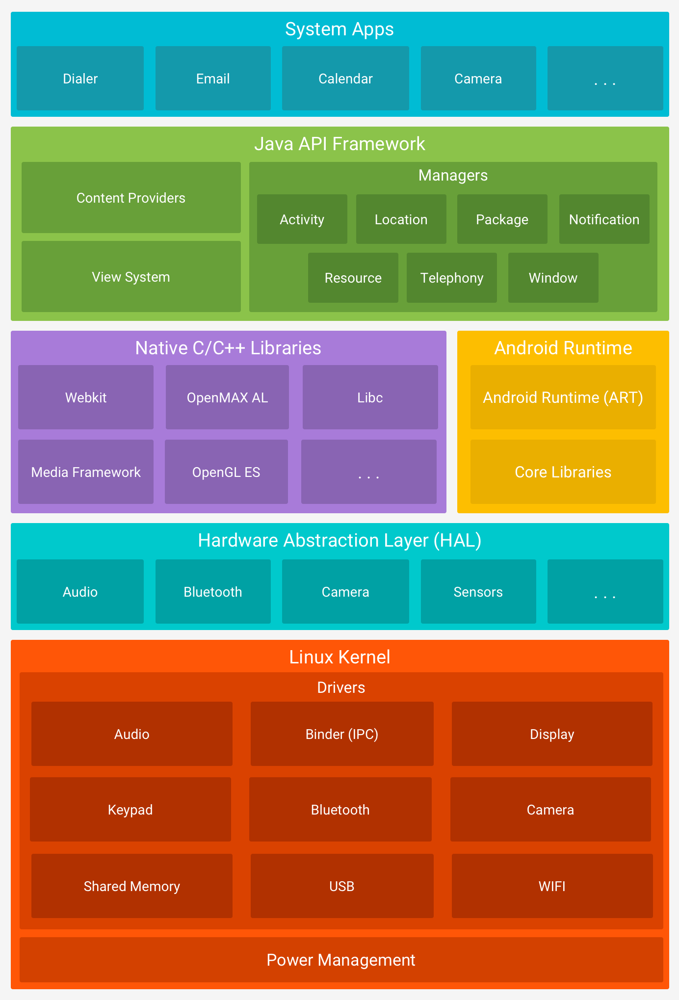

### 1.2 应用层（System Apps）

系统内置的应用程序以及非系统级的应用程序都属于应用层，负责与用户进行直接交互，通常都是用Java进行开发的。

### 1.3 应用框架层（Java API Framework）

**API** **(Application Programming Interface)**

应用框架层为开发人员提供了开发应用程序所需要的API，我们平常开发应用程序都是调用这一层所提供的API，当然也包括系统应用。这一层是由Java代码编写的，可以称为Java `Framework`。下面来看这一层所提供的主要组件：

| 名称                               | 功能描述                                                     |
| ---------------------------------- | ------------------------------------------------------------ |
| Activity Manager（活动管理器）     | 管理各个应用程序生命周期，以及常用的导航回退功能             |
| Location Manager（位置管理器）     | 提供地理位置及定位功能服务                                   |
| Package Manager（包管理器）        | 管理所有安装在Android系统中的应用程序                        |
| Notification Manager（通知管理器） | 使得应用程序可以在状态栏中显示自定义的提示信息               |
| Resource Manager（资源管理器）     | 提供应用程序使用的各种非代码资源，如本地化字符串、图片、布局文件、颜色文件等 |
| Telephony Manager（电话管理器）    | 管理所有的移动设备功能                                       |
| Window Manager（窗口管理器）       | 管理所有开启的窗口程序                                       |
| Content Provider（内容提供者）     | 使得不同应用程序之间可以共享数据                             |
| View System（视图系统）            | 构建应用程序的基本组件                                       |

### 1.4 统运行库层

从Android系统框架图上可以看出，系统运行库层分为两部分，分别是 C/C++ 程序库和 Android 运行时库，下面分别进行介绍：

（1）原生C/C++程序库

| 名称            | 功能描述                                                     |
| --------------- | ------------------------------------------------------------ |
| OpenGL ES       | 3D绘图函数库                                                 |
| Libc            | 从BSD继承来的标准C系统函数库，专门为基于嵌入式Linux的设备定制 |
| Media Framework | 多媒体库，支持多种常用的音频、视频格式录制和回放。           |
| SQLite          | 轻型的关系型数据库引擎                                       |
| SGL             | 底层的2D图形渲染引擎                                         |
| SSL             | 安全套接层，是为网络通信提供安全及数据完整性的一种安全协议   |
| FreeType        | 可移植的字体引擎，它提供统一的接口来访问多种字体格式文件     |

（2）Android运行时库

运行时库又分为核心库和ART(5.0系统之后，Dalvik虚拟机被ART取代)。核心库提供了Java语言核心库的大多数功能，这样开发者可以使用Java语言来编写Android应用。相较于JVM，Dalvik虚拟机是专门为移动设备定制的，允许在有限的内存中同时运行多个虚拟机的实例，并且每一个Dalvik 应用作为一个独立的Linux 进程执行。独立的进程可以防止在虚拟机崩溃的时候所有程序都被关闭。而替代Dalvik虚拟机的ART 的机制与Dalvik 不同。在Dalvik下，应用每次运行的时候，字节码都需要通过即时编译器转换为机器码，这会拖慢应用的运行效率，而在ART 环境中，应用在第一次安装的时候，字节码就会预先编译成机器码，使其成为真正的本地应用。

### 1. 5 硬件抽象层（HAL / HIDL)

硬件抽象层是位于操作系统内核与硬件电路之间的接口层，其目的在于将硬件抽象化，为了保护硬件厂商的知识产权，它隐藏了特定平台的硬件接口细节，为操作系统提供虚拟硬件平台，使其具有硬件无关性，可在多种平台上进行移植。 从软硬件测试的角度来看，软硬件的测试工作都可分别基于硬件抽象层来完成，使得软硬件测试工作的并行进行成为可能。通俗来讲，就是将控制硬件的动作放在硬件抽象层中。

### 1.6  Linux内核层

Android 的核心系统服务基于Linux 内核，在此基础上添加了部分Android专用的驱动。系统的安全性、内存管理、进程管理、网络协议栈和驱动模型等都依赖于该内核。

Android系统的五层架构就讲到这，了解以上的知识对以后分析系统源码有很大的帮助。

### 1.7 Android系统源码目录

学习Android系统源码，需要掌握系统源码目录。可以访问下面的连接来阅读系统源码

https://android.googlesource.com/

至于Android系统源码目录可以参考：

https://blog.csdn.net/weixin_45099376/article/details/126263379?ops_request_misc=%257B%2522request%255Fid%2522%253A%2522169415451716800184186134%2522%252C%2522scm%2522%253A%252220140713.130102334..%2522%257D&request_id=169415451716800184186134&biz_id=0&utm_medium=distribute.pc_search_result.none-task-blog-2~all~sobaiduend~default-2-126263379-null-null.142^v93^chatgptT3_1&utm_term=Android%20%E5%B9%B3%E5%8F%B0%E6%9E%B6%E6%9E%84&spm=1018.2226.3001.4187

**整体结构**

各个版本的源码目录基本是类似的，如果是编译后的源码目录，会多一个out文件夹，用来存储编译产生的文件。Android 11 的系统目录如下：


| Android源码根目录 | 描述                                               |
| ----------------- | -------------------------------------------------- |
| art               | 全新的ART运行环境                                  |
| bionic            | 系统C库                                            |
| bootable          | 启动引导相关代码                                   |
| build             | 存放系统编译规则及generic等基础开发包配置          |
| cts               | Android兼容性测试套件标准                          |
| dalvik            | dalvik虚拟机                                       |
| developers        | 开发者目录                                         |
| development       | 应用程序开发相关                                   |
| device            | 设备相关配置                                       |
| docs              | 参考文档目录                                       |
| external          | 开源模组相关文件                                   |
| frameworks        | 应用程序框架，Android系统核心部分，由Java和C++编写 |
| hardware          | 主要是硬件抽象层的代码                             |
| kernel            | Android的内核配置                                  |
| libcore           | 核心库相关文件                                     |
| libnativehelper   | 动态库，实现JNI库的基础                            |
| out               | 编译完成后代码输出在此目录                         |
| pdk               | Plug Development Kit 的缩写，本地开发套件          |
| platform_testing  | 平台测试                                           |
| prebuilts         | x86和arm架构下预编译的一些资源                     |
| sdk               | sdk和模拟器                                        |
| packages          | 应用程序包                                         |
| system            | 底层文件系统库、应用和组件                         |
| test              | 安卓供应商测试套件（VTS）实验室                    |
| toolchain         | 工具链文件                                         |
| tools             | 工具文件                                           |
| Makefile          | 全局Makefile文件，用来定义编译规则                 |
| vendor            | 厂商定制内容                                       |

可以看出，系统源码分类清晰，并且内容庞大且复杂。接下来分析packages中的内容，也就是应用层部分

**应用层部分**

应用层位于整个Android系统的最上层，开发者开发的应用程序以及系统内置的应用程序都是在应用层。源码根目录中的packages目录对应着系统应用层。它的目录结构如表

| packages目录 | 描述           |
| ------------ | -------------- |
| apps         | 核心应用程序   |
| inputmethods | 输入法目录     |
| modules      | 模块           |
| providers    | 内容提供者目录 |
| screensavers | 屏幕保护       |
| services     | 通信服务       |
| wallpapers   | 墙纸           |

从目录结构可以发现，packages目录存放着系统核心应用程序、第三方的应用程序和输入法等等，这些应用都是运行在系统应用层的，因此packages目录对应着系统的应用层。

 **应用框架层部分**

应用框架层是系统的核心部分，一方面向上提供接口给应用层调用，另一方面向下与C/C++程序库以及硬件抽象层等进行衔接。 应用框架层的主要实现代码在/frameworks/base和/frameworks/av目录下，其中/frameworks/base目录结构如表

| /frameworks/base目录           | 描述                      |
| ------------------------------ | ------------------------- |
| apct-tests                     |                           |
| apex                           |                           |
| api                            | 定义API                   |
| cmds                           | 重要命令：am、app_proce等 |
| config                         |                           |
| core                           | 核心库                    |
| data                           | 字体和声音等数据文件      |
| docs                           | 文档                      |
| drm                            |                           |
| errorprone                     |                           |
| graphics                       | 图形图像相关              |
| keystore                       | 和数据签名证书相关        |
| libs                           | 库                        |
| location                       | 地理位置相关库            |
| lowpan                         |                           |
| media                          | 多媒体相关库              |
| mime                           |                           |
| mms                            |                           |
| native                         | 本地库                    |
| nfc-extras                     | NFC相关                   |
| non-updatable-api              |                           |
| obex                           | 蓝牙传输                  |
| opengl                         | 2D/3D 图形API             |
| packages                       | 设置、TTS、VPN程序        |
| proto                          |                           |
| rs                             |                           |
| samples                        |                           |
| sax                            | XML解析器                 |
| services                       | 系统服务                  |
| startop                        |                           |
| telecomm                       |                           |
| telephony                      | 电话通讯管理              |
| test-/base/legacy/mock/runner/ | 测试工具相关              |
| tests                          | 测试相关                  |
| tools                          | 工具                      |
| wifi                           | wifi无线网络              |

  **C/C++程序库部分**

系统运行库层（Native)中的 C/C++程序库的类型繁多，功能强大，C/C++程序库并不完全在一个目录中，这里给出几个常用且比较重要的C/C++程序库所在的目录位置。

| 目录位置                                   | 描述                                             |
| ------------------------------------------ | ------------------------------------------------ |
| bionic/                                    | Google开发的系统C库，以BSD许可形式开源。         |
| /frameworks/av/media                       | 系统媒体库                                       |
| /frameworks/native/opengl                  | 第三方图形渲染库                                 |
| /frameworks/native/services/surfaceflinger | 图形显示库，主要负责图形的渲染、叠加和绘制等功能 |
| external/sqlite                            | 轻量型关系数据库SQLite的C++实现                  |

讲完 C/C++程序库部分，剩下的部分我们已经给出：Android运行时库的代码放在art/目录中。硬件抽象层的代码在hardware/目录中，这一部分是手机厂商改动最大的一部分，根据手机终端所采用的硬件平台会有不同的实现。

### 1.8 源码阅读

这里有Android10 的源码：https://www.androidos.net.cn/android/10.0.0_r6/xref

Android 7.1 到 Android 13 的系统源码：[http://aospxref.com](http://aospxref.com/)

下载源码：https://source.android.google.cn/docs/setup/download?hl=zh-cn

源码提交：https://android.googlesource.com/platform/manifest

https://blog.csdn.net/cjohn1994/article/details/127467165

## 第二章 编译运行

### 2.1 构建环境

官方说明，AOSP会定期在 Ubuntu LTS (14.04) 和 Debian 测试版本中对 Android 构建系统进行内部测试。其他大多数分发版本都应该具有所需的构建工具。只支持Linux操作系统上编译。

官网文档如下

https://source.android.com/docs/setup/start/initializing?hl=zh-cn

首先你要有一个Ubuntu虚拟机

1. 按照官方文档下载软件包

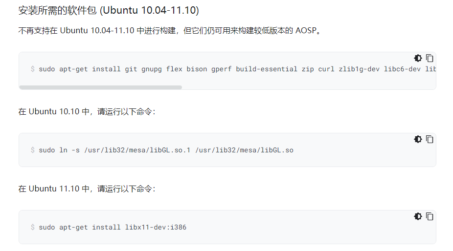

这里默认用的是美国镜像，所以我们要换成清华源的。

官网：https://mirrors.tuna.tsinghua.edu.cn/help/AOSP/

配置源的路径在/etc/apt/sources.list，先备份一个

```Java
sudo cp sources.;ist sources.list.bak
```

然后在sources.list第二行添加就行了

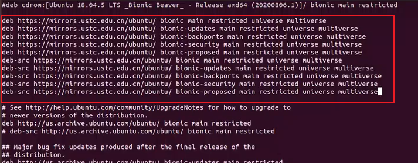

当下载出错的时候可以尝试换源，此时他会接着已经下载的部分下载，而不是重下

### 2.2 下载源码

下载源码需要安装Repo工具，Repo 启动器会提供一个 Python 脚本，因此使用Repo首先需要安装python。

```Java
sudo apt-get install python
```

然后看官方文档

https://source.android.com/docs/setup/download?hl=zh-cn#installing-repo

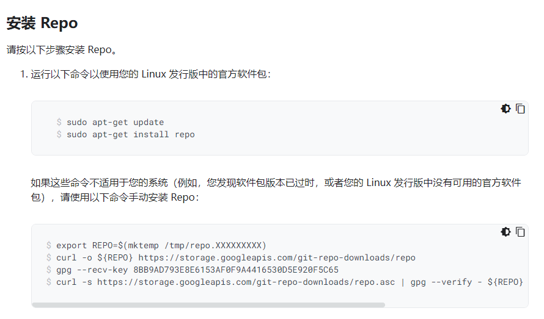

### 2.3 初始化Repo仓库

这里我们切换到清华源的文档，按照下面的部分操作

https://mirrors.tuna.tsinghua.edu.cn/help/AOSP/

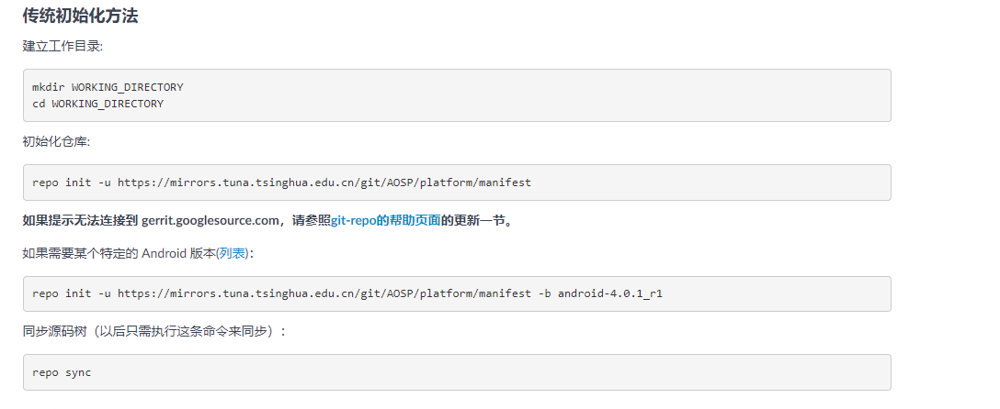

然后中途可能要设置git邮箱和用户名

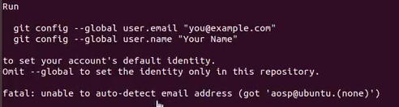

这里同步源码树建议使用：

```Java
repo sync -j4
```

数字太大会很占用资源

### 2.4 编译 Android

https://source.android.com/docs/setup/build/building?hl=zh-cn

1. 设置环境：首先进入bin目录，里面有envsetup.sh

```Java
source build/envsetup.sh
```

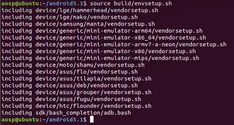

1. 选择目标：

先输入一个lunch 他会自动提示你可以选什么

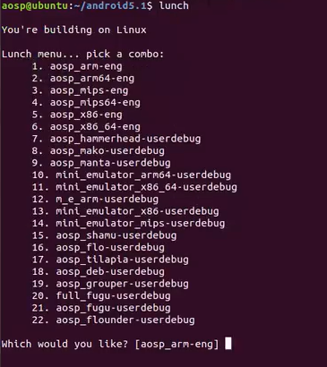

arch可以查看系统架构


printconfig可以查看

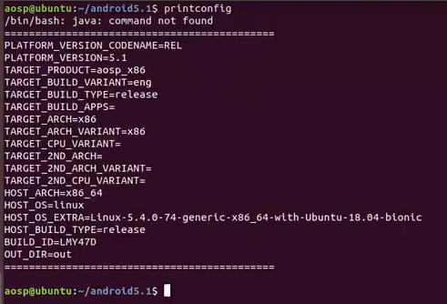

1. 构建代码：

make命令一般是线程数的两倍，核数的四倍，比如16线程就make -j32，如果不加的话，构建系统会自动选择最适合您系统的并行任务计数。

1. 安装JDK

当出现以下报错时，说明java没有配置好

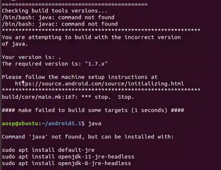

上面写了要求版本是1.7.x

如果按照官网的安装命令是没有1.7.x的，我们可以自己安装

下面这段报错的意思是需要OpenJDK7，但是我们的是Oracl的JDK，与要求不符 

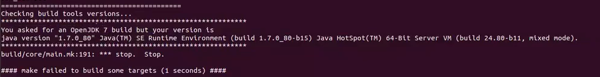

可以使用下面的命令找到报错产生的地方

```Java
find -name "*.mk" | xargs grep "You asked for an OpenJDK"
```

找到之后打开文件

```Java
vi ./build/core/main.mk
```

使用以下命令搜索

```Java
:/OpenJdk
```

然后会发现他其实是做了一个条件判断

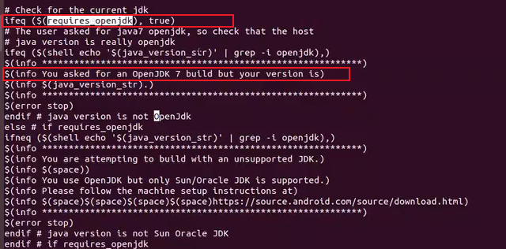

于是我们直接修改这个变量的值让他判断为真

```Java
find -name "*.mk"xargs grep "requires_openjdk"
```

找到之后进入文件，同样用:/定位到那一行，然后修改成false

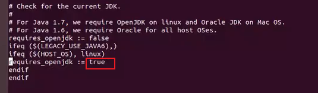

1. log输出到文件

我们在编译的时候会有很多log但是由于控制台的buffer限制我们不能看到全部的log。于是将log输出到文件里面更便于我们查看，

```Java
make -j16 2>&1 | tee build.log
```

比如遇到本地化的错误，除了可以在每次执行之前使用export LC_ALL=C之外，还可以把这段代码添加到envsetup.sh的第一行，这样就不用每次都输入了

由于安卓已经出来很多年了，所以大部分的错误往往搜索都能找到解决答案

当你修改了.mk文件之后记得使用 make clean清楚out目录下已经生成的文件

### 2.5 编译完成之后

编译完成之后，结果会在out/target/product里面


使用emulator有个报错

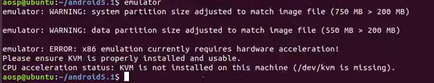

这是因为没有kvm加速器，安装一下就好了


## 第三章 AOSP团队开发模式

### 3.1 角色

feature owner 功能开发者。这里的项目指的是各个应用，各个模块。即包括上层应用，也包括framework各个模块，或者底层模块。ProjectOwner其实就是模块负责人。最后feature要集成到系统里的。

project owner 项目管理者。一般来说，以产品为单位，一个产品有一个project owner，这个人负责版本的编译，发布，出了问题找各个feature owner.

### 3.2 设备

feature owner 功能开发者。这里的项目指的是各个应用，各个模块。即包括上层应用，也包括framework各个模块，或者底层模块。ProjectOwner其实就是模块负责人。最后feature要集成到系统里的。

project owner 项目管理者。一般来说，以产品为单位，一个产品有一个project owner，这个人负责版本的编译，发布，出了问题找各个feature owner.

### 3.3 开发模式

其实开发模式的主要区别就是在个人电脑上进行编译，还是在服务器上进行编译。

1. 在个人电脑上进行编译 程序员的电脑要求配置高。

如果说是各自在自己的电脑进行开发，编译，则要求程序员的也就是feature owner的电脑配置比较高。cpu给个i7九代以上标压的，内存16g起，配固态硬盘512g。那么呢，feature owner在各自的电脑上进行编译，开发，测试。然后提交代码到代码服务器上。编译服务器按一定的计划自动地去拉取服务器上的代码进行编译发版本。对于feature owner来说，对代码服务器有拉取代码的动作，以及提交代码的动作。

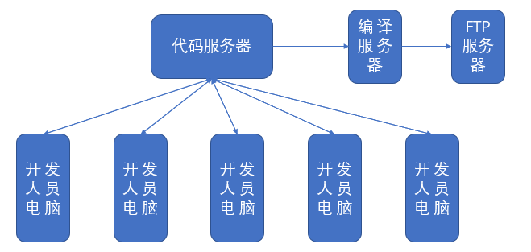

1. 在服务器上进行编译 程序员的电脑要求不高，基本上是编译的功能。

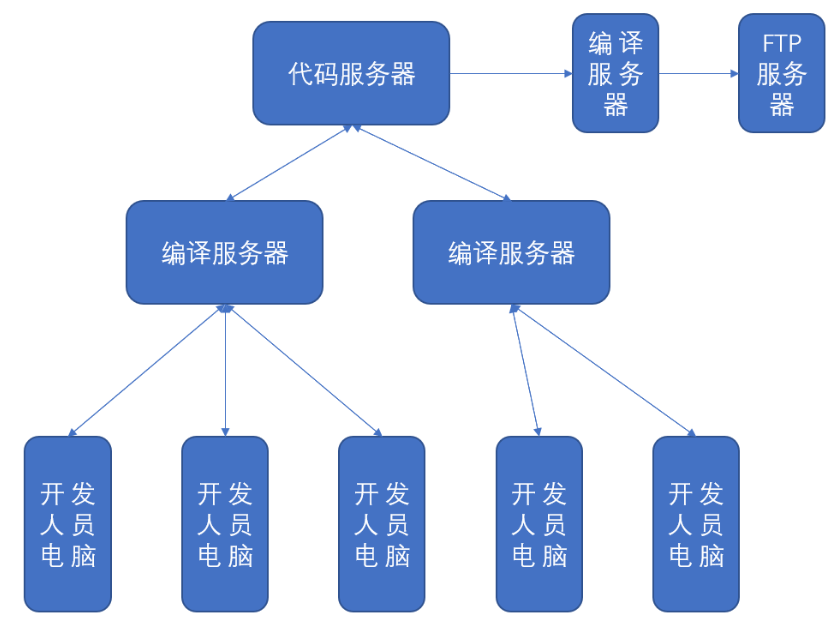

如果是使用服务器进行编译，则需要给每个feature owner开一个账号，分配一定的空间。可以自动化脚本完成，好处就是效率高有新人来了，直接一个命令就创建好了。新人收到邮件，就可以工作了。然后各自向代码服务器拉取代码，提交代码即可。

那怎么进行编辑呢？我们给服务器安装samba，然后在自己的windows电脑就可以浏览服务器上的内容了。复制一份，进行修改，对比代码过去。

### 3.4 samb服务

使用samb 在Windows上修改Linux的代码，这一部分略

https://notes.sunofbeach.net/pages/5b6f58/#%E5%AE%89%E8%A3%85

### 3.5  Repo是什么

- Repo是一个用Python编写程序
- Repo用来管理git库

从上面简短的两句话能获取到什么信息？首先Repo只是一个脚本程序，他并没有git那么庞大，能力也没有git强，代码库的主要管理责任大部分还是由git去负责；Repo比较像是高层老板，Git比较像是中层管理或者员工，Repo管理Git库就像老板管理员工；Repo只有一个，而git库可能会有很多。

repo forall -c git status可以看到你所有的修改

https://notes.sunofbeach.net/pages/326c87/#%E4%BB%80%E4%B9%88%E6%98%AFrepo

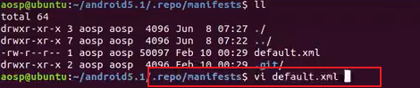

在repo的manifests中有一个defaault.xml 存放了所有的git

### 3.6  Git团队协作

现在的开发团队，大多都是用git管理代码版本。这里面的内容太多，因此不放在这里讲述，后面会单独的出文章讲述这个内容。

## 第四章 文件结构

### 4.1 m和mm以及mmm的区别

我们可以在envsetup.sh中看到我们的编译命令

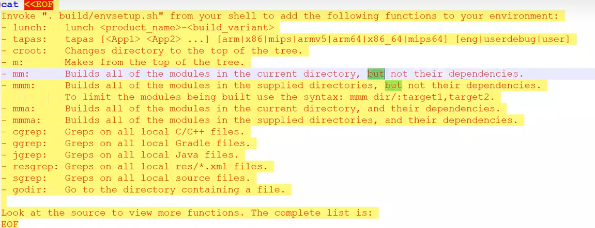

m是编译所有

mm是编译当前目录下的所有模块

mmm是指定目录编译所有模块

在out/target/product/generic_x86/system/目录下有app和priv_app两个文件夹，对应的就是我们的app的apk文件的存放目录，我们可以对其单独编译

只要进入相关的文件目录使用mm就可以了，

```Java
mm
```

或者

```Java
mmm packages/apps/Launcher2
```

### 4.2 Android.mk文件的结构

在学习这个玩意之前，如要你直接把头扎进去看每一行什么意思，那你只能一行一行地学习。

但是，作为聪明的程序员，肯定会找规律的。

我们观察各种Android.mk文件，就会发现规律了。

我们发现每一个模块都有一个Android.mk，这个其实就是来控制编译的。

我们可以发现第一句话都是

```Java
LOCAL_PATH:=$(call my-dir)
```

如果你想找到(call my-dir)这个方法到底是什么东西，可以用find命令

```Java
find./-name "*.mk" | xargs grep "my-dir" --color=auto
```

最后发现是这一段

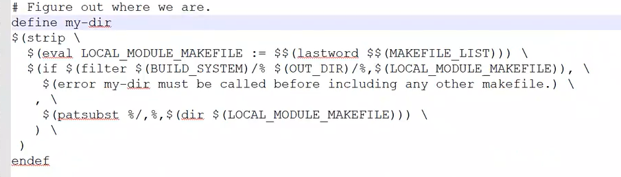

其实就是找到当前路径。

然后是

```Java
include $(CLEAR_VARS)
```

用同样的方法去找CLEAR_VARS会发现他其实是一个.mk

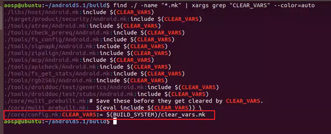

我们具体打开这个文件就会发现他的作用其实是清空所有LOCAL开头的变量（除了LOCAL_PATH）

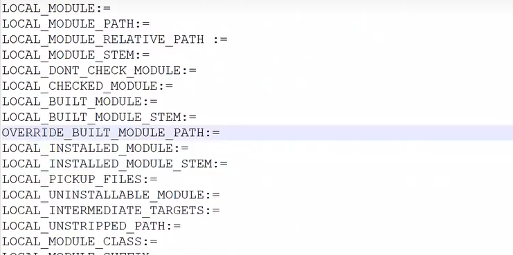

接着，就是设置各种变量了：LOCAL XXXX

设置完变量以的事，就开始去调用构建方法了，到底要编译成什么东西.

比如说，编译成apk

```Java
include $(BUILD_PACKAGE)
```

比如说，编译成可执行程序

```Java
include $(BUILD EXECUTABLE)
```

比如说编译成jar包

```Java
include $(BUILD STATIC JAVA LIBRARY)
```

然后下面这行命令的作用是找当前目录下所有的Android.mk文件，这行代码定义在了definition.mk文件里面 


下面是mk文件编译一个模块的结构


这只是编译一个模块，如果想我编译多个模块，是可以有多次BU儿DXX的

消除变量，重新设置即可。

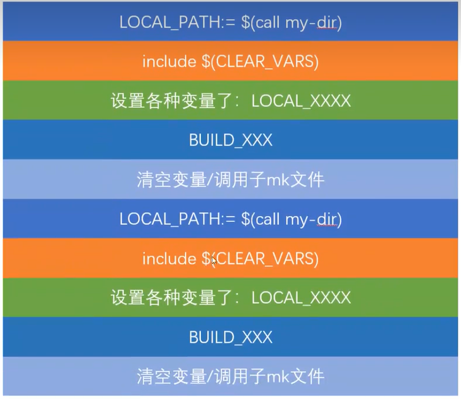

## 第五章 编译

### 5.1 编译so库何执行程序

###  5.2 通过Android.mk编译jar包

首先我们有一个lib库，里面有一个SobLog.java文件，这个文件被我们的app所依赖

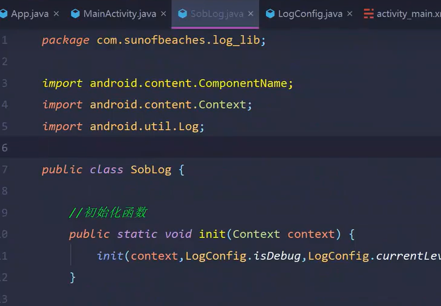

下面是我们的app

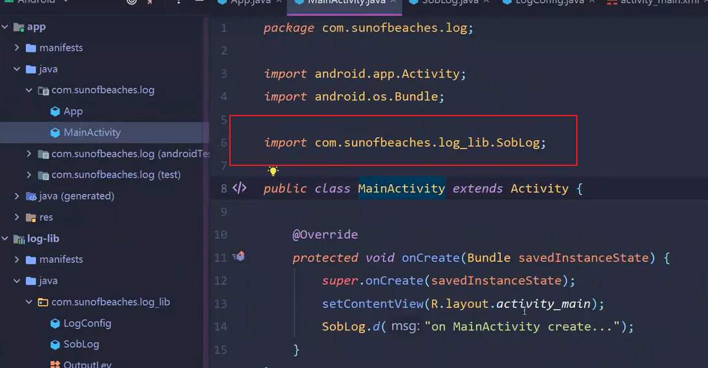

现在我们要编译app就势必要引入这个lab库

1. 首先把你的lib库全部打包复制到安卓源码的apps目录下（删掉不需要的gradle，git，build等相关文件），然后在lib库里面新建一个Android.mk文件（注意不要在Windows界面去创建，去Linux操作界面创建，否则容易出现格式错误）。
2. 编写mk文件，例如

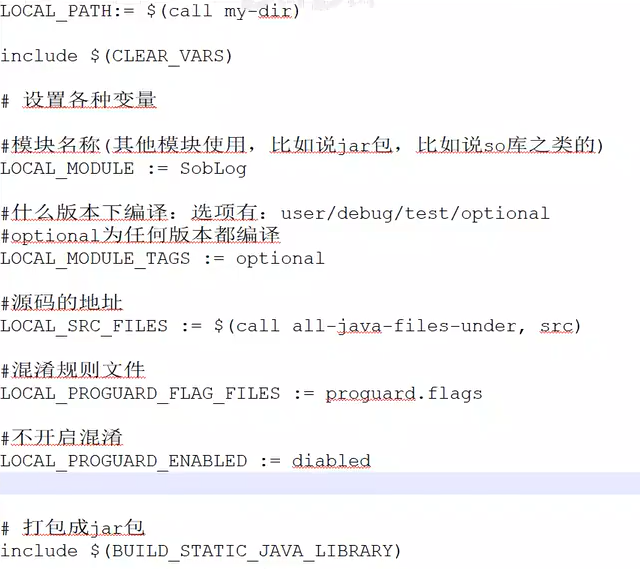

这里的源码地址指的是src目录下的所有java文件

1. 通过mm命令编译jar包，这时候输出的内容里面会提示你编译好的jat包放在哪里了

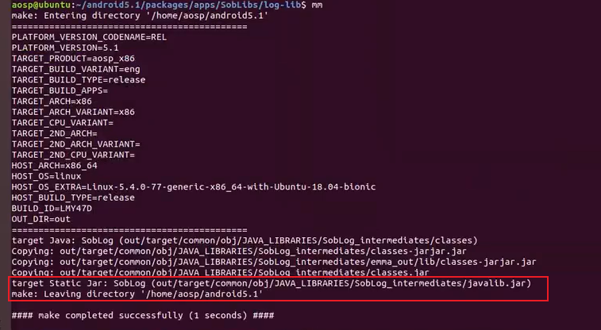

### 5.3 通过Android.mk编译apk

我们编译apk需要用到我们前面编译的jar包

流程是一样的，将源码拉过来（新建一个文件夹存放，放到apps文件夹下面），然后新建mk文件，修改mk文件，使用mm编译输出

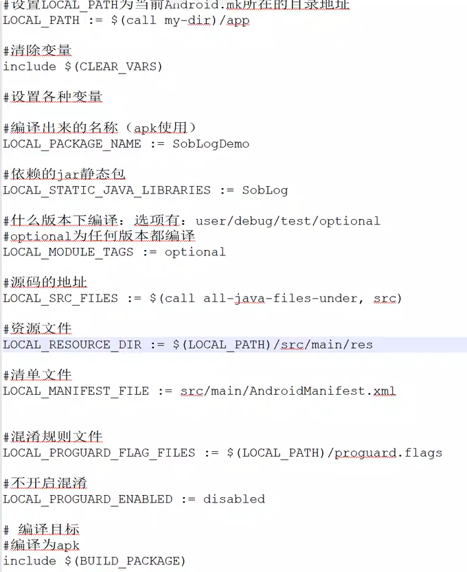

这里就需要添加依赖库了，LOCAL PACKAGE NAME :SobLogDemo，而且由于源码的src目录在app目录下，所以我们最前面的LOCAL_PATH需要有所修改

注意可能会有一些报错，也许是你的mk文件写的不对，注意观察报错信息解决报错。

而且这里资源文件路径不需要加$(LOCAL_PATH)这是因为这里加了会报错，他好像自动添加了当前路径

### 5.4 `BUILD_JAVA_LIBRARY`和`BULD_STATIC_JAVA_LIBRARY`的区别是啥？

BUILD JAVA LIBRARY编译出来的是共享库（动态库）

BUILD STATIC JAVA LIBRARY静态库

SobLogDemo,如果是以static依赖，把这个jar包，也会编译到自己的文件里

如果动态库的方式依赖，就不会编译到自己的pk里，加载的时候，会动态从系统中加载 。   

仔细观察二者的编译信息，就会发现，动态库除了会将jar包放到指定位置以外还会install一份到framework里面去

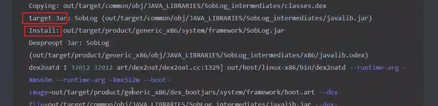

编译时：

ar包以共享的方式编译，而pk以静态库的方式依赖，就找不到相关的类

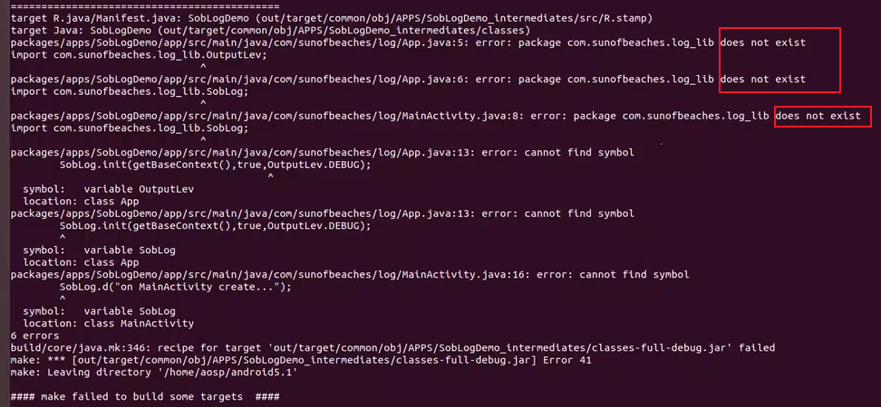

jar包以静态方式编泽输出，而apk以共享的方式添加依赖(可以编译通过，但是运行是有问题的，找不到对应的类）


使用logcat查看

运行时：

jar包以静态方式编译输出，而apk以共享的方式添加依赖（可以编译通过，但是运行是有问题的，找不到对应的类)

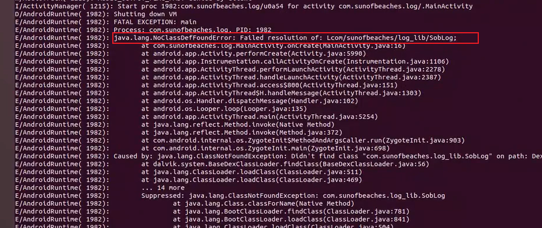

当我们偏译的jar包是静态的，那apk应该是静态依赖，这样子apk内部就有一份。

如果是共享的，那么就以共享的方式依赖，apk内部没有，但是加载的时候会去系统里头找。

什么时候把ja包编译成请静态库，什么时候编译成洪享库

共享库在使用的时候加载，减小体积

静态库是编译到pk里，加载速度会比较快，体积会大一点点。|

### 5.5 拆包查看apK是否包含依赖库

可以使用Android Killer 工具对apk进行反编译。

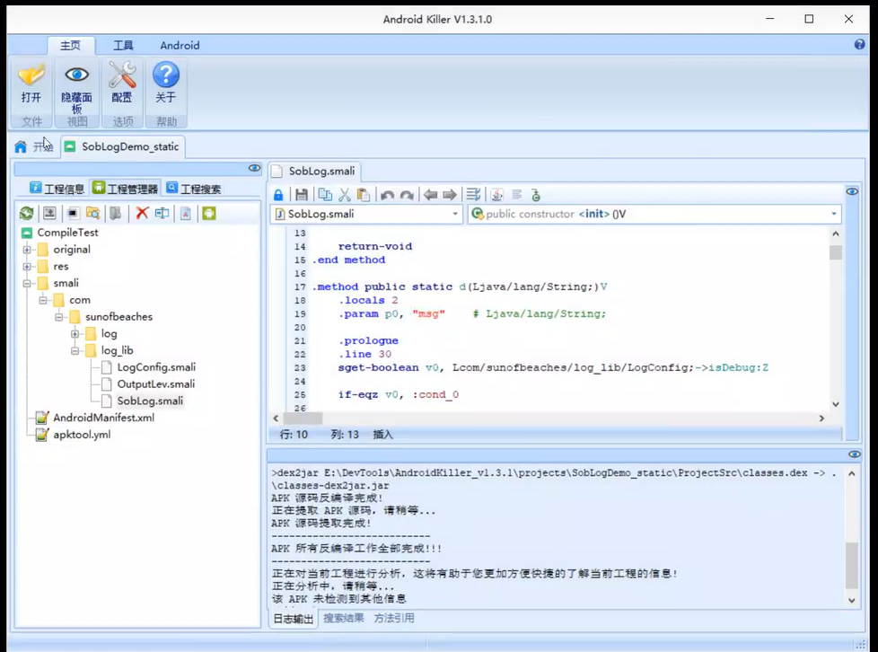

### 5.6 编译so库和执行程序

编译so库（这里里面有一个.cpp文件和一个.h文件）

以下是mk文件

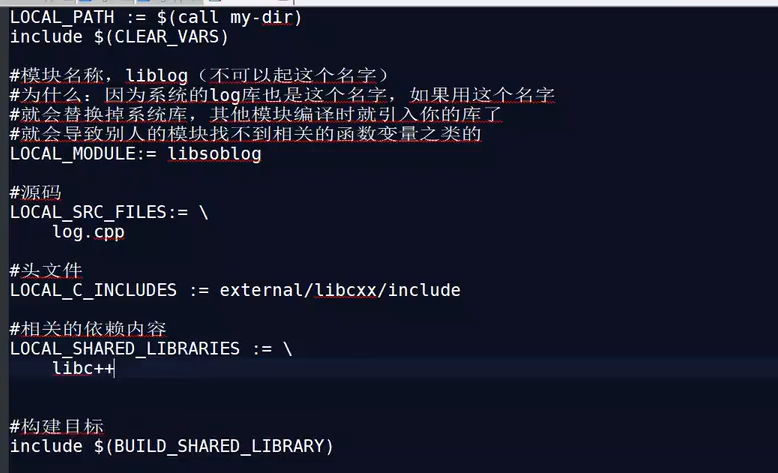

然后我们就会在lib里面得到.so的共享库

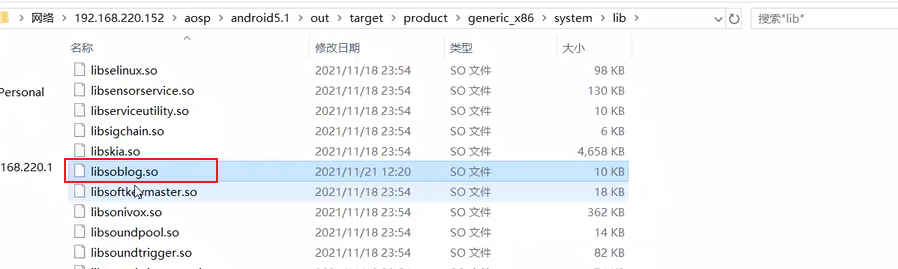

### 5.7 编译可执行程序

首先文件结构如下


然后mk文件

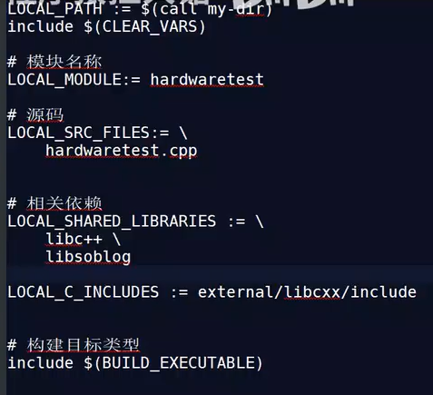

编译之后就可以运行了

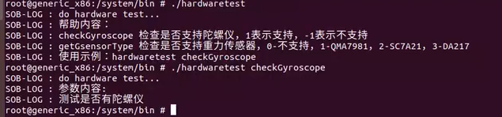

从输出的Log上看，我们可以知道它在这里：out/target/product/generic x86/system/bin/hardweartest

编译到system/bin目录下，可是，我们现在的镜像并没有这个程序

所以我们要重新打包镜像

如何运行：

1. 更新img镜像，

```Java
make snod
```

1. 将模拟器跑起来，adb shell 进去 ，然后进入system/bin目录下，就可以看到有我们的可执行程序

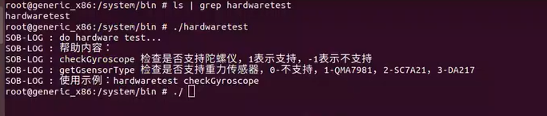

1. 然后使用./执行程序就好

### 5.8 Android.mk里的目号等号以及加号等号


冒号等号是直接复制，可以空格隔开，也可以加反斜杠换行在下一行写上

而加号等号是添加，注意如果在加号等号下面又来一行冒号等号，会将加号等号覆盖掉

以上我们只是手动编译出来的，然后打包镜像。

如果我们直接从无到有，如何告诉系统我们的库是需要编译的呢？

### 5.9 编译过程-添加编译目标

1. 展示编译目标列表

首先我们进到build目录下的envsetup.sh文件里面查看`lunch函数`都干了什么

```Shell
function lunch()
{
    #定义一个结果变量
    local answer
    #如果lunch后面的第一个参数不为空，如果没有输出lunch_menu
    #print_lunch_menu这个函数也是可以在这个脚本里面找到的
    if [ "$1" ] ; then
        answer=$1
    else
        print_lunch_menu
        echo -n "Which would you like? [aosp_arm-eng] "
        read answer
    fi
```

这里首先读取你的lunch命令有没有跟参数嘛，因为你要选择构建目标列表，如果没有参数他会给你显示lunch_menu来供你选择，然后再将你选择好的变量传给answer参数

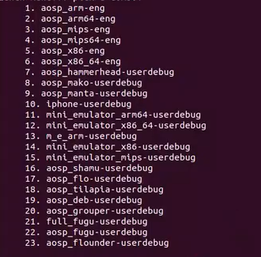

现在我们看看`print_lunch_menu`这个函数里面是什么

```Shell
function print_lunch_menu()
{
    local uname=$(uname)
    #构建目标的内容从这里来的
    local choices=$(TARGET_BUILD_APPS= get_build_var COMMON_LUNCH_CHOICES)
    echo
    echo "You're building on" $uname
    echo
    echo "Lunch menu... pick a combo:"

    local i=1
    local choice
    for choice in $(echo $choices)
    do
        echo "     $i. $choice"
        i=$(($i+1))
    done

    echo
}
```

可以看到我们构建目标的列表（`lunch_menu`）从for循环这里来的，`COMMON_LUNCH_CHOICES`是个关键的变量。所以我们继续搜索`COMMON_LUNCH_CHOICES` 会发现

```Shell
function add_lunch_combo()
{
    if [ -n "$ZSH_VERSION" ]; then
        echo -n "${funcfiletrace[1]}: "
    else
        echo -n "${BASH_SOURCE[1]}:${BASH_LINENO[0]}: "
    fi
    echo "add_lunch_combo is obsolete. Use COMMON_LUNCH_CHOICES in your AndroidProducts.mk instead."
}
```

这里提示我们说 `add_lunch_combo` 函数不再建议使用，而应该在 `AndroidProducts.mk` 文件中使用 `COMMON_LUNCH_CHOICES`。

于是我们搜索一下这个东西

```Shell
find ../ -name "*.mk" | xargs grep "COMMON_LUNCH_CHOICES" --color=auto
```

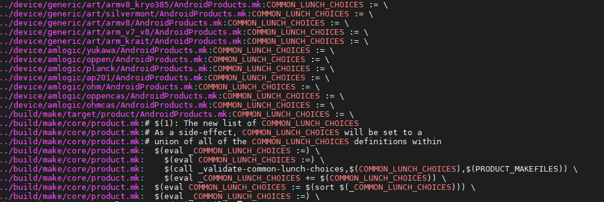

随便找一个进去看看

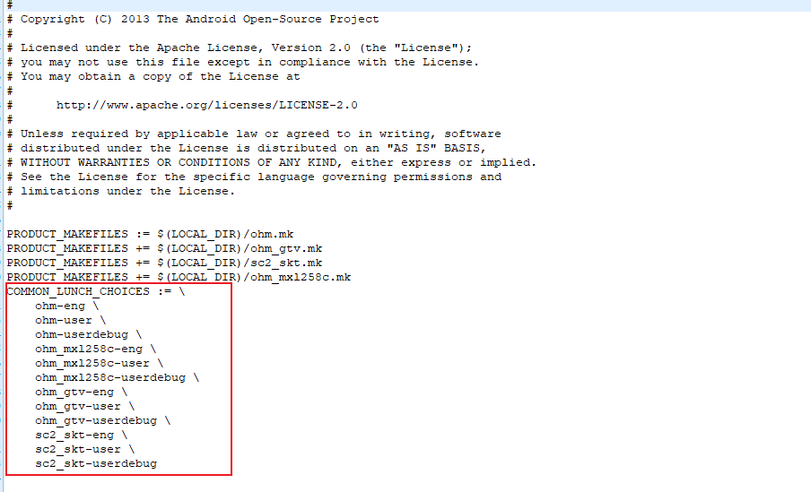

原来是在这里添加编译目标 ，明白了

1. 读取你选择的编译目标列表,并将结果储存在`selection` 里面

```Shell
    local selection=

    if [ -z "$answer" ]
    then
        selection=aosp_arm-eng
    elif (echo -n $answer | grep -q -e "^[0-9][0-9]*$")
    then
        local choices=($(TARGET_BUILD_APPS= get_build_var COMMON_LUNCH_CHOICES))
        if [ $answer -le ${#choices[@]} ]
        then
            # array in zsh starts from 1 instead of 0.
            if [ -n "$ZSH_VERSION" ]
            then
                selection=${choices[$(($answer))]}
            else
                selection=${choices[$(($answer-1))]}
            fi
        fi
    else
        selection=$answer
    fi
```

这段代码应该很好理解，检测你输入的是什么数字，也就是你选择的编译目标。然后将值存放在`selection` 里面

1. 处理字符串 `selection` 中包含的信息，并将其拆分为 `product`、`variant` 和 `version` 三个变量。

```Bash
product=${selection%%-*} # Trim everything after first dash
    variant_and_version=${selection#*-} # Trim everything up to first dash
    if [ "$variant_and_version" != "$selection" ]; then
        variant=${variant_and_version%%-*}
        if [ "$variant" != "$variant_and_version" ]; then
            version=${variant_and_version#*-}
        fi
    fi
```

1. 检查变量 `$product` 是否为空，将从前面提取的 `product`、`variant` 和 `version` 的值赋给相关的环境变量。

```Bash
if [ -z "$product" ]
    then
        echo
        echo "Invalid lunch combo: $selection"
        return 1
    fi

    TARGET_PRODUCT=$product \
    TARGET_BUILD_VARIANT=$variant \
    TARGET_PLATFORM_VERSION=$version \
    build_build_var_cache
    if [ $? -ne 0 ]
    then
        return 1
    fi
    # 下面这段是赋值给环境变量的
    export TARGET_PRODUCT=$(get_build_var TARGET_PRODUCT)
    export TARGET_BUILD_VARIANT=$(get_build_var TARGET_BUILD_VARIANT)
    if [ -n "$version" ]; then
      export TARGET_PLATFORM_VERSION=$(get_build_var TARGET_PLATFORM_VERSION)
    else
      unset TARGET_PLATFORM_VERSION
    fi
    export TARGET_BUILD_TYPE=release
    

    echo
```

`export` 是一个用于在 Unix/Linux 环境中设置环境变量的命令。环境变量是一些特殊的变量，它们存储了系统和应用程序运行所需的配置信息。`export` 命令的主要作用是将一个变量标记为环境变量，以便它在当前进程和其子进程中都可用。

1. 调用其他函数

```Bash
    set_stuff_for_environment
    printconfig
    destroy_build_var_cache
```

1. `set_stuff_for_environment()` 函数：
   1. `setpaths` 和 `set_sequence_number` 是函数内部的其他函数调用，它们可能用于设置路径和序列号等环境变量。
   2. `export ANDROID_BUILD_TOP=$(gettop)` 设置了名为 `ANDROID_BUILD_TOP` 的环境变量，并将其值设置为通过 `gettop` 函数获取的值。这个变量通常用于指示 Android 源代码的根目录。
   3. `export GCC_COLORS='error=01;31:warning=01;35:note=01;36:caret=01;32:locus=01:quote=01'` 设置了名为 `GCC_COLORS` 的环境变量，用于配置 GCC 编译器输出的颜色。它定义了一系列颜色格式，用于突出显示编译器的错误、警告等信息。
2. `printconfig()` 函数：
   1. `local T=$(gettop)` 设置了名为 `T` 的局部变量，其值为通过 `gettop` 函数获取的值。`gettop` 函数可能用于获取 Android 源代码树的顶层目录。
   2. 接下来的条件语句 `if [ ! "$T" ]; then ...` 用于检查变量 `T` 是否为空。如果 `T` 为空，说明无法定位源代码树的顶层目录，那么函数会输出一条错误消息。
   3. `get_build_var report_config` 是函数内部的另一个函数调用，它可能用于获取某个构建配置的信息。具体的操作需要查看函数 `get_build_var` 的定义。
3. `destroy_build_var_cache()` 函数：
   1. 这个函数的主要作用是清除构建相关的缓存环境变量。
   2. `unset BUILD_VAR_CACHE_READY` 取消了名为 `BUILD_VAR_CACHE_READY` 的环境变量的设置。
   3. 随后的循环通过 `unset` 命令取消了一系列环境变量的设置，这些环境变量的名称类似 `var_cache_` 和 `abs_var_cache_`，它们可能是用于缓存构建相关变量的中间变量。
   4. 这个函数的目的似乎是在某些情况下清理和重置与构建相关的缓存，以确保构建环境的一致性。

### 5.10 make编译入口

我们Make文件总共有三类

第一类是build目录下或者vendor下的，属于控制我们编译的一个框架，也就是控制编译的流程。

第二类是device目录下的，跟产品主板有关的，

第三类是跟应用有关的，编译jar包，编译可执行文件，编译apk之类的，Android.mk

首先应该是我们根目录下的Makefile文件，我们可以查看里面的内容

```Bash
### DO NOT EDIT THIS FILE ###
include build/make/core/main.mk
### DO NOT EDIT THIS FILE ###
```

很简单，里面指示了我们的.mk文件的路径

那现在我们进入到mian.mk里面去看看可以发现包括了很多的mk

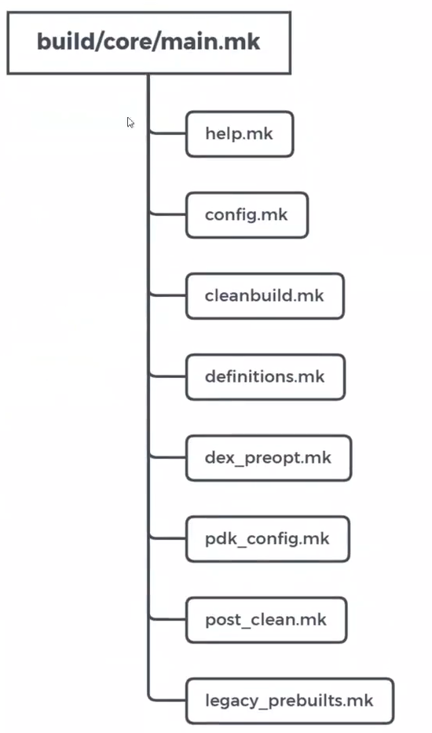

实际上里面包含的mk文件远不止这点，子mk里面又包含了子mk，是一个非常庞大的树结构

### 5.11 安卓产品的加载

如图下所示，main.mk文件会加载config.mk文件

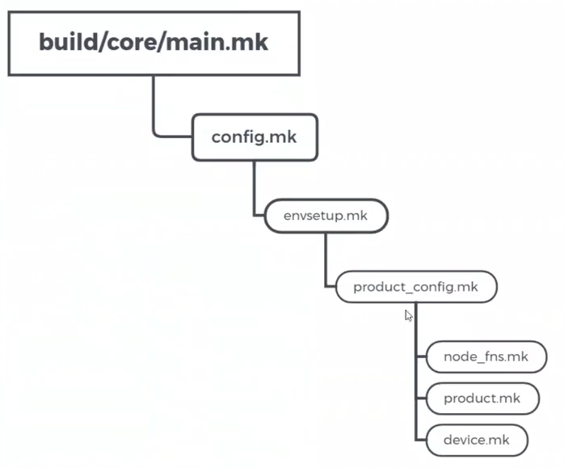

config.mk文件里面又会加载product_config.mk文件,这个文件是用来加载我们的产品的。我们现在来研究一下这个文件。

```Bash
define _find-android-products-files
$(file <$(OUT_DIR)/.module_paths/AndroidProducts.mk.list) \
  $(SRC_TARGET_DIR)/product/AndroidProducts.mk
endef
```

SRC_TARGET_DIR可以寻找到定义，这里是将build/target/product下面的所有AndroidProducts.mk找出来

### 5.12 BoardConfig.mk文件是如何被加载的

首先是main.mk文件，里面包括了config.mk,config.mk里面包含了envsetup.mk，在这个文件里面就加载了BoardConfig.mk，

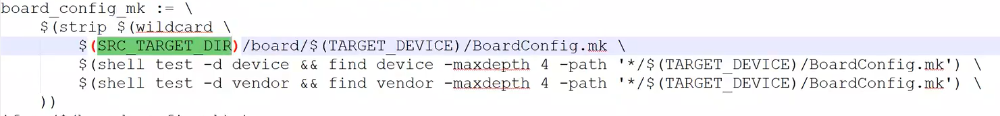

第一行代码就会从我们选择的产品的目录下加载BoardConfig.mk

第二行和第三行会深入device目录和vendor目录找四层，找到所有的BoradConfig.mk

后面会进行判断，如果为空会爆错，如果不止一个会爆异常

### 5.13 添加我们自己的产品

首先要让lunch菜单有我们的产品显示，通过搜索envsetup.sh可以发现，添加产品的地方在AndroidProducts.mk下

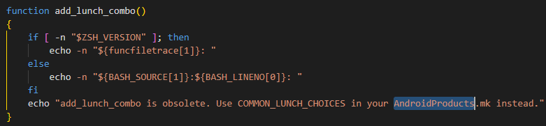

现在我们进入aml-s905x4-androidr/device/amlogic/ohm目录下的AndroidProducts.mk查看发现果然在这里

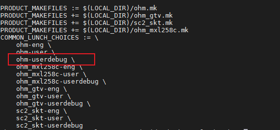

因此我们需要在这里加入自己的产品。比如产品名叫“suzhe”

首先我们要先在该文件的同级目录下加一个mk文件。suzhe.mk（现在里面是空的，只有一个vendorsetup.sh）

然后再AndroidProducts.mk里面引入suzhe.mk再加suzhe-userdebug，就可以添加到lunch的目录了

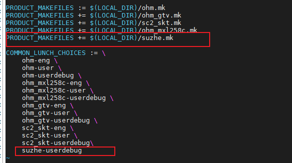

## 第六章 系统启动流程（一）之Android系统启动流程

参考文档：

首先看下面这张图

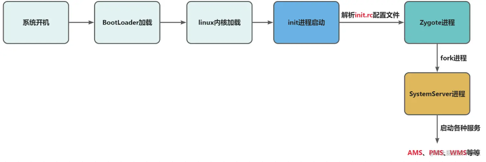

### 1、按Power键启动系统

板子上电后，芯片从固化在 `ROM` 里预设的代码`(BOOT ROM)`开始执行， `BOOT ROM` 会加载 `BootLoader` 到 `RAM`，然后把控制权交给 `BootLoader`。

### 2、引导程序BootLoader(系统启动加载器)

引导程序是Android操作系统被拉起来之前的一个程序，它的作用就是把android系统拉起运行,也就是把linux内核启动。

`BootLoader`并不隶属于 Android 系统，它的作用是初始化硬件设备，加载内核文件等，为 Android 系统内核启动搭建好所需的环境（可以把 `BootLoader`类比成 PC 的 `BIOS`）。`BootLoader`是针对特定的主板与芯片的（与 CPU 及电路板的配置情况有关），因此，对于不同的设备制造商，它们的引导程序都是不同的。目前大多数系统使都是使用 `uboot`来修改的。

`BootLoader`引导程序一般分两个阶段执行：

1. 基本的**硬件初始化**，目的是为下一阶段的执行以及随后的 kernel 的执行准备好一些基本的硬件环境。这一阶段的代码通常用汇编语言编写，以达到短小精悍的目的。
2. **Flash 设备初始化**，设置网络、内存等等，将 kernel 映像和根文件系统映像从 Flash 上读到 RAM 空间中，然后启动内核。这一阶段的代码通常用 C 语言来实现，以便于实现更复杂的功能和取得更好的代码可读性和可移植性。

实际上 `BootLoader`还要根据 misc 分区的设置来决定是要正常启动系统内核还是要进入 recovery 进行系统升级，复位等工作。

### 3、Linux内核启动

当 Linux 内核启动后会初始化各种软硬件环境，加载驱动程序，挂载根文件系统(/)，内核启动完成后，它会在根文件系统中寻找 ”init” 文件，然后启动 `init` 进程。第一个加载的进程就是 `init 进程`。

### 4、init进程启动

init进程是Linux系统中`用户空间的第一个进程`，进程号固定为`1`，我们可以说它是 root 进程或者所有进程的父进程。源码路径为: `Android/system/core/init/`。内核启动后，在用户空间启动init进程，并调用init中的`main()方法`。

**init进程的主要作用：**

1. 挂载虚拟文件系统：如 /sys、/dev、/proc
2. 启动 property 服务
3. 启动 SELinux
4. 解析`init.rc`文件。
5. 守护解析的服务，守护的关键服务被杀掉后，会马上又重新起来，有些关键服务被杀掉后，不能重新起来的，就会导致手机重启。

### 5、init.rc配置文件的解析

`init.rc`是一个非常重要的配置文件，它是由Android初始化语言（Android Init Language）编写的脚本，系统的一些关键服务，就是通过解析它后，得到需要启动的关键服务（如`zygote`、`servivemanager`等）

`init.rc`的内容比较复杂，干的活很多。比如文件系统的挂载(mount_all)，各种 Native 系统服务的启动。我们常见的在`init.rc`中启动的系统服务有 servicemanager, adbd, mediaserver, zygote, bootanimation 等。我们在做系统开发的时候，也经常会创建一些 Native 服务，自然也是需要在 init.rc 里面配置启动的。关于 `init.rc` 的配置后续再讲解。

### 6、启动zygote进程

上面提到 init 进程在解析`init.rc`时，会创建 `zygote`进程，它是 Android 系统最重要的进程之一。Android中大多数应用进程和系统进程都是通过Zygote进程来生成（fork）。因此，zygote 是 Android 系统所有应用的父进程。zygote 进程的实际执行文件并不是 zygote，而是 /system/bin/app_process。

源码路径为: `Android/frameworks/base/cmds/app_process/`。　

它会调用 `frameworks/base/core/jni/AndroidRuntime.cpp`　提供的接口启动 java 层的代码　`frameworks/base/core/java/com/android/internal/os/ZygoteInit.java`。至此，我们就进入到了 java 的世界。

#### Zygote进程启动

Zygote的启动也要区分对待:

```Kotlin
/system/core/rootdir/init.rc
import /init.${ro.zygote}.rc
```

根据系统属性ro.zygote的具体值，加载不同的描述Zygote的rc脚本。譬如firely rk3399包含的文件：

```Bash
init.zygote32.rc
init.zygote32_64.rc
init.zygote64.rc
init.zygote64_32.rc
```

以init.zygote64.rc为例，相关脚本如下：

```Bash
service zygote /system/bin/app_process64 -Xzygote /system/bin --zygote --start-system-server
    class main
    priority -20
    user root
    group root readproc
    socket zygote stream 660 root system
    onrestart write /sys/android_power/request_state wake
    onrestart write /sys/power/state on
    onrestart restart audioserver
    onrestart restart cameraserver
    onrestart restart media
    onrestart restart netd
    onrestart restart wificond
    writepid /dev/cpuset/foreground/tasks
```

从路径来看，Zygote所在的应用程序名称叫"app_process64",

- zygote 就是service的名称
- /system/bin/app_process64  应用程序路径，即Zygote所在的应用进程
- -Xzygote /system/bin --zygote --start-system-server 为传递给app_process的参数，后面的分析会看到参数--zygote被 app_process 用来启动Zygote的选项， --start-system-server 会被作为参数传递给Zygote的ZygoteInit.

可以简单地用下面这幅图描述Zygote的启动

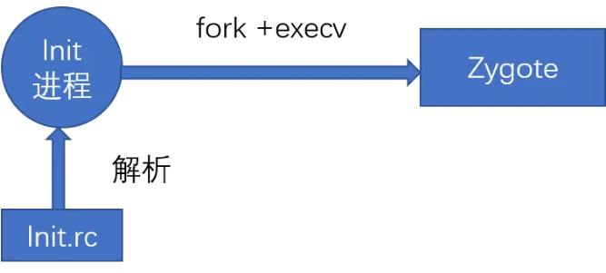

#### Zygote启动时做了什么

Zygote启动主要经历了两部分：

- native世界
- java世界

#### **native世界:**

从Zygote的rc脚本我们知道， Zygote是通过app_process启动，入口就是app_process的main函数

 frameworks/base/cmds/app_process/app_main.cpp

简单来说，Zygote在native世界做的主要是以下几步：

- 启动Android虚拟机
- 注册Android的JNI函数
- 进入java世界

```C
int main(int argc, char* const argv[])
{
    AppRuntime runtime(argv[0], computeArgBlockSize(argc, argv));

    // Parse runtime arguments.  Stop at first unrecognized option.
    bool zygote = false;
    bool startSystemServer = false;
    bool application = false;
    String8 niceName;
    String8 className;
   
    ++i;  // Skip unused "parent dir" argument.
    while (i < argc) {
        const char* arg = argv[i++];
        if (strcmp(arg, "--zygote") == 0) {
            zygote = true;
            niceName = ZYGOTE_NICE_NAME;
        } else if (strcmp(arg, "--start-system-server") == 0) {
            startSystemServer = true;
        } else if (strcmp(arg, "--application") == 0) {
            application = true;
        } else if (strncmp(arg, "--nice-name=", 12) == 0) {
            niceName.setTo(arg + 12);
        } else if (strncmp(arg, "--", 2) != 0) {
            className.setTo(arg);
            break;
        } else {
            --i;
            break;
        }
    }

    if (zygote) {
        runtime.start("com.android.internal.os.ZygoteInit", args, zygote);
    } else if (className) {
        runtime.start("com.android.internal.os.RuntimeInit", args, zygote);
    } else {
        
    }
    
```

这里有3点，

1. 创建了AndroidRuntime对象， 这里面主要的动作就是**启动****虚拟机**
2. 解析传进来的参数 。这个场景中--zygote 指定了app_process接下来将启动"ZygoteInit",  并传入-start-system-server
3. 在虚拟机中运行ZygoteInit ， ZygoteInit是java写的，即这一步**Zygote就从native世界进入到了java世界**

#### **java世界：**

Zygote的java世界入口是ZygoteInit 的main函数

frameworks/base/core/java/com/android/internal/os/ZygoteInit.java

```C
 public static void main(String argv[]) {
            zygoteServer.registerServerSocket(socketName);   
            // In some configurations, we avoid preloading resources and classes eagerly.
            // In such cases, we will preload things prior to our first fork.
            if (!enableLazyPreload) {
                preload(bootTimingsTraceLog);  //预加载各类资源
            } else {
                Zygote.resetNicePriority();
            }

           if (startSystemServer) {
                Runnable r = forkSystemServer(abiList, socketName, zygoteServer);

                // {@code r == null} in the parent (zygote) process, and {@code r != null} in the
                // child (system_server) process.
                if (r != null) {
                    r.run();
                    return;
                }
            }

            caller = zygoteServer.runSelectLoop(abiList);
}
```

ZygoteInit的主函数主要完成几件事情：

- 注册一个socket Zygote 作为孵化器，跟其他进程间的通讯不是通过binder而是通过socket。一旦有新进程需要运行，系统（ ActivityManagerService 的应用启动请求）会通过这个Socket（完整的名称为ANDROID_SOCKET_zygote）跟Zygote通讯，由zygote完成进程孵化过程
- 预加载各类资源 函数preload用于加载虚拟机运行时所需的各类资源。加载 Android framework 中的 class、res（drawable、xml信息、strings）到内存。Android 通过在 zygote 创建的时候加载资源，生成信息链接，再有应用启动，fork 子进程和父进程共享信息，不需要重新加载，同时也共享 VM。
- 启动System Server，监听 socket，当有启动应用请求到达，fork 生成 App 应用进程。
- 进入Loop循环

#### 其他问题

**为何用socket而不是binder**

Zygote是通过fork来创建新进程的，而binder是多线程的，有可能造成死锁。

在 POSIX 标准中，fork 的行为是这样的：复制整个用户空间的数据（通常使用 copy-on-write 的策略，所以可以实现的速度很快）以及所有系统对象， 然后仅复制当前线程到子进程。这里：所有父进程中别的线程，到了子进程中都是突然蒸发掉的。

假如父进程在获取到锁的情况下，fork了一个子进程。子进程的内存中，这个锁的状态是上锁状态。子进程仅运行了fork所在的这个线程，其它线程没有运行，当它尝试获取锁时，就发生了死锁

**为何要通过Zygote来孵化程序，而不是由其他进程直接创建**

主要有两个好处：

- 缩短应用的启动时间 因为在 Android 中，每个应用都有对应一个虚拟机实例（VM）为应用分配不同的内存地址。如果 Android 系统为每一个应用启动不同的 VM 实例，就会消耗大量的内存以及时间。因此，更好的办法应当是通过创建一个虚拟机进程，由该 VM 进程预加载以及初始化核心库类，然后，由该 VM 进程 Fork 出其他虚拟机进程，这样就能达到代码共享、低内存占用以及最小的启动时间，而这个 VM 进程就是 zygote。
- 优化共享内存 所有虚拟机都是从Zygote fork出来的，所以特么能够享受到由内核实现的内存共享的优势。比如Zygote预加载的各类资源，比如theme主题图片，所有的进程都是共享的，在物理内存中只需要保存一份。

### 7、sysytem_server进程启动

与 Zygote 进程一样，SystemServer 进程同样是 Android 系统中最重要的进程之一。

源码路径为: `Android/frameworks/base/services/java/com/android/server/SystemServer.java`。

在Android 系统中大约有 80 个系统服务，都是由`SystemServer`进程来创建的。作为一个应用开发者来说，需要特别熟悉的大概有这么四个: `ActivityManagerService`、`WindowManagerService`、`PackageManagerService` 和`InputManagerService`，也就是我们常说的 `AMS`、`WMS`、`PMS` 和`IMS`。

系统服务启动后都会交给`ServiceManager`来管理，即像`AMS`、`WMS`、`PMS`等服务，是在`System_Server`进程里的（创建的），但是却交给了`ServiceManager`去管理。

### 8、Launcher 的启动

Launcher 的启动比较复杂，而且不同版本的 Android 系统启动逻辑可能也不太一样，所以这里就不具体讨论，后续再专门讨论。但我们可以大概说明一下启动的策略。

我们知道`SystemServer`进程再启动的过程中会启动`PackageManagerService`，`PackageManagerService`启动后会将系统中的应用程序安装完成。`SystemServer`启动完所有的服务后，会调用各服务的 `service.systemReady(…)`。`Launcher`的启动逻辑就在 `ActivityManagerService.systemReady()` 中。

### 9、BootAnimation 退出

Launcher 启动完之后，我们还看不到 Launcher，因为被 `BootAnimation` 的画面挡住了。BootAnimation　的退出也比较复杂，后续再详细讨论。大概是第一个应用起来之后，其 ActivityThread 线程进入空闲状态时，会通过某种机制把 BootAnimation　给退出。这里的第一个应用自然就是 Launcher了。这样就能确保在 BootAnimation　退出后，用户看到的不是黑屏，而是我们的桌面了。