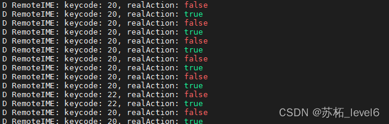

# Amlogic方案红外遥控器配置，定制按键，power按键

> 说明：之前的博文有朋友反馈看的不够清晰，也存在一些错误，因此我重新写这部分的博客。对Framework层部分的按键适配做一些修改。（2024.7.1）


## 配置路线
**文件映射路径：**
`*.dtsi` --> `input-event-codes.h `--> `*.kl  `--> `kecodes.h（与另外三个文件）` --> `PhoneWindowManager.java `
## 一、获取按键的用户码（custom code）
**用户码（custom code）是一个十六进制的八位码值，包括了两位校验码+两位键值码+两位用户码
一般来说键值码和用户码会在遥控器的文档中给出。**

当一个红外遥控器的某个按键未适配时，有多种方法查看这个按键的用户码（custom code）。

1. 在控制台输入`dmesg -c`能看到custom码（用户码）：

```java
[ 1106.005017] meson-ir fe084040.ir: invalid custom:0x23dcfd01
23：校验码;
dc：该按键的键值
fd01：该遥控器的头码
```
输入之后再按下按键，然后再输入一次dmesg -c就会显示上面的内容，如果适配了这个按键则不会有任何显示。
这里的8位十六进制码值可以用来适配power 唤醒按键。

2. 查看内核打印：
想要查看内核打印，首先需要提升log等级
```java
# 设置环境变量 loglevel 的值为 7
s4_ap222# env set loglevel 7

# 将当前环境变量保存到存储设备中
s4_ap222# env save

# 重新启动设备，应用新的环境变量设置
s4_ap222# reboot
```
重启完成之后我们查看串口控制台就能看到内核打印，此时我们按下遥控器的按键，如果该按键没有被适配好则会出现以下信息：

```java
[  151.852623@1]  meson-ir fe084040.ir: invalid custom:0x3ec1fd01
[  153.253840@1]  meson-ir fe084040.ir: invalid custom:0x6699fd01
[  153.490940@1]  meson-ir fe084040.ir: invalid custom:0x6699fd01
[  153.997599@1]  meson-ir fe084040.ir: invalid custom:0x35cafd01
[  155.040205@1]  meson-ir fe084040.ir: invalid custom:0x2dd2fd01
```
按下一个键就会输出一个键的custom码（用户码），其中包括了头码和键值
如果已经适配了可能不会有log

3. 在控制台输入`echo 7 > /proc/sys/kernel/printk`
这条命令也是开启内核打印，和第方法2差不多。


> 下面的内容采用定制化按键做为例子！
## 二、适配power键（唤醒/睡眠）
power键和其他按键不同，需要单独适配且需要完整的power键的用户码（custom code）
1. `bootloader/uboot-repo/bl30/src_ao/demos/amlogic/n200/sc2/sc2_ah212/power.c`
这里记得选择属于你的方案的power.c
```c
        { 0xf20dfe01, IR_NORMAL},
        { 0xe51afb04, IR_NORMAL},
        { 0xff00fe06, IR_NORMAL},
+       { 0xed127984, IR_NORMAL},
        { 0x3ac5bd02, IR_CUSTOM},
```
2. `bootloader/uboot-repo/bl33/v2019/board/amlogic/configs/sc2_ah212.h`

```c
 #define AML_IR_REMOTE_POWER_UP_KEY_VAL1 0xef10fe01 //amlogic tv ir --- power
 #define AML_IR_REMOTE_POWER_UP_KEY_VAL2 0XBB44FB04 //amlogic tv ir --- ch+
 #define AML_IR_REMOTE_POWER_UP_KEY_VAL3 0xF20DFE01 //amlogic tv ir --- ch-
-#define AML_IR_REMOTE_POWER_UP_KEY_VAL4 0XBA45BD02 //amlogic small ir--- power
+#define AML_IR_REMOTE_POWER_UP_KEY_VAL4 0xed127984  //xxxx ir--- power
 #define AML_IR_REMOTE_POWER_UP_KEY_VAL5 0xe51afb04
 #define AML_IR_REMOTE_POWER_UP_KEY_VAL6 0xFFFFFFFF
 #define AML_IR_REMOTE_POWER_UP_KEY_VAL7 0xFFFFFFFF
```
`0xed127984`     最后四位7984是遥控器的用户码，前面的12是power键的码值，最前面的两位ed好像是校验码
但是根据某些提交来看，只写四位好像也可以。
## 三、修改Scancode和Customcode的映射文件DTSI
1. path：`common/arch/arm64/boot/dts/amlogic/meson-ir-map.dtsi`
按照里面原本的内容的样子添加，注意customcode改成你的遥控器的**头码**，完整用户码的低四位。

```java
customcode = <0x7984>;
release_delay = <80>;
size  = <31>;   /*keymap size*/
keymap = <REMOTE_KEY(0x12, KEY_POWER)
REMOTE_KEY(0x33, KEY_T_SETTINGS)
REMOTE_KEY(0x35, KEY_T_TV)
REMOTE_KEY(0x1E, KEY_T_VOD)
REMOTE_KEY(0x38, KEY_T_APP)
REMOTE_KEY(0x2D, KEY_T_SRC)
```
**数据来源：**
前面的这个十六进制数就是scancode的十六进制，当然我们也可以看遥控器的规格书，上面会直接标注好
后面的KEY_XXX需要在input-event-codes.h文件中定义，自己命名

2. Path: `common/include/uapi/linux/input-event-codes.h` 

```java
#define KEY_T_SETTINGS           0x228
#define KEY_T_TV                 0x224
#define KEY_T_VOD                0x225
#define KEY_T_APP                0x226
#define KEY_T_SRC                0x227
```
**数据来源：**
前面的按键名来自我们在第一步`meson-ir-map.dtsi`中定义的名字
后面的十六进制随意定义，但是**不能和已有的按键重复**，因此需要找到没有被定义的区间来定义。

进行到这里的时候，使用getevent -l再按下按键就已经能有相应的反馈了。
## 四、kl文件
### 4.1 （介绍）getevent -l
无论是蓝牙遥控器还是红外遥控器，都需要确定其使用的kl (KeyLayoutFile)文件。在安卓shell 环境（串口控制台）执行命令确认kl 文件：`getevent -l` 。
首先会显示当前适配的遥控器列表

```java
add device 1: /dev/input/event1
  name:     "cec_input"
add device 2: /dev/input/event4
  name:     "ir_keypad"
add device 3: /dev/input/event5
  name:     "ir_keypad1"
add device 4: /dev/input/event3
  name:     "gpio_keypad"
add device 5: /dev/input/event2
  name:     "vad_keypad"
add device 6: /dev/input/event0
  name:     "input_btrcu"
add device 7: /dev/input/event6
  name:     "adc_keypad"
```

以上内容代表了适配了七套遥控器，名称分别是"cec_input"    "ir_keypad"  等
下面我们按下遥控器的某一个按键会出现下面的内容

```java
/dev/input/event4: EV_KEY       KEY_RIGHT            DOWN
/dev/input/event4: EV_SYN       SYN_REPORT           00000000
/dev/input/event4: EV_KEY       KEY_RIGHT            UP
/dev/input/event4: EV_SYN       SYN_REPORT           00000000
```

前两行表示按键被按下，后两行表示按键被释放 
EV_SYN: 用作分隔事件的标记。 事件可以在时间或空间上分开，例如使用多点触控协议。
EV_KEY: 用于描述键盘，按钮或其他类似键的设备的状态更改。
根据这里显示显示的event4我们可以知道我们的遥控设备为"ir_keypad"
### 4.2 （介绍）dumpsys input
在前面我们看到我们按下按键时相应的是event4，我们可以使用cat /proc/bus/input/devices查看我们系统中连接的输入设备的详细信息。

```java
I: Bus=0010 Vendor=0001 Product=0001 Version=0100
N: Name="ir_keypad"
P: Phys=keypad/input0
S: Sysfs=/devices/platform/fe084040.ir/input/input4
U: Uniq=
H: Handlers=rfkill mouse0 event4
B: PROP=0
B: EV=7
B: KEY=ffffffff ffffffff ffffffff ffffffff ffffffff ffffffff ffffffff ffffffff ffffffff ffffffff ffffffff 0 0 70000 ffffffff ffffffff ffffffff ffffffff ffffffff ffffffff ffffffff fffffffe
B: REL=103
```

从我们之前监听到的按键事件我们可以看到处理该按键的事件是event4，这里我们对应上的设备名应该是 "ir_keypad"
然后在（串口控制台）执行命令 dumpsys input，可以根据所连接的遥控器的名称找到遥控器对应的kl文件。
根据这个IR遥控器设备ir_keypad的设备名，我们找到了下面这段内容：

```java
  ir_keypad
  Classes: 0x00000029
  Path: /dev/input/event4
  Enabled: true
  Descriptor: d2c52ff0f656fac4cd7b7a118d575e0109a9fe1c
  Location: keypad/input0
  ControllerNumber: 0
  UniqueId:
  Identifier: bus=0x0010, vendor=0x0001, product=0x0001, version=0x0100
  KeyLayoutFile: /vendor/usr/keylayout/Vendor_0001_Product_0001.kl
  KeyCharacterMapFile: /system/usr/keychars/Generic.kcm
  ConfigurationFile:
  HaveKeyboardLayoutOverlay: false
  VideoDevice: <none>
```

可以看到这里所用到的Android层映射文件为`/vendor/usr/keylayout/Vendor_0001_Product_0001.kl`(这里的usr对于不同项目是不一样的) 
我这里是`device/amlogic/common/products/mbox/Vendor_0001_Product_0001.kl` 
### 4.3 （提醒）踩过的坑请注意
当我找到我的`device/amlogic/common/products/mbox/`目录下之后发现有多个kl文件


按理说应该是Vendor_0001_Product_0001.kl才对，但是实际上使用的却是Vendor_0001_Product_0002.kl文件，经过多方排查发现是因为在编译的时候mk文件对他进行了改动：
path：`device/amlogic/common/products/mbox/sc2/device.mk`

```java
#use tv remote layout for mbox if livetv is built
ifeq ($(TARGET_BUILD_LIVETV), true)
    PRODUCT_COPY_FILES += \
       device/amlogic/common/products/mbox/Vendor_0001_Product_0002.kl:$(TARGET_COPY_OUT_VENDOR)/usr/keylayout/Vendor_0001_Product_0001.kl
else
    PRODUCT_COPY_FILES += \
       device/amlogic/common/products/mbox/Vendor_0001_Product_0001.kl:$(TARGET_COPY_OUT_VENDOR)/usr/keylayout/Vendor_0001_Product_0001.kl
endif
```

这里由于变量TARGET_BUILD_LIVETV的值为true，所以将Vendor_0001_Product_0002.kl文件的内容拷贝到了Vendor_0001_Product_0001.kl里面，所以虽然用的是0001但是其实改动需要在0002中进行。坑死了！！！我说怎么找到的文件不对呢。
### 4.4 （修改）kl文件
patch： `device/amlogic/common/products/mbox/Vendor_0001_Product_0002.kl`

```java
//这是新加的自定义的按键
key 0x228        T_SETTINGS
key 0x224        T_TV
key 0x225        T_VOD
key 0x226        T_APP
key 0x227        T_SRC
//这是已经有定义过的按键
 key 158      BACK
 key 139      MENU
 key 102      HOME
```
**数据来源：**
前面的值是`input-event-codes.h`中定义的值
后面的是有底层文件(KeyLabel文件)与之相对应的，如果文件中定义的有就直接取用，如果没有我们这里就需要自己起一个名字然后在底层文件中继续添加。

进行到这里，按键功能就已经生效了，**一般做到这里也就可以了**。
继续往下追查这个值是在KeyLabel文件中定义的
## 五、Framework层的改动
这部分的改动设计四个文件：`KeyEvent.java` ，`keycodes.h` ,`InputEventLabels.h`以及`attrs.xml` 
这一层的关键点在`KeyEvent.java` 里面
1. `frameworks/base/core/java/android/view/KeyEvent.java`

```java
	public static final int KEYCODE_T_SETTINGS = 289;
	public static final int KEYCODE_T_TV = 290;
	public static final int KEYCODE_T_VOD = 291;
	public static final int KEYCODE_T_APP = 292;
	public static final int KEYCODE_T_SRC = 293;
```
这里我们需要在KeyEvent类中对我们自定义的按键进行添加
**数据来源：**
前面的KEYCODE是固定前缀+kl中定义的名字。
后面的数字随便的，但不能有重复的，所以一般都是找空的

**注意在这个文件中有这么一段提示**

```
    // NOTE: If you add a new keycode here you must also add it to:
    //  isSystem()
    //  isWakeKey()
    //  frameworks/native/include/android/keycodes.h
    //  frameworks/native/include/input/InputEventLabels.h
    //  frameworks/base/core/res/res/values/attrs.xml
    //  emulator?
    //  LAST_KEYCODE
    //
    //  Also Android currently does not reserve code ranges for vendor-
    //  specific key codes.  If you have new key codes to have, you
    //  MUST contribute a patch to the open source project to define
    //  those new codes.  This is intended to maintain a consistent
    //  set of key code definitions across all Android devices.

    // Symbolic names of all metakeys in bit order from least significant to most significant.
    // Accordingly there are exactly 32 values in this table.
```
这里面告诉了我们，在这里加了新的keycode 之后**还要在其他三个文件中也加上**！因此有了后面几个文件的改动

> 这里或许有人会有疑问`isSystem() `和`isWakeKey()`为什么不加，大家可以看这两个函数的注释，在一些特殊的情况下需要加到这两个函数里面，一般情况下是不用在这两个方法里面加的。


2.  Path: `frameworks/native/include/android/keycodes.h`

```java
AKEYCODE_BACK            = 4,
//下面是自定义按键
AKEYCODE_T_SETTINGS = 289,        
AKEYCODE_T_TV = 290,        
AKEYCODE_T_VOD = 291,        
AKEYCODE_T_APP = 292,        
AKEYCODE_T_SRC = 293

```
3. Path: `frameworks/native/include/input/InputEventLabels.h`

```java
DEFINE_KEYCODE(BACK),
//下面是自定义按键
DEFINE_KEYCODE(T_SETTINGS),        
DEFINE_KEYCODE(T_TV),        
DEFINE_KEYCODE(T_VOD),        
DEFINE_KEYCODE(T_APP),        
DEFINE_KEYCODE(T_SRC),
```
4. Path: `frameworks/base/core/res/res/values/attrs.xml`

```java
<enum name="KEYCODE_BACK" value="4" />
//下面是自定义按键
                <enum name="KEYCODE_T_SETTINGS" value="289" />                
                <enum name="KEYCODE_T_TV" value="290" />                
                <enum name="KEYCODE_T_VOD" value="291" />                
                <enum name="KEYCODE_T_APP" value="292" />                
                <enum name="KEYCODE_T_SRC" value="293" />
```

现在，当你使用logcat -s RemoteIME命令就能够看到控制台输出了keycode，这个值就和我们上面的值对应上了


## 六、KeyEvent
当按键传到 fromworks 我们只需要更改 KeyEvent.java 来完成最后的按键定义，之后就是到 PhoneWindowManager.java 来实现按键功能实现拦截或继续传递。
Path: `frameworks/base/services/core/java/com/android/server/policy/PhoneWindowManager.java`
```java
 onKeyDowncase KeyEvent.KEYCODE_YOUR_PRIVATE_KEY: {
 //do sthreturn true;
}
```
## 总之
一般情况下按照dtsi-->linux-event-codes.h-->kl 的顺序来改就可以了，如果需要自定义按键则继续查看。