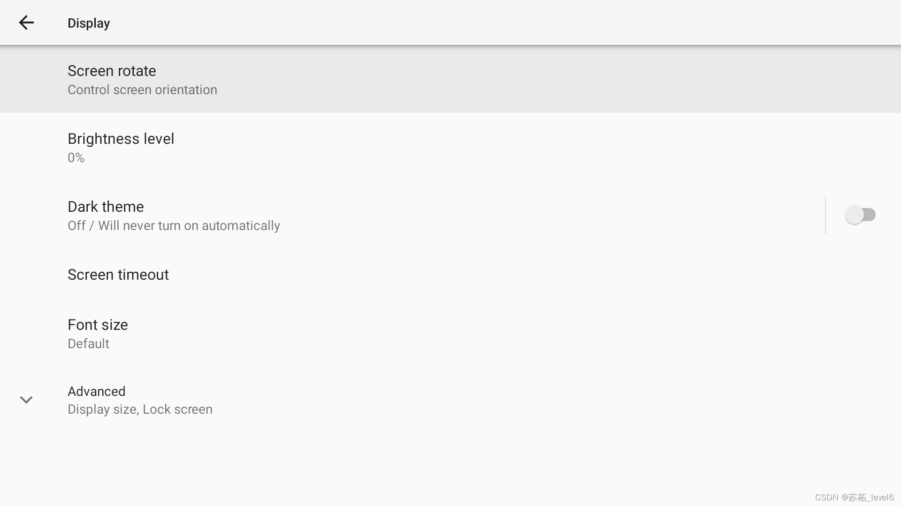
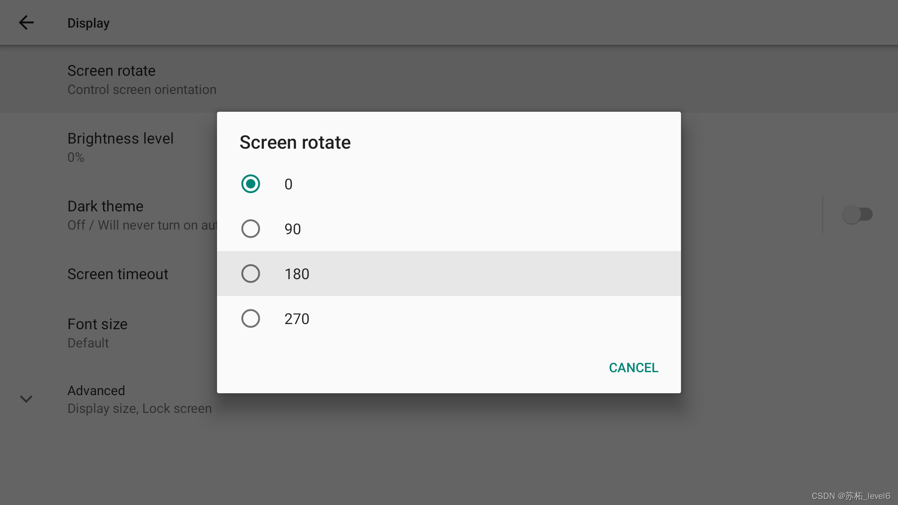

# 【Android 11】AOSP Settings添加屏幕旋转按钮
这里是客户要求添加按钮以实现屏幕旋转。屏幕旋转使用adb的命令很容易实现：

```java
#屏幕翻转
adb shell settings put system user_rotation 1
#屏幕正常模式
adb shell settings put system user_rotation 0
```
这里的值可以是0，1，2，3 的任意一个。我这里没有陀螺仪，所以只需要这个命令就够了。更多的可以参考[android 通过adb shell命令旋转Android屏幕朝向方向](https://blog.csdn.net/sinat_31057219/article/details/127548765?ops_request_misc=%257B%2522request%255Fid%2522%253A%2522171825000916800225576792%2522%252C%2522scm%2522%253A%252220140713.130102334..%2522%257D&request_id=171825000916800225576792&biz_id=0&utm_medium=distribute.pc_search_result.none-task-blog-2~all~baidu_landing_v2~default-2-127548765-null-null.142%5Ev100%5Epc_search_result_base2&utm_term=Android%E5%B1%8F%E5%B9%95%E6%97%8B%E8%BD%AC%E5%91%BD%E4%BB%A4&spm=1018.2226.3001.4187)
但是这有个缺陷，就是开机的动画不能随着设置好的屏幕方向旋转
## 图片效果




## 代码
1. 首先在资源配置文件中定义我们需要用到的字段，以供后面国际化适配的时候更方便
   `b/packages/apps/Settings/res/values/strings.xml`
```java
@@ -2706,6 +2706,10 @@
+    <!-- Screen rotate title-->
+    <string name="screen_rotate_title">Screen rotate</string>
+    <!-- Screen rotate summary-->
+    <string name="screen_rotate_summary">Control screen orientation</string>
```
添加了两个字段，分别是screen_rotate_title screen_rotate_summary

2. 然后配置我们的四个选项值
   `packages/apps/Settings/res/values/arrays.xml`

```java
@@ -1501,4 +1501,24 @@
         <item>@string/rtt_settings_always_visible</item>
     </string-array>

+    <!-- Screen rotate settings.  These are shown in a list dialog. -->
+    <string-array name="screen_rotate_entries">
+        <item>0</item>
+        <item>90</item>
+        <item>180</item>
+        <item>270</item>
+    </string-array>
+
+    <!-- Do not translate. -->
+    <string-array name="screen_rotate_values" translatable="false">
+        <!-- Do not translate. -->
+        <item>0</item>
+        <!-- Do not translate. -->
+        <item>90</item>
+        <!-- Do not translate. -->
+        <item>180</item>
+        <!-- Do not translate. -->
+        <item>270</item>
+    </string-array>
+
```
3. 在xml中增加我们需要的List按钮，我这里放在了settings——display界面。
   `packages/apps/Settings/res/xml/display_settings.xml`

```java
+    <ListPreference
+    android:key="screen_rotate"
+    android:title="@string/screen_rotate_title"
+    android:summary="@string/screen_rotate_summary"
+    android:persistent="false"
+    android:entries="@array/screen_rotate_entries"
+    android:entryValues="@array/screen_rotate_values"
+    settings:controller="com.android.settings.display.ScreenRotatePreferenceController"/>
+

```
4. 写Controller文件，就是我们上一步设置的`com.android.settings.display.ScreenRotatePreferenceController`

```java
package com.android.settings.display;

import android.content.Context;
import android.provider.Settings;
import android.view.Surface;
import androidx.preference.ListPreference;
import androidx.preference.Preference;
import androidx.preference.PreferenceScreen;
import com.android.settings.core.BasePreferenceController;

import com.android.settings.core.PreferenceControllerMixin;
import com.android.settingslib.core.AbstractPreferenceController;
import android.util.Log;
import android.content.Intent;

public class ScreenRotatePreferenceController extends BasePreferenceController implements
        Preference.OnPreferenceChangeListener, PreferenceControllerMixin {

    public static final String KEY_SCREEN_ROTATE = "screen_rotate";
    private ListPreference mScreenRotatePreference;

    public ScreenRotatePreferenceController(Context context, String preferenceKey) {
        super(context, preferenceKey);
    }

    @Override
    public int getAvailabilityStatus() {
        return AVAILABLE;
    }

    @Override
    public void displayPreference(PreferenceScreen screen) {
        super.displayPreference(screen);
        mScreenRotatePreference = (ListPreference) screen.findPreference(KEY_SCREEN_ROTATE);
        if (mScreenRotatePreference != null) {
            mScreenRotatePreference.setOnPreferenceChangeListener(this);
            int index = Settings.System.getInt(mContext.getContentResolver(), Settings.System.USER_ROTATION, 0);
            mScreenRotatePreference.setValueIndex(index);
        }
    }

    public void setScreenRotation(String value) {
        int rotation = 0;
        switch (value) {
            case "0":
                rotation = Surface.ROTATION_0;
                break;
            case "90":
                rotation = Surface.ROTATION_90;
                break;
            case "180":
                rotation = Surface.ROTATION_180;
                break;
            case "270":
                rotation = Surface.ROTATION_270;
                break;
        }
        Settings.System.putInt(mContext.getContentResolver(), Settings.System.USER_ROTATION, rotation);
    }

    @Override
    public boolean onPreferenceChange(Preference preference, Object objValue) {
        final String key = preference.getKey();
        if (key.equals(KEY_SCREEN_ROTATE)) {
            setScreenRotation((String) objValue);
            return true;
        }
        return false;
    }
}

```
5. 把上面这个加到DisplaySettings.java里面
   `packages/apps/Settings/src/com/android/settings/DisplaySettings.java`

```java
@@ -32,6 +32,7 @@ import com.android.settings.display.TapToWakePreferenceController;
 import com.android.settings.display.ThemePreferenceController;
 import com.android.settings.display.TimeoutPreferenceController;
 import com.android.settings.display.VrDisplayPreferenceController;
+import com.android.settings.display.ScreenRotatePreferenceController;
 import com.android.settings.search.BaseSearchIndexProvider;
 import com.android.settingslib.core.AbstractPreferenceController;
 import com.android.settingslib.core.lifecycle.Lifecycle;
@@ -90,6 +91,7 @@ public class DisplaySettings extends DashboardFragment {
         controllers.add(new ShowOperatorNamePreferenceController(context));
         controllers.add(new ThemePreferenceController(context));
         controllers.add(new BrightnessLevelPreferenceController(context, lifecycle));
+        controllers.add(new ScreenRotatePreferenceController(context, ScreenRotatePreferenceController.KEY_SCREEN_ROTATE));
         return controllers;
     }

```
