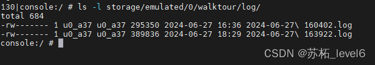

# 【Android11】开机启动日志捕捉服务

##  一、前言
制作这个功能的原因是客户想要自动的记录日志中的报错和警告到设备的内存卡里面。虽然开发者模式中有一个“bug report” 会在`/data/user_de/0/com.android.shell/files/bugreports/`目录下生成一个zip包记录了日志。但是客户觉得这个日志很难获取到他们需要的信息，他们想要的是logcat这种。于是我只能在网上寻找相关的解决办法。
终于被我找到一个：
[android日志服务，将日志记录在log文件中并每天生成一个日志文件](https://blog.csdn.net/ISSHQuery/article/details/8723037?ops_request_misc=&request_id=&biz_id=102&utm_term=Android%20%E8%AE%B0%E5%BD%95bug%E6%97%A5%E5%BF%97&utm_medium=distribute.pc_search_result.none-task-blog-2~all~sobaiduweb~default-4-8723037.142%5Ev100%5Epc_search_result_base2&spm=1018.2226.3001.4187)
感谢大佬！！！
他使用了一个服务来过滤logcat日志并且记录下来，我这里将他转换成kotlin然后设置成开机启动。
##  二、代码
这里我将它放在了我自己编写的OTA升级APP里面，当然你们也可以放在其他位置。需要使用的时候可以通过服务调用就可以了
```kotlin
import android.app.AlarmManager
import android.app.PendingIntent
import android.app.Service
import android.content.BroadcastReceiver
import android.content.Context
import android.content.Intent
import android.content.IntentFilter
import android.os.Environment
import android.os.IBinder
import android.os.PowerManager
import android.util.Log
import java.io.*
import java.text.ParseException
import java.text.SimpleDateFormat
import java.util.*

/**
 * 日志服务，日志默认会存储在SDcar里如果没有SDcard会存储在内存中的安装目录下面。
 * 1.本服务默认在SDcard中每天生成一个日志文件;
 * 2.如果有SDCard的话会将之前内存中的文件拷贝到SDCard中;
 * 3.如果没有SDCard，在安装目录下只保存当前在写日志;
 * 4.SDcard的装载卸载动作会在步骤2,3中切换 ;
 * 5.SDcard中的日志文件只保存7天。
 * @author Administrator
 */
class LogService() : Service() {
    private var LOG_PATH_MEMORY_DIR: String? = null // 日志文件在内存中的路径(日志文件在安装目录中的路径)
    private var LOG_PATH_SDCARD_DIR: String? = null // 日志文件在sdcard中的路径

    @Suppress("unused")
    private var LOG_SERVICE_LOG_PATH: String? = null // 本服务产生的日志，记录日志服务开启失败信息

    private val SDCARD_TYPE = 0 // 当前的日志记录类型为存储在SD卡下面
    private val MEMORY_TYPE = 1 // 当前的日志记录类型为存储在内存中
    private var CURR_LOG_TYPE = SDCARD_TYPE // 当前的日志记录类型

    private var CURR_INSTALL_LOG_NAME: String? = null // 如果当前的日志写在内存中，记录当前的日志文件名称

    private val logServiceLogName = "Log.log" // 本服务输出的日志文件名称
    private val myLogSdf = SimpleDateFormat(
        "yyyy-MM-dd HH:mm:ss"
    )
    private val writer: OutputStreamWriter? = null

    private val sdf = SimpleDateFormat("yyyy-MM-dd HHmmss") // 日志名称格式

    private var process: Process? = null

    private var wakeLock: PowerManager.WakeLock? = null

    private var sdStateReceiver: SDStateMonitorReceiver? = null // SDcard状态监测
    private var logTaskReceiver: LogTaskReceiver? = null

    /*
	 * 是否正在监测日志文件大小； 如果当前日志记录在SDcard中则为false 如果当前日志记录在内存中则为true
	 */
    private var logSizeMoniting = false

    override fun onBind(intent: Intent): IBinder? {
        return null
    }

    override fun onCreate() {
        super.onCreate()
        init()
        register()
        deploySwitchLogFileTask()
        LogCollectorThread().start()
    }

    private fun init() {
        LOG_PATH_MEMORY_DIR = (filesDir.absolutePath + File.separator
                + "log")
        LOG_SERVICE_LOG_PATH = (LOG_PATH_MEMORY_DIR + File.separator
                + logServiceLogName)
        LOG_PATH_SDCARD_DIR = (Environment.getExternalStorageDirectory()
            .absolutePath
                + File.separator
                + "walktour"
                + File.separator + "log")
        createLogDir()


        /* ******************************************************
		 * try { writer = new OutputStreamWriter(new FileOutputStream(
		 * LOG_SERVICE_LOG_PATH, true)); } catch (FileNotFoundException e) {
		 * Log.e(TAG, e.getMessage(), e); }
		 * *****************************************************
		 */
        val pm = applicationContext.getSystemService(POWER_SERVICE) as PowerManager
        wakeLock = pm.newWakeLock(PowerManager.PARTIAL_WAKE_LOCK, "YourAppName:LogService")


        CURR_LOG_TYPE = currLogType
        Log.i(TAG, "LogService onCreate")
    }

    private fun register() {
        val sdCarMonitorFilter = IntentFilter()
        sdCarMonitorFilter.addAction(Intent.ACTION_MEDIA_MOUNTED)
        sdCarMonitorFilter.addAction(Intent.ACTION_MEDIA_UNMOUNTED)
        sdCarMonitorFilter.addDataScheme("file")
        sdStateReceiver = SDStateMonitorReceiver()
        registerReceiver(sdStateReceiver, sdCarMonitorFilter)

        val logTaskFilter = IntentFilter()
        logTaskFilter.addAction(MONITOR_LOG_SIZE_ACTION)
        logTaskFilter.addAction(SWITCH_LOG_FILE_ACTION)
        logTaskReceiver = LogTaskReceiver()
        registerReceiver(logTaskReceiver, logTaskFilter)
    }

    val currLogType: Int
        /**
         * 获取当前应存储在内存中还是存储在SDCard中
         *
         * @return
         */
        get() {
            if (Environment.getExternalStorageState() != Environment.MEDIA_MOUNTED) {
                return MEMORY_TYPE
            } else {
                return SDCARD_TYPE
            }
        }

    /**
     * 部署日志切换任务，每天凌晨切换日志文件
     */
    private fun deploySwitchLogFileTask() {
        val intent = Intent(SWITCH_LOG_FILE_ACTION)
        val sender = PendingIntent.getBroadcast(this, 0, intent, 0)
        val calendar = Calendar.getInstance()
        calendar.add(Calendar.DAY_OF_MONTH, 1)
        calendar[Calendar.HOUR_OF_DAY] = 0
        calendar[Calendar.MINUTE] = 0
        calendar[Calendar.SECOND] = 0


        // 部署任务
        val am = getSystemService(ALARM_SERVICE) as AlarmManager
        am.setRepeating(
            AlarmManager.RTC_WAKEUP, calendar.timeInMillis,
            AlarmManager.INTERVAL_DAY, sender
        )
        recordLogServiceLog(
            "deployNextTask succ,next task time is:"
                    + myLogSdf.format(calendar.time)
        )
    }

    /**
     * 日志收集 1.清除日志缓存 2.杀死应用程序已开启的Logcat进程防止多个进程写入一个日志文件 3.开启日志收集进程 4.处理日志文件 移动
     * OR 删除
     */
    internal inner class LogCollectorThread() : Thread("LogCollectorThread") {
        init {
            Log.d(TAG, "LogCollectorThread is create")
        }

        override fun run() {
            try {
                wakeLock!!.acquire() // 唤醒手机

                clearLogCache()

                val orgProcessList: MutableList<String?> = this@LogService.allProcess;
                val processInfoList = getProcessInfoList(orgProcessList)
                killLogcatProc(processInfoList)

                createLogCollector()

                sleep(1000) // 休眠，创建文件，然后处理文件，不然该文件还没创建，会影响文件删除

                handleLog()

                wakeLock!!.release() // 释放
            } catch (e: Exception) {
                e.printStackTrace()
                recordLogServiceLog(Log.getStackTraceString(e))
            }
        }
    }

    /**
     * 每次记录日志之前先清除日志的缓存, 不然会在两个日志文件中记录重复的日志
     */
    private fun clearLogCache() {
        var proc: Process? = null
        val commandList: MutableList<String> = ArrayList()
        commandList.add("logcat")
        commandList.add("-c")
        try {
            proc = Runtime.getRuntime().exec(
                commandList.toTypedArray<String>()
            )
            val errorGobbler: StreamConsumer = StreamConsumer(
                proc.errorStream
            )

            val outputGobbler: StreamConsumer = StreamConsumer(
                proc.getInputStream()
            )

            errorGobbler.start()
            outputGobbler.start()
            if (proc.waitFor() != 0) {
                Log.e(TAG, " clearLogCache proc.waitFor() != 0")
                recordLogServiceLog("clearLogCache clearLogCache proc.waitFor() != 0")
            }
        } catch (e: Exception) {
            Log.e(TAG, "clearLogCache failed", e)
            recordLogServiceLog("clearLogCache failed")
        } finally {
            try {
                proc!!.destroy()
            } catch (e: Exception) {
                Log.e(TAG, "clearLogCache failed", e)
                recordLogServiceLog("clearLogCache failed")
            }
        }
    }

    /**
     * 关闭由本程序开启的logcat进程： 根据用户名称杀死进程(如果是本程序进程开启的Logcat收集进程那么两者的USER一致)
     * 如果不关闭会有多个进程读取logcat日志缓存信息写入日志文件
     *
     * @param allProcList
     * @return
     */
    private fun killLogcatProc(allProcList: List<ProcessInfo>) {
        if (process != null) {
            process!!.destroy()
        }
        val packName = this.packageName
        val myUser = getAppUser(packName, allProcList)
        /*
		 * recordLogServiceLog("app user is:"+myUser);
		 * recordLogServiceLog("========================"); for (ProcessInfo
		 * processInfo : allProcList) {
		 * recordLogServiceLog(processInfo.toString()); }
		 * recordLogServiceLog("========================");
		 */
        for (processInfo: ProcessInfo in allProcList) {
            if (((processInfo.name!!.lowercase(Locale.getDefault()) == "logcat") && (processInfo.user == myUser))) {
                android.os.Process.killProcess(processInfo.pid!!.toInt())
                // recordLogServiceLog("kill another logcat process success,the process info is:"
                // + processInfo);
            }
        }
    }

    /**
     * 获取本程序的用户名称
     *
     * @param packName
     * @param allProcList
     * @return
     */
    private fun getAppUser(packName: String, allProcList: List<ProcessInfo>): String? {
        for (processInfo: ProcessInfo in allProcList) {
            if ((processInfo.name == packName)) {
                return processInfo.user
            }
        }
        return null
    }

    /**
     * 根据ps命令得到的内容获取PID，User，name等信息
     *
     * @param orgProcessList
     * @return
     */
    private fun getProcessInfoList(orgProcessList: MutableList<String?>): List<ProcessInfo> {
        val procInfoList: MutableList<ProcessInfo> = ArrayList()
        for (i in 1 until orgProcessList.size) {
            val processInfo = orgProcessList[i]
            val proStr = processInfo?.split(" ".toRegex())?.dropLastWhile { it.isEmpty() }?.toTypedArray()
            // USER PID PPID VSIZE RSS WCHAN PC NAME
            // root 1 0 416 300 c00d4b28 0000cd5c S /init
            val orgInfo: MutableList<String> = ArrayList()
            if (proStr != null) {
                for (str: String in proStr) {
                    if ("" != str) {
                        orgInfo.add(str)
                    }
                }
            }
            if (orgInfo.size == 9) {
                val pInfo: ProcessInfo = ProcessInfo()
                pInfo.user = orgInfo[0]
                pInfo.pid = orgInfo[1]
                pInfo.ppid = orgInfo[2]
                pInfo.name = orgInfo[8]
                procInfoList.add(pInfo)
            }
        }
        return procInfoList
    }

    private val allProcess: MutableList<String?>
        /**
         * 运行PS命令得到进程信息
         *
         * @return USER PID PPID VSIZE RSS WCHAN PC NAME root 1 0 416 300 c00d4b28
         * 0000cd5c S /init
         */
        get() {
            val orgProcList: MutableList<String?> = ArrayList()
            var proc: Process? = null
            try {
                proc = Runtime.getRuntime().exec("ps")
                val errorConsumer: StreamConsumer = StreamConsumer(
                    proc.errorStream
                )

                val outputConsumer: StreamConsumer = StreamConsumer(
                    proc.getInputStream(), orgProcList
                )

                errorConsumer.start()
                outputConsumer.start()
                if (proc.waitFor() != 0) {
                    Log.e(TAG, "getAllProcess proc.waitFor() != 0")
                    recordLogServiceLog("getAllProcess proc.waitFor() != 0")
                }
            } catch (e: Exception) {
                Log.e(TAG, "getAllProcess failed", e)
                recordLogServiceLog("getAllProcess failed")
            } finally {
                try {
                    proc!!.destroy()
                } catch (e: Exception) {
                    Log.e(TAG, "getAllProcess failed", e)
                    recordLogServiceLog("getAllProcess failed")
                }
            }
            return orgProcList
        }

    /**
     * 开始收集日志信息
     */
    fun createLogCollector() {
        val logFileName = sdf.format(Date()) + ".log" // 日志文件名称
        val commandList: MutableList<String> = ArrayList()
        commandList.add("logcat")
        commandList.add("-f")
        // commandList.add(LOG_PATH_INSTALL_DIR + File.separator + logFileName);
        commandList.add(logPath)
        commandList.add("-v")
        commandList.add("time")
        commandList.add("*:I")


        // commandList.add("*:E");// 过滤所有的错误信息

        // 过滤指定TAG的信息
        // commandList.add("MyAPP:V");
        // commandList.add("*:S");
        try {
            process = Runtime.getRuntime().exec(
                commandList.toTypedArray<String>()
            )
            recordLogServiceLog(
                ("start collecting the log,and log name is:"
                        + logFileName)
            )
            // process.waitFor();
        } catch (e: Exception) {
            Log.e(TAG, "CollectorThread == >" + e.message, e)
            recordLogServiceLog("CollectorThread == >" + e.message)
        }
    }

    val logPath: String
        /**
         * 根据当前的存储位置得到日志的绝对存储路径
         *
         * @return
         */
        get() {
            createLogDir()
            val logFileName = sdf.format(Date()) + ".log" // 日志文件名称
            if (CURR_LOG_TYPE == MEMORY_TYPE) {
                CURR_INSTALL_LOG_NAME = logFileName
                Log.d(
                    TAG, (("Log stored in memory, the path is:"
                            + LOG_PATH_MEMORY_DIR + File.separator + logFileName))
                )
                return LOG_PATH_MEMORY_DIR + File.separator + logFileName
            } else {
                CURR_INSTALL_LOG_NAME = null
                Log.d(
                    TAG, (("Log stored in SDcard, the path is:"
                            + LOG_PATH_SDCARD_DIR + File.separator + logFileName))
                )
                return LOG_PATH_SDCARD_DIR + File.separator + logFileName
            }
        }

    /**
     * 处理日志文件 1.如果日志文件存储位置切换到内存中，删除除了正在写的日志文件 并且部署日志大小监控任务，控制日志大小不超过规定值
     * 2.如果日志文件存储位置切换到SDCard中，删除7天之前的日志，移 动所有存储在内存中的日志到SDCard中，并将之前部署的日志大小 监控取消
     */
    fun handleLog() {
        if (CURR_LOG_TYPE == MEMORY_TYPE) {
            deployLogSizeMonitorTask()
            deleteMemoryExpiredLog()
        } else {
            moveLogfile()
            cancelLogSizeMonitorTask()
            deleteSDcardExpiredLog()
        }
    }

    /**
     * 部署日志大小监控任务
     */
    private fun deployLogSizeMonitorTask() {
        if (logSizeMoniting) { // 如果当前正在监控着，则不需要继续部署
            return
        }
        logSizeMoniting = true
        val intent = Intent(MONITOR_LOG_SIZE_ACTION)
        val sender = PendingIntent.getBroadcast(this, 0, intent, 0)
        val am = getSystemService(ALARM_SERVICE) as AlarmManager
        am.setRepeating(
            AlarmManager.RTC_WAKEUP, System.currentTimeMillis(),
            MEMORY_LOG_FILE_MONITOR_INTERVAL.toLong(), sender
        )
        Log.d(TAG, "deployLogSizeMonitorTask() succ !")
        // recordLogServiceLog("deployLogSizeMonitorTask() succ ,start time is "
        // + calendar.getTime().toLocaleString());
    }

    /**
     * 取消部署日志大小监控任务
     */
    private fun cancelLogSizeMonitorTask() {
        logSizeMoniting = false
        val am = getSystemService(ALARM_SERVICE) as AlarmManager
        val intent = Intent(MONITOR_LOG_SIZE_ACTION)
        val sender = PendingIntent.getBroadcast(this, 0, intent, 0)
        am.cancel(sender)

        Log.d(TAG, "canelLogSizeMonitorTask() succ")
    }

    /**
     * 检查日志文件大小是否超过了规定大小 如果超过了重新开启一个日志收集进程
     */
    private fun checkLogSize() {
        if (CURR_INSTALL_LOG_NAME != null && "" != CURR_INSTALL_LOG_NAME) {
            val path = (LOG_PATH_MEMORY_DIR + File.separator
                    + CURR_INSTALL_LOG_NAME)
            val file = File(path)
            if (!file.exists()) {
                return
            }
            Log.d(TAG, "checkLog() ==> The size of the log is too big?")
            if (file.length() >= MEMORY_LOG_FILE_MAX_SIZE) {
                Log.d(TAG, "The log's size is too big!")
                LogCollectorThread().start()
            }
        }
    }

    /**
     * 创建日志目录
     */
    private fun createLogDir() {
        var file = File(LOG_PATH_MEMORY_DIR)
        var mkOk: Boolean
        if (!file.isDirectory) {
            mkOk = file.mkdirs()
            if (!mkOk) {
                mkOk = file.mkdirs()
            }
        }


        /* ************************************
		 * file = new File(LOG_SERVICE_LOG_PATH); if (!file.exists()) { try {
		 * mkOk = file.createNewFile(); if (!mkOk) { file.createNewFile(); } }
		 * catch (IOException e) { Log.e(TAG, e.getMessage(), e); } }
		 * ***********************************
		 */
        if ((Environment.getExternalStorageState() == Environment.MEDIA_MOUNTED)) {
            file = File(LOG_PATH_SDCARD_DIR)
            if (!file.isDirectory) {
                mkOk = file.mkdirs()
                if (!mkOk) {
                    recordLogServiceLog("move file failed,dir is not created succ")
                    return
                }
            }
        }
    }

    /**
     * 将日志文件转移到SD卡下面
     */
    private fun moveLogfile() {
        if (Environment.getExternalStorageState() != Environment.MEDIA_MOUNTED) {
            // recordLogServiceLog("move file failed, sd card does not mount");
            return
        }
        var file = File(LOG_PATH_SDCARD_DIR)
        if (!file.isDirectory) {
            val mkOk = file.mkdirs()
            if (!mkOk) {
                // recordLogServiceLog("move file failed,dir is not created succ");
                return
            }
        }

        file = File(LOG_PATH_MEMORY_DIR)
        if (file.isDirectory) {
            val allFiles = file.listFiles()
            for (logFile: File in allFiles) {
                val fileName = logFile.name
                if ((logServiceLogName == fileName)) {
                    continue
                }
                // String createDateInfo =
                // getFileNameWithoutExtension(fileName);
                val isSucc = copy(
                    logFile, File(
                        ((LOG_PATH_SDCARD_DIR
                                + File.separator + fileName))
                    )
                )
                if (isSucc) {
                    logFile.delete()
                    // recordLogServiceLog("move file success,log name is:"+fileName);
                }
            }
        }
    }

    /**
     * 删除内存下过期的日志
     */
    private fun deleteSDcardExpiredLog() {
        val file = File(LOG_PATH_SDCARD_DIR)
        if (file.isDirectory) {
            val allFiles = file.listFiles()
            for (logFile: File in allFiles) {
                val fileName = logFile.name
                if ((logServiceLogName == fileName)) {
                    continue
                }
                val createDateInfo = getFileNameWithoutExtension(fileName)
                if (canDeleteSDLog(createDateInfo)) {
                    logFile.delete()
                    Log.d(
                        TAG, ("delete expired log success,the log path is:"
                                + logFile.absolutePath)
                    )
                }
            }
        }
    }

    /**
     * 判断sdcard上的日志文件是否可以删除
     *
     * @param createDateStr
     * @return
     */
    fun canDeleteSDLog(createDateStr: String?): Boolean {
        var canDel = false
        val calendar = Calendar.getInstance()
        calendar.add(Calendar.DAY_OF_MONTH, -1 * SDCARD_LOG_FILE_SAVE_DAYS) // 删除7天之前日志
        val expiredDate = calendar.time
        try {
            val createDate = sdf.parse(createDateStr)
            canDel = createDate.before(expiredDate)
        } catch (e: ParseException) {
            Log.e(TAG, e.message, e)
            canDel = false
        }
        return canDel
    }

    /**
     * 删除内存中的过期日志，删除规则： 除了当前的日志和离当前时间最近的日志保存其他的都删除
     */
    private fun deleteMemoryExpiredLog() {
        val file = File(LOG_PATH_MEMORY_DIR)
        if (file.isDirectory) {
            val allFiles = file.listFiles()
            Arrays.sort(allFiles, FileComparator())
            for (i in 0 until (allFiles.size - 2)) { // "-2"保存最近的两个日志文件
                val _file = allFiles[i]
                if (((logServiceLogName == _file.name) || (_file.name == CURR_INSTALL_LOG_NAME))) {
                    continue
                }
                _file.delete()
                Log.d(
                    TAG, ("delete expired log success,the log path is:"
                            + _file.absolutePath)
                )
            }
        }
    }

    /**
     * 拷贝文件
     *
     * @param source
     * @param target
     * @return
     */
    private fun copy(source: File, target: File): Boolean {
        var `in`: FileInputStream? = null
        var out: FileOutputStream? = null
        try {
            if (!target.exists()) {
                val createSucc = target.createNewFile()
                if (!createSucc) {
                    return false
                }
            }
            `in` = FileInputStream(source)
            out = FileOutputStream(target)
            val buffer = ByteArray(8 * 1024)
            var count: Int
            while ((`in`.read(buffer).also { count = it }) != -1) {
                out.write(buffer, 0, count)
            }
            return true
        } catch (e: Exception) {
            e.printStackTrace()
            Log.e(TAG, e.message, e)
            recordLogServiceLog("copy file fail")
            return false
        } finally {
            try {
                `in`?.close()
                out?.close()
            } catch (e: IOException) {
                e.printStackTrace()
                Log.e(TAG, e.message, e)
                recordLogServiceLog("copy file fail")
                return false
            }
        }
    }

    /**
     * 记录日志服务的基本信息 防止日志服务有错，在LogCat日志中无法查找 此日志名称为Log.log
     *
     * @param msg
     */
    private fun recordLogServiceLog(msg: String) {
        if (writer != null) {
            try {
                val time = Date()
                writer.write(myLogSdf.format(time) + " : " + msg)
                writer.write("\n")
                writer.flush()
            } catch (e: IOException) {
                e.printStackTrace()
                Log.e(TAG, e.message, e)
            }
        }
    }

    /**
     * 去除文件的扩展类型（.log）
     *
     * @param fileName
     * @return
     */
    private fun getFileNameWithoutExtension(fileName: String): String {
        return fileName.substring(0, fileName.indexOf("."))
    }

    internal inner class ProcessInfo() {
        var user: String? = null
        var pid: String? = null
        var ppid: String? = null
        var name: String? = null

        override fun toString(): String {
            val str = ("user=" + user + " pid=" + pid + " ppid=" + ppid
                    + " name=" + name)
            return str
        }
    }

    internal inner class StreamConsumer : Thread {
        var `is`: InputStream
        var list: MutableList<String?>? = null

        constructor(`is`: InputStream) {
            this.`is` = `is`
        }

        constructor(`is`: InputStream, list: MutableList<String?>?) {
            this.`is` = `is`
            this.list = list
        }

        override fun run() {
            try {
                val isr = InputStreamReader(`is`)
                val br = BufferedReader(isr)
                var line: String? = null
                while ((br.readLine().also { line = it }) != null) {
                    if (list != null) {
                        list!!.add(line)
                    }
                }
            } catch (ioe: IOException) {
                ioe.printStackTrace()
            }
        }
    }

    /**
     * 监控SD卡状态
     *
     * @author Administrator
     */
    internal inner class SDStateMonitorReceiver() : BroadcastReceiver() {
        override fun onReceive(context: Context, intent: Intent) {
            if ((Intent.ACTION_MEDIA_UNMOUNTED == intent.action)) { // 存储卡被卸载
                if (CURR_LOG_TYPE == SDCARD_TYPE) {
                    Log.d(TAG, "SDcar is UNMOUNTED")
                    CURR_LOG_TYPE = MEMORY_TYPE
                    LogCollectorThread().start()
                }
            } else { // 存储卡被挂载
                if (CURR_LOG_TYPE == MEMORY_TYPE) {
                    Log.d(TAG, "SDcar is MOUNTED")
                    CURR_LOG_TYPE = SDCARD_TYPE
                    LogCollectorThread().start()
                }
            }
        }
    }

    /**
     * 日志任务接收 切换日志，监控日志大小
     *
     * @author Administrator
     */
    internal inner class LogTaskReceiver() : BroadcastReceiver() {
        override fun onReceive(context: Context, intent: Intent) {
            val action = intent.action
            if ((SWITCH_LOG_FILE_ACTION == action)) {
                LogCollectorThread().start()
            } else if ((MONITOR_LOG_SIZE_ACTION == action)) {
                checkLogSize()
            }
        }
    }

    internal inner class FileComparator() : Comparator<File> {
        override fun compare(file1: File, file2: File): Int {
            if ((logServiceLogName == file1.name)) {
                return -1
            } else if ((logServiceLogName == file2.name)) {
                return 1
            }

            val createInfo1 = getFileNameWithoutExtension(file1.name)
            val createInfo2 = getFileNameWithoutExtension(file2.name)

            try {
                val create1 = sdf.parse(createInfo1)
                val create2 = sdf.parse(createInfo2)
                if (create1.before(create2)) {
                    return -1
                } else {
                    return 1
                }
            } catch (e: ParseException) {
                return 0
            }
        }
    }

    override fun onDestroy() {
        super.onDestroy()
        recordLogServiceLog("LogService onDestroy")
        if (writer != null) {
            try {
                writer.close()
            } catch (e: IOException) {
                e.printStackTrace()
            }
        }
        if (process != null) {
            process!!.destroy()
        }

        unregisterReceiver(sdStateReceiver)
        unregisterReceiver(logTaskReceiver)
    }

    companion object {
        private val TAG = "LogService"

        private val MEMORY_LOG_FILE_MAX_SIZE = 10 * 1024 * 1024 // 内存中日志文件最大值，10M
        private val MEMORY_LOG_FILE_MONITOR_INTERVAL = 10 * 60 * 1000 // 内存中的日志文件大小监控时间间隔，10分钟
        private val SDCARD_LOG_FILE_SAVE_DAYS = 7 // sd卡中日志文件的最多保存天数

        private val MONITOR_LOG_SIZE_ACTION = "com.walktour.gui.MONITOR_LOG_SIZE" // 日志文件监测action
        private val SWITCH_LOG_FILE_ACTION = "com.walktour.gui.SWITCH_LOG_FILE_ACTION" // 切换日志文件action
    }
}
```
第二步，在AndroidManifest.xml里面注册服务

```c
        <service
                android:name=".service.LogService"
                android:enabled="true"
                android:exported="true" />
```
当然别忘了权限

```c
<uses-permission android:name="android.permission.READ_LOGS" />
<uses-permission android:name="android.permission.WAKE_LOCK" />
<uses-permission android:name="android.permission.WRITE_EXTERNAL_STORAGE" />
```
这样就配置好了，我们可以使用如下命令启动这个服务：
`am startservice -n "软件包名/.service.LogService"`

##  三、开机自启动
1. 写一个shell 脚本
   vendor/xxxx/sh/logservice.sh
```shell
#!/system/bin/sh

##  Wait for start up
sleep 60

am startservice -n "com.xxxx.ota_ab/com.xxxx.otaforab.service.LogService"

```
其实就是用广播启动服务而已，然后我们把这个脚本在init.rc里面设置成脚本开机启动就行了。
其实也可以使用Android中的闹钟功能AlarmManager，但是我写shell脚本的方式比较熟练了，加上第一次尝试使用AlarmManager的时候失败了，所以我就没有使用这种方式了。

2. 编译到MK里面

```c
+PRODUCT_COPY_FILES += \
+  $(CUR_PATH)/sh/logservice.sh:vendor/bin/logservice.sh
```
3. 给执行权限
   `system/core/libcutils/fs_config.cpp`

```c
{ 00550, AID_ROOT,      AID_SHELL,     0, "vendor/bin/logservice.sh" },
```

4. 写成服务
   `init.rc` 找到自己的init.rc，有的厂商会定制 init.xxxxxx.rc
```c
+service logservice /vendor/bin/logservice.sh
+    class main
+    user root
+    group root
+    oneshot
+    seclabel u:r:init:s0
```
这里我要提一个知识点，我之前在写一个需要不断循环的服务的时候，这里写的是oneshot，然后通过shell脚本里面的sleep  while true 来实现循环。但是这样其实是非常耗费资源的。我找到了一个新的方式，那就是oneshot改成`restart_period 86400 ` 。oneshot表示执行一次，服务销毁之后不再开启，而`restart_period 86400 ` 后面那个参数是秒，表示每隔多久时间重新启动一次服务。这种方式更好。

##  四、说明
这个程序中
**日志文件名和路径：**
日志文件名格式为：`yyyy-MM-dd HHmmss.log`。
内存中的日志路径 (`LOG_PATH_MEMORY_DIR`)：/data/data/[package_name]/files/log/。
SD卡中的日志路径 (`LOG_PATH_SDCARD_DIR`)：/mnt/sdcard/walktour/log/。

**日志切换时间：**
日志文件每天切换一次，切换时间是每天的凌晨0点。

**日志文件大小和保存时间：**
内存中的日志文件最大值 (`MEMORY_LOG_FILE_MAX_SIZE`)：10 MB。
SD卡中的日志文件最多保存天数 (`SDCARD_LOG_FILE_SAVE_DAYS`)：7天。

**日志抓取间隔和监控：**
内存中的日志文件大小监控时间间隔 (`MEMORY_LOG_FILE_MONITOR_INTERVAL`)：10分钟。
切换日志文件的定时任务是每天凌晨0点触发，部署在 `deploySwitchLogFileTask() `方法中。

**日志记录类型：**
日志记录类型分为两种：内存类型 (`MEMORY_TYPE`) 和 SD卡类型 (`SDCARD_TYPE`)。默认类型是 SD卡类型 (`CURR_LOG_TYPE = SDCARD_TYPE`)。
日志文件存储在内存中还是 SD卡中取决于当前 SD卡的挂载状态。

**日志文件管理：**
过期日志删除：内存中的日志文件最多保留两个最近的文件，其他过期文件会被删除；SD卡中的日志文件超过7天的会被删除。
日志文件大小监控：如果当前日志文件大小超过10 MB，会启动新的日志收集线程。

**日志服务日志文件：**
服务自身的日志文件 (logServiceLogName)：Log.log，存储路径在内存中 (`LOG_SERVICE_LOG_PATH`)。

**其他：**
电源管理：使用 PowerManager.WakeLock 保证日志收集时设备不会进入休眠。
SD卡状态监控：通过 SDStateMonitorReceiver 接收 SD卡挂载和卸载事件，调整日志存储位置。
日志收集线程：LogCollectorThread 负责收集日志，启动时会清理日志缓存并处理日志文件。

**注意：**
log文件的文件名配置中有空格，可以在下面这个地方修改掉

```c
    private val myLogSdf = SimpleDateFormat(
        "yyyy-MM-dd HH:mm:ss"
    )
```

##  五、检查
###  1. 服务是否启动
如果想检查日志服务是否正在运行，请使用:
`dumpsys activity services | grep LogService`

```c
console:/ ##  dumpsys activity services | grep LogService
  * ServiceRecord{886020d u0 com.xxxx.ota_ab/com.xxxx.otaforab.service.LogService}
    intent={cmp=com.xxxx.ota_ab/com.xxxx.otaforab.service.LogService}
```
这就表示服务正在运行
###  2. log保存地址
如果想要查看log保存的地址：
`logcat -s LogService`

```c
06-27 16:39:22.463  1612  1909 D LogService: Log stored in SDcard, the path is:/storage/emulated/0/walktour/log/2024-06-27 163922.log
..........................
06-27 16:39:23.510  1612  1909 D LogService: canelLogSizeMonitorTask() succ

```
log中会写明日志地址
###  3. 查看和拉取log文件到本机
使用`adb shell cat  log文件地址`查看
使用`adb pull  log文件地址  / `拉取文件到当前目录

可以查看到log日志已经保存下来了，但是指的注意的是**由于log日志的文件名有空格，因此使用`adb pull  "log文件地址"  / `的时候一定要在地址外面加双引号。**