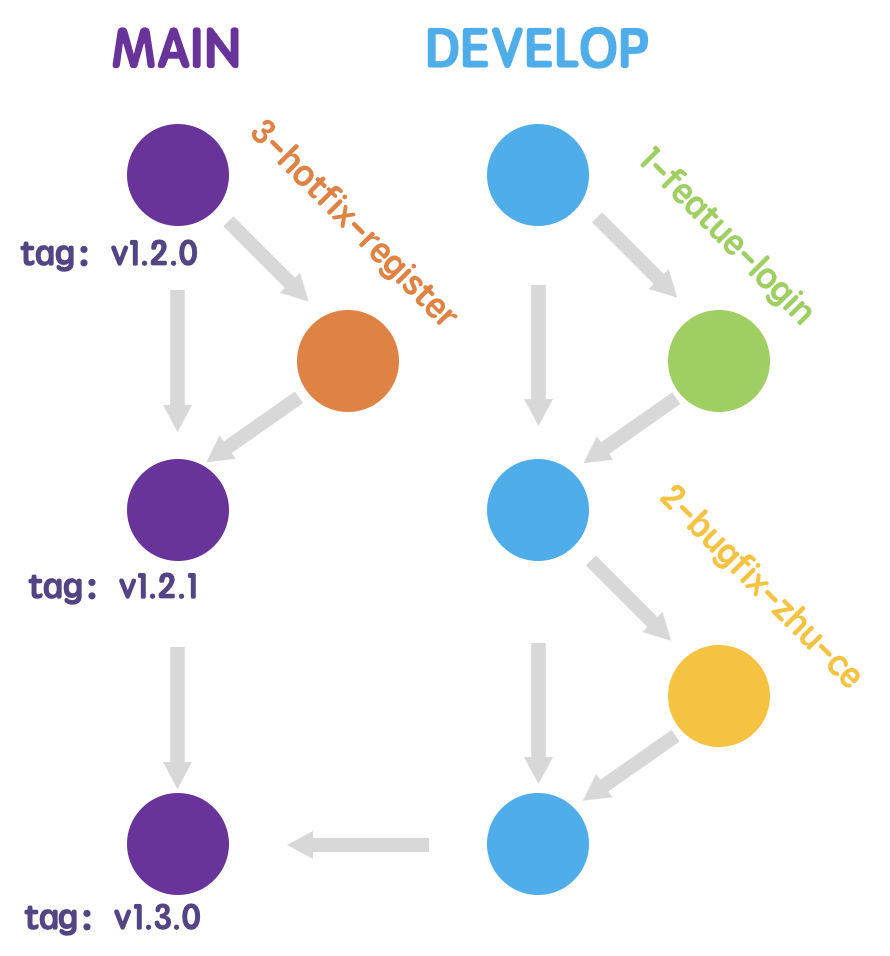

# 编程规范

> 记录自己所总结和遵守的编程规范（即个人风格指南）
> 
> 推荐书籍：《阿里巴巴Java开发手册（泰山版）.pdf》

## 命名规范与项目结构

### 命名规范

命名规范是编程规范中最重要的一部分，它直接影响到代码的可读性和可维护性

::: tip 常用的命名形式

- `camelCase` 小驼峰式命名法（首字母小写）
- `PascalCase` 大驼峰式命名法（首字母大写）
- `snake_case` 下划线命名法
- `kebab-case` 短横线命名法
- `UPPER_CASE` 大写命名法

:::

### Android 开发编程规范

::: info
本规范适用于 Android 开发，涵盖文件命名、变量命名和其他最佳实践。
也可以参考内容: [otlin开始基础知识(三）：编码规范](https://blog.csdn.net/m0_47308415/article/details/131779165)
:::

### 文件命名规范

- 项目名称使用短横线命名法。🌰 `my-android-app`
- 源文件使用小写字母与短横线连接法。🌰 `user-profile.kt`
- 组件文件使用大写驼峰式命名法。🌰 `UserProfile.kt`
- 资源文件使用短横线命名法。🌰 `ic_user_avatar.xml`

### 命名规范

- 常量使用大写命名法。🌰 `const val MAX_COUNT = 100`
- 变量使用小驼峰式命名法。🌰 `val userCount = 100`
- 类名使用大驼峰式命名法。🌰 `data class User(val name: String)`
- 函数使用小驼峰式命名法。🌰 `fun getUserInfo() { }`
- 对象属性使用小驼峰式命名法。🌰 `val user = User(name = "maomao")`

### 其他最佳实践

- 采用单一责任原则，确保每个类和函数只负责一个功能。
- 使用注释解释复杂逻辑，但避免冗余注释。
- 在函数和类的命名中使用动词和名词，清晰表达其意图。🌰 `fun fetchUserData()`
- 避免使用魔法数字，使用常量替代。🌰 `const val TIMEOUT_DURATION = 5000`


### 项目结构

> 对于安卓的项目结构得看设计的架构，十分复杂多变。
> 
> 以下介绍基于 Jetpack Compose 和 MVI 设计模式的项目结构

1. **UI 层**

**Composable 函数**：用于定义界面，通常放在 `ui` 目录中。按功能划分成不同的文件。

**主题和样式**：集中管理应用的主题和样式，放在 `ui/theme` 目录。

2. **ViewModel 层**

**ViewModel**：用于处理 UI 逻辑，存储界面状态，通常放在 `viewmodel` 目录中。

**Intent**：定义用户意图和操作，放在 `viewmodel/intent` 目录。

3. **Model 层**

**数据模型**：定义应用中的数据结构，通常放在 `model` 目录。

**数据源**：包括网络请求和本地存储的实现，放在 `repository` 或 `data` 目录。

4. **状态管理**

**UI 状态**：使用数据类定义 UI 状态，通常放在 `state` 目录。

**状态处理**：在 ViewModel 中管理状态变更和转换逻辑。

5. **导航**

**导航组件**：管理不同界面的导航逻辑，通常放在 `navigation` 目录。

6. **依赖注入**
**依赖管理**：使用 Dagger 或 Hilt 等工具进行依赖注入，通常放在 `di` 目录。

7. **测试**
**单元测试**：对 ViewModel 和业务逻辑进行单元测试，通常放在 `test` 目录。

8. **UI 测试**：对 Composable 函数进行 UI 测试，通常放在 `androidTest` 目录。

**参考目录**

```sh
app
  ├── ui
  │   ├── HomeScreen.kt  # 主屏幕的 Composable 函数
  │   ├── DetailScreen.kt  # 详细信息屏幕的 Composable 函数
  │   └── theme
  │       └── Theme.kt  # 主题和样式设置
  ├── viewmodel
  │   ├── HomeViewModel.kt  # 处理主屏幕逻辑的 ViewModel
  │   └── DetailViewModel.kt  # 处理详细信息屏幕逻辑的 ViewModel
  ├── model
  │   └── User.kt  # 用户数据模型
  ├── repository
  │   └── UserRepository.kt  # 数据源管理
  ├── navigation
  │   └── AppNavigator.kt  # 应用的导航逻辑
  ├── di
  │   └── AppModule.kt  # 依赖注入模块
  ├── state
  │   └── UserState.kt  # 用户界面的状态管理
  └── test
      └── HomeViewModelTest.kt  # HomeViewModel 的单元测试
```

## `Git` 规范

这里给大家推荐阅读: [一种简洁又不失优雅的工作流：极狐 flow](https://xie.infoq.cn/article/6b1f70c0203e38ceaccd11879)

### `Git` 流程规范(极狐flow)

注意：`极狐flow`适用于公司小型项目，github开源项目最好使用`github flow`。
[一种简洁又不失优雅的工作流：极狐 flow](https://xie.infoq.cn/article/6b1f70c0203e38ceaccd11879) 有介绍三种不同的工作流。

**分支模型**

分支模型如下图：

 - 共享开发分支（Develop）：用于集成功能分支的代码，由于设置了保护分支，所以应根据需求创建特性分支，通过自动化流水线进行质量看护，经代码评审后合入共享开发分支，同时默认删除特性分支；

 - 主分支（Main）：用于正式版本和热修复版本发布。由于`Master`一词有所争议，因此我们主分支采用`Main`



**分支命名规范**

> **正则表达式**（如果是小型项目，可省略 develop 分支）：
>
> main|develop|(\d+\-(feature|bugfix|hotfix)\-[A-Za-z0-9]+)
>
> 
>
> **分支示例**：
>
> master：主分支
>
> develop：共享开发分支
>
> 1-feature-sms-deng-lu：需求分支
>
> 2-bugfix-sms-repeat：缺陷分支
>
> 3-hotfix-register-failed：热修分支

其中数字为需求/缺陷的 ID，所以应当先创建需求/缺陷，再写代码，**杜绝「口头加需求」、「口头报 bug」的情况**。通过需求分支和合并请求草稿功能，可以方便地为需求人员创建需求分支，暂存代码修改。

使用极狐 GitLab 创建需求/缺陷应使用「feature|bugfix|hotfix」开头，可以一键创建符合规范的分支，开发人员再也不用为分支命名发愁。另外中文需求（issue）可自动转化为拼音分支名，例如：Feature：SMS 登录变为 1-feature-sms-deng-lu。

::: tip 提示
这里提到的需求/缺陷的 ID，就是我们提的`issue`的ID。

注意`issue`意为问题，不止包括缺陷，也包括需求。
:::


### `Git` 提交规范(github)

> `git commit message` 的格式

```sh
<type>(<scope>): <subject>

<body>

<footer>
```

- `type`（必填）：`commit` 的类型
- `scope`（选填）：`commit` 的影响范围
- `subject`（必填）：`commit` 信息的简短描述（50 字以内）
- `body`（选填）：`commit` 信息的具体描述
- `footer`（选填）：重大变化（`Breaking Change`）和需要关闭的`Issue`

**正则校验规则**：

```js
/**
 * 基于 vue 项目中的 verify-commit-msg.js 修改
 * https://github.com/vuejs/vue/blob/main/scripts/verify-commit-msg.js
 */
const commitRE =
  /^((revert|wip|draft): )?(feat|fix|docs|style|refactor|perf|types|test|build|ci|chore)(\(.+\))?: .{1,50}/
```
**示例**：

```js
Author: suzhe <suzhe@xxxx.com>
Date:   Fri Sep 13 15:04:43 2024 +0800

feat: set LeanKeyboard as the default input method

- Add `config_enabled_input_methods` and `config_default_input_method` to use `com.liskovsoft.leankeyboard` as the default keyboard.
- verify the available input methods using:`adb shell ime list -s`

ISSUES CLOSED: #21
```

#### `commit` 常用的 `type`

|       type       | 含义                                   |
| :--------------: | :------------------------------------- |
|      _feat_      | 新功能                                 |
|      _fix_       | 修复 bug                               |
|      _docs_      | 文档类改动                             |
|     _style_      | 代码格式改动，同理适用于业务样式调整   |
|    _refactor_    | 重构（即不是新增功能，也不是修复 bug） |
|      _perf_      | 性能优化相关                           |
|     _types_      | `TypeScript` 类型相关的改动            |
|      _test_      | 单元测试、e2e 测试                     |
|     _build_      | 构建工具或者依赖项的改动               |
|       _ci_       | 修改项目持续集成流程                   |
|     _chore_      | 其他类型的提交                         |
|     _revert_     | 恢复或还原相关提交                     |
| _wip_ \| _draft_ | 托管平台对应的草稿标识                 |

- [Conventional Commits | GitHub](https://github.com/conventional-commits/conventionalcommits.org)
- [Angular convention | Github](https://github.com/angular/angular/blob/22b96b9/CONTRIBUTING.md#-commit-message-guidelines)

### `tag` 与版本号规范

> **采用 npm 和语义化规范，版本号不使用 v 前缀，而 Git tag 使用 v 前缀，避免纯数字导致的问题，正则表达式**：
>
> v(\d+\.){1,2}\d+
>
> **示例**：
>
> v0.1
>
> v1.2.0
>
> v2.0.0

当提取 Git tag 用作 Docker、maven、npm 等版本号时，应在使用时去除 v 前缀，比如：

[https://Github.com/nodejs/node/releases/tag/v19.1.0](https://xie.infoq.cn/link?target=https%3A%2F%2Fgithub.com%2Fnodejs%2Fnode%2Freleases%2Ftag%2Fv19.1.0)

docker pull node:19.1.0

maven se.bjurr.violations:violations-maven-plugin:1.50.4

