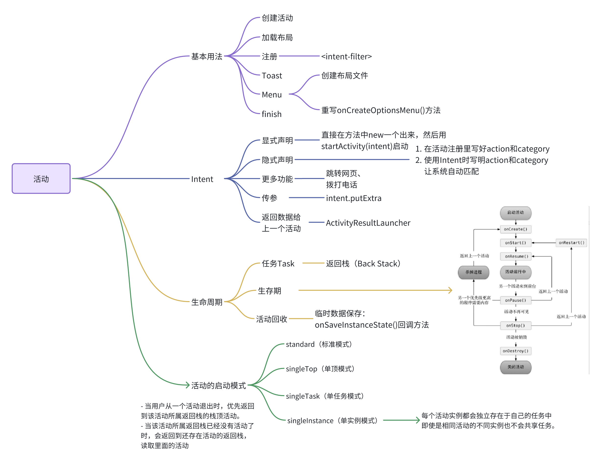
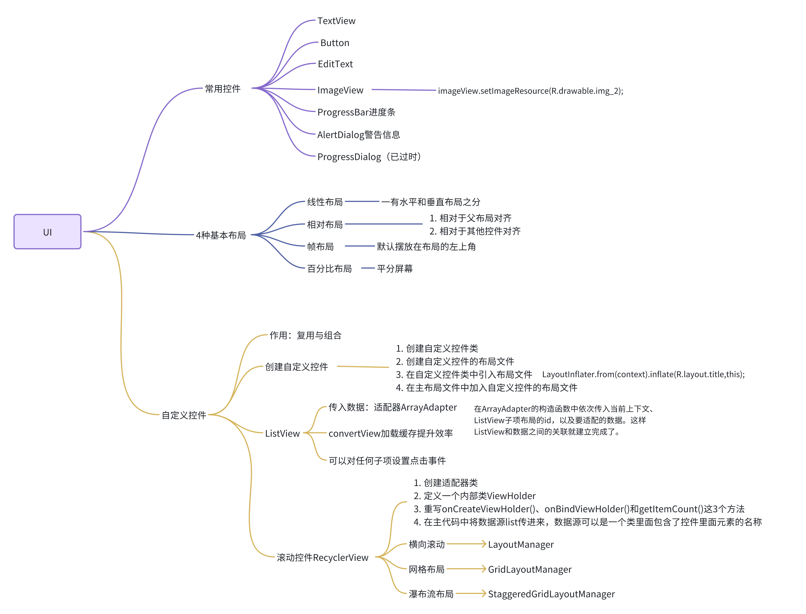
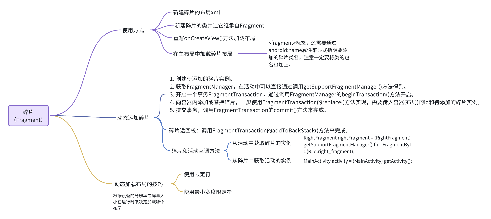
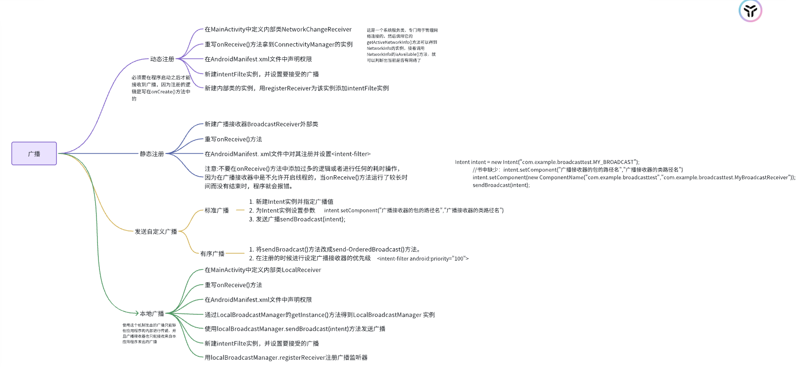
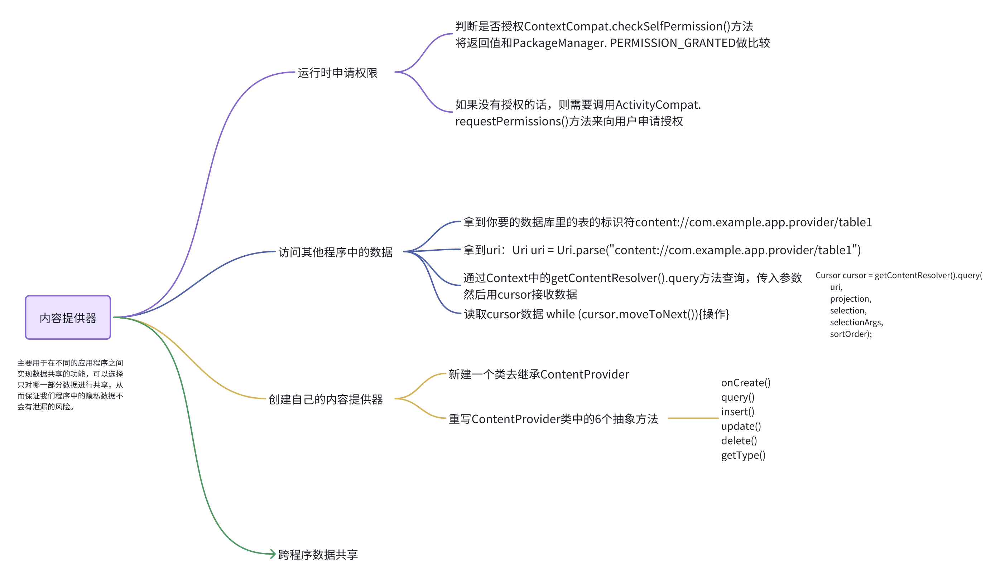
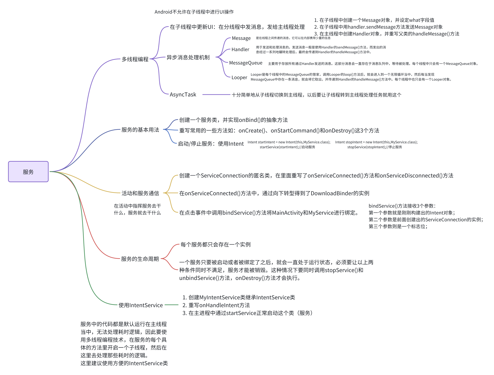

::: tip
作者：@苏柘 

创建时间：2023年9月1日

最后修改时间：2024年2月28日11:17:24
:::

# 学习重点

Android系统的四大组件：

（1）活动（Activity）：是所有Android应用程序的门面，凡是在应用中你看得到的东西，都是放在活动中的。

（2）服务（Service）：你无法看到它，但它会一直在后台默默地运行，即使用户退出了应用，服务仍然是可以继续运行的。

（3）广播接收器（Broadcast Receiver）：广播接收器允许你的应用接收来自各处的广播消息，比如电话、短信等，当然你的应用同样也可以向外发出广播消息。

（4）内容提供器（Content Provider）：为应用程序之间共享数据提供了可能，比如你想要读取系统电话簿中的联系人，就需要通过内容提供器来实现。

（5）完成本书最后的大作业，天气APP

# 参考笔记

[长河落日圆-个人学习笔记](https://www.cnblogs.com/1693977889zz/p/16256303.html)

# 开始第一个Android项目

注意点：

1. 如果要跟着《第一行代码：Android篇（第2版）》这本书学习一定一定一定要把**SDK版本以及设备模拟器设置成和书里一样的**，我一开始就是因为SDK版本太高出现了很多的错误和不同之处。以前的旧版本虽然和新版本有不一样的地方但是不影响理解Android架构。书中的配置是：

Minimum SDK：API 15

设备模拟器：Nexus 5X

操作系统版本：API Level： 24 ，Target： Android 7.0 (Google Play)

1. 多用调试工具Log而不是System.out

除了Log.v()、Log.d()、Log.i()、Log.w()、Log.w()之外，logcat中还能很轻松地添加过滤器

目前只有3个过滤器：

- Show only selected application表示只显示当前选中程序的日志；
- Firebase是谷歌提供的一个分析工具，我们可以不用管它；
- NoFilters相当于没有过滤器，会把所有的日志都显示出来；

1. 目录结构略，可以参考上面提供的笔记链接，和书上的内容一样。

# 第一章 活动

注意点：

1. 第一次Greadle构建需要点时间，要下载很多东西，需要翻墙，可能失败，没关系多试几次。
2. 新建project的时候记得一定要选择语言为Java，但是注意如果选择Empty Activity就会没有语言选择的选项，所以我们跟着书上选择No Activity或者Empty View Activity



## 1. 活动的基本用法🎯

### 1.1 创建活动

1. 在创建新的活动的时候会遇到几个选项：

- 勾选Generate Layout File表示会自动为FirstActivity创建一个对应的布局文件
- 勾选Launcher Activity表示会自动将FirstActivity设置为当前项目的主活动

1. 创建的.xml的layout布局文件在右上角可以有几种模式选择

- Code Mode（代码模式）： 这个模式允许您直接编辑布局文件的 XML 代码。您可以在这里手动编写 XML 代码来定义布局结构、属性和样式。这是最灵活的方式，适用于对 XML 布局代码熟悉的开发者。
- Split Mode（分割模式）： 这个模式将布局文件分为两个窗格，上半部分显示布局的设计预览，下半部分显示布局的 XML 代码。这允许您同时查看设计和代码，方便调整布局时的实时预览以及在代码中进行必要的修改。
- Design Mode（设计模式）： 这个模式提供了一个可视化的界面，允许您通过拖放组件、设置属性和布局，以图形方式创建和编辑布局。在这个模式下，您可以快速预览 UI 的外观，而不需要直接编辑代码。

### 1.2 活动注册

**所有的活动都要在AndroidManifest.xml中进行注册才能生效**，一般编辑器会帮我们自动注册。

1. intent-filter用于指定主活动,即点击桌面应用程序图标时首先打开的就是这个活动。

```C++
<intent-filter>
        <action android:name="android.intent.action.MAIN" />
        <category android:name="android.intent.category.LAUNCHER" />
</intent-filter>
```

1. android:label指定活动中标题栏的内容

```C++
android:label="This is FirstActivity"
```

### 1.3 **提醒小弹窗Toast**

Toast是Android系统提供的一种非常好的提醒方式，在程序中可以使用它将一些短小的信息通知给用户，这些信息会在一段时间后自动消失，并且不会占用任何屏幕空间。

下面这段代码我们一般放在点击事件里面

```C++
Toast.makeText(FirstActivity.this,"You clicked Button 1",Toast.LENGTH_SHORT).show();
```

makeText()方法需要传入3个参数。

- 第一个参数是Context，是Toast要求的上下文，由于活动本身就是一个Context对象，因此这里直接传入FirstActivity.this即可。
- 第二个参数是Toast显示的文本内容。
- 第三个参数是Toast显示的时长，有两个内置常量可以选择Toast.LENGTH_SHORT和Toast.LENGTH_LONG。

### 1.4 顶部小菜单**Menu**

效果是在标题栏的右侧多了一个三点的符号，这个就是菜单按钮。点击之后会显示多个我们定义好的菜单按键，使用方式如下：

1. 新建菜单文件：文件夹→New→Menu resource file
2. 编写菜单按钮：在main.xml中添加代码

```C++
<?xml version="1.0" encoding="utf-8"?>
<menu xmlns:android="http://schemas.android.com/apk/res/android">
    <itemandroid:id="@+id/add_item"android:title="Add"/>
    <itemandroid:id="@+id/remove_item"android:title="Remove"/>
</menu>
```

上面的代码建了两个菜单项，其中`<item>`标签就是用来创建具体的某一个菜单项，然后通过android:id给这个菜单项指定一个唯一的标识符，通过android:title给这个菜单项指定一个名称。

1. 给当前活动创建菜单：回到FirstActivity中来重写onCreateOptionsMenu()方法，重写的内容里面通过getMenuInflater()方法能够得到MenuInflater对象再调用它的inflate()方法就可以给当前活动创建菜单。

```C++
@Override
    public boolean onCreateOptionsMenu(Menu menu) {
        getMenuInflater().inflate(R.menu.main,menu);
        return true;
    }
```

1. 给菜单按钮编写逻辑处理：在FirstActivity中重写onOptionsItemSelected()方法，

```C++
@Override
public boolean onOptionsItemSelected(@NonNull MenuItem item) {

    if(item.getItemId() == R.id.add_item)
        Toast.makeText(this,"You clicked Add",Toast.LENGTH_SHORT).show();
    if(item.getItemId() == R.id.remove_item)
        Toast.makeText(this,"You clicked Remove",Toast.LENGTH_SHORT).show();
    return true;
}
```

注意这里的代码和书上的不一样，因为现在好像不能使用 case R.id.add_item了，必须是一个静态常量才行，所以我换成了if语句判断。这样写完后点击菜单按钮就会有不同的处理回应了。

### 1.5 **销毁一个活动 finish()**

销毁活动的方式有两种，一种是按一下Back键，另一种是通过代码 finish();

## 2. 活动之间的跳转🎯

### 2.1 活动间的跳转**Intent**

> Intent是Android程序中各组件之间进行交互的一种重要方式，它不仅可以指明当前组件想要执行的动作，还可以在不同组件之间传递数据。Intent一般可被用于启动活动、启动服务以及发送广播等场景。

Intent大致可以分为两种：**显式Intent和隐式Intent**。

#### 2.1.1 显**式**使用

在FirstActivity的中按钮的点击事件中加入以下代码：

```C++
Intent intent=new Intent(FirstActivity.this,SecondActivity.class);
startActivity(intent);
```

第一个参数是FirstActivity.this作为上下文

第二个参数是SecondActivity这个活动

这样就会在点击按钮时运行这段代码启动SecondActivity活动

#### 2.1.2 隐**式**使用

它并不明确指出我们想要启动哪一个活动，而是指定了一系列更为抽象的action和category等信息，然后交由系统去分析这个Intent，并帮我们找出合适的活动去启动。

1. 在`<activity>`标签下配置`<intent-filter>`的内容，可以指定当前活动能够响应的action和category

```C++
<intent-filter>
    <action android:name="com.example.activitytest.ACTION_START" />
    <category android:name="android.intent.category.DEFAULT" />
    <category android:name="com.example.activitytest.MY_CATEGORY" />
</intent-filter>
```

这时候的FirstActivity中按钮的点击事件中的Intent 要这么写：

```C++
Intent intent=new Intent("com.example.activitytest.ACTION_START");
startActivity(intent);
```

注意：

- 这里的`<intent-filter>`是在SecondActivity的`<activity>`标签里面哦，表示的是SecondActivity活动可以响应Intent中指定的action和category中的内容同时能够匹配上`<action>`和`<category>`标签里面的内容的Intent。
- SecondActivity的category 可以指定多个，匹配上一个就行，FirstActivity的Intent 可以不指定category ，这时会默认给一个DEFAULT的category ，但是如果想换其他的category 就需要指定。

```C++
Intent intent=new Intent("com.example.activitytest.ACTION_START");
intent.addCategory("com.example.activitytest.MY_CATEGORY");
startActivity(intent);
```

#### 2.1.3 隐**式Intent 的更多用法-跳转网页、拨打电话...**

  隐式Intent除了用于Activity跳转，还可以用于拨打电话、发送短信、访问网页、调用音乐播放器、调用视频播放器、发送邮件和打开地图等。

拨打电话：

```Java
//隐式Intent拨打电话
Intent intent=new Intent(Intent.ACTION_DIAL);
intent.setData(Uri.parse("tel:10086"));
startActivity(intent);
```

发送短信：

```Java
//隐式发送短信
Intent intent = new Intent(Intent.ACTION_VIEW);
intent.putExtra("这里填写短信收信人", "这里填写短信内容");
intent.setType("vnd.android-dir/mms-sms");
startActivity(intent);
```

访问网页：

```Java
//隐式Intent访问网页
Intent intent=new Intent(Intent.ACTION_VIEW);
intent.setData(Uri.parse("http://www.baidu.com"));
startActivity(intent);
```

调用音乐播放器：

```Java
//调用音乐播放器
Intent intent = new Intent(Intent.ACTION_VIEW);
Uri uri = Uri.parse("file://sdcard/demo.mp3");
intent.setDataAndType(uri, "audio/mp3");
startActivity(intent);
```

调用视频播放器：

```Java
//调用视频播放器
Intent intent = new Intent(Intent.ACTION_VIEW);
Uri uri = Uri.parse("file://sdcard/demo.mp4");
intent.setDataAndType(uri, "video/mp4");
startActivity(intent);
```

发送邮件：

```Java
//发送邮件
Intent intent = new Intent(Intent.ACTION_SENDTO);
intent.setData(Uri.parse("mailto:xxx@gmail.com"));
intent.putExtra(Intent.EXTRA_SUBJECT, "这是标题");
intent.putExtra(Intent.EXTRA_TEXT, "这是内容");
startActivity(intent);
```

打开地图：

```Java
//打开地图查看某经纬度的地点（如：天安门）
Intent intent = new Intent(Intent.ACTION_VIEW);
intent.setData(Uri.parse("geo:39.9073,116.3912"));
startActivity(intent);
```

### 2.2 **向下一个活动传递数据 intent.putExtra**

Intent中提供了一系列putExtra()方法的重载，可以把想要传递的数据暂存在Intent中，启动了另一个活动后，只需要把这些数据再从Intent中取出就可以了。

比如在FirstActivity中：

```C++
button1.setOnClickListener(new View.OnClickListener() {
    @Override
    public void onClick(View view) {
        String data="Hello SecondActivity";
        Intent intent= new Intent(FirstActivity.this,SecondActivity.class);
        intent.putExtra("extra data",data);
        startActivity(intent);
    }
});
```

使用显式Intent的方式来启动SecondActivity，并通过putExtra()方法传递了一个字符串。注意这里putExtra()方法接收两个参数，第一个参数是键，用于后面从Intent中取值，第二个参数才是真正要传递的数据。

然后在SecondActivity中将传递的数据取出，并打印出来，代码如下所示：

```C++
public class SecondActivity extends AppCompatActivity {

    @Override
    protected void onCreate(Bundle savedInstanceState) {
        super.onCreate(savedInstanceState);
        setContentView(R.layout.second_layout);
        Intent intent = getIntent();
        String data = intent.getStringExtra("extra data");
        Log.d("SecondActivity",data);
    }
```

注意：

- 如果传递的是整型数据，则使用getIntExtra()方法；如果传递的是布尔型数据，则使用getBooleanExtra()方法，以此类推。

### 2.3 **返回数据给上一个活动****`ActivityResultLauncher`** **实例**

这一部分的内容需要注意，书上给的例子是使用 `startActivityForResult()`但是在 Android 11（API 级别 30）及以后的版本中，方法 `startActivityForResult(Intent, int)` **已经被弃用**。尽管它仍然可以使用，但为了确保兼容性和未来的应用程序发展，建议使用新的替代方案。现在，可以使用 `ActivityResultLauncher` API 来替代 `startActivityForResult()`。这个新的 API 提供了更灵活和现代的方式来处理活动结果。

1. 声明 ActivityResultLauncher：

在FirstActivity中，声明一个 `ActivityResultLauncher` 对象。你需要指定你想使用的合同（例如，`ActivityResultContracts.StartActivityForResult()`）。

```Java
ActivityResultLauncher<Intent> myLauncher = registerForActivityResult(
    new ActivityResultContracts.StartActivityForResult(),
    result -> {
        if (result.getResultCode() == RESULT_OK) {
            // 处理结果Intent data = result.getData();
            // ...
        }
    }
);
```

1. 启动活动：

现在，不再使用 `startActivityForResult()`，而是在 `ActivityResultLauncher` 实例上调用 `launch()` 方法来启动活动。下面的例子中我通过intent.putExtra传入了参数。

```Java
@Override
public void onClick(View view) {
    Intent intent = new Intent();
    intent.putExtra("data_return","Hello FirstActivity");
    setResult(RESULT_OK,intent);
    finish();
}
```

1. 处理结果：

现在我要在FirstActivity提取我们传来的参数，只需要修改声明 ActivityResultLauncher时候的代码：

```C++
private final ActivityResultLauncher<Intent> myLauncher = registerForActivityResult(
        new ActivityResultContracts.StartActivityForResult(),
        result -> {
            if (result.getResultCode() == RESULT_OK) {
                Intent data = result.getData();//拿取传过来的数据
                if (data != null) {
                    String returnedData = data.getStringExtra("data_return");
                    if (returnedData != null) {
                        // 弹出提示框
                        AlertDialog.Builder builder = new AlertDialog.Builder(this);
                        builder.setMessage(returnedData)
                                .setTitle("Returned Data")
                                .setPositiveButton("OK", null);
                        AlertDialog dialog = builder.create();
                        dialog.show();
                    }
                }
            }
        }
);
```

通过String returnedData = data.getStringExtra("data_return");拿到我们的数据再进行处理。

### 补充：如果通过按下Back键返回呢

如果用户在SecondActivity中并不是通过点击按钮，而是通过按下Back键回到FirstActivity，我们可以通过在SecondActivity中重写onBackPressed()方法来处理返回的数据。

```C++
@Override
public void onBackPressed() {
    Intent intent = new Intent();
    intent.putExtra("data_return","Hello FirstActivity");
    setResult(RESULT_OK,intent);
    finish();
}
```

在用户点击Back键的时候就会调用这个函数，那么我们的intent.putExtra存进去的数据仍然可以传回去。

2.1 **活动的生命周期**

## 3. 活动的生命周期🎯

### 3.1 返回栈

1. Android中的活动是可以层叠的。每启动一个新的活动，就会覆盖在原活动之上，然后点击Back键会销毁最上面的活动，下面的一个活动就会重新显示出来。
2. **Android是使用任务（Task）来管理活动的**，一个任务就是一组存放在栈里的活动的集合，这个栈也被称作返回栈（Back Stack）。
3. **系统总是会显示处于栈顶的活动给用户。**

返回栈是如何管理活动入栈出栈操作的示意图：


### 3.2 **活动状态**

每个活动在其生命周期中最多可能会有4种状态。

1. 运行状态

当一个活动位于返回栈的栈顶时，这时活动就处于运行状态。系统最不愿意回收的就是处于运行状态的活动，因为这会带来非常差的用户体验。

1. 暂停状态

当一个活动不再处于栈顶位置，但仍然可见时，这时活动就进入了暂停状态。处于暂停状态的活动仍然是完全存活着的，系统也不愿意去回收这种活动（因为它还是可见的，回收可见的东西都会在用户体验方面有不好的影响），只有在内存极低的情况下，系统才会去考虑回收这种活动。

1. 停止状态

当一个活动不再处于栈顶位置，并且完全不可见的时候，就进入了停止状态。系统仍然会为这种活动保存相应的状态和成员变量，但是这并不是完全可靠的，当其他地方需要内存时，处于停止状态的活动有可能会被系统回收。

1. 销毁状态

当一个活动从返回栈中移除后就变成了销毁状态。系统会最倾向于回收处于这种状态的活动，从而保证手机的内存充足。

### 3.3 **活动的生存期**

Activity类中定义了7个回调方法，覆盖了活动生命周期的每一个环节，下面就来一一介绍这7个方法。

1. onCreate()：它会在活动第一次被创建的时候调用。你应该在这个方法中完成活动的初始化操作，比如说加载布局、绑定事件等。
2. onStart()：在活动由不可见变为可见的时候调用。
3. onResume()：在活动准备好和用户进行交互的时候调用。此时的活动一定位于返回栈的栈顶，并且处于运行状态。
4. onPause()：在系统准备去启动或者恢复另一个活动的时候调用。我们通常会在这个方法中将一些消耗CPU的资源释放掉，以及保存一些关键数据，但这个方法的执行速度一定要快，不然会影响到新的栈顶活动的使用。
5. onStop()：在活动完全不可见的时候调用。它和onPause()方法的主要区别在于，如果启动的新活动是一个对话框式的活动，那么onPause()方法会得到执行，而onStop()方法并不会执行。
6. onDestroy()：在活动被销毁之前调用，之后活动的状态将变为销毁状态。
7. onRestart()：在活动由停止状态变为运行状态之前调用，也就是活动被重新启动了。

以上7个方法中除了onRestart()方法，其他都是两两相对的，从而又可以将活动分为3种生存期。

1. 完整生存期：活动在onCreate()方法和onDestroy()方法之间所经历的，就是完整生存期。一般情况下，一个活动会在onCreate()方法中完成各种初始化操作，而在onDestroy()方法中完成释放内存的操作。
2. 可见生存期：活动在onStart()方法和onStop()方法之间所经历的，就是可见生存期。在可见生存期内，活动对于用户总是可见的，即便有可能无法和用户进行交互。我们可以通过这两个方法，合理地管理那些对用户可见的资源。比如在onStart()方法中对资源进行加载，而在onStop()方法中对资源进行释放，从而保证处于停止状态的活动不会占用过多内存。
3. 前台生存期：活动在onResume()方法和onPause()方法之间所经历的就是前台生存期。在前台生存期内，活动总是处于运行状态的，此时的活动是可以和用户进行交互的，我们平时看到和接触最多的也就是这个状态下的活动。

### 3.4 活动回收后

想象以下场景：应用中有一个活动A，用户在活动A的基础上启动了活动B，活动A就进入了停止状态，这个时候由于系统内存不足，将活动A回收掉了，然后用户按下Back键返回活动A，会出现什么情况呢？

**其实还是会正常显示活动A的，只不过这时并不会执行onRestart()方法，而是会执行活动A的onCreate()方法，因为活动A在这种情况下会被重新创建一次。这样看上去好像一切正常，可是别忽略了一个重要问题，活动A中是可能存在临时数据和状态的。**打个比方，MainActivity中有一个文本输入框，现在你输入了一段文字，然后启动NormalActivity，这时MainActivity由于系统内存不足被回收掉，过了一会你又点击了Back键回到MainActivity，你会发现刚刚输入的文字全部都没了，因为MainActivity被重新创建了。因此，我们引入了可以在活动回收后保存数据的方法**onSaveInstanceState()****回调****方法，这个方法可以保证在活动被回收之前一定会被调用，因此我们可以通过这个方法来解决活动被回收时临时数据得不到保存的问题。**

1. 重写onSaveInstanceState()方法

```C++
@Override
    protected void onSaveInstanceState(Bundle outState) {
        super.onSaveInstanceState(outState);
        String tempData = "Something you just typed";
        outState.putString("data_key",tempData);
    }
```

1. 在onCreate()方法中加入判断

```C++
@Override
    protected void onCreate(Bundle savedInstanceState) {
        super.onCreate(savedInstanceState);
        Log.d(TAG,"onCreate");
        setContentView(R.layout.activity_main);
        if (savedInstanceState!=null) {
            String tempData = savedInstanceState.getString("data_key");
            Log.d(TAG,tempData);
        }
```

不过这里注意一点：

onSaveInstanceState()方法，它不是生命周期方法，它不同于生命周期方法，它并不会一定会被触发，它只有具备以下条件的时候才会触发：

1. 当按下HOME键的时
2. 长按HOME键，选择运行程序的时
3. 按下电源(关闭屏幕显示)时
4. 从Activity中启动其他Activity时
5. 屏幕方向切换时(例如从竖屏切换到横屏时)

如果想实现以上效果请使用**屏幕方向切换(例如从竖屏切换到横屏时)**

Intent还可以结合Bundle一起用于传递数据，首先可以把需要传递的数据都保存在Bundle对象中，然后再将Bundle对象存放在Intent里。到了目标活动之后先从Intent中取出Bundle，再从Bundle中一一取出数据。

## 4. 活动的启动模式🎯

> 活动的启动模式一共有4种，分别是standard、singleTop、singleTask和singleInstance，可以在AndroidManifest.xml中通过给`<activity>`标签指定android:launchMode属性来选择启动模式。

### 4.1 四种启动模式

1. Standard（标准模式）：
   1. 在这种模式下，每次启动活动时都会创建一个新的活动实例。
   2. 如果您多次启动同一活动，将会创建多个不同的实例，它们位于活动堆栈中的顶部。
   3. 这是默认的启动模式。
2. SingleTop（单顶模式）：
   1. 在这种模式下，如果新活动的实例已经位于栈的顶部，系统将重用该实例而不创建新的。
   2. 如果新活动不在栈的顶部，系统将创建新的实例并将其推入栈的顶部。
   3. 这允许在同一活动的不同任务之间共享实例，但在任务内仍然可以创建多个实例。
3. SingleTask（单任务模式）：
   1. 在这种模式下，对于同一个活动系统只允许一个活动实例存在于任务中。
   2. 如果新活动已经存在于任务中，系统将通过调用 `onNewIntent()` 方法来重新激活它，而不会创建新实例。
   3. 这通常用于定义应用的入口点，例如主界面。
4. SingleInstance（单实例模式）：
   1. 这是最特殊的启动模式，每个活动实例都会独立存在于自己的任务中。
   2. 即使是相同活动的不同实例也不会共享任务。
   3. 这通常用于具有独立性的组件，如电话应用中的来电界面。

每一个活动都可以单独设置启动模式，但是当有不同的启动模式的时候，会创建不同的返回栈，也可以叫做任务栈（Task Stack），此时活动退出时候的顺序和活动启动的顺序可能不一样。

- 当用户从一个活动退出时，优先返回到该活动所属返回栈的栈顶活动。
- 当该活动所属返回栈已经没有活动了时，会返回到还存在活动的返回栈，读取里面的活动

### 4.2 "任务"（Task）

在 Android 中，"任务"（Task）是一种管理应用活动（Activity）的方式。一个任务通常包含一个或多个活动，并用于组织和管理这些活动的生命周期。

1. 任务栈（Task Stack）：每个任务都有一个与之关联的活动栈，它是活动实例的有序堆栈。当您启动一个新的活动时，它将被推入栈的顶部。用户可以通过返回键按照栈的顺序导航回先前的活动。
2. 任务的启动：任务可以从应用的入口点（通常是主活动）开始，并随着用户与应用的互动而增长。您可以使用不同的启动模式来定义新活动如何与任务中的现有活动实例进行交互。
3. 任务之间的分离：不同任务的活动通常是相互分离的，它们不共享相同的任务栈。这意味着每个任务都有自己独立的活动堆栈。这在某些情况下很有用，例如使用 `singleInstance` 启动模式的活动。
4. 任务的生命周期：任务具有自己的生命周期，当任务中的最后一个活动关闭时，整个任务将被销毁。这可以在某些情况下用于应用的清理和管理。

## 5. **活动的**最佳实践技巧🎯

### 5.1 **知晓当前是在哪一个活动**

1. 新建一个BaseActivity类，创建时选择一个普通的Java类，不需要在AndroidManifest.xml中注册。
2. 让BaseActivity继承自AppCompatActivity，并重写onCreate()方法

```C++
public class BaseActivity extends AppCompatActivity {
    @Override
    protected void onCreate(@Nullable Bundle savedInstanceState) {
        super.onCreate(savedInstanceState);
        Log.d("BaseActivity",getClass().getSimpleName());
    }
```

1. 让BaseActivity成为ActivityTest项目中所有活动的父类

现在每当我们进入到一个活动的界面，该活动的类名就会被打印出来，这样我们就可以时时刻刻知晓当前界面对应的是哪一个活动了。

### 5.2 **随时随地退出程序**

用一个专门的集合类对所有的活动进行管理就可以随时随地都能退出程序，而不需要一个一个注销和退出。

1. 新建一个ActivityCollector类作为活动管理器

```C++
public class ActivityCollector {
    public static List<Activity> activities = new ArrayList<>();
    public static void addActivity(Activity activity){
        activities.add(activity);
    }
    public static void removeActivity(Activity activity){
        activities.remove(activity);
    }
    public static void finishAll(){
        for (Activity activity : activities) {
            if (!activity.isFinishing()){
                activity.finish();
            }
            activities.clear();
        }
    }
}
```

在活动管理器中，我们通过一个List来暂存活动，然后提供了一个addActivity()方法用于向List中添加一个活动，提供了一个removeActivity()方法用于从List中移除活动，最后提供了一个finishAll()方法用于将List中存储的活动全部销毁掉。

1. 修改BaseActivity中的代码

```C++
public class BaseActivity extends AppCompatActivity {
    @Override
    protected void onCreate(Bundle savedInstanceState) {
        super.onCreate(savedInstanceState);
        Log.d("BaseActivity",getClass().getSimpleName());
        ActivityCollector.addActivity(this);
    }
    @Override
    protected void onDestroy() {
        super.onDestroy();
        ActivityCollector.removeActivity(this);
    }
}
```

在BaseActivity的onCreate()方法中调用了ActivityCollector的addActivity()方法，表明将当前正在创建的活动添加到活动管理器里。然后在BaseActivity中重写onDestroy()方法，并调用了ActivityCollector的removeActivity()方法，表明将一个马上要销毁的活动从活动管理器里移除。

从此以后，不管你想在什么地方退出程序，只需要调用ActivityCollector.finishAll()方法就可以了。例如在ThirdActivity界面想通过点击按钮直接退出程序：

```C++
 Button button3 = (Button) findViewById(R.id.button_3);
        button3.setOnClickListener(new View.OnClickListener() {
            @Override
            public void onClick(View view) {
                ActivityCollector.finishAll();
            }
        });
```

当然你还可以在销毁所有活动的代码后面再加上杀掉当前进程的代码，以保证程序完全退出，杀掉进程的代码如下所示：

```Java
android.os.Process.killProcess(android.os.Process.myPid())
```

其中，killProcess()方法用于杀掉一个进程，它接收一个进程id参数，我们可以通过myPid()方法来获得当前程序的进程id。需要注意的是，killProcess()方法只能用于杀掉当前程序的进程，我们不能使用这个方法去杀掉其他程序。

### 5.3 **启动活动的最佳写法**

当我们启动一个活动需要两个特别重要的参数时，可以使用以下办法

假设SecondActivity中需要用到两个非常重要的字符串参数，在启动SecondActivity的时候必须要传递过来，

```C++
public class SecondActivity extends BaseActivity {
    public static void actionStart(Context context, String data1, String data2){
        Intent intent = new Intent (context,SecondActivity.class);
        intent.putExtra("param1",data1);
        intent.putExtra("param2",data2);
        context.startActivity(intent);
    }
    ......
}
```

在SecondActivity中添加了一个actionStart()方法，在这个方法中完成了Intent的构建，另外所有SecondActivity中需要的数据都是通过actionStart()方法的参数传递过来的，然后把它们存储到Intent中，最后调用startActivity()方法启动SecondActivity。

这样写的好处就是SecondActivity所需要的数据在方法参数中全部体现出来了，这样即使不用阅读SecondActivity中的代码，不去询问负责编写SecondActivity的同事，你也可以非常清晰地知道启动SecondActivity需要传递哪些数据。另外，这样写还简化了启动活动的代码，现在只需要一行代码就可以启动SecondActivity，如下所示：

在FirstActivity中：

```C++
protected void onCreate(Bundle savedInstanceState) {
    super.onCreate(savedInstanceState);
    Log.d("FirstActivity","Task id is "+getTaskId());
    setContentView(R.layout.first_layout);
    Button button1=(Button) findViewById(R.id.button_1);
    button1.setOnClickListener(new View.OnClickListener() {
        @Override
        public void onClick(View view) {
            //Intent intent = new Intent(FirstActivity.this,SecondActivity.class);
            //startActivity(intent);
            SecondActivity.actionStart(FirstActivity.this,"data1","data2");
        }
    });
}
```

# 第二章 UI



## 1. 文本控件-**TextView**🎯

### 1.1 **基础属性**

1. layout_width:组件的宽度
2. layout height:组件的高度

Android中所有的控件都具有这两个属性，可选值有3种：match_parent、fill_parent和wrap_content。

- match_parent和fill_parent的意义相同，现在官方更加推荐使用match_parent。
- match_parent表示让当前控件的大小和父布局的大小一样，也就是由父布局来决定当前控件的大小。
- wrap_content表示让当前控件的大小能够刚好包含住里面的内容，由控件内容决定当前控件的大小。

1. id:为TextView设置一个组件id
2. text:设置显示的文本内容
3. textColor:设置字体颜色
4. textStyle:设置字体风格，三个可选值：normal(无效果)，bold加粗)，italic(斜体)
5. textSize:字体大小，单位一般是用sp
6. background:控件的背景颜色，可以理解为填充整个控件的颜色，可以是图片
7. gravity:设置控件中内容的对齐方向，TextView中是文字，ImageView中是图片等等。

使用android:gravity来指定文字的对齐方式，可选值有top、bottom、left、right、center等，可以用“|”来同时指定多个值，这里我们指定的center，效果等同于center_vertical|center_horizontal，表示文字在垂直和水平方向都居中对齐。

### 1.2 阴影

1. android::shadowColor:设置阴影颜色，需要与shadowRadius一起使用
2. android:shadowRadius:设置阴影的模胡程度，设为0.1就变成字体颜色了，建议使用3.0
3. android:shadowDx:设置阴影在水平方向的偏移，就是水平方向阴影开始的横坐标位置
4. android:shadowDy:设置阴影在竖直方向的偏移，就是竖直方向阴影开始的纵坐标位置

### 1.3 跑马灯效果

android:singleLine:内容单行显示

android:focusable是否可以获取焦点

android:focusablelnTouchMode:用于控制视图在触摸模式下是否可以聚焦

android:ellipsize:在哪里省略文本，当字数太多可以选择在前面后面增加省略号以省略文本

android:marqueeRepeatLimit:字幕动画重复的次数

## 2. 按钮控件-**Button**🎯

Button实际上是继承TextView的

### 2.1 大小写转换

我们在布局文件里面设置的文字是“Button”，但最终的显示结果却是“BUTTON”。这是由于系统会对Button中的所有英文字母自动进行大写转换，如果这不是你想要的效果，可以使用 `android:textAllCaps="false"`来禁用这一默认特性。

## 2.2 点击事件的两种方法

#### 2.2.1 匿名类

我们创建的对象，没有显示的赋值给一个变量名。即为匿名对象，匿名对象只能调用一次。就像我们有时候调用有返回值的函数确不需要用到返回值一样，我们只需要用到这个对象的某个方法而不需要再对这个对象做其他处理。

```C++
 Button button = (Button) findViewById(R.id.button);
        button.setOnClickListener(new View.OnClickListener() {
            @Override
            public void onClick(View view) {
                //此处添加逻辑
            }
        });
```

#### 2.2.2 实现接口

```C++
public class MainActivity extends AppCompatActivity implements View.OnClickListener{

    @Override
    protected void onCreate(Bundle savedInstanceState) {
        super.onCreate(savedInstanceState);
        setContentView(R.layout.activity_main);
        Button button = (Button) findViewById(R.id.button);
        button.setOnClickListener(this);
    }
    //实现View.OnClickListener接口
    @Override
    public void onClick(View v){
        switch (v.getId()){
            case R.id.button:
                //此处添加逻辑
                break;
            default:
                break;
        }
    }
}
```

#### 2.2.3 事件处理

1. 点击事件
2. 长按事件
3. 触摸事件

注意这三个事件的返回值。return true;时事件会被该动作函数消费，不会再执行其他函数

## 3. 编辑控件 EditText🎯

### 3.1 **基础属性**

1. android:hint输入提示
2. android:textColorHint输入提示文字的颜色
3. android:inputType输入类型
4. android:drawableXxxx在输入框的指定方位添加图片
5. android:drawablePadding设置图片与输入内容的间距
6. android:paddingXxxx设置内容与边框的间距
7. android:background背景色
8. android:maxLines 设置最大行数，因为如果EditText的高度指定的是wrap_content，它总能包含住里面的内容，当输入的内容过多时，界面就会变得非常难看。

通过android:maxLines指定了EditText的最大行数为两行，这样当输入的内容超过两行时，文本就会向上滚动，而EditText则不会再继续拉伸。

### 3.2 获取输出框内容-getText()

```C++
String inputText = editText.getText().toString();
Toast.makeText(MainActivity.this,inputText,Toast.LENGTH_SHORT).show();
```

## 4. 图片控件-**ImageView🎯**

ImageView是用于在界面上展示图片的一个控件，它可以让我们的程序界面变得更加丰富多彩。

图片通常都是放在以“drawable”开头的目录下的。目前我们的项目中有一个空的drawable目录，不过由于这个目录没有指定具体的分辨率，所以一般不使用它来放置图片。

这里注意，你放在文件夹里面的图片的命名不可以数字开头，一定要以字母开头

## 4.1 更换显示图片-setImageResource

```C++
 private ImageView imageView;
 imageView = (ImageView) findViewById(R.id.image_view);
 imageView.setImageResource(R.drawable.img_2);
```

## 5. 进度条控件-**ProgressBar🎯**

ProgressBar用于在界面上显示一个进度条，表示我们的程序正在加载一些数据。

```C++
    <ProgressBar
        android:layout_width="match_parent"
        android:layout_height="wrap_content"
        android:id="@+id/progress_bar"/>
```

显示效果是一个圆形进度条正在旋转

### 5.1 **Android控件的可见属性**

所有的Android控件都具有这个属性，可以通过android:visibility进行指定，可选值有3种：visible、invisible和gone。

- visible表示控件是可见的，这个值是默认值，不指定android:visibility时，控件都是可见的。
- invisible表示控件不可见，但是它仍然占据着原来的位置和大小，可以理解成控件变成透明状态了。
- gone则表示控件不仅不可见，而且不再占用任何屏幕空间。

我们还可以通过代码来设置控件的可见性，使用的是setVisibility()方法，可以传入View.VISIBLE、View.INVISIBLE和View.GONE这3种值。

### 5.2 **ProgressBar**样式

刚刚是圆形进度条，通过style属性可以将它指定成水平进度条

```C++
<ProgressBar
        android:layout_width="match_parent"
        android:layout_height="wrap_content"
        android:id="@+id/progress_bar"
        style="?android:attr/progressBarStyleHorizontal"
        android:max="100"/>
```

## 6. 对话框控件-**AlertDialog🎯**

AlertDialog可以在当前的界面弹出一个对话框，这个对话框是置顶于所有界面元素之上的，能够屏蔽掉其他控件的交互能力，因此AlertDialog一般都是用于提示一些非常重要的内容或者警告信息。比如为了防止用户误删重要内容，在删除前弹出一个确认对话框。


```C++
 AlertDialog.Builder dialog= new AlertDialog.Builder(MainActivity.this);
                dialog.setTitle("This is Dialog");
                dialog.setMessage("Something important.");
                dialog.setCancelable(false);//可否用Back键关闭对话框
                dialog.setPositiveButton("OK", new DialogInterface.OnClickListener() {
                    @Override
                    public void onClick(DialogInterface dialogInterface, int i) {
                    }
                });
                dialog.setNegativeButton("Cancel", new DialogInterface.OnClickListener() {
                    @Override
                    public void onClick(DialogInterface dialogInterface, int i) {
                    }
                });
                dialog.show();
```

### 6.1 **ProgressDialog**

ProgressDialog和AlertDialog有点类似，都可以在界面上弹出一个对话框，都能够屏蔽掉其他控件的交互能力。不同的是，ProgressDialog会在对话框中显示一个进度条，一般用于表示当前操作比较耗时，让用户耐心地等待。它的用法和AlertDialog也比较相似。


注意：这个方法现在已经过时了，现在的做法是通过在AlertDialog里面加一个progressDialog 来实现

```C++
// 创建一个 AlertDialog.Builder
AlertDialog.Builder builder = new AlertDialog.Builder(this);
builder.setTitle("正在加载"); // 对话框标题
builder.setView(new ProgressBar(this)); // 添加进度条视图

// 创建 AlertDialog 并显示
AlertDialog progressDialog = builder.create();
progressDialog.show();

// 在任务完成后关闭对话框
progressDialog.dismiss(); // 请在任务完成后调用此方法来关闭对话框
```

注意:如果在setCancelable()中传入了false，表示ProgressDialog是不能通过Back键取消掉的，这时你就一定要在代码中做好控制，当数据加载完成后必须要调用ProgressDialog的dismiss()方法来关闭对话框，否则ProgressDialog将会一直存在。

## 7. 四种布局**🎯**

### 7.1 **线性布局**

LinearLayout又称作线性布局，是一种非常常用的布局，这个布局会将它所包含的控件在线性方向上依次排列。

在之前学习控件用法时，我们所有的控件就都是放在LinearLayout布局里的。线性不止一个方向，但是由于我们通过android:orientation属性指定了排列方向是vertical，因此我们的控件也确实是在垂直方向上线性排列的。如果指定的是horizontal，控件就会在水平方向上排列了。

#### 7.1.1 LinearLayout

垂直线性布局


水平线性布局


注意：如果LinearLayout的排列方向是horizontal，内部的控件就绝对不能将宽度指定为match_parent，因为这样的话，单独一个控件就会将整个水平方向占满，其他的控件就没有可放置的位置了。同样的道理，如果LinearLayout的排列方向是vertical，内部的控件就不能将高度指定为match_parent。

#### 7.1.2 android:layout_gravity属性

android:layout_gravity属性和之前学到的android:gravity属性看起来有些相似。

- android:gravity用于指定文字在控件中的对齐方式
- android:layout_gravity用于指定控件在布局中的对齐方式。
- android:layout_gravity的可选值和android:gravity差不多。

注意：当LinearLayout的排列方向是horizontal时，只有垂直方向上的对齐方式才会生效，因为此时水平方向上的长度是不固定的，每添加一个控件，水平方向上的长度都会改变，因而无法指定该方向上的对齐方式。同样的道理，当LinearLayout的排列方向是vertical时，只有水平方向上的对齐方式才会生效。

比如，当你设置目前LinearLayout的排列方向是horizontal时，控件默认显示在一行左右排列嘛，但是这一行的垂直区域是归你的空间所属的，你可以指定垂直方向的对齐方式，如下图


#### 7.1.3 android:layout_weight属性

这个属性允许我们使用比例的方式来指定控件的大小，它在手机屏幕的适配性方面可以起到非常重要的作用。

例如：

```C++
<?xml version="1.0" encoding="utf-8"?>
<LinearLayout xmlns:android="http://schemas.android.com/apk/res/android"
    android:orientation="horizontal"
    android:layout_width="match_parent"
    android:layout_height="match_parent">
    <EditText
        android:id="@+id/input_message"
        android:layout_width="0dp"
        android:layout_height="wrap_content"
        android:layout_weight="1"
        android:hint="Type something"
        />
    <Button
        android:id="@+id/send"
        android:layout_width="0dp"
        android:layout_height="wrap_content"
        android:layout_weight="1"
        android:text="Send"/>
</LinearLayout>
```

1. 由于我们使用了android:layout_weight属性，此时控件的宽度就不应该再由android:layout_width来决定。所以这里规范的写法应当将EditText和Button的宽度都指定成0dp。
2. 然后在EditText和Button里都将android:layout_weight属性的值指定为1，这表示EditText和Button将在水平方向平分宽度。


为什么将android:layout_weight属性的值同时指定为1就会平分屏幕宽度呢？

系统会先把LinearLayout下所有控件指定的layout_weight值相加，得到一个总值，然后每个控件所占大小的比例就是用该控件的layout_weight值除以刚才算出的总值。因此如果想让EditText占据屏幕宽度的3/5, Button占据屏幕宽度的2/5，只需要将EditText的layout_weight改成3, Button的layout_weight改成2就可以了。

也就是说ndroid:layout_weight的值其实是个权重。

1. 还可以通过指定部分控件的layout_weight值来实现更好的效果。

比如只指定EditText的android:layout_weight属性，并将Button的宽度改回wrap_content，这样Button的宽度仍然按照wrap_content来计算，而EditText则会占满屏幕所有的剩余空间。（使用layout_weight实现宽度自适配效果，这种方式编写的界面，不仅在各种屏幕的适配方面会非常好，而且看起来也更加舒服。


### 7.2 **相对布局**

RelativeLayout又称作相对布局，也是一种非常常用的布局。和LinearLayout的排列规则不同，RelativeLayout显得更加随意一些，它可以通过相对定位的方式让控件出现在布局的任何位置。

也正因为如此，RelativeLayout中的属性非常多，不过这些属性都是有规律可循的。

#### 7.2.1 相对父布局定位

```C++
android:layout_alignParentLeft="true"
android:layout_alignParentRight="true"
android:layout_alignParentTop="true"
android:layout_alignParentBottom="true"
```

其中两个两个结合就是左上、右下等四个角的位置

#### 7.2.2 相对于控件进行定位

```C++
android:layout_above="@+id/button3"
android:layout_below="@+id/button3"
android:layout_toLeftOf="@+id/button3"
android:layout_toRightOf="@id/button3"
```

#### 7.2.3 边缘对齐

RelativeLayout中还有另外一组相对于控件进行定位的属性。

android:layout_alignLeft表示让一个控件的左边缘和另一个控件的左边缘对齐

android:layout_alignRight表示让一个控件的右边缘和另一个控件的右边缘对齐。

此外，还有android:layout_alignTop和android:layout_alignBottom，道理都是一样的。

### 7.3 **帧布局**

FrameLayout又称作帧布局，它相比于前面两种布局就简单太多了，因此它的应用场景也少了很多。这种布局没有方便的定位方式，所有的控件都会默认摆放在布局的左上角。

后添加的空间会直接盖在先添加的空间上面，除了这种默认效果之外，还可以使用layout_gravity属性来指定控件在布局中的对齐方式，这和LinearLayout中的用法是相似的。

### 7.4 **百分比布局**

只有LinearLayout支持使用layout_weight属性来实现按比例指定控件大小的功能，其他两种布局都不支持。如果想用RelativeLayout来实现让两个按钮平分布局宽度的效果，则是比较困难的。为此，Android引入了一种全新的布局方式来解决此问题——百分比布局。在这种布局中，我们可以不再使用wrap_content、match_parent等方式来指定控件的大小，而是允许直接指定控件在布局中所占的百分比，这样的话就可以轻松实现平分布局甚至是任意比例分割布局的效果了。

百分比布局提供了PercentFrameLayout和PercentRelativeLayout这两个全新的布局。**Android团队将百分比布局定义在了support库当中，我们只需要在项目的build.gradle中添加百分比布局库的依赖，就能保证百分比布局在Android所有系统版本上的****兼容性****了。**

1. 打开app/build.gradle文件，在dependencies闭包中添加如下内容：

```C++
dependencies {

    implementation 'androidx.appcompat:appcompat:1.3.0'
    implementation 'com.google.android.material:material:1.4.0'
    implementation 'androidx.constraintlayout:constraintlayout:2.0.4'

    androidTestImplementation 'androidx.test.ext:junit:1.1.3'
    androidTestImplementation 'androidx.test.espresso:espresso-core:3.4.0'

    implementation fileTree(dir: 'libs', include: ['*.jar'])
    implementation 'androidx.appcompat:appcompat:1.0.0'
    implementation 'androidx.percentlayout:percentlayout:1.0.0'
    testImplementation 'junit:junit:4.13.2'
}
```

注意❗：

如果你创建项目的时候用的不是传统的Groovy 脚本 (build.gradle)而是使用了 Kotlin 脚本 (build.gradle.kts) 作为构建脚本，可以按照以下步骤来添加依赖项：

- 打开项目根目录下的 `build.gradle.kts` 文件。
- 在文件中找到 `dependencies { }` 块，这是用于添加依赖项的地方。
- 在 `dependencies { }` 块内，使用 Kotlin 的语法来添加您的依赖项。例如，如果要添加一个 AndroidX 库的依赖项，可以像这样添加：
  - 

  - ```Kotlin
    dependencies {
        implementation("androidx.appcompat:appcompat:1.3.1")
        // 添加其他依赖项...
    }
    ```

  - 在上面的示例中，`implementation` 是依赖配置，`"androidx.appcompat:appcompat:1.3.1"` 是要添加的依赖项的坐标。您可以将坐标替换为您需要的依赖项的坐标。
  - 完成后，保存文件。
  - 在 Android Studio 中，点击 "Sync Now"（同步项目） 按钮，以确保依赖项正确地添加到您的项目中。

所以上面的dependencies 代码要这样写：

```C++
dependencies {
    implementation("androidx.appcompat:appcompat:1.3.0")
    implementation("com.google.android.material:material:1.4.0")
    implementation("androidx.constraintlayout:constraintlayout:2.0.4")

    androidTestImplementation("androidx.test.ext:junit:1.1.3")
    androidTestImplementation("androidx.test.espresso:espresso-core:3.4.0")

    implementation(fileTree(mapOf("dir" to "libs", "include" to listOf("*.jar"))))
    implementation("androidx.appcompat:appcompat:1.0.0")
    implementation("androidx.percentlayout:percentlayout:1.0.0")
    testImplementation("junit:junit:4.13.2")
}
```

1. 这里将依赖项的单引号替换为双引号，因为 Kotlin 构建脚本使用双引号来定义字符串。
2. 同时，我也将 `fileTree` 方法的参数包装在 `mapOf` 中，以正确传递参数。
3. 添加完后，请保存文件并同步项目，以确保依赖项被正确添加。

需要注意的是，每当修改了任何gradle文件时，Android Studio都会弹出一个如图：


这个提示告诉我们，gradle文件自上次同步之后又发生了变化，需要再次同步才能使项目正常工作。这里只需要点击Sync Now就可以了，然后gradle会开始进行同步，把我们新添加的百分比布局库引入到项目当中。

1. 接下来修改activity_main.xml中的代码，如下所示：

```C++
<?xml version="1.0" encoding="utf-8"?>
<androidx.percentlayout.widget.PercentFrameLayout
    xmlns:android="http://schemas.android.com/apk/res/android"
    xmlns:app="http://schemas.android.com/apk/res-auto"
    android:layout_width="match_parent"
    android:layout_height="match_parent">
    <Button
        android:id="@+id/button1"
        android:text="Button1"
        android:layout_gravity="right|top"
        app:layout_widthPercent="50%"
        app:layout_heightPercent="50%" android:layout_height="0dp" android:layout_width="0dp"/>
    <Button
        android:id="@+id/button2"
        android:text="Button2"
        android:layout_gravity="left|bottom"
        app:layout_widthPercent="50%"
        app:layout_heightPercent="50%" android:layout_height="0dp" android:layout_width="0dp"/>
    <Button
        android:id="@+id/button3"
        android:text="Button3"
        android:layout_gravity="right|bottom"
        app:layout_widthPercent="50%"
        app:layout_heightPercent="50%" android:layout_height="0dp" android:layout_width="0dp"/>
    <Button
        android:id="@+id/button4"
        android:text="Button4"
        android:layout_gravity="left|top"
        app:layout_widthPercent="50%"
        app:layout_heightPercent="50%"  android:layout_height="0dp" android:layout_width="0dp"/>
</androidx.percentlayout.widget.PercentFrameLayout>
```

- 最外层我们使用了PercentFrameLayout，由于百分比布局并不是内置在系统SDK当中的，所以需要把完整的包路径写出来。然后还必须定义一个app的命名空间，这样才能使用百分比布局的自定义属性。
- 在PercentFrameLayout中我们定义了4个按钮，使用app:layout_widthPercent属性将各按钮的宽度指定为布局的50%，使用app:layout_heightPercent属性将各按钮的高度指定为布局的50%。这里之所以能使用app前缀的属性就是因为刚才定义了app的命名空间，当然我们一直能使用android前缀的属性也是同样的道理。
- 不过PercentFrameLayout还是会继承FrameLayout的特性，即所有的控件默认都是摆放在布局的左上角。那么为了让这4个按钮不会重叠，这里还是借助了layout_gravity来分别将这4个按钮放置在布局的左上、右上、左下、右下4个位置。
- 现在我们已经可以重新运行程序了，不过如果你使用的是老版本的AndroidStudio，可能会在activity_main.xml中看到一些错误提示：


这是因为老版本的Android Studio中内置了布局的检查机制，认为每一个控件都应该通过android:layout_width和android:layout_height属性指定宽高才是合法的。而其实我们是通过app:layout_widthPercent和app:layout_heightPercent属性来指定宽高的，所以Android Studio没检测到。不过这个错误提示并不影响程序运行，直接忽视就可以了。

运行效果：


## 8. 自定义控件**🎯**

作用：复用，组合

### 8.1 控件和布局的继承结构

我们之前所用的所有控件都是直接或间接继承自View的，所用的所有布局都是直接或间接继承自ViewGroup的。

View是Android中最基本的一种UI组件，它可以在屏幕上绘制一块矩形区域，并能响应这块区域的各种事件，因此，我们使用的各种控件其实就是在View的基础之上又添加了各自特有的功能。而ViewGroup则是一种特殊的View，它可以包含很多子View和子ViewGroup，是一个用于放置控件和布局的容器。


### 8.2 引入布局——一键创建多个控件

一般我们的程序中可能有很多个活动都需要标题栏，标题栏里面通常由好多个控件。如果在每个活动的布局中都编写一遍同样的标题栏代码，明显就会导致代码的大量重复。这个时候我们就可以使用引入布局的方式来解决这个问题。

1. 创建布局：在layout文件夹下新建一个布局title.xml

```C++
<?xml version="1.0" encoding="utf-8"?>
<LinearLayout xmlns:android="http://schemas.android.com/apk/res/android"
    android:layout_width="match_parent"
    android:layout_height="wrap_content"
    android:background="@color/black">
    <Button
        android:layout_width="wrap_content"
        android:layout_height="wrap_content"
        android:id="@+id/title_back"
        android:layout_gravity="center"
        android:layout_margin="5dp"
        android:background="@color/design_default_color_primary"
        android:text="Back"
        android:textColor="#fff"/>
    <TextView
        android:layout_width="0dp"
        android:layout_height="wrap_content"
        android:id="@+id/title_text"
        android:layout_gravity="center"
        android:layout_weight="1"
        android:text="Title Text"
        android:textColor="#fff"
        android:textSize="24sp"/>
    <Button
        android:layout_width="wrap_content"
        android:layout_height="wrap_content"
        android:id="@+id/title_edit"
        android:layout_gravity="center"
        android:layout_margin="5dp"
        android:background="@color/design_default_color_primary"
        android:text="Edit"
        android:textColor="#fff"/>
</LinearLayout>
```

- 我们在LinearLayout中分别加入了两个Button和一个TextView，左边的Button可用于返回，右边的Button可用于编辑，中间的TextView则可以显示一段标题文本。android:background用于为布局或控件指定一个背景，可以使用颜色或图片来进行填充。
- 另外，在两个Button中我们都使用了android:layout_margin这个属性，它可以指定控件在上下左右方向上偏移的距离，当然也可以使用android:layout_marginLeft或android:layout_marginTop等属性来单独指定控件在某个方向上偏移的距离。

1. 使用标题栏，修改activity_main.xml中的代码，如下所示：

```C++
<?xml version="1.0" encoding="utf-8"?>
<LinearLayout xmlns:android="http://schemas.android.com/apk/res/android"
    android:layout_width="match_parent"
    android:layout_height="match_parent">
    <include layout="@layout/title"/>
</LinearLayout>
```

使用这种方式，不管有多少布局需要添加标题栏，只需一行include语句就可以了。

### 8.3 **自定义控件**——一键为多个控件写好事件

引入布局的技巧确实解决了重复编写布局代码的问题，但是如果布局中有一些控件要求能够响应事件，我们还是需要在每个活动中为这些控件单独编写一次事件注册的代码。

比如说标题栏中的返回按钮，其实不管是在哪一个活动中，这个按钮的功能都是相同的，即销毁当前活动。而如果在每一个活动中都需要重新注册一遍返回按钮的点击事件，无疑会增加很多重复代码，这种情况最好是使用自定义控件的方式来解决。

1. 新建一个java类TitleLayout继承自LinearLayout，让它成为我们自定义的标题栏控件

```C++
package com.example.uicustomviews;

import android.content.Context;
import android.util.AttributeSet;
import android.view.LayoutInflater;
import android.widget.LinearLayout;

import androidx.annotation.Nullable;

public class TitleLayout extends LinearLayout{

    public TitleLayout(Context context, @Nullable AttributeSet attrs) {
        super(context, attrs);
        LayoutInflater.from(context).inflate(R.layout.title,this);
    }
}
```

- 首先重写了LinearLayout中带有两个参数的构造函数，在布局中引入TitleLayout控件就会调用这个构造函数。
- 然后在构造函数中需要对标题栏布局进行动态加载，这就要借助LayoutInflater来实现了。通过LayoutInflater的from()方法可以构建出一个LayoutInflater对象，然后调用inflate()方法就可以动态加载一个布局文件，inflate()方法接收两个参数，第一个参数是要加载的布局文件的id，这里我们传入R.layout.title，第二个参数是给加载好的布局再添加一个父布局，这里我们想要指定为TitleLayout，于是直接传入this。

1. 在布局文件中添加这个自定义控件，修改activity_main.xml中的代码，如下所示：

```C++
<?xml version="1.0" encoding="utf-8"?>
<LinearLayout xmlns:android="http://schemas.android.com/apk/res/android"
    android:layout_width="match_parent"
    android:layout_height="match_parent">
    <com.example.uicustomviews.TitleLayout
        android:layout_width="match_parent"
        android:layout_height="wrap_content"/>
</LinearLayout>
```

添加自定义控件和添加普通控件的方式基本是一样的，只不过在添加自定义控件的时候，我们需要指明控件的完整类名，包名在这里是不可以省略的。

重新运行程序，发现此时效果和使用引入布局方式的效果是一样的。

1. 尝试为标题栏中的按钮注册点击事件，修改TitleLayout中的代码，如下所示：

```C++
public class TitleLayout extends LinearLayout{

    public TitleLayout(Context context, @Nullable AttributeSet attrs) {
        super(context, attrs);
        LayoutInflater.from(context).inflate(R.layout.title,this);
        Button titleBack = (Button) findViewById(R.id.title_back);
        Button titleEdit = (Button) findViewById(R.id.title_edit);
        titleBack.setOnClickListener(new OnClickListener() {
            @Override
            public void onClick(View view) {
                ((Activity)getContext()).finish();
            }
        });
        titleEdit.setOnClickListener(new OnClickListener() {
            @Override
            public void onClick(View view) {
                Toast.makeText(getContext(),"You clicked Edit button", Toast.LENGTH_SHORT).show();
            }
        });
    }
}
```

首先还是通过findViewById()方法得到按钮的实例，然后分别调用setOnClickListener()方法给两个按钮注册了点击事件，当点击返回按钮时销毁掉当前的活动，当点击编辑按钮时弹出一段文本。

这样，每当我们在一个布局中引入TitleLayout时，返回按钮和编辑按钮的点击事件就已经自动实现好了，这就省去了很多编写重复代码的工作。

总结：

结合8.2和8.3当我们有很多活动需要相同的控件和功能时可以这么做：

1. 建一个新的布局，把需要的控件写进来，然后用`<include layout="@layout/title"/>`引入
2. 建一个新的java类TitleLayout继承自LinearLayout，然后写好前面那些控件的功能，最后把这个类当做一个控件给加进到activity_main.xml中。

## 9. **最难用的控件——ListView🎯**

ListView允许用户通过手指上下滑动的方式将屏幕外的数据滚动到屏幕内，同时屏幕上原有的数据则会滚动出屏幕。比如查看QQ聊天记录，翻阅微博最新消息，等等。不过比起前面介绍的几种控件，ListView的用法也相对复杂了很多。

### 9.1 **基本用法**

1. 在activity_main.xml中加入ListView控件，先为ListView指定一个id，然后将宽度和高度都设置为match_parent，这样ListView也就占满了整个布局的空间。

```C++
<?xml version="1.0" encoding="utf-8"?>
<LinearLayout xmlns:android="http://schemas.android.com/apk/res/android"
    android:layout_width="match_parent"
    android:layout_height="match_parent">
    <ListView
        android:layout_width="match_parent"
        android:layout_height="match_parent"
        android:id="@+id/list_view"/>
</LinearLayout>
```

1. 在MainActivity中创建数据并**借助****适配器**将数据传递给ListView

```C++
public class MainActivity extends AppCompatActivity {
    private String[] data = {"Apple","Banana","Orange","Watermelon",
            "Pear","Grape","Pineapple","Strawberry", "Cherry","Mango",
        "Apple","Banana","Orange","Watermelon","Pear","Grape","Pineapple","Strawberry",
            "Cherry","Mango"};
    @Override
    protected void onCreate(Bundle savedInstanceState) {
        super.onCreate(savedInstanceState);
        setContentView(R.layout.activity_main);
        ArrayAdapter<String> adapter = new ArrayAdapter<String>(
                MainActivity.this,android.R.layout.simple_list_item_1,data);
        ListView listView = (ListView)findViewById(R.id.list_view);
        listView.setAdapter(adapter);
    }
}
```

- 数组中的数据是无法直接传递给ListView的，我们需要借助适配器来完成。Android中提供了很多适配器的实现类，其中我认为最好用的就是**ArrayAdapter**。它可以通过泛型来指定要适配的数据类型，然后在构造函数中把要适配的数据传入。
- ArrayAdapter有多个构造函数的重载，你应该根据实际情况选择最合适的一种。这里由于我们提供的数据都是字符串，因此将ArrayAdapter的泛型指定为String，然后在ArrayAdapter的构造函数中依次传入当前上下文、ListView子项布局的id，以及要适配的数据。
- 注意，使用了android.R.layout.simple_list_item_1作为ListView子项布局的id，这是一个Android内置的布局文件，里面只有一个TextView，可用于简单地显示一段文本。这样适配器对象就构建好了。
- 最后，还需要调用ListView的setAdapter()方法，将构建好的适配器对象传递进去，这样ListView和数据之间的关联就建立完成了。

效果如下：


### 9.2 **定制ListView的界面**

1. 首先需要准备好一组图片，分别对应上面提供的每一种水果，待会我们要让这些水果名称的旁边都有一个图样。接着定义一个实体类，作为ListView适配器的适配类型。新建类Fruit，代码如下所示：

```C++
public class Fruit {
    private final int imageId;
    private final String name;

    //快捷键：Alt+Insert 或者 工具栏：Code->Generate
    public Fruit(String name, int imageId) {
        this.name = name;
        this.imageId = imageId;
    }
    public String getName() {
        return name;
    }
    public int getImageId() {
        return imageId;
    }
}
```

1. Fruit类中只有两个字段，name表示水果的名字，imageId表示水果对应图片的资源id。然后需要为ListView的子项指定一个我们自定义的布局，在layout目录下新建fruit_item.xml，代码如下所示：

```C++
<?xml version="1.0" encoding="utf-8"?>
<LinearLayout xmlns:android="http://schemas.android.com/apk/res/android"
    android:layout_width="match_parent"
    android:layout_height="wrap_content">
    <ImageView
        android:layout_width="wrap_content"
        android:layout_height="wrap_content"
        android:id="@+id/fruit_image"/>
    <TextView
        android:layout_width="wrap_content"
        android:layout_height="wrap_content"
        android:id="@+id/fruit_name"
        android:layout_gravity="center_vertical"
        android:layout_marginLeft="10dp"/>
</LinearLayout>
```

在这个布局中，定义了一个ImageView用于显示水果的图片，又定义了一个TextView用于显示水果的名称，并让TextView在垂直方向上居中显示。

1. 接下来需要创建一个自定义的适配器，这个适配器继承自ArrayAdapter，并将泛型指定为Fruit类。新建类FruitAdapter，代码如下所示：

```C++
// 自定义的 FruitAdapter 继承自 ArrayAdapter<Fruit> 类，用于将 Fruit 对象绑定到 ListView 控件上
public class FruitAdapter extends ArrayAdapter<Fruit> {
    private int resourceId; // 用于保存 item 布局资源的 ID

    // 构造函数，接收 Context、item 布局资源的 ID、数据源（List<Fruit> 对象）
    public FruitAdapter(Context context, int textViewResourceId, List<Fruit> objects) {
        super(context, textViewResourceId, objects);
        resourceId = textViewResourceId; // 将传入的 item 布局资源 ID 保存到成员变量 resourceId 中
    }

    // 重写 getView 方法，用于创建每个列表项的视图
    @Override
    public View getView(int position, View convertView, ViewGroup parent) {
        Fruit fruit = getItem(position); // 获取当前项的 Fruit 实例

        // 使用布局填充器（LayoutInflater）从指定的 item 布局资源创建一个视图
        View view = LayoutInflater.from(getContext()).inflate(resourceId, parent, false);

        // 获取视图中的 ImageView 控件，用于显示水果的图片
        ImageView fruitImage = (ImageView) view.findViewById(R.id.fruit_image);
        
        // 设置ImageView的宽度和高度为100dp！！！
        ViewGroup.LayoutParams layoutParams = fruitImage.getLayoutParams();
        layoutParams.width = 100; // 设置宽度为100像素
        layoutParams.height = 100; // 设置高度为100像素
        fruitImage.setLayoutParams(layoutParams);
        
        // 获取视图中的 TextView 控件，用于显示水果的名称
        TextView fruitName = (TextView) view.findViewById(R.id.fruit_name);

        // 将当前水果对象的图片资源 ID 设置到 ImageView 控件上
        fruitImage.setImageResource(fruit.getImageId());

        // 将当前水果对象的名称设置到 TextView 控件上
        fruitName.setText(fruit.getName());

        // 返回创建好的视图作为列表项的显示
        return view;
    }
}
```

- FruitAdapter重写了父类的一组构造函数，用于将上下文、ListView子项布局的id和数据都传递进来。
- 重写了getView()方法，这个方法在每个子项被滚动到屏幕内的时候会被调用。
- 在getView()方法中，首先通过getItem()方法得到当前项的Fruit实例，然后使用LayoutInflater来为这个子项加载我们传入的布局。
- LayoutInflater的inflate()方法接收3个参数，第三个参数指定成false，表示只让在父布局中声明的layout属性生效，但不会为这个View添加父布局，因为一旦View有了父布局之后，它就不能再添加到ListView中了。这是ListView中的标准写法，当你以后对View理解得更加深刻的时候，再来读这段话就没有问题了。
- 调用View的findViewById()方法分别获取到ImageView和TextView的实例，并分别调用它们的setImageResource()和setText()方法来设置显示的图片和文字.
- 最后将布局返回，这样我们自定义的适配器就完成了

1. 修改MainActivity中的代码

```C++
private List<Fruit> fruitList = new ArrayList<>();
@Override
protected void onCreate(Bundle savedInstanceState) {
    super.onCreate(savedInstanceState);
    setContentView(R.layout.activity_main);
    initFruits();//初始化水果数据
    FruitAdapter adapter = new FruitAdapter(MainActivity.this,R.layout.fruit_item,fruitList);
    ListView listView = (ListView) findViewById(R.id.list_view);
    listView.setAdapter(adapter);
}
private void initFruits() {
    for (int i = 0; i < 2; i++) {
        Fruit apple = new Fruit("Apple",R.drawable.pingguo);
        fruitList.add(apple);
        Fruit banana = new Fruit("Banana",R.drawable.xiangjiao);
        fruitList.add(banana);
        Fruit cherry = new Fruit("Cherry",R.drawable.yingtao);
        fruitList.add(cherry);
        Fruit grape = new Fruit("Grape",R.drawable.putao);
        fruitList.add(grape);
        Fruit mango = new Fruit("Mango",R.drawable.mangguo);
        fruitList.add(mango);
        Fruit orange = new Fruit("Orange",R.drawable.juzi);
        fruitList.add(orange);
        Fruit pear = new Fruit("Pear",R.drawable.li);
        fruitList.add(pear);
        Fruit watermelon = new Fruit("Watermelon",R.drawable.xigua);
        fruitList.add(watermelon);
        Fruit pineapple = new Fruit("Pineapple",R.drawable.boluo);
        fruitList.add(pineapple);
        Fruit strawberry = new Fruit("Strawberry",R.drawable.caomei);
        fruitList.add(strawberry);
    }
}
```

- 添加了一个initFruits()方法，用于初始化所有的水果数据。
- 在Fruit类的构造函数中将水果的名字和对应的图片id传入，把创建好的对象添加到水果列表中。
- 使用for循环将所有的水果数据添加了两遍，只添加一遍，数据量还不足以充满整个屏幕。
- 接着在onCreate()方法中创建了FruitAdapter对象，并将FruitAdapter作为适配器传递给ListView。

运行效果如下：


总结：

1. 使用**ListView**显示，首先你要清楚每一行你要放些什么，把每一行要放的东西的名字写一个类放好，并且要有get方法
2. 然后为这一行单独新建一个布局，把你要放的东西所属的类型的控件给做出来，并且做好布局。
3. 新建一个自定义的适配器 XXXAdapter 继承自 `ArrayAdapter<Fruit>` 类，在构造函数中就获取到布局资源ID，然后在getView 方法中通过布局资源ID获取我们需要的控件，然后插入文字或图片。并且在这里面还可以设置控件的宽高等数据，可以实现图片的缩放。
4. 最后在主活动代码中先实例化例化list，然后实例化我们写好的类的对象加到list里面，最后把我们的自定义的适配器实例化加到list上。

### 9.3 **ListView的优化**

目前我们有两个点做的不够好：

1. 我们早就说过getView()方法在每个子项被滚动到屏幕内的时候都会被调用。那我们在该方法中的创建视图的语句也会每次都调用，就是下面这句：

```C++
 View view = LayoutInflater.from(getContext()).inflate(resourceId,parent,false);
```

因此每次都会将布局重新加载一遍，那么当ListView快速滚动的时候，这就会成为性能的瓶颈。

1. 每次在getView()方法中都会调用View的findViewById()方法来获取一次控件的实例，就是下面这两句

```C++
ImageView fruitImage = (ImageView) view.findViewById(R.id.fruit_image);
TextView fruitName = (TextView) view.findViewById(R.id.fruit_name);
```

注意：

为什么getView()方法在每个子项被滚动到屏幕内的时候都会被调用，而不是只调用一次就行了呢？

- 那是因为有时候子项过多，全部一次性加载完很浪费内存和时间。因此只会获取一部分子项，当列表视图需要显示新的子项时，它会调用`getView`方法来获取子项的视图。当一个子项被滚动到屏幕外部时，就会用我们后面提到的改进方法使得其视图不会被销毁，而是被缓存起来以备重用。这样，当新的子项需要在屏幕上显示时，可以重用之前被滚出屏幕的子项的视图，只需要更新视图的内容，而不需要重新创建整个视图。
- 这种重用机制可以大大提高列表视图的性能，特别是在有大量子项的情况下，因为它减少了创建和销毁视图的开销。因此，`getView` 方法会被频繁调用，但它只是更新视图内容，而不是每次都创建新的视图，这是为了优化性能的一种做法。

优化代码：

```C++
public class FruitAdapter extends ArrayAdapter<Fruit> {
    private int resourceId;
    public FruitAdapter(Context context, int textViewResourceId, List<Fruit> objects) {
        super(context,textViewResourceId,objects);
        resourceId = textViewResourceId;
    }
    @Override
    public View getView(int position,View convertView,ViewGroup parent) {


        Fruit fruit = getItem(position);//获取当前项的Fruit实例
        View view;
        ViewHolder viewHolder;
        if(convertView == null){//如果是第一次加载视图
            view = LayoutInflater.from(getContext()).inflate(resourceId,parent,false);
            viewHolder = new ViewHolder();//新建一个视图缓存区
            viewHolder.fruitImage = (ImageView) view.findViewById(R.id.fruit_image);
            viewHolder.fruitName = (TextView) view.findViewById(R.id.fruit_name);
            view.setTag(viewHolder);//将ViewHolder存储在View中
        }else{//不是第一次加载视图
            view = convertView;
            viewHolder = (ViewHolder) view.getTag();//重新获取viewHolder
        }

        viewHolder.fruitImage.setImageResource(fruit.getImageId());
        // 设置ImageView的宽度和高度为30dp
        ViewGroup.LayoutParams layoutParams = viewHolder.fruitImage.getLayoutParams();
        layoutParams.width = 100; // 设置宽度为30像素
        layoutParams.height = 100; // 设置高度为30像素
        viewHolder.fruitName.setText(fruit.getName());
        return view;
    }
        class ViewHolder{//视图缓存区
        ImageView fruitImage;
        TextView fruitName;
    }
}
```

优化一：使用getView()方法中的convertView参数，将之前加载好的**布局**进行缓存，以便之后可以进行重用。

优化二：新增了一个内部类ViewHolder，用于对控件的**实例**进行缓存。

- 当convertView为null的时候，创建一个ViewHolder对象，并将控件的实例都存放在ViewHolder里，然后调用View的setTag()方法，将ViewHolder对象存储在View中。
- 当convertView不为null的时候，则调用View的getTag()方法，把ViewHolder重新取出。

这样所有控件的实例都缓存在了ViewHolder里，就没有必要每次都通过findViewById()方法来获取控件实例了。

### 9.4 ListView的点击事件

1. 使用setOnItemClickListener()方法为ListView注册一个监听器

```C++
listView.setOnItemClickListener(new AdapterView.OnItemClickListener() {
            @Override
            public void onItemClick(AdapterView<?> adapterView, View view, int position, long id) {
                Fruit fruit = fruitList.get(position);
                Toast.makeText(MainActivity.this,fruit.getName(),Toast.LENGTH_SHORT).show();
            }
        });
```

用户点击了ListView中的任何一个子项时，就会回调onItemClick()方法。在这个方法中可以通过position参数判断出用户点击的是哪一个子项，然后获取到相应的水果，并通过Toast将水果的名字显示出来。

## 10. **滚动控件——RecyclerView🎯**

ListView是有缺点的，比如说**如果我们不使用一些技巧来提升它的运行效率，那么ListView的性能就会非常差。**还有，ListView的扩展性也不够好，它只能实现数据纵向滚动的效果，如果我们想实现横向滚动的话，ListView是做不到的。为此，Android提供了一个更强大的滚动控件——RecyclerView。它可以说是一个增强版的ListView，不仅可以轻松实现和ListView同样的效果，还优化了ListView中存在的各种不足之处。

### 10.1 **RecyclerView的基本用法**

和百分比布局类似，RecyclerView也属于新增的控件，为了让RecyclerView在所有Android版本上都能使用，Android团队采取了同样的方式，将RecyclerView定义在了support库当中。

1. 首先需要在项目的build.gradle中添加相应的依赖库

```C++
implementation 'androidx.recyclerview:recyclerview:1.3.1'
```

1. 在activity_main.xml页面中添加此控件

```C++
<androidx.recyclerview.widget.RecyclerView
 android:layout_width="match_parent"
 android:layout_height="match_parent" />
```

- 布局中加入了RecyclerView控件，先为RecyclerView指定一个id，然后将宽度和高度都设置为match_parent，这样RecyclerView也就占满了整个布局的空间。（需要注意的是，**由于RecyclerView并不是内置在系统****SDK****当中的，所以需要把完整的包路径写出来。）**

1. 需要为RecyclerView准备一个适配器，新建FruitAdapter类，让这个适配器继承自RecyclerView.Adapter，并将泛型指定为FruitAdapter.ViewHolder。其中，ViewHolder是我们在FruitAdapter中定义的一个内部类，代码如下所示：

```C++
public class FruitAdapter extends RecyclerView.Adapter<FruitAdapter.ViewHolder>{
    private List<Fruit> mFruitList;
    static class ViewHolder extends RecyclerView.ViewHolder{
        ImageView fruitImage;
        TextView fruitName;
        public ViewHolder(View view){
            super(view);
            fruitImage = (ImageView) view.findViewById(R.id.fruit_image);
            fruitName = (TextView) view.findViewById(R.id.fruit_name);
        }
    }
    public FruitAdapter(List<Fruit> fruitList){
        mFruitList = fruitList;
    }
    @NonNull
    @Override
    public ViewHolder onCreateViewHolder(@NonNull ViewGroup parent, int viewType) {
        View view = LayoutInflater.from(parent.getContext()).inflate(R.layout.fruit_item,parent,false);
        ViewHolder holder = new ViewHolder(view);
        return holder;
    }
    @Override
    public void onBindViewHolder(@NonNull ViewHolder holder, int position) {
        Fruit fruit = mFruitList.get(position);
        holder.fruitImage.setImageResource(fruit.getImageId());
        // 设置ImageView的宽度和高度为30dp
        ViewGroup.LayoutParams layoutParams = holder.fruitImage.getLayoutParams();
        layoutParams.width = 100; // 设置宽度为30像素
        layoutParams.height = 100; // 设置高度为30像素
        holder.fruitName.setText(fruit.getName());
    }
    @Override
    public int getItemCount() {
        return mFruitList.size();
    }
}
```

- 首先定义了一个内部类ViewHolder, ViewHolder要继承自RecyclerView.ViewHolder。
- 然后ViewHolder的构造函数中要传入一个View参数，这个参数通常就是RecyclerView子项的最外层布局，那么我们就可以通过findViewById()方法来获取到布局中的ImageView和TextView的实例了。
- 接着，FruitAdapter中也有一个构造函数，这个方法用于把要展示的数据源传进来，并赋值给一个全局变量mFruitList，后续的操作都将在这个数据源的基础上进行。
- 由于FruitAdapter是继承自RecyclerView.Adapter的，那么就必须重写onCreateViewHolder()、onBindViewHolder()和getItemCount()这3个方法。
  - onCreateViewHolder()方法是用于创建ViewHolder实例的，在这个方法中将fruit_item布局加载进来，然后创建一个ViewHolder实例，并把加载出来的布局传入到构造函数当中，最后将ViewHolder的实例返回。
  - onBindViewHolder()方法是用于对RecyclerView子项的数据进行赋值的，会在每个子项被滚动到屏幕内的时候执行，这里我们通过position参数得到当前项的Fruit实例，然后再将数据设置到ViewHolder的ImageView和TextView当中即可。
  - getItemCount()方法就非常简单了，它用于告诉RecyclerView一共有多少子项，直接返回数据源的长度就可以了。

1. 修改MainActivity中的代码，开始使用RecyclerView了

```C++
public class MainActivity extends AppCompatActivity {
    private List<Fruit> fruitList = new ArrayList<>();

    @Override
    protected void onCreate(Bundle savedInstanceState) {
        super.onCreate(savedInstanceState);
        setContentView(R.layout.activity_main);
        initFruits();//初始化水果数据
        RecyclerView recyclerView = (RecyclerView) findViewById(R.id.recycler_view);
        LinearLayoutManager layoutManager = new LinearLayoutManager(this);
        recyclerView.setLayoutManager(layoutManager);
        FruitAdapter adapter = new FruitAdapter(fruitList);
        recyclerView.setAdapter(adapter);
    }

    private void initFruits() {
        for (int i = 0; i < 2; i++) {
            Fruit apple = new Fruit("Apple",R.drawable.pingguo);
            fruitList.add(apple);
            Fruit banana = new Fruit("Banana",R.drawable.xiangjiao);
            fruitList.add(banana);
            Fruit cherry = new Fruit("Cherry",R.drawable.yingtao);
            fruitList.add(cherry);
            Fruit grape = new Fruit("Grape",R.drawable.putao);
            fruitList.add(grape);
            Fruit mango = new Fruit("Mango",R.drawable.mangguo);
            fruitList.add(mango);
            Fruit orange = new Fruit("Orange",R.drawable.juzi);
            fruitList.add(orange);
            Fruit pear = new Fruit("Pear",R.drawable.li);
            fruitList.add(pear);
            Fruit watermelon = new Fruit("Watermelon",R.drawable.xigua);
            fruitList.add(watermelon);
            Fruit pineapple = new Fruit("Pineapple",R.drawable.boluo);
            fruitList.add(pineapple);
            Fruit strawberry = new Fruit("Strawberry",R.drawable.caomei);
            fruitList.add(strawberry);
        }
    }
}
```

- 这里使用了一个同样的initFruits()方法，用于初始化所有的水果数据。
- 接着在onCreate()方法中先获取到RecyclerView的实例
- 然后创建了一个LinearLayout-Manager对象，并将它设置到RecyclerView当中。LayoutManager用于指定RecyclerView的布局方式，这里使用的LinearLayoutManager是线性布局的意思，可以实现和ListView类似的效果。
- 接下来我们创建了FruitAdapter的实例，并将水果数据传入到FruitAdapter的构造函数中
- 最后调用RecyclerView的setAdapter()方法来完成适配器设置，这样RecyclerView和数据之间的关联就建立完成了。

最终的效果是一样的，这里就不放图了

总结：

1. 使用ListView显示，首先你要清楚每一行你要放些什么，把每一行要放的东西的名字写一个类放好，

并且要有get方法。这一步是和之前一样的，我们建好的Fruit类。

1. 然后为这一行单独新建一个布局，把你要放的东西所属的类型的控件给做出来，并且做好布局。也是一样的，我们建好的fruit_item.xml
2. 新建一个自定义的适配器继承自RecyclerView.Adapter类，并且将泛型指定为FruitAdapter.ViewHolder。其中，ViewHolder是我们在FruitAdapter中定义的一个内部类，里面存储着我们的图片和文字的控件对象。

- 这个适配器还有一点讲究，适配器的构造函数把要展示的数据源传进来，并赋值给一个全局变量mFruitList，后续的操作都将在这个数据源的基础上进行
- 并且还要重写onCreateViewHolder()、onBindViewHolder()和getItemCount()这3个方法
  - onCreateViewHolder()方法是用于创建ViewHolder实例的，在这个方法中将fruit_item布局加载进来，然后创建一个ViewHolder实例，并把加载出来的布局传入到ViewHolder的构造函数当中，最后将ViewHolder的实例返回。
  - onBindViewHolder()方法是用于对RecyclerView子项的数据进行赋值的，会在每个子项被滚动到屏幕内的时候执行，这里我们通过position参数得到当前项的Fruit实例，然后再将数据设置到ViewHolder的ImageView和TextView当中即可。
  - getItemCount()方法就非常简单了，它用于告诉RecyclerView一共有多少子项，直接返回数据源的长度就可以了。

1. 最后在主活动代码中先实例化例化list，然后实例化我们写好的类的对象加到list里面，然后获得我们创建好的RecyclerView实例并设置上LinearLayoutManager对象，最后把我们自己定义的适配器实例化并加到RecyclerView实例上。

### 10.2 实现横向滚动布局

ListView的扩展性并不好，它只能实现纵向滚动的效果，如果想进行横向滚动的话，就需要靠RecyclerView了。

1. 改变我们设置的控件布局为上图下字，修改fruit_item.xml中的代码

```C++
<?xml version="1.0" encoding="utf-8"?>
<LinearLayout xmlns:android="http://schemas.android.com/apk/res/android"
    android:orientation="vertical"
    android:layout_width="100dp"
    android:layout_height="wrap_content">
    <ImageView
        android:layout_width="wrap_content"
        android:layout_height="wrap_content"
        android:id="@+id/fruit_image"
        android:layout_gravity="center_horizontal"
        />
    <TextView
        android:layout_width="wrap_content"
        android:layout_height="wrap_content"
        android:id="@+id/fruit_name"
        android:layout_gravity="center_horizontal"
        android:layout_marginStart="10dp"
        />
</LinearLayout>
```

- 将LinearLayout改成垂直方向排列，并把宽度设为100dp。这里将宽度指定为固定值是因为每种水果的文字长度不一致，如果用wrap_content的话，RecyclerView的子项就会有长有短，非常不美观；而如果用match_parent的话，就会导致宽度过长，一个子项占满整个屏幕。
- 然后将ImageView和TextView都设置成了在布局中水平居中，并且使用layout_marginStart属性让文字和图片之间保持一些距离。

1. 改变LinearLayoutManager的方向，改变MainActivity中的代码

```C++
LinearLayoutManager layoutManager = new LinearLayoutManager(this);
//调用LinearLayoutManager的setOrientation()方法来设置布局的排列方向，默认是纵向排列的
layoutManager.setOrientation(LinearLayoutManager.HORIZONTAL);
recyclerView.setLayoutManager(layoutManager);
```

可以用手指在水平方向上滑动来查看屏幕外的数据。

> 为什么ListView很难或者根本无法实现的效果在RecyclerView上这么轻松就能实现了呢？
>
> 这主要得益于RecyclerView出色的设计。ListView的布局排列是由自身去管理的，而RecyclerView则将这个工作交给了LayoutManager,LayoutManager中制定了一套可扩展的布局排列接口，子类只要按照接口的规范来实现，就能定制出各种不同排列方式的布局了。
>
> 除了LinearLayoutManager之外，RecyclerView还给我们提供了GridLayoutManager和StaggeredGridLayoutManager这两种内置的布局排列方式。GridLayoutManager可以用于实现网格布局，StaggeredGridLayoutManager可以用于实现瀑布流布局。

### 10.3 实现瀑布流布局

1. 改变我们设置的控件布局为上图下字，修改fruit_item.xml中的代码

```C++
<?xml version="1.0" encoding="utf-8"?>
<LinearLayout xmlns:android="http://schemas.android.com/apk/res/android"
    xmlns:tools="http://schemas.android.com/tools"
    android:orientation="vertical"
    android:layout_width="match_parent"
    android:layout_height="wrap_content"
    android:layout_margin="5dp">
    <ImageView
        android:layout_width="wrap_content"
        android:layout_height="wrap_content"
        android:id="@+id/fruit_image"
        android:layout_gravity="center_horizontal"/>
    <TextView
        android:layout_width="wrap_content"
        android:layout_height="wrap_content"
        android:id="@+id/fruit_name"
        android:layout_gravity="left"
        android:layout_marginLeft="10dp"
        tools:ignore="RtlHardcoded" />
</LinearLayout>
```

- 首先将LinearLayout的宽度由100dp改成了match_parent，因为瀑布流布局的宽度应该是根据布局的列数来自动适配的，而不是一个固定值。
- 另外使用了layout_margin属性来让子项之间互留一点间距，这样就不至于所有子项都紧贴在一起。
- 还有就是将TextView的对齐属性改成了居左对齐，因为待会我们会将文字的长度变长，如果还是居中显示就会感觉怪怪的。

1. 接着修改MainActivity中的代码，如下所示

```C++
RecyclerView recyclerView = (RecyclerView) findViewById(R.id.recycler_view);
StaggeredGridLayoutManager layoutManager = new StaggeredGridLayoutManager(3,StaggeredGridLayoutManager.VERTICAL);
recyclerView.setLayoutManager(layoutManager);

另外为了有更好的展示效果，我们对private void initFruits() 也进行修改：
    private void initFruits() {
        for (int i = 0; i < 2; i++) {
            Fruit apple = new Fruit(getRandomLengthName("Apple"), R.drawable.apple_pic);
            fruitList.add(apple);
            Fruit banana = new Fruit(getRandomLengthName("Banana"), R.drawable.banana_pic);
            fruitList.add(banana);
            Fruit cherry = new Fruit(getRandomLengthName("Cherry"), R.drawable.cherry_pic);
            fruitList.add(cherry);
            Fruit grape = new Fruit(getRandomLengthName("Grape"), R.drawable.grape_pic);
            fruitList.add(grape);
            Fruit mango = new Fruit(getRandomLengthName("Mango"), R.drawable.mango_pic);
            fruitList.add(mango);
            Fruit orange = new Fruit(getRandomLengthName("Orange"), R.drawable.orange_pic);
            fruitList.add(orange);
            Fruit pear = new Fruit(getRandomLengthName("Pear"), R.drawable.pear_pic);
            fruitList.add(pear);
            Fruit watermelon = new Fruit(getRandomLengthName("Watermelon"), R.drawable.watermelon_pic);
            fruitList.add(watermelon);
            Fruit pineapple = new Fruit(getRandomLengthName("Pineapple"), R.drawable.pineapple_pic);
            fruitList.add(pineapple);
            Fruit strawberry = new Fruit(getRandomLengthName("Strawberry"), R.drawable.strawberry_pic);
            fruitList.add(strawberry);
        }
    }
    private String getRandomLengthName(String name){
    Random random = new Random();
    int length = random.nextInt(20) + 1;
    StringBuilder builder = new StringBuilder();
    for (int i = 0; i < length; i++) {
        builder.append(name);
    }
    return builder.toString();
```

- 我们创建了一个StaggeredGridLayoutManager的实例。StaggeredGridLayoutManager的构造函数接收两个参数，第一个参数用于指定布局的列数，传入3表示会把布局分为3列；第二个参数用于指定布局的排列方向，传入StaggeredGrid-LayoutManager.VERTICAL表示会让布局纵向排列，最后再把创建好的实例设置到RecyclerView当中就可以了
- 由于瀑布流布局需要各个子项的高度不一致才能看出明显的效果，为此我又使用了一个小技巧。这里我们把眼光聚焦在getRandomLengthName()这个方法上，这个方法使用了Random对象来创造一个1到20之间的随机数，然后将参数中传入的字符串随机重复几遍。在initFruits()方法中，每个水果的名字都改成调用getRandomLengthName()这个方法来生成，这样就能保证各水果名字的长短差距都比较大，子项的高度也就各不相同了。

### 10.4 **RecyclerView的点击事件**

不同于ListView的是，**RecyclerView并没有提供类似于setOnItemClickListener()这样的注册**监听器方法，而是需要我们自己给子项具体的View去注册点击事件，相比于ListView来说，实现起来要复杂一些。

这里要提一下为什么ListView有监听器方法而**RecyclerView**没有，那是因为这个方法**有弊端**。setOnItemClickListener()方法注册的是子项的点击事件，但如果我想点击的是子项里具体的某一个按钮呢？虽然ListView也是能做到的，但是实现起来就相对比较麻烦了。为此，RecyclerView干脆直接摒弃了子项点击事件的监听器，所有的点击事件都由具体的View去注册，就再没有这个困扰了。

1. 要实现点击事件就要在控件对象上下功夫，所以我们修改FruitAdapter中的代码，如下所示：

```C++
public class FruitAdapter extends RecyclerView.Adapter<FruitAdapter.ViewHolder>{
    private List<Fruit> mFruitList;
    static class ViewHolder extends RecyclerView.ViewHolder{
        View fruitView;
        ImageView fruitImage;
        TextView fruitName;
        public ViewHolder(View view){
            super(view);
            fruitView = view;
            fruitImage = (ImageView) view.findViewById(R.id.fruit_image);
            fruitName = (TextView) view.findViewById(R.id.fruit_name);
        }
    }
    public FruitAdapter(List<Fruit> fruitList){
        mFruitList = fruitList;
    }
    @NonNull
    @Override
    public ViewHolder onCreateViewHolder(@NonNull ViewGroup parent, int viewType) {
        View view = LayoutInflater.from(parent.getContext()).inflate(R.layout.fruit_item,parent,false);
        final  ViewHolder holder = new ViewHolder(view);
        holder.fruitView.setOnClickListener(new View.OnClickListener() {
            @Override
            public void onClick(View view) {
                int position = holder.getAdapterPosition();
                Fruit fruit = mFruitList.get(position);
                Toast.makeText(view.getContext(),"You clicked view " + fruit.getName(),Toast.LENGTH_SHORT).show();
            }
        });
        holder.fruitImage.setOnClickListener(new View.OnClickListener() {
            @Override
            public void onClick(View view) {
                int position = holder.getAdapterPosition();
                Fruit fruit = mFruitList.get(position);
                Toast.makeText(view.getContext(),"You clicked image " + fruit.getName(),Toast.LENGTH_SHORT).show();
            }
        });
        holder.fruitName.setOnClickListener(new View.OnClickListener() {
            @Override
            public void onClick(View view) {
                int position = holder.getAdapterPosition();
                Fruit fruit = mFruitList.get(position);
                Toast.makeText(view.getContext(),"You clicked Text " + fruit.getName(),Toast.LENGTH_SHORT).show();
            }
        });
        return holder;

    }
    @Override
    public void onBindViewHolder(@NonNull ViewHolder holder, int position) {
        Fruit fruit = mFruitList.get(position);
        holder.fruitImage.setImageResource(fruit.getImageId());
        // 设置ImageView的宽度和高度为30dp
        ViewGroup.LayoutParams layoutParams = holder.fruitImage.getLayoutParams();
        layoutParams.width = 100; // 设置宽度为30像素
        layoutParams.height = 100; // 设置高度为30像素
        holder.fruitName.setText(fruit.getName());
    }
    @Override
    public int getItemCount() {
        return mFruitList.size();
    }
}
```

- 先是修改了ViewHolder，在ViewHolder中添加了fruitView变量来保存子项最外层布局的实例，然后在onCreateViewHolder()方法中注册点击事件就可以了，注意这里是对我们的最外层布局（fruitView）注册点击事件，因为它是最外层的。这里分别为最外层布局（fruitView）和ImageView以及TextView都注册了点击事件，**RecyclerView的强大之处也在这里，它可以轻松实现子项中任意控件或布局的点击事件**。
- 我们在两个点击事件中先获取了用户点击的position，然后通过position拿到相应的Fruit实例，再使用Toast分别弹出两种不同的内容以示区别。现在重新运行代码，并点击香蕉的图片部分，可以看到，这时触发了ImageView的点击事件。
- 如果TextView并没有注册点击事件，那么点击文字这个事件会被子项的最外层布局捕获到

## 11. **编写界面的练习-聊天窗口**

主要新介绍了一个**Nine-Patch图片，9-patch是一种缩放不失真或变形的图片格式，常用于聊天框的实现。**

# 第三章 碎片



平板电脑和手机最大的区别就在于屏幕的大小，一般手机屏幕的大小会在3英寸到6英寸之间，而一般平板电脑屏幕的大小会在7英寸到10英寸之间。

屏幕大小差距过大有可能会让同样的界面在视觉效果上有较大的差异，比如一些界面在手机上看起来非常美观，但在平板电脑上看起来就可能会有控件被过分拉长、元素之间空隙过大等情况。作为一名专业的Android开发人员，能够同时兼顾手机和平板的开发是我们必须做到的事情。**Android自3.0版本开始引入了碎片的概念，它可以让界面在平板上更好地展示。**

## 1.碎片的概念

碎片（Fragment）是一种可以嵌入在活动当中的UI片段，它能让程序更加合理和充分地利用大屏幕的空间，因而在平板上应用得非常广泛。

它和活动实在是太像了，同样都能包含布局，同样都有自己的生命周期。你甚至可以将碎片理解成一个迷你型的活动，虽然这个迷你型的活动有可能和普通的活动是一样大的。

那么究竟要如何使用碎片才能充分地利用平板屏幕的空间呢？想象我们正在开发一个新闻应用，其中一个界面使用RecyclerView展示了一组新闻的标题，当点击了其中一个标题时，就打开另一个界面显示新闻的详细内容。如果是在手机中设计，我们可以将新闻标题列表放在一个活动中，将新闻的详细内容放在另一个活动中


可是如果在平板上也这么设计，那么新闻标题列表将会被拉长至填充满整个平板的屏幕，而新闻的标题一般都不会太长，这样将会导致界面上有大量的空白区域，如图


因此，更好的设计方案是将新闻标题列表界面和新闻详细内容界面分别放在两个碎片中，然后在同一个活动里引入这两个碎片，这样就可以将屏幕空间充分地利用起来了，如图：


## 2.**碎片的使用方式**

碎片通常都是在平板开发中使用的，新建一个FragmentTest项目，创建一个平板模拟器，开始我们的碎片探索之旅吧。

新建一个FragmentTest项目，创建一个平板模拟器。

1. 新建一个左侧碎片布局left_fragment.xml，还有一个右侧布局这里略

```C++
<?xml version="1.0" encoding="utf-8"?>
<LinearLayout xmlns:android="http://schemas.android.com/apk/res/android"
    android:orientation="vertical"
    android:layout_width="match_parent"
    android:layout_height="match_parent">
    <Button
        android:layout_width="wrap_content"
        android:layout_height="wrap_content"
        android:id="@+id/button"
        android:layout_gravity="center_horizontal"
        android:text="Button"/>
</LinearLayout>
```

1. 编写一下LeftFragment和RightFragment类中的代码

```C++
public class LeftFragment extends Fragment {
    @Nullable
    @Override
    public View onCreateView(@NonNull LayoutInflater inflater, @Nullable ViewGroup container, @Nullable Bundle savedInstanceState) {
        View view = inflater.inflate(R.layout.left_fragment,container,false);
        return view;
    }
}
```

这里仅仅是重写了Fragment的onCreateView()方法，然后在这个方法中通过LayoutInflater的inflate()方法将刚才定义的left_fragment布局动态加载进来，整个方法简单明了。

1. 在activity_main.xml中添加两个碎片布局

```C++
<?xml version="1.0" encoding="utf-8"?>
<LinearLayout xmlns:android="http://schemas.android.com/apk/res/android"
    android:orientation="horizontal"
    android:layout_width="match_parent"
    android:layout_height="match_parent">
    <fragment
        android:id="@+id/left_fragment"
        android:name="com.example.fragmenttest.LeftFragment"
        android:layout_width="0dp"
        android:layout_height="match_parent"
        android:layout_weight="1"/>
    <fragment
        android:id="@+id/right_fragment"
        android:name="com.example.fragmenttest.RightFragment"
        android:layout_width="0dp"
        android:layout_height="match_parent"
        android:layout_weight="1"/>
</LinearLayout>
```

用了`<fragment>`标签在布局中添加碎片，其中**还需要通过android:name属性来显式指明要添加的碎片类名，注意一定要将类的包名也加上**。

这样最简单的碎片示例就已经写好了

## 3.动态添加碎片

在上一节当中，你已经学会了在布局文件中添加碎片的方法，不过**碎片真正的强大之处在于，它可以在程序运行时动态地添加到活动当中**。根据具体情况来动态地添加碎片，你就可以将程序界面定制得更加多样化。

1. 新建碎片布局another_right_fragment.xml

```C++
<?xml version="1.0" encoding="utf-8"?>
<LinearLayout xmlns:android="http://schemas.android.com/apk/res/android"
    android:orientation="vertical"
    android:background="#ffff00"
    android:layout_width="match_parent"
    android:layout_height="match_parent">
    <TextView
        android:layout_width="wrap_content"
        android:layout_height="wrap_content"
        android:layout_gravity="center_horizontal"
        android:textSize="20sp"
        android:text="Another right fragment"/>
</LinearLayout>
```

1. 新建AnotherRightFragment类

```C++
public class AnotherRightFragment extends Fragment {
    @Nullable
    @Override
    public View onCreateView(@NonNull LayoutInflater inflater, @Nullable ViewGroup container, @Nullable Bundle savedInstanceState) {
        View view = inflater.inflate(R.layout.another_right_fragment,container,false);
        return view;
    }
}
```

1. 修改activity_main.xml执勤啊的右侧碎片部分

```C++
<?xml version="1.0" encoding="utf-8"?>
<LinearLayout xmlns:android="http://schemas.android.com/apk/res/android"
    android:orientation="horizontal"
    android:layout_width="match_parent"
    android:layout_height="match_parent">
    <fragment
        android:id="@+id/left_fragment"
        android:name="com.example.fragmenttest.LeftFragment"
        android:layout_width="0dp"
        android:layout_height="match_parent"
        android:layout_weight="1"/>
<!--    <fragment-->
<!--        android:id="@+id/right_fragment"-->
<!--        android:name="com.example.fragmenttest.RightFragment"-->
<!--        android:layout_width="0dp"-->
<!--        android:layout_height="match_parent"-->
<!--        android:layout_weight="1"/>-->
    <FrameLayout
        android:id="@+id/right_layout"
        android:layout_width="0dp"
        android:layout_height="match_parent"
        android:layout_weight="1"/>
</LinearLayout>
```

可以看到，现在将右侧碎片替换成了一个FrameLayout中，在上一章中学过，这是Android中最简单的一种布局，所有的控件默认都会摆放在布局的左上角。由于这里仅需要在布局里放入一个碎片，不需要任何定位，因此非常适合使用FrameLayout。

1. 修改MainActivity中的代码，向FrameLayout里添加内容，从而实现动态添加碎片的功能。

```C++
public class MainActivity extends AppCompatActivity implements View.OnClickListener {

    @Override
    protected void onCreate(Bundle savedInstanceState) {
        super.onCreate(savedInstanceState);
        setContentView(R.layout.activity_main);
        Button button = (Button) findViewById(R.id.button);
        button.setOnClickListener(this);
        replaceFragment(new RightFragment());
    }
    @Override
    public void onClick(View view) {
        switch (view.getId()){
            case R.id.button:
                replaceFragment(new AnotherRightFragment());
                break;
            default:
                break;
        }
    }
    private void replaceFragment(Fragment fragment) {
        FragmentManager fragmentManager = getSupportFragmentManager();
        FragmentTransaction transaction = fragmentManager.beginTransaction();
        transaction.replace(R.id.right_layout,fragment);
        transaction.commit();
    }
}
```

首先给左侧碎片中的按钮注册了一个点击事件，然后调用replaceFragment()方法动态添加了RightFragment这个碎片。当点击左侧碎片中的按钮时，又会调用replaceFragment()方法将右侧碎片替换成AnotherRightFragment。

结合replaceFragment()方法中的代码可以看出，动态添加碎片主要分为5步。

1. 创建待添加的碎片实例。
2. 获取FragmentManager，在活动中可以直接通过调用getSupportFragmentManager()方法得到。
3. 开启一个事务，通过调用beginTransaction()方法开启。
4. 向容器内添加或替换碎片，一般使用replace()方法实现，需要传入容器的id和待添加的碎片实例。
5. 提交事务，调用commit()方法来完成。

这样就完成了在活动中动态添加碎片的功能。

## 4.碎片返回栈

成功实现了向活动中动态添加碎片的功能，不过尝试一下就会发现，通过点击按钮添加了一个碎片之后，这时按下Back键程序就会直接退出。

如果这里想模仿类似于返回栈的效果，按下Back键可以回到上一个碎片，该如何实现呢？

其实很简单，FragmentTransaction中提供了一个addToBackStack()方法，可以用于将一个事务添加到返回栈中。

1. 修改MainActivity中的代码

```C++
public class MainActivity extends AppCompatActivity implements View.OnClickListener {

    ...
    private void replaceFragment(Fragment fragment) {
        FragmentManager fragmentManager = getSupportFragmentManager();
        FragmentTransaction transaction = fragmentManager.beginTransaction();
        transaction.replace(R.id.right_layout,fragment);
        //在事务提交之前调用了FragmentTransaction的addToBackStack()方法，它可以接收一个名字用于描述返回栈的状态，一般传入null即可。
        transaction.addToBackStack(null);
        transaction.commit();
    }
}
```

现在重新运行程序，并点击按钮将AnotherRightFragment添加到活动中，然后按下Back键，会发现程序并没有退出，而是回到了RightFragment界面，继续按下Back键，RightFragment界面也会消失，再次按下Back键，程序才会退出。

## 5.**碎片和活动之间进行通信**

虽然碎片都是嵌入在活动中显示的，可是实际上它们的关系并没有那么亲密。

1. 碎片和活动都是各自存在于一个独立的类当中的，它们之间并没有那么明显的方式来直接进行通信。如果想要在活动中调用碎片里的方法，FragmentManager提供了一个类似于findViewById()的方法，专门用于从布局文件中获取碎片的实例。

```C++
RightFragment rightFragment = (RightFragment) getSupportFragmentManager().findFragmentById(R.id.right_fragment);
```

调用FragmentManager的findFragmentById()方法，可以在活动中得到相应碎片的实例，然后就能轻松地调用碎片里的方法了。

1. 掌握了如何在活动中调用碎片里的方法，那在碎片中又该怎样调用活动里的方法呢？其实这就更简单了，在每个碎片中都可以通过调用getActivity()方法来得到和当前碎片相关联的活动实例，代码如下所示：

```Java
MainActivity activity = (MainActivity) getActivity();
```

有了活动实例之后，在碎片中调用活动里的方法就变得轻而易举了。另外当碎片中需要使用Context对象时，也可以使用getActivity()方法，因为获取到的活动本身就是一个Context对象。

这时不知道你心中会不会产生一个疑问：既然碎片和活动之间的通信问题已经解决了，那么碎片和碎片之间可不可以进行通信呢？

这个问题并没有看上去那么复杂，它的基本思路非常简单，首先在一个碎片中可以得到与它相关联的活动，然后再通过这个活动去获取另外一个碎片的实例，这样也就实现了不同碎片之间的通信功能，因此这里我们的答案是肯定的。

## 6.**碎片的生命周期**

和活动一样，碎片也有自己的生命周期，并且它和活动的生命周期实在是太像了。

1. 运行状态

当一个碎片是可见的，并且它所关联的活动正处于运行状态时，该碎片也处于运行状态。

1. 暂停状态

当一个活动进入暂停状态时（由于另一个未占满屏幕的活动被添加到了栈顶），与它相关联的可见碎片就会进入到暂停状态。

1. 停止状态

当一个活动进入停止状态时，与它相关联的碎片就会进入到停止状态，或者通过调用FragmentTransaction的remove()、replace()方法将碎片从活动中移除，但如果在事务提交之前调用addToBackStack()方法，这时的碎片也会进入到停止状态。总的来说，进入停止状态的碎片对用户来说是完全不可见的，有可能会被系统回收。

1. 销毁状态

碎片总是依附于活动而存在的，因此当活动被销毁时，与它相关联的碎片就会进入到销毁状态。或者通过调用FragmentTransaction的remove()、replace()方法将碎片从活动中移除，但在事务提交之前并没有调用addToBackStack()方法，这时的碎片也会进入到销毁状态。

同样地，Fragment类中也提供了一系列的回调方法，以覆盖碎片生命周期的每个环节。其中，活动中有的回调方法，碎片中几乎都有，不过碎片还提供了一些附加的回调方法，那我们就重点看一下这几个回调。

- onAttach()。当碎片和活动建立关联的时候调用。
- onCreateView()。为碎片创建视图（加载布局）时调用。
- onActivityCreated()。确保与碎片相关联的活动一定已经创建完毕的时候调用。
- onDestroyView()。当与碎片关联的视图被移除的时候调用。
- onDetach()。当碎片和活动解除关联的时候调用。


**另外值得一提的是，在碎片中你也是可以通过onSaveInstanceState()方法来保存数据的，因为进入停止状态的碎片有可能在系统****内存****不足的时候被回收。保存下来的数据在onCreate()、onCreateView()和onActivityCreated()这3个方法中你都可以重新得到，它们都含有一个Bundle类型的savedInstanceState参数。**

## 7.**动态加载布局的技巧**

虽然动态添加碎片的功能很强大，可以解决很多实际开发中的问题，但是它毕竟只是在一个布局文件中进行一些添加和替换操作。

如果程序能够根据设备的分辨率或屏幕大小在运行时来决定加载哪个布局，那我们可发挥的空间就更多了。因此本节我们就来探讨一下Android中动态加载布局的技巧。

### 7.1 **使用限定符**

现在很多的平板应用都采用的是双页模式（程序会在左侧的面板上显示一个包含子项的列表，在右侧的面板上显示内容），因为平板电脑的屏幕足够大，完全可以同时显示下两页的内容，但手机的屏幕一次就只能显示一页的内容，因此两个页面需要分开显示。

那么怎样才能在运行时判断程序应该是使用双页模式还是单页模式呢？这就需要借助限定符（Qualifiers）来实现了。下面我们通过一个例子来学习一下它的用法。

1. 创建一个layout-large文件夹，在这个文件夹下新建一个布局，也叫作activity_main.xml
2. 可以看到，layout/activity_main布局只包含了一个碎片，即单页模式，而layout-large/activity_main布局包含了两个碎片，即双页模式。其中large就是一个限定符，那些屏幕被认为是large的设备就会自动加载layout-large文件夹下的布局，而小屏幕的设备则还是会加载layout文件夹下的布局。

这样我们就实现了在程序运行时动态加载布局的功能。Android中一些常见的限定符可以参考下表。


### 7.2 **使用最小宽度限定符**

使用large限定符成功解决了单页双页的判断问题，不过很快又有一个新的问题出现了，large到底是指多大呢？有的时候我们希望可以更加灵活地为不同设备加载布局，不管它们是不是被系统认定为large，这时就可以使用最小宽度限定符（Smallest-width Qualifier）了。最小宽度限定符允许我们对屏幕的宽度指定一个最小值（以dp为单位），然后以这个最小值为临界点，屏幕宽度大于这个值的设备就加载一个布局，屏幕宽度小于这个值的设备就加载另一个布局。

1. 在res目录下新建layout-sw600dp文件夹，然后在这个文件夹下新建activity_main.xml布局

这就意味着，当程序运行在屏幕宽度大于等于600dp的设备上时，会加载layout-sw600dp/activity_main布局，当程序运行在屏幕宽度小于600dp的设备上时，则仍然加载默认的layout/activity_main布局。

# 第四章 广播

广播这部分主要是用于组件之间的通信，虽然我们已经有Intent来做这个事情了，但是Intent是一种点对点通信方式，而广播可以一对多的通信。并且由于广播是一种松散耦合的方式，发送者不需要知道接收者的具体信息，只需要发送广播事件，然后感兴趣的组件可以注册并响应这些事件。这降低了组件之间的依赖性，使得系统更具灵活性和可扩展性。

而且二者在使用范围上也不一样。

- Intent：通常用于应用内部组件之间的通信，虽然也可以用于系统级别的通信（应用程序之间进行的通信），但这样做需要明确知道目标组件的包名和类名，不够通用。
- 广播：Android系统广泛使用广播来实现系统级通知和事件传递。例如，当设备处于飞行模式时，系统会发送一个广播事件，所有注册了相应权限的应用都能接收到通知。



## 1. 广播机制简介

**Android中的广播特性：**

1. 注册和接收自己感兴趣的广播

Android中的每个应用程序都可以对自己感兴趣的广播进行注册，这样该程序就只会接收到自己所关心的广播内容，这些广播可能是来自于系统的，也可能是来自于其他应用程序的。

1. 完整API

Android提供了一套完整的API，允许应用程序自由地发送和接收广播。

1. 发送/接收广播的方法

发送广播的方法，就是借助之前稍微提到过学过的Intent。而接收广播的方法则需要引入一个新的概念——广播接收器（Broadcast Receiver）。

**Android中的广播主要可以分为两种类型：**标准广播和有序广播。

- 标准广播（Normal broadcasts）是一种完全异步执行的广播，在广播发出之后，所有的广播接收器几乎都会在同一时刻接收到这条广播消息，因此它们之间没有任何先后顺序可言。这种广播的效率会比较高，但同时也意味着它是无法被截断的。
- 标准广播（Normal broadcasts）是一种完全异步执行的广播，在广播发出之后，所有的广播接收器几乎都会在同一时刻接收到这条广播消息，因此它们之间没有任何先后顺序可言。这种广播的效率会比较高，但同时也意味着它是无法被截断的。

## 2. **动态注册监听网络变化**

> 广播接收器可以自由地对自己感兴趣的广播进行注册，这样当有相应的广播发出时，广播接收器就能够收到该广播，并在内部处理相应的逻辑。
>
> 注册广播的方式一般有两种，在代码中注册和在AndroidManifest.xml中注册，其中前者也被称为动态注册，后者也被称为静态注册。

1. 新建一个类，让它继承自BroadcastReceiver，并重写父类的onReceive()方法。修改MainActivity中的代码

```C++
public class MainActivity extends AppCompatActivity {
    private IntentFilter intentFilter;
    private NetWorkChangeReceiver netWorkChangeReceiver;
    @Override
    protected void onCreate(Bundle savedInstanceState) {
        super.onCreate(savedInstanceState);
        setContentView(R.layout.activity_main);
        intentFilter = new IntentFilter();
        intentFilter.addAction("android.net.conn.CONNECTIVITY_CHANGE");
        netWorkChangeReceiver = new NetWorkChangeReceiver();
        registerReceiver(netWorkChangeReceiver,intentFilter);
    }

    @Override
    protected void onDestroy() {
        super.onDestroy();
        unregisterReceiver(netWorkChangeReceiver);
    }

    class NetWorkChangeReceiver extends BroadcastReceiver {
        @Override
        public void onReceive(Context context, Intent intent) {
            Toast.makeText(context,"network changes",Toast.LENGTH_SHORT).show();
        }
    }
}
```

- 在MainActivity中定义了一个内部类NetworkChangeReceiver。这个类是继承自BroadcastReceiver的，并重写了父类的onReceive()方法。这样每当网络状态发生变化时，onReceive()方法就会得到执行，这里只是简单地使用Toast提示了一段文本信息。
- onCreate()方法，首先创建了一个IntentFilter的实例，并给它添加了一个值为`android.net``.conn.CONNECTIVITY_CHANGE` 的action。为什么要添加这个值呢？因为当网络状态发生变化时，系统发出的正是一条值为`android.net``.conn.CONNECTIVITY_CHANGE`的广播，也就是说我们的广播接收器想要监听什么广播，就在这里添加相应的action。
- 创建了一个NetworkChangeReceiver的实例，然后调用registerReceiver()方法进行注册，将NetworkChangeReceiver的实例和IntentFilter的实例都传了进去。这样NetworkChangeReceiver就会收到所有值为android.net.conn.CONNECTIVITY_CHANGE的广播，也就实现了监听网络变化的功能。
- 动态注册的广播接收器一定都要取消注册才行。这里我们是在onDestroy()方法中通过调用unregisterReceiver()方法来实现的。

然后按下Home键回到主界面（注意不能按Back键，否则onDestroy()方法会执行），接着打开Settings程序→Data usage进入到数据使用详情界面，然后尝试着开关Cellular data按钮来启动和禁用网络，你就会看到有Toast提醒你网络发生了变化。

1. 进一步修改，让网络变化时提醒用户当前是有网络还是没有网络

```C++
class NetWorkChangeReceiver extends BroadcastReceiver {
    @Override
    public void onReceive(Context context, Intent intent) {
        ConnectivityManager connectivityManager = (ConnectivityManager) getSystemService(Context.CONNECTIVITY_SERVICE);
        //下面一行会爆红，点击红色小灯泡第一行就行。意思是在AndroidManifest.xml文件中添加：
        //<uses-permission android:name="android.permission.ACCESS_NETWORK_STATE" />
        NetworkInfo networkInfo = connectivityManager.getActiveNetworkInfo();
        if (networkInfo != null && networkInfo.isAvailable()){
            Toast.makeText(context,"network is available",Toast.LENGTH_SHORT).show();
        }else {
            Toast.makeText(context,"network is unavailable",Toast.LENGTH_SHORT).show();
        }
    }
}
```

- 在onReceive()方法中，首先通过getSystemService()方法得到了ConnectivityManager的实例，这是一个系统服务类，专门用于管理网络连接的。然后调用它的getActiveNetworkInfo()方法可以得到NetworkInfo的实例，接着调用NetworkInfo的isAvailable()方法，就可以判断出当前是否有网络了，最后我们还是通过Toast的方式对用户进行提示。
- 另外，这里有非常重要的一点需要说明，Android系统为了保护用户设备的安全和隐私，做了严格的规定：如果程序需要进行一些对用户来说比较敏感的操作，就必须在配置文件中声明权限才可以，否则程序将会直接崩溃。比如这里访问系统的网络状态就是需要声明权限的。打开AndroidManifest.xml文件，在里面加入如下权限就可以访问系统网络状态了：(就是上面代码中爆红的位置的说明)

## 3. **静态注册实现开机启动**

动态注册的广播接收器可以自由地控制注册与注销，在灵活性方面有很大的优势，但是它也存在着一个缺点，即必须要在程序启动之后才能接收到广播，因为注册的逻辑是写在onCreate()方法中的。如果想让程序在未启动的情况下就能接收到广播就需要使用静态注册的方式了。

1. 新建一个广播接收器


这里将广播接收器命名为BootCompleteReceiver, Exported属性表示是否允许这个广播接收器接收本程序以外的广播，Enabled属性表示是否启用这个广播接收器。勾选这两个属性，点击Finish完成创建。

1. 修改BootCompleteReceiver中的代码

```C++
public class BootCompleteReceiver extends BroadcastReceiver {

    @Override
    public void onReceive(Context context, Intent intent) {
        // TODO: This method is called when the BroadcastReceiver is receiving
        // an Intent broadcast.
        //throw new UnsupportedOperationException("Not yet implemented");
        Toast.makeText(context,"Boot Complete",Toast.LENGTH_LONG).show();
    }
}
```

1. 静态的广播接收器一定要在AndroidManifest.xml文件中注册才可以使用，不过由于我们是使用Android Studio的快捷方式创建的广播接收器，因此注册这一步已经被自动完成了。但是我们还是需要对AndroidManifest.xml文件稍作修改。

```C++
<receiverandroid:name=".BootCompleteReceiver"android:enabled="true"android:exported="true">
   <intent-filter>
      <action android:name="android.intent.action.BOOT_COMPLETED"/>
   </intent-filter>
</receiver>
```

现在重新运行程序后，程序就已经可以接收开机广播了。将模拟器关闭并重新启动，在启动完成之后就会收到开机广播（启动程序，再将模拟器关闭，是（手机）长按关机键，唤出关机按钮，关机。然后再重新启动，启动之后，马上按Home键，就是得赶上没有完全开机之前，进入到桌面。然后就是等待完全开机，就会跳出Toast：“Boot Complete”)

**需要注意的是，不要在onReceive()方法中添加过多的逻辑或者进行任何的耗时操作，因为在广播接收器中是不允许开启线程的，当onReceive()方法运行了较长时间而没有结束时，程序就会报错。因此广播接收器更多的是扮演一种打开程序其他组件的角色，比如创建一条状态栏通知，或者启动一个服务等**

## 4. 发送自定义广播

我们前面都是接收广播，现在开始发送广播。发送广播是通过Intent实现的。广播主要分为两种类型：标准广播和有序广播。

### 4.1 **发送标准广播**

1. 在发送广播之前，还是需要先定义一个广播接收器来准备接收此广播才行，不然发出去也是白发。因此新建一个MyBroadcastReceiver，代码如下所示：

```C++
public class MyBroadcastReceiver extends BroadcastReceiver {

    @Override
    public void onReceive(Context context, Intent intent) {
        // TODO: This method is called when the BroadcastReceiver is receiving
        // an Intent broadcast.
        //throw new UnsupportedOperationException("Not yet implemented");
        Toast.makeText(context,"received in MyBroadcastReceiver",Toast.LENGTH_SHORT).show();
    }
}
```

1. 然后在AndroidManifest.xml中对这个广播接收器进行修改，指定它收的是哪种广播：

```C++
<receiverandroid:name=".MyBroadcastReceiver"android:enabled="true"android:exported="true">
    <intent-filter>
        <action android:name="com.example.broadcasttest.MY_BROADCAST"/>
    </intent-filter>
</receiver>
```

1. 发送一条这样的广播，在布局文件中定义一个按钮，用于作为发送广播的触发点

```C++
    protected void onCreate(Bundle savedInstanceState) {
        super.onCreate(savedInstanceState);
        setContentView(R.layout.activity_main);
        Button button = (Button) findViewById(R.id.button);
        button.setOnClickListener(new View.OnClickListener() {
            @Override
            public void onClick(View view) {
                Intent intent = new Intent("com.example.broadcasttest.MY_BROADCAST");
                //书中缺少：intent.setComponent("广播接收器的包的路径名","广播接收器的类路径名")
                intent.setComponent(new ComponentName("com.example.broadcasttest","com.example.broadcasttest.MyBroadcastReceiver"));
                sendBroadcast(intent);
            }
        });
        intentFilter = new IntentFilter();
        intentFilter.addAction("android.net.conn.CONNECTIVITY_CHANGE");
        netWorkChangeReceiver = new NetWorkChangeReceiver();
        registerReceiver(netWorkChangeReceiver,intentFilter);
    }
```

另外，由于广播是使用Intent进行传递的，因此还可以在Intent中携带一些数据传递给广播接收器。

### 4.2 **发送有序广播**

提示：广播是一种可以跨进程的通信方式，这一点从前面接收系统广播的时候就可以看出来了。因此在我们应用程序内发出的广播，其他的应用程序应该也是可以收到的。我们再新建一个BroadcastTest2项目，新建AnotherBroadcastReceiver发现同样可以接受到上一节我们按下按钮获得的广播。

1. 将sendBroadcast()方法改成send-OrderedBroadcast()方法。sendOrderedBroadcast()方法接收两个参数，第一个参数仍然是Intent，第二个参数是一个与权限相关的字符串，这里传入null就行了。

```C++
 //sendBroadcast(intent);
sendOrderedBroadcast(intent,null);
```

1. 在注册的时候进行设定广播接收器的接受顺序（优先级），修改AndroidManifest.xml中的代码

```C++
<receiver android:name=".MyBroadcastReceiver"android:enabled="true"android:exported="true">
      <!-- 通过android:priority属性给广播接收器设置了优先级，优先级比较高的广播接收器就可以先收到广播。 -->
      <intent-filter android:priority="100">
          <action android:name="com.example.broadcasttest.MY_BROADCAST"/>
      </intent-filter>
 </receiver>
```

1. 拦截广播

`abortBroadcast()` 方法已经在 Android 7.0（API级别24）中被弃用，并且在 Android 9.0（API级别28）中被移除。因此，在较新版本的 Android 上，`abortBroadcast()` 方法将不再起作用，无法用于拦截广播。现在可以采用其他方式，我目前还没找到合适的方式。

请注意，广播拦截应该谨慎使用，因为滥用广播拦截功能可能会导致应用程序行为不一致，降低应用程序的稳定性。

## 5. **发送本地广播**

前面我们发送和接收的广播全部属于系统全局广播，即发出的广播可以被其他任何应用程序接收到，并且我们也可以接收来自于其他任何应用程序的广播。

这样就很容易引起安全性的问题，比如说我们发送的一些携带关键性数据的广播有可能被其他的应用程序截获，或者其他的程序不停地向我们的广播接收器里发送各种垃圾广播。

**为了能够简单地解决广播的安全性问题，Android引入了一套本地广播机制，使用这个机制发出的广播只能够在应用程序的内部进行传递，并且广播接收器也只能接收来自本应用程序发出的广播，这样所有的安全性问题就都不存在了。**

本地广播的用法并不复杂，主要就是使用了一个LocalBroadcastManager来对广播进行管理，并提供了发送广播和注册广播接收器的方法。

注意：本地广播是无法通过静态注册的方式来接收的。其实这也完全可以理解，因为静态注册主要就是为了让程序在未启动的情况下也能收到广播，而发送本地广播时，我们的程序肯定是已经启动了，因此也完全不需要使用静态注册的功能。

盘点一下使用本地广播的几点优势：

❑ 可以明确地知道正在发送的广播不会离开我们的程序，因此不必担心机密数据泄漏。

❑ 其他的程序无法将广播发送到我们程序的内部，因此不需要担心会有安全漏洞的隐患。

❑ 发送本地广播比发送系统全局广播将会更加高效。

1. 修改MainActivity中的代码

```C++
public class MainActivity extends AppCompatActivity {
    private IntentFilter intentFilter;
    private LocalReceiver localReceiver;
    private LocalBroadcastManager localBroadcastManager;
    @Override
    protected void onCreate(Bundle savedInstanceState) {
        super.onCreate(savedInstanceState);
        setContentView(R.layout.activity_main);
        localBroadcastManager = LocalBroadcastManager.getInstance(this);//获取实例
        Button button = (Button) findViewById(R.id.button);
        button.setOnClickListener(new View.OnClickListener() {
            @Override
            public void onClick(View view) {
                Intent intent = new Intent("com.example.broadcasttest.LOCAL_BROADCAST");
                localBroadcastManager.sendBroadcast(intent);//发送本地广播
            }
        });
        intentFilter = new IntentFilter();
        intentFilter.addAction("com.example.broadcasttest.LOCAL_BROADCAST");
        localReceiver = new LocalReceiver();
        localBroadcastManager.registerReceiver(localReceiver,intentFilter);//注册本地广播监听器
    }

    @Override
    protected void onDestroy() {
        super.onDestroy();
        localBroadcastManager.unregisterReceiver(localReceiver);
    }
    class LocalReceiver extends BroadcastReceiver {
        @Override
        public void onReceive(Context context, Intent intent) {
            Toast.makeText(context,"received local broadcast",Toast.LENGTH_SHORT).show();
        }
    }
}
```

实这基本上就和前面所学的动态注册广播接收器以及发送广播的代码是一样的。只不过现在首先是通过LocalBroadcastManager的getInstance()方法得到了它的一个实例，然后在注册广播接收器的时候调用的是LocalBroadcastManager的registerReceiver()方法，在发送广播的时候调用的是LocalBroadcastManager的sendBroadcast()方法，仅此而已。

## 6. 强制下线功能实践

1. 我们通过一个按钮去发出强制下线的广播，在按钮的点击事件里面发送了一条广播，广播的值为com.example.broadcastbestpractice.FORCE_OFFLINE，这条广播就是用于通知程序强制用户下线的。

也就是说强制用户下线的逻辑并不是写在MainActivity里的，**而是应该写在接收这条广播的广播接收器里面**，这样强制下线的功能就不会依附于任何的界面，不管是在程序的任何地方，只需要发出这样一条广播，就可以完成强制下线的操作了。

1. 那么广播接收器应该在哪里创建呢？

由于广播接收器里面需要弹出一个对话框来阻塞用户的正常操作，但如果创建的是一个静态注册的广播接收器，是没有办法在onReceive()方法里弹出对话框这样的UI控件的，而我们显然也不可能在每个活动中都去注册一个动态的广播接收器。因此我们需要有一个BaseActivity，然后让所有的活动都去继承BaseActivity，这样我们只需要在BaseActivity中动态注册一个广播接收器就可以了。

1. 取消非栈顶活动的广播接收器

我们需要保证只有处于栈顶的活动才能接收到这条强制下线广播，非栈顶的活动不应该也没有必要去接收这条广播，因此我们要在onResume()和onPause()方法里使得当一个活动失去栈顶位置时就会自动取消广播接收器的注册。

# 第五章 持久化

瞬时数据就是指那些存储在内存当中，有可能会因为程序关闭或其他原因导致内存被回收而丢失的数据。这对于一些关键性的数据信息来说是绝对不能容忍的，谁都不希望自己刚发出去的一条微博，刷新一下就没了吧。那么怎样才能保证一些关键性的数据不会丢失呢？这就需要用到**数据持久化技术**了。

## 1. **持久化技术简介**

数据持久化就是指将那些内存中的瞬时数据保存到存储设备中，保证即使在手机或电脑关机的情况下，这些数据仍然不会丢失。保存在内存中的数据是处于瞬时状态的，而保存在存储设备中的数据是处于持久状态的，**持久化技术则提供了一种机制可以让数据在瞬时状态和持久状态之间进行转换。**

**Android系统中主要提供了3种方式用于简单地实现数据持久化功能，即文件存储、SharedPreferences存储以及数据库存储。**当然，除了这3种方式之外，你还可以将数据保存在手机的SD卡中，不过使用文件、SharedPreferences或数据库来保存数据会相对更简单一些，而且比起将数据保存在SD卡中会更加地安全。

## 2.**文件存储**

**文件存储**是Android中最基本的一种数据存储方式，它不对存储的内容进行任何的格式化处理，所有数据都是原封不动地保存到文件当中的，因而它比较适合用于存储一些简单的文本数据或二进制数据。如果你想使用文件存储的方式来保存一些较为复杂的文本数据，就需要定义一套自己的格式规范，这样可以方便之后将数据从文件中重新解析出来。

### 2.1 **将数据存储到文件中**

Context类中提供了一个openFileOutput()方法，可以用于将数据存储到指定的文件中。

- 第一个参数是文件名，在文件创建的时候使用的就是这个名称，注意这里指定的文件名不可以包含路径，因为所有的文件都是默认存储到/data/data//files/目录下的。
- 第二个参数是文件的操作模式，主要有两种模式可选，MODE_PRIVATE和MODE_APPEND。其中MODE_PRIVATE是默认的操作模式，表示当指定同样文件名的时候，所写入的内容将会覆盖原文件中的内容，而MODE_APPEND则表示如果该文件已存在，就往文件里面追加内容，不存在就创建新文件。

其实文件的操作模式本来还有另外两种：MODE_WORLD_READABLE和MODE_WORLD_WRITEABLE，这两种模式表示允许其他的应用程序对我们程序中的文件进行读写操作，不过由于这两种模式过于危险，很容易引起应用的安全性漏洞，已在Android 4.2版本中被废弃。

openFileOutput()方法返回的是一个FileOutputStream对象，得到了这个对象之后就可以使用Java流的方式将数据写入到文件中了。

1. 首先写一个界面搞一个输入框

```C++
<?xml version="1.0" encoding="utf-8"?>
<LinearLayout xmlns:android="http://schemas.android.com/apk/res/android"
    android:orientation="vertical"
    android:layout_width="match_parent"
    android:layout_height="match_parent">
    <EditText
        android:id="@+id/edit"
        android:layout_width="match_parent"
        android:layout_height="wrap_content"
        android:hint="Type something here"/>
</LinearLayout>
```

1. 改写逻辑修改MainActivity中的代码

```C++
public class MainActivity extends AppCompatActivity {
    private EditText edit;
    @Override
    protected void onCreate(Bundle savedInstanceState) {
        super.onCreate(savedInstanceState);
        setContentView(R.layout.activity_main);
        edit = (EditText) findViewById(R.id.edit);
    }
    @Override
    protected void onDestroy() {
        super.onDestroy();
        String inputText = edit.getText().toString();
        save(inputText);
    }
    public void save(String inputText) {
        FileOutputStream out = null;
        BufferedWriter writer = null;
        try {
            out = openFileOutput("data",Context.MODE_PRIVATE);
            writer = new BufferedWriter(new OutputStreamWriter(out));
            writer.write(inputText);
        } catch (IOException e) {
            e.printStackTrace();
        } finally {
            try {
                if (writer !=null) {
                    writer.close();
                }
            } catch (IOException e) {
                e.printStackTrace();
            }
        }
    }
}
```

- 首先在onCreate()方法中获取了EditText的实例
- 然后重写了onDestroy()方法，这样就可以保证在活动销毁之前一定会调用这个方法。在onDestroy()方法中我们获取了EditText中输入的内容，并调用save()方法把输入的内容存储到文件中，文件命名为data。

1. 找到这个Data


点击 Device File Explorer 进入其标签页，在这里找到/data/data/com.example.filepersistencetest/files/目录，可以看到生成了一个data文件。


 然后可以选中文件，鼠标右击——save as 可将这个文件导出到电脑上

### 2.2 **从文件中读取数据**

类似于将数据存储到文件中，Context类中还提供了一个openFileInput()方法，用于从文件中读取数据。这个方法要比openFileOutput()简单一些，它只接收一个参数，即要读取的文件名，然后系统会自动到/data/data//files/目录下去加载这个文件，并返回一个FileInputStream对象，得到了这个对象之后再通过Java流的方式就可以将数据读取出来了。

1. 新建一个 public String load方法

```C++
    public String load () {
        FileInputStream in = null;
        BufferedReader reader = null;
        StringBuilder content = new StringBuilder();
        try {
            in = openFileInput("data");
            reader = new BufferedReader(new InputStreamReader(in));
            String line = "";
            while ((line = reader.readLine())!=null) {
                content.append(line);
            }
        }catch (IOException e) {
            e.printStackTrace();
        }finally {
            if (reader != null) {
                try {
                    reader.close();
                } catch (IOException e) {
                    e.printStackTrace();
                }
            }
        }
        return content.toString();
    }
```

- 在这段代码中，首先通过openFileInput()方法获取到了一个FileInputStream对象
- 然后借助它又构建出了一个InputStreamReader对象
- 接着再使用InputStreamReader构建出一个BufferedReader对象
- 这样我们就可以通过BufferedReader进行一行行地读取，把文件中所有的文本内容全部读取出来，并存放在一个StringBuilder对象中，最后将读取到的内容返回就可以了。

1. 在onCreate()方法中调用load()方法

```C++
protected void onCreate(Bundle savedInstanceState) {
    super.onCreate(savedInstanceState);
    setContentView(R.layout.activity_main);
    edit = (EditText) findViewById(R.id.edit);
    String inputText = load();
    if (!TextUtils.isEmpty(inputText)) {
        edit.setText(inputText);
        //将输入光标移动到文本的末尾位置以便于继续输入
        edit.setSelection(inputText.length());
        Toast.makeText(this,"Restoring succeeded", Toast.LENGTH_SHORT).show();
    }
}
```

- 在onCreate()方法中调用load()方法来读取文件中存储的文本内容，如果读到的内容不为null，就调用EditText的setText()方法将内容填充到EditText里，并调用setSelection()方法将输入光标移动到文本的末尾位置以便于继续输入，然后弹出一句还原成功的提示。
- 注意，上述代码在对字符串进行非空判断的时候使用了TextUtils.isEmpty()方法，这是一个非常好用的方法，它可以一次性进行两种空值的判断。当传入的字符串等于null或者等于空字符串的时候，这个方法都会返回true，从而使得我们不需要先单独判断这两种空值再使用逻辑运算符连接起来了。

现在重新运行一下程序，刚才保存的Content字符串肯定会被填充到EditText中

文件存储方面的知识，其实所用到的核心技术就是Context类中提供的openFileInput()和openFileOutput()方法，之后就是利用Java的各种流来进行读写操作。

文件存储的方式并不适合用于保存一些较为复杂的文本数据，下面学习一下Android中另一种数据持久化的方式，它比文件存储更加简单易用，而且可以很方便地对某一指定的数据进行读写操作。

## 3. **SharedPreferences存储**

不同于文件的存储方式，SharedPreferences是使用**键值对**的方式来存储数据的。

也就是说，当保存一条数据的时候，需要给这条数据提供一个对应的键，这样在读取数据的时候就可以通过这个键把相应的值取出来。而且**SharedPreferences还支持多种不同的****数据类型****存储**，如果存储的数据类型是整型，那么读取出来的数据也是整型的；如果存储的数据是一个字符串，那么读取出来的数据仍然是字符串。

这样你应该就能明显地感觉到，使用SharedPreferences来进行数据持久化要比使用文件方便很多。

### 3.1 **将数据存储到SharedPreferences中**

#### 3.1.1 获取到SharedPreferences对象

要想使用SharedPreferences来存储数据，首先需要获取到SharedPreferences对象。Android中主要提供了3种方法用于得到SharedPreferences对象。

1. **Context类中的getSharedPreferences()方法**

- 此方法接收两个参数，第一个参数用于指定SharedPreferences文件的名称，如果指定的文件不存在则会创建一个，SharedPreferences文件都是存放在/data/data//shared_prefs/目录下的。
- 第二个参数用于指定操作模式，目前只有MODE_PRIVATE这一种模式可选，它是默认的操作模式，和直接传入0效果是相同的，表示只有当前的应用程序才可以对这个SharedPreferences文件进行读写。
- 其他几种操作模式均已被废弃，MODE_WORLD_READABLE和MODE_WORLD_WRITEABLE这两种模式是在Android 4.2版本中被废弃的，MODE_MULTI_PROCESS模式是在Android6.0版本中被废弃的。

1. **Activity类中的getPreferences()方法**

这个方法和Context中的getSharedPreferences()方法很相似，不过它只接收一个操作模式参数，因为使用这个方法时会自动将当前活动的类名作为SharedPreferences的文件名。

1. **PreferenceManager类中的getDefaultSharedPreferences()方法**

这是一个静态方法，它接收一个Context参数，并自动使用当前应用程序的包名作为前缀来命名SharedPreferences文件。

范例：**getSharedPreferences()方法实现**

```C++
protected void onCreate(Bundle savedInstanceState) {
    super.onCreate(savedInstanceState);
    setContentView(R.layout.activity_main);
    Button saveData = (Button) findViewById(R.id.save_data);
    saveData.setOnClickListener(new View.OnClickListener() {
        @Override
        public void onClick(View view) {
            SharedPreferences.Editor editor = getSharedPreferences("data",MODE_PRIVATE).edit();
            editor.putString("name","SuZhe");
            editor.putInt("age",22);
            editor.putBoolean("married",false);
            editor.apply();
        }
    });
}
```

- 这里首先给按钮注册了一个点击事件，然后在点击事件中通过getSharedPreferences()方法指定SharedPreferences的文件名为data，并得到了SharedPreferences.Editor对象。
- 接着向这个对象中添加了3条不同类型的数据，最后调用apply()方法进行提交，从而完成了数据存储的操作。
- 进入程序的主界面后，点击一下Save data按钮。这时的数据应该已经保存成功了，证实一下，进入/data/data/com.example.sharedpreferencestest/shared_prefs/目录下，可以看到生成了一个data.xml文件。


#### 3.1.2 向SharedPreferences文件中存储数据

得到了SharedPreferences对象之后，就可以开始向SharedPreferences文件中存储数据了，主要可以分为3步实现。

(1) 调用SharedPreferences对象的edit()方法来获取一个SharedPreferences.Editor对象。

(2) 向SharedPreferences.Editor对象中添加数据，比如添加一个布尔型数据就使用putBoolean()方法，添加一个字符串则使用putString()方法，以此类推。

(3) 调用apply()方法将添加的数据提交，从而完成数据存储操作。

范例：

SharedPreferences对象中提供了一系列的get方法，用于对存储的数据进行读取，每种get方法都对应了SharedPreferences.Editor中的一种put方法，比如读取一个布尔型数据就使用getBoolean()方法，读取一个字符串就使用getString()方法。

这些get方法都接收两个参数，第一个参数是键，传入存储数据时使用的键就可以得到相应的值了；第二个参数是默认值，即表示当传入的键找不到对应的值时会以什么样的默认值进行返回。

1. 在SharedPreferencesTest项目的基础上继续开发，修改activity_main.xml中的代码，如下所示：

```C++
<?xml version="1.0" encoding="utf-8"?>
<LinearLayout xmlns:android="http://schemas.android.com/apk/res/android"
    android:orientation="vertical"
    android:layout_width="match_parent"
    android:layout_height="match_parent">
    <Button
        android:layout_width="match_parent"
        android:layout_height="wrap_content"
        android:id="@+id/save_data"
        android:text="Save data"/>
    <Button
        android:layout_width="match_parent"
        android:layout_height="wrap_content"
        android:id="@+id/restore_data"
        android:text="Restore data"/>
</LinearLayout>
```

增加了一个还原数据的按钮，通过点击这个按钮来从SharedPreferences文件中读取数据。

1. 修改MainActivity中的代码，如下所示增加以下代码：

```C++
Button restoreData = (Button) findViewById(R.id.restore_data);
restoreData.setOnClickListener(new View.OnClickListener() {
    @Override
    public void onClick(View view) {
        SharedPreferences pref = getSharedPreferences("data",MODE_PRIVATE);
        String name = pref.getString("name","");
        int age = pref.getInt("age",0);
        boolean married = pref.getBoolean("married",false);
        Log.d("MainActivity","name is " + name);
        Log.d("MainActivity","age is " + age);
        Log.d("MainActivity","married is " + married);
    }
});
```

在还原数据按钮的点击事件中首先通过getSharedPreferences()方法得到了SharedPreferences对象，然后分别调用它的getString()、getInt()和getBoolean()方法，去获取前面所存储的姓名、年龄和是否已婚，如果没有找到相应的值，就会使用方法中传入的默认值来代替，最后通过Log将这些值打印出来。

## 4. 使用**SQLite数据库**

SQLite是一款Android Studio内置的轻量级的关系型数据库，它的运算速度非常快，占用资源很少，通常只需要几百KB的内存就足够了，因而特别适合在移动设备上使用。SQLite不仅支持标准的SQL语法，还遵循了数据库的ACID事务。而**SQLite又比一般的数据库要简单得多，它甚至不用设置用户名和密码就可以使用**。Android正是把这个功能极为强大的数据库**嵌入到了系统当**中，使得本地持久化的功能有了一次质的飞跃。

前面所学的文件存储和SharedPreferences存储毕竟只适用于保存一些简单的数据和键值对，当需要存储大量复杂的关系型数据的时候，你就会发现以上两种存储方式很难应付得了。比如我们手机的短信程序中可能会有很多个会话，每个会话中又包含了很多条信息内容，并且大部分会话还可能各自对应了电话簿中的某个联系人。很难想象如何用文件或者SharedPreferences来存储这些数据量大、结构性复杂的数据吧？但是使用数据库就可以做得到。

### 4.1 **创建数据库**

Android为了让我们能够更加方便地管理数据库，专门提供了一个**SQLiteOpenHelper帮助类**，借助这个类就可以非常简单地对数据库进行创建和升级。

1. SQLiteOpenHelper是一个抽象类，这意味着如果想要使用它的话，就需要创建一个自己的帮助类去继承它。

- SQLiteOpenHelper中有两个抽象方法，分别是`onCreate()`和`onUpgrade()`，必须在自己的帮助类里面重写这两个方法，然后分别在这两个方法中去实现创建、升级数据库的逻辑。
- SQLiteOpenHelper中还有两个非常重要的实例方法：getReadableDatabase()和get-WritableDatabase()。
  - 这两个方法都可以创建或打开一个现有的数据库（如果数据库已存在则直接打开，否则创建一个新的数据库），并返回一个可对数据库进行读写操作的对象。
  - 不同的是，当数据库不可写入的时候（如磁盘空间已满）,getReadableDatabase()方法返回的对象将以只读的方式去打开数据库，而getWritableDatabase()方法则将出现异常。
- SQLiteOpenHelper中有两个构造方法可供重写，一般使用参数少一点的那个构造方法即可。
  - 这个构造方法中接收4个参数，第一个参数是Context，必须要有它才能对数据库进行操作。
  - 第二个参数是数据库名，创建数据库时使用的就是这里指定的名称。
  - 第三个参数允许我们在查询数据的时候返回一个自定义的Cursor，一般都是传入null。
  - 第四个参数表示当前数据库的版本号，可用于对数据库进行升级操作。

1. 构建出SQLiteOpenHelper的实例之后，再调用它的getReadableDatabase()或getWritableDatabase()方法就能够创建数据库了，数据库文件会存放在/data/data/databases/目录下。此时，重写的onCreate()方法也会得到执行，所以通常会在这里去处理一些创建表的逻辑。

示例：

1. 首先新建一个DatabaseTest项目。这里我们希望创建一个名为BookStore.db的数据库，然后在这个数据库中新建一张Book表，表中有id（主键）、作者、价格、页数和书名等列，Book表的建表语句如下所示：

```C++
create table Book (
    id integer primary key autoincrement,
    author text,
    price real,
    pages integer,
    name text)
```

SQLite不像其他的数据库拥有众多繁杂的数据类型，它的数据类型很简单，integer表示整型，real表示浮点型，text表示文本类型，blob表示二进制类型。另外，上述建表语句中我们还使用了primary key将id列设为主键，并用autoincrement关键字表示id列是自增长的。

1. 然后需要在代码中去执行这条SQL语句，才能完成创建表的操作。新建MyDatabaseHelper类继承自SQLiteOpenHelper，代码如下所示：

```C++
public class MyDatabaseHelper extends SQLiteOpenHelper {
    public static final String CREATE_BOOK = "create table Book ("
            + "id integer primary key autoincrement, "
            + "author text, "
            + "price real, "
            + "pages integer, "
            + "name text)";
    private Context mContext;
    public MyDatabaseHelper(@Nullable Context context, @Nullable String name, @Nullable SQLiteDatabase.CursorFactory factory, int version) {
        super(context, name, factory, version);
        mContext = context;
    }

    @Override
    public void onCreate(SQLiteDatabase sqLiteDatabase) {
        sqLiteDatabase.execSQL(CREATE_BOOK);
        Toast.makeText(mContext,"Create succeeded",Toast.LENGTH_SHORT).show();
    }

    @Override
    public void onUpgrade(SQLiteDatabase sqLiteDatabase, int oldVersion, int newVersion) {
    }
}
```

可以看到，我们把建表语句定义成了一个字符串常量，然后在onCreate()方法中又调用了SQLiteDatabase的execSQL()方法去执行这条建表语句，并弹出一个Toast提示创建成功，这样就可以保证在数据库创建完成的同时还能成功创建Book表。

1. 在布局文件中创建一个按钮用于创建数据库，修改activity_main.xml中的代码

```C++
<?xml version="1.0" encoding="utf-8"?>
<LinearLayout xmlns:android="http://schemas.android.com/apk/res/android"android:orientation="vertical"android:layout_width="match_parent"android:layout_height="match_parent">
    <Buttonandroid:layout_width="match_parent"android:layout_height="wrap_content"android:id="@+id/create_database"android:text="Create database"/>
</LinearLayout>
```

1. 在主代码中实现按钮的逻辑，修改MainActivity中的代码

```C++
public class MainActivity extends AppCompatActivity {
    private MyDatabaseHelper dbHelper;
    @Override
    protected void onCreate(Bundle savedInstanceState) {
        super.onCreate(savedInstanceState);
        setContentView(R.layout.activity_main);
        dbHelper = new MyDatabaseHelper(this, "BookStore.db", null, 1);
        Button createDatabase = (Button) findViewById(R.id.create_database);
        createDatabase.setOnClickListener(new View.OnClickListener() {
            @Override
            public void onClick(View view) {
                dbHelper.getWritableDatabase();
            }
        });
    }
}
```

这里我们在onCreate()方法中构建了一个MyDatabaseHelper对象，并且通过构造函数的参数将数据库名指定为BookStore.db，版本号指定为1，然后在Create database按钮的点击事件里调用了getWritableDatabase()方法.

这样当第一次点击Create database按钮时，就会检测到当前程序中并没有BookStore.db这个数据库，于是会创建该数据库并调用MyDatabaseHelper中的onCreate()方法，这样Book表也就得到了创建，然后会弹出一个Toast提示创建成功。再次点击Create database按钮时，会发现此时已经存在BookStore.db数据库了，因此不会再创建一次。

### 4.2 查看数据库

如果还是使用FileExplorer，那么最多你只能看到databases目录下出现了一个BookStore.db文件，Book表是无法通过FileExplorer看到的。


因此这次我们准备换一种查看方式，使用**adb shell来对数据库和表的创建情况进行检查**。

**adb是AndroidSDK中自带的一个调试工具，使用这个工具可以直接对连接在电脑上的手机或模拟器进行调试操作。**它存放在sdk的platform-tools目录下，如果想要在命令行中使用这个工具，就需要先把它的路径配置到环境变量里。如果你使用的是Windows系统，可以右击计算机→属性→高级系统设置→环境变量，然后在系统变量里找到Path并点击编辑，将platform-tools目录配置进去。

配置好了环境变量之后，你可能需要重启才能生效。然后就可以使用adb工具了。

1. 打开命令行界面，输入adb shell，就会进入到设备的控制台


其中，#符号是超级管理员的意思，也就是说现在你可以访问模拟器中的一切数据。如果你的命令行上显示的是$符号，那么就表示你现在是普遍管理员，需输入su命令切换成超级管理员，才能执行下面的操作。

这里出现不能切换为超级管理员的问题了：

1. 配置好环境变量后，打开cmd输入adb shell 进入控制界面
2. 发现是普通管理员，想利用su命令切换为超级管理员，不行

问题原因：这个问题是因为我们用的模拟器，带有了Googel play 是不允许获得管理员权限。

解决办法：要去下载一个Target是Google APIS的模拟器,打开AVD Manager,选择创建一个新的设备并给它更换镜像。

需要如下图所示的镜像：


1. 尝试su命令，切换成超级管理员


1. 接下来使用cd命令进入到/data/data/com.example.databasetest/databases/目录下，并使用ls命令查看到该目录里的文件，如图：


1. 这个目录下出现了两个数据库文件，一个正是我们创建的BookStore.db，而另一个BookStore. db-journal则是为了让数据库能够支持事务而产生的临时日志文件，通常情况下这个文件的大小都是0字节。接下来我们就要借助sqlite命令来打开数据库了，只需要键入sqlite3，后面加上数据库名即可，如图所示


键入.table命令，可以看到，此时数据库中有两张表，android_metadata表是每个数据库中都会自动生成的，不用管它，而另外一张Book表就是我们在MyDatabaseHelper中创建的了。这里还可以通过.schema命令来查看它们的建表语句

1. 键入.exit或.quit命令可以退出数据库的编辑，再键入exit命令就可以退出设备控制台了。


### 4.2 升级数据库

MyDatabaseHelper中还有一个onUpgrade()方法是用于对数据库进行升级的，它在整个数据库的管理工作当中起着非常重要的作用。

这个功能可以用在你想增加一个表的时候，因为按照我们之前的逻辑结构当**BookStore.db数据库已经存在时，之后不管我们怎样点击Create database按钮，MyDatabaseHelper中的onCreate()方法都不会再次执行，因此新添加的表也就无法得到创建了**。

1. 在onUpgrade()方法中删除旧表

```C++
public class MyDatabaseHelper extends SQLiteOpenHelper {
    ...
    @Override
    public void onUpgrade(SQLiteDatabase sqLiteDatabase, int oldVersion, int newVersion) {
        sqLiteDatabase.execSQL("drop table if exists Book");
        sqLiteDatabase.execSQL("drop table if exists Category");
        onCreate(sqLiteDatabase);
    }
}
```

1. 在MyDatabaseHelper中插入新的表

```C++
public class MyDatabaseHelper extends SQLiteOpenHelper {
    public static final String CREATE_BOOK = "create table Book ("
            + "id integer primary key autoincrement, "
            + "author text, "
            + "price real, "
            + "pages integer, "
            + "name text)";
    public static final String CREATE_CATEGORY = "create table Category ("
            + " id integer primary key autoincrement, "
            + " category_name text, "
            + " category_code integer)";
    private Context mContext;
    public MyDatabaseHelper(@Nullable Context context, @Nullable String name, @Nullable SQLiteDatabase.CursorFactory factory, int version) {
        super(context, name, factory, version);
        mContext = context;
    }

    @Override
    public void onCreate(SQLiteDatabase sqLiteDatabase) {
        sqLiteDatabase.execSQL(CREATE_BOOK);
        sqLiteDatabase.execSQL(CREATE_CATEGORY);
        Toast.makeText(mContext,"Create succeeded",Toast.LENGTH_SHORT).show();
    }

    @Override
    public void onUpgrade(SQLiteDatabase sqLiteDatabase, int oldVersion, int newVersion) {
    }
}
```

我们在onUpgrade()方法中执行了两条DROP语句，如果发现数据库中已经存在Book表或Category表了，就将这两张表删除掉，然后再调用onCreate()方法重新创建。

这里先将已经存在的表删除掉，因为如果在创建表时发现这张表已经存在了，就会直接报错。

1. 在MainActivity中让数据库升级

```C++
public class MainActivity extends AppCompatActivity {
    private MyDatabaseHelper dbHelper;
    @Override
    protected void onCreate(Bundle savedInstanceState) {
        super.onCreate(savedInstanceState);
        setContentView(R.layout.activity_main);
        dbHelper = new MyDatabaseHelper(this, "BookStore.db", null, 2);
        Button createDatabase = (Button) findViewById(R.id.create_database);
        createDatabase.setOnClickListener(new View.OnClickListener() {
            @Override
            public void onClick(View view) {
                dbHelper.getWritableDatabase();
            }
        });
    }
}
```

还记得SQLiteOpenHelper的构造方法里接收的第四个参数吗？它表示当前数据库的版本号，之前我们传入的是1，现在只要传入一个比1大的数，就可以让onUpgrade()方法得到执行了。

可以看到我们已经执行成功


### 4.3 添加数据

我们可以对数据进行的操作无非有4种，即CRUD。其中C代表添加（Create）, R代表查询（Retrieve）, U代表更新（Update）,D代表删除（Delete）。

**调用SQLiteOpenHelper的getReadableDatabase()或getWritableDatabase()方法是可以用于创建和升级数据库的，不仅如此，这两个方法还都会返回一个SQLiteDatabase对象，借助这个对象就可以对数据进行****CRUD****操作了。**

SQLiteDatabase中提供了一个insert()方法，这个方法就是专门用于添加数据的。它接收3个参数：

- 第一个参数是表名，我们希望向哪张表里添加数据。
- 第二个参数用于在未指定添加数据的情况下给某些可为空的列自动赋值NULL，一般我们用不到这个功能，直接传入null即可。
- 第三个参数是一个ContentValues对象，它提供了一系列的put()方法重载，用于向ContentValues中添加数据，只需要将表中的每个列名以及相应的待添加数据传入即可。

1. 在布局文件中又新增了一个按钮，稍后就会在这个按钮的点击事件里编写添加数据的逻辑。

```C++
<?xml version="1.0" encoding="utf-8"?>
<LinearLayout xmlns:android="http://schemas.android.com/apk/res/android"
    android:orientation="vertical"
    android:layout_width="match_parent"
    android:layout_height="match_parent">
    <Button
        android:layout_width="match_parent"
        android:layout_height="wrap_content"
        android:id="@+id/create_database"
        android:text="Create database"/>
    <Button
        android:layout_width="match_parent"
        android:layout_height="wrap_content"
        android:id="@+id/add_data"
        android:text="Add data"/>
</LinearLayout>
```

1. 在按钮的点击事件中添加增加数据的逻辑，修改MainActivity中的代码，如下所示：

```C++
public class MainActivity extends AppCompatActivity {
    private MyDatabaseHelper dbHelper;
    @Override
    protected void onCreate(Bundle savedInstanceState) {
        super.onCreate(savedInstanceState);
        setContentView(R.layout.activity_main);
        dbHelper = new MyDatabaseHelper(this, "BookStore.db", null, 2);
        Button createDatabase = (Button) findViewById(R.id.create_database);
        createDatabase.setOnClickListener(new View.OnClickListener() {
            @Override
            public void onClick(View view) {
                dbHelper.getWritableDatabase();
            }
        });
        Button addButton = (Button) findViewById(R.id.add_data);
        addButton.setOnClickListener(new View.OnClickListener() {
            @Override
            public void onClick(View view) {
                SQLiteDatabase db = dbHelper.getWritableDatabase();
                ContentValues values = new ContentValues();
                //开始组装第一条数据
                values.put("name","The Da Vinci Code");
                values.put("author","Dan Brown");
                values.put("pages",454);
                values.put("price",16.96);
                db.insert("Book",null,values);//插入第一条数据
                values.clear();;
                //开始第二条数据
                values.put("name","The Lost Symbol");
                values.put("author","Dan Brown");
                values.put("pages",510);
                values.put("price",19.95);
                db.insert("Book",null,values);//插入第二条数据
            }
        });
    }
}
```

- 在添加数据按钮的点击事件里面，我们先获取到了SQLiteDatabase对象，然后使用ContentValues来对要添加的数据进行组装。
- 这里只对Book表里其中四列的数据进行了组装，id那一列并没给它赋值。因为在前面创建表的时候，我们就将id列设置为自增长了，它的值会在入库的时候自动生成，所以不需要手动给它赋值了。
- 接下来调用了insert()方法将数据添加到表当中，注意这里我们实际上添加了两条数据，上述代码中使用ContentValues分别组装了两次不同的内容，并调用了两次insert()方法。

接下来重新运行一下程序再点击一下Add data按钮就可以查到我们的表了，**注意：这里你得先把版本号再加一，去重新删表建表更新一下，不然会崩溃。**


### 4.4 更新数据

SQLiteDatabase中也提供了一个非常好用的update()方法，用于对数据进行更新，这个方法接收4个参数:

- 第一个参数和insert()方法一样，也是表名，在这里指定去更新哪张表里的数据。
- 第二个参数是ContentValues对象，要把更新数据在这里组装进去。
- 第三、第四个参数用于约束更新某一行或某几行中的数据，不指定的话默认就是更新所有行。

1. 首先在布局中新建一个更新数据的按钮

```C++
<Button
    android:layout_width="match_parent"
    android:layout_height="wrap_content"
    android:id="@+id/update_data"
    android:text="Update data"/>
```

1. 修改MainActivity中的代码为按钮增加功能

```C++
Button updateData = (Button) findViewById(R.id.update_data);
updateData.setOnClickListener(new View.OnClickListener() {
    @Override
    public void onClick(View view) {
        SQLiteDatabase db = dbHelper.getWritableDatabase();
        ContentValues values = new ContentValues();
        values.put("price",99.9);
        db.update("Book",values,"name = ?",new String[]{
                "The Da Vinci Code"
        });
    }
});
```

- 这里在更新数据按钮的点击事件里面构建了一个ContentValues对象，并且只给它指定了一组数据，说明我们只是想把价格这一列的数据更新成99.9。
- 然后调用了SQLiteDatabase的update()方法去执行具体的更新操作，可以看到，这里使用了第三、第四个参数来指定具体更新哪几行。第三个参数对应的是SQL语句的where部分，表示更新所有name等于？的行，而？是一个占位符，可以通过第四个参数提供的一个字符串数组为第三个参数中的每个占位符指定相应的内容。

现在重新运行一下程序，点击一下Update data按钮后，再次输入查询语句查看表中的数据情况，可以看到，The Da Vinci Code这本书的价格已经被成功改为99.9了。


### 4.5 删除数据

SQLiteDatabase中提供了一个delete()方法，专门用于删除数据，这个方法接收3个参数，第一个参数仍然是表名，这个已经没什么好说的了，第二、第三个参数又是用于约束删除某一行或某几行的数据，不指定的话默认就是删除所有行。

1. 在布局中新增删除按钮

```C++
<Button
    android:layout_width="match_parent"
    android:layout_height="wrap_content"
    android:id="@+id/delete_data"
    android:text="Delete data"/>
```

1. 在MainActivity中添加删除逻辑

```C++
Button deleteButton = (Button) findViewById(R.id.delete_data);
deleteButton.setOnClickListener(new View.OnClickListener() {
    @Override
    public void onClick(View view) {
        SQLiteDatabase db = dbHelper.getWritableDatabase();
        db.delete("Book", "pages > ?", new String[]{"500"});
    }
});
```

我们在删除按钮的点击事件里指明去删除Book表中的数据，并且通过第二、第三个参数来指定仅删除那些页数超过500页的书。

### 4.6 查询数据

SQL的全称是Structured Query Language，翻译成中文就是结构化查询语言。它的大部功能都体现在“查”这个字上的，而“增删改”只是其中的一小部分功能。由于SQL查询涉及的内容实在是太多了，因此在这里我不准备对它展开来讲解，而是只会介绍Android上的查询功能。

SQLiteDatabase中提供了一个query()方法用于对数据进行查询。这个方法的参数非常复杂，最短的一个方法重载也需要传入7个参数。

- 第一个参数不用说，当然还是表名，表示我们希望从哪张表中查询数据。
- 第二个参数用于指定去查询哪几列，如果不指定则默认查询所有列。
- 第三、第四个参数用于约束查询某一行或某几行的数据，不指定则默认查询所有行的数据。
- 第五个参数用于指定需要去group by的列，不指定则表示不对查询结果进行group by操作。
- 第六个参数用于对group by之后的数据进行进一步的过滤，不指定则表示不进行过滤。
- 第七个参数用于指定查询结果的排序方式，不指定则表示使用默认的排序方式。更多详细的内容可以参考下表。其他几个query()方法的重载其实也大同小异，可以自己去研究一下。


1. 还是先增加按钮

```C++
@Override
public void onUpgrade(SQLiteDatabase sqLiteDatabase, int oldVersion, int newVersion) {
    sqLiteDatabase.execSQL("drop table if exists Book");
    sqLiteDatabase.execSQL("drop table if exists Category");
    onCreate(sqLiteDatabase);
}
```

1. 增加功能

```C++
Button queryButton = (Button) findViewById(R.id.query_data);
queryButton.setOnClickListener(new View.OnClickListener() {
    @Override
    public void onClick(View view) {
        SQLiteDatabase db = dbHelper.getWritableDatabase();
        //查询Book表中的所有数据
        Cursor cursor = db.query("Book",null,null,null,null,null,null);
        if (cursor.moveToFirst()) {
            do {
                //遍历Cursor对象，取出数据并打印
                @SuppressLint("Range") String name = cursor.getString(cursor.getColumnIndex("name"));
                @SuppressLint("Range") String author = cursor.getString(cursor.getColumnIndex("author"));
                @SuppressLint("Range") int pages = cursor.getInt(cursor.getColumnIndex("pages"));
                @SuppressLint("Range") double price = cursor.getDouble(cursor.getColumnIndex("price"));
                Log.d("MainActivity","book name is " + name);
                Log.d("MainActivity","book author is " + author);
                Log.d("MainActivity","book pages is " + pages);
                Log.d("MainActivity","book price is " + price);
            } while (cursor.moveToNext());
        }
        cursor.close();
    }
});
```

- 首先在查询按钮的点击事件里面调用了SQLiteDatabase的query()方法去查询数据。这里的query()方法非常简单，只是使用了第一个参数指明去查询Book表，后面的参数全部为null。这就表示希望查询这张表中的所有数据，虽然这张表中目前只剩下一条数据了。
- 查询完之后就得到了一个Cursor对象，接着我们调用它的moveToFirst()方法将数据的指针移动到第一行的位置，然后进入了一个循环当中，去遍历查询到的每一行数据。在这个循环中可以通过Cursor的getColumnIndex()方法获取到某一列在表中对应的位置索引，然后将这个索引传入到相应的取值方法中，就可以得到从数据库中读取到的数据了。
- 接着我们使用Log的方式将取出的数据打印出来，借此来检查一下读取工作有没有成功完成。
- 最后别忘了调用close()方法来关闭Cursor。

现在再次重新运行程序，点击一下Query data按钮后，查看logcat的打印内容，结果如图：


这个例子只是对查询数据的用法进行了最简单的示范，在真正的项目中你可能会遇到比这要复杂得多的查询功能，更多高级的用法还需要你自己去慢慢摸索，毕竟query()方法中还有那么多的参数我们都还没用到呢。

## 5. 使用litePal操作**数据库**

现在开源的热潮让所有Android开发者都大大受益，**GitHub****上面有成百上千的优秀Android开源项目，很多之前我们要写很久才能实现的功能，使用开源库可能短短几分钟就能实现了**。

除此之外，公司里的代码非常强调稳定性，而我们自己写出的代码往往越复杂就越容易出问题。相反，开源项目的代码都是经过时间验证的，通常比我们自己的代码要稳定得多。**因此，现在有很多公司为了追求开发效率以及项目稳定性，都会选择使用开源库**。本书中我们将会学习多个开源库的使用方法，而现在你将正式开始接触第一个开源库——LitePal。

**LitePal**是一款开源的Android数据库框架，它采用了对象关系映射（ORM）的模式，并将我们平时开发最常用到的一些数据库功能进行了封装，使得不用编写一行SQL语句就可以完成各种建表和增删改查的操作。LitePal的项目主页上也有详细的使用文档，地址是：https://github.com/LitePalFramework/LitePal。

### 5.1 **配置LitePal-这里我没成功**

1. LitePal的第一步，就是编辑app/build.gradle文件，在dependencies闭包中添加如下内容：

```C++
dependencies {
    implementation 'org.litepal.guolindev:core:3.2.3'
}
```

1. 接下来需要配置litepal.xml文件。右击app/src/main目录→New→Directory，创建一个assets目录，然后在assets目录右击→New→File 再新建一个litepal.xml文件（.xml后缀要保留），接着编辑litepal.xml文件中的内容，如下所示：

```C++
<?xml version="1.0" encoding="utf-8"?>
<litepal>
    <!--
            Define the database name of your application.
            By default each database name should be end with .db.
            If you didn't name your database end with .db,
            LitePal would plus the suffix automatically for you.
            For example:
            <dbname value="demo" />
    -->
    <dbname value="BookStore" />

    <!--
            Define the version of your database. Each time you want
            to upgrade your database, the version tag would helps.
            Modify the models you defined in the mapping tag, and just
            make the version value plus one, the upgrade of database
            will be processed automatically without concern.
                        For example:
            <version value="1" />
    -->
    <version value="1" />

    <!--
            Define your models in the list with mapping tag, LitePal will
            create tables for each mapping class. The supported fields
            defined in models will be mapped into columns.
            For example:
            <list>
                    <mapping class="com.test.model.Reader" />
                    <mapping class="com.test.model.Magazine" />
            </list>
    -->
    <list>
    </list>

    <!--
        Define where the .db file should be. "internal" means the .db file
        will be stored in the database folder of internal storage which no
        one can access. "external" means the .db file will be stored in the
        path to the directory on the primary external storage device where
        the application can place persistent files it owns which everyone
        can access. "internal" will act as default.
        For example:
        <storage value="external" />
    -->

</litepal>
```

其中，`<dbname>`标签用于指定数据库名，`<version>`标签用于指定数据库版本号，`<list>`标签用于指定所有的映射模型，稍后就会用到。

1. 最后，还需要再配置一下LitePalApplication，修改AndroidManifest.xml中的代码，如下所示：

# 第六章 内容提供器



在上一章中我们学了Android数据持久化的技术，包括文件存储、SharedPreferences存储以及数据库存储。使用这些持久化技术所保存的数据都**只能在当前应用程序中访问**。

虽然文件和SharedPreferences存储中提供了MODE_WORLD_READABLE和MODE_WORLD_WRITEABLE这两种操作模式，用于供给其他的应用程序访问当前应用的数据，但这两种模式在**Android 4.2**版本中都已被废弃了。为什么呢？因为Android官方已经不再推荐使用这种方式来实现跨程序数据共享的功能，而是应该使用更加安全可靠的内容提供器技术。

为什么要将我们程序中的数据共享给其他程序呢？

当然，这个是要视情况而定的，比如说账号和密码这样的隐私数据显然是不能共享给其他程序的，不过一些可以让其他程序进行二次开发的基础性数据，我们还是可以选择将其共享的。例如系统的电话簿程序，它的数据库中保存了很多的联系人信息，如果这些数据都不允许第三方的程序进行访问的话，恐怕很多应用的功能都要大打折扣了。除了电话簿之外，还有短信、媒体库等程序都实现了跨程序数据共享的功能，而使用的技术当然就是内容提供器了，下面我们就来对这一技术进行深入的探讨。

## 1. **内容提供器简介**

**内容提供器（Content Provider）主要用于在不同的应用程序之间实现数据共享的功能，它提供了一套完整的机制，允许一个程序访问另一个程序中的数据，同时还能保证被访数据的安全性。**

目前，使用内容提供器是Android实现跨程序共享数据的标准方式。不同于文件存储和SharedPreferences存储中的两种全局可读写操作模式，**内容提供器可以选择只对哪一部分数据进行共享，从而保证我们程序中的隐私数据不会有泄漏的风险。**

不过在正式开始学习内容提供器之前，我们需要先掌握另外一个非常重要的知识——**Android运行时权限**，因为待会的内容提供器示例中会使用到运行时权限的功能。当然不光是内容提供器，以后我们的开发过程中也会经常使用到运行时权限，因此你必须能够牢牢掌握它才行。

## 2. **运行时权限**

Android的权限机制，从系统的第一个版本开始就已经存在了。但其实之前Android的权限机制在保护用户安全和隐私等方面起到的作用比较有限，尤其是一些大家都离不开的常用软件，非常容易“店大欺客”。为此，**Android开发团队在Android 6.0系统中引用了运行时权限这个功能，从而更好地保护了用户的安全和隐私。**

### 2.1 权限分类

Android现在将所有的权限归成了两类，一类是**普通权限**，一类是**危险权限**。准确地讲，其实还有第三类**特殊权限**，不过这种权限使用得很少，因此不在本书的讨论范围之内。

- **普通权限**：指的是那些不会直接威胁到用户的安全和隐私的权限，对于这部分权限申请，系统会自动帮我们进行授权，而不需要用户再去手动操作了，比如在BroadcastTest项目中申请的两个权限就是普通权限。
- **危险权限**：则表示那些可能会触及用户隐私或者对设备安全性造成影响的权限，如获取设备联系人信息、定位设备的地理位置等，对于这部分权限申请，必须要由用户手动点击授权才可以，否则程序就无法使用相应的功能。

但是，Android中有一共有上百种权限，我们怎么从中区分哪些是普通权限，哪些是危险权限呢？其实并没有那么难，因为危险权限总共就那么几个，除了危险权限之外，剩余的就都是普通权限了。下表列出了Android中所有的危险权限，一共是9组24个权限。


你并不需要了解表格中每个权限的作用，只要把它当成一个参照表来查看就行了。每当要使用一个权限时，可以先到这张表中来查一下，如果是属于这张表中的权限，那么就需要进行运行时权限处理，如果不在这张表中，那么只需要在AndroidManifest.xml文件中添加一下权限声明就可以了。

另外注意一下，表格中每个危险权限都属于一个权限组，我们在进行运行时权限处理时使用的是权限名，但是用户一旦同意授权了，那么该权限所对应的权限组中所有的其他权限也会同时被授权。访问：[Android系统权限列表](http://developer.android.google.cn/reference/android/Manifest.permission.html) 。可以查看Android系统中完整的权限列表。

### 2.2 运行时申请权限

简单起见就使用CALL_PHONE这个权限来作为本小节中的示例。CALL_PHONE这个权限是编写拨打电话功能的时候需要声明的，因为拨打电话会涉及用户手机的资费问题，因而被列为了危险权限。

1. 新建一个拨打电话的按钮

```C++
<?xml version="1.0" encoding="utf-8"?>
<LinearLayout xmlns:android="http://schemas.android.com/apk/res/android"
    android:layout_width="match_parent"
    android:layout_height="match_parent">

    <Button
        android:id="@+id/make_call"
        android:layout_width="match_parent"
        android:layout_height="wrap_content"
        android:text="Make Call"/>
</LinearLayout>
```

1. 修改AndroidManifest.xml文件，在其中声明如下权限：

```C++
<uses-feature
    android:name="android.hardware.telephony"
    android:required="false" />
<uses-permission android:name="android.permission.CALL_PHONE"/>
```

1. 接着修改MainActivity中的代码，当点击按钮时就去触发拨打电话的逻辑。

```C++
public class MainActivity extends AppCompatActivity {

    @Override
    protected void onCreate(Bundle savedInstanceState) {
        super.onCreate(savedInstanceState);
        setContentView(R.layout.activity_main);
        Button makeCall = (Button) findViewById(R.id.make_call);
        makeCall.setOnClickListener(new View.OnClickListener() {
            @Override
            public void onClick(View view) {
                if (ContextCompat.checkSelfPermission(MainActivity.this, Manifest.permission.CALL_PHONE) != PackageManager.PERMISSION_GRANTED) {
                    ActivityCompat.requestPermissions(MainActivity.this,new String[]{ Manifest.permission.CALL_PHONE },1);
                } else {
                    call();
                }
            }
        });
    }
    private void call() {
        try {
            Intent intent = new Intent(Intent.ACTION_CALL);
            intent.setData(Uri.parse("tel:10086"));
            startActivity(intent);
        } catch (SecurityException e) {
            e.printStackTrace();
        }
    }

    @Override
    public void onRequestPermissionsResult(int requestCode, @NonNull String[] permissions, @NonNull int[] grantResults) {
        super.onRequestPermissionsResult(requestCode, permissions, grantResults);
        switch (requestCode) {
            case 1:
                if (grantResults.length > 0 && grantResults[0] == PackageManager.PERMISSION_GRANTED) {
                    call();
                } else {
                    Toast.makeText(this,"You denied the permission", Toast.LENGTH_SHORT).show();
                }
                break;
            default:
        }
    }
}
```

**运行时权限的核心就是在程序运行过程中由用户授权我们去执行某些危险操作，程序是不可以擅自做主去执行这些危险操作的。**

因此，第一步就是要先判断用户是不是已经给过我们授权了。

- 借助的是ContextCompat.checkSelfPermission()方法。
  - checkSelfPermission()方法接收两个参数，第一个参数是Context，第二个参数是具体的权限名，比如打电话的权限名就是Manifest.permission.CALL_PHONE，然后我们使用方法的返回值和PackageManager. PERMISSION_GRANTED做比较，相等就说明用户已经授权，不等就表示用户没有授权。
  - 如果已经授权的话就简单了，直接去执行拨打电话的逻辑操作就可以了，这里我们把拨打电话的逻辑封装到了call()方法当中。
  - 如果没有授权的话，则需要调用ActivityCompat. requestPermissions()方法来向用户申请授权，requestPermissions()方法接收3个参数，第一个参数要求是Activity的实例，第二个参数是一个String数组，我们把要申请的权限名放在数组中即可，第三个参数是请求码，只要是唯一值就可以了，这里传入了1。
- 调用完了requestPermissions()方法之后，系统会弹出一个权限申请的对话框，然后用户可以选择同意或拒绝我们的权限申请，不论是哪种结果，最终都会回调到onRequestPermissionsResult()方法中，而授权的结果则会封装在grantResults参数当中。这里我们只需要判断一下最后的授权结果，如果用户同意的话就调用call()方法来拨打电话，如果用户拒绝的话我们只能放弃操作，并且弹出一条失败提示。

现在重新运行一下程序，由于用户还没有授权过我们拨打电话权限，因此第一次运行会弹出这样一个权限申请的对话框，用户可以选择同意或者拒绝。

但是如果用户已经完成了授权操作，**之后再点击Make Call按钮就不会再弹出权限申请对话框了，而是可以直接拨打电话**。

用户随时都可以将授予程序的危险权限进行关闭，进入Settings → Apps→ RuntimePermissionTest → Permissions，在这里我们就可以对任何授予过的危险权限进行关闭了

## 3.**访问其他程序中的数据**

内容提供器的用法一般有两种：

- 一种是使用现有的内容提供器来读取和操作相应程序中的数据。
- 一种是创建自己的内容提供器给我们程序的数据提供外部访问接口。

使用现有的内容提供器：如果一个应用程序通过内容提供器对其数据提供了外部访问接口，那么任何其他的应用程序就都可以对这部分数据进行访问。

Android系统中自带的电话簿、短信、媒体库等程序都提供了类似的访问接口，这就使得第三方应用程序可以充分地利用这部分数据来实现更好的功能。下面我们就来看一看，内容提供器到底是如何使用的。

### 3.1 **ContentResolver的基本用法**

对于每一个应用程序来说，如果想要访问内容提供器中共享的数据，就一定要借助ContentResolver类，可以通过Context中的getContentResolver()方法获取到该类的实例。

ContentResolver中提供了一系列的方法用于对数据进行CRUD操作，其中insert()方法用于添加数据，update()方法用于更新数据，delete()方法用于删除数据，query()方法用于查询数据。

不同于SQLiteDatabase, ContentResolver中的增删改查方法都是不接收表名参数的，而是使用一个Uri参数代替，这个参数被称为内容URI。

**内容****URI****给内容提供器中的数据建立了唯一标识符，它主要由两部分组成：authority和path。**

- authority是用于对不同的应用程序做区分的，一般为了避免冲突，都会采用程序包名的方式来进行命名。比如某个程序的包名是com.example.app，那么该程序对应的authority就可以命名为com.example.app.provider。
- path则是用于对同一应用程序中不同的表做区分的，通常都会添加到authority的后面。比如某个程序的数据库里存在两张表：table1和table2，这时就可以将path分别命名为/table1和/table2，然后把authority和path进行组合，内容URI就变成了com.example.app.provider/table1和com.example.app.provider/table2。

不过，目前还很难辨认出这两个字符串就是两个内容URI，我们还需要在字符串的头部加上协议声明。因此，内容URI最标准的格式写法如下：

```Java
content://com.example.app.provider/table1
content://com.example.app.provider/table2
```

**内容****URI****可以非常清楚地表达出我们想要访问哪个程序中哪张表里的数据。**也正是因此，ContentResolver中的增删改查方法才都接收Uri对象作为参数，**因为如果使用表名的话，系统将无法得知我们期望访问的是哪个应用程序里的表**。在得到了内容URI字符串之后，我们还需要将它解析成Uri对象才可以作为参数传入。解析的方法也相当简单，代码如下所示：

```Java
Uri uri = Uri.parse("content://com.example.app.provider/table1")
```

只需要调用Uri.parse()方法，就可以将内容URI字符串解析成Uri对象了。现在我们就可以使用这个Uri对象来查询table1表中的数据了，代码如下所示：

```Java
Cursor cursor = getContentResolver().query(
                uri,
                projection,
                selection,
                selectionArgs,
                sortOrder);
```

这些参数和SQLiteDatabase中query()方法里的参数很像，但总体来说要简单一些，毕竟这是在访问其他程序中的数据，没必要构建过于复杂的查询语句。下表对使用到的这部分参数进行了详细的解释。


查询完成后返回的仍然是一个Cursor对象，这时就可以将数据从Cursor对象中逐个读取出来了。读取的思路仍然是通过**移动****游标****的位置**来遍历Cursor的所有行，然后再取出每一行中相应列的数据，代码如下所示：

```Java
if (cursor != null) {
    while (cursor.moveToNext()) {
        String column1 = cursor.getString(cursor.getColumnIndex("column1"));
        int column2 = cursor.getInt(cursor.getColumnIndex("column2"));
    }
    cursor.close();
}
```

掌握了最难的查询操作，剩下的增加、修改、删除操作就更不在话下了。我们先来看看如何向table1表中添加一条数据，代码如下所示：

```Java
ContentValues values = new ContentValues();
values.put("column1","text");
values.put("column2",1);
getContentResolver().insert(uri,values);
```

可以看到，仍然是将待添加的数据组装到ContentValues中，然后调用ContentResolver的insert()方法，将Uri和ContentValues作为参数传入即可。现在如果我们想要更新这条新添加的数据，把column1的值清空，可以借助ContentResolver的update()方法实现，代码如下所示：

```Java
ContentValues values = new ContentValues();
values.put("column1","");
getContentResolver().update(uri,values,"column1 = ? and column2 = ? ",new String[] {"text","1"});
```

注意上述代码使用了selection和selectionArgs参数来对想要更新的数据进行约束，以防止所有的行都会受影响。最后，可以调用ContentResolver的delete()方法将这条数据删除掉，代码如下所示：

```Java
getContentResolver().delete(uri,"column2 = ? ",new String[] {"1"});
```

到这里为止，我们就把ContentResolver中的增删改查方法全部学完了。那么接下来，就利用目前所学，看一看如何读取系统电话簿中的联系人信息。

### 3.2 **读取系统联系人**

创建一个新项目ContactsTest项目

1. 编写布局文件加一个ListView

```C++
<?xml version="1.0" encoding="utf-8"?>
<LinearLayout xmlns:android="http://schemas.android.com/apk/res/android"
    android:orientation="vertical"
    android:layout_width="match_parent"
    android:layout_height="match_parent">

    <ListView
        android:id="@+id/contacts_view"
        android:layout_width="match_parent"
        android:layout_height="match_parent"/>
</LinearLayout>
```

这里使用ListView而不是RecyclerView，是因为我们要将关注的重点放在读取系统联系人上面，如果使用RecyclerView的话，代码偏多，会容易让我们找不着重点。

1. 接着修改MainActivity中的代码，如下所示：

```C++
public class MainActivity extends AppCompatActivity {
    ArrayAdapter<String> adapter;
    List<String> contactsList = new ArrayList<>();
    @Override
    protected void onCreate(Bundle savedInstanceState) {
        super.onCreate(savedInstanceState);
        setContentView(R.layout.activity_main);
        ListView contactsView = (ListView) findViewById(R.id.contacts_view);
        adapter = new ArrayAdapter<String>(this,android.R.layout.simple_list_item_1,contactsList);
        contactsView.setAdapter(adapter);
        if (ContextCompat.checkSelfPermission(this, Manifest.permission.READ_CONTACTS) != PackageManager.PERMISSION_GRANTED) {
            ActivityCompat.requestPermissions(this,new String[] { Manifest.permission.READ_CONTACTS },1);
        } else {
            readContacts();
        }
    }
    private void readContacts() {
        Cursor cursor = null;
        try {
            //查询联系人数据
            cursor = getContentResolver().query(ContactsContract.CommonDataKinds.Phone.CONTENT_URI,null,null,null,null);
            if (cursor != null) {
                while (cursor.moveToNext()) {
                    //获取联系人姓名
                    @SuppressLint("Range") String displayName = cursor.getString(cursor.getColumnIndex(ContactsContract.CommonDataKinds.Phone.DISPLAY_NAME));
                    //获取联系人手机号
                    @SuppressLint("Range") String number = cursor.getString(cursor.getColumnIndex(ContactsContract.CommonDataKinds.Phone.NUMBER));
                    contactsList.add(displayName + "\n" + number);
                }
                adapter.notifyDataSetChanged();
            }
        } catch (Exception e) {
            e.printStackTrace();
        } finally {
           if (cursor != null) {
               cursor.close();
           }
        }
    }

    @Override
    public void onRequestPermissionsResult(int requestCode, @NonNull String[] permissions, @NonNull int[] grantResults) {
        super.onRequestPermissionsResult(requestCode, permissions, grantResults);
        switch (requestCode) {
            case 1:
                if (grantResults.length > 0 && grantResults[0] == PackageManager.PERMISSION_GRANTED) {
                    readContacts();
                } else {
                    Toast.makeText(this,"You denied the permission",Toast.LENGTH_SHORT).show();
                }
                break;
            default:
        }
    }
}
```

- 在onCreate()方法中，我们首先获取了ListView控件的实例，并给它设置好了适配器，然后开始调用运行时权限的处理逻辑，因为READ_CONTACTS权限是属于危险权限的。这里在用户授权之后调用readContacts()方法来读取系统联系人信息。
- 下面重点看一下readContacts()方法，这里使用了ContentResolver的query()方法来查询系统的联系人数据。
- 不过，传入的Uri参数为什么没有调用Uri.parse()方法去解析一个内容URI字符串呢？
  - 这是因为ContactsContract.CommonDataKinds.Phone类已经帮我们做好了封装，提供了一个CONTENT_URI常量，而这个常量就是使用Uri.parse()方法解析出来的结果。接着我们对Cursor对象进行遍历，将联系人姓名和手机号这些数据逐个取出，联系人姓名这一列对应的常量是ContactsContract.CommonDataKinds. Phone.DISPLAY_NAME，联系人手机号这一列对应的常量是ContactsContract.CommonData-Kinds.Phone.NUMBER。两个数据都取出之后，将它们进行拼接，并且在中间加上换行符，然后将拼接后的数据添加到ListView的数据源里，并通知刷新一下ListView。最后千万不要忘记将Cursor对象关闭掉。

## 4. **创建自己的内容提供器**

如果想要实现跨程序共享数据的功能，官方推荐的方式就是使用内容提供器，可以通过新建一个类去继承ContentProvider的方式来创建一个自己的内容提供器。ContentProvider类中有6个抽象方法，我们在使用子类继承它的时候，需要将这6个方法全部重写。

1. 新建一个MyProvider继承自ContentProvider作为自定义内容提供器

```C++
public class MyProvider extends ContentProvider {
    @Override
    public boolean onCreate() {
        return false;
    }

    @Nullable
    @Override
    public Cursor query(@NonNull Uri uri, @Nullable String[] strings, @Nullable String s, @Nullable String[] strings1, @Nullable String s1) {
        return null;
    }

    @Nullable
    @Override
    public String getType(@NonNull Uri uri) {
        return null;
    }

    @Nullable
    @Override
    public Uri insert(@NonNull Uri uri, @Nullable ContentValues contentValues) {
        return null;
    }

    @Override
    public int delete(@NonNull Uri uri, @Nullable String s, @Nullable String[] strings) {
        return 0;
    }

    @Override
    public int update(@NonNull Uri uri, @Nullable ContentValues contentValues, @Nullable String s, @Nullable String[] strings) {
        return 0;
    }
}
```

重写的这六个方法

1. onCreate()

初始化内容提供器的时候调用。通常会在这里完成对数据库的创建和升级等操作，返回true表示内容提供器初始化成功，返回false则表示失败。

1. query()

从内容提供器中查询数据。使用uri参数来确定查询哪张表，projection参数用于确定查询哪些列，selection和selectionArgs参数用于约束查询哪些行，sortOrder参数用于对结果进行排序，查询的结果存放在Cursor对象中返回。

1. insert()

向内容提供器中添加一条数据。使用uri参数来确定要添加到的表，待添加的数据保存在values参数中。添加完成后，返回一个用于表示这条新记录的URI。

1. update()

更新内容提供器中已有的数据。使用uri参数来确定更新哪一张表中的数据，新数据保存在values参数中，selection和selectionArgs参数用于约束更新哪些行，受影响的行数将作为返回值返回。

1. delete()

从内容提供器中删除数据。使用uri参数来确定删除哪一张表中的数据，selection和selectionArgs参数用于约束删除哪些行，被删除的行数将作为返回值返回。

1. getType()

根据传入的内容URI来返回相应的MIME类型。

可以看到，几乎每一个方法都会带有Uri这个参数，这个参数也正是调用ContentResolver的增删改查方法时传递过来的。

而现在，我们需要对传入的Uri参数进行解析，从中分析出调用方期望访问的表和数据。回顾一下，一个标准的内容URI写法是这样的：

```Java
content://com.example.app.provider/table1
```

这就表示调用方期望访问的是com.example.app这个应用的table1表中的数据。除此之外，我们还可以在这个内容URI的后面加上一个id，如下所示：

```Java
content://com.example.app.provider/table1/1
```

内容URI的格式主要就只有以上两种，以路径结尾就表示期望访问该表中所有的数据，以id结尾就表示期望访问该表中拥有相应id的数据。我们可以使用通配符的方式来分别匹配这两种格式的内容URI，规则如下。

- 星号（*） 表示匹配任意长度的任意字符。
- 井号（#） 表示匹配任意长度的数字。

所以，一个能够匹配任意表的内容URI格式就可以写成：

```Java
content://com.example.app.provider/*
```

而一个能够匹配table1表中任意一行数据的内容URI格式就可以写成：

```Java
content://com.example.app.provider/table1/#
```

接着，再借助UriMatcher这个类就可以轻松地实现匹配内容URI的功能。UriMatcher中提供了一个addURI()方法，这个方法接收3个参数，可以分别把authority、path和一个自定义代码传进去。这样，当调用UriMatcher的match()方法时，就可以将一个Uri对象传入，返回值是某个能够匹配这个Uri对象所对应的自定义代码，利用这个代码，我们就可以判断出调用方期望访问的是哪张表中的数据了。

1. 在MyProvider 中新增一个些数据并为query方法添加功能

```C++
public class MyProvider extends ContentProvider {
    public static final int TABLE1_DIR = 0;
    public static final int TABLE1_ITEM = 1;
    public static final int TABLE2_DIR = 2;
    public static final int TABLE2_ITEM = 3;
    private static UriMatcher uriMatcher;
    static {
        uriMatcher = new UriMatcher(UriMatcher.NO_MATCH);
        uriMatcher.addURI("com.zhouzhou.app.provider","table1",TABLE1_DIR);
        uriMatcher.addURI("com.zhouzhou.app.provider","table1/#",TABLE1_ITEM);
        uriMatcher.addURI("com.zhouzhou.app.provider","table2",TABLE2_DIR);
        uriMatcher.addURI("com.zhouzhou.app.provider","table2/#",TABLE2_ITEM);
    }
    ...
    @Nullable
    @Override
    public Cursor query(@NonNull Uri uri, @Nullable String[] strings, @Nullable String s, @Nullable String[] strings1, @Nullable String s1) {
        switch (uriMatcher.match(uri)) {
            case TABLE1_DIR:
                //查询table1表中的所有数据
                break;
            case TABLE1_ITEM:
                //查询table1表中的单条数据
                break;
            case TABLE2_DIR:
                //查询table2表中的所有数据
                break;
            case TABLE2_ITEM:
                //查询table2表中的单条数据
                break;
            default:
                break;
        }
      ...
    }
    ...
}
```

- 可以看到，MyProvider中新增了4个整型常量，其中TABLE1_DIR表示访问table1表中的所有数据，TABLE1_ITEM表示访问table1表中的单条数据，TABLE2_DIR表示访问table2表中的所有数据，TABLE2_ITEM表示访问table2表中的单条数据。
- 接着在静态代码块里我们创建了UriMatcher的实例，并调用addURI()方法，将期望匹配的内容URI格式传递进去，注意这里传入的路径参数是可以使用通配符的。然后，当query()方法被调用的时候，就会通过UriMatcher的match()方法对传入的Uri对象进行匹配，如果发现UriMatcher中某个内容URI格式成功匹配了该Uri对象，则会返回相应的自定义代码，然后我们就可以判断出调用方期望访问的数据了。
- 上述代码只是以query()方法为例做了个示范，其实insert()、update()、delete()这几个方法的实现也是差不多的，它们都会携带Uri这个参数，然后同样利用UriMatcher的match()方法判断出调用方期望访问的是哪张表，再对该表中的数据进行相应的操作就可以了。

1. 完善getType()方法中的逻辑

```C++
...
    public class MyProvider extends ContentProvider {
    ...
    @Nullable
    @Override
    public String getType(@NonNull Uri uri) {
        switch (uriMatcher.match(uri)) {
            case TABLE1_DIR:
                return "vnd.android.cursor.dir/vnd.com.example.app.provider.table1";
            case TABLE1_ITEM:
                return "vnd.android.cursor.item/vnd.com.example.app.provider.table1";
            case TABLE2_DIR:
                return "vnd.android.cursor.dir/vnd.com.example.app.provider.table2";
            case TABLE2_ITEM:
                return "vnd.android.cursor.item/vnd.com.example.app.provider.table2";
            default:
                break;
        }
        return null;
    }
}
```

getType()方法。它是所有的内容提供器都必须提供的一个方法，用于获取Uri对象所对应的MIME类型。一个内容URI所对应的MIME字符串主要由3部分组成，Android对这3个部分做了如下格式规定。

❑ 必须以vnd开头。

❑ 如果内容URI以路径结尾，则后接android.cursor.dir/，如果内容URI以id结尾，则后接android.cursor.item/。

❑ 最后接上vnd..。

所以，对于`content://com.example.app.provider/table1`这个内容URI，它所对应的MIME类型就可以写成：

```Java
vnd.android.cursor.dir/vnd.com.example.app.provider.table1
```

对于`content://com.example.app.provider/table1/1`这个内容URI，它所对应的MIME类型就可以写成：

```Java
vnd.android.cursor.item/vnd.com.example.app.provider.table1
```

到这里，一个完整的内容提供器就创建完成了，现在任何一个应用程序都可以使用ContentResolver来访问我们程序中的数据。

那么,如何才能保证隐私数据不会泄漏出去呢？

内容提供器的良好机制使得这个问题在不知不觉中已经被解决了。**因为所有的****CRUD****操作都一定要匹配到相应的内容****URI****格式才能进行的，而我们不可能向UriMatcher中添加隐私数据的URI，所以这部分数据根本无法被外部程序访问到，安全问题也就不存在了。**

## 5. 实践跨程序数据共享

1. 在上一章中DatabaseTest项目的基础上继续开发，通过内容提供器来给它加入外部访问接口。
2. 打开DatabaseTest项目，首先将MyDatabaseHelper中使用Toast弹出创建数据库成功的提示去除掉，因为跨程序访问时我们不能直接使用Toast。
3. 然后，创建一个内容提供器，右击com.zhouzhou.databasetest包→New→Other→Content Provider。

会弹出如图所示的窗口：


- 将内容提供器命名为DatabaseProvider。
- authority指定为com.example. databasetest.provider。
- Exported属性表示是否允许外部程序访问我们的内容提供器。
- Enabled属性表示是否启用这个内容提供器。将两个属性都勾中，点击Finish完成创建。

1. 修改DatabaseProvider中的代码，实现DatabaseTest项目的内容提供器

```C++
public class DatabaseProvider extends ContentProvider {
    public static final int BOOK_DIR = 0;
    public static final int BOOK_ITEM = 1;
    public static final int CATEGORY_DIR = 2;
    public static final int CATEGORY_ITEM = 3;
    public static final String AUTHORITY = "com.zhouzhou.databasetest.provider";
    private static UriMatcher uriMatcher;
    private MyDatabaseHelper dbHelper;
    static {
        uriMatcher = new UriMatcher(UriMatcher.NO_MATCH);
        uriMatcher.addURI(AUTHORITY,"book",BOOK_DIR);
        uriMatcher.addURI(AUTHORITY,"book/#",BOOK_ITEM);
        uriMatcher.addURI(AUTHORITY,"category",CATEGORY_DIR);
        uriMatcher.addURI(AUTHORITY,"category/#",CATEGORY_ITEM);
    }
    public DatabaseProvider() {
    }

    @Override
    public int delete(Uri uri, String selection, String[] selectionArgs) {
        // Implement this to handle requests to delete one or more rows.
        //throw new UnsupportedOperationException("Not yet implemented");
        //删除数据
        SQLiteDatabase db = dbHelper.getWritableDatabase();
        int deleteRows = 0;
        switch (uriMatcher.match(uri)) {
            case BOOK_DIR:
                deleteRows = db.delete("Book",selection,selectionArgs);
                break;
            case BOOK_ITEM:
                String bookId = uri.getPathSegments().get(1);
                deleteRows = db.delete("Book","id = ?",new String[] { bookId });
                break;
            case CATEGORY_DIR:
                deleteRows = db.delete("Category",selection,selectionArgs);
                break;
            case CATEGORY_ITEM:
                String categoryId = uri.getPathSegments().get(1);
                deleteRows = db.delete("Category","id = ?",new String[] { categoryId });
                break;
            default:
                break;
        }
        return  deleteRows;
    }

    @Override
    public String getType(Uri uri) {
        // TODO: Implement this to handle requests for the MIME type of the data
        // at the given URI.
        //throw new UnsupportedOperationException("Not yet implemented");
        switch (uriMatcher.match(uri)) {
            case BOOK_DIR:
                return "vnd.android.cursor.dir/vnd.com.zhouzhou.databasetest.provider.book";
            case BOOK_ITEM:
                return "vnd.android.cursor.item/vnd.com.zhouzhou.database.provider.book";
            case CATEGORY_DIR:
                return "vnd.android.cursor.dir/vnd.com.zhouzhou.databasetest.provider.category";
            case CATEGORY_ITEM:
                return "vnd.android.cursor.item/vnd.com.zhouzhou.databasetest.provider.category";
        }
        return null;
    }

    @Override
    public Uri insert(Uri uri, ContentValues values) {
        // TODO: Implement this to handle requests to insert a new row.
        //throw new UnsupportedOperationException("Not yet implemented");
        //添加数据
        SQLiteDatabase db = dbHelper.getWritableDatabase();
        Uri uriReturn = null;
        switch (uriMatcher.match(uri)) {
            case BOOK_DIR:
            case BOOK_ITEM:
                long newBookId = db.insert("Book",null,values);
                uriReturn = Uri.parse("content://" + AUTHORITY + "/book/" + newBookId);
                break;
            case CATEGORY_DIR:
            case CATEGORY_ITEM:
                long newCategoryId = db.insert("Category",null,values);
                uriReturn = Uri.parse("content://" + AUTHORITY + "/category/" + newCategoryId);
                break;
            default:
                break;
        }
        return uriReturn;
    }

    @Override
    public boolean onCreate() {
        // TODO: Implement this to initialize your content provider on startup.
        dbHelper = new MyDatabaseHelper(getContext(),"BookStore.db",null,2);
        return true;
    }

    @Override
    public Cursor query(Uri uri, String[] projection, String selection,
                        String[] selectionArgs, String sortOrder) {
        // TODO: Implement this to handle query requests from clients.
        //throw new UnsupportedOperationException("Not yet implemented");
        //查询数据
        SQLiteDatabase db = dbHelper.getReadableDatabase();
        Cursor cursor = null;
        switch (uriMatcher.match(uri)) {
            case BOOK_DIR:
                cursor = db.query("Book",projection,selection,selectionArgs,null,null,sortOrder);
                break;
            case BOOK_ITEM:
                String bookId = uri.getPathSegments().get(1);
                cursor = db.query("Book",projection,"id = ?",new String[]{ bookId },null,null,sortOrder);
                break;
            case CATEGORY_DIR:
                cursor = db.query("Category",projection,selection,selectionArgs,null,null,sortOrder);
                break;
            case CATEGORY_ITEM:
                String categoryId = uri.getPathSegments().get(1);
                cursor = db.query("Category",projection,"id = ?",new String[]{ categoryId },null,null,sortOrder);
                break;
            default:
                break;
        }
        return cursor;
    }

    @Override
    public int update(Uri uri, ContentValues values, String selection,
                      String[] selectionArgs) {
        // TODO: Implement this to handle requests to update one or more rows.
        //throw new UnsupportedOperationException("Not yet implemented");
        //更新数据
        SQLiteDatabase db = dbHelper.getWritableDatabase();
        int updateRows = 0;
        switch (uriMatcher.match(uri)) {
            case BOOK_DIR:
                updateRows = db.update("Book",values,selection,selectionArgs);
                break;
            case BOOK_ITEM:
                String bookId = uri.getPathSegments().get(1);
                updateRows = db.update("Book",values,"id = ?",new String[] { bookId });
                break;
            case CATEGORY_DIR:
                updateRows = db.update("Category",values,selection,selectionArgs);
                break;
            case CATEGORY_ITEM:
                String categoryId = uri.getPathSegments().get(1);
                updateRows = db.update("Category",values,"id = ?",new String[] { categoryId });
                break;
            default:
                break;
        }
        return updateRows;
    }
}
```

首先在类的一开始，同样是定义了4个常量，分别用于表示**访问Book表中的所有数据**、访**问Book表中的单条数据**、**访问Category表中的所有数据**和**访问Category表中的单条数据**。

- 然后，在静态代码块里对UriMatcher进行了初始化操作，将期望匹配的几种URI格式添加了进去。
  - onCreate()方法，这个方法的代码很短，就是创建了一个MyDatabaseHelper的实例，然后返回true表示内容提供器初始化成功，这时数据库就已经完成了创建或升级操作。
  - query()方法，在这个方法中先获取到了SQLiteDatabase的实例，然后根据传入的Uri参数判断出用户想要访问哪张表，再调用SQLiteDatabase的query()进行查询，并将Cursor对象返回就好了。
- 注意，当访问单条数据的时候有一个细节，这里调用了Uri对象的getPathSegments()方法，它会将内容URI权限之后的部分以“/”符号进行分割，并把分割后的结果放入到一个字符串列表中，那这个列表的第0个位置存放的就是路径，第1个位置存放的就是id了。得到了id之后，再通过selection和selectionArgs参数进行约束，就实现了查询单条数据的功能。
  - insert()方法，同样它也是先获取到了SQLiteDatabase的实例，然后根据传入的Uri参数判断出用户想要往哪张表里添加数据，再调用SQLiteDatabase的insert()方法进行添加就可以了。
- 注意insert()方法，要求返回一个能够表示这条新增数据的URI，所以我们还需要调用Uri.parse()方法来将一个内容URI解析成Uri对象，当然这个内容URI是以新增数据的id结尾的。
  - update()方法，也是先获取SQLiteDatabase的实例，然后根据传入的Uri参数判断出用户想要更新哪张表里的数据，再调用SQLiteDatabase的update()方法进行更新就好了，受影响的行数将作为返回值返回。
  - delete()方法，仍然是先获取到SQLiteDatabase的实例，然后根据传入的Uri参数判断出用户想要删除哪张表里的数据，再调用SQLiteDatabase的delete()方法进行删除就好了，被删除的行数将作为返回值返回。
  - getType()方法，这个方法中的代码完全是按照上一节中介绍的格式规则编写的，这样我们就将内容提供器中的代码全部编写完了。
- 注意，内容提供器一定要在AndroidManifest.xml文件中注册才可以使用。不过幸运的是，由于我们是使用Android Studio的快捷方式创建的内容提供器，因此注册这一步已经被自动完成了

现在DatabaseTest这个项目就已经拥有了跨程序共享数据的功能了。

1. 新建ProviderTest项目来访问DatabaseTest中的数据

- 首先，需要将DatabaseTest程序从模拟器中删除掉，以防止上一章中产生的遗留数据对我们造成干扰。
- 然后，运行一下项目，将DatabaseTest程序重新安装在模拟器上了。
- 接着，关闭掉DatabaseTest这个项目，并创建一个新项目ProviderTest，我们就将通过这个程序去访问DatabaseTest中的数据。

1. 修改activity_main.xml中的代码增加数据操作按钮

```C++
<?xml version="1.0" encoding="utf-8"?>
<LinearLayout xmlns:android="http://schemas.android.com/apk/res/android"
    android:orientation="vertical"
    android:layout_width="match_parent"
    android:layout_height="match_parent">

    <Button
        android:layout_width="match_parent"
        android:layout_height="wrap_content"
        android:id="@+id/add_data"
        android:text="Add To Book"/>

    <Button
        android:layout_width="match_parent"
        android:layout_height="wrap_content"
        android:id="@+id/query_data"
        android:text="Query From Book"/>

    <Button
        android:layout_width="match_parent"
        android:layout_height="wrap_content"
        android:id="@+id/update_data"
        android:text="Update Book"/>

    <Button
        android:layout_width="match_parent"
        android:layout_height="wrap_content"
        android:id="@+id/delete_data"
        android:text="Delete From Book"/>
</LinearLayout>
```

1. 修改MainActivity中的代码实现查询逻辑

```C++
public class MainActivity extends AppCompatActivity {
    private String newId;
    @Override
    protected void onCreate(Bundle savedInstanceState) {
        super.onCreate(savedInstanceState);
        setContentView(R.layout.activity_main);
        Button addData = (Button) findViewById(R.id.add_data);
        addData.setOnClickListener(new View.OnClickListener() {
            @Override
            public void onClick(View view) {
                //添加数据
                Uri uri = Uri.parse("content://com.example.databasetest.provider/book");
                ContentValues values = new ContentValues();
                values.put("name","A Clash of Kings");
                values.put("author","George Martin");
                values.put("pages","1024");
                values.put("price","22.85");
                Uri newUri = getContentResolver().insert(uri,values);
                newId = newUri.getPathSegments().get(1);
            }
        });
        Button queryData = (Button) findViewById(R.id.query_data);
        queryData.setOnClickListener(new View.OnClickListener() {
            @Override
            public void onClick(View view) {
                //查询数据
                Uri uri = Uri.parse("content://com.example.databasetest.provider/book");
                Cursor cursor = getContentResolver().query(uri,null,null,null,null);
                if (cursor != null) {
                    while (cursor.moveToNext()) {
                        @SuppressLint("Range") String name = cursor.getString(cursor.getColumnIndex("name"));
                        @SuppressLint("Range") String author = cursor.getString(cursor.getColumnIndex("author"));
                        @SuppressLint("Range") int pages = cursor.getInt(cursor.getColumnIndex("pages"));
                        @SuppressLint("Range") double price = cursor.getDouble(cursor.getColumnIndex("price"));
                        Log.d("MainActivity","book name is " + name);
                        Log.d("MainActivity","book author is " + author);
                        Log.d("MainActivity","book pages is " + pages);
                        Log.d("MainActivity","book price is " + price);
                    }
                    cursor.close();
                }
            }
        });
        Button updateData = (Button) findViewById(R.id.update_data);
        updateData.setOnClickListener(new View.OnClickListener() {
            @Override
            public void onClick(View view) {
                //更新数据
                Uri uri = Uri.parse("content://com.example.databasetest.provider/book" + newId);
                ContentValues values = new ContentValues();
                values.put("name","A Storm of Swords");
                values.put("pages",1216);
                values.put("price","77.77");
                getContentResolver().update(uri,values,null,null);
            }
        });
        Button deleteData = (Button) findViewById(R.id.delete_data);
        deleteData.setOnClickListener(new View.OnClickListener() {
            @Override
            public void onClick(View view) {
                //删除数据
                Uri uri = Uri.parse("content://com.example.databasetest.provider/book/" + newId);
                getContentResolver().delete(uri,null,null);
            }
        });
    }
```

分别在这4个按钮的点击事件里面处理了增删改查的逻辑。

- 添加数据的时候，首先调用了Uri.parse()方法将一个内容URI解析成Uri对象，然后把要添加的数据都存放到ContentValues对象中，接着调用ContentResolver的insert()方法执行添加操作就可以了。注意insert()方法会返回一个Uri对象，这个对象中包含了新增数据的id，我们通过getPathSegments()方法将这个id取出，稍后会用到它。
- 查询数据的时候，同样是调用了Uri.parse()方法将一个内容URI解析成Uri对象，然后调用ContentResolver的query()方法去查询数据，查询的结果当然还是存放在Cursor对象中的。之后对Cursor进行遍历，从中取出查询结果，并一一打印出来。
- 更新数据的时候，也是先将内容URI解析成Uri对象，然后把想要更新的数据存放到ContentValues对象中，再调用ContentResolver的update()方法执行更新操作就可以了。注意这里我们为了不想让Book表中的其他行受到影响，在调用Uri.parse()方法时，给内容URI的尾部增加了一个id，而这个id正是添加数据时所返回的。这就表示我们只希望更新刚刚添加的那条数据，Book表中的其他行都不会受影响。
- 删除数据的时候，也是使用同样的方法解析了一个以id结尾的内容URI，然后调用ContentResolver的delete()方法执行删除操作就可以了。由于我们在内容URI里指定了一个id，因此只会删掉拥有相应id的那行数据，Book表中的其他数据都不会受影响。

# 第七章 多媒体

# 第八章 网络技术

本章主要会讲述如何在手机端使用HTTP协议和服务器端进行网络交互，并对服务器返回的数据进行解析，这也是Android中最常使用到的网络技术。

## 1. **WebView的用法**

比如说，要求在应用程序里展示一些网页。加载和显示网页通常都是浏览器的任务，但是需求里又明确指出，不允许打开系统浏览器，而我们当然也不可能自己去编写一个浏览器出来，这时应该怎么办呢？

Android早就已经考虑到了，并提供了一个WebView控件，借助它就可以在自己的应用程序里嵌入一个浏览器，从而非常轻松地展示各种各样的网页。

## 2. **使用HTTP协议访问网络**

如果说真的要去深入分析HTTP协议，可能需要花费整整一本书的篇幅。这里你只需要稍微了解一些就足够了，它的工作原理特别简单，就是客户端向服务器发出一条HTTP请求，服务器收到请求之后会返回一些数据给客户端，然后客户端再对这些数据进行解析和处理就可以了。

比如，上一节中使用到的WebView控件，其实也就是我们向服务器发起了一条HTTP请求，接着服务器分析出我们想要访问的页面，于是会把该网页的HTML代码进行返回，然后WebView再调用手机浏览器的内核对返回的HTML代码进行解析，最终将页面展示出来。

简单来说，WebView已经在后台帮我们处理好了发送HTTP请求、接收服务响应、解析返回数据，以及最终的页面展示这几步工作，不过由于它封装得实在是太好了，反而使得我们不能那么直观地看出HTTP协议到底是如何工作的。因此，接下来就让我们通过手动发送HTTP请求的方式，来更加深入地理解一下这个过程。

## 2.1 **使用OkHttp**

OkHttp是由鼎鼎大名的Square公司开发的，这个公司在开源事业上面贡献良多，除了OkHttp之外，还开发了像Picasso、Retrofit等著名的开源项目。

OkHttp不仅在接口封装上面做得简单易用，就连在底层实现上也是自成一派，比起原生的HttpURLConnection，可以说是有过之而无不及，现在已经成了广大Android开发者首选的网络通信库。

1. 在使用OkHttp之前，我们需要先在项目中添加OkHttp库的依赖。编辑app/build.gradle文件，在dependencies闭包中添加如下内容：

```XML
    dependencies {
       implementation("com.squareup.okhttp3:okhttp:4.9.3")
    }
```

添加上述依赖会自动下载两个库，一个是OkHttp库，一个是Okio库，后者是前者的通信基础。


1. 下面我们来看一下OkHttp的具体用法，首先需要创建一个OkHttpClient的实例，如下所示：

```Java
OkHttpClient client = new OkHttpClient();
```

1. 接下来，如果想要发起一条HTTP请求，就需要创建一个Request对象：

```Java
Request request = new Request.Builder().build();
```

1. 当然，上述代码只是创建了一个空的Request对象，并没有什么实际作用，我们可以在最终的build()方法之前连缀很多其他方法来丰富这个Request对象。比如可以通过url()方法来设置目标的网络地址，如下所示：

```Java
Request request = new Request.Builder()
      .url("https://www.baidu.com")
      .build();
```

1. 之后，调用OkHttpClient的newCall()方法来创建一个Call对象，并调用它的execute()方法来发送请求并获取服务器返回的数据，写法如下：

```Java
Response response = client.newCall(request).execute();
```

1. 其中，Response对象就是服务器返回的数据了，我们可以使用如下写法来得到返回的具体内容：

```Java
String responseData = response.body().string();
```

1. 如果是发起一条POST请求会比GET请求稍微复杂一点，我们需要先构建出一个RequestBody对象来存放待提交的参数，如下所示：

```Java
RequestBody requestBody = new FormBody.Builder()
      .add("username","admin")
      .add("password","123456")
      .build();
```

1. 然后，在Request.Builder中调用一下post()方法，并将RequestBody对象传入：

```Plain
Request request = new Request.Builder()
      .url("https://www.baidu.com")
      .post(requestBody)
      .build();
```

1. 接下来的操作就和GET请求一样了，调用execute()方法来发送请求并获取服务器返回的数据即可。

我们先把NetworkTest这个项目改用OkHttp的方式再实现一遍。由于布局部分完全不用改动，所以现在直接修改MainActivity中的代码，如下所示：

```Java
public class MainActivity extends AppCompatActivity implements View.OnClickListener {
    ...
    @Overridepublic void onClick(View view) {
        if (view.getId() == R.id.send_request) {
            //sendRequestWithHttpURLConnection();
            sendRequestWithOkHttp();
        }
    }

    private void sendRequestWithOkHttp() {
        new Thread(new Runnable() {
            @Overridepublic void run() {
                try {
                    OkHttpClient client = new OkHttpClient();
                    Request request = new Request.Builder()
                            .url("https://www.baidu.com")
                            .build();
                    Response response = client.newCall(request).execute();
                    String responseData = response.body().string();
                    showResponse(responseData);
                } catch (Exception e) {
                    e.printStackTrace();
                }
            }
        }).start();
    }
        ...
}
```

- 这里并没有做太多的改动，只是添加了一个sendRequestWithOkHttp()方法，并在Send Request按钮的点击事件里去调用这个方法。在这个方法中同样还是先开启了一个子线程，然后在子线程里使用OkHttp发出一条HTTP请求，请求的目标地址还是百度的首页，OkHttp的用法也正如前面所介绍的一样。
- 最后仍然还是调用了showResponse()方法来将服务器返回的数据显示到界面上。重新运行一下程序了。点击SendRequest按钮后，测试结果OK，由此证明，使用OkHttp来发送HTTP请求的功能也已经成功实现了。

## 3. **解析XML格式数据**

通常情况下，每个需要访问网络的应用程序都会有一个自己的服务器，我们可以向服务器提交数据，也可以从服务器上获取数据。

不过这个时候就出现了一个问题，这些数据到底要以什么样的格式在网络上传输呢？随便传递一段文本肯定是不行的，因为另一方根本就不会知道这段文本的用途是什么。因此，一般我们都会在网络上传输一些格式化后的数据，这种数据会有一定的结构规格和语义，当另一方收到数据消息之后就可以按照相同的结构规格进行解析，从而取出他想要的那部分内容。在网络上传输数据时最常用的格式有两种：XML和JSON，下面我们就来一个一个地进行学习，本节首先学习一下如何解析XML格式的数据。

解析XML格式的数据其实也有挺多种方式的，本节中我们学习比较常用的两种，Pull解析和SAX解析。

### 3.1 **Pull解析方式**

1. 修改MainActivity中的代码

### 3.2 **SAX解析方式**

Pull解析方式虽然非常好用，但它并不是我们唯一的选择。SAX解析也是一种特别常用的XML解析方式，虽然它的用法比Pull解析要复杂一些，但在语义方面会更加清楚。通常情况下我们都会新建一个类继承自DefaultHandler，并重写父类的5个方法

## 4. **解析****JSON****格式数据**

比起XML, JSON的主要优势在于它的体积更小，在网络上传输的时候可以更省流量。但缺点在于，它的语义性较差，看起来不如XML直观。

JSON格式的内容：

```C++
[{"id":"5","version":"5.5","name":"Clash of Clans"},
 {"id":"6","version":"7.0","name":"Boom Beach"},
 {"id":"7","version":"3.5","name":"Clash Royale"}]
```

显示效果：


### 4.1 **使用JSONObject**

类似地，解析JSON数据也有很多种方法，可以使用官方提供的JSONObject，也可以使用谷歌的开源库GSON。另外，一些第三方的开源库如Jackson、FastJSON等也非常不错。

### 4.2 **使用GSON**

如果你认为使用JSONObject来解析JSON数据已经非常简单了，那你就太容易满足了。谷歌提供的GSON开源库（https://github.com/google/gson/）可以让解析JSON数据的工作简单到让你不敢想象的地步，那我们肯定是不能错过这个学习机会的。

不过GSON并没有被添加到Android官方的API中，因此如果想要使用这个功能的话，就必须要在项目中添加GSON库的依赖。编辑app/build.gradle文件，在dependencies闭包中添加如下内容：

```XML
dependencies {
  implementation 'com.google.code.gson:gson:2.9.0'
}
```

那么，GSON库究竟是神奇在哪里呢？其实它主要就是可以将一段JSON格式的字符串自动映射成一个对象，从而不需要我们再手动去编写代码进行解析了。比如说一段JSON格式的数据如下所示：

```XML
{"name":"Tom","age":20}
```

那我们就可以定义一个Person类，并加入name和age这两个字段，然后只需简单地调用如下代码就可以将JSON数据自动解析成一个Person对象了：

```Java
Gson gson = new Gson();
Person person = gson.fromJson(jsonData,Person.class);
```

如果需要解析的是一段JSON数组会稍微麻烦一点，我们需要借助TypeToken将期望解析成的数据类型传入到fromJson()方法中，如下所示：

```Java
List<Person> appList = gson.fromJson(gsonData,new TypeToken<List<Person>>(){}.getType());
```

# 第九章 服务

> 服务（Service）是Android中实现程序后台运行的解决方案，它非常适合去执行那些**不需要和用户交互**而且还要求**长期运行**的任务。服务的运行不依赖于任何用户界面，即使程序被切换到后台，或者用户打开了另外一个应用程序，服务仍然能够保持正常运行。

需要注意的是，服务并不是运行在一个独立的进程当中的，而是依赖于创建服务时所在的应用程序进程。当某个应用程序进程被杀掉时，所有依赖于该进程的服务也会停止运行。

**服务可以与应用的生命周期良好集成，可以在应用进入后台或被销毁后继续运行。****子进程****通常会随着应用的关闭而终止，不适合长期后台运行。所以不能用子进程代替服务**

另外，也不要被服务的后台概念所迷惑，实际上服务并不会自动开启线程，所有的代码都是默认运行在主线程当中的。也就是说，我们需要在服务的内部手动创建子线程，并在这里执行具体的任务，否则就有可能出现主线程被阻塞住的情况。



## 1. **多线程**编程

当我们需要执行一些耗时操作，比如说发起一条网络请求时，考虑到网速等其他原因，服务器未必会立刻响应我们的请求，如果不将这类操作放在子线程里去运行，就会导致主线程被阻塞住，从而影响用户对软件的正常使用。

Android多线程编程其实并不比Java多线程编程特殊，基本都是使用相同的语法。

### 1.1 **在子线程中更新**UI

和许多其他的GUI库一样，Android的UI也是线程不安全的。也就是说，如果想要更新应用程序里的UI元素，则必须在主线程中进行，否则就会出现异常。**Android是不允许在子线程中进行UI操作的**。但是有些时候，我们必须在子线程里去执行一些耗时任务，然后根据任务的执行结果来更新相应的UI控件，对于这种情况，Android提供了一套**异步消息处理机制，完美地解决了在子线程中进行UI操作的问题**。

MainActivity中的代码

```C++
public class MainActivity extends AppCompatActivity implements View.OnClickListener {
    public static final int UPDATE_TEXT =1;
    private TextView text;
    private Handler handler = new Handler() {
        public void handleMessage(Message msg) {
            switch (msg.what) {
                case UPDATE_TEXT:
                    //这里可以进行UI操作
                    text.setText("Nice to meet you!");
                    break;
                default:
                    break;
            }
        }
    };
    @Override
    protected void onCreate(Bundle savedInstanceState) {
        super.onCreate(savedInstanceState);
        setContentView(R.layout.activity_main);
        text = (TextView) findViewById(R.id.text);
        Button changeText = (Button) findViewById(R.id.change_text);
        changeText.setOnClickListener(this);
    }

    @Override
    public void onClick(View view) {
        switch (view.getId()) {
            case R.id.change_text:
                new Thread(new Runnable() {
                    @Override
                    public void run() {
                        Message message = new Message();
                        message.what = UPDATE_TEXT;
                        handler.sendMessage(message);//将Message对象发送出去
                    }
                }).start();
                break;
            default:
                break;
        }
    }
}
```

- 我们先是定义了一个整型常量UPDATE_TEXT，用于表示更新TextView这个动作。然后新增一个Handler对象，并重写父类的handleMessage()方法，在这里对具体的Message进行处理。如果发现Message的what字段的值等于UPDATE_TEXT，就将TextView显示的内容改成Nice to meet you。
- 下面再来看一下Change Text按钮的点击事件中的代码。可以看到，这次我们并没有在子线程里直接进行UI操作，而是创建了一个Message（android.os.Message）对象，并将它的what字段的值指定为UPDATE_TEXT，然后调用Handler的sendMessage()方法将这条Message发送出去。
- Handler就会收到这条Message，并在handleMessage()方法中对它进行处理。注意此时handleMessage()方法中的代码就是在主线程当中运行的了，所以我们可以放心地在这里进行UI操作。接下来对Message携带的what字段的值进行判断，如果等于UPDATE_TEXT，就将TextView显示的内容改成Nice to meet you。

### 1.2 **异步消息处理机制**

Android中的异步消息处理主要由4个部分组成：Message、Handler、MessageQueue和Looper。其中Message和Handler在上一小节中我们已经接触过了，而MessageQueue和Looper对于你来说还是全新的概念，下面我就对这4个部分进行一下简要的介绍。

1. Message

Message是在线程之间传递的消息，它可以在内部携带少量的信息，用于在不同线程之间交换数据。上一小节中我们使用到了Message的what字段，除此之外还可以使用arg1和arg2字段来携带一些整型数据，使用obj字段携带一个Object对象。

1. Handler

Handler顾名思义也就是处理者的意思，它主要是用于发送和处理消息的。发送消息一般是使用Handler的sendMessage()方法，而发出的消息经过一系列地辗转处理后，最终会传递到Handler的handleMessage()方法中。

1. MessageQueue

MessageQueue是消息队列的意思，它主要用于存放所有通过Handler发送的消息。这部分消息会一直存在于消息队列中，等待被处理。每个线程中只会有一个MessageQueue对象。

1. Looper

Looper是每个线程中的MessageQueue的管家，调用Looper的loop()方法后，就会进入到一个无限循环当中，然后每当发现MessageQueue中存在一条消息，就会将它取出，并传递到Handler的handleMessage()方法中。每个线程中也只会有一个Looper对象。

了解了Message、Handler、MessageQueue以及Looper的基本概念后，我们再来把异步消息处理的整个流程梳理一遍。

- 首先，需要在主线程当中创建一个Handler对象，并重写handleMessage()方法。
- 然后，当子线程中需要进行UI操作时，就创建一个Message对象，并通过Handler将这条消息发送出去。
- 之后，这条消息会被添加到MessageQueue的队列中等待被处理，而Looper则会一直尝试从MessageQueue中取出待处理消息。
- 最后分发回Handler的handleMessage()方法中。

由于Handler是在主线程中创建的，所以此时handleMessage()方法中的代码也会在主线程中运行，于是我们在这里就可以安心地进行UI操作了。整个异步消息处理机制的流程示意图如图：


一条Message经过这样一个流程的辗转调用后，也就从子线程进入到了主线程，从不能更新UI变成了可以更新UI，整个异步消息处理的核心思想也就是如此。

而我们在9.2.1小节中使用到的runOnUiThread()方法：

```Java
... 
private void showResponse(final String response) {
        runOnUiThread(new Runnable() {
            @Overridepublic void run() {
                //在这里进行Ui操作，将结果显示到界面
                responseText.setText(response);
            }
        });
    }
```

其实就是一个异步消息处理机制的接口封装，它虽然表面上看起来用法更为简单，但其实背后的实现原理和上图的描述是一模一样的。

### 1.3 **AsyncTask在子线程中对****UI****进行操作**

为了更加方便我们在子线程中对UI进行操作，Android还提供了另外一些好用的工具，比如**AsyncTask**。

借助AsyncTask，即使你对异步消息处理机制完全不了解，也可以十分简单地从子线程切换到主线程。当然，AsyncTask背后的实现原理也是基于异步消息处理机制的，只是Android帮我们做了很好的封装而已。

首先来看一下AsyncTask的基本用法，由于AsyncTask是一个抽象类，所以如果我们想使用它，就必须要创建一个子类去继承它。在继承时我们可以为AsyncTask类指定3个泛型参数，这3个参数的用途如下：

❑ Params。在执行AsyncTask时需要传入的参数，可用于在后台任务中使用。

❑ Progress。后台任务执行时，如果需要在界面上显示当前的进度，则使用这里指定的泛型作为进度单位。

❑ Result。当任务执行完毕后，如果需要对结果进行返回，则使用这里指定的泛型作为返回值类型。

因此，一个最简单的自定义AsyncTask就可以写成如下方式：

```Java
class DownloadTask extends AsyncTask<Void,Integer,Boolean> {
    ...
}
```

这里我们把AsyncTask的第一个泛型参数指定为Void，表示在执行AsyncTask的时候不需要传入参数给后台任务。第二个泛型参数指定为Integer，表示使用整型数据来作为进度显示单位。第三个泛型参数指定为Boolean，则表示使用布尔型数据来反馈执行结果。

当然，目前我们自定义的DownloadTask还是一个空任务，并不能进行任何实际的操作，我们还需要去重写AsyncTask中的几个方法才能完成对任务的定制。经常需要去重写的方法有以下4个。

1. onPreExecute()

这个方法会在后台任务开始执行之前调用，用于进行一些界面上的初始化操作，比如显示一个进度条对话框等。

1. doInBackground(Params...)

这个方法中的所有代码都会在子线程中运行，我们应该在这里去处理所有的耗时任务。任务一旦完成就可以通过return语句来将任务的执行结果返回，如果AsyncTask的第三个泛型参数指定的是Void，就可以不返回任务执行结果。

注意，在这个方法中是不可以进行UI操作的，如果需要更新UI元素，比如说反馈当前任务的执行进度，可以调用publishProgress (Progress...)方法来完成。

1. onProgressUpdate(Progress...)

当在后台任务中调用了publishProgress(Progress...)方法后，onProgressUpdate (Progress...)方法就会很快被调用，该方法中携带的参数就是在后台任务中传递过来的。在这个方法中可以对UI进行操作，利用参数中的数值就可以对界面元素进行相应的更新。

1. onPostExecute(Result)

当后台任务执行完毕并通过return语句进行返回时，这个方法就很快会被调用。返回的数据会作为参数传递到此方法中，可以利用返回的数据来进行一些UI操作，比如说提醒任务执行的结果，以及关闭掉进度条对话框等。

因此，一个比较完整的自定义AsyncTask就可以写成如下方式：

```C++
class DownloadTask extends AsyncTask <Void,Integer,Boolean>{
    @Override
    protected void onPreExecute() {
        progressDialog.show();//显示进度对话框
    }
    @Override
    protected Boolean doInBackground(Void...params) {
        try {
            while (true) {
                int downloadPercent = doDownload();//这是一个虚构的方法
                publishProgress(downloadPercent);
                if (downloadPercent >= 100) {
                    break;
                }
            }
        } catch (Exception e) {
            return false;
        }
        return true;
    }

    @Override
    protected void onProgressUpdate(Integer...values) {
        //在这里更新下载进度
        progressDialog.setMessage("Downloaded " + values[0] + "%");
    }
    @Override
    protected void onPostExecute(Boolean result) {
        progressDialog.dismiss();//关闭进度对话框
        //这里显示下载结果
        if (result) {
            Toast.makeText(context,"Download succeded",Toast.LENGTH_SHORT).show();
        } else {
            Toast.makeText(context,"Download failed",Toast.LENGTH_SHORT).show();
        }
    }
}
```

- 在这个DownloadTask中，我们在doInBackground()方法里去执行具体的下载任务。这个方法里的代码都是在子线程中运行的，因而不会影响到主线程的运行。
- 注意，这里虚构了一个doDownload()方法，这个方法用于计算当前的下载进度并返回，我们假设这个方法已经存在了。在得到了当前的下载进度后，下面就该考虑如何把它显示到界面上了，由于doInBackground()方法是在子线程中运行的，在这里肯定不能进行UI操作，所以我们可以调用publishProgress()方法并将当前的下载进度传进来，这样onProgressUpdate()方法就会很快被调用，在这里就可以进行UI操作了。
- 当下载完成后，doInBackground()方法会返回一个布尔型变量，这样onPostExecute()方法就会很快被调用，这个方法也是在主线程中运行的。然后在这里我们会根据下载的结果来弹出相应的Toast提示，从而完成整个DownloadTask任务。
- 简单来说，使用AsyncTask的诀窍就是，在doInBackground()方法中执行具体的耗时任务，在onProgressUpdate()方法中进行UI操作，在onPostExecute()方法中执行一些任务的收尾工作。
- 如果想要启动这个任务，只需编写以下代码即可：

```Java
new DownloadTask().execute();
```

以上就是AsyncTask的基本用法，我们并不需要去考虑什么异步消息处理机制，也不需要专门使用一个Handler来发送和接收消息，只需要调用一下publishProgress()方法，就可以轻松地从子线程切换到UI线程了。

## 2. **服务的基本用法**

1. 定义一个服务。

新建一个ServiceTest项目，然后右击com.example. servicetest → New → Service → Service → MyService，并重写Service中的一些方法

```C++
public class MyService extends Service {
    public MyService() {
    }

    @Override
    public IBinder onBind(Intent intent) {
        // TODO: Return the communication channel to the service.
        throw new UnsupportedOperationException("Not yet implemented");
    }

    @Override
    public void onCreate() {
        super.onCreate();
        Log.d("MyService","onCreate executed");
    }

    @Override
    public int onStartCommand(Intent intent, int flags, int startId) {
        Log.d("MyService","onStartCommand executed");
        return super.onStartCommand(intent, flags, startId);
    }

    @Override
    public void onDestroy() {
        Log.d("MyService","on Destroy executed");
        super.onDestroy();
    }
}
```

MyService是继承自Service类的，说明这是一个服务。

- onBind()方法是Service中唯一的一个抽象方法，所以必须要在子类里实现。
- onCreate()方法会在服务创建的时候调用。
- onStartCommand()方法会在每次服务启动的时候调用。
- onDestroy()方法会在服务销毁的时候调用。

通常情况下，如果希望服务一旦启动就立刻去执行某个动作，就可以将逻辑写在onStartCommand()方法里。而当服务销毁时，又应该在onDestroy()方法中去回收那些不再使用的资源。另外需要注意，每一个服务都需要在AndroidManifest.xml文件中进行注册才能生效，这是Android四大组件共有的特点。智能的Android Studio早已自动帮我们将这一步完成了。

1. 启动和停止服务

定义好了服务之后，接下来就应该考虑如何去启动以及停止这个服务。主要是借助Intent来实现的，下面就让我们在ServiceTest项目中尝试去启动以及停止MyService这个服务。首先修改activity_main.xml中的代码增加按钮，如下所示：

```C++
<?xml version="1.0" encoding="utf-8"?>
<LinearLayout xmlns:android="http://schemas.android.com/apk/res/android"
    android:orientation="vertical"
    android:layout_width="match_parent"
    android:layout_height="match_parent">

    <Button
        android:layout_width="match_parent"
        android:layout_height="wrap_content"
        android:id="@+id/start_service"
        android:text="Start Service"/>
    <Button
        android:layout_width="match_parent"
        android:layout_height="wrap_content"
        android:id="@+id/stop_service"
        android:text="Stop Service"/>

</LinearLayout>
```

加入了两个按钮，分别是用于启动服务和停止服务的。

1. 为按钮添加事件

```C++
public class MainActivity extends AppCompatActivity implements View.OnClickListener {
    @Override
    protected void onCreate(Bundle savedInstanceState) {
        super.onCreate(savedInstanceState);
        setContentView(R.layout.activity_main);
        Button startService = (Button) findViewById(R.id.start_service);
        Button stopService = (Button) findViewById(R.id.stop_service);
        startService.setOnClickListener(this);
        stopService.setOnClickListener(this);
    }

    @Override
    public void onClick(View view) {
        if (view.getId() == R.id.start_service) {
            Intent startIntent = new Intent(this, MyService.class);
            startService(startIntent); // 启动服务
            Log.d("MainActivity","start_service");
        } else if (view.getId() == R.id.stop_service) {
            Intent stopIntent = new Intent(this, MyService.class);
            stopService(stopIntent);
            Log.d("MainActivity","stop_service");
        }
    }
}
```

这里在onCreate()方法中分别获取到了Start Service按钮和StopService按钮的实例，并给它们注册了点击事件。然后在Start Service按钮的点击事件里，我们构建出了一个Intent对象，并调用startService()方法来启动MyService这个服务。在Stop Serivce按钮的点击事件里，我们同样构建出了一个Intent对象，并调用stopService()方法来停止MyService这个服务。

startService()和stopService()方法都是定义在Context类中的，所以在活动里可以直接调用这两个方法。注意，这里完全是由活动来决定服务何时停止的，如果没有点击Stop Service按钮，服务就会一直处于运行状态。那服务有没有什么办法让自己停止下来呢？当然可以，只需要在MyService的任何一个位置调用stopSelf()方法就能让这个服务停止下来了。

## 3. **活动和服务进行通信**

现在我们希望活动和服务的关系更紧密一些呢？例如在活动中指挥服务去干什么，服务就去干什么。当然可以，这就需要借助我们刚刚忽略的onBind()方法了。

比如说，目前我们希望在MyService里提供一个下载功能，然后在活动中可以决定何时开始下载，以及随时查看下载进度。实现这个功能的思路是创建一个专门的Binder对象来对下载功能进行管理。

1. 修改MyService中的代码，如下所示：

```C++
public class MyService extends Service {
    private DownloadBinder mBinder = new DownloadBinder();

    class DownloadBinder extends Binder {
        public void startDownload() {
            Log.d("MyService","startDownload executed");
        }
        public int getProgress() {
            Log.d("MyService","getProgress executed");
            return 0;
        }
    }

    public MyService() {
    }

    @Override
    public IBinder onBind(Intent intent) {
        // TODO: Return the communication channel to the service.
        //throw new UnsupportedOperationException("Not yet implemented");
        return mBinder;
    }

    @Override
    public void onCreate() {
        super.onCreate();
        Log.d("MyService","onCreate executed");
    }

    @Override
    public int onStartCommand(Intent intent, int flags, int startId) {
        Log.d("MyService","onStartCommand executed");
        return super.onStartCommand(intent, flags, startId);
    }

    @Override
    public void onDestroy() {
        Log.d("MyService","on Destroy executed");
        super.onDestroy();
    }

}
```

- 这里新建了一个DownloadBinder类，并让它继承自Binder，然后在它的内部提供了开始下载以及查看下载进度的方法。当然这只是两个模拟方法，并没有实现真正的功能，我们在这两个方法中分别打印了一行日志。
- 接着，在MyService中创建了DownloadBinder的实例，然后在onBind()方法里返回了这个实例，这样MyService中的工作就全部完成了。

1. 增加按钮

```C++
<Button
    android:layout_width="match_parent"
    android:layout_height="wrap_content"
    android:id="@+id/bind_service"
    android:text="Bind Service"/>
<Button
    android:layout_width="match_parent"
    android:layout_height="wrap_content"
    android:id="@+id/unbind_service"
    android:text="Unbind Service"/>
```

这两个按钮分别是用于绑定服务和取消绑定服务的，那到底谁需要去和服务绑定呢？当然就是活动了。**当一个活动和服务绑定了之后，就可以调用该服务里的Binder提供的方法了**。

1. 修改MainActivity中的代码，绑定服务

```C++
public class MainActivity extends AppCompatActivity implements View.OnClickListener {
    private MyService.DownloadBinder downloadBinder;
    private ServiceConnection connection = new ServiceConnection() {
        @Override
        public void onServiceConnected(ComponentName componentName, IBinder iBinder) {
            downloadBinder = (MyService.DownloadBinder) iBinder;
            downloadBinder.startDownload();
            downloadBinder.getProgress();
        }

        @Override
        public void onServiceDisconnected(ComponentName componentName) {

        }
    };
    @Override
    protected void onCreate(Bundle savedInstanceState) {
        super.onCreate(savedInstanceState);
        setContentView(R.layout.activity_main);
        Button startService = (Button) findViewById(R.id.start_service);
        Button stopService = (Button) findViewById(R.id.stop_service);
        startService.setOnClickListener(this);
        stopService.setOnClickListener(this);

        Button bindService = (Button) findViewById(R.id.bind_service);
        Button unbindService = (Button) findViewById(R.id.unbind_service);
        bindService.setOnClickListener(this);
        unbindService.setOnClickListener(this);
    }

    @Override
    public void onClick(View view) {
        if (view.getId() == R.id.start_service) {
            Intent startIntent = new Intent(this, MyService.class);
            startService(startIntent);//启动服务
        } else if (view.getId() == R.id.stop_service) {
            Intent stopIntent = new Intent(this, MyService.class);
            stopService(stopIntent);
        } else if (view.getId() == R.id.bind_service) {
            Intent bindIntent = new Intent(this, MyService.class);
            bindService(bindIntent, connection, BIND_AUTO_CREATE);//绑定服务
        } else if (view.getId() == R.id.unbind_service) {
            unbindService(connection);//解绑服务
        } else {
            // 默认情况下的代码
        }

    }
}
```

- 这里首先创建了一个ServiceConnection的匿名类，在里面重写了onServiceConnected()方法和onServiceDisconnected()方法，这两个方法分别会在活动与服务成功绑定以及活动与服务的连接断开的时候调用。在onServiceConnected()方法中，又通过向下转型得到了DownloadBinder的实例，有了这个实例，活动和服务之间的关系就变得非常紧密了。
- 现在可以在活动中根据具体的场景来调用DownloadBinder中的任何public方法，即实现了指挥服务干什么服务就去干什么的功能。这里仍然只是做了个简单的测试，在onServiceConnected()方法中调用了DownloadBinder的startDownload()和getProgress()方法。
- 当然，现在活动和服务其实还没进行绑定呢，这个功能是在Bind Service按钮的点击事件里完成的。可以看到，这里我们仍然是构建出了一个Intent对象，然后调用bindService()方法将MainActivity和MyService进行绑定。
- bindService()方法接收3个参数：
  - 第一个参数就是刚刚构建出的Intent对象；
  - 第二个参数是前面创建出的ServiceConnection的实例；
  - 第三个参数则是一个标志位；

（这里传入BIND_AUTO_CREATE表示在活动和服务进行绑定后自动创建服务。这会使得MyService中的onCreate()方法得到执行，但onStartCommand()方法不会执行。）

另外需要注意，任何一个服务在整个应用程序范围内都是通用的，即MyService不仅可以和MainActivity绑定，还可以和任何一个其他的活动进行绑定，而且在绑定完成后它们都可以获取到相同的DownloadBinder实例。

## 4. **服务的生命周期**

服务也有自己的生命周期，前面我们使用到的onCreate()、onStartCommand()、onBind()和onDestroy()等方法都是在服务的生命周期内可能回调的方法。

一旦在项目的任何位置调用了Context的startService()方法，相应的服务就会启动起来，并回调onStartCommand()方法。如果这个服务之前还没有创建过，onCreate()方法会先于onStartCommand()方法执行。服务启动了之后会一直保持运行状态，直到stopService()或stopSelf()方法被调用。

**注意，虽然每调用一次startService()方法，onStartCommand()就会执行一次，但实际上每个服务都只会存在一个实例。所以不管你调用了多少次startService()方法，只需调用一次stopService()或stopSelf()方法，服务就会停止下来了。**

另外，还可以调用Context的bindService()来获取一个服务的持久连接，这时就会回调服务中的onBind()方法。类似地，如果这个服务之前还没有创建过，onCreate()方法会先于onBind()方法执行。之后，调用方可以获取到onBind()方法里返回的IBinder对象的实例，这样就能自由地和服务进行通信了。只要调用方和服务之间的连接没有断开，服务就会一直保持运行状态。

当调用了startService()方法后，又去调用stopService()方法，这时服务中的onDestroy()方法就会执行，表示服务已经销毁了。类似地，当调用了bindService()方法后，又去调用unbindService()方法，onDestroy()方法也会执行，这两种情况都很好理解。

需要注意，我们是完全有可能对一个服务既调用了startService()方法，又调用了bindService()方法的，这种情况下该如何才能让服务销毁掉呢？**根据Android系统的机制，一个服务只要被启动或者被绑定了之后，就会一直处于运行状态，必须要让以上两种条件同时不满足，服务才能被销毁。所以，这种情况下要同时调用stopService()和unbindService()方法，onDestroy()方法才会执行。**

## 5. 前台服务

服务几乎都是在后台运行的，一直以来它都是默默地做着辛苦的工作。但是，服务的系统优先级还是比较低的，当系统出现内存不足的情况时，就有可能会回收掉正在后台运行的服务。如果你希望服务可以一直保持运行状态，而不会由于系统内存不足的原因导致被回收，就可以考虑使用前台服务。

**前台服务和普通服务最大的区别就在于，它会一直有一个正在运行的图标在系统的状态栏显示，下拉状态栏后可以看到更加详细的信息，非常类似于通知的效果。**当然有时候你也可能不仅仅是为了防止服务被回收掉才使用前台服务的，有些项目由于特殊的需求会要求必须使用前台服务，比如说彩云天气这款天气预报应用，它的服务在后台更新天气数据的同时，还会在系统状态栏一直显示当前的天气信息。

1. 修改MyService中的代码中的onCreate()方法，这是创建通知的方法

```C++
public void onCreate() {
    super.onCreate();
    Log.d("MyService","onCreate executed");
    Intent intent = new Intent(this,MainActivity.class);
    PendingIntent pi = PendingIntent.getActivity(this,0,intent,0);
    NotificationManager manager = (NotificationManager)getSystemService(NOTIFICATION_SERVICE);
    if (Build.VERSION.SDK_INT >= Build.VERSION_CODES.O) {
        String channelId = "default";
        String channelName = "默认通知";
        //new NotificationChannel(channelId, channelName, NotificationManager.IMPORTANCE_HIGH)
        manager.createNotificationChannel(new NotificationChannel(channelId, channelName, NotificationManager.IMPORTANCE_HIGH));
    }
    Notification notification = new NotificationCompat.Builder(MyService.this,"default")
            .setContentTitle("This is content title")
            .setContentText("This is content text")
            .setWhen(System.currentTimeMillis())
            .setSmallIcon(R.drawable.ic_launcher_foreground)
            .setLargeIcon(BitmapFactory.decodeResource(getResources(),
                    R.drawable.ic_launcher_background)).build();
    manager.notify(1,notification);

}
```

## 6. **使用IntentService**

在本章一开始的时候我们就已经知道，服务中的代码都是默认运行在主线程当中的，如果直接在服务里去处理一些耗时的逻辑，就很容易出现ANR（Application Not Responding）的情况。

所以，这个时候就需要用到Android多线程编程的技术，我们应该在服务的每个具体的方法里开启一个子线程，然后在这里去处理那些耗时的逻辑。但是，这种服务一旦启动之后，就会一直处于运行状态，必须调用stopService()或者stopSelf()方法才能让服务停止下来。所以，如果想要实现让一个服务在执行完毕后自动停止的功能，就可以这样写：

```C++
public class MyService extends Service {
    ...
    @Override
    public int onStartCommand(Intent intent, int flags, int startId) {
        
        new Thread(new Runnable() {
            @Override
            public void run() {
                //处理具体逻辑
                stopSelf();
            }
        }).start();
        return super.onStartCommand(intent, flags, startId);
    }
...

}
```

**虽说这种写法并不复杂，但是总会有一些程序员忘记开启线程，或者忘记调用stopSelf()方法。为了可以简单地创建一个异步的、会自动停止的服务，Android专门提供了一个IntentService类，这个类就很好地解决了前面所提到的两种尴尬。**

1.  新建一个MyIntentService类继承自IntentService，

```C++
public class MyIntentService extends IntentService {
    //下面是无参构造哦~，是super()中再调用父类的有参构造函数。不然在AndroidManifest.xml里面注册的时候会爆红。并且在运行后点击测试按钮，程序会闪退，报错：“has no zero argument constructor”
    public MyIntentService() {
        super("MyIntentService");//调用父类的有参构造函数
    }

    @Override
    protected void onHandleIntent(@Nullable Intent intent) {
        //打印当前线程的id
        Log.d("MyIntentService","This id is " + Thread.currentThread().getId());
    }

    @Override
    public void onDestroy() {
        super.onDestroy();
        Log.d("MyIntentService","onDestroy executed");
    }
}
```

- 这里首先要提供一个无参的构造函数，并且必须在其内部调用父类的有参构造函数。
- 然后要在子类中去实现onHandleIntent()这个抽象方法，在这个方法中可以去处理一些具体的逻辑，而且不用担心ANR的问题，因为这个方法已经是在子线程中运行的了。
- 这里为了证实一下，我们在onHandleIntent()方法中打印了当前线程的id。
- 另外根据IntentService的特性，这个服务在运行结束后应该是会自动停止的，所以我们又重写了onDestroy()方法，在这里也打印了一行日志，以证实服务是不是停止掉了。

1. 新增按钮

```C++
<Button
    android:layout_width="match_parent"
    android:layout_height="wrap_content"
    android:id="@+id/start_intent_service"
    android:text="Start IntentService"/>
```

1. 修改MainActivity中的代码，

```C++
@Override
protected void onCreate(Bundle savedInstanceState) {
    super.onCreate(savedInstanceState);
    setContentView(R.layout.activity_main);
    Button startService = (Button) findViewById(R.id.start_service);
    Button stopService = (Button) findViewById(R.id.stop_service);
    startService.setOnClickListener(this);
    stopService.setOnClickListener(this);

    Button bindService = (Button) findViewById(R.id.bind_service);
    Button unbindService = (Button) findViewById(R.id.unbind_service);
    bindService.setOnClickListener(this);
    unbindService.setOnClickListener(this);

    Button startIntentService = (Button) findViewById(R.id.start_intent_service);
    startIntentService.setOnClickListener(this);
}

@Override
public void onClick(View view) {
    if (view.getId() == R.id.start_service) {
        Intent startIntent = new Intent(this, MyService.class);
        startService(startIntent);//启动服务
    } else if (view.getId() == R.id.stop_service) {
        Intent stopIntent = new Intent(this, MyService.class);
        stopService(stopIntent);
    } else if (view.getId() == R.id.bind_service) {
        Intent bindIntent = new Intent(this, MyService.class);
        bindService(bindIntent, connection, BIND_AUTO_CREATE);//绑定服务
    } else if (view.getId() == R.id.unbind_service) {
        unbindService(connection);//解绑服务
    } else if (view.getId() == R.id.start_intent_service) {
        // 打印主线程的id
        Log.d("MainActivity","Thread id is " + Thread.currentThread().getId());
        Intent intentService = new Intent(this,MyIntentService.class);
        startService(intentService);
    }

}
```

可以看到，我们在Start IntentService按钮的点击事件里面去启动MyIntentService这个服务，并在这里打印了一下主线程的id，稍后用于和IntentService进行比对。你会发现，其实IntentService的用法和普通的服务没什么两样。

1. 最后不要忘记，服务都是需要在AndroidManifest.xml里注册的

```C++
 <service android:name=".MyIntentService"/>
```

## 7. **完整版的下载示例**

略

# 第十章 位置-略

# 第十一章 Material Design

# 第十二章 高阶技巧

## 1. 全局获取Context技巧

创建自己的MyApplication类

## 2. 使用Intent传递对象

### 2.1 Serializable方式

### 2.2 Parcelable方式

## 3. 定制自己的日志工具

## 4. 调试安卓程序

## 5. 创建定时任务

## 6. 多窗口模式编程-分屏

## 7. Lambda表达式

用来简化只有一个待实现方法的接口，比如新建一个子线程

# 第十三章 天气API

## 1. 项目结构


类：

MainActivity：主活动

WeatherActivity：城市天气活动

ChooseAreaFragment：选择城市活动

包：

- db包用于存放数据库模型相关的代码；
- gson包用于存放GSON模型相关的代码；
- service包用于存放服务相关的代码；
- util包用于存放工具相关的代码。

布局文件：

- activity_main.xml是主活动布局，里面是一个FrameLayout包含着一个fragment碎片，叫做choose_area_fragment
- activity_weather.xml是显示具体某一个城市天气的布局，里面分了五个模块，这五个模块分别通过`<include`>标签导入相应的布局。
- aqi.xml是空气质量模块布局
- choose_area.xml是选择城市模块的布局
- forecast.xml是近七天预报的大布局
- forecast_item.xml是近七天预报的listView的具体一行的布局
- my_list_item_1.xml
- now.xml是显示当天天气的布局，两个TextView，一个用于显示当前气温，一个用于显示天气概况。
- suggestion.xml作为生活建议信息的布局
- title.xml作为头布局显示天气页面的头部

assets 包：

通常用于存储应用所需的原始资源文件，里面我们放了litepal.xml文件是用于配置 LitePal 数据库框架的配置文件。

## 2. 数据库的搭建与对应

1. 我们在db包下建立Province、City、County这3个类，分别对应3张表：province、city、county。

例：Province类

```C++
package com.coolweather.android.db;

import org.litepal.crud.LitePalSupport;

//书中继承的是DataSupport(已经弃用)
public class Province extends LitePalSupport {
    //id是每个实体类中都应该有的字段
    private int id;
    //provinceName记录省的名字
    private String provinceName;
    //provinceCode记录省的代号
    private int provinceCode;

    public int getId() {
        return id;
    }

    public void setId(int id) {
        this.id = id;
    }

    public String getProvinceName() {
        return provinceName;
    }

    public void setProvinceName(String provinceName) {
        this.provinceName = provinceName;
    }

    public int getProvinceCode() {
        return provinceCode;
    }

    public void setProvinceCode(int provinceCode) {
        this.provinceCode = provinceCode;
    }
}
```

首先要继承LitePalSupport因为我们用的是LitePalSupport方法操作数据库。

然后给出各个字段以及getter和setter方法

1. 我们在assets目录下的litepal.xml文件中

```C++
<?xml version="1.0" encoding="utf-8"?>
<litepal>
    <dbname value="cool_weather" />
    <version value="1" />
    <list>
        <mapping class="com.coolweather.android.db.Province"/>
        <mapping class="com.coolweather.android.db.City"/>
        <mapping class="com.coolweather.android.db.County"/>
    </list>
</litepal>
```

将数据库名指定成cool_weather，数据库版本指定成1，并将Province、City和County这3个实体类添加到映射列表当中。

- `<litepal>` 元素是配置文件的根元素，它包含了整个配置的信息。
- `<dbname>` 元素指定了数据库的名称，这里设置为 "cool_weather"，表示数据库的名称为 "cool_weather"。
- `<version>` 元素指定了数据库的版本号，这里设置为 "1"，表示数据库的版本号为 1。
- `<list>` 元素包含了一个或多个 `<mapping>` 元素，用于指定数据库表与模型类之间的映射关系。
- `<mapping>` 元素用于指定一个数据库表与一个模型类之间的映射关系。在这里，有三个 `<mapping>` 元素，分别映射了三个模型类 `com.coolweather.android.db.Province`、`com.coolweather.android.db.City` 和 `com.coolweather.android.db.County` 分别与数据库中的三张表关联。

1. 配置LitePalApplication，在AndroidManifest.xml中加入

```C++
android:name="org.litepal.LitePalApplication"
```

这样我们就将所有的配置都完成了，数据库和表会在首次执行任意数据库操作的时候自动创建。

## 3. 城市选择碎片

该功能的主要实现都在ChooseAreaFragment.java中，代码有多行。方法如下：

### 3.1 onCreateView 方法

这是 `Fragment` 的生命周期方法之一，用于创建并返回与该 `Fragment` 关联的视图。

```C++
public View onCreateView(@NonNull LayoutInflater inflater, @Nullable ViewGroup container, @Nullable Bundle savedInstanceState) {
    //在onCreateView()方法中先是获取到了一些控件的实例，然后去初始化了ArrayAdapter，并将它设置为ListView的适配器。
    View view = inflater.inflate(R.layout.choose_area,container,false);
    titleText = (TextView) view.findViewById(R.id.title_text);
    backButton = (Button) view.findViewById(R.id.back_button);
    listView = (ListView) view.findViewById(R.id.list_view);
    adapter = new ArrayAdapter<>(getContext(),R.layout.my_list_item_1,dataList);
    listView.setAdapter(adapter);
    return view;
}
```

1. 设定布局文件
2. 获取控件按钮（如 `titleText`（用于显示标题文本的 `TextView`）、`backButton`（用于返回的按钮 `Button`）、`listView`（用于显示地区列表的 `ListView`））
3. 创建适配器实例并设置给`listView`。

### 3.2 onActivityCreated 方法

```C++
public void onActivityCreated(@Nullable Bundle savedInstanceState) {
    super.onActivityCreated(savedInstanceState);
    listView.setOnItemClickListener(new AdapterView.OnItemClickListener() {
        @Override
        public void onItemClick(AdapterView<?> parent, View view, int position, long id) {
            if (currentLevel == LEVEL_PROVINCE) {
                selectedProvince = provinceList.get(position);
                queryCities();
            } else if (currentLevel == LEVEL_CITY) {
                selectedCity = cityList.get(position);
                queryCounties();
            } else if (currentLevel == LEVEL_COUNTY) {
                String weatherId = countyList.get(position).getWeatherId();
                if (getActivity() instanceof MainActivity) {
                    Intent intent = new Intent(getActivity(), WeatherActivity.class);
                    intent.putExtra("weather_id",weatherId);
                    Log.d("requestWeather", "intent.putExtra.weatherId: " + weatherId);
                    startActivity(intent);
                    getActivity().finish();
                } else if (getActivity() instanceof WeatherActivity) {
                    //instanceof 是 Java 中的一个关键字，它用于检查一个对象是否是某个类的一个实例。
                    WeatherActivity activity = (WeatherActivity) getActivity();
                    activity.drawerLayout.closeDrawers();
                    activity.swipeRefreshLayout.setRefreshing(true);
                    activity.requestWeather(weatherId);
                }
            }
        }
    });
    /**
     * 在返回按钮的点击事件里，会对当前ListView的列表级别进行判断。
     * 如果当前是县级列表，那么就返回到市级列表，
     * 如果当前是市级列表，那么就返回到省级表列表。
     * 当返回到省级列表时，返回按钮会自动隐藏，从而也就不需要再做进一步的处理了。
     */
    backButton.setOnClickListener(new View.OnClickListener() {
        @Override
        public void onClick(View view) {
            if (currentLevel == LEVEL_COUNTY) {
                queryCities();
            } else if (currentLevel == LEVEL_CITY) {
                queryProvince();
            }
        }
    });
    //调用了queryProvinces()方法，也就是从这里开始加载省级数据的。
    queryProvince();
}
```

这是另一个生命周期方法，用于在 `Fragment` 与 `Activity` 关联之后进行一些初始化工作。

1. `listView.setOnItemClickListener`: 这里设置了 `ListView` 的点击事件监听器，当用户点击列表项时，会触发 `onItemClick` 方法。在这个方法中，根据当前的列表级别（`currentLevel`）执行不同的操作。具体操作如下：
   1. 如果当前级别是省级列表 (`LEVEL_PROVINCE`)，则获取用户点击的省份数据，然后查询对应的城市数据。
   2. 如果当前级别是城市列表 (`LEVEL_CITY`)，则获取用户点击的城市数据，然后查询对应的县区数据。
   3. 如果当前级别是县区列表 (`LEVEL_COUNTY`)，则获取用户点击的县区数据的天气 ID (`weatherId`)，然后执行不同的操作：
      - 如果当前 `Activity` 是 `MainActivity` 的实例，就创建一个意图 (`Intent`) 跳转到 `WeatherActivity`，并将天气 ID 作为额外数据传递给 `WeatherActivity`，最后关闭当前 `Activity`。
      - 如果当前 `Activity` 是 `WeatherActivity` 的实例，就获取 `WeatherActivity` 的实例，然后执行一些 UI 操作，如关闭抽屉布局、设置刷新状态，并请求天气信息。
2. `backButton.setOnClickListener`: 这里设置了返回按钮的点击事件监听器，当用户点击返回按钮时，会触发 `onClick` 方法。在这个方法中，根据当前的列表级别执行不同的操作：
   1. 如果当前级别是县区列表 (`LEVEL_COUNTY`)，则返回到城市列表。
   2. 如果当前级别是城市列表 (`LEVEL_CITY`)，则返回到省级列表。
3. 最后，调用 `queryProvince()` 方法加载省级数据。这是在 `onActivityCreated` 方法中的末尾调用的，表示当 `Fragment` 第一次创建时就会加载省级数据。

### 3.3 queryProvince、queryCities、queryCounties 方法：

这些方法用于查询省、市和县的数据，并将数据显示在列表中。以queryCounties为例

```C++
private void queryCounties() {
    titleText.setText(selectedCity.getCityName());
    backButton.setVisibility(View.VISIBLE);
    countyList = LitePal.where("cityid = ?",String.valueOf(selectedCity.getId())).find(County.class);
    if (countyList.size() > 0) {
        dataList.clear();
        for (County county : countyList) {
            dataList.add(county.getCountyName());
        }
        adapter.notifyDataSetChanged();
        listView.setSelection(0);
        currentLevel = LEVEL_COUNTY;
    } else {
        int provinceCode = selectedProvince.getProvinceCode();
        int cityCode = selectedCity.getCityCode();
        String address = "http://guolin.tech/api/china/" + provinceCode + "/" + cityCode;
        queryFromService(address,"county");
    }
}
```

1. 设置标题和返回按钮：首先，设置标题为"中国"，表示当前正在浏览中国的省份信息，同时将返回按钮设置为不可见（`View.GONE`），因为在省份列表级别，不需要返回上一级。
2. 查询本地数据库：接下来，使用 LitePal 数据库框架的 `LitePal.findAll(Province.class)` 方法尝试从本地数据库中查询省份数据。如果数据库中有省份数据（`provinceList.size() > 0`），就进行以下操作：
   1. 清空数据列表 `dataList`，以便后续加载数据。
   2. 遍历 `provinceList`，将每个省份的名称添加到 `dataList` 中。
   3. 通过调用 `adapter.notifyDataSetChanged()` 刷新适配器，以更新界面显示。
   4. 将 `ListView` 的选中项置为第一项，即 `listView.setSelection(0)`，确保用户看到的是省份列表的第一个省份。
   5. 设置当前列表级别为省份级别（`currentLevel = LEVEL_PROVINCE`），以便后续的操作。
3. 从服务器获取数据：如果本地数据库中没有省份数据，就通过向指定的服务器地址发送请求，请求中国省份数据。具体操作如下：
   1. 构建服务器地址 `address`，这里使用了一个示例地址 "http://guolin.tech/api/china"，该地址指向一个提供了中国省市县数据的接口。
   2. 调用 `queryFromService(address, "province")` 方法，向服务器请求数据，第二个参数 "province" 表示请求省份数据。该方法的解释就在下面。

### 3.4 queryFromService 方法：

这个方法用于向服务器发送网络请求，查询省、市、县的数据。它会在请求过程中显示一个进度条对话框。根据请求的类型（省、市、县），从服务器返回的数据经过解析后将存储到本地数据库中。

```C++
private void queryFromService(String address,final String type) {
    showProgressDialog();
    HttpUtil.sendOkHttpRequest(address, new Callback() {
        @Override
        public void onResponse(@NonNull Call call, @NonNull Response response) throws IOException {
            String responseText = response.body().string();
            boolean result = false;
            if ("province".equals(type)) {
                result = Utility.handleProvinceResponse(responseText);
            } else if ("city".equals(type)) {
                result = Utility.handleCityResponse(responseText,selectedProvince.getId());
            } else if ("county".equals(type)) {
                result = Utility.handleCountyResponse(responseText,selectedCity.getId());
            }
            /**
             * 在解析和处理完数据之后，再次调用了queryProvinces()方法来重新加载省级数据，
             * 由于queryProvinces()方法牵扯到了UI操作，因此必须要在主线程中调用，
             * 这里借助了runOnUiThread()方法来实现从子线程切换到主线程。
             * 现在数据库中已经存在了数据，因此调用queryProvinces()就会直接将数据显示到界面上了。
             */
            if (result) {
                getActivity().runOnUiThread(new Runnable() {
                    @Override
                    public void run() {
                        closeProgressDialog();
                        if ("province".equals(type)) {
                            queryProvince();
                        } else if ("city".equals(type)) {
                            queryCities();
                        } else if ("county".equals(type)) {
                            queryCounties();
                        }
                    }
                });
            }
        }
        @Override
        public void onFailure(@NonNull Call call, @NonNull IOException e) {
            //通过runOnUiThread()方法回到主线程处理逻辑
            getActivity().runOnUiThread(new Runnable() {
                @Override
                public void run() {
                    closeProgressDialog();
                    Toast.makeText(getContext(), "加载失败", Toast.LENGTH_SHORT).show();
                }
            });
        }
    });
}
```

1. 显示进度对话框：首先，调用 `showProgressDialog()` 方法显示一个进度对话框，用于提示用户正在加载数据。
2. 发送网络请求：接着，使用 `HttpUtil.sendOkHttpRequest(address, callback)` 方法发送一个网络请求到指定的服务器地址（`address`），其中 `callback` 参数用于处理请求的响应。这里使用了 OkHttp 框架发送请求，该请求是异步的，不会阻塞主线程。
3. 处理响应数据：在网络请求的回调方法中（`onResponse()` 和 `onFailure()`），根据不同的数据类型（`type`）来处理服务器响应的数据。
   1. 如果 `type` 是 "province"，表示请求的是省份数据，调用 `Utility.handleProvinceResponse(responseText)` 方法来解析和处理省份数据。该方法会将解析后的数据存储到本地数据库中。
   2. 如果 `type` 是 "city"，表示请求的是城市数据，调用 `Utility.handleCityResponse(responseText, selectedProvince.getId())` 方法来解析和处理城市数据。其中 `selectedProvince.getId()` 表示当前选中的省份的 ID，用于关联城市数据与所属的省份。
   3. 如果 `type` 是 "county"，表示请求的是县区数据，调用 `Utility.handleCountyResponse(responseText, selectedCity.getId())` 方法来解析和处理县区数据。其中 `selectedCity.getId()` 表示当前选中的城市的 ID，用于关联县区数据与所属的城市。
4. 切换到主线程：在数据解析和处理完毕后，根据处理结果（`result`）进行判断，如果处理成功，就通过 `getActivity().runOnUiThread()` 方法切换回主线程。
   1. 如果请求的是省份数据，调用 `queryProvince()` 方法来重新加载省份数据。
   2. 如果请求的是城市数据，调用 `queryCities()` 方法来加载城市数据。
   3. 如果请求的是县区数据，调用 `queryCounties()` 方法来加载县区数据。
   4. 同时，关闭进度对话框，提醒用户加载完成。
5. 处理请求失败：如果网络请求失败（在 `onFailure()` 回调中），也需要切换回主线程，关闭进度对话框，并显示一个短暂的 Toast 提示用户加载失败。

### 3.5 showProgressDialog 和 closeProgressDialog 方法：

这些方法分别用于显示和关闭进度条对话框，以提供加载数据时的用户反馈。

```C++
private void showProgressDialog() {
    if (progressDialog == null) {
        progressDialog = new ProgressDialog(getActivity());
        progressDialog.setMessage("正在加载...");
        progressDialog.setCanceledOnTouchOutside(false);
    }
    progressDialog.show();
}

/**
 * 关闭进度条
 */
private void closeProgressDialog() {
    if (progressDialog != null) {
        progressDialog.dismiss();
    }
}
```

1. `showProgressDialog()` 方法：
   1. 首先，它检查一个名为 `progressDialog` 的进度条对话框是否已经被创建（是否为 null）。
   2. 如果 `progressDialog` 为 null，表示尚未创建进度条对话框，于是会新建一个。
   3. 设置对话框的提示信息为 "正在加载..."，表明正在进行数据加载操作。
   4. 通过 `setCanceledOnTouchOutside(false)` 方法，禁止用户点击对话框外部区域来取消对话框。
   5. 最后，调用 `progressDialog.show()` 方法将对话框显示在界面上，让用户看到加载过程的进展。
2. `closeProgressDialog()` 方法：
   1. 这个方法用于关闭进度条对话框。
   2. 首先检查 `progressDialog` 是否为 null，如果不为 null，表示进度条对话框已经被创建并显示在界面上。
   3. 调用 `progressDialog.dismiss()` 方法关闭对话框，这会使进度条对话框消失。

## 4. **显示天气信息活动**

该部分代码在Weather.java中

### 4.1 **定义GSON实体类**

我们需要将数据对应的实体类创建好，我们共建立了六个实体类分别如下

- AQI：存放城市的AQI指数以及PM2.5指数
- Basic：存放城市名、weatherId、update、updateTime
- Forecast：存放date、temperature、more、最高气温、最低气温、info
  - Now：气温和天气情况
- Suggestion：生活建议
- Weather：近期每一天的天气情况，放了一个List

### 4.2 onCreate方法

这个方法主要是初始化界面控件、根据缓存数据或请求服务器数据来显示天气信息，支持下拉刷新天气数据，并获取并显示必应每日一图。

```C++
    protected void onCreate(Bundle savedInstanceState) {
        super.onCreate(savedInstanceState);
        setContentView(R.layout.activity_weather);
        drawerLayout = (DrawerLayout) findViewById(R.id.drawer_layout);
        navButton = (Button) findViewById(R.id.nav_button);
        navButton.setOnClickListener(new View.OnClickListener() {
            @Override
            public void onClick(View view) {
                drawerLayout.openDrawer(GravityCompat.START);
            }
        });
        if (Build.VERSION.SDK_INT >= 21) {
            View decorView = getWindow().getDecorView();
            decorView.setSystemUiVisibility(
                    View.SYSTEM_UI_FLAG_LAYOUT_FULLSCREEN|View.SYSTEM_UI_FLAG_LAYOUT_STABLE);
            getWindow().setStatusBarColor(Color.TRANSPARENT);
        }


        //初始化各种控件
        weatherLayout = (ScrollView) findViewById(R.id.weather_layout);
        titleCity = (TextView) findViewById(R.id.title_city);
        titleUpdateTime = (TextView) findViewById(R.id.title_update_time);
        degreeText = (TextView) findViewById(R.id.degree_text);
        weatherInfoText =(TextView) findViewById(R.id.weather_info_text);
        forecastLayout = (LinearLayout) findViewById(R.id.forecast_layout);
        aqiText = (TextView) findViewById(R.id.aqi_text);
        pm25Text = (TextView) findViewById(R.id.pm25_text);
        comfortText = (TextView) findViewById(R.id.comfort_text);
        carWashText = (TextView) findViewById(R.id.car_wash_text);
        sportText = (TextView) findViewById(R.id.sport_text);
        bingPicImg = (ImageView) findViewById(R.id.pic_img);


        swipeRefreshLayout = (SwipeRefreshLayout) findViewById(R.id.swipe_refresh);
        swipeRefreshLayout.setColorSchemeResources(com.google.android.material.R.color.design_default_color_primary);
        SharedPreferences prefs = PreferenceManager.getDefaultSharedPreferences(this);
        String weatherString = prefs.getString("weather",null);
        if (weatherString != null) {
            //有缓存是直接解析天气数据
            Weather weather = Utility.handleWeatherResponse(weatherString);
            showWeatherInfo(weather);
        } else {
            //无缓存时去服务器查询天气

            String weatherId = getIntent().getStringExtra("weather_id");

            weatherLayout.setVisibility(View.INVISIBLE);
            requestWeather(weatherId);
        }
        swipeRefreshLayout.setOnRefreshListener(new SwipeRefreshLayout.OnRefreshListener() {
            @Override
            public void onRefresh() {
//                mWeatherId = mWeatherId.substring(mWeatherId.length() - 9);
                requestWeather(mWeatherId);
            }
        });
        String bingPic = prefs.getString("bing_pic",null);
        if (bingPic != null) {
            Glide.with(this).load(bingPic).into(bingPicImg);
//            Log.d("loadBingPic", "bingPic != null！！！！！！！！！！！！！ "+ bingPic);
        } else {
            loadBingPic();
//            Log.d("loadBingPic", "loadBingPic启动 "+ bingPic);
        }


    }
```

1. `super.onCreate(savedInstanceState);` 和 `setContentView(R.layout.activity_weather);`：
   1. 这两行代码是通常的 Activity 生命周期中的启动和设置布局文件的操作。
2. 初始化抽屉布局（DrawerLayout）和导航按钮（Button）：
   1. `drawerLayout` 用于创建一个抽屉式的布局，通常用于侧滑菜单等场景。
   2. `navButton` 是一个按钮，点击它可以打开抽屉布局。
3. 适配 Android 5.0 以上版本的状态栏：
   1. 如果运行 Android 5.0 及以上版本，这段代码会设置状态栏的透明效果，使布局内容可以延伸到状态栏区域。此时状态栏会变成我们布局的一部分
4. 初始化各种控件：
   1. 这部分代码初始化了很多界面上的 TextView、LinearLayout、ImageView 等控件，这些控件用于显示天气信息和其他相关内容。
5. 初始化下拉刷新控件（SwipeRefreshLayout）：
   1. `swipeRefreshLayout` 是一个下拉刷新控件，用于实现用户下拉刷新天气数据的功能。
   2. 设置下拉刷新时的进度条颜色。
6. 从 SharedPreferences 中获取天气数据缓存：
   1. 通过 `PreferenceManager` 从默认的 SharedPreferences 获取缓存的天气数据，存储在 `weatherString` 变量中。
7. 根据是否有缓存数据来显示天气信息或请求服务器数据：
   1. 如果有缓存数据（`weatherString != null`），则使用 `Utility.handleWeatherResponse(weatherString)` 方法解析天气数据，并调用 `showWeatherInfo(weather)` 方法显示天气信息。
   2. 如果没有缓存数据，说明需要向服务器请求数据，获取 `weatherId`（通过 `getIntent().getStringExtra("weather_id")` 获取）后，隐藏天气信息的布局（`weatherLayout.setVisibility(View.INVISIBLE)`），并调用 `requestWeather(weatherId)` 方法来请求天气数据。
8. 设置下拉刷新监听器：
   1. 当用户下拉刷新时，会触发 `onRefresh` 方法，该方法会重新请求天气数据。
9. 获取必应每日一图（Bing 每日壁纸）的地址并显示：
   1. 从 SharedPreferences 中获取 `bingPic` 数据，这是存储必应每日一图地址的缓存数据。
   2. 如果有缓存数据，就使用 Glide 库加载图片并显示在 `bingPicImg` ImageView 中。
   3. 如果没有缓存数据，则调用 `loadBingPic()` 方法来获取必应每日一图并显示。

### 4.3 loadBingPic方法

这段代码的主要目的是请求必应每日一图的图片数据，并将图片地址缓存起来，然后在主线程中通过 Glide 库将图片显示在界面上，以作为应用的背景图片。这样，用户每次打开应用时都能看到不同的壁纸。

```C++
private void loadBingPic() {
        String requestBingPic = "https://imgapi.cn/bing.php";
        HttpUtil.sendOkHttpRequest(requestBingPic, new Callback() {
            @Override
            public void onFailure(@NonNull Call call, @NonNull IOException e) {
                Log.d("loadBingPic", "Failure ");
            }

            @Override
            public void onResponse(@NonNull Call call, @NonNull Response response) throws IOException {

                final String bingPic = response.body().string();
                SharedPreferences.Editor editor = PreferenceManager.getDefaultSharedPreferences(WeatherActivity.this).edit();
                editor.putString("bing_pic", bingPic);
                editor.apply();
//                Log.d("loadBingPic", "Response " + bingPic);
                runOnUiThread(new Runnable() {
                    @Override
                    public void run() {
//                        Glide.with(WeatherActivity.this).load(bingPic).into(bingPicImg);
                        Glide.with(WeatherActivity.this).load(requestBingPic).into(bingPicImg);
                    }
                });
            }
        });
    }
```

1. 定义 `loadBingPic` 方法：
   1. 这个方法用于加载必应每日一图的背景图片。
2. 构建请求必应每日一图的 URL：
   1. 使用字符串 `requestBingPic` 存储了请求必应每日一图的 URL，通常这个 URL 返回的是一张背景图片。
3. 发送网络请求：
   1. 使用 `HttpUtil.sendOkHttpRequest` 方法，通过 OkHttp 发送一个异步的 HTTP GET 请求，请求必应每日一图的图片。
4. 处理请求成功（`onResponse`）的回调：
   1. 如果请求成功，服务器会返回图片的数据。
   2. 首先，在 `onResponse` 方法中，将服务器返回的图片数据（`response.body().string()`）存储在 `bingPic` 变量中。
5. 缓存图片地址：
   1. 使用 `SharedPreferences` 来存储获取到的 `bingPic` 数据，以便后续使用。
6. 在主线程中更新UI：
   1. 使用 `runOnUiThread` 方法，确保 UI 操作在主线程中进行。
   2. 在这里，通过 Glide 库加载 `bingPic` 到 `bingPicImg` 控件中，以显示必应每日一图的背景图片。

### 4.4 requestWeather方法

请求指定城市的天气信息，然后将获取到的天气数据解析并显示在界面上，同时也会更新背景图片。如果请求或解析失败，会给用户相应的提示信息。

```C++
public void requestWeather(String weatherId) {
//        weatherId = weatherId.substring(weatherId.length() - 9);
        String weatherUrl = "http://guolin.tech/api/weather?cityid=" +
                weatherId + "&key=2b8d73c0f8734617aff756f3f4477ded";
        Log.d("requestWeather", "weatherId: " + weatherId);
        HttpUtil.sendOkHttpRequest(weatherUrl, new Callback() {
            @Override
            public void onFailure(@NonNull Call call, @NonNull IOException e) {
                Toast.makeText(WeatherActivity.this, "onFailure:获取天气信息失败", Toast.LENGTH_SHORT).show();
            }

            @Override
            public void onResponse(@NonNull Call call, @NonNull Response response) throws IOException {
                final String responseText = response.body().string();
                final Weather weather = Utility.handleWeatherResponse(responseText);
                runOnUiThread(new Runnable() {
                    @Override
                    public void run() {
                        if (weather != null && "ok".equals(weather.status)) {
                            SharedPreferences.Editor editor = PreferenceManager.getDefaultSharedPreferences(WeatherActivity.this).edit();
                            editor.putString("weather",responseText);
                            editor.apply();
                            mWeatherId = weather.basic.weatherId;
                            showWeatherInfo(weather);
                        } else {
                            Toast.makeText(WeatherActivity.this, "onResponse:获取天气信息失败", Toast.LENGTH_SHORT).show();
                        }
                        swipeRefreshLayout.setRefreshing(false);
                    }
                });
            }
        });
        loadBingPic();
    }
```

1. `requestWeather` 方法接受一个参数 `weatherId`，表示天气的城市代码。
2. 构建天气信息请求的 URL：
   1. 使用传入的 `weatherId` 构建了一个 URL，这个 URL 包括了城市代码和一个 API 密钥。该 URL 用于向服务器请求天气数据。
3. 发送网络请求：
   1. 使用 `HttpUtil.sendOkHttpRequest` 方法，通过 OkHttp 发送一个异步的 HTTP GET 请求，请求天气信息。
4. 处理请求成功（`onResponse`）的回调：
   1. 如果请求成功，服务器会返回天气信息的数据。
   2. 在 `onResponse` 方法中，首先将服务器返回的数据存储在 `responseText` 变量中。
   3. 然后，使用 `Utility.handleWeatherResponse` 方法解析 `responseText`，将 JSON 数据转化为 `Weather` 对象。
5. 在主线程中更新 UI：
   1. 使用 `runOnUiThread` 方法，确保 UI 操作在主线程中进行。
   2. 如果成功解析了天气数据（`weather != null` 且 `weather.status` 为 "ok"），则进行以下操作：
      - 使用 `SharedPreferences` 存储获取到的天气信息数据，以便后续使用。
      - 更新 `mWeatherId`，以便在后续的刷新操作中重新请求该城市的天气信息。
      - 调用 `showWeatherInfo` 方法，将解析后的天气数据显示在界面上。
   3. 如果解析天气数据失败，显示一个失败的提示信息。
6. 停止刷新操作：
   1. 使用 `swipeRefreshLayout.setRefreshing(false)` 来停止刷新操作，因为在获取完天气信息后不再需要刷新。
7. 最后，调用 `loadBingPic` 方法，用于加载必应每日一图的背景图片。

### 4.5 showWeatherInfo方法

将天气信息以用户友好的方式呈现在界面上，包括当前天气、未来天气预报、空气质量、生活建议等

```C++
private void showWeatherInfo(Weather weather) {
        String cityName = weather.basic.cityName;
        String updateTime = weather.basic.update.updateTime.split(" ")[1];
        String degree = weather.now.temperature + "℃";
        String weatherInfo = weather.now.more.info;
        titleCity.setText(cityName);
        degreeText.setText(degree);
        weatherInfoText.setText(weatherInfo);
        titleUpdateTime.setText(updateTime);
        forecastLayout.removeAllViews();
        for (Forecast forecast : weather.forecastList) {
            View view = LayoutInflater.from(this).inflate(R.layout.forecast_item,forecastLayout,false);
            TextView dateText = (TextView) view.findViewById(R.id.date_text);
            TextView infoText = (TextView) view.findViewById(R.id.info_text);
            TextView maxText = (TextView) view.findViewById(R.id.max_text);
            TextView minText = (TextView) view.findViewById(R.id.min_text);
            dateText.setText(forecast.date);
            infoText.setText(forecast.more.info);
            maxText.setText(forecast.temperature.max);
            minText.setText(forecast.temperature.min);
            forecastLayout.addView(view);
        }
        if (weather.aqi != null) {
            aqiText.setText(weather.aqi.city.aqi);
            pm25Text.setText(weather.aqi.city.pm25);
        }
        String comfort = "舒适度：" + weather.suggestion.comfort.info;
        String carWash = "洗车指数：" + weather.suggestion.carWash.info;
        String sport = "运动建议:" + weather.suggestion.sport.info;
        comfortText.setText(comfort);
        carWashText.setText(carWash);
        sportText.setText(sport);
        weatherLayout.setVisibility(View.VISIBLE);
    }
}
```

1. 获取天气信息对象 `Weather` 中的各种数据，包括城市名称、更新时间、温度、天气信息、天气预报、空气质量、舒适度指数、洗车指数和运动建议等。
2. 将获取到的数据显示在对应的 `TextView` 控件中：
   1. `cityName` 显示在 `titleCity` 控件中，表示城市名称。
   2. `updateTime` 显示在 `titleUpdateTime` 控件中，表示更新时间。
   3. `degree` 显示在 `degreeText` 控件中，表示温度。
   4. `weatherInfo` 显示在 `weatherInfoText` 控件中，表示天气信息。
3. 清空 `forecastLayout` 布局中的子视图，以便加载新的未来天气预报数据。
4. 遍历天气预报数据列表 `weather.forecastList`，为每一天的天气预报创建一个新的视图，并将数据显示在相应的 `TextView` 控件中。每个预报包括日期、天气信息、最高温度和最低温度。
5. 如果天气信息中包含空气质量数据 (`weather.aqi != null`)，则将空气质量指数（AQI）和 PM2.5 数据显示在 `aqiText` 和 `pm25Text` 控件中。
6. 显示舒适度指数、洗车指数和运动建议等建议信息，将这些信息显示在相应的 `TextView` 控件中。
7. 最后，将天气信息的整个布局 `weatherLayout` 设置为可见，以便用户看到完整的天气信息。