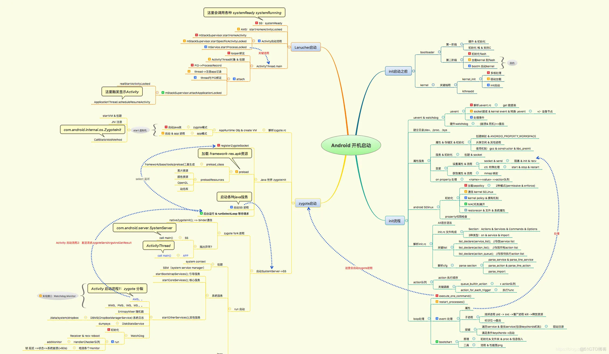
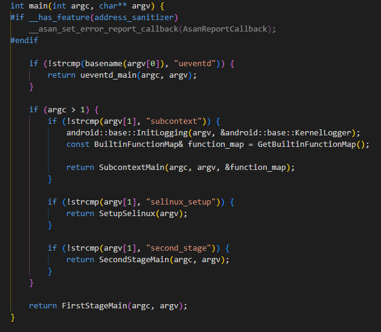
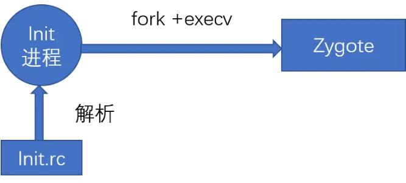
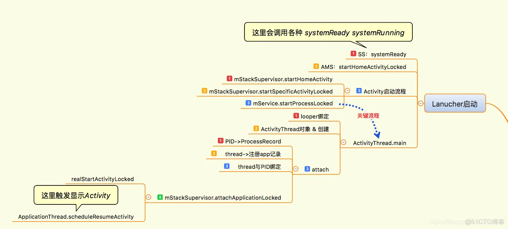
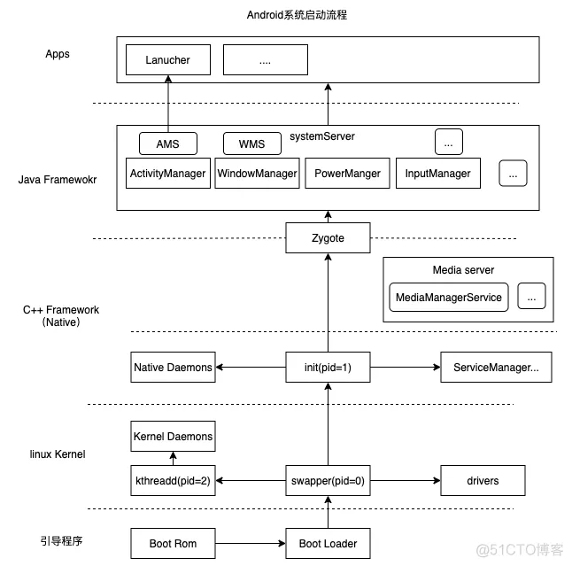

# Android系统启动

## 前言

Android系统启动与很多内容都有关联，比如应用进程启动流程、四大组件原理、 AMS、ClassLoader等，而ClassLoader又是热修复和插件化的基础，可见 Android 系统启动是十分重要并且需要首先学习的知识点

init进程是Android系统中用户空间的第一个进程，进程号为1，是Android系统启动流程中一个关键的步骤，作为第一个进程，它被赋予了很多极其重要的工作职责，比如创建 Zygote（孵化器）和属性服务等。init 进程是由多个源文件共同组成的，这些文件位于源码目录`system/core/init`中。 



##  1. init进程启动过程

### 引入init进程

为了讲解init进程，首先要了解Android系统启动流程的前几步， 以引入init进程。 

**1.启动电源以及系统启动** 

板子上电后，芯片从固化在 `ROM` 里预设的代码`(BOOT ROM)`开始执行， `BOOT ROM` 会加载 `BootLoader` 到 `RAM`，然后把控制权交给 `BootLoader`。

2.引导程序**BootLoader**(系统启动加载器)

代码位置：`bootloader/`

引导程序是Android操作系统被拉起来之前的一个程序，它的作用就是把android系统拉起运行,也就是把linux内核启动。

`BootLoader`并不隶属于 Android 系统，它的作用是初始化硬件设备，加载内核文件等，为 Android 系统内核启动搭建好所需的环境（可以把 `BootLoader`类比成 PC 的 `BIOS`）。`BootLoader`是针对特定的主板与芯片的（与 CPU 及电路板的配置情况有关），因此，对于不同的设备制造商，它们的引导程序都是不同的。目前大多数系统使都是使用 `uboot`来修改的。

`BootLoader`引导程序一般分两个阶段执行：

1. **基本的硬件初始化**，目的是为下一阶段的执行以及随后的 kernel 的执行准备好一些基本的硬件环境。这一阶段的代码通常用汇编语言编写，以达到短小精悍的目的。
2. **Flash 设备初始化**，设置网络、内存等等，将 kernel 映像和根文件系统映像从 Flash 上读到 RAM 空间中，然后启动内核。这一阶段的代码通常用 C 语言来实现，以便于实现更复杂的功能和取得更好的代码可读性和可移植性。

实际上 `BootLoader`还要根据 misc 分区的设置来决定是要正常启动系统内核还是要进入 recovery 进行系统升级，复位等工作。这一部分常见的改动比如：DDR配置(类型、RANK、容量、频率),EMMC 及分区大小配置,Uboot pinmux 配置,GPIO引脚配置,平台遥控器配置 power键配置,DTS设备树配置等。

**3.Linux内核启动**

当内核启动时，设置缓存、被保护存储器、计划列表、加载驱动，挂载根文件系统(/)。在内核完成系统设置后，它首先在系统文件中寻找init.rc文件，并启动init进程。 

这个入口的函数是`start_kernel`函数。`start_kernel` 函数完成了内核的大部分初始化工作。`start_kernel`函数执行到最后调用了`reset_init`函数进行后续的初始化。`reset_init`函数最主要的任务就是启动内核线程`kernel_init`。`kernel_init`函数将完成设备驱动程序的初始化，并调用`init_post`函数启动用户空间的init进程。到`init_post`函数为止，内核的初始化已经基本完成。

**4.init进程启动** 

init进程是Linux系统中`用户空间的第一个进程`，进程号固定为`1`，我们可以说它是 root 进程或者所有进程的父进程。源码路径为: `Android/system/core/init/main.cpp`。内核启动后，在用户空间启动init进程，并调用init中的`main()方法`。

当初始化内核之后，就会启动一个相当重要的祖先进程，也就是init进程，在Linux中所有的进程都是由init进程直接或间接fork出来的。init进程负责创建系统中最关键的几个子进程，尤其是zygote。另外，它还提供了property service（属性服务），类似于windows系统的注册表服务。

在Linux内核加载完成后，它首先在系统文件中寻找init.rc文件，并启动init进程，然后查看init进程的入口函数main，代码略

### init进程的入口函数 

init 进程是 Linux 系统中用户空间的第一个进程，进程号为1，我们可以说它是 root 进程或者所有进程的父进程。源码路径为: `/system/core/init/`。



这段代码根据命令行参数和程序名称的不同情况，调用不同的函数来执行不同的逻辑，从而控制程序的行为。它在头文件部分引入了init.cpp。其中这个`SecondStageMain`函数就是init.cpp里面的

```C
#include "init.h"
```

init进程做的工作比较多，主要用来初始化和启动属性服务，也用来启动Zygote进程。 init 进程的主要工作如下：

- 挂载虚拟文件系统：tmpfs、devpts、proc、sysfs和selinuxfs共5种文件系统，这些都是系统运行时目录，顾名思义，只在系统运行时才会存在，系统停止时会消失。
- 启动 property 服务：调用 property_init 函数来对属性进行初始化，调用start_property_service 函数启动属性服务，调用signal_handler_init 函数用于置子进程信号处理函数 ，它被定义在system/core/init/signal_handler.cpp中，主要用于防止init进程的子进程成为僵尸进程，为了防止僵尸进程的出现，系统会在子进程暂停和终止的时候发出SIGCHLD信号，而signal_handler_init函数就是用来接收SIGCHLD信号的
- 启动 SELinux
- 解析执行 init.rc 文件: init.rc 的内容比较复杂，干的活很多，比如文件系统的挂载(mount_all)，　各种 Native 系统服务的启动。我们常见的在 init.rc 中启动的系统服务有 servicemanager, adbd, mediaserver, zygote, bootanimation 等。我们在做系统开发的时候，也经常会创建一些 Native 服务，自然也是需要在 init.rc 里面配置启动的。关于 init.rc 的配置后续再讲解。
- 守护解析的服务，守护的关键服务被杀掉后，会马上又重新起来，有些关键服务被杀掉后，不能重新起来的，就会导致手机重启。

> 僵尸进程与危害 
>
> 在UNIX/Linux中，父进程使用fork创建子进程，在子进程终止之后，如果父进程并不知道子进程已经终止了，这时子进程虽然已经退出了，但是在系统进程表中还为它保留了一定的信息（比如进程号、退出状态、运行时间等），这个子进程就被称作僵尸进程。系统进程表是一项有限资源，如果系统进程表被僵尸进程耗尽的话，系统就可能无法创建新的进程了。

### 解析init.rc

这里注意，有的厂商会在其他地方定义自己的init.rc,比如

```
device/amlogic/common/products/mbox/init.amlogic.system.rc
```

init.rc是一个非常重要的配置文件，它是由Android初始化语言（Android Init Language）编写的脚本，系统的一些关键服务，就是通过解析它后，得到需要启动的关键服务（如`zygote`、`servivemanager`等）。这种语言主要包含5种类型语句：Action、Command、Service、Option和Import。init.rc的配置代码如下所示：

```Java
  # TODO(b/135984674): reset all necessary properties here.
  setprop sys.boot_completed ""
  setprop dev.bootcomplete ""
  setprop sys.init.updatable_crashing ""
  setprop sys.init.updatable_crashing_process_name ""
  setprop apexd.status ""
  setprop sys.user.0.ce_available ""
  setprop sys.shutdown.requested ""
  setprop service.bootanim.exit ""

# Default values.
on property:security.perf_harden=1
    write /proc/sys/kernel/perf_event_max_sample_rate 100000
    write /proc/sys/kernel/perf_cpu_time_max_percent 25
    write /proc/sys/kernel/perf_event_mlock_kb 516

service ueventd /system/bin/ueventd
    class core
    critical
    seclabel u:r:ueventd:s0
    shutdown critical

    
    chown system system /sys/devices/system/cpu/cpufreq/interactive/timer_rate
    chmod 0660 /sys/devices/system/cpu/cpufreq/interactive/timer_rate
    chown system system /sys/devices/system/cpu/cpufreq/interactive/timer_slack

on property:persist.vendor.bt_module=sprdbt_tty
    insmod /vendor/lib/modules/uwe5621_bsp_sdio.ko
    insmod /vendor/lib/modules/sprdbt_tty.ko
    insmod /vendor/lib/modules/sprdwl_ng.ko
```

可以看到它**输出了一些系统属性、配置了内核性能参数、启动了一些服务、给一些文件接口写了值、安装了****ko****模块**

语法规则等我这里不提，我说说这个文件可以进行的一些改动：

1. 给文件接口（Linux中这些都是文件）赋予权限（在配置LED驱动的时候会用到）

```Java
    # allow system to read/write remote_led
    chown root system /sys/class/leds/remote_led/brightness
    chmod 0664 /sys/class/leds/remote_led/brightness
```

控制 LED 的硬件通常连接到特定的 GPIO 引脚，操作该文件（如写入亮度值）这些文件背后通过驱动程序与 GPIO 引脚进行交互。

1. 定义开机服务（在设置开机需要运行的脚本的时候会用到）

```Java
service storedate /vendor/bin/storedate.sh
    class main
    user root
    group root
    oneshot
    seclabel u:r:init:s0

service setdate /vendor/bin/setdate.sh
    class main
    user root
    group root
    oneshot
    seclabel u:r:init:s0
```

这里定义了两个服务，一个用来存储时间一个用来设置时间。

1. 安装ko模块（添加一些wifi蓝牙驱动改的时候会用到）

```Java
on property:persist.vendor.bt_module=sprdbt_tty
    insmod /vendor/lib/modules/uwe5621_bsp_sdio.ko
    insmod /vendor/lib/modules/sprdbt_tty.ko
    insmod /vendor/lib/modules/sprdwl_ng.ko
```

1. 设置一些开机的属性

```Java
    #80 means reserve 8% memory using for high water mark, 1GB DDR x 8% = 80MB
    write /proc/sys/vm/watermark_scale_factor 80
    write /proc/sys/vm/swappiness 100
```

这段代码的作用是通过调整内核参数来优化系统的内存管理策略：

- **保留部分物理内存**：通过设置 `watermark_scale_factor` 为 80，系统将预留大约 8% 的物理内存用于高水位标记（即高优先级保留），这有助于在内存紧张时保持系统的响应性和稳定性。
- **积极使用交换空间**：通过设置 `swappiness` 为 100，系统将最大程度地使用交换空间，以确保物理内存尽可能多地保持可用状态。这有助于在内存使用较高的情况下，避免物理内存耗尽，从而提升系统的稳定性。

### 解析Service类型语句

init.rc中的Action类型语句和Service类型语句都有相应的类来进行解析，Action类型语句采用 ActionParser 来进行解析，Service类型语句采用 ServiceParser 来进行解析，这里因为主要分析Zygote，所以只介绍 ServiceParser。ServiceParser 的实现代码在`system/core/init/service.cpp` 中 ，具体内容略

### init启动Zygote

上面提到 init 进程在解析 init.rc 时，会创建 zygote 进程，它是 Android 系统最重要的进程之一。后续 Android 中的应用进程都是由 zygote 进程 fork 出来的。因此，zygote 是 Android 系统所有应用的父进程。zygote 进程的实际执行文件并不是 zygote，而是 `/system/bin/app_process`。源码路径为: `Android/frameworks/base/cmds/app_process/`。　它会调用 `frameworks/base/core/jni/AndroidRuntime.cpp`　提供的接口启动 java 层的代码　`frameworks/base/core/java/com/android/internal/os/ZygoteInit.java`。至此，我们就进入到了 java 的世界。

zygote 的主要工作如下：

- 创建 java 虚拟机 AndroidRuntime
- 通过 AndroidRuntime 启动 ZygoteInit 进入 java 环境。

ZygoteInit　的主要工作如下：

- 创建 socket 服务，接受 ActivityManagerService 的应用启动请求。
- 加载 Android framework 中的 class、res（drawable、xml信息、strings）到内存。Android 通过在 zygote 创建的时候加载资源，生成信息链接，再有应用启动，fork 子进程和父进程共享信息，不需要重新加载，同时也共享 VM。
- 启动 SystemServer。
- 监听 socket，当有启动应用请求到达，fork 生成 App 应用进程。

zygote 进程的出现是为了能更快的启动应用。因为在 Android 中，每个应用都有对应一个虚拟机实例（VM）为应用分配不同的内存地址。如果 Android 系统为每一个应用启动不同的 VM 实例，就会消耗大量的内存以及时间。因此，更好的办法应当是通过创建一个虚拟机进程，由该 VM 进程预加载以及初始化核心库类，然后，由该 VM 进程 Fork 出其他虚拟机进程，这样就能达到代码共享、低内存占用以及最小的启动时间，而这个 VM 进程就是 zygote。

这几个文件仅有的几笔修改都是amlogic改动的，我们很少需要修改。

### prop属性服务

Windows 平台上有一个注册表管理器，注册表的内容采用键值对的形式来记录用户、软件的一些使用信息。即使系统或者软件重启，其还是能够根据之前注册表中的记录，进行相应的初始化工作。Android也提供了一个类似的机制，叫作属性服务。 init进程启动时会启动属性服务，并为其分配内存，用来存储这些属性，如果需要这些属性直接读取就可以了。

```Java
 StartPropertyService(&property_fd);
```

这里启动了熟悉服务，这些属性我们可以在设备开机后使用`get prop`来读取到

系统属性分为两种类型：一种是普通属性；还有一种是控制属性，控制属性用来执行一些命令，比如开机的动画就使用了这种属性。因此，handle_property_set函数分为了两个处理分支，一部分处理控制属性，另一部分用于处理普通属性，这里只分析处理普通属性。

https://blog.csdn.net/weixin_45589713/article/details/128875608

**属性的分类：**

1.ro开头的系统属性

如果属性名称以“ro.”开头，那么这个属性被视为只读属性。一旦设置，属性值不能改变。重启不会失效，是永恒的固定值，不能修改值；只能刷机改变。

2.persist开头的系统属性

如果属性名称以“persist.”开头，当设置这个属性时，其值也将写入/data/property。可以修改这种属性，重启后就是修改后的属性。

3.net开头的系统属性

如果属性名称以“net.”开头，当设置这个属性时，“net.change”属性将会自动设置，以加入到最后修改的属性名。

4.其他属性：都是临时的存在内存中，重启就失效了。

**属性定义的位置：**

prop属性的设置有两个地方：一个是配置文件读取的，一个是系统动态获取的

1、在android源码目录下的： `system/core/init/property_service.cpp`  文件中的函数

```Java
    if (!load_properties_from_file("/system/etc/prop.default", nullptr, &properties)) {
        // Try recovery path
        if (!load_properties_from_file("/prop.default", nullptr, &properties)) {
            // Try legacy path
            load_properties_from_file("/default.prop", nullptr, &properties);
        }
    }
```

这里会从prop.default里面读取基础属性

`./build/make/core/Makefile` +217

```Java
# prop.default

BUILDINFO_SH := build/make/tools/buildinfo.sh
BUILDINFO_COMMON_SH := build/make/tools/buildinfo_common.sh
POST_PROCESS_PROPS :=$= build/make/tools/post_process_props.py

# Generates a set of sysprops common to all partitions to a file.
# $(1): Partition name
# $(2): Output file name
define generate-common-build-props
        PRODUCT_BRAND="$(PRODUCT_BRAND)" \
        PRODUCT_DEVICE="$(TARGET_DEVICE)" \
        PRODUCT_MANUFACTURER="$(PRODUCT_MANUFACTURER)" \
        PRODUCT_MODEL="$(PRODUCT_MODEL)" \
        PRODUCT_NAME="$(TARGET_PRODUCT)" \
        $(call generate-common-build-props-with-product-vars-set,$(1),$(2))
endef
```

`build/make/tools/buildinfo.sh`这里面设定了一些基础属性。

`frameworks/base/packages/SettingsProvider/res/values/defaults.xml `这里主要用于定义系统设置的默认值。这些默认设置在系统初始化时会被加载，并提供初始的系统配置，确保设备在第一次启动时有合理的设置值。

2. 在MK文件中添加

```
device/amlogic/ohm/vendor_prop.mk
PRODUCT_PROPERTY_OVERRIDES += \
    ro.build.software.version=CX12_1.0.6 \
    ro.build.version.code.value=1.0.6

PRODUCT_PROPERTY_OVERRIDES += \
    ro.vendor.autoconnectbt.nameprefix=xxxx_RC_BoxusS2 \
    ro.vendor.need.btsetup=true
```

### init进程启动总结

init进程启动做了很多的工作，总的来说主要做了以下三件事：

（1）创建和挂载启动所需的文件目录。 

（2）初始化和启动属性服务。 

（3）解析init.rc配置文件并启动Zygote进程。

## 2. Zygote进程启动过程

### Zygote概述 

在Android系统中，DVM（Dalvik虚拟机）和ART、应用程序进程以及运行系统的关键服务的SystemServer进程都是由Zygote进程来创建的，我们也将它称为孵化器。它通过fock（复制进程）的形式来创建应用程序进程和SystemServer进程，由于Zygote进程在启动时会创建DVM或者ART，因此通过fock而创建的应用程序进程和SystemServer进程可以在内部获取一个DVM或者ART的实例副本。我们已经知道Zygote进程是在init进程启动时创建的，起初Zygote进程的名称并不是叫“zygote”，而是叫“app_process”，这个名称是在Android.mk中定义的，Zygote进程启动后，Linux系统下的pctrl系统会调用app_process，将其名称换成了“zygote”。 

### Zygote启动脚本

Zygote的启动也要区分对待,在init.rc文件中采用了Import类型语句来引入Zygote启动脚本，这些启动脚本都是由Android初始化语言（Android Init Language）来编写的： 

```Kotlin
/system/core/rootdir/init.rc
import /init.${ro.zygote}.rc
```

可以看出init.rc不会直接引入一个固定的文件，而是根据属性ro.zygote的内容来引入不同的文件。 

根据系统属性ro.zygote的具体值，加载不同的描述Zygote的rc脚本。譬如firely rk3399包含的文件：

```Bash
init.zygote32.rc
init.zygote32_64.rc
init.zygote64.rc
init.zygote64_32.rc
```

这些Zygote 启动脚本都放在system/core/rootdir 目录中

以init.zygote64.rc为例，相关脚本如下：

```Bash
service zygote /system/bin/app_process64 -Xzygote /system/bin --zygote --start-system-server
    class main
    priority -20
    user root
    group root readproc
    socket zygote stream 660 root system
    onrestart write /sys/android_power/request_state wake
    onrestart write /sys/power/state on
    onrestart restart audioserver
    onrestart restart cameraserver
    onrestart restart media
    onrestart restart netd
    onrestart restart wificond
    writepid /dev/cpuset/foreground/tasks
```

从路径来看，Zygote所在的应用程序名称叫"app_process64",

- zygote 就是service的名称
- /system/bin/app_process64  应用程序路径，即Zygote所在的应用进程
- -Xzygote /system/bin --zygote --start-system-server 为传递给app_process的参数，后面的分析会看到参数--zygote被 app_process 用来启动Zygote的选项， --start-system-server 会被作为参数传递给Zygote的ZygoteInit.

可以简单地用下面这幅图描述Zygote的启动



### Zygote启动时做了什么？

Zygote启动主要经历了两部分：

- native世界
- java世界

#### native世界

从Zygote的rc脚本我们知道， Zygote是通过app_process启动，入口就是app_process的main函数

 frameworks/base/cmds/app_process/app_main.cpp

简单来说，Zygote在native世界做的主要是以下几步：

- 启动Android虚拟机
- 注册Android的JNI函数
- 进入java世界

```C
int main(int argc, char* const argv[])
{
    AppRuntime runtime(argv[0], computeArgBlockSize(argc, argv));

    // Parse runtime arguments.  Stop at first unrecognized option.
    bool zygote = false;
    bool startSystemServer = false;
    bool application = false;
    String8 niceName;
    String8 className;
   
    ++i;  // Skip unused "parent dir" argument.
    while (i < argc) {
        const char* arg = argv[i++];
        if (strcmp(arg, "--zygote") == 0) {
            zygote = true;
            niceName = ZYGOTE_NICE_NAME;
        } else if (strcmp(arg, "--start-system-server") == 0) {
            startSystemServer = true;
        } else if (strcmp(arg, "--application") == 0) {
            application = true;
        } else if (strncmp(arg, "--nice-name=", 12) == 0) {
            niceName.setTo(arg + 12);
        } else if (strncmp(arg, "--", 2) != 0) {
            className.setTo(arg);
            break;
        } else {
            --i;
            break;
        }
    }

    if (zygote) {
        runtime.start("com.android.internal.os.ZygoteInit", args, zygote);
    } else if (className) {
        runtime.start("com.android.internal.os.RuntimeInit", args, zygote);
    } else {
        
    }
    
```

这里有3点，

1. 创建了AndroidRuntime对象， 这里面主要的动作就是**启动虚拟机**
2. 解析传进来的参数 。这个场景中--zygote 指定了app_process接下来将启动"ZygoteInit",  并传入-start-system-server
3. 在虚拟机中运行ZygoteInit ， ZygoteInit是java写的，即这一步**Zygote就从native世界进入到了java世界**

#### java世界

为ZygoteInit的main方法是由Java语言编写的，当前的运行逻辑在Native中，这就需要通过JNI来调用Java。这样Zygote就从Native层进入了Java框架层。

Zygote的java世界入口是ZygoteInit 的main函数

`frameworks/base/core/java/com/android/internal/os/ZygoteInit.java`

```C
 public static void main(String argv[]) {
            zygoteServer.registerServerSocket(socketName);   
            // In some configurations, we avoid preloading resources and classes eagerly.
            // In such cases, we will preload things prior to our first fork.
            if (!enableLazyPreload) {
                preload(bootTimingsTraceLog);  //预加载各类资源
            } else {
                Zygote.resetNicePriority();
            }

           if (startSystemServer) {
                Runnable r = forkSystemServer(abiList, socketName, zygoteServer);

                // {@code r == null} in the parent (zygote) process, and {@code r != null} in the
                // child (system_server) process.
                if (r != null) {
                    r.run();
                    return;
                }
            }

            caller = zygoteServer.runSelectLoop(abiList);
}
```

ZygoteInit的主函数主要完成几件事情：

- 注册一个socket Zygote 作为孵化器，跟其他进程间的通讯不是通过binder而是通过socket。一旦有新进程需要运行，系统（ ActivityManagerService 的应用启动请求）会通过这个Socket（完整的名称为ANDROID_SOCKET_zygote）跟Zygote通讯，由zygote完成进程孵化过程
- 预加载各类资源 函数preload用于加载虚拟机运行时所需的各类资源。加载 Android framework 中的 class、res（drawable、xml信息、strings）到内存。Android 通过在 zygote 创建的时候加载资源，生成信息链接，再有应用启动，fork 子进程和父进程共享信息，不需要重新加载，同时也共享 VM。
- 启动System Server，监听 socket，当有启动应用请求到达，fork 生成 App 应用进程。
- 进入Loop循环

#### 其他问题

**为何用socket而不是binder**

Zygote是通过fork来创建新进程的，而binder是多线程的，有可能造成死锁。

在 POSIX 标准中，fork 的行为是这样的：复制整个用户空间的数据（通常使用 copy-on-write 的策略，所以可以实现的速度很快）以及所有系统对象， 然后仅复制当前线程到子进程。这里：所有父进程中别的线程，到了子进程中都是突然蒸发掉的。

假如父进程在获取到锁的情况下，fork了一个子进程。子进程的内存中，这个锁的状态是上锁状态。子进程仅运行了fork所在的这个线程，其它线程没有运行，当它尝试获取锁时，就发生了死锁

**为何要通过Zygote来孵化程序，而不是由其他进程直接创建**

主要有两个好处：

- 缩短应用的启动时间 因为在 Android 中，每个应用都有对应一个虚拟机实例（VM）为应用分配不同的内存地址。如果 Android 系统为每一个应用启动不同的 VM 实例，就会消耗大量的内存以及时间。因此，更好的办法应当是通过创建一个虚拟机进程，由该 VM 进程预加载以及初始化核心库类，然后，由该 VM 进程 Fork 出其他虚拟机进程，这样就能达到代码共享、低内存占用以及最小的启动时间，而这个 VM 进程就是 zygote。
- 优化共享内存 所有虚拟机都是从Zygote fork出来的，所以特么能够享受到由内核实现的内存共享的优势。比如Zygote预加载的各类资源，比如theme主题图片，所有的进程都是共享的，在物理内存中只需要保存一份。

## 3. sysytem_server进程启动

与 Zygote 进程一样，SystemServer 进程同样是 Android 系统中最重要的进程之一。

源码路径为: `Android/frameworks/base/services/java/com/android/server/SystemServer.java`。

在Android 系统中大约有 80 个系统服务，都是由`SystemServer`进程来创建的。作为一个应用开发者来说，需要特别熟悉的大概有这么四个: `ActivityManagerService`、`WindowManagerService`、`PackageManagerService` 和`InputManagerService`，也就是我们常说的 `AMS`、`WMS`、`PMS` 和`IMS`。

系统服务启动后都会交给`ServiceManager`来管理，即像`AMS`、`WMS`、`PMS`等服务，是在`System_Server`进程里的（创建的），但是却交给了`ServiceManager`去管理。

SystemServer进程被创建后，主要做了如下工作： 

（1）启动Binder线程池，这样就可以与其他进程进行通信。 

（2）创建SystemServiceManager，其用于对系统的服务进行创建、启动和生命周期管理。 

（3）启动各种系统服务

## 4. Launcher启动过程

### Launcher概述 

系统启动的最后一步是启动一个应用程序用来显示系统中已经安装的应用程序，这个应用程序就叫作Launcher。Launcher在启动过程中会请求PackageManagerService返回系统中已经安装的应用程序的信息，并将这些信息封装成一个快捷图标列表显示在系统屏幕上，这样用户可以通过点击这些快捷图标来启动相应的应用程序。 

通俗来讲Launcher就是Android系统的桌面，它的作用主要有以下两点： 

（1）作为Android系统的启动器，用于启动应用程序。 

（2）作为Android系统的桌面，用于显示和管理应用程序的快捷图标或者其他桌面组件。 

Launcher 的启动比较复杂，而且不同版本的 Android 系统启动逻辑可能也不太一样，所以这里就不具体讨论，后续再专门讨论。但我们可以大概说明一下启动的策略。

我们知道`SystemServer`进程再启动的过程中会启动`PackageManagerService`，`PackageManagerService`启动后会将系统中的应用程序安装完成。`SystemServer`启动完所有的服务后，会调用各服务的 `service.systemReady(…)`。`Launcher`的启动逻辑就在 `ActivityManagerService.systemReady()` 中。

Launcher的AndroidManifest文件中intent-filter会设置`android.intent.category.HOME`属性这个这个app的Activity就成为了主Activity。从而AMS的startHomeActivityLocked 方法将Launcher 放入 HomeStack 中，HomeStack 是在ActivityStackSupervisor中定义的用于存储Launcher的变量。接着调用 startActivityLocked 方 法 来 启 动 Launcher ，剩余的过程会和Activity 的启动过程类似。最终进入Launcher的onCreate方法中，到这里Launcher就完成了启动。

### Launcher启动过程介绍

SystemServer进程在启动过程中会启动PackageManagerService，PackageManagerService启动后会将系统中的应用程序安装完成。在此前已经启动的AMS会将Launcher启动起来。



在上图中关注➕“launcher启动”部分即可。同时，下面的图是开机启动流程分析 持续迭代的效果

主要做了四件事

1.   PID->ProcessRecord
2.    thread->注册app记录
3.    thread与PID绑定
4.    call mStackSupervisor.attachApplicationLocked->realStartActivityLocked

### Launcher中应用图标显示过程

Launcher 完成启动后会做很多的工作，作为桌面它会显示应用程序图标，这与应用程序开发有所关联，应用程序图标是用户进入应用程序的入口，因此我们有必要了解Launcher是如何显示应用程序图标的。 

这部分的逻辑尚未来得及研究

## 5. Android系统启动流程



1. 启动电源以及系统启动
当电源按下时引导芯片代码从预定义的地方（固化再ROM）开始执行。加载引导程序BootLoader到RAM中，然后执行。
2. 引导程序BootLoader
引导程序BootLoader是再Android操作系统开始运行前的一个小程序，它的主要作用是把系统OS拉起来并运行。
3. Linux内核启动
当内核启动时，设置缓存、被保护存储器、计划列表、加载驱动。在内核完成系统设置后，它首先在系统文件中寻找init.rc文件，并启动init进程。
4. init进程启动
init进程做的工作比较多，主要用来初始化和启动属性服务，也用来启动Zygote进程。
5. Zygote进程启动
创建Java虚拟机并为Java虚拟机注册JNI方法，创建服务器端Socket，启动SystemServer进程。
6. SystemServer进程启动
启动Binder线程池和SystemServiceManager，并且启动各种服务。
7. Launcher启动
被SystemServer进程启动的AMS会启动Launcher，Launcher启动后会将已安装应用的快捷图标显示到界面上。

Launcher启动完成之后，开机动画会退出，这样给用户的体验就是开机后，就直接进入到桌面了。

## 6. 其他知识

### 比较build 相关的文件变更

由于有些情况下无法避免与 build 相关的文件变更，AOSP 添加了 build diff 工具 `target_files_diff.py`，可用于比较两个文件包。该工具会在两个 build 之间执行递归 diff，从而排除常见的 build 相关文件变更，例如：

- 构建输出中的预期变更（例如，由于版本号变更所导致）。
- 由于当前构建系统中的已知问题所导致的变更。

若要使用 build diff 工具，请运行以下命令：

### 使用 `target_files_diff.py` 比较目标文件包

`target_files_diff.py` 脚本用于比较两个提取的目标文件包（target-files.zip）。根据你的命令输出信息，需要先将这两个 ZIP 文件提取到目录中，然后再进行比较。以下是具体步骤：

1. 提取目标文件包

假设你有两个目标文件包：`origin-ota.zip` 和 `new-ota.zip`。你需要先将它们提取到两个不同的目录中。

```Bash
mkdir origin-ota
mkdir new-ota
unzip origin-ota.zip -d origin-ota
unzip new-ota.zip -d new-ota
```

1. 运行比较脚本

一旦文件包被提取，你可以运行 `target_files_diff.py` 进行比较，并指定输出目录。

```Bash
python ./build/make/tools/releasetools/target_files_diff.py \
    origin-ota \
    new-ota \
    --output chafen/
```