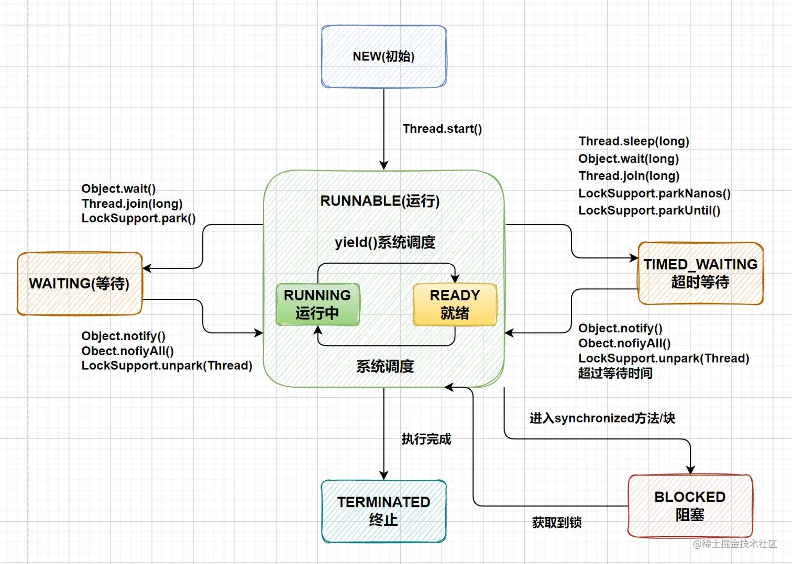

# Android 中的进程和线程

在 Android 开发中，理解进程和线程的概念非常重要。进程和线程不仅是操作系统的基本概念，其在 Android 系统中的表现形式与四大组件也有密切关联。本文将通过梳理进程和线程的基本概念及其在 Android 中的特点，为开发者提供清晰的理解。


## **进程和线程的基本概念**

### **1. 进程**
- **定义**：  
  进程是资源分配的基本单位，每个进程都拥有独立的地址空间、内存和资源。在多任务操作系统中，进程是实现程序并发运行的核心机制。

- **特点**：
  - 独立性：进程之间互不干扰，每个进程都有自己的地址空间。
  - 高资源开销：进程切换需要保存和恢复上下文（如地址空间、寄存器状态等）。
  - 安全性高：进程间的资源隔离较为彻底。


### **2. 线程**
- **定义**：  
  线程是 CPU 调度的基本单位，运行在进程中的一个执行单元。线程共享同一进程的资源（如内存、文件句柄），可以通过多线程实现并发操作。

- **特点**：
  - 轻量级：线程比进程更高效，占用资源少。
  - 共享性：同一进程内的线程共享内存地址空间。
  - 依赖性：一个线程崩溃可能会影响整个进程。


### **进程与线程的对比**

| **特性**               | **进程**                                                                                   | **线程**                                                                                   |
|------------------------|-------------------------------------------------------------------------------------------|-------------------------------------------------------------------------------------------|
| **定义**               | 操作系统分配资源的基本单位，一个运行中的程序。                                              | 进程中的一个执行单元，是 CPU 调度的基本单位。                                              |
| **资源**               | 每个进程有独立的地址空间和资源。                                                           | 线程共享所在进程的地址空间和资源。                                                         |
| **通信**               | 进程间通信复杂，需要使用 IPC 技术（如管道、共享内存、Socket 等）。                         | 同一进程内线程通信简单，通常通过共享内存或全局变量进行通信。                                |
| **开销**               | 进程切换成本高（上下文切换需要保存和恢复资源，如地址空间、文件句柄等）。                   | 线程切换成本低（只需切换寄存器内容和程序计数器等）。                                       |
| **独立性**             | 进程之间互相独立，一个进程崩溃不会影响其他进程。                                           | 同一进程内线程彼此依赖，一个线程崩溃可能会导致整个进程崩溃。                               |

---

## 一、Android 中的进程

### 1. Application 和进程的关系
- 默认情况下，同一应用的所有组件（Activity、Service、BroadcastReceiver、ContentProvider）均运行在同一进程中。
- 一个应用默认只有一个进程，其进程名与包名相同。
- 同一个AndroidManifest中定义的四大组件除非特别声明，否则默认运行在同一个进程之中


### 2. 开启多进程
通过配置清单文件中的 `android:process` 属性，可以为应用的四大组件指定独立的进程。

#### **示例配置**
~~~xml
<application
    android:name=".MyApplication"
    android:label="MyApp"
    android:theme="@style/AppTheme">

    <!-- Activity 运行在默认进程 -->
    <activity
        android:name=".MainActivity"
        android:exported="true" />

    <!-- Service 运行在名为 :myservice 的独立进程 -->
    <service
        android:name=".MyService"
        android:process=":myservice"
        android:exported="true" />
</application>
~~~

#### 进程命名规则
1.	默认进程：
未指定 android:process 属性的组件运行在应用的主进程中。
2.	子进程：
使用 android:process=":进程名" 创建私有子进程。: 前缀表示该进程是仅限当前应用使用的子进程。
3.	全局进程：
如果进程名不以 : 开头（如 android:process="com.example.global"），则该进程可以跨应用共享资源（需要适当权限）。

#### 验证多进程
1. 在 Activity 和 Service 中分别打印当前进程的 PID。
2. 使用 android.os.Process.myPid() 获取进程 ID。

**示例代码**：
主 Activity：
~~~
class MainActivity : AppCompatActivity() {
    override fun onCreate(savedInstanceState: Bundle?) {
        super.onCreate(savedInstanceState)
        setContentView(R.layout.activity_main)

        // 启动 Service
        val intent = Intent(this, MyService::class.java)
        startService(intent)
    }
}
~~~
服务（运行在独立进程）：
~~~
class MyService : Service() {
    override fun onBind(intent: Intent?): IBinder? = null

    override fun onStartCommand(intent: Intent?, flags: Int, startId: Int): Int {
        Log.d("MyService", "Service is running in process: ${Process.myPid()}")
        return START_STICKY
    }
}
~~~

### 3. Android 的进程分类

Android 系统根据应用组件的状态将进程分为以下几类：

#### 1. **前台进程**  
前台进程是用户当前操作所必需的进程，优先级最高，通常数量较少，仅在系统内存严重不足时才会被终止。  
一个进程满足以下任一条件，即视为前台进程：
- 托管用户正在交互的 Activity（调用了 `onResume()` 方法）。
- 托管绑定到用户正在交互 Activity 的 `Service`。
- 托管一个前台服务（调用了 `startForeground()` 方法）。
- 托管正在执行生命周期回调的 `Service`（如 `onCreate()`、`onStart()` 或 `onDestroy()`）。
- 托管正在执行 `onReceive()` 方法的 `BroadcastReceiver`。

#### 2. **可见进程**  
可见进程对用户可见但不在前台，通常比前台进程优先级低。  
一个进程满足以下任一条件，即视为可见进程：
- 托管绑定到可见或前台 Activity 的 `Service`。
- 托管调用了 `onPause()` 方法但仍对用户可见的 Activity（例如，显示在前台的对话框后面的 Activity）。

#### 3. **服务进程**  
服务进程运行着由 `startService()` 方法启动的服务，与用户界面没有直接关联，但执行重要的后台操作。  
例如，后台播放音乐或从网络下载数据。服务进程的优先级低于前台和可见进程，但高于后台进程。

#### 4. **后台进程**  
后台进程运行的是用户当前不可见的 Activity（已调用了 `onStop()` 方法）。  
这些进程被存储在最近最少使用 (LRU) 列表中，并且可能随时被系统终止以释放内存。

#### 5. **空进程**  
空进程不包含任何活动的应用组件，仅作为缓存保留，以加快下次启动速度。  
系统通常会优先终止这些进程来平衡系统资源。

---

### 4. 进程生命周期

Android 系统会尽可能长时间地保留进程，但在需要内存时，会根据进程的重要性决定终止顺序。以下是进程的重要性层次结构及其终止优先级：

#### 1. **前台进程**
- 系统优先保留的进程，仅在内存不足以支持所有前台进程时终止。
- 终止前台进程往往意味着用户界面无法正常响应。

#### 2. **可见进程**
- 仅次于前台进程的重要性，除非系统必须维持所有前台进程，否则不会被终止。

#### 3. **服务进程**
- 系统会尽量维持服务进程的运行，除非内存不足以维持前台和可见进程。

#### 4. **后台进程**
- 优先级低，可能被系统随时终止，以为前台、可见或服务进程腾出内存。
- 如果 `Activity` 正确保存了状态，终止后台进程对用户体验的影响较小。

#### 5. **空进程**
- 优先级最低，用于缓存，系统通常会优先终止这些进程以释放内存。
- 系统会在进程缓存和底层内核缓存之间保持平衡。

## 二、Android 中的线程

在 Android 应用中，线程是重要的执行单位。每个应用默认启动一个主线程（即 UI 线程），负责处理用户界面更新和事件分发。此外，还会有两个 Binder 线程用于处理 IPC（进程间通信）。

#### 线程与组件的关系
- **主线程**：应用启动后，系统会为其创建**一个**主线程（`Thread[<1> main]`），此线程主要负责处理 UI 更新和事件分发。
- **Binder 线程**：用于支持跨进程通信（如系统服务调用）。
- 无论是启动 `Activity` 还是启动 `Service`，这些操作都会依赖 `ActivityThread` 类处理其生命周期管理流程。  
- 同一个应用的四大组件（`Activity`、`Service`、`BroadcastReceiver`、`ContentProvider`），除非在清单文件中指定了不同的进程（通过 `android:process` 属性），默认都运行在**同一个进程**之中，并由**主线程**统一调度和处理事件。

### 验证四大组件默认处于同一进程

为了验证 Android 四大组件默认运行在同一进程，我们可以利用一个 `static` 变量的特性（进程内共享）。  
以下通过两个 `Activity` 示例代码演示：

1. **在第一个 `Activity` 中声明并修改 `static` 变量**  
    ```kotlin
    class ActivityThreadTest : AppCompatActivity() {

        companion object {
            // 声明一个 static 变量
            var sharedValue: Int = -1
        }

        override fun onCreate(savedInstanceState: Bundle?) {
            super.onCreate(savedInstanceState)
            setContentView(R.layout.activity_thread_test)

            // 修改 static 变量值
            sharedValue = 2

            // 跳转到第二个 Activity
            val intent = Intent(this, ActivityThreadTest2::class.java)
            startActivity(intent)
        }
    }
    ```

2. **在第二个 `Activity` 中读取 `static` 变量的值**  
    ```kotlin
    class ActivityThreadTest2 : AppCompatActivity() {

        override fun onCreate(savedInstanceState: Bundle?) {
            super.onCreate(savedInstanceState)
            setContentView(R.layout.activity_thread_test2)

            // 读取 static 变量的值
            Log.d("ActivityThreadTest2", "sharedValue = ${ActivityThreadTest.sharedValue}")
        }
    }
    ```

3. **清单文件配置**  
    ```xml
    <application
        android:label="Thread Test App"
        android:theme="@style/AppTheme">

        <!-- 默认进程 -->
        <activity android:name=".ActivityThreadTest" />
        <activity android:name=".ActivityThreadTest2" />

    </application>
    ```

在 `ActivityThreadTest2` 中打印日志：`sharedValue = 2`,因此可以验证结论：Android 四大组件（除非特别声明）默认运行在主线程中，且共享同一进程的内存空间。

## UI主线程 —— ActivityThread

想要了解ActivityThread 必须先对线程[通信机制-Handler](./线程通信机制Handler.md)有所了解。
ActivityThread是Activity所属的线程，也就是大家熟悉的UI主线程。它与普通线程的不同点在与它使用prepareMainLooper()来创建looper，而普通线程只要prepare就可以了。
我们在Handler一节中介绍过prepareMainLooper()的两个特点：
1. prepare的参数使用false代表该线程不允许退出
2. 将本地线程ThreadLocal的looper 对象复制给sMainLooper。

### UI主线程和普通线程的区别

#### 访问 `Looper`
- **主线程**：在主线程中，`Looper` 是通过 `Looper.myLooper()` 来访问的。主线程的 `Looper` 会在应用启动时就已经准备好，因此可以直接使用。
  
- **子线程**：子线程需要手动调用 `Looper.prepare()` 来准备自己的 `Looper`，然后通过 `Looper.myLooper()` 来访问当前线程的 `Looper` 对象。

  - `getMainLooper()`：用于获取主线程的 `Looper`，通常用于子线程与主线程之间的通信。
  - `myLooper()`：用于获取当前线程的 `Looper`，通常用于获取子线程自己的 `Looper`。

#### 获取 `Handler`
- **主线程**：主线程的 `Handler` 是由 `ActivityThread` 内部创建的，它继承自 `Handler` 类。`ActivityThread` 类在启动时会创建一个 `Handler` 对象 `mH`，该对象用于处理主线程中的消息。

  - 在 `ActivityThread.main()` 方法中，调用 `thread.getHandler()` 会返回主线程的 `Handler`，即 `mH`。

- **子线程**：在子线程中，`Handler` 必须在调用 `Looper.prepare()` 之后才能创建，否则会抛出异常。每个线程有独立的 `Looper` 和 `Handler`，子线程的 `Handler` 负责处理与该线程相关的消息。

#### 总结：
- **主线程**：主线程的 `Looper` 和 `Handler` 在应用启动时自动准备好，主线程通过 `myLooper()` 访问自身的 `Looper`，并通过 `mH` 处理消息。
- **子线程**：子线程需要显式调用 `Looper.prepare()` 来准备 `Looper`，然后通过 `myLooper()` 获取自己线程的 `Looper`，再创建 `Handler` 来处理该线程的消息。


## Thread 类

首先需要了解的是：**线程和线程类的概念有所不同，线程是操作系统CPU资源分配的调度单元，属于抽象的范畴；而线程类的本质仍是可执行代码，在Java中当然也就对应一个类**。从这一点上看Thread和其他类并没有任何区别，只不过Thread的属性和方法仅用于完成“线程管理”这个任务而已。在Android系统中，我们经常需要启动一个新的线程，这些线程大多从`Thread`这个类继承。

与其他 Java 类相比，Thread 类的作用并不在于存储数据或执行逻辑，它的主要任务是管理线程的生命周期，如线程的启动、暂停、终止等。在 Android 开发中，我们通常通过**继承 Thread 类**或**实现 Runnable 接口**来创建和启动线程。

### Thread类的常见属性和获取方法


| 属性           | 方法            |
|:---------------|:----------------|
| ID             | getId()         |
| 名称           | getName()       |
| 状态           | getState()      |
| 优先级         | getPriority()   |
| 是否中断       | isInterrupted（） |
| 是否存活       | isAlive()       |
| 是否为后台进程 | isDaemon()      |

#### 前台线程与后台线程的主要区别

前台线程（也称为用户线程）是程序中负责执行用户操作的线程。在默认情况下，所有线程都是前台线程。
后台线程（也称为守护线程）是 JVM 在后台为程序提供支持的线程，通常用于执行一些不重要的、不会影响程序生命周期的任务，如垃圾回收、日志记录等。后台线程通常是辅助性的。

| 特性           | 前台线程                           | 后台线程                                  |
|:---------------|:-----------------------------------|:------------------------------------------|
| **程序退出**   | JVM 会等到所有前台线程完成后才退出 | JVM 会在所有前台线程退出后立即退出        |
| **任务重要性** | 负责程序的核心功能                 | 负责程序的后台支持任务                    |
| **生命周期**   | 活动时，JVM 不会结束                | JVM 会在前台线程结束时结束后台线程        |
| **设置方式**   | 不需要设置                         | 必须通过 `setDaemon(true)` 设置为后台线程 |
| **执行中断**   | 程序结束时不强制中断               | JVM 退出时自动中断                        |

### 创建线程的方式

在 Java 中，我们可以通过两种方式来创建线程：
1. **继承 Thread 类：**通过创建一个 `Thread` 的子类，重写 `run()` 方法，定义线程的执行逻辑。
2. **实现 Runnable 接口：**通过实现 `Runnable` 接口并将其传递给 `Thread` 构造方法，从而启动线程。

#### Thread 类的常见构造方法
`Thread` 类提供了多个构造方法，我们常用的有以下几种：
1. 无参构造方法：
直接创建一个 `Thread` 对象，稍后通过 `start()` 方法启动该线程。
2. 传入 `Runnable` 对象的构造方法：
通过实现 `Runnable` 接口并将其作为参数传递给 `Thread` 的构造方法，创建一个新的线程并执行其中的任务。
3. 传入 `String` 类型的构造方法：
可以为线程指定一个名称，方便调试和分析，特别是在多个线程的情况下，线程名称有助于追踪和标识每个线程。）

#### 匿名内部类方式

在实际开发中，创建线程时最常用的方式是传入一个实现了 `Runnable` 接口的匿名内部类。这种方式简单且不需要额外定义一个 `Runnable` 实现类，适合于快速编写线程执行逻辑。

以下是使用匿名内部类创建线程的示例：
~~~java
public class SimpleThreadExample {

    public static void main(String[] args) {
        // 创建一个新的线程
        Thread thread = new Thread(new Runnable() {
            @Override
            public void run() {
                // 在这个线程中执行的任务
                System.out.println("This is a simple thread example.");
            }
        });

        // 启动线程
        thread.start();
        
        // 主线程继续执行
        System.out.println("Main thread continues execution...");
    }
}
~~~
在这个示例中，我们创建了一个 `Thread` 对象，并通过匿名内部类的方式实现了 `Runnable` 接口。当调用 `thread.start()` 时，新线程将启动并执行 `run()` 方法中的任务。值得注意的是，`run()` 方法中的任务会在子线程中执行，而不是主线程中。

#### 多线程共享目标对象的情况

在某些情况下，我们可能需要让多个线程共享一个目标对象来执行相同的任务。例如，多个线程可以共享同一个 `Runnable` 对象并同时执行其中的 `run()` 方法。这种情况适用于多个线程需要操作同一个资源或执行类似的任务时。

以下是一个共享目标对象的示例：
~~~java
public class Main {
    public static void main(String[] args) throws InterruptedException {
        House house = new House();
        house.setWaterCount(10);
        
        // 创建两个线程，dog 和 cat 使用同一个目标对象 house
        Thread dog = new Thread(house);
        dog.setName("dog");
        
        Thread cat = new Thread(house);
        cat.setName("cat");
        
        dog.start();
        cat.start();
    }
}

class House implements Runnable {
    private int waterCount;

    public void setWaterCount(int waterCount) {
        this.waterCount = waterCount;
    }

    @Override
    public synchronized void run() {
        while (true) {
            String name = Thread.currentThread().getName();
            if (name.equals("dog")) {
                System.out.println(name + " 喝水");
                waterCount -= 2;
            } else if (name.equals("cat")) {
                System.out.println(name + " 喝水");
                waterCount -= 1;
            }
            System.out.println("剩余" + waterCount + "水");
            try {
                Thread.sleep(2000);
            } catch (InterruptedException e) {
                throw new RuntimeException(e);
            }
            if (waterCount <= 0) return;
        }
    }
}
~~~
在这个示例中，`dog` 和 `cat` 两个线程共享同一个 `House` 对象作为目标 `Runnable`。这意味着，`dog` 和 `cat` 线程将会执行相同的 `run()` 方法，并对同一个 `waterCount` 变量进行操作。由于两个线程共享 `waterCount` 变量，因此必须小心同步问题。在本例中，我们采用 `synchronized` 关键字来同步访问 `waterCount`。

### 线程同步问题

由于多个线程共享同一个资源（如 waterCount），如果多个线程同时访问并修改该资源，就有可能发生竞态条件，导致数据不一致。在上面的示例中，我们通过 `synchronized` 关键字对 run() 方法进行了同步，这样可以保证同一时刻只有一个线程能够访问 waterCount，从而避免了线程安全问题。

#### 为什么需要同步？

在多个线程同时修改共享资源时，可能会发生如下情况：
* 一个线程正在修改共享资源（如 `waterCount`），而另一个线程也在修改它，导致资源的更新无法按预期进行。
* 多个线程同时读取和修改共享资源，可能会发生数据不一致的情况。

通过 `synchronized` 关键字，我们可以保证在任意时刻，只有一个线程能够访问 `run()` 方法，从而确保对 `waterCount` 变量的访问是线程安全的。

### 目标对象与线程的关系

从对象和对象的关系角度来看，目标对象与线程之间的关系主要有两种：**解耦关系**和**弱耦合关系**。这两种关系决定了线程和目标对象之间的交互方式，进而影响到多线程编程的设计与实现。

#### 1. 目标对象和线程完全解耦

在这种情况下，目标对象和线程之间没有直接的关联。也就是说，目标对象不会持有线程对象的引用，线程的控制完全独立。以之前的例子为例，`House` 类中的 `run()` 方法并不直接知道当前执行任务的线程是谁，而是通过 `Thread.currentThread().getName()` 来获得当前执行线程的名称，从而进行判断和处理。

~~~java
@Override
public synchronized void run() {
    while (true) {
        String name = Thread.currentThread().getName();
        if (name.equals("dog")) {
            System.out.println(name + " 喝水");
            waterCount -= 2;
        } else if (name.equals("cat")) {
            System.out.println(name + " 喝水");
            waterCount -= 1;
        }
        System.out.println("剩余" + waterCount);
        try {
            Thread.sleep(2000);
        } catch (InterruptedException e) {
            throw new RuntimeException(e);
        }
        if (waterCount <= 0) return;
    }
}
~~~

这种方式的好处在于，`House` 对象不依赖于特定的线程实例，因此可以更灵活地在不同的线程中执行任务。然而，缺点是如果要获取当前线程的相关信息（如线程名称），就需要通过 `Thread.currentThread()` 来动态获取，**无法直接访问到线程对象本身**。

#### 2. 目标对象和线程弱耦合

弱耦合的关系意味着目标对象与线程对象存在某种程度的关联。目标对象可以持有线程对象的引用，并使用 `Thread.currentThread()` 方法来获取当前线程对象的引用。在这种情况下，目标对象不仅能获取到线程的名称，还能直接与线程对象进行交互。

例如，下面的例子中，`House` 对象将 `Thread` 对象作为其成员变量，并在 `House` 构造器中创建了两个线程（`dog` 和 `cat`）。在 `run()` 方法中，我们通过比较当前线程是否与 `dog` 或 `cat` 线程相同，来决定执行哪个任务。

~~~java
package thread;

public class Main {
    public static void main(String[] args) throws InterruptedException {
        House house = new House();
        house.setWaterCount(10);
        // 这里需要开启猫狗线程
        house.cat.start();
        house.dog.start();
    }
}

class House implements Runnable {
    private int waterCount;
    Thread dog;
    Thread cat;

    House() {
        this.dog = new Thread(this);
        this.cat = new Thread(this);
    }

    public void setWaterCount(int waterCount) {
        this.waterCount = waterCount;
    }

    @Override
    public void run() {
        while (true) {
            Thread thread = Thread.currentThread();
            if (thread == dog) {
                System.out.println("dog喝水");
                waterCount = waterCount - 2;
            } else if (thread == cat) {
                System.out.println("cat喝水");
                waterCount = waterCount - 1;
            }
            System.out.println("剩余" + waterCount);
            try {
                Thread.sleep(2000);
            } catch (InterruptedException e) {
                throw new RuntimeException(e);
            }
            if (waterCount <= 0) return;
        }
    }
}
~~~
在这个例子中，`House` 类不仅是 `Runnable` 接口的实现类，同时还持有了两个线程（`dog` 和 `cat`）。通过这种方式，`House` 对象与线程之间的关系变得更加紧密，目标对象能够明确知道哪些线程正在执行任务，并能根据线程来执行特定的操作。

#### 目标对象和线程关系的选择

选择哪种关系取决于应用场景的需求：
* **解耦关系**：适用于目标对象和线程没有直接依赖，且任务可以独立于线程的实现进行处理的情况。此时，我们可以通过 `Thread.currentThread()` 动态获取线程信息，无需直接引用线程对象。
* **弱耦合关系**：适用于目标对象需要直接与线程进行交互，且目标对象知道多个线程的状态或行为的情况。在这种情况下，通过持有线程对象的引用，可以让目标对象更加明确地控制线程的行为。

这两种方式各有优缺点，开发者需要根据实际的需求来选择合适的线程管理方式。通常情况下，尽量避免过度耦合，以保证代码的灵活性和可维护性。

### run() 方法的启动次数

在 Java 中，一个线程的 `run()` 方法只会被执行一次。当我们创建一个线程对象并调用 `start()` 方法时，JVM 会在后台自动创建一个新的线程，并在新线程中调用 `run()` 方法。需要注意的是，**一个线程只能启动一次**，如果我们尝试再次调用 `start()` 方法，JVM 会抛出 `IllegalThreadStateException` 异常，提示线程已经启动过了，不能再次启动。

但是，在某些特殊情况下，我们可以在 `run()` 方法中使用循环语句，使线程在满足特定条件时可以重复执行。例如，在网络编程中，我们可以在 `run()` 方法中使用一个无限循环来不断地接收客户端的请求，直到服务器关闭连接为止。

```java
@Override
public void run() {
    while (!Thread.currentThread().isInterrupted()) {
        // 执行任务
    }
}
```

在上面的示例中，`run()` 方法会在循环中持续执行，直到线程被中断或满足某个退出条件为止。

### 使用循环控制 run() 方法的执行

使用循环语句时，我们通常需要处理线程的停止条件。在网络服务、任务调度等场景中，`run()` 方法会持续执行，直到任务完成或某个特定的退出条件成立。例如，在网络服务器中，`run()` 方法会使用一个无限循环，不断地接收和处理客户端请求，直到服务器关闭或连接被中断为止。

```java
@Override
public void run() {
    while (!stopRequested) {
        // 执行任务
        // 处理请求
    }
}
```

### 如何停止 run() 方法

停止线程是多线程编程中的一个常见问题。线程一旦启动，就会进入 `run()` 方法并执行其中的代码。为了控制线程的停止，可以采用以下几种方法：

1. **使用标志变量**：在 `run()` 方法中使用一个标志变量来控制线程是否继续执行。比如，可以使用 `boolean` 类型的变量 `stopRequested` 来判断线程是否应该停止。
~~~java
private volatile boolean stopRequested = false;

public void stop() {
    stopRequested = true;
}

@Override
public void run() {
    while (!stopRequested) {
        // 执行任务
    }
}
~~~
   在这个例子中，通过调用 `stop()` 方法来设置 `stopRequested` 标志为 `true`，从而停止线程。

2. **使用 `Thread.interrupted()` 或 `Thread.isInterrupted()` 方法**：可以通过检查线程的中断状态来停止 `run()` 方法中的循环。这是另一种常见的线程停止方式。
~~~
@Override
public void run() {
    while (!Thread.currentThread().isInterrupted()) {
        // 执行任务
    }
}
~~~
   线程可以通过调用 `interrupt()` 方法来中断自己或其他线程。当 `run()` 方法中检测到 `isInterrupted()` 返回 `true` 时，线程将停止执行。

3. **使用 `stop()` 方法**：虽然 `Thread.stop()` 方法可以强制停止线程，但它已经被废弃，不推荐使用，因为它会导致线程在执行过程中产生不一致的状态，可能会导致程序崩溃或死锁等问题。

## Thread的状态流转

状态流转的相关内容可以参考：https://juejin.cn/post/7082702074848215076

在 Java 中，Thread 类用于管理线程的生命周期。每个线程在执行过程中会经历一系列的状态变化，这些状态定义了线程的不同阶段以及线程在这些阶段之间的流转方式。理解线程的状态流转对于编写高效且线程安全的程序至关重要。

状态流转图如下：



### 1. **线程的六种状态**

Java 中的 `Thread` 类定义了以下六种线程状态：

- **NEW（新建状态）**：线程被创建，但尚未启动。此时，线程的 `start()` 方法还没有被调用，线程还没有开始执行任务。
  
- **RUNNABLE（可运行状态）**：线程在调用了 `start()` 方法后，进入了可运行状态。在这个状态下，线程并不意味着马上开始执行，而是进入就绪队列，等待操作系统调度分配 CPU 时间。当 CPU 被分配时，线程会处于“运行”状态。

- **BLOCKED（阻塞状态）**：线程在尝试获取某个同步资源时，如果该资源已经被其他线程占用，线程会被阻塞。此时，线程无法继续执行，直到它获得所需的资源。

- **WAITING（等待状态）**：线程在调用了 `Object.wait()`、`Thread.join()`、`LockSupport.park()` 等方法后，会进入等待状态。线程会在这里阻塞，直到其他线程调用 `notify()`、`notifyAll()` 或 `interrupt()` 来唤醒它。

- **TIMED_WAITING（定时等待状态）**：线程在调用带有时间限制的方法（如 `Thread.sleep(long millis)`、`Thread.join(long millis)`）后进入定时等待状态。此时，线程会等待一段时间，超时后自动恢复可运行状态。

- **TERMINATED（终止状态）**：线程执行完毕或由于异常退出后，进入终止状态。线程一旦终止，不能再重新启动。

### 2. **线程状态流转的情况**

线程的状态流转不仅取决于线程的执行顺序，还受到线程方法的影响。以下是线程从一个状态转移到另一个状态的几种情况：

- **从 NEW 到 RUNNABLE**：当我们通过调用 `start()` 方法启动线程时，线程从新建状态转移到可运行状态。此时，线程并不一定会立即执行，而是进入就绪队列，等待 CPU 调度。

- **从 RUNNABLE 到 BLOCKED**：如果线程在执行过程中需要访问一个已经被其他线程占用的同步资源，它会进入阻塞状态。常见的情况是使用 `synchronized` 关键字来保护共享资源。线程会在该资源释放后，重新进入可运行状态。

- **从 RUNNABLE 到 WAITING 或 TIMED_WAITING**：线程在执行过程中可以通过调用一些方法（如 `wait()`、`join()`、`sleep()` 等）进入等待状态或定时等待状态。`wait()` 会使线程进入等待状态，直到被其他线程唤醒；`sleep()` 会使线程在指定时间后自动恢复到可运行状态。

- **从 WAITING 或 TIMED_WAITING 到 RUNNABLE**：当线程被唤醒（通过 `notify()`、`notifyAll()` 或 `interrupt()`）时，线程会从等待状态或定时等待状态转移到可运行状态，重新加入到线程调度队列中，等待 CPU 分配时间片。

- **从 RUNNABLE 到 TERMINATED**：当线程的 `run()` 方法执行完毕或发生未捕获的异常时，线程会进入终止状态，生命周期结束。

### 3. **控制线程状态的相关方法**

Java 提供了一些方法来控制线程的状态流转，下面是常用的线程控制方法：

#### 启动线程
- **start()**：调用 `start()` 方法可以启动一个线程，线程将进入 RUNNABLE 状态，等待 CPU 调度执行。

#### 暂停和等待线程
- **sleep(long millis)**：让当前线程暂停执行指定的时间（以毫秒为单位）。当线程调用 `sleep()` 方法时，它会进入 TIMED_WAITING 状态，直到时间到达后自动恢复到可运行状态。

- **wait()**：使当前线程进入 WAITING 状态，直到其他线程调用 `notify()` 或 `notifyAll()` 方法来唤醒它。此方法必须在同步块或同步方法中调用。

- **join()**：使当前线程等待被调用线程完成执行。如果一个线程 A 调用另一个线程 B 的 `join()` 方法，线程 A 会进入 WAITING 状态，直到线程 B 执行完毕。

#### 唤醒线程
- **notify()**：在某个线程等待资源时，可以通过调用 `notify()` 方法来唤醒等待线程。只有一个线程会被唤醒，进入可运行状态。

- **notifyAll()**：与 `notify()` 类似，但会唤醒所有等待线程。所有被唤醒的线程都会争抢 CPU 时间。

#### 中断线程
- **interrupt()**：可以通过调用 `interrupt()` 方法中断一个正在执行的线程。线程会进入终止状态，抛出 `InterruptedException` 异常。调用 `interrupt()` 不会直接停止线程，它只是设置了一个标志位，线程需要显式地检查该标志位并进行处理。

### 4. **线程的状态管理总结**

| 状态               | 描述                                                   | 转换情况                                                   |
|--------------------|--------------------------------------------------------|------------------------------------------------------------|
| **NEW**            | 线程创建但未启动                                       | 调用 `start()` 方法后，转为 RUNNABLE 状态                  |
| **RUNNABLE**       | 线程处于可运行状态，等待 CPU 调度执行                  | 被分配 CPU 时间后执行，或者由于锁资源进入 BLOCKED 或 WAITING 状态 |
| **BLOCKED**        | 线程在等待获取锁资源时处于阻塞状态                     | 锁资源可用后，线程转为 RUNNABLE 状态                      |
| **WAITING**        | 线程进入等待状态，等待其他线程通知或结束               | 通过 `notify()` 或 `notifyAll()` 唤醒后转为 RUNNABLE 状态 |
| **TIMED_WAITING**  | 线程进入定时等待状态，等待指定的时间                    | 超时后自动恢复到 RUNNABLE 状态                             |
| **TERMINATED**     | 线程已经执行完毕或由于异常退出，生命周期结束           | 线程终止后不可重新启动                                     |

