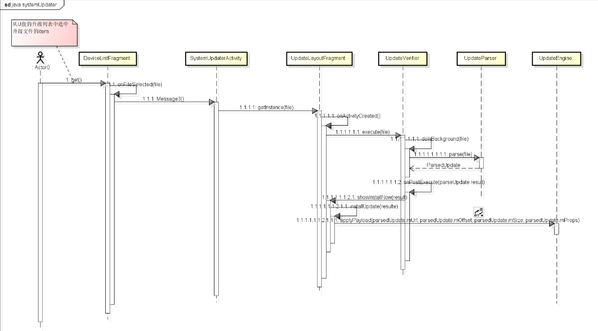

# OTA升级

前言：

本文仅仅对OTA升级的几种方式的概念和运用进行总结，仅在使用层面对其解释。需要更详细的内容我推荐大神做的全网最详细的讲解：

[Android OTA 升级专栏文章导读](https://blog.csdn.net/guyongqiangx/article/details/129019303?spm=1001.2014.3001.5502)

首先对Android的升级分个类，分别是

非AB升级(Non-A/B system updates)

A/B系统升级(A/B (seamless) system updates)

虚拟A/B升级(Virtual A/B overview)

## 三种升级方式

### 非A/B升级(Non-A/B System Updates)

官网文档如下：

[Android官网 - 非 A/B 系统更新](https://source.android.com/docs/core/ota/nonab?hl=zh-cn)

非A/B升级是传统的Android系统更新方式，系统在运行过程中更新系统映像文件，并在更新完成后需要重新启动设备来应用更新。

**工作流程**：

1. **下载更新包**：用户接收到更新通知后，下载OTA（Over-The-Air）更新包。
2. **准备更新**：下载完成后，系统会将更新包解压并准备进行安装。
3. **安装更新**：设备进入恢复模式（recovery mode），系统停止正常运行，安装更新包。
4. **重启设备**：更新完成后，设备重新启动并应用更新。

**优点**：

- 实现相对简单，因为不需要额外的分区或复杂的管理逻辑。

**缺点**：

- 安装过程中设备无法使用，更新过程可能需要较长时间。
- 如果更新过程中发生故障，可能导致设备无法正常启动，必须通过手动恢复模式进行修复。

### A/B系统升级(A/B (Seamless) System Updates)

官方文档如下：

[Android官网 - A/B系统升级](https://source.android.com/docs/core/ota/ab?hl=zh-cn)

由于非A/B升级的局限性，因此Android从7.0开始引入新的OTA升级方式A/B升级（也称为无缝更新）。

**概述**：

- A/B系统升级通过创建两个系统分区（A和B），实现无缝更新。
- 当一个分区正在使用时，另一个分区可以用来进行更新，从而减少更新过程中的设备不可用时间。

**工作流程**：

1. **下载更新包**：用户接收到更新通知后，下载OTA更新包。
2. **更新备用分区**：系统在后台将更新包安装到未使用的分区（例如，当前使用分区为A，更新包安装到分区B）。
3. **切换分区**：更新完成后，系统会将引导加载程序配置为从更新的分区启动（例如，从A切换到B）。
4. **重启设备**：设备重新启动，从更新的分区启动。

**优点**：

- 无缝更新：更新在后台进行，用户可以继续使用设备，减少了更新过程中的不便。
- 更安全：如果更新过程中出现问题，可以回滚到之前的分区，确保设备的可用性。

**缺点**：

- 需要更多存储空间，因为需要两个系统分区。

### 虚拟A/B升级(Virtual A/B Overview)

由于A/B升级也有缺点，因此又引入了虚拟A/B升级

**概述**：

- 虚拟A/B升级结合了A/B和非A/B升级的优点，通过逻辑分区和动态分区减少存储空间需求。
- 在Android 10及更高版本中引入，通过使用动态分区来实现无缝更新，而不需要实际的物理A/B分区。

**工作流程**：

1. **下载更新包**：用户接收到更新通知后，下载OTA更新包。
2. **创建和更新动态分区**：系统在后台创建或更新动态分区（使用逻辑分区），这些分区通过内核支持并在内存中映射。
3. **切换分区映射**：更新完成后，系统会更新内存中的分区映射，从而指向更新后的逻辑分区。
4. **重启设备**：设备重新启动，加载更新后的分区。

**优点**：

- 无缝更新：用户可以在后台进行更新，无需停止设备操作。
- 更高效的存储利用率：使用动态分区减少了传统A/B分区所需的存储空间。

**缺点**：

- 实现复杂度更高，需要内核和系统的支持。

这三者的详细流程可以参考下文

[Android OTA升级看这一篇就够了-CSDN博客](https://blog.csdn.net/m0_56255097/article/details/137125100)


### 判断自己的Android系统是哪种升级方式

1. 检查分区结构

使用`adb shell`命令

```Java
adb shell ls /dev/block/by-name/
```

你会看到设备上的分区列表。A/B系统升级的设备通常会有一对分区（例如`system_a`和`system_b`），而非A/B升级的设备只有一个系统分区（例如`system`）。如：

```Java
console:/ # ls /dev/block/by-name/
boot_a       cri_data  logo          odm_ext_a  rsv       vbmeta_system_a
boot_b       dtbo_a    metadata      odm_ext_b  super     vbmeta_system_b
bootloader   dtbo_b    misc          oem_a      tee       vendor_boot_a
bootloader0  env       mmcblk0       oem_b      userdata  vendor_boot_b
bootloader1  factory   mmcblk0boot0  param      vbmeta_a
cache        frp       mmcblk0boot1  reserved   vbmeta_b
```

这就表示是A/B系统升级

1. 检查系统属性

使用`adb shell`命令

```Java
adb shell getprop ro.build.ab_update
```

如果输出为`true`，则表示设备使用A/B系统升级。

如果输出为空或`false`，则表示设备使用非A/B升级。

### 判断A/B升级现在是使用的哪个分区

使用`adb shell`命令

```Java
cat /proc/cmdline
```

这是一个用于显示Linux内核启动参数的命令。在Android设备上，它可以用来检查设备在启动时传递给内核的命令行参数。启动参数中可能包含有关设备特性和支持的功能的信息，例如是否启用了动态分区。

`androidboot.slot_suffix=_a`  表示当前是使用的a分区

`androidboot.dynamic_partitions=true`    表示当前设备支持动态分区，表明设备可能使用虚拟A/B升级。

## OTA升级包

### OTA升级包的制作

OTA升级包在我们构建Android系统的时候会自动构建，只要我们输入了`make  otapackage` 命令。他其实是使用了`build/make/tools/releasetools` 中提供的 `ota_from_target_files` 工具进行的。我们也可以手动使用这个工具进行制作。制作时需要系统构建时的原zip文件(target-files.zip)

原zip文件的位置在：

`out/target/product/[项目名]/obj/PACKAGING/target_files_intermediates/`目录下

```Java
. build/envsetup.sh && lunch tardis-eng
mkdir dist_output
make dist DIST_DIR=dist_output

我们一般使用
make  otapackage
```

### OTA升级包的内容

解压OTA升级包，结果如下：

```Java
$ tree -l full-ota
 full-ota
├── care_map.pb
├── META-INF
│   └── com
│       └── android
│           ├── metadata
│           └── otacert
├── payload.bin
└── payload_properties.txt

3 directories, 5 files
```

1. `payload.bin`是系统要更新的数据文件，如果想知道这里面的具体信息请参考： [Android OTA 相关工具(四) 查看 payload 文件信息_android payload.bin-CSDN博客](https://blog.csdn.net/guyongqiangx/article/details/129228856)

`payload_properties.txt`包含了升级内容的一些属性信息，如下：

```Java
$ cat full-ota/payload_properties.txt
FILE_HASH=XuFSKnR3J7i9e5g3rd8kc3WM4/hbjnRDmEQDloWtN34=
FILE_SIZE=358295010
METADATA_HASH=uRar88FujcLyXEOF/JLOx2EE2rwFE7kuM1GLYFuYfnA=
METADATA_SIZE=29432
```

升级时会使用到`payload_properties.txt`里面的信息。

1. `META-INF/com/android/metadata`用于描述软件包的元数据文件

```Java
ota-property-files=payload_metadata.bin:1490:36805,payload.bin:1490:67848,payload_properties.txt:69396:150,care_map.pb:809:634,metadata:69:693   
ota-required-cache=0
ota-streaming-property-files=payload.bin:1490:67848,payload_properties.txt:69396:150,care_map.pb:809:634,metadata:69:693
ota-type=AB
post-build=RB56/ohm/ohm:11/RD2A.211001.002/eng.suzhe.20240612.134531:userdebug/release-keys
post-build-incremental=eng.suzhe.20240612.134531
post-sdk-level=30
post-security-patch-level=2021-10-01
post-timestamp=1718171125
pre-build=RB56/ohm/ohm:11/RD2A.211001.002/eng.suzhe.20240612.134531:userdebug/release-keys
pre-build-incremental=eng.suzhe.20240612.134531
pre-device=ohm
```

`pre-device`、`pre-build-incremental` 和 `pre-build` 值定义了设备必须具备哪种状态后才能安装 OTA 软件包。

`post-build-incremental` 和 `post-build` 值定义了设备在安装 OTA 软件包后的预期状态。

`pre-` 和 `post-` 字段的值衍生自下列对应的构建属性。

- `pre-device` 值衍生自 `ro.product.device` build 属性。
- `pre-build-incremental` 和 `post-build-incremental` 值衍生自 `ro.build.version.incremental` build 属性。
- `pre-build` 和 `post-build` 值衍生自 `ro.build.fingerprint` 构建属性。

1. `MANIFEST.MF`  `CERT.SF`  `CERT.RSA` 表示该OTA升级包已经签名，网上的博客上有这几个文件，但是在我编译出来的OTA包中没有这几个文件，但是OTA包确实是签名了的。

### 使用`update_engine_client`升级

```
A/B`系统在`debug`模式下会包含升级应用`update_engine_client
```

将`payload.bin`文件放到可以通过`http`访问的地方，然后在命令行调用`update_engine_client`进行升级

```Java
 bcm7252ssffdr4:/ # update_engine_client \
 --payload=http://stbszx-bld-5/public/android/full-ota/payload.bin \
 --update \
 --headers="
   FILE_HASH=ozGgyQEcnkI5ZaX+Wbjo5I/PCR7PEZka9fGd0nWa+oY= 
   FILE_SIZE=282164983
   METADATA_HASH=GLIKfE6KRwylWMHsNadG/Q8iy5f7ENWTatvMdBlpoPg= 
   METADATA_SIZE=21023 
 "
```

其中`headers`选项需要填写`payload_properties.txt`文件的内容。

增量包升级与完整包升级除了升级包的制作不一样之外，生成的升级包文件内容一样，使用`update_engine_client`进行升级的操作也完全一样。

## 增量包

增量升级包就是比较现存基础包与原来的基础包的差异而生成的，即该OTA包有特定的应用背景（用于两个增量包之间），用增量包升级不会格式化system分区，只是对其中部分存储段的内容进行重写。升级过程中，升级脚本(打开该升级包)会检测fingerprint，确保该升级包被正确应用。fingerprint这个属性存在于build.prop，可通过adb shell进入根路径，通过cat build.prop查看这个属性(或getprop)。内容在增量包的脚本META-INF/com/google/android/updater-script中。

### 增量包的制作

```Plaintext
在Android源码根目录下：
ota_from_target_files i old.zip new.zip update.zip
或者
./build/tools/releasetools/ota_from_target_files -i old.zip new.zip update.zip
```

注意：

1. 原OTA升级包的位置在out/target/product/[项目名]/obj/PACKAGING/target_files_intermediates/目录下

它是在用命令make otapackage之后的中间生产物，是最原始的升级包。

1. 第一种是官方推荐的做法，第二种是在博客中广泛出现的，但是我在实际操作中发现第二种会报错：

**Error: Unable to access jarfile build/make/tools/framework/signapk.jar**

我查看了一下没有这个目录，应该是文件里面对某些路径的定义有问题，推荐使用第二种

这里我找到了网上的解决方式：

[Android R otapackage生成](https://blog.csdn.net/Tiger99111/article/details/126522501)

在 make `otapackage` 前面增加`make signapk` 命令。它的作用是将signapk 编译到增量环境里面去了。然后再编译就会成功。步骤跟上面一样。

### 增量包的使用

增量包升级与完整包升级除了升级包的制作不一样之外，生成的升级包文件内容一样，使用`update_engine_client`进行升级的操作也完全一样。因此这里不再介绍使用方式。

### 增量包的内容

解压update增量包，结果如下：

```Java
 tree -l update-ota/
update-ota/
├── care_map.pb
├── META-INF
│   └── com
│       └── android
│           ├── metadata
│           └── otacert
├── payload.bin
└── payload_properties.txt

3 directories, 5 files
```

### 注意点

1. 使用增量包升级可能不会更新系统构建时间(ro.build.date)

原因是在下面这个提交中说明了。

[Don't use __DATE__/__TIME__ on Android](https://android.googlesource.com/platform/external/libchrome/+/8b7977eccc94f6b3a3896cd13b4aeacbfa1e0f84)

Instead, pull the build date of the system from the ro.build.date system property. Then this library will be identical as long as the sources and dependencies don't change, and we won't have to update it on every OTA.

只要源和依赖项不变，这个库就会是相同的，因此不更新时间。

## 分区

在Android设备上，系统存储通常划分为多个分区，每个分区存储不同类型的数据和代码。这些分区可以在不同的设备上有所不同，但通常包括以下主要分区：

**Boot分区（`boot`）**：

- 包含内核和初始启动环境。
- 用于引导设备。

**系统分区（`system`）**：

- 包含操作系统的核心部分（如系统应用和库）。
- 这是Android系统的主要组成部分。

**供应商分区（`vendor`）**：

- 包含设备特定的二进制文件和HAL（硬件抽象层）。
- 使系统与硬件相互配合。

**用户数据分区（`userdata`）**：

- 存储用户数据和应用程序数据。
- 在恢复出厂设置时，此分区会被清空。

**缓存分区（`cache`）**：

- 存储临时文件和OTA更新包。
- 通常用于系统更新过程中的缓存。

**恢复分区（`recovery`）**：

- 包含恢复模式的图像，用于执行恢复操作，如恢复出厂设置和OTA更新。

### A/B 分区与槽

为了实现无缝更新，Android引入了A/B系统更新机制。这种机制在设备上保留两套系统分区：一套为当前正在使用的系统，另一套用于接收更新。数据分区现在用于存储下载的 OTA 更新包，而恢复映像代码位于启动分区。所有用于 A/B 更新的分区都应按如下方式命名（槽的名称始终为 `a`、`b` 等）：`boot_a`、`boot_b`、`system_a`、`system_b`、`vendor_a`、`vendor_b`。A/B系统更新的主要特点如下：

1. **分区槽**：
   1. 每个分区有两个槽，通常称为`slot A`和`slot B`。
   2. 例如，系统分区有`system_a`和`system_b`，引导分区有`boot_a`和`boot_b`。
2. **无缝更新**：
   1. OTA更新会被安装到备用槽中，而不是当前使用的槽。
   2. 更新完成后，设备会重新启动并切换到更新后的槽。
   3. 如果更新失败，设备会回滚到原来的槽，确保系统可用性。
3. **更新过程**：
   1. 下载OTA更新包。
   2. 将更新包内容写入备用槽的分区。
   3. 更新完成后，切换到备用槽并重新启动设备。

### 虚拟A/B系统更新

虚拟A/B系统更新是一种结合了A/B更新机制和传统更新机制的技术，旨在减少磁盘空间的使用，同时仍然提供无缝更新体验。虚拟A/B系统更新的主要特点包括：

1. **动态分区**：
   1. 使用动态分区技术，允许分区在更新过程中调整大小。
   2. 通过逻辑卷管理器（LVM）实现分区动态管理。
2. **减少空间使用**：
   1. 与传统的A/B系统更新相比，虚拟A/B系统更新减少了重复存储分区所需的空间。
   2. 动态分区仅在需要时创建或调整大小，优化了存储利用率。
3. **更新过程**：
   1. 类似于A/B系统更新，但使用动态分区来减少空间需求。
   2. OTA更新包应用于动态分区，完成后切换到新分区。

## 源码演示：SystemUpdater

 系统 A/B 升级的源代码与`UpdateEngine`密切相关，A/B升级官方的演示代码可以参考`packages/apps/Car/SystemUpdater/`

 这是android9上Google提供的一个apk，可以理解就是本地U盘测试update_engine升级的一个app。

 这个app的主要作用就是：

 1、读取U盘中的升级文件，用户点击目标升级文件。

 2、调用updateEngine传递主要参数，收updateEngine的callback向用户显示升级升级进度

 3、在升级结束之后通知powermanager重启机器。

 代码目录如下（注意，以下是Android11的代码）:

```Java
├── src
│   └── com
│       └── android
│           └── car
│               └── systemupdater
│                   ├── DeviceListFragment.java
│                   ├── SystemUpdaterActivity.java
│                   ├── UpdateLayoutFragment.java
│                   ├── UpdateParser.java
│                   └── UpFragment.java
└── SystemUpdater.iml
```

1. 用户选择OTA升级包

DeviceListFragment.java

```Java
/** Set the list of files shown on the screen. */
private void setFileList(List<File> files) {
    List<CarUiListItem> fileList = new ArrayList<>();
    for (File file : files) {
        CarUiContentListItem item = new CarUiContentListItem(CarUiContentListItem.Action.NONE);
        item.setTitle(file.getName());
        item.setOnItemClickedListener(i -> onFileSelected(file));//选中了我们的升级文件
        fileList.add(item);
    }

    CarUiListItemAdapter adapter = new CarUiListItemAdapter(fileList);
    adapter.setMaxItems(CarUiRecyclerView.ItemCap.UNLIMITED);
    mFolderListView.setAdapter(adapter);
}
```

这里设置了点击事件，会调用下面这个`onFileSelected` 函数

1. 判断是否是OTA升级包

DeviceListFragment.java

```Java
/** Handle user selection of a file. */
private void onFileSelected(File file) {
    if (isUpdateFile(file)) {
        mFileStack.clear();
        mSystemUpdater.applyUpdate(file);//传文件地址过去
    } else if (file.isDirectory()) {
        showFolderContent(file);
        mFileStack.push(file);
    } else {
        Toast.makeText(getContext(), R.string.invalid_file_type, Toast.LENGTH_LONG).show();
    }
}
```

如果我们选中的是升级文件那么就会调用 `mSystemUpdater.applyUpdate(file)`方法，传入升级文件的path

1. 根据传入的文件对象创建一个新的 `UpdateLayoutFragment` 实例

SystemUpdaterActivity.java

```Java
@Override
public void applyUpdate(File file) {
    UpdateLayoutFragment fragment = UpdateLayoutFragment.getInstance(file);//继续传
    getSupportFragmentManager().beginTransaction()
            .replace(R.id.device_container, fragment, FRAGMENT_TAG)
            .addToBackStack(null)
            .commit();
}
```

1. UpdateLayoutFragment中调用 `mPackageVerifier.execute(mUpdateFile)` 方法

UpdateLayoutFragment.java

```Java
if (getArguments().getBoolean(EXTRA_RESUME_UPDATE)) {
    // Rejoin the update already in progress.
    showInstallationInProgress();
} else {
    // Extract the necessary information and begin the update.
    mPackageVerifier.execute(mUpdateFile);//这里传过去验证
}
```

如果是已经在更新了就展示进度信息，如果还没开始就调用 `mPackageVerifier.execute(mUpdateFile)` 方法

1. 异步执行更新包的验证和信息提取

UpdateLayoutFragment.java

```Java
/** Attempt to verify the update and extract information needed for installation. */
private class UpdateVerifier extends AsyncTask<File, Void, UpdateParser.ParsedUpdate> {

    @Override
    protected UpdateParser.ParsedUpdate doInBackground(File... files) {
        Preconditions.checkArgument(files.length > 0, "No file specified");
        File file = files[0];
        try {
            return UpdateParser.parse(file);//在UpdateParser的parse解析升级文件
        } catch (IOException e) {
            Log.e(TAG, String.format("For file %s", file), e);
            return null;
        }
    }

    @Override
    protected void onPostExecute(UpdateParser.ParsedUpdate result) {
        mProgressBar.setVisible(false);
        if (result == null) {
            showStatus(R.string.verify_failure);
            return;
        }
        if (!result.isValid()) {
            showStatus(R.string.verify_failure);
            Log.e(TAG, String.format("Failed verification %s", result));
            return;
        }
        if (Log.isLoggable(TAG, Log.INFO)) {
            Log.i(TAG, result.toString());
        }

        showInstallNow(result);//解析升级之后在展示install now button
    }
}
```

1. 在前面的第5步中有一个`UpdateParser.`*`parse`*`(file)` 我们来看看

UpdateParser.java

```Java
/**
 * Parse a zip file containing a system update and return a non null ParsedUpdate.
 */
@Nullable
static ParsedUpdate parse(@NonNull File file) throws IOException {
    Preconditions.checkNotNull(file);

    long payloadOffset = 0;
    long payloadSize = 0;
    boolean payloadFound = false;
    String[] props = null;

    //打开zip文件并开始解析,初始化 payloadOffset、payloadSize、payloadFound 和 props 变量。
    try (ZipFile zipFile = new ZipFile(file)) {
        Enumeration<? extends ZipEntry> entries = zipFile.entries();
        while (entries.hasMoreElements()) {
            ZipEntry entry = entries.nextElement();
            long fileSize = entry.getCompressedSize();
            if (!payloadFound) {
                payloadOffset += ZIP_FILE_HEADER + entry.getName().length();
                if (entry.getExtra() != null) {
                    payloadOffset += entry.getExtra().length;
                }
            }

            if (entry.isDirectory()) {
                continue;
            } else if (entry.getName().equals(PAYLOAD_BIN_FILE)) {//处理 PAYLOAD_BIN_FILE 条目
                payloadSize = fileSize;
                payloadFound = true;
            } else if (entry.getName().equals(PAYLOAD_PROPERTIES)) {//处理 PAYLOAD_PROPERTIES 条目
                try (BufferedReader buffer = new BufferedReader(
                        new InputStreamReader(zipFile.getInputStream(entry)))) {
                    props = buffer.lines().toArray(String[]::new);
                }
            }
            if (!payloadFound) {
                payloadOffset += fileSize;//更新 payloadOffset
            }

            if (Log.isLoggable(TAG, Log.DEBUG)) {
                Log.d(TAG, String.format("Entry %s", entry.getName()));
            }
        }
    }
    return new ParsedUpdate(file, payloadOffset, payloadSize, props);
}
```

1. 在前面的第5步中有一个`showInstallNow(result);` 也就是显示“立即安装”按钮，并更新安装准备界面的内容。

UpdateLayoutFragment.java

```Java
/** Show the install now button. */
private void showInstallNow(UpdateParser.ParsedUpdate update) {
    mContentTitle.setText(R.string.install_ready);
    mContentInfo.append(getString(R.string.update_file_name, mUpdateFile.getName()));
    mContentInfo.append(System.getProperty("line.separator"));
    mContentInfo.append(getString(R.string.update_file_size));
    mContentInfo.append(Formatter.formatFileSize(getContext(), mUpdateFile.length()));
    mContentDetails.setText(null);
    MenuItem installButton = MenuItem.builder(getActivity())//创建“立即安装”按钮
            .setTitle(R.string.install_now)
            .setOnClickListener(i -> installUpdate(update))
            .build();
    mToolbar.setMenuItems(Collections.singletonList(installButton));
}

/** Attempt to install the update that is copied to the device. */
private void installUpdate(UpdateParser.ParsedUpdate parsedUpdate) {
    showInstallationInProgress();
    mUpdateEngine.applyPayload(
            parsedUpdate.mUrl, parsedUpdate.mOffset, parsedUpdate.mSize, parsedUpdate.mProps);
}
```

这里使用 `mUpdateEngine` 的 `applyPayload` 方法开始应用更新包。

`applyPayload` 方法的参数如下：

- `parsedUpdate.mUrl`：更新包的URL地址。
- `parsedUpdate.mOffset`：更新包的偏移量。
- `parsedUpdate.mSize`：更新包的大小。
- `parsedUpdate.mProps`：更新包的属性，通常包括签名、校验和等信息。

1. 我们继续查看`UpdateEngine.java` 的代码

frameworks/base/core/java/android/os/UpdateEngine.java

```Java
    public UpdateEngine() {
        mUpdateEngine = IUpdateEngine.Stub.asInterface(
                ServiceManager.getService(UPDATE_ENGINE_SERVICE));// 是c++层的updateEngine注册到serviceManager中的 }
    }
```

`UpdateEngine` 类的构造方法通过 `ServiceManager` 获取 `UPDATE_ENGINE_SERVICE`，这是在C++层注册到 `ServiceManager` 中的更新引擎服务。

```Java
    private IUpdateEngine mUpdateEngine;
    .............................................
    public void applyPayload(String url, long offset, long size, String[] headerKeyValuePairs) {
        try {
            mUpdateEngine.applyPayload(url, offset, size, headerKeyValuePairs);// 是从serviceManager中拿到的
        } catch (RemoteException e) {
            throw e.rethrowFromSystemServer();
        }
    }
```

`applyPayload` 方法实际调用了 `IUpdateEngine` 接口的方法，这个接口由C++层的更新引擎服务实现。

以上流程的时序图如下：



```Java
android-build-diff compare \
    --old_build origin-ota.zip \
    --new_build new-ota.zip \
    --report diff_report
```

[Android OTA升级看这一篇就够了](https://blog.csdn.net/m0_56255097/article/details/137125100)