# Android 源码的下载与编译

本章节主要介绍安卓系统的编译以及编译产物，根据我自己的经验只总结个人觉得重要的部分。

有价值的博客：

https://blog.csdn.net/wuye110/article/details/8463409

https://juejin.cn/post/7288166472131018786

值得一看的视频教程(AOSP源码编译):

https://www.bilibili.com/video/BV1y84y1k7be

## 一、Android源码的编译

我们日常工作中可能是基于某厂商的SDK进行个性化定制的编译，对于Android源码的编译，官方有给出简单的过程：https://source.android.com/source/building?hl=zh-cn

### 1. 构建环境

官方说明，AOSP会定期在 Ubuntu LTS (14.04) 和 Debian 测试版本中对 Android 构建系统进行内部测试。其他大多数分发版本都应该具有所需的构建工具。只支持Linux操作系统上编译。

官网文档如下

https://source.android.com/docs/setup/start/initializing?hl=zh-cn

首先你要有一个Ubuntu虚拟机

1. 按照官方文档下载软件包

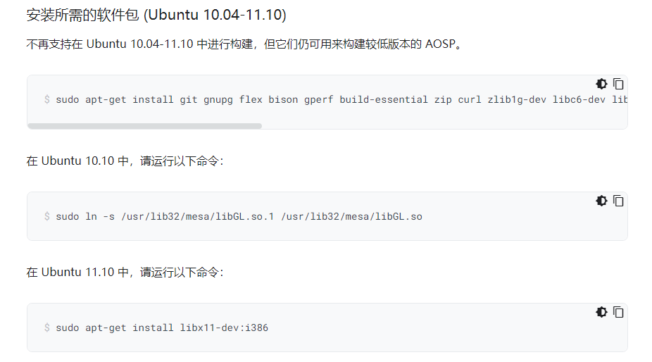

这里默认用的是美国镜像，所以我们要换成清华源的。

官网：https://mirrors.tuna.tsinghua.edu.cn/help/AOSP/

配置源的路径在/etc/apt/sources.list，先备份一个

```Java
sudo cp sources.;ist sources.list.bak
```

然后在sources.list第二行添加就行了

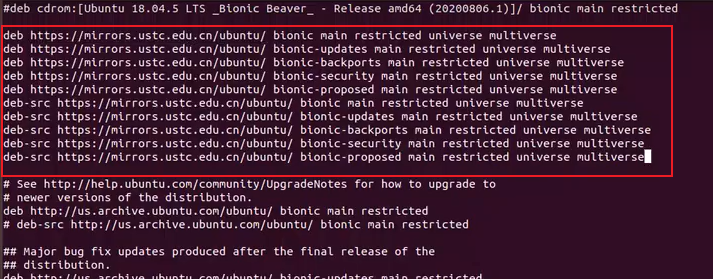

当下载出错的时候可以尝试换源，此时他会接着已经下载的部分下载，而不是重下

### 2. 下载源码

下载源码需要安装Repo工具，Repo 启动器会提供一个 Python 脚本，因此使用Repo首先需要安装python。

```Java
sudo apt-get install python
```

然后看官方文档

https://source.android.com/docs/setup/download?hl=zh-cn#installing-repo

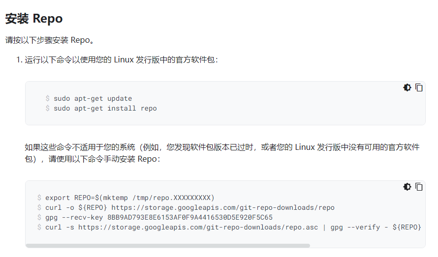

### 3. 初始化Repo仓库

这里我们切换到清华源的文档，按照下面的部分操作

https://mirrors.tuna.tsinghua.edu.cn/help/AOSP/

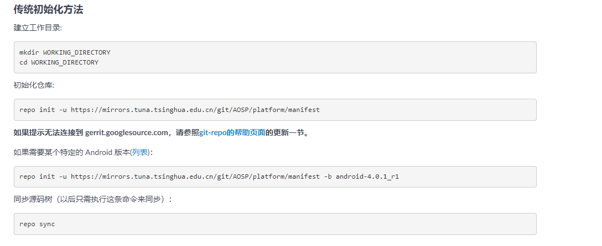

然后中途可能要设置git邮箱和用户名

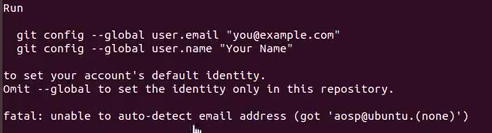

这里同步源码树建议使用：

```Java
repo sync -j4
```

数字太大会很占用资源

### 4. 编译Android

**Step1：初始化编译环境**

初始化编译环境主要是执行

`source ./build/envsetup.sh`命令执行envsetup.sh脚本( 或者用`.`代替`source`)，脚本的具体内容将在后续介绍。

注意，在Android9等较老的安卓版本上，需要使用bash来执行该脚本，否则会有如下警告。

> WARNING: Only bash is supported, use of other shell would lead to erroneous results

如果有和我一样使用`zsh` 的同学记得切换回bash

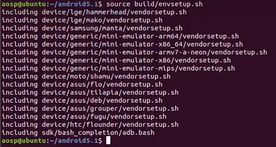

**Step2: 选择编译目标**

`lunch BUILD-BUILDTYPE` 

也可以直接输入lunch ，系统会给出所有可以选择的选项。选择之后即会确定TARGET_PRODUCT、TARGET_BUILD_VARIANT、TARGET_PLATFORM_VERSION、TARGET_BUILD_TYPE等变量的值。

这些值都是在`device/xxxx/product/AndroidProducts.mk`文件中的COMMON_LUNCH_CHOICES属性定义的。


**Step3： 编译**

`make -j8` 这里的选项"-jN"中的N值取决于你编译的服务器的CPU核心数。你可以使用 nproc 查看核心数，也可以大胆尝试，写高了会报错的。这里的make指的是编译整个Android代码。

Android根目录的Makefile include进来一个编译核心文件：`build/make/core/main.mk`

我们在编译的时候会有很多log但是由于控制台的buffer限制我们不能看到全部的log。于是将log输出到文件里面更便于我们查看，

```Java
make -j16 2>&1 | tee build.log
```

比如遇到本地化的错误，除了可以在每次执行之前使用export LC_ALL=C之外，还可以把这段代码添加到envsetup.sh的第一行，这样就不用每次都输入了

由于安卓已经出来很多年了，所以大部分的错误往往搜索都能找到解决答案

以后在编译的时候，当你修改了.mk文件之后记得使用 make clean清楚out目录下已经生成的文件

### 5. envsetup.sh介绍

现在来详细介绍一下envsetup.sh这个脚本

这个脚本记录了编译过程中所需要的各种函数实现，如m\mm\mmm\lunch 等函数，进入这个脚本可以看到里面给出的提示

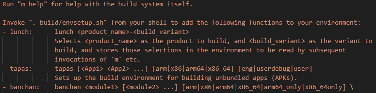

可以使用`m help`命令获取提示。

添加编译目标：将以下文件搜索并source进来

~~~
device/**/vendorsetup.sh
vendor/**/vendorsetup.sh
product/**/vendorsetup.sh
~~~

下面介绍一些常用的命令：

#### m命令

- m 源码树的根目录执行编译，编译的是根目录下所有的代码;
- mm 编译当前路径下所有模块，但不包含依赖关系的模块;
- mmm [module_path] 编译指定路径下的所有模块,但不包含依赖关系的模块；
- mma 编译当前路径下所有模块，且包含依赖关系的模块;
- mmma [module_path] 编译指定路径下的所有模块,且包含依赖关系的模块；

#### make命令

- make [module_name] 无参数，则表示编译整个Android代码，如果有module_name,是会遍历module，编译指定的module；

- **make clean**：执行清理操作，等价于 rm -rf out/

- **make installclean**：删除已安装的应用程序，如中间文件、临时文件、APK文件等

- **make otapackage** 生成升级包

- make update-api：更新API，在framework API改动后需执行该指令，Api记录在目录frameworks/base/api；

  其他还有

  > make sdk 编译出 Android 的 SDK;
  >
  > make clean-sdk 清理 SDK 的编译产物;
  >
  > make help 帮助信息，显示主要的 make 目标;
  >
  > make snod 从已经编译出的包快速重建系统镜像;
  >
  > make clean- 清理一个指定模块的编译结果;
  >
  > make dump-products 显示所有产品的编译配置信息;
  >
  > make libandroid_runtime 编译所有 JNI framework 内容
  >
  > make framework 编译所有 Java framework 内容
  >
  > make services 编译系统服务和相关内容。
  >
  > make bootimage 生成 boot.img
  >
  > make systemimage 编译生成system.img
  >
  > make recoveryimage 生成 recovery.img
  >
  > make userdataimage 生成 userdata.img
  >
  > make cacheimage 生成 cache.img
  >
  > make dist 执行 Build，并将 MAKECMDGOALS 变量定义的输出文件拷贝到 /out/dist 目录。

  常见module编译例：

  > {模块} make命令 | mmm命令
  > {init} make init | mmm system/core/init
  > {zygote} make app_process | mmm frameworks/base/cmds/app_process
  > {system_server} make services | mmm frameworks/base/services
  > {java framework} make framework | mmm frameworks/base
  > {framework资源} make framework-res | mmm frameworks/base/core/res
  > {jni framework} make libandroid_runtime | mmm frameworks/base/core/jni
  > {binder} make libbinder | mmm frameworks/native/libs/binder
  > {RefBase等} make libutils | mmm framworks/base/libs/utils
  > {Looper等} make framework | mmm framworks/base
  > {AudioTrack} make libmedia | mmm framworks/base/media/kibmedia
  > {AudioFlinger} make libaudiofliginger | mmm framworks/base/libs/audioflinger
  > {AudioPolicyService} make libaudiopolicy | mmm hardware/msm7k/libaudio-qsd8k
  > {SurfaceFlinger} make libsurfaceflinger | mmm frameworks/base/libs/surfaceflinger
  > {Vold} make vold | mmm system/vold
  > {Rild} make rild | mmm hardware/ril/rild
  > {MediaProvider} make MediaProvider | mmm packages/providers/MediaProvider
  > {Phone} make phone | mmm packages/apps/Phone

#### 编译配置和搜索命令

- add_lunch_combo [product] 将某个产品加入到用户选项中
- print_lunch_menu 查询lunch可选的product
- check_product [product] 检查产品是否有效
- **printconfig** 打印当前选择的产品配置
- get_build_var [build_var] 查找编译时各种变量值；
- get_abs_build_var [build_var] 获取系统中的编译变量的值
- cgrep [keyword] 所有 C/C++文件执行搜索操作
- jgrep [keyword] 所有 Java 文件执行搜索操作
- ggrep [keyword] 所有 Gradle 文件执行搜索操作
- **mgrep** [keyword] 所有 Android.mk 文件执行搜索操作
- mangrep [keyword] 所有AndroidManifest.xml文件执行搜索操作
- sepgrep [keyword] 所有 sepolicy 文件执行搜索操作
- resgrep [keyword] 所有本地res/*.xml文件执行搜索操作

#### 导航命令

- croot 切换至Android根目录
- godir [filename] 跳转到包含某个文件的目录


### 5. 编译完成之后的产物

编译完成之后，结果会在out/target/product里面


如果使用emulator有个报错

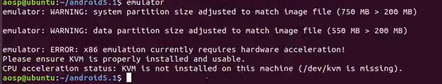

这是因为没有kvm加速器，安装一下就好了

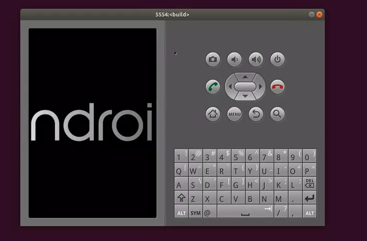

## 二、定制产品的编译与烧录

### 1. 在lunch中添加产品

添加自己的产品的目标是让lunch菜单有我们的产品显示，通过搜索envsetup.sh可以发现，添加产品的地方在AndroidProducts.mk下

我们在编译过程中执行lunch命令的时候会发现有许多编译目标（产品）可以选择。我们前面提到lunch的这些值都是在`device/xxxx/product/AndroidProducts.mk`文件中的COMMON_LUNCH_CHOICES属性定义的。事实上在device目录下我们会发现很多厂商名录的文件夹，比如google。在添加新产品的时候我们也往往是在自己公司命名的文件夹下进行添加。

首先我们要先在该文件的同级目录下加一个mk文件。比如suzhe.mk（现在里面是空的，只有一个vendorsetup.sh）

然后再AndroidProducts.mk里面引入suzhe.mk再加suzhe-userdebug，就可以添加到lunch的目录了

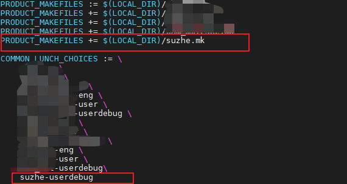

记得先执行`source build/envsetup.sh`才会把你的改动添加进来，再使用lunch命令就可以发现我们定义的已经成功添加进来了：

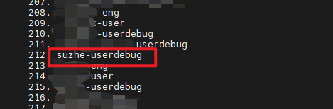

后续就是添加mk的操作了，这里不做介绍（因为我没有亲自试验过）

### 2. tips：vendorsetup.sh介绍

注意，在安卓9可能有这个文件，更新版本就没有了，这里也会解释原因。

当我们进入`device/xxxx/product/ `目录下后会发现里面有很多mk文件，其中比较重要的有AndroidProducts.mk 、device.mk、vendorsetup.sh、BoardConfig.mk 。这里我们来介绍一下vendorsetup.sh脚本。

脚本的目的：和AndroidProducts.mk中的COMMON_LUNCH_CHOICES属性一样，用于声明产品。

脚本内容：脚本内容参考如下：

~~~
add_lunch_combo suzhe-eng
add_lunch_combo suzhe-user
add_lunch_combo suzhe-userdebug

~~~

add_lunch_combo 是在哪里定义的: envsetup.sh

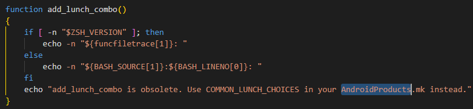

看到这里的注释了没有，这里提示我们说 `add_lunch_combo` 函数不再建议使用，而应该在 `AndroidProducts.mk` 文件中使用 `COMMON_LUNCH_CHOICES`。在安卓9的时候vendorsetup.sh还是存在的，但是后面就没了，这里仅做了解。

## 三、MK文件的包含路径

值得一看：

https://blog.csdn.net/wuye110/article/details/8463409

我们Make文件总共有三类

第一类是build目录下或者vendor下的，属于控制我们编译的一个框架，也就是控制编译的流程。

第二类是device目录下的，跟产品主板有关的，

第三类是跟应用有关的，编译jar包，编译可执行文件，编译apk之类的，Android.mk

首先应该是我们根目录下的Makefile文件，我们可以查看里面的内容

```Bash
### DO NOT EDIT THIS FILE ###
include build/make/core/main.mk
### DO NOT EDIT THIS FILE ###
```

很简单，里面指示了我们的.mk文件的路径

那现在我们进入到main.mk里面去看看可以发现包括了很多的mk，子mk里面又包含了子mk，是一个非常庞大的树结构

其中，安卓产品的加载会走config.mk文件。

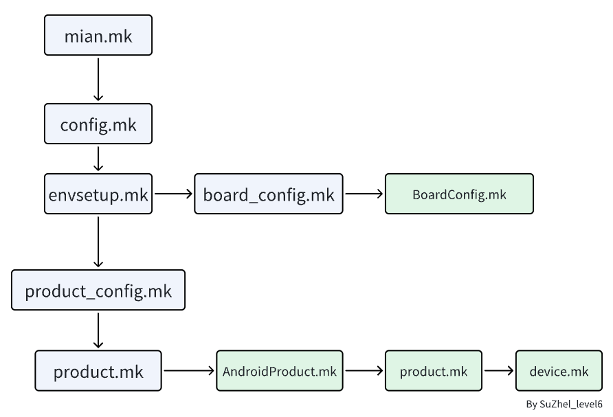

### 1. `build/core/main.mk`

- 包含了build/core/config.mk


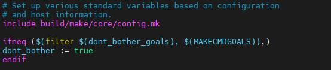

### 2. `build/core/config.mk`

- 包含`envsetup.mk`


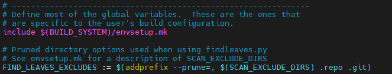

### 3. `build/make/core/envsetup.mk`

- 该文件负责配置 Build 系统需要的环境变量
- 这里面包含了**product_config.mk**文件


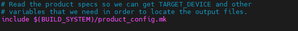

- 部分重要变量如下：

  - TARGET_BUILD_VARIANT：构建变种的变量，（例如 `eng`、`user`、`userdebug` 等）默认eng

  - TARGET_BUILD_TYPE：构建类型的变量，可以是 `release` 或 `debug` 默认release

  - PRODUCT_OUT：编译输出目录 out/target/product/

### 4. ` build/core/product_config.mk `

值得一看：

https://blog.csdn.net/lewif/article/details/50016179

- 包含了product.mk文件

  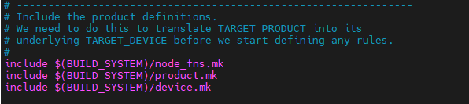

- 读取vendor目录下不同厂商自己定义的AndrodProducts.mk文件,根据lunch选择的编译项TARGET_PRODUCT，找到与之对应的配置文件，然后读取产品配置文件，找到里面的PRODUCT_DEVICE的值，设置给TARGET_DEVICE变量，用于后续编译。

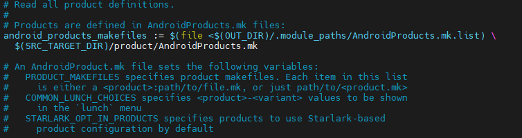

- 部分重要变量如下：

  PRODUCT_LOCALES ：用于定义产品支持的语言和地区设置，通常是一个以逗号分隔的列表，例如 en_US, zh_CN, fr_FR 等。
  PRODUCT_SYSTEM_NAME：系统中的产品名称，默认为 PRODUCT_NAME。
  PRODUCT_SYSTEM_DEVICE：系统中的设备名称，默认为 PRODUCT_DEVICE。
  PRODUCT_SYSTEM_BRAND：系统中的品牌名称，默认为 PRODUCT_BRAND。
  PRODUCT_MODEL：产品的模型名称，默认为 PRODUCT_NAME。
  PRODUCT_SYSTEM_MODEL：系统中的模型名称，默认为 PRODUCT_MODEL。
  PRODUCT_MANUFACTURER：产品的制造商名称，默认为 unknown。
  PRODUCT_SYSTEM_MANUFACTURER：系统中的制造商名称，默认为     PRODUCT_MANUFACTURER。
  PRODUCT_DEFAULT_DEV_CERTIFICATE：默认的开发者签名证书路径，确保该变量只包含一个证书路径。

### 5. `build/core/product.mk`

该文件主要是一些用来处理AndroidProducts.mk的函数，用于定义产品构建过程中使用的变量


### 6. BoardConfig.mk介绍

BoardConfig.mk是板卡配置，主要是针对底层的配置文件。该文件由`build/make/core/board_config.mk`包含，`board_config.mk`又由`envsetup.mk`包含。这个文件它里面主要写了product使用的硬件所支持和不支持的功能性内容。BroadConfig.mk设置了每个设备的自己的一些变量值，来区别编译时的行为。

- 最常见的改动就是SELINUX_PERMISSIVE对于SELinux模式的改动，如：

~~~
ifeq ($(AN_BOOT_SELINUX_PERMISSIVE), true)
BOARD_KERNEL_CMDLINE += androidboot.selinux=permissive
endif
~~~

这表明当我们配置了AN_BOOT_SELINUX_PERMISSIVE环境变量为true的时候，设置SELinux为permissive模式。

其他一些变量：

> TARGET_CPU_ABI：表示CPU的编程接口。比如armeabi-v7a。
> 
> TARGET_CPU_ABI2：表示CPU的编程接口。
> 
> TARGET_CPU_SMP：表示CPU是否为多核CPU。
> 
> TARGET_ARCH：定义CPU的架构。比如arm。
> 
> TARGET_ARCH_VARIANT：定义CPU的架构版本。比如：armv7-a-neon
> 
> TARGET_CPU_VARIANT：定义CPU的代号。比如：contex-a9
> 
> TARGET_NO_BOOTLOADER：如果为true，编译出的image不包含bootloader。
> 
> BOARD_KERNEL_BASE：装载kernel镜像时的基地址。比如：0x0
> 
> BOARD_KERNEL_OFFSET：kernel镜像的偏移地址。比如：0x1080000
> 
> BOARD_KERNEL_CMDLINE：装载kernel时传给kernel的命令行参数。比如：--cmdline "root=/dev/mmcblc0p20"
> 
> BOARD_MKBOOTIMG_ARGS：使用mkbooting工具生成boot.img时的参数。比如：--kernel_offset 0x1080000
> 
> BOARD_USES_ALSA_AUDIO：为true时，表示主板声音系统使用的是ALSA架构。
> 
> BOARD_HAVE_BLUETOOTH：为true时，表示主板支持蓝牙。
> 
> BOARD_WLAN_DEVICE：定义WiFi设备名称。
> 
> TARGET_BOARD_PLATFORM：表示主板平台的型号。比如tl1
> 
> TARGET_USERIMAGES_USE_EXT4：为true时，表示目标文件系统采用EXT4格式。
> 
> TARGET_NO_RADIOIMAGE：为true时，表示编译的镜像中没有射频部分。
> 
> WPA_SPPLICANT_VERSION：定义 WIFI WPA 的版本。
> 
> BOARD_WPA_SUPPLICANT_DRIVER：指定一种WPA_SUPPLICANT的驱动。
> 
> BOARD_HOSTAPD_DRIVER：指定WiFi热点的驱动。
> 
> WIFI_DRIVER_FW_PATH_PARAM：指定WiFi驱动的参数路径。
> 
> WIFI_DRIVER_FW_PATH_AP：定义WiFi热点firmware文件的路径。

### 7. AndroidProducts.mk介绍

其实上面已经差不多把AndroidProducts.mk的内容介绍完了，该mk在特定产品目录下，定义了product-eng 、product-user、product-userdebug等选项

还添加了同一目录下的product.mk进来，而product.mk当中又添加了同一目录下的device.mk。

### 8. device.mk介绍

这里面根据不同厂商会有非常多不同的实现，我们一般定制产品的各种属性也会有其中的改动。下面列出我这里有的一些：

- 根据LAUNCH_VERSION决定产品发布的 API 级别

~~~java
ifeq ($(LAUNCH_VERSION),U)
PRODUCT_SHIPPING_API_LEVEL := 34
else ifeq ($(LAUNCH_VERSION),T)
PRODUCT_SHIPPING_API_LEVEL := 33
else ifeq ($(LAUNCH_VERSION),S)
PRODUCT_SHIPPING_API_LEVEL := 31
else ifeq ($(LAUNCH_VERSION),R)
PRODUCT_SHIPPING_API_LEVEL := 30
else
PRODUCT_SHIPPING_API_LEVEL := 29
endif
~~~

显示密度资源选项DPI

~~~java
# Include drawables for all densities
PRODUCT_AAPT_CONFIG := normal large xlarge hdpi xhdpi
ifeq ($(BOARD_COMPILE_ATV), true)
PRODUCT_AAPT_PREF_CONFIG := xhdpi
else
PRODUCT_AAPT_PREF_CONFIG := hdpi
endif
~~~

不同资源选项的默认分辨率和DPI 在device/xxxxx/display_config_aosp.xml

## 四、Multilib build多库构建

早期的安卓系统只支持32位CPU架构，但是现在基本上都是64位的了，为了在一个操作系统环境下同时支持 32 位和 64 位应用程序于是有了Multilib build。

在 `Android.mk`中有这样一个变量LOCAL_MULTILIB。 它的值可以是32,64，both，表示可以编译的apk可以运行在32位、64位，或者32&64位硬件平台。

最经典的支持Multilib build的是zygote。Multilib 编译会产生两个不同版本的zygote来支持不同位数的应用程序，即Zygote64和Zygote32。

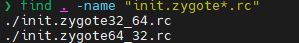

这俩文件分别代表 **32 位优先**的启动模式和 **64 位优先**的启动模式。zygote的Android.mk中做了同时编译32位和64位程序的配置。

以init.zygote64_32.rc为例，他所属的进程为app_process64

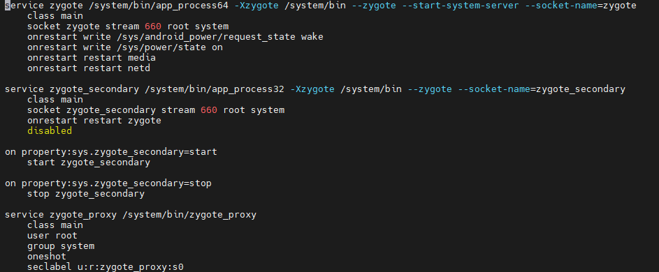

在较早以前的版本中，会有`framework/base/cmds/app_process/Android.mk`文件，里面内容如下：

~~~java
LOCAL_MODULE:= app_process
LOCAL_MULTILIB := both
LOCAL_MODULE_STEM_32 := app_process32
LOCAL_MODULE_STEM_64 := app_process64
 
LOCAL_CFLAGS += -Wall -Werror -Wunused -Wunreachable-code
 
include $(BUILD_EXECUTABLE)
~~~

LOCAL_MODULE_STEM_32 := app_process32
LOCAL_MODULE_STEM_64 := app_process64
这两句分别指定了两种情况下的应用程序的名字，对应了init.zygote32_64.rc 中的service的路径中的/system/bin/app_process64。

但是在较新的版本中，改成了`frameworks/base/cmds/app_process/Android.bp`，相应的内容变为如下：

~~~java
    // Create a symlink from app_process to app_process32 or 64
    // depending on the target configuration.
    symlink_preferred_arch: true,
~~~

这个配置表示会根据系统的首选架构（例如，64 位或 32 位）创建一个符号链接（symlink），指向相应的二进制文件。比如，在一个支持 32 位和 64 位的系统上，`app_process` 可能有 `app_process32` 和 `app_process64` 这两个文件，系统会自动为 `app_process` 创建一个符号链接，指向当前架构需要使用的版本。如果目标架构是 64 位，符号链接会指向 `app_process64`；如果目标架构是 32 位，符号链接会指向 `app_process32`。这种方式可以避免为每个架构都独立生成多个模块，而是通过符号链接来实现架构特定版本的自动切换。

关于bp文件的具体内容可以参考：https://juejin.cn/post/7099005083202879502

## 五、镜像文件

这里先顺便提一下编译速度的优化：https://www.jb51.net/article/258618.htm

APK编译打包流程：https://juejin.cn/post/7113713363900694565

在编译完安卓之后，会在`out/target/product/[YOUR_PRODUCT_NAME]/ ` 目录下生成最终要烧录到设备中的映像文件，包括system.img，userdata.img，recovery.img，ramdisk.img等

我不打算一个一个详细探究他们的具体内容，这里直接贴优秀博客。

https://blog.csdn.net/lijunjun1120/article/details/108720372

### ramdisk.img

根文件系统，android启动时 首先加载ramdisk.img镜像，并挂载到/目录下，并进行了一系列的初始化动作，包括创建各种需要的目录，初始化console，开启服务等。System.img是在init.rc中指定一些脚本命令，通过init.c进行解析并挂载到根目录下的/system目录下的。

**ramdisk.img其实是对root目录的打包和压缩**。主要有以下内容：

- init：Android最重要的进程——init，这是Android启动运行的的第一个进程，还有两个非常重要的脚本文件： init.fs100.rc和init.rc这是Android在刚开始启动时，需要首先加载的两个启动脚本，根据脚本里的内容，来完成一系列的启动工作，
- data目录是 userdata.img镜像要挂载的目录，
- system即为 system.img镜像需要挂载的目录，
- dev目录是系统启动后，系统的设备文件目录。

### system.img

挂载到 / 下的镜像，它包含了全部的系统可执行文件 
system.img 文件是下面system目录的一个映像，类似于linux的根文件系统的映像 

1. **bin**：包含系统的二进制可执行文件。
2. **etc**：包含配置文件。
3. **lib**：包含[共享库文件](https://so.csdn.net/so/search?q=共享库文件&spm=1001.2101.3001.7020)。
4. **framework**：包含Android框架的JAR文件。
5. **app**：包含系统应用程序。
6. **priv-app**：包含具有更高权限的系统应用程序。
7. **media**：包含音频、视频等媒体文件。
8. **fonts**：包含系统字体文件。
9. **build.prop**：系统属性文件，定义了系统的各种属性和参数。
10. **xbin**：包含其他可执行文件和工具。

需要了解更多请看：

https://cloud.tencent.com/developer/article/2425851

https://www.cnblogs.com/xunbu7/p/10844099.html

### userdata.img

**Userdata.img**来来自于data目录，默认里面是没有文件的。

需要了解请看：

https://blog.csdn.net/m0_59789328/article/details/139393603

### recovery.img

recovery分区的镜像，一般用作系统恢复

## 六、OTA升级

OTA升级在我的另一篇博客中已经详细提到了，这里不做赘述

https://suzhelevel6.github.io/suzhe_blog/study-notes/android/theory/OTA%E5%8D%87%E7%BA%A7%E6%9C%BA%E5%88%B6.html
