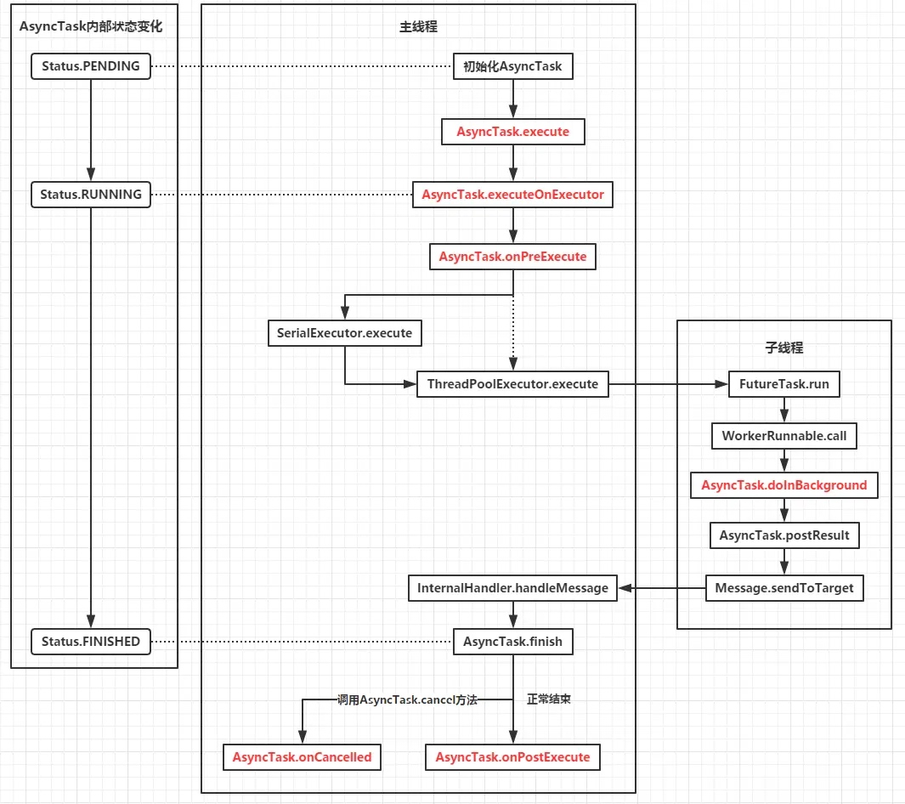

# 线程通信机制之过时的AsyncTask

`AsyncTask` 是 Android 开发中用于简化多线程实现的辅助类，旨在 **在后台执行异步任务**，而 **不会阻塞主线程**，从而保持用户界面的响应性。它适用于处理一些耗时操作，例如网络请求、数据库查询等。

## 弃用原因
然而，`AsyncTask` 在 Android 的最新版本中已经被官方标记为 **过时**（deprecated）。这是因为 `AsyncTask` 存在一些潜在的问题和限制，以下是其主要问题：

### 1. 内存泄漏
`AsyncTask` 如果没有正确取消或完成，可能会导致内存泄漏。这是因为 `AsyncTask` 持有对外部对象的引用（如 `Activity` 或 `Fragment`）。如果 `Activity` 或 `Fragment` 被销毁，而 `AsyncTask` 仍在执行，则 `AsyncTask` 会持续持有这些对象的引用，从而导致内存泄漏。

**解决方法：**
- 在 `Activity` 或 `Fragment` 的 `onDestroy()` 方法中调用 `AsyncTask.cancel()` 来将 `AsyncTask` 设置为已取消状态。
- 在 `doInBackground()` 方法中判断 `AsyncTask` 的状态（`AsyncTask.Status.RUNNING`），如果是运行中，直接返回以结束任务。
- 将 `AsyncTask` 作为 `Activity` 的静态内部类来避免 `context` 泄漏。

### 2. 配置更改问题
当屏幕旋转或配置更改（如语言切换）时，`AsyncTask` 可能无法正确处理状态的保存和恢复，导致数据丢失或异常。在配置更改时，`Activity` 会被销毁并重新创建，此时持有的 `Activity` 引用失效，导致任务执行完成后，`onPostExecute()` 中的 UI 更新无法生效。

**解决方法：**
- 在 `Activity` 恢复过程中，重新启动 `AsyncTask`，确保任务能继续执行并更新 UI。

### 3. 并发限制
`AsyncTask` 默认使用单个后台线程执行任务，这意味着只能同时执行一个任务。在某些场景下，可能需要并行执行多个任务，而 `AsyncTask` 无法满足这一需求。

**原因：**
- 每个 `AsyncTask` 实例只能调用一次 `execute()` 方法，若多次调用会抛出异常。对于并发任务，可以使用其他的并发工具，如 `ExecutorService` 或 `HandlerThread`。


虽然上述问题都是可以通过代码设计来解决的，但是过多的考虑异常case，就违背了选择`AsyncTask` 的初衷，因此Android 官方推荐使用其他的异步任务处理方式。

## AsyncTask的使用

`AsyncTask` 必须被子类化并实现至少一个方法（通常是 `doInBackground`），它的典型用法包括以下几个步骤：
1. **`onPreExecute`**：在 UI 线程上执行，用于设置任务前的准备工作，比如显示进度条。
2. **`doInBackground`**：在后台线程中执行的计算任务，返回任务的结果。
3. **`onProgressUpdate`**：当 `doInBackground` 中调用 `publishProgress` 时，在 UI 线程上更新进度。
4. **`onPostExecute`**：在后台计算完成后，UI 线程上显示结果。

### 示例代码
~~~java
public class DownloadTaskActivity extends AppCompatActivity {

    private ProgressBar progressBar;  // 进度条，用于显示下载进度
    private TextView statusTextView;  // 文本视图，用于显示任务状态

    @Override
    protected void onCreate(Bundle savedInstanceState) {
        super.onCreate(savedInstanceState);
        setContentView(R.layout.activity_download_task);  // 设置布局文件

        progressBar = findViewById(R.id.progressBar);  // 获取进度条组件
        statusTextView = findViewById(R.id.statusTextView);  // 获取状态文本视图组件

        // 启动 AsyncTask 执行下载任务
        new DownloadFilesTask().execute("http://example.com/file1", "http://example.com/file2");
    }

    // 定义一个 AsyncTask 来模拟文件下载
    private class DownloadFilesTask extends AsyncTask<String, Integer, Long> {

        @Override
        protected void onPreExecute() {
            // 在后台任务执行前，这个方法会在主线程中调用
            super.onPreExecute();
            statusTextView.setText("开始下载...");  // 更新状态文本视图
            progressBar.setProgress(0);  // 重置进度条为 0
        }

        @Override
        protected Long doInBackground(String... urls) {
            // 这个方法会在后台线程中执行，处理耗时任务
            long totalSize = 0;  // 记录总下载大小
            int count = urls.length;  // 获取文件数量

            for (int i = 0; i < count; i++) {
                // 模拟下载操作，每下载一个文件就休眠 1 秒
                try {
                    Thread.sleep(1000);  // 模拟下载时间
                    totalSize += 100;  // 假设每个文件大小为 100 KB
                } catch (InterruptedException e) {
                    e.printStackTrace();
                }

                // 每下载一个文件后，发布进度更新
                // publishProgress 方法会调用 onProgressUpdate 方法来更新进度
                publishProgress((int) ((i / (float) count) * 100));
            }

            return totalSize;  // 返回下载的总大小（假设每个文件都是 100 KB）
        }

        @Override
        protected void onProgressUpdate(Integer... progress) {
            // 这个方法会在主线程中执行，用于更新进度条
            super.onProgressUpdate(progress);
            progressBar.setProgress(progress[0]);  // 更新进度条的进度
        }

        @Override
        protected void onPostExecute(Long result) {
            // 任务执行完成后，这个方法会在主线程中执行
            super.onPostExecute(result);
            statusTextView.setText("下载完成！总大小: " + result + " KB");  // 显示下载完成后的结果
        }

        @Override
        protected void onCancelled() {
            // 如果任务被取消，会调用这个方法
            super.onCancelled();
            statusTextView.setText("下载已取消");  // 显示取消状态
        }
    }
}
~~~

### 取消任务

* 任务可以随时通过调用 `cancel(boolean)` 来取消。
* 如果任务已经取消，`doInBackground` 方法应该检查 `isCancelled()`，并根据结果提前退出。
* 如果任务被取消，`onCancelled()` 方法会被调用，代替 `onPostExecute`。


## 基本原理

代码路径：`./frameworks/base/core/java/android/os/AsyncTask.java`

首先这里附上`AsyncTask`内部工作流程图：



### 线程通信的关键——Handler

我们以`postResult`方法发送结果消息为例，来分析`AsyncTask`进行线程通信的过程。

#### 后台执行任务——WorkerRunnable

在 `AsyncTask` 中，执行后台任务的关键组件是 `WorkerRunnable`。通过 `WorkerRunnable`，`AsyncTask` 将执行任务的实际逻辑从主线程移到一个单独的后台线程。下面是 `AsyncTask` 中如何使用 `WorkerRunnable` 来执行后台任务的详细分析：
~~~java
mWorker = new WorkerRunnable<Params, Result>() {
    public Result call() throws Exception {
        mTaskInvoked.set(true);  // 标记任务已被执行
        Result result = null;
        try {
            // 设置线程为后台线程，优先级较低
            Process.setThreadPriority(Process.THREAD_PRIORITY_BACKGROUND);

            // 执行实际的后台任务，doInBackground 是用户实现的方法
            result = doInBackground(mParams);

            // 刷新 Binder 中待处理的命令，确保任务的通信顺畅
            Binder.flushPendingCommands();
        } catch (Throwable tr) {
            mCancelled.set(true);  // 任务如果发生异常，则设置为已取消
            throw tr;  // 抛出异常
        } finally {
            // 将结果发送到主线程，完成任务后会调用 postResult
            postResult(result);
        }
        return result;  // 返回任务执行结果
    }
};
~~~
* `mWorker` 是一个实现了 `WorkerRunnable` 接口的匿名类。`call()` 方法是 `WorkerRunnable` 中定义的一个方法，它会被调用来执行实际的后台任务。
* 在 `call()` 方法中，首先设置了线程的优先级为后台线程`（Process.setThreadPriority(Process.THREAD_PRIORITY_BACKGROUND)）`，这表明该线程应该执行后台任务。
* 然后，`doInBackground(mParams)` 在该方法中被调用，`doInBackground()` 是 `AsyncTask` 的核心方法，执行具体的后台操作。这是任务在子线程中执行的地方。

#### 内部的InternalHandler类返回消息给主线程

在 `AsyncTask` 中，它内部维护了一个静态的 `InternalHandler` 类，该类继承自 `Handler`，用于在后台线程中发送消息给主线程。这一机制是 `AsyncTask` 实现线程间通信的核心。

**特点一：初始化时绑定主线程**

`InternalHandler` 的构造函数接收一个 `Looper` 对象，该 `Looper` 代表的是主线程的 `Looper`。主线程的 `Looper` 是负责处理与主线程相关的消息队列的。`AsyncTask` 在初始化时，会通过 `getMainHandler()` 方法来确保 `InternalHandler` 与主线程的 `Looper` 绑定，从而使得消息能够在主线程中进行处理。

```java
    private static Handler getMainHandler() {
        synchronized (AsyncTask.class) {
            if (sHandler == null) {
                sHandler = new InternalHandler(Looper.getMainLooper());
            }
            return sHandler;
        }
    }
```
这里使用了加锁和判空来确保 `InternalHandler` 在整个应用程序中只有一个实例，并且该实例与主线程的 `Looper` 绑定，确保消息能够在主线程中正确处理。


**特点二：重写了 handleMessage 方法来处理不同的消息**

`InternalHandler` 继承自 `Handler`，并重写了 `handleMessage` 方法，用来处理从后台线程发送到主线程的消息。该方法根据消息的 `what` 值判断消息的类型，从而执行不同的操作。
```java
    private static class InternalHandler extends Handler {
        public InternalHandler(Looper looper) {
            super(looper);
        }

        @SuppressWarnings({"unchecked", "RawUseOfParameterizedType"})
        @Override
        public void handleMessage(Message msg) {
            AsyncTaskResult<?> result = (AsyncTaskResult<?>) msg.obj;
            switch (msg.what) {
                case MESSAGE_POST_RESULT:
                    // There is only one result
                    result.mTask.finish(result.mData[0]);
                    break;
                case MESSAGE_POST_PROGRESS:
                    result.mTask.onProgressUpdate(result.mData);
                    break;
            }
        }
    }
```
这里根据 `msg.what` 的值来判断是哪种类型的消息。这里根据 `what` 的值来区分两种消息类型：
1. `MESSAGE_POST_RESULT`：表示任务完成后的结果消息。
	* 任务执行完成后，调用 `finish` 方法来处理结果。
	* `result.mData[0]` 存储了任务的结果数据
2. `MESSAGE_POST_PROGRESS`：表示任务执行进度更新的消息。
	* 调用 `onProgressUpdate` 方法来更新进度
	* `result.mData` 存储了进度更新的数据

#### 创建消息，发送给InternalHandler

在需要将消息发送到主线程时，`AsyncTask` 会调用 `postResult` 方法来创建一个 `Message` 对象，并通过 `InternalHandler` 来处理消息。

```java
    private Result postResult(Result result) {
        @SuppressWarnings("unchecked")
        Message message = getHandler().obtainMessage(MESSAGE_POST_RESULT,
                new AsyncTaskResult<Result>(this, result));
        message.sendToTarget();
        return result;
    }
```

* `getHandler()` 方法返回 `InternalHandler` 实例。`getHandler()` 是通过 `getMainHandler()` 获取的，而这个方法会确保 `InternalHandler` 与主线程的 `Looper` 绑定。
* `obtainMessage()` 是 `Handler` 类的一个方法，用来获取一个新的 `Message` 对象并初始化它的 `what` 值和 `obj` 值。这里，`what` 被设置为 `MESSAGE_POST_RESULT`，`obj` 被设置为封装了任务结果的 `AsyncTaskResult` 对象。
* `sendToTarget()` 方法将当前的 `Message` 对象发送到 `Handler` 的消息队列。此时，`InternalHandler` 会接收到这个消息并根据 `what` 值决定如何处理。消息将通过 `handleMessage` 方法进行处理，最终在主线程中执行任务的结果回调或进度更新。

## 多任务并发场景

默认情况下，`AsyncTask` 会在单个后台线程中按顺序执行任务（即串行执行）。这种顺序执行的方式对于一些不涉及并发操作的场景非常有效，但如果你的应用需要多个任务并行执行（例如多个下载任务），可以通过设置不同的 `Executor` 来改变这种默认行为。

`AsyncTask` 提供了两种主要的 `Executor`：`SERIAL_EXECUTOR` 和 `HREAD_POOL_EXECUTOR`。
* `SERIAL_EXECUTOR`：串行执行任务，保证任务按顺序执行。
* `THREAD_POOL_EXECUTOR`：并行执行任务，可以提高多任务的执行效率。
	
这是上面的示例中，使用并行执行的代码：
~~~java
// 启动 AsyncTask 执行下载任务，使用 THREAD_POOL_EXECUTOR 进行并行处理
        new DownloadFilesTask().executeOnExecutor(AsyncTask.THREAD_POOL_EXECUTOR, 
            "http://example.com/file1", "http://example.com/file2");
~~~

### SERIAL_EXECUTOR：串行执行任务

SERIAL_EXECUTOR 是一个串行执行的 Executor，它可以确保所有任务按照它们被提交的顺序执行。对于某些场景，使用串行执行可以避免多个任务同时访问共享资源，从而避免数据竞争和并发冲突。

例如，如果任务需要顺序执行并依赖于前一个任务的结果，可以使用串行执行器。SERIAL_EXECUTOR 通过一个任务队列来管理任务的执行，并且确保每个任务都在上一个任务执行完毕后再开始执行。

其源码如下：
~~~java
private static class SerialExecutor implements Executor {
    // 任务队列，存放待执行的任务
    final ArrayDeque<Runnable> mTasks = new ArrayDeque<Runnable>();
    // 当前正在执行的任务
    Runnable mActive;

    @Override
    public synchronized void execute(final Runnable r) {
        // 将新的任务加入队列
        mTasks.offer(new Runnable() {
            @Override
            public void run() {
                try {
                    r.run();  // 执行任务
                } finally {
                    scheduleNext();  // 执行完毕后调度下一个任务
                }
            }
        });
        // 如果当前没有任务正在执行，开始执行队列中的第一个任务
        if (mActive == null) {
            scheduleNext();
        }
    }

    // 调度下一个任务执行
    protected synchronized void scheduleNext() {
        if ((mActive = mTasks.poll()) != null) {
            THREAD_POOL_EXECUTOR.execute(mActive);  // 使用 THREAD_POOL_EXECUTOR 执行任务
        }
    }
}
~~~

* `mTasks`：一个 `ArrayDeque` 队列，用于存储待执行的任务。
* `mActive`：记录当前正在执行的任务。
* `execute(Runnable r)`：将新的任务添加到队列中，并在队列为空时开始执行任务。
* `scheduleNext()`：当当前任务完成后，调度下一个任务执行。

### THREAD_POOL_EXECUTOR：并行执行任务

`THREAD_POOL_EXECUTOR` 是 `AsyncTask` 的并行执行 `Executor`，它使用**线程池**来执行任务，可以显著提高多个任务并行执行时的效率。线程池根据任务的需求动态调整线程数量，并允许多个任务同时执行。

然而，使用单一的线程池并不总是最优的解决方案。对于不同的任务，使用配置适当的线程池可以提升性能。例如，CPU 密集型任务可以受益于有界线程池，而对于需要长时间阻塞的任务（如网络操作），多个线程池可能会提供更好的性能。

其源码如下：
~~~java
public static final Executor THREAD_POOL_EXECUTOR;

static {
    // 创建一个线程池，指定核心池大小、最大池大小、线程存活时间等参数
    ThreadPoolExecutor threadPoolExecutor = new ThreadPoolExecutor(
            CORE_POOL_SIZE,                // 核心线程池大小
            MAXIMUM_POOL_SIZE,            // 最大线程池大小
            KEEP_ALIVE_SECONDS,           // 线程存活时间
            TimeUnit.SECONDS,             // 时间单位
            new SynchronousQueue<Runnable>(), // 阻塞队列
            sThreadFactory                // 线程工厂
    );

    // 设置任务拒绝策略
    threadPoolExecutor.setRejectedExecutionHandler(sRunOnSerialPolicy);

    // 将线程池设置为 THREAD_POOL_EXECUTOR
    THREAD_POOL_EXECUTOR = threadPoolExecutor;
}
~~~

* `ThreadPoolExecutor`：一个具体实现了 `Executor` 接口的线程池类，能够管理线程池中的线程。
* `CORE_POOL_SIZE`：线程池中的核心线程数，即使没有任务，也会一直保持的线程数。
* `MAXIMUM_POOL_SIZE`：线程池允许的最大线程数。
* `KEEP_ALIVE_SECONDS`：当线程池中的线程空闲时，允许线程保持活动的最大时间。
* `SynchronousQueue<Runnable>()`：一个无缓冲的队列，用于任务的提交和执行。
* `sThreadFactory`：一个 `ThreadFactory` 对象，用于创建新线程。
* `sRunOnSerialPolicy`：一个拒绝执行策略，当线程池中的线程数量已达到最大值时，决定如何处理被拒绝的任务。

### 任务的有序性和消息的有序性

Executor 和 MessageQueue 都和有序性有关，但他们处理的是不同层面的。以网络下载任务为例，Executor 管理的是下载任务的按顺序进行以及是否同时进行。而MessageQueue 只负责按顺序传达下载时候的进度这种消息

### 1. **`Executor` 的作用：管理任务的执行顺序和并发性**

以网络下载任务为例，假设有多个文件需要下载，`Executor` 负责管理这些任务的 **执行顺序** 和 **并发执行**。

- 如果你使用 **串行执行的 `Executor`**（比如 `SERIAL_EXECUTOR`），它会保证下载任务一个接一个地按顺序执行。也就是说，第一个文件下载完成后，第二个文件才开始下载，第三个文件依此类推。
- 如果你使用 **并行执行的 `Executor`**（比如 `THREAD_POOL_EXECUTOR`），它会允许多个下载任务同时执行。多个线程会同时下载文件，从而提高任务执行效率。

**总结**：`Executor` 管理的是任务的执行策略，是**调度层面**的控制，决定任务是否按顺序或并发执行。

### 2. **`MessageQueue` 的作用：传递任务进度和结果的消息**

而 **`MessageQueue`** 和 **`Handler`** 是用于线程间传递消息的机制，通常用于将 **任务进度**、**执行结果** 等信息从后台线程传递到主线程。

- 在网络下载的场景中，下载任务的进度（比如文件下载的百分比）会被封装成消息，通过 `MessageQueue` 传递到主线程。主线程会通过 `Handler` 来处理这些消息，并更新 UI（例如显示下载进度）。
  
- 即使你有多个下载任务并行执行，每个任务的进度更新仍然会被顺序地传递到主线程，因为消息队列 `MessageQueue` 本身是顺序的，它会按发送顺序依次处理消息。

**总结**：`MessageQueue` 主要负责 **消息的传递**，比如进度更新和任务完成的结果消息。它并不关心任务是串行执行还是并行执行，而是负责将信息从后台线程传递给主线程。

### 总结图解：

| 组件            | 作用                          | 示例                  |
|----------------|-----------------------------|-----------------------|
| **`Executor`**  | 管理任务的执行顺序和并发性     | 控制下载任务是串行执行还是并行执行 |
| **`MessageQueue`** | 负责传递任务执行过程中的消息   | 传递任务的进度、完成状态等信息 |
| **`Handler`**    | 处理来自 `MessageQueue` 的消息 | 更新 UI 或执行主线程操作    |


