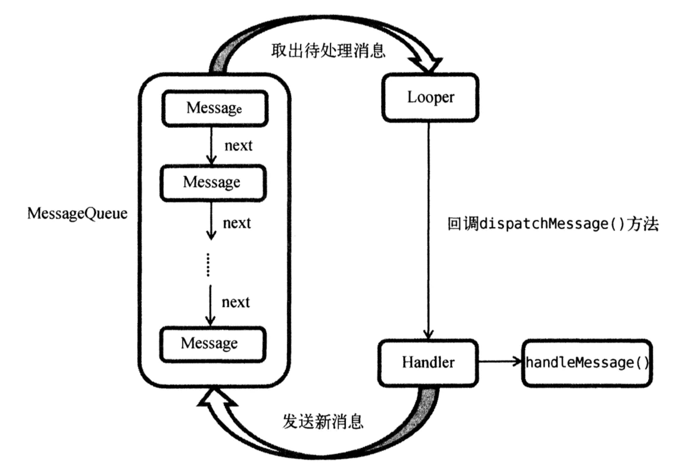
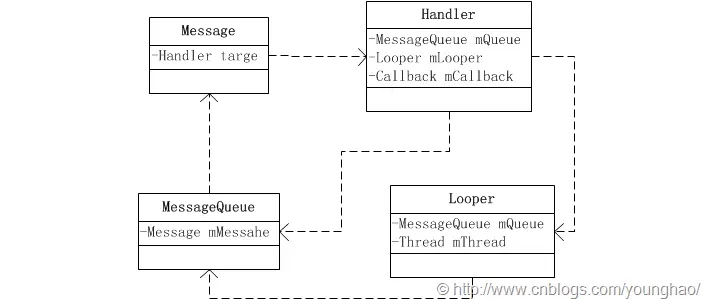
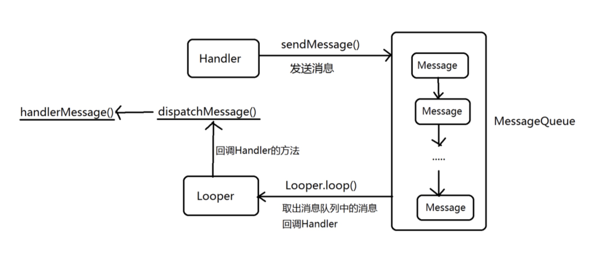

# 线程通信机制 —— Handler

`Handler` 是线程间通信的机制，其中涉及几个核心概念：`Handler`、`Looper`、`Message` 和 `MessageQueue`。

- **Handler**：`Handler` 是消息处理机制的核心类，用于在不同线程之间发送和处理消息。
- **Looper**：`Looper` 是一个管理消息循环的类，每个线程最多有一个 `Looper`。
- **Message**：`Message` 是消息载体，封装了需要在线程之间传递的数据。
- **MessageQueue**：`MessageQueue` 是消息的存储和调度中心，内部以队列的形式存储 `Message` 对象。

另外，**Runnable** 是一个接口，`Runnable` 最终会被封装进 `Message`，所以 `Runnable` 本质上也是一个 `Message`。

## Handler、MessageQueue、Message 和 Looper 四者的关系

我们可以从 `Thread` 开始梳理它们之间的关系：

① 每个`Thread`只对应一个`Looper`；
② 每个`Looper`只对应一个`MessageQueue`；
③ 每个`MessageQueue`中有N个`Message`；
④ 每个`Message`中最多指定一个`Handler`来处理事件。
⑤ `Looper` 不断循环地从 `MessageQueue` 中取出一个消息（`Message`），然后交给 `Handler` 去处理，如此循环往复。

### 总结

**Looper 不断获取 `MessageQueue` 中的一个 `Message`，然后由 `Handler` 来处理。**

## Handler

代码路径： `frameworks/base/core/java/android/os/Handler.java`

### 构造方法
~~~java
public Handler() 
public Handler(Looper looper) 
public Handler(Callback callback) 
public Handler(Looper looper, Callback callback) 
public Handler(Looper looper, boolean async) 
public Handler(Callback callback, boolean async) 
public Handler(Looper looper, Callback callback, boolean async) 
~~~

从 Handler 的构造方法可以看出，Handler 需要三个主要的参数：
- **Looper**：指定 `Handler` 绑定的消息队列，默认为当前线程的 `Looper`。
- **Callback**：允许在消息到达时做额外处理，避免重写 `handleMessage()` 方法，非必须。
- **async**：控制消息处理是否为异步，默认为同步（`false`），即处理消息时会阻塞队列，直到当前消息处理完成。异步（`true`）则不会阻塞队列，允许同时处理其他消息。

### Handler 与 Thread 的关系

我们前面提到：
① 每个`Thread`只对应一个`Looper`；
② 每个`Looper`只对应一个`MessageQueue`；
③ 每个`MessageQueue`中有N个`Message`；
④ 每个`Message`中最多指定一个`Handler`来处理事件。
⑤ `Looper` 不断循环地从 `MessageQueue` 中取出一个消息（`Message`），然后交给 `Handler` 去处理，如此循环往复。

**可以推断出，`Thread`和`Handler`是一对多的关系。**

#### 示例：子线程给主线程发送消息

为了更好的理解Handler 与 Thread 的关系，我们以子线程给主线程发送消息为例，讲解消息发送的步骤：
1. **主线程准备 Handler**：主线程中创建一个 `mainHandler` 并绑定到主线程的 `Looper`。
2. **子线程准备 `threadHandler` 和 `Looper`**：在子线程中调用 `Looper.prepare()` 为子线程创建消息循环，然后创建一个 `threadHandler`。
3. **子线程发送消息**：子线程通过 `mainHandler.sendMessage()` 向主线程发送消息。此时消息会被发送到主线程的 `MessageQueue` 中
4. **主线程接收消息**：主线程的 `mainHandler` 从消息队列中取出消息并调用 `handleMessage()` 方法处理。
5. **消息处理**：主线程根据消息内容执行相应的操作（如 UI 更新、数据处理等）。

示例代码如下：
~~~java
// 主线程中的 Handler
Handler mainHandler = new Handler(Looper.getMainLooper()) {
    @Override
    public void handleMessage(Message msg) {
        // 这里处理从子线程发送来的消息
        Log.d("MainThread", "Received message from child thread: " + msg.what);
    }
};

// 子线程中的代码
Thread thread = new Thread(new Runnable() {
    @Override
    public void run() {
        Looper.prepare(); // 准备子线程的 Looper
        Handler threadHandler = new Handler(Looper.myLooper()) {
            @Override
            public void handleMessage(Message msg) {
                Log.d("ChildThread", "Received message in child thread: " + msg.what);
            }
        };

        // 通过主线程的 Handler 向主线程发送消息
        Message msg = mainHandler.obtainMessage();
        msg.what = 1; // 设置消息标识
        mainHandler.sendMessage(msg); // 发送消息到主线程

        Looper.loop(); // 启动子线程消息循环
    }
});
thread.start(); // 启动子线程
~~~

### Handler 的功能

`Handler` 主要有两个功能：

1. **处理消息**：这是 `Handler` 作为“处理者”的本职工作，负责接收并处理 `Message`。
2. **将消息压入消息队列**：`Handler` 将消息放入 `MessageQueue`，待后续处理。

#### 功能一：消息处理
`Handler` 的消息处理函数声明如下：

~~~java
public void dispatchMessage(@NonNull Message msg)//消息分发
public void handleMessage(@NonNull Message msg)//消息处理
~~~

`Looper`从`MessageQueue`中取出一个`Message`后，首先会调用`Handler.dispatchMessage`进行消息派发:

~~~java
	//处理消息的
  	public void dispatchMessage(@NonNull Message msg) {
        if (msg.callback != null) {//callback不为空
            handleCallback(msg);
        } else {
            if (mCallback != null) {
                if (mCallback.handleMessage(msg)) {
                    return;
                }
            }
            handleMessage(msg);
        }
    }
~~~

`dispatchMessage`根据具体的策略来将`Message`分发给相应的责任人。默认情况下**消息处理的优先级**是：

❶ Message.callback(Runnable对象)
❷ Handler. mCallback
❸ Handler.handleMessage

由此可见，`Handler`的扩展子类可以通过重载`dispatchMessage`或者`handleMessage`来改变它的默认行为。

#### 功能二：消息发送

`Handler` 提供了多个消息发送方法，分为 **Post 系列** 和 **Send 系列**。它们的主要作用是将消息压入 `MessageQueue` 中，等待后续处理。

1. Post系列：

`Post` 系列方法用于将 `Runnable` 对象转化为 `Message` 并发送到消息队列。常见的 `Post` 系列函数如下：
~~~java
final boolean post(Runnable r);
final boolean postAtTime(Runnable r, long uptimeMillis);
...
~~~

2.Send系列：

`Send` 系列方法则直接使用 `Message` 对象作为参数，将其发送到消息队列。常见的 `Send` 系列函数如下：
~~~java
final boolean sendEmptyMessage(int what);
final boolean sendMessageAtFrontOfQueue(Message msg);
boolean sendMessageAtTime(Message msg, long uptimeMillis);
final boolean sendMessageDelayed(Message msg, long
delayMillis);
...
~~~

**`Post` 和 `Send` 的共同点与区别**
* **共同点**：两者都将消息压入 `MessageQueue` 中，等待后续的处理。
* **区别**：`Post` 系列方法传入的参数是 `Runnable` 对象，它需要先将 `Runnable` 转换成 `Message`，然后通过相应的 `Send` 系列方法来发送。相比之下，`Send` 系列方法直接操作 `Message` 对象。

**以 `post` 为例的实现过程**
以 `post` 方法为例，调用者提供的是一个 `Runnable` 对象，`Handler` 首先将 `Runnable` 封装成 `Message`，然后通过 `send` 系列函数将其推送到消息队列。
~~~java
private static Message getPostMessage(Runnable r) {
    // 通过 obtain 获取一个 Message 实例，避免重复创建，节省资源
    Message m = Message.obtain();
    // 将 Runnable 对象设置为 Message 的回调函数
    m.callback = r;
    return m;
}
~~~

**发送延迟消息**

之所以把`Message`压入`MessageQueue`中再交给 `Handler` 处理消息而不是直接处理，也是因为想要通过计算发送时间来保证**消息的有序性**。如 `sendMessageDelayed`,这个方法允许**设置消息发送的延迟时间**。其内部会通过当前时间加上延迟时间来计算出消息的具体发送时刻，调用 `sendMessageAtTime` 将其发送到消息队列。

## MessageQueue

源码路径：`frameworks/base/core/java/android/os/MessageQueue.java`

`MessageQueue` 正如其名，是一个消息队列，具有队列的所有常规操作，包括：新建队列、元素入队、元素出队、删除元素和销毁队列。

### 核心方法

`MessageQueue` 有两个比较重要的方法，分别是：
1. `enqueueMessage()`：用于将消息入队。
2. `next()`：用于从队列中取出消息。

下面是 `enqueueMessage()` 方法的实现代码：

~~~java
boolean enqueueMessage(Message msg, long when) {
    // 检查消息的目标是否为空，目标是指向目标 Handler 的引用。
    if (msg.target == null) {
        throw new IllegalArgumentException("Message must have a target.");
    }

    synchronized (this) {
        // 检查消息是否已经在使用，如果已使用，则抛出异常
        if (msg.isInUse()) {
            throw new IllegalStateException(msg + " This message is already in use.");
        }

        // 如果队列正在退出，说明线程已死，不再接收新消息
        if (mQuitting) {
            IllegalStateException e = new IllegalStateException(
                    msg.target + " sending message to a Handler on a dead thread");
            Log.w(TAG, e.getMessage(), e);
            msg.recycle(); // 回收消息
            return false;
        }

        // 标记消息为正在使用
        msg.markInUse();
        msg.when = when; // 设置消息的时间戳（消息应当被处理的时间）

        Message p = mMessages; // 获取队列中的第一个消息
        boolean needWake; // 标记是否需要唤醒消息队列

        // 以下算法通过时间戳将队列中的消息按优先级排序
        if (p == null || when == 0 || when < p.when) {
            // 如果队列为空或者当前消息时间戳比第一个消息早，则将其插入队头
            msg.next = p;
            mMessages = msg;
            needWake = mBlocked;
        } else {
            // 如果消息插入到队列的中间，检查是否需要唤醒队列
            needWake = mBlocked && p.target == null && msg.isAsynchronous();
            Message prev;
            for (;;) {
                prev = p;
                p = p.next; // 遍历队列
                if (p == null || when < p.when) {
                    break; // 找到插入点
                }
                // 如果队列中有异步消息且该消息需要唤醒队列，则更新 needWake
                if (needWake && p.isAsynchronous()) {
                    needWake = false;
                }
            }
            // 将消息插入到队列中
            msg.next = p; // 保证 msg 后继的消息为 p
            prev.next = msg;
        }

        // 如果需要唤醒队列，调用原生方法进行唤醒
        if (needWake) {
            nativeWake(mPtr);
        }
    }
    return true; // 返回操作是否成功
}
~~~

**关键要点解析**
* **消息排序**：在消息被添加到队列时，队列会根据消息的时间戳 `when` 对消息进行排序。若消息的时间戳早于队列中的其他消息，它将被优先处理。这确保了消息能够按照预期的顺序被处理。
* **队列优先级**：`enqueueMessage()` 方法通过 `when` 参数判断消息是否应插入队列的头部或中间，从而实现优先级的排序。这样，时间较早的消息将会被优先处理。
* **唤醒机制**：如果队列为空并且有新消息插入，或者插入的是异步消息并且队列被阻塞时，系统会唤醒队列。唤醒操作通过 `nativeWake()` 方法触发，它将通知正在等待的线程继续工作。

**队列的阻塞和唤醒**：
* **阻塞队列**：在队列中没有消息时队列会处于“阻塞”状态（防止 CPU 无谓的空转），此时调用取出消息（如`next()`）的方法的线程会阻塞等待，直到有新的消息被插入。
* **唤醒队列**：如果队列处于阻塞状态，并且有新的消息被插入，队列会被“唤醒”。

**队列中的同步消息与异步消息的行为**
* **同步消息**：当消息队列中有同步消息时，消息处理是阻塞性的。即队列中的同步消息必须按照顺序处理，不能跳过或并行处理
* **异步消息**：异步消息不会阻塞队列，它们可以被插入到队列中并尽早执行，而不会被同步消息的处理过程所阻塞。
* 当有异步消息插入队列时，系统会尝试唤醒队列，让异步消息尽快得到处理，即使队列中还有同步消息没有处理完。
* 如果遇到**同步屏障**则会引发队列的特殊行为：**同步屏障消息是一种特殊的消息，它的作用是阻止所有其他消息的执行，直到屏障后的消息被处理完**。
	
## Looper

源码路径：`frameworks/base/core/java/android/os/Looper.java`

`Looper` 类在 Android 中扮演着一个非常重要的角色，它有点类似于一个“发动机”，通过它的驱动，`Handler` 和程序的消息机制得以运作。消息循环的核心正是 `Looper`，它不断地从 `MessageQueue` 中获取消息并派发给相应的 `Handler` 处理。

### 构造方法

仔细观察`Looper`的构造方法：
~~~	
private Looper(boolean quitAllowed) {
    mQueue = new MessageQueue(quitAllowed);  // 创建一个消息队列
    mThread = Thread.currentThread();         // 绑定当前线程
}
~~~
从这个构造方法可以看到，`Looper` 在创建时会初始化一个 `MessageQueue`，并与当前线程绑定。

### 使用场景
应用程序使用 Looper 的方式有两种主要场景：
1. **主线程（MainThread）**
例如，`ActivityThread` 使用 `prepareMainLooper()` 方法来初始化主线程的 `Looper`。
~~~java
/* frameworks/base/core/java/android/app/ActivityThread.java */

// 主线程的入口方法
public static void main(String[] args) {
    Looper.prepareMainLooper();// 准备主线程的 Looper，和普通线程不同
    ActivityThread thread = new ActivityThread();// 新建一个 ActivityThread 对象
    thread.attach(false);// 将当前线程与 ActivityThread 进行绑定
    
    if (sMainThreadHandler == null) {// 如果主线程 Handler 未初始化，则初始化
        sMainThreadHandler = thread.getHandler(); // 获取主线程的 Handler
    }
    
    AsyncTask.init();
    Looper.loop();
    throw new RuntimeException("Main thread loop unexpectedly exited");
}
~~~
2. **普通线程**
以下是一个在普通线程中使用 `Looper` 的示例，名为 `LooperThread`：
~~~java
// 自定义线程类，带有 Looper 和 Handler
class LooperThread extends Thread {
    public Handler mHandler; // 用于向线程发送消息的 Handler

    @Override
    public void run() {
        // 准备 Looper，初始化当前线程的消息循环机制
        Looper.prepare(); 
        // 上述代码会创建一个关联当前线程的 MessageQueue 和 Looper 实例

        // 创建一个 Handler，负责接收消息和处理任务
        // 注意：Handler 必须在调用 Looper.prepare() 之后创建
        mHandler = new Handler() {
            @Override
            public void handleMessage(Message msg) {
                // 处理接收到的消息
                switch (msg.what) {
                    case 1:
                        System.out.println("Message 1 processed: " + msg.obj);
                        break;
                    case 2:
                        System.out.println("Message 2 processed: " + msg.obj);
                        break;
                    default:
                        System.out.println("Unknown message: " + msg.what);
                        break;
                }
            }
        };

        // 开启消息循环
        // Looper.loop() 会不断从消息队列中提取消息并分发到对应的 Handler
        Looper.loop();
    }
}
~~~

这段代码的核心操作是：
1. 调用 `Looper.prepare()` 为线程初始化消息循环；
2. 创建处理消息的 `Handler`；
3. 调用 `Looper.loop()` 启动消息循环。

Looper中有两个比较重要的方法就是`prepare()` 和 `loop()`

### `prepare()`方法和`prepareMainLooper()`方法

`Looper.prepare()` 方法用于初始化当前线程的 `Looper` 实例，它内部调用了如下代码：
~~~java
// 定义一个 ThreadLocal 存放 Looper，每个线程会有唯一的 sThreadLocal
static final ThreadLocal<Looper> sThreadLocal = new ThreadLocal<Looper>();
private static Looper sMainLooper;  // guarded by Looper.class

// 准备初始化 looper
public static void prepare() {
    prepare(true);
}

private static void prepare(boolean quitAllowed) {
    // 每个线程只能创建一个 Looper
    if (sThreadLocal.get() != null) {
        throw new RuntimeException("Only one Looper may be created per thread");
    }

    // 创建一个 Looper
    sThreadLocal.set(new Looper(quitAllowed));
}

public static void prepareMainLooper() {
    prepare(false);
    synchronized (Looper.class) {
        if (sMainLooper != null) {
            throw new IllegalStateException("The main Looper has already been prepared.");
        }
        sMainLooper = myLooper();
    }
}

public static @Nullable Looper myLooper() {
    // 从 ThreadLocal 中获取 Looper
    return sThreadLocal.get();
}
~~~

要点：
1. `ThreadLocal`对象是一种特殊的全局变量，因为它的“全局”性只限于自己所在的线程，而外界所有线程（即便是同一进程）一概无法访问到它。每个线程有唯一的`sThreadLocal` 用来存放 `Looper`。
2. `prepareMainLooper()` 方法在主线程中调用，用来初始化主线程的 `Looper`。`prepare()` 参数 `false` 表示该线程不允许退出。
3. `prepareMainLooper()` 方法中还将主线程中的 `Looper` 赋值给了`sMainLooper`，这也意味着在子线程中可以使用`getMainLooper()`来获取主线程的 `Looper`，但是主线程无法访问子线程的 `Looper`

### looper()方法

loop() 方法是 Looper 的核心，它开启一个死循环，从消息队列中不断取出消息并派发给相应的 Handler 处理：
~~~java
public static void loop() {
    final Looper me = myLooper();
    if (me == null) {
        // 如果 Looper 没有创建，会抛出异常
        throw new RuntimeException("No Looper; Looper.prepare() wasn't called on this thread.");
    }

    for (;;) {
        Message msg = queue.next();  // 阻塞获取下一个消息
        if (msg == null) {
            // 如果没有消息，表示消息队列正在退出
            return;
        }

        try {
            msg.target.dispatchMessage(msg);  // 处理消息
        } catch (Exception exception) {
            // 异常处理
            throw exception;
        } finally {
            // 回收消息
            msg.recycleUnchecked();
        }
    }
}
~~~

要点：
1. 开启`Looper.loop()`首先要先获取`Looper`,获取不到则会报错，所以在子线程中必须手动调用 `Looper.prepare()` 和 `Looper.loop()`。 主线程中为啥不用调动呢，那是因为在主线程初始化的时候就已经调用了。
2. 死循环中，`Message msg = queue.next()` 这个方法从 `Looper` 的 `MessageQueue` 中去获取 `Message`。`queue.next()`是一个阻塞方法，没有消息会等待。当有消息可以获取到的时候就会调用 `msg.target.dispatchMessage(msg)`处理消息。

### Looper循环的停止

Looper 提供了两个方法来停止消息循环：
~~~java
	 public void quit() {
        mQueue.quit(false);
    }

	 public void quitSafely() {
        mQueue.quit(true);
    }
~~~
这两个方法都会调动MessageQueue中的 void quit(boolean safe)
~~~java
	 void quit(boolean safe) {
        if (!mQuitAllowed) {
            throw new IllegalStateException("Main thread not allowed to quit.");
        }

        synchronized (this) {
            if (mQuitting) {
                return;
            }
            mQuitting = true;//注意，这里会结束循环。。。

            if (safe) {
                removeAllFutureMessagesLocked();
            } else {
                removeAllMessagesLocked();
            }

            // We can assume mPtr != 0 because mQuitting was previously false.
            nativeWake(mPtr); //这里会停止消息阻塞
        }
    }

MessageQueue  -->
	Message next() {
        
        final long ptr = mPtr;
        if (ptr == 0) {
            return null;//直接返回null
        }
	}
Looper --loop();
	for (;;) {
            Message msg = queue.next(); // might block
            if (msg == null) {
                // No message indicates that the message queue is quitting.
                return;  //直接return 结束了循环
            }
	}
~~~
**结束消息循环的过程**
1. **`quit()` 方法**：它会通过将 `mQuitting` 设置为 `true` 来停止消息循环，并通过 `nativeWake(mPtr)` 唤醒阻塞的队列。
2. **消息队列阻塞**：当消息队列被阻塞时，`queue.next()` 会取不出消息，导致 `Looper.loop()` 停止结束。

## Message（消息）

源码路径：`frameworks/base/core/java/android/os/Message.java`

`Message`就是一个承载消息的的类，`Message` 只有一个无参的构造方法，除了构造方法为还可以通过静态的 `Obtain()`来获取重用对象。

### Message的获取

~~~java
	public static final Object sPoolSync = new Object();    //同步锁对象 
    private static Message sPool;                           //全局池消息实例 sPool为最近一个可以使用的空消息对象

	private static final int MAX_POOL_SIZE = 50;    

	/**
     * 从全局池返回一个新的消息实例，允许我们在许多情况下避免分配新对象。
     */
    public static Message obtain() {
        synchronized (sPoolSync) {
            if (sPool != null) {
               Message m = sPool;
                sPool = m.next;
                m.next = null;
                m.flags = 0; // clear in-use flag
                sPoolSize--;
                return m;
            }
        }
        return new Message();
    }

	//回收之后的消息会被存储在消息池中，消息池的最大为 MAX_POOL_SIZE = 50
	void recycleUnchecked() {
        ....
        synchronized (sPoolSync) {
            if (sPoolSize < MAX_POOL_SIZE) {
                next = sPool;
                sPool = this;
                sPoolSize++;
            }
        }
    }
~~~

* 如果当前全局的消息池中的 `Message` 实例不为空，就会返回第一个可用的消息实例，并将消息池指针后移。回收之后的消息会被存储到消息池中，因此在使用 `Message.obtain()` 方法时，可以有效地重复利用资源，避免频繁地分配新对象。当消息池中的消息数小于 50 时，消息会继续被重复利用。

* `Message` 中有一个 `next` 属性，用于存储下一个消息对象，这使得消息池和 `MessageQueue` 中的消息形成了一个单向链表。这样，消息池可以高效地管理和重用消息对象。

## Handler 要点总结

1. Handler的四个核心概念：`Handler`、`Looper`、`Message` 和 `MessageQueue`
2. Thread 与 Handler 几个概念之间的对应关系。
3. 子线程向主线程发送消息的过程
4. Handler消息处理的优先级
5. Handler消息发送的两种方式
6. 消息队列的阻塞和唤醒，同步屏障
7. Looper的两种主要场景
8. Looper循环的停止
9. Message消息的获取

下面是Handler 的整个流程图：

