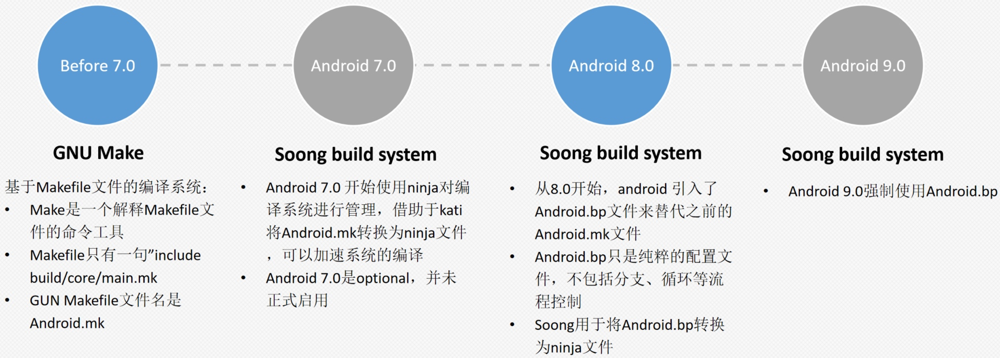
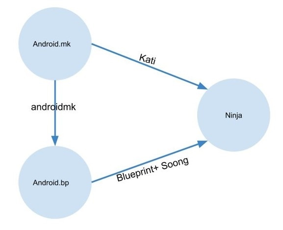

# 编译系统

## Android.mk

https://blog.csdn.net/a546036242/article/details/136763502

Makefile 是一个文件，用于定义项目的构建过程，通常用于编译、链接代码以及自动化其他重复性任务。它与 make 工具结合使用，帮助开发者管理项目构建、测试、安装和清理等任务。Makefile 中的规则、变量和条件允许开发者灵活定义各个任务之间的依赖关系和执行顺序。

首先要注意一点，Makefile是与shell、Python等类似的脚本，他常用来做编译工作但是不仅仅可以用来做编译工作。他也可以用来生成文档、或者是单纯的打印log。

对于一个看不懂Makefile构建文件规则的人来说，这个Makefile语法和shell语法不一样，但是又引用了部分shell语法，可以说是shell语法的子类，Makefile语法继承了它。和shell语法不一样，这个更难一点。

如果你仅需要从安卓运用的角度来了解Makefile，你可以查看下面这篇文章：
[Android.mk简介](https://blog.csdn.net/hudashi/article/details/7059006)
[Android FrameWork基础之Makefile](https://blog.csdn.net/a546036242/article/details/136763502)

如果你需要深入学习，可以参考：
[makefile教程](https://mszlu.com/makefile/01.html)

当然 最好的还是官方的学习参考：
[Android.mk](https://developer.android.google.cn/ndk/guides/android_mk?hl=zh-cn#local_src_files)

### Android.mk 基础规则

这里我一经典的安卓APP的Android.mk为例，简单介绍一下。

Android.mk中涉及到几个关键概念：模块，它可以是静态库、共享库和独立的可执行文件。它具有以下优势：

1. 无需显式依赖关系：在常规的 Makefile 中，我们通常需要手动列出头文件 (.h) 和源文件 (.c/.cpp) 的依赖关系，以确保在头文件发生更改时，相关的源文件会自动重新编译。但是在 Android.mk 中，我们无需手动列出这些文件的依赖关系，因为 Android 构建系统会自动检测和管理依赖关系。它会根据模块中包含的源文件自动追踪头文件的更改，从而触发相应的重新编译。
2. 内置逻辑运算：
Android.mk 支持一定的逻辑运算，例如条件判断、变量替换等。开发者可以利用这些逻辑来控制模块的编译方式。
~~~
ifeq ($(TARGET_ARCH), arm)
    LOCAL_CFLAGS += -mfpu=neon
endif
~~~

**常见变量**：
在展示一个详细的例子之前我先给大家看看常见的一些变量：
~~~
LOCAL_PATH：指定当前Makefile文件所在的路径。
LOCAL_MODULE：指定模块的名称。
LOCAL_SRC_FILES：指定模块的源文件列表。
LOCAL_C_INCLUDES：指定C/C++源文件的包含路径。
LOCAL_SHARED_LIBRARIES：指定模块依赖的共享库。
LOCAL_STATIC_LIBRARIES：指定模块依赖的静态库。
LOCAL_MODULE_TAGS：指定模块的标签，用于在构建系统中对模块进行分类和归类。
LOCAL_MODULE_CLASS：指定模块的类别，表示模块在构建系统中的类型或角色。
LOCAL_MODULE_SUFFIX：指定模块的文件名后缀。
LOCAL_CERTIFICATE：指定模块的签名配置。
LOCAL_USE_AAPT2：指示是否使用AAPT2作为资源打包工具。
LOCAL_PACKAGE_NAME：指定生成APK文件的包名。
LOCAL_PACKAGE_SIGNED_KEY：指定APK文件的签名配置，如"release"或"debug"。
~~~

**基础规则**：

1. Android.mk 文件必须先定义 LOCAL_PATH 变量：
~~~
LOCAL_PATH := $(call my-dir)
~~~
此变量表示源文件在开发树中的位置。在上述命令中，构建系统提供的宏函数 my-dir 将返回当前目录（Android.mk 文件本身所在的目录）的路径。

2. 下一行声明 CLEAR_VARS 变量
~~~
include $(CLEAR_VARS)
~~~
该行的作用是清楚之前存在的环境变量(LOCAL_PATH除外)，避免对我们的构建产生干扰。

3. 声明模块名称
~~~
LOCAL_MODULE := hello-jni
~~~
模块名称必须唯一且不能包含空格，构建的时候系统会自动根据我们的模块名称添加上前缀和后缀。比如上述示例会生成名为 libhello-jni.so 的库。

>注意：如果模块名称的开头已经是 lib，构建系统不会添加额外的 lib 前缀；而是按原样采用模块名称，并添加 .so 扩展名。因此，比如原来名为 libfoo.c 的源文件仍会生成名为 libfoo.so 的共享对象文件。

4. 包含源文件
~~~
LOCAL_SRC_FILES := hello-jni.c
~~~
LOCAL_SRC_FILES 变量必须包含要构建到模块中的 C 和/或 C++ 源文件列表。

5. 连接所有文件
~~~
include $(BUILD_SHARED_LIBRARY)
~~~

BUILD_SHARED_LIBRARY 变量指向一个 GNU Makefile 脚本，该脚本会收集您自最近 include 以来在 LOCAL_XXX 变量中定义的所有信息。

### 变量和宏

构建系统提供许多可在 Android.mk 文件中使用的变量。其中的许多变量已预先赋值。另一些变量由我们自行赋值。

除了这些变量之外，我们还可以自己定义任意变量。在定义变量时请注意，NDK 构建系统保留了下列变量名称：

* 以 LOCAL_ 开头的名称，例如 LOCAL_MODULE。
* 以 PRIVATE_、NDK_ 或 APP 开头的名称。构建系统在内部使用这些变量名。
* 小写名称，例如 my-dir。构建系统也是在内部使用这些变量名。

如果需要在 Android.mk 文件中定义您自己的便利变量，建议在名称前附加 MY_。

变量和宏分为以下几类：

* NDK 定义的 include 变量
	* CLEAR_VARS
	* BUILD_EXECUTABLE
	* BUILD_SHARED_LIBRARY
	* BUILD_STATIC_LIBRARY
	* PREBUILT_SHARED_LIBRARY
	* PREBUILT_STATIC_LIBRARY
* 目标信息变量
	* TARGET_ARCH
	* TARGET_PLATFORM
	* TARGET_ARCH_ABI
	* TARGET_ABI
* 模块描述变量
	* LOCAL_PATH
	* LOCAL_MODULE
	* LOCAL_SRC_FILES
	* ...等等非常多
* NDK提供的函数宏
	* my-dir
	* all-subdir-makefiles
	* this-makefile
	* parent-makefile
	* grand-parent-makefile
	* import-module

需要了解详情的情看官方：https://developer.android.google.cn/ndk/guides/android_mk?hl=zh-cn#var

### Android.mk 示例 - 编译apk

~~~
# 指定当前 Android.mk 文件所在的目录路径
LOCAL_PATH := $(call my-dir)

# 初始化和清除之前设置的变量
include $(CLEAR_VARS)

# 自动获取目录中的 APK 文件
APPS := $(notdir $(wildcard $(LOCAL_PATH)/*.apk))

# 提取文件名作为模块名称
APP_NAME := $(basename $(APPS))

# 设置模块名称,一般都是APK的名字
LOCAL_MODULE := $(APP_NAME)

# 可选的模块标签
LOCAL_MODULE_TAGS := optional

# 指定源 APK 文件
LOCAL_SRC_FILES := $(APPS)

# 模块类别为 APPS
LOCAL_MODULE_CLASS := APPS

# 模块后缀名，通常是 .apk
LOCAL_MODULE_SUFFIX := $(COMMON_ANDROID_PACKAGE_SUFFIX)

# 签名方式，使用平台签名，可选platform、PRESIGNED
LOCAL_CERTIFICATE := platform

# 将模块生成到 system_ext/ 分区
# LOCAL_SYSTEM_EXT_MODULE := true

# 是否设定为特权应用，特权应用会生成到system/priv-app，普通应用在app目录
# LOCAL_PRIVILEGED_MODULE := true

# 显式指明两个需要的库，应对 <uses-library> 检查
LOCAL_OPTIONAL_USES_LIBRARIES := androidx.window.extensions androidx.window.sidecar

# 替代的模块，声明当前模块将替代这些模块
LOCAL_OVERRIDES_PACKAGES := Home Launcher3QuickStep

# 使用预编译的规则来处理 APK 文件
include $(BUILD_PREBUILT)

# 清除变量后，为权限 XML 文件创建新的模块配置
include $(CLEAR_VARS)

# 配置 XML 权限文件
LOCAL_MODULE := com.example.myapp.permissions
LOCAL_SRC_FILES := com.example.myapp.permissions.xml
LOCAL_MODULE_CLASS := ETC
LOCAL_MODULE_PATH := $(TARGET_OUT_ETC)/permissions  # 将文件安装到 /system_ext/etc/permissions/
LOCAL_SYSTEM_EXT_MODULE := true
include $(BUILD_PREBUILT)
~~~
上面这段代码是将某APK内置进系统的标准MK文件，是我常用的方式。其中有以下注意点：
1. **模块名**：为APK的名字，如果是"Gboard.apk"那么模块名为Gboard
2. **签名**LOCAL_CERTIFICATE使用platform表示系统签名，具有更高的权限如读写系统设置，但是会让第三方应用无法更新（签名不对）。使用PRESIGNED签名表示沿用应用本身的签名。
3. **特权应用**：如果要将应用设置为特权应用，需要为其声明权限，而且需要与该应用AndroidManifest.xml 中一致，否则可能报错导致系统起不来，查看logcat可以看到。
4. **覆写模块**：指的是当你编译这个应用后，希望同时干掉另一个应用时使用。比如我使用自己的launcher替换了原有的launcher，就可以在新launcher的mk中override原launcher
5. **`<uses-library>`检查**：在安卓 12 之后安卓对权限的要求进一步加强，内置应用的时候可能会出现`<uses-library>`标签在build系统和manifest文件中不一致的问题，此时可以在报错中找到需要声明的库，加在这里面。该问题可以看：[Android12 内置应用问题mismatch in the ＜uses-library＞ tags between the build system and the manifest](https://blog.csdn.net/xiaowang_lj/article/details/135383143)
6. **system_ext/分区**：上面有一个变量用来选择应用是生成到/system 还是 /system_ext 分区。关于这两个分区详细可查看：[AOSP system_ext 分区](https://source.android.com/docs/core/bootloader/partitions/shared-system-image?hl=zh-cn#sys-ext-partition)
7. **XML权限文件**：当我们需要将应用配置为特权应用时，需要声明权限。以前的做法是在` frameworks/base/data/etc/privapp-permissions-platform.xml`中为其声明，现在则是推荐放到$(TARGET_OUT_ETC)/permissions目录下面去。做法是在软件目录下放置com.example.myapp.permissions.xml文件然后在MK中编进去。

### Android.mk 示例 - 编译 APP 源码
上面是编译某个 apk 进系统中的配置，如果是编译源码，有些许不同，可以参考：

~~~
# 定义当前模块路径
LOCAL_PATH := $(call my-dir)

# 清除局部变量，避免变量污染
include $(CLEAR_VARS)

# 定义模块名称
LOCAL_PACKAGE_NAME := MyMenuUi

# 模块标签，设置为 optional 表示可选安装
LOCAL_MODULE_TAGS := optional

# AndroidManifest 文件路径（如文件未移动可忽略）
# LOCAL_MANIFEST_FILE := $(LOCAL_PATH)/app/src/main/AndroidManifest.xml

# 资源文件目录路径
LOCAL_RESOURCE_DIR := \
    $(LOCAL_PATH)/res

# Java 源文件和 AIDL 文件路径
LOCAL_SRC_FILES := \
    $(call all-java-files-under, java) \
    $(call all-Iaidl-files-under, aidl)

# 资源编译选项，用于定义哪些资源将被打包到模块中
LOCAL_AAPT_FLAGS := \
    --auto-add-overlay \
    --extra-packages androidx.constraintlayout_constraintlayout \
    --extra-packages androidx.recyclerview_recyclerview

# 启用 AAPT2 作为资源打包工具（比 AAPT 更高效）
LOCAL_USE_AAPT2 := true

# 加载系统内置的 Android 静态库
LOCAL_STATIC_ANDROID_LIBRARIES := \
    androidx.recyclerview_recyclerview \
    com.google.android.material_material

# 加载系统内置的 Java 静态库
LOCAL_STATIC_JAVA_LIBRARIES := \
    androidx.appcompat_appcompat \
    gson_menuui

# 启用代码混淆
LOCAL_PROGUARD_ENABLED := full
LOCAL_PROGUARD_FLAG_FILES := $(LOCAL_PATH)/proguard.flags

# 使用系统签名
LOCAL_PRIVATE_PLATFORM_APIS := true
LOCAL_CERTIFICATE := platform

# 将模块生成到 system_ext/ 分区
LOCAL_SYSTEM_EXT_MODULE := true

# 将模块生成到 priv-app/ 目录（需要系统权限）
LOCAL_PRIVILEGED_MODULE := true

# 包构建
include $(BUILD_PACKAGE)

# 引入已有的 .jar 预编译 Java 包
include $(CLEAR_VARS)

# 定义预编译 Java 库文件，指定库名称和路径
LOCAL_PREBUILT_STATIC_JAVA_LIBRARIES := \
    gson_menuui:../../libs/gson-2.8.0.jar

# 多预编译文件的构建
include $(BUILD_MULTI_PREBUILT)

# 清除变量后，为权限 XML 文件创建新的模块配置
include $(CLEAR_VARS)

# 配置 XML 权限文件
LOCAL_MODULE := com.mymenuui.permissions
LOCAL_SRC_FILES := com.mymenuui.permissions.xml
LOCAL_MODULE_CLASS := ETC
LOCAL_MODULE_PATH := $(TARGET_OUT_ETC)/permissions  # 将文件安装到 /system_ext/etc/permissions/
LOCAL_SYSTEM_EXT_MODULE := true
include $(BUILD_PREBUILT)
~~~

1. **ProGuard 优化**：用于对代码进行混淆、优化和移除无用代码。只适用于源码编译apk的时候使用。
2. **AAPT2**:比AAPT更高效，编译出来的APK文件更小，支持增量编译。

## Android.bp 简单介绍

Android.mk是以前Android项目中常用的构建脚本文件，Android.bp是用来替换Android.mk的配置文件，它使用Blueprint框架来解析。Blueprint是生成、解析Android.bp的工具，是Soong的一部分。Soong则是专为Android编译而设计的工具，Blueprint只是解析文件的形式，而Soong则解释内容的含义，最终转换成Ninja文件。Android.bp文件用类似JSON的简洁声明来描述需要构建的模块。基础了解请看[Android.bp你真的了解吗](https://blog.csdn.net/tkwxty/article/details/104388260)

在性能上

在现在的安卓版本中，基本都更推荐使用Android.bp作为构建脚本，但是Android.mk也还没有死绝，还是能用的。但是！**Android.mk可以引用Android.bp中的模块，反之Android.bp不能引用Android.mk中的模块！！！**

如果要详细了解 Android.bp ，首先还是看官方的介绍：https://source.android.com/docs/setup/reference/androidbp?hl=zh-cn

### Android.bp 示例 - 编译apk

这里同样给出编译apk的示例
~~~
// 指定当前目录路径为此 Blueprint 文件
package {
    default_applicable_licenses: ["Android.bp_licenses"],
}

// 定义模块，自动获取当前目录中的 APK 文件
android_app_import {
    name: "Myapp",  // APP_NAME 应替换为自动获取的APK名称
    apk: "Myapp.apk",  // 指定现成的 APK 文件

    // 指定签名方式，使用平台签名
    certificate: "platform",

    // 将应用安装到系统的 priv-app 目录，指定为特权应用
    privileged: true,

    // 将应用安装到 system_ext 分区
    //system_ext_specific: true,

    // 需要依赖的库
    //libs: [
    //    "xxxxx",
    //    "xxxxx",
    //],

    // 声明当前模块所需的库以满足 <uses-library> 检查
    //optional_uses_libs: [
    //    "androidx.window.extensions",
    //    "androidx.window.sidecar",
    //],

    // 指定当前模块替代的包名称
    overrides: [
        "Home",
        "Launcher3QuickStep",
        "Provision",
    ],
    
    // 如果需要权限配置文件
    // required: ["cn.example.myapp.xml"],
}

// 定义 XML 权限文件模块，安装到 /system_ext/etc/permissions/ 目录
// prebuilt_etc {
//     name: "cn.giec.glauncher.xml",  // 权限文件名称，应替换为具体应用的 XML 文件名称
// 
//     // XML 文件路径
//     src: "cn.giec.glauncher.xml",
// 
//     // 安装到 system_ext 分区
//     system_ext_specific: true,
// 
//     // 安装到权限文件目录
//     sub_dir: "permissions",
// }

~~~

注意：Android.bp 文件是基于 Blueprint 配置的静态文件，在解析时不会动态地获取文件名或路径，因此不能直接使用像 $(basename $(APPS)) 这样的语法。所以我们无法再像 Android.mk 那样直接提取 apk 名作为模块名了， 需要自己写。

### Android.bp 示例 - 编译 APP 源码

~~~
// android_app 模块，用于定义 Android 应用的构建配置
android_app {
    name: "<应用模块名称>",  // 设置模块名称

    system_ext_specific: true, // 指定将应用安装在 system_ext 分区
    privileged: true,          // 设置为特权应用，安装在 `system/priv-app` 目录
    platform_apis: true,       // 使用平台 API（适用于系统应用）

    srcs: ["<源文件路径>/**/*.java"],  // 源文件路径支持通配符

    static_libs: [
        "<静态库名称1>",
        "<静态库名称2>",
        // 依赖的静态库模块名称（无需单独打包，编译时链接）
    ],

    required: [
        "<依赖模块名称1>",
        "<依赖模块名称2>",
        // 应用在运行时的依赖模块，确保这些模块被包含在系统中
    ],

    overrides: [         // 声明替代的应用，卸载已安装的应用
        "<替代应用名称1>",
        "<替代应用名称2>",
    ],

    optimize: {          // 优化设置（混淆代码）
        enabled: true,
        proguard_flags_files: ["proguard.flags"], // ProGuard 配置文件路径
    },

    certificate: "platform", // 签名证书，支持 platform、PRESIGNED 等选项
}

// 预编译文件（例如 XML 权限文件）模块，通常放置于系统的特定目录
prebuilt_etc {
    name: "<预编译文件模块名称>",

    system_ext_specific: true,  // 安装至 system_ext 分区
    src: "<文件路径>",            // 指定文件路径
    sub_dir: "permissions",      // 安装的子目录，如权限文件放置于 permissions 目录
}
~~~

## 编译 APP 的输出目录

### system,system_ext,product分区

这几个分区都是我们编译APP 的时候在out目录下的分区。

还记得我们上面mk所出现的
~~~
LOCAL_SYSTEM_EXT_MODULE := true
~~~
以及bp中出现的
~~~
system_ext_specific: true,         
~~~
这两个变量就是让APP 输出到system_ext目录，不设置则会默认输出到system目录。

另外这里也顺便介绍输出到product目录的变量：
~~~
# bp中：
product_specific: true
# mk中：
LOCAL_PRODUCT_MODULE := true
~~~
我们查看安卓的out目录，会发现特定产品下有`system/`, `system_ext/`, `product/` 三个目录。

关于system/目录和system_ext/的区别可以看官方说明：https://source.android.com/docs/core/bootloader/partitions/shared-system-image?hl=zh-cn#sys-ext-partition

这里给大家总结一下：
* system：放AOSP组件，一般我们不放这儿
* system_ext：OEM 和 SoC 供应商的扩展，可以调用/system 分区私有 API
* product：一般普通内置应用

当然现在还有一个新的分区—— /odm 分区 ，这里我就不介绍了，有需要自行去了解

### 特权应用和非特权应用
上面我们提到的三个目录`system/`, `system_ext/`, `product/` 这三个目录又分别有下面几个目录，其中最重要的是app和priv-app的区别：
* app/ **普通应用**程序
* lib/ 本地库文件(.so 文件)
* etc/ 配置文件，一般是权限文件
* priv-app/ **特权应用**目录

可以了解官网对于特许权限名单的介绍：https://source.android.com/docs/core/config/perms-allowlist?hl=zh-cn

还记得我们上面mk所出现的
~~~
LOCAL_PRIVILEGED_MODULE := true
~~~
以及bp中出现的
~~~
privileged: true,          
~~~

这两个变量就是表示将应用设置为特权应用。设置为特权应用需要声明应用的权限(一般是应用的 AndroidManifest.xml里面声明的那些权限)。需要在`frameworks/base/data/etc/privapp-permissions-platform.xml`中添加相应的权限

注意：如果你的privapp-permissions-platform.xml 编译出来是只放在 system 目录下的，那么你的特权 app 放在/system_ext/下面就会找不到对应的权限声明，因此建议将特权 APP放在`system/`目录下。

至于什么是特许权限，需要涉及到安卓的权限系统。可以参考：https://blog.csdn.net/u012514113/article/details/128865859

安卓的权限分为普通权限，高风险权限，签名权限，证书权限，signatureOrSystem（已弃用）。安卓权限分类：https://developer.android.google.cn/guide/topics/manifest/permission-element?hl=zh-cn

normal和signature级别的权限是安装的时候授予，也叫**安装时权限**。危险(dangerous)权限是**运行时权限**，会弹出一个框问用户是否授予。而内置为特权应用的作用就是，可以在**安装时自动获取高风险权限而不用用户手动授予**。另外还可以访问某些系统 API。

想要了解安卓的所有权限，可以查看：https://developer.android.com/reference/android/Manifest.permission#summary

顺便提一句，编译出来的权限文件都在`/system/etc/permissions/`下，或者`/system_ext/etc/permissions/`

### Android.mk文件自动转Android.bp方法
  Android源码里边提供了快捷直接Android.mk转换成Android.bp的工具：androidmk。
  androidmk源码位置：

`build/soong/androidmk/cmd/androidmk.go`
1.编译出来后androidmk可执行文件位置：
aosp/out/soong/host/linux-x86/bin/androidmk
2.转换方法：
aosp/out/soong/host/linux-x86/bin/androidmk [Android.mk PATH] > [Android.bp PATH]

## Soong 和 Ninja

这里我仅对这两个概念做简单介绍。在此之前先介绍几个概念：

* **Ninja**：ninja是一个编译框架，会根据相应的ninja格式的配置文件进行编译，但是ninja文件一般不会手动修改，而是通过将Android.bp文件转换成ninja格文件来编译
* **Kati**：kati是专为Android开发的一个基于Golang和C++的工具，主要功能是把Android中的Android.mk文件转换成Ninja文件
* **Android.bp**：Android.bp的出现就是为了替换Android.mk文件。bp跟mk文件不同，它是纯粹的配置，没有分支、循环等流程控制，不能做算数逻辑运算。如果需要控制逻辑，那么只能通过Go语言编写
* **Soong**：Soong类似于之前的Makefile编译系统的核心，负责提供Android.bp语义解析，并将之转换成Ninja文件。Soong还会编译生成一个androidmk命令，用于将Android.mk文件转换为Android.bp文件，不过这个转换功能仅限于没有分支、循环等流程控制的Android.mk才有效
* **Blueprint**：Blueprint是生成、解析Android.bp的工具，是Soong的一部分。Soong负责Android编译而设计的工具，而Blueprint只是解析文件格式，Soong解析内容的具体含义。Blueprint和Soong都是由Golang写的项目，从Android 7.0，prebuilts/go/目录下新增Golang所需的运行环境，在编译时使用

### Soong的由来

在 Android 7.0 发布之前，Android 仅使用 GNU Make 描述和执行其 build 规则。但是随着android工程越来越大，包含的module越来越多，以makefile（包括android.mk）组织的项目编译花费的时间越来越多。谷歌在7.0开始引入了ninja进行编译系统的组织，相对于make来说ninja在大的项目管理中速度和并行方面有突出的优势，因此谷歌采用了ninja来取代之前使用的make。但是现有的android项目还是由makefile组织，因此谷歌引入了kati（后来被称为soong）将makefile（包括android.mk）翻译成ninja文件。

Android 7.0开始逐步引入kati soong（未正式使用默认关闭，需要USE_SOONG=true手动开启），将makefile文件和Android.mk文件转化成ninja文件，使用ninja文件对编译系统进行管理。

Android 8.0开始引入了Android.bp文件来替代之前的Android.mk文件。Android.bp只是纯粹的配置文件（类似json），不包括分支、循环等流程控制（如果想要进行分支循环控制可自己写go来完成），因此Android.bp文件被转化成ninja文件的效率远远高于Android.mk文件。

Android 9.0开始强制使用Android.bp来代替Android.mk。但是事实就是，即便是在安卓 14 这样的高版本中，Android.mk 仍然可以使用。

### Soong的原理

Soong的源代码在 `build/soong/`目录，该目录下有它的README.md 可以了解一下。
1. **Android.mk 转换成 ninja 文件**：soong_ui.bash 将指定目录下的所有 Android.mk (包括makefile) 文件转换成 `out/build-<product_name>.ninja` 文件
2. **Android.bp 转换成 ninja 文件**：soong_ui.bash 将指定目录下所有的 Android.bp 文件也转换成 out/soong/build.ninja 文件
3. **组合 nijia 文件**：soong_ui.bash 还会生成一个较小的 `out/combined-<product_name>.ninja` 文件，负责把二者组合起来作为执行入口

* kati是把Android.mk转换成ninja file。
* soong是把Android.bp转换成ninja file。
* Android.bp是jason形式组织的文件，将来逐步取代Android.mk
* 后续没有Android.mk，kati将会消失。s
* ninja是同make编译构建系统一样，来替换make的，速度快。
* blueprint是一个处理Android.bp相关语法的库文件。

想了解更多可以查看：
https://blog.csdn.net/qq_27672101/article/details/113767664
https://www.cnblogs.com/zuojie/p/17341422.html