# Flutter笔记

::: tip
作者：@苏柘 

创建时间：2023年9月18日
:::

## 框架结构

Flutter本质上是一个跨平台的UI工具集，允许在各自操作系统上复用同样的代码。

尽可能提供原生体验的高性能和复用代码。

开发中，Flutter应用在一个VM上运行，使得可在保留状态且无需重新编译情况下，进行**热加载**。

发行时，Flutter应用会直接通过AOT编译为机器码或者是JS。

### 优势

1. 快速开发： 热重载
2. 跨平台：一套代码可以同时构建Android和ios平台的应用程序
3. 界面优美：提供材料设计（Material Design）和苹果风格（Cupertino）的库
4. 渲染引擎：Skia

### 分层模型

Flutter是一个可拓展的分层系统，可被视为各个独立组件的集合，上层组件依赖下层，上层无法越界访问更下层的组件，框架内各部分是可选可替代的。

分为框架、引擎、嵌入层

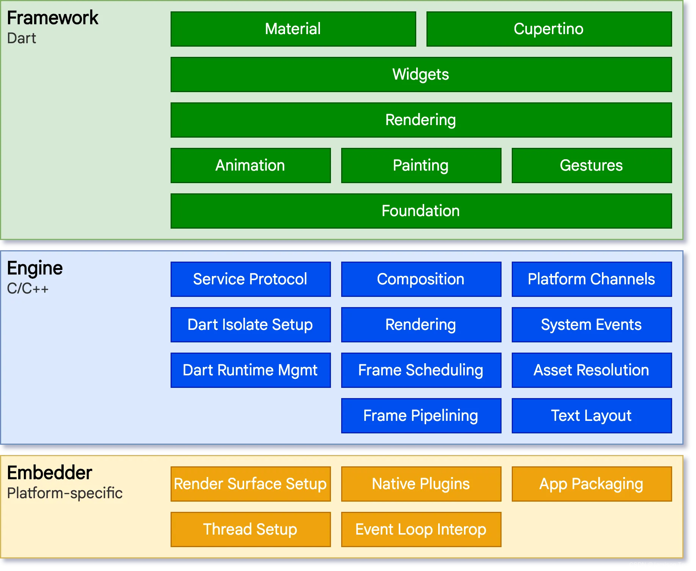

**嵌入层**

对于底层操作系统，Flutter应用程序的包装方式与其他原生应用相同，每个平台都会包含一个特定的嵌入层，提供一个程序入口，使得程序可以与底层操作系统进行协调、访问服务和管理事件循环队列。对于不同平台，嵌入层使用的语言都不一样。Flutter代码可以作为模块集成到现有应用或作为应用主体。

**引擎**

主要使用C++编写，提供Flutter应用所需原语。当需要绘制新一帧内容时，引擎将负责对需要合成的场景进行栅格化。其提供Flutter核心API的底层实现：图形、文本布局等…

引擎将底层C++代码包装成Dart代码，通过dart:ui暴露给Flutter框架层。该库暴露了最底层的原语，包括用于驱动输入，图形等子系统的类

**框架**

开发者通过Flutter框架和Flutter交互，该框架提供了以Dart语言编写的现代响应式框架。

自下而上有：

**Foundational and Annimation、Painting、Gestures**

Foundational：基础类

Annimation：动画

Painting：绘画

Gestures：手势

向上层提供常用的抽象

**渲染层**

提供操作布局的抽象，操作层使得可以构建一颗可渲染对象的树，可动态更新。

**Widget**

组合的抽象，每个渲染层中的渲染对象在widget层中有一个对应的类。

widget层可让你自由组合需要复用的各种类，引入了响应式编程模型。

**Material和Cupertino**

提供了全面的widget层的原语组合，分别实现了Material和IOS设计规范。

其他更高层级的功能被拆分到不同的软件包中。

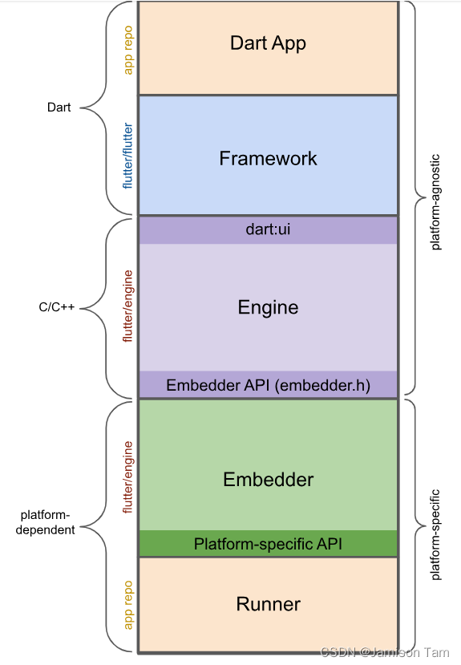

应用剖析

Dart应用：将Widget合成预期的UI，实现业务。

框架：提供API封装，将应用widget树构建在一个Scene中。

引擎：将合成的Scene进行栅格化、封装Flutter进行封装，暴露功能给dart:ui API给框架、使用嵌入层API与平台进行整合。

嵌入层：协调底层操作系统的服务、管理事件循环体系、暴露特定平台API给应用集成嵌入层。

运行器：将嵌入层暴露的平台API合成为目标平台可运行的应用包。

### 特点

#### 1、响应式开发

响应式开发相信对于前端来说再熟悉不过，**这部分内容对于前端开发来说其实可以略过**，响应式编程也叫做声明式编程，这是现在前端开发的主流，当然对于客户端开发的一种趋势，比如 Jetpack Compose 、SwiftUI 。

> Jetpack Compose 和 Flutter 的相似程度绝对让你惊讶。

什么是响应式开发呢？简单来说其实就是**你不需要手动更新界面，只需要把界面通过代码“声明”好，然后把数据和界面的关系接好，数据更新了界面自然就更新了**。

从代码层面看，对于原生开发而言，**响应式开发中没有 xml 的布局，布局完全由代码完成，所见即所得，同时你也不会需要操作界面“对象”去进行赋值和更新，你所需要做的就是配置数据和界面的关系**。

举个例子：

- 以前在 Android 上你需要写一个 xml ，然后布局一个 `TextView` ，通过 `findViewById` 得到这个对象，再调用 `setText` 去赋值；
- 现在 Flutter 里，你只需要声明一个 `Text` 的 `Widget` ，并把 `data.title` 这样的数据配置给 `Text` ，当数据改变了， `Text` 的显示内容也随之改变；

image

对于 Android 开发而言，大家可能觉得这不就是 `MVVM` 下的 `DataBinding` 也一样吗？其实还不大一样，更形象的例子，这里借用扔物线大佬在谷歌大会关于 Jetpack Compose 的分享，为什么 `Data Binding` 模式不是响应式开发：

> 因为 `Data Binding`（不管是这个库还是这种编程模式）并不能做到「声明式 UI」，或者说 声明式 UI 是一种比数据绑定更强的数据绑定，比如在 Compose 里你除了简单地绑定字符串的值，还可以用布尔类型的数据来控制界面元素是否存在，例如再创建另外一个布尔类型的变量，用它来控制你的某个文字的显示：

image

> 注意，当 `show` 先是 `true` 然后又变成 `false` 的时候，不是设置了一个 `setVisibi``lity(GONE)` 这样的做法，而是直接上面的 `Text()` 在界面代码中消失了，每次数据改变所导致的界面更新看起来就跟界面关闭又重启、并用新的数据重新初始化了一遍一样，这才叫声明式 UI，这是数据绑定做不到的。
>
> 当然 Compose 并不是真的把界面重启了，它只会刷新那些需要刷新的部分，这样的话就能保证，它自动的更新界面跟我们手动更新一样高效。

在 Flutter 中也类似，当你通过这样的 `ture` 和  `false` 去布局时，是直接影响了 `Widget` 树的结构乃至更底层的渲染逻辑，所以作为 Android 开发在学习 Flutter 的时候，就需要习惯这种开发模式，“放弃” 在获取数据后，想要保存或者持有一个界面控件进行操作的想法。另外**在 Flutter 中，持有一个 Widget 控件去修改大部分时候是没意义的，也是接下来我们要聊的内容**。

#### 2、Widget 的背后

**Flutter 内一切皆**`Widget`**，**`Widget`**是不可变的（immutable），每个**`Widget`**状态都代表了一帧。**

理解这段话是非常重要的，这句话也是很多一开始接触 Flutter 的开发者比较迷惑的地方，因为 Flutter 中所有界面的展示效果，在代码层面都是通过 `Widget` 作为入口开始。

`Widget` 是不可变的，说明页面发生变化时 `Widget` 一定是被重新构建， `Widget` 的固定状态代表了一帧静止的画面，当画面发生改变时，对应的 Widget 一定会变化。

举个我经常说的例子，如下代码所示定义了一个 `TestWidget`，`TestWidget` 接受传入的 `title` 和 `count` 参数显示到 `Text` 上，同时如果 `count` 大于 99，则只显示 99。

```Dart
/// Warnning/// This class is marked as '@immutable'/// but one or more of its instance fields are not finalclass TestWidget extends StatelessWidget {final String title;

  int count;TestWidget({this.title, this.count});@override
  Widget build(BuildContext context) {this.count = (count > 99) ? 99 : count;return Container(
      child: new Text("$title $count"),);}}
```

这段代码看起来没有什么问题，也可以正常运行，但是在编译器上会有 *“This class is marked as '@immutable'，but one or more of its instance fields are not final”* 的提示警告，这是因为 `TestWidget` 内的 `count` 成员变量没有加上 `final` 声明，从而在代码层面容易产生歧义。

> 因为前面说过 `Widget` 是 `immutable` ，所以它的每次变化都会导致自身被重新构建，也就是 `TestWidget` 内的 `count` 成员变量其实是不会被保存且二次使用。

如上所示代码中 `count` 成员没有 `final` 声明，所以理论是可以对 `count` 进行二次修改赋值，造成 `count` 成员好像被保存在 `TestWidget` 中被二次使用的错觉，容易产生歧义，比如某种情况下的 `widget.count`，所以需要加这个 `final` 就可以看出来 `Widget` 的不可变逻辑。

如果把 `StatelessWidget` 换成 `StatefulWidget` ，然后把 `build` 方法放到 `State` 里，`State` 里的 `count` 就可以就可以实现跨帧保存。

```Dart
class TestWidgetWithState extends StatefulWidget {final String title;TestWidgetWithState({this.title});@override
  _TestWidgetState createState() => _TestWidgetState();}class _TestWidgetState extends State<TestWidgetWithState> {
  int count;@override
  Widget build(BuildContext context) {this.count = (count > 99) ? 99 : count;return InkWell(
      onTap: () {setState(() {
          count++;});},
      child: Container(
        child: new Text("${widget.title} $count"),),);}}
```

所以这里最重要的是，首先要理解 **`Widget`** **的不可变性质，然后知道了通过** **`State`** **就可以实现数据的跨** **`Widget`** **保存和恢复，那为什么** **`State`** **就可以呢？**

这就涉及到 Flutter 中另外一个很重要的知识点，`Widget` 的背后又是什么？事实上在 Flutter 中 Widget 并不是真正控件，**在 Flutter 的世界里，我们最常使用的** **`Widget`** **其实更像是配置文件，而在其后面的** **`Element`** **、****`RenderObject`** **、****`Layer`** **等才是实际“干活”的对象。**

> `Element` 、`RenderObject` 、`Layer` 才是需要学习理解的对象。

简单举个例子，如下代码所示，其中 `testUseAll` 这个 `Text` 在同一个页面下在三处地方被使用，并且代码可以正常运行渲染，如果是一个真正的 `View` ，是不能在一个页面下这样被多个地方加载使用的。

image

在 Flutter 设定里，`Widget` 是配置文件告诉 Flutter 你想要怎么渲染， `Widget` 在 Flutter 里会经过 `Element` 、`RenderObject`、乃至 `Layer` 最终去进行渲染，所以作为配置文件的 `Widget` 可以是 `@immutable`，可以每次状态更新都被重构。

所以回到最初说过的问题：**Flutter 的嵌套很恶心？是的 Flutter 设定上确实导致它会有嵌套的客观事实，但是当你把** **`Widget`** **理解成配置文件，你就可以更好地组织代码，比如 Flutter 里的** **`Container`** **就是一个抽象的配置模版。**

> 参考 `Container` 你就学会了 Flutter 组织代码逻辑的第一步。

同时因为 `Widget` 并不是真正干活的，所以嵌套事实上并不是嵌套 `View` ，一般情况下 `Widget` 的嵌套是不会带来什么性能问题，因为它不是正式干活的，嵌套不会带来严重的性能损失。

举个例子，当你写了一堆的 `Widget` 被加载时，第一次会对应产生出 `Element` ，之后  `Element` 持有了 `Widget` 和 `RenderObject` 。

简单的来说，一般情况下画面的改变，就是之后 `Widget` 的变化被更新到  `RenderObject` ，而在 Flutter 中能够跨帧保存的 `State` ，其实也是被 `Element` 所持有，从而可以用来跨 `Widget` 保存数据。

> 所以 `Widget` 的嵌套一般不会带来性能问题，每个 `Widget` 状态都代表了一帧，可以理解为这个“配置信息”代表了当前的一个画面，在 `Widget` 的背后，嵌套的 `Padding` 、`Align` 这些控件，最后只是 `canvas` 时的一个“偏移计算”而已。

所以理解 `Widget` 控件很重要，`Widget` 不是真正的 `View` ，它只是配置信息，只有理解了这点，你才会发现 Flutter 更广阔的大陆，比如：

- Flutter 的控件是从 `Elemnt` 才开始是真正的工作对象；
- 要看一个 `Widget` 的界面效果是怎么实现，应该去看它对应的 `RenderObejcet` 是怎么绘制的；
- 要知道不同堆栈或者模块的页面为什么不会互相干扰，就去看它的 `Layer` 是什么逻辑；
- 是不是所有的 `Widget`  都有 `RenderObejcet` ？ `Widget` 、 `Elemnt` 、`RenderObejcet` 、`Layer` 的对应关系是什么？

**这些内容才是学 Flutter 需要如理解和融汇贯通的，当你了解了关于** **`Widget`** **背后的这一套复杂的逻辑支撑后，你就会发现 Flutter 是那么的简单，在实现复杂控件上是那么地简单，****`Canvas`** **组合起来的能力是真的香。**

当然具体展开这部分内容不是三言两语可以解释完，在我出版的 **《Flutter开发实战详解》** 中第三章和第四章就着重讲解的内容，也是这出版本书主要的灵魂之处，这部分内容不会因为 Flutter 的版本迭代而过时的内容。

> 这算做了个小广告？？

#### 3、Flutter 是个有坑的框架

最后讲讲 Flutter 的坑，事实上没有什么框架是没有坑的，如果框架完美得没有问题，那我们竞争力反而会越来越弱，可替换性会更高。

> 这也是为什么一开始 Andorid 和 iOS 开发很火热，而现在客户端开发招聘回归理性的原因，因为这个领域已经越来越成熟，自然就“卷”了。

事实上我一直觉得使用框架的我们并没有什么特殊价值，而解决使用框架所带来的问题才是我们特有的价值。

而 Flutter 的问题也不少，比如:

- `WebView` 的问题：Flutter 特有的 UI 机制，导致了 Flutter 需要通过特殊的方式来接入比如 `WebView` 、`MapView` 这样的控件，而这部分也导致了接入后不断性能、键盘、输入框等的技术问题，具体可以参考：[《Hybrid Composition 深度解析》](https://links.jianshu.com/go?to=https%3A%2F%2Fjuejin.cn%2Fpost%2F6858473695939084295) 和 [《 Android PlatformView 和键盘问题》](https://links.jianshu.com/go?to=https%3A%2F%2Fjuejin.cn%2Fpost%2F6844904070906380296) 。
- 图片处理和加载：**在图片处理和加载上 Flutter 的能力无疑是比较弱的**，同时对于单个大图片的加载和大量图片列表的显示处理上，**Flutter 很容易出现****内存****和部分** **GPU** **溢出的问题**。而这部分问题处理起来特别麻烦，如果需要借用原生平台来解决，则需要通过外界纹理的方式来完成，而这个实现的维护成本并不低。
- 混合开发是避免不了的话题：因为 Flutter 的控件和页面堆栈都脱离原生平台，所以混合开发的结果就会导致维护成本的提高，现在较多使用的 `flutter_boost` 和 `flutter_thrio` 都无法较好的真正解决混合开发中的痛点，所以对于 Flutter 来说这也是一大考验。

image

**然而事实上在我收到关于 Flutter 的问题里，反而大部分和 Flutter 是没有关系的**，比如：

- “`flutter doctor` 运行之后卡住不动”
- “`flutter run` 运行之后出现报错”
- “`flutter pub get` 运行之后为什么提示 dart 版本不对”
- “运行后出现 Gradle 报错，显示 timeout 之类问题”
- “iOS 没办法运行到真机上”
- “xxx这样的控件有没有现成的” ····

说实话，如果是这些问题，我觉得这并不是 Flutter 的问题，大部分时候是看 log 、看文档和网络的问题，甚至仅仅是搜索引擎检索技术的问题。。。。

image

虽然 Flutter 有着这样那样的问题，但是综合考虑下来，它对我来现阶段确实是最合适的 UI 框架。

#### 4、声明式UI

Android 和 Flutter 采用两种不同的编程风格来完成UI编程，分别是：命令式 (主动设置) 和 声明式 (被动变化)。Flutter不用关心具体的设置细节，只需 配置好状态(数据) 和 界面(控件) 的关系，Flutter 会根据状态变化 自动更新UI。一个通俗易懂的比喻😝：命令式 → 你让TA动，声明式 → TA自己动。

## **Flutter基础内容**

### 官方文档

https://docs.flutter.dev/ui

###  架构介绍

https://blog.csdn.net/weixin_51109304/article/details/131640287

### Flutter**目录结构介绍** 

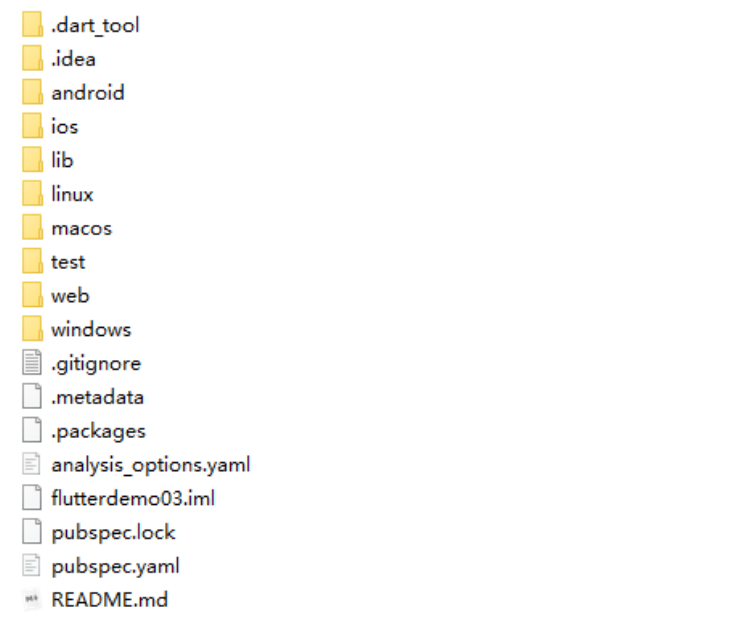

以下几个文件夹比较重要：

| 文件夹               | 作用                                                         |
| -------------------- | ------------------------------------------------------------ |
| android              | android平台相关代码，MainActivity ， Plugins                 |
| ios                  | ios平台相关代码                                              |
| linux                | Linux平台相关的代码                                          |
| macos                | macos平台相关的代码                                          |
| web                  | web相关的代码                                                |
| Windows              | windows相关的代码                                            |
| lib                  | flutter相关代码，我们编写的代码就在这个文件夹                |
| test                 | 用于存放测试代码                                             |
| pubspec.yaml         | 配置文件，一般存放一些第三方库的依赖。                       |
| analysis_option.yaml | 分析dart语法的文件，老项目升级成新项目有警告信息的话可以删掉 |
|                      | 此文件                                                       |

### **Flutter项目结构**

```Bash
hello_flutter/
│── .dart_tool/                                                                - Flutter自动生成的配置和构建输出，一般不需要开发者去修改
│── .idea/                                                                                - IDEA的配置信息，不用管
├── android/                  - Android 原生项目文件夹
├── build/                    - 存放构建产物的文件夹，不用管
├── ios/                      - iOS 原生项目文件夹
├── lib/                      - ⭐存放Flutter源代码，大部分开发会在这个目录下进行
│   ├── main.dart             - ⭐Flutter 应用程序的主要入口
├── linux/                                                                                - Linux平台相关代码及配置文件
├── macos/                                                                                - Mac平台相关代码及配置文件
├── test/                                                                                        - 测试文件
├── web/                                                                                        - Web平台相关代码及配置文件
├── windows/                                                                        - Windows平台相关代码及配置文件
├── .metadata                                                                        - Dart编译器生成的元数据文件，包含有关项目的编译和依赖，metadata报错？报错直接删除让Dart重新编译
├── analysis_options.yaml                        - 配置静态代码分析工具，可在此定义代码风格、禁用和启用特定警告和错误检查
├── hello_flutter.iml                                        - IntelliJ IDEA 项目文件文件，描述模块项目和依赖项，及其它配置信息，用于确保项目可以在 IntelliJ IDEA 或 Android Studio 中正确加载和编译。
├── pubspec.lock                                                        - 项目依赖项的锁定信息，由pubspec.yaml自动生成，用于确保项目在不同环境使用相同的依赖项版本
└── pubspec.yaml              - ⭐ Flutter项目配置文件，包括依赖、插件、资源等
```

### **Flutter入口文件、入口方法** 

每一个flutter项目的lib目录里面都有一个main.dart这个文件就是flutter的入口文件，

main.dart里面的

```Bash
void main(){ 
runApp(MyApp()); 
} 
也可以简写 
void main()=>runApp(MyApp()); 
```

其中的main方法是dart的入口方法。runApp方法是flutter的入口方法。 

MyApp是自定义的一个组件。

### **Flutter把内容单独抽离成一个组件**

在Flutter中自定义组件其实就是一个类，这个类需要继承StatelessWidget/StatefulWidget 

前期我们都继承StatelessWidget。后期给大家讲StatefulWidget的使用。 

**StatelessWidget** 是无状态组件，状态不可变的widget 

**StatefulWidget** 是有状态组件，持有的状态可能在widget生命周期改变

类名前的 下划线_ 用于标识类是一个私有类，不能在其它文件中访问

### **MaterialApp 和 Scaffold**

**1、MaterialApp** 

MaterialApp是一个方便的Widget，它封装了应用程序实现Material Design所需要的一些Widget。一 

般作为**顶层widget**使用。

**常用的属性：** 

home（主页） 

title（标题） 

color（颜色） 

theme（主题） 

routes（路由） 

... 

**2、Scaffold** 

Scaffold是Material Design布局结构的基本实现。此类提供了用于显示drawer、snackbar和底部sheet 

的API。 

**Scaffold 有下面几个主要属性：** 

appBar - 显示在界面顶部的一个 AppBar。 

body - 当前界面所显示的主要内容 Widget。 

drawer - 抽屉菜单控件。 

... 

例如：

```Bash
import 'package:flutter/material.dart'; 
void main() { 
runApp(MaterialApp( 
home: Scaffold( 
appBar: AppBar(title: const Text("你好Flutter")), 
body: const Center( 
child: Text( 
"我是一个文本", 
textDirection: TextDirection.ltr, 
style: TextStyle( 
fontSize: 40.0, 
// color: Colors.yellow, 
color: Color.fromRGBO(244, 233, 121, 0.5), 
), 
), 
), 
), 
)); 
}
```

## **Container容器组件**

| 名称               | 功能                                                         |
| ------------------ | ------------------------------------------------------------ |
| alignment          | topCenter：顶部居中对齐 topLeft：顶部左对齐 topRight：顶部右对齐 center：水平垂直居中对齐 centerLeft：垂直居中水平居左对齐 centerRight：垂直居中水平居右对齐 bottomCenter底部居中对齐 bottomLeft：底部居左对齐  bottomRight：底部居右对齐 |
| decoration(装饰器) | decoration: BoxDecoration( color: Colors.blue, border: Border.all( color:  Colors.red, width: 2.0),  borderRadius:BorderRadius.circular((8)),// 圆角   boxShadow: [ BoxShadow( color: Colors.blue, offset: Offset(2.0, 2.0),  blurRadius: 10.0, ) ], )  LinearGradient 背景线性渐变  RadialGradient径向渐变  gradient: LinearGradient( colors: [Colors.red, Colors.orange], ), |
| margin             | margin属性是表示Container与外部其他组件的距离。 EdgeInsets.all(20.0), |
| padding            | padding就是Container的内边距，指Container边缘与Child之间的距离  padding:EdgeInsets.all(10.0) |
| transform          | 让Container容易进行一些旋转之类的transform: Matrix4.rotationZ(0.2) |
| height             | 容器高度                                                     |
| width              | 容器宽度                                                     |
| child              | 容器子元素                                                   |

decoration(装饰器)的演示：

```Bash
Container(
  width: 100,
  height: 100,
  decoration: BoxDecoration(
    color: Colors.blue,  // 设置背景颜色为蓝色
    borderRadius: BorderRadius.circular(10),  // 设置边框圆角
    border: Border.all(
      color: Colors.black,  // 设置边框颜色为黑色
      width: 2,  // 设置边框宽度为2像素
    ),
    boxShadow: [
      BoxShadow(
        color: Colors.grey.withOpacity(0.5),  // 设置阴影颜色和透明度
        spreadRadius: 5,  // 阴影的扩散半径
        blurRadius: 7,  // 阴影的模糊半径
        offset: Offset(0, 3),  // 阴影的偏移量
      ),
    ],
  ),
  child: Center(
    child: Text(
      'BoxDecoration示例',
      style: TextStyle(
        color: Colors.white,
        fontWeight: FontWeight.bold,
      ),
    ),
  ),
)
```

## **Text组件**

| 名称            | 功能                                                         |
| --------------- | ------------------------------------------------------------ |
| textAlign       | 文本对齐方式（center居中，left左对齐，right右对齐，justfy两端对齐） |
| textDirection   | 文本方向（ltr从左至右，rtl从右至左）                         |
| overflow        | 文字超出屏幕之后的处理方式（clip裁剪，fade渐隐，ellipsis省略号） |
| textScaleFactor | 字体显示倍率                                                 |
| maxLines        | 文字显示最大行数                                             |
| style           | 字体的样式设置                                               |

下面是 TextStyle 的参数 ： 

| 名称            | 功能                                                         |
| --------------- | ------------------------------------------------------------ |
| decoration      | 文字装饰线（none没有线，lineThrough删除线，overline上划线，underline下划线） |
| decorationColor | 文字装饰线颜色                                               |
| decorationStyle | 文字装饰线风格（[dashed,dotted]虚线，double两根线，solid一根实线， wavy波浪线） |
| wordSpacing     | 单词间隙（如果是负值，会让单词变得更紧凑                     |
| letterSpacing   | 字母间隙（如果是负值，会让字母变得更紧凑）                   |
| fontStyle       | 文字样式（italic斜体，normal正常体）                         |
| fontSize        | 文字大小                                                     |
| color           | 文字颜色                                                     |
| fontWeight      | 字体粗细（bold粗体，normal正常体）                           |

## **图片组件**

Flutter 中，我们可以通过 Image 组件来加载并显示图片 Image 的数据源可以是asset、文件、内存以 

及网络 。

Image.asset， 本地图片 

Image.network 远程图片 

Image组件的常用属性:

| 名称                  | 类型      | 功能                                                         |
| --------------------- | --------- | ------------------------------------------------------------ |
| alignment             | Alignment | 图片的对齐方式                                               |
| color和colorBlendMode |           | 设置图片的背景颜色，通常和colorBlendMode配合一起使 用，这样可以是图片颜色和背景色混合。类似于加了一层别的颜色的蒙版 |
| fit                   | BoxFit    | fit属性用来控制图片的拉伸和挤压，这都是根据父容器来的。  BoxFit.fill:全图显示，图片会被拉伸，并充满父容器。  BoxFit.contain:全图显示，显示原比例，可能会有空隙。  BoxFit.cover：显示可能拉伸，可能裁切，充满（图片要充满整个容器，还不变形）。  BoxFit.fitWidth：宽度充满（横向充满），显示可能拉伸，可能裁切。  BoxFit.fitHeight ：高度充满（竖向充满）,显示可能拉伸，可能裁切。  BoxFit.scaleDown：效果和contain差不多，但是此属性不允许显示超过源图片大小，可小不可大。 |
| repeat                | 平铺      | ImageRepeat.repeat : 横向和纵向都进行重复，直到铺满整个画布。 ImageRepeat.repeatX: 横向重复，纵向不重复。  ImageRepeat.repeatY：纵向重复，横向不重复。 |
| width                 |           | 宽度 一般结合ClipOval才能看到效果                            |
| height                |           | 高度 一般结合ClipOval才能看到效果                            |

### 加载远程图片

```Bash
child: Image.network( 
"https://www.itying.com/themes/itying/images/ionic4.png", 
fit: BoxFit.cover, 
),
```

### **加载本地图片** 

**1、项目根目录新建images文件夹,images中新建2.x 3.x对应的文件**

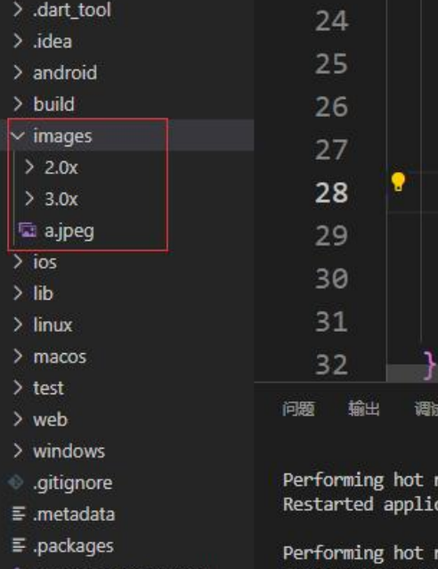

**2、然后，打开pubspec.yaml 声明一下添加的图片文件， 注意: 空格**

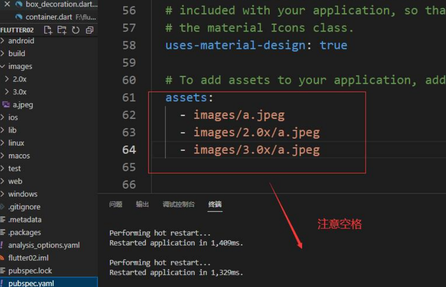

**3、使用**

```Bash
class MyApp extends StatelessWidget { 
const MyApp({Key? key}) : super(key: key); 
@override 
Widget build(BuildContext context) { 
return Center( 
child: ClipOval( 
child: Image.asset( 
"images/a.jpeg", 
width: 150.0, 
height: 150.0, 
fit: BoxFit.cover), 
), 
); 
} 
} 
```

### BoxDecoration实现圆形图片

```Bash
decoration: BoxDecoration( 
color: Colors.yellow, 
borderRadius: BorderRadius.circular(75), 
image: const DecorationImage( 
image: NetworkImage( 
"https://www.itying.com/themes/itying/images/ionic4.png", 
), 
fit: BoxFit.cover)), 
), 
);
```

### **ClipOval实现圆形图片**

ClipOval用于将其子部件（widget）裁剪为椭圆形（椭圆形的区域将显示子部件，而其他部分将被裁剪掉），以创建椭圆形的视觉效果。

```Bash
child: ClipOval( 
child: Image.network( 
"https://www.itying.com/themes/itying/images/ionic4.png", 
width: 150.0, 
height: 150.0, 
fit: BoxFit.cover), 
),
```

### **CircleAvatar实现圆形图片**

```Bash
return const CircleAvatar( 
radius: 110, 
backgroundColor: Color(0xffFDCF09), 
child: CircleAvatar( 
radius: 100, 
backgroundImage: 
NetworkImage("https://www.itying.com/images/flutter/3.png"), 
) 
)
```

CircleAvatar 不提供设置边框的属性。但是，可以将其包裹在具有更大半径和不同背景颜色的 

不同 CircleAvatar 中，以创建类似于边框的内容。 

## **图标组件**

### **使用Flutter官方Icons图标**

 Material Design所有图标可以在其官网查看：https://material.io/tools/icons/

```Bash
child: Column( 
children: const [ 
Icon(Icons.search,color: Colors.red,size: 40), 
SizedBox(height: 10), 
Icon(Icons.home), 
SizedBox(height: 10), 
Icon(Icons.category), 
SizedBox(height: 10), 
Icon(Icons.shop), 
SizedBox(height: 10), 
], 
)
```

###  **阿里巴巴图标库自定义字体图标**

我们也可以使用自定义字体图标。阿里巴巴图标库官网 iconfont.cn上有很多字体图标素材，我们可以 

选择自己需要的图标打包下载后，会生成一些不同格式的字体文件，在Flutter中，我们使用ttf格式即 

可。 

假设我们项目中需要使用一个书籍图标和微信图标，我们打包下载后导入： 

1. 导入字体图标文件；这一步和导入字体文件相同，假设我们的字体图标文件保存在项目根目录下， 

路径为"fonts/iconfont.ttf"： 

```Bash
fonts: 
- family: myIcon #指定一个字体名 
fonts: 
- asset: fonts/iconfont.ttf 
```

也可以配置多个字体文件： 

```Bash
fonts: 
- family: myIcon #指定一个字体名 
fonts: 
- asset: fonts/iconfont.ttf 
- family: alipayIcon #指定一个字体名 
fonts: 
- asset: fonts/iconfont2.ttf 
```

2、 为了使用方便，我们定义一个`MyIcons` 类，功能和 `Icons` 类一样：将字体文件中的所有图标都定义 

成静态变量： 

```Bash
class MyIcons{ 
// book 图标 
static const IconData book = IconData( 
0xe614, 
fontFamily: 'myIcon', 
matchTextDirection: true 
); 
// 微信图标 
static const IconData wechat = IconData( 
0xec7d, 
fontFamily: 'myIcon', 
matchTextDirection: true 
); 
}
```

3、 使用 

```Bash
Row( 
mainAxisAlignment: MainAxisAlignment.center, 
children: <Widget>[ 
Icon(MyIcons.book,color: Colors.purple), 
Icon(MyIcons.wechat,color: Colors.green), 
], 
) 
```

## **列表组件** 

列表布局是我们项目开发中最常用的一种布局方式。Flutter中我们可以通过ListView来定义列表项，支 

持垂直和水平方向展示。通过一个属性就可以控制列表的显示方向。列表有以下分类： 

1、垂直列表 

2、垂直图文列表 

3、水平列表 

4、动态列表 

**列表组件常用参数：**

| 名称            | 类型               | 功能                                          |
| --------------- | ------------------ | --------------------------------------------- |
| scrollDirection | Axis               | Axis.horizontal水平列表 Axis.vertical垂直列表 |
| padding         | EdgeInsetsGeometry | 内边距                                        |
| resolve         | bool               | 组件反向排序                                  |
| children        | List 列表          | 列表元素                                      |

### 垂直列表

如：淘宝个人界面的功能项

示例

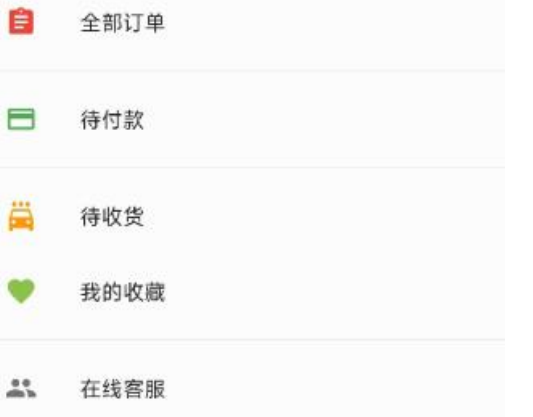

代码

```Bash
class MyApp extends StatelessWidget { 
const MyApp({Key? key}) : super(key: key); 
@override 
Widget build(BuildContext context) { 
return ListView( 
children: const <Widget>[ 
ListTile( 
leading: Icon(Icons.assignment, color: Colors.red), 
title: Text("全部订单"), 
), 
Divider(), //用作分割线
ListTile(
leading: Icon(Icons.payment, color: Colors.green), 
title: Text("待付款"), 
), 
Divider(), 
ListTile( 
leading: Icon(Icons.local_car_wash, color: Colors.orange), 
title: Text("待收货"), 
), 
ListTile( 
leading: Icon(Icons.favorite, color: Colors.lightGreen), 
title: Text("我的收藏"), 
), 
Divider(), 
ListTile( 
leading: Icon(Icons.people, color: Colors.black54), 
title: Text("在线客服"), 
), 
Divider(), 
], 
); 
} 
}
```

### 垂直图文列表

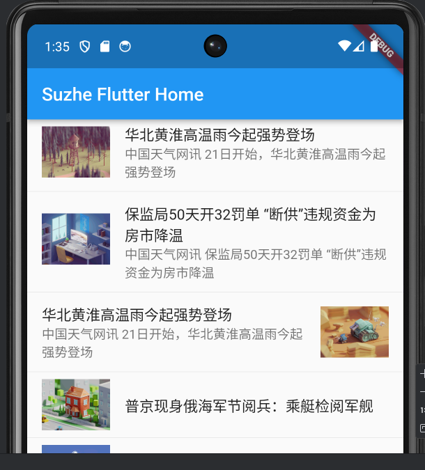

```Bash
class MyApp extends StatelessWidget { 
const MyApp({Key? key}) : super(key: key); 
@override 
Widget build(BuildContext context) { 
return ListView( 
children: <Widget>[ 
ListTile( 
leading: Image.network("https://www.itying.com/images/flutter/1.png"), 
title: const Text('华北黄淮高温雨今起强势登场'), 
subtitle: const Text("中国天气网讯 21日开始，华北黄淮高温雨今起强势登场"), 
), 
const Divider(), 
ListTile( 
leading: Image.network("https://www.itying.com/images/flutter/2.png"), 
title: const Text('保监局50天开32罚单 “断供”违规资金为房市降温'), 
subtitle: const Text("中国天气网讯 保监局50天开32罚单 “断供”违规资金为房市降 
温"), 
), 
const Divider(), 
ListTile( 
title: const Text('华北黄淮高温雨今起强势登场'),
subtitle: const Text("中国天气网讯 21日开始，华北黄淮高温雨今起强势登场"), 
trailing: 
Image.network("https://www.itying.com/images/flutter/3.png")), 
const Divider(), 
ListTile( 
leading: Image.network("https://www.itying.com/images/flutter/4.png"), 
title: const Text('普京现身俄海军节阅兵：乘艇检阅军舰'), 
), 
const Divider(), 
ListTile( 
leading: Image.network("https://www.itying.com/images/flutter/5.png"), 
title: const Text('鸿星尔克捐1个亿帮助困难残疾群体 网友：企业有担当'), 
), 
const Divider(), 
ListTile( 
leading: Image.network("https://www.itying.com/images/flutter/6.png"), 
title: const Text('行业冥灯？老罗最好祈祷苹果的AR能成'), 
), 
], 
); 
} 
}
```

### **水平列表-可以左右滑动**

如京东

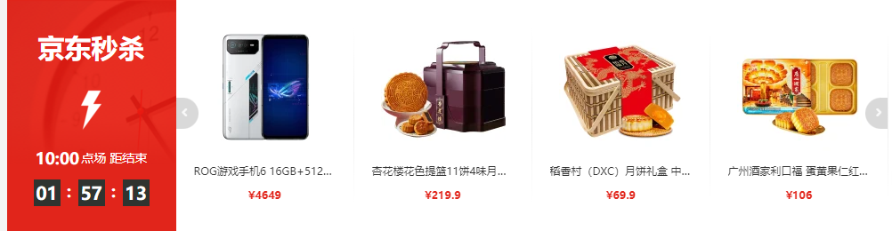

```Bash
class MyApp extends StatelessWidget { 
const MyApp({Key? key}) : super(key: key); 
@override 
Widget build(BuildContext context) { 
return SizedBox( 
height: 180, 
child: ListView( 
scrollDirection: Axis.horizontal, 
children: <Widget>[ 
Container(
width: 180.0, 
color: Colors.red, 
), 
Container( 
width: 180.0, 
color: Colors.orange, 
child: Column( 
children: <Widget>[ 
Image.network("https://www.itying.com/images/flutter/1.png"), 
const Text('我是一个文本') 
], 
), 
), 
Container( 
width: 180.0, 
color: Colors.blue, 
), 
Container( 
width: 180.0, 
color: Colors.deepOrange, 
), 
Container( 
width: 180.0, 
color: Colors.deepPurpleAccent, 
), 
], 
), 
); 
} 
} 
```

### **动态列表组件以及循环动态数据**

**1、****for循环****实现动态列表** 

```Bash
import 'package:flutter/material.dart'; 
import './ityingFont.dart'; 
void main() { 
runApp(const MyApp()); 
} 
class MyApp extends StatelessWidget { 
const MyApp({Key? key}) : super(key: key); 
// This widget is the root of your application. 
@override 
Widget build(BuildContext context) { 
return MaterialApp( 
theme: ThemeData( 
primarySwatch: Colors.yellow, 
),
home: Scaffold( 
appBar: AppBar(title: const Text("Flutter ICON")), 
body: const MyHomePage(), 
), 
); 
} 
} 
class MyHomePage extends StatelessWidget { 
const MyHomePage({Key? key}) : super(key: key); 
List<Widget> _initListView(){ 
List<Widget> list=[]; 
for (var i = 0; i < 10; i++) { 
list.add( 
const ListTile( 
title: Text("我是一个列表"), 
) 
); 
} 
return list; 
} 
@override 
Widget build(BuildContext context) { 
return ListView( 
children: _initListView(), 
); 
} 
}
```

**2、ListView.builder实现动态列表** 

```Bash
import 'package:flutter/material.dart'; 
import './ityingFont.dart'; 
void main() { 
runApp(const MyApp()); 
} 
class MyApp extends StatelessWidget { 
const MyApp({Key? key}) : super(key: key); 
// This widget is the root of your application. 
@override 
Widget build(BuildContext context) { 
return MaterialApp( 
theme: ThemeData( 
primarySwatch: Colors.yellow, 
), 
home: Scaffold( 
appBar: AppBar(title: const Text("Flutter ICON")), 
body: MyHomePage(), 
), 
); 
}
} 
class MyHomePage extends StatelessWidget { 
List list = []; 
MyHomePage({Key? key}) : super(key: key) { 
for (var i = 0; i < 10; i++) { 
list.add("我是一个列表--$i"); 
} 
} 
@override 
Widget build(BuildContext context) { 
return ListView.builder( 
itemCount: list.length, 
itemBuilder: (context, index) { 
return ListTile( 
title: Text("${list[index]}"), 
); 
}); 
} 
}
```

## **GridView网格布局组件** 

### **GridView网格布局组件介绍**

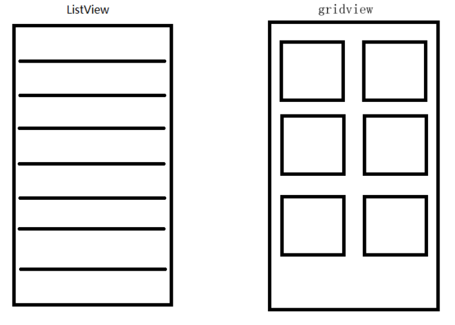

GridView网格布局在实际项目中用的也是非常多的，当我们想让可以滚动的元素使用矩阵方式排列的时 

候。此时我们可以用网格列表组件GridView实现布局。 

GridView创建网格列表主要有下面三种方式 

1、可以通过GridView.count 实现网格布局 

2、可以通过GridView.extent 实现网格布局 

3、通过GridView.builder实现动态网格布局

**常用属性：** 

| 名称               | 类型                                                         | 功能                                          |
| ------------------ | ------------------------------------------------------------ | --------------------------------------------- |
| scrollDirection    | Axis                                                         | Axis.horizontal水平列表 Axis.vertical垂直列表 |
| padding            | EdgeInsetsGeometry                                           | 内边距                                        |
| resolve            | bool                                                         | 组件反向排序                                  |
| crossAxisSpacing   | double                                                       | 水平子Widget之间间距                          |
| mainAxisSpacing    | double                                                       | 垂直子Widget之间间距                          |
| crossAxisCount     | int 用在GridView.count                                       | 一行的Widget数量                              |
| maxCrossAxisExtent | double 用在GridView.extent                                   | 横轴子元素的最大长度                          |
| childAspectRatio   | double                                                       | 子Widget宽高比例                              |
| children           |                                                              |                                               |
| gridDelegate       | SliverGridDelegateWithFixedCrossAxisCount  SliverGridDelegateWithMaxCrossAxisExtent | 控制布局主要用在GridView.builder里面          |

### **GridView.count 实现网格布局**

GridView.count构造函数内部使用了SliverGridDelegateWithFixedCrossAxisCount，我们通过它可以快速的创建**横轴****固定数量**子元素的GridView

示例

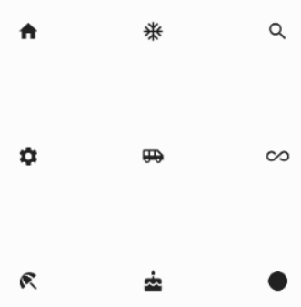

```Bash
class HomePage extends StatelessWidget { 
const HomePage({Key? key}) : super(key: key); 
@override 
Widget build(BuildContext context) { 
return GridView.count( 
crossAxisCount: 3, 
childAspectRatio: 1.0, 
children: const <Widget>[ 
Icon(Icons.home), 
Icon(Icons.ac_unit), 
Icon(Icons.search), 
Icon(Icons.settings), 
Icon(Icons.airport_shuttle), 
Icon(Icons.all_inclusive), 
Icon(Icons.beach_access), 
Icon(Icons.cake), 
Icon(Icons.circle), 
], 
); 
} 
}
```

### **GridView.extent实现网格布局** 

 GridView.extent构造函数内部使用了SliverGridDelegateWithMaxCrossAxisExtent，我们通过它可以快速的创建**横轴****子元素为固定最大长度**的GridView。 

示例

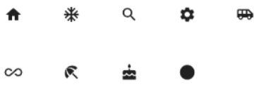

```Bash
class HomePage extends StatelessWidget { 
const HomePage({Key? key}) : super(key: key); 
@override 
Widget build(BuildContext context) { 
return GridView.extent( 
maxCrossAxisExtent: 80.0, 
childAspectRatio: 1.0, 
children: const <Widget>[ 
Icon(Icons.home), 
Icon(Icons.ac_unit), 
Icon(Icons.search), 
Icon(Icons.settings), 
Icon(Icons.airport_shuttle), 
Icon(Icons.all_inclusive), 
Icon(Icons.beach_access), 
Icon(Icons.cake), 
Icon(Icons.circle), 
], 
); 
} 
}
```

### **GridView.count 和 GridView.extent属性详解**

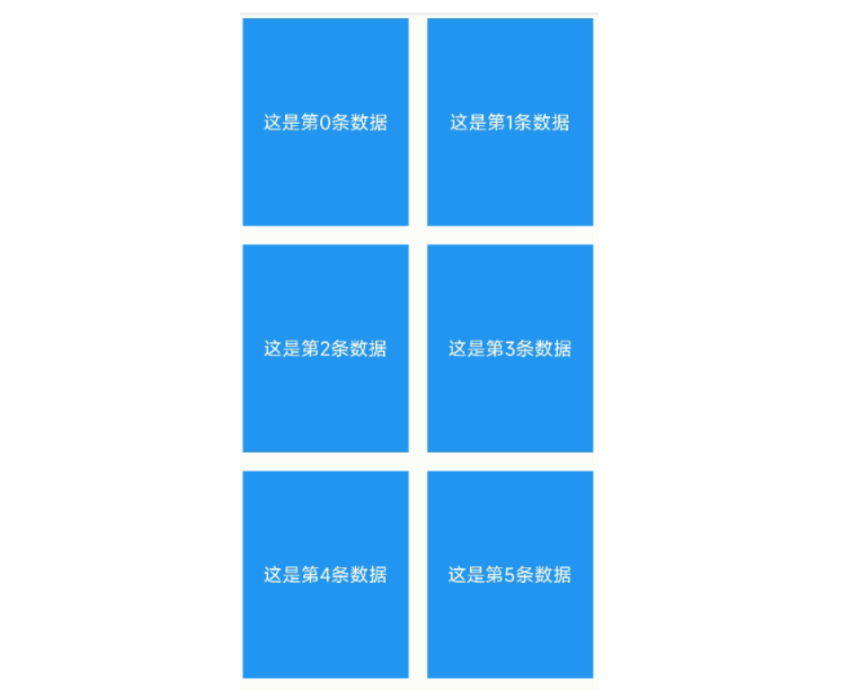

```Bash
class HomePage extends StatelessWidget { 
const HomePage({Key? key}) : super(key: key); 
List<Widget> _getListData() { 
List<Widget> list = []; 
for (var i = 0; i < 20; i++) { 
list.add(Container( 
alignment: Alignment.center, 
color: Colors.blue, 
child: Text( 
'这是第$i条数据', 
style: const TextStyle(color: Colors.white, fontSize: 20), 
), 
// height: 400, //设置高度没有反应 
)); 
} 
return list; 
} 
@override 
Widget build(BuildContext context) { 
return GridView.count( 
crossAxisSpacing: 20.0, //水平子 Widget 之间间距 
mainAxisSpacing: 20.0, //垂直子 Widget 之间间距
padding: const EdgeInsets.all(10), 
crossAxisCount: 2, //一行的 Widget 数量 
childAspectRatio: 0.8, //宽度和高度的比例 
children: _getListData(), 
); 
} 
}
```

### **GridView.count 实现动态列表**

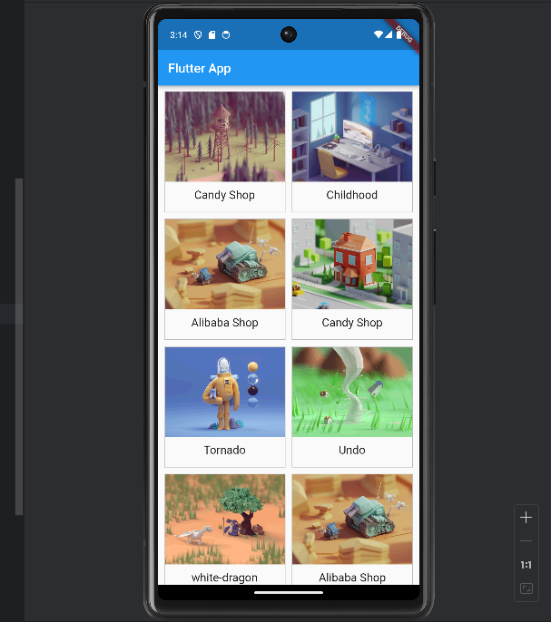

```Bash
import 'package:flutter/material.dart'; 
import 'res/listData.dart'; 
void main() { 
runApp(const MyApp()); 
} 
class MyApp extends StatelessWidget {
const MyApp({Key? key}) : super(key: key); 
// This widget is the root of your application. 
@override 
Widget build(BuildContext context) { 
return MaterialApp( 
title: 'Flutter Demo', 
theme: ThemeData( 
primarySwatch: Colors.blue, 
), 
home: Scaffold( 
appBar: AppBar(title: const Text("FLutter App")), 
body: const HomePage(), 
), 
); 
} 
} 
class HomePage extends StatelessWidget { 
const HomePage({Key? key}) : super(key: key); 
List<Widget> _getListData() { 
var tempList=listData.map((value){ 
return Container( 
decoration: BoxDecoration( 
border: Border.all( 
color:const Color.fromRGBO(233, 233,233, 0.9), 
width: 1 
) 
), 
child:Column( 
children: <Widget>[ 
Image.network(value['imageUrl']), 
const SizedBox(height: 12), 
Text( 
value['title'], 
textAlign: TextAlign.center, 
style: const TextStyle( 
fontSize: 20 
), 
) 
], 
), 
); 
}); 
// ('xxx','xxx') 
return tempList.toList(); 
} 
@override 
Widget build(BuildContext context) { 
return GridView.count( 
crossAxisSpacing:10.0 , //水平子 Widget 之间间距 
mainAxisSpacing: 10.0, //垂直子 Widget 之间间距 
padding: const EdgeInsets.all(10),
crossAxisCount: 2, //一行的 Widget 数量 
// childAspectRatio:0.7, //宽度和高度的比例 
children: _getListData(), 
); 
} 
}
```

### **GridView.builder实现动态列表** 

```Bash
import 'package:flutter/material.dart'; 
import 'res/listData.dart'; 
void main() { 
runApp(const MyApp()); 
} 
class MyApp extends StatelessWidget { 
const MyApp({Key? key}) : super(key: key); 
// This widget is the root of your application. 
@override 
Widget build(BuildContext context) { 
return MaterialApp( 
title: 'Flutter Demo', 
theme: ThemeData( 
primarySwatch: Colors.blue, 
), 
home: Scaffold( 
appBar: AppBar(title: const Text("FLutter App")), 
body: const HomePage(), 
), 
); 
} 
} 
class HomePage extends StatelessWidget { 
const HomePage({Key? key}) : super(key: key); 
Widget _getListData(context, index) { 
return Container( 
decoration: BoxDecoration( 
border: Border.all( 
color: const Color.fromRGBO(233, 233, 233, 0.9), width: 1)), 
child: Column( 
children: <Widget>[ 
Image.network(listData[index]['imageUrl']), 
const SizedBox(height: 12), 
Text( 
listData[index]['title'],
textAlign: TextAlign.center, 
style: const TextStyle(fontSize: 20), 
) 
], 
), 
// height: 400, //设置高度没有反应 
); 
} 
@override 
Widget build(BuildContext context) { 
return GridView.builder( 
//注意 
gridDelegate: const SliverGridDelegateWithFixedCrossAxisCount( 
crossAxisSpacing: 10.0, //水平子 Widget 之间间距 
mainAxisSpacing: 10.0, //垂直子 Widget 之间间距 
crossAxisCount: 2, //一行的 Widget 数量 
), 
itemCount: listData.length, 
itemBuilder: _getListData, 
); 
} 
} 
```

##  **Paddiing组件**

在html中常见的布局标签都有padding属性，但是Flutter中很多Widget是没有padding属性。这个时候我们可以用Padding组件处理容器与子元素之间的间距。 

| 名称    | 功能                               |
| ------- | ---------------------------------- |
| padding | padding值, EdgeInsetss设置填充的值 |
| child   | 子组件                             |

```Bash
Padding( 
padding: const EdgeInsets.all(10), 
child: Image.network('https://www.itying.com/images/flutter/1.png', 
fit: BoxFit.cover), 
),
```

## **线性布局（Row和Column）**

### **Row 水平布局组件**

| 名称               | 功能                                                         |
| ------------------ | ------------------------------------------------------------ |
| mainAxisAlignment  | 主轴的排序方式 spaceBetween一个在左一个在右 spaceAround 左右空白部分间距一样，等分 spaceEvenly 中间部分间距是左右的两倍 |
| crossAxisAlignment | 次轴的排序方式，注意，次轴起效需要有外部容器                 |
| children           | 组件子元素                                                   |

例


```Bash
class HomePage extends StatelessWidget { 
const HomePage({Key? key}) : super(key: key); 
@override 
Widget build(BuildContext context) { 
return Container( 
height: double.infinity, 
width: double.infinity, 
color: Colors.black26, 
child: Row( 
crossAxisAlignment: CrossAxisAlignment.center, 
mainAxisAlignment: MainAxisAlignment.spaceEvenly, 
children: [ 
IconContainer(Icons.home, color: Colors.red), 
IconContainer(Icons.search, color: Colors.blue), 
IconContainer(Icons.send, color: Colors.orange), 
], 
), 
); 
} 
}
class IconContainer extends StatelessWidget { 
Color color; 
double size; 
IconData icon; 
IconContainer(this.icon, 
{Key? key, this.color = Colors.red, this.size = 32.0}) 
: super(key: key); 
@override 
Widget build(BuildContext context) { 
return Container( 
height: 100.0, 
width: 100.0, 
color: color, 
child: Center(child: Icon(icon, size: size, color: Colors.white)), 
); 
} 
}
```

### **Column垂直布局组件** 

| 名称               | 功能                                                         |
| ------------------ | ------------------------------------------------------------ |
| mainAxisAlignment  | 主轴的排序方式 spaceBetween一个在左一个在右 spaceAround 左右空白部分间距一样，等分 spaceEvenly 中间部分间距是左右的两倍 |
| crossAxisAlignment | 次轴的排序方式，注意，次轴起效需要有外部容器                 |
| children           | 组件子元素                                                   |

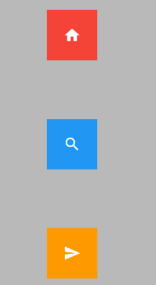

```Bash
child: Column( 
crossAxisAlignment: CrossAxisAlignment.center, 
mainAxisAlignment: MainAxisAlignment.spaceEvenly, 
children: [ 
IconContainer(Icons.home, color: Colors.red), 
IconContainer(Icons.search, color: Colors.blue), 
IconContainer(Icons.send, color: Colors.orange), 
], 
),
```

### **double.infinity 和double.maxFinite撑满容器** 

double.infinity 和double.maxFinite可以让当前元素的width或者height达到父元素的尺寸 

底层代码 

```Bash
static const double nan = 0.0 / 0.0; 
static const double infinity = 1.0 / 0.0; 
static const double negativeInfinity = -infinity; 
static const double minPositive = 5e-324; 
static const double maxFinite/ = 1.7976931348623157e+308; 
```

**如下可以让Container铺满整个屏幕**

```Bash
Widget build(BuildContext context) { 
return Container( 
height: double.infinity, 
width: double.infinity, 
color: Colors.black26, 
child: Column( 
crossAxisAlignment: CrossAxisAlignment.center, 
mainAxisAlignment: MainAxisAlignment.spaceEvenly, 
children: [ 
IconContainer(Icons.home, color: Colors.red), 
IconContainer(Icons.search, color: Colors.blue), 
IconContainer(Icons.send, color: Colors.orange), 
], 
), 
); 
} 
```

## 弹性布局（Flex Expanded）

Flex 组件可以沿着水平或垂直方向排列子组件，如果你知道主轴方向，使用 Row 或 Column 会方便一些，**因为** Row **和** Column **都****继承****自** Flex ，参数基本相同，所以能使用Flex的地方基本上都可以使用Row 或 Column 。 Flex 本身功能是很强大的，它也可以和 Expanded 组件配合实现弹性布局 。

能够实现类似百度搜索框一样的按钮固定宽度，搜索栏宽度自适应的效果

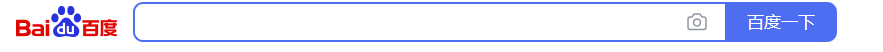

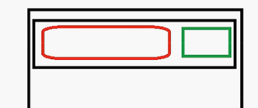

还能够实现按比例布局，左边1/5右边4/5

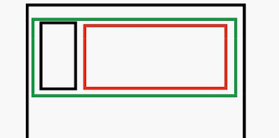

还能实现分割之后再分割的布局

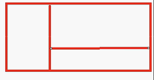

### 水平弹性布局

```Bash
return Flex( 
direction: Axis.horizontal, 
children: [ 
Expanded(flex: 2, child: IconContainer(Icons.home, color: Colors.red)), 
Expanded( 
        flex: 1, 
        child: IconContainer(Icons.search, color: Colors.orange), 
        ) 
], 
); 
} 
} 
```

这里面的flex的值是比例，上面的代码表示2:1的比例

如果要实现垂直弹性布局只需要将direction: Axis.horizontal修改成direction: Axis.vertical即可

示例

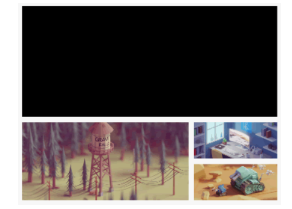

思路：

1. 整体是一个ListView，里面有一个Container作为上面的黑色部分，一个SizedBox充当白色的分割线

一个Row用来存放横向的第二块大内容

1. Row里面首先是一个Expanded(flex: 2)里面再包一个SizedBox固定高度,SizedBox里面再包一个Image，这里记得指定宽度为width:double.infinity *，*然后Row里面还有一个SizedBox充当白色的分割线，最后是一个Expanded(flex: 1）包裹右边的两个图
2. 右边的Expanded里面首先需要一个SizedBox指定高度，然后需要一个Column指定垂直布局，最后是两个Expande。由于Image图片的大小不一定和我们的盒子一样大，所以还是需要在SizedBox里面再包一个Image。这里高度不需要指定了我们指定宽度为width:double.infinity 

## **层叠布局（Stack、Align、Positioned）**

实现定位布局：也就是将一个组件放置到另一个组件上面，或者实现浮动导航

### **Flutter Stack组件** 

Stack表示堆的意思，我们可以用Stack或者**Stack结合Align**或者**Stack结合Positiond**来实现页面的定位布局。

Stack基于外部容器定位，如果没有外部容器则基于整个屏幕定位

| 名称      | 功能                     |
| --------- | ------------------------ |
| alignment | 配置所有子元素的显示位置 |
| children  | 子组件                   |

 **Stack组件**中的元素对堆叠在一起

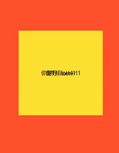

### **Align**

Align 组件可以调整子组件的位置 , Stack组件中结合Align组件也可以控制每个子元素的显示位置

| 名称      | 功能                     |
| --------- | ------------------------ |
| alignment | 配置所有子元素的显示位置 |
| children  | 子组件                   |

**Align结合Container的使用** 

我们先来看一个简单的例子： FlutterLogo 是Flutter SDK 提供的一个组件，内容就是 Flutter 的 log 

```Bash
class HomePage extends StatelessWidget { 
const HomePage({Key? key}) : super(key: key); 
@override 
Widget build(BuildContext context) { 
return Container( 
height: 120.0, 
width: 120.0, 
color: Colors.blue.shade50, 
child: const Align( 
alignment: Alignment.topRight, 
child: FlutterLogo( 
size: 60, 
), 
), 
); 
} 
} 
```

这会使得Align组件的内容在Container的右边显示

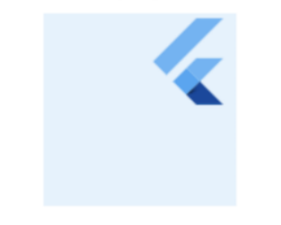

 **Align结合Alignment 参数**

```Bash
class HomePage extends StatelessWidget { 
const HomePage({Key? key}) : super(key: key); 
@override 
Widget build(BuildContext context) { 
return Container( 
height: 120.0, 
width: 120.0, 
color: Colors.blue.shade50, 
child: const Align( 
alignment: Alignment(2, 0.0), 
child: FlutterLogo( 
size: 60, 
), 
)); 
} 
}
```

Alignment Widget会以**矩形的中心点作为坐标原点**，即 Alignment(0.0, 0.0) 。 x 、 y 的值从-1到1分别代表矩形左边到右边的距离和顶部到底边的距离，因此2个水平（或垂直）单位则等于矩形的宽（或高），如 Alignment(-1.0, -1.0) 代表矩形的左侧顶点，而 Alignment(1.0, 1.0) 代表右侧底部终点，而 Alignment(1.0, -1.0) 则正是右侧顶点，即 Alignment.topRight 。为了使用方便，矩形的原点、四个顶点，以及四条边的终点在 Alignment 类中都已经定义为了静态常量。 

Alignment 可以通过其**坐标转换公式**将其坐标转为子元素的具体偏移坐标：(Alignment.x*childWidth/2+childWidth/2, Alignment.y*childHeight/2+childHeight/2) 其中 childWidth 为子元素的宽度， childHeight 为子元素高度。现在我们再看看上面的示例，我们将 Alignment(2, 0.0) 带入上面公式， (2*120/2+120/2, 0*120/2+120/2) ，可得 FlutterLogo 的实际偏移坐标正是（180,60）。


### **Positioned**

Stack组件中结合Positioned组件也可以控制每个子元素的显示位置

| 名称   | 功能                                                         |
| ------ | ------------------------------------------------------------ |
| top    | 子元素距离顶部的距离                                         |
| bottom | 子元素距离底部的距离                                         |
| left   | 子元素距离左侧距离                                           |
| right  | 子元素距离右侧距离                                           |
| child  | 子组件                                                       |
| width  | 组件的高度 （注意：宽度和高度必须是固定值，没法使用double.infinity） |
| height | 子组件的高度                                                 |

```Bash
Positioned( 
bottom: 0, 
left: 100, 
child: Icon(Icons.search,size: 30,color: Colors.white), 
), 
```

我们通常将Stack组件中结合Positioned组件

```Bash
child: Stack( 
// alignment: Alignment.center, 
children: const <Widget>[ 
Positioned( 
    left: 10, 
    child: Icon(Icons.home,size: 40,color: Colors.white),
    ), 
    Positioned( 
    bottom: 0, 
    left: 100, 
    child: Icon(Icons.search,size: 30,color: Colors.white), 
    ), 
    Positioned( 
    right: 0, 
    child: Icon(Icons.settings_applications,size: 30,color: 
    Colors.white), 
    ) 
    ], 
), 
);
```

### **FlutterMediaQuery获取屏幕宽度和高度**

```Bash
final size =MediaQuery.of(context).size; 
```

组件的build方法中可以通过，=MediaQuery.of(context).size; 

```Bash
Widget build(BuildContext context) { 
final size =MediaQuery.of(context).size; 
final width =size.width; 
final height =size.height; 
}
```

### **固定导航案例** 

```Bash
class HomePage extends StatelessWidget { 
const HomePage({Key? key}) : super(key: key); 
@override 
Widget build(BuildContext context) { 
final size = MediaQuery.of(context).size; 
return Stack( 
children: [ 
ListView( 
padding: const EdgeInsets.only(top: 45), 
children: const [ 
ListTile( 
title: Text("这是一个标题 "), 
), 
ListTile( 
title: Text("这是一个标题"), 
), 
ListTile( 
title: Text("这是一个标题"), 
), 
...
], 
), 
Positioned( 
top: 0, 
left: 0, 
height: 40, 
width: size.width, 
child: Container( 
alignment: Alignment.center, 
color: Colors.black, 
child: const Text("你好FLutter",style: TextStyle(color: 
Colors.white),), 
)) 
], 
); 
} 
} 
```

## **AspectRatio** 

**AspectRatio**的作用是根据设置调整子元素child的宽高比。 

**AspectRatio**首先会在布局限制条件允许的范围内尽可能的扩展，widget的高度是由宽度和比率决定的，类似于BoxFit中的contain，按照固定比率去尽量占满区域。 

如果在满足所有限制条件过后无法找到一个可行的尺寸，AspectRatio最终将会去优先适应布局限制条件，而忽略所设置的比率。 

| 名称        | 功能                                                         |
| ----------- | ------------------------------------------------------------ |
| aspectRatio | 宽高比，最终可能不会根据这个值去布局，具体则要看综合因素，外层是否允许  按照这种比率进行布局，这只是一个参考值 |
| child       | 子组件                                                       |

```Bash
child: AspectRatio(
aspectRatio: 2.0/1.0,
child: Container(
  color: Colors.red,
),
),
```

上面的代码表示该框框的宽高比是2:1，默认宽度占满整个父元素

## **Flutter Card组件**

Card是卡片组件块，内容可以由大多数类型的Widget构成，Card具有圆角和阴影，这让它看起来有立体感。 

| 名称         | 功能                                                         |
| ------------ | ------------------------------------------------------------ |
| margin       | 外边距                                                       |
| child        | 子组件                                                       |
| elevation    | 阴影值的深度                                                 |
| color        | 背景颜色                                                     |
| shadowColor  | 阴影颜色                                                     |
| margin       | 外边距                                                       |
| clipBehavior | clipBehavior 内容溢出的剪切方式 Clip.none不剪切 Clip.hardEdge裁剪但不应  用抗锯齿 Clip.antiAlias裁剪而且抗锯齿 Clip.antiAliasWithSaveLayer带有抗锯  齿的剪辑，并在剪辑之后立即保存saveLayer |
| Shape        | Card的阴影效果，默认的阴影效果为圆角的长方形边。  shape: const  RoundedRectangleBorder(  borderRadius: BorderRadius.all(Radius.circular(10))  ) |

示例：图片列表卡片

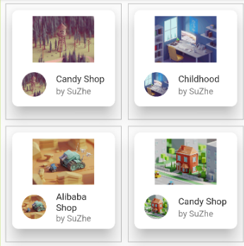

```Bash
class HomePage extends StatelessWidget {
  const HomePage({Key? key}) : super(key: key);

  Widget _initGridViewData(context, index) {
    return Container(
      decoration: BoxDecoration(border: Border.all(color: Colors.black26)),
      child: Column(
        children: <Widget>[
          Card(
            elevation: 20,
            shape: RoundedRectangleBorder(
              borderRadius: BorderRadius.circular(10),
            ),
            margin: const EdgeInsets.all(10),
            child: Container(
              margin: const EdgeInsets.only(top: 10), // 将这行移到 Container 内部
              child: Column(
                children: <Widget>[
                  AspectRatio(
                    aspectRatio: 20 / 9,
                    child: Image.network(listData[index]["imageUrl"]),
                  ),
                  ListTile(
                    leading: ClipOval(
                      child: Image.network(
                        listData[index]["imageUrl"],
                        fit: BoxFit.cover,
                        height: 40,
                        width: 40,
                      ),
                    ),
                    title: Text(listData[index]["title"], style: const TextStyle(fontSize: 15)),
                    subtitle: const Text("by SuZhe"),
                  )
                ],
              ),
            ),
          ),
        ],
      ),
    );
  }

  @override
  Widget build(BuildContext context) {
    return GridView.builder(
        padding: const EdgeInsets.all(10),
        gridDelegate: const SliverGridDelegateWithFixedCrossAxisCount(
          crossAxisSpacing: 10, //水平子Widget之间间 距
          mainAxisSpacing: 10, //垂直子Widget之间间 距
          crossAxisCount: 2, //一行显示多少个元素
          childAspectRatio: 1, //宽高比
        ),
        itemCount:listData.length,
        itemBuilder: _initGridViewData);

  }
}
```

1. 每一块整个是一个Container，里面使用BoxDecoration设置了灰色背景和边距，里面再放置一个Column
2. Column里面是包裹在children: `<Widget>[]`中的一个Card组件，Card组件定义了圆角和边距，然后包含磊哥Container，这个Container主要的作用就是让我借助margin设置上边距的，其他没啥用。
3. Container里面又是一个Column，里面又是一个包裹在children: `<Widget>[]`中的AspectRation和ListTile，其中AspectRation里面放置了最大的那张图片，ListTile里面放置的则是小圆形图片和文字
4. ListTile里面的leading: ClipOval()包含了圆角图片，title: Text()包含了标题文字，subtitle: const Text()包含了副标题文字

## **Flutter 按钮组件**

**按钮组件的属性**

| 名称      | 功能                                                         |
| --------- | ------------------------------------------------------------ |
| onPressed | 必填参数，按下按钮时触发的回调，接收一个方法，传null表示按钮禁用，会显示 |
| child     | 子组件                                                       |
| style     | 通过ButtonStyle装饰                                          |

**ButtonStylee里面的常用的参数**

| 名称            | 值类型   | 功能                                                         |
| --------------- | -------- | ------------------------------------------------------------ |
| foregroundColor | Color    | 文本颜色                                                     |
| backgroundColor | Color    | 按钮的颜色                                                   |
| shadowColor     | Color    | 阴影颜色                                                     |
| elevation       | double   | 阴影的范围，值越大阴影范围越大                               |
| padding         |          | 内边距                                                       |
| shape           |          | 设置按钮的形状 shape: MaterialStateProperty.all(  RoundedRectangleBorder(  borderRadius: BorderRadius.circular(10))  ) |
| side            | 设置边框 | MaterialStateProperty.all(BorderSide(width:1,color:Colors.red)) |

### **ElevatedButton普通按钮**

ElevatedButton 即"凸起"按钮，它默认带有阴影和灰色背景。按下后，阴影会变大 

使用 ElevatedButton 非常简单，如：

```Bash
ElevatedButton( 
onPressed: () {}, 
child: const Text("普通按钮") 
)
```

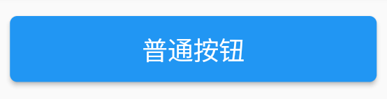

### **TextButton文本按钮**

TextButton 即文本按钮，默认背景透明并不带阴影。按下后，会有背景色

```Bash
TextButton( 
child: Text("文本按钮"), 
onPressed: () {}, 
) 
```

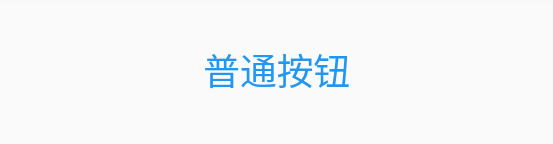

### **OutlinedButton边框按钮**

OutlineButton 默认有一个灰色边框，不带阴影且背景透明。按下后，边框颜色会变亮、同时出现背景和阴影 

```Bash
OutlinedButton( 
child: Text("边框按钮"), 
onPressed: () {}, 
) 
```

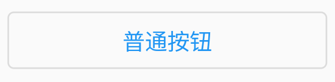

### **IconButton图标按钮** 

IconButton 是一个可点击的Icon，不包括文字，默认没有背景，点击后会出现背景，背景默认是个圆形的

```Bash
IconButton( 
icon: Icon(Icons.thumb_up), 
onPressed: () {}, 
)
```

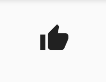

### **带图标的按钮**

`ElevatedButton` 、 `TextButton` 、 `OutlineButton` 都有一个 icon 构造函数，通过它可以轻松创建带图标的按钮 

```Bash
ElevatedButton.icon( 
icon: Icon(Icons.send), 
label: Text("发送"), 
onPressed: _onPressed, 
), 
OutlineButton.icon( 
icon: Icon(Icons.add), 
label: Text("添加"), 
onPressed: _onPressed, 
), 
TextButton.icon( 
icon: Icon(Icons.info), 
label: Text("详情"), 
onPressed: _onPressed, 
), 
```

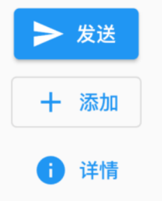

### **修改按钮的宽度高度**

在外面加一个SizedBox

### **自适应按钮**

使用Expanded

```Bash
Row( 
mainAxisAlignment: MainAxisAlignment.center, 
children: <Widget>[ 
Expanded( 
child: Container( 
height: 60, 
margin: const EdgeInsets.all(10), 
child: ElevatedButton( 
child: const Text('自适应按钮'), 
onPressed: () { 
print("自适应按钮"); 
}, 
), 
), 
) 
], 
), 
```

### **配置圆形圆角按钮** 

```Bash
ElevatedButton( 
style: ButtonStyle( 
backgroundColor:MaterialStateProperty.all(Colors.blue), 
foregroundColor: MaterialStateProperty.all(Colors.white), 
elevation: MaterialStateProperty.all(20), 
shape: MaterialStateProperty.all( 
RoundedRectangleBorder( 
borderRadius: BorderRadius.circular(10)) 
), 
), 
onPressed: () { 
print("圆角按钮"); 
}, 
child: const Text('圆角') 
) 
```

通过在Button中添加style: ButtonStyle()来实现圆角

`elevation: MaterialStateProperty.all(20),`：这一行设置按钮的高程（elevation）为20。高程是按钮的立体感，数字越大，按钮看起来就越凸起。

`borderRadius: BorderRadius.circular(10))`：这一行设置边框的圆角半径为10，使按钮具有圆角外观。

如果想要将圆角改成圆形，则RoundedRectangleBorder( borderRadius: BorderRadius.circular(10)) 改成CircleBorder(side: BorderSide(color: Colors.*white*)

### **修改OutlinedButton边框** 

**OutlinedButton**可以单独设置边框的粗细以及颜色

```Bash
OutlinedButton(
  style: ButtonStyle(
    foregroundColor: MaterialStateProperty.all(Colors.black),
    side: MaterialStateProperty.all(
      const BorderSide(width: 1, color: Colors.red),
    ),
  ),
  onPressed: () {},
  child: const Text("注册 配置边框"),
),
```

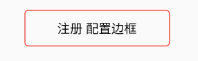

## **Wrap组件**

Wrap可以实现流布局，单行的Wrap跟Row表现几乎一致，单列的Wrap则跟Column表现几乎一致。但Row与Column都是单行单列的，Wrap则突破了这个限制，mainAxis上空间不足时，则向crossAxis上去扩展显示

| 名称              | 功能                                                         |
| ----------------- | ------------------------------------------------------------ |
| direction         | 主轴的方向，默认水平                                         |
| alignment         | 主轴的对其方式                                               |
| spacing           | 主轴方向上的间距                                             |
| textDirection     | 文本方向                                                     |
| verticalDirection | 定义了children摆放顺序，默认是down，见Flex相关               |
| runAlignment      | run的对齐方式。run可以理解为新的行或者列，如果是水平方向布局的话，  run可以理解为新的一行 |
| runSpacing        | run的间距                                                    |

示例

**简单使用**

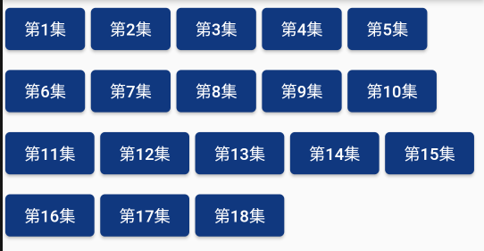

```Bash
class LayoutDemo extends StatelessWidget {
  const LayoutDemo({Key? key}) : super(key: key);
  @override
  Widget build(BuildContext context) {
    return Padding(
        padding:const EdgeInsets.all(3),
    child: Wrap(
    spacing: 5,
    runSpacing: 5,
// direction: Axis.vertical,
// alignment:WrapAlignment.start,
// runAlignment: WrapAlignment.center,
    children: <Widget>[
    Button("第1集", onPressed: () {}),
    Button("第2集", onPressed: () {}),
    Button("第3集", onPressed: () {}),
    Button("第4集", onPressed: () {}),
    Button("第5集", onPressed: () {}),
    Button("第6集", onPressed: () {}),
    Button("第7集", onPressed: () {}),
    Button("第8集", onPressed: () {}),
    Button("第9集", onPressed: () {}),
    Button("第10集", onPressed: () {}),
    Button("第11集", onPressed: () {}),
    Button("第12集", onPressed: () {}),
    Button("第13集", onPressed: () {}),
    Button("第14集", onPressed: () {}),
    Button("第15集", onPressed: () {}),
    Button("第16集", onPressed: () {}),
    Button("第17集", onPressed: () {}),
    Button("第18集", onPressed: () {}),
    ],
    ),
    );
  }
}
class Button extends StatelessWidget {
  String text;
  void Function()? onPressed;
  Button(this.text, {Key? key, required this.onPressed}) : super(key: key);
  @override
  Widget build(BuildContext context) {
    return ElevatedButton(
      onPressed: onPressed,
      style: ButtonStyle(
        backgroundColor:
        MaterialStateProperty.all(const Color.fromARGB(255, 16, 56, 127)),
        foregroundColor: MaterialStateProperty.all(Colors.white),
      ),
      child: Text(text),
    );
  }
}
```

## **Flutter StatelessWidget 、StatefulWidget**

在Flutter中自定义组件其实就是一个类，这个类需要继承StatelessWidget/StatefulWidget。 

**StatelessWidget**是无状态组件，状态不可变的widget 

**StatefulWidget**是有状态组件，持有的状态可能在widget生命周期改变。 

**通俗的讲**：如果我们想改变页面中的数据的话这个时候就需要用到StatefulWidget

### **StatefulWidget实现一个计数器的功能**

```Bash
import 'package:flutter/material.dart';
void main() {
  runApp(const MyApp());
}
class MyApp extends StatelessWidget {
  const MyApp({Key? key}) : super(key: key);
// This widget is the root of your application.
  @override
  Widget build(BuildContext context) {
    return MaterialApp(
      title: 'Flutter Demo',
      theme: ThemeData(
        primarySwatch: Colors.blue,
      ),
      home: Scaffold(
        appBar: AppBar(title: const Text("Flutter App")),
        body: const HomePage(),
      ),
    );
  }
}
class HomePage extends StatefulWidget {
  const HomePage({Key? key}) : super(key: key);
  @override
  State<HomePage> createState() => _HomePageState();
}
class _HomePageState extends State<HomePage> {
  int countNum=0;
  @override
  Widget build(BuildContext context) {
    return Center(
      child: Column(
        children: [
          const SizedBox(height: 40),
          Text("$countNum",style: Theme.of(context).textTheme.titleLarge),
          const SizedBox(height: 100,),
          ElevatedButton(onPressed: (){
            setState(() {
              countNum++;
            });
          }, child: const Text("增加"))
        ],
      ),
    );
  }
}
```

将homepage继承StatefulWidget 然后再使用setState就可以动态改变数据值了，这时候你点击一次按钮就会重新build一次

也可以在Scaffold里面加入如下代码

```Bash
floatingActionButton:FloatingActionButton( 
onPressed:() {
setstate((){
 _numcount++;
 });
 }, 
 child:const Icon(Icons.add)
 ,)//FloatingActionButton
```

这是定义了一个浮动的按钮，点击之后增加_numcount的值

### Const 和final定义常量

在定义常量时，可以使用const或者final。但是注意，final是运行时常量可以先声明再赋值，而const声明时就要赋值。

因此在定义私有数组时建议使用final，便于通过add方法添加数据

## **Scaffold-BottomNavigationBar底部导航** 

**BottomNavigationBar 组件介绍**

BottomNavigationBar 是底部导航条，可以让我们定义底部Tab切换，bottomNavigationBar是 

Scaffold组件的参数。 

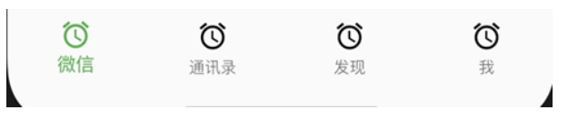

**BottomNavigationBar 常见的属性** 

| 名称         | 功能                                                         |
| ------------ | ------------------------------------------------------------ |
| items        | List 底部导航条按钮集合                                      |
| iconSize     | icon                                                         |
| currentIndex | 默认选中第几个                                               |
| onTap        | 选中变化回调函数                                             |
| fixedColor   | 选中的颜色                                                   |
| type         | BottomNavigationBarType.fixed BottomNavigationBarType.shifting |

### **页面切换**

1. 写一个`final List<Widget>_pages`包含住我们需要的几个页面进来
2. 设置body:_pages [_currentIndex],用变量设置主页
3. 在按钮的点击事件onTap方法中使用setState重设_currentIndex即可

另外bottomNavigationBar中有fixedColor可以选择页面被选中时下面图标的颜色

在你放入三个以上的按键是必须配置type属性否则就会将原有图标挤掉，

## **Scaffold-FloatingActionButton实现类似闲鱼App底部导航凸起按钮** 

FloatingActionButton简称FAB ,可以实现浮动按钮，也可以实现类似闲鱼app的底部凸起导航

| 名称               | 功能                               |
| ------------------ | ---------------------------------- |
| child              | 子视图，一般为Icon，不推荐使用文字 |
| tooltip            | FAB被长按时显示，也是无障碍功能    |
| backgroundColor    | 背景颜色                           |
| elevation          | 未点击的时候的阴影                 |
| hignlightElevation | 点击时阴影值，默认12.0             |
| onPressed          | 点击事件回调                       |
| shape              | 可以定义FAB的形状等                |
| mini               | 是否是mini类型默认false            |

## **Scaffold-抽屉菜单Drawer**

在Scaffold组件里面传入drawer参数可以定义左侧边栏，传入endDrawer可以定义右侧边栏。侧边栏默认是隐藏的，我们可以通过手指滑动显示侧边栏，也可以通过点击按钮显示侧边栏。 

```Bash
return Scaffold( 
appBar: AppBar( 
title: Text("Flutter App"), 
), 
drawer: Drawer( 
child: Text('左侧边栏'), 
), 
endDrawer: Drawer( 
child: Text('右侧侧边栏'), 
), 
);
```

### **DrawerHeader**

**常见属性：**

| 名称           | 功能             |
| -------------- | ---------------- |
| decoration     | 设置顶部背景颜色 |
| child          | 配置子元素       |
| padding 内边距 | 内边距           |
| margin         | 外边距           |

## **Flutter AppBar TabBar TabBarView**

### **AppBar自定义顶部按钮图标、颜色**

| 名称            | 功能                                                         |
| --------------- | ------------------------------------------------------------ |
| leading         | 在标题前面显示的一个控件，在首页通常显示应用的 logo；在其他界面通常显示为返回按钮 |
| title           | 标题，通常显示为当前界面的标题文字，可以放组件               |
| actions         | 通常使用 IconButton 来表示，可以放按钮组                     |
| bottom          | 通常放tabBar，标题下面显示一个 Tab 导航栏                    |
| backgroundColor | 导航背景颜色                                                 |
| iconTheme       | 图标样式                                                     |
| centerTitle     | 标题是否居中显示                                             |

1. 首先要让该页面的类with一下SingleTickerProviderStateMixin

```Bash
class _HomePageState extends State<HomePage>
    with SingleTickerProviderStateMixin {
    
    }
```

1. 定义TabController

```Bash
late TabController _tabController;
```

1. 在void initState()方法中，为_tabController赋值
2. 在Widget build(BuildContext context)方法中return一个Scaffold
3. Scaffold里面有appBar属性，appbar里面有title属性，里面是用来支撑高度的SizedBox和很多的TabBar
4. Scaffold里面还有body属性，里面有TabBarView，这个TabBarView里面有控制器controller和自定义缓存组件KeepAliveWrapper，自定义缓存组件里面是很多的页面

### **Flutter AppBar结合TabBar实现顶部Tab切换**

**TabBar常见属性：** 

| 名称                 | 功能                                                         |
| -------------------- | ------------------------------------------------------------ |
| tabs                 | 显示的标签内容，一般使用Tab对象,也可以是其他的Widget         |
| controller           | TabController对象                                            |
| isScrollable         | 是否可滚动                                                   |
| indicatorColor       | 指示器颜色                                                   |
| indicatorWeight      | 指示器高度                                                   |
| indicatorPadding     | 底部指示器的Padding                                          |
| indicator            | 指示器decoration，例如边框等                                 |
| indicatorSize        | 指示器大小计算方式，TabBarIndicatorSize.label跟文字等宽,TabBarIndicatorSize.tab跟每个tab等宽 |
| labelColor           | 选中label颜色                                                |
| labelStyle           | 选中label的Style                                             |
| labelPadding         | 每个label的padding值                                         |
| unselectedLabelColor | 未选中label颜色                                              |
| unselectedLabelStyle | 未选中label的Style                                           |

```Bash
@override
void initState() {
  super.initState();
  _tabController = TabController(length: 8, vsync: this);
  //监听_tabController的改变事件
  _tabController.addListener(() {
    // print(_tabController.index);  
    if (_tabController.animation!.value==_tabController.index){
      print(_tabController.index);    //获取点击或滑动页面的索引值
    }
  });
}
```

### **BottomNavigationBar 的页面中使用Tabbar**

由于代码较多，我和前面的几条合并一起将代码完整的贴出来

```Bash
import 'package:flutter/material.dart';
import '../../tools/KeepAliveWrapper.dart';

class HomePage extends StatefulWidget {
  const HomePage({super.key});

  @override
  State<HomePage> createState() => _HomePageState();
}

class _HomePageState extends State<HomePage>
    with SingleTickerProviderStateMixin {
  late TabController _tabController;
  @override
  void initState() {
    super.initState();
    _tabController = TabController(length: 8, vsync: this);
    //监听_tabController的改变事件
    _tabController.addListener(() {
      // print(_tabController.index);  
      if (_tabController.animation!.value==_tabController.index){
        print(_tabController.index);    //获取点击或滑动页面的索引值
      }
    });
  }
  //组件销毁的时候触发
  @override
  void dispose() {
    // TODO: implement dispose
    super.dispose();
    //销毁_tabController
    _tabController.dispose();
  }

  @override
  Widget build(BuildContext context) {
    return Scaffold(
      appBar: PreferredSize(
        //可以配置appBar的高度
        preferredSize: const Size.fromHeight(40),
        child: AppBar(
          elevation: 0.5,
          backgroundColor: Colors.white,
          title: SizedBox(
            //改TabBar的高度
            height: 30,
            child: TabBar(
              labelStyle: const TextStyle(fontSize: 14),
              isScrollable: true,
              indicatorColor: Colors.red, //底部指示器的颜色
              labelColor: Colors.red,
              unselectedLabelColor: Colors.black, //lable未选中的颜色
              indicatorSize: TabBarIndicatorSize.label,
              controller: _tabController,
              // onTap: (index){   //只能监听点击事件 没法监听滑动
              //   print(index);
              // },
              tabs: const [
                Tab(
                  child: Text("关注"),
                ),
                Tab(
                  child: Text("热门"),
                ),
                Tab(
                  child: Text("视频"),
                ),
                Tab(
                  child: Text("娱乐"),
                ),
                Tab(
                  child: Text("篮球"),
                ),
                Tab(
                  child: Text("深圳"),
                ),
                Tab(
                  child: Text("疫情"),
                ),
                Tab(
                  child: Text("其他"),
                ),
              ],
            ),
          ),
        ),
      ),
      body: TabBarView(controller: _tabController, children: [
        KeepAliveWrapper(  //自定义的缓存组件
            child: ListView(
          children: const [
            ListTile(
              title: Text("我是关注列表1"),
            ),
            ListTile(
              title: Text("我是关注列表1"),
            ),
            ListTile(
              title: Text("我是关注列表1"),
            ),
            ListTile(
              title: Text("我是关注列表1"),
            ),
            ListTile(
              title: Text("我是关注列表1"),
            ),
            ListTile(
              title: Text("我是关注列表1"),
            ),
            ListTile(
              title: Text("我是关注列表1"),
            ),
            ListTile(
              title: Text("我是关注列表1"),
            ),
            ListTile(
              title: Text("我是关注列表1"),
            ),
            ListTile(
              title: Text("我是关注列表1"),
            ),
            ListTile(
              title: Text("我是关注列表1"),
            ),
            ListTile(
              title: Text("我是关注列表1"),
            ),
            ListTile(
              title: Text("我是关注列表1"),
            ),
            ListTile(
              title: Text("我是关注列表1"),
            ),
            ListTile(
              title: Text("我是关33333注列表1"),
            ),
            ListTile(
              title: Text("我是关33333注列表1"),
            ),
            ListTile(
              title: Text("我是关注列表1"),
            ),
            ListTile(
              title: Text("我是关2注列表1"),
            ),
            ListTile(
              title: Text("我是关注列表1"),
            ),
            ListTile(
              title: Text("我是关注2表1"),
            ),
            ListTile(
              title: Text("我是关注列表1"),
            ),
            ListTile(
              title: Text("我是关注列表1"),
            ),
            ListTile(
              title: Text("我是关33333注列表1"),
            ),
          ],
        )),
        const Text("我是热门"),
        const Text("视频"),
        const Text("娱乐"),
        const Text("篮球"),
        const Text("深圳"),
        const Text("疫情"),
        const Text("其他"),
      ]),
    );
  }
}
```

### **preferredSize组件**

PreferredSize可以改变appBar的高度 

```Bash
Scaffold( 
appBar: PreferredSize( 
preferredSize: Size.fromHeight(50), 
child: AppBar( 
.... 
) 
), 
body: Test(), 
)
```

### **自定义KeepAliveWrapper 缓存页面** 

 AutomaticKeepAliveClientMixin 可以快速的实现页面缓存功能，但是通过混入的方式实现不是很优雅， 所以我们有必要对AutomaticKeepAliveClientMixin 混入进行封装

```Bash
import 'package:flutter/material.dart'; 
class KeepAliveWrapper extends StatefulWidget { 
const KeepAliveWrapper( 
{Key? key, @required this.child, this.keepAlive = true}) 
: super(key: key); 
final Widget? child; 
final bool keepAlive; 
@override 
State<KeepAliveWrapper> createState() => _KeepAliveWrapperState(); 
} 
class _KeepAliveWrapperState extends State<KeepAliveWrapper> 
with AutomaticKeepAliveClientMixin { 
@override 
Widget build(BuildContext context) { 
return widget.child!; 
} 
@override 
bool get wantKeepAlive => widget.keepAlive; 
@override 
void didUpdateWidget(covariant KeepAliveWrapper oldWidget) { 
if (oldWidget.keepAlive != widget.keepAlive) { 
// keepAlive 状态需要更新，实现在 AutomaticKeepAliveClientMixin 中 
updateKeepAlive(); 
}
super.didUpdateWidget(oldWidget); 
} 
}
```

###  **监听TabController改变事件** 

```Bash
void initState() { 
super.initState(); 
_tabController = TabController(length: 8, vsync: this); 
//监听_tabController的改变事件 
_tabController.addListener(() { 
if (_tabController.animation!.value==_tabController.index){ 
print(_tabController.index); //获取点击或滑动页面的索引值 
} 
}); 
}
```

### **MaterialApp 去掉debug图标**

```Bash
return MaterialApp( 
debugShowCheckedModeBanner:false , //去掉debug图标 
home:Tabs(), 
... 
);
```

## **Flutter中的路由**

### **Flutter 路由介绍** 

Flutter中的路由通俗的讲就是页面跳转。在Flutter中通过Navigator组件管理路由导航。并提供了管理堆栈的方法。如：Navigator.push和Navigator.pop 

**Flutter中给我们提供了两种配置路由跳转的方式**：1、基本路由 2、命名路由

### **Flutter 中的普通路由使用**

比如我们现在想从HomePage组件跳转到SearchPage组件。 

**1、需要在HomPage中引入SearchPage.dart** 

```Bash
import '../SearchPage.dart';
```

**2、在HomePage中通过下面方法跳转** 

```Bash
Center( 
child: ElevatedButton(onPressed: (){ 
Navigator.of(context).push( 
MaterialPageRoute(builder: (context){ 
return const SearchPage(); 
}) 
); 
}, child: const Text("跳转到搜索页面")), 
) 
```

### **普通路由跳转传值**

跳转传值和调用组件传值的实现方法是一样的 

**1、定义一个SearchPage接收传值**

```Bash
import 'package:flutter/material.dart'; 
class SearchPage extends StatefulWidget { 
final String title; 
const SearchPage({super.key,this.title="Search Page"}); 
@override 
State<SearchPage> createState() => _SearchPageState(); 
} 
class _SearchPageState extends State<SearchPage> { 
@override 
Widget build(BuildContext context) { 
return Scaffold( 
appBar: AppBar( 
title: Text(widget.title), 
centerTitle: true, 
), 
body: const Center( 
child: Text("组件居中"), 
), 
); 
} 
}
```

**2、跳转页面实现传值**

```Bash
Center( 
child: ElevatedButton(onPressed: (){ 
Navigator.of(context).push( 
MaterialPageRoute(builder: (context){ 
return const SearchPage(title: "搜索页面",); 
}) 
); 
}, child: const Text("跳转到搜索页面")), 
) 
```

### **Flutter 中的命名路由** 

**1、main.dart中配置路由** 

```Bash
import 'package:flutter/material.dart'; 
import './pages/tabs.dart'; 
import './pages/search.dart'; 
import './pages/form.dart'; 
void main() { 
runApp(const MyApp()); 
} 
class MyApp extends StatelessWidget { 
const MyApp({Key? key}) : super(key: key); 
// This widget is the root of your application. 
@override 
Widget build(BuildContext context) { 
return MaterialApp( 
debugShowCheckedModeBanner:false, 
title: 'Flutter Demo', 
theme: ThemeData( 
primarySwatch: Colors.blue, 
), 
// home:const Tabs() , 
routes: { 
'/':(contxt)=>const Tabs(), 
'/search':(contxt) => const SearchPage(), 
'/form': (context) => const FormPage(), 
}, 
); 
} 
}
```

**2、跳转路由**

```Bash
ElevatedButton( 
onPressed: () { 
Navigator.pushNamed(context, '/form'); 
}, 
child: const Text("跳转到form页面") 
)
```

### **命名路由传值** 

官方文档：https://flutter.dev/docs/cookbook/navigation/navigate-with-arguments

**配置onGenerateRoute** 

## **Flutter Dialog**

## **Flutter PageView**

 Flutter中的轮动图以及抖音上下滑页切换视频功能等等，这些都可以通过 PageView 轻松实现

## **Flutter Key详解**

我们平时一定接触过很多的 Widget，比如 Container、Row、Column 等，它们在我们绘制界面的过程中发挥着重要的作用。但是不知道你有没有注意到，在几乎每个 Widget 的构造函数中，都有一个共同的参数，它们通常在参数列表的第一个，那就是 Key。 

在Flutter中，**Key是不能重复使用的**，所以Key一般用来做唯一标识。组件在更新的时候，其状态的保存主要是通过判断**组件的类型**或者**key值**是否一致。因此，当各组件的类型不同的时候，类型已经足够用来区分不同的组件了，此时我们可以不必使用key。但是如果同时存在多个同一类型的控件的时候，此时类型已经无法作为区分的条件了，我们就需要使用到key。 

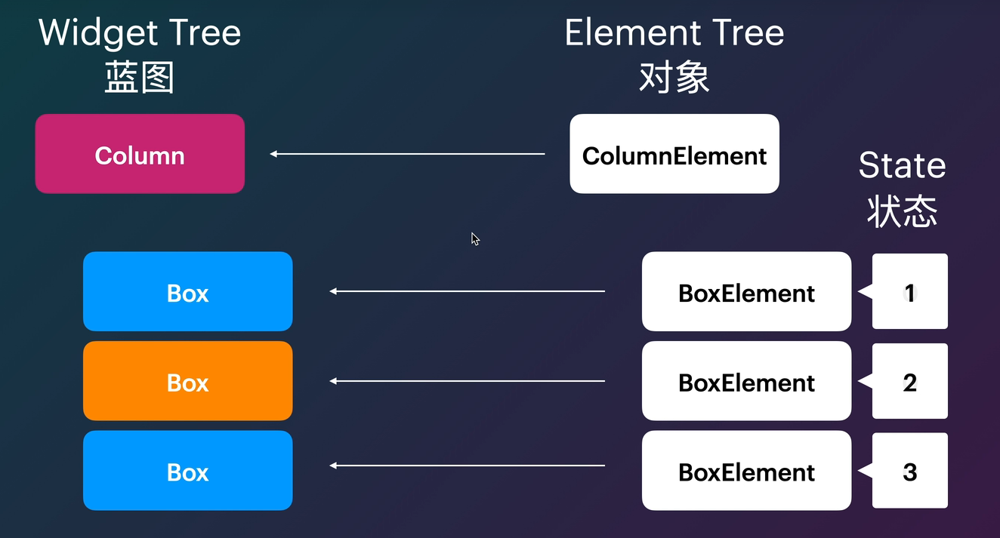

## **AnimatedList 实现动态列表**

 AnimatedList 和 ListView 的功能大体相似，不同的是， AnimatedList 可以在列表中插入或删除节点 

时执行一个动画，在需要添加或删除列表项的场景中会提高用户体验。 

## Flutter 组件间通信

### 回调通信

需求“点击子组件，修改父组件的背景颜色与子组件背景颜色一致”

使用场景：一般用于子组件对父组件传值。

### InheritedWidget 数据共享

场景：业务开发中经常会碰到这样的情况，多个Widget需要同步同一份全局数据，比如点赞数、评论数、夜间模式等等。

使用场景 一般用于父组件对子组件的跨组件传值。

### Global Key通信

GlobalKey能够跨Widget访问状态。

需求“点击A子组件，修改B子组件的背景颜色为指定的‘蓝色”

使用场景：一般用于跨组件访问状态

这个在我们的设置界面中有用到，设置界面首页有很多设置项。其中点击一个设置项就会弹出具体的设置项的界面。这就涉及到父组件与子组件的通信

```Java
class _SettingsPanelState extends State<SettingsPanel> {
  final GlobalKey<NavigatorState> _navigatorKey = GlobalKey<NavigatorState>();

  @override
  Widget build(BuildContext context) => WillPopScope(
        onWillPop: () async => !await _navigatorKey.currentState!.maybePop(),
        child: Scaffold(
          backgroundColor: Colors.transparent,
          body: RightPanelDialog(
            width: 350,
            child: Navigator(
              key: _navigatorKey,
              initialRoute: widget.initialRoute ?? SettingsPanelPage.routeName,
              observers: [if (kReleaseMode) FirebaseAnalyticsObserver(analytics: FirebaseAnalytics.instance)],
              onGenerateRoute: (settings) {
                switch (settings.name) {
                  case SettingsPanelPage.routeName:
                    return MaterialPageRoute(builder: (_) => SettingsPanelPage());
                  case WallpaperPanelPage.routeName:
                    return MaterialPageRoute(builder: (_) => WallpaperPanelPage());
                  case UnsplashPanelPage.routeName:
                    return MaterialPageRoute(builder: (_) => UnsplashPanelPage());
                  case GradientPanelPage.routeName:
                    return MaterialPageRoute(builder: (_) => GradientPanelPage());
                  case ApplicationsPanelPage.routeName:
                    return MaterialPageRoute(builder: (_) => ApplicationsPanelPage());
                  case CategoriesPanelPage.routeName:
                    return MaterialPageRoute(builder: (_) => CategoriesPanelPage());
                  case WallpaperSettingsPanelPage.routeName:
                    return MaterialPageRoute(builder: (_) => WallpaperSettingsPanelPage());
                  case CategoryPanelPage.routeName:
                    return MaterialPageRoute(
                      builder: (_) => CategoryPanelPage(categoryId: settings.arguments! as int),
                    );
                  default:
                    throw ArgumentError.value(settings.name, "settings.name", "Route not supported.");
                }
              },
            ),
          ),
        ),
      );
}
```

### Navigator

1. **页面跳转：**

要实现页面跳转，我们可以使用Navigator.push方法。这个方法接受一个BuildContext对象和一个Route对象作为参数，用于将新的页面路由压入栈中。

代码语言：javascript

```JavaScript
Navigator.push(
  context,MaterialPageRoute(builder: (context) => SecondPage()),);
```

在上面的示例中，我们使用MaterialPageRoute来创建一个新的路由对象，并将其压入栈中。这样就实现了从当前页面跳转到名为SecondPage的新页面。

1. **页面返回：**

要实现页面的返回操作，我们可以使用Navigator.pop方法。这个方法接受一个BuildContext对象作为参数，用于将当前页面对应的路由对象从栈中弹出，返回到上一个页面。

代码语言：javascript

```JavaScript
Navigator.pop(context);
```

在上面的示例中，我们调用Navigator.pop方法，实现了从当前页面返回到上一个页面的操作。

页面路由导航是Flutter应用程序中常见的操作之一，它允许用户在不同的页面之间进行跳转和导航。通过使用Navigator.push和Navigator.pop方法，我们可以实现页面的跳转和返回，从而实现丰富多彩的页面导航体验。

1. **路由参数传递——使用Navigator.pushNamed：**

在Flutter中，我们经常需要在页面之间传递参数，以便在目标页面中使用这些参数进行相关操作。下面我们将探讨如何在页面之间传递参数，并演示如何使用Navigator.pushNamed和RouteSettings来实现路由参数的传递。

```JavaScript
//接受参数
class PageB extends StatelessWidget {
  final String name;
  final int age;

  // 构造函数接收参数
  PageB({required this.name, required this.age});

  @override
  Widget build(BuildContext context) {
    return Scaffold(
      appBar: AppBar(
        title: Text('Page B'),
      ),
      body: Center(
        child: Column(
          mainAxisAlignment: MainAxisAlignment.center,
          children: <Widget>[
            Text('Name: $name'),
            Text('Age: $age'),
          ],
        ),
      ),
    );
  }
}
//传参
// 导入页面B的文件
import 'page_b.dart';

// 在适当的位置触发跳转事件
Navigator.push(
  context,
  MaterialPageRoute(
    builder: (context) => PageB(name: 'John', age: 30),
  ),
);
```

## Flutter 与原生通信

主要有三种方式

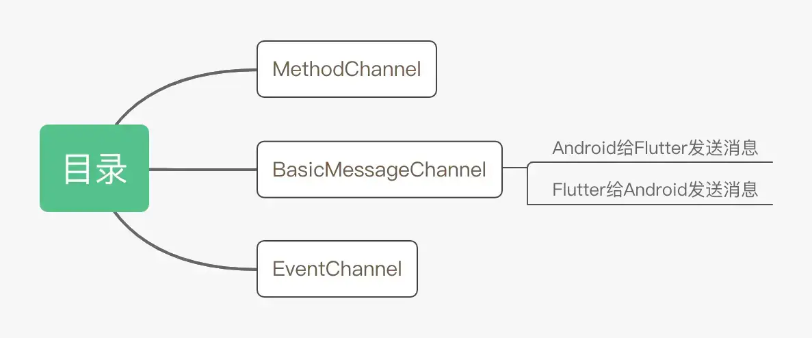

- MethodChannel：用于方法的传递，允许有**返回值**，适用于一次通信
- BasicMessageChannel：用于传递字符串或是半结构化的消息，可持续通信，**双向通信**
- EventChannel：用于**事件流**的发送，可**持续通信**但是不可回复

MethodChannel的使用流程：

① **Flutter 端**：创建 **MethodChannel** 实例 (配置通道名称)，通过 **异步** 调用 **invokeMethod(方法名，参数) 来**调用平台方法，并对平台端的返回结果进行处理。

② **Android 端**：继承 **FlutterActivity**，重写 **configureFlutterEngine()** 在其中注册 **MethodChannel**，对调用的方法名进行判断，读取 **参数** 执行相关操作，然后通过 **result.success()** 返回结果给Flutter端。

## 👍Flutter的渲染

首先，我们Android层代码中会生成一个Surface ， 把这个Surface给到Flutter，Flutter将代码经过虚拟机的解析之后生成UI。跨平台的关键也就在于，这个Surface里面包裹了一个C++ 的Surface 

### 三种树结构

Widget → 对视图的结构化描述，存储视图渲染相关的 配置信息：布局、渲染属性、事件响应等信息。

Element → Widget的实例化对象，承载视图构建的上下文数据，连接Widget到完成最终 渲染 的 桥梁。

RenderObject → 负责实现视图渲染的对象；

### widget

组件层次结构，它由各种Widget组成，它们描述了一个视觉部件的配置和外观。Widget树通过Widget对象的嵌套关系来表示应用程序的布局和结构。

**widget的不变性**：Widget被设计成不可变的 (immutable)。当视图渲染的配置信息发生变化，Flutter会 **重建**Widget树 来进行数据更新。因为不涉及实际渲染位图，所以它只是一个 轻量级 的数据结构，重建成本很低。另外，得益于Widget的 不可变性，可以以较低成本进行 渲染结点(Element) 的 复用，因此在真实渲染树中可能存在 不同Widget对应同一个渲染结点的情况 (多对一)。

### element

Element树是Widget树的实例化表示，它是Flutter框架内部用来管理和维护的数据结构。每个Widget在Flutter运行时都会对应一个Element对象。

### RenderObject树

RenderObject树中的节点负责实际的绘制和布局计算，它们是Flutter渲染引擎的核心。RenderObject树中的节点之间通过父子关系建立了整个UI的渲染层次。

**Flutter的渲染过程**简单分成这三步：

1. 通过 Widget树 生成对应的 Element树；
2. 创建相应的 RenderObject 并关联到 Element.renderObject 属性上；
3. 构建成 RenderObject树，深度优先遍历，确定树中各对象的 位置和尺寸 (布局) ，把它们 绘制 到不同图层上。Skia 在 Vsync信号同步 时直接从渲染树 合成Bitmap，最后交给 GPU渲染；

Element是可复用的，Widget触发重建，Flutter会根据重新前后Widget树的 渲染类型及属性变化情况 决定后续的 复用或新建。

比如：只是调整了一个渲染样式，Flutter会通知Element复用现有节点，只是 同步属性 到RenderObject出发绘制。如果Widget树中涉及到 **Widget类型替换或变更**，Flutter 则会将老的Element及RenderObject **摘除**，让新Widget 重新走一遍创建 Element 和 RenderObject 的流程，挂载到 Element 树和 RenderObject 树上。

StatefulWidget状态改变，Widget是不变的，变化的是与之绑定的State，State的任何更改都会 强制Widget 的 重新构建！！！

**两条编码建议**：

**不要滥用StatefulWidget**！假如父布局是StatefulWidget，其State每调用一次更新UI，**会间接触发所有子View的销毁和重建**。虽然Flutter通过Element层最大程度降低 **对真实渲染视图的修改**，提高了渲染效率。但无法避免大量的Widget对象的销毁和重建，如果某个Widget的重建涉及耗时操作，页面的渲染性能也会急剧下降。不涉及到状态变化的Widget，老老实实用StatelessWidget。

**不要在build()的方法内部进行耗时操作**！除了我们主动通过State刷新UI外，在某些特殊场景下，Widget 的build()有可能会执行多次。

### Flutter的调优

### 速度优化

DevTools有一个界面Performance 可以看到性能，卡顿的是红色一般的是蓝色

优化的方式：

1. 找到耗时的地方 —— 放到子线程
2. 复用： 减少element 的创建，通过key（Local key）

因为元素的生存周期中的挂载Mount和卸载UnMount是很耗费性能的，因此尽量让他处于Active或者DeActive状态

所以有时候可以在组件上加一个key，或者直接用RepaintBoundary包裹

但是注意随意使用Global key可能导致内存泄露

### 内存泄露

什么是内存泄漏？**就是我们写了一些对象，死了之后本来应该回收，但是没有被回收。**

java的内存回收由GC（垃圾回收器）去做，他会判断对象的可到达性，也就是有没有被几种类型的引用所指向：静态变量static、活跃的线程、JNI。这种有用还会传递，就是说一个被判定有用的对象，所包含指向的对象都被判定有用

内存泄露是堆的泄露，栈只会溢出

使用我们设置界面的例子就是：如果子设置项的widget 有一个**定时器、广播监听**没有被正确地停止或者一个**全局变量**没有被置为null。要避免这种情况，确保在页面退出时（例如在`dispose`方法中）及时取消和释放所有不再需要的资源和引用。

Flutter中比如 监听器（如`addListener`），必须在不需要时及时取消订阅或移除监听器。

例如，存在两个A，B界面，A界面通过Navigator.push的方式添加B界面，B界面通过Navigator.pop回退到A。如果B界面因为某些写法的缘故导致B的渲染树虽然被从主渲染树解开后依然无法被释放，这会导致整个原来B的子树都无法释放。

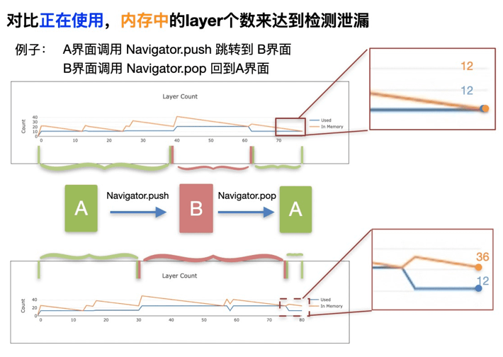

以上次A页面pushB界面，B界面pop回退A界面为例子。正常无内存泄漏的情况下，正在使用的layer个数（蓝色），内存中的layer个数（橙色）两条曲线的虽然有波动，但是最终都会比较贴合。

但是在B页面存在内存泄漏的时候，退到A界面后，B树完全无法释放，内存中的layer个数（橙色）无法最终贴合蓝色曲线（正在使用的layer个数）也就是说，对于渲染而言，如果代码导致Widget树或Element树长时间无法被GC回收，很可能会导致严重的内存泄漏情况。

## 其他细节

final 和 const

const 在编译时定下不可改变，用在一些颜色等值的定义上

final 在运行时定下不可改变

## async、await原理

之所以说async/await是假异步,是因为他在执行过程中并没有开启新的线程更没有并发执行,而是通过单线程上的任务调度(协程,没有并发执行功能)实现的:

## Flutter中的逻辑像素

逻辑像素，也称为设备独立像素（dp），是Flutter用于布局和渲染的虚拟像素单位。确保不同屏幕密度的设备上显示出一致的视觉效果。物理像素通常用px表示，代表设备屏幕上的实际像素。

逻辑像素和物理像素之间的转换：在Flutter中，可以通过设备的像素比例（缩放因子）来进行逻辑像素和物理像素之间的转换。以下是转换的方法：

```Java
double 物理像素 = 逻辑像素 * MediaQuery.of(context).devicePixelRatio;
```

安卓中也有：sp px dp

px:其实就是像素单位，比如我们通常说的手机分辨列表800*400都是px的单位

sp：同dp相似，还会根据用户的字体大小偏好来缩放，**用于定义文本大小**。

dp：虚拟像素，在不同的像素密度的设备上会自动适配，**非文本 UI 元素的尺寸**。

## Flutter中的黄色斑马线（溢出指示器）

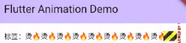

给溢出的Text 套个 Expanded 或 Flexible 就能解决这个问题，或者用 Wrap 代替 Row，太长显示不全，它会自动换行。