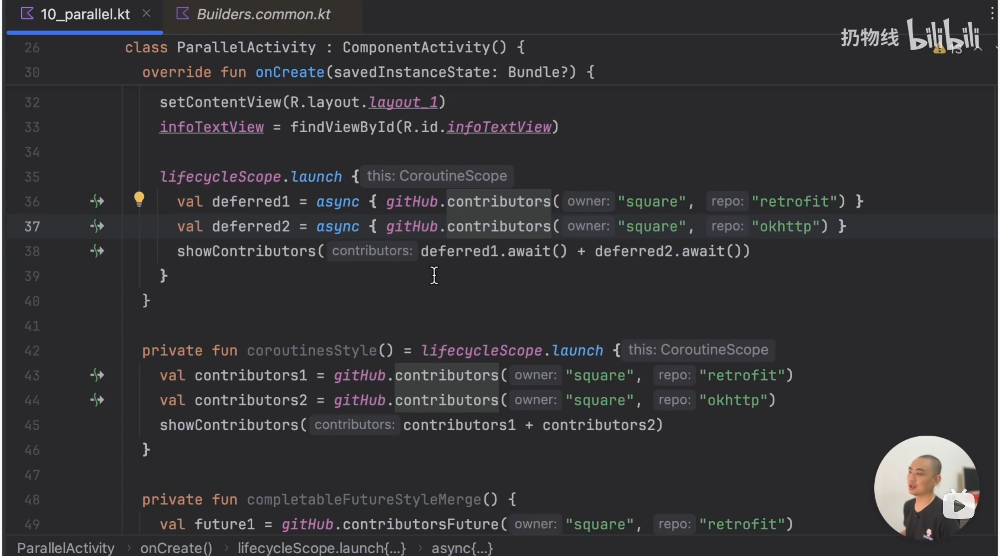

# kotlin协程

推荐课程：

[你能听懂的Kotlin协程课，跟老司机学，不用自己瞎折腾](https://www.bilibili.com/video/BV1uo4y1y7ZF/?spm_id_from=333.337.search-card.all.click&vd_source=ec0e5977fe9a22b2ec5f18b49a4bed7c)

## 协程的概念

定义：轻量级线程

为什么说轻量，官方举了一个例子，开启五万个协程和五万个线程打印五万个点，协程轻松完成，线程会内存溢出。这是因为使用了runblock 将五万个线程放在同一个线程上执行。而线程会老老实实开五万个线程。

协程的delay也比线程的sleep更有优势，因为sleep会让线程卡主啥也不做，而delay会让出线程

作用：

处理耗时任务，这种任务常常会阻塞主线程。用看起来同步的方式写出异步的代码，帮你优雅的处理回调。

保证主线程安全，即确保安全地从主线程调用任何suspend函数。

创建协程的三种方式

1. 使用 runBlocking 顶层函数创建：

```JavaScript
runBlocking {
    ...
}
```

1. 使用 GlobalScope 单例对象创建

```JavaScript
GlobalScope.launch {
    ...
}
```

1. 自行通过 CoroutineContext 创建一个 CoroutineScope 对象

```JavaScript
val coroutineScope = CoroutineScope(context)
coroutineScope.launch {
    ...
}
```

方法一通常适用于单元测试的场景，而业务开发中不会用到这种方法，因为它是线程阻塞的。

方法二和使用 runBlocking 的区别在于不会阻塞线程。但在 Android 开发中同样不推荐这种用法，因为它的生命周期会只受整个应用程序的生命周期限制，且不能取消。

方法三是比较推荐的使用方法，我们可以**通过 context 参数去管理和控制协程的生命周期**（这里的 context 和 Android 里的不是一个东西，是一个更通用的概念，会有一个 Android 平台的封装来配合使用）。

```JavaScript
fun main() = runBlocking {
    val job = launch {
        repeat(1000) { i ->
            println("job: test $i ...")
            delay(500L)
        }
    }
    delay(1300L) // 延迟一段时间
    println("main: ready to cancel!")
    job.cancel() // 取消该作业
    job.join() // 等待作业执行结束
    println("main: Now cancel.")
}
```

可以使用withTimeout(300) {}

### 常见的使用

1. 使用jetpack提供好的lifecycleScope，

LifecycleScope，顾名思义，具有生命周期的协程。生命周期和当前组件一样，指定的主线程

大部分协程都是这么写的，在LifecycleScope或者viewmodlescope里面执行挂起函数

### 挂起函数

1. *launch*{   }

这是并行的线程切换，换言之，如果在协程中再*launch*一个，这个协程的代码会直接执行下一行

如果要下一行代码等着，就要使用withContext

这里说的是*launch*里面+*launch*

单独的lunch里面是串行执行挂起函数的

1. withConetxt{   }

这是串行的切换现场，也就是会等待上一个挂起函数的执行。

因此协程的*launch*模块里面可以做到挂起函数在指定线程中执行，某些函数在主线程中执行

### 协程的挂起

当协程代码块执行的时候遇到suspend挂起函数时，会将当前的挂起函数脱离当前线程，放到调度器指定的线程里面去执行。此时协程之外的代码也会正常执行。当挂起函数执行完毕之后，协程剩下的代码块又会自动返回之前的线程里面去执行。

所以所谓的挂起，其实就是稍后会被切回来的线程切换，这个切回来的动作叫做resume恢复。挂起操作其实靠的是代码中的调用的其他的挂起函数而不是suspend关键字

suspend关键字的作用就是提醒这是一个耗时操作，协程通过挂起函数的形式把耗时任务切换线程的工作交给了函数的创建者而不是调用者，因为调用函数不用考虑要怎么切换线程，只需要把这个函数放到协程里面去执行就可以了

### 内存泄露

如果某一个已经销毁的Activity的某一个变量，被一个活跃的进程所指向，那么就不会被GC判定为没用，不会被回收造成内存泄露。但是当活跃进程结束之后，内存泄露也就结束了。

举个简单的例子。我有一个耗时操作有网络请求，会根据请求结果调整UI。如果请求到一半用户关掉了界面，网络请求就没用了。但是还是会继续执行，然后因为网络请求里面引用了界面UI，所以这个Activity对象也不会被回收。直到网络请求结束。

解决方法就是在onDestory里面取消掉网络请求

我们的onDestory里面会自动调用LifecycleScope.cancel()取消所有协程，实现生命周期一致，且是一对多的取消

### 结构化并发

协程的结构化并发其实就是一层层协程的管理：并发，串行

### 调优

1. 并行协程

也就是如果我要执行多个耗时操作，而且后续操作需要同时用到这些耗时操作的返回值

那么就可以写两个并行的协程。节约时间

