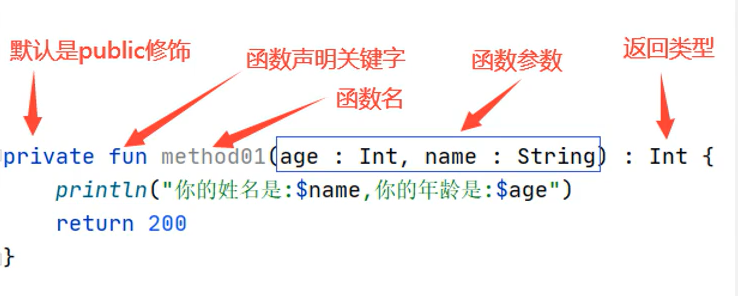
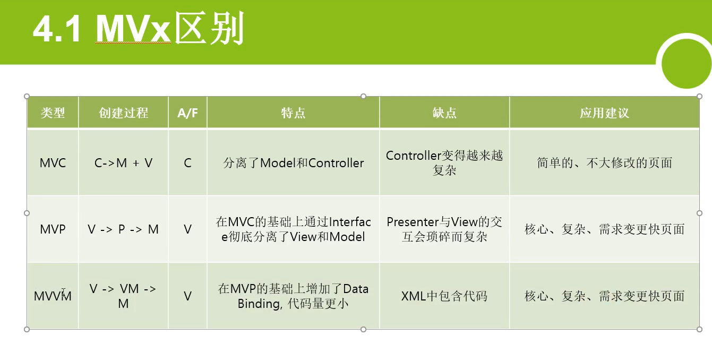

# Kotlin 基础语法笔记

## 基础

### 内置数据类型

string   字符申

Char   单字符

Boolean  true/false

Int   整形

Double   小数

List   集合

Set   无重复的元素集合

Map   键值对的集合

kotlin 里面都是引用类型了，没有基本类型了，但是在字节码里面会转换成java的基本类型的。

### 变量

只读变量：val

可变变量：var  random

> 推荐：默认将所有的变量声明为val，特殊的需要改变的，才声明为var

声明变量时不用指定类型，可以自动识别

字符串模板：${customers}

基本类型：声明变量时可以指定其类型

```C
val e: String = "hello"
```

Kotlin中的类型都是大写的：`Byte，Short，Int，Long`，`UShort，UInt，ULong`，`Float，Double`，`Boolean`，`Char`，`String`

### 类型推断

就是定义变量的时候不必强行指定变量类型，赋值了比编译器会自己推断

### 编译时常量

kotlin里面的常量是编译时常量了

编译时常量只能是常用的基本数据类型：(String,Double,Int,Float,Long,Short,Byte,Char,Boolean）

const关键词现在是限定编译时常量，也就是 编译的时候就必须指定。

```Java
//TODO 这里是可以写一些常量的
const val HelloString = "Hello World"
class kotlinTest {
    //const val ABC = "ABC"
//这里不能创建常量，因为编译时常量只能在函数之外定义，如果在函数之内定义，就必须在运行时才能调用函数赋值，何来编译时常量一说
}
```

### 字符串模板String

使用${变量名}来表示变量

```Java
const val HelloString = "Hello World"
class kotlinTest {
    val login =  true;

 fun main(args: Array<String>) {
     //kotlin的if语句是表达式，可以有返回值
     println("结果是 ${if (login) "登录成功" else "登录失败"} ");
 }

}
```

### TODO的作用

`TODO` 是一个非常有用的占位符函数，它表示某个功能或代码片段尚未实现。`TODO` 可以让你在开发过程中快速标记出未完成的部分，并在编译时得到提示，从而不会忘记去实现这些部分。

`TODO` 函数可以接受一个可选的字符串参数，通常用来描述为什么这个部分尚未实现或者需要实现的内容，如果不传递任何参数，`TODO` 也会抛出 `NotImplementedError` 异常，但不会有额外的描述信息

```Java
fun show(number: Int) {
    when(number) {
        -1 -> TODO("没有种分数")
        in 0..59 -> println("不及格")
        in 60..69 -> println("及格")
        in 70..79 -> println("中等")
        in 80..89 -> println("良好")
        in 90..100 -> println("优秀")
        else -> println("输入错误")
    }
}

fun main() {
    show(-1)
}
```

在运行这段代码时，程序会抛出一个 `NotImplementedError` 异常，并显示传递给 `TODO` 的信息：

除了 `TODO` 函数，Kotlin 也支持在注释中使用 `TODO` 标记，这种标记不会影响编译和运行，只是用来提示开发者：

```Java
// TODO: Refactor this function to improve performance
fun someFunction() {
    // Function implementation
}
```

### 反引号 ` 的作用

场景一：需要使用中文作为函数名

```Java
fun `来吧展示`(number: Int) {
    when(number) {
        -1 -> TODO("没有种分数")
        in 0..59 -> println("不及格")
        else -> println("输入错误")
    }
}

fun main() {
    来吧展示(100)
}
```

场景二：想要使用的方法名恰好是关键字，比如'in'  'is'

```Java
fun `in`() {
    println("in")
}

fun main() {
    `in`()
}
```

### ==与===操作符

**`==`** **操作符用于比较两个对象的内容，而** **`===`** **操作符用于比较两个对象的引用。**

因此，对于普通类来说，默认的 `==` 操作符会调用 `equals` 方法，而不是直接比较引用。

注意在比较字符串的情形，Kotlin 对字符串进行了特别处理。同的字符串字面量引用同一个实例。然而，即使字符串字面量引用同一个实例，`==` 操作符依然会基于内容进行比较。

`==` 操作符用于值比较

`===` 操作符用于引用比较

下面两个例子都是字符串的例子。

1. `==` 操作符用于比较对象的内容是否相等，它是一种结构化的相等性检查。

```Kotlin
val str1 = "hello" val str2 = "hello" val str3 = "HELLO".toLowerCase()
println(str1 == str2) // 输出: true，因为字符串内容相同
println(str1 == str3) // 输出: true，因为忽略大小写后字符串内容相同
```

1. `===` 操作符用于比较两个对象的引用是否相等，它是一种引用相等性检查。

```Kotlin
val str1 = "hello" val str2 = "hello" val str3 = str1
println(str1 === str2) // 输出: false，因为 str1 和 str2 是两个不同的对象
println(str1 === str3) // 输出: true，因为 str3 引用的是 str1 所指向的对象
```

### `toInt()` 和 `toIntOrNull()`

1. `toInt()` 方法用于将字符串转换为整数类型，如果字符串无法转换为整数，会抛出 `NumberFormatException` 异常。
2. `toIntOrNull()` 方法也用于将字符串转换为整数类型，但是当字符串无法转换为整数时，会返回 `null` 而不是抛出异常。

因此建议大家以后使用类型转换都用`toIntOrNull()` ，但是这样会导致我们接受的比变量必须是可空变量，因此我们可以采取`?:`的方式添加默认值让我们可以赋值给不可空变量

```Java
fun main() {
    val str1 = "123"
    val str2 = "abc"
    val num1: Int? = str1.toIntOrNull()
    //使用?:运算符，如果str2.toIntOrNull()为null，则返回2222
    val num2: Int = str2.toIntOrNull()?:2222
    println(num1) // 输出: 123
    println(num2) // 输出: null
}
```

### filed关键字

当你为属性定义自定义的 getter 或 setter 时，Kotlin 允许你访问和修改属性的值。为了避免无限递归调用（即，getter 或 setter 自己调用自己），Kotlin 提供了 `field` 关键字来直接引用属性的幕后字段。

```Java
class Person {
    var name: String = "Unknown"
        get() = field.toUpperCase() // 自定义 getter，将 name 转换为大写
        set(value) {
            if (value.isNotEmpty()) {
                field = value // 使用 field 关键字引用幕后字段
            }
        }
}

fun main() {
    val person = Person()
    println(person.name) // 输出：UNKNOWN

    person.name = "John"
    println(person.name) // 输出：JOHN

    person.name = ""
    println(person.name) // 输出：JOHN（由于空字符串被忽略，值保持不变）
}
```

就算你不定义自己的getter 或 setter kotlin也会提供默认的getter 或 setter

### open关键字

`open` 关键字用于修饰类和方法，表示该类可以被继承，或该方法可以被重写。**默认情况下，****Kotlin** **中的类和方法都是** **`final`** **的，不能被继承或重写。**这与 Java 不同，在 Java 中的类和方法默认是可继承和可重写的。

`open` 修饰类：当一个类被 `open` 修饰时，意味着这个类可以被其他类继承。没有 `open` 修饰的类是不可继承的。

`open` 修饰方法：当一个方法被 `open` 修饰时，意味着这个方法可以在子类中被重写（override）。没有 `open` 修饰的方法是不可重写的。

## 集合**Collections**

### List（有序可重复集合）

**创建：**

只读：listOf

可变：mutableListOf

可以指定类型也可以不指定

```C
这是只读类型
val readOnlyShapes = listOf("triangle", "square", "circle")
println(readOnlyShapes)
这是可变List
val shapes: MutableList<String> = mutableListOf("triangle", "square", "circle")
println(shapes)
```

注意：这里两个List变量都使用val ，但是MutableList仍可以改变内部的值，而List不可以。前面是var还是val不影响内部值能否改变。这里的val是代表这个地址值不可以重新赋值一个新的数组。

> 推荐：将可变List赋值给只读的List来防止不必要的修改（casting）

```C
val shapes: MutableList<String> = mutableListOf("triangle", "square", "circle")
val shapesLocked: List<String> = shapes
```

**访问：** 

List通过索引访问

```C
println("The first item in the list is: ${readOnlyShapes[0]}")
```

这里为了防止下表月结错误可以通过防止崩溃的取值方式，开发过程中，尽量使用getorElse或getorNull,才能体现KT的亮点

```Java
println(shapesLocked.getOrNull(2))  
```

访问首项和末项： `.first（）` 和 `.last（）`

```C
println("The first item in the list is: ${readOnlyShapes.first()}")
```

获取列表中的项目数，请使用 `.count（）` 函数：

```C
${readOnlyShapes.count()}
```

查询某个项是否在列表中使用in：

```C
println("circle" in readOnlyShapes)
// true
```

添加和删除：`.add（）` 和 `.remove（）`

```C
shapes.add("pentagon") 
shapes.remove("pentagon") 
shapes += "octagon"
shapes -= "circle"
```

注意：这里这两个方法会返回一个bool值表示是否操作成功，删除的空缺会自动补上，增加默认加在最后。很像一个智能化的链表。

### Set（无序不可重复集合）

#### **创建只读** **`Set`**

```Kotlin
val fruits = setOf("Apple", "Banana", "Cherry")
println(fruits) // 输出: [Apple, Banana, Cherry]
```

#### **创建可变** **`Set`**

```Kotlin
val mutableFruits = mutableSetOf("Apple", "Banana", "Cherry")
println(mutableFruits) // 输出: [Apple, Banana, Cherry]
```

### **`Set`** **的常用操作**

#### **添加和删除元素（仅** **`MutableSet`****）**

```Kotlin
val mutableFruits = mutableSetOf("Apple", "Banana", "Cherry")
mutableFruits.add("Durian")
println(mutableFruits) // 输出: [Apple, Banana, Cherry, Durian]
mutableFruits.remove("Banana")
println(mutableFruits) // 输出: [Apple, Cherry, Durian]
```

#### **检查元素是否存在**

```Kotlin
val fruits = setOf("Apple", "Banana", "Cherry")
println("Banana" in fruits) // 输出: true
println("Durian" in fruits) // 输出: false
```

#### **遍历** **`Set`**

```Kotlin
val fruits = setOf("Apple", "Banana", "Cherry")
for (fruit in fruits) {
    println(fruit)
}
// 输出:// Apple// Banana// Cherry
```

#### **集合操作：并集、交集、差集**

```Kotlin
val set1 = setOf("Apple", "Banana", "Cherry")
val set2 = setOf("Banana", "Cherry", "Durian")

val union = set1 union set2
println(union) // 输出: [Apple, Banana, Cherry, Durian]val intersection = set1 intersect set2
println(intersection) // 输出: [Banana, Cherry]val difference = set1 subtract set2
println(difference) // 输出: [Apple]
```

#### Map（键值对）

创建：

只读：`mapOf`

可变：`mutableMapOf`

键值对之间的关联用`to`

```C
val readOnlyJuiceMenu = mapOf("apple" to 100, "kiwi" to 190, "orange" to 100)
println(readOnlyJuiceMenu)
```

> 推荐将可变map赋值给只读map防止意外性改变

获取数量： `.count（）`

检查是否在集合中： `.containsKey()` 这里面传入的参数是key

检查键值是否在映射中，使用`in`运算符

```C
println("orange" in readOnlyJuiceMenu.keys)
// true
println(200 in readOnlyJuiceMenu.values)
// false
```

`containsKey`就只能检查key，而in可以检查键和值。

增减：`.put（）` 和 `.remove（）`

```C
val juiceMenu: MutableMap<String, Int> = mutableMapOf("apple" to 100, "kiwi" to 190, "orange" to 100)
juiceMenu.put("coconut", 150) 
juiceMenu.remove("orange")    
```

## 解构语法

### **数据类解构**

数据类自动生成 `componentN` 方法，使得可以直接解构其属性：

```Kotlin
data class Person(val name: String, val age: Int)

val person = Person("Alice", 25)
val (name, age) = person
println("Name: $name, Age: $age")
```

### **集合解构**

在处理 `Map` 集合时，可以使用解构声明来提取键和值：

```Kotlin
val map = mapOf("key1" to "value1", "key2" to "value2")
for ((key, value) in map) {
    println("Key: $key, Value: $value")
}
```

对于列表，也可以使用解构声明来提取元素：

```Kotlin
val list = listOf("first", "second", "third")
val (first, second, third) = list
println("First: $first, Second: $second, Third: $third")
```

## 过滤元素

Kotlin 提供了丰富的集合操作函数，可以轻松过滤集合中的元素。常用的过滤函数包括 `filter`、`filterNot`、`filterIndexed`、`filterNotNull` 等。

### **`filter`**

`filter` 函数根据给定的条件过滤集合中的元素，返回满足条件的元素列表：

```Kotlin
val numbers = listOf(1, 2, 3, 4, 5, 6)
val evenNumbers = numbers.filter { it % 2 == 0 }
println(evenNumbers) // 输出: [2, 4, 6]
```

### **`filterNot`**

`filterNot` 函数与 `filter` 相反，返回不满足条件的元素列表：

```Kotlin
val oddNumbers = numbers.filterNot { it % 2 == 0 }
println(oddNumbers) // 输出: [1, 3, 5]
```

### **`filterIndexed`**

`filterIndexed` 函数根据元素的索引和值过滤集合：

```Kotlin
val filtered = numbers.filterIndexed { index, value -> index % 2 == 0 && value > 2 }
println(filtered) // 输出: [3, 5]
```

### **`filterNotNull`**

`filterNotNull` 函数过滤掉集合中的 null 元素：

```Kotlin
val mixedList = listOf(1, null, 2, null, 3)
val nonNullList = mixedList.filterNotNull()
println(nonNullList) // 输出: [1, 2, 3]
```

## **Control flow控制语句**

### if表达式

`if(){}`，格式不变，最大的不同是Kotlin中的if现在是一个表达式了，而不是一个语句

并且Kotlin里面现在也没有三元运算符了，改成了使用if语句

```C
println(if (a > b) a else b) 
```

但是，当if被用作表达式的时候一定必须有else，除非你列举出了所有的可能性

### When表达式（替代以前的Switch使用）

```C
val obj = "Hello"

when (obj) {  
    "1" -> println("One")
    "Hello" -> println("Greeting")
    else -> println("Unknown")     
}
```

When 的花括号里面现在只有一条语句会被执行

when被用作表达式时也必须有else

### Ranges范围表达式

Int和Char可以使用Ranges表达式

递增：`1..4`   意味着 `1, 2, 3, 4`

开集递增：`1..<4 `意味着 `1, 2, 3`

递减：`4 downTo 1 `意味着` 4, 3, 2, 1`

等差数列： `1..5 step 2` 意味着 `1, 3, 5`

### For

现在是使用in的方式循环了

```C
for (number in 1..5) { 
    // number is the iterator and 1..5 is the range
    print(number)
}
```

集合也可以通过迭代器迭代：

```C
val cakes = listOf("carrot", "cheese", "chocolate")

for (cake in cakes) {
    println("Yummy, it's a $cake cake!")
}
```

### While

仍然是分为`while（）{} `和 `do{}while（）`两种

## 函数

kotlin的函数和java有些许不同



变量在前，类型在后，最后还有返回类型。和java一样不写修饰符就默认是Public

### 函数的默认参数

函数可以指定默认参数

```Java
fun main() {
    action01("SUZHE", 67)
    action02("SUZHE")
    action03()
}

private fun action01(name: String, age: Int) {
    println("name: $name, age: $age")
}
private fun action02(name: String, age: Int = 18) {
    println("name: $name, age: $age")
}
private fun action03(name: String = "SUZHE", age: Int = 67) {
    println("name: $name, age: $age")
}
===
name: SUZHE, age: 67
name: SUZHE, age: 18
name: SUZHE, age: 67
```

### 具名函数的参数-可以指定传哪个参数

简单来说就是kotlin允许你使用函数传参的时候指定参数的具体参数名，顺序可以打乱

```Java
fun main() {
    action01("SUZHE", 67)
    action02("SUZHE")
    action03()
    action03(age = 24, name = "charming")
}
```

### Unit函数的特点-函数返回值

在Kotlin中，`Unit`是一个类，并且是一个单例。它只有一个实例，可以通过`Unit`引用。`Unit`类型的函数实际上返回的是这个单例实例。

定义一个返回`Unit`的函数：

```Java
fun greet(name: String): Unit {
    println("Hello, $name")
}
```

在Kotlin中，如果函数没有返回类型或者返回类型是`Unit`，可以省略`Unit`类型声明。

### **为什么将Java中的****`void`****换成****`Unit`**

Kotlin选择使用`Unit`代替Java中的`void`有几个重要原因：

1. 一致性：在Kotlin中，所有的函数都有返回类型。即使函数不返回有意义的值，它也返回`Unit`。这使得语言设计更加一致，没有特殊情况需要处理。
2. 表达能力：`Unit`是一个对象，可以作为泛型参数传递。例如，在处理高阶函数时，`Unit`可以用于明确表示不需要返回值的函数类型：

```Java
val printMessage: (String) -> Unit = { message ->
    println(message)
}
======================
1. val printMessage: (String) -> Unit：声明了一个变量 printMessage，它是一个函数类型的变量
2. (String) -> Unit：函数类型，表示这个函数接受一个 String 类型的参数，并且没有返回值
3. "="：将Lambda表达式 { message -> println(message) } 赋值给变量 printMessage。
4.  message -> println(message) 的含义是接受一个String 参数并打印出来。
```

1. 函数式编程：`Unit`作为一个值，可以在函数式编程中更灵活地使用。例如，它可以与其他类型一起使用在数据流中，而不需要引入特殊的void类型。

以下是一个使用高阶函数和`Unit`的示例：

```Java
fun performOperation(operation: () -> Unit) {
    println("Starting operation...")
    operation()
    println("Operation completed.")
}
===============
1. operation 是一个参数名。
2. () 表示 operation 是一个没有参数的函数。
3. -> Unit 表示这个函数没有返回值。
4. 至于后面的大括号是函数的具体内容，打印语句，执行传入的函数参数，打印语句。
===============
fun main() {
    performOperation {
        println("Performing an important task.")
    }
}
==============
1. 在Kotlin中，如果一个函数的最后一个参数是一个函数类型，可以将该函数类型的参数写在函数调用括号之外的花括号中。这种语法叫做Lambda with Receiver，使得代码看起来更加简洁和易读。
2. 这里给performOperation 这个函数传入了一个输出语句作为参数，这个参数就是performOperation函数定义中的operation参数，
```

### 高阶函数-函数类型变量与返回值

Kotlin支持高阶函数，也就是可以接受函数类型变量作为参数或者返回函数类型变量的函数。

```Java
// 高阶函数，接受一个函数类型变量作为参数
fun performOperation(operation: (Int, Int) -> Int, a: Int, b: Int): Int {
    return operation(a, b)
}

fun main() {
    // 定义一个加法操作的函数类型变量
    val add: (Int, Int) -> Int = { x, y -> x + y }

    // 使用高阶函数
    val result = performOperation(add, 3, 4)
    println(result)  // 输出：7
}
```

### 函数类型变量

函数类型变量在Kotlin中是一个强大的特性，它允许你将函数作为一等公民对待，可以将它们赋值给变量、传递给其他函数、或者作为函数的返回值。

```Java
例子：展示函数作为一个变量

// 定义一个函数类型变量，没有参数，返回Unit
val noArgs: () -> Unit = { println("No arguments") }

// 定义一个函数类型变量，接受一个Int参数，返回Unit
val oneArg: (Int) -> Unit = { num -> println("Number: $num") }

// 定义一个函数类型变量，接受两个Int参数，返回Int
val twoArgs: (Int, Int) -> Int = { a, b -> a + b }
```

定义好函数类型变量后，可以像调用函数一样使用它们：

```Java
例子：展示函数作为参数传递
fun main() {
    noArgs()          // 输出：No arguments
    oneArg(5)         // 输出：Number: 5
    println(twoArgs(3, 4))  // 输出：7
    println(twoArgs)        // 输出：(kotlin.Int, kotlin.Int) -> kotlin.Int
}
这里twoArgs变量必须接受参数，由于返回值是Int所以要手动输出。
```

这里再展示一下定义函数类型变量的几种方式：

```Java
例子：定义函数类型变量的几种方式

#Lambda表达式-参数名字写在后面
val sum1: (Int, Int) -> String = { a, b -> "a + b = ${a+b}" }

#Lambda表达式-参数名字写在前面,可以使用类型推断把返回值省略掉
val sum2 = { a: Int, b: Int -> "a + b = ${a+b}" }

#使用fun关键字，匿名函数的方式
val sum3 = fun(a: Int, b: Int): String {
    return "a + b = ${a+b}"
}
```

### 匿名函数-没有名称的函数

在 Kotlin 中，匿名函数是一种没有名字的函数，通常用于需要传递函数作为参数的场景。匿名函数类似于 lambda 表达式，但它有自己独特的语法和特性。匿名函数可以访问函数作用域中的变量，并且可以包含复杂的逻辑。

匿名函数有一个很显著的特点就是有一对大括号，而且是一个**函数类型变量**。

**匿名函数属于lambda**

```Java
//函数声明，无参数，返回值为String
val runit : () -> String
//实现函数的具体内容
runit = {
//注意：匿名函数不要写return,最后一行就是返回值
    "hello"
}
//使用函数
println(runit())
========

上面的代码可以简化成：
val runit : () -> String = {
    "hello"
}
```

注意返回值

```Java
val weekResultMethod = { week: Int ->
    when(week) {
        1 -> "星期一"
        2 -> "星期二"
        3 -> "星期三"
        4 -> "星期四"
        5 -> "星期五"
        6 -> "星期六"
        7 -> "星期日"
        else -> -1
    }
}
当你的返回值既有String也有Int时，函数的返回值就会变成Any 
```

### 内联函数-使用lanmbda作为参数要内联

在 Kotlin 中，内联函数（inline function）是一种特殊的函数，可以通过 `inline` 关键字来修饰。内联函数在编译时会将函数的调用代码替换为函数的实际代码，从而减少函数调用的开销，提升性能。

只要你在函数里面使用了**lambda作为参数**，就**应该使用内联**。如果不使用内联则会在调用端生产多个对象来完成对lambda的调用，造成性能损耗。使用了就会想C++的#defind一样做宏替换

```Java
fun main() {
    performOperation(5) { value ->
        println("Operation performed with value: $value")
    }
}

inline fun performOperation(value: Int, operation: (Int) -> Unit) {
    println("Before operation")
    operation(value)
    println("After operation")
}
```

仔细看这个例子，performOperation函数接受两个参数，Int值和函数参数，在main函数中，传入的函数参数使用lambda表达式，从而performOperation的小括号里面只传了一个参数，因为另一个已经在大括号里面了。

切记，要加这个inline修饰符哈

如果要传入的函数参数有两个的情形要这样写：

```Java
fun main() {
    performOperation(5, 
        operation1 = { value -> 
            println("Operation1 performed with value: $value") 
        },
        operation2 = { value -> 
            println("Operation2 performed with value: $value") 
        }
    )
}

inline fun performOperation(value: Int, operation1: (Int) -> Unit, operation2: (Int) -> Unit) {
    println("Before operations")
    operation1(value)
    operation2(value)
    println("After operations")
}
```

### 函数型变量作为函数参数-函数引用

函数引用其实指的是在你要传入函数参数的时候，**如果不使用lambda表达式**要怎么去做。

直接写函数名是不行的，因为你需要把普通函数变成函数类型的对象，这时只需要在**函数名前面加一个冒号**就可以了。

```Java
fun main() {
    performOperation(5, ::printValue) 
}

fun printValue(value: Int) {
    println("Value is: $value")
}

fun performOperation(value: Int, operation: (Int) -> Unit) {
    println("Before operation")
    operation(value)
    println("After operation")
}
```

###  函数型变量作为函数返回类型

```Java
// 定义一个返回函数的函数，它返回一个将两个整数相加的函数
fun getSumFunction(): (Int, Int) -> Int {
    // 返回一个 lambda 表达式，表示将两个整数相加
    return { a, b -> a + b }
}

// 定义一个返回函数的函数，它返回一个将两个整数相减的函数
fun getSubtractFunction(): (Int, Int) -> Int {
    // 返回一个匿名函数，表示将两个整数相减
    return fun(a: Int, b: Int): Int {
        return a - b
    }
}

fun main() {
    // 获取一个相加函数
    val sumFunction = getSumFunction()
    // 使用相加函数
    println("Sum: ${sumFunction(2, 3)}")  // 输出: Sum: 5

    // 获取一个相减函数
    val subtractFunction = getSubtractFunction()
    // 使用相减函数
    println("Subtract: ${subtractFunction(5, 2)}")  // 输出: Subtract: 3
}
```

### 回顾-Java中实现传入函数参数的方式-接口

在 Java 中，虽然没有像 Kotlin 那样直接支持函数类型，但可以通过接口和匿名类实现类似的功能。下面是一个示例，演示如何使用匿名类和具名类作为函数参数传递。

```Java
// 定义一个接口，表示一个操作
interface Operation {
    int apply(int a, int b);
}

// 定义一个类，包含一个可以接受Operation作为参数的方法
class Calculator {
    public int performOperation(int a, int b, Operation operation) {
        return operation.apply(a, b);
    }
}

public class Main {
    public static void main(String[] args) {
        Calculator calculator = new Calculator();

        // 使用匿名类传递操作
        Operation add = new Operation() {
            @Override
            public int apply(int a, int b) {
                return a + b;
            }
        };
        
        // 调用方法并传递匿名类
        int sum = calculator.performOperation(5, 3, add);
        System.out.println("Sum: " + sum); // 输出: Sum: 8


        // 使用具名类传递操作
        Operation subtract = new SubtractOperation();

        // 调用方法并传递具名类
        int difference = calculator.performOperation(5, 3, subtract);
        System.out.println("Difference: " + difference); // 输出: Difference: 2
    }
}

// 定义一个具名类，实现Operation接口
class SubtractOperation implements Operation {
    @Override
    public int apply(int a, int b) {
        return a - b;
    }
}
```

1. 定义接口 `Operation`：
   1. `Operation` 接口有一个方法 `apply`，它接受两个 `int` 参数并返回一个 `int`。
2. 定义类 `Calculator`：
   1. `Calculator` 类有一个方法 `performOperation`，它接受两个 `int` 参数和一个 `Operation` 实例，调用 `Operation` 的 `apply` 方法进行计算。
3. 在 `Main` 类中使用匿名类和具名类：
   1. 创建 `Calculator` 的实例。
   2. 使用匿名类实现 `Operation` 接口，并实现 `apply` 方法来进行加法操作。
   3. 使用具名类 `SubtractOperation` 实现 `Operation` 接口，并实现 `apply` 方法来进行减法操作。
   4. 调用 `performOperation` 方法，传递匿名类和具名类，分别进行加法和减法操作。

## 可空类型和安全调用操作符

处理可空类型（nullable types）和避免空指针异常（NullPointerException）是语言设计的重要方面。Kotlin 提供了多种工具和操作符来增强代码的可控性和安全性，特别是对待可空类型时的处理。所以kotlin不容易出现空指针异常。

在 Kotlin 中，类型系统区分了可空类型和不可空类型。通过在类型后加 `?` 表示可空类型。

```Java
val nonNullable: String = "Hello"  // 这是一个不可空类型
val nullable: String? = null       // 这是一个可空类型
```

### 安全调用操作符 `?.`

安全调用操作符 `?.` 可以用于在访问一个可能为空的对象的属性或方法时，自动检查对象是否为 `null`，如果为 `null`，则返回 `null`，否则返回调用的结果。

```Java
val length: Int? = nullable?.length  // 如果 nullable 为 null，则 length 也为 null
```

### Elvis 操作符 `?:` 也叫空合并操作符

Elvis 操作符 `?:` 用于在可空表达式左侧结果为 `null` 时提供一个默认值，或者理解为如果前面的为null那么就执行后面的

```Java
val length: Int = nullable?.length ?: 0  // 如果 nullable 为 null，则 length 为 0
```

### 非空断言操作符`!!`-不建议使用

它用于将可空类型的对象转换为非空类型，同时如果对象为 `null`则抛出空指针异常（NullPointerException）。

使用情况：

当你确定一个可空对象在某个位置绝对不会为 `null` 时，你可以使用 `!!` 操作符，以显式地告诉编译器该对象不会为 `null`，并将其转换为非空类型。这个操作符非常有用，但也非常危险，因为如果对象实际上为 `null`，则会导致空指针异常。

### `let` 函数

概念

`let` 函数是一个扩展函数，可以对可空对象进行操作，同时避免显式的空检查。`let` 函数的主要特点是：

1. `let` 函数的接收者对象可以为 `null`。
2. 在 `let` 函数块内部可以使用 `it` 关键字引用接收者对象。
3. `let` 函数返回整个函数块的最后一行的结果。

**使用示例**

1. 非空检查与操作：

```Kotlin
val name: String? = "Kotlin"
name?.let {
    println("The length of the name is ${it.length}")
}
```

如果 `name` 为 `null`，`let` 函数体将不会执行。

1. 链式调用：

```Kotlin
val result = name?.let {
    println("The name is not null, it's $it")
    it.length
} ?: "Name is null"
```

如果 `name` 不为 `null`，`result` 将会是 `name` 的长度，否则返回 "Name is null"。

1. 限制变量作用域：

```Kotlin
fun printNonNull(str: String?) {
    str?.let {
        println("The length of the string is ${it.length}")
    }// 在这里不能访问 it
}
```

`let` 函数可以将变量的作用域限制在特定的代码块内，防止变量在整个函数中污染作用域。

## 字符串分割操作

### `substring` 函数

在 Kotlin 中，`substring` 函数用于从字符串中提取子字符串。它有两种重载形式，一种是以起始索引开始提取子字符串，另一种是同时指定起始索引和结束索引来提取子字符串。

语法

1. 提取从指定索引开始到字符串末尾的子字符串：

```Kotlin
fun main() {val str = "Hello, Kotlin"val subStr = str.substring(7) // 从索引 7 开始提取子字符串，即 "Kotlin"
    println(subStr) // 输出: Kotlin
}
```

1. 提取从指定起始索引到结束索引的子字符串：

```Kotlin
fun main() {val str = "Hello, Kotlin"val subStr = str.substring(7, 13) // 从索引 7 到 13（不包括 13）提取子字符串，即 "Kotlin"
    println(subStr) // 输出: Kotlin
}
```

### `split` 函数

在 Kotlin 中，`split` 函数用于将字符串分割成子字符串，并将结果存储在数组中返回。

```Java
fun main() {
    val str = "apple,banana,orange"
    val parts = str.split(",") // 使用逗号作为分隔符分割字符串
    println(parts[0]) // 输出: apple
    println(parts[1]) // 输出: banana
    println(parts[2]) // 输出: orange
}
```

## 内置函数

1. **`apply`**

`apply` 函数在对象的上下文中执行代码块，并返回该对象。通常用于对象的配置或初始化。

```Kotlin
val person = Person().apply {
    name = "John"
    age = 30
}
```

1. **`let`**

`let` 函数在非空对象上执行代码块，并返回代码块的结果。常用于处理可空类型。

```Kotlin
val name: String? = "Kotlin"
name?.let {
    println("The name is $it")
}
```

1. **`run`**

`run` 函数结合 `let` 和 `apply` 的功能，在对象的上下文中执行代码块，并返回代码块的结果。通常用于需要返回值的情况。

```Kotlin
val greeting = "Hello"
val message = greeting.run {
    this + " Kotlin!"
}
println(message)
```

1. **`with`**

`with` 函数用于在特定对象的上下文中执行代码块，而无需通过点操作符访问该对象。返回代码块的结果。

```Kotlin
val person = Person("Jane", 25)
with(person) {
    println(name)
    println(age)
}
```

1. **`also`**

`also` 函数在对象上执行给定的代码块，并返回该对象。通常用于在链式调用中添加额外的操作。

```Kotlin
val numbers = mutableListOf("one", "two", "three")
numbers.also {
    println("Before adding: $it")
}.add("four")
```

1. **`takeIf`**

`takeIf` 函数根据给定的谓词判断，返回对象本身或 null。常用于进行条件判断和过滤。如果条件为真则返回本身，如果条件为false则返回null

```Kotlin
val number = 42
val evenNumber = number.takeIf { it % 2 == 0 }
println(evenNumber) // 输出: 42
```

1. **`takeUnless`**

`takeUnless` 函数与 `takeIf` 相反，根据给定的谓词判断，返回对象本身或 null。常用于进行相反条件的判断和过滤。

```Kotlin
val number = 42
val oddNumber = number.takeUnless { it % 2 == 0 }
println(oddNumber) // 输出: null
```

### 区别对比

主要的区别在于返回类型和持有的内容

```Java
apply：  info.apply
1. 返回类型：info本身
2. 持有内容：this == info本身
3. 使用场景：对象的配置或初始化。

let：
1. 返回类型：最后一行
2. 持有内容：it == 集合本身
3. 使用场景：处理可空类型。

run：str.run
1. 返回类型：最后一行
2. 持有内容：this == str本身
3. 使用场景：执行代码块,需要返回值

with：with（str）
1. 返回类型：无
2. 持有内容：this == str本身
3. 使用场景：执行代码块,不需要返回值

also：str.also
1. 返回类型：str本身
2. 持有内容：it == str本身
3. 使用场景：链式调用中添加额外的操作。
```

applay和also一样是对函数本身进行拓展，不影响函数本身（返回本身），不同点尽在“应用这个，它也死”

run let 是改变返回值的，影响函数本身，“执行这个，让它死”

with也是下面这种类型的

## 防范竞态条件

防范竞态条件（Race Conditions）是确保多线程或并发环境下程序的正确性和安全性的重要措施。竞态条件发生在多个线程同时访问和修改共享资源时，由于线程间操作顺序的不确定性，可能导致不可预期的行为。Kotlin 提供了多种工具和技术来防范竞态条件，包括同步机制、原子操作、协程等。

### **`synchronized`** **关键字**

`synchronized` 关键字可以确保在同一时间只有一个线程可以执行被同步的代码块，从而避免竞态条件。

```Kotlin
class Counter {private var count = 0fun increment() {
        synchronized(this) {
            count++
        }
    }
fun getCount(): Int {return count
    }
}

fun main() {val counter = Counter()val threads = List(100) {
        Thread {
            repeat(1000) {
                counter.increment()
            }
        }
    }
    threads.forEach { it.start() }
    threads.forEach { it.join() }
    println("Final count: ${counter.getCount()}")
}
```

### **`ReentrantLock`**

`ReentrantLock` 提供了更灵活的同步控制，可以手动控制锁的获取和释放。

```Kotlin
import java.util.concurrent.locks.ReentrantLock

class Counter {private var count = 0private val lock = ReentrantLock()
fun increment() {
        lock.lock()try {
            count++
        } finally {
            lock.unlock()
        }
    }
fun getCount(): Int {return count
    }
}

fun main() {val counter = Counter()val threads = List(100) {
        Thread {
            repeat(1000) {
                counter.increment()
            }
        }
    }
    threads.forEach { it.start() }
    threads.forEach { it.join() }
    println("Final count: ${counter.getCount()}")
}
```

### **原子变量**

Kotlin 提供了一些基于 JVM 的原子变量类，如 `AtomicInteger`，这些类可以确保在多线程环境下的原子操作。

```Kotlin
import java.util.concurrent.atomic.AtomicInteger

class Counter {private val count = AtomicInteger(0)
fun increment() {
        count.incrementAndGet()
    }
fun getCount(): Int {return count.get()
    }
}

fun main() {val counter = Counter()val threads = List(100) {
        Thread {
            repeat(1000) {
                counter.increment()
            }
        }
    }
    threads.forEach { it.start() }
    threads.forEach { it.join() }
    println("Final count: ${counter.getCount()}")
}
```

### **Kotlin** **协程中的** **`Mutex`**

Kotlin 协程提供了一种轻量级的同步机制——`Mutex`，用于在协程中防范竞态条件。

```Kotlin
import kotlinx.coroutines.*
import kotlinx.coroutines.sync.Mutex
import kotlinx.coroutines.sync.withLock

class Counter {private var count = 0private val mutex = Mutex()
suspend fun increment() {
        mutex.withLock {
            count++
        }
    }
fun getCount(): Int {return count
    }
}

fun main() = runBlocking {val counter = Counter()val jobs = List(100) {
        launch {
            repeat(1000) {
                counter.increment()
            }
        }
    }
    jobs.forEach { it.join() }
    println("Final count: ${counter.getCount()}")
}
```

### **`concurrent`** **包中的数据结构**

Java 提供了一些线程安全的集合类，如 `ConcurrentHashMap`、`CopyOnWriteArrayList` 等，可以用于多线程环境下的数据共享。

```Kotlin
import java.util.concurrent.ConcurrentHashMap

fun main() {val map = ConcurrentHashMap<String, Int()
val threads = List(100) {
        Thread {
            repeat(1000) {
                map.compute("key") { _, value -> (value ?: 0) + 1 }
            }
        }
    }
    threads.forEach { it.start() }
    threads.forEach { it.join() }
    println("Final count: ${map["key"]}")
}
```

## 主构造函数

### 主构造函数

主构造函数就是class后面的小括号。

1. **简洁定义**：主构造函数直接在类名后定义，简洁明了。
2. **参数列表**：主构造函数的参数列表紧跟在类名后面，可以在类体中直接使用这些参数。
3. **初始化属性**：可以直接通过主构造函数参数初始化属性，不需要在类体中再次声明。
4. **初始化代码块**：如果需要复杂的初始化逻辑，可以使用 `init` 块。

```Java
class Person(val name: String, var age: Int) {
    init {
        println("Person is created with name = $name and age = $age")
    }
}

fun main() {
    val person = Person("Alice", 25)
}
```

`name` 和 `age` 是主构造函数的参数，同时也是类的属性。在创建 `Person` 对象时，这些属性会被初始化。

### `_xxx` 变量

1. **Backing Field**：`_xxx` 变量通常用于表示属性的后备字段（Backing Field），是 Kotlin 中用于实现属性的存储机制。
2. **自动生成**：Kotlin 自动为具有 `field` 标识符的属性生成 `_xxx` 变量，用于属性的 getter 和 setter 中。
3. **私有访问**：`_xxx` 变量是私有的，只能在类的内部访问。
4. 主构造函数里面按照规范来说都是增加_xxx的方式，表示临时的输入类型，不能直接使用，需要接收下来成为变量才可以使用，而我们平时都是把他直接接受成变量的。

```Java
class Counter (_count: Int){
    var count = _count
        get() = field
        set(value) {
            if (value >= 0) {
                field = value
            }
        }
}

fun main() {
    val counter = Counter(0)
    counter.count = 10  // 使用 setter
    println(counter.count)  // 使用 getter
    counter.count = -5  // 尝试设置负值，不会改变 count 的值
    println(counter.count)
}
```

这里面这个_count 就是传入的参数，也是_xxx变量，不能被直接使用

### 在构造函数中直接定义属性的方式

```Java
class Counter (var count: Int){

}
```

注意这里，写了var之后就是定义了类的属性，可以直接使用，如果没有写var，那么就和_xxx变量一样只是传入的参数而已，不能直接使用。

## 次构造函数

**主构造函数**是在类头部声明的一个简洁的构造函数。它可以直接初始化类的属性。

**次构造函数**是在类主体中声明的构造函数，可以提供不同的初始化方式。次构造函数可以调用主构造函数，或者通过另一个次构造函数进行初始化。

**次构造函数**适用于需要提供多种初始化方式，或者需要进行复杂的初始化逻辑的情况。

```Java
class Person(val name: String, var age: Int) {
    // 次构造函数1
    constructor(name: String) : this(name, 0) {
        println("Secondary constructor with only name called")
    }

    // 次构造函数2
    constructor() : this("Unknown", 0) {
        println("Secondary constructor with no parameters called")
    }
}

fun main() {
    val person1 = Person("Alice", 25)
    println("Person1: Name = ${person1.name}, Age = ${person1.age}")

    val person2 = Person("Bob")
    println("Person2: Name = ${person2.name}, Age = ${person2.age}")

    val person3 = Person()
    println("Person3: Name = ${person3.name}, Age = ${person3.age}")
}
```

**主构造函数**：`Person(val name: String, var age: Int)` 是类的主构造函数，用于初始化 `name` 和 `age` 属性。

**次构造函数1**：`constructor(name: String) : this(name, 0)` 是一个次构造函数，它只接受 `name` 参数，并将 `age` 初始化为 `0`。`this(name, 0)` 调用主构造函数。

**次构造函数2**：`constructor() : this("Unknown", 0)` 是另一个次构造函数，它不接受任何参数，将 `name` 初始化为 `"Unknown"`，`age` 初始化为 `0`。`this("Unknown", 0)` 调用主构造函数。

**输出**：在 `main` 函数中，我们创建了三个 `Person` 对象：

- `person1` 使用主构造函数创建。
- `person2` 使用第一个次构造函数创建。
- `person3` 使用第二个次构造函数创建。

### 初始化块

就是init {   }用于在类实例化时执行一些初始化逻辑。它在主构造函数完成属性初始化之后立即执行。你可以在类中定义一个或多个 `init` 块。

**`init`** **块的特点**

- `init` 块用于执行一些类的初始化逻辑。
- 每当类被实例化时，`init` 块都会被执行。
- `init` 块按照它们在类中的出现顺序依次执行。
- 如果类有主构造函数，**`init`** **块会在主构造函数执行完毕后立即运行。**

```Java
class Person(val name: String, var age: Int) {
    
    // 第一个初始化块
    init {
        println("First init block: Name is $name and age is $age")
    }

    // 第二个初始化块
    init {
        println("Second init block: Initializing some other properties or logic")
    }

    // 一个属性初始化
    var isAdult: Boolean = false

    // 第三个初始化块
    init {
        isAdult = age >= 18
        println("Third init block: isAdult is set to $isAdult")
    }
}

fun main() {
    val person = Person("Alice", 25)
    println("Person created: Name = ${person.name}, Age = ${person.age}, IsAdult = ${person.isAdult}")
}   
```

### 构造函数顺序问题强调

1. 生成主构造器中定义的变量
2. 生成init代码块前面定义的变量
3. 生产init代码块中的内容
4. 生产其他定义的变量
5. 生成次构造器中定义的变量

注意：类成员变量和init代码块同时生成的，谁先写先生成谁。

```Java
//第一步，生成主构造器中的val sex: Char
class MyClass(_name: String, val sex: Char) {
//第二步，生成val mName，这是由于这个变量写在了init代码块前面
    val mName = _name

    init {
        //第三步，生成nameValue
        val nameValue = _name
        println("init代码块中的nameValue: $nameValue")
    }
    // 次构造函数，三个参数，必须调用主构造函数
    constructor(name: String,sex: Char,age: Int):this(name,sex){
        //第五步，生产次构造函数的细节
        println("次构造函数中的name: $name")
        println("次构造函数中的sex: $sex")
        println("次构造函数中的age: $age")
    }
    //第四步
    val kotlin = "suzhe"
    //init代码块和类成员是同时的，只不过你写在init代码块前面就是先生成你
}
```

陷阱示例

```Java
class MyClass(_info: String) {
    val content  = getInfoMethod()
    private val info  = _info
    private fun getInfoMethod()  = info
}

fun main() {
println("内容的长度是${MyClass("suzhe").content.length}")
}
```

这样做会报错，因为当你在main函数中想要访问content  时，会调用getInfoMethod()方法，但是此时，info并未被初始化，返回的是空值。因此应该将info的初始化放到getInfoMethod()方法前面。

### 延迟初始化lateinit

`lateinit` 关键字用于延迟初始化一个非空类型的可变属性。通常用于依赖注入或在构造函数中无法立即初始化的属性。

**特点**

- 只能用于 `var` 可变属性。
- 只能用于非空类型。
- 必须在使用之前初始化，否则会抛出 `UninitializedPropertyAccessException` 异常。

```Java
class MyService {
    fun performAction() {
        println("Service is performing an action")
    }
}

class MyComponent {
    lateinit var service: MyService

    fun initializeService() {
        service = MyService()
    }

    fun performServiceAction() {
        if (::service.isInitialized) {
            service.performAction()
        } else {
            println("Service is not initialized")
        }
    }
}

fun main() {
    val component = MyComponent()
    component.performServiceAction() // Service is not initialized
    component.initializeService()
    component.performServiceAction() // Service is performing an action
}
```

service变量被延迟初始化，因此刚开始创建类的时候并没有被初始化。

### 惰性初始化by kazy

`lazy` 函数用于实现惰性加载。它接受一个 lambda 表达式，并返回一个 `Lazy` 对象。该属性的值只有在第一次访问时才会被初始化。

**特点**

- 只能用于 `val` 只读属性。
- 初始化后值不会改变。
- 可以指定线程安全模式。

```Java
class MyClass {
    val expensiveValue: String by lazy {
        println("Computing the value...")
        "Expensive Value"
    }
}

fun main() {
    val myClass = MyClass()
    println("Before accessing expensiveValue")
    println(myClass.expensiveValue) // Computing the value...
                                    // Expensive Value
    println(myClass.expensiveValue) // Expensive Value (No recomputation)
}
```

这里可以看到只有在使用myClass.expensiveValue的时候，才会对其初始化，而且expensiveValue里面的println只会在初始化的时候执行一次。

### **惰性加载的线程安全模式**

`lazy` 函数有三个可选的线程安全模式：

1. `SYNCHRONIZED`（默认）：线程安全，适用于多线程环境。
2. `PUBLICATION`：多个线程可以同时初始化属性，但只有第一个返回的结果会被使用。
3. `NONE`：不进行线程同步，不适用于多线程环境。

**示例**

```Java
val unsafeLazyValue: String by lazy(LazyThreadSafetyMode.NONE) {
    println("Computing the unsafe value...")
    "Unsafe Value"
}
```

## 类型转换 is和as

`is` 和 `as` 是用于类型检查和类型转换的关键字。它们的功能类似于 Java 中的 `instanceof` 和类型强制转换，但 Kotlin 提供了更多的安全性和简洁性。

### is关键字

`is` 关键字用于检查对象是否是指定类型的实例。其用法类似于 Java 中的 `instanceof` 操作符。

```Java
fun checkType(obj: Any) {
    if (obj is String) {
        println("The object is a String of length ${obj.length}")
    } else {
        println("The object is not a String")
    }
}

fun main() {
    checkType("Hello") // The object is a String of length 5
    checkType(123)     // The object is not a String
}
```

在上面的例子中，`is` 关键字用于检查传入的对象是否为 `String` 类型。如果检查通过，Kotlin 会自动将对象转换为该类型，这被称为“智能转换”。

### as关键字

`as` 关键字用于显式类型转换。它有两种形式：

1. **安全转换**（`as?`）：在转换失败时返回 `null`。
2. **不安全转换**（`as`）：在转换失败时抛出异常。

```Java
fun main() {
    val obj: Any = "Hello, Kotlin"

    // 不安全转换
    val str: String = obj as String
    println(str) // Hello, Kotlin

    // 安全转换
    val num: Int? = obj as? Int
    println(num) // null
}
```

`obj as String` 是不安全转换，如果 `obj` 不是 `String` 类型，会抛出 `ClassCastException`。`obj as? Int` 是安全转换，如果 `obj` 不能转换为 `Int` 类型，会返回 `null`。

### `is` 和 `as` 结合使用

通常，`is` 和 `as` 可以结合使用来进行类型检查和转换：

```Java
fun handleObject(obj: Any) {
    if (obj is String) {
        val str = obj as String
        println("String length is ${str.length}")
    } else {
        println("Not a String")
    }
}

fun main() {
    handleObject("Hello, Kotlin") // String length is 13
    handleObject(123)             // Not a String
}
```

## Any类

在 Kotlin 中，`Any` 类是所有非空类型的根类，相当于 Java 中的 `Object` 类。**每个 Kotlin 类默认都继承自** **`Any`** **类**（除非是通过显式声明继承其他类）。`Any` 类定义了一些通用的方法，这些方法可以被所有 Kotlin 类继承和重写。

### **`Any`** **类的方法**

`Any` 类包含以下几个重要的方法：

1. **`equals(other: Any?): Boolean`**：用于比较两个对象是否相等。
2. **`hashCode(): Int`**：返回对象的哈希码。
3. **`toString(): String`**：返回对象的字符串表示形式。

**示例**

```Kotlin
open class Person(val name: String, val age: Int)

fun main() {val person1 = Person("Alice", 25)val person2 = Person("Alice", 25)
// equals
    println(person1.equals(person2)) // false, 因为默认比较的是引用// hashCode
    println(person1.hashCode()) // 输出person1对象的哈希码// toString
    println(person1.toString()) // Person@<hash_code>, 默认返回的是类名@哈希码
}
```

### **重写** **`Any`** **类的方法**

通常，我们会重写 `equals`、`hashCode` 和 `toString` 方法，以提供更有意义的实现。例如，我们可以在 `Person` 类中重写这些方法：

```Kotlin
data class Person(val name: String, val age: Int)

fun main() {val person1 = Person("Alice", 25)val person2 = Person("Alice", 25)
// equals
    println(person1.equals(person2)) // true, 因为data class默认实现了equals方法// hashCode
    println(person1.hashCode() == person2.hashCode()) // true, 因为data class默认实现了hashCode方法// toString
    println(person1.toString()) // Person(name=Alice, age=25), 因为data class默认实现了toString方法
}
```

在上面的例子中，我们使用 `data class` 自动实现了 `equals`、`hashCode` 和 `toString` 方法。`data class` 提供了这些方法的合理默认实现，适用于大多数情况。

### **`Any`** **的其他用途**

`Any` 类也可以用作泛型的上界。例如：

```Kotlin
fun printObject(obj: Any) {
    println(obj)
}

fun main() {
    printObject("Hello, World!")
    printObject(123)
    printObject(true)
}
```

在这个例子中，`printObject` 函数接受任何类型的参数，因为 `Any` 是所有类型的超类。

### **`Any`** **和** **`Any?`**

值得注意的是，`Any` 只能表示非空类型。如果需要表示可以为空的类型，可以使用 `Any?`：

```Kotlin
fun printNullableObject(obj: Any?) {if (obj != null) {
        println(obj)
    } else {
        println("Object is null")
    }
}

fun main() {
    printNullableObject("Hello, World!")
    printNullableObject(null)
}
```

在这个例子中，`printNullableObject` 函数接受可以为空的参数，并在参数为空时做了相应处理。

## object与单例

Kotlin 中的 `object` 关键字用于声明单例对象。单例对象在整个应用程序生命周期中只有一个实例，并且在第一次访问时被初始化。Kotlin 提供了多种方式使用 `object` 关键字来创建单例对象，伴生对象，以及对象表达式。

注意：**单例对象，它不能有构造函数（包括主构造函数和次构造函数）。因为** **`object`** **是在第一次访问时被初始化的，所以没有必要通过构造函数来初始化它。**

### **单例对象**

单例对象是全局可访问的唯一实例。它在第一次被访问时进行初始化。

```Kotlin
object Singleton {var counter: Int = 0fun showMessage() {
        println("Singleton instance: counter = $counter")
    }
}

fun main() {
    Singleton.counter += 1
    Singleton.showMessage()  // 输出: Singleton instance: counter = 1
}
```

1. 使用 `object Singleton` 声明一个单例对象。
2. 通过 `Singleton.counter` 访问和修改对象的属性。
3. 通过 `Singleton.showMessage()` 调用对象的方法。

### **伴生对象 (Companion Objects)**

伴生对象用于在类内部声明单例对象。它通常用于定义与类相关的静态方法和属性。

```Kotlin
class MyClass {companion object {var counter: Int = 0fun showMessage() {
            println("Companion object: counter = $counter")
        }
    }
}

fun main() {
    MyClass.counter += 1
    MyClass.showMessage()  // 输出: Companion object: counter = 1
}
```

1. 在类 `MyClass` 内部使用 `companion object` 声明一个伴生对象。
2. 通过 `MyClass.counter` 访问伴生对象的属性。
3. 通过 `MyClass.showMessage()` 调用伴生对象的方法。

### **对象表达式**

对象表达式用于创建匿名类的实例，类似于 Java 的匿名内部类。

```Kotlin
interface ClickListener {fun onClick()
}

fun setClickListener(listener: ClickListener) {
    listener.onClick()
}

fun main() {
    setClickListener(object : ClickListener {override fun onClick() {
            println("Button clicked!")
        }
    })  // 输出: Button clicked!
}
```

1. 创建一个实现 `ClickListener` 接口的匿名类实例，并传递给 `setClickListener` 方法。

### **对象声明与初始化**

对象在第一次被访问时进行懒加载初始化。

```Kotlin
object LazyInit {init {
        println("LazyInit object initialized")
    }
}

fun main() {
    println("Before accessing LazyInit")
    LazyInit  // 输出: LazyInit object initialized
    println("After accessing LazyInit")
}
```

`LazyInit` 对象在第一次被访问时会输出初始化信息。

## 伴生对象

Kotlin 的伴生对象 (Companion Object) 是一种特殊的对象声明，允许在类内部创建单例对象。伴生对象与类关联，并且其成员可以像类的静态成员一样直接通过类名访问。伴生对象的主要用途是定义与类相关的静态方法和属性。   

### **定义伴生对象**

伴生对象使用 `companion object` 关键字在类内部定义。每个类最多只能有一个伴生对象。

```Kotlin
class MyClass {companion object {val className = "MyClass"fun printClassName() {
            println("Class name is $className")
        }
    }
}
```

在上面的例子中，`MyClass` 类有一个伴生对象，该对象包含一个属性 `className` 和一个方法 `printClassName`。

### **访问伴生对象的成员**

伴生对象的成员可以直接通过类名访问，就像静态成员一样。

```Kotlin
fun main() {
    println(MyClass.className)  // 输出: MyClass
    MyClass.printClassName()    // 输出: Class name is MyClass
}
```

### **伴生对象的初始化**

伴生对象在包含它的类第一次被访问时初始化。可以在伴生对象的 `init` 块中进行初始化逻辑。

```Kotlin
class MyClass {companion object {init {
            println("Companion object is initialized")
        }
        val className = "MyClass"fun printClassName() {
            println("Class name is $className")
        }
    }
}

fun main() {
    println(MyClass.className)  // 输出: Companion object is initialized//       MyClass
    MyClass.printClassName()    // 输出: Class name is MyClass
}
```

### **伴生对象的命名**

默认情况下，伴生对象的名称是 `Companion`。可以为伴生对象指定自定义名称。

```Kotlin
class MyClass {companion object MyCompanion {val className = "MyClass"fun printClassName() {
            println("Class name is $className")
        }
    }
}

fun main() {
    println(MyClass.MyCompanion.className)  // 输出: MyClass
    MyClass.MyCompanion.printClassName()    // 输出: Class name is MyClass
}
```

### **伴生对象与接口**

伴生对象可以实现接口，从而为类提供静态的接口实现。

```Kotlin
interface Printer {fun print()
}

class MyClass {companion object : Printer {override fun print() {
            println("Printing from companion object")
        }
    }
}

fun main() {
    MyClass.print()  // 输出: Printing from companion object
}
```

### **伴生对象扩展函数**

可以为伴生对象定义扩展函数，这些函数与伴生对象的成员函数一样可以通过类名直接调用。

```Kotlin
class MyClass {companion object {val className = "MyClass"
    }
}

fun MyClass.Companion.extendedFunction() {
    println("Extended function called on $className")
}

fun main() {
    MyClass.extendedFunction()  // 输出: Extended function called on MyClass
}
```

## 嵌套类和内部类

我们都知道外部类可以随意访问内部类，但是

默认情况下，内部定义的类是嵌套类，不能访问外部类，必须要加修饰符inner 成为真正的内部类才可以访问外部类

## 数据类

数据类是一种专门用于存储数据的类，通常用来表示数据模型或传输对象。数据类通过在类定义前添加 `data` 关键字来声明。

```Java
data class Person(val name: String, val age: Int)
```

数据类和普通类的区别如下

使用场景：

条件一：服务器请求回来的响应的JavaBean LoginResponseBean，基本上可以使用数据类

条件二：数据类至少必须有一个参数的主构造函数

条件三：数据类必须有参数，var val的参数

条件四：数据类不能使用abstract,open,sealed,inner等等修饰（数据类，数据载入的事情数据存储）

条件五：需求比较，copy,tostring,解构，等等这些丰富的功能时，也可以使用数据类

### copy关键字

`copy` 是数据类（data class）的一项功能，允许你创建数据类实例的副本，同时可以修改某些属性。`copy` 函数是数据类自动生成的一部分，当你定义一个数据类时，编译器会为你自动生成 `copy` 函数。

```Java
fun main() {
    val original = Person("Alice", 25)
    val copy = original.copy()//自动就有copy方法
    println(copy)  // 输出: Person(name=Alice, age=25)
}
```

**修改属性**

`copy` 函数允许你在创建副本时修改一些属性的值。

```Java
fun main() {
    val original = Person("Alice", 25)
    val modified = original.copy(age = 30)
    println(modified)  // 输出: Person(name=Alice, age=30)
}
```

**`copy`** **函数的工作原理**

当你调用 `copy` 函数时，编译器会创建一个新的对象，并将所有原对象的属性值复制到新对象中。然后，它会应用你在 `copy` 函数参数中指定的任何修改。

因此，有一个注意到点如下：

- copy，toString，hashCode equals等等都主管主构造，不管次构造
- copy关键字可能丢失信息，因为copy是只管主构造不管次构造的，因此如果在次构造中增加了很重要的信息那么会在copy的时候丢失。

### toString方法的不同

对于普通类，`toString` 方法默认继承自 `Any` 类，其实现是返回对象的哈希码，通常不包含任何有用的信息。如果需要类似数据类的行为，必须手动覆盖 `toString` 方法。

```Java
class Person(val name: String, val age: Int) { }

fun main() {
    val person = Person("Alice", 25)
    println(person)  // 输出: Person2@3ac3fd8b
}
```

数据类会自动生成 `toString` 方法。这个方法会返回一个字符串，包含类名以及**所有属性的名称和值**。这使得数据类在调试和日志记录时非常有用。

```Java
data class Person(val name: String, val age: Int)

fun main() {
    val person = Person("Alice", 25)
    println(person)  // 输出: Person(name=Alice, age=25)
}
```

### ==与===

我们前面提到==是值比较，===是引用比较，但是普通类会默认调用Any类的`equals`方法，而数据类会默认重写该比较方法。

数据类会自动生成 `equals` 方法，用于比较两个对象是否相等。这种比较是基于对象的属性值的比较，而不是对象引用的比较。这意味着如果两个数据类的实例具有相同的属性值，它们会被认为是相等的。

```Java
data class Person(val name: String, val age: Int)

fun main() {
    val person1 = Person("Alice", 25)
    val person2 = Person("Alice", 25)
    println(person1 == person2)  // 输出: true
}
```

对于普通类，`==` 操作符默认比较的是对象的引用，而不是对象的内容。这意味着只有当两个对象是同一个实例时，才会被认为是相等的。如果需要基于属性值的比较，则需要手动覆盖 `equals` 方法。

```Java
class Person(val name: String, val age: Int) {
    override fun equals(other: Any?): Boolean {
        if (this === other) return true
        if (other !is Person) return false
        return name == other.name && age == other.age
    }
}

fun main() {
    val person1 = Person("Alice", 25)
    val person2 = Person("Alice", 25)
    println(person1 == person2)  // 输出: true
}
```

## TODO 解构operator fun component1()

数据类会自动生成结构，如何使用？

## TODO 运算符重载，plus

## 枚举类

kotlin定义枚举也是一个class

实际使用中枚举类的项可以是用一个类来表达

枚举类的构造参数必须和你使用的枚举项的类的构造参数相同

## 密封类

密封类sealed，就是在枚举类中来一个特殊的枚举，这个枚举是一个类，继承枚举类本身。

用于表示受限的类层次结构。密封类的所有子类必须在同一文件中声明。这使得密封类非常适合表示有限集的类型集合，例如状态、结果或者命令。

**特点**

1. **受限继承**：密封类的所有直接子类必须与密封类本身在同一个文件中声明。这样，编译器就可以知道所有可能的子类。
2. **封闭类层次**：密封类可以有多个子类，但所有这些子类都是已知的并且在同一个文件中。
3. **强制检查**：使用 `when` 表达式时，如果它的参数是密封类，编译器会强制你处理所有可能的子类，否则会报错。这使得 `when` 表达式更加安全。

#### **定义密封类**

密封类使用 `sealed` 关键字来声明。下面是一个简单的示例：

```Kotlin
sealed class Result {
    data class Success(val data: String) : Result()
    data class Error(val exception: Exception) : Result()
    object Loading : Result()
}
```

在这个例子中，`Result` 是一个密封类，它有三个子类：`Success`、`Error` 和 `Loading`。

#### **使用密封类**

密封类通常与 `when` 表达式一起使用，以确保所有可能的子类都被处理：

```Kotlin
fun handleResult(result: Result) {
    when (result) {
        is Result.Success -> println("Success with data: ${result.data}")
        is Result.Error -> println("Error with exception: ${result.exception.message}")
        is Result.Loading -> println("Loading...")
    }
}
```

在这个例子中，`when` 表达式处理了 `Result` 的所有可能子类，这样编译器就不会报错。如果我们遗漏了任何一个子类，编译器就会提示我们需要处理。

#### **子类的声明**

所有的直接子类必须在密封类所在的同一个文件中声明，但可以在不同的作用域中，例如可以在顶层或者嵌套在其他类中。

```Kotlin
sealed class Operation {
    class Add(val value: Int) : Operation()
    class Subtract(val value: Int) : Operation()
    class Multiply(val value: Int) : Operation()
    class Divide(val value: Int) : Operation()
}

fun performOperation(op: Operation): Int {
    return when (op) {
        is Operation.Add -> op.value + 10
        is Operation.Subtract -> op.value - 10
        is Operation.Multiply -> op.value * 10
        is Operation.Divide -> op.value / 10
    }
}
```

#### **密封接口**

从 Kotlin 1.1 开始，Kotlin 也支持密封接口。这与密封类类似，只不过它是接口：

```Kotlin
sealed interface Shape {
    class Circle(val radius: Double) : Shape
    class Square(val side: Double) : Shape
    class Rectangle(val width: Double, val height: Double) : Shape
}

fun describeShape(shape: Shape): String {
    return when (shape) {
        is Shape.Circle -> "Circle with radius ${shape.radius}"
        is Shape.Square -> "Square with side ${shape.side}"
        is Shape.Rectangle -> "Rectangle with width ${shape.width} and height ${shape.height}"
    }
}
```

## 接口

接口其实就是一种规范，定义了子类必须有一些什么方法和属性

1. 接口里面的所有成员和接口本身都是默认public open 的所以不需要写open
2. 接口不能保存状态，因此不能有构造函数。但接口可以被其他接口继承
3. 实现类不仅仅要重写接口的函数，还要重写接口的成员
4. 接口里面可以有方法体，如果一个函数有了方法体那么实现类就可以不重写这个函数了
5. 一个类可以实现一个或多个接口，使用 `: `符号，
6. 接口可以包含抽象属性和具体属性

```Java
interface MyInterfaceWithProperty {
    val property: String
    val anotherProperty: String
        get() = "This is a default property value."
}

class MyClassWithProperty : MyInterfaceWithProperty {
    override val property: String
        get() = "This is the implemented property value."
}

fun main() {
    val myClass = MyClassWithProperty()
    println(myClass.property)  // Output: This is the implemented property value.
    println(myClass.anotherProperty)  // Output: This is a default property value.
}
```

上面这个例子，接口中就直接给属性赋值了

1. 如果一个类从多个接口中继承了相同的方法，那么该类必须重写该方法并提供自己的实现

## vararg关键字

`vararg` 关键字用于函数参数，以便接收可变数量的参数。它类似于 Java 中的可变参数（varargs）。使用 `vararg` 关键字可以让函数在调用时接受多个参数，或者一个参数数组。

### **使用** **`vararg`** **定义函数**

你可以在函数参数中使用 `vararg` 关键字来声明可变数量的参数。例如：

```Java
fun printAll(vararg messages: String) {
    for (message in messages) {
        println(message)
    }
}

fun main() {
    printAll("Hello", "World", "Kotlin")
    // Output:
    // Hello
    // World
    // Kotlin
}
```

### **传递数组给** **`vararg`** **参数**

如果你有一个数组，并希望将其传递给一个 `vararg` 参数，你可以使用展开运算符（`*`）：

```Java
fun main() {
    val messages = arrayOf("Hello", "World", "Kotlin")
    printAll(*messages)
    // Output:
    // Hello
    // World
    // Kotlin
}
```

### 结合泛型

我们定义一个泛型类 `MultiTypeContainer`，它使用 `vararg` 接受多个参数，并将这些参数存储在一个列表中。

```Java
class MultiTypeContainer<T>(vararg items: T) {
    private val itemList = items.toList()

    fun printAll() {
        for (item in itemList) {
            println(item)
        }
    }

    fun getItems(): List<T> = itemList
}

fun main() {
    val mixedContainer = MultiTypeContainer("Hello", 42, 3.14, "Kotlin", 99)
    mixedContainer.printAll()
    // Output:
    // Hello
    // 42
    // 3.14
    // Kotlin
    // 99
}
```

其实也可以使用 `Any` 类型来接受不同类型的参数，并将它们存储在一个列表中。

### 提取特定类型的元素

为了增强功能，可以添加一个方法来提取特定类型的元素。例如，添加一个方法来获取所有 `String` 类型的元素。

```Java
class MultiTypeContainer(vararg items: Any) {
    private val itemList = items.toList()

    fun printAll() {
        for (item in itemList) {
            println(item)
        }
    }

    fun getItems(): List<Any> = itemList

    inline fun <reified T> getItemsOfType(): List<T> {
        return itemList.filterIsInstance<T>()
    }
}

fun main() {
    val mixedContainer = MultiTypeContainer("Hello", 42, 3.14, "Kotlin", 99)
    mixedContainer.printAll()
    // Output:
    // Hello
    // 42
    // 3.14
    // Kotlin
    // 99

    val strings = mixedContainer.getItemsOfType<String>()
    println(strings)
    // Output:
    // [Hello, Kotlin]
    
    val ints = mixedContainer.getItemsOfType<Int>()
    println(ints)
    // Output:
    // [42, 99]
    
    val doubles = mixedContainer.getItemsOfType<Double>()
    println(doubles)
    // Output:
    // [3.14]
}
```

## 泛型

泛型（Generics）是一种允许类和函数在声明时不指定特定的数据类型的机制。

泛型可以用在很多地方，如泛型函数，泛型类

泛型类：在定义泛型类时，需要在类名后面的尖括号中指定类型参数。以下是一个简单的例子：

```Java
class Box<T>(var content: T)// T是类型参数，它使得 Box 类可以包含任何类型的内容。
```

**泛型方法:**允许你在方法定义时指定一个或多个类型参数，使得这个方法可以处理不同类型的数据。类型参数仅在方法的作用域内有效。

```Java
fun <T> identity(value: T): T {
    return value
}
```

Kotlin 支持型变来处理泛型参数的协变（Covariant）和逆变（Contravariant）：

- **协变（Covariant）**：使用 `out` 关键字，表示该类型只能作为输出（返回值）。泛型为上界
- **逆变（Contravariant）**：使用 `in` 关键字，表示该类型只能作为输入（参数）。泛型为下界

### 型变（Variance）

Kotlin 支持型变来处理泛型参数的协变（Covariant）和逆变（Contravariant）：

- **协变（Covariant）**：使用 `out` 关键字，表示该类型只能作为输出（返回值）。
- **逆变（Contravariant）**：使用 `in` 关键字，表示该类型只能作为输入（参数）。

为什么要有协变和逆变呢？我们已经学过了多态，也就是父类的引用可以指向子类的对象，其实型变就是为了解决泛型使用中的这个问题

由于泛型的不变性，一个泛型类型 `Producer<String>` 不能被看作是 `Producer<Any>`，即使 `String` 是 `Any` 的子类型。`Producer<String>` 和 `Producer<Any>` 是两个完全不同的类型，在编译时会被严格检查。

 那我们如果想将`Producer<String>` 类型的对象赋值给`Producer<Any>` 类型的引用改怎么办呢？那就需要型变了

### 协变

协变使用 `out` 关键字标记，这表示该泛型类型只能被读取（出来）不能被写入（进去）。

不过这个时候可以传入子类的对象。通过使用 `out` 关键字，表示 `Producer` 这个泛型类是协变的，这样子类型 `Producer<String>` 可以赋值给父类型 `Producer<Any>`。

```Java
class Producer<out T>(val value: T) {
    fun produce(): T {
        return value
    }
}

val stringProducer: Producer<String> = Producer("Hello")
val anyProducer: Producer<Any> = stringProducer // 正确
```

### 逆变

相反的，如果你希望 `Consumer<Any>` 能够被当作 `Consumer<String>` 使用，可以通过使用 **逆变** 来实现。逆变使用 `in` 关键字标记，这表示该泛型类型只能被写入（进去）而不能被被读取（出来）。

```Java
class Consumer<in T> {
    fun consume(value: T) {
        // 消费值
    }
}

val anyConsumer: Consumer<Any> = Consumer<Any>()
val stringConsumer: Consumer<String> = anyConsumer // 正确
```

### 例子

```Java
// 协变 Producer 类
class Producer<out T>(private val value: T) {
    fun produce(): T {
        return value
    }
}

// 逆变 Consumer 类
class Consumer<in T> {
    fun consume(value: T) {
        println("Consumed: $value")
    }
}

fun main() {
    // 协变示例
    val stringProducer: Producer<String> = Producer("Hello")
    val anyProducer: Producer<Any> = stringProducer // 正确，因为 Producer 是协变的
    println(anyProducer.produce()) // 输出: Hello， 这里使用了输出的方法，只能输出（return）

    // 逆变示例
    val anyConsumer: Consumer<Any> = Consumer<Any>()
    val stringConsumer: Consumer<String> = anyConsumer // 正确，因为 Consumer 是逆变的
    stringConsumer.consume("World") // 输出: Consumed: World，这里使用了输入的方法，只能输入
}
```

## `reified` 关键字-类型擦除保留

`reified` 关键字与 **内联函数（inline functions）** 结合使用，以便在运行时保留泛型类型信息。通常情况下，泛型类型参数在编译后会被擦除（type erasure），这意味着在运行时无法获取泛型的具体类型。然而，通过使用 `reified` 关键字，我们可以在运行时保留并使用这些类型信息。

### **什么时候使用** **`reified`**

使用 `reified` 关键字的主要场景是需要在运行时获取泛型类型信息的情况下，例如：

1. **类型检查**：使用 `is` 关键字检查对象是否属于某个类型。
2. **类型转换**：使用 `as` 关键字进行类型转换。
3. **反射**：使用反射库获取类型信息或创建类型实例。

**语法与示例-类型检查和转换**

```Java
inline fun <reified T> isInstance(value: Any): Boolean {
    return value is T
}

fun main() {
    val result = isInstance<String>("Hello")
    println(result) // 输出: true

    val result2 = isInstance<Int>("Hello")
    println(result2) // 输出: false
}
```

### **使用** **`reified`** **的限制**

1. **仅在****内联函数****中使用**：`reified` 只能在标记为 `inline` 的函数中使用。
2. **不能在类的****泛型****参数中使用**：`reified` 不能用于类的泛型参数，只能用于函数的泛型参数。

## 拓展函数

Kotlin 中的扩展函数（Extension Functions）允许我们在不修改类本身的情况下，为现有的类添加新功能。这提供了一种灵活且优雅的方式来增强类的功能，而不需要通过继承或装饰模式来实现。

定义扩展函数时，只需要在函数名前面加上要扩展的类的类型（类名.方法名）。例如，我们可以为 `String` 类添加一个 `isPalindrome` 函数，用于检查字符串是否是回文：

```Java
fun String.isPalindrome(): Boolean {
    val reversed = this.reversed()
    return this == reversed
}

fun main() {
    val str = "madame"
    println(str.isPalindrome())  // 输出: false
    
    val str2 = "madam"
    println(str2.isPalindrome())  // 输出: true
}
```

### **扩展函数的限制**

1. **无法访问私有成员**：扩展函数无法访问被扩展类的私有成员。
2. **无法覆写类的方法**：扩展函数不能再次被覆写，因为**它们并不是类的真正成员。**
3. 当拓展函数和原本有的函数同名时，属于覆写，并且以我们的优先

### **扩展属性**

除了扩展函数，Kotlin 还允许定义扩展属性。扩展属性与扩展函数类似，但它们不能有初始化器，因为它们只是扩展类的成员，而不是真正的属性。

```Java
val String.lastChar: Char
    get() = this[length - 1]

fun main() {
    val str = "Kotlin"
    println(str.lastChar)  // 输出: 'n'
}
```

### 在超类上使用拓展函数

如果在Any类这样的超类中使用拓展函数，会使得所有类都具有这样的方法，影响十分巨大，需要谨慎使用。

特别地，扩展函数可以在超类（父类）上使用，并且在调用时可以表现得像是静态解析的。这意味着，扩展函数调用时，具体调用的是哪个类的扩展函数取决于声明的类型，而不是实际的对象类型。

### 在泛型上使用拓展函数

Kotlin 中的扩展函数是一种静态解析的函数，允许在不修改类的情况下向已有类添加新功能。与泛型结合使用时，扩展函数可以更加灵活和强大。泛型扩展函数允许对一组类型进行操作，并且可以在类型约束的基础上定义特定的行为。

```Java
fun <T> List<T>.customJoinToString(separator: String = ", "): String {
    return this.joinToString(separator)
}

fun main() {
    val intList = listOf(1, 2, 3, 4)
    val stringList = listOf("Kotlin", "Java", "Scala")

    println(intList.customJoinToString()) // 输出: 1, 2, 3, 4
    println(stringList.customJoinToString(" | ")) // 输出: Kotlin | Java | Scala
}
```

这里就对List拓展了函数customJoinToString

## MVx的区别

