作者：@苏柘 

创建时间：2023年9月1日

原学习参考视频：

[花费90分钟一口气学完！带你掌握shell脚本所有核心知识点，全程干货，无废话！](https://www.bilibili.com/video/BV14L4y157Bv/?p=23)


> 由于在学习Android编译的过程中学习到envsetup.sh的时候发现里面都是shell脚本，许多变量的引用以及语法规则和之前接触到的语言都不一样，因此决定学习一下shell脚本。

# shell的概念

## shell的概念

shell是一块包裹着系统核心的壳，处于操作系统的最外层，与用户直接对话，把用户的输入，解释给操作系统，然后处理操作系统的输出结果，输出到屏幕给与用户看到结果。

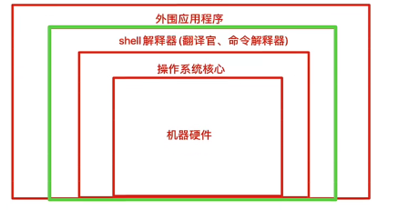

简单来说就是充当外围程序和操作系统的翻译官

从我们登录Linux,输入账号密码到进入Linux交互式界面，所有的操作，都是交给shell解释并执行

## shell脚本的概念

当命令或者程序语句写在文件中，我们执行文件，读取其中的代码，这个程序文件就称之为shell脚本。

在shell脚本里定义多条Linuxt命令以及循环控制语句，然后将这些Linuxi命令一次性执行完毕，执行脚本文件的方式称之为  v非交互式方式。

- windows中存在`*.bat`批处理脚本
- Linux中常用`*.sh`脚本文件

在Linux系统中，shell脚本或者称之为(bash shella程序)通常都是vim编辑，由Linux命令、bash shell指令、逻辑控制语句和注释信息组成。

## **脚本语言**的概念

shell脚本语言属于一种弱类型语言**无需声明变量类型，直接定义使用**

**强类型语言，必须先定义变量类型，确定是数字、字符串等，之后再赋予同类型的值**

Shell 擅长系统管理脚本开发，如软件启停脚本、监控报警脚本、日志分析脚本

## Bash的概念

- bash是一个命令处理器，运行在文本窗口中，并能执行用户直接输入的命令
- bash还能从文件中读取linxu命令，称之为脚本
- bash支持通配符、管道、命令替换、条件判断等逻辑控制语句

特性：

- 文件路径tab键补全
- 命令补全
- 快捷键ctrl+a,e,u,k,I

[bash快捷键汇总](https://blog.csdn.net/xiaotao131/article/details/100662981)

```Shell
ctrl + a将光标移到行首（在命令行下）
ctrl + e将光标移动到行尾（在命令行下）
ctrl + i制表（类似Tab键）
ctrl + k删除从光标所在处到行尾的所有字符
ctrl + u擦除从光标位置开始到行首的所有字符内容
```

- 通配符
- 命令历史
- 命令别名
- 命令行展开

## Bash基础命令

1. man 命令：

man 命令可以访问 Linux 系统的手册页。在 man 命令之后跟上想要查看的命令名，就可以显示相应的手册页。在命令行输入`man ls`，出现手册页。

进入手册页后，无法鼠标滑动来翻页，可以通过键盘的上下键来翻行。想退出的话，可以按q退出。

1. 目录切换

```Shell
cd dir 目录切换
```

1. 绝对路径

```Shell
pwd 查看当前目录绝对路径
```

1. ls命令

```Shell
ls系列：
ls -F：区分文件和文件夹；
ls -a：显示隐藏文件；
ls -R：递归显示；
ls -l：显示长列表；（ll）
```

1. touch 命令:用于创建空文件，用法是直接在命令后面加文件名

```Shell
touch filename
```

1. cp命令：cp 命令最基本的用法需要两个参数，即源对象和目标对象： cp source destination。当参数 source 和 destination 都是文件名时， cp 命令会将源文件复制成一个新的目标文件，并以 destination 命名。cp 命令的 -r 选项威力强大。可以用它在单个命令中递归地复制整个目录的内容：

```Shell
cp source destination
```

1. mv 命令：mv 命令可以将文件和目录移动到另一个位置或是重新命名：

```Shell
mv NewDocuments/ OldDocuments/
```

1. rm命令：移除（ removing）

```Shell
rm -i 会询问你是否真的要删除文件
rm -rf 会强制删除文件下所有内容，包括子目录且没有提示
```

1. mkdir命令：创建目录

```Shell
mkdir 文件夹名
```

1.  rmdir命令：在默认情况下， rmdir 命令只删除空目录。 -r 选项使得 rm 命令可以向下进入（ descend into）目录，删除其中的文件，然后再删除目录本身;

```Shell
rmdir Wrong_Dir/
```

# shell基础

## Shebang是什么

计算机程序中， `shebang` 指的是出现在⽂本⽂件的第⼀⾏前两个字符 #! 

在Unix系统中，程序会分析 `shebang` 后⾯的内容，作为解释器的指令，例如 

- 以 `#!/bin/sh` 开头的⽂件，程序在执⾏的时候会调⽤ `/bin/sh` ，也就是bash解释器 
- 以 `#!/usr/bin/python` 开头的⽂件，代表指定python解释器去执⾏ 
- 以 `#!/usr/bin/env` 解释器名称 ，是⼀种在不同平台上都能正确找到解释器的办法

注意事项： 

- 如果脚本未指定 `shebang` ，脚本执⾏的时候，默认⽤当前shell去解释脚本，即 `$SHELL` 
- 如果 `shebang` 指定了可执⾏的解释器，如 `/bin/bash` `/usr/bin/python` ，脚本在执⾏时，⽂件名会作为参数传递给解释器 

**如果#!指定的解释程序没有可执⾏权限，则会报错“bad** **interpreter****: Permission denied”。** 

**如果#!指定的解释程序不是⼀个可执⾏⽂件，那么指定的解释程序会被忽略，转⽽交给当前的SHELL去执⾏这个脚本。** 

**如果#!指定的解释程序不存在，那么会报错“bad** **interpreter****: No such file or directory”。** 

**#!之后的解释程序，需要写其绝对路径（如：#!/bin/bash），它是不会⾃动到$PATH中寻找****解释器****的。** 

**如果你使⽤"bash test.sh"这样的命令来执⾏脚本，那么#!这⼀⾏将会被忽略掉，****解释器****当然是⽤命令⾏中显式指定的bash。**

## **脚本注释，脚本开发规范**

\1. 在shell脚本中，#后⾯的内容代表注释掉的内容，提供给开发者或使⽤者观看，系统会忽略此行

\2. 注释可以单独写⼀⾏，也可以跟在命令后⾯ 

\3. 尽量保持爱写注释的习惯，便于以后回顾代码的含义，尽量使⽤英⽂、而非中⽂ 

```Shell
#! /bin/bash 
# Date : 2019-11-28 14:59:18 
# Author：created by chaoge 
# Blog：www.csdn.com/
```

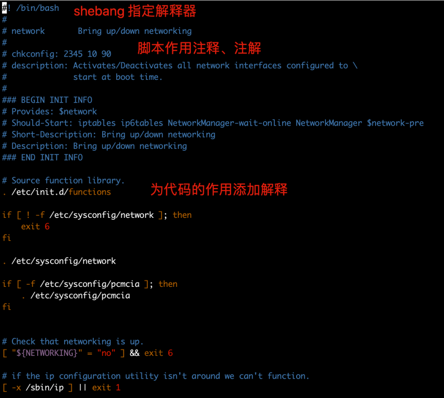

## shell的基础操作

切换终端：ctrl + alt + f1~f7切换终端

查看当前linux⽤的是哪⼀个版本的shell：`echo $SHELL`

找到命令的帮助信息:`man ls`  `info ls`

## 执行shell脚本的方式

1. `bash script.sh` 或 `sh script.sh` ，⽂件本身没权限执⾏，没x权限，或脚本未指定shebang 时重点推荐的⽅式 。也可以成`/bin/bash script.sh`（解释器方式）
2. 使⽤ `绝对/相对` 路径执⾏脚本，需要⽂件含有x权限 
3. `source script.sh` 或者 `. script.sh` ，代表 执⾏的含义，`source`等于点`. `（解释器方式）
4. 少⻅的⽤法， `sh < script.sh`（解释器方式）

第四种写法表示将script.sh中的内容输到sh里面。

解释器方式不需要脚本有执行权限，而第二种方式需要有执行权限

## echo命令

1. 在shell脚本⾥，shell命令会有⾃⼰的输出，若是你想要⾃定义内容打印，以告知⽤户，当前脚本在做什么事。可以通过echo命令来实现，注意 `单引号` 、 `双引号` 。双引号会解释特殊变量而单引号不会
2. echo命令默认自动换行，可以使用`echo ''`实现换行
3. 使用变量与echo，脚本⾥，可以在环境变量名称前加上 $ 来使⽤环境变量。

```Bash
echo UID: $UID 
echo HOME: $HOME
```

1. 将命令和echo结合：

```Bash
echo "当前时间是：" `date`
```

1. 使用使⽤`单引号` 和 `转义符` 对符号不做解析。

```Plain
如果使用双引号：识别特殊符号
[root@web01 ~]# echo "The cost of the item is $15" 
The cost of the item is 5
如果使用单引号：不识别特殊符号
[root@web01 ~]# echo ' The cost of the item is $15' 
The cost of the item is $15
如果使用转义符：不识别特殊付符号
[root@web01 ~]# echo "The cost of the item is \$15" 
The cost of the item is $15
```

## 命令替换

shell⼀⼤特性就是可以从命令中提取结果，再赋予给变量，这样处理脚本数据特别⽅便。

有两个⽅式将命令输出赋予给变量：反引号``和$()，如：

```Plain
# echo $(date '--date=1 hour ago' +%Y-%m-%d-%H) 
2020-09-28-10
# echo `date '--date=1 hour ago' +%Y-%m-%d-%H` 
2020-09-28-10 
```

## 历史命令

Shell会保留其会话中⽤户提交执⾏的命令

```Shell
history #命令，查看历史命令记录，注意【包含⽂件中和内存中的历史记录】
echo $HISTSIZE #shell进程可保留的命令历史的条数
echo $HISTFILE #存放历史命令的⽂件，⽤户退出登录后，持久化命令个数
```

history命令

```Shell
history #命令 以及参数
-c: 清空内存中命令历史；
-r：从⽂件中恢复历史命令
数字 ：显示最近n条命令 history 10
```

调用历史命令

```Shell
!n      #执行历史记录中的某n条命令
!!      #执行上一次的命令，或者向上箭头
!string #执行名字以string开头的最近一次的命令
```

调用上一次命令的最后一个参数

```Shell
ESC. #快捷键
!$
```

# shell变量

## 变量规则

变量定义与赋值，注意变量与值之间不得有空格

```Shell
name="suzhe" 
#bash变量是弱类型，⽆需事先声明类型，是将声明和赋值同时进⾏
```

变量的赋值可以不加引号，也可以加单引号或者双引号

```Plain
赋值不加引号 
story_three=⼤师兄，快来救我 
赋值单引号 
story_two='⼤师兄，三师弟被妖怪抓⾛了' 
赋值双引号 
story_one="⼤师兄，师傅被妖怪抓⾛了"
```

## 变量引用

echo变量

```Shell
echo ${name}
 echo $name #可以省略花括号 
```

取出变量值

- 单引号，所⻅即所得，强引⽤ 
- 双引号，输出引号⾥所有内容，识别特殊符号，弱引⽤ 
- ⽆引号，连续的符号可以不加引号，有空格则有歧义，最好使⽤双引号 
- 反引号，引⽤命令执⾏结果，等于 $() ⽤法

我们在echo中可以借助反引号实现打印与命令结合

## 变量命名规则

- 名称定义要做到见名知意，切按照规则来，切不得引用保留关键字(hlp检查保留字)
- 只能包含数字、字母、下划线
- 不能以数字开头
- 不能用标点符号
- 变量名严格区分大小写

## 变量的作用域

本地变量，只针对当前的shel进程，开启子shell后当前本地变量丢失

环境变量，也称为全局变量，针对当前s以及其任意子进程，环境变量也分自定义、内置两种环境变量

局部变量，针对在shell函数或是shell脚本中定义

位置参数变量：用于she11脚本中传递的参数

特殊变量：shell的特殊变量，⽤在脚本，函数传递参数，有如下特殊的位置参数变量

```Plain
$0     获取shell脚本⽂件名，以及脚本路径 
$n     获取shell脚本的第n个参数,n在1~9之间，如$1 ,$2, $9 ，⼤于9则需要写，${10}，参数空格隔开 
$#     获取执⾏的shell脚本后⾯的参数总个数 
$*     获取shell脚本所有参数，不加引号等同于$@作⽤，加上引号"$*"作⽤是 接收所有参数为单个字符串，"$1 $2.." 
$@     不加引号，效果同上，加引号，是接收所有参数为独⽴字符串，如"$1" "$2" "$3" ...，空格保留
```

$*和$@ 的区别

> $* 和 $@ 都表示传递给函数或脚本的所有参数
>
> 当 $* 和 $@ 不被双引号" "包围时，它们之间没有任何区别，都是将接收到的每个参数看做⼀份数据，彼此之间以空格来分隔。
>
> 但是当它们被双引号" "包含时，就会有区别了：
>
> "$*"会将所有的参数从整体上看做⼀份数据，⽽不是把每个参数都看做⼀份数据。
>
> "$@"仍然将每个参数都看作⼀份数据，彼此之间是独⽴的。
>
> ⽐如传递了 5 个参数，那么对于"$*"来说，这 5 个参数会合并到⼀起形成⼀份数据，它们之间是⽆法分割的；⽽对于"$@"来说，这 5 个参数是相互独⽴的，它们是 5 份数据。
>
> 如果使⽤ echo 直接输出"$*"和"$@"做对⽐，是看不出区别的；但如果使⽤ for 循环来逐个输出数据，⽴即就能看出区别来。

## 特殊状态变量

```Plain
$?     上⼀次命令执⾏状态返回值，0正确，⾮0失败 
$$     当前shell脚本的进程号 
$!     上⼀次后台进程的PID 
$_     再次之前执⾏的命令，最后⼀个参数 
查找⽅式 man bash  
搜索Special Parameters
```

## 自定义变量

变量赋值：varName=value

变量引用：${varName}、$varName

双引号，变量名会替换为变量值

单引号，识别为普通字符串

```Shell
n1=1
n2=2
n3="$n1"
echo $n3 #输出1
n4='$n2'
echo $n4 #输出$n2
```

## **bash shell内置变量命令**

bash本身提供的一些内置命令

```C
echo 
eval 
exec 
export 
read 
shift
```

**echo命令**

```C
-n 不换⾏输出内容 
-e 解析转义字符 
\n 换⾏ 
\r 回⻋ 
\t tab 
\b 退格 
\v 纵向制表符
```

**eval：执行多个命令**

```C
eval ls ;cd /tmp
```

**exec：不创建⼦进程，执⾏该命令，exec执⾏后⾃动exit**

```C
exec ping 192.168.10.16
```

# **shell子串**

## 子串操作

子串就是一个完整字符串的一部分，通过shell特有语法截取。

```Plain
${变量} 返回变量值
${#变量} 返回变量⻓度，字符⻓度
```

截取字符串

```Plain
${变量:start} 返回变量Offset数值之后的字符
${变量:start:length} 提取offset之后的length限制的字符
${变量#word} 从变量开头删除最短匹配的word⼦串
${变量##word} 从变量开头，删除最⻓匹配的word
${变量%word} 从变量结尾删除最短的word
${变量%%word} 从变量结尾开始删除最⻓匹配的word
```

替换字符串

```Plain
${变量/pattern/string} ⽤string代替第⼀个匹配的pattern
${变量//pattern/string} ⽤string代替所有的pattern
```

应用场景：批量更改文件名

## 字符串长度的几种计算方式以及速度比较

速度最快：使用${#变量}

```Plain
# time for n in {1..10000};do char=`seq -s "chaoge" 100`;echo ${#char} &>/dev/null;done 
real 0m11.041s 
user 0m4.585s 
sys 0m6.232s
```

速度还行：使用expr length

```Plain
# time for n in {1..10000};do char=`seq -s "chaoge" 100`;expr length"${char}" &>/dev/null;done 
real 0m21.053s 
user 0m8.673s 
sys 0m11.944s
```

速度很慢：使用管道符

```Plain
# time for n in {1..10000};do char=`seq -s "chaoge" 100`;expr length "${char}" &>/dev/null;done 
real 0m21.053s 
user 0m8.673s 
sys 0m11.944s
```

速度最慢：使用awk再次加工

```Plain
# time for n in {1..10000};do char=`seq -s "chaoge" 100`;echo ${char}|awk '{print length($0)}' &>/dev/null ;done 
real 0m33.728s 
user 0m13.839s 
sys 0m19.121s
```

因此，shell编程，尽量⽤内置系统操作与内置函数

## 特殊shell扩展变量处理

```Plain
:-如果前面的值不存在则返回后面的值
:=如果前面的值不存在则返回后面的值并赋值给前面的值
:?如果前面的值不存在则输出后面的内容
:+如果前面的值为空则什么都不做，否则返回后面的值
```

应用场景：保证变量数值的存在与否

## **环境变量设置**

环境变量一般指的是用export内置命令导出的变量，用于定义shel的运行环境、保证shel命令的正确执行。

shell通过环境变量确定登录的用户名、PATH路径、文件系统等各种应用。

环境变量可以在命令行中临时创建，但是用户退出shl终端，变量即丢失，如要永久生效，需要修改环境变量配置文件

- ⽤户个⼈配置⽂件 ~/.bash_profile 、 ~/.bashrc 远程登录⽤户特有⽂件
- 全局配置⽂件 /etc/profile 、 /etc/bashrc ，且系统建议最好创建在 /etc/profile.d/ ，⽽⾮直接修改主⽂件，修改全局配置⽂件，影响所有登录系统的⽤户

检查系统环境变量的命令

- set,输出所有变量，包括全局变量、局部变量
- env,只显示全局变量
- declare,输出所有的变量，如同set
- export,显示和设置环境变量值

撤销环境变量

- unset变量名，删除变量或函数。

设置只读变量

- readonly,只有shell结束，只读变量失效

## 父子shell

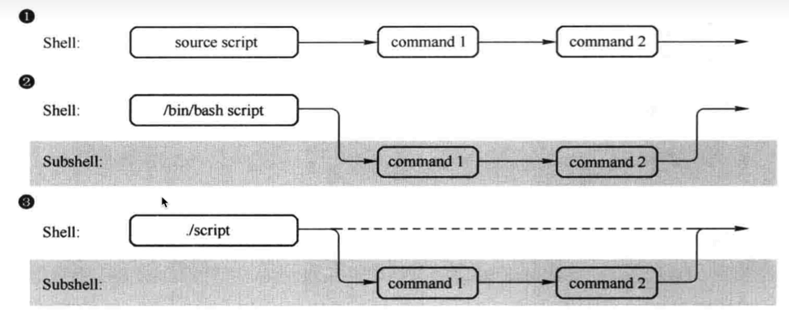

有三种执行shell脚本的方式，分别是图上的source和.、指定命令解释器、相对路径三种方式

1. source和点执行脚本，只在当前的she11环境中执行生效，不会产生子shell
2. 指定bash shell解释器运行脚本，开启子she11运行脚本命令
3. ·/script这是使用相对路径运行,也会指定shebang,也是通过解释器运行，也是开启subshell运行命令

因此，第一种执行方式下，脚本中定义的变量可以在我们当前的终端下读取到，但是后面两种方式下，我们脚本中定义的变量是不能再当前终端下读取到的。

父子shell是采用不同的进程来进行。

## 进程树pstree

通过进程树我们可以查看我们当前是不是在子shell下。

```Plain
pstree
```

ps进程管理命令，查看

```Plain
ps -ef
-f显示UID,PID,PPID
-e列出所有进程的信息，如同-A选项option
ps -ef --forest
```

例如，使用pstree命令查看我当前的进程树如下

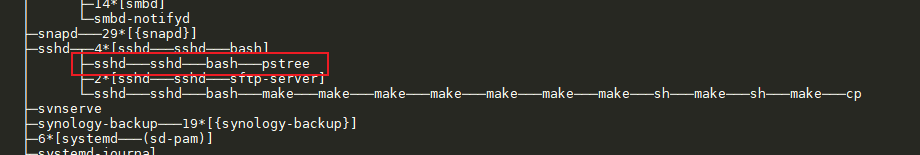

当我在命令行在输入一个bash回车之后，再使用pstree命令查看进程树就会发现多了一层bash

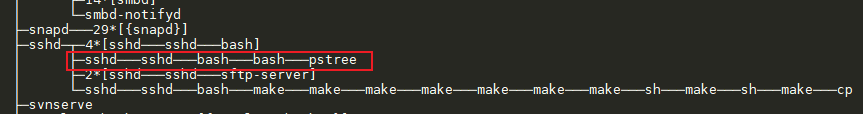

还可以使用以下命令查看当前的“bash”进程

```Plain
ps -ef --forest | grep --color=auto bash
```

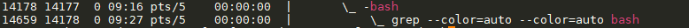

## 检测是否在子shell环境中

1inux默认的有关she11的变量

\#该变量的值特点，如果是0,就是父shell环境，否则就是子shell

```Plain
echo $BASH_SUBSHELL
```

## 括号语法（进程列表）

大家通常需要执行一系列的shell命令

```Plain
ls;cd;pwd;echo"abc"
```

而如果将上面的代码使用小括号包裹起来，就变成了一个进程列表。

```Plain
(cd ~;pwd;ls;echo $BASH_SUBSHELL)
```

此时使用了`echo $BASH_SUBSHELL`命令就会发现，小括号里面的部分一起打包到了子shell中运行

返回的`BASH_SUBSHELL`的值为1

同样的方式还可以嵌套多个子shell 运行

```Bash
(cd ~;(pwd;ls;echo $BASH_SUBSHELL))
```

利用括号，开启子shell的理念，以及检查，在shell脚本开发中，经常会用子shell进行多进程的处理，提高程序并发执行效率。

## 内置命令和外置命令

内置命令：在系统启动时就加载入内存，常驻内存，执行效率更高，但是占用资源，cd

外置命令：用户需要从硬盘中读取程序文件，再读入内存加载

使用type命令查看某个命令来自哪个文件下

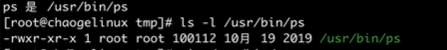

也可以通过which命令查看

```Bash
which cd
```

外置命令的特点是：一定会开启子进程执行，就比如我们的`ps -ef --forest`

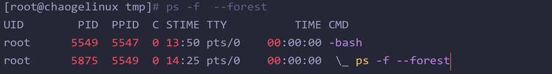

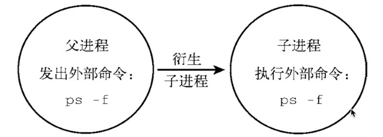

内置命令和she11是为一体的，是she11的一部分，不需要单独去读取某个文件，系统启动后，就执行

在内存中了，不会产生子进程去执行

查看Linux内置的shell命令，可以使用`compgen -b`

```Bash
 compgen -b
```

# Shell 脚本开发

## 第一个脚本

shell脚本⽂件，第⼀⾏必须指定想要⽤的shell。 这部分的内容我们已经在shell基础里面提到过了

```Plain
#!/bin/bash
```

shell脚本⾥， #号 是注释⾏，shell不会处理脚本中的注释⾏，然⽽第⼀⾏例外，该写法会通知shell⽤哪个解释器

来运⾏脚本。 

shell脚本中可以书写你想要执⾏的命令，且可以添加注释⾏。

```Plain
[root@web01 ~]# cat test.sh 
#!/bin/bash 
# This is test script 
date 
whoami 
echo "It's Over." 
```

执行脚本：4种方式我们也在shell基础里面说过了，在父子shell里面也有提到。有三种是通过解释器的方式不需要执行权限，有一种直接执行文件的需要执行权限。

## 执行出错继续特性

shell脚本中即使执行到某一行出错了，下面的内容也会继续执行。

## 控制脚本的返回值

如果我们希望限定脚本传入的参数，在参数数量不对时，返回我们自定义的数值。可以使用以下方式

```Plain
[root@chaogelinux learnshell]# cat t4.sh 
################################################################### 
# File Name: t4.sh 
# Author: pyyu 
# mail: yc_uuu@163.com 
# Created Time: 2020年05⽉26⽇ 星期⼆ 17时06分08秒 
#============================================================= 
#!/bin/bash 
[ $# -ne 2 ] && { 
 echo "must be two args" 
 exit 119 #终⽌程序运⾏，且返回119状态码，提供给当前shell的$?变量，若是在函数⾥ 可以return 119⽤法 
} 
echo ok
```

## 数值计算

编程语⾔都⽀持数字计算，但是对于shell来说，数值计算稍微麻烦点。

算术运算符

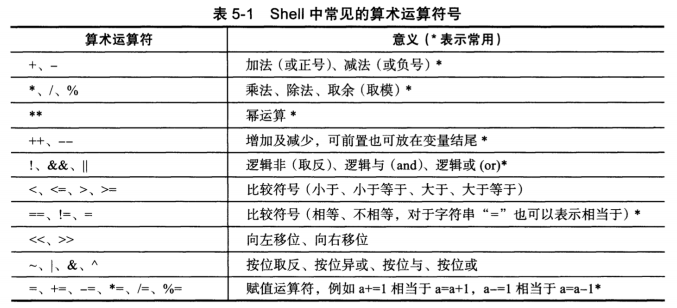

算数运算符命令

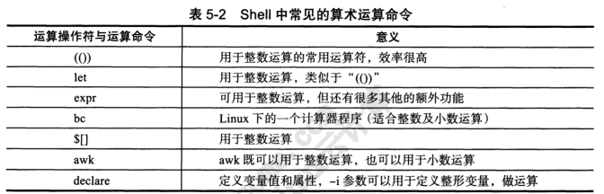

## if参数

shell 编程中使⽤if语句内判断参数

```SQL
–b 当file存在并且是块⽂件时返回true 
-c 当file存在并且是字符⽂件时返回true 
-d 当pathname存在并且是⼀个⽬录时返回true 
-e 当pathname指定的⽂件或⽬录存在时返回true 
-f 当file存在并且是⽂件时返回true 
-g 当由pathname指定的⽂件或⽬录存在并且设置了SGID位时返回为true 
-h 当file存在并且是符号链接⽂件时返回true，该选项在⼀些⽼系统上⽆效 
-k 当由pathname指定的⽂件或⽬录存在并且设置了“粘滞”位时返回true 
-p 当file存在并且是命令管道时返回为true 
-r 当由pathname指定的⽂件或⽬录存在并且可读时返回为true 
-s 当file存在⽂件⼤⼩⼤于0时返回true 
-u 当由pathname指定的⽂件或⽬录存在并且设置了SUID位时返回true 
-w 当由pathname指定的⽂件或⽬录存在并且可执⾏时返回true。⼀个⽬录为了它的内容被访问必然是可执⾏的。 
-o 当由pathname指定的⽂件或⽬录存在并且被⼦当前进程的有效⽤户ID所指定的⽤户拥有时返回true。 
UNIX Shell ⾥⾯⽐较字符写法： 
-eq 等于 
-ne 不等于 
-gt ⼤于 
-lt ⼩于 
-le ⼩于等于 
-ge ⼤于等于 
-z 空串
= 两个字符相等 
!= 两个字符不等 
-n ⾮空串
```

## **双括号(())**

注意双括号的操作必须是整数，双括号不⽀持浮点数，浮点数需要其他命令计算

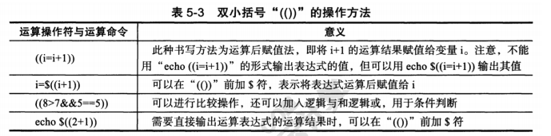

例如你想判断算数结果的真假值

```SQL
echo $((3<4))
echo $((3==4))
```

## 双方括号

双方括号提供了针对字符串的高级特性，模式匹配，正则表达式的匹配。

```Shell
[root@web01 ~]# cat test.sh 
#!/bin/bash 
# 超哥带你学shell 
if [[ $USER == r* ]] 
then 
 echo "Hello $USER" 
else 
 echo "Sorry,I do not know you." 
fi 
[root@web01 ~]# 
[root@web01 ~]# 
[root@web01 ~]# bash test.sh 
Hello root 
[root@web01 ~]#
```

## 特殊运算符

++ 加⼀ 

-- 减⼀ 

注意这⾥有坑 

++a 是先计算加⼀，然后赋值a 

a++ 是先对变量a操作，再加⼀ 

注意这个先后顺序

特别是在shell中这个坑尤为特殊

```SQL
echo $((a++))
 一般都会认为是a赋值了之后再打印，但是其实是先打印，再赋值
```

案例脚本：对用户输入判断是否是整数

使用read命令，获取用户输入

```SQL
#!/bin/bash

print_usage() {
    printf "Please enter an integer\n"
    exit 1
}

# 接受用户输入
read -p "Please input first number: " firstnum

# 如果用户输入去掉了整数部分为空，说明是一个纯数字
# if 的 -n 参数，如果 string 长度非零，则为真
# 如果该字符串不为空，那么 if 逻辑成立，说明用户输入的不是一个纯数字
# 逻辑判断，限制用户必须输入一个纯数字
if [ -n "$(echo $firstnum | sed 's/[0-9]//g')" ]; then
    print_usage
fi

read -p "Please input the operators: " operators

# 判断运算符
if [ "${operators}" != "+" ] && [ "${operators}" != "-" ] && [ "${operators}" != "*" ] && [ "${operators}" != "/" ]; then
    echo "Please use {+|-|*|/}"
    exit 2
fi

# 输入第二个数字
read -p "Please input second number: " secondnum

if [ -n "$(echo $secondnum | sed 's/[0-9]//g')" ]; then
    print_usage
fi

# 最后数值计算
echo "${firstnum} ${operators} ${secondnum} 结果是：$((${firstnum}${operators}${secondnum}))"
```

## 计算方式

### let命令

let命令等同于双括号计算， "((赋值表达式))"，但是双括号效率更高

```Plain
i=2
let i=i+8
echo $i

#上述等同于
i=2
echo $((i=i+8))
```

### expr命令

expr命令允许在命令⾏处理数学表达式，简单的计算器命令，注意参数之间必须有空格！

查看帮助

```Bash
expr --help
```

使用方式

```Plain
# expr 1 + 5 
6 
```

epr并不是很好用，比较麻烦，很多符号在she11里有特殊含义因此必须得转义使用

```Shell
# expr 5 \* 2 
10

# expr 33 '>' 3 
1
```

expr⽀持模式匹配，也就是如同正则的作⽤，有两个模式符号

:冒号，计算字符串中的字符数

.*任意字符串重复0次或多次

### bc命令

bc命令可以当作计算器来用，当作命令行计算器用。

```Shell
echo 4*4|bc
echo 4.5-1.1|bc
num=5
result=echo $num+6|bc
echo Sresult
```

提示：

整数的计算，用双小括号，let,expr

带有小数的计算，用bc

案例：计算出1~10的总和

```Shell
# 思路，我们想要计算 
1+2+3..+10 
# 怎么先定义好这样的连续，有规律的字符串？ 
[root@chaogelinux ~]# seq -s + 10 
1+2+3+4+5+6+7+8+9+10 
# tr命令，从标准输⼊中替换、缩减和/或删除字符，并将结果写到标准输出。 
[root@chaogelinux ~]# echo {1..10}|tr " " "+" 
1+2+3+4+5+6+7+8+9+10 
# 得到字符串了，交给bc计算命令即可 
[root@chaogelinux ~]# echo {1..10}|tr " " "+" |bc 
55 
# 双括号，括号⾥直接写表达式 
[root@chaogelinux ~]# echo $((`seq -s + 10`)) 
55 
# expr命令，传参给expr，因此可以⽤xargs命令 
# 注意expr需要传⼊多个参数执⾏计算，注意空格 
[root@chaogelinux ~]# expr 1 + 2 + 3 
6 
# 因此上⾯的字符串就不适⽤了，要改成这样的 
[root@chaogelinux ~]# seq -s " + " 10
1 + 2 + 3 + 4 + 5 + 6 + 7 + 8 + 9 + 10 
# 最终交给expr 
# xargs ⼜称管道命令，构造参数等。是给命令传递参数的⼀个过滤器,也是组合多个命令的⼀个⼯具 它把⼀个数据流分割为⼀ 
些⾜够⼩的块,以⽅便过滤器和命令进⾏处理 。简单的说 就是把 其他命令的给它的数据 传递给它后⾯的命令作为参数 
[root@chaogelinux ~]# seq -s " + " 10 | xargs expr 
55
```

### awk命令

基本语法：

```Bash
bashCopy code
awk 'pattern { action }' inputfile
```

- `pattern` 是条件或模式，用于匹配文本行。
- `action` 是要执行的操作，当 `pattern` 匹配到某行时执行。
- `inputfile` 是要处理的输入文件的名称，如果不指定，则默认从标准输入读取数据。

示例：

```Bash
bashCopy code
awk '/keyword/ { print $1 }' data.txt
```

这个命令会在名为 `data.txt` 的文件中查找包含 "keyword" 的行，并打印每行的第一个字段（以空格为分隔符）。

还可以用来进行计算

```Shell
 echo "3.2 2.4"|awk '{print ($1+$2)}'
 5.6
```

只传入了一个参数，作用是输出前面第一个参数和第二个参数的和

**注：管道符****`|`****的作用是将前一个命令的输出传递给下一个命令的输入。在这里，它将 "3.2 2.4" 的输出传递给下一个命令** **`awk`****。**

### 中括号[]

```Shell
 echo $[8**2]
 64
```

## 读取用户输入

read命令

`read` 是一个用于从标准输入（通常是键盘）读取用户输入的命令。它允许您将用户的输入保存到变量中，以便在脚本中进一步处理或使用。

```Shell
read [选项] [变量]
```

`-p`（用于显示提示信息）

`-r`（用于禁用反斜杠转义）

`-a`（用于将输入分割为数组）

`-t`（用于等待用户输入超时）

例如：

```Shell
read -t 5 -p "我给你五秒钟时间输⼊密码：" my_pwd
# 输⼊多个变量，注意⽤空格分割
```

# **shell逻辑控制**

先前我们的shel脚本都是按照顺序，自上而下的依次处理。但是许多程序要求对于shl脚本可以进行逻辑流程控制，这类命令称，之为结构化命令(structured command)

结构化命令允许你修改程序执行的顺序。

## if-then-else语句

if-else-then 语句是 Bash 脚本中的条件语句，用于在不同的条件下执行不同的命令。

```Shell
if [ 条件 ]; then
    # 如果条件为真（true）执行的命令
else
    # 如果条件为假（false）执行的命令
fi
```

`fi` 关键字：`fi` 表示条件结束的地方。`fi` 是 `if` 的反转，表示条件语句的结束。

例如：

```Shell
#!/bin/bash

num1=5
num2=10

if [ $num1 -lt $num2 ]; then
    echo "$num1 小于 $num2"
else
    echo "$num1 大于或等于 $num2"
fi
```

## **elif语句**

当我们有多个不同的条件需要执行时，可以使用elif语句，就相当于我们在其他语言中学习的elseif

`elif` 是 Bash 脚本中用于添加多个条件分支的关键字，它允许您在一个 `if-else` 语句中测试多个条件，并根据不同条件执行不同的操作。`elif` 是 `else if` 的缩写

```Shell
if [ 条件1 ]; then
    # 如果条件1为真时执行的命令
elif [ 条件2 ]; then
    # 如果条件2为真时执行的命令
else
    # 如果前面的所有条件都为假时执行的命令
fi
```

例如：

```Shell
#!/bin/bash

num=-5

if [ $num -gt 0 ]; then
    echo "$num 是正数"
elif [ $num -lt 0 ]; then
    echo "$num 是负数"
else
    echo "$num 是零"
fi
```

## for语句

`for` 命令是在 Bash 脚本中用于循环迭代一系列值的控制结构。它允许您遍历列表、数组、文件中的行，或者生成数字序列，并在每次迭代时执行一系列命令。`for` 命令的基本语法如下：

```Shell
for 变量 in 列表
do
    # 在每次迭代中执行的命令
done
```

以下是一些 `for` 命令的用法示例：

### 示例 1：遍历数字序列

```Bash
bashCopy code
for i in {1..5}
do
    echo "迭代 $i"
done
```

这个示例会输出从 1 到 5 的数字序列。

### 示例 2：遍历数组

```Bash
bashCopy code
fruits=("苹果" "香蕉" "橙子")

for fruit in "${fruits[@]}"
do
    echo "水果：$fruit"
done
```

这个示例会遍历名为 `fruits` 的数组中的水果，并逐个输出。

### 示例 3：遍历文件中的行

```Bash
bashCopy code
file="my_file.txt"

for line in $(cat "$file")
do
    echo "行内容：$line"
done
```

这个示例会遍历名为 `my_file.txt` 的文件中的每一行，并输出行的内容。

### 示例 4：使用通配符

```Bash
bashCopy code
for file in *.txt
do
    echo "处理文件：$file"
done
```

这个示例会遍历当前目录中所有以 `.txt` 结尾的文件，并输出它们的名称。

### 注意点

for默认循环是以空格区分，如果你的数据包含了空格，那⼜该怎么办？

使用双引号解决这个问题

```Shell
[root@web01 ~]# cat test.sh 
#!/bin/bash 
# 超哥带你学shell 
for test in China "New York" 
do 
 echo "Now going to $test" 
done 
[root@web01 ~]# 
[root@web01 ~]# 
[root@web01 ~]# bash test.sh 
Now going to China 
Now going to New York
```

### for使用多个变量

C语言风格的for循环允许迭代多个变量，循环会单独的处理每个变量，可以为每个变量定义不同的迭代过程。

```Shell
#!/bin/bash
for (( a=1,b=10;a<=10;a++,b-- ))
do
 echo "$a - $b"
done
```

## while语句

`while` 命令是 Bash 脚本中用于创建循环的控制结构之一。它允许您在指定的条件为真时重复执行一组命令。只要条件为真，循环将一直继续执行。

```Shell
while [ 条件 ]
do
    # 在条件为真时执行的命令
done
```

例如：

```Shell
while true
do
    read -p "请输入一个数字（输入 q 退出）: " input

    if [ "$input" = "q" ]; then
        echo "退出循环"
        break
    fi

    echo "您输入的数字是：$input"
done
```

while还可以在条件中执行多条语句，如

```Shell
#!/bin/bash
var1=10
while echo $var1 && [ $var1 -ge 0 ]
do
    echo "This is inside the loop"
    var1=$[ $var1 - 1 ]
done
```

这里之所以`echo $var1` 在循环的条件部分被使用，主要是为了在每次迭代时输出 `var1` 的当前值。

当然除了用`&&`连接两个条件也可以用换行连接

```Shell
#!/bin/bash
var1=10
while echo $var1 
 [ $var1 -ge 0 ]
do
    echo "This is inside the loop"
    var1=$[ $var1 - 1 ]
done
```

注意写法，换行，多个测试命令要单独的出现在一行。可以写入多个测试命令，只有最后一个测试命令的退出状态码会被决定是否退出循环。

## until 语句

`until` 语句和 `while` 语句相反，但它在条件为假时执行一系列命令，直到条件为真为止。

```Shell
until [ 条件 ]
do
    # 在条件为假时执行的命令
done
```

## **IFS****字段分隔符**

IFS是一个特殊的环境变量，叫做内部字段分隔符，FS环境变量定义了bash shell用作字段分隔符的一系列字符，bash shell将如下字段当作分隔符

- 空格
- 制表符
- 换行符

在 shell 脚本编程中，`IFS` 变量通常用于处理文本数据，特别是当你需要将一行文本分割成多个部分（字段）时，`IFS` 变量非常有用。你可以根据需要将 `IFS` 的值更改为不同的分隔符，以适应你的数据格式。

以下是关于 `IFS` 变量的一些常见用法和示例：

1. 默认值：默认情况下，`IFS` 的值包括空格、制表符和换行符。这意味着这些字符被用作字段分隔符。
2. 自定义分隔符：你可以将 `IFS` 的值更改为自定义分隔符，例如逗号 `,`：

```Bash
IFS=,
```

这将使逗号成为字段的分隔符，而不再使用默认的空格、制表符和换行符。

1. 使用 `read` 命令：`IFS` 常常与 `read` 命令一起使用，以从一行文本中分割字段。例如，如果你有一个逗号分隔的数据行：

```Bash
data="Alice,Bob,Charlie"
IFS=,
read -ra names <<< "$data"
```

在上述示例中，`IFS` 被设置为逗号，并使用 `read` 命令将 `$data` 分割成名字的数组。现在，`names` 数组包含了三个元素：Alice、Bob 和 Charlie。

1. 还原默认值：在处理完特定数据后，你可以将 `IFS` 的值还原为默认值，以防止影响其他部分的脚本：

```Bash
IFS=$' \t\n'
```

这将将 `IFS` 恢复为默认值，包括空格、制表符和换行符。

# shell函数

函数的作用与在于，当你需要重复的使用一段代码，如果是一小段代码重复还好，若是大段重复代码就太麻烦了。

函数就可以解决这个问题。

函数是定义一个代码块，且命名，然后可以在脚本里任何位置调用。

## 创建函数

```Shell
创建函数语法 
function name { 
 commands 
}
```

例如：

```Shell
function func1 { 
 echo "This is an example of a function" 
}
```

函数也可以简写成这样

```Shell
demoFunc(){ 
 echo "This is a shell function." 
}

echo "start.." 
demoFunc 
echo "end.."
```

注意：

1. 要注意代码的上下路径，要先定义函数，再执行函数。
2. 注意函数名唯一，重复定义则会覆盖函数体的代码。

## 返回值

bash脚本在退出的时候会有状态码，函数结束后，也会有退出码。

此时使用`$?`是可以看到函数执行的退出码的

函数返回值是在调用函数之后，通过`&？`来获得。

但是这种方式会有坑，记住

- 函数结束后会立即取返回值
- 退出状态码在0~255

如果在提取函数返回值之前执行了其他的命令，函数的返回值会丢失。

```Shell
[root@chaogelinux shell]# cat test.sh 
#!/bin/bash 
funcWithReturn(){ 
 read -p "Enter a value: " value 
 read -p "Enter another value:" value2 
 return $(($value*$value2)) 
} 
funcWithReturn 
ls /tt 
echo "The final answer is $?"
```

在上面的脚本中，`funcWithReturn`函数执行完之后返回的应该是`$(($value*$value2))`的值，但是由于在执行函数之后又执行了`ls /tt `命令，因此`echo `返回的`$?`应该是`ls /tt `的状态返回值为2。同样的，当执行完脚本之后再使用`$?`命令返回的则是脚本的返回值0。

为了解决函数返回值的问题，我们可以把执行结果存到变量里

```Shell
[root@chaogelinux shell]# cat test.sh 
#!/bin/bash 
function db1 { 
 read -p "Enter a value: " value 
 echo $[ $value * 2 ] 
} 
result=$(db1) 
echo "The new value is $result" 
[root@chaogelinux shell]# 
[root@chaogelinux shell]# 
[root@chaogelinux shell]# bash test.sh 
Enter a value: 5 
The new value is 10
```

## 函数中的变量处理

函数的作用域指的就是变量可见的区域，函数里定义的变量和普通变量作用域不同，函数里的变量属于是局部的。

函数可以使用两种变量

- 全局变量
- 局部变量

全局变量：

在整个shell脚本里都有效的变量。可以在函数哪读取全局变量的值。默认情况下，脚本里定义的任何变量都是全局变量，只要不是写在函数体内。

也就是说你在脚本里面赋值的变量，也能在脚本外echo出来。除非你是使用./的方式开了一个子bash运行脚本

局部变量：

无需在函数中使用全局变量，函数内部使用的任何变量都可以被声明为局部变量，为了实现这一点，只需要加上local关键字即可。locl关键字保证了变量局限在函数中，即使函数外也有同名的变量，shel也会保持该变量的值是分离的。

# shell条件测试（if）

## 常用测试语法

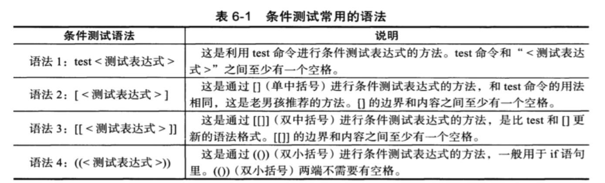

最常用的就是test和[] 两个语法

## test命令和[]

test命令和[]一样，是评估一个表达式，它的结果是真，还是假，如果条件为真，那么命令执行状态码结果就为0。否则就是不为0，通过`$`取值

1. 文件测试：
   1. `-e file`：检查文件是否存在。
   2. `-f file`：检查文件是否为普通文件。
   3. `-d file`：检查文件是否为目录。

- 文件权限
  - `-r file`：检查文件是否可读。
  - `-w file`：检查文件是否可写。
  - `-x file`：检查文件是否可执行。
  - `-u file`：检查文件是否具有SUID的属性。
  - `-g file`：检查文件是否SGID的属性。
  - `-k file`：检查文件是否具有Sticky bit的属性。
  - `-s file`：检查文件是否为非空白文件。
- 文件类型
  - `-b file`：检查文件是否为一个block device装置。
  - `-c file`：检查文件是否为一个character device装置。
  - `-S file`：检查文件是否为一个Socket文件。
  - `-p f ile`：检查文件是否为一个FIFO（pipe）文件。
  - `-L file`：检查文件是否为一个连结档。
- 文件比较
  - `test file1 -nt file2`文件1是否比文件2新
  - `test file1 -ot file2`文件1是否比文件2旧
  - `test file1 -ef file2`文件1和文件2是否为同一文件

示例：

```Bash
if [ -e "myfile.txt" ]; then echo "myfile.txt 存在"fi
test -e file.txt && echo yes || echo no
[ -e file.txt ] && echo yes || echo no
```

1. 字符串测试：
   1. `-z string`：检查字符串是否为空。
   2. `-n string`：检查字符串是否非空。
   3. `string1 = string2`：检查两个字符串是否相等。
   4. `string1 != string2`：检查两个字符串是否不相等。

示例：

```Bash
if [ -n "$mystring" ]; thenecho "mystring 非空"fi
```

1. 整数比较：
   1. `int1 -eq int2`：检查两个整数是否相等。
   2. `int1 -ne int2`：检查两个整数是否不相等。
   3. `int1 -lt int2`：检查 int1 是否小于 int2。
   4. `int1 -le int2`：检查 int1 是否小于或等于 int2。
   5. `int1 -gt int2`：检查 int1 是否大于 int2。
   6. `int1 -ge int2`：检查 int1 是否大于或等于 int2。

示例：

```Bash
if [ $x -gt 10 ]; thenecho "x 大于 10"fi
```

1. 逻辑操作：
   1. `! expression`：逻辑非，返回条件的相反值。
   2. `expression1 -a expression2`：逻辑与，同时满足两个条件。
   3. `expression1 -o expression2`：逻辑或，满足其中一个条件。

示例：

```Bash
if [ ! -e "file.txt" -a -n "$mystring" ]; thenecho "file.txt 不存在且 mystring 非空"fi
```

# sed进阶用法

`sed`，即流编辑器（Stream Editor），是一个强大的文本处理工具，常用于在 Unix 和 Linux 系统中进行文本替换、查找、删除、插入等操作。`sed` 通过读取输入流（通常是文本文件或管道输入）并将结果写入输出流（通常是标准输出或输出文件）来执行操作。

## 一般语法

以下是 `sed` 命令的一般语法：

```Bash
sed [选项] '操作' 文件
```

其中，选项可以是各种 `sed` 支持的选项，而操作是你希望 `sed` 执行的操作指令。以下是一些常见的 `sed` 操作：

1. 替换文本：用于查找并替换文本中的特定字符串。

```Bash
sed 's/原始字符串/替换字符串/' 文件
```

示例：

```Bash
sed 's/apple/orange/' fruits.txt
```

1. 删除行：用于删除文本中的特定行。

```Bash
sed '/要删除的行关键字/d' 文件
```

示例：

```Bash
sed '/badline/d' data.txt
```

1. 插入行：用于在文本中插入新行。

```Bash
sed '/要插入的位置关键字/i 插入的文本' 文件
```

示例：

```Bash
sed '/afterthis/i New line' data.txt
```

1. 追加行：用于在文本中追加新行。

```Bash
sed '/要追加的位置关键字/a 追加的文本' 文件
```

示例：

```Bash
sed '/beforethis/a Appended line' data.txt
```

1. 替换指定行：用于替换特定行中的文本。

```Bash
sed '行号s/原始字符串/替换字符串/' 文件
```

示例：

```Bash
sed '2s/oldtext/newtext/' data.txt
```

1. 全局替换：用于替换文本中的所有匹配项。

```Bash
sed 's/原始字符串/替换字符串/g' 文件
```

示例：

```Bash
sed 's/apple/orange/g' fruits.txt
```

1. 使用正则表达式：`sed` 支持正则表达式，你可以使用正则表达式进行更复杂的文本处理。

示例：

```Bash
sed 's/\(pattern\)/replacement/g' 文件
```

`sed` 是一个非常强大的文本处理工具，可以进行多种文本编辑操作。在处理大型文本文件、日志文件、配置文件等方面非常有用。你可以根据需要组合和定制不同的 `sed` 命令，以执行所需的文本操作。**请注意，****`sed`** **默认不会修改原始文件，而是将结果输出到****标准输出****，如果需要修改原始文件，可以使用** **`-i`** **选项**（例如，`sed -i 's/old/new/' file.txt`）。

## 多行命令

Sed命令的特点是单行数据操作，基于换行符的位置吧数据分成行。然后$ed一行一行的处理，重复过程。如果需要跨行对数据处理，这就麻烦了。比如文本里找一个短语Linux System Administrators Group,这个长语句可能出现在两行，默认的sed就无法识别这种短语。

sed开发者也考虑到了这个情况，提供了处理方案。

如果需要使用 `sed` 处理多行数据，通常需要借助一些 `sed` 的高级功能，特别是使用正则表达式和多行模式空间（pattern space）的概念。以下是一些处理多行数据的常见技巧：

1. 多行查找和替换：

如果需要在多行数据中查找并替换文本，可以使用 `N` 命令来读取下一行，并使用正则表达式匹配跨越多行的文本。例如，要将多行中的 "start" 和 "end" 之间的文本替换为新文本：

```Bash
sed '/start/,/end/ s/oldtext/newtext/' file.txt
```

注意，这里的sed只是在输出的时候替换了文本，原来的文件里面的文本还是没有替换的

在 `sed` 命令中，`s/` 表示替换（substitute）的开始。这是用于查找和替换文本中特定字符串的命令。

1. 多行删除：

若要删除多行中的特定部分，你可以使用 `N` 命令来读取下一行，然后使用 `D` 命令删除多行的第一行。例如，删除多行中包含 "delete" 的所有行：

```Bash
sed '/delete/ {
   :start
   N
   s/\n.*delete//
   t start
}' file.txt
```

1. 多行追加和插入：

若要在多行数据中追加或插入文本，你可以使用 `N` 命令来读取下一行，并使用正则表达式匹配多行中的位置。例如，在多行数据中的 "insert" 之前插入新文本：

```Bash
sed '/insert/ {
   N
   s/insert/newtext\ninsert/
}' file.txt
```

1. 使用多行模式空间：

`sed` 使用模式空间来处理文本，你可以使用 `N` 命令来将下一行添加到模式空间中。然后，你可以使用正则表达式和替换命令来处理包含多行的模式空间。例如，要将多行数据中的所有换行符替换为逗号：

```Bash
sed ':a;N;$!ba;s/\n/,/g' file.txt
```

以上是一些处理多行数据的 `sed` 技巧示例。处理多行数据可能会更复杂，具体取决于你的需求和文本的结构。要处理复杂的多行文本，你可能需要结合使用 `N` 命令、正则表达式和标签来创建适合你任务的 `sed` 命令。请注意，在处理多行数据时，`sed` 可能不如其他工具（例如 `awk`）灵活，因此根据任务的复杂性，考虑使用适当的工具可能更合适。