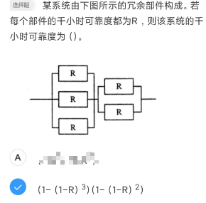
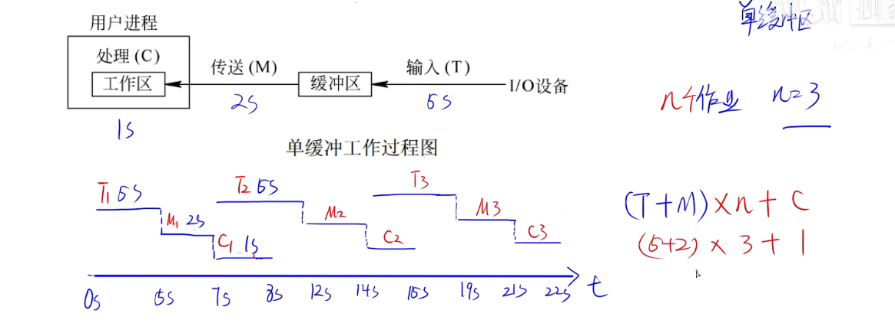

#  软考知识点

## 第一章 计算机系统

### 基本概念

基本硬件系统：运算器、控制器、存储器、输入设备、输出设备

### 中央处理单元

中央处理单元CPU：运算器、控制器

CPU的功能：

1. 程序控制：通过执行**指令**控制程序的执行顺序
2. 操作控制：产生指令的操作**信号**并发送到不同部件
3. 时间控制：指令的执行**时间**，信号的出现**时间**，持续时间，出现顺序
4. 数据处理：算术运算和逻辑运算（CPU最根本的任务）

功能1、2都是控制器的作用，功能3是对功能1、2的保障，功能4是运算器的作用

CPU主要由**运算器****、控制器**、寄存器组和总线等部件构成

1）运算器：

运算器由算术逻辑单元ALU、累加寄存器、数据缓冲寄存器、状态条件寄存器组成，完成算数和逻辑运算。

它是执行部件，接受控制器的命令进行动作。

（1）算术逻辑单元ALU：

（2）**累加寄存器AC：提供工作区，存放减数被减数以及执行完的结果。**

（3）数据缓冲寄存器DR：对内存读写时，存放指令或者数字，是CPU与内存/外部设备的中转站

（4）条件状态寄存器：进位、溢出、中断等

2）控制器

决定了计算机运行过程的**自动化**，**保证程序正确执行还要处理异常事件**

（1）指令寄存器IR：指令从内存取到数据缓冲寄存器中，然后存到指令寄存器IR中

（2）程序计数器PC：存放的是第一条指令的地址，然后随着指令执行加一或者跳转。

（3）地址寄存器AR：保存当前CPU访问的内存单元的地址，因为内存和CPU操作速度差异大

（4）指令译码器ID：对操作码分析和解释，发出控制信号

指令寄存器的位数取决于指令字长，对用户来说是**完全透明的**

程序计数器是程序员可以访问的

CPU的译码器主要作用是**指令**译码

指令：操作码+地址码

3）寄存器组：专用寄存器和通用寄存器

4）内部总线：8,16,32,64位

题型：概念选择 对策：理解并记忆概念 重点：累加寄存器AC、

存储单位计算：一定注意字节和位

### 数据表示

1）原码：符号位，0两个

2）反码：符号位，0两个，负数取反

3）补码：符号位，0一个，负数取反加一，因此容易加减（**简化计算机运算部件的设计**）

4）移码：在补码的基础之上，符号位取反

补码特性：一个数的补码的补码等于原码。    

表示范围：

- 因为符号位，所以次方数那里n-1；因为没法进位，所以后面要-1。
- 补码和移码最多表示2^n个数，而原码和反码只能表示2^n  -1个数（0占了两个）。在能表示的数的数量上定点小数和定点整数一样。也就是说用补码可以表示的定点小数也有2^n个
- **源码****和反码范围一样；****补码****负数范围多一个，因为负数取反加一；移码和补码一样。**

题型：计算或者特殊值的选择 对策：会算（一定注意符号位！！！） 重点：补码能多表示一个负数。

定点数和浮点数：

1）定点数：小数点位置固定不变的数。分为定点整数和定点小数，其存储时小数点不占空间。

2）浮点数小数点位置不固定的数。用阶码和尾数来表示数

浮点数经常表示成：

式中：M为尾数；R为基数；E为阶码

- 浮点数表示的数值范围主要由阶码决定
- 浮点数表示的精度由尾数决定
- 规格化是指将尾数的绝对值限定在[0.5,1]
- 浮点数的计算**首先要统一阶码**，然后**小阶向大阶对齐**，同时**尾数右移**n位（小幼）
- 小数点不占存储位的哦！
- 下面这个是要背的公式

这个计算的答案有技巧，**最大和最小2的次方数是一样的，而且次方数一定是奇数**，而且**括号里面的次方数也和原题中的值相差1（括差一，指为奇）**

给一道好题：

### 寻址

- 立即寻址：操作数就包含在指令中。
- 直接寻址：操作数存放在内存单元中，指令中直接给出操作数所在存储单元的地址。
- 寄存器寻址：操作数存放在某一寄存器中，指令中给出存放操作数的寄存器名。
- 寄存器间接寻址：操作数存放在内存单元中，操作数所在存储单元的地址在某个寄存器中。
- 间接寻址：指令中给出操作数地址的地址。
- 相对寻址：指令地址码给出的是一个偏移量（可正可负），操作数地址等于本条指令的地址加上该偏移量。
- 变址寻址：操作数地址等于变址寄存器的内容加偏移量。

除了立即寻址和寄存器寻址，其他的都是把操作数放到内存里。

指令系统中采用不同寻址方式的目的是：**扩大寻址空间，提高编程灵活性**

寻址速度上：立即>寄存器>直接>间接

题型：概念

### 校验码

奇偶校验

增加一位校验码使得编码中1的个数为奇数/偶数。奇校验只能检测奇数位出错，但是不能纠错。常用的奇偶校验有三种：水平奇偶校验码、垂直奇偶校验码和水平垂直校验码。

海明码

是一种利用**奇偶性**来检错和纠错的校验方法。海明码的构成方法是在数据位之间的特定位置上插入k个校验位，通过**扩大码距**来实现检错和纠错。

海明码的码距为1就啥也干不了，为2可以检错，**大于等于3**可以纠错。

需要记忆：

循环冗余校验码CRC 

只能检错，不能纠错。**码距为2**。求的时候采用**模2运算**得到。

**k个数据位后面加上r个****校验位**，编码长度k+r

题型：概念

重点：奇偶校验、码距、公式、海明码某一位数据位由第几位校验

### RISC和CISC

C是complex 复杂， R是Reduce 精简

RISC**寄存器数量还更多**，是因为**寻址方式少，为了减少访问次数**

纠正：这两个都支持流水线技术，前者更适合

精简指令集RISC采用**硬布线逻辑**执行指令，而CISC不，硬着来简单

### 流水线

流水线：第一条指令的执行时间+（n-1）最长时间段

流水线的操作周期至少是最长的指令所用时间

最大吞吐率是指单位时间流水线处理任务数，取决于流水线中最慢一段所需的时间。  如果各段流水的操作时间不同，则流水线的吞吐率是最长流水段操作时间的倒数。

如果流水线出现断流，加速比会明显下降

**要使****加速比****和效率最大化应该对流水线各级采用相同的运行时间**

不能采用异步控制

计算机流水线周期是指采用流水线技术执行多条指令时，在保证设备利用率不变的前提下，一条指令的开始到下一条指令的最晚开始时间的总称。也就是，花费时间最长的操作所用的时间。

### 存储器

分类：

1)按存储器所处的位置分类

按存储器所处的位置可分为内存和外存。

(1)内存。也称为主存，设在主机内或主机板上，用来存放机器当前运行所需要的程序和数据，以便向CPU提供信息。相对于外存，其特点是容量小、速度快。

(2)外存。也称为辅存，如磁盘、磁带和光盘等，用来存放当前不参加运行的大量信息，而在需要时调入内存。

这个图要记住

2)按存储器的工作方式分类

按存储器的工作方式可分为读/写存储器和只读存储

(1)读/写存储器(RAM)

(2)只读存储器(ROM)

**闪存**（闪速存储器）：**以块为单位删除**，断电信息不丢失，**可代替****ROM****，不可以代替****主存**

**BIOS保存在主板的****ROM****中**

3)按寻址方式可分为随机存储器、顺序存储器和直接存储器。

4)**虚拟存储器由****主存****和辅存构成**

5）相联存储器是一种按**内容**访问的存储器

由上面的图可以看出，CPU访问**通用寄存器**是最快的

遇到计算存储器块以及所在芯片的最小地址编号的计算题时记住，如果要求是八位，我们只有四位的，那么是两个四位的拼成一块芯片。并且地址划分是0000~07FFF（H）不要算多

### CPU访问内存时的局部性

空间局部性：可能会访问已访问过的地址的相邻地址

时间局部性：可能会再次访问已经访问过的地址

### 高速缓存Cache

高速缓存用来存放当前最活跃的程序和数据，其特点是：位于CPU与主存之间：容量一般在几千字节到几兆字节之间：速度一般比主存快5~10倍，由快速半导体存储器构成：其内容是主存局部域的副本，对程序员来说是**透明的**

因此，**Cache与****主存**的地址映像由**专门的硬件自动完成**

其设计思想是在合理成本下提高命中率

说Cache扩大了主存容量是错的

### 替换算法

替换算法的目标就是使Cache获得尽可能高的命中率。常用算法有如下几种。

(1)随机替换算法。就是用随机数发生器产生一个要替换的块号，将该块替换出去。

(2)先进先出算法。就是将最先进入Cache的信息块替换出去。

(3)近期最少使用算法。这种方法是将近期最少使用的Cache中的信息块替换出去。

(4)优化替换算法。这种方法必须先执行一次程序，统计Cache的替换情况。有了这样的先验信息，在第二次执行该程序时便可以用最有效的方式来替换。

Cache的命中率与Cache容量的关系如图1-12所示。**Cache容量越大，则命中率越高**，随着Cache容量的增加，其失效率接近0%（命中率逐渐接近100%)。但是，增加Cache容量意味着增加Cache的成本和增加Cache的命中时间。

**替换算法的时间复杂度不影响Cash命中率**，因为时间复杂度只是改进算法，减少算法时间，并不改变算法结果，也就是说命中率不影响，减少的是处理时间。

### 高速缓存中的地址映像方法

在CPU工作时，送出的是主存单元的地址，而应从Cache存储器中读/写信息。这就需要将主存地址转换成Cache存储器的地址，这种地址的转换称为地址映像。Cache的地址映像有如下3种方法。

(1)直接映像。直接映像是指主存的块与Cache块的对应关系是固定的。

(2)全相联映像。主存与Cache存储器均分成大小相同的块。这种映像方式允许主存的**任意一块**可以调入Cache存储器的**任何一个**块的空间中。

(3)组相联

在这三种映射方式中，发生冲突次数的大小顺序是**全相联<组相联<直接映像**

### 中断

中断向量：提供中断服务程序的入口地址

中断响应时间：发出终端请求开始到进入中断程序的时间

保存现场：返回去执行源程序

为了便于实现多级中断嵌套，使用 **堆栈**  来保护断点和现场最有效。

### 输入输出方式

1、程序查询方式

①CPU和I/0(外设)只能**串行**工作CPU需要一直轮询检查，长期处于忙等状态。CPU利用率低

②一次只能读/写**一个字节**

③由CPU将数放入内存

2、中断驱动方式

①I/0设备通过中断信号主动报告I/0操作已完成

②CPU和I/0(外设)可**并行**工作

③CPU利用率得到提升

④一次只能读/写**一个字节**

⑤由CPU将数放入内存

3、**直接存储器方式(****DMA****)中文名也要记**

①CPU和I/0(外设)可**并行**工作

②仅在传送数据块的开始和结束时才需要CPU的干预，**数据传输时无需CPU干预**

③由**外设**直接将数据放入**主存**

④一次读写的**单位为“块”而不是字** 

⑤DMA传送结束为中断

DMA获得内存总线的控制权，单纯的是为了做内存访问，所以仅需要一个**存储周期**。这是和时钟周期没关系的。然后CPU在一个**总线周期**结束时响应DMA请求（**DMA纯种（存，总）**）

但是不管是哪种情况都需要CPU保护现场

### 总线

考的分低，而且很偏，而且很多。建议放弃。

总线分为三类：数据总线、地址总线、控制总线（SDK）

PCI并行内总线

**SCSI****并行****外总线（外部总线不属于****系统总线****）**

**地址总线**和内存中存放数据的容量有关，比如**内容容量**为4G对应**地址总线**4G=2的32次方，则地址总线宽度为32；**数据总线**和**字长**有关，所以字长为32时，直接对应数据总线宽度为32

使用总线或者说总线复用方式的好处是：**可以减少信息传输线的数量**

### 加密技术与认证技术

加密技术：

1、对称加密

加密和解密是同一把密钥，只有一把密钥，密钥分发有缺陷

①加密解密速度很快

②适合加量大量明文数据

2、非对称加密

加密和解密不是同一把密钥，一共有两把密钥，分别是公钥和私钥

用**接收方的****公钥**加密明文防止窃听

3、混合加密

先用对称秘钥加密，然后外面再用接收方的公钥加密一次

认证技术：

摘要：将发送的明文进行Hash算法后得到摘要，放在密文后一起发送过去，与接收方解密后的明文进行相同的Hash算法得到的摘要进行对比，如果一致，则没有篡改，否则有篡改

CA:权威机构

数字证书：

用户向CA机构申请数字证书，将个人信息和公钥发给CA机构，CA机构颁给用户数字证书，数字证书用CA的私钥进行签名（加密），用CA的公钥验证（解密）数字证书，得到用户的公钥

证书中包含公钥是为了不被其他人篡改公钥，而不是用来验证真伪。想要验证网站真伪用的是CA的签名/公钥

数字签名

发送方用自己的私钥对摘要进行签名（加密），得到数字签名放在密文后一起发送过去，接收方用发送方的公钥对数字签名进行验证（解密)，如果验证成功则该消息没有被假冒且不能否认，否则该消息的真实性为假冒发送

对称密钥（私钥、私有密钥加密）算法：(**共享密钥****加密**算法)

1、**DES**

2、3DES

3、**RC-5**

4、IDEA

5、AES

6、**RC4**

非对称密钥（公钥、**公开****密钥加密**)算法：

1、**RSA**

2、ECC

3、DSA

Hash函数

**MD5****摘要算法**，摘要是为了防止消息被篡改，对任意长度的输入计算得到的结果都是**128位**。

**SHA-1****安全散列算法**

### 冗余技术

分为四类

时间冗余：以重复执行指令抵消瞬时错误的影响

信息冗余：为检测或纠正信息错误另外加的一部分信息

**结构冗余**：按照工作方法分为：静态、动态、混合冗余

### 可靠性计算

串联：

并联：

遇到该部分的计算题直接看规律然后根据感觉选就好了

用户不可见（透明）**指令寄存器****（****IR****）**暂存寄存器（DR）存储器地址寄存器（MAR）存储器数据寄存器（MDR）用户可见：通用寄存器组、程序状态字寄存器（PSWR）**程序计数器****（PC）**累加寄存器（ACC）

CPU依据**指令****周期的不同阶段**来区分二级制编码形式存放的指令和数据。

软件产品的可靠性不取决于：**软件产品的开发方式**

可靠性：MTTF/(1+MTTF) TFboys

可用性：MTBF/(1+MTBF)  boyfriend

可维护性：1/(1+MTTR)    三人选一做对象

### 注意

存储容量的计算，减法最容易出错，切记！！

## 第二章 程序设计语言

### 低级语言和高级语言

低级语言：汇编语言，机器语言

高级语言：有解释型和编译型

### 解释器和编译器

解释器：没有**目标程序，解释程序和源程序要参与到程序的运行过程中，慢**

编译器：有**目标程序，快**

编译方式：词法分析、语法分析、语义分析、中间代码生成、代码优化、目标代码生成

解释方式：词法分析、语法分析、语义分析

编译器和解释器都**不可省略**词法分析、语法分析、语义分析且**顺序不可交换**即词法分析、语法分析、语义分析是必须的。

编译器方式中**中间代码生成和代码优化不是必要，可省略。**

即编译器方式可以在词法分析、语法分析、语义分析阶段后直接生成目标代码

**运行时**结合是**动态绑定**，编译时结合是静态绑定

### 符号表：

用于词法分析，不断收集、记录和使用源程序中一些相关符号的类型和特征等信息，并将其存入符号表中。记录源程序中各个字符的必要信息，以辅助语义的正确性检查和代码生成。，

### 编译器的工作阶段

**词法分析**

输入：**源程序**；输出：**记号流**

词法分析阶段的主要作用是：分析构成程序的**字符**及由字符按照构造规则构成的**符号**是否符合程序语言的规定

**语法分析**

输入：**记号流**；输出：**语法树**（分析树）语法分析的输入是词法分析的输出

语法分析阶段可以发现程序中**所有的**语法错误

语法分析阶段的主要作用是：

对各条语句的**结构**进行合法性分析，分析程序中的句子**结构**是否正确

**语义分析**

输入：**语法树**（分析树)

语义分析阶段的主要作用是进行类型分析和检查，语义分析阶段**不能发现程序中所有的语义错误**

语义分析阶段**可以发现静态语义错误,不能发现动态语义错误**，动态语义错误运行时才能发现

所以，语法分析可以分析出所有的语法错误，但是语义分析不能发现所有的语义错误。

**目标****代码生成：**

**目标代码生成阶段的工作与具体的****机器****密切相关，****寄存器的分配****处于目标代码生成阶段**

### 中间代码

常见的中间代码有：**后缀式、三地址码、三元式、四元式和树（图）**等形式。后334树

**中间****代码**与具体的**机器无关**（**不依赖具体的机器**），可以将**不同的高级程序语言翻译成同一种中间代码**。

中间代码可以跨平台。

因为与具体的机器无关，使用中间代码有利于**提高编译程序的可移植性**。

### 正规式

**词法分析**的工具

### 有限自动机

有限自动机是**词法分析**的一个工具，它能正确地识别正规集

确定的有限自动机(DFA)：对每一个状态来说识别字符后转移的状态是唯一的

不确定的有限自动机(NFA)：对每一个状态来说识别字符后转移的状态是不唯一的

也就是看输出线对于同一个状态会不会有两条输出

### 上下文无关法

用于表示**语法**规则，有终结符号，大多数程序设计语言的语法规则用**上下文无关法**

上下文无关法一定是从开始符号出发到终结符号结束，不要管其他什么的集合

那种ab的个数要求一样的不能用正规式表示，也不能用有限自动机识别

### 中缀、后缀表达式转换

后缀式也称为逆波兰式，用**栈**求取

### HTMl语法

超链接点击后的属性是vlink，正在点击的属性是alink

`<tr>`代表表格的行`<co>`代表表格的列`<td>`代表一个单元格

`
`代表分隔符

`<maito>`代表电子邮件

### 杂项

不能反编译出源程序，因为注释丢失了

**脚本语言****都是****动态语言****，而动态语言都是解释型语言。**

链表中的结点空间需要程序员根据需要申请和释放，因此，数据空间应采用**堆存储分配策略**。

PHP是脚本语言不是标记语言

可视化程序设计还是要写代码的。

**编译过程中为变量分配存储单元所用的地址**是**逻辑地址**，程序运行时再映射为物理地址。

程序运行时的用户内存空间一般划分为代码区、静态数据区、栈区和堆区其中栈区和堆区也称为动态数据区。全局变量的存储空间在静态数据区。

**递归****下降****分析法和****预测****分析法是常用的自顶向下****语法****分析法。（预测，下！）**

**算符优先分析法和****LR****分析法属于自底向上的语法分析方法（算了，进去，上！）**

**移进-归约分析是自底向上的分析法** 

**Lisp是****函数式编程****语言，Prolog是逻辑式程序语言，**

包含8个小组成员沟通的路径最多有**n(n-1)/2**条，也就是28条。此时任意两个人都有一条沟通路径

程序汇总的数据必须有类型，**作用不包括动态定义数据结构**。

常见的命名对象有**变量，函数，****数据类型**

语法指导翻译是**静态语义分析**

短路计算即使是优先级高的在后面， 也是要从左往右看的

## 第三章 知识产权

### 著作权

产生时间：作品完成之日

客体：包括源程序、目标程序、软件文档，不包括如软件开发思想

翻译权：指的是从一种程序语言转换成其他程序语言的权利

**发表权：其保护期受时间限制**，因为这是一次性的权利。其他的著名权、修改权、保护作品完整性权保护期不受时间限制

**合理使用**可以不经著作人许可，不用支付报酬使用其作品

在软件复制品持有人未知情的情况下，可以支付合理费用后继续使用软件。

学术论文不可以引用未发表作品

不受著作权保护的内容有：**法律法规**、时事新闻、历法、公式

职务作品：

如果是为了完成公司的任务而开发的，著作权属于公司。

但是如果是受非任职单位所托，利用材料和技术开发的，要看有没有特别约定，没有特别约定则归属程序员。

### 专利权

保护对象：软件/程序（只说软件代码是不正确的）

先申请原则：先申请的人享有专利，如果同一天申请则应当**自行协商**，否则驳回所有人的申请。

不管是协商还是驳回还是作为共同申请人，反正不可能两个都授予专利

### 商标权

权利人：软件**注册**商标所有人

商标权保护期可以**延长**，由此可以达到**无限期拥有**，其他的都不行

抽签原则：如果同一天申请则应当自行协商，协商不成则抽签决定，但是如果已经在使用了，则先使用的一方获得商标权

必须使用注册商标的商品是：烟草制品

专利很重要的，因此同时申请必须商量好否则全驳回。但是商标协商不成就可以抽签，不过要看谁先用了

## 第四章 数据库

### 数据模型

概念数据模型：E-R图

结构数据模型：层次、网状、关系模型

层次模型：树结构

网状模型：网络结构

关系模型：**列表**

### 三级模式结构

概念模式（模式），外模式，内模式

模式：基本表

外模式：视图

内模式：存储文件

### 两级映像

外模式/模式映像：保障了逻辑独立性

模式/内模式映像：保障了物理独立性

### 关系模式的概念术语

候选码：可以有多个

主码（主属性）：从候选码中选择一个

全码：所有属性都是候选码

超码：包含码的属性集

等值连接：两个集合都有的列需要数值相同

**自然连接：**自然连接是除去重复属性的等值连接

转成SQL语言之后：笛卡尔积是R，S，而自然连接是R X S

###  范式

1NF：要求属性不可再分，比如地址可以分成省/市/街道

2NF：要求每一个非主属性完全依赖于候选码（）

3NF：要求不存在部分函数依赖

BCNF：

4NF：要多值依赖的依赖者必须包含候选码

### 无损连接和保持函数依赖

无损连接性指的是对关系模式分解时，原关系模式下任一合法的关系实例在分解之后

应能通过自然连接运算恢复起来。

### 数据库设计

需求分析：确定系统边界

概念设计

逻辑设计：关系规范化

物理设计

其他几个都要以需求分析设计为基础

### 事务

事务的四个性质

原子性：

一致性：执行结果必须保证数据库从一个一致性状态转变到另一个一致性状态

隔离性：多个事务并发时，任一事务的操作对其他事务不可见

持久性：一旦提交成功，即使数据库崩溃，执行结果也不会丢失

关系模型采用二维表格的结构

### 四种冲突

结构冲突：有不同属性

命名冲突：有不同命名

语义冲突：

属性冲突：取值范围，单位不一致

## 第五章 面向对象

### 类

类可以分为三类：实体类、接口类（边界类）、控制类

实体类：现实世界的人和物

接口类：用户与系统的合作交互方式

控制类：协调者

### 对象

对象包括属性和方法，这两个词有很多其他的别名

属性：状态、数据

方法：函数、操作、行为、

### 动态绑定和静态绑定

编译时是静态绑定，运行时是动态绑定，动态绑定和多态有关

### 多态

有参数、包含、过载、强制四种，

参数是最纯的多态

其中**包含是最常见**的，最常见的例子是子类型化

**过载是指操作具有相同的名称、且在不同的上下文中代表的含义不同\*2**

### 面向对象的设计原则

(l)单一责任原则(Single Responsibility Principle,SRP)。就一个类而言，应该仅有一个引起它变化的原因。即，当需要修改某个类的时候原因有且只有一个，让一个类只做一种类型责任

(2)开放-封闭原则(Open&Close Principle,OCP)。软件实体（类、模块、函数等）应该是可以扩展的，即开放的：但是不可修改的，即封闭的。

(3)里氏替换原则(Liskov Substitution Principle,LSP)。子类型必须能够替换掉他们的基类型。即，在任何父类可以出现的地方，都可以用子类的实例来赋值给父类型的引用。当一个子类的实例应该能够替换任何其超类的实例时，它们之间才具有是一个关系。

(4)依赖倒置原则(Dependence Inversion Principle,DP)。抽象不应该依赖于细节，细节应该依赖于抽象。即，高层模块不应该依赖于低层模块，二者都应该依赖于抽象。

(5)接口分离原则(Interface Segregation Principle,ISP)。不应该强迫客户依赖于它们不用的方法。接口属于客户，不属于它所在的类层次结构。即：依赖于抽象，不要依赖于具体，同时在抽象级别不应该有对于细节的依赖。这样做的好处就在于可以最大限度地应对可能的变化。

(7)共同封闭原则(Common Closure Principle,.CCP)。包中的所有类对于同一类性质的变化应该是共同到闭的。一个变化若对一个包产生影响，则将对该包中的所有类产生影响，而对于其他的包不造成任何影响。

(8)共同重用原则(Common Reuse Principle,CRP)。一个包中的所有类应该是共同重用的。如果重用了包中的一个类那么就要重用包中的所有类。

### 面向对象分析OOA

面间对象分析包含5个活动：

**认定对象、**

**组织对象、**

**描述对象间的相互作用、**

**确定对象的操作、**

**定义对象的内部信息。**

### 面向对象设计OOD

目标是定义系统构造蓝图

**(1)识别类及对象。**

**(2)定义属性。**

**(3)定义服务。**

**(4)识别关系。**

**(5)识别包**

这五个活动分别对应面向对象分析的五个活动

### 面向对象测试

四个层次：算法层、类层、模板层、系统层

### 杂题

领域类模型不包含领域对象

## 第六章 UML

UML（统一建模语言）

三个要素：事物、关系、图

### 事物

有4种事物：结构事物、行为事物、分组事物和注释事物。

结构事物：模型的静态部分，包括类，接口，用例，构件，制品，结点

行为事物：模型的动态部分，有消息、状态、动作

分组事物：组织部分，主要的分组事物

注释事物：解释部分

### 依赖关系

4种关系：**依赖、关联、泛化和实现**

(1)依赖(Dependency)。依赖是其中一个事物（独立事物）发生变化会影响另一个事物（依赖事物）的语义。用虚线箭头表示

(2)关联(Association)。关联是一种结构关系，它描述了一组链，链是对象之间的连接。关联上可以标注多重度（0..1   0..*）

聚合：一个类消失了另一个类还存在。空心菱形箭头

组合：一个类消失了另一个类也消失。实心菱形箭头

(3)泛化(Generalization)。泛化是一种特殊/一般关系，特殊元素（子元素）的对象可替代一般元素（父元素）的对象。空心三角箭头

(4)实现(Realization)。实现是类元之间的语义关系，其中一个类元指定了由另一个类元保证执行的契约。虚线三角箭头

### 关联多重度

指的是一个类的实例能够与另一个类的多少个实例相关联

采用面向对象方法进行系统开发时，需要对两者之间关系创建新类的是多对多关系

### 类图 
### 对象图(静态方面建模)

对象图(Object Diagram)展现了某一时刻一组对象以及它们之间的关系，描述了实例的静态快照，一般包括对象和链。

是一个方框分为上下两部分

### 用例图(静态方面建模)

用例图(Use Case Diagram)展现了一组用例、参与者(Actor)以及它们之间的关系。

(1)用例。

(2)参与者。

(3)用例之间的**扩展**关系(`<<extend>>`)和**包含**关系(`<<include>>`),参与者和用例之间的关联关系，用例与用例以及参与者与参与者之间的**泛化**关系

用例之间的关系：

虚线：包含关系

空箭头：泛化关系/扩展关系

### 交互图(动态方面建模)

动态方面建模，包含序列图和通信图

**序列图**：也叫顺序图，有对象生命线（虚线）和控制焦点（瘦高的矩形）

**通信图**：也叫协作图，通过链连接对象，链旁边有发送和接收的消息

交互概览图

计时图

### 状态图

由状态、转换、事件和活动组成了一个状态机。

事件触发一个没有特定监护条件的迁移时，对象也不一定离开当前状态

### 活动图

活动图(Activity Diagram)是一种特殊的状态图，它展现了在系统内从一个活动到另一个活动的流程

### 构件图（组件图）

### 部署图

## 第七章 设计模式

设计模式按目的可以分为三大类：创建型模式、结构型模式、行为型模式

背下创建型和结构型5+7种模式，剩下11种就是行为型模式了

口诀：我（w外观）兄（x享元）弟（d代理）竖（s适配器）起（q桥接）中（z组装）指（z装饰）

### 创建型模式

简单工厂模式->工厂方法模式->抽象工厂模式

简单工厂模式不属于23种设计模式之一

**简单****工厂模式**：定义一个工厂类，他可以根据参数的不同返回不同类的实例，被创建的实例通常都具有共同的父类

**工厂方法****模式**：定义一个用于创建对象的接口，让子类决定实例化哪一个类。Factory Method使一个类的实例化延迟到其子类

由于简单工厂模式违反了开闭原则，因此改进后将工厂类变成抽象接口。

工厂方法模式适用于：（核心：创建对象的事，子类来做）

- 当一个类不知道它所必须创建的对象的类的时候。
- 当一个类希望由它的子类来指定它所创建的对象的时候。
- 当类将创建对象的职责委托给多个帮助子类中的某一个，并且你希望将哪一个帮助子类是代理者这一信息局部化的时候。

**抽象工厂模式**：提供一个创建**一系列相关或相互依赖对象的接口**，而无须指定它们具体的类。

变化：产品从一种变成了多种

适用于：**（系列，产品，组合）**

- 一个系统要独立于它的产品的**创建、组合和表示**时。
- 一个系统要由多个**产品系列**中的一个来配置时。
- 当要强调**一系列相关的产品**对象的设计以便进行联合使用时。
- 当提供一个**产品类库**，只想显示它们的接口而不是实现时。

**生成器模式**：将一个复杂对象的构建与它的表示分离，使得同样的构建过程可以创建不同的表示。

首先上面的Builder是抽象生成器，下面的具体的Builder是实现了不同的具体生成器。然后你需要哪个对象就扔给Director哪个生成器的实例，Director会帮你调用Builder方法。然后你再调用这个生成器的getresult方法就可以拿到产品实例了。

适用于：

- 当**创建**复杂对象的算法应该**独立于该**对象的组成部分以及它们的装配方式时。
- 当**构造过程**必须允许被构造的对象有不同的表示时。

**原型模式**：用原型实例指定创建对象的种类，并且通过复制这些原型创建新的对象。

适用于：

- 当一个系统应该独立于它的产品**创建、构成和表示**时。（抽象工厂模式和这个很像但是中间的不一样）
- 当要**实例化**的类是在**运行时**刻指定时，例如，通过动态装载。
- 为了**避免**创建一个与产品类层次平行的**工厂类**层次时。
- 当一个类的实例只能有几个不同状态组合中的一种时。建立相应数目的原型并克隆它们，可能比每次用合适的状态手工实例化该类更方便一些。

**单例模式**：保证一个类仅有一个实例，并提供一个访问它的全局访问点。

适用性：

- 当类只能有一个实例而且客户可以从一个众所周知的访问点访问它时。
- 当这个唯一实例应该是通过子类化可扩展的，并且客户无须更改代码就能使用一个扩展的实例时。

### 结构型设计模式

**适配器模式**：将一个类的接口转换成客户希望的另外一个接口。Adapter模式使得原本由于接口不兼容而不能一起工作的那些类可以一起工作。

适用于：

- 想使用一个已经存在的类，而它的接口不符合要求。
- 想创建一个可以复用的类，该类可以与其他不相关的类或不可预见的类（即那些接口可能不一定兼容的类)协同工作。
- (仅适用于对象Adapter)想使用一个己经存在的子类，但是不可能对每一个都进行子类化以匹配它们的接口。对象适配器可以适配它的父类接口。

**桥接模式**：将**抽象部分与其实现部分分离**，使它们都可以独立地变化。

适用于：**（抽象与现实分离，隐藏抽象，客户不知道）**

- 不希望在抽象和它的实现部分之间有一个固定的绑定关系。例如，这种情况可能是因为，在程序运行时刻实现部分应可以被选择或者切换。
- 类的抽象以及它的实现都应该可以通过生成子类的方法加以扩充。这是Bridge模式使得开发者可以对不同的抽象接口和实现部分进行组合，并分别对它们进行扩充。
- 对一个抽象的实现部分的修改应对客户不产生影响，即客户代码不必重新编译。
- (C++)想对客户**完全隐藏抽象的实现部分**。
- 有许多类要生成的类层次结构。
- 想在多个对象间共享实现（可能使用引用计数），但同时要求客户并不知道这一点。

**组合模式**：将对象组合成**树型结构**以表示**“部分-整体”**的层次结构。Composite使得用户对单个对象和组合对象的使用具有一致性。

适用于：（部分与整体，树形结构）

- 想表示对象的部分-整体层次结构。
- 希望用户忽略组合对象与单个对象的不同，用户将统一地使用组合结构中的所有对象。

**装饰模式**：

动态地给一个对象添加一些额外的职责。就增加功能而言，Decorator模式比生成子类更加灵活。

适用于：

- Component定义一个对象接口，可以给这些对象动态地**添加职责**。
- ConcreteComponent定义一个对象，可以给这个对象添加一些职责。
- Decorator维持一个指向Component对象的指针，并定义一个与Component接口一致的接口。
- ConcreteDecorator向组件添加职责。

**外观模式**：

为子系统中的一组接口提供一个一致的界面，Facade模式定义了一个高层接口，这个接口使得这一子系统更加容易使用。

适用于：

- 要为一个复杂子系统提供一个**简单接口**时
- 客户程序与抽象类的实现部分之间存在着很大的**依赖性**。
- 当需要构建一个**层次结构的子系统**时，使用Facade模式定义子系统中每层的入口点。

**享元模式**：

运用共享技术有效地支持大量细粒度的对象。

适用于：

- 一个应用程序使用了大量的对象。
- 完全由于使用大量的对象，造成很大的存储开销。
- 对象的大多数状态都可变为外部状态。
- 如果删除对象的外部状态，那么可以用相对较少的共享对象取代很多组对象。
- 应用程序不依赖于对象标识。由于Flyweight对象可以被共享，所以对于概念上明显有别的对象，标识测试将返回真值。

**代理模式：**

为其他对象提供一种代理以**控制对这个对象的访问**。

适用于:在需要比较通用和复杂的对象指针代替简单的指针的时候

### **行为型设计模式**

**责任链模式****：**

适用于： 有多个的对象可以处理一个请求，哪个对象处理该请求运行时刻自动确定 想在不明确指定接收者的情况下向多个对象中的一个提交一个请求。 可处理一个请求的对象集合应被动态指定。

**命令模式****：**

将一个请求封装为一个对象，从而使得可以用不同的请求对客户进行参数化：对请求排队或记录请求日志，以及支持可撤销的操作。

适用于：

 抽象出待执行的动作以**参数化**某对象

在不同的时刻指定、排列和执行请求

支持取消操作

支持修改日志

用构建在源语操作上的高层操作构造一个系统

**解释器****模式：**

给定一个语言，定义它的文法的一种表示，并定义一个解释器，这个解释器使用该表示来解释语言中的句子。

**迭代器模式****：**

提供一种方法顺序访问一个聚合对象中的各个元素，且不需要暴露该对象的内部表示。

访问一个聚合对象的内容而无须暴露它的内部表示。

支特对聚合对象的多种遍历

为遍历不同的聚合结构提供一个统一的接口。

**中介者模式****：**

用一个中介对象米封装一系列的对象交互。中介者使各对象不需要显式地相互引用，从而使其耦合松散，而且可以独立地改变它们之间的交互。

适用于：

一组对象以定义良好但是复杂的方式进行通信，产生的相互依赖关系结构混乱且难以理解。

一个对象引用其他很多对象并且直接与这些对象通信，导致难以复用该对象。

想定制一个分布在多个类中的行为，而又不想生成太多的子类。

**备忘录模式****：**

在不破坏封装性的前提下捕获一个对象的内部状态，并在对象之外保存这个状态。这样以后就可以将对象恢复到原先保存的状态。

适用于：

必须保存一个对象在某一个时刻的（部分）状态，这样以后需要时它才能恢复到先前的状态。

如果一个用接口来让其他对象直接得到这些状态，将会暴露对象的实现细节并破坏对象的封装性。

**观察者模式：**

定义对象间的一种一对多的依赖关系，当一个对象的状态发生改变时，所有依赖于它的对象都得到通知并被自动更新。

适用于：

当一个抽象模型有两个方面，其中一个方面依赖于另一个方面，将这两者封装在独立的对象中以使它们可以各自独立地改变和复用。

当对一个对象的改变需要同时改变其他对象，而不知道具体有多少对象有待改变时。

当一个对象必须通知其他对象，而它又不能假定其他对象是谁，即不希望这些对象是紧耦合的。

**状态模式****：**

允许一个对象在其内部状态改变时改变它的行为。对象看起来似乎修改了它的类。

适用于：

一个对象的行为决定于它的状态，并且它必须在运行时刻根据状态改变它的行为。

一个操作中含有庞大的多分支的条件语句，且这些分支依赖于该对象的状态。

**策略模式：**

定义一系列的算法，把它们一个个封装起来，并且使它们可以相互替换。此模式**使得算法可以独立于使用它们的客户而变化**。

适用于：

- 许多相关的类仅仅是行为有异
- 需要使用一个算法的不同变体

**模板方法模式：**

**访问者模式****：**

表示一个作用于某对象结构中的各元素的操作。它允许在不改变各元素的类的前提下定义作用于这些元素的新操作。

适用于：

一个对象结构包含很多类对象，它们有不同的接口，而用户想对这些对象实施一些依赖于其具体类的操作。

**需要对一个对象结构中的对象进行很多不同的并且不相关的操作**

定义对象结构的类很少改变，但经常需要在此结构上定义新的操作。

## 第八章 操作系统

### 地位

### 进程管理

PV操作：同步、互斥、前驱

**顺序执行：**

前趋操作：

S信号量只有0和1，P1执行后会有V操作，P2执行前会有P操作

前趋图中，有几个箭头就有几个信号量

**并发执行：**

横的是直接制约，斜的是间接制约，同一列是并发执行

程序并发执行时的特征如下。

(1)失去了程序的封闭性

(2)程序和机器的执行程序的活动不再一一对应。

(3)并发程序间的相互制约性。

### 进程间的通信

同步是合作进程间的直接制约问题，互斥是申请临界资源进程间的间接制约问题。

临界区管理的四条原则：

(1)有空即进。当无进程处于临界区时，允许进程进入临界区，并且只能在临界区运行有限

的时间。

(2)无空则等。当有一个进程在临界区时，其他欲进入临界区的进程必须等待，以保证进

程互斥地访问临界资源。

(3)有限等待。对于要求访问临界资源的进程，应保证进程能在有限的时间进入临界区，

以免陷入“饥饿”状态。

(4)让权等待。当进程不能进入自己的临界区时，应立即释放处理机，以免进程陷入忙等

状态。

整型信号量与PV操作

信号量是一个整型变量，根据控制对象的不同被赋予不同的值。信号量分为如下两类：

(1)公用信号量。实现进程间的互斥，初值为1或资源的数目。

(2)私用信号量。实现进程间的同步，初值为0或某个正整数。

信号量S的物理意义：S≥0表示某资源的可用数，若S<0,则其绝对值表示阻塞队列中等该资源的进程数。

### 死锁

同类资源分配不当引起死锁。若系统中有m个资源被n个进程共享，当每个进程都要求k个资源，而m<k时，即资源数小于进程所要求的总数时，可能会引起死锁。（系统采用的分配策略为轮流的为每个进程分配）

公式：**资源数≥（进程数）\*（每个进程所需资源数-1）+1**

### 进程资源图

只要有进程可以运行就能化简

### 死锁的处理

死锁的处理策略主要有4种：鸵鸟策略（即不理睬策略）、预防策略、**避免策略**和检测与解除死锁。

死锁避免：死锁预防是设法破坏产生死锁的4个必要条件之一，严格防止死锁的产生。死锁避免则不那么严格地限制产生死锁的必要条件。最著名的死锁避免算法是**Dijkstra提出的****银行家算法****，**死锁避免算法需要很大的系统开销。

### 线程

线程作为调度和分配的基本单位，进程作为独立分配资源的基本单位。

线程基本上不拥有资源，只拥有一点运行中必不可少的资源（如程序计数器、一组寄存器和栈），它 可与同属一个进程的其他线程共享进程所拥有的全部资源，但是这里注意，线程与线程之间是不可见的，线程之间不共享资源

### 程序局部性原理

程序的局限性表现在时间局限性和空间局限性两个面。

(1)时间局限性是指如果程序中的某条指令一旦执行，则不久的将来该指令可能再次被执行。原因：循环操作。

(2)空间局限性是指一旦程序访问了某个存储单元，则在不久的将来，其附近的存储单元也最有可能被访问。原因

为程序是顺序执行的。

在淘汰时不在内存中的不管（状态位为0），然后找后面的谁为0 淘汰谁

### 分页存储管理

 **只要将第一位转化成二进制再对表就可以了**

### 段页式存储管理

### 单缓冲区

记住公式，不！要记住这个图，会画就会算

### 双缓冲区

### 磁盘（移臂）调度算法

①先来先服务

②最短寻到时间优先（SSTF）

③扫描算法(SCAN)或电梯调度算法

④循环扫描算法(CSCAN)单向扫描算法

⑤旋转调度算法

访问一个数据块的时间应为寻道时间+旋转延迟时间+传输时间，其中寻道时间等于移动一个磁轨的时间乘以逻辑上相邻的两个数据块之间相隔的磁轨条数

### 多级索引结构

### 文件目录

为了实现“按名存取”，系统必须为每个文件设置用于描述和控制文件的数据结构，它至少要包括文件名和存放文件的物理地址，这个数据结构称为**文件控制块(FCB)**,文件控制块的有序集合称为文件目录。换句话说，文件目录是由文件控制块组成的，专门用于文件的检索。文件控制块也称为文件的说明或文件目录项（简称目录项）。

文件控制块中包含以下三类信息：基本信息类、存取控制信息类和使用信息类。

### 目录结构

当前目录前面加\，要访问子目录则后面要加\

### 位示图

位示图：用二进制的一位来表示一个物理块的使用情况。

### **杂题：**

若计算机采用统一编址，则输入输出操作是通过**访存**指令来完成的。

计算机采用**中断方式和****DMA****方式**控制技术时，CPU与外设可以并行工作

## 结构化开发

输出包括：**数据流图，****数据字典****，****发明（加工逻辑）****，****补充材料（实体联系图）**

结构图的基本成分包括：**模块、调用、数据**

### 数据流图DFD

按照系统中数据处理的流程，用数据流图建立系统逻辑模型。

其中顶层数据流图描述了系统的**输入与输出**

每个加工必须都有输入数据流也要有输出数据流

结构化开发不适合面对大型的复杂项目，面向对象开发可以

**过程设计**，主要包含对数据结构和算法的设计

设计阶段的接口设计主要依据于**数据流图**

### 模块

传入模块：从系统外获取数据处理后传给其他模块

传出模块：输出数据到系统外

**变换模块**：从上级获取数据加工后传回去

协调模块：不对数据加工，通过协调，调用，管理其他模块来完成特定功能

划分模块的原则是其作用范围在其控制范围之内，如不是则调整，但是不可下调父模块的作用范围

设计模块的时候，将相似功能的模块合**并不能改善模块的设计质量**

### 耦合

模块独立是指每个模块完成一个相对独立的特定子功能，并且与其他模块之间的联系简单。衡量模块独立程度的标准有两个：耦合性和内聚性。

耦合是模块之间的相对独立性（互相连接的紧密程度）的度量。耦合取决于各个模块之间**接口的复杂程度**、**调用模块的方式以及通过接口的信息类型**等。一般模块之间可能的耦合方式有7种类型。

关注一下标记耦合，数据耦合，内容耦合

### 内聚

内聚是对一个模块内部各个元素彼此结合的紧密程度的度量。一个内聚程度高的模块（在理想情况下)应当只做一件事。一般模块的内聚性分为7种类型。下面这几个要记住，特别是**逻辑内聚**和**功能内聚**的区别，输入输出是通信内聚。过程的顺序执行是时间内聚

### 设计原则

### 系统文档

用户与系统分析人员：可行性研究报告、总体规划报告、系统方案说明书、开发合同

系统开发人员与项目管理人员：系统开发计划、开发总结报告(包括工作任务分解表、**PERT图、**甘特图和预算分配表等)

系统测试人员与系统开发人员：系统方案说明书，系统开发合同，系统设计说明书，测试计划

系统开发人员与用户：用户手册，开发指南

系统开发人员与维护人员：系统设计说明书，系统开发总结报告

用户与维修：系统运行报告，维护修改建议

### 数据流图

已经学过了，略

### 数据字典（DD）

数据流图描述了系统的分解，但没有对图中各成分进行说明。数据字典就是为数据流图中的每个数据流、文件、加工，以及组成数据流或文件的数据项做出说明。其中，对加工的描述称为“小说明”，也可以称为“加工逻辑说明”。

数据字典有以下4类条目：**数据流、数据项、数据存储和基本加工**。数据项是组成数据流和数据存储的最小元素。源点、终点不在系统之内，故一般不在字典中说明。

### 杂题

MVC设计模式可以提高开发效率因为开发起来方便很多，但是**不能提升运行效率**因为有很多函数调用 

软件设计模型不关注**项目范围**，因为这是模型设计之前实现的

数据库的增删改查设计风格**测试困难** 

界面设计的三条黄金准则是：**置于用户控制之下，减少用户记忆负担，保持界面的一致性**

## 软件工程

软件工程的基本要素包括**方法、工具和过程**

### 能力成熟度模型(CMM)

CMM将软件过程改进分为以下5个成熟度级别。其中**1成熟度最低，5成熟度最高**

1)初始级

软件过程的特点是杂乱无章，有时甚至很混乱，几乎没有明确定义的步骤，项目的成功完全依赖**个人的努力和英雄式核心人物**的作用。

2)可重复级

建立了基本的**项目管理过程**和实践来跟踪项目费用、进度和功能特性，有必要的过程准则来重复以前在同类项目中的成功。

3)已定义级是很多组织努力的目标

管理和工程两方面的软件过程已经**文档化、标准化**，并综合成整个软件开发组织的标准软件过程。所有项目都采用根据实际情况修改后得到的**标准**软件过程来开发和维护软件。

4)已管理级

制定了**软件过程**和**产品质量**的**详细度量标准**。软件过程的产品质量都被开发组织的成员所**理解和控制**。

5)优化级

加强了**定量分析**，通过来自过程质量反馈和来自新观念、新技术的反馈使过程能不断持续地改进。

### 能力成熟度模型集成(CMMI)

 1)阶段式模型 阶段式模型的结构类似于CMM,它关注组织的成熟度。有5个成熟度等级。

初始的：过程不可预测且缺乏控制

己管理的：过程为项目服务

己定义的：过程为组织服务。

定量管理的：过程**度量和控制**。

优化的：**集中于过程****持续改进****。**

2）连续式模型

连续式模型关注每个过程域的能力，一个组织对不同的过程域可以达到不同的过程域能力登记

未完成：未执行，未得到目标

已执行：其共性目标是过程将可标识的输入工作产品**转换**成可标识的输出工作产品

已管理：其共性目标集中于已管理的过程的制度化

已定义级：其共性目标集中于己定义的过程的制度化

定量管理：其共性目标集中于可定量管理的过程的 制度化。

优化：使用量化（统计学）手段改变和优化过程域。

### 软件过程模型

**瀑布模型**

瀑布模型的一个变体是**V模型****，**

**开发开发过的，熟悉的，需求明确的项目**适合瀑布模型

**增量模型**

增量模型融合了**瀑布模型**的基本成分和原型实现的迭代特征，它假设可以将需求分段为一系列增量产品，每一增量可以分别开发。虽然这个方法容易理解，管理成本低，但是一开始的需求不清晰也还是会影响开发进度和质量的

是一种**快速构造可运行产品的好方法，适用于商业创新**

**演化模型：专门应对不断演变的软件产品的过程模型**

经典的演化模型包括原型模型和螺旋模型

**原型模型:****有效捕获系统需求**，**不适合大规模****，适合需求不清晰且经常变化的项目**，过多的迭代次数可能会增加开发成本，进而延迟提交时间，系统原型不可以用来指导代码优化

**螺旋模型：****风险分析**，适合大规模、复杂、高风险软件开发

**喷泉模型：**支持软件重用和多项开发活动集成，具有迭代性和无间隙性（各阶段没有明显边界）

喷泉模型是**以用户需求为动力以对象作为驱动的模型**，适合于 **面向对象**的开发方法

喷泉模型克服了瀑布模型不支持软件重用和多项开发活动集成的局限性

模型中的开发活动常常需要重复多次，在迭代过程中不断地完善软件系统

需求不清晰且规模不大时采用原型化方法最合适

**数据处理领域**的不太复杂的软件采用**结构化**的方法进行开发

**统一过程模型（UP）**

定义了五个阶段，起始，精化，构件，移交

### 敏捷方法

极限编程：

极限编程中的结对编程，可以获得更高质量的代码，但是编码速度并不会提高，

十二个最佳实践不包括精心设计

**水晶法：**水晶法认为每一个不同的项目都需要一套不同的策略、约定和方法论，

**并列争求法：**把每30天一次的迭代称为一个“冲刺”，并按需求的优先级别来实现产品。

**自适应软件开发：**

敏捷统一过程：建模、实现、测试、部署、配置及项目管理、环境管理

在大型任务上连续

在小型活动上迭代

采用经典的UP阶段性活动，即**初始化、精化、构件和转换**

精化阶段的里程碑是生命周期架构

重构，是一种重新组织技术，可以简化构件的设计而无需改变其功能或行为

敏捷开发方法scrum不包括Refactoring

### 软件需求

 

### 系统设计

概要设计：设计软件系统总体结构  

详细设计：算法设计

### 系统测试

意义：为了发现错误而执行程序的过程，**成功的测试是发现了至今尚未发现的错误的测试**

目的：希望能以最少的人力和时间发现潜在的各种错误和缺陷

原则：尽早测试，换人测试，要有预期结果，包含不合理条件，检测多做的事情，严格不随意，保存成文档，精心设计可复用，系统测试阶段的测试目标来自于需求分析阶段。

### 单元测试

五个特征：模块接口，局部数据结构，重要的执行路径，出错处理，边界条件

单元测试过程：需要开发两种模块，驱动模块和桩模块

提高模块的内聚度可以简化单元测试。如果每个模块只完成一种功能，对于具体模块来讲，所需的测试方案数据会显著减少，而且更容易发现和预测模块中的错误。

### 集成测试

自顶向下的集成测试：增量方法，深度优先，不用编写驱动模块，**需要编写桩模块**

自底向上的集成测试：不编写桩模块，**编写驱动模块**

三明治测试方法结合了自顶向下和自底向上两种，但是需要编写很多的桩模块和驱动模块

回归测试：加入新的模块时，重新执行已经测试过的子集

### 测试方法

软件测试方法分为静态测试和动态测试。

静态测试：不在机器上运行，人工检测计算机辅助

动态测试：运行程序发现错误，有黑盒测试和白盒测试两种

黑盒测试：功能测试，不关心内部结构，常用的黑盒测试技术有**等**价类划分、**边**界值分析、**错**误推测和**因**果图等。

白盒测试：根据程序内部结构和逻辑，对程序的路径进行测试

### McCabe度量法

或者闭合区域+1

 一定要列出来，不要看

### 系统可维护性评价指标

**可理解性，可测试性，可修改性**

### 软件维护

在软件每一个阶段都要考虑软件维护性，受文档影响很大，软件可维护性是软件开发阶段各个时期的关键目标，维护比开发时间长，更复杂，成本大

编写高质量文档可以提高软件开发的质量

文档也是软件产品的一部分，没有文档的软件就不能称之为软件。

软件文档的编制在软件开发工作中占有突出的地位和相当大的工作量，高质量文档对于软件产品的效益有着重要的意义

总的来说，软件文档只好不坏，选项中说软件文档不好的就是不正确的。

### 系统维护

系统维护主要包括硬件维护、软件维护和数据维护。

软件维护的四个方面：正确性维护，适应性维护，完善性维护，预防性维护

适应性的关键词是**适应变化**，完善性的关键词是：**增加新功能，升级体验**

软件的质量属性：可靠性，可用性，可维护性

三个的计算公式分别是MTTF,MTBF,MTTR（TFboys是我的BF，Three人只能要一个分子是1）

失效=可用性 故障=可靠性 修复=可维护

逆向工程属于软件维护工具，配置管理不属于软件维护工具，但是逆向工程是在原软件的需求分析阶段进行的

**可维护性的评价指标有：可理解，可测试，可修改**

改进系统开发阶段已经发生，测试阶段还没发现的错误称为**正确性维护**。

防错性程序设计可以减少运行时行错误，有效控制正确维护成本。

### 沟通路径

 沟通路径的计算方式是（n-1）n/2，等差数列

### 软件项目估算

专家估算法：依赖转开背景经验，具有较大主观性

Wolverton模型：成本矩阵，定义不同软件类型的成本基于此计算

COCOMO估算模型：分为为基本**COCOMO模型、中级COCOMO模型和详细COCOMO模型**

**静态单变量，静态多变量，考虑****成本****驱动**

COCOMOII模型：三种估算选择**对象点，功能点，代码行**    

​    

### 甘特图

**描述****并行****情况**

### PERT图

注意要等任务前两个都完成该任务才能开始，松弛时间指的是最早时间与最迟时间的差，关键路径是时间最长的路径

专门描述依赖关系，不能描述各任务的并行情况

### 项目活动图

### 软件配置管理

软件配置管理其主要目标包括：变更标识、变更控制、版本控制、确保变更正确的实现、变更报告、

软件配置管理其主要内容包括：版本管理、配置支持、变更支持、过程支持、团队支持、变化报告、审计支持。

上下为两个不同的版本

软件配置管理其主要内容包括：软件配置标识、变更管理、版本控制、系统建立、配置审核、配置状态报告。

配置数据库可以分为三类：开发库，受控库，产品库

### 风险管理

软件风险包括两个特性：不确定性和损失

性能风险，成本风险，支持风险，进度风险

风险预测从发生概率和后果两方面评估一个风险。

对于大多数软件项目来说，三种典型的风险：成本，进度，性能。

**风险避免**是最好的风险控制策略

风险的优先级通常是根据**风险暴露**设定，风险暴露是风险影响和风险概率的乘积

### 软件质量

软件质量特性：ISO/IEC 9126模型和Mc Call模型

可靠性只有**成熟，容错，易恢复**

安全性不属于可靠性，属于功能性

分离用户数据属于安全性，属于功能性

### 杂题

基于构件的软件开发强调对构件进行**合格性检验和适应性修改**

**信息库**不属于配置数据库

**易分析性**不属于易**使用性**的子特性

**测试设计基本上与开发过程平行**，而不是必须在测试阶段撰写，在需求阶段就要撰写了

**代码行数**是度量软件复杂性的一个主要参数

**开发小组的规模**不属于复杂性

将每个用户的数据隔离开是考虑了软件的**功能性质量特性（数据隔离视为功能）**

在容错系统中，冗余附加技术的构成不包括**关键程序和数据的冗余存储及调用**

软件配置管理不包括**质量控制****，风险管理**

mcCall软件质量模型中**灵活性**属不属于产品运行方面的质量特性

**功能与模块之间的对应关系**不属于软件质量评审

高质量文档所具备的细节中，存在相同内容要引用是**可追溯性**

正式技术评审的作用是：**发现软件中的错误**

概要设计文档内容不包括**模块内算法设计**

系统设计复审期应当从**容易修改、模块化和功能独立**的目的出发

**角色树**能清楚的表示复杂条件组合和应做的动作之间的对应关系

管道过滤器体系不能**提高性能**

## 信息安全

防火墙技术经历了包过滤、应用代理网关和状态检测技术三个发展阶段。

状态检测技术防火墙结合了代理防火墙的安全性和包过滤防火墙的高速度等优总

### 网络安全

木马程序的**客户端运行在攻击者主机**上。

特洛伊木马：**有程序试图在内部进行网络连接到外部**。服务器端位于被感染主机，

包过滤防火墙：过滤内容不包括**MAC地址**

计算机病毒分类：

- 文件型：感染**可执行文件**（exe、com）
- 引导型：影响软盘或硬盘的引导
- 宏病毒（**Macro.Melissa**）：**文本文档（WORD,EXCEL）**，数据库，电子表格
- 目录型：磁盘上所有文件的地址

**冰河**不是蠕虫病毒，震网病毒是**蠕虫病毒**

防范网络监听的最佳方法：**加密**

IIS6.0支持的身份验证安全机制有4种验证方法，其中安全级别最高的是：**集成Windows身份验证****。**

TLS安全层传输协议-传输层

SSl安全套接字协议-传输层

IPSec - 网络层

**SSH****协议**在终端设备和远程站点之间建立安全连接

防火墙按照受保护程序，从高到低排列次序为：**内网、****DMZ****、外网**

防火墙不具备**查毒，扫描漏洞**功能

443端口是HTTPS是安全连接，80端口是普通连接

近年来，**X卧底**病毒通过木马形式感染手机

防火墙工作层次越高，工作效率越低，安全性越高

**包过滤技术**对应用和用户是透明的

Flynn分类法中**MISD**只有理论而无实例  MI（没）SD（实的例）

通常把**Web服务器**置于DMZ区

入侵检测技术不包括：**漏洞扫描**，因为只检测漏洞不检测入侵

**应用级****网关**防火墙是内部网和外部网的隔离点

与电子邮箱协议**安全性**无关的是：**MIME**

kerberos系统在报文中加入**时间戳**来防止重放攻击

流量分析不属于主动攻击，因为是检测而不是主动攻击

漏洞属于系统安全， 数据库安全属于应用安全，入侵检测属于网络安全

### 病毒

计算机病毒的特征包括：传播性、隐蔽性、感染性、潜伏性、触发性、破坏性等

worm表示蠕虫病毒、Trojan表示特洛伊木马、Backdoor表示后门病毒、Macro表示宏病毒

宏病毒感染的对象主要是文本文档、电子表格等

木马软件：冰河

蠕虫病毒：欢乐时光、熊猫烧香、红色代码、爱虫病毒、震网

### 网络攻击

拒绝服务攻击(Dos攻击)：耳的是使计算机或网络无法提供正常的服务

拒绝服务攻击是不断向计算机发起请求来实现的

重放攻击：攻击者发送一个目的主机已经接受过的报文来达到攻击目的

攻击者利用网络监听或者其他方式盗取认证凭据，之后再重新发送给认证服务器。

主要用于身份认证过程，目的是破坏认证的正确性。

口令入侵攻击：使用某些合法用户的账号和口令登录到目的主机，然后再实施攻击活动

特洛伊木马：被伪装成程序或游戏，当用户下载了带有木马的软件或附件时，这个程序就会向黑客发起连接请求，建立连接后黑客就实施攻击活动。

端口欺骗攻击：采用端口扫描找到系统漏洞从而实施攻击

网络监听：攻击者可以接收某一网段在同一条物理通道上传输的所有信息，使用网络监听可以轻松截取包括账号和口令在内的信息资料

IP欺骗攻击：产生的IP数据包为伪造的源IP地址，以便冒充其他系统或发件人的身份。

Sql注入攻击：是黑客对数据库进行攻击的常用手段之一。

没有对用户输入数据的合法性进行判断，使应用程序存在安全隐患。

攻击者可以提交一段数据库查询代码，根据程序返回的结果，获得某些他想得知的数据，

首先获取数据库的权限，就可获取用户账号和口令信息，以及对某些数据修改等。

入侵检测技术：专家系统、模型检测、简单匹配

### 网络安全

## 计算机网络 

### 网络设备

物理层：中继器，集线器（多路中继器）

数据链路层：网桥，交换机（多端口网桥）

网络层：路由器

应用层：网关

### 协议

物联网输会示用

所有带T的除了**TFTP**其他都是TCP，所有不带T的除了**POP3**其他都是UDP

TCP：可变大小的滑动窗口协议

**FTP****的21****端口****是控制口，20端口是数据口**

SMTP和POP3都是邮件的传输协议

做题目的时候注意，TCP和UDP下面必须是IP，因为他们是依赖IP协议的

### SMTP和POP3

POP3采用C/S

邮件附带多媒体则用**MIME**

邮件传输的格式是ASCII码

### ARP和RARP协议

广播发送，单播回复

### DHCP（动态主机配置协议）

DHCP协议的功能是：集中的管理、分配P地址，使网络环境中的主机动态的获得lP地址、Gateway地址、DNS服务器地址等信息，并能够提升地址的使用率。

169.254.X.X是Vindows系统在DHCP信息租用失败时自动给客户机分配的P地址。

可以从服务器获得**DNS****服务器的地址**和**DHCP****服务器的地址**

### URL

### 浏览器

DNS域名查询的次序是：本地的hosts文件→本地DNS缓存→本地DNS服务器→根域名服务器。

主域名服务器在接收到域名请求后，查询顺序是本地缓存、本地hosts文件、本地数据库、转发域名服务器。

### IP地址和子网掩码

记住可用地址数要减二，最大地址不能全1

超网要借网络位，而不是主机位。汇聚后的子网需要能够容纳4个C类网络的主机。因此，需要将原子网掩码的主机部分扩展4位，以容纳4个C类网络的主机

IPv6是128位，IPv4是32位，

### 无线网络

无线网络技术中，覆盖范围最小的是蓝牙

### Windows命令

ipconfig/release:DHCP客户端手工释放IP地址

ipconfig/flushdns:清除本地DNS缓存内容

ipconfig/displaydns:显示本地DNS内容

ipconfig/registerdns:DNS客户端手工向服务器进行注册

ipconfig:显示所有网络适配器的P地址、子网掩码和缺省网关值

**ipconfig****/all**:显示所有网络适配器的完整TCPP配置信息，包括**DHCP****服务是否已启动**

ipconfig/renew:DHCP客户端手工向服务器刷新请求（重新申请P地址）

**netstat**显示网络连接不能用来检测DNS故障

### 路由

   

**主机**路由子网掩码255.255.255.255，**默认**路由的子网掩码0.0.0.0

选择路由的策略：**比较各个路由的管理距离** 

经常更新的是自适应路由

路由协议不传输信息！只传输路由

### HTML

vlink已经点击过的超链接颜色

tr行row，col列colomn

hr分割线，title是网页标题

电子邮件mailto

### Linux

 Linux中只有一个根目录，用”/"表示，不是/root哦！

### 杂题

远程登录使用SSH协议

IE浏览器中受限站点安全级别最高

HTTPS的默认端口号是443

图元是描述矢量图的基本组成单位

应用到VCD中的MPEG系列标准是MPEG-1，DVD中是MPEG-2，不包含音视频压缩编码技术的是**MPEG-7，**因为**MPEG-7是接口标准**

话筒收到的信号是音频模拟信号、

声音信号数字化的过程中首先要进行的是A/D转换

表示媒体：图像**编码**，文本**编码**，声音**编码**

表现媒体：**输入和输出的设备**如键盘鼠标，比如打印机

传输媒体：光纤，电缆，电磁波

感觉媒体：直接使人产生感觉的东西如**图像，声音**

计算机数字音乐合成技术有FM和Wave Table两种，其中Wave Table制作出来的更好

计算机等待时间过长放弃下载图像的问题不能通过AD/DA方式解决

位图与矢量图相比，占用空间较大，显示速度快，处理侧重于获取和复制

DPI（Dots Per Inch）的意思是每英寸点数，所以扫描之后得到的数据量应该是，(DPI*长)*(DPI*宽)*位，得到的单位是bit

在TCP/IP中建立可靠连接通信是在传输层中，在OSI/RM中同样在传输层完成

配置SNMP要administrator组成员

PPP的安全认证协议是CHAP

FTP端口：21控制，20数据

ADSL（上网拨号）接入Internet需要PPPoE（以太网点对点）

ASP内置对象中，**response**可以修改cookie中的值

在IPv4到IPv6过渡期间如果要使两个IPv6节点通过IPv4进行通信，那么要使用**隧道技术**，如果想要IPv6节点和纯IPv4节点进行通信则需要使用**翻译技术**

VLAN的优点是允许逻辑划分网段

POP3采用C/S模式

遇到帧中继的题目选异步传输

三网合一是电信，电视，互联网

VoIP是视频，可以在UDP上工作

计算机与DNS服务器不在一个子网不会导致无法解析域名

DNS服务器实现负载均衡采用**启用循环，添加每个****Web服务器****主机记录**的方式实现

中国自主研发的3G通信标准是**TD-SCDMA**

层次化局域网模型**将分组从一个区域高速的转发到另一个区域**

访问控制的任务不包括**审计**

## 数据结构

### 复杂度

渐进符号

递归式的时间复杂度等于执行一次的时间复杂度乘以执行次数

下面这个题要会

### 链表

链表很难查，地址不连续但是要多开指针域

有头阶段：头结点可存链表长，插入删除全都一样

无头结点：插入操作的时间复杂度为0(1)，删除操作的时间复杂度为O()

时间复杂度：

顺序表查找：O(1)只有它是O(1)

顺序表插入：O(n)

链表查找：O(n)

链表插入：O(n)

### 栈

后进先出：实现函数或过程的递归调用及返回处理时使用

用单链表作为栈的存储结构的话，头指针指向栈顶元素，此时入栈出栈都无需遍历链表

共享栈的栈满条件是：top[1]-top[2]==1，此时所有地方都存了数据

### 队列

**顺序存储：**采用数组，地址连续，有对队头指针和队尾指针

**链式存储：**采用链表，地址不连续，有对队头指针和队尾指针

若队列的数据规模可以确定，则采用顺序存储结构比链式存储结构效率更高

入队和出队操作都不需要遍历链表，只有队尾指针也可以不用遍历链表，时间复杂度为O(1)

**循环队列**的优点：入队和出队操作都不需要移动队列中的其他元素

循环队列的长度(Q.rear-Q.len-1+M)%M也可以临时赋值算，这里的+M为了防止下溢出，%M为了防止上溢出。 最后这个-1是要看的，因为有的rear指的是对尾元素之后的位置。

**双端队列****：**

输出受限的双端队列题，最先进去的两个一定是一起出来的，或者你采用逆反的形式，用答案的方式输入，看看能不能按顺序输出（双边输出，单边输入）

利用两个栈可以模拟一个队列的操作，反之不可！

### 串

字符串是线性结构，字符串的长度指所有字符的个数（包括空格）

子串的顺序要和串一样，abc有五个非平凡子串，包括bc

串的模式匹配：找到和模式串相等的子串，从主串的第一位开始比较，往后挪。

如果主串长度为m，子串长度为n

最好：O（m），比较m次

最坏：O（m*n），比较（n-m+1）*m次

平均：O（n+m），比较（n+m）/2次

手算next数组值

串的前缀：包含第一个字符并且不包含最后一个字符的子串

串的后缀：包含最后一个字符并且不包含第一个字符的子串

第i个字符的next值=从1~i-1串中最长相等前后缀长度+1

特殊情况：ne×t[1]=0

KMP算法

简单了解，就是指在串的模式匹配中主串的某一位和模式串中的某一位匹配不上时，主串位不变，匹配的模式串回滚到不匹配的这个位的next值的位置上

### 数组

按行存储和按列存储在i=j时，a[i,j]前面的元素个数是一样的，其他情况不是

### 矩阵

遇到矩阵按照行和列存储问你公式的你直接取值套进去计算就行了

三元组顺序表和十字链表是对稀疏矩阵进行压缩存储的方式。

### 树

树中的结点总数等于树中所有结点的度数之和加1

凡是树的图全部画图推就好了

二叉树：

性质：度为0的节点数量等于度为2的节点的个数+1

如果问二叉树有多少种形态，就不看数字画图

3个节点的二叉树5中，4个节点的二叉树14种

完全二叉树树适合采用顺序存储

完全二叉树可以有度为1的节点，也可以有奇数个叶子结点

### 树遍历算法

先中后指的是根的位置，其他两个都是先左后右 

先序遍历：根，左，右，

中序遍历：左，根，右

后序遍历：左，右，根

层序遍历：从上往下，从左往右访问每一层的数据

想要构造出确定的二叉树，需要中序+任意一种其他的序

平衡二叉树：二叉树中的任意一个结点的左右子树高度之差的绝对值不超过1

二叉排序树：

1. 根结点的关键字
2. 大于左子树所有结点的关键字，
3. 小于右子树所有结点的关键字，
4. 左右子树也是一颗二叉排序树
5. 中序遍历得到的序列是有序序列

二叉查找树的效率取决于树的高度，所以单枝时效率最差

最优二叉树（哈夫曼树）

哈夫曼编码 

 压缩比指的是（等长编码长-哈夫曼编码长）/等长编码长，也就是压缩的尾数除以总长

哈夫曼编码是基于贪心策略的 

线索二叉树：

可以是单枝

### 图

完全图：分为有向完全图和无向完全图

连通图：相对于无向图来说

强连通图：有向图的连通图 

遇到这种题也是画图就好了

### 邻接矩阵

无向图的邻接矩阵是对称的，有向图的邻接矩阵则不一定对称

### 邻接列表

### 稠密图与稀疏图

邻接矩阵是稠密图，边数多

邻接表是稀疏图，边数少

完全图适合采用邻接矩阵存储

### 深度优先遍历

当当前访问的节点还有邻接的未被访问的节点，就要访问邻接节点，一直到没有没有邻接节点为止，然后回溯

其时间复杂度取决于存储结构

邻接矩阵：O（n^2）

链接列表：O（n+e）

### 广度优先搜索

每次将一个顶点的左右邻接点都访问完，然后再访问邻接点的邻接点  

时间复杂度和上面那个一样取决于存储结构

邻接矩阵：O（n^2）

链接列表：O（n+e）

### 拓扑排序

合法拓扑序列就是从序列第一位开始删点，删完之后删去边，到下一个点时要确保没有入度

## 算法

### 回溯法-n皇后问题

一条一条路尝试，当一条路走通都不行则回溯到上一个路口

n皇后问题解法：非递归，递归

### 分治法   

三个步骤：问题划分，递归求解，合并解

归并排序（MergeSort）：将排序元素分成大小大致相同的两个子列再分别排序

时间复杂度，首先递归划分肯定和**log**有关，其次因为n个数全划分一遍加起来所以系数是**n**

### 动态规划-01背包问题

**最优子结构+重叠子问题**

时间复杂度和空间复杂度都是**O(NW)**

动态规划解决矩阵连乘问题诀窍就是最大的**两个数先乘起来，时间复杂度是O（n^3）空间复杂度O（n^2）**

**部分背包问题是要把背包填满，价值可能是小数**

死背矩阵连乘就可以了。

### 贪心算法-部分背包问题

**最优子结构+贪心选择性质**

时间复杂度：O（n^2）

### 杂题

快排采用分治思想，最坏复杂度为O（n^2）

Dijkstra本质上是贪心策略算法

回溯是深度优先，分支限界是广度优先